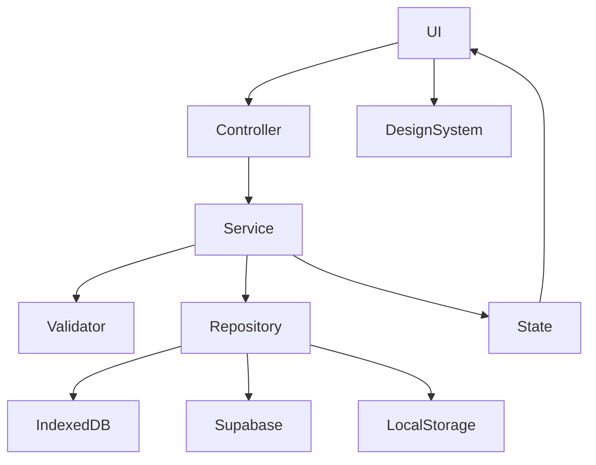

# Nexio Architecture Specification

Version: 1.0

Status: Official

---

# Purpose

This document defines the official software architecture of Nexio.

It establishes how the application is organized, how modules communicate, where new code should be placed, and which architectural decisions are mandatory.

This document is the technical foundation of the product.

All implementation decisions must comply with this specification.

---

# Architecture Goals

The architecture exists to achieve the following objectives:

- Scalability
- Maintainability
- Predictability
- Reusability
- Performance
- Testability
- Platform Independence

A feature is only considered successful if it improves the product without increasing architectural complexity.

---

# Architectural Philosophy

Nexio is not built around pages.

Nexio is built around features.

The interface is only a representation of business rules.

Business rules should remain independent from the user interface.

The UI may change.

The business logic should not.

---

# Architectural Principles

## Separation of Concerns

Each layer has a single responsibility.

UI renders information.

Services execute business operations.

Storage persists data.

Configuration centralizes application behavior.

Design System controls visual consistency.

No layer should perform responsibilities belonging to another.

---

## Feature-Oriented Architecture

Features should be organized by business domain.

Examples:

Transactions

Accounts

Goals

Reports

Categories

Settings

AI

Notifications

Each feature should be self-contained whenever possible.

---

## Composition over Inheritance

Prefer composing reusable modules instead of creating large inheritance hierarchies.

Small reusable units are easier to evolve.

---

## Low Coupling

Modules should know as little as possible about each other.

Dependencies should always be intentional.

---

## High Cohesion

Everything inside a module should contribute to the same purpose.

If a file contains unrelated responsibilities,

it should be split.

---

# Architectural Layers

Nexio is divided into six major layers.

```

```
Presentation Layer

↓

UI Layer

↓

Application Layer

↓

Business Layer

↓

Infrastructure Layer

↓

Persistence Layer
```

Each layer communicates only with adjacent layers.

Direct access across multiple layers is discouraged.

---

# Layer Responsibilities

## Presentation Layer

Responsible for:

HTML

Layouts

Responsive structure

Navigation

Accessibility

Visual rendering

Never:

Perform calculations

Access databases

Execute business rules

---

## UI Layer

Responsible for:

Components

Dialogs

Modals

Notifications

Animations

Loading states

Form behavior

Never:

Contain financial calculations.

---

## Application Layer

Coordinates user actions.

Examples:

Create transaction

Delete category

Import data

Export reports

Synchronize cloud

The Application Layer orchestrates.

It does not own business rules.

---

## Business Layer

This is the heart of Nexio.

Contains:

Financial calculations

Validation

Rules

Budgets

Goals

Statistics

Predictions

No UI code should exist here.

---

## Infrastructure Layer

Responsible for:

Supabase

API requests

Authentication

Notifications

Device integration

Capacitor

Browser APIs

---

## Persistence Layer

Responsible for:

Local Storage

IndexedDB

Offline cache

Cloud synchronization

Migration

Backups

No UI logic belongs here.

---

# Project Structure

The project structure must communicate the architecture.

A developer should understand where a file belongs without opening it.

Folders represent responsibilities.

Files represent implementations.

---

# Root Structure

```
/
├── android/
├── assets/
├── css/
├── docs/
├── js/
├── public/
├── sql/
├── tests/
├── index.html
└── package.json
```

Each top-level directory has a single responsibility.

---

# CSS Architecture

```
css/

base/
layout/
components/
utilities/
themes/
responsive/

desktop/
tablet/
mobile/

design-system/
```

## base/

Contains global styles.

Examples:

Typography

Reset

Body

HTML

Scrollbar

Selection

---

## layout/

Contains page layouts.

Grid

Sidebar

Header

Content

Footer

Containers

---

## components/

Contains reusable UI components.

Button

Card

Modal

Dialog

Toast

Input

Dropdown

Badge

Avatar

Progress

Tabs

Charts

---

## utilities/

Contains helper classes.

Spacing

Display

Flex

Grid

Visibility

Overflow

Text helpers

---

## themes/

Contains themes.

Light

Dark

Future themes

No component should hardcode colors.

---

## responsive/

Contains only responsive rules.

No visual styling belongs here.

---

# JavaScript Architecture

```
js/

core/

features/

services/

storage/

ui/

utils/

config/

vendor/
```

---

# core/

Contains the application engine.

Examples:

Application bootstrap

Router

Event Bus

Dependency Injection

Application lifecycle

Configuration loader

Theme manager

Language manager

Authentication manager

No business feature belongs here.

---

# features/

The most important folder.

Each business domain lives here.

```
features/

accounts/

transactions/

goals/

reports/

budgets/

categories/

dashboard/

settings/

assistant/
```

Each feature owns:

components/

services/

models/

controllers/

views/

validators/

constants/

Example:

```
transactions/

components/

TransactionCard.js

TransactionModal.js

TransactionList.js

services/

TransactionService.js

validators/

TransactionValidator.js

models/

Transaction.js

constants/

TransactionTypes.js
```

Everything related to transactions stays together.

---

# services/

Contains shared services.

Examples:

SupabaseService

ExportService

NotificationService

ImportService

AnalyticsService

CurrencyService

DateService

Shared services should not contain UI.

---

# storage/

Responsible for persistence.

IndexedDB

Local Storage

Cloud Sync

Migration

Backup

Offline Queue

No rendering code.

---

# ui/

Contains visual framework.

Dialogs

Animations

Loading

Transitions

Toast

Floating Panels

Context Menus

UI Helpers

The UI folder never performs calculations.

---

# utils/

Pure helper functions.

Examples:

Formatter

Parser

Math

Dates

Currency

Validation

Mask

UUID

No side effects.

---

# config/

Application configuration.

Environment

API Keys

Constants

Feature Flags

Permissions

Routes

Default Settings

---

# vendor/

Third-party libraries.

Never modify vendor code directly.

Wrap external libraries whenever possible.

---

# Dependency Rules

Allowed:

```
Feature

↓

Service

↓

Storage
```

Allowed:

```
Feature

↓

UI
```

Allowed:

```
UI

↓

Core
```

Forbidden:

```
Feature

↓

Another Feature
```

Instead:

```
Feature

↓

Shared Service

↓

Feature
```

Features communicate through services.

Never directly.

---

# File Naming Convention

Files must use PascalCase.

Examples:

TransactionCard.js

BudgetService.js

GoalsRepository.js

DashboardController.js

Avoid abbreviations.

Avoid generic names.

Bad:

helper.js

functions.js

new.js

temp.js

Good:

CurrencyFormatter.js

TransactionImporter.js

MonthlyBudgetCalculator.js

ExpenseChart.js

---

# Module Organization

Every module should expose only one public entry point.

Example:

```
transactions/

index.js
```

The application imports:

```
transactions
```

Not:

```
transactions/services/...
```

Internal implementation should remain private.

---

# Circular Dependencies

Circular dependencies are forbidden.

If two modules depend on each other,

extract the shared logic into a service.

Architecture should always resemble a tree,

never a web.

---

# Shared Code

Shared code belongs in:

services/

utils/

design-system/

Never duplicate business logic across features.

Reuse first.

Create second.

Copy never.

---

# Application Data Flow

The quality of an application is largely determined by how data flows through it.

A predictable data flow reduces bugs, simplifies debugging, improves performance and makes the system easier to evolve.

Every action inside Nexio follows the same lifecycle.

```
User Interaction
        │
        ▼
UI Component
        │
        ▼
Application Layer
        │
        ▼
Business Rules
        │
        ▼
Service Layer
        │
        ▼
Persistence
        │
        ▼
State Update
        │
        ▼
UI Refresh
```

This sequence should remain consistent across every feature.

---

# Golden Rule

Data always flows downward.

Commands flow downward.

Events flow upward.

Business rules never depend on the interface.

---

# Example Flow

Creating a transaction.

```
User clicks

↓

TransactionModal

↓

TransactionController

↓

TransactionService

↓

TransactionValidator

↓

Database

↓

Local Cache

↓

Application State

↓

Dashboard

↓

Charts

↓

Lists

↓

Statistics
```

Notice that every layer has a single responsibility.

---

# Event Flow

Nexio is event-driven.

Large components should communicate through events instead of directly manipulating each other.

Example:

```
TransactionCreated

↓

Dashboard Updated

↓

Budget Updated

↓

Monthly Statistics Updated

↓

Goals Updated

↓

AI Suggestions Updated
```

Instead of:

```
Transaction Component

↓

Dashboard

↓

Goals

↓

Budgets

↓

Reports

↓

Notifications

↓

Charts
```

The second example creates strong coupling.

The first creates scalability.

---

# Application Lifecycle

```
Application Starts

↓

Load Configuration

↓

Initialize Services

↓

Load Theme

↓

Load Language

↓

Initialize Authentication

↓

Initialize Local Storage

↓

Restore Session

↓

Synchronize Data

↓

Load Dashboard

↓

Application Ready
```

Every initialization step should be asynchronous whenever possible.

---

# Authentication Flow

```
Application

↓

Authentication Service

↓

Supabase

↓

Session Validation

↓

Permissions

↓

Load User

↓

Load Preferences

↓

Load Financial Data
```

Authentication should never be mixed with UI rendering.

---

# Data Synchronization

Nexio supports multiple persistence layers.

Priority order:

```
Memory

↓

IndexedDB

↓

LocalStorage

↓

Cloud
```

The fastest source always wins.

Cloud should never block the interface.

---

# Offline Strategy

The application must continue working without internet whenever possible.

```
User Action

↓

Local Storage

↓

Mark Pending

↓

Queue Synchronization

↓

Internet Available

↓

Automatic Upload

↓

Confirmation

↓

Queue Cleared
```

Offline mode is not an exception.

Offline is part of the architecture.

---

# Synchronization Pipeline

```
Cloud

↓

Download

↓

Validation

↓

Conflict Resolution

↓

Persistence

↓

Application State

↓

UI Refresh
```

Synchronization must never bypass validation.

---

# Conflict Resolution

When two devices modify the same resource.

Priority:

1. Manual merge when necessary.

2. Server timestamp.

3. User confirmation.

Silent data loss is forbidden.

---

# State Management

The application state represents the current truth.

There should be only one source of truth.

```
Application State

├── User

├── Accounts

├── Transactions

├── Goals

├── Categories

├── Reports

├── Settings

└── Notifications
```

Components never own business data.

They render state.

---

# State Update Cycle

```
User Action

↓

Controller

↓

Business Rule

↓

Repository

↓

State Update

↓

Reactive Rendering
```

Rendering is the consequence.

Never the trigger.

---

# UI Refresh Strategy

Only affected components should be updated.

Avoid:

```
Reload Entire Page
```

Prefer:

```
Update Single Widget

↓

Update List

↓

Update Card

↓

Update Chart
```

Incremental rendering provides better performance.

---

# Caching Strategy

Cache hierarchy:

```
Memory Cache

↓

IndexedDB

↓

Cloud
```

Frequently accessed information should remain in memory.

Large datasets belong in IndexedDB.

Cloud remains the authoritative source.

---

# API Communication

Every external communication passes through Services.

Never:

```
Component

↓

Supabase
```

Always:

```
Component

↓

Controller

↓

Service

↓

Repository

↓

Supabase
```

---

# Repository Pattern

Repositories isolate persistence.

Example:

```
TransactionRepository

save()

update()

delete()

find()

findByMonth()

findByCategory()
```

Business logic never knows whether data came from:

Supabase

IndexedDB

Mock

API

CSV

Future providers

---

# Error Flow

Errors travel upward.

```
Repository

↓

Service

↓

Controller

↓

UI

↓

Notification
```

Repositories never display messages.

Controllers never render dialogs.

Responsibilities remain isolated.

---

# Logging Strategy

Three levels.

```
Info

Warnings

Errors
```

Never log sensitive financial information.

Never log passwords.

Never log tokens.

Never log personal identifiers.

---

# Performance Pipeline

```
Lazy Load

↓

Incremental Rendering

↓

Virtual Lists

↓

Image Optimization

↓

Caching

↓

Background Synchronization
```

Performance is part of architecture.

Not an optimization phase.

---

# Dependency Graph



This dependency graph must never be inverted.

---

# Architecture Boundaries

Presentation Layer

may depend on

UI Layer

Application Layer

may depend on

Business Layer

Business Layer

may depend on

Services

Infrastructure

may depend on

Persistence

Persistence

depends on nothing.

---

# Scalability Strategy

Every new feature should require:

- zero changes to unrelated modules;

- minimal changes to shared services;

- no duplication of business logic;

- reuse of existing components;

- isolated testing.

If implementing a feature requires editing ten unrelated files, the architecture has failed.

---

# AI Implementation Rules

When generating code:

✔ Reuse existing services.

✔ Reuse repositories.

✔ Reuse validators.

✔ Reuse UI components.

✔ Reuse design tokens.

✔ Preserve dependency direction.

✔ Respect architectural boundaries.

Never generate shortcuts that violate these principles.

---

# Architecture Checklist

Before merging any feature:

□ Does it introduce unnecessary coupling?

□ Does it duplicate business logic?

□ Does it respect layer boundaries?

□ Does it use existing services?

□ Does it update only affected UI?

□ Does it preserve offline support?

□ Does it maintain accessibility?

□ Does it follow naming conventions?

□ Does it preserve performance?

□ Can another developer understand it in five minutes?

If any answer is "No", the implementation should be reviewed before acceptance.

---