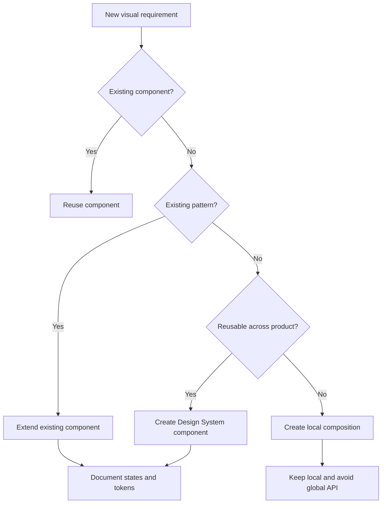
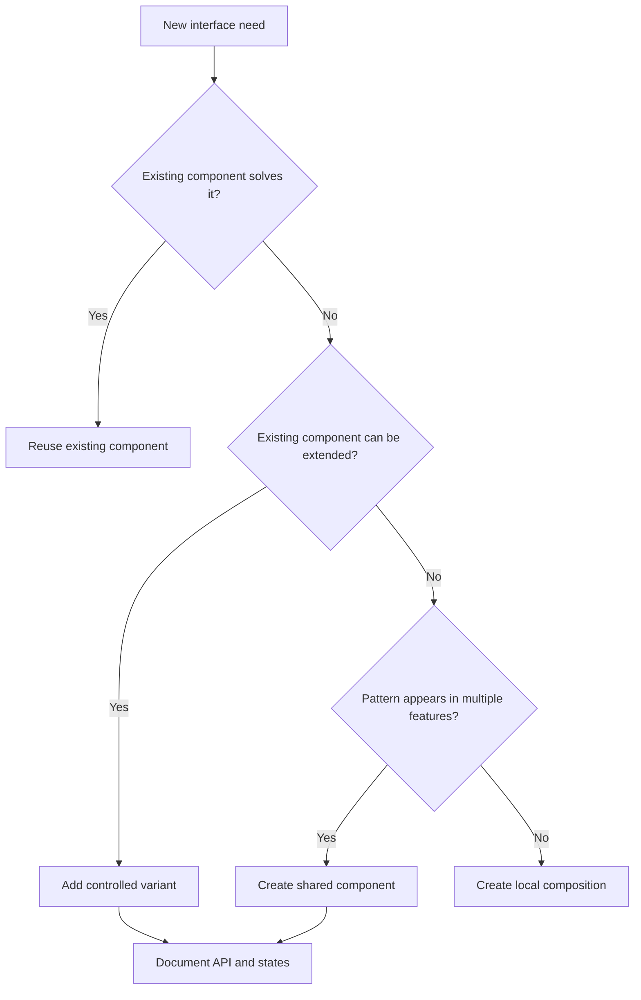
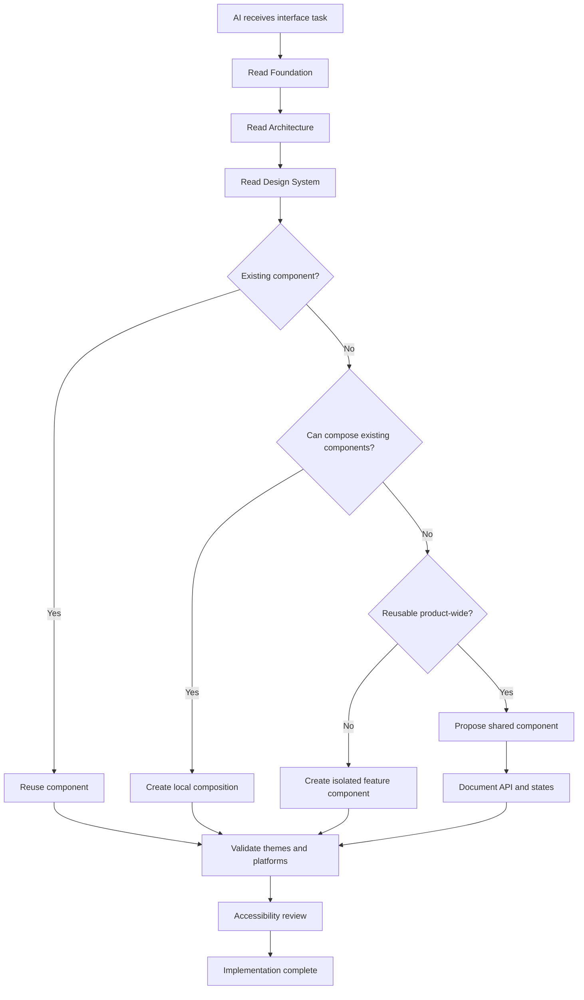

# Nexio Design System Specification

Version: 1.0  
Status: Official  
Authority Level: Product Standard  
Applies To: Web, Android, Desktop, Tablet and Mobile

---

# Purpose

This document defines the official Design System of Nexio.

It establishes the visual language, design tokens, component rules, responsive behavior, interaction states, accessibility requirements and implementation standards used throughout the product.

The Nexio Design System is not merely a collection of colors and components.

It is a shared language that connects:

- Product decisions
- User experience
- Visual design
- Front-end implementation
- Accessibility
- Platform adaptation
- AI-assisted development

Every interface created for Nexio must comply with this specification.

---

# Relationship with Other Documents

This document must be interpreted together with:

```text
docs/00-FOUNDATION.md
docs/01-ARCHITECTURE.md
docs/design-system/DESIGN-BIBLE.md
docs/design-system/COMPONENTS.md
docs/design-system/REDESIGN-AUDIT.md
docs/design-system/MIGRATION-PLAN.md
docs/design-system/tokens.css
```

The responsibilities are divided as follows:

| Document | Responsibility |
|---|---|
| `00-FOUNDATION.md` | Product philosophy and constitutional principles |
| `01-ARCHITECTURE.md` | Technical architecture and dependency rules |
| `02-DESIGN-SYSTEM.md` | Official visual and interaction standards |
| `DESIGN-BIBLE.md` | Detailed visual direction and brand expression |
| `COMPONENTS.md` | Individual component specifications |
| `REDESIGN-AUDIT.md` | Existing problems and design inconsistencies |
| `MIGRATION-PLAN.md` | Migration from legacy styling |
| `tokens.css` | Token reference and implementation support |

This document does not invalidate the existing Design System files.

It organizes them under a clear authority structure.

---

# Authority Hierarchy

When two sources disagree, use the following priority:

```text
00-FOUNDATION.md

↓

02-DESIGN-SYSTEM.md

↓

COMPONENTS.md

↓

DESIGN-BIBLE.md

↓

Design Tokens

↓

Component Implementation

↓

Legacy CSS
```

Legacy implementation must never silently override the official specification.

When the implementation and documentation diverge, one of the following actions is mandatory:

1. Correct the implementation.
2. Update the specification through a documented design decision.
3. Register the divergence as temporary design debt.
4. Add a migration task with an owner and expected resolution.

Ignoring inconsistencies is forbidden.

---

# Design System Goals

The Nexio Design System exists to provide:

- Visual consistency
- Faster implementation
- Predictable interactions
- Accessible experiences
- Responsive adaptation
- Reusable components
- Lower maintenance cost
- Reduced design debt
- Safer AI-generated code
- Stronger user confidence

A successful Design System allows new interfaces to feel native to Nexio without requiring every design decision to be reinvented.

---

# Design Philosophy

Nexio is a financial product.

Its visual design must communicate:

- Control
- Clarity
- Organization
- Confidence
- Modernity
- Security
- Calmness

The interface must help users understand their financial situation.

It must never compete with the information it presents.

Decoration is secondary.

Comprehension is primary.

---

# Core Design Principles

## Clarity Before Decoration

The user must understand the purpose of a screen before noticing its visual style.

Visual treatment must reinforce hierarchy.

It must not create noise.

Avoid:

- Decorative gradients without purpose
- Excessive glass effects
- Unnecessary shadows
- Multiple competing accent colors
- Animated backgrounds
- Visual elements that resemble controls but are not interactive

---

## Financial Information Is Primary

Balances, transactions, expenses, income, goals and alerts are the most important elements in the interface.

Financial values must have:

- Clear hierarchy
- Sufficient contrast
- Consistent formatting
- Predictable alignment
- Visible contextual labels

A financial value must never appear without enough context for the user to understand what it represents.

Bad:

```text
R$ 2.450,00
```

Better:

```text
Current balance
R$ 2.450,00
```

---

## Consistency Builds Trust

Equivalent actions must have equivalent visual treatment.

The same concept must not appear with different:

- Colors
- Icons
- Labels
- Sizes
- Spacing
- Interaction patterns

Examples:

- Every destructive action uses the same danger treatment.
- Every primary action uses the same button hierarchy.
- Every account balance follows the same formatting rules.
- Every modal follows the same structure.
- Every loading state follows the same feedback pattern.

---

## Simplicity Is a Feature

The interface should expose only what is necessary for the current decision.

Advanced options should use progressive disclosure.

Do not display all configuration options merely because they exist.

The Design System must reduce cognitive load.

---

## Accessibility Is Mandatory

Accessibility is not an optional enhancement.

Every component must support:

- Keyboard navigation
- Visible focus
- Screen readers
- Sufficient contrast
- Scalable text
- Reduced motion
- Touch interaction
- Light and dark themes

A visually attractive component that is inaccessible is considered incomplete.

---

## Platform Adaptation

The Design System is shared across platforms.

The layout is not.

The following must remain consistent:

- Brand identity
- Color meaning
- Typography hierarchy
- Component purpose
- Interaction terminology
- Financial formatting
- Validation behavior

The following may adapt:

- Navigation pattern
- Component dimensions
- Information density
- Position of actions
- Modal presentation
- Table behavior
- Number of visible columns
- Gesture support

Desktop, tablet and mobile must feel like the same product without being identical copies.

---

# Existing CSS Architecture

The current project already separates styling into specialized files:

```text
css/
├── variables.css
├── design-system.css
├── components.css
├── layout.css
├── animations.css
├── desktop.css
├── tablet.css
└── mobile.css
```

This separation must be preserved and clarified.

---

# CSS File Responsibilities

## `variables.css`

Contains primitive and semantic CSS custom properties.

Examples:

- Colors
- Font families
- Font sizes
- Spacing
- Borders
- Radius
- Shadows
- Z-index values
- Breakpoints
- Durations
- Easing functions

It must not contain component selectors.

Allowed:

```css
:root {
  --color-brand-primary: ...;
  --space-4: ...;
  --radius-md: ...;
}
```

Forbidden:

```css
.dashboard-card {
  padding: 20px;
}
```

---

## `design-system.css`

Contains shared foundations that apply the tokens.

Examples:

- CSS reset
- Typography foundations
- Default body behavior
- Theme foundations
- Focus treatment
- Selection behavior
- Global accessibility rules

It defines how the visual language behaves globally.

It must not contain complete page layouts.

---

## `components.css`

Contains reusable component styling.

Examples:

- Buttons
- Inputs
- Cards
- Badges
- Alerts
- Dialogs
- Toasts
- Tabs
- Progress indicators
- Dropdowns
- Tooltips
- Empty states

Component rules must use design tokens.

Forbidden:

```css
.button-primary {
  background: #7347ff;
  border-radius: 13px;
  padding: 11px 19px;
}
```

Required:

```css
.button-primary {
  background: var(--color-action-primary);
  border-radius: var(--radius-control);
  padding: var(--control-padding-y) var(--control-padding-x);
}
```

---

## `layout.css`

Contains structural styling.

Examples:

- Application shell
- Header
- Sidebar
- Main content
- Containers
- Grid systems
- Page sections
- Content regions

It must not redefine component appearance.

Layout controls position.

Components control appearance.

---

## `animations.css`

Contains shared motion definitions.

Examples:

- Keyframes
- Transition tokens
- Entrance and exit animations
- Loading motion
- Skeleton effects
- Reduced-motion overrides

Animations must not be duplicated in component files.

---

## `desktop.css`

Contains desktop-specific adaptations.

Examples:

- Expanded sidebar
- Multi-column layouts
- Dense tables
- Hover behavior
- Keyboard-first interaction
- Persistent secondary panels

It must not duplicate the entire base component definition.

---

## `tablet.css`

Contains tablet-specific adaptations.

Examples:

- Hybrid navigation
- Two-column layouts
- Touch-friendly controls
- Landscape adaptations
- Collapsible panels

Tablet must not be treated merely as a large mobile screen.

---

## `mobile.css`

Contains mobile-specific adaptations.

Examples:

- Bottom navigation
- Single-column layouts
- Full-screen dialogs
- Touch targets
- Safe-area handling
- Condensed information
- Gesture-friendly interactions

Mobile CSS must not repair poorly designed desktop structures.

The base structure must already support adaptation.

---

# Required CSS Loading Order

The official loading order is:

```html
<link rel="stylesheet" href="css/variables.css">
<link rel="stylesheet" href="css/design-system.css">
<link rel="stylesheet" href="css/layout.css">
<link rel="stylesheet" href="css/components.css">
<link rel="stylesheet" href="css/animations.css">
<link rel="stylesheet" href="css/desktop.css">
<link rel="stylesheet" href="css/tablet.css">
<link rel="stylesheet" href="css/mobile.css">
```

The exact responsive files loaded may depend on the implementation strategy.

The conceptual order must remain:

```text
Tokens

↓

Global foundations

↓

Layout

↓

Components

↓

Motion

↓

Platform adaptations
```

Platform-specific files must adapt existing styles.

They must not become independent Design Systems.

---

# Design Token Architecture

Nexio uses three token levels:

```text
Primitive Tokens

↓

Semantic Tokens

↓

Component Tokens
```

Each level has a distinct responsibility.

---

# Primitive Tokens

Primitive tokens contain raw values.

Examples:

```css
--purple-50
--purple-100
--purple-500
--neutral-0
--neutral-100
--neutral-900
--space-1
--space-2
--space-4
--font-size-sm
--radius-md
```

Primitive tokens should not normally be used directly inside components.

They form the raw palette.

---

# Semantic Tokens

Semantic tokens describe purpose.

Examples:

```css
--color-background-primary
--color-background-secondary
--color-surface-primary
--color-surface-elevated
--color-text-primary
--color-text-secondary
--color-border-default
--color-action-primary
--color-success
--color-warning
--color-danger
```

Components should primarily consume semantic tokens.

This makes theme changes possible without rewriting component styles.

---

# Component Tokens

Component tokens describe a specific reusable component decision.

Examples:

```css
--button-primary-background
--button-primary-text
--button-primary-hover
--input-border
--input-focus-ring
--card-padding
--card-radius
--modal-width
--sidebar-width
```

Component tokens should only be created when:

- The value is reused.
- The component requires controlled variation.
- A semantic token is not sufficiently specific.
- The token improves theme or platform adaptation.

Do not create a token for every CSS declaration.

---

# Token Naming Convention

Use the following structure:

```text
--category-purpose-state-variant
```

Examples:

```css
--color-text-primary
--color-text-disabled
--color-action-primary-hover
--color-border-danger
--space-content-section
--radius-control
--shadow-surface-elevated
--duration-transition-fast
--easing-standard
```

Names must describe intention.

Avoid names based only on appearance.

Bad:

```css
--dark-gray
--light-purple
--big-padding
--round-border
```

Good:

```css
--color-text-secondary
--color-action-primary
--space-page-section
--radius-dialog
```

---

# Token Usage Rules

## Rule 1: No Unexplained Hardcoded Values

Hardcoded values are allowed only when:

- The value is mathematically required.
- The value is unique and intentionally local.
- Creating a reusable token would provide no benefit.
- A comment explains the reason when the value is unusual.

Hardcoded colors in product components are forbidden.

---

## Rule 2: Use the Nearest Valid Token

Do not create a new token when an existing token already expresses the intended purpose.

Before adding a token:

1. Search existing tokens.
2. Check semantic equivalence.
3. Check light and dark theme behavior.
4. Check platform usage.
5. Confirm that the new token is reusable.

---

## Rule 3: Tokens Must Support Themes

A semantic color token must define behavior for:

- Light theme
- Dark theme
- High-contrast adaptations when required

A token that works only in one theme is incomplete.

---

## Rule 4: Tokens Must Not Encode Business Meaning Incorrectly

Visual status tokens and financial business meaning must remain distinguishable.

For example:

- `success` means a successful state or positive confirmation.
- `income` means money entering an account.
- `danger` means an error or destructive action.
- `expense` means money leaving an account.

Income must not automatically use the success token.

Expense must not automatically use the danger token.

Spending money is not necessarily an error.

---

# Design System Decision Flow



The default decision is reuse.

Creation is the final option.

---

# Non-Negotiable Rules

The following actions are forbidden:

- Creating a new primary color for a single screen.
- Copying component CSS into platform files.
- Using different spacing scales in different features.
- Using arbitrary border radii.
- Creating undocumented button variants.
- Removing focus outlines without replacement.
- Using color as the only status indicator.
- Designing desktop screens and merely shrinking them for mobile.
- Introducing a new icon style without Design System approval.
- Creating duplicate tokens with different names.
- Applying theme fixes directly inside unrelated components.
- Using excessive `!important`.
- Solving cascade problems by increasing selector specificity indefinitely.

---

# Definition of Design System Compliance

An interface is compliant when:

- It uses official tokens.
- It uses approved component patterns.
- It supports light and dark themes.
- It supports keyboard and touch interaction.
- It preserves responsive behavior.
- It communicates states without relying only on color.
- It contains no unnecessary duplicated CSS.
- It follows the documented hierarchy.
- It behaves consistently with equivalent interfaces.
- Its component states are complete.

A screen that looks correct but violates these rules is not compliant.

---

# Color System

Color in Nexio exists to communicate hierarchy, meaning and interaction.

Color must never be used only for decoration.

Every color used in the product must belong to one of the following groups:

```text
Brand Colors

Neutral Colors

Surface Colors

Text Colors

Border Colors

Action Colors

Status Colors

Financial Colors

Chart Colors
```

Each group has a defined responsibility.

---

# Canonical Color Source

The canonical implementation values must be maintained in:

```text
docs/design-system/tokens.css
css/variables.css
```

This document defines meaning and usage.

The token files define the actual CSS values.

When changing a color:

1. Update the canonical token.
2. Validate light theme.
3. Validate dark theme.
4. Validate contrast.
5. Validate charts and financial states.
6. Validate Android WebView rendering.
7. Validate affected components.
8. Record breaking visual changes when necessary.

Directly changing colors inside a component is forbidden.

---

# Brand Colors

Brand colors represent Nexio's identity.

They may be used for:

- Primary actions
- Selected navigation
- Active controls
- Focus emphasis
- Brand illustrations
- Progress indicators
- Important interactive highlights

They must not dominate the interface.

Financial information should remain visually clearer than brand decoration.

Recommended token structure:

```css
--color-brand-50
--color-brand-100
--color-brand-200
--color-brand-300
--color-brand-400
--color-brand-500
--color-brand-600
--color-brand-700
--color-brand-800
--color-brand-900
```

Semantic aliases should consume this scale:

```css
--color-action-primary
--color-action-primary-hover
--color-action-primary-active
--color-action-primary-disabled
--color-focus-ring
--color-navigation-selected
```

Components should use semantic aliases instead of raw brand scale tokens.

---

# Neutral Colors

Neutral colors form the structural foundation of the interface.

They are used for:

- Backgrounds
- Surfaces
- Text
- Borders
- Disabled elements
- Dividers
- Subtle controls
- Skeleton loading states

Neutral colors should provide enough variation to create hierarchy without requiring excessive borders or shadows.

Recommended scale:

```css
--neutral-0
--neutral-50
--neutral-100
--neutral-200
--neutral-300
--neutral-400
--neutral-500
--neutral-600
--neutral-700
--neutral-800
--neutral-900
--neutral-950
```

The scale must remain perceptually balanced.

Adjacent values must be visually distinguishable.

---

# Semantic Surface Hierarchy

Nexio uses surface hierarchy to organize content.

```text
Application Background

↓

Primary Surface

↓

Secondary Surface

↓

Elevated Surface

↓

Overlay Surface
```

Recommended tokens:

```css
--color-background-primary
--color-background-secondary
--color-surface-primary
--color-surface-secondary
--color-surface-muted
--color-surface-elevated
--color-surface-overlay
--color-surface-selected
--color-surface-disabled
```

## Application Background

Used behind the application shell.

It should visually separate the page from cards and panels.

## Primary Surface

Used for main cards, content regions and persistent panels.

## Secondary Surface

Used for nested regions, grouped filters and supporting content.

## Elevated Surface

Used for menus, floating panels, tooltips and dialogs.

## Overlay Surface

Used with modal backdrops and temporary layers.

The visual difference between surfaces must remain visible in both themes.

---

# Text Color Hierarchy

Text tokens describe importance.

```css
--color-text-primary
--color-text-secondary
--color-text-tertiary
--color-text-disabled
--color-text-inverse
--color-text-link
--color-text-danger
--color-text-success
--color-text-warning
```

## Primary Text

Used for:

- Titles
- Financial values
- Main labels
- User-entered content
- Important information

## Secondary Text

Used for:

- Supporting descriptions
- Metadata
- Secondary labels
- Dates
- Contextual information

## Tertiary Text

Used only for low-priority supporting content.

It must still meet accessibility requirements where the information is necessary.

## Disabled Text

Used only when an element is genuinely unavailable.

Do not use disabled styling to hide low-priority content.

---

# Border System

Borders communicate separation, state and focus.

Recommended tokens:

```css
--color-border-subtle
--color-border-default
--color-border-strong
--color-border-interactive
--color-border-focus
--color-border-danger
--color-border-success
--color-border-warning
--color-border-disabled
```

Borders should be subtle by default.

Strong borders should be reserved for:

- Focus
- Selection
- Validation
- High-priority separation
- Interactive emphasis

Avoid placing borders around every element.

Use spacing and surface hierarchy before adding borders.

---

# Action Colors

Interactive colors represent user actions.

```css
--color-action-primary
--color-action-primary-hover
--color-action-primary-active
--color-action-primary-disabled

--color-action-secondary
--color-action-secondary-hover
--color-action-secondary-active

--color-action-neutral
--color-action-neutral-hover

--color-action-danger
--color-action-danger-hover
--color-action-danger-active
```

Every action color requires complete states.

A color without hover, active, focus and disabled behavior is incomplete.

Touch devices may not expose hover.

The component must remain understandable without it.

---

# Status Colors

Status colors communicate system conditions.

```css
--color-status-success
--color-status-success-surface
--color-status-success-border

--color-status-warning
--color-status-warning-surface
--color-status-warning-border

--color-status-danger
--color-status-danger-surface
--color-status-danger-border

--color-status-info
--color-status-info-surface
--color-status-info-border
```

Status colors must always be accompanied by at least one additional signal:

- Icon
- Label
- Message
- Shape
- Position

Color must never be the only indicator.

---

# Financial Color Semantics

Financial meaning is different from interface status.

Nexio must distinguish:

```text
Income

Expense

Transfer

Investment

Debt

Refund

Pending Transaction

Overdue Transaction
```

Recommended tokens:

```css
--color-financial-income
--color-financial-income-surface

--color-financial-expense
--color-financial-expense-surface

--color-financial-transfer
--color-financial-transfer-surface

--color-financial-investment
--color-financial-investment-surface

--color-financial-debt
--color-financial-debt-surface

--color-financial-refund
--color-financial-refund-surface

--color-financial-pending
--color-financial-overdue
```

## Income

Income represents incoming money.

It may use a positive financial color.

It does not automatically mean that an operation succeeded.

## Expense

Expense represents outgoing money.

It must not automatically use the destructive action color.

A normal purchase is not a system error.

## Transfer

Transfers must remain visually neutral because they move money between accounts without necessarily changing total net worth.

## Debt

Debt may use stronger emphasis when necessary, but must not be styled identically to a validation error.

## Pending

Pending transactions must communicate uncertainty without appearing as disabled content.

## Overdue

Overdue financial obligations may use warning or danger emphasis depending on severity.

---

# Color Usage Example

Bad:

```css
.transaction.expense {
  color: var(--color-danger);
}
```

Better:

```css
.transaction.expense {
  color: var(--color-financial-expense);
}
```

Bad:

```css
.transaction.income {
  color: var(--color-success);
}
```

Better:

```css
.transaction.income {
  color: var(--color-financial-income);
}
```

---

# Chart Color System

Charts require a dedicated palette.

Chart colors must:

- Remain distinguishable in light and dark themes.
- Avoid relying on red versus green alone.
- Remain distinguishable for common forms of color vision deficiency.
- Preserve sufficient contrast against chart backgrounds.
- Use consistent category-to-color mapping.
- Support labels and patterns where necessary.

Recommended tokens:

```css
--color-chart-1
--color-chart-2
--color-chart-3
--color-chart-4
--color-chart-5
--color-chart-6
--color-chart-7
--color-chart-8
```

Charts should not randomly assign colors on every render.

A category should keep the same color whenever possible.

Example:

```text
Housing → Chart Color 1

Food → Chart Color 2

Transport → Chart Color 3

Health → Chart Color 4
```

If there are more categories than available colors, use:

- Repeated colors with different patterns.
- Labels.
- Direct annotations.
- Grouping into “Other”.

Never depend only on a legend when direct labeling is possible.

---

# Theme Architecture

Nexio officially supports:

```text
Light Theme

Dark Theme

System Theme
```

Future support may include:

```text
High Contrast Theme

Custom Accessibility Theme
```

Theme behavior is controlled by semantic tokens.

Components must not contain independent theme logic unless strictly necessary.

---

# Theme Selection

The application must support the following user preference values:

```text
light
dark
system
```

When `system` is selected, Nexio follows the operating system preference.

The selected preference must persist across sessions.

The application should apply the theme before rendering the main interface to avoid a flash of the incorrect theme.

---

# Theme Application Strategy

Recommended HTML structure:

```html
<html data-theme="light">
```

or:

```html
<html data-theme="dark">
```

Example:

```css
:root,
[data-theme="light"] {
  --color-background-primary: ...;
  --color-surface-primary: ...;
  --color-text-primary: ...;
}

[data-theme="dark"] {
  --color-background-primary: ...;
  --color-surface-primary: ...;
  --color-text-primary: ...;
}
```

Component selectors must consume the same semantic tokens in both themes.

---

# Light Theme Principles

The light theme should feel:

- Clear
- Open
- Calm
- Structured
- Professional

Avoid pure white across every surface.

Multiple neutral surface levels should create hierarchy.

Large pure-white regions can create visual fatigue.

The application background and card surfaces should remain distinguishable.

---

# Dark Theme Principles

The dark theme should feel:

- Comfortable
- Focused
- Modern
- Calm
- Legible

Dark theme is not created by inverting the light theme.

Avoid:

- Pure black across the entire application.
- Extremely bright text.
- Highly saturated accent colors.
- Excessive glowing effects.
- Low-contrast borders.
- Shadows that are invisible or unnaturally strong.

Elevated surfaces should generally become lighter than the base dark background.

---

# Dark Theme Color Adjustment

Colors often need reduced saturation and adjusted luminance in dark mode.

Example concept:

```text
Light Theme Brand Action:
Stronger saturation on light surface

Dark Theme Brand Action:
Controlled saturation with sufficient contrast
```

Do not reuse every light-theme color value unchanged in dark mode.

---

# Theme Validation Checklist

Every screen must be reviewed for:

```text
□ Background hierarchy

□ Text contrast

□ Border visibility

□ Button states

□ Input states

□ Icons

□ Charts

□ Modal overlays

□ Focus indicators

□ Disabled elements

□ Success, warning and danger states

□ Financial colors

□ Images and logos

□ Android status-bar integration
```

---

# Contrast Requirements

Text and interactive controls must follow WCAG contrast requirements.

Minimum targets:

| Content | Minimum Contrast |
|---|---:|
| Normal text | 4.5:1 |
| Large text | 3:1 |
| Interactive component boundaries | 3:1 |
| Focus indicators | 3:1 |
| Essential icons | 3:1 |

A stronger contrast target should be preferred for financial values and critical information.

Do not assume a color pair is accessible because it appears visually attractive.

Contrast must be measured.

---

# Typography System

Typography creates hierarchy, rhythm and readability.

The typography system must support:

- Financial values
- Interface labels
- Titles
- Body text
- Tables
- Forms
- Charts
- Long-form explanations
- Multiple languages
- Scalable text

Typography must remain consistent across platforms.

---

# Font Family

The official font family must be defined through tokens:

```css
--font-family-sans
--font-family-mono
```

The primary font should:

- Render clearly on Android.
- Support Portuguese characters.
- Support future localization.
- Contain multiple useful weights.
- Render financial numbers consistently.
- Load efficiently.
- Provide reliable fallback fonts.

Recommended fallback structure:

```css
--font-family-sans:
  "Official Nexio Font",
  Inter,
  system-ui,
  -apple-system,
  BlinkMacSystemFont,
  "Segoe UI",
  sans-serif;
```

The exact official font must remain centralized in the token file.

---

# Numeric Typography

Financial interfaces require special attention to numbers.

Financial values should use tabular numerals when supported:

```css
font-variant-numeric: tabular-nums;
```

Tabular numerals improve alignment in:

- Tables
- Transaction lists
- Account balances
- Reports
- Comparisons
- Charts
- Statements

Large balances may also use:

```css
font-variant-numeric: tabular-nums lining-nums;
```

---

# Font Weight Scale

Recommended weights:

```css
--font-weight-regular: 400;
--font-weight-medium: 500;
--font-weight-semibold: 600;
--font-weight-bold: 700;
```

Avoid using too many weights.

Weight must reinforce hierarchy, not replace it.

Do not use bold text for every important element.

Spacing, size and position should also establish importance.

---

# Type Scale

Recommended semantic typography tokens:

```css
--font-size-display
--font-size-heading-1
--font-size-heading-2
--font-size-heading-3
--font-size-heading-4
--font-size-body-lg
--font-size-body-md
--font-size-body-sm
--font-size-label
--font-size-caption
--font-size-financial-lg
--font-size-financial-md
--font-size-financial-sm
```

Each token must include a corresponding line-height token.

Example:

```css
--line-height-heading-1
--line-height-body-md
--line-height-caption
```

---

# Typography Hierarchy

## Display

Used rarely.

Examples:

- Onboarding statement
- Major financial summary
- Marketing presentation

Display text must not be used for routine page titles.

## Heading 1

Used for the primary title of a screen.

Only one primary heading should normally exist per screen.

## Heading 2

Used for major sections.

## Heading 3

Used for subsections, cards and panels.

## Body

Used for descriptions, content and supporting information.

## Label

Used for form fields, controls and compact UI elements.

## Caption

Used for metadata and low-priority supporting information.

Captions must remain readable.

---

# Financial Typography

Financial values require dedicated hierarchy.

Example:

```text
Label
Current balance

Primary financial value
R$ 12.450,80

Supporting variation
+8.4% this month
```

The currency symbol may have slightly lower emphasis than the amount, but it must remain clearly associated.

Do not break a value across lines unless the layout leaves no alternative.

Negative amounts must include an explicit minus sign.

Example:

```text
−R$ 250,00
```

Positive signs may be used only when the context benefits from comparison.

Example:

```text
+R$ 1.200,00
```

---

# Currency Formatting

Brazilian Portuguese formatting:

```text
R$ 1.234,56
```

Rules:

- Currency symbol before the value.
- Space between symbol and amount.
- Period as thousands separator.
- Comma as decimal separator.
- Always show two decimal digits when presenting exact monetary values.
- Use compact notation only in charts or restricted spaces.
- Never remove decimals from values where precision is relevant.

Compact example:

```text
R$ 12,4 mil
```

Compact values must provide the exact value through tooltip, detail view or accessible label.

---

# Date and Time Formatting

The interface must use consistent locale-aware formatting.

Recommended Portuguese formats:

```text
22/07/2026

22 jul. 2026

22 de julho de 2026

14:30
```

Avoid ambiguous formats such as:

```text
07/08/26
```

Use shorter formats only where context is clear.

---

# Line Length

Long-form text should normally remain between:

```text
45 and 80 characters per line
```

Extremely wide text blocks reduce readability.

Dashboard cards and settings descriptions should use controlled maximum widths.

---

# Text Truncation

Truncation is allowed only when:

- Space is constrained.
- The full value is available elsewhere.
- A tooltip or detail view is accessible.
- The truncated information is not essential to immediate understanding.

Never truncate financial values.

Avoid truncating primary titles.

---

# Spacing System

Nexio uses a consistent spacing scale.

Spacing creates hierarchy and rhythm.

Recommended base scale:

```css
--space-0: 0;
--space-1: 0.25rem;
--space-2: 0.5rem;
--space-3: 0.75rem;
--space-4: 1rem;
--space-5: 1.25rem;
--space-6: 1.5rem;
--space-8: 2rem;
--space-10: 2.5rem;
--space-12: 3rem;
--space-16: 4rem;
--space-20: 5rem;
--space-24: 6rem;
```

The exact implementation may use equivalent values already established in `tokens.css`.

Do not create arbitrary spacing values without justification.

---

# Semantic Spacing Tokens

Primitive spacing values may be mapped to semantic tokens:

```css
--space-control-inline
--space-control-block
--space-card
--space-card-compact
--space-dialog
--space-page-inline
--space-page-block
--space-section
--space-content-group
--space-list-item
```

Semantic spacing tokens allow platform adaptation.

Example:

```css
:root {
  --space-page-inline: var(--space-6);
}

@media (min-width: 1200px) {
  :root {
    --space-page-inline: var(--space-10);
  }
}
```

---

# Spacing Principles

## Related Elements Stay Close

A label and its value should remain visually grouped.

## Different Sections Need Stronger Separation

Spacing between major sections should be greater than spacing inside a component.

## Alignment Creates Structure

Elements belonging to the same hierarchy should share alignment.

## More Space Does Not Always Mean More Clarity

Excessive empty space can reduce information efficiency, especially on desktop.

---

# Layout Density

Nexio supports three conceptual density levels:

```text
Comfortable

Standard

Compact
```

## Comfortable

Recommended for:

- Mobile
- Touch-first screens
- Onboarding
- Simplified dashboards

## Standard

Recommended for:

- General use
- Tablet
- Most desktop screens

## Compact

Recommended for:

- Desktop transaction tables
- Data-heavy reports
- Administrative workflows

Compact mode must never reduce touch targets below accessibility requirements when touch interaction is expected.

---

# Border Radius System

Border radius must communicate component type and hierarchy.

Recommended tokens:

```css
--radius-none
--radius-sm
--radius-md
--radius-lg
--radius-xl
--radius-full
--radius-control
--radius-card
--radius-dialog
--radius-pill
```

Use cases:

| Token | Typical Use |
|---|---|
| `radius-sm` | Small tags and nested controls |
| `radius-control` | Inputs and buttons |
| `radius-card` | Cards and panels |
| `radius-dialog` | Dialogs and sheets |
| `radius-full` | Avatars, icon buttons and pills |

Do not assign arbitrary radius values to individual screens.

Too many radius values make the product feel inconsistent.

---

# Shadow System

Shadows communicate elevation.

They should be subtle.

Recommended tokens:

```css
--shadow-none
--shadow-sm
--shadow-md
--shadow-lg
--shadow-overlay
--shadow-focus
```

Use shadows for:

- Floating menus
- Dialogs
- Elevated cards
- Dragged elements
- Temporary overlays

Do not use shadows on every card.

Surface color, spacing and borders should provide most hierarchy.

---

# Elevation Levels

```text
Level 0 — Base content

Level 1 — Cards and persistent panels

Level 2 — Sticky regions and dropdowns

Level 3 — Dialogs and floating panels

Level 4 — Critical overlays
```

Higher elevation should correspond to stronger visual separation and higher z-index.

Elevation must not be used merely to make a component look more prominent.

---

# Icon System

Nexio must use one primary icon family.

Icons must share:

- Stroke style
- Stroke width
- Corner treatment
- Visual weight
- Bounding-box behavior
- Alignment

Mixing filled, outlined and hand-drawn icon styles without purpose is forbidden.

---

# Icon Sizes

Recommended tokens:

```css
--icon-size-xs
--icon-size-sm
--icon-size-md
--icon-size-lg
--icon-size-xl
```

Typical usage:

| Size | Usage |
|---|---|
| XS | Inline metadata |
| SM | Compact controls |
| MD | Standard buttons and navigation |
| LG | Empty states and feature headers |
| XL | Illustrative usage |

Icons should not be manually resized independently in each feature.

---

# Icon Meaning

The same action must always use the same icon.

Examples:

```text
Add → Plus

Edit → Pencil

Delete → Trash

Search → Magnifying glass

Settings → Gear

Close → X

Back → Left arrow

Forward → Right arrow

Expand → Chevron down

Collapse → Chevron up
```

Do not use icons with ambiguous meaning without text labels.

---

# Icon-Only Controls

An icon-only button must include:

- Accessible name
- Visible hover or pressed state
- Visible focus
- Tooltip on pointer devices when useful
- Minimum touch target
- Predictable icon meaning

Example:

```html
<button aria-label="Delete transaction">
  <!-- trash icon -->
</button>
```

---

# Illustration Usage

Illustrations may be used for:

- Onboarding
- Empty states
- Education
- Success moments
- Feature introduction

Illustrations must not:

- Hide essential information.
- Delay actions.
- Consume excessive vertical space on mobile.
- Introduce a conflicting visual style.
- Appear on every routine screen.

---

# Visual Hierarchy for Financial Screens

Financial screens should generally follow:

```text
Screen Title

↓

Primary Financial Summary

↓

Important Alert or Insight

↓

Primary Actions

↓

Detailed Data

↓

Secondary Information
```

Not every screen requires every level.

The hierarchy should match the user's decision.

---

# Dashboard Hierarchy

Recommended dashboard priority:

```text
1. Current financial position

2. Relevant change or trend

3. Immediate actions

4. Upcoming obligations

5. Recent transactions

6. Categories and reports

7. Secondary insights
```

The dashboard must not display every available metric with equal weight.

---

# Transaction Hierarchy

A transaction item should prioritize:

```text
1. Description

2. Amount

3. Category or account

4. Date

5. Status

6. Secondary metadata
```

Amount alignment should remain consistent across the list.

Income, expense and transfer semantics must remain visible without depending only on color.

---

# Goal Hierarchy

A goal component should prioritize:

```text
1. Goal name

2. Current progress

3. Target value

4. Remaining amount

5. Expected completion

6. Contribution action
```

Progress must include both visual and textual information.

Example:

```text
R$ 4.000 of R$ 10.000
40% completed
```

---

# Design Review Questions

Before approving a visual implementation, verify:

```text
Does the most important information receive the strongest hierarchy?

Are financial values immediately understandable?

Does the interface remain clear without color?

Does the component work in light and dark themes?

Are typography and spacing tokens used?

Are surfaces distinguishable?

Are actions visually consistent?

Are icons understandable?

Are charts accessible?

Does the mobile version preserve the same meaning?

Does the interface feel calm rather than crowded?
```

---

# Visual Anti-Patterns

The following patterns are prohibited:

## Excessive Dashboard Cards

Do not convert every metric into an independent card.

Group related information.

## Rainbow Interface

Do not use a different accent color for every section.

## Arbitrary Gradients

Gradients require a specific documented purpose.

## Invisible Secondary Text

Secondary content must remain readable.

## Decorative Financial Colors

Income and expense colors must preserve semantic meaning.

## Excessive Rounded Containers

Not every group needs a visible rounded box.

## Multiple Icon Families

Use one primary system.

## Weak Dark Theme

Dark theme must be designed and tested independently.

## Oversized Mobile Headers

Mobile headers must preserve content space.

## Desktop Empty Space Without Purpose

Large screens should use space intelligently, not merely enlarge mobile layouts.

---

# Acceptance Criteria — Visual Foundations

The visual foundation is accepted only when:

```text
□ All colors use official tokens.

□ Light and dark themes are complete.

□ Contrast requirements are met.

□ Financial colors are distinct from status colors.

□ Typography follows the official scale.

□ Monetary values use consistent formatting.

□ Spacing follows the official scale.

□ Border radius follows the official scale.

□ Shadows correspond to elevation.

□ One consistent icon family is used.

□ Charts remain understandable without color alone.

□ Desktop, tablet and mobile preserve semantic consistency.

□ No feature introduces an undocumented visual primitive.
```

---

# Component System

Components are the reusable building blocks of Nexio.

A component is not only a visual element.

It includes:

- Structure
- Appearance
- Behavior
- Accessibility
- States
- Responsive adaptation
- Theme behavior
- Interaction feedback
- Error handling

A component is considered complete only when all required states and interaction modes are defined.

---

# Component Classification

Nexio components are divided into five levels:

```text
Foundations

↓

Primitives

↓

Components

↓

Patterns

↓

Feature Compositions
```

---

## Foundations

Foundations include:

- Colors
- Typography
- Spacing
- Radius
- Shadows
- Motion
- Icons
- Breakpoints

Foundations are not rendered independently.

---

## Primitives

Primitives are low-level interface elements.

Examples:

- Text
- Icon
- Divider
- Surface
- Stack
- Grid
- Spacer

Primitives should remain simple and broadly reusable.

---

## Components

Components solve a specific interface need.

Examples:

- Button
- Input
- Select
- Checkbox
- Card
- Badge
- Alert
- Modal
- Tabs
- Tooltip

---

## Patterns

Patterns combine multiple components to solve a recurring workflow.

Examples:

- Transaction item
- Financial summary
- Search and filter bar
- Empty state
- Form section
- Confirmation flow
- Account selector

---

## Feature Compositions

Feature compositions belong to a business domain.

Examples:

- Transaction creation form
- Monthly budget card
- Goal progress panel
- Dashboard summary
- Financial report filter

Feature compositions may use Design System components but should not become global components automatically.

---

# Component Decision Rule

Before creating a new component:



The default action is reuse.

A new component must solve a recurring problem.

---

# Required Component States

Every interactive component must evaluate the following states:

```text
Default

Hover

Focus Visible

Active or Pressed

Selected

Disabled

Loading

Error

Success

Read Only
```

Not every component uses every state.

The relevant states must be explicitly defined.

---

# Interaction Priority

When multiple states occur simultaneously, use this priority:

```text
Disabled

↓

Loading

↓

Error

↓

Focus Visible

↓

Active

↓

Selected

↓

Hover

↓

Default
```

Example:

A disabled button must not display hover styling.

A loading button must prevent duplicate submission.

An input with an error must preserve a visible focus indicator.

---

# Button Component

Buttons trigger actions.

They must use clear labels and predictable visual hierarchy.

Official variants:

```text
Primary

Secondary

Tertiary

Danger

Ghost

Icon
```

---

## Primary Button

Used for the main action in the current context.

Examples:

- Save transaction
- Create account
- Confirm contribution
- Continue
- Sign in

A screen or dialog should normally have only one primary action.

---

## Secondary Button

Used for important supporting actions.

Examples:

- Cancel
- Export
- Preview
- Add later

Secondary buttons must not visually compete with the primary action.

---

## Tertiary Button

Used for lower-emphasis actions.

Examples:

- View details
- Learn more
- Change
- Clear filters

Tertiary buttons may use text-only treatment when appropriate.

---

## Danger Button

Used only for destructive or irreversible actions.

Examples:

- Delete account
- Remove transaction
- Delete all data
- Permanently close account

A danger button must not be used for normal expense-related actions.

---

## Ghost Button

Used when the action must remain available without adding visual weight.

Examples:

- Toolbar actions
- Compact card actions
- Navigation controls

Ghost buttons still require hover, focus and pressed states.

---

## Icon Button

Used for compact, familiar actions.

Examples:

- Close
- Search
- Edit
- Delete
- Open menu
- Navigate back

Icon buttons require an accessible name.

---

# Button Sizes

Official sizes:

```text
Small

Medium

Large
```

Recommended use:

| Size | Usage |
|---|---|
| Small | Dense desktop interfaces and compact controls |
| Medium | Standard product interface |
| Large | Mobile primary actions and onboarding |

Buttons must preserve a minimum accessible touch target.

The visible button may be smaller than the touch target only when the interactive area remains sufficiently large.

---

# Button Structure

Recommended structure:

```html
<button class="button button--primary">
  <span class="button__icon" aria-hidden="true"></span>
  <span class="button__label">Save transaction</span>
</button>
```

Loading example:

```html
<button
  class="button button--primary"
  aria-busy="true"
  disabled
>
  <span class="spinner" aria-hidden="true"></span>
  <span class="button__label">Saving</span>
</button>
```

---

# Button Rules

Buttons must:

- Use verbs when triggering actions.
- Clearly describe the result.
- Preserve label width during loading when possible.
- Prevent repeated submission.
- Display visible focus.
- Support keyboard activation.
- Remain understandable without icons.

Avoid vague labels:

```text
OK

Yes

Submit

Do it
```

Prefer:

```text
Save transaction

Delete account

Confirm transfer

Export report
```

---

# Button Anti-Patterns

Forbidden:

- Multiple primary buttons in the same action group.
- Icon-only buttons with ambiguous meaning.
- Destructive actions styled as primary brand actions.
- Disabling a button without explaining why.
- Changing the label unexpectedly on hover.
- Using links as buttons without semantic necessity.
- Using buttons for navigation when a link is appropriate.

---

# Text Input Component

Inputs collect user information.

Input structure must include:

```text
Label

Optional indicator

Input control

Supporting text

Validation message
```

---

## Input Anatomy

```html
<div class="field">
  <label class="field__label" for="description">
    Description
  </label>

  <input
    id="description"
    class="input"
    type="text"
    aria-describedby="description-help"
  >

  <p id="description-help" class="field__help">
    Use a name that helps identify this transaction.
  </p>
</div>
```

---

# Input Types

Official input patterns include:

- Text
- Email
- Password
- Search
- Currency
- Number
- Percentage
- Date
- Time
- Phone
- Multiline text

Each type must use the correct semantic HTML input type when available.

---

# Currency Input

Currency fields require special behavior.

They must:

- Accept numeric input.
- Display locale-aware formatting.
- Preserve decimal precision.
- Support keyboard editing.
- Avoid unexpected cursor movement.
- Provide an accessible numeric value.
- Validate maximum and minimum values.
- Prevent invalid characters.

Displayed value:

```text
R$ 1.250,00
```

Stored value:

```text
1250.00
```

The formatted string must not be used as the canonical numeric value.

---

# Number Input

Avoid native browser number controls when they create inconsistent behavior or poor mobile usability.

Use a numeric keyboard hint where appropriate:

```html
<input inputmode="decimal">
```

Never rely only on client-side formatting for numeric validation.

---

# Input States

Required states:

```text
Default

Hover

Focus

Filled

Disabled

Read Only

Error

Success
```

Error states require:

- Visible border or surface change.
- Error icon when useful.
- Text explanation.
- `aria-invalid="true"`.
- Association with the error message.

Example:

```html
<input
  id="amount"
  aria-invalid="true"
  aria-describedby="amount-error"
>

<p id="amount-error" role="alert">
  Enter an amount greater than zero.
</p>
```

---

# Placeholder Rules

Placeholder text must never replace a label.

Bad:

```html
<input placeholder="Amount">
```

Better:

```html
<label for="amount">Amount</label>
<input id="amount" placeholder="R$ 0,00">
```

Placeholder text should provide an example, not essential instructions.

---

# Select Component

Select controls allow one choice from a known set.

Use native select when:

- The option list is simple.
- Search is unnecessary.
- Native platform behavior is beneficial.
- Mobile usability is improved.

Use a custom select or combobox when:

- Search is necessary.
- Options contain icons or metadata.
- The list is large.
- Multi-selection is required.

Custom comboboxes must follow accessible keyboard behavior.

---

# Combobox Keyboard Behavior

Required interactions:

```text
Enter or Space → Open

Arrow Down → Next option

Arrow Up → Previous option

Enter → Select

Escape → Close

Home → First option

End → Last option
```

Typing may filter options when search is supported.

---

# Checkbox Component

Checkboxes represent independent boolean choices.

Examples:

- Include transfers
- Receive notifications
- Remember preference

Checkboxes must not be used for immediate commands.

A checkbox changes a state.

A button performs an action.

---

# Radio Component

Radio buttons represent one choice from a small set.

Examples:

```text
Monthly

Weekly

Yearly
```

Use radio buttons when all options should remain visible.

Use a select when space is constrained or the list is long.

---

# Switch Component

Switches represent immediate on or off settings.

Examples:

- Dark mode
- Notifications
- Biometric access

The label must describe the setting, not the action.

Good:

```text
Transaction notifications
```

Bad:

```text
Enable
```

Switches should apply changes immediately unless doing so would be destructive.

---

# Date Picker

Date selection must adapt to the platform.

Desktop may use a popover calendar.

Mobile may use:

- Native date picker
- Bottom sheet
- Full-screen picker

The field must remain keyboard-accessible and manually editable when appropriate.

Dates must be stored in an unambiguous format.

Recommended storage:

```text
YYYY-MM-DD
```

Presentation must follow locale formatting.

---

# Search Component

Search must provide immediate clarity.

Recommended structure:

```text
Search icon

Input

Clear action

Optional filter action
```

Search should support:

- Keyboard focus
- Clear button
- Loading feedback
- Empty result state
- Error state
- Result count when useful

Search queries should be debounced when remote or expensive operations are involved.

---

# Card Component

Cards group related information.

A card must represent a meaningful content unit.

Official variants:

```text
Standard

Interactive

Summary

Stat

Alert

Selectable

Elevated
```

---

## Standard Card

Used for grouped content with no independent interaction.

## Interactive Card

Acts as a navigation or selection target.

It must have:

- Hover or pressed state.
- Focus state.
- Clear click target.
- Semantic link or button behavior.

## Summary Card

Displays a concise financial summary.

Examples:

- Current balance
- Monthly expenses
- Goal progress

## Stat Card

Displays one metric and supporting context.

Stat cards should not overwhelm the dashboard.

## Alert Card

Displays important financial or system information.

It must use status semantics.

## Selectable Card

Represents one option in a selection group.

It must communicate selected state without relying only on color.

---

# Card Anatomy

A card may include:

```text
Header

Title

Supporting label

Primary value

Body

Actions

Footer
```

Not every card requires every section.

Avoid placing unrelated actions inside the same card.

---

# Card Rules

Cards must:

- Use official surface tokens.
- Preserve consistent padding.
- Use consistent radius.
- Avoid unnecessary shadows.
- Maintain clear content hierarchy.
- Adapt to narrow screens.
- Avoid nested card structures where possible.

Nested rounded containers create visual noise.

Use spacing, dividers or surface variation instead.

---

# Financial Summary Component

Financial summaries are high-priority components.

Recommended anatomy:

```text
Context label

Primary amount

Change indicator

Time period

Optional supporting action
```

Example:

```text
Available balance

R$ 8.450,20

+R$ 620,00 this month
```

Rules:

- The amount must use tabular numerals.
- The context label must remain visible.
- Positive and negative changes require text or symbols.
- Hidden balances must preserve layout.
- Exact values must be available to assistive technology.

---

# Transaction Item Component

A transaction item represents a financial event.

Recommended structure:

```text
Category icon

Description

Category or account

Date or status

Amount

Optional actions
```

Desktop example:

```text
[Icon] Supermarket          Food             21 Jul. 2026       −R$ 185,40
```

Mobile example:

```text
[Icon] Supermarket                          −R$ 185,40
       Food · 21 Jul. 2026
```

---

# Transaction Item States

Transaction items may be:

```text
Normal

Selected

Pending

Overdue

Reconciled

Failed

Archived
```

A transaction status must never be communicated only through reduced opacity.

---

# Lists

Lists display repeated related items.

Every list must define:

- Item structure
- Item spacing
- Dividers or separation
- Empty state
- Loading state
- Error state
- Pagination or virtualization
- Selection behavior
- Keyboard behavior when interactive

Long lists should use incremental loading or virtualization.

---

# Table Component

Tables are used for structured comparison.

Recommended primarily for desktop and large tablet layouts.

Tables require:

- Column headers
- Row labels where necessary
- Consistent alignment
- Sorting behavior
- Filtering
- Empty state
- Loading state
- Responsive fallback
- Keyboard accessibility

---

# Table Alignment

Recommended alignment:

| Content | Alignment |
|---|---|
| Text | Left |
| Dates | Left or centered consistently |
| Currency | Right |
| Percentages | Right |
| Actions | Right |
| Status | Left or centered consistently |

Financial values should use tabular numerals.

---

# Responsive Table Strategy

Horizontal scrolling should not be the default mobile solution.

Preferred mobile adaptations:

```text
Table

↓

Card list

or

Priority columns

or

Expandable rows
```

The mobile version must preserve essential information.

Do not simply hide columns without evaluating their importance.

---

# Badge Component

Badges communicate compact metadata.

Examples:

- Pending
- Paid
- Overdue
- New
- Recurring
- Imported

Badge variants:

```text
Neutral

Info

Success

Warning

Danger

Financial
```

Badges must not become the only way to communicate critical status.

---

# Alert Component

Alerts communicate important information inside the content flow.

Official variants:

```text
Information

Success

Warning

Danger
```

An alert may contain:

- Icon
- Title
- Message
- Primary action
- Secondary action
- Dismiss control

Alerts should remain visible until the user understands or resolves the condition.

---

# Toast Component

Toasts provide temporary feedback.

Appropriate use:

- Transaction saved
- Item copied
- Settings updated
- Export started
- Connection restored

Inappropriate use:

- Complex errors
- Required user decisions
- Destructive confirmations
- Long instructions
- Critical financial warnings

Critical information must not disappear automatically.

---

# Toast Duration

Recommended behavior:

| Type | Duration |
|---|---:|
| Success | 3–5 seconds |
| Information | 4–6 seconds |
| Warning | Persistent or 6–10 seconds |
| Error | Persistent until dismissed when action is required |

Users must have enough time to read the message.

---

# Modal Dialog

Dialogs interrupt the current workflow.

Use them only when immediate attention is necessary.

Appropriate use:

- Confirm destructive action
- Complete a focused form
- Review a critical change
- Resolve a conflict

Inappropriate use:

- Routine navigation
- Long reports
- Multi-step complex workflows
- Content that deserves a full screen

---

# Dialog Anatomy

```text
Backdrop

Dialog container

Header

Title

Optional description

Close control

Body

Action footer
```

The title must clearly describe the task.

---

# Dialog Behavior

Dialogs must:

- Move focus inside when opened.
- Trap focus while active.
- Return focus to the trigger when closed.
- Close with Escape when safe.
- Prevent background interaction.
- Provide an accessible title.
- Support scrolling within the body.
- Preserve visible actions.

Destructive confirmation dialogs must explicitly name the affected object.

Bad:

```text
Delete this item?
```

Better:

```text
Delete “July electricity bill”?
```

---

# Dialog Action Order

Recommended order in left-to-right interfaces:

```text
Secondary action

Primary action
```

For destructive dialogs:

```text
Cancel

Delete
```

The destructive action must not receive accidental emphasis through placement alone.

---

# Bottom Sheet

Bottom sheets are mobile-first temporary surfaces.

Use them for:

- Quick actions
- Compact selectors
- Filters
- Context menus
- Short forms
- Confirmation choices

Bottom sheets must support:

- Safe-area spacing
- Drag indicator when draggable
- Accessible close behavior
- Keyboard-safe layout
- Scrollable content
- Stable action region

A long or complex workflow should become a full-screen view.

---

# Popover

Popovers display contextual temporary content.

Examples:

- Date picker
- Account selector
- Quick filter
- Compact menu

Popovers must remain anchored to their trigger and reposition when near viewport edges.

---

# Dropdown Menu

Menus contain commands.

Menu items should use verbs.

Examples:

```text
Edit transaction

Duplicate transaction

Move to account

Delete transaction
```

Menus must support keyboard navigation.

Dangerous actions should be visually separated.

---

# Tooltip

Tooltips provide short clarification.

They must not contain essential instructions.

Tooltips should appear through:

- Hover
- Keyboard focus
- Long press only when an accessible alternative exists

Tooltip text must be concise.

---

# Tabs

Tabs switch between related content views.

Use tabs when:

- Content belongs to the same context.
- Switching should not navigate away.
- The number of options is limited.

Tabs must support:

```text
Arrow navigation

Home

End

Visible selected state

Visible focus state
```

Do not use tabs for unrelated destinations.

---

# Navigation Components

Official navigation patterns may include:

```text
Desktop Sidebar

Tablet Navigation Rail

Mobile Bottom Navigation

Top Application Bar

Breadcrumbs

Contextual Tabs
```

Platform-specific navigation is defined in dedicated experience documents.

The Design System defines shared visual and interaction behavior.

---

# Sidebar

Desktop sidebars may contain:

- Brand
- Primary navigation
- Secondary navigation
- Account controls
- Collapse control

The selected destination must be clearly visible.

Collapsed sidebars must provide labels through accessible names and tooltips.

---

# Bottom Navigation

Mobile bottom navigation should contain a limited number of high-priority destinations.

Recommended maximum:

```text
3 to 5 destinations
```

Each destination requires:

- Icon
- Label
- Selected state
- Accessible name
- Touch target
- Safe-area support

A central action button must not obscure navigation or content.

---

# Breadcrumbs

Breadcrumbs are useful for hierarchical desktop navigation.

They should not replace the page title.

Mobile may hide or simplify breadcrumbs when hierarchy is shallow.

---

# Progress Indicator

Progress indicators communicate completion or loading.

Types:

```text
Linear determinate

Linear indeterminate

Circular determinate

Circular indeterminate

Step progress
```

Determinate progress must include a numeric or textual value when useful.

Example:

```text
40% completed
```

---

# Skeleton Loading

Skeletons represent the structure of content while loading.

Skeletons must:

- Resemble the final layout.
- Avoid excessive animation.
- Preserve page stability.
- Use reduced motion settings.
- Disappear when content or an error state is ready.

Skeletons should not remain visible indefinitely.

---

# Spinner

Spinners are appropriate for short, localized operations.

Examples:

- Saving a form
- Refreshing one card
- Loading a menu

Avoid full-screen spinners when the application can render cached or partial content.

---

# Empty State

Empty states must explain:

```text
What is empty

Why it may be empty

What the user can do next
```

Recommended anatomy:

```text
Optional illustration or icon

Title

Description

Primary action

Optional secondary action
```

Example:

```text
No transactions yet

Add your first transaction to start tracking your monthly balance.

[Add transaction]
```

---

# Empty State Types

```text
First Use

No Search Results

No Filter Results

No Permission

No Connection

No Available Data
```

Each type requires different language and actions.

A “no search results” state must not encourage creating new content unless that action is relevant.

---

# Error State

Error states must explain:

- What happened.
- What the user can do.
- Whether data is safe.
- Whether retry is possible.

Avoid technical messages:

```text
HTTP 500

JSON parse error

Supabase request failed
```

Prefer:

```text
We could not load your transactions.

Your saved data is safe. Check your connection and try again.
```

---

# Offline State

Offline feedback should be calm and informative.

Recommended message:

```text
You are offline

Changes will be saved on this device and synchronized when the connection returns.
```

Do not block normal offline-capable actions.

---

# Confirmation Pattern

Confirmations are required when an action:

- Permanently deletes data.
- Cannot be undone.
- Affects multiple financial records.
- Changes security settings.
- Disconnects an integration.
- Removes an account with dependent information.

Prefer undo for reversible actions.

Example:

```text
Transaction deleted

[Undo]
```

---

# Undo Pattern

Undo should:

- Appear immediately after the action.
- Remain available for a reasonable period.
- Restore the exact prior state.
- Avoid requiring page refresh.
- Announce the restoration to assistive technology.

---

# Component Responsive Behavior

Every component specification must define:

```text
Desktop behavior

Tablet behavior

Mobile behavior

Minimum width

Maximum width

Content wrapping

Touch behavior

Keyboard behavior
```

Responsive behavior must not be added as an afterthought.

---

# Component Accessibility Contract

Every reusable component must document:

- Semantic HTML role
- Accessible name
- Keyboard behavior
- Focus behavior
- Screen-reader behavior
- Error announcement
- Disabled behavior
- Reduced-motion behavior
- Minimum touch target
- Contrast requirements

A component without an accessibility contract is incomplete.

---

# Component API Principles

Component APIs must be:

- Small
- Predictable
- Typed when the architecture supports it
- Documented
- Stable
- Based on purpose

Bad API:

```javascript
createButton({
  purple: true,
  round: true,
  shadow: 3,
  big: true
});
```

Better API:

```javascript
createButton({
  variant: "primary",
  size: "large",
  loading: false
});
```

Purpose-based APIs prevent visual inconsistency.

---

# Component Naming

Use names based on responsibility.

Good:

```text
Button

CurrencyInput

TransactionItem

FinancialSummary

AccountSelector

EmptyState

ConfirmationDialog
```

Avoid:

```text
PurpleButton

BigCard

NiceInput

Box2

NewModal
```

---

# Component Documentation Template

Every shared component should document:

```markdown
# Component Name

## Purpose

## When to Use

## When Not to Use

## Anatomy

## Variants

## Sizes

## States

## Behavior

## Responsive Rules

## Accessibility

## Tokens

## Examples

## Anti-Patterns

## Acceptance Criteria
```

---

# Component Quality Checklist

Before accepting a component:

```text
□ Does it solve a reusable problem?

□ Does an existing component already solve it?

□ Are all relevant states defined?

□ Does it support keyboard navigation?

□ Does it support screen readers?

□ Does it support light and dark themes?

□ Does it use official tokens?

□ Does it work on mobile, tablet and desktop?

□ Are loading and error states defined?

□ Is the API purpose-based?

□ Is it documented?

□ Does it avoid duplicated CSS?

□ Does it remain understandable without color?

□ Does it preserve minimum touch targets?
```

---

# Component Anti-Patterns

Forbidden:

- Creating screen-specific button systems.
- Reimplementing dialogs inside each feature.
- Copying input validation styles.
- Mixing navigation and business logic.
- Using generic clickable containers without semantics.
- Styling disabled states only with opacity.
- Hiding focus indicators.
- Building custom controls when native controls are sufficient.
- Creating mobile-only components with incompatible desktop semantics.
- Using visual props instead of semantic variants.
- Creating undocumented global CSS selectors.
- Adding component variants for a single isolated request.
- Allowing feature CSS to override internal component structure.

---

# Acceptance Criteria — Component System

The component system is accepted only when:

```text
□ Shared components have documented purposes.

□ Component APIs use semantic variants.

□ Required states are implemented.

□ Interactive elements use correct HTML semantics.

□ Keyboard and screen-reader behavior is verified.

□ Light and dark themes are supported.

□ Components use official design tokens.

□ Responsive behavior is documented.

□ Financial components preserve exact values and context.

□ Dialogs manage focus correctly.

□ Lists and tables define empty, loading and error states.

□ Destructive actions use confirmation or undo.

□ No feature maintains an independent duplicate component library.
```

---

# Responsive Design System

Responsive design in Nexio is not the process of shrinking desktop layouts.

It is the process of preserving the same product meaning while adapting:

- Information density
- Navigation
- Interaction method
- Content priority
- Component dimensions
- Screen composition
- Input behavior
- Available space

Desktop, tablet and mobile share the same Design System.

They do not share the same layout.

---

# Responsive Principles

## Meaning Must Remain Consistent

A component may change its visual structure across platforms.

Its meaning and business behavior must remain consistent.

Example:

```text
Desktop transaction table

↓

Tablet condensed list

↓

Mobile transaction card
```

All three represent the same transaction data.

They may not calculate, format or interpret that data differently.

---

## Content Priority Before Layout

When space becomes limited, determine:

1. What the user must understand immediately.
2. What action must remain visible.
3. What information can move to a detail view.
4. What information can use progressive disclosure.
5. What information can be temporarily hidden.

Do not hide content based only on implementation convenience.

---

## Responsive Adaptation Order

When adapting an interface, use this priority:

```text
Reflow

↓

Resize

↓

Wrap

↓

Reorder

↓

Collapse

↓

Move to secondary view

↓

Hide as final option
```

Hiding information is the final strategy.

---

# Breakpoint Philosophy

Breakpoints must respond to layout needs.

They should not be based only on popular device models.

Official conceptual ranges:

```text
Small Mobile

Mobile

Large Mobile

Tablet Portrait

Tablet Landscape

Desktop

Large Desktop
```

Recommended technical references:

```css
--breakpoint-mobile-sm: 360px;
--breakpoint-mobile: 480px;
--breakpoint-tablet: 768px;
--breakpoint-tablet-lg: 1024px;
--breakpoint-desktop: 1200px;
--breakpoint-desktop-lg: 1440px;
```

These values are implementation references.

A component may require a local container-based breakpoint when its behavior depends on its available width rather than the entire viewport.

---

# Container Queries

Container queries should be preferred for reusable components when supported by the target environment.

Example:

```css
.financial-summary-container {
  container-type: inline-size;
}

@container (min-width: 32rem) {
  .financial-summary {
    grid-template-columns: 1fr auto;
  }
}
```

This allows the component to adapt correctly inside:

- Dashboard columns
- Side panels
- Dialogs
- Full-width pages
- Tablet layouts

Avoid making every component dependent on global viewport breakpoints.

---

# Desktop Experience

Desktop prioritizes:

- Productivity
- Information density
- Comparison
- Keyboard interaction
- Multi-column layouts
- Persistent navigation
- Visible filters
- Data tables
- Parallel information

Desktop should use the available space intelligently.

It must not simply enlarge mobile cards.

---

# Desktop Layout Principles

Desktop interfaces may use:

```text
Persistent sidebar

Top application bar

Multi-column dashboard

Dense transaction table

Secondary detail panel

Persistent filters

Contextual toolbars
```

Maximum content width may be applied to prevent excessively stretched layouts.

Data-heavy screens may use wider controlled containers.

---

# Tablet Experience

Tablet is a hybrid environment.

It may be used with:

- Touch
- Keyboard
- Mouse
- Stylus
- Portrait orientation
- Landscape orientation

Tablet layouts must adapt to orientation and input method.

Tablet should not be treated as:

```text
Large mobile
```

or:

```text
Small desktop
```

It requires intentional composition.

---

# Tablet Layout Principles

Tablet may use:

```text
Navigation rail

Collapsible sidebar

Two-column content

Master-detail views

Touch-friendly tables

Responsive panels

Adaptive dialogs
```

Landscape orientation may expose more context.

Portrait orientation should prioritize touch and vertical flow.

---

# Mobile Experience

Mobile prioritizes:

- Fast understanding
- Immediate actions
- Touch interaction
- One-handed use
- Reduced cognitive load
- Short workflows
- Clear hierarchy
- Offline resilience

Mobile screens should generally have one primary objective.

---

# Mobile Layout Principles

Mobile interfaces should prefer:

```text
Single-column content

Bottom navigation

Sticky primary actions

Full-screen workflows

Bottom sheets

Progressive disclosure

Compact summaries

Expandable detail sections
```

Avoid:

- Dense tables
- Multiple side-by-side cards
- Tiny controls
- Hover-dependent behavior
- Excessive nested scrolling
- Desktop-style sidebars

---

# Responsive Navigation

Recommended platform adaptation:

| Platform | Primary Navigation |
|---|---|
| Desktop | Persistent sidebar |
| Tablet landscape | Navigation rail or collapsible sidebar |
| Tablet portrait | Navigation rail or compact top navigation |
| Mobile | Bottom navigation and top app bar |

The destination names and information architecture must remain consistent.

Changing platform must not change the user's mental model.

---

# Responsive Component Transformation

Components may transform according to available space.

Examples:

| Wide Layout | Narrow Layout |
|---|---|
| Table | Structured card list |
| Modal | Full-screen dialog |
| Popover | Bottom sheet |
| Sidebar filter | Filter drawer |
| Horizontal action group | Stacked actions |
| Multi-column form | Single-column form |
| Visible metadata | Expandable details |
| Hover tooltip | Accessible information action |

Transformation must preserve functionality.

---

# Responsive Forms

Desktop forms may use multiple columns only when fields have a clear relationship.

Example:

```text
Date | Time
```

or:

```text
City | State
```

Mobile forms should normally use one column.

Do not place unrelated inputs side by side merely to reduce vertical space.

---

# Responsive Financial Values

Financial values must remain readable at every width.

Rules:

- Never truncate monetary values.
- Do not reduce font size below readable thresholds.
- Allow supporting labels to wrap first.
- Use compact notation only when exact values remain accessible.
- Preserve currency and minus signs.
- Prevent amount and currency from separating across lines.

Example:

```css
.financial-value {
  white-space: nowrap;
  font-variant-numeric: tabular-nums;
}
```

---

# Responsive Charts

Charts must adapt in more ways than resizing.

Possible adaptations:

```text
Desktop:
Full labels, comparison controls and detailed legend

Tablet:
Reduced labels and simplified controls

Mobile:
Focused chart, direct summary and scrollable time range
```

Mobile charts must not become unreadable miniatures.

When necessary, show:

- A smaller time range.
- Fewer categories.
- Direct annotations.
- A summary before the chart.
- A detailed accessible table in a secondary view.

---

# Safe Areas

Mobile layouts must support device safe areas.

Recommended variables:

```css
padding-top: env(safe-area-inset-top);
padding-right: env(safe-area-inset-right);
padding-bottom: env(safe-area-inset-bottom);
padding-left: env(safe-area-inset-left);
```

Safe-area handling is mandatory for:

- Top bars
- Bottom navigation
- Bottom sheets
- Full-screen dialogs
- Fixed action areas
- Android and future iOS wrappers

Interactive controls must not be obscured by system UI.

---

# Virtual Keyboard Behavior

Mobile forms must remain usable when the virtual keyboard is open.

Requirements:

- Focused fields remain visible.
- Primary actions are not permanently hidden.
- Dialogs adjust their height.
- Bottom sheets support keyboard-safe scrolling.
- Page content does not become trapped.
- Scroll position remains predictable.

Avoid fixed-height forms that fail when the keyboard appears.

---

# Touch Target Requirements

Interactive touch targets should normally be at least:

```text
44 × 44 CSS pixels
```

Smaller visible icons may use larger invisible hit areas.

Spacing between adjacent touch targets must reduce accidental activation.

Critical destructive actions must not be placed immediately beside frequent actions without sufficient separation.

---

# Pointer and Hover Adaptation

Hover may enhance the experience.

It must never be required to understand or use a feature.

Use pointer capability queries when necessary:

```css
@media (hover: hover) and (pointer: fine) {
  .interactive-card:hover {
    /* enhancement */
  }
}
```

Do not apply hover-dependent motion indiscriminately to touch devices.

---

# Orientation Changes

Interfaces must remain stable when device orientation changes.

Requirements:

- No data loss.
- No workflow reset.
- No modal dismissal without user action.
- No duplication of actions.
- No broken scroll position where preservation is possible.
- No unusable compressed layout.

Tablet landscape and portrait layouts must be tested independently.

---

# Motion System

Motion communicates:

- Cause and effect
- Spatial relationship
- State transition
- Progress
- Feedback
- Hierarchy

Motion must not exist only to decorate the interface.

---

# Motion Principles

## Motion Explains Change

Animations should help the user understand:

```text
What changed

Where an element came from

Where it went

What action succeeded

What requires attention
```

## Motion Must Be Fast

Routine interactions should feel immediate.

Animation must not delay task completion.

## Motion Must Be Consistent

Equivalent transitions must use equivalent duration and easing.

## Motion Must Be Optional

Users who prefer reduced motion must receive a complete experience without unnecessary animation.

---

# Motion Tokens

Recommended duration tokens:

```css
--duration-instant: 0ms;
--duration-fast: 120ms;
--duration-standard: 200ms;
--duration-moderate: 300ms;
--duration-slow: 450ms;
```

Recommended easing tokens:

```css
--easing-standard
--easing-enter
--easing-exit
--easing-emphasized
```

Example:

```css
:root {
  --easing-standard: cubic-bezier(0.2, 0, 0, 1);
  --easing-enter: cubic-bezier(0, 0, 0.2, 1);
  --easing-exit: cubic-bezier(0.4, 0, 1, 1);
}
```

Exact values must remain centralized.

---

# Motion Duration Guidance

| Interaction | Recommended Duration |
|---|---:|
| Button feedback | 80–150 ms |
| Hover transition | 120–180 ms |
| Menu or popover | 150–220 ms |
| Dialog entrance | 200–300 ms |
| Bottom sheet | 250–350 ms |
| Page transition | 200–350 ms |
| Success emphasis | 300–500 ms |

Animations longer than 500 ms require strong justification in routine product flows.

---

# Entrance and Exit Motion

Entrance animation may use:

- Opacity
- Small translation
- Scale with restraint

Exit animation should normally be slightly faster than entrance animation.

Avoid:

- Large bouncing effects
- Rotating routine content
- Excessive spring motion
- Long blur transitions
- Continuous floating elements
- Simultaneous animation of many dashboard cards

---

# Layout Stability

Animation must not cause unexpected layout shifts.

Prefer transform and opacity when appropriate.

Avoid animating expensive properties repeatedly:

- Width
- Height
- Top
- Left
- Large box shadows
- Filters
- Full-screen blur

Performance must remain stable on mid-range Android devices.

---

# Reduced Motion

Nexio must respect:

```css
@media (prefers-reduced-motion: reduce)
```

Recommended behavior:

```css
@media (prefers-reduced-motion: reduce) {
  *,
  *::before,
  *::after {
    animation-duration: 1ms !important;
    animation-iteration-count: 1 !important;
    scroll-behavior: auto !important;
    transition-duration: 1ms !important;
  }
}
```

The final implementation may use more targeted rules.

Reduced motion must not remove:

- Loading feedback
- State communication
- Progress information
- Focus indicators
- Success or error messages

It removes unnecessary movement, not meaning.

---

# Loading Motion

Loading indicators should match the scale of the operation.

```text
Button action → Button spinner

Card refresh → Card skeleton or localized indicator

Page data → Structural skeleton

Background synchronization → Small non-blocking status
```

Do not block the full application for a localized request.

---

# Accessibility System

Accessibility is an architectural requirement.

Nexio targets conformance with:

```text
WCAG 2.2 Level AA
```

Where practical, critical financial workflows should exceed minimum requirements.

---

# Semantic HTML

Use native semantic elements whenever possible.

Preferred:

```html
<button>
<nav>
<main>
<header>
<section>
<form>
<label>
<table>
```

Avoid replacing semantics with generic containers:

```html
<div onclick="...">
```

Native semantics provide:

- Keyboard behavior
- Screen-reader meaning
- Focus behavior
- Platform consistency
- Lower implementation complexity

---

# Landmark Structure

Each primary application view should include appropriate landmarks.

Recommended structure:

```html
<header></header>

<nav aria-label="Primary navigation"></nav>

<main id="main-content"></main>

<aside aria-label="Contextual information"></aside>
```

There should normally be one primary `<main>` landmark.

---

# Heading Structure

Headings must form a logical hierarchy.

Example:

```text
H1 — Transactions

H2 — July 2026

H3 — Pending transactions
```

Do not select heading levels based on font size.

Visual style and semantic level are separate decisions.

---

# Keyboard Navigation

All functionality must be available without a mouse.

Required support includes:

- Logical tab order
- Visible focus
- Enter and Space activation
- Escape dismissal where appropriate
- Arrow navigation for composite controls
- Focus restoration
- No keyboard traps
- Skip navigation where useful

---

# Focus Management

Focus must move intentionally.

Examples:

```text
Opening a dialog
→ Focus enters the dialog.

Closing a dialog
→ Focus returns to the trigger.

Deleting a list item
→ Focus moves to the next logical item.

Submitting an invalid form
→ Focus moves to the first invalid field or error summary.

Navigating to a new screen
→ Focus moves to the screen heading or main content.
```

Focus must not disappear after UI updates.

---

# Focus Indicator

The visible focus indicator must:

- Have sufficient contrast.
- Remain visible in both themes.
- Not rely only on a color change.
- Follow the shape of the control.
- Remain visible over different surfaces.
- Not be removed for aesthetic reasons.

Recommended token:

```css
--shadow-focus
```

---

# Screen-Reader Announcements

Dynamic changes may require live announcements.

Appropriate examples:

- Transaction saved
- Validation failed
- Synchronization completed
- Connection lost
- Filters updated
- Search result count changed
- Item deleted and undo available

Use:

```html
aria-live="polite"
```

for non-critical updates.

Use assertive announcements only for urgent information.

Avoid announcing every minor visual change.

---

# Accessible Financial Values

Screen readers must receive complete and unambiguous values.

A visual compact value such as:

```text
R$ 12,4 mil
```

should expose an accessible label similar to:

```text
12,400 Brazilian reais
```

Negative values must be clearly announced as negative.

Do not depend on red or green color to indicate direction.

Use visible and accessible text such as:

```text
Income

Expense

Increase

Decrease
```

---

# Accessible Charts

Every chart must provide an accessible alternative.

Possible alternatives:

- Data table
- Text summary
- Structured list
- Downloadable report
- Detailed description

Canvas or SVG charts must not be the sole representation of financial information.

Recommended summary:

```text
Expenses increased by 12% compared with June.

Housing was the largest category at R$ 1,850.00.
```

---

# Form Accessibility

Forms must provide:

- Persistent labels
- Clear instructions
- Grouped related fields
- Accessible validation
- Error summary when appropriate
- Required-field indication
- Correct autocomplete attributes
- Appropriate input modes
- Predictable submission behavior

Required fields must not be indicated only with color.

---

# Error Summary

Long forms should provide an error summary.

Example:

```html
<div role="alert" tabindex="-1">
  <h2>Review the following information</h2>

  <ul>
    <li>
      <a href="#amount">Enter a valid amount.</a>
    </li>
  </ul>
</div>
```

The summary should receive focus after failed submission when it improves navigation.

---

# Touch Accessibility

Touch accessibility includes:

- Sufficient hit areas
- Adequate spacing
- No gesture-only action
- Alternative to swipe
- Clear pressed feedback
- No time-sensitive interaction without extension
- Controls outside unsafe screen regions

A swipe-to-delete interaction must also provide a visible delete action.

---

# Text Scaling

The interface must remain usable when text size increases.

Requirements:

- Text must not overlap.
- Controls must expand.
- Important information must not disappear.
- Horizontal scrolling must not become required for normal content.
- Fixed-height text containers must be avoided.
- Financial values must remain understandable.

---

# Zoom Support

Web interfaces must not disable user zoom.

Forbidden:

```html
<meta
  name="viewport"
  content="user-scalable=no"
>
```

Zoom restriction is not an acceptable solution to layout problems.

---

# High Contrast and Forced Colors

Components should remain understandable in forced-color environments.

Use semantic borders, focus indicators and native controls where possible.

Do not rely on background images or shadows as the only boundary of a control.

---

# Localization Readiness

The Design System must support future localization.

Layouts must tolerate:

- Longer labels
- Different currency formats
- Different date formats
- Different pluralization rules
- Right-to-left adaptation when introduced
- Larger text
- Different decimal separators

Avoid fixed-width text controls based only on Portuguese labels.

---

# Content Language

Interface text must be:

- Direct
- Clear
- Respectful
- Specific
- Action-oriented
- Free from unnecessary technical terminology

Avoid blaming the user.

Bad:

```text
You entered an invalid value.
```

Better:

```text
Enter an amount greater than zero.
```

---

# Design System Governance

The Design System is a maintained product.

It requires:

- Ownership
- Version control
- Documentation
- Review
- Testing
- Deprecation strategy
- Migration strategy

Uncontrolled component creation is forbidden.

---

# Sources of Truth

The official sources of truth are:

```text
Design System documentation

↓

Design tokens

↓

Shared component implementations

↓

Visual regression references

↓

Feature compositions
```

Feature-level CSS must not become a competing source of truth.

---

# Change Classification

Design System changes are classified as:

```text
Patch

Minor

Major
```

## Patch Change

Examples:

- Contrast correction
- Small spacing correction
- Bug fix
- Accessibility correction
- Documentation clarification

A patch should not intentionally change component APIs.

## Minor Change

Examples:

- New component variant
- New semantic token
- New optional component capability
- New responsive behavior

Minor changes should remain backward-compatible.

## Major Change

Examples:

- Removing a component
- Renaming public variants
- Replacing token architecture
- Changing primary navigation pattern
- Breaking component API
- Removing theme support

Major changes require a migration plan.

---

# Design Decision Record

Important Design System changes should create a Design Decision Record.

Recommended location:

```text
docs/design-system/decisions/
```

Recommended filename:

```text
DDR-001-button-hierarchy.md
```

Template:

```markdown
# Decision Title

## Status

Proposed | Accepted | Deprecated | Replaced

## Context

What problem exists?

## Decision

What was decided?

## Alternatives Considered

What alternatives were evaluated?

## Consequences

What improves?

What becomes more difficult?

## Migration

What existing implementation must change?
```

---

# New Component Proposal

A shared component proposal must answer:

1. What recurring problem does it solve?
2. Which existing components were evaluated?
3. Why is composition insufficient?
4. Which features will use it?
5. What states are required?
6. What accessibility behavior is required?
7. How does it behave across platforms?
8. Which tokens does it consume?
9. Does it introduce a public API?
10. How will it be tested?

A component must not become global only because it appears twice in one screen.

---

# Component Maturity Levels

Components may use the following maturity labels:

```text
Experimental

Beta

Stable

Deprecated
```

## Experimental

- API may change.
- Limited usage.
- Must not be used in critical workflows without review.

## Beta

- Main behavior is established.
- Testing is in progress.
- Minor API changes may occur.

## Stable

- Documented.
- Tested.
- Accessible.
- Approved for general use.

## Deprecated

- Must not be used in new implementations.
- Replacement must be documented.
- Removal timeline must be defined.

---

# Deprecation Process

When deprecating a component or token:

1. Mark it as deprecated.
2. Document the replacement.
3. Prevent new usage.
4. Create a migration list.
5. Update existing consumers.
6. Remove only after migration.
7. Record the breaking change.

Silent removal is forbidden.

---

# CSS Governance

CSS must remain predictable and maintainable.

Preferred principles:

- Low specificity
- Component ownership
- Semantic class names
- Token usage
- Limited nesting
- No global feature leakage
- Responsive adaptation instead of duplication
- Documented utility classes

---

# Selector Strategy

Preferred component structure:

```css
.component {}

.component__element {}

.component--variant {}

.component.is-active {}
```

Alternative naming conventions may be used if the project standardizes them consistently.

Avoid selectors tied to page location:

```css
.dashboard .left-column .card button span {}
```

Components must remain reusable outside their original screen.

---

# Selector Specificity

Keep selector specificity low.

Preferred:

```css
.transaction-item {}
```

Avoid:

```css
body #app main.dashboard div.transaction-list
.transaction-item {}
```

Do not solve conflicts by continuously adding parent selectors.

Fix ownership and cascade order instead.

---

# `!important` Policy

`!important` is allowed only for:

- Accessibility overrides
- Documented utility classes
- Third-party integration correction
- Temporary migration with an issue reference

It must not become a routine styling strategy.

---

# Global Selector Policy

Global element styling belongs only in foundation files.

Allowed in Design System foundations:

```css
body {}

button {}

input {}

a {}
```

Feature files must not redefine global elements.

Forbidden in feature CSS:

```css
button {
  background: red;
}
```

---

# Inline Style Policy

Inline styles should be avoided for stable visual decisions.

They may be used for truly dynamic values such as:

- Calculated chart dimensions
- Progress percentage
- Runtime position
- User-defined color where the feature permits it

Dynamic values should preferably use CSS custom properties.

Example:

```html
<div
  class="progress"
  style="--progress-value: 40%;"
></div>
```

---

# Utility Classes

Utility classes may be used for simple, predictable layout behavior.

Examples:

```text
Visually hidden

Display helpers

Spacing helpers

Text alignment

Flex alignment

Responsive visibility
```

Utilities must not recreate a second component system.

Avoid excessive utility chains that obscure component meaning.

---

# Legacy CSS Migration

Legacy CSS must be migrated gradually.

A complete rewrite is not required unless justified by measurable risk or cost.

Migration priority:

```text
1. Accessibility defects

2. Conflicting global rules

3. Hardcoded colors

4. Duplicated components

5. Excessive specificity

6. Theme incompatibilities

7. Responsive inconsistencies

8. Naming inconsistencies

9. Cosmetic cleanup
```

---

# Migration Strategy

Use incremental migration:

```text
Audit

↓

Identify ownership

↓

Map legacy values to tokens

↓

Replace duplicated patterns

↓

Validate themes

↓

Validate platforms

↓

Remove obsolete rules

↓

Document completion
```

Do not move legacy CSS into a new file without improving its ownership or structure.

Relocation alone is not migration.

---

# Legacy Compatibility Layer

Temporary compatibility classes may be used during migration.

Recommended location:

```text
css/legacy-compat.css
```

Rules:

- Every compatibility rule must have a migration reason.
- New features must not use compatibility classes.
- Compatibility rules must not override stable components indefinitely.
- Removal criteria must be documented.

---

# Migration Tracking

The migration document should track:

| Legacy Pattern | Replacement | Status | Risk | Notes |
|---|---|---|---|---|
| Hardcoded primary color | Brand action token | In progress | Medium | Validate dark theme |
| Old modal | Official dialog | Planned | High | Focus management required |
| Legacy card | Surface component | Complete | Low | — |

Migration work must be visible.

---

# Visual Quality Assurance

Design QA verifies more than visual similarity.

It must evaluate:

- Hierarchy
- Spacing
- Typography
- Tokens
- States
- Responsive behavior
- Theme behavior
- Accessibility
- Content
- Interaction
- Performance

---

# Required Test Viewports

At minimum, review representative widths for:

```text
360px

390px

480px

768px

1024px

1280px

1440px
```

Testing only one mobile and one desktop width is insufficient.

Layouts must also be tested between official breakpoints.

---

# Required Visual States

A component or screen should be tested with:

```text
Default data

Long content

Short content

Large financial values

Negative financial values

Empty data

Loading

Error

Offline

Disabled controls

Keyboard focus

Dark theme

Light theme

Increased text size
```

Happy-path screenshots alone are insufficient.

---

# Large Financial Value Testing

Financial components must be tested with values such as:

```text
R$ 0,00

−R$ 12,50

R$ 999,99

R$ 12.345,67

R$ 1.234.567,89

−R$ 999.999.999,99
```

The interface must not truncate or ambiguously wrap these values.

---

# Content Stress Testing

Test components with:

- Long transaction names
- Long category names
- Missing optional metadata
- Multiple status labels
- Long user names
- Long translated labels
- Large percentages
- Multiple-line descriptions

Design must remain stable under realistic content variation.

---

# Visual Regression Testing

Stable components should have visual regression coverage where tooling permits.

Priority components:

- Buttons
- Inputs
- Dialogs
- Navigation
- Transaction items
- Financial summaries
- Tables
- Cards
- Alerts
- Charts
- Theme surfaces

Visual regression tests do not replace accessibility or behavior tests.

---

# AI-Assisted Design System Rules

AI coding tools must treat this document as mandatory context.

Before generating interface code, the AI must:

1. Search for an existing component.
2. Search for an existing token.
3. Identify the target platform behavior.
4. Preserve semantic HTML.
5. Define relevant states.
6. Preserve accessibility.
7. Avoid duplicating CSS.
8. Avoid modifying unrelated components.
9. Validate light and dark themes.
10. Follow the official naming convention.

---

# AI Forbidden Behaviors

AI-generated code must not:

- Invent arbitrary colors.
- Invent arbitrary spacing.
- Create new button variants without documentation.
- Add global CSS fixes for local problems.
- Remove focus indicators.
- Replace semantic controls with clickable containers.
- Use color as the only status indicator.
- duplicate mobile and desktop business components.
- Add excessive animations.
- Introduce new icon libraries without approval.
- Use `!important` as a default fix.
- Rewrite stable Design System foundations unnecessarily.
- Bypass existing component APIs.
- Place business logic inside visual components.

---

# AI Component Decision Process



---

# Pull Request Requirements

A pull request affecting the Design System should explain:

```text
What problem is being solved?

Which tokens are affected?

Which components are affected?

Are public APIs changing?

Does the change affect themes?

Does the change affect responsive behavior?

Does the change affect accessibility?

Are screenshots or recordings included?

Was legacy code removed?

Is documentation updated?

Is migration required?
```

---

# Design System Definition of Done

A Design System change is complete only when:

```text
□ Purpose is documented.

□ Existing alternatives were evaluated.

□ Tokens are defined or reused.

□ Light theme is complete.

□ Dark theme is complete.

□ Responsive behavior is complete.

□ Keyboard behavior is complete.

□ Screen-reader behavior is complete.

□ Loading, error and disabled states are evaluated.

□ Reduced motion is supported.

□ Component API is documented.

□ Visual regression impact is evaluated.

□ Legacy duplication is removed or tracked.

□ Related documentation is updated.

□ Acceptance criteria are satisfied.
```

---

# Final Design System Checklist

Before accepting any new interface:

## Foundations

```text
□ Uses official colors.

□ Uses official typography.

□ Uses official spacing.

□ Uses official radius.

□ Uses official shadows.

□ Uses the official icon family.
```

## Components

```text
□ Reuses existing components.

□ Uses semantic variants.

□ Implements all relevant states.

□ Avoids duplicate styling.

□ Preserves component boundaries.
```

## Responsive Experience

```text
□ Desktop behavior is intentional.

□ Tablet behavior is intentional.

□ Mobile behavior is intentional.

□ Financial values remain readable.

□ Navigation remains consistent.

□ Touch targets remain accessible.

□ Safe areas are respected.
```

## Accessibility

```text
□ Correct semantic HTML is used.

□ Keyboard navigation works.

□ Focus is visible.

□ Focus moves predictably.

□ Screen-reader labels are complete.

□ Color is not the only signal.

□ Contrast requirements are met.

□ Text scaling works.

□ Reduced motion is supported.
```

## Themes

```text
□ Light theme is reviewed.

□ Dark theme is reviewed.

□ System theme is supported.

□ Surfaces remain distinguishable.

□ Charts remain understandable.

□ Status and financial colors remain distinct.
```

## Quality

```text
□ Loading state exists.

□ Empty state exists.

□ Error state exists.

□ Offline behavior is considered.

□ Long content is tested.

□ Large financial values are tested.

□ No unnecessary animation exists.

□ No undocumented token was introduced.

□ No global CSS leak was introduced.

□ Documentation is updated.
```

---

# Acceptance Criteria — Complete Design System

The Nexio Design System is considered successfully implemented when:

1. All product interfaces consume semantic design tokens.

2. Shared components use documented APIs.

3. Desktop, tablet and mobile preserve the same product meaning.

4. Light and dark themes are complete and independently validated.

5. Financial colors remain distinct from interface status colors.

6. Monetary values use consistent formatting and numeric alignment.

7. Keyboard and screen-reader access are supported across critical workflows.

8. The application respects reduced-motion preferences.

9. Legacy CSS is progressively migrated without introducing parallel systems.

10. New visual decisions are documented before becoming global standards.

11. AI-generated code follows the same rules as human-generated code.

12. Design debt is tracked rather than silently accumulated.

13. Equivalent actions and information use equivalent visual treatment.

14. Users can understand critical information without relying only on color.

15. The interface remains calm, clear and trustworthy under realistic data conditions.

---

# Constitutional Design Rule

Every visual decision in Nexio must answer:

```text
Does this improve the user's ability to understand or control their finances?
```

When the answer is unclear, prefer the option that:

- Reduces cognitive load.
- Preserves consistency.
- Improves accessibility.
- Reuses an established pattern.
- Maintains performance.
- Strengthens user confidence.

The Design System exists to serve the product.

The product does not exist to display the Design System.

---

# Final Authority

This document is the official visual and interaction standard of Nexio.

All future:

- Screens
- Components
- Themes
- Responsive adaptations
- Animations
- Navigation patterns
- Visual states
- Accessibility implementations

must comply with this specification.

Exceptions require a documented design decision.

Undocumented exceptions are considered design debt.

---