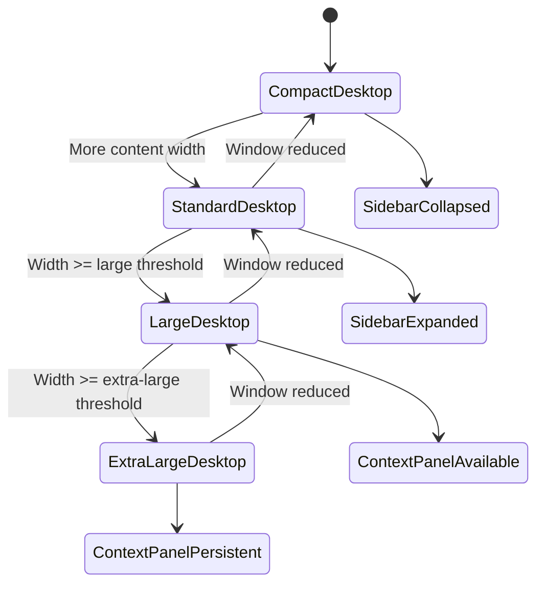
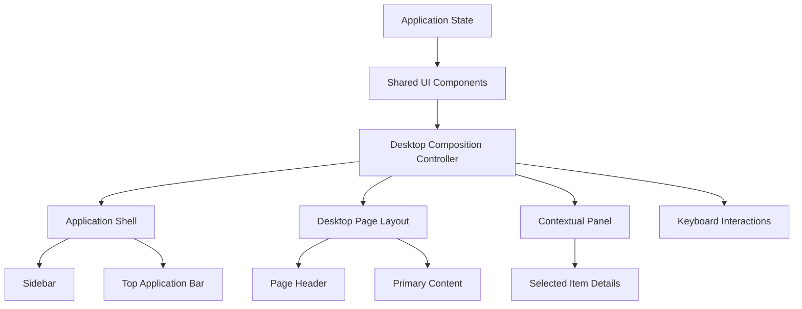
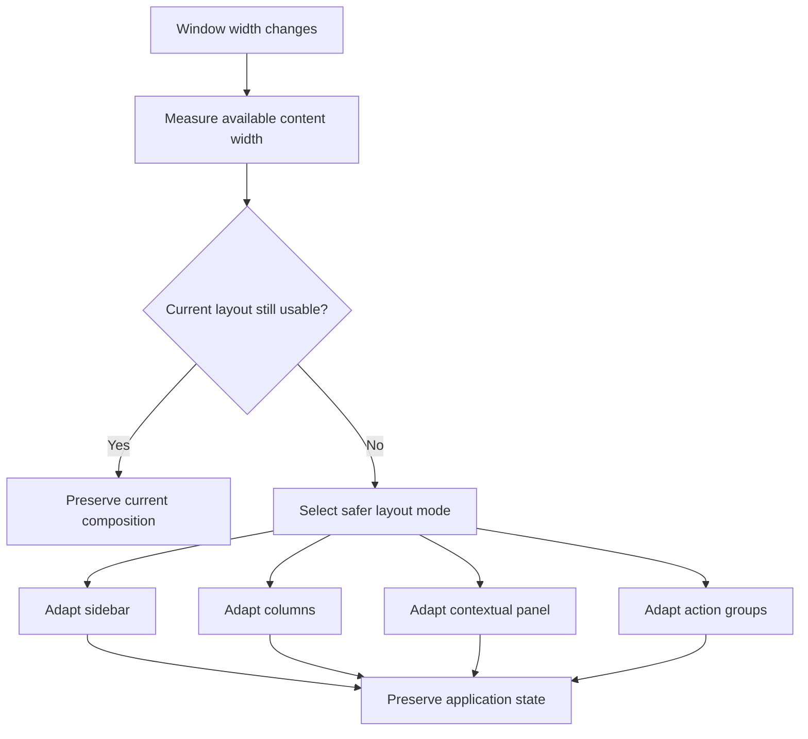
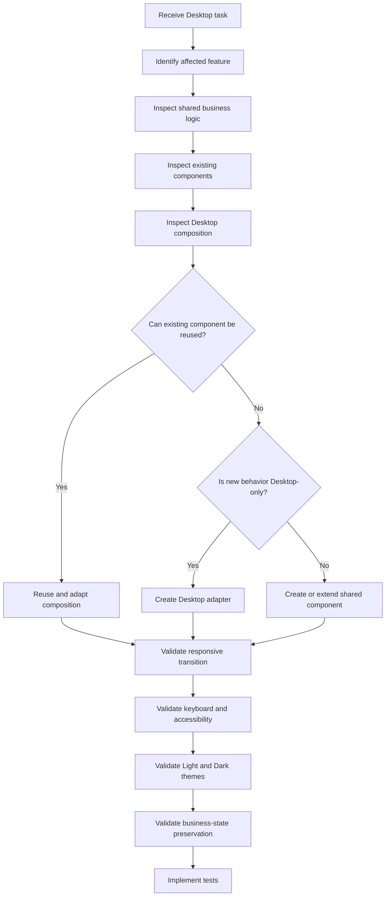

# Nexio Desktop Experience Specification

Version: 1.0  
Status: Official  
Authority Level: Platform Experience Standard  
Applies To: Desktop Web and Large-Screen Browser Environments

---

# Purpose

This document defines the official Desktop experience of Nexio.

It establishes:

- Desktop interaction principles
- Application shell
- Navigation
- Page structure
- Layout behavior
- Information density
- Keyboard interaction
- Window adaptation
- Multi-panel workflows
- Desktop-specific component behavior
- Platform implementation boundaries

The Desktop experience must provide more than a stretched version of the mobile application.

Desktop exists to improve:

- Productivity
- Comparison
- Data visibility
- Financial analysis
- Multi-step workflows
- Keyboard efficiency
- Large-screen information organization

Every Desktop implementation must comply with this specification.

---

# Relationship with Other Documents

This document must be interpreted together with:

```text
docs/00-FOUNDATION.md
docs/01-ARCHITECTURE.md
docs/02-DESIGN-SYSTEM.md
docs/04-TABLET.md
docs/05-MOBILE.md
docs/design-system/COMPONENTS.md
docs/design-system/DESIGN-BIBLE.md
```

Responsibilities are divided as follows:

| Document | Responsibility |
|---|---|
| `00-FOUNDATION.md` | Product principles and constitutional rules |
| `01-ARCHITECTURE.md` | Technical layers, modules and data flow |
| `02-DESIGN-SYSTEM.md` | Shared visual language and component standards |
| `03-DESKTOP.md` | Desktop composition and interaction behavior |
| `04-TABLET.md` | Tablet-specific composition |
| `05-MOBILE.md` | Mobile-specific composition |
| `COMPONENTS.md` | Detailed reusable component contracts |

This document may adapt shared components.

It may not redefine their core meaning.

---

# Desktop Implementation Ownership

Desktop-specific presentation is currently associated with:

```text
css/desktop.css
js/ui/desktop.js
```

These files must contain only Desktop-specific behavior.

They must not become alternative implementations of:

- Business rules
- Financial calculations
- Storage
- Authentication
- Shared formatting
- Shared validation
- Shared components
- Shared application state

Expected responsibility:

```text
Shared Business Logic
        │
        ▼
Shared Application State
        │
        ▼
Shared UI Components
        │
        ▼
Desktop Composition
        │
        ├── css/desktop.css
        └── js/ui/desktop.js
```

Desktop code adapts composition.

It does not duplicate product behavior.

---

# Desktop Product Role

Desktop is the most information-capable Nexio environment.

It should allow users to:

- Understand their complete financial position.
- Compare accounts, periods and categories.
- Review many transactions efficiently.
- Create and edit data with minimal interruption.
- Use keyboard shortcuts.
- Work with multiple related information regions.
- Export or analyze reports.
- Inspect details without losing context.
- Complete longer administrative workflows.
- Manage advanced settings.

Desktop is not necessarily the platform with the most features.

It is the platform with the highest potential for productivity and information density.

---

# Desktop Experience Principles

## Productivity Before Decoration

Desktop layouts should reduce unnecessary navigation and repeated actions.

The interface must use the available space to improve work.

It must not fill space with:

- Oversized illustrations
- Excessive card margins
- Decorative banners
- Large empty headers
- Repeated summaries
- Unnecessary floating elements

Large screens should increase usefulness.

They should not merely increase visual size.

---

## Information Density with Hierarchy

Desktop may show more information than mobile.

It must not show every available field at once.

Density must remain structured through:

- Alignment
- Grouping
- Typography
- Spacing
- Surface hierarchy
- Progressive disclosure
- Column priority

A dense interface can still feel calm when hierarchy is clear.

---

## Context Preservation

Desktop should minimize unnecessary screen replacement.

When appropriate, users should be able to:

- Open details beside a list.
- Edit an item without losing filters.
- Compare periods in the same view.
- Review a transaction while maintaining list position.
- Inspect an account while keeping the dashboard visible.
- Close a secondary panel and return to the exact previous context.

Context preservation is a major Desktop advantage.

---

## Keyboard Efficiency

Every common Desktop workflow must be usable through the keyboard.

Keyboard support includes:

- Logical tab order
- Visible focus
- Shortcut support
- Arrow navigation
- Enter and Space activation
- Escape dismissal
- Focus restoration
- Search activation
- Efficient form submission

Pointer interaction must remain fully supported.

Keyboard support is an enhancement to efficiency, not a replacement for accessible navigation.

---

## Stable Navigation

Desktop navigation should remain visible and predictable.

Primary destinations must not move between screens.

Equivalent navigation items must maintain:

- Position
- Label
- Icon
- Selected state
- Interaction behavior

Stable navigation builds muscle memory.

---

## Comparison Is a Native Desktop Capability

Desktop should support side-by-side comparison when it improves financial understanding.

Examples:

- Current month versus previous month
- Account A versus Account B
- Budget versus actual spending
- Goal progress across periods
- Category performance
- Planned versus completed payments

Comparison should not require opening multiple browser tabs or repeatedly navigating backward.

---

## Progressive Complexity

Desktop may expose advanced controls more readily than mobile.

However, advanced options must remain organized.

Recommended hierarchy:

```text
Primary actions

↓

Common filters

↓

Contextual tools

↓

Advanced filters

↓

Administrative options
```

Advanced capability must not overwhelm first-time users.

---

# Target Desktop Environment

The Desktop experience is designed primarily for:

```text
Viewport width:
1200px and above

Primary input:
Mouse, trackpad and keyboard

Secondary input:
Touch-enabled laptops and large tablets in desktop-like mode

Typical orientation:
Landscape

Typical usage duration:
Medium to long sessions
```

Desktop behavior may begin below 1200px when sufficient space exists.

Layout decisions should depend on available content width rather than device identity alone.

---

# Desktop Width Classes

The official conceptual Desktop classes are:

| Class | Width | Typical Behavior |
|---|---:|---|
| Compact Desktop | 1024–1199px | Reduced columns, compact sidebar |
| Standard Desktop | 1200–1439px | Default Desktop layout |
| Large Desktop | 1440–1799px | Wider content and optional detail panels |
| Extra-Large Desktop | 1800px+ | Controlled maximum width and additional analysis regions |

These ranges are guidelines.

Components may use container queries when local width is more relevant.

---

# Compact Desktop

Compact Desktop is the transition between Tablet and full Desktop.

It may use:

- Collapsible sidebar
- Reduced page padding
- Fewer visible dashboard columns
- Condensed table columns
- Overlay detail panels
- Hidden low-priority labels
- Compact action groups

Compact Desktop must not silently become a broken full Desktop layout.

When space is insufficient, the layout must intentionally transform.

---

# Standard Desktop

Standard Desktop is the primary reference environment.

It should support:

- Persistent sidebar
- Main content area
- Page header
- Multi-column dashboard
- Structured transaction table
- Visible common filters
- Contextual actions
- Optional secondary panels
- Keyboard shortcuts

Most screenshots and visual regression references should include this class.

---

# Large Desktop

Large Desktop may use additional space for:

- Persistent detail panels
- Wider comparison charts
- Expanded report filters
- Additional table columns
- Side-by-side forms and previews
- Larger content gutters
- Contextual insights

Additional space must improve comprehension or efficiency.

Do not enlarge cards indefinitely.

---

# Extra-Large Desktop

Extra-large screens require controlled expansion.

The interface should normally use:

```css
.desktop-content {
  width: 100%;
  max-width: var(--desktop-content-max-width);
  margin-inline: auto;
}
```

Data-heavy pages may use a wider maximum than reading-oriented pages.

The application must not stretch text, forms or transaction rows across the entire screen without purpose.

---

# Desktop Application Shell

The official Desktop shell contains:

```text
Application Root

├── Primary Sidebar
├── Main Region
│   ├── Top Application Bar
│   ├── Page Header
│   └── Page Content
└── Optional Contextual Panel
```

Conceptual representation:

```text
┌──────────────────────────────────────────────────────────────────────┐
│ Sidebar │ Top Application Bar                                       │
│         ├────────────────────────────────────────────────────────────┤
│         │ Page Header                                                │
│         ├───────────────────────────────────────────────┬────────────┤
│         │ Main Page Content                             │ Contextual │
│         │                                               │ Panel      │
│         │                                               │            │
│         │                                               │            │
└─────────────────────────────────────────────────────────┴────────────┘
```

Not every screen requires a contextual panel.

The shell must remain structurally stable across primary destinations.

---

# Desktop Shell Responsibilities

## Sidebar

Responsible for:

- Product identity
- Primary navigation
- Secondary navigation
- Selected destination
- Collapse behavior
- User or workspace controls

## Top Application Bar

Responsible for:

- Global search
- Notifications
- Synchronization state
- Theme or account access
- Global quick actions when justified

## Page Header

Responsible for:

- Page title
- Context
- Primary page action
- Relevant supporting actions
- Optional period or account context

## Main Page Content

Responsible for:

- Feature content
- Lists
- Tables
- Charts
- Forms
- Empty states
- Loading and error states

## Contextual Panel

Responsible for:

- Selected-item details
- Secondary editing
- Explanations
- Activity
- Filters
- Comparisons
- AI insights

---

# Desktop Layout Grid

Nexio Desktop should use a flexible 12-column grid.

Conceptual structure:

```text
12 Columns

├── 3 + 9
├── 4 + 8
├── 6 + 6
├── 8 + 4
├── 9 + 3
└── 12
```

Recommended use:

| Distribution | Example |
|---|---|
| 3 + 9 | Filter panel and report |
| 4 + 8 | Account summary and transactions |
| 6 + 6 | Period comparison |
| 8 + 4 | Main analysis and insights |
| 9 + 3 | Table and detail panel |
| 12 | Full-width transaction list |

The grid must support nested feature layouts without creating conflicting spacing systems.

---

# Grid Implementation Principles

The grid should use:

- CSS Grid for two-dimensional layouts.
- Flexbox for one-dimensional component alignment.
- Container queries for reusable module adaptation.
- Design System spacing tokens for gaps.
- Minimum widths to prevent unusable columns.

Example:

```css
.desktop-grid {
  display: grid;
  grid-template-columns: repeat(12, minmax(0, 1fr));
  gap: var(--space-content-group);
}

.desktop-grid__main {
  grid-column: span 8;
}

.desktop-grid__aside {
  grid-column: span 4;
}
```

A component must not assume it always occupies a fixed number of global columns.

---

# Desktop Page Width Strategies

Nexio supports three page-width strategies:

```text
Reading Width

Standard Application Width

Data-Expanded Width
```

---

## Reading Width

Used for:

- Help content
- Legal documents
- Explanations
- Onboarding text
- Long settings descriptions

Recommended behavior:

```text
Controlled line length
Centered content
Limited maximum width
```

---

## Standard Application Width

Used for:

- Dashboard
- Accounts
- Goals
- Settings
- Category management

It should allow structured multi-column layouts without excessive stretching.

---

## Data-Expanded Width

Used for:

- Transaction tables
- Reports
- Reconciliation
- Import review
- Detailed financial analysis

It may use most available width while maintaining useful page gutters.

---

# Desktop Spacing

Desktop spacing should support density without feeling compressed.

Recommended semantic values:

```css
--desktop-page-padding-inline
--desktop-page-padding-block
--desktop-section-gap
--desktop-card-gap
--desktop-toolbar-gap
--desktop-table-row-height
```

Platform files should assign Desktop values to semantic tokens.

Components should not hardcode Desktop spacing internally.

---

# Desktop Page Anatomy

A standard Desktop page should follow:

```text
Breadcrumb or contextual navigation

↓

Page title and description

↓

Primary action and supporting actions

↓

Summary or important status

↓

Filters and view controls

↓

Primary content

↓

Pagination or continuation controls
```

Only applicable sections should be rendered.

Avoid empty structural areas.

---

# Page Header

The Desktop page header should contain:

```text
Context region

├── Optional breadcrumb
├── Page title
└── Optional description

Action region

├── Supporting actions
└── Primary action
```

Example:

```text
Transactions

Review and manage your financial activity.

[Import] [Export] [Add transaction]
```

The primary action should remain visually clear.

Supporting actions may move into an overflow menu when space is constrained.

---

# Page Header Rules

The page header must:

- Use one primary heading.
- Describe the current destination.
- Avoid duplicating navigation labels unnecessarily.
- Preserve action hierarchy.
- Adapt when the viewport narrows.
- Avoid excessive vertical height.
- Remain understandable without decorative imagery.

Do not place routine metrics in the page header merely to fill space.

---

# Primary Sidebar

The sidebar is the primary Desktop navigation surface.

Recommended regions:

```text
Brand region

Primary navigation

Feature navigation

Flexible spacer

Secondary navigation

User or account region
```

Conceptual layout:

```text
┌────────────────────────┐
│ Nexio                  │
├────────────────────────┤
│ Dashboard              │
│ Transactions           │
│ Accounts               │
│ Goals                  │
│ Reports                │
├────────────────────────┤
│ Assistant              │
│ Notifications          │
│ Settings               │
├────────────────────────┤
│ User Profile           │
└────────────────────────┘
```

The exact information architecture must follow the product navigation specification.

---

# Sidebar Width

Recommended conceptual states:

```text
Expanded:
240–280px

Collapsed:
64–80px
```

Exact values must use Design System tokens.

The sidebar must not consume excessive space on Compact Desktop.

---

# Sidebar Expanded State

Expanded state should display:

- Product logo
- Navigation icons
- Navigation labels
- Group labels where needed
- Selected destination
- Collapse control
- User context

Labels must remain concise and stable.

---

# Sidebar Collapsed State

Collapsed state may display:

- Product symbol
- Navigation icons
- Selected state
- Tooltip labels
- Accessible navigation names
- Expand control

The collapsed sidebar must not rely on memory alone.

Every icon must have an accessible name and pointer tooltip where useful.

---

# Sidebar State Persistence

The user's expanded or collapsed preference should persist when appropriate.

Persistence must not force an unsuitable state after major viewport changes.

Example:

```text
User collapses sidebar on Standard Desktop
→ Preference persists.

User opens application on Compact Desktop
→ Application may use compact state automatically.

User returns to Large Desktop
→ Stored preference may be restored.
```

Viewport safety takes priority over stored preference.

---

# Sidebar Selected State

The selected destination must be indicated through more than color alone.

Possible signals:

- Background surface
- Stronger text
- Icon treatment
- Selection marker
- `aria-current="page"`

Example:

```html
<a
  href="/transactions"
  class="navigation-item is-selected"
  aria-current="page"
>
  Transactions
</a>
```

---

# Sidebar Navigation Rules

The sidebar must not:

- Contain feature forms.
- Display large financial reports.
- Become an advertisement area.
- Reorder destinations dynamically without explicit user customization.
- Mix destructive account actions with routine navigation.
- Hide essential destinations behind hover.
- Use unclear icon-only navigation by default.

---

# Top Application Bar

The top application bar contains global controls.

Potential contents:

```text
Global search

Quick-create action

Synchronization status

Notifications

Help

Theme access

User menu
```

Not every control must be permanently visible.

The bar should avoid becoming a collection of unrelated icons.

---

# Global Search

Global search may search across:

- Transactions
- Accounts
- Categories
- Goals
- Reports
- Settings destinations
- Help content

Search should be accessible through:

```text
Visible search control

Keyboard shortcut

Navigation command
```

Recommended shortcut:

```text
Ctrl + K
```

or:

```text
Command + K
```

The shortcut must not conflict with browser or assistive technology behavior.

---

# Quick Create

A global quick-create action may allow:

- New transaction
- New income
- New expense
- New transfer
- New goal
- New account

Quick create must not duplicate every page action visibly.

A compact menu or command interface may expose secondary creation options.

---

# Synchronization Status

Cloud or offline status should remain calm and non-blocking.

Possible states:

```text
Synchronized

Synchronizing

Offline

Changes pending

Synchronization error
```

The status must provide additional details when selected.

Do not show a permanent success notification for every routine synchronization.

---

# Notifications Control

The notification control must indicate unread status without relying only on color.

It may use:

- Badge count
- Dot plus accessible text
- Label inside the opened panel

The control must not continuously animate.

---

# User Menu

The user menu may include:

- Profile
- Preferences
- Theme
- Security
- Help
- Sign out

Dangerous actions such as account deletion must not appear as routine user-menu items without an additional protected workflow.

---

# Contextual Panel

A contextual panel preserves the user's position while exposing additional information.

Recommended uses:

- Transaction details
- Account details
- Goal details
- Edit form
- Filter configuration
- Report explanation
- AI-generated insight
- Import warnings

The panel may be:

```text
Persistent

Resizable

Collapsible

Temporary
```

Its behavior must match the workflow.

---

# Contextual Panel Width

Recommended conceptual widths:

```text
Compact:
320–360px

Standard:
380–480px

Expanded:
520–640px
```

The panel must not reduce the main content below its usable minimum width.

When insufficient width exists, the panel should transform into:

- Overlay panel
- Dialog
- Full-page detail
- Temporary drawer

---

# Master-Detail Pattern

Master-detail is recommended when users repeatedly inspect items.

Example:

```text
Transaction List                Transaction Details

Supermarket       −R$ 185,40    Description
Salary          +R$ 4.500,00    Category
Electricity      −R$ 220,00     Account
                                  Date
                                  Notes
                                  Actions
```

Selecting another item should update the detail region without resetting:

- Scroll position
- Search
- Filters
- Sorting
- Pagination
- Selected period

---

# Contextual Panel Accessibility

The panel must:

- Have an accessible label.
- Preserve logical focus order.
- Move focus intentionally when opened through a command.
- Allow Escape dismissal when temporary.
- Return focus when closed.
- Avoid trapping focus when persistent.
- Announce selected-item changes when necessary.

---

# Multi-Panel Limits

Desktop should not display unlimited simultaneous panels.

Recommended maximum:

```text
Primary navigation

+

Main content

+

One contextual panel
```

Additional floating dialogs may temporarily appear.

Avoid interfaces with multiple narrow sidebars, nested drawers and competing panels.

---

# Desktop Information Density

Desktop density must be selected according to the task.

Recommended modes:

| Task | Density |
|---|---|
| Dashboard overview | Standard |
| Transaction review | Compact or Standard |
| Financial reports | Standard |
| Settings | Comfortable or Standard |
| Import validation | Compact |
| Onboarding | Comfortable |
| Goal planning | Standard |

Density is not a universal application preference unless formally introduced as a product feature.

---

# Compact Data Views

Compact Desktop views may reduce:

- Vertical padding
- Supporting descriptions
- Decorative icons
- Repeated labels
- Card surface separation

They must not reduce:

- Legibility
- Focus visibility
- Essential context
- Error messages
- Keyboard accessibility
- Pointer target reliability

---

# Desktop Scroll Strategy

The default experience should use one primary vertical page scroll.

Avoid unnecessary nested scrolling.

Nested scrolling is acceptable for:

- Large data tables
- Persistent detail panels
- Long dialog content
- Code or document previews
- Independently controlled lists

Nested regions must have visible boundaries and predictable keyboard behavior.

---

# Sticky Regions

Desktop may use sticky positioning for:

- Top application bar
- Table headers
- Filter toolbar
- Detail panel header
- Page actions
- Summary controls

Sticky regions must not consume excessive viewport height.

Multiple stacked sticky elements must coordinate their offsets through tokens.

---

# Desktop Modal Strategy

Dialogs should be used for focused, interruptive tasks.

Recommended Desktop uses:

- Confirm destructive action
- Add a simple transaction
- Create a category
- Choose an account
- Review a short conflict
- Configure a compact setting

Long or multi-step workflows should use:

- Dedicated page
- Contextual panel
- Structured workspace

A dialog must not become an entire application inside an overlay.

---

# Desktop Forms

Desktop forms may use multi-column structure when fields are naturally related.

Good combinations:

```text
Date | Time

Amount | Type

City | State

Start date | End date
```

Bad combinations:

```text
Description | Notification preference

Account name | Security password

Category | Long notes
```

The desire to reduce vertical space is not sufficient justification for multiple columns.

---

# Form Width

Form controls should have intentional widths.

Examples:

```text
Long text:
Flexible or wide

Currency:
Medium

Date:
Compact

Percentage:
Compact

Search:
Flexible

Security code:
Compact
```

Inputs should not stretch across the entire Desktop screen without benefit.

---

# Desktop Action Placement

Primary actions should normally appear:

- In the page header.
- In a dialog footer.
- In a form action region.
- In a contextual panel footer.
- In a row action menu when item-specific.

Avoid floating primary-action buttons as the default Desktop pattern.

Floating actions are primarily mobile-oriented and may obscure data-heavy interfaces.

---

# Row Actions

Transaction and data-table row actions should use:

```text
Visible primary row action when frequent

+

Overflow menu for secondary actions
```

Examples:

```text
Edit

Duplicate

Move

Delete
```

Destructive actions should be separated and clearly styled.

Row actions must remain keyboard-accessible.

---

# Hover Behavior

Hover may provide:

- Interactive emphasis
- Tooltips
- Secondary row actions
- Chart details
- Link indication
- Pointer feedback

Hover must not reveal the only path to an essential action.

Actions hidden until hover must also become available through:

- Keyboard focus
- Row menu
- Detail panel
- Visible control on touch-capable environments

---

# Selection Behavior

Desktop lists and tables may support selection.

Types:

```text
Single selection

Multiple selection

Range selection

Select all visible

Select all matching filter
```

Selection behavior must be explicit.

The interface must distinguish:

```text
Selected on this page

Selected across all results
```

Bulk actions must identify the affected quantity.

Example:

```text
Delete 24 selected transactions
```

---

# Keyboard Selection

When multi-selection is supported:

```text
Space
→ Select focused row

Shift + Arrow
→ Extend selection when implemented

Ctrl or Command + A
→ Select all only when context is clear

Escape
→ Clear temporary selection
```

Keyboard shortcuts must be documented and must not conflict with text editing.

---

# Desktop Shortcut Principles

Shortcuts should be provided for frequent actions.

Potential shortcuts:

| Action | Shortcut |
|---|---|
| Global search | `Ctrl/Command + K` |
| Add transaction | `N` or documented combination |
| Save form | `Ctrl/Command + Enter` |
| Close temporary panel | `Escape` |
| Focus transaction search | `/` |
| Open help | `?` |

Single-key shortcuts require caution because they may interfere with assistive technology or typing.

Shortcuts must not be the only way to perform an action.

---

# Shortcut Discovery

Users should be able to discover shortcuts through:

- Tooltips
- Menus
- Command palette
- Help screen
- Visible shortcut labels
- Keyboard-shortcut reference

Do not expect users to guess shortcuts.

---

# Desktop Layout State Model



The application should respond to available space without reloading or losing user state.

---

# Desktop Composition Flow



Desktop composition must remain a consumer of shared state.

It must not become a second application state system.

---

# Desktop CSS Rules

`css/desktop.css` may define:

- Desktop layout composition
- Desktop shell dimensions
- Sidebar expanded behavior
- Desktop grid behavior
- Desktop-only hover enhancements
- Desktop density adaptations
- Wide-screen panel behavior
- Desktop table composition
- Platform token values

It must not define:

- New brand colors
- Independent button styles
- Business-specific financial meaning
- Shared input validation
- Mobile corrections
- Tablet corrections
- Duplicate component foundations
- Authentication logic
- Data formatting

---

# Desktop JavaScript Rules

`js/ui/desktop.js` may coordinate:

- Sidebar collapse behavior
- Desktop panel opening
- Desktop keyboard shortcuts
- Master-detail selection
- Desktop window adaptation
- Command palette presentation
- Desktop-specific focus handling
- Resizable panel behavior
- Wide-screen enhancements

It must not:

- Calculate balances.
- Save transactions directly.
- Access Supabase directly.
- Maintain duplicate business state.
- Reimplement shared validation.
- Contain mobile behavior.
- Replace shared UI components.
- Format currency independently.

---

# Platform Detection

Avoid relying exclusively on user-agent detection.

Prefer:

- Viewport width
- Container width
- Pointer capability
- Hover capability
- Keyboard availability where detectable
- Actual layout constraints

Example:

```css
@media (min-width: 1200px) and (hover: hover) {
  /* Desktop pointer enhancement */
}
```

Platform behavior should adapt to capability, not assumptions about device names.

---

# Desktop State Preservation

The following state should remain stable during normal Desktop navigation:

- Selected period
- Selected account
- Search query when returning to a list
- Active filters
- Sorting
- Table page or scroll position
- Sidebar preference
- Open detail when context remains valid
- Draft forms
- Theme
- Density when formally supported

State preservation must not expose stale or unauthorized data.

---

# Desktop Anti-Patterns

The following are prohibited:

## Stretched Mobile Layout

Displaying one oversized mobile column across a large monitor.

## Card-Only Data Interfaces

Replacing every table or comparison with large cards.

## Excessive Empty Space

Using large padding without improving hierarchy.

## Multiple Competing Sidebars

Displaying navigation, filters and details as equally dominant sidebars.

## Hover-Only Actions

Making essential actions unavailable without a pointer.

## Permanent Modal Workspaces

Using dialogs for long, complex tasks.

## Uncontrolled Full Width

Stretching forms and text across the entire viewport.

## Duplicate Desktop Logic

Recalculating or revalidating data inside `desktop.js`.

## Dynamic Navigation Reordering

Moving primary destinations based on recent usage without explicit customization.

## Excessive Sticky UI

Leaving too little space for actual financial content.

## Invisible Context Changes

Replacing the main panel without updating heading, focus or navigation state.

---

# Desktop Foundation Acceptance Criteria

The Desktop foundation is accepted only when:

```text
□ The application uses a stable Desktop shell.

□ Primary navigation remains predictable.

□ Desktop composition does not duplicate business logic.

□ Compact, Standard and Large Desktop layouts are intentional.

□ Content width is controlled.

□ The sidebar supports expanded and collapsed states.

□ The page header preserves action hierarchy.

□ Contextual panels preserve list state.

□ Keyboard access is available for common workflows.

□ Hover is an enhancement, not a requirement.

□ Forms use intentional widths and columns.

□ Financial values remain readable at every Desktop width.

□ Light and dark themes are supported.

□ Desktop CSS only contains platform adaptation.

□ Desktop JavaScript only coordinates platform behavior.

□ Window resizing does not reset user workflows.

□ Large screens improve productivity rather than only increasing size.
```

---

# Desktop Feature Experiences

This section defines how the primary Nexio features should behave on Desktop.

The purpose is not to create independent Desktop business logic.

Each Desktop experience must consume:

```text
Shared application state

Shared business rules

Shared services

Shared repositories

Shared Design System components
```

Desktop-specific code may change:

- Composition
- Density
- Visible information
- Navigation placement
- Panel behavior
- Keyboard interaction
- Comparison capabilities

Desktop-specific code must not change:

- Financial calculations
- Validation rules
- Persistence behavior
- Permission rules
- Data meaning
- Currency formatting
- Synchronization rules

---

# Desktop Feature Priority

Desktop feature design should prioritize:

```text
1. Understanding

2. Comparison

3. Efficient action

4. Context preservation

5. Detailed inspection

6. Bulk management

7. Export and analysis
```

A Desktop screen should not expose additional information merely because space is available.

Every visible element must support a user decision or workflow.

---

# Desktop Dashboard

The Desktop dashboard is the primary financial overview.

It should help the user answer:

```text
What is my current financial position?

What changed recently?

What requires attention?

What is expected next?

Where should I act?
```

The dashboard must not attempt to display every metric available in Nexio.

It must prioritize actionable financial understanding.

---

# Dashboard Information Hierarchy

Recommended priority:

```text
1. Current balance or net financial position

2. Income and expenses for the selected period

3. Relevant variation compared with the previous period

4. Upcoming financial obligations

5. Recent transactions

6. Budget or spending progress

7. Goals

8. Financial insights

9. Secondary charts and reports
```

The exact order may adapt to user configuration.

Critical information must not be moved below decorative or low-priority content.

---

# Dashboard Desktop Layout

Recommended Standard Desktop structure:

```text
┌───────────────────────────────────────────────────────────────┐
│ Page Header                           Period      Add Action   │
├───────────────────────────────────────────────────────────────┤
│ Primary Financial Summary                                     │
├───────────────────────┬───────────────────────┬───────────────┤
│ Income                │ Expenses              │ Monthly Result│
├───────────────────────────────────────┬───────────────────────┤
│ Cash Flow or Expense Trend            │ Upcoming Obligations  │
├───────────────────────────────────────┼───────────────────────┤
│ Recent Transactions                   │ Budget or Goals        │
├───────────────────────────────────────┴───────────────────────┤
│ Insights and Secondary Information                            │
└───────────────────────────────────────────────────────────────┘
```

This is a conceptual structure.

The final composition must respond to:

- Data availability
- Selected period
- User account configuration
- Screen width
- Enabled features
- Loading and error states

---

# Dashboard Summary Region

The primary summary should present:

- Current balance
- Net result for the selected period
- Relevant change
- Date or period context
- Optional account scope
- Balance visibility control

The summary must not display an amount without context.

Bad:

```text
R$ 14.250,00
```

Better:

```text
Available balance

R$ 14.250,00

Across 3 active accounts
```

---

# Balance Privacy

Users may hide financial values.

Hidden values must:

- Preserve component dimensions.
- Avoid layout shifts.
- Remain hidden across relevant dashboard components.
- Preserve accessible privacy.
- Not expose the exact value in tooltips, attributes or copied text.
- Follow the user's saved preference when appropriate.

Example visual treatment:

```text
R$ ••••••
```

The accessible label should communicate:

```text
Balance hidden
```

It must not announce the hidden amount.

---

# Dashboard Period Control

The dashboard should provide a clear period selector.

Possible values:

```text
Current month

Previous month

Last 3 months

Last 6 months

Current year

Custom period
```

The selected period must update:

- Summaries
- Charts
- Transactions
- Budget progress
- Insights
- Comparisons

The period selector must represent one shared dashboard context.

Independent, conflicting period controls should be avoided unless clearly labeled.

---

# Dashboard Comparison

Desktop should support period comparison.

Recommended options:

```text
Current month versus previous month

Current month versus same month last year

Custom period versus previous equivalent period
```

Comparison must present:

- Absolute change
- Percentage change where valid
- Direction
- Context
- Explanation when the comparison is unavailable

Do not calculate percentage change when the reference value makes the result misleading or undefined.

---

# Dashboard Cards

Dashboard cards should represent meaningful information groups.

Recommended card types:

```text
Financial summary

Cash flow

Upcoming obligations

Budget progress

Goal progress

Recent transactions

Financial insight

Account distribution
```

Avoid creating a separate card for every minor number.

Related metrics should be grouped.

---

# Dashboard Customization

Future dashboard customization may allow:

- Reordering approved modules
- Showing or hiding secondary modules
- Selecting account scope
- Selecting default period
- Choosing standard or compact density

Customization must remain constrained.

Users should not be able to create unusable layouts through unrestricted positioning.

Critical modules may remain mandatory.

---

# Dashboard Loading

The dashboard should load progressively.

Recommended sequence:

```text
Application shell

↓

Cached primary summary

↓

Primary dashboard modules

↓

Recent transactions

↓

Charts

↓

Secondary insights
```

The interface must not wait for every module before presenting useful information.

Each module may display its own loading or error state.

---

# Dashboard Partial Failure

A failure in one dashboard module must not block the entire dashboard.

Example:

```text
Balance summary:
Available

Recent transactions:
Available

Expense chart:
Could not load

Goals:
Available
```

The failed module should provide a retry action when useful.

---

# Dashboard Empty State

First-use dashboard behavior should guide the user.

Recommended structure:

```text
Welcome context

Primary financial setup action

Optional sample explanation

Clear next step
```

Example:

```text
Start organizing your finances

Create an account and add your first transaction to build your financial overview.

[Create account]
```

Do not show a full grid of empty cards.

---

# Dashboard Keyboard Behavior

Recommended interactions:

```text
Tab
→ Move through summary controls and modules

Enter
→ Open the focused module or action

Arrow keys
→ Navigate period options when implemented as tabs or segmented control

Ctrl/Command + N
→ Open quick transaction creation when officially supported
```

Dashboard cards that navigate must use link semantics.

Cards that trigger actions must use button semantics.

---

# Dashboard Anti-Patterns

Forbidden:

- Displaying every metric with equal emphasis.
- Using more than one dominant chart.
- Repeating the same financial value in multiple cards.
- Hiding critical obligations below secondary insights.
- Creating empty cards for unavailable features.
- Blocking the dashboard because one API request failed.
- Using animations on every number during every refresh.
- Using decorative gradients that reduce readability.
- Showing AI insights before reliable financial summaries.
- Resetting the selected period during navigation.

---

# Dashboard Acceptance Criteria

```text
□ The current financial position is immediately understandable.

□ The selected period is visible.

□ Primary summaries use consistent financial formatting.

□ Comparison includes clear context.

□ Dashboard modules load independently.

□ Partial failure does not block the full screen.

□ Empty state provides a clear first action.

□ Financial values can be hidden safely.

□ Large values remain readable.

□ Charts have accessible alternatives.

□ Keyboard interaction is supported.

□ Dashboard cards use correct link or button semantics.

□ Mobile business logic is not duplicated.

□ The dashboard does not contain unnecessary metric cards.
```

---

# Desktop Transactions

The Desktop transactions experience is designed for:

- Reviewing many records
- Searching quickly
- Filtering precisely
- Editing without losing context
- Comparing values
- Selecting multiple records
- Importing and exporting data
- Inspecting transaction details
- Identifying pending or inconsistent records

Transactions are one of the most data-intensive areas of Nexio.

Desktop should use structured density.

---

# Transactions Page Structure

Recommended layout:

```text
Page Header

↓

Financial Summary

↓

Search, Filters and View Controls

↓

Bulk Action Region when selection exists

↓

Transaction Table or Structured List

↓

Pagination or Incremental Loading

↓

Optional Contextual Detail Panel
```

---

# Transactions Page Header

Recommended actions:

```text
Primary:
Add transaction

Supporting:
Import
Export

Secondary overflow:
Manage recurring transactions
Review pending transactions
Advanced options
```

Too many permanent header actions should be avoided.

---

# Transaction Summary

The page may show a compact summary for the active result set:

```text
Income

Expenses

Net result

Number of transactions
```

The summary must update according to active filters.

It must clearly indicate whether values represent:

- All transactions
- Current page
- Selected period
- Selected accounts
- Search results

Ambiguous totals are forbidden.

---

# Transactions Search

Search should match relevant fields such as:

- Description
- Category
- Account
- Notes
- Tags
- Merchant
- Reference identifier when applicable

Search must:

- Preserve active filters.
- Display the number of matching results.
- Support clearing.
- Avoid losing the query when opening details.
- Debounce expensive operations.
- Announce result changes where appropriate.

---

# Transaction Filters

Common Desktop filters may include:

```text
Period

Transaction type

Account

Category

Status

Amount range

Recurring state

Imported state

Tags
```

Common filters should remain visible.

Advanced filters may open in:

- Popover
- Side panel
- Filter drawer
- Dedicated advanced-filter region

---

# Active Filter Display

Active filters should be visible as removable filter tokens or a clear filter summary.

Example:

```text
July 2026

Expenses

Account: Main account

Category: Food
```

The interface should provide:

```text
Clear all filters
```

Clearing filters must not clear the search query unless the action explicitly states that it clears all search criteria.

---

# Filter Persistence

Filters may persist during:

- Opening and closing transaction details
- Editing an item
- Returning from a related screen
- Switching between table and list view

Filters should not persist indefinitely across unrelated sessions unless the product intentionally supports saved views.

---

# Transaction Table

Recommended Desktop columns:

```text
Selection

Date

Description

Category

Account

Status

Amount

Actions
```

Optional columns:

```text
Type

Recurring

Tags

Creation source

Reconciliation status
```

The default table should not display every available field.

---

# Column Priority

Highest priority:

```text
Description

Amount

Date
```

Medium priority:

```text
Category

Account

Status
```

Lower priority:

```text
Tags

Source

Technical metadata
```

Compact Desktop may hide or combine lower-priority columns.

---

# Transaction Amount Alignment

Amounts must:

- Align to the right.
- Use tabular numerals.
- Preserve sign and currency.
- Never truncate.
- Remain associated with their transaction type.
- Remain understandable without color.

Example:

```text
Income       +R$ 4.500,00

Expense      −R$ 185,40

Transfer      R$ 1.000,00
```

Transfers may use an icon, label or contextual account direction.

---

# Transaction Grouping

Transactions may be grouped by:

```text
Date

Month

Account

Category

Status
```

Date grouping is recommended for general chronological review.

Grouping behavior must not modify financial totals.

Group headers may show:

- Date
- Number of records
- Daily income
- Daily expenses
- Daily net result

Avoid overloading group headers with too many values.

---

# Transaction Sorting

Supported sorting may include:

```text
Newest first

Oldest first

Highest amount

Lowest amount

Description

Category

Account
```

The active sorting must remain visible.

Sorting must be stable and predictable.

When two items have the same primary sorting value, a documented secondary order should be used.

---

# Transaction Details Panel

Selecting a transaction may open a contextual panel.

Recommended content:

```text
Transaction description

Amount

Type

Date and time

Account

Destination account for transfers

Category

Status

Recurring information

Notes

Attachments when supported

Creation and update metadata

Actions
```

The panel should support:

- Edit
- Duplicate
- Delete
- Change category
- Move account where valid
- Reconcile or mark as reviewed when supported

---

# Transaction Edit Flow

Desktop may edit a transaction through:

```text
Contextual panel

Focused dialog

Dedicated page for advanced records
```

The selected method depends on complexity.

Editing must preserve:

- List filters
- List scroll
- Sorting
- Selected period
- Selection context where safe

After save:

- The edited row updates immediately.
- Totals update.
- Charts update.
- The detail panel reflects the saved result.
- Success feedback appears.
- Focus remains predictable.

---

# Add Transaction Flow

The Desktop transaction form should prioritize:

```text
Type

Amount

Description

Account

Category

Date
```

Secondary fields should use progressive disclosure:

```text
Notes

Tags

Recurring options

Attachments

Advanced metadata
```

The form should not require users to complete fields that can be inferred safely.

---

# Transfer Form

Transfers require:

```text
Source account

Destination account

Amount

Date

Optional description
```

Validation must prevent:

- Same source and destination account
- Invalid amount
- Unauthorized account
- Unsupported currency transfer without conversion rules

Transfers must not be treated as ordinary expenses and income pairs in the interface unless the underlying model explicitly requires linked records.

---

# Transaction Bulk Selection

Bulk selection may support:

- Change category
- Move account where valid
- Add or remove tag
- Export selected
- Archive
- Delete

Bulk actions must show:

- Number of selected records
- Affected scope
- Whether the action can be undone
- Partial failure behavior

Example:

```text
24 transactions selected
```

---

# Select All Behavior

The interface must distinguish:

```text
Select all visible rows

Select all matching results
```

Example:

```text
50 transactions on this page are selected.

Select all 428 matching transactions.
```

A bulk action must not unexpectedly affect hidden results.

---

# Transaction Deletion

A single transaction deletion should prefer undo when safe.

Example:

```text
Transaction deleted

[Undo]
```

Confirmation is required when:

- The transaction affects linked records.
- It is part of a recurring series.
- It affects account reconciliation.
- It is included in a protected import.
- The action cannot be reliably reversed.

---

# Recurring Transactions

Recurring transactions should expose:

```text
Frequency

Next expected date

Series status

Linked transactions

Edit scope
```

Editing must ask whether the change affects:

```text
Only this transaction

This and future transactions

The entire series
```

The meaning of each choice must be explained.

---

# Transaction Import

The Desktop import experience should use a structured workflow:

```text
Select file

↓

Map columns

↓

Validate data

↓

Review warnings

↓

Resolve duplicates

↓

Confirm import

↓

Show results
```

Import should use the wider Desktop workspace.

A small modal is insufficient for complex mapping and validation.

---

# Import Review Table

The import review should distinguish:

```text
Valid records

Warnings

Errors

Possible duplicates

Ignored records
```

Users should be able to:

- Filter by status.
- Edit correctable fields.
- Exclude rows.
- Review the import summary.
- Download or copy error details where useful.

---

# Transaction Export

Export options may include:

```text
Current filtered results

Selected transactions

Current period

All user transactions
```

The export dialog must state:

- Format
- Included records
- Date range
- Account scope
- Estimated file size when relevant

Export must respect privacy and permission rules.

---

# Transaction Table Keyboard Behavior

Recommended behavior:

```text
Arrow Down and Arrow Up
→ Move between rows when table navigation mode is active

Enter
→ Open selected transaction

Space
→ Toggle row selection

Escape
→ Close temporary detail panel or clear temporary selection

Delete
→ Never delete immediately without a protected interaction
```

Standard browser table navigation must not be broken unnecessarily.

---

# Transactions Anti-Patterns

Forbidden:

- Replacing a useful Desktop table with oversized cards.
- Displaying amounts without signs or transaction types.
- Resetting filters after editing.
- Making row actions available only on hover.
- Applying bulk actions to hidden results without confirmation.
- Opening complex import inside a small modal.
- Treating transfers as expenses.
- Displaying all transaction fields as default columns.
- Reloading the full page after every edit.
- Using color alone to distinguish income and expense.
- Truncating monetary values.
- Losing list scroll when closing details.

---

# Transactions Acceptance Criteria

```text
□ Search and filters can be combined.

□ Active filters are visible.

□ Totals match the active result set.

□ Transaction amounts align consistently.

□ Table columns follow priority rules.

□ Filters and scroll are preserved when opening details.

□ Edit updates affected summaries and rows.

□ Bulk selection clearly identifies scope.

□ Select-all behavior distinguishes page and result set.

□ Import supports mapping and validation.

□ Export identifies included records.

□ Transfers preserve their own semantic meaning.

□ Transaction status does not rely only on color.

□ Keyboard review is supported.

□ Large data sets remain performant.

□ Loading, empty, error and offline states are defined.
```

---

# Desktop Accounts

The Accounts area helps users understand where money is stored, owed or managed.

Account types may include:

```text
Checking account

Savings account

Cash

Credit card

Investment account

Digital wallet

Loan or debt account

Other supported financial source
```

Account behavior must follow the actual Nexio business model.

---

# Accounts Page Goals

The user should be able to answer:

```text
What accounts do I have?

What is the balance of each account?

Which accounts require attention?

How has an account changed over time?

Which transactions belong to an account?

What is my combined position?
```

---

# Accounts Desktop Layout

Recommended structure:

```text
Page Header

↓

Total Account Position

↓

Account Filters or Type Groups

↓

Account Grid or Structured List

↓

Selected Account Detail or Analysis Panel
```

Large Desktop may use a persistent account detail panel.

---

# Account Summary

The summary may include:

```text
Total positive balances

Total liabilities

Net account position

Number of active accounts
```

Assets and liabilities must not be combined ambiguously.

The net position must explain its calculation.

---

# Account Card

An account card may display:

```text
Account name

Institution or type

Current balance

Available balance when different

Recent variation

Status

Last synchronization

Primary action or navigation target
```

Sensitive account identifiers must be masked.

---

# Account List Versus Grid

Use a grid when:

- The number of accounts is small or moderate.
- Visual distinction improves recognition.
- Cards contain meaningful summaries.

Use a list or table when:

- There are many accounts.
- Comparison is more important.
- Density is required.
- Administrative actions are frequent.

The user may receive a controlled view toggle when both modes provide value.

---

# Account Detail

The Desktop account detail may include:

```text
Current balance

Available balance

Account type

Institution

Recent transactions

Balance history

Monthly income and expenses

Pending transactions

Account settings

Synchronization status
```

Detail content should not duplicate the complete Transactions page.

It should remain scoped to the selected account.

---

# Account Creation

Account creation should request only necessary information.

Common fields:

```text
Account name

Account type

Initial balance

Currency

Optional institution

Optional account color or icon
```

Initial balance handling must be explicit.

The user must understand whether it creates:

- An opening-balance record
- A current-value snapshot
- A historical transaction
- Another model defined by the application

---

# Account Editing

Editing an account may affect:

- Name
- Type
- Icon
- Institution
- Visibility
- Archive status
- Synchronization configuration

Changes that affect financial history require additional explanation.

---

# Account Archive Versus Delete

Archive should be preferred when historical transactions exist.

Archive behavior:

- Removes the account from routine selection.
- Preserves transactions.
- Preserves reports.
- Allows restoration when appropriate.

Delete behavior requires clear handling of dependent records.

The interface must never silently delete transaction history.

---

# Account Reconciliation

When supported, Desktop reconciliation may provide:

```text
Statement balance

Nexio calculated balance

Difference

Unreviewed transactions

Reconciliation date

Completion action
```

The process should use a dedicated workspace rather than a small dialog.

---

# Accounts Anti-Patterns

Forbidden:

- Combining liabilities and positive balances without labels.
- Deleting an account without explaining transaction impact.
- Displaying complete account identifiers.
- Using a different balance calculation on Desktop.
- Creating independent institution-specific card styles.
- Showing stale synchronized values without status.
- Treating archived accounts as deleted.
- Hiding account currency.

---

# Accounts Acceptance Criteria

```text
□ Assets and liabilities are distinguishable.

□ The total position explains its scope.

□ Account cards use consistent structure.

□ Account identifiers are protected.

□ Account details remain scoped.

□ Creation explains initial balance behavior.

□ Archiving preserves financial history.

□ Deletion protects dependent records.

□ Synchronization status is visible when relevant.

□ Large account sets support efficient comparison.

□ Account actions remain keyboard-accessible.
```

---

# Desktop Goals

Goals represent planned financial outcomes.

Examples:

```text
Emergency reserve

Travel

Property purchase

Debt reduction

Education

Custom financial objective
```

Desktop should support planning and comparison without making the experience unnecessarily complex.

---

# Goals Page Structure

Recommended layout:

```text
Page Header

↓

Goals Summary

↓

Active Goals

↓

Goal Planning or Selected Goal Detail

↓

Completed and Archived Goals
```

---

# Goals Summary

May include:

```text
Total target value

Total saved

Remaining amount

Average progress

Goals at risk

Expected completions
```

Summary values must clearly indicate whether they combine goals with different currencies.

Unsupported cross-currency totals must not be silently calculated.

---

# Goal Card

Recommended content:

```text
Goal name

Current amount

Target amount

Progress percentage

Remaining amount

Expected date

Status

Contribution action
```

Progress must include text and visual representation.

Example:

```text
R$ 4.000,00 of R$ 10.000,00

40% completed
```

---

# Goal Status

Possible statuses:

```text
On track

Attention required

Behind schedule

Completed

Paused

Archived
```

Status calculation must remain in the shared business layer.

Desktop only presents the result.

---

# Goal Detail Panel

May include:

```text
Progress history

Contribution history

Target configuration

Expected completion

Recommended monthly contribution

Linked account

Notes

Milestones

Actions
```

AI recommendations must be clearly identified as estimates or suggestions.

They must not be presented as guaranteed outcomes.

---

# Goal Contribution

A contribution flow should specify:

```text
Goal

Source account where applicable

Amount

Date

Optional note
```

The interface must explain whether a contribution:

- Moves real account money
- Creates an allocation record
- Updates only a planning value
- Uses another business model

Ambiguous goal contributions are forbidden.

---

# Goal Planning Comparison

Desktop may support comparing:

```text
Current contribution

Required monthly contribution

Expected completion date

Alternative target date

Impact of one-time contribution
```

Scenario calculations must not automatically modify the actual goal.

The user must explicitly apply a scenario.

---

# Goal Completion

When a goal is completed, the interface should:

- Confirm completion.
- Preserve history.
- Offer the next relevant action.
- Avoid excessive celebration that delays workflow.
- Allow archive or continued saving where supported.

---

# Goals Anti-Patterns

Forbidden:

- Showing progress only through a circular chart.
- Combining currencies without explanation.
- Treating planning simulations as saved changes.
- Updating account balances through UI-only logic.
- Hiding the target value.
- Using success colors as the only completed-state signal.
- Displaying guaranteed predictions.
- Deleting completed-goal history silently.

---

# Goals Acceptance Criteria

```text
□ Every goal shows current and target values.

□ Progress is available as text and visual information.

□ Remaining amount is clear.

□ Status comes from shared business rules.

□ Contributions explain their financial effect.

□ Scenario planning does not modify data automatically.

□ Completed goals preserve history.

□ Multiple currencies are handled explicitly.

□ Keyboard and screen-reader access are supported.

□ Large values and long goal names are tested.
```

---

# Desktop Reports

Reports help users analyze financial behavior.

Desktop is the preferred platform for detailed reports because it supports:

- Wider charts
- Comparison
- Filtering
- Tables
- Export
- Multiple dimensions
- Detailed explanation

Reports must prioritize interpretation over visual decoration.

---

# Reports Page Structure

Recommended layout:

```text
Page Header

↓

Report Type and Period

↓

Primary Filters

↓

Summary Findings

↓

Primary Visualization

↓

Detailed Breakdown

↓

Accessible Data Table

↓

Export and Supporting Actions
```

---

# Report Types

Potential reports:

```text
Cash flow

Income versus expenses

Expenses by category

Account performance

Budget performance

Goal progress

Net worth

Recurring obligations

Custom filtered report
```

Only reports supported by reliable application data should be exposed.

---

# Report Context

Every report must clearly display:

- Report type
- Period
- Account scope
- Currency
- Applied filters
- Comparison period when active
- Last data update when relevant

A chart without visible scope is incomplete.

---

# Report Filters

Desktop report filters may use:

```text
Persistent filter row

Collapsible advanced panel

Left filter panel for complex reports

Saved report view when formally supported
```

Filters must update report summaries consistently.

---

# Report Summary

Before the main chart, provide a textual summary.

Example:

```text
Expenses increased by 8.4% compared with June.

Housing remained the largest category and represented 34% of total expenses.
```

The summary should be generated from reliable rules.

AI-generated interpretation must be identified when applicable.

---

# Chart Selection

Use the chart type that best supports the question.

Recommended guidance:

| Question | Appropriate Chart |
|---|---|
| Change over time | Line or area chart |
| Compare categories | Bar chart |
| Part of total | Bar, stacked bar or limited donut |
| Income versus expenses | Grouped or stacked bars |
| Progress to target | Progress bar or line |
| Distribution over time | Histogram where relevant |

Avoid decorative 3D charts.

---

# Donut and Pie Charts

Use only when:

- The number of categories is small.
- Differences are meaningful.
- Direct labels are available.
- Exact comparison is not the primary task.

A category table must remain available.

Do not use donut charts for many categories.

---

# Report Drill-Down

Users may select a chart segment or table row to inspect:

```text
Related transactions

Category details

Account details

Period details
```

Drill-down must preserve the report context.

Closing the detail must return the user to the same chart state.

---

# Report Table

Every important report should provide a structured table containing:

- Label
- Value
- Percentage
- Change
- Comparison
- Relevant status

The table is also the accessible alternative to the visualization.

---

# Report Export

Export options may include:

```text
CSV

PDF when officially supported

Image when appropriate

Printable view
```

The exported report must include:

- Report title
- Period
- Filters
- Currency
- Generation date
- Data source context where necessary

---

# Reports Performance

Large reports should use:

- Aggregated queries
- Cached results where safe
- Incremental rendering
- Lazy-loaded detailed tables
- Background export
- Cancellable requests when applicable

Changing a filter should cancel obsolete requests where possible.

---

# Reports Anti-Patterns

Forbidden:

- Charts without labels or context.
- Using a chart as the only data representation.
- Displaying too many colors.
- Choosing chart types for decoration.
- Recalculating report logic inside visualization components.
- Resetting filters after drill-down.
- Comparing incompatible periods without explanation.
- Hiding missing or incomplete data.
- Presenting estimates as exact values.
- Exporting without applied-filter information.

---

# Reports Acceptance Criteria

```text
□ Every report displays its scope.

□ A textual summary is available.

□ Charts use appropriate types.

□ Important charts have accessible tables.

□ Filters update summaries and visualizations consistently.

□ Drill-down preserves context.

□ Export includes report metadata.

□ Large reports remain responsive.

□ Missing data is explained.

□ Estimates and AI interpretations are identified.

□ Currency handling is explicit.
```

---

# Desktop Categories

Categories organize transactions and reports.

Desktop category management should support:

- Viewing category hierarchy
- Creating categories
- Editing categories
- Reordering where supported
- Merging categories
- Archiving categories
- Reviewing usage
- Resolving uncategorized transactions

---

# Categories Page Layout

Recommended structure:

```text
Page Header

↓

Category Search and Filters

↓

Category List or Tree

↓

Selected Category Detail

↓

Usage and Related Transactions
```

---

# Category Structure

A category may contain:

```text
Name

Icon

Financial type

Parent category

Status

Number of transactions

Total value for selected period

Rules or automation where supported
```

The financial type must prevent invalid usage.

Example:

An income-only category should not be applied to an expense without an explicit conversion or rule change.

---

# Category Hierarchy

When subcategories are supported, the Desktop interface may use a tree.

The tree must support:

- Expand and collapse
- Keyboard navigation
- Visible hierarchy
- Search
- Focus preservation
- Clear parent relationship

Deep category hierarchies should be discouraged.

---

# Category Creation

The form may request:

```text
Name

Type

Parent category

Icon

Optional color

Optional description
```

Custom category colors must remain constrained to an approved palette.

They must not create a second visual status system.

---

# Category Editing

Editing a category name or icon should update its presentation without changing historical transaction meaning.

Changing category type may affect existing transactions and requires validation.

---

# Category Merge

Merge is a high-impact action.

The workflow must identify:

```text
Source category

Destination category

Number of affected transactions

Rules or automation affected

Whether the action can be undone
```

A merge must not silently discard history.

---

# Category Archive

Archive should:

- Preserve historical transactions.
- Prevent routine new selection.
- Allow restoration when appropriate.
- Remain visible in historical reports where used.

---

# Uncategorized Transactions

Desktop should provide a focused workflow for uncategorized transactions.

Recommended structure:

```text
Uncategorized transaction list

Category suggestion

Quick assignment

Bulk assignment

Review completion
```

Suggested categories must remain recommendations.

The user should be able to correct them efficiently.

---

# Categories Anti-Patterns

Forbidden:

- Deleting categories with transaction history without explanation.
- Allowing unrestricted custom colors.
- Creating deep hierarchies by default.
- Changing category type without validation.
- Hiding archived categories from historical reports.
- Applying category suggestions automatically without user rules or consent.
- Using category icons as the only label.
- Reimplementing transaction totals inside the category screen.

---

# Categories Acceptance Criteria

```text
□ Category hierarchy is understandable.

□ Category type is enforced consistently.

□ Search and keyboard navigation are supported.

□ Merge identifies affected records.

□ Archive preserves history.

□ Uncategorized transactions have an efficient review workflow.

□ Suggestions remain distinguishable from confirmed assignments.

□ Historical reports preserve archived-category context.

□ Category colors use an approved palette.

□ Category totals use shared financial calculations.
```

---

# Desktop Assistant

The Nexio Assistant may provide:

- Financial explanations
- Navigation help
- Data summaries
- Suggested actions
- Report interpretation
- Category suggestions
- Planning scenarios

The Assistant must not replace reliable financial calculations.

It must consume verified application data and clearly identify uncertainty.

---

# Assistant Desktop Role

Desktop may provide a persistent or contextual assistant panel.

Recommended uses:

```text
Explain the current report

Summarize the selected period

Help categorize transactions

Compare two periods

Explain an unusual expense

Guide the user through a feature

Create a planning scenario
```

---

# Assistant Placement

Possible Desktop placements:

```text
Contextual side panel

Dedicated Assistant screen

Command palette integration

Inline insight region
```

The Assistant should not permanently reduce main-content width when unused.

---

# Assistant Context

When context is shared with the Assistant, the interface must show what is included.

Example:

```text
Using context:

July 2026

Main account

Expense report

3 selected categories
```

Users must not assume the Assistant can see data that was not shared or loaded.

---

# Assistant Response Structure

Financial responses should generally include:

```text
Direct answer

Supporting evidence

Relevant values

Period and account context

Uncertainty or limitation

Suggested next action
```

Responses should avoid vague motivational language.

---

# Assistant Actions

An Assistant suggestion must not change financial data without explicit confirmation.

Example:

```text
Suggested action:
Create a monthly food budget of R$ 800,00

[Review suggestion]
```

Not:

```text
Budget created automatically
```

High-impact actions require a review screen.

---

# Assistant Data Safety

The Assistant must not expose:

- Authentication tokens
- Internal database identifiers
- Hidden financial values
- Data from another user
- Sensitive logs
- Deleted or unauthorized content

Assistant history and privacy behavior must be documented separately.

---

# Assistant Failure State

When the Assistant cannot answer reliably, it should state:

- What information is unavailable
- Why the answer may be incomplete
- What the user can provide or open
- Whether a manual feature can solve the task

It must not invent missing financial data.

---

# Assistant Anti-Patterns

Forbidden:

- Presenting generated analysis as verified fact without evidence.
- Executing financial changes without review.
- Hiding the context used.
- Displaying AI content before primary financial data.
- Using the Assistant as the only navigation method.
- Inventing transactions, totals or trends.
- Claiming guaranteed future outcomes.
- Exposing hidden balances.
- Creating a separate calculation system inside the Assistant UI.

---

# Assistant Acceptance Criteria

```text
□ Context used by the Assistant is visible.

□ Financial values come from verified application data.

□ Uncertainty is clearly communicated.

□ Suggested changes require review.

□ High-impact actions require explicit confirmation.

□ Hidden values remain protected.

□ The Assistant does not replace primary navigation.

□ Failure states do not invent information.

□ Keyboard and screen-reader behavior are supported.

□ Assistant content does not block core workflows.
```

---

# Desktop Notifications

Notifications communicate relevant events requiring awareness or action.

Potential types:

```text
Upcoming payment

Overdue obligation

Goal milestone

Budget threshold

Synchronization issue

Import result

Security event

Product announcement
```

Notifications must remain relevant and controlled.

---

# Notifications Panel

Desktop may use a panel opened from the top application bar.

Recommended structure:

```text
Header

Unread filter

Notification groups

Actions

View all link
```

Notifications may be grouped by:

```text
Today

Earlier this week

Older
```

---

# Notification Anatomy

Each notification should contain:

```text
Type icon

Title

Short explanation

Time

Read state

Relevant action
```

Critical notifications require persistent placement outside temporary toast messages.

---

# Notification Actions

Examples:

```text
Review transaction

View goal

Resolve synchronization

Open payment

Dismiss

Mark as read
```

Actions must navigate to the relevant context.

---

# Read State

Unread state must not rely only on color.

Possible signals:

- Dot
- Stronger title
- Background treatment
- Accessible unread label

Opening a notification may mark it as read when the behavior is predictable.

---

# Notification Preferences

Users should be able to control:

- Notification type
- Delivery channel
- Frequency
- Quiet behavior where supported
- Email or device delivery when available

Security-critical notifications may not be fully disabled.

---

# Notifications Anti-Patterns

Forbidden:

- Creating notifications for routine successful synchronization.
- Using continuous animation for unread items.
- Mixing promotional content with critical financial warnings.
- Dismissing critical alerts automatically.
- Hiding notification time or context.
- Opening an unrelated screen.
- Using notification counts that include low-value system messages.
- Duplicating the same event across multiple notification types without purpose.

---

# Notifications Acceptance Criteria

```text
□ Notifications are relevant and actionable.

□ Read state uses more than color.

□ Critical items remain persistent.

□ Actions open the correct context.

□ Notification preferences are understandable.

□ Security-critical behavior is protected.

□ The panel is keyboard-accessible.

□ Unread count remains accurate.

□ Promotional and financial content remain distinguishable.
```

---

# Desktop Settings

Settings allow the user to configure product behavior.

Desktop should organize settings into stable categories.

Recommended categories:

```text
Profile

Appearance

Financial preferences

Notifications

Security

Data and synchronization

Import and export

Accessibility

Language and region

Privacy

Account management
```

---

# Settings Layout

Recommended Desktop structure:

```text
Settings Navigation

+

Settings Content
```

Conceptual layout:

```text
┌──────────────────────┬────────────────────────────────────────┐
│ Profile              │ Settings section title                 │
│ Appearance           │ Description                            │
│ Notifications        │                                        │
│ Security             │ Controls and form sections             │
│ Data                 │                                        │
│ Accessibility        │                                        │
└──────────────────────┴────────────────────────────────────────┘
```

Settings navigation may be a secondary sidebar inside the main content area.

It must not compete visually with primary application navigation.

---

# Settings Section Structure

A settings section should include:

```text
Title

Description

Grouped controls

Supporting explanation

Save behavior

Success or error feedback
```

Related settings should remain grouped.

Avoid a single long list of unrelated switches.

---

# Immediate Versus Saved Settings

Settings may apply:

```text
Immediately
```

or:

```text
After explicit save
```

The behavior must remain consistent within a section.

Good immediate settings:

- Theme
- Density when supported
- Non-destructive notification preferences

Settings requiring explicit save:

- Profile information
- Security changes
- Data configuration
- Integration credentials

---

# Appearance Settings

May include:

```text
Theme

System theme behavior

Text scale where supported

Density where supported

Balance visibility preference

Reduced visual effects
```

Appearance settings must use official Design System values.

They must not allow arbitrary CSS customization.

---

# Financial Preferences

May include:

```text
Default currency

Start day of financial month

Default account

Default transaction type

Number formatting

Date formatting where configurable
```

Changing these settings must not silently alter historical financial meaning.

---

# Security Settings

Security may include:

```text
Password change

Biometric access where supported

Active sessions

Two-factor authentication when supported

Security history

Account recovery
```

Security actions require identity verification according to the authentication architecture.

---

# Active Sessions

Desktop may display:

```text
Device

Approximate location

Last activity

Current session indicator

Revoke action
```

Location must not be presented as exact unless it is reliably and appropriately available.

Revoking the current session must explain that the user will be signed out.

---

# Data and Synchronization Settings

May include:

```text
Synchronization status

Last successful synchronization

Pending local changes

Offline storage

Backup

Restore

Connected services

Data export
```

Dangerous data actions must be separated from routine settings.

---

# Privacy Settings

May include:

```text
Analytics preference

Assistant data usage

Notification privacy

Data retention where supported

Export personal data

Delete account
```

Privacy language must be direct and specific.

---

# Delete Account

Account deletion is a protected workflow.

The interface must explain:

- What data will be deleted
- What data may be retained legally or operationally
- Whether deletion is immediate or scheduled
- Whether the action can be reversed
- How active subscriptions or integrations are affected
- How to export data first

Deletion requires explicit confirmation and appropriate authentication.

---

# Settings Search

Desktop settings may support search.

Search results should:

- Show the matching setting.
- Show its category.
- Navigate directly to the control.
- Preserve an accessible heading and focus target.
- Avoid exposing hidden or unavailable settings.

---

# Settings Save Feedback

After saving:

- Changed controls reflect the stored value.
- Success feedback appears.
- Errors identify affected fields.
- The user is not redirected unnecessarily.
- Unsaved-change state is cleared.

When navigation would discard changes, the interface must warn the user.

---

# Settings Anti-Patterns

Forbidden:

- Mixing routine settings and destructive actions.
- Using switches for actions that require confirmation.
- Applying complex changes without clear save behavior.
- Creating settings for every internal implementation detail.
- Allowing arbitrary visual customization.
- Hiding security settings inside unrelated menus.
- Deleting data without export guidance.
- Resetting the full settings form after one field fails.
- Showing technical identifiers.
- Using vague labels such as “Advanced mode” without explanation.

---

# Settings Acceptance Criteria

```text
□ Settings are organized into stable categories.

□ Immediate and saved behavior is predictable.

□ Security actions require appropriate verification.

□ Destructive actions are visually separated.

□ Account deletion explains consequences.

□ Appearance settings use official Design System values.

□ Historical financial meaning is protected.

□ Search navigates to the correct control.

□ Unsaved changes are protected.

□ Errors identify affected settings.

□ Keyboard and screen-reader navigation are supported.
```

---

# Desktop Cross-Feature Navigation

Features should connect through contextual navigation.

Examples:

```text
Dashboard expense card
→ Opens Transactions with expense and period filters.

Account detail transaction
→ Opens the transaction while preserving account context.

Report category row
→ Opens filtered transactions for that category.

Goal contribution
→ Opens the related transaction or account movement.

Notification
→ Opens the exact affected context.
```

Contextual navigation should pass meaningful state.

It must not duplicate data or create hidden business rules.

---

# Deep Linking

Desktop routes should support direct links when architecture permits.

Examples:

```text
/transactions

/transactions/:id

/accounts/:id

/goals/:id

/reports/cash-flow
```

Deep links must:

- Validate authentication.
- Validate permissions.
- Load required context.
- Handle missing records.
- Provide a valid page heading.
- Preserve browser navigation behavior.

---

# Browser Back and Forward

Desktop Web must respect browser navigation.

Back and forward should restore relevant state when possible:

- Route
- Selected record
- Filters encoded in the route or preserved state
- Report context
- Settings section

The browser back button must not unexpectedly close the application or lose unsaved data.

---

# Unsaved Changes

Forms with meaningful unsaved changes must protect against accidental loss.

Possible behaviors:

```text
Inline unsaved indicator

Navigation confirmation

Draft persistence

Automatic local draft
```

Protection should match the risk.

Simple, easily repeated inputs do not always require blocking confirmation.

---

# Desktop Empty-State Consistency

Every feature must define:

```text
First-use empty state

No search results

No filter results

No permission

Offline unavailable

Load failure
```

These are different states and require different messages.

Example:

```text
No transactions yet
→ Add first transaction.

No transactions match these filters
→ Clear or adjust filters.

Transactions could not be loaded
→ Retry and explain data safety.
```

---

# Desktop Loading Consistency

Loading should be localized.

Use:

- Skeletons for structural content
- Spinners for short actions
- Progress indicators for imports and exports
- Background status for synchronization

Avoid replacing the entire shell with a loading screen.

---

# Desktop Error Recovery

Errors should preserve completed work whenever possible.

Examples:

```text
Transaction save failed
→ Keep entered form values.

Report request failed
→ Keep filters.

Import partially failed
→ Preserve validated rows and identify failures.

Synchronization failed
→ Keep local changes queued.
```

An error must not force the user to restart the full workflow unnecessarily.

---

# Desktop Feature Performance Targets

Desktop experiences should prioritize perceived responsiveness.

Recommended targets:

```text
Immediate interaction feedback:
Under 100 ms

Common local interface update:
Under 200 ms

Cached screen presentation:
Under 500 ms where practical

Remote content feedback:
Loading state shown immediately

Search feedback:
Immediate local or debounced remote response

Panel opening:
No visible application freeze
```

These are experience goals rather than guaranteed network timings.

---

# Large Dataset Strategy

Data-intensive features must support:

- Pagination
- Incremental loading
- Virtualization
- Server-side filtering when needed
- Server-side sorting when needed
- Aggregated summaries
- Cancelled obsolete requests
- Cached recent queries
- Stable row identifiers

Rendering thousands of records simultaneously without virtualization is prohibited.

---

# Desktop Feature Accessibility

Every Desktop feature must provide:

- Logical heading structure
- Landmarks
- Visible focus
- Keyboard access
- Accessible names
- Screen-reader announcements
- Table alternatives for charts
- Error association
- Sufficient contrast
- Text-scaling support
- No hover-only functionality

Data density must not reduce accessibility.

---

# Desktop Feature Review Checklist

For every feature, verify:

```text
□ What is the user's primary decision?

□ Is the most important information visible first?

□ Does Desktop preserve more context than Mobile?

□ Is available space used productively?

□ Are filters and selection preserved?

□ Does keyboard interaction improve efficiency?

□ Are business rules shared?

□ Are financial values formatted consistently?

□ Are large datasets handled efficiently?

□ Are loading, empty, error and offline states complete?

□ Does the feature work in Light and Dark themes?

□ Does browser navigation behave predictably?

□ Are actions available without hover?

□ Are destructive actions protected?

□ Does the screen avoid unnecessary cards and panels?
```

---

# Acceptance Criteria — Desktop Feature Experiences

The Desktop feature experience is accepted only when:

```text
□ Dashboard prioritizes financial understanding.

□ Transactions support efficient search, filtering and review.

□ Accounts distinguish assets and liabilities.

□ Goals explain progress and contribution effects.

□ Reports provide context, summaries and accessible tables.

□ Categories preserve transaction history.

□ Assistant suggestions remain reviewable.

□ Notifications remain relevant and actionable.

□ Settings separate routine and destructive controls.

□ Cross-feature navigation preserves meaningful context.

□ Browser navigation is respected.

□ Unsaved work is protected when necessary.

□ Large datasets remain performant.

□ Partial failures do not block unrelated content.

□ Desktop-specific code does not duplicate business logic.

□ Every feature supports keyboard and screen-reader interaction.
```

---

# Desktop Command System

Desktop users should be able to access frequent actions without navigating through multiple screens.

Nexio may provide a global command interface for:

- Navigation
- Search
- Creation
- Contextual actions
- Settings access
- Help
- Keyboard-shortcut discovery

The command system improves efficiency.

It must not replace visible navigation or accessible controls.

---

# Command Palette

The Desktop command palette is a temporary searchable interface.

Recommended activation:

```text
Windows and Linux:
Ctrl + K

macOS:
Command + K
```

The shortcut must be documented and configurable if conflicts become common.

The palette may contain:

```text
Navigation destinations

Recent records

Quick-create actions

Current-page actions

Settings destinations

Help commands

Keyboard shortcuts
```

---

# Command Palette Structure

Recommended anatomy:

```text
Search input

↓

Suggested or recent commands

↓

Grouped results

↓

Keyboard instructions

↓

Optional contextual information
```

Conceptual example:

```text
┌─────────────────────────────────────────────────────┐
│ Search commands, transactions or destinations...   │
├─────────────────────────────────────────────────────┤
│ Quick actions                                       │
│ + Add transaction                         Ctrl + N  │
│ + Create goal                                      │
├─────────────────────────────────────────────────────┤
│ Navigation                                          │
│ Dashboard                                           │
│ Transactions                                        │
│ Reports                                             │
├─────────────────────────────────────────────────────┤
│ Recent transactions                                 │
│ Electricity bill                         −R$ 220,00 │
└─────────────────────────────────────────────────────┘
```

---

# Command Types

Commands should be classified by purpose.

```text
Navigation Command

Creation Command

Search Result

Contextual Action

Preference Command

Help Command
```

Each command should expose:

- Label
- Optional description
- Icon
- Shortcut when available
- Destination or action
- Disabled reason when unavailable

---

# Command Search

Command search should match:

- Command title
- Alternative keywords
- Feature name
- Transaction description
- Account name
- Category name
- Settings label

Search should tolerate:

- Accents
- Common plural variations
- Minor typing mistakes when practical
- Portuguese terminology
- Future localization

Results must prioritize exact and high-confidence matches.

---

# Context-Aware Commands

The command palette may adapt to the current screen.

Examples:

On Transactions:

```text
Add transaction

Export current results

Clear filters

Open selected transaction

Review pending transactions
```

On Reports:

```text
Change period

Export report

Open data table

Compare with previous period
```

Contextual commands must not hide global navigation.

---

# Command Execution

After command execution:

- The palette closes when appropriate.
- Focus moves to the resulting destination or control.
- Navigation updates browser history.
- Errors are announced.
- Unsaved work is protected.
- The action provides feedback.
- Duplicate actions are prevented.

Commands that change data require the same confirmation and validation as visible controls.

---

# Command Palette Accessibility

The palette must:

- Use an accessible dialog or combobox pattern.
- Move focus to the search field when opened.
- Trap focus while modal.
- Support arrow-key navigation.
- Support Enter to execute.
- Support Escape to close.
- Return focus to the trigger.
- Announce result counts when useful.
- Preserve visible focus.
- Avoid exposing hidden financial data.

---

# Command Palette Keyboard Behavior

Recommended behavior:

```text
Ctrl/Command + K
→ Open command palette

Arrow Down
→ Move to next result

Arrow Up
→ Move to previous result

Enter
→ Execute selected command

Escape
→ Close palette

Home
→ First result

End
→ Last result
```

Typing updates results.

Tab should move through secondary controls only when necessary.

---

# Command Palette Privacy

When balance privacy is enabled:

- Search results must not display hidden values.
- Accessible labels must not expose hidden values.
- Recent-command history must not reveal sensitive amounts.
- Preview regions must respect the same privacy preference.
- Clipboard actions must not copy hidden data.

---

# Command Palette Anti-Patterns

Forbidden:

- Using the palette as the only way to access a feature.
- Executing destructive actions immediately.
- Mixing navigation results and sensitive financial values without context.
- Closing without restoring focus.
- Replacing browser search shortcuts without clear behavior.
- Returning dozens of unordered results.
- Displaying unavailable commands without explanation.
- Duplicating application business logic inside the command handler.

---

# Desktop Keyboard Shortcut System

Keyboard shortcuts are intended for frequent and reversible actions.

Shortcuts must be:

- Discoverable
- Consistent
- Conflict-aware
- Accessible
- Optional
- Documented
- Context-sensitive where necessary

A shortcut must never be the only way to perform an action.

---

# Shortcut Categories

```text
Global Shortcuts

Navigation Shortcuts

Creation Shortcuts

List and Table Shortcuts

Form Shortcuts

Panel and Dialog Shortcuts

Help Shortcuts
```

---

# Recommended Global Shortcuts

| Action | Windows/Linux | macOS |
|---|---|---|
| Open command palette | `Ctrl + K` | `Command + K` |
| Global search | `/` or documented combination | `/` or documented combination |
| Add transaction | `Ctrl + N` | `Command + N` |
| Save form | `Ctrl + Enter` | `Command + Enter` |
| Close temporary surface | `Escape` | `Escape` |
| Open shortcut help | `?` | `?` |
| Refresh current data | Application-defined | Application-defined |

Browser-reserved shortcuts must not be overridden casually.

For example:

```text
Ctrl + T

Ctrl + W

Ctrl + L

Ctrl + R

Command + Q
```

must remain under browser or operating-system control unless the environment is a dedicated native wrapper and the override is explicitly justified.

---

# Single-Key Shortcuts

Single-key shortcuts such as:

```text
N

/

?

```

must not trigger while:

- A text input has focus.
- A textarea has focus.
- A content-editable region has focus.
- A custom text control is active.
- Assistive technology behavior would be disrupted.

They should be disabled when uncertainty exists.

---

# Shortcut Scope

Every shortcut must define its scope.

Example:

```text
Ctrl/Command + N

Global scope:
Open quick transaction creation.

Transactions screen:
Open transaction form with current filters as context.

Dialog open:
Do not trigger unless the dialog explicitly supports it.
```

Global shortcuts must not override focused component behavior.

---

# Shortcut Conflict Resolution

Priority order:

```text
Focused native control behavior

↓

Active modal or dialog behavior

↓

Current feature shortcuts

↓

Global application shortcuts

↓

Optional convenience shortcuts
```

The most local valid interaction wins.

---

# Shortcut Help

A keyboard-shortcut reference should display:

- Action
- Shortcut
- Scope
- Platform variation
- Availability
- User customization when supported

Shortcuts shown in menus must use the current platform notation.

Example:

```text
Windows:
Ctrl + K

macOS:
⌘ K
```

---

# Shortcut Customization

Future customization may allow users to:

- Disable optional shortcuts.
- Change non-critical shortcuts.
- Restore defaults.
- View conflicts.

Core accessibility shortcuts and browser-reserved shortcuts must remain protected.

Shortcut customization must not become a required setup step.

---

# Keyboard Shortcut Anti-Patterns

Forbidden:

- Unannounced single-key shortcuts.
- Shortcuts that delete data immediately.
- Overriding browser navigation.
- Triggering commands while typing.
- Using different shortcuts for equivalent actions across screens.
- Making keyboard help available only through a keyboard shortcut.
- Failing silently when a shortcut cannot execute.
- Creating shortcuts for rarely used actions.

---

# Desktop Window and Viewport Behavior

Nexio Desktop must adapt when the browser window changes size.

Resizing must not:

- Reload the application.
- Reset filters.
- Close forms.
- Lose unsaved data.
- Change financial calculations.
- Duplicate panels.
- Reset scroll unnecessarily.
- Reopen previously dismissed interfaces.

Layout adaptation must be continuous and state-aware.

---

# Window Resize Flow



---

# Responsive State Transitions

Example transition:

```text
Large Desktop

Main content + persistent detail panel

↓

Standard Desktop

Main content + narrower detail panel

↓

Compact Desktop

Main content + overlay detail panel

↓

Tablet

Main content + full-screen or drawer detail
```

The selected record must remain selected when possible.

The detail panel may change presentation without losing data or context.

---

# Browser Zoom

Desktop must remain usable at browser zoom levels such as:

```text
100%

125%

150%

200%
```

Zoom must not:

- Hide primary actions.
- Overlap navigation.
- Break financial values.
- Prevent scrolling.
- Trap dialogs outside the viewport.
- Collapse labels into unreadable fragments.

Viewport CSS pixels change under zoom.

The interface must respond to available space rather than assuming a physical monitor size.

---

# Minimum Supported Desktop Width

The Desktop composition must define a minimum usable width.

Below that width, the application should transition to Tablet or Mobile composition.

It must not preserve Desktop layout until controls become unusable.

---

# Multi-Monitor Use

The application should behave predictably when moved between monitors with different:

- Resolution
- Scaling
- Color profile
- Refresh rate
- Browser zoom
- Pixel density

No financial or UI state should reset because the window changes monitor.

---

# Full-Screen Mode

Browser full-screen mode may provide more content space.

It must not:

- Change application mode unexpectedly.
- Hide critical navigation without replacement.
- Create additional application state.
- Disable keyboard exit behavior.
- Expand reading content to an unusable width.

---

# Multiple Browser Tabs

Nexio may be opened in multiple tabs.

The application must define behavior for:

- Shared authentication session
- Data changes in another tab
- Sign-out in another tab
- Theme changes
- Deleted records
- Synchronization conflicts
- Draft editing

---

# Cross-Tab State Communication

When supported, the application may use:

```text
BroadcastChannel

Storage events

Service worker communication

Shared synchronization events
```

Cross-tab communication should update:

- Authentication status
- Record changes
- Account deletion
- Theme preference
- Synchronization state

It must not continuously broadcast sensitive financial payloads unnecessarily.

---

# Cross-Tab Edit Conflict

Example:

```text
Tab A opens a transaction.

Tab B edits and saves the same transaction.

Tab A attempts to save an older version.
```

The application should detect the conflict when possible.

Recommended response:

```text
This transaction was updated in another window.

Review the latest version before saving your changes.
```

Options may include:

- Reload latest version.
- Compare changes.
- Save as duplicate where appropriate.
- Cancel local changes.
- Perform an explicit merge.

Silent overwrite is forbidden when conflict detection is available.

---

# Cross-Tab Sign-Out

When the user signs out in one tab:

- Other tabs must stop displaying protected data.
- Sensitive state should be cleared.
- Pending writes should be handled safely.
- The user should be redirected to authentication.
- The interface should explain that the session ended.

---

# Desktop Browser Navigation

Nexio must support:

- Back
- Forward
- Refresh
- Direct URL
- Bookmark
- Open in new tab where appropriate

Browser navigation must preserve application expectations.

---

# Route State

Stable route state may include:

```text
Feature destination

Record identifier

Report type

Settings section

Selected account

Shareable filter parameters when safe
```

Sensitive or excessively complex state should not be exposed in the URL.

---

# Filter State in URLs

Filters may be encoded in the URL when this improves:

- Refresh preservation
- Bookmarking
- Sharing within the same authorized account
- Browser navigation

Example:

```text
/transactions?period=2026-07&type=expense
```

The application must:

- Validate filter parameters.
- Ignore unsupported values safely.
- Avoid exposing sensitive free-text information unnecessarily.
- Maintain permission checks.
- Provide defaults when parameters are missing.

---

# Refresh Behavior

Refreshing a page must:

- Restore the authenticated session when valid.
- Reload the current route.
- Restore safe route state.
- Recover local drafts when supported.
- Avoid duplicate submissions.
- Preserve queued offline changes.
- Display loading feedback.

A refresh must not reset the user to the dashboard unless the current route is invalid or unauthorized.

---

# Desktop Draft Management

Long or important forms should support draft protection.

Potential draft types:

```text
Transaction draft

Goal draft

Import mapping draft

Report configuration draft

Account setup draft
```

---

# Draft Persistence

Drafts may be stored:

- In memory for short workflows.
- In session storage for page refresh protection.
- In IndexedDB for offline or long workflows.
- In cloud storage only when explicitly designed.

Draft storage must respect privacy and security rules.

---

# Draft Recovery

When a recoverable draft exists, the application may show:

```text
A saved draft from 22 July 2026 was found.

[Continue editing] [Discard draft]
```

The application must not silently replace a newer saved record with an old draft.

---

# Draft Expiration

Drafts should have an expiration policy.

Expiration may depend on:

- Feature
- Sensitivity
- Record state
- User sign-out
- Successful submission
- Data model changes

Expired drafts must be removed securely.

---

# Unsaved Changes Detection

Unsaved state should compare meaningful values.

It must not treat the following as changes by default:

- Focus movement
- Opening a select
- Temporary validation state
- Formatting that preserves the same canonical value
- Automatic data refresh unrelated to the edited fields

---

# Navigation with Unsaved Changes

When navigation would discard meaningful work:

```text
You have unsaved changes.

[Keep editing] [Discard changes]
```

When safe, provide:

```text
Save draft and leave
```

The dialog must identify the affected form or record.

---

# Desktop Advanced Import Workspace

Complex imports require a dedicated Desktop workspace.

The workspace should support:

- File selection
- Preview
- Column mapping
- Data-type detection
- Validation
- Duplicate detection
- Error filtering
- Row exclusion
- Bulk correction
- Import summary
- Cancellation
- Recovery

---

# Import Workspace Layout

Recommended structure:

```text
┌───────────────────────────────────────────────────────────────┐
│ Import Header                         Step 3 of 5              │
├───────────────────────────────────────────────────────────────┤
│ Mapping and Filters                                           │
├───────────────────────────────────────────────────────────────┤
│                                                               │
│ Data Review Table                                             │
│                                                               │
├───────────────────────────────────────────────┬───────────────┤
│ Status Summary                                │ Actions       │
└───────────────────────────────────────────────┴───────────────┘
```

---

# Import Steps

Recommended sequence:

```text
1. Select source

2. Identify format

3. Map fields

4. Validate records

5. Review duplicates

6. Confirm import

7. Show result
```

The exact number of steps may adapt to the source.

---

# Supported File Handling

The interface should validate:

- File type
- File size
- Encoding
- Required columns
- Maximum record count
- Password protection when unsupported
- Corrupted content
- Duplicate upload

Validation should occur before expensive processing where possible.

---

# File Privacy

Imported files may contain sensitive financial data.

The application must define:

- Whether processing occurs locally or remotely.
- Whether the original file is stored.
- How long temporary data remains.
- Whether file contents enter logs.
- How failed imports are cleaned up.
- How access permissions are enforced.

The user should receive clear information when a file is uploaded to cloud infrastructure.

---

# Column Mapping

Mapping should show:

```text
Source column

Sample values

Detected type

Nexio destination field

Validation status
```

Example:

```text
"Valor" → Amount

"Data da compra" → Transaction date

"Descrição" → Description
```

Users should be able to change automatic detection.

---

# Required Import Fields

Required fields must follow the transaction model.

Typical requirements may include:

```text
Amount

Date

Description

Type or sign interpretation
```

Account and category may be:

- Selected globally
- Mapped by column
- Inferred
- Assigned after import

The workflow must clearly communicate the selected behavior.

---

# Amount Interpretation

The import system must define how it handles:

```text
Positive and negative numbers

Currency symbols

Thousands separators

Decimal separators

Parentheses for negative values

Separate debit and credit columns
```

Example:

```text
1.234,56

−1.234,56

(1.234,56)

Debit: 1.234,56
```

The review must show the interpreted canonical amount.

---

# Date Interpretation

Ambiguous dates require explicit confirmation.

Example:

```text
07/08/2026
```

Could represent:

```text
7 August 2026
```

or:

```text
8 July 2026
```

The import interface must display the assumed format.

---

# Duplicate Detection

Possible duplicate criteria:

- Same amount
- Same date
- Similar description
- Same account
- Same external identifier
- Same source file
- Same original row reference

Duplicate detection produces a recommendation.

It must not delete or exclude records silently unless a previously approved import rule exists.

---

# Import Row Status

Each row may be:

```text
Ready

Warning

Error

Possible duplicate

Excluded

Modified
```

Status must use:

- Label
- Icon or shape
- Color
- Accessible description

---

# Bulk Import Correction

Desktop may support bulk correction for:

- Account
- Category
- Date format
- Transaction type
- Currency
- Exclusion status

The affected row count must remain visible.

Example:

```text
Apply category “Food” to 42 selected rows
```

---

# Import Confirmation

Before final import, show:

```text
Records ready:
482

Warnings accepted:
18

Excluded:
7

Duplicates included:
3

Errors remaining:
0
```

Import should not proceed while blocking errors remain unless the data model explicitly supports partial import.

---

# Import Progress

Large imports should show:

- Current stage
- Processed quantity
- Total quantity when known
- Cancel capability when safe
- Background behavior
- Error count
- Completion summary

Closing the browser must not leave the user uncertain about whether data was committed.

---

# Partial Import Failure

When some records fail after import begins:

- Successfully committed records must be identified.
- Failed records must be listed.
- Retry must avoid duplicating successful records.
- Error details should be exportable when helpful.
- Financial summaries must update only with committed data.

---

# Import Rollback

When technically supported, the application may offer:

```text
Undo import
```

The action must identify:

- Number of imported records
- Related categories created
- Accounts affected
- Time limit
- Records modified after import

Rollback must not delete later unrelated user changes.

---

# Import Result

Completion should show:

```text
Imported successfully

Records imported

Records skipped

Duplicates

Warnings

Accounts affected

Categories created or matched

Next recommended action
```

The user should be able to open the imported result set.

---

# Desktop Export Workspace

Complex exports may use a focused configuration surface.

Export options may include:

```text
Data scope

Date range

Accounts

Categories

Columns

File format

Number format

Date format

Include archived data

Include notes

Include identifiers
```

---

# Export Privacy

Exports contain sensitive information.

The interface must:

- Explain included data.
- Avoid exporting hidden fields unexpectedly.
- Respect permission rules.
- Avoid placing tokens or internal identifiers in files.
- Warn when exporting large or sensitive datasets.
- Prevent accidental public sharing through application behavior.

---

# Export Generation

Large exports may be generated in the background.

The interface should provide:

```text
Export started

↓

Progress or background status

↓

File ready

↓

Secure download action
```

Generated files should expire according to a documented policy when stored remotely.

---

# Export Failure

On failure:

- Preserve selected export options.
- Explain whether any file was created.
- Allow retry.
- Avoid creating duplicate background jobs.
- Record a safe diagnostic event.
- Avoid exposing internal error details.

---

# Desktop Print Experience

Some screens may support printing.

Appropriate print targets:

- Financial reports
- Transaction statements
- Goal summaries
- Account summaries
- Legal or privacy documents

Routine application navigation and controls should not appear in print output.

---

# Print Styles

Print CSS should define:

- Page margins
- Readable typography
- Black-and-white compatibility
- Page-break behavior
- Table header repetition
- Hidden interactive controls
- Visible report metadata
- URL or generation date where appropriate
- No clipped financial values

---

# Printed Report Metadata

Printed reports should include:

```text
Report title

Period

Account scope

Applied filters

Currency

Generation date

User-visible data source context
```

Sensitive profile details should appear only when necessary.

---

# Print Anti-Patterns

Forbidden:

- Printing the application sidebar.
- Printing hidden overlays.
- Cutting transaction rows across pages when avoidable.
- Removing negative signs.
- Relying on color-only meaning.
- Omitting the report period.
- Printing private hidden balances after the user enabled privacy mode.

---

# Desktop Drag and Drop

Drag and drop may improve Desktop workflows.

Possible uses:

- Reordering dashboard modules
- Reordering categories
- Uploading import files
- Moving records between controlled groups
- Reordering goal priority

Drag and drop must remain optional.

Every drag action requires a non-drag alternative.

---

# Drag Interaction

A draggable element must provide:

- Visible drag handle where appropriate
- Keyboard alternative
- Grabbed state
- Drop-target indication
- Valid and invalid target feedback
- Cancellation
- Final confirmation when high-impact

---

# Keyboard Reordering

Recommended alternative:

```text
Move up

Move down

Move to position

Move to group
```

Composite widgets may support keyboard reordering with documented instructions.

---

# Drag-and-Drop Accessibility

The interface must announce:

- Item selected for movement
- Current position
- Available destinations
- Successful movement
- Cancelled movement
- Invalid destination

---

# Desktop Context Menus

Context menus may provide secondary item actions.

They may open through:

- Visible overflow button
- Right click as an enhancement
- Keyboard menu key where supported
- Shift + F10

Right click must never be the only access path.

---

# Context Menu Content

Menu actions should be:

- Relevant to the selected object
- Ordered by frequency
- Grouped by risk
- Clearly labeled
- Keyboard accessible

Destructive actions should appear last and separated.

---

# Desktop Clipboard Actions

Nexio may allow copying:

- Transaction description
- Exact amount
- Account name
- Report summary
- Reference information
- Table rows in supported formats

Clipboard actions must respect hidden-value preferences.

---

# Copy Feedback

After copying:

```text
Amount copied
```

or:

```text
Transaction details copied
```

Feedback should not reveal hidden content.

---

# Clipboard Security

Do not copy:

- Authentication tokens
- Internal database identifiers
- Sensitive debug information
- Hidden financial values
- Full account identifiers unless explicitly requested and permitted

---

# Desktop Data Refresh

Data may refresh through:

- Initial load
- User action
- Background synchronization
- Cross-tab update
- Reconnection
- Real-time subscription

Refresh must not unnecessarily reset local interface state.

---

# Refresh Behavior by State

```text
No local edit:
Update visible content.

Active local edit:
Preserve form and show external-change warning when relevant.

Selected row:
Keep selection if record still exists.

Deleted record:
Close detail safely and explain removal.

Changed filters:
Do not overwrite user-selected filters.
```

---

# Optimistic Updates

Optimistic updates may be used for:

- Simple reversible changes
- Read state
- Local preference changes
- Non-critical tagging
- Safe transaction edits when rollback is reliable

Optimistic behavior must define:

- Temporary state
- Server confirmation
- Failure rollback
- User feedback
- Conflict handling

---

# Pessimistic Updates

Pessimistic updates are preferred for:

- Account deletion
- Security changes
- Complex transfers
- Import confirmation
- High-impact bulk actions
- Irreversible data changes

The interface should show progress without appearing frozen.

---

# Desktop Real-Time Updates

When real-time data changes:

- Update affected components only.
- Preserve user focus.
- Avoid moving rows unexpectedly during active interaction.
- Mark new data when automatic reordering would be disruptive.
- Announce important changes appropriately.

Example:

```text
3 new transactions are available

[Show new transactions]
```

This may be preferable to instantly moving the user's current list.

---

# Desktop Performance Architecture

Desktop may display more data.

It must not assume unlimited processing capacity.

Performance must be tested on:

- Mid-range laptops
- Integrated graphics
- Multiple open tabs
- Large datasets
- Slower networks
- Battery-saving modes

---

# Performance Priorities

```text
1. Interaction responsiveness

2. Fast useful content

3. Stable layout

4. Efficient rendering

5. Controlled memory usage

6. Background work

7. Network efficiency
```

---

# JavaScript Performance

Desktop-specific JavaScript should:

- Avoid repeated global listeners.
- Debounce resize operations.
- Use event delegation where appropriate.
- Cancel obsolete async work.
- Avoid unnecessary full-state cloning.
- Remove listeners during disposal.
- Avoid duplicate subscriptions.
- Use virtualization for large lists.
- Defer non-critical modules.

---

# Resize Performance

Resize handlers should not execute expensive work on every browser event.

Recommended approach:

```text
Resize event

↓

Schedule measurement

↓

Compare layout threshold

↓

Update only when layout mode changes
```

Avoid recalculating the entire application continuously.

---

# Chart Performance

Charts should:

- Render only when visible or required.
- Reduce points when the visual result remains accurate.
- Avoid continuous animation.
- Reuse processed datasets.
- Dispose old chart instances.
- Adapt detail to screen width.
- Provide a non-chart representation.

---

# Table Performance

Large tables should use:

- Stable row keys
- Pagination or virtualization
- Incremental DOM updates
- Server-side filtering when needed
- Deferred secondary metadata
- Controlled selection state
- Memoized formatting when beneficial

---

# Memory Management

The application must release:

- Closed panel resources
- Obsolete chart instances
- File previews
- Large import buffers
- Temporary URLs
- Event subscriptions
- Cancelled request references

Long Desktop sessions should not produce continuous memory growth.

---

# Network Strategy

Desktop may prefetch:

- Likely next page
- Selected record details
- Report metadata
- Recently accessed accounts

Prefetching must not:

- Expose unauthorized data.
- consume excessive bandwidth.
- Block primary requests.
- Download large reports unnecessarily.
- continue after user sign-out.

---

# Offline Desktop Behavior

Desktop should remain functional offline for supported operations.

Possible offline-capable actions:

- Review cached data
- Create transaction
- Edit local draft
- Categorize cached transactions
- Update supported preferences
- Queue changes

Unavailable offline actions must explain why.

---

# Offline Indicator

The Desktop shell should display a calm status:

```text
Offline

Changes will synchronize when the connection returns.
```

The indicator should not obscure the interface.

---

# Offline Queue Review

When useful, Desktop may provide a synchronization queue showing:

```text
Pending changes

Failed changes

Affected records

Retry status

Conflict status
```

The queue must not expose internal technical payloads.

---

# Reconnection

After reconnection:

```text
Connection restored

↓

Validate session

↓

Process safe queued changes

↓

Detect conflicts

↓

Update affected state

↓

Notify only when action is required
```

Routine success should not generate excessive notifications.

---

# Desktop Security Experience

Security behavior must remain visible without creating fear or noise.

Desktop-specific security considerations include:

- Shared computers
- Browser password managers
- Multiple tabs
- Clipboard use
- Downloaded exports
- Long sessions
- Screen visibility
- Developer tools exposure
- Session expiration

---

# Session Expiration

When a session expires:

- Protected content must be hidden.
- Unsaved local work should be handled safely.
- The user should be asked to authenticate again.
- The intended destination should be restored after successful authentication when safe.
- Sensitive data must not remain visible behind the authentication interface.

---

# Reauthentication

High-impact actions may require reauthentication.

Examples:

- Delete account
- Export all data
- Change password
- Disable security protection
- View sensitive account details
- Revoke all sessions

The interface must explain why confirmation is required.

---

# Shared Computer Protection

Potential protections:

- Balance privacy
- Automatic lock after inactivity
- Reauthentication for sensitive actions
- Sign-out reminders
- Avoiding sensitive data in browser history titles
- No sensitive values in notification previews when privacy mode is enabled

---

# Page Title Privacy

Browser tab titles should avoid exposing exact financial values.

Good:

```text
Transactions — Nexio
```

Avoid:

```text
Balance R$ 42.850,00 — Nexio
```

---

# Download Security

Downloaded reports and exports leave application control.

Before sensitive export, the interface may warn:

```text
This file contains financial information.

Store and share it securely.
```

The warning should not appear excessively for routine low-risk exports.

---

# Desktop Accessibility Testing

Desktop accessibility must be tested with:

- Keyboard only
- Screen reader
- Browser zoom
- Text scaling
- High contrast
- Reduced motion
- Dark theme
- Large datasets
- Long labels
- Different pointer capabilities

Automated testing alone is insufficient.

---

# Keyboard Test Sequence

Every primary screen should be testable through:

```text
1. Load screen.

2. Skip to main content.

3. Reach page heading.

4. Navigate primary actions.

5. Use filters.

6. Navigate primary content.

7. Open details.

8. Edit or complete the main workflow.

9. Close temporary surfaces.

10. Return to the trigger.
```

Focus must remain visible throughout.

---

# Screen-Reader Test Sequence

Verify:

- Page title announcement
- Heading hierarchy
- Navigation label
- Current destination
- Financial-value meaning
- Table headers
- Form labels
- Error association
- Dialog title
- Dynamic feedback
- Chart alternative
- Hidden balance privacy

---

# Desktop Visual Testing Matrix

Minimum viewport matrix:

| Width | Expected Mode |
|---:|---|
| 1024px | Compact Desktop or Tablet transition |
| 1100px | Compact Desktop |
| 1200px | Standard Desktop |
| 1280px | Standard Desktop |
| 1366px | Standard Desktop |
| 1440px | Large Desktop |
| 1600px | Large Desktop |
| 1920px | Extra-Large Desktop |
| 2560px | Controlled Extra-Large Desktop |

Testing should include heights such as:

```text
600px

720px

768px

900px

1080px

1440px
```

Wide screens with low height require special attention to sticky regions and dialogs.

---

# Desktop Device and Capability Matrix

Test representative combinations:

| Environment | Pointer | Keyboard | Touch |
|---|---|---|---|
| Desktop computer | Fine | Yes | No |
| Laptop | Fine | Yes | Maybe |
| Touch laptop | Fine and coarse | Yes | Yes |
| Large tablet with keyboard | Coarse or fine | Yes | Yes |
| Remote desktop session | Fine | Yes | No |
| Browser zoomed to 200% | Fine | Yes | No |

Capability-based behavior must remain valid.

---

# Browser Testing

The supported browser matrix must be defined by the project.

At minimum, validate current supported versions of:

- Chromium-based browser
- Firefox
- Safari when Web compatibility is required
- Android WebView through Capacitor
- Edge when part of the supported environment

Browser-specific fixes must remain isolated and documented.

---

# Desktop Theme Testing

Every major screen must be tested in:

```text
Light theme

Dark theme

System theme transition
```

Verify:

- Sidebar
- Top bar
- Tables
- Charts
- Dialogs
- Contextual panels
- Forms
- Disabled states
- Focus
- Hover
- Selected rows
- Status messages
- Financial colors

---

# Desktop Content Stress Matrix

Test with:

```text
No accounts

One account

Many accounts

No transactions

10 transactions

1,000+ transactions

Long transaction descriptions

Long account names

Large positive values

Large negative values

Multiple currencies

Archived records

Offline queue

Synchronization conflicts

Long translated labels
```

---

# Desktop State Matrix

Each feature should be validated in:

```text
Default

Loading

Partial loading

Empty

Filtered empty

Search empty

Error

Partial error

Offline

Synchronization pending

Conflict

Permission denied

Session expired

Read only

Disabled

Large data

Privacy mode
```

---

# Desktop Transaction Test Cases

Minimum scenarios:

```text
Create income

Create expense

Create transfer

Edit transaction

Delete and undo

Delete linked transaction

Filter by category

Filter by account

Search by description

Sort by amount

Open details

Navigate with keyboard

Select multiple rows

Select all visible

Select all results

Bulk categorize

Import valid file

Import invalid file

Resolve duplicate

Export filtered result
```

---

# Desktop Dashboard Test Cases

Minimum scenarios:

```text
First use

Single account

Multiple accounts

No current-month transactions

Negative monthly result

Large positive balance

Hidden balance

Chart failure

Goals unavailable

Offline cached dashboard

Period comparison

Custom period

Keyboard navigation
```

---

# Desktop Reports Test Cases

Minimum scenarios:

```text
No data

Partial data

Multiple categories

Single category

Long date range

Large data volume

Comparison unavailable

Multiple currencies

Accessible table

Chart drill-down

Export

Print

Keyboard-only filtering
```

---

# Desktop Settings Test Cases

Minimum scenarios:

```text
Immediate theme change

Saved profile change

Validation failure

Unsaved navigation

Security reauthentication

Session revocation

Data export

Account deletion cancellation

Account deletion confirmation

Settings search

Keyboard navigation

Screen-reader labels
```

---

# Desktop Error Testing

Errors should be simulated for:

- Network failure
- Authentication failure
- Storage failure
- Validation failure
- Conflict
- Partial import
- Export generation
- Chart rendering
- Unsupported file
- Permission denial
- Session expiration

The interface must preserve data and context whenever possible.

---

# Desktop Automated Testing Strategy

Recommended layers:

```text
Unit tests

↓

Component tests

↓

Integration tests

↓

End-to-end tests

↓

Visual regression tests

↓

Accessibility tests
```

No single layer replaces the others.

---

# Unit Testing

Unit tests should cover:

- Desktop layout-mode selection
- Shortcut conflict resolution
- Panel state transitions
- Route-state parsing
- Import formatting interpretation
- Responsive composition decisions
- Draft-state detection

Business calculations belong to shared business-layer tests.

---

# Component Testing

Desktop component tests should cover:

- Expanded and collapsed sidebar
- Contextual panel
- Desktop table behavior
- Command palette
- Keyboard shortcut help
- Filter toolbar
- Page header action overflow
- Resizable panel when supported

---

# Integration Testing

Integration tests should verify:

```text
Search + filter + table

List + detail panel

Edit + state update

Route + selected record

Dashboard period + all modules

Import mapping + validation

Settings navigation + unsaved changes

Cross-tab update + active detail
```

---

# End-to-End Testing

Critical Desktop journeys:

```text
Sign in

Review dashboard

Create transaction

Edit transaction

Filter transactions

Open report

Export data

Create goal

Change appearance

Sign out
```

High-risk journeys:

```text
Import transactions

Bulk delete

Delete account

Resolve synchronization conflict

Revoke session
```

---

# Visual Regression Testing

Recommended stable references:

- Desktop application shell
- Sidebar expanded
- Sidebar collapsed
- Dashboard
- Transaction table
- Transaction detail panel
- Report
- Settings
- Dialog
- Command palette
- Empty state
- Dark theme
- Privacy mode

Visual tests must use deterministic data.

---

# Accessibility Automation

Automated checks should detect:

- Missing labels
- Invalid landmarks
- Contrast failures where measurable
- Incorrect ARIA attributes
- Duplicate identifiers
- Focusable hidden content
- Missing dialog names
- Invalid table structure

Manual testing remains required for workflow quality.

---

# Desktop Observability

Desktop behavior should produce safe diagnostic information.

Recommended events:

```text
Screen load failure

Synchronization failure

Import failure

Export failure

Unhandled UI error

Performance threshold exceeded

Conflict detected
```

Diagnostics must not include:

- Passwords
- Tokens
- Full financial records
- Unmasked account identifiers
- Personal notes
- Raw imported files
- Hidden balances

---

# Desktop Analytics

Product analytics may evaluate:

- Feature adoption
- Workflow completion
- Search usage
- Filter usage
- Error rates
- Import completion
- Export usage
- Command-palette usage
- Shortcut discovery
- Abandonment

Analytics must follow privacy settings and documented policies.

---

# Performance Monitoring

Monitor:

- Screen rendering time
- Interaction delay
- Long tasks
- Memory growth
- Table rendering
- Chart rendering
- Import processing
- Export generation
- Request failure
- Layout shift

Performance data should identify application behavior without collecting unnecessary financial content.

---

# Desktop Feature Flags

Desktop-specific enhancements may use feature flags.

Examples:

- Command palette
- Persistent detail panel
- New transaction table
- Resizable panels
- Advanced import
- Dashboard customization

Feature flags must:

- Have clear ownership.
- Define default behavior.
- Include removal criteria.
- Avoid splitting business logic permanently.
- Preserve safe fallback behavior.

---

# Desktop Release Strategy

Large Desktop changes should be released incrementally.

Recommended sequence:

```text
Internal validation

↓

Controlled feature flag

↓

Small user percentage

↓

Performance and error review

↓

Wider rollout

↓

Legacy removal
```

High-risk visual rewrites should not replace all workflows at once without validation.

---

# Desktop Migration from Legacy UI

Migration should preserve working business behavior.

Recommended priorities:

```text
1. Application shell

2. Shared navigation

3. Page headers

4. Transaction table

5. Contextual panels

6. Dashboard composition

7. Reports

8. Settings

9. Secondary workflows
```

---

# Legacy Desktop Audit

For each legacy area, identify:

- Existing behavior
- Business dependencies
- CSS ownership
- JavaScript ownership
- Accessibility defects
- Responsive defects
- Duplicated components
- Hardcoded values
- Required migration tests

---

# Migration Rule

Do not rewrite stable business logic merely to adopt a new Desktop composition.

Preferred approach:

```text
Existing shared logic

↓

New Desktop presentation adapter

↓

Validated migration

↓

Remove obsolete presentation code
```

---

# Legacy CSS Removal

A legacy Desktop rule may be removed only when:

- All consumers are identified.
- Replacement is implemented.
- Light and dark themes are tested.
- Compact Desktop is tested.
- Android WebView impact is reviewed.
- Visual regression is approved.
- No hidden dependency remains.

---

# Legacy JavaScript Removal

Legacy Desktop JavaScript may be removed only when:

- Events are migrated.
- Keyboard behavior is preserved.
- Panel state is preserved.
- Feature logic remains shared.
- Error handling remains complete.
- Tests cover the replacement.
- No inline HTML handlers depend on it.

---

# Desktop AI Implementation Contract

AI tools implementing Desktop changes must read:

```text
00-FOUNDATION.md

01-ARCHITECTURE.md

02-DESIGN-SYSTEM.md

03-DESKTOP.md

Relevant feature specification

Existing component documentation
```

The AI must inspect the current code before proposing structural changes.

---

# AI Desktop Decision Process



---

# AI Required Behaviors

AI-generated Desktop code must:

- Reuse shared financial calculations.
- Reuse formatting utilities.
- Reuse validation.
- Reuse repositories and services.
- Use official tokens.
- Preserve keyboard navigation.
- Preserve browser behavior.
- Maintain route state.
- Consider Compact Desktop.
- Support Light and Dark themes.
- Define loading, empty, error and offline states.
- Avoid unrelated rewrites.
- Add or update tests.
- Update documentation when behavior changes.

---

# AI Forbidden Desktop Behaviors

AI tools must not:

- Duplicate Mobile or Tablet business logic.
- Create a second application state.
- Access Supabase directly from `desktop.js`.
- Calculate balances in UI files.
- Add arbitrary Desktop colors.
- Create page-specific button systems.
- Use hover as the only action path.
- Reset filters after navigation.
- Break browser back behavior.
- Add global event listeners without cleanup.
- Add unrestricted window-resize handlers.
- Render all large datasets at once.
- hide columns without priority analysis.
- Rewrite stable components for cosmetic reasons.
- introduce a new icon library.
- place technical metadata in user-facing errors.
- expose financial values in page titles.
- use a modal for every Desktop workflow.
- add `!important` to solve architecture problems.
- remove accessibility behavior for visual simplicity.

---

# AI Code Review Questions

Before accepting AI-generated Desktop code:

```text
Did the implementation preserve shared business logic?

Did it modify only the necessary files?

Does it work at 1024px, 1200px, 1440px and 1920px?

Does browser zoom remain usable?

Does keyboard navigation work?

Does focus return correctly?

Does browser Back work?

Are filters and scroll preserved?

Does it support Light and Dark themes?

Does it respect privacy mode?

Does it handle long financial values?

Does it support loading and errors?

Does it avoid hover-only functionality?

Does it clean up events and subscriptions?

Does it include tests?
```

---

# Desktop Code Review Checklist

## Architecture

```text
□ Business logic remains shared.

□ Desktop files contain presentation behavior only.

□ No direct database access exists in UI code.

□ Dependencies follow the official direction.

□ No duplicate state system was introduced.
```

## Layout

```text
□ Compact Desktop is intentional.

□ Standard Desktop is complete.

□ Large Desktop uses space productively.

□ Extra-large width is controlled.

□ Contextual panels respect minimum content width.

□ Window resizing preserves state.
```

## Interaction

```text
□ Keyboard behavior is complete.

□ Hover is optional.

□ Commands are discoverable.

□ Browser navigation is preserved.

□ Unsaved work is protected.

□ Destructive actions are protected.
```

## Accessibility

```text
□ Focus is visible.

□ Focus movement is intentional.

□ Dialog behavior is correct.

□ Tables have valid semantics.

□ Charts have alternatives.

□ Hidden values remain private.

□ Zoom and text scaling work.
```

## Performance

```text
□ Large lists are paginated or virtualized.

□ Resize work is controlled.

□ Obsolete requests are cancelled.

□ Event listeners are cleaned up.

□ Charts are disposed.

□ Partial data loads progressively.
```

## Quality

```text
□ Loading states are complete.

□ Empty states are specific.

□ Error states preserve work.

□ Offline behavior is defined.

□ Dark and Light themes are tested.

□ Documentation is updated.

□ Automated tests are included.
```

---

# Desktop Pull Request Template

A Desktop pull request should answer:

```markdown
## Problem

What Desktop problem is being solved?

## User Impact

Which workflow becomes better?

## Architecture

Which shared services, state and components are used?

## Desktop Behavior

How does it behave in Compact, Standard and Large Desktop?

## Responsive Transition

What happens when the window becomes narrower?

## Keyboard and Accessibility

Which keyboard and focus behaviors were implemented?

## States

How are loading, empty, error, offline and conflict states handled?

## Performance

How does the implementation behave with large data?

## Screenshots

Include Light and Dark theme references.

## Tests

List unit, integration, visual and accessibility tests.

## Migration

Which legacy code was removed or remains?
```

---

# Desktop Definition of Done

A Desktop implementation is complete only when:

```text
□ The user objective is clear.

□ Shared business logic is reused.

□ Desktop composition is intentional.

□ Compact Desktop is supported.

□ Standard Desktop is supported.

□ Large Desktop is supported.

□ Browser zoom is supported.

□ Keyboard interaction is complete.

□ Focus behavior is complete.

□ Browser navigation is correct.

□ Loading behavior is complete.

□ Empty states are complete.

□ Error recovery is complete.

□ Offline behavior is considered.

□ Privacy mode is respected.

□ Light and Dark themes are complete.

□ Long content and large values are tested.

□ Large datasets remain performant.

□ Event and memory cleanup is verified.

□ Automated tests are implemented.

□ Documentation is updated.

□ Acceptance criteria are satisfied.
```

---

# Final Desktop Acceptance Criteria

The Nexio Desktop experience is accepted only when:

1. Desktop provides greater productivity than Mobile without introducing separate business behavior.

2. The application shell remains stable across primary features.

3. Primary navigation is persistent, predictable and accessible.

4. Compact, Standard, Large and Extra-Large layouts adapt intentionally.

5. Large screens improve comparison, context and data visibility.

6. Financial values remain exact, readable and properly contextualized.

7. Transaction workflows preserve search, filters, sorting and scroll position.

8. Contextual panels allow detail inspection without unnecessary navigation.

9. Keyboard users can complete all critical workflows.

10. Hover enhances the interface but is never required.

11. Browser Back, Forward, Refresh and deep links behave predictably.

12. Multiple tabs do not silently overwrite newer data.

13. Long and important forms protect drafts and unsaved changes.

14. Advanced imports provide mapping, validation, duplicate review and clear completion results.

15. Exports identify exactly which data is included.

16. Reports include accessible alternatives to visual charts.

17. Light and Dark themes are independently validated.

18. Offline and synchronization states remain understandable.

19. Large datasets use scalable rendering strategies.

20. Desktop-specific CSS and JavaScript remain limited to platform composition.

21. Security and privacy rules apply to page titles, clipboard, exports and hidden balances.

22. Errors preserve completed work whenever possible.

23. Desktop behavior is tested across representative widths, heights, browsers and input methods.

24. AI-generated implementations follow the same architecture, accessibility and quality rules as human-generated code.

25. Legacy Desktop presentation is removed gradually and safely.

---

# Desktop Constitutional Rule

Every Desktop decision must answer:

```text
Does this use the additional screen space and input capability to improve financial understanding or task efficiency?
```

When the answer is unclear, prefer the solution that:

- Preserves context.
- Reduces navigation.
- Supports keyboard use.
- Improves comparison.
- Maintains readable information density.
- Reuses shared components.
- Preserves accessibility.
- Protects financial data.
- Avoids duplicated business logic.
- Remains stable during long sessions.

Desktop is not the enlarged version of Nexio.

Desktop is the productivity-oriented expression of Nexio.

---

# Final Authority

This document is the official Desktop experience specification for Nexio.

All future Desktop:

- Layouts
- Navigation
- Tables
- Panels
- Dialogs
- Keyboard shortcuts
- Command interfaces
- Import and export workflows
- Responsive adaptations
- Feature compositions
- Testing strategies

must comply with this specification.

Exceptions require a documented engineering or design decision.

Undocumented exceptions are considered technical or design debt.

---