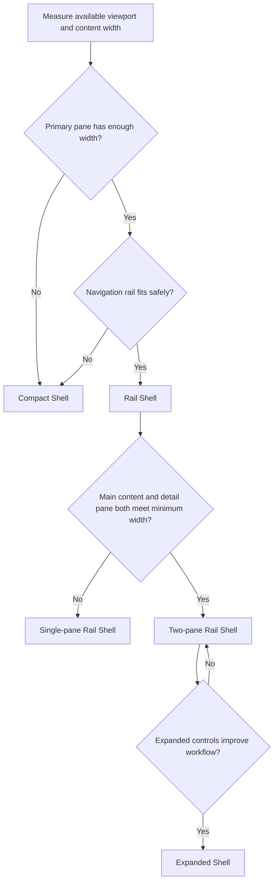
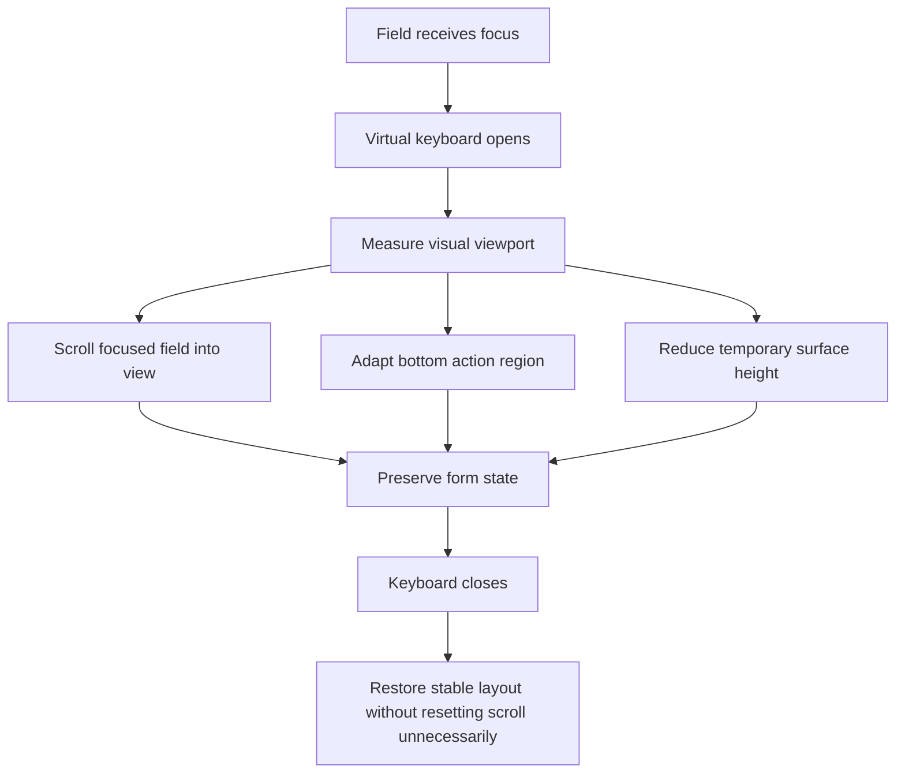
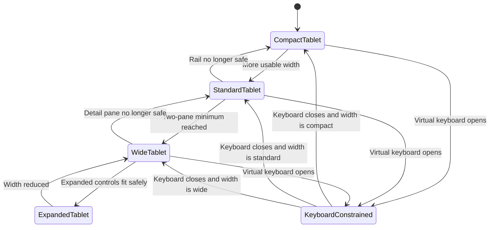
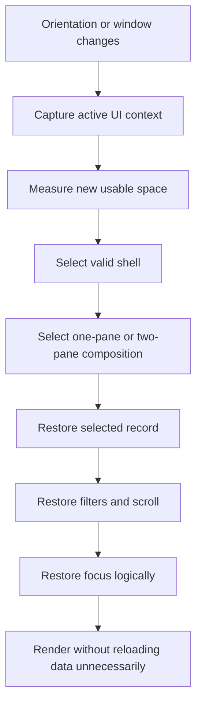
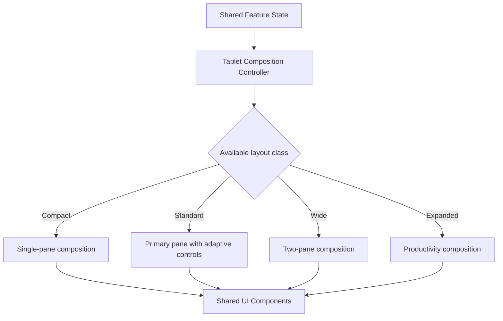
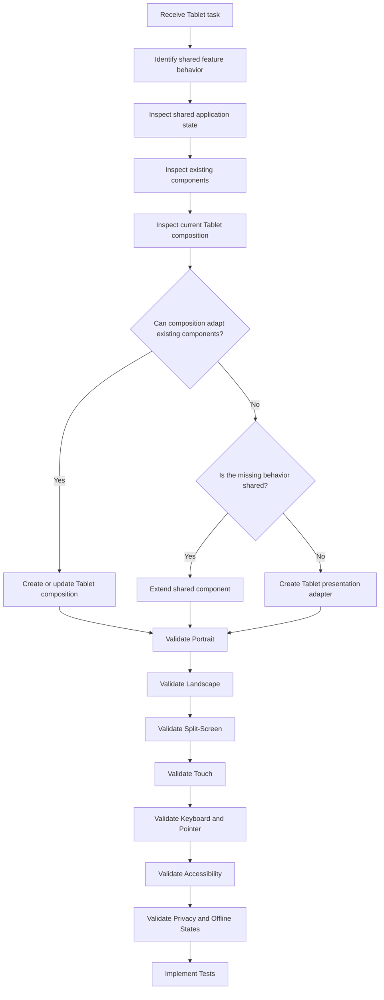

# Nexio Tablet Experience Specification

Version: 1.0  
Status: Official  
Authority Level: Platform Experience Standard  
Applies To: Tablets, Foldables, Large Touch Devices and Hybrid Environments

---

# Purpose

This document defines the official Tablet experience of Nexio.

It establishes:

- Tablet product principles
- Portrait and landscape behavior
- Touch, keyboard, mouse and stylus interaction
- Navigation adaptation
- Application shell
- Responsive composition
- Master-detail behavior
- Multi-pane workflows
- Component transformation
- Virtual keyboard behavior
- Window resizing
- Foldable-device considerations
- Tablet-specific implementation boundaries
- Accessibility and performance requirements

Tablet is a first-class Nexio platform.

It must not be treated as:

```text
A stretched Mobile interface
```

or:

```text
A compressed Desktop interface
```

The Tablet experience must intentionally combine:

- Mobile clarity
- Desktop context
- Touch accessibility
- Adaptive layouts
- Hybrid input support

---

# Relationship with Other Documents

This document must be interpreted together with:

```text
docs/00-FOUNDATION.md
docs/01-ARCHITECTURE.md
docs/02-DESIGN-SYSTEM.md
docs/03-DESKTOP.md
docs/05-MOBILE.md
docs/design-system/COMPONENTS.md
docs/design-system/DESIGN-BIBLE.md
```

Responsibilities are divided as follows:

| Document | Responsibility |
|---|---|
| `00-FOUNDATION.md` | Product philosophy and constitutional principles |
| `01-ARCHITECTURE.md` | Technical layers, dependencies and data flow |
| `02-DESIGN-SYSTEM.md` | Shared visual language and component contracts |
| `03-DESKTOP.md` | Desktop productivity and large-screen behavior |
| `04-TABLET.md` | Hybrid Tablet composition and interaction |
| `05-MOBILE.md` | Mobile, one-handed and quick-action experience |
| `COMPONENTS.md` | Detailed reusable component specifications |

Tablet may adapt shared components.

It may not redefine:

- Financial meaning
- Business calculations
- Validation
- Permissions
- Persistence
- Synchronization rules
- Currency formatting
- Data ownership

---

# Tablet Implementation Ownership

Tablet-specific presentation is currently associated with:

```text
css/tablet.css
js/ui/tablet.js
```

Shared interface behavior is associated with:

```text
js/ui/shared-ui.js
```

The intended relationship is:

```text
Shared Business Logic

↓

Shared Application State

↓

Shared UI Components

↓

Tablet Composition Layer

├── css/tablet.css
└── js/ui/tablet.js
```

Tablet code adapts:

- Layout
- Navigation
- Pane behavior
- Orientation
- Input method
- Density
- Dialog presentation
- Focus movement
- Touch interaction

Tablet code must not duplicate:

- Transaction calculations
- Account balances
- Goal calculations
- Report aggregation
- Authentication
- Supabase access
- Storage logic
- Formatting utilities
- Business validation

---

# Tablet Product Role

Tablet supports sessions that are more involved than typical Mobile use but less stationary than traditional Desktop work.

Typical Tablet use cases include:

- Reviewing financial activity from a sofa or meeting room
- Managing transactions with touch
- Comparing financial summaries in landscape
- Completing forms using an external keyboard
- Reviewing reports with a stylus
- Categorizing multiple transactions
- Inspecting one item while keeping a list visible
- Using Nexio in split-screen mode
- Switching frequently between portrait and landscape
- Operating through Android tablet, foldable or Chromebook-like environments

Tablet must remain effective both as:

```text
A handheld touch device
```

and:

```text
A compact productivity workspace
```

---

# Tablet Experience Principles

## Tablet Is Adaptive

Tablet layout decisions must respond to:

- Available width
- Available height
- Orientation
- Pointer capability
- Keyboard presence
- Touch capability
- Split-screen state
- Window resizing
- Content complexity

Device labels alone are insufficient.

A 12-inch tablet in split-screen may have less usable width than a large phone in landscape.

The interface must respond to actual space.

---

## Touch Is Always a Primary Input

Even when a keyboard or mouse is connected, touch remains a likely interaction method.

Tablet controls must preserve:

- Accessible touch targets
- Adequate spacing
- Clear pressed feedback
- No hover-only actions
- Gesture alternatives
- Stable scroll behavior
- Safe placement near screen edges

Desktop density must not be copied into Tablet without touch validation.

---

## Keyboard and Pointer Are Enhancements

Tablet may support:

- External keyboard
- Trackpad
- Mouse
- Stylus

These inputs should increase efficiency without making touch workflows incomplete.

Examples:

```text
Touch:
Tap transaction to open detail.

Keyboard:
Arrow to transaction and press Enter.

Pointer:
Click transaction and use hover enhancements.

Stylus:
Tap, scroll and select with precision.
```

All input methods must reach the same core functionality.

---

## Orientation Changes Composition

Portrait and landscape are not merely different widths.

They represent different usage modes.

Portrait prioritizes:

- Vertical flow
- Focused content
- Touch interaction
- One primary pane
- Progressive disclosure

Landscape prioritizes:

- Comparison
- Master-detail
- Two-column layouts
- Persistent contextual information
- Keyboard productivity

Orientation must change composition without changing business behavior.

---

## Context Must Be Preserved

When the user rotates the device or resizes the application:

- Selected records should remain selected.
- Filters should remain active.
- Form values should remain intact.
- Scroll should remain stable where possible.
- Open workflows should not restart.
- Drafts should not disappear.
- Financial context should remain unchanged.

Presentation may transform.

User intent must remain intact.

---

## Tablet Density Is Balanced

Tablet should display more information than Mobile without reaching Desktop-level compression.

Recommended default density:

```text
Standard
```

Comfortable density may be used for:

- Portrait forms
- Onboarding
- Touch-heavy actions
- Empty states

Compact density may be used selectively for:

- Landscape transaction review
- Import preview
- Data tables with external keyboard
- Administrative workflows

Compact Tablet controls must remain touch-accessible.

---

## Progressive Disclosure Remains Important

Tablet space should not be filled merely because it exists.

Secondary information may use:

- Expandable sections
- Contextual panels
- Bottom sheets
- Detail panes
- Popovers
- Tabs
- Secondary screens

Tablet should expose additional context when useful, not additional noise.

---

# Target Tablet Environment

The Tablet experience is designed for:

```text
Typical viewport width:
600px to 1199px

Typical orientation:
Portrait or landscape

Primary input:
Touch

Possible additional input:
Keyboard, mouse, trackpad or stylus

Typical session:
Short to medium, with occasional long workflows
```

These ranges are references rather than strict device classifications.

A layout may use Tablet behavior outside these values when capability and content width justify it.

---

# Tablet Width Classes

Official conceptual classes:

| Class | Approximate Width | Typical Behavior |
|---|---:|---|
| Compact Tablet | 600–767px | Mobile-like shell with Tablet spacing |
| Standard Tablet | 768–899px | Navigation rail and adaptive content |
| Wide Tablet | 900–1023px | Two-pane layouts where useful |
| Expanded Tablet | 1024–1199px | Hybrid Tablet/Desktop composition |

The same device may enter different classes through:

- Split-screen
- Orientation
- Browser resizing
- Display scaling
- Foldable posture
- Browser zoom

---

# Compact Tablet

Compact Tablet may appear when:

- A Tablet is used in narrow split-screen.
- A small Tablet is in portrait.
- Browser zoom reduces effective width.
- A foldable uses a narrow pane.

Recommended behavior:

- Single primary content column
- Compact top app bar
- Bottom navigation or compact rail
- Full-screen detail views
- Bottom sheets
- Stacked forms
- Reduced supporting content
- Touch-first controls

Compact Tablet must not force a two-pane layout.

---

# Standard Tablet

Standard Tablet is the primary portrait reference.

Recommended behavior:

- Navigation rail or adaptive bottom navigation
- Single primary content pane
- Optional supporting side region
- Two-column dashboard modules when suitable
- Full-width lists
- Adaptive dialogs
- Comfortable touch spacing
- Persistent page context

---

# Wide Tablet

Wide Tablet commonly appears in landscape.

Recommended behavior:

- Navigation rail
- Two-column dashboard
- Master-detail transaction views
- Persistent filters when space allows
- Side-by-side summaries
- Contextual pane
- Wider forms with related field pairs
- Keyboard enhancements

---

# Expanded Tablet

Expanded Tablet approaches Compact Desktop but remains touch-aware.

It may support:

- Expanded navigation rail
- Compact sidebar
- Persistent contextual panel
- Structured tables
- Multi-column reports
- Command interface
- External-keyboard shortcuts
- Resizable panels with minimum widths

Expanded Tablet must not automatically inherit every Desktop behavior.

Touch targets and touch-safe spacing remain mandatory.

---

# Orientation Model

The official conceptual orientation states are:

```text
Portrait

Landscape

Square or Near-Square

Split-Screen Narrow

Split-Screen Wide
```

The application must not rely only on the CSS `orientation` media feature.

Available content width and height remain more important.

---

# Portrait Experience

Portrait should prioritize:

```text
Page context

↓

Primary financial summary

↓

Immediate actions

↓

Primary content

↓

Secondary details
```

Typical portrait composition:

```text
┌──────────────────────────────┐
│ Top App Bar                  │
├──────────────────────────────┤
│ Page Header                  │
├──────────────────────────────┤
│ Primary Summary              │
├──────────────────────────────┤
│ Main Content                 │
│                              │
│                              │
├──────────────────────────────┤
│ Bottom Navigation or Rail    │
└──────────────────────────────┘
```

Portrait should avoid:

- Three-column layouts
- Dense Desktop tables
- Permanent wide side panels
- Horizontal forms with unrelated fields
- Excessive sticky regions
- Narrow content caused by competing panes

---

# Landscape Experience

Landscape may use:

```text
Navigation rail

Main content

Contextual pane
```

Conceptual layout:

```text
┌──────────┬─────────────────────────────┬──────────────────────┐
│ Nav Rail │ Main Content                │ Contextual Detail    │
│          │                             │                      │
│          │                             │                      │
│          │                             │                      │
└──────────┴─────────────────────────────┴──────────────────────┘
```

Not every landscape screen requires a contextual pane.

The second pane should exist only when it improves:

- Inspection
- Comparison
- Editing
- Navigation efficiency
- Context preservation

---

# Near-Square Experience

Foldables and resized windows may produce near-square layouts.

In this state:

- Avoid assuming portrait behavior.
- Avoid forcing wide landscape composition.
- Evaluate minimum pane widths.
- Prefer a strong primary pane.
- Use temporary detail presentation where needed.
- Preserve touch spacing.

Near-square layouts must be tested independently.

---

# Split-Screen Behavior

Tablet operating systems may place Nexio beside another application.

Split-screen can change width without changing device orientation.

The application must:

- Recalculate available composition.
- Preserve current workflow.
- Collapse panes safely.
- Adapt navigation.
- Keep primary actions visible.
- Avoid clipped dialogs.
- Preserve keyboard behavior.
- Avoid reloading.

---

# Split-Screen Transition Example

```text
Full Landscape Tablet

Navigation Rail + Transaction List + Detail Pane

↓

Wide Split-Screen

Navigation Rail + Transaction List

↓

Narrow Split-Screen

Top Bar + Transaction List

↓

Detail selected

Full-Screen Detail View
```

The selected transaction must remain available throughout the transition.

---

# Tablet Application Shell

The official Tablet shell adapts among three main modes:

```text
Compact Shell

Rail Shell

Expanded Shell
```

---

# Compact Shell

Recommended for:

- Compact Tablet
- Narrow split-screen
- Small portrait layouts

Structure:

```text
Top Application Bar

Main Content

Bottom Navigation or Compact Navigation

Temporary Overlays
```

Conceptual representation:

```text
┌──────────────────────────────┐
│ Top App Bar                  │
├──────────────────────────────┤
│ Main Content                 │
│                              │
│                              │
├──────────────────────────────┤
│ Bottom Navigation            │
└──────────────────────────────┘
```

---

# Rail Shell

Recommended for:

- Standard Tablet
- Wide portrait
- Landscape

Structure:

```text
Navigation Rail

Top Application Bar

Main Content

Optional Contextual Pane
```

Conceptual representation:

```text
┌──────────┬────────────────────────────────────┐
│ Nav Rail │ Top Application Bar                │
│          ├────────────────────────────────────┤
│          │ Main Content                       │
│          │                                    │
│          │                                    │
└──────────┴────────────────────────────────────┘
```

---

# Expanded Shell

Recommended for:

- Expanded Tablet
- Keyboard-and-trackpad usage
- Wide landscape
- Chromebook-like mode

Structure:

```text
Compact Sidebar or Expanded Rail

Top Application Bar

Main Content

Optional Persistent Contextual Pane
```

The Expanded Shell may resemble Compact Desktop.

It must preserve Tablet interaction requirements.

---

# Shell Selection Flow



Shell selection must be deterministic and testable.

---

# Tablet Navigation Strategy

Tablet may use:

```text
Bottom Navigation

Navigation Rail

Expanded Navigation Rail

Compact Sidebar

Top-Level Tabs

Contextual Navigation
```

The chosen pattern depends on space and workflow.

Primary destination names must remain consistent with Desktop and Mobile.

---

# Bottom Navigation

Bottom navigation is appropriate for:

- Compact Tablet
- Narrow split-screen
- Touch-first portrait
- Limited primary destinations

Recommended maximum:

```text
3 to 5 primary destinations
```

Each item requires:

- Icon
- Label
- Selected state
- Accessible name
- Touch target
- Safe-area support

Tablet bottom navigation should not stretch labels across the entire width unnecessarily.

---

# Navigation Rail

Navigation rail is the preferred Standard Tablet pattern.

It may contain:

- Product symbol
- Primary destinations
- Primary creation action
- Secondary destinations
- User access

Conceptual structure:

```text
┌──────────┐
│ Nexio    │
├──────────┤
│ Home     │
│ Trans.   │
│ Accounts │
│ Goals    │
│ Reports  │
├──────────┤
│ Add      │
├──────────┤
│ Settings │
└──────────┘
```

Labels may appear:

- Permanently
- In an expanded state
- Through tooltips
- Through accessible names

Icons alone must not create ambiguity.

---

# Expanded Navigation Rail

Wide Tablet may expand the rail to display labels.

The transition must:

- Preserve selected state.
- Avoid moving the main content unpredictably.
- Respect user preference where supported.
- Collapse automatically when width becomes unsafe.
- Preserve touch targets.

---

# Compact Sidebar

Expanded Tablet may use a compact sidebar when:

- Width is sufficient.
- Keyboard and pointer usage is likely.
- More navigation context improves productivity.
- The main content remains usable.

The sidebar must not become a full Desktop sidebar merely because the device is wide.

---

# Navigation Transformation

Recommended transformation:

```text
Compact Tablet:
Bottom Navigation

↓

Standard Tablet:
Navigation Rail

↓

Wide Tablet:
Expanded Navigation Rail

↓

Expanded Tablet:
Compact Sidebar or Expanded Rail
```

Transformation must not:

- Change destination order.
- Rename destinations.
- reset the current route.
- lose focus.
- duplicate navigation controls.
- expose hidden destinations inconsistently.

---

# Navigation Selected State

Selected state must use:

- Visual surface change
- Text or icon emphasis
- Accessible current-state indication
- Consistent position

Example:

```html
<a
  href="/transactions"
  aria-current="page"
  class="tablet-navigation-item is-selected"
>
  Transactions
</a>
```

Color alone is insufficient.

---

# Tablet Top Application Bar

The top application bar provides:

- Current context
- Back navigation when necessary
- Page title in compact states
- Search
- Global action
- Notifications
- Synchronization status
- User access
- Overflow actions

The bar must remain concise.

---

# Top Bar Modes

Possible modes:

```text
Root Destination

Detail View

Selection Mode

Search Mode

Form Mode
```

---

## Root Destination Mode

May contain:

```text
Page title

Search

Primary action

Notifications or account access
```

---

## Detail View Mode

May contain:

```text
Back action

Item title

Contextual actions

Overflow menu
```

---

## Selection Mode

May contain:

```text
Close selection

Selected count

Bulk actions

Overflow
```

Example:

```text
24 selected
```

---

## Search Mode

May contain:

```text
Back or close

Search input

Clear action

Filter action
```

---

## Form Mode

May contain:

```text
Cancel

Form title

Save or continue action
```

Save behavior must avoid accidental submission.

---

# Top Bar Height

The top bar must:

- Preserve accessible touch targets.
- Avoid excessive vertical occupation.
- Support status-bar safe areas.
- Adjust when text scaling increases.
- Allow titles to truncate only when full context remains available.
- Avoid overlapping window controls in hybrid environments.

---

# Page Header on Tablet

A separate page header may be used in Standard and Wide Tablet layouts.

It may include:

```text
Page title

Short description

Primary action

Period or scope selector

Supporting actions
```

Compact Tablet may combine the title with the top application bar.

Do not display the same title redundantly in both regions without purpose.

---

# Tablet Layout Grid

Tablet should use an adaptive grid rather than a fixed Desktop grid.

Recommended conceptual structure:

```text
Compact Tablet:
4 columns

Standard Tablet:
8 columns

Wide or Expanded Tablet:
12 columns
```

The implementation may use CSS Grid with semantic spans.

---

# Four-Column Grid

Appropriate for:

- Narrow portrait
- Compact split-screen
- Single-column content
- Compact card arrangements

Examples:

```text
4 columns:
Full-width summary

2 + 2:
Two compact metrics

4:
Full-width list
```

---

# Eight-Column Grid

Appropriate for Standard Tablet.

Examples:

```text
4 + 4:
Two summary cards

5 + 3:
Main content and supporting panel

8:
Full-width list or report
```

---

# Twelve-Column Grid

Appropriate for Wide and Expanded Tablet.

Examples:

```text
8 + 4:
Primary report and insight panel

7 + 5:
Transaction list and detail pane

6 + 6:
Period comparison

3 + 9:
Filter region and report
```

Minimum component widths take priority over column distribution.

---

# Grid Implementation Example

```css
.tablet-grid {
  display: grid;
  grid-template-columns: repeat(
    var(--tablet-grid-columns),
    minmax(0, 1fr)
  );
  gap: var(--tablet-grid-gap);
}

@media (min-width: 600px) {
  .tablet-grid {
    --tablet-grid-columns: 4;
  }
}

@media (min-width: 768px) {
  .tablet-grid {
    --tablet-grid-columns: 8;
  }
}

@media (min-width: 1024px) {
  .tablet-grid {
    --tablet-grid-columns: 12;
  }
}
```

Exact breakpoints must align with the canonical token system.

---

# Page Padding

Tablet page padding must adapt to width and input needs.

Recommended semantic tokens:

```css
--tablet-page-padding-inline
--tablet-page-padding-block
--tablet-section-gap
--tablet-card-gap
--tablet-pane-gap
```

Portrait may use smaller inline padding.

Landscape may use wider gutters when content remains efficient.

---

# Content Width

Tablet reading-oriented content should use controlled maximum width.

Examples:

- Help
- Privacy
- Long explanations
- Onboarding

Data-oriented content may use the full available main pane.

Forms should not stretch controls unnecessarily across wide landscape layouts.

---

# One-Pane Layout

One-pane layout is required when:

- Available width is limited.
- The primary workflow needs focus.
- Two panes would create narrow content.
- The virtual keyboard is open.
- Text scaling increases.
- Split-screen reduces width.
- A full-screen form is active.

The secondary context should move to:

- Full-screen detail
- Bottom sheet
- Dialog
- Separate route
- Temporary drawer

---

# Two-Pane Layout

Two-pane layout is appropriate when:

- Both panes meet minimum width.
- Context preservation improves the workflow.
- The secondary pane has meaningful persistent content.
- Touch targets remain accessible.
- Text and financial values remain readable.

Common two-pane patterns:

```text
Transaction List + Transaction Detail

Account List + Account Detail

Goal List + Goal Detail

Category List + Category Editor

Report + Filter or Insight Panel

Settings Categories + Settings Content
```

---

# Two-Pane Width Rules

Each two-pane pattern must define minimum widths.

Example:

```text
Transaction list:
Minimum 360px

Transaction detail:
Minimum 320px
```

If the available width cannot satisfy both plus navigation and gaps, use one pane.

The interface must not compress financial values or action groups to preserve two panes.

---

# Pane Priority

Every two-pane layout must identify:

```text
Primary pane

Secondary pane
```

Primary pane contains the main workflow.

Secondary pane contains context, detail or supporting action.

When collapsing to one pane:

1. Preserve the active user task.
2. Preserve the selected record.
3. Move the secondary pane to a valid presentation.
4. Preserve the return path.
5. Preserve focus logically.

---

# Master-Detail Pattern

Master-detail is a core Tablet pattern.

Example:

```text
Master:
Transaction list

Detail:
Selected transaction
```

Wide layout:

```text
┌────────────────────────────┬───────────────────────────┐
│ Transactions               │ Transaction Detail        │
│                            │                           │
│ Supermarket   −R$ 185,40   │ Supermarket               │
│ Salary      +R$ 4.500,00   │ −R$ 185,40                │
│ Electricity  −R$ 220,00    │ Food · Main Account       │
└────────────────────────────┴───────────────────────────┘
```

Narrow layout:

```text
Transaction List

↓

Tap Transaction

↓

Full-Screen Transaction Detail
```

---

# Master-Detail State Preservation

The following must persist:

- Selected record
- List scroll
- Filters
- Search query
- Sorting
- Selected period
- Draft edit state where safe

When returning from detail, the selected item should remain visible.

---

# Empty Detail Pane

When no item is selected, the secondary pane should not display meaningless empty UI.

Appropriate options:

- Contextual guidance
- Summary of current list
- Prompt to select an item
- Useful insight
- No secondary pane at all

Example:

```text
Select a transaction to view its details.
```

Avoid large decorative empty illustrations in productivity layouts.

---

# Contextual Pane

A contextual pane may be:

```text
Persistent

Temporary

Overlay

Collapsible
```

Use cases:

- Selected-item detail
- Filters
- Assistant context
- Report explanation
- Edit form
- Import warnings

The pane must not become an unrelated content container.

---

# Pane Opening Behavior

When a pane opens through touch:

- Selected state must be visible.
- The detail must be announced when appropriate.
- Focus may remain on the selected item in persistent layouts.
- Focus should move into temporary modal-like panes.
- The close action must be visible.

When opened through keyboard:

- Focus behavior must be intentional.
- Escape should close temporary panes.
- Focus must return to the trigger.

---

# Resizable Panes

Expanded Tablet may support pane resizing when:

- A pointer or trackpad is available.
- Both panes have safe minimum widths.
- The resize handle is accessible.
- The layout remains usable through touch.
- User preference can be persisted safely.

Resizable panes are an enhancement.

A default fixed ratio must always exist.

---

# Resize Handle Accessibility

A resize handle must support:

- Visible boundary
- Pointer dragging
- Keyboard adjustment
- Accessible label
- Minimum and maximum values
- Reset option

Example keyboard behavior:

```text
Arrow Left or Right
→ Resize in small steps

Shift + Arrow
→ Resize in larger steps

Home
→ Minimum size

End
→ Maximum size
```

---

# Tablet Dialog Strategy

Dialog presentation adapts by space and task.

Possible forms:

```text
Centered Dialog

Side Sheet

Bottom Sheet

Full-Screen Dialog

Dedicated Page
```

---

# Centered Dialog

Appropriate for:

- Confirmation
- Small selection
- Short form
- Compact explanation

It must not become too narrow in portrait or too wide in landscape.

---

# Side Sheet

Appropriate for Wide Tablet:

- Detail editing
- Filters
- Contextual configuration
- Assistant panel
- Account selection

A side sheet must transform to full-screen or bottom sheet when width becomes unsafe.

---

# Bottom Sheet

Appropriate for:

- Quick actions
- Filters
- Short selectors
- Context menus
- Compact confirmation
- Touch-first choices

Bottom sheets must support:

- Safe areas
- Virtual keyboard
- Scrollable content
- Visible close behavior
- Stable primary action

---

# Full-Screen Dialog

Appropriate for:

- Transaction creation in portrait
- Long forms
- Multi-step workflows
- Detailed editing
- Complex conflict resolution

Full-screen dialog state must survive orientation changes.

---

# Dedicated Page

Appropriate for:

- Advanced import
- Full reports
- Security configuration
- Complex account setup
- Multi-stage planning
- Long settings workflows

Complexity should determine presentation, not available screen size alone.

---

# Dialog Transformation Matrix

| Wide Tablet | Narrow Tablet |
|---|---|
| Centered dialog | Centered or full-screen dialog |
| Side sheet | Full-screen detail |
| Popover | Bottom sheet |
| Two-pane editor | Full-screen editor |
| Filter panel | Filter drawer or bottom sheet |
| Compact menu | Bottom sheet or menu |

Transformation must preserve action meaning and validation state.

---

# Tablet Form Strategy

Tablet forms must adapt to:

- Orientation
- Width
- Virtual keyboard
- External keyboard
- Touch
- Related field groups
- Text scaling

---

# Portrait Forms

Portrait forms should normally use one column.

Related compact fields may share a row when safe.

Examples:

```text
Date | Time

Month | Year
```

Primary action may remain:

- In the top app bar
- At the end of the form
- In a keyboard-safe sticky footer

Avoid duplicating the same save action in multiple locations.

---

# Landscape Forms

Landscape may use two columns when fields are related.

Example:

```text
Type             Amount

Description      Category

Source account   Destination account

Date             Time
```

Long notes and explanatory content should remain full width.

---

# Form Pane Behavior

A form inside a contextual pane must:

- Provide enough width.
- Avoid horizontal scrolling.
- Keep validation messages visible.
- Support keyboard-safe scrolling.
- Preserve data when the pane transforms.
- Avoid nested dialogs for routine selections.

---

# Virtual Keyboard Behavior

The virtual keyboard changes usable height.

Tablet layouts must:

- Keep the focused field visible.
- Preserve form scroll.
- Avoid obscuring primary actions.
- Allow content to scroll above the keyboard.
- Recalculate bottom-sheet height.
- Prevent sticky regions from stacking incorrectly.
- Avoid dismissing the form on resize.
- Restore the prior layout after the keyboard closes.

---

# Virtual Keyboard Layout Transition



---

# External Keyboard Behavior

When an external keyboard is connected, Tablet should support:

- Tab navigation
- Enter and Space activation
- Escape dismissal
- Arrow navigation
- Form submission shortcuts
- Command palette where supported
- Keyboard shortcut help

Keyboard shortcuts must remain secondary to visible controls.

---

# Pointer and Trackpad Behavior

Pointer support may add:

- Hover emphasis
- Tooltips
- Context menus
- Precise resizing
- Secondary row actions
- Chart details

Hover must not be required.

Pointer interactions must not reduce touch usability.

---

# Stylus Behavior

Stylus input should behave as precise touch input unless a feature explicitly supports drawing or annotation.

Stylus-specific enhancements may include:

- Precise chart inspection
- Hover preview when supported
- Easier drag handles
- Row selection

Nexio must not require handwriting or stylus gestures for financial workflows.

---

# Gesture System

Tablet may use gestures for convenience.

Possible gestures:

```text
Swipe to reveal actions

Drag to reorder

Swipe between related detail items

Pinch chart only when an accessible alternative exists
```

Every gesture requires a visible or keyboard-accessible alternative.

---

# Swipe Actions

Swipe actions may expose:

- Edit
- Archive
- Categorize
- Delete

Rules:

- Destructive action must not trigger from a small accidental movement.
- A visible alternative must exist.
- Full-swipe immediate deletion should be avoided.
- Undo should be provided when safe.
- Swiping must not conflict with horizontal navigation.

---

# Drag and Drop

Tablet drag and drop may support:

- Reordering dashboard modules
- Reordering goals
- Organizing categories
- File import
- Controlled transaction organization

It must provide:

- Drag handle
- Valid target indication
- Cancellation
- Accessible alternative
- Clear completion feedback

---

# Scroll Strategy

Tablet should use one primary vertical scroll whenever possible.

Nested scroll is allowed for:

- Persistent detail pane
- Long dialog content
- Data table
- Independently controlled list
- Import preview
- Side sheet

Nested scroll areas require clear boundaries.

---

# Horizontal Scrolling

Horizontal scrolling should be limited to:

- Time-series charts
- Controlled comparison regions
- Wide data tables when no better adaptation exists
- Carousels with clear purpose

Do not use horizontal scroll as the default solution for Desktop tables on Tablet.

---

# Sticky Regions

Tablet may use sticky:

- Top app bar
- Table header
- Filter controls
- Form action footer
- Detail header
- Selection toolbar

Sticky regions must account for:

- Safe areas
- Virtual keyboard
- Orientation
- Text scaling
- Limited viewport height

Avoid stacking multiple large sticky regions.

---

# Safe Areas

Tablet must support:

```css
env(safe-area-inset-top)
env(safe-area-inset-right)
env(safe-area-inset-bottom)
env(safe-area-inset-left)
```

Safe-area handling applies to:

- Top application bar
- Bottom navigation
- Bottom sheets
- Full-screen dialogs
- Side sheets
- Floating actions
- Landscape edge controls

---

# System Bars

Through Capacitor or browser integration, system-bar appearance should coordinate with:

- Light theme
- Dark theme
- Modal presentation
- Full-screen view
- Orientation
- Navigation background

System bars must not make controls unreadable or appear disconnected from the application.

---

# Tablet Touch Targets

Touch targets should normally be at least:

```text
44 × 44 CSS pixels
```

Primary controls may use larger targets.

Dense landscape tables may use smaller visible controls only when the interactive area remains accessible.

---

# Touch Target Spacing

Adjacent controls must provide enough separation to reduce accidental activation.

Special care is required for:

- Edit and delete
- Save and cancel
- Previous and next
- Account and category selectors
- Navigation destinations
- Chart controls

Destructive actions should not sit directly beside frequent positive actions without separation.

---

# Tablet Financial Values

Financial values must:

- Never truncate.
- Preserve currency.
- Preserve minus signs.
- Use tabular numerals.
- Remain readable in both orientations.
- Avoid breaking across lines.
- Support privacy mode.
- Remain contextualized.

When width becomes constrained:

1. Wrap supporting labels.
2. Reduce secondary metadata.
3. Move secondary content.
4. Use compact notation only when exact value remains accessible.
5. Transform layout.

Do not reduce the amount to an unreadable size.

---

# Tablet Charts

Tablet charts may provide more detail than Mobile.

Portrait:

- Focused chart
- Limited labels
- Text summary
- Scrollable period when useful

Landscape:

- Wider time range
- Comparison series
- Visible legend
- Detail inspection
- Supporting data table

Charts must remain usable with touch and keyboard.

---

# Chart Touch Interaction

Touch chart interactions should:

- Use sufficiently large data targets.
- Provide tap-to-inspect.
- Avoid requiring precise hover.
- Keep selected information visible.
- Support dismissal.
- Avoid accidental page scrolling conflicts.
- Provide an accessible textual equivalent.

---

# Tablet Tables

Tablet tables must be used intentionally.

Appropriate when:

- Comparison across rows and columns is essential.
- Width supports the required columns.
- Touch targets remain safe.
- A structured list would reduce understanding.
- Keyboard or pointer use may improve productivity.

---

# Table Adaptation

Possible adaptations:

```text
Expanded Tablet:
Structured table

Wide Tablet:
Priority columns

Standard Tablet:
Condensed table or list

Compact Tablet:
Structured card list
```

Columns must be prioritized.

Do not hide data arbitrarily.

---

# Table Touch Behavior

Rows should be selectable through the entire valid row target when appropriate.

Row actions may use:

- Visible overflow button
- Selection mode
- Detail pane
- Swipe enhancement

Actions must not appear only through hover.

---

# Selection Mode

Tablet selection mode should change the top app bar or contextual toolbar.

Recommended content:

```text
Close selection

Selected count

Primary bulk actions

Overflow
```

Selection must remain stable during orientation changes.

---

# Bulk Actions

Bulk actions may include:

- Categorize
- Move
- Tag
- Export
- Archive
- Delete

The interface must show the affected count.

High-impact actions require confirmation.

Partial failures must identify affected records.

---

# Tablet Search

Search may appear as:

- Top app bar expansion
- Persistent search field in Wide Tablet
- Search screen in Compact Tablet
- Command palette in Expanded Tablet

Search state should preserve:

- Query
- Filters
- Selected scope
- Result position
- Selected record where valid

---

# Tablet Filters

Filters may appear as:

```text
Visible filter row

Popover

Side sheet

Bottom sheet

Full filter screen
```

Wide Tablet may keep common filters visible.

Compact Tablet should move filters to a touch-friendly temporary surface.

---

# Active Filters

Active filters must remain visible through:

- Filter tokens
- Summary label
- Active count
- Selected period
- Clear action

Example:

```text
Filters · 3
```

The label must communicate active state without color alone.

---

# Tablet Responsive State Machine



Layout state must not become business state.

---

# Orientation Transition Flow



---

# Tablet CSS Responsibilities

`css/tablet.css` may contain:

- Tablet shell composition
- Portrait and landscape adaptation
- Navigation rail layout
- Tablet grid rules
- Pane behavior
- Tablet-specific spacing tokens
- Touch-aware density
- Dialog transformations
- Split-screen adaptation
- Tablet table adaptation
- Safe-area behavior
- Capability-based pointer enhancements

It must not contain:

- New brand colors
- Independent button systems
- Business calculations
- Shared validation styles
- Desktop fixes
- Mobile fixes
- Duplicate component foundations
- Authentication behavior
- Supabase logic
- Currency formatting rules

---

# Tablet JavaScript Responsibilities

`js/ui/tablet.js` may coordinate:

- Shell selection
- Navigation-rail expansion
- Orientation transitions
- One-pane and two-pane transformation
- Detail-pane behavior
- Tablet focus restoration
- Virtual-keyboard adaptation
- External-keyboard shortcuts
- Touch-selection mode
- Tablet-specific drag behavior
- Split-screen state
- Resizable pane enhancement
- Capability detection

It must not:

- Calculate balances.
- Save transactions directly to persistence.
- Access Supabase directly.
- Duplicate shared application state.
- Reimplement transaction validation.
- Format currency independently.
- Contain Desktop-only behavior.
- Contain Mobile-only business behavior.
- Create feature-specific storage.

---

# Capability Detection

Tablet behavior should use:

- Viewport size
- Container size
- Visual viewport
- Pointer type
- Hover capability
- Touch points
- Keyboard events
- Orientation
- Fold information when supported
- Actual layout constraints

User-agent detection should not be the main strategy.

---

# Capability Examples

```css
@media (pointer: coarse) {
  /* Touch-first spacing */
}

@media (hover: hover) and (pointer: fine) {
  /* Pointer enhancement */
}

@media (min-width: 900px) {
  /* Candidate for two-pane composition */
}
```

JavaScript may supplement CSS when behavior requires state coordination.

---

# Foldable Devices

Foldable devices may expose:

- One large continuous surface
- Two logical regions
- A hinge or fold obstruction
- Changing posture
- Rapid width changes

Nexio should support foldables through adaptive layout rather than device-specific assumptions.

---

# Fold and Hinge Awareness

When fold APIs are available, avoid placing:

- Primary actions
- Text
- Financial values
- Input controls
- Dialog boundaries
- Drag handles

directly beneath a hinge or fold obstruction.

Two logical regions may support:

```text
Master list on one region

Detail on the other region
```

only when both remain usable.

---

# Fold Transition

Opening or closing a foldable must not:

- Reset the route.
- Discard forms.
- Duplicate panes.
- submit actions.
- restart synchronization.
- expose hidden values.
- lose selected records.

---

# Tablet Windowing Environments

Tablet may run through:

- Android split-screen
- Floating windows
- Samsung DeX
- ChromeOS
- Browser-installed application
- Desktop-like Android environments

The application must adapt to window size rather than assuming full-screen use.

---

# DeX and Desktop-Like Mode

In desktop-like mode:

- Pointer and keyboard enhancements may activate.
- Expanded Tablet or Compact Desktop composition may be used.
- Touch targets must remain safe.
- Browser-like window resizing must work.
- System title bars must not overlap controls.
- Desktop-only assumptions must remain avoided.

---

# Tablet Privacy Mode

Balance privacy must apply to:

- Dashboard summaries
- Transaction lists
- Detail panes
- Reports
- Search results
- Assistant context
- Notifications
- Command interface
- Clipboard actions
- Recent-item previews

Orientation or pane transformation must not briefly reveal hidden values.

---

# Tablet Offline Behavior

Tablet should support offline-capable actions according to the shared architecture.

Possible actions:

- Review cached data
- Create transaction
- Edit draft
- Categorize cached records
- Update supported preferences
- Queue changes

Offline status must remain visible but non-blocking.

---

# Synchronization Indicator

The shell may communicate:

```text
Synchronized

Synchronizing

Offline

Changes pending

Action required
```

Routine synchronization should not interrupt touch workflows.

---

# Tablet Performance Principles

Tablet hardware varies widely.

The experience must remain responsive on mid-range devices.

Priorities:

- Stable scrolling
- Fast touch feedback
- Controlled chart rendering
- Incremental list updates
- Limited simultaneous panes
- Efficient orientation transitions
- Memory cleanup
- Lazy-loading secondary content

---

# Orientation Performance

Orientation changes should avoid:

- Full application rerender
- Duplicate data requests
- Recreating all charts unnecessarily
- Losing virtualization state
- Reinitializing services
- Rebinding global events repeatedly

Only the affected composition should update.

---

# Tablet Accessibility Principles

Tablet accessibility must support:

- Touch
- Keyboard
- Screen readers
- Switch access
- Text scaling
- Zoom
- Reduced motion
- High contrast
- Orientation change
- Multiple pointer types

---

# Screen-Reader Orientation Changes

Orientation changes should not announce the entire application again unnecessarily.

The application should preserve:

- Current route
- Heading context
- Selected record
- Active dialog
- Focus target

Important layout changes may be announced only when necessary for understanding.

---

# Focus During Pane Transformation

Example:

```text
Wide Tablet:
Transaction row focused and detail pane visible.

↓

Compact Tablet:
Detail becomes full-screen.

↓

Focus moves to detail heading.

↓

User closes detail.

↓

Focus returns to the original transaction row.
```

Focus restoration must use stable record identifiers.

---

# Text Scaling

At increased text size:

- Navigation may transform earlier.
- Two panes may collapse.
- Actions may move to overflow.
- Controls must grow.
- Financial values must remain intact.
- Horizontal scrolling must not become necessary for ordinary content.
- Fixed-height cards must expand.

---

# Reduced Motion

Tablet transitions must respect:

```text
prefers-reduced-motion
```

Reduced motion should remove unnecessary sliding, scaling and orientation effects.

It must preserve:

- State feedback
- Loading meaning
- Selection
- Progress
- Error communication
- Focus visibility

---

# Tablet Foundational Anti-Patterns

The following are prohibited:

## Large Mobile Copy

Using a single oversized Mobile column without adapting information density.

## Compressed Desktop Copy

Forcing Desktop sidebar, table and multi-column layout into insufficient width.

## Orientation Reset

Restarting the current workflow after rotation.

## Permanent Two-Pane Layout

Keeping two panes even when both become unusable.

## Touch-Inaccessible Density

Using small Desktop controls because a keyboard may be connected.

## Hover Dependency

Hiding required actions until pointer hover.

## Gesture-Only Actions

Requiring swipe, drag or stylus input without alternatives.

## Duplicate Tablet Business Logic

Calculating financial values inside `tablet.js`.

## Fixed Full-Screen Assumption

Ignoring split-screen and windowed modes.

## Keyboard-Unsafe Forms

Allowing the virtual keyboard to hide focused fields or primary actions.

## Uncontrolled Sticky Regions

Reducing the usable content height excessively.

## Arbitrary Navigation Changes

Changing destination order according to orientation.

## Lost Selection

Closing or changing detail without preserving the selected item.

## Hinge Obstruction

Placing essential controls across a fold or hinge.

---

# Tablet Foundation Review Questions

Before approving Tablet behavior, verify:

```text
What is the primary task?

Does portrait prioritize focus?

Does landscape improve context or comparison?

Can the screen safely use two panes?

What happens in split-screen?

What happens when the virtual keyboard opens?

Can every action be completed through touch?

Can every critical action be completed through keyboard?

Does pointer support enhance rather than control the workflow?

Does orientation preserve state?

Do financial values remain readable?

Does text scaling cause an earlier safe transformation?

Does privacy mode remain protected?

Does Tablet code reuse shared business logic?
```

---

# Tablet Foundation Acceptance Criteria

The Tablet foundation is accepted only when:

```text
□ Tablet is implemented as a distinct adaptive experience.

□ Portrait and landscape compositions are intentional.

□ Compact, Standard, Wide and Expanded Tablet modes are defined.

□ Navigation transforms without changing information architecture.

□ Touch remains a primary supported input.

□ Keyboard and pointer provide optional efficiency.

□ One-pane and two-pane layouts use documented minimum widths.

□ Master-detail state survives layout transformation.

□ Orientation changes preserve filters, forms and selection.

□ Split-screen behavior is supported.

□ Virtual keyboard behavior is safe.

□ Safe areas and system bars are respected.

□ Financial values never truncate.

□ Tables transform according to column priority.

□ Gestures have visible alternatives.

□ Foldable obstructions are considered.

□ Light and Dark themes are supported.

□ Privacy mode remains protected.

□ Tablet CSS contains only platform adaptation.

□ Tablet JavaScript contains only platform coordination.

□ No financial calculation is duplicated.

□ Loading, offline and synchronization states remain understandable.

□ Touch targets meet accessibility requirements.

□ Keyboard focus remains predictable.

□ Mid-range Tablet performance is considered.
```

---

# Tablet Constitutional Rule

Every Tablet decision must answer:

```text
Does this layout preserve Mobile clarity while using additional space to improve context, comparison or productivity?
```

When the answer is unclear, prefer the solution that:

- Protects the primary task.
- Preserves touch accessibility.
- Collapses complexity safely.
- Maintains user context.
- Supports both orientations.
- Responds to actual space.
- Reuses shared components.
- Preserves business logic.
- Avoids unnecessary panes.
- Remains effective in split-screen mode.

Tablet is the adaptive expression of Nexio.

It is neither a larger phone nor a smaller computer.

---

# Tablet Feature Experiences

This section defines how the primary Nexio features behave on Tablet.

Tablet compositions must consume the same:

```text
Application state

Business rules

Services

Repositories

Validation

Financial calculations

Formatting utilities

Design System components
```

Tablet may adapt:

- Information density
- Navigation placement
- One-pane and two-pane composition
- Touch interaction
- Selection behavior
- Dialog presentation
- Visible metadata
- Keyboard enhancements
- Orientation-specific layouts

Tablet must not create an independent version of any financial feature.

---

# Feature Adaptation Model

Each feature should define at least three compositions:

```text
Compact Tablet

Standard Portrait Tablet

Wide or Landscape Tablet
```

Expanded Tablet may use additional Desktop-like enhancements when touch accessibility remains preserved.

The feature should transform based on usable space rather than maintaining separate business implementations.

---

# Shared Feature Transformation



The same state must remain valid when the composition changes.

---

# Tablet Dashboard

The Tablet dashboard should provide a complete financial overview without reproducing the density of Desktop or the narrow focus of Mobile.

It should help users answer:

```text
What is my current financial position?

What changed during the selected period?

What requires attention?

What should I do next?
```

---

# Dashboard Portrait Composition

Recommended structure:

```text
Top Application Bar

↓

Page Context and Period

↓

Primary Financial Summary

↓

Income, Expenses and Result

↓

Upcoming Obligations

↓

Recent Transactions

↓

Budgets and Goals

↓

Financial Insights
```

Conceptual layout:

```text
┌──────────────────────────────────┐
│ Dashboard              July 2026│
├──────────────────────────────────┤
│ Available Balance                │
│ R$ 14.250,00                     │
│ +R$ 850,00 this month            │
├─────────────────┬────────────────┤
│ Income          │ Expenses       │
│ R$ 6.500,00     │ R$ 5.650,00   │
├──────────────────────────────────┤
│ Cash Flow                         │
├──────────────────────────────────┤
│ Upcoming Obligations              │
├──────────────────────────────────┤
│ Recent Transactions               │
└──────────────────────────────────┘
```

Portrait may use two columns for compact related summaries.

Primary content should remain vertically scrollable.

---

# Dashboard Landscape Composition

Landscape may use an adaptive grid.

Recommended structure:

```text
Primary summary across full width

↓

Main trend or cash-flow chart

+

Upcoming obligations

↓

Recent transactions

+

Budgets, goals or insights
```

Conceptual layout:

```text
┌──────────────────────────────────────────────────────────┐
│ Financial Summary                                        │
├────────────────────────────────────┬─────────────────────┤
│ Cash Flow                          │ Upcoming Obligations │
│                                    │                     │
├────────────────────────────────────┼─────────────────────┤
│ Recent Transactions                │ Goals and Budgets   │
└────────────────────────────────────┴─────────────────────┘
```

Landscape should expose more context without presenting every available metric.

---

# Dashboard Expanded Tablet

Expanded Tablet may support:

- Persistent navigation rail
- Wider financial chart
- Two-column transaction and obligation regions
- Visible period comparison
- Contextual insight pane
- Keyboard navigation
- Pointer chart inspection

It must preserve touch-safe controls.

---

# Dashboard Primary Summary

The summary should display:

```text
Financial context label

Primary balance

Period result

Relevant variation

Account scope

Privacy control
```

Examples of account scope:

```text
All active accounts

Main account

3 selected accounts
```

The summary must never leave the user uncertain about which accounts or period are included.

---

# Dashboard Privacy Mode

Privacy mode must apply immediately to:

- Main balance
- Income
- Expenses
- Monthly result
- Account summaries
- Goal amounts
- Transaction values
- Chart tooltips
- Accessibility labels
- Assistant context

Changing orientation must not briefly reveal hidden amounts.

The hidden state should preserve layout stability.

---

# Dashboard Period Selection

Compact Tablet may use:

- Segmented control
- Compact select
- Bottom-sheet selector

Wide Tablet may use:

- Visible period controls
- Comparison toggle
- Custom date-range popover

All dashboard modules must use the same active period unless a module clearly declares an independent scope.

---

# Dashboard Module Priority

Recommended order:

```text
1. Current financial position

2. Period result

3. Upcoming obligations

4. Cash-flow trend

5. Recent transactions

6. Budget progress

7. Goal progress

8. Insights
```

A user configuration may reorder approved secondary modules.

Critical financial information should remain protected from removal.

---

# Dashboard Interaction

Tapping a dashboard module should navigate with context.

Examples:

```text
Expense summary
→ Open Transactions filtered by expenses and selected period.

Upcoming obligation
→ Open the relevant transaction or obligation detail.

Goal card
→ Open Goal detail.

Chart category
→ Open related transactions or report breakdown.
```

Contextual navigation must preserve the selected dashboard period.

---

# Dashboard Loading

The recommended loading sequence is:

```text
Application shell

↓

Cached primary financial summary

↓

Primary modules

↓

Transactions and obligations

↓

Charts

↓

Secondary insights
```

A chart request must not block the balance summary.

---

# Dashboard Partial Failure

Each dashboard module should manage its own failure.

Example:

```text
Financial summary:
Available

Recent transactions:
Available

Goals:
Available

Cash-flow chart:
Could not load
```

The dashboard must remain usable.

---

# Dashboard Empty States

First use:

```text
Start organizing your finances

Create an account and add your first transaction to build your dashboard.

[Create account]
```

No data for selected period:

```text
No activity in this period

Choose another period or add a transaction.

[Change period] [Add transaction]
```

Do not render a grid of unrelated empty modules.

---

# Dashboard Tablet Anti-Patterns

Forbidden:

- Copying the full Desktop dashboard into portrait.
- Displaying only one oversized Mobile card in landscape.
- Showing several equally dominant charts.
- Repeating the same balance in multiple modules.
- Resetting the selected period after rotation.
- Allowing a chart failure to block the dashboard.
- Revealing hidden values during layout changes.
- Making modules draggable without a non-drag alternative.
- Using touch-inaccessible chart controls.

---

# Dashboard Tablet Acceptance Criteria

```text
□ Portrait has a clear vertical hierarchy.

□ Landscape improves comparison and context.

□ The selected period remains visible.

□ Financial scope is explicit.

□ Privacy mode protects every related module.

□ Partial failures remain isolated.

□ Module navigation preserves context.

□ Charts support touch and accessible alternatives.

□ Orientation changes preserve state.

□ Empty states provide the correct next action.

□ Large financial values remain readable.
```

---

# Tablet Transactions

The Tablet transactions experience must support:

- Fast review
- Touch selection
- Search and filtering
- Editing
- Categorization
- Master-detail inspection
- Bulk actions
- External-keyboard productivity
- Offline changes

Tablet should show more transactional context than Mobile while avoiding an overly compressed Desktop table.

---

# Transactions Compact Tablet

Compact Tablet should use a structured transaction list.

Recommended item structure:

```text
Category icon

Description

Amount

Category or account

Date

Status
```

Example:

```text
[Icon] Supermarket                 −R$ 185,40
       Food · Main account · 21 Jul.
```

The amount must remain visible and aligned consistently.

---

# Transactions Standard Portrait

Portrait may use:

```text
Search and filter toolbar

Compact summary

Structured transaction list

Full-screen transaction detail
```

Common filters may remain visible as compact controls.

Advanced filters should open in a bottom sheet or full-screen filter view.

---

# Transactions Landscape

Landscape should support master-detail when minimum widths are met.

Conceptual layout:

```text
┌───────────────────────────────┬───────────────────────────────┐
│ Search and Filters            │ Transaction Detail            │
├───────────────────────────────┤                               │
│ Supermarket       −R$ 185,40 │ Description                   │
│ Salary          +R$ 4.500,00 │ Amount                        │
│ Electricity      −R$ 220,00  │ Account                       │
│                               │ Category                      │
│                               │ Date                          │
│                               │ Actions                       │
└───────────────────────────────┴───────────────────────────────┘
```

The list and detail panes must each meet documented minimum widths.

---

# Transaction Summary

A compact summary may include:

```text
Income

Expenses

Net result

Transaction count
```

It must clearly represent the current:

- Period
- Search
- Filters
- Account scope

The summary should collapse or move when it reduces list usability.

---

# Transaction Search

Search may appear as:

- Persistent field in Wide Tablet
- Expandable top-bar search in Standard Tablet
- Dedicated search mode in Compact Tablet

Search must preserve:

- Query
- Filters
- Result position
- Selected transaction
- Sorting

Opening a transaction must not clear the search.

---

# Transaction Filters

Common filters:

```text
Period

Type

Account

Category

Status
```

Advanced filters:

```text
Amount range

Recurring state

Tags

Import state

Reconciliation state
```

Compact Tablet should show the number of active filters.

Example:

```text
Filters · 3
```

---

# Transaction Filter Sheet

A filter sheet should include:

```text
Filter title

Current filter groups

Clear action

Apply action

Result preview when practical
```

Changing filters should not immediately close the sheet unless the interaction pattern is clearly designed for live filtering.

---

# Transaction Grouping

Tablet may group transactions by:

```text
Day

Month

Account

Category
```

Date grouping is recommended for general review.

Group headers should remain compact.

---

# Transaction Detail

The detail presentation depends on layout:

| Layout | Detail Presentation |
|---|---|
| Compact Tablet | Full-screen detail |
| Standard Portrait | Full-screen or side sheet |
| Wide Landscape | Persistent second pane |
| Expanded Tablet | Persistent or resizable pane |

The transaction detail should include:

- Description
- Exact amount
- Type
- Date
- Account
- Destination account for transfer
- Category
- Status
- Recurrence
- Notes
- Relevant actions

---

# Transaction Detail Navigation

In full-screen detail:

```text
Back action
→ Return to the same list position.

Previous and next
→ Move between current filtered results when supported.
```

The user should not lose the active search or filters.

---

# Transaction Editing

Editing may use:

- Full-screen form in portrait
- Side sheet in landscape
- Detail-pane edit mode
- Centered dialog for very small changes

The form must preserve canonical values during presentation transformation.

---

# Add Transaction

Recommended primary fields:

```text
Type

Amount

Description

Account

Category

Date
```

Secondary fields:

```text
Notes

Tags

Recurring options

Attachments

Advanced metadata
```

Portrait should normally use one column.

Landscape may pair related fields.

---

# Quick Transaction Creation

Tablet may expose a visible creation action through:

- Top app bar
- Navigation rail action
- Page header
- Keyboard shortcut
- Command interface in Expanded Tablet

The action should open the same shared transaction workflow.

---

# Transaction Type Switching

Switching among:

```text
Income

Expense

Transfer
```

must update the form safely.

For example, Transfer requires:

```text
Source account

Destination account
```

Changing the type must not silently discard completed fields without warning.

---

# Tablet Transaction Selection Mode

Long press, checkbox or toolbar action may begin selection.

Selection mode should display:

```text
Close selection

Selected count

Common bulk actions

Overflow menu
```

Example:

```text
12 selected
```

Selection must survive orientation changes when the records remain valid.

---

# Bulk Actions

Possible Tablet bulk actions:

- Categorize
- Move account where valid
- Add tag
- Export
- Archive
- Delete

Common actions may appear directly.

Secondary actions should move to overflow.

Destructive actions require protection.

---

# Select-All Scope

Tablet must distinguish:

```text
Select all visible

Select all matching filters
```

The selected quantity must remain visible.

---

# Swipe Actions

Swipe may expose:

- Edit
- Categorize
- Archive
- Delete

Rules:

- The visible action menu remains available.
- Full-swipe deletion is discouraged.
- Destructive actions require undo or confirmation.
- Swipe must not conflict with system-back gestures.
- Swipe must not be required.

---

# Transaction Keyboard Behavior

With an external keyboard:

```text
Arrow keys
→ Navigate records when list-navigation mode is active.

Enter
→ Open transaction.

Space
→ Toggle selection.

Escape
→ Close temporary detail or selection mode.

Ctrl/Command + Enter
→ Save valid transaction form.
```

Shortcuts must not trigger while the user is entering text unless appropriate.

---

# Transaction Offline Behavior

Offline-capable operations may include:

- Create transaction
- Edit cached transaction
- Categorize
- Add note
- Archive when safely queueable

The interface must show:

```text
Saved on this device

Pending synchronization
```

It must not claim cloud synchronization before confirmation.

---

# Transaction Conflict

When a record changes remotely while being edited:

```text
This transaction was updated elsewhere.

Review the latest version before saving.
```

The user may be offered:

- Review latest
- Compare changes
- Discard local edit
- Explicit merge when supported

Silent overwrite is forbidden when conflict detection is available.

---

# Transactions Tablet Anti-Patterns

Forbidden:

- Forcing a full Desktop table into portrait.
- Converting every transaction into an oversized card.
- Clearing filters after editing.
- Using swipe as the only action path.
- Allowing rotation to close selection mode.
- Treating transfers as normal expenses.
- Truncating financial amounts.
- Hiding required actions behind hover.
- Rendering thousands of rows simultaneously.
- Claiming synchronization while changes remain local.

---

# Transactions Tablet Acceptance Criteria

```text
□ Compact Tablet uses a structured touch-friendly list.

□ Landscape uses master-detail only when widths are safe.

□ Search and filters remain combined.

□ Selection survives valid layout changes.

□ Exact financial values never truncate.

□ Edit preserves list state.

□ Swipe actions have visible alternatives.

□ Bulk actions show affected quantity.

□ Offline changes show pending status.

□ Conflict handling prevents silent overwrite.

□ Keyboard interaction enhances but does not replace touch.
```

---

# Tablet Accounts

The Accounts experience should help users understand:

```text
Where money is held

What is owed

How each account is changing

Which accounts require attention
```

Tablet may combine account overview and account detail more effectively than Mobile.

---

# Accounts Portrait

Recommended structure:

```text
Account position summary

↓

Account groups or filters

↓

Account cards or structured list

↓

Full-screen account detail
```

Account cards should remain compact.

---

# Accounts Landscape

Landscape may use:

```text
Account list or grid

+

Selected account detail
```

Conceptual layout:

```text
┌──────────────────────────────┬─────────────────────────────┐
│ Accounts                     │ Main Account                │
│                              │                             │
│ Main Account   R$ 8.500,00  │ Current balance            │
│ Savings        R$ 5.200,00  │ Recent transactions         │
│ Credit Card   −R$ 1.450,00  │ Balance history             │
└──────────────────────────────┴─────────────────────────────┘
```

---

# Account Position Summary

The summary may include:

```text
Positive balances

Liabilities

Net position

Active accounts
```

Assets and liabilities must remain distinct.

Multiple currencies must be handled explicitly.

---

# Account Card Behavior

An account card may show:

- Account name
- Type or institution
- Current balance
- Available balance where relevant
- Status
- Recent variation
- Synchronization state

The card must indicate whether it:

- Navigates
- Selects
- Opens a detail pane
- Performs an action

---

# Account Detail

Tablet account detail may include:

```text
Current balance

Available balance

Recent transactions

Balance history

Period summary

Pending items

Account settings
```

The detail view must remain scoped to the account.

---

# Account Creation

Portrait should generally use a full-screen form.

Landscape may use a side sheet when the form remains comfortable.

Common fields:

```text
Name

Type

Initial balance

Currency

Institution

Optional icon or approved color
```

The meaning of initial balance must be explained.

---

# Account Archive

Archiving should be preferred when transaction history exists.

The interface must explain that archived accounts:

- Stop appearing in routine selectors
- Preserve historical records
- Remain in applicable reports
- May be restored where supported

---

# Account Deletion

Deletion must explain the effect on:

- Transactions
- Reports
- Goals
- Transfers
- Synchronization
- Historical data

A narrow confirmation dialog is insufficient when dependencies require review.

---

# Accounts Tablet Anti-Patterns

Forbidden:

- Displaying unmasked account identifiers.
- Combining debt and positive balance without labels.
- Requiring hover to access account actions.
- Deleting transaction history silently.
- Presenting stale synchronized data without status.
- Using an independent Tablet balance calculation.
- Resetting the selected account after rotation.

---

# Accounts Tablet Acceptance Criteria

```text
□ Portrait supports efficient account review.

□ Landscape may preserve account list and detail.

□ Assets and liabilities remain distinct.

□ Account identifiers are protected.

□ Initial balance behavior is explained.

□ Archive preserves history.

□ Delete identifies dependencies.

□ Selection survives orientation changes.

□ Account balances use shared calculations.
```

---

# Tablet Goals

Tablet should support goal review, contribution and scenario planning.

The experience should balance:

- Visual progress
- Exact financial values
- Touch interaction
- Planning context

---

# Goals Portrait

Recommended structure:

```text
Goals summary

↓

Active goal cards

↓

Completed or archived goals

↓

Full-screen goal detail
```

Cards should prioritize:

- Goal name
- Current value
- Target value
- Progress
- Remaining amount
- Expected completion
- Contribution action

---

# Goals Landscape

Landscape may use:

```text
Goal list

+

Selected goal detail or planning panel
```

The detail may display:

- Contribution history
- Progress chart
- Target configuration
- Monthly requirement
- Scenario controls

---

# Goal Progress

Progress must be represented through:

```text
Current amount

Target amount

Percentage

Remaining amount

Visual progress
```

A chart alone is insufficient.

---

# Goal Contribution

The contribution flow must explain whether it:

- Moves money between accounts
- Creates a planning allocation
- Records an external contribution
- Updates a simulated amount

This meaning must come from the shared product model.

---

# Goal Scenario Planning

Wide Tablet may support interactive scenarios.

Examples:

```text
Increase monthly contribution

Change target date

Add one-time contribution

Compare completion dates
```

Scenario changes must remain temporary until explicitly applied.

---

# Goal Detail Transformation

Wide landscape:

```text
Goal summary + scenario panel
```

Portrait:

```text
Goal summary

↓

Progress

↓

Contribution history

↓

Planning controls
```

The same data and calculations must be used.

---

# Goals Tablet Anti-Patterns

Forbidden:

- Using progress color as the only status.
- Treating a simulation as a saved change.
- Hiding the exact target.
- Combining multiple currencies silently.
- Claiming guaranteed completion.
- Changing account balances through Tablet-only UI logic.
- Losing unsaved scenario inputs after rotation.

---

# Goals Tablet Acceptance Criteria

```text
□ Current, target and remaining values are visible.

□ Progress includes text and visual information.

□ Contributions explain their financial effect.

□ Scenario changes require explicit application.

□ Landscape may support planning beside goal context.

□ Portrait remains focused and readable.

□ Orientation preserves draft scenarios.

□ Status uses shared business rules.
```

---

# Tablet Reports

Tablet reports should support meaningful financial analysis without reproducing the full density of Desktop.

Portrait should prioritize:

- Summary
- One primary visualization
- Key findings
- Filter access
- Accessible data

Landscape may support:

- Comparison
- Wider charts
- Persistent filters
- Supporting breakdown
- Drill-down pane

---

# Reports Portrait

Recommended structure:

```text
Report title and period

↓

Textual summary

↓

Primary chart

↓

Key breakdown

↓

Accessible table or detail list

↓

Secondary findings
```

Filters may open through a bottom sheet or full-screen filter view.

---

# Reports Landscape

Recommended structure:

```text
Filter or report controls

↓

Summary

↓

Primary chart

+

Supporting breakdown or insight pane

↓

Detailed table
```

Conceptual layout:

```text
┌────────────────────────────────┬──────────────────────────┐
│ Expense Trend                  │ Category Breakdown       │
│                                │                          │
│ Chart                          │ Housing      34%         │
│                                │ Food         21%         │
├────────────────────────────────┴──────────────────────────┤
│ Accessible Data Table                                     │
└───────────────────────────────────────────────────────────┘
```

---

# Report Filters

Common filters may remain visible in Wide Tablet.

Advanced filters should use:

- Side sheet
- Filter pane
- Full-screen filter workflow

Active report scope must always remain visible.

---

# Report Context

Every report must show:

- Type
- Period
- Account scope
- Currency
- Applied filters
- Comparison period
- Data update context where relevant

---

# Chart Touch Behavior

Tablet charts should support:

- Tap-to-inspect
- Selected-point persistence
- Large touch targets
- Dismissible details
- Keyboard focus when possible
- Text summary
- Accessible table

Hover-only tooltips are insufficient.

---

# Report Drill-Down

Tapping a category or data point may open:

- Contextual detail pane
- Filtered transaction list
- Bottom sheet
- Full-screen detail

Drill-down must preserve the report state.

---

# Report Comparison

Landscape may compare:

```text
Current period and previous period

Two accounts

Budget and actual result

Category changes
```

Comparison must explain when values are incomplete or not comparable.

---

# Report Export

Tablet export may offer:

```text
Current report

Filtered data

Accessible table

PDF or CSV when supported
```

The export flow must identify the included scope.

Large export processing should remain non-blocking.

---

# Reports Tablet Anti-Patterns

Forbidden:

- Shrinking a Desktop chart until labels become unreadable.
- Using charts without textual summaries.
- Hiding the active period.
- Requiring precise hover.
- Resetting filters after orientation change.
- Presenting AI interpretation as verified calculation.
- Using a chart as the only representation.
- Allowing drill-down to destroy report context.

---

# Reports Tablet Acceptance Criteria

```text
□ Portrait prioritizes summary and one primary chart.

□ Landscape improves comparison.

□ Active report scope remains visible.

□ Charts support touch inspection.

□ Accessible alternatives are provided.

□ Drill-down preserves context.

□ Filters survive orientation changes.

□ Export identifies included data.

□ Missing or estimated data is explained.
```

---

# Tablet Categories

Tablet category management should support:

- Search
- Creation
- Editing
- Hierarchy review
- Uncategorized transaction review
- Merge
- Archive
- Touch-based assignment

---

# Categories Portrait

Recommended structure:

```text
Search and filter

↓

Category list

↓

Full-screen category detail or editor
```

If hierarchy exists, indentation must remain readable.

---

# Categories Landscape

Landscape may use:

```text
Category tree or list

+

Selected category detail
```

The detail may contain:

- Name
- Type
- Parent
- Icon
- Usage
- Related transactions
- Actions

---

# Category Assignment

Tablet should support quick assignment of uncategorized transactions.

Recommended wide layout:

```text
Uncategorized transactions

+

Category selection panel
```

Portrait may use:

```text
Transaction list

↓

Tap transaction

↓

Category bottom sheet
```

---

# Category Drag and Drop

Drag may support hierarchy or ordering only when:

- A visible handle exists.
- Drop targets are clear.
- Keyboard alternatives exist.
- Invalid movement is prevented.
- Business rules remain validated.

Drag must not be required.

---

# Category Merge

Merge must identify:

- Source
- Destination
- Affected transactions
- Automation rules
- Whether reversal is possible

A dedicated review surface may be necessary.

---

# Categories Tablet Anti-Patterns

Forbidden:

- Deep hierarchy compressed into narrow panes.
- Icon-only category identification.
- Automatic category application without clear consent or rule.
- Silent merge.
- Using unrestricted custom colors.
- Losing selected category after rotation.
- Moving category business rules into `tablet.js`.

---

# Categories Tablet Acceptance Criteria

```text
□ Category hierarchy remains understandable.

□ Portrait supports focused editing.

□ Landscape may preserve list and detail.

□ Uncategorized review is efficient.

□ Drag has accessible alternatives.

□ Merge identifies affected records.

□ Archive preserves history.

□ Category type remains validated by shared rules.
```

---

# Tablet Assistant

The Nexio Assistant may appear as:

- Dedicated screen
- Contextual side sheet
- Landscape supporting pane
- Bottom sheet
- Inline insight

The Assistant must not permanently reduce content width when not in use.

---

# Assistant Portrait

Portrait should normally use:

- Dedicated full-screen conversation
- Contextual bottom sheet
- Inline explanation

The user must retain a clear path back to the originating financial context.

---

# Assistant Landscape

Landscape may show:

```text
Current financial content

+

Assistant contextual pane
```

Example:

```text
Expense report

+

Assistant explanation of the selected period
```

The context provided to the Assistant must remain visible.

---

# Assistant Context Display

Example:

```text
Current context

Report: Expenses by category

Period: July 2026

Accounts: Main and Savings
```

Users must be able to remove or change contextual inputs.

---

# Assistant Suggestions

Suggestions may include:

- Open filtered transactions
- Review unusual expense
- Create a draft budget
- Compare periods
- Categorize selected records
- Create a planning scenario

Changes to financial data require explicit review and confirmation.

---

# Assistant Orientation Behavior

When moving from landscape pane to portrait:

- Conversation state must remain.
- Current context must remain.
- Draft message must remain.
- Generated response must not restart.
- Hidden financial values must remain protected.

---

# Assistant Tablet Anti-Patterns

Forbidden:

- Automatically executing financial changes.
- Hiding used context.
- Replacing core navigation.
- Exposing hidden balances.
- Showing Assistant content before reliable financial summaries.
- Resetting the conversation after rotation.
- Presenting predictions as guarantees.

---

# Assistant Tablet Acceptance Criteria

```text
□ Context used by the Assistant is visible.

□ Portrait and landscape preserve conversation state.

□ Suggestions require review.

□ Verified data and generated interpretation remain distinguishable.

□ Privacy mode is respected.

□ Assistant presentation does not block core workflows.

□ Touch, keyboard and screen-reader access are supported.
```

---

# Tablet Notifications

Tablet notifications may appear through:

- Top-bar panel
- Side sheet
- Full notification screen
- Persistent critical alert
- Temporary toast for routine feedback

---

# Notification Panel

Wide Tablet may use a side sheet.

Compact Tablet may use a full-screen notification view.

Recommended structure:

```text
Header

Unread filter

Grouped notifications

Relevant actions

View-all navigation
```

---

# Notification Interaction

Tapping a notification should open the exact context:

```text
Upcoming payment
→ Payment or transaction detail

Goal milestone
→ Goal detail

Import completed
→ Imported transaction set

Synchronization conflict
→ Conflict resolution
```

---

# Notification Privacy

Notification previews must respect:

- Balance privacy
- Lock state
- Sensitive-content preferences
- Shared-device behavior

Exact amounts should not appear when privacy settings prohibit them.

---

# Notifications Tablet Anti-Patterns

Forbidden:

- Using toasts for critical financial warnings.
- Continuous animation.
- Opening unrelated screens.
- Clearing unread state before the notification is meaningfully viewed.
- Displaying hidden financial values.
- Resetting the notification panel after orientation change.

---

# Notifications Tablet Acceptance Criteria

```text
□ Notification presentation adapts to width.

□ Read state uses more than color.

□ Actions open the correct context.

□ Critical notifications remain persistent.

□ Privacy settings are respected.

□ Panel state survives safe orientation changes.

□ Touch and keyboard interaction are supported.
```

---

# Tablet Settings

Tablet Settings should use an adaptive two-level structure.

Possible categories:

```text
Profile

Appearance

Financial preferences

Notifications

Security

Data and synchronization

Accessibility

Language and region

Privacy

Account management
```

---

# Settings Compact Tablet

Compact Tablet should use:

```text
Settings category list

↓

Full-screen settings section
```

Back navigation returns to the category list.

---

# Settings Wide Tablet

Wide Tablet may use:

```text
Settings navigation pane

+

Settings content pane
```

Conceptual layout:

```text
┌──────────────────────┬────────────────────────────────────┐
│ Appearance           │ Theme                              │
│ Notifications        │ Light / Dark / System              │
│ Security             │                                    │
│ Data                 │ Balance privacy                    │
│ Accessibility        │ Enabled                            │
└──────────────────────┴────────────────────────────────────┘
```

---

# Settings State Preservation

When the layout changes:

- Current category remains active.
- Unsaved values remain.
- Validation remains visible.
- Focus moves logically.
- Open confirmation remains valid.
- Security workflows do not restart unnecessarily.

---

# Settings Forms

Portrait should generally use one column.

Landscape may group related controls.

Settings that apply immediately must remain visually distinct from forms requiring explicit save.

---

# Appearance Settings

May include:

- Theme
- System theme
- Privacy mode
- Text or visual preferences where supported
- Reduced effects
- Density where formally available

Preview behavior should not reset the settings page.

---

# Security Settings

Security actions may require:

- Reauthentication
- Protected full-screen flow
- Clear consequence explanation
- Session refresh
- Safe cancellation

Complex security workflows should not use small bottom sheets.

---

# Data and Synchronization

Tablet may display:

```text
Current synchronization status

Pending changes

Last successful synchronization

Offline storage

Data export

Connected services
```

Pending changes may open a review screen.

---

# Delete Account

Account deletion requires a protected workflow.

It must explain:

- Deleted data
- Retained data
- Export option
- Recovery or reversal status
- Connected-service impact
- Authentication requirement

The action must remain visually separated from routine settings.

---

# Settings Search

Wide or Expanded Tablet may support settings search.

Compact Tablet may use a dedicated search screen.

Results should navigate to and focus the matching control.

---

# Settings Tablet Anti-Patterns

Forbidden:

- Displaying a narrow Desktop settings sidebar in Compact Tablet.
- Mixing routine controls with destructive actions.
- Losing unsaved changes after rotation.
- Using switches for destructive commands.
- Allowing arbitrary visual customization.
- Hiding security settings.
- Using vague technical labels.
- Restarting reauthentication because the orientation changed.

---

# Settings Tablet Acceptance Criteria

```text
□ Compact Tablet uses category-to-detail navigation.

□ Wide Tablet may use two-pane settings.

□ Current category remains stable during adaptation.

□ Unsaved changes are protected.

□ Immediate and saved settings are distinguishable.

□ Security workflows remain protected.

□ Destructive actions are separated.

□ Search focuses the correct setting.

□ Touch and keyboard navigation are supported.
```

---

# Tablet Cross-Feature Navigation

Tablet should preserve meaningful context when navigating between features.

Examples:

```text
Dashboard expense summary
→ Transactions with active period and expense filter.

Account detail transaction
→ Transaction detail with account context.

Report category
→ Filtered transaction list.

Goal contribution
→ Related transaction or account movement.

Notification
→ Exact affected record.

Assistant suggestion
→ Review screen before action.
```

---

# Context Preservation Contract

Cross-feature navigation should preserve:

- Origin feature
- Selected period
- Account scope
- Search and filters
- Selected record
- Return path

The application should not preserve context that is invalid, unauthorized or stale.

---

# Tablet Browser and Native Back Behavior

The Back action may originate from:

- Browser
- Android system
- Top application bar
- Keyboard Escape
- Gesture navigation

Back should follow this priority:

```text
Close temporary overlay

↓

Close temporary detail

↓

Exit selection mode

↓

Return from detail to list

↓

Navigate to previous route

↓

Leave application only when appropriate
```

Unsaved work must remain protected.

---

# Tablet Deep Links

Deep links may open:

```text
Transaction detail

Account detail

Goal detail

Report

Settings section

Notification target
```

The application must:

- Validate authentication.
- Validate permission.
- Load the appropriate Tablet composition.
- Provide a valid back path.
- Handle unavailable records.
- Preserve privacy mode.

---

# Tablet Loading Strategy

Tablet loading should remain progressive and localized.

Use:

- Cached summaries
- Structural skeletons
- Localized spinners
- Pane-specific loading
- Background synchronization indicators

Avoid blocking both panes because one detail request is loading.

---

# Two-Pane Loading

Example:

```text
Transaction list:
Available

Selected transaction detail:
Loading
```

The list must remain interactive unless business safety requires otherwise.

---

# Tablet Empty States

Each feature must define:

```text
First use

No data

No search result

No filter result

No permission

Offline unavailable

Load failure
```

Two-pane layouts must also define:

```text
No item selected
```

---

# Tablet Error Recovery

Errors should preserve user work.

Examples:

```text
Transaction save failure
→ Keep form data.

Report failure
→ Keep filters.

Detail loading failure
→ Keep list and selected state.

Synchronization failure
→ Keep queued changes.

Category merge failure
→ Preserve review configuration.
```

---

# Tablet Offline Experience

Offline mode should provide:

- Visible connection status
- Cached-data access
- Pending-change status
- Clear unavailable actions
- Safe retries
- Conflict resolution after reconnection

The interface must remain calm.

---

# Tablet Reconnection

```text
Connection restored

↓

Validate session

↓

Synchronize queued changes

↓

Detect conflicts

↓

Refresh affected components

↓

Notify only when user action is required
```

Orientation changes during synchronization must not duplicate requests.

---

# Tablet Performance Requirements

Feature experiences should prioritize:

- Smooth touch scrolling
- Fast pane transformation
- Controlled chart rendering
- Incremental list updates
- Limited simultaneous heavy modules
- Stable orientation changes
- Controlled memory usage
- Deferred secondary content

---

# Large Dataset Handling

Tablet transaction and category lists should use:

- Pagination
- Incremental loading
- Virtualization where appropriate
- Server-side filtering
- Stable row identifiers
- Controlled selection state

A layout change must not cause the entire dataset to rerender unnecessarily.

---

# Tablet Accessibility Contract

Every feature must support:

- Touch
- Keyboard
- Screen reader
- Visible focus
- Text scaling
- Reduced motion
- High contrast
- Orientation change
- System back
- No gesture-only functionality

---

# Tablet Feature Review Checklist

For each feature, verify:

```text
What is the primary task in portrait?

What additional context is useful in landscape?

Can two panes meet safe minimum widths?

What happens in narrow split-screen?

What happens when the keyboard opens?

Does selection survive rotation?

Are touch targets accessible?

Can keyboard users complete the workflow?

Are filters and search preserved?

Do financial values remain readable?

Is privacy mode preserved during transformation?

Does error recovery preserve work?

Does the feature reuse shared business logic?
```

---

# Acceptance Criteria — Tablet Feature Experiences

The Tablet feature experience is accepted only when:

```text
□ Dashboard adapts intentionally between portrait and landscape.

□ Transactions support touch-friendly review and safe master-detail.

□ Accounts preserve overview and detail context.

□ Goals support exact progress and planning.

□ Reports provide touch-accessible analysis and data alternatives.

□ Categories support efficient assignment and hierarchy review.

□ Assistant state survives composition changes.

□ Notifications open the correct context.

□ Settings transform safely between one-pane and two-pane layouts.

□ Cross-feature navigation preserves meaningful state.

□ Back behavior respects temporary surfaces and unsaved work.

□ Loading and errors remain localized.

□ Offline changes are clearly identified.

□ Orientation changes do not reset workflows.

□ Split-screen remains usable.

□ Privacy mode never reveals hidden values during transitions.

□ External keyboard support improves efficiency.

□ No feature requires hover, swipe, drag or stylus input.

□ Large datasets remain performant.

□ Tablet-specific code does not duplicate business logic.
```

---

# Tablet Productivity System

Tablet productivity depends on the combination of:

- Touch
- Keyboard
- Pointer
- Stylus
- Orientation
- Split-screen
- Multi-pane composition
- Platform back behavior
- Offline availability

Productivity enhancements must remain optional.

A user must be able to complete every critical workflow through visible touch controls.

Keyboard, pointer and stylus behavior may reduce effort, but they must not introduce separate business behavior.

---

# Tablet Command Interface

Expanded Tablet may support a global command interface.

The command interface may provide:

- Navigation
- Search
- Quick creation
- Current-screen actions
- Settings access
- Help
- Shortcut discovery
- Recent records

Recommended activation:

```text
Windows, Android and ChromeOS:
Ctrl + K

macOS-compatible environments:
Command + K
```

The command interface must not replace:

- Primary navigation
- Visible page actions
- Search controls
- Accessible menus
- Touch-based workflows

---

# Command Interface Presentation

Presentation may adapt according to width.

| Tablet Mode | Recommended Presentation |
|---|---|
| Compact Tablet | Full-screen command view |
| Standard Tablet | Large centered dialog |
| Wide Tablet | Centered dialog or side sheet |
| Expanded Tablet | Desktop-like command palette |

The same command model should power every presentation.

---

# Command Categories

Commands may be grouped as:

```text
Quick actions

Navigation

Current feature

Recent items

Settings

Help
```

Example:

```text
Quick actions

Add expense

Add income

Create transfer

Create goal


Navigation

Dashboard

Transactions

Accounts

Reports
```

---

# Contextual Commands

The available commands may reflect the current screen.

On Transactions:

```text
Add transaction

Open filters

Clear filters

Export current results

Enter selection mode
```

On Reports:

```text
Change period

Compare periods

Open accessible table

Export report

Show report filters
```

On Goals:

```text
Create goal

Add contribution

Open planning scenario

View completed goals
```

Contextual commands must use the same services and application actions as visible controls.

---

# Command Result Privacy

When financial privacy is enabled:

- Exact balances must remain hidden.
- Transaction amounts must remain hidden.
- Accessible labels must not expose hidden values.
- Recent-item previews must respect privacy.
- Search-result metadata must respect privacy.
- Clipboard commands must not reveal hidden information.

Privacy state must apply before command results are rendered.

---

# Command Interface Accessibility

The command interface must:

- Have an accessible name.
- Move focus to its search field.
- Support arrow navigation.
- Support Enter for execution.
- Support Escape for closing.
- Return focus to the trigger.
- Announce result changes where helpful.
- Preserve visible focus.
- Remain usable with an on-screen keyboard.
- Avoid requiring hover.

---

# Tablet Keyboard Shortcut System

External keyboards may improve Tablet workflows.

Shortcuts must remain:

- Discoverable
- Optional
- Consistent
- Context-aware
- Conflict-safe
- Accessible

A shortcut must never be the only way to perform an action.

---

# Recommended Tablet Shortcuts

| Action | Shortcut |
|---|---|
| Open command interface | `Ctrl/Command + K` |
| Create transaction | `Ctrl/Command + N` |
| Save valid form | `Ctrl/Command + Enter` |
| Close temporary surface | `Escape` |
| Open search | `/` when safe |
| Open shortcut help | `?` when safe |
| Move through list | Arrow keys |
| Open selected item | `Enter` |
| Toggle selection | `Space` |

Single-key shortcuts must not trigger while the user is typing.

---

# Shortcut Scope

Shortcuts must define their scope.

Example:

```text
Ctrl/Command + Enter

Transaction form:
Save transaction.

Goal form:
Save goal.

Confirmation dialog:
Do not trigger unless the dialog explicitly supports it.

No active form:
No action.
```

The active local context takes priority over a global shortcut.

---

# Shortcut Priority

```text
Focused native control

↓

Active dialog or sheet

↓

Current feature

↓

Application shell

↓

Optional convenience shortcut
```

Shortcuts must not override expected text-editing behavior.

---

# Shortcut Discovery

Users should be able to discover shortcuts through:

- Tooltips
- Menus
- Command interface
- Help screen
- Shortcut reference
- Visible labels on pointer devices

Keyboard help must also be reachable through touch.

---

# Tablet Selection Shortcuts

When list selection is active:

```text
Arrow keys
→ Move focus.

Space
→ Select or deselect focused item.

Shift + Arrow
→ Extend selection when supported.

Escape
→ Exit selection mode.

Ctrl/Command + A
→ Select all visible only when the scope is explicit.
```

The interface must never apply a bulk action to all matching results without clearly communicating the scope.

---

# Advanced Split-Screen Behavior

Split-screen must be treated as a dynamic layout environment.

The application must not assume:

- Full device width
- Stable orientation
- Persistent keyboard availability
- A fixed aspect ratio
- Desktop-like height

Split-screen may change while a workflow is active.

---

# Split-Screen Layout Classes

Recommended conceptual states:

```text
Narrow Split

Standard Split

Wide Split

Full Tablet
```

These states should derive from available content width.

---

# Narrow Split

Recommended behavior:

- Compact shell
- Single pane
- Top application bar
- Bottom navigation where safe
- Full-screen details
- Full-screen forms
- Condensed summaries
- No permanent side panel

Narrow Split may behave similarly to Mobile while preserving Tablet state.

---

# Standard Split

Recommended behavior:

- Navigation rail where safe
- Single primary pane
- Temporary detail presentation
- Compact filters
- Limited two-column summaries
- Touch-first controls

---

# Wide Split

Recommended behavior:

- Navigation rail
- Optional master-detail
- Persistent filters when safe
- Wider charts
- Keyboard enhancements
- Side sheets

Both panes must meet minimum widths.

---

# Split-Screen State Preservation

When the application enters or leaves split-screen, preserve:

- Current route
- Selected period
- Search query
- Filters
- Sorting
- Selected record
- Form values
- Selection state
- Drafts
- Privacy mode
- Synchronization status

Presentation may change.

The workflow must not restart.

---

# Split-Screen Detail Transformation

Example:

```text
Full Tablet:

Transaction list + detail pane

↓

Standard Split:

Transaction list only

↓

Selected detail becomes a temporary full-screen view

↓

Return:

The original list position and selected record remain available
```

---

# Split-Screen Navigation

Navigation must transform safely.

Possible sequence:

```text
Expanded rail

↓

Compact rail

↓

Bottom navigation

↓

Compact top navigation
```

The following must remain stable:

- Destination order
- Labels
- Icons
- Current destination
- Route
- Permission visibility

---

# Split-Screen Keyboard Behavior

A connected keyboard may remain available in split-screen.

The interface must:

- Preserve logical tab order.
- Avoid focusing controls outside the visible pane.
- Keep shortcut scope valid.
- Move focus when a pane disappears.
- Avoid keyboard traps.
- Preserve form submission behavior.

---

# Split-Screen Error Prevention

The application must not:

- Submit a form because the viewport changed.
- Close a dialog because the width changed.
- Duplicate a detail pane.
- Reset navigation.
- Restart imports.
- Clear selection.
- Reveal hidden values during transition.
- lose pending offline operations.

---

# Foldable Experience

Foldables introduce posture and physical-separation concerns.

Possible states:

```text
Closed compact state

Partially open state

Book posture

Tabletop posture

Fully expanded state
```

Nexio should respond to usable regions rather than model-specific device names.

---

# Foldable Region Strategy

When two safe logical regions exist, Nexio may use:

```text
Navigation or list

+

Detail or supporting content
```

Examples:

```text
Transaction list
+
Transaction detail

Accounts
+
Selected account

Report chart
+
Report summary
```

Two-region layout must not be used when:

- One region is too narrow.
- The hinge crosses critical content.
- Touch targets become unsafe.
- Financial values become unreadable.
- The workflow benefits from one focused surface.

---

# Hinge Safety

Do not place the following beneath a hinge or fold:

- Financial values
- Primary actions
- Input fields
- Dialog controls
- Navigation items
- Resize handles
- Chart labels
- Selection controls
- Confirmation actions

The hinge should function like a layout gap, not usable content space.

---

# Tabletop Posture

In tabletop posture, the device may have:

```text
Upper display region

Lower interaction region
```

Potential use:

```text
Upper region:
Report, summary or transaction detail

Lower region:
Controls, keyboard-safe form or action panel
```

This is an optional enhancement.

Core workflows must remain functional without posture-specific behavior.

---

# Foldable Transition Rules

Changing posture must preserve:

- Route
- Selected record
- Draft input
- Filters
- Scroll
- Active dialog
- Pending confirmation
- Privacy mode
- Offline queue

Posture changes must not trigger business actions.

---

# Tablet Back Navigation System

Tablet environments may expose multiple back mechanisms:

- Android system back
- Browser Back
- Top-bar Back
- Keyboard Escape
- Navigation gesture
- Hardware key

These mechanisms must follow a consistent priority.

---

# Back Priority

```text
Close tooltip or transient menu

↓

Close popover

↓

Close bottom sheet or temporary side sheet

↓

Close temporary dialog when safe

↓

Exit selection mode

↓

Close full-screen detail and return to list

↓

Return to previous route

↓

Leave application only when appropriate
```

Unsaved work and destructive confirmations must interrupt this sequence when necessary.

---

# Escape Key Behavior

Escape may:

- Close a menu
- Close a temporary panel
- Close a safe dialog
- Exit search mode
- Exit selection mode
- Return focus to a trigger

Escape must not:

- Discard unsaved work silently
- Cancel an active import without confirmation
- Delete data
- Sign out
- Close a protected security workflow without a valid path

---

# System Back and Unsaved Changes

When system Back would discard meaningful changes:

```text
You have unsaved changes.

[Keep editing]

[Discard changes]
```

Where supported:

```text
[Save draft and leave]
```

The dialog must identify the relevant form.

---

# Tablet Draft Management

Draft protection is appropriate for:

- Transaction forms
- Goal creation
- Complex account setup
- Import mapping
- Report configuration
- Long settings forms
- Assistant prompts with attached context

---

# Draft Storage Levels

```text
Memory

Session storage

IndexedDB

Cloud draft when explicitly supported
```

The selected level should depend on:

- Workflow length
- Offline requirements
- Sensitivity
- Authentication
- Recovery needs

---

# Draft Recovery

When a valid draft exists:

```text
An unfinished transaction was found.

[Continue editing]

[Discard]
```

The recovery interface must show enough context to avoid restoring the wrong draft.

---

# Draft Conflict

A recovered draft must not silently overwrite a newer saved record.

When conflict exists:

```text
This draft was created before the transaction was updated.

Review the latest saved version before continuing.
```

---

# Draft Expiration

Draft-expiration rules must define:

- Time limit
- Sign-out behavior
- Successful-submission cleanup
- Account-deletion cleanup
- Schema-change behavior
- Device-storage cleanup

Sensitive drafts should not remain indefinitely.

---

# Tablet Import Experience

Tablet import should support:

- File selection
- Share-sheet input
- Drag and drop where available
- Cloud-storage picker where supported
- File preview
- Mapping
- Validation
- Duplicate review
- Confirmation
- Result review

Complex imports should use a dedicated workspace.

---

# Import Presentation by Tablet Mode

| Tablet Mode | Recommended Presentation |
|---|---|
| Compact Tablet | Step-based full-screen workflow |
| Standard Tablet | Full-screen workflow with progressive sections |
| Wide Tablet | Review table plus contextual mapping pane |
| Expanded Tablet | Desktop-like dedicated import workspace |

The underlying import process must remain shared.

---

# Import Source Selection

Possible sources:

```text
Device file

Cloud-storage provider

Shared file from another application

CSV

Supported spreadsheet format

Supported financial export
```

The interface must display supported formats before file selection where practical.

---

# Import File Validation

Validate:

- File format
- File size
- Encoding
- Required columns
- Record limit
- Corrupted data
- Password protection
- Unsupported formula behavior
- Duplicate file submission

Validation should occur before full processing when possible.

---

# Import Privacy

The user must be informed when:

- Processing occurs remotely.
- The original file is uploaded.
- Temporary cloud storage is used.
- A third-party service is involved.
- The file may contain sensitive information.

Imported file contents must not enter routine logs.

---

# Tablet Column Mapping

Wide and Expanded Tablet may show:

```text
Source columns

+

Destination field configuration
```

Compact Tablet should use a step-by-step mapping interface.

Every mapping must display:

- Original column name
- Sample values
- Detected type
- Destination field
- Validation state

---

# Import Date Validation

Ambiguous date formats require explicit resolution.

Example:

```text
03/04/2026
```

The user must be shown the selected interpretation:

```text
3 April 2026
```

or:

```text
4 March 2026
```

---

# Import Amount Validation

Supported input patterns may include:

```text
1.250,00

1250.00

−1.250,00

(1.250,00)

Debit and credit columns
```

The interpreted value must be visible during review.

---

# Duplicate Review

Potential duplicates should show:

- Imported record
- Existing record
- Matching criteria
- Confidence
- User choice

Possible actions:

```text
Skip imported record

Import anyway

Replace existing record when valid

Review later
```

No duplicate should be removed silently without an approved rule.

---

# Import Review States

Rows may have:

```text
Ready

Warning

Error

Possible duplicate

Excluded

Modified
```

Status must use text and visual indication.

Color alone is insufficient.

---

# Import Bulk Correction

Tablet may support bulk correction for:

- Category
- Account
- Transaction type
- Date format
- Currency
- Exclusion status

The interface must show the number of affected rows.

---

# Import Confirmation Summary

Before import:

```text
Ready:
425

Warnings accepted:
14

Possible duplicates included:
3

Excluded:
8

Blocking errors:
0
```

The application must not suggest completion while blocking errors remain.

---

# Import Progress

Large imports should show:

- Stage
- Processed quantity
- Total quantity when known
- Error count
- Cancel state
- Background status
- Completion result

Orientation changes must not restart the import.

---

# Import Background Behavior

When the operating environment allows background processing:

- Progress state should persist.
- Duplicate jobs must be prevented.
- Returning to the app should restore status.
- Completion should provide a clear result.
- Failure should preserve review information.

The interface must not falsely claim that processing will continue when the platform cannot guarantee it.

---

# Import Partial Failure

When part of an import fails:

- Successful records must remain identified.
- Failed records must remain reviewable.
- Retry must avoid duplicate successful records.
- Totals must include only committed records.
- Error details may be exported.
- The user must understand whether rollback is available.

---

# Import Undo

Undo import may be offered only when it can safely reverse:

- Imported transactions
- Automatically created categories
- Import-specific metadata
- Related temporary records

Undo must not remove later user modifications.

---

# Tablet Export Experience

Tablet export may support:

- Current report
- Current filtered results
- Selected transactions
- Account statement
- Goal summary
- Complete data export

The export scope must be explicit.

---

# Export Presentation

Compact Tablet may use a full-screen export configuration.

Wide Tablet may use:

- Side sheet
- Centered dialog
- Contextual export panel

Complex export configuration should not use a small popover.

---

# Export Options

Possible options:

```text
Period

Accounts

Categories

Transaction types

Columns

File format

Date format

Number format

Archived records

Notes

Tags
```

Defaults must match the current context.

---

# Export Privacy

Before exporting sensitive data, the interface may state:

```text
This file contains financial information.

Store and share it securely.
```

Exports must not contain:

- Authentication tokens
- Internal service identifiers
- Hidden technical fields
- Data outside the authorized scope
- Values hidden by a privacy rule when exclusion is expected

---

# Export Sharing

Tablet may use the platform share sheet after file generation.

The application must:

- Confirm file readiness.
- Identify the exported scope.
- Avoid automatic sharing.
- Preserve user control.
- Handle share cancellation safely.
- Avoid recording the destination unnecessarily.

---

# Export Background Generation

Large exports may be generated asynchronously.

Required states:

```text
Preparing export

Export ready

Export failed

Export expired
```

The user must understand whether leaving the screen affects generation.

---

# Tablet Print Support

Printing may be supported for:

- Reports
- Account summaries
- Transaction statements
- Goal summaries
- Privacy documents

Print output must remove:

- Navigation
- Touch controls
- Temporary panels
- Bottom navigation
- Floating actions
- Selection controls

---

# Tablet Drag and Drop

Drag and drop may support:

- Importing files
- Reordering dashboard modules
- Reordering goals
- Organizing categories
- Controlled data assignment

Every drag action must have a touch menu or keyboard alternative.

---

# Drag Accessibility

A draggable item must provide:

- Accessible movement controls
- Position information
- Valid destination feedback
- Cancel behavior
- Completion announcement

Example alternative:

```text
Move up

Move down

Move to section
```

---

# Tablet Clipboard Behavior

Copy actions may include:

- Transaction description
- Financial amount
- Account name
- Report summary
- Selected table cells
- Reference number

Privacy mode must apply to clipboard behavior.

---

# Clipboard Feedback

Examples:

```text
Transaction description copied

Report summary copied
```

Do not display hidden content inside the confirmation message.

---

# Tablet Multi-Window Data Consistency

Nexio may run in:

- Multiple browser tabs
- Multiple browser windows
- Android multi-window
- ChromeOS windows
- Installed application plus browser

The application must handle:

- Shared authentication
- Record updates
- Deleted records
- Theme changes
- Sign-out
- Synchronization conflicts
- Draft conflicts

---

# Cross-Window Communication

Supported mechanisms may include:

```text
BroadcastChannel

Storage events

Service worker messages

Shared synchronization events
```

Only necessary metadata should be exchanged.

Avoid broadcasting full financial records unnecessarily.

---

# Cross-Window Record Change

When another window updates the selected record:

- Preserve local editing.
- Display an external-change warning.
- Offer latest-version review.
- Prevent silent overwrite where possible.
- Preserve the return path.

---

# Cross-Window Deletion

When the selected record is deleted elsewhere:

```text
This transaction is no longer available.

It may have been deleted in another window.
```

The detail view should close safely.

The list should update without resetting filters.

---

# Cross-Window Sign-Out

Signing out in one window must:

- Remove protected content from other windows.
- Clear sensitive state.
- stop synchronization.
- Protect pending local data.
- Redirect to authentication.
- Explain that the session ended.

---

# Tablet Real-Time Updates

Real-time updates should modify only affected components.

They must not:

- Move focused records unexpectedly.
- Reset scroll.
- Clear selection.
- Replace form values.
- Change active filters.
- Reopen dismissed panels.

---

# New Data Indicator

When immediate insertion would disrupt review:

```text
5 new transactions available

[Show]
```

This allows the user to control the list update.

---

# Tablet Offline Queue

Tablet may expose a queue of local changes.

The queue may show:

```text
Pending changes

Failed changes

Conflicts

Last attempt

Retry state
```

The queue should use user-facing descriptions rather than internal payloads.

---

# Queue Item Examples

```text
Expense “Supermarket” waiting to synchronize

Goal contribution waiting to synchronize

Category update requires review
```

Avoid:

```text
POST /transactions failed

Record UUID conflict
```

---

# Queue Actions

Possible actions:

- Retry
- Review
- Discard local change
- Compare versions
- Open affected item

Discarding a pending financial change requires confirmation.

---

# Tablet Reconnection Strategy

```text
Connection restored

↓

Validate authentication

↓

Load remote changes

↓

Process safe local queue

↓

Detect conflicts

↓

Update affected features

↓

Request user action only when required
```

Routine synchronization completion should not interrupt the user.

---

# Tablet Performance Architecture

Tablet performance must account for:

- Mid-range processors
- Limited memory
- Mobile thermal constraints
- Battery-saving mode
- Integrated graphics
- Touch scrolling
- Multiple panes
- Large datasets
- Chart rendering
- Orientation changes

---

# Performance Priorities

```text
1. Touch responsiveness

2. Stable scrolling

3. Useful cached content

4. Fast pane transformation

5. Controlled memory use

6. Efficient chart rendering

7. Network efficiency

8. Battery awareness
```

---

# Interaction Feedback

Visible interaction feedback should normally begin immediately.

The application should avoid blocking the main thread during:

- Pane opening
- Selection
- Filter change
- Navigation transition
- Form input
- Chart inspection
- Orientation change

---

# List Performance

Large lists should use:

- Pagination
- Incremental loading
- Virtualization
- Stable keys
- Controlled rerendering
- Cached formatting
- Server-side search when required
- Server-side filters when required

The interface must not render all records merely because the device is wide.

---

# Two-Pane Performance

When a detail pane opens:

- The list should remain mounted when practical.
- Scroll should remain stable.
- Only detail data should load.
- Shared summaries should not rerender unnecessarily.
- Existing selection should remain visible.
- Obsolete detail requests should be cancelled.

---

# Orientation Performance

Orientation changes should not:

- Reinitialize services.
- Reauthenticate.
- Refetch all data automatically.
- recreate every chart.
- duplicate subscriptions.
- reset virtualization.
- generate multiple resize loops.

Only composition-dependent work should execute.

---

# Visual Viewport Performance

Virtual-keyboard events may fire repeatedly.

Keyboard adaptation should:

- Avoid layout thrashing.
- Batch measurements.
- Update only affected surfaces.
- avoid continuous forced reflow.
- preserve focused-field visibility.

---

# Chart Performance

Tablet charts should:

- Reduce detail when width is limited.
- Avoid continuous animation.
- Render on demand.
- Dispose unused instances.
- Reuse processed data.
- Avoid unnecessary shadows and filters.
- Provide accessible summaries.

---

# Import Performance

Large imports should:

- Parse in chunks.
- Avoid blocking touch interaction.
- Release file buffers.
- Validate incrementally.
- Display progress.
- Support cancellation where safe.
- Avoid retaining entire duplicate previews unnecessarily.

Worker-based processing may be used when compatible with the architecture.

---

# Memory Management

Release:

- Closed pane resources
- Old chart instances
- Temporary file previews
- Object URLs
- Import buffers
- Event listeners
- Resize observers
- Media-query listeners
- Obsolete requests
- Abandoned drafts according to policy

Long Tablet sessions must not produce continuous memory growth.

---

# Battery Awareness

Avoid:

- Continuous polling
- Continuous animation
- Constant chart rerendering
- Unnecessary GPS access
- Background work without value
- Repeated full-data synchronization
- High-frequency resize calculations

Battery-intensive behavior must have a clear product purpose.

---

# Tablet Security Experience

Tablet-specific security considerations include:

- Shared household devices
- Lock-screen previews
- Split-screen visibility
- Screen recording
- Clipboard access
- Downloaded exports
- Long-lived sessions
- External keyboard shortcuts
- DeX or desktop-like mode

---

# Inactivity Lock

When supported, the user may enable automatic locking after inactivity.

Lock behavior should:

- Hide protected content.
- Preserve safe drafts.
- Require authentication.
- Restore the intended route after unlocking.
- Avoid exposing balances behind the lock screen.

---

# App Switching Privacy

When the application enters the background, it may obscure sensitive content in the system app preview.

The behavior must follow platform capability and user privacy settings.

---

# Notification Preview Privacy

Notification previews must respect:

- Device lock
- Privacy mode
- User notification preference
- Sensitive-content settings

Exact transaction values should not appear when privacy settings prohibit them.

---

# Screen Capture Policy

The product must define whether sensitive screens may be captured.

Possible approaches:

```text
Allow capture

Warn before sharing

Block capture on selected security screens when supported
```

Blocking capture should be limited to contexts where it provides meaningful protection.

---

# Tablet Accessibility Testing

Accessibility testing must include:

- Touch-only navigation
- Keyboard-only navigation
- Screen reader
- Switch access where available
- Browser zoom
- Text scaling
- Reduced motion
- High contrast
- Portrait
- Landscape
- Split-screen
- Virtual keyboard
- External keyboard
- Pointer and touch combination

---

# Touch Test Sequence

For each primary feature:

```text
1. Open feature.

2. Understand current context.

3. Use search or filters.

4. Open an item.

5. Complete the main action.

6. Return to the previous context.

7. Rotate the device.

8. Continue the workflow.

9. Use system Back.

10. Recover from an error.
```

---

# Keyboard Test Sequence

```text
1. Skip to main content.

2. Navigate primary controls.

3. Open search.

4. Navigate a list.

5. Open detail.

6. Edit or complete an action.

7. Close temporary surfaces.

8. Return focus to the trigger.

9. Rotate or resize.

10. Confirm focus remains valid.
```

---

# Screen-Reader Test Sequence

Verify:

- Page title
- Current navigation destination
- Selected record
- Pane labels
- Financial-value meaning
- Hidden balance behavior
- Dialog title
- Form labels
- Error messages
- Selection count
- Chart alternative
- Orientation transition
- Synchronization status

---

# Tablet Test Matrix

Minimum width references:

| Width | Expected Behavior |
|---:|---|
| 600px | Compact Tablet |
| 720px | Compact or Standard Tablet |
| 768px | Standard Tablet |
| 834px | Standard Tablet |
| 900px | Wide Tablet candidate |
| 1024px | Wide or Expanded Tablet |
| 1100px | Expanded Tablet |
| 1199px | Expanded Tablet or Desktop transition |

Test representative heights:

```text
600px

720px

768px

900px

1024px

1366px
```

---

# Orientation Matrix

Test:

```text
Portrait

Landscape

Near-square

Narrow split-screen portrait

Narrow split-screen landscape

Wide split-screen

Virtual keyboard open

External keyboard connected
```

---

# Capability Matrix

| Environment | Touch | Keyboard | Pointer | Stylus |
|---|---|---|---|---|
| Standard Android Tablet | Yes | Optional | Optional | Optional |
| Tablet with keyboard case | Yes | Yes | Trackpad | Optional |
| Foldable | Yes | Optional | No | Optional |
| ChromeOS Tablet | Yes | Yes | Yes | Optional |
| DeX environment | Yes | Yes | Yes | Optional |
| Browser split-screen | Yes | Maybe | Maybe | Maybe |

---

# Tablet Feature State Matrix

Each feature should be tested in:

```text
Default

Loading

Partial loading

Empty

Filtered empty

Search empty

Error

Partial error

Offline

Pending synchronization

Conflict

Read only

Permission denied

Session expired

Privacy mode

Large text

Reduced motion

Orientation transition

Split-screen transition
```

---

# Dashboard Test Cases

```text
First use

No activity in period

Multiple accounts

Negative monthly result

Hidden balances

Chart failure

Goals unavailable

Offline cached state

Portrait to landscape

Landscape to split-screen

Large financial values

External keyboard navigation
```

---

# Transactions Test Cases

```text
Create income

Create expense

Create transfer

Edit transaction

Delete and undo

Search

Apply filters

Clear filters

Open detail

Rotate with detail open

Enter selection mode

Rotate with selection active

Bulk categorize

Offline create

Synchronization conflict

Large result set

External keyboard navigation
```

---

# Accounts Test Cases

```text
No accounts

One account

Many accounts

Assets and liabilities

Archived account

Account detail in second pane

Rotate with account selected

Create account

Edit account

Archive account

Delete with dependencies

Multiple currencies
```

---

# Goals Test Cases

```text
No goals

Active goal

Completed goal

Paused goal

Large target

Contribution

Planning scenario

Rotate with unsaved scenario

Offline contribution

Multiple currencies

Screen-reader progress
```

---

# Reports Test Cases

```text
No data

Single category

Many categories

Portrait chart

Landscape comparison

Touch inspection

Keyboard inspection

Accessible data table

Drill-down

Rotate during drill-down

Export

Offline unavailable report
```

---

# Settings Test Cases

```text
Category-to-detail navigation

Two-pane settings

Immediate theme change

Unsaved form

Rotate with unsaved values

Security reauthentication

Data export

Account deletion cancellation

Account deletion confirmation

Settings search

Large text
```

---

# Import Test Cases

```text
Valid file

Unsupported file

Corrupted file

Ambiguous dates

Debit and credit columns

Duplicate records

Bulk correction

Orientation change during review

Split-screen during mapping

Background processing

Partial failure

Retry without duplication

Undo import
```

---

# Back Navigation Test Cases

```text
Close tooltip

Close menu

Close filter sheet

Close detail

Exit selection mode

Return to list

Navigate route

Protect unsaved form

Cancel import

Exit application
```

---

# Automated Testing Strategy

Recommended layers:

```text
Unit tests

Component tests

Integration tests

End-to-end tests

Visual regression tests

Accessibility tests

Performance tests
```

---

# Tablet Unit Tests

Unit tests should cover:

- Tablet layout classification
- Shell selection
- Pane minimum-width logic
- Orientation-state preservation
- Back-action priority
- Shortcut scope
- Fold-region selection
- Privacy-state rendering
- Draft detection
- Import-format interpretation

Business calculations remain in shared tests.

---

# Tablet Component Tests

Test:

- Navigation rail
- Bottom navigation
- Adaptive top app bar
- Side sheet
- Bottom sheet
- Full-screen dialog
- Two-pane layout
- Selection toolbar
- Touch-friendly table
- Filter sheet
- Resize handle
- Offline indicator

---

# Tablet Integration Tests

Verify:

```text
List + detail pane

Search + filters + orientation

Form + virtual keyboard

Selection + bulk action

Report + drill-down

Settings navigation + unsaved changes

Import mapping + validation

Offline queue + reconnection

Privacy mode + command search
```

---

# Tablet End-to-End Journeys

Critical journeys:

```text
Sign in

Review dashboard

Create transaction

Edit transaction

Categorize transaction

Review account

Create goal

Open report

Change theme

Sign out
```

High-risk journeys:

```text
Import data

Bulk delete

Delete account

Resolve synchronization conflict

Export complete financial data

Revoke session
```

---

# Tablet Visual Regression

Stable references should include:

- Compact shell
- Navigation rail
- Expanded rail
- Portrait dashboard
- Landscape dashboard
- Transaction list
- Master-detail layout
- Full-screen transaction form
- Side sheet
- Bottom sheet
- Reports
- Settings
- Dark theme
- Privacy mode
- Large text

---

# Tablet Accessibility Automation

Automated checks should detect:

- Missing labels
- Invalid landmarks
- Incorrect dialog structure
- Duplicate identifiers
- Hidden focusable elements
- Invalid table relationships
- Missing accessible names
- Invalid ARIA attributes
- Contrast problems where measurable

Manual testing remains mandatory.

---

# Tablet Performance Testing

Test:

- Touch latency
- Scroll smoothness
- Orientation transition
- Pane opening
- Large list rendering
- Chart rendering
- Import parsing
- Memory growth
- Multiple orientation changes
- Repeated split-screen transitions
- Background synchronization

---

# Tablet Observability

Safe diagnostics may record:

```text
Layout-transition failure

Orientation-state loss

Import failure

Synchronization failure

Unhandled UI error

Pane-rendering failure

Performance threshold exceeded

Conflict detected
```

Diagnostics must not include:

- Passwords
- Tokens
- Full financial records
- Hidden balances
- Personal notes
- Raw import files
- Full account identifiers

---

# Tablet Analytics

Product analytics may evaluate:

- Feature use
- Orientation distribution
- Split-screen use
- Navigation pattern
- Search use
- Filter use
- Import completion
- Error rate
- Tablet command-interface use
- Keyboard-shortcut discovery
- Workflow abandonment

Analytics must follow privacy policy and user preferences.

---

# Tablet Feature Flags

Tablet enhancements may use controlled feature flags.

Examples:

- Two-pane transactions
- Expanded navigation rail
- Tablet command interface
- Advanced import
- Resizable detail pane
- Fold-aware layout
- Dashboard customization

Feature flags must define:

- Owner
- Default state
- Supported fallback
- Metrics
- Removal criteria
- Migration path

---

# Tablet Legacy Migration

Migration should preserve shared business behavior.

Recommended sequence:

```text
1. Shared Tablet shell

2. Navigation adaptation

3. Top application bar

4. Shared pane system

5. Transaction list and detail

6. Dashboard composition

7. Reports

8. Settings

9. Advanced imports

10. Secondary enhancements
```

---

# Legacy Tablet Audit

For each existing area, document:

- Current behavior
- Shared dependencies
- Tablet-specific CSS
- Tablet-specific JavaScript
- Duplicated logic
- Orientation defects
- Touch defects
- Keyboard defects
- Accessibility defects
- Performance risks
- Migration tests

---

# Tablet Migration Rule

Do not rewrite working business logic to create Tablet layouts.

Preferred migration:

```text
Shared existing behavior

↓

Tablet presentation adapter

↓

Validated adaptive composition

↓

Legacy Tablet presentation removal
```

---

# Legacy CSS Removal

A Tablet CSS rule may be removed only when:

- Consumers are identified.
- Replacement exists.
- Portrait is tested.
- Landscape is tested.
- Split-screen is tested.
- Dark and Light themes are tested.
- Touch behavior is verified.
- Text scaling is verified.
- Android WebView impact is reviewed.
- No hidden dependency remains.

---

# Legacy JavaScript Removal

Tablet JavaScript may be removed only when:

- Orientation behavior is preserved.
- Back behavior is preserved.
- Pane state is preserved.
- Focus is preserved.
- Event listeners are migrated.
- Shared business logic remains intact.
- Tests cover the replacement.
- No inline handler depends on it.

---

# Tablet Design-Debt Tracking

Temporary Tablet exceptions must document:

```text
Problem

Affected modes

User impact

Temporary workaround

Target solution

Owner

Removal condition
```

A temporary exception must not become an undocumented permanent platform rule.

---

# Tablet AI Implementation Contract

AI coding tools must read:

```text
docs/00-FOUNDATION.md

docs/01-ARCHITECTURE.md

docs/02-DESIGN-SYSTEM.md

docs/03-DESKTOP.md

docs/04-TABLET.md

Relevant feature documentation

Existing shared component documentation
```

The existing implementation must be inspected before code generation.

---

# AI Tablet Decision Process



---

# AI Required Tablet Behaviors

AI-generated Tablet code must:

- Reuse shared calculations.
- Reuse shared validation.
- Reuse services and repositories.
- Reuse formatting.
- Use official tokens.
- Support portrait and landscape.
- Support split-screen.
- Preserve forms and filters.
- Preserve selected records.
- Support touch targets.
- Support system Back.
- Support external keyboards.
- Avoid hover-only interaction.
- Respect privacy mode.
- Define loading, error and offline states.
- Clean up listeners and observers.
- Test large values and long content.
- Add or update tests.
- Update documentation when behavior changes.

---

# AI Forbidden Tablet Behaviors

AI tools must not:

- Create a separate Tablet business layer.
- Access Supabase directly from Tablet UI code.
- Calculate balances in `tablet.js`.
- Copy the complete Desktop layout.
- Stretch the Mobile layout without adaptation.
- Force two panes below safe widths.
- Depend on device model names.
- Use orientation alone as the layout rule.
- Clear forms during rotation.
- Clear filters during split-screen transition.
- Use swipe as the only action path.
- Use hover as the only action path.
- Create touch targets that are too small.
- Expose hidden values during transitions.
- Override system Back incorrectly.
- Restart imports after resizing.
- Add global resize listeners without cleanup.
- duplicate component CSS.
- invent new colors or spacing.
- use `!important` as the default correction.
- introduce unrelated refactors.
- remove accessibility behavior.
- render large datasets without pagination or virtualization.

---

# AI Tablet Review Questions

Before accepting generated code:

```text
Does the feature reuse shared business logic?

Does Portrait remain focused?

Does Landscape improve context?

Does split-screen remain usable?

Are one-pane and two-pane minimum widths defined?

Does rotation preserve state?

Does system Back behave correctly?

Does the virtual keyboard preserve field visibility?

Can every action be completed through touch?

Can critical workflows be completed through keyboard?

Are hover and gesture optional?

Does privacy mode remain protected?

Does offline status remain accurate?

Are large financial values readable?

Are listeners and observers cleaned up?

Are tests included?
```

---

# Tablet Pull Request Template

```markdown
## Problem

What Tablet problem is being solved?

## User Workflow

What does the user need to complete?

## Shared Architecture

Which services, state and shared components are reused?

## Portrait Behavior

How does the feature behave in portrait?

## Landscape Behavior

How does the feature behave in landscape?

## Split-Screen Behavior

How does it adapt to narrow and wide split-screen?

## Touch Interaction

Which touch targets and gestures are involved?

## Keyboard and Pointer

Which enhancements are supported?

## Back Behavior

How do system Back and Escape behave?

## Accessibility

How are focus, labels, screen readers and text scaling handled?

## States

How are loading, empty, error, offline, privacy and conflict handled?

## Performance

How does the feature behave with large data and repeated layout transitions?

## Tests

Which automated and manual tests were completed?

## Migration

Which legacy rules were removed or remain?
```

---

# Tablet Code Review Checklist

## Architecture

```text
□ Shared business logic is reused.

□ Tablet files contain presentation behavior only.

□ No direct persistence access exists in UI code.

□ No duplicate application state was introduced.

□ Dependency direction remains valid.
```

## Adaptation

```text
□ Compact Tablet is supported.

□ Standard Tablet is supported.

□ Wide Tablet is supported.

□ Expanded Tablet is supported.

□ Portrait is intentional.

□ Landscape is intentional.

□ Split-screen is intentional.

□ Foldable behavior is safe where applicable.
```

## Interaction

```text
□ Touch is fully supported.

□ Keyboard is supported.

□ Pointer behavior is optional.

□ Gestures have alternatives.

□ System Back is correct.

□ Selection survives safe transitions.

□ Unsaved work is protected.
```

## Accessibility

```text
□ Touch targets are sufficient.

□ Focus remains visible.

□ Focus moves predictably.

□ Pane labels are accessible.

□ Financial values are understandable.

□ Privacy mode protects accessible text.

□ Text scaling works.

□ Reduced motion is respected.
```

## Performance

```text
□ Orientation does not refetch everything.

□ Resize work is controlled.

□ Obsolete requests are cancelled.

□ Large lists are scalable.

□ Charts are disposed.

□ Temporary file resources are released.

□ Event listeners are cleaned up.
```

## Quality

```text
□ Loading states are complete.

□ Empty states are specific.

□ Errors preserve work.

□ Offline behavior is accurate.

□ Conflicts prevent silent overwrite.

□ Light and Dark themes are tested.

□ Documentation is updated.

□ Tests are included.
```

---

# Tablet Definition of Done

A Tablet implementation is complete only when:

```text
□ The primary user task is clear.

□ Shared business logic is reused.

□ Portrait composition is complete.

□ Landscape composition is complete.

□ Split-screen behavior is complete.

□ One-pane and two-pane transformations are safe.

□ Touch interaction is complete.

□ External-keyboard interaction is complete.

□ Pointer enhancements remain optional.

□ System Back behavior is correct.

□ Virtual-keyboard behavior is safe.

□ Orientation preserves state.

□ Privacy mode is protected.

□ Offline behavior is defined.

□ Loading and error states are complete.

□ Long content and large values are tested.

□ Large datasets remain performant.

□ Memory and listener cleanup are verified.

□ Light and Dark themes are complete.

□ Accessibility testing is complete.

□ Automated tests are implemented.

□ Documentation is updated.

□ Acceptance criteria are satisfied.
```

---

# Final Tablet Acceptance Criteria

The Nexio Tablet experience is accepted only when:

1. Tablet is treated as a first-class adaptive platform.

2. Portrait preserves focus, clarity and touch efficiency.

3. Landscape uses additional width to improve comparison and context.

4. Split-screen layouts adapt without resetting the workflow.

5. Compact, Standard, Wide and Expanded Tablet modes are intentionally defined.

6. One-pane and two-pane layouts use safe minimum widths.

7. Master-detail behavior preserves list state and selected records.

8. Orientation changes preserve forms, filters, scroll and privacy.

9. Touch remains a complete primary interaction method.

10. Keyboard, pointer and stylus provide optional efficiency.

11. No workflow depends solely on hover, swipe, drag or stylus input.

12. System Back, browser Back and Escape follow a consistent hierarchy.

13. Virtual keyboards do not hide focused fields or required actions.

14. Financial values remain exact, readable and contextualized.

15. Privacy mode protects visual, accessible, clipboard and notification output.

16. Tablet imports provide mapping, validation, duplicate review and reliable completion status.

17. Exports clearly identify included financial information.

18. Foldable and hinge behavior does not obstruct essential content.

19. Offline changes are accurately identified as local or synchronized.

20. Cross-window changes do not silently overwrite newer data.

21. Large lists, charts and imports use scalable performance strategies.

22. Tablet-specific CSS and JavaScript remain limited to platform adaptation.

23. Light and Dark themes are independently validated.

24. Critical workflows are tested through touch, keyboard and screen reader.

25. AI-generated code follows the same architectural, responsive and accessibility rules as human-generated code.

26. Legacy Tablet code is migrated incrementally without duplicating business logic.

---

# Tablet Constitutional Rule

Every Tablet decision must answer:

```text
Does this preserve touch clarity while using available space to improve context, comparison or productivity?
```

When the answer is unclear, prefer the implementation that:

- Protects the current workflow.
- Responds to usable space.
- Preserves state during transformation.
- Maintains accessible touch targets.
- Keeps gestures optional.
- Supports system Back correctly.
- Reuses shared components.
- Preserves financial meaning.
- Protects private information.
- Remains effective in portrait, landscape and split-screen.
- Avoids duplicated business logic.
- Performs reliably on mid-range hardware.

Tablet is the adaptive and hybrid expression of Nexio.

It connects Mobile clarity with Desktop context without becoming a copy of either platform.

---

# Final Authority

This document is the official Tablet experience specification for Nexio.

All future Tablet:

- Layouts
- Navigation
- Master-detail views
- Dialogs
- Side sheets
- Bottom sheets
- Touch interactions
- Keyboard shortcuts
- Split-screen adaptations
- Foldable adaptations
- Import and export workflows
- Offline states
- Accessibility behavior
- Testing strategies

must comply with this specification.

Exceptions require a documented engineering or design decision.

Undocumented exceptions are considered technical or design debt.

---