# Nexio Mobile Experience Specification

Version: 1.0  
Status: Official  
Authority Level: Platform Experience Standard  
Applies To: Smartphones, Compact Foldables, Android WebView and Mobile Browsers

---

# Purpose

This document defines the official Mobile experience of Nexio.

It establishes:

- Mobile product principles
- Smartphone application shell
- Navigation behavior
- One-handed interaction
- Touch and gesture rules
- Android system integration
- Capacitor boundaries
- Safe-area handling
- Virtual-keyboard behavior
- Mobile forms
- Bottom sheets
- Full-screen workflows
- System Back behavior
- Offline presentation
- Privacy behavior
- Mobile performance
- Accessibility
- Platform implementation responsibilities

Mobile is a first-class Nexio platform.

It must not be treated as a reduced Desktop interface.

The Mobile experience must prioritize:

- Immediate financial understanding
- Fast routine actions
- One-handed operation
- Clear hierarchy
- Touch reliability
- Offline resilience
- Privacy
- Low cognitive load
- Stable behavior on mid-range devices

---

# Relationship with Other Documents

This document must be interpreted together with:

```text
docs/00-FOUNDATION.md
docs/01-ARCHITECTURE.md
docs/02-DESIGN-SYSTEM.md
docs/03-DESKTOP.md
docs/04-TABLET.md
docs/design-system/COMPONENTS.md
docs/design-system/DESIGN-BIBLE.md
```

Responsibilities are divided as follows:

| Document | Responsibility |
|---|---|
| `00-FOUNDATION.md` | Product principles and constitutional rules |
| `01-ARCHITECTURE.md` | Technical architecture, modules and data flow |
| `02-DESIGN-SYSTEM.md` | Shared visual language and component contracts |
| `03-DESKTOP.md` | Desktop productivity and large-screen composition |
| `04-TABLET.md` | Tablet adaptation and hybrid interaction |
| `05-MOBILE.md` | Smartphone, touch, native-shell and compact-screen behavior |
| `COMPONENTS.md` | Reusable component specifications |

Mobile may adapt shared components.

It may not redefine:

- Financial calculations
- Transaction meaning
- Goal calculations
- Report aggregation
- Validation rules
- Authentication rules
- Authorization
- Storage ownership
- Synchronization semantics
- Currency formatting
- Business state

---

# Current Implementation Anchors

The existing project contains Mobile-related implementation points such as:

```text
css/mobile.css
js/ui/mobile.js
mobile-capacitor.js
capacitor.config.ts
android/
capacitor-overrides/android/
android-web/
```

These files represent different responsibilities.

They must not evolve into overlapping Mobile systems.

The target ownership model is:

```text
Shared Business Logic

↓

Shared Application State

↓

Shared UI Components

↓

Mobile Composition

├── css/mobile.css
├── js/ui/mobile.js
└── mobile-capacitor.js

↓

Native Shell and Android Integration

├── capacitor.config.ts
├── android/
└── capacitor-overrides/android/
```

---

# Mobile Implementation Ownership

## `css/mobile.css`

Responsible for:

- Mobile layout composition
- Mobile navigation placement
- Compact spacing
- Touch adaptations
- Mobile component transformations
- Safe-area presentation
- Virtual-keyboard-safe layout
- Full-screen workflow styling
- Bottom-sheet adaptation
- Mobile typography adjustments
- Narrow-screen financial layouts

It must not define:

- New brand colors
- Independent component foundations
- Business rules
- Shared validation appearance
- Desktop corrections
- Tablet corrections
- Authentication behavior
- Persistence logic
- Supabase access
- Currency calculations

---

## `js/ui/mobile.js`

Responsible for coordinating:

- Mobile shell behavior
- Bottom-navigation state
- Mobile top-bar modes
- Full-screen detail presentation
- Selection mode
- Touch-specific UI coordination
- Mobile focus restoration
- Temporary surfaces
- Compact filter presentation
- Virtual-keyboard reactions
- Mobile route transitions
- Mobile-specific accessibility behavior

It must not:

- Calculate balances.
- Validate financial records independently.
- Save directly to Supabase.
- Maintain a duplicate transaction store.
- Reimplement repository behavior.
- Format currency independently.
- Duplicate shared feature logic.
- Contain Android-native implementation details.

---

## `mobile-capacitor.js`

Responsible for the Web-to-native integration boundary.

Potential responsibilities include:

- Native platform readiness
- Status-bar coordination
- System Back coordination
- App lifecycle events
- Network-status integration
- Keyboard-plugin integration
- Share-sheet integration
- File-system integration
- Native notification coordination
- Deep-link intake
- Native capability detection

It must not contain:

- Business calculations
- Feature-specific financial logic
- Duplicate application state
- Screen-specific CSS decisions
- Supabase queries unrelated to platform adaptation
- Transaction validation
- Report aggregation

---

## `capacitor.config.ts`

Responsible for Capacitor configuration.

Examples:

- Application identifier
- Application name
- Web asset directory
- Server behavior
- Android preferences
- Plugin configuration
- Native-shell configuration

Secrets must not be stored in the configuration file.

Environment-specific values must follow the project configuration strategy.

---

## `android/`

The `android/` directory contains the native Android project generated and maintained around Capacitor.

It may contain:

- Android application configuration
- Gradle files
- Native resources
- Manifest configuration
- Capacitor plugins
- Native activity code
- Build configuration

Generated build outputs and caches are not architectural source files.

They must not be treated as canonical application logic.

---

## `capacitor-overrides/android/`

This directory may contain intentional Android customizations that must survive regeneration or synchronization.

Examples:

- Manifest overrides
- Main Activity customization
- Theme configuration
- Android resource values
- Light and dark native styles
- Native startup behavior

Every override must have:

- A documented purpose
- An owner
- A compatibility reason
- A validation procedure
- A removal condition when temporary

---

## `android-web/`

This directory may contain Android-specific Web fallback content.

Examples:

- Offline page
- Minimal startup content
- Native-shell fallback
- Static application assets

It must not become a second implementation of the Nexio application.

Its purpose should remain limited and documented.

---

# Mobile Product Role

Mobile is the fastest and most immediate Nexio environment.

It should support users who need to:

- Check their current financial position quickly.
- Add an expense immediately.
- Record income.
- Create a transfer.
- Review recent transactions.
- Check upcoming obligations.
- Verify a goal.
- Receive a relevant alert.
- Work temporarily without connection.
- Protect sensitive financial information in public environments.
- Complete short financial workflows with one hand.

Mobile may also support longer workflows.

However, long workflows must be divided into understandable stages.

---

# Mobile Experience Principles

## Immediate Understanding

The first visible screen should answer the most relevant current financial questions.

Examples:

```text
What is my available balance?

What changed this month?

Do I have an upcoming payment?

Did my recent transaction save?

Is synchronization pending?
```

The interface must not require several taps before showing essential context.

---

## One Primary Objective per Screen

Compact screens should normally focus on one principal task.

Examples:

```text
Review transactions

Create transaction

Inspect account

Review goal

Configure notification
```

Secondary information should use:

- Progressive disclosure
- Expandable sections
- Tabs
- Bottom sheets
- Secondary routes
- Context menus

A screen should not imitate a Desktop workspace through several compressed panels.

---

## One-Handed Use

Frequent actions should remain reachable with one hand where practical.

Priority reach areas include:

- Bottom navigation
- Primary creation action
- Main transaction actions
- Confirm or continue actions
- Search and filter access
- Back navigation

Important controls should not be concentrated exclusively at the top edge.

---

## Touch Is the Primary Interaction

Mobile interaction must assume:

- Finger input
- Variable precision
- Movement
- Short attention periods
- Public surroundings
- Interrupted sessions
- Virtual keyboard usage
- System gestures

Controls must provide:

- Sufficient target size
- Adequate spacing
- Clear pressed feedback
- Stable placement
- No hover dependency
- No precision-only interaction

---

## Speed Before Density

Mobile should show less information than Desktop when doing so improves understanding and speed.

Information should be prioritized, not merely hidden.

The user must always have a clear path to complete details.

---

## Context Must Remain Visible

Every financial value needs visible context.

Bad:

```text
R$ 1.450,00
```

Better:

```text
Credit card bill

R$ 1.450,00

Due 28 July
```

Compactness must not create ambiguity.

---

## Privacy Is a Core Mobile Requirement

Mobile devices are often used in public.

Privacy must apply to:

- Dashboard balances
- Transaction values
- Notifications
- App-switcher previews
- Search results
- Assistant context
- Widgets when introduced
- Clipboard actions
- Native share behavior

The application must not reveal hidden values during startup, transition or loading.

---

## Offline Is a Normal State

Connection loss must not be treated as an exceptional crash condition.

Where supported, users should still be able to:

- Review cached data
- Create transactions
- Edit local drafts
- Categorize cached records
- Review pending changes
- Access core navigation

The application must clearly distinguish:

```text
Saved locally
```

from:

```text
Synchronized with cloud
```

---

## Native Integration Must Remain an Adapter

Capacitor and Android integration should enhance the Web application.

They must not create an independent Mobile product model.

Native code may provide:

- Platform capabilities
- Application lifecycle
- System UI integration
- File access
- Notifications
- Sharing
- Back behavior

Shared JavaScript remains responsible for product behavior.

---

# Target Mobile Environment

The Mobile experience is designed for:

```text
Typical viewport width:
320px to 599px

Typical orientation:
Portrait

Secondary orientation:
Landscape

Primary input:
Touch

Possible secondary input:
Keyboard, accessibility switch, stylus or pointer

Typical session:
Short and interruption-prone
```

The layout must respond to available space rather than relying only on device names.

---

# Mobile Width Classes

Official conceptual classes:

| Class | Approximate Width | Typical Behavior |
|---|---:|---|
| Narrow Mobile | 320–359px | Maximum prioritization and compact spacing |
| Standard Mobile | 360–399px | Primary Mobile reference |
| Wide Mobile | 400–479px | More comfortable content and controls |
| Expanded Mobile | 480–599px | Additional columns only when safe |

These values are references.

Browser zoom, split-screen and foldable posture may alter effective width.

---

# Narrow Mobile

Narrow Mobile must support:

- Full core navigation
- Exact financial values
- Transaction creation
- Forms
- Error messages
- Privacy mode
- Virtual keyboard
- System Back

Recommended adaptations:

- Reduced horizontal padding
- Stacked actions
- Shorter supporting labels
- Progressive disclosure
- Full-screen selectors
- Fewer visible navigation destinations
- Controlled text wrapping

Narrow Mobile must not reduce text or controls below accessible thresholds.

---

# Standard Mobile

Standard Mobile is the primary reference layout.

It should support:

- Bottom navigation
- Top application bar
- Single-column pages
- Full-screen detail
- Bottom sheets
- Touch-friendly forms
- Clear financial summaries
- Persistent context
- Offline status

Most Mobile screenshots and visual tests should include this width class.

---

# Wide Mobile

Wide Mobile may support:

- Two compact summary cards in one row
- Wider charts
- More visible transaction metadata
- Side-by-side related fields
- Larger bottom-sheet content
- More comfortable page padding

It must not automatically use Tablet navigation.

---

# Expanded Mobile

Expanded Mobile may appear on:

- Large phones
- Compact foldables
- Landscape split-screen regions
- Small Web windows

It may use additional space for:

- Two-column summaries
- Expanded transaction details
- Wider filters
- Limited master-detail only in exceptional safe cases

It remains a Mobile experience until Tablet minimum composition requirements are met.

---

# Mobile Orientation

Portrait is the primary Mobile mode.

Landscape is a supported secondary state.

Orientation changes must not:

- Reset routes
- Clear forms
- Dismiss dialogs
- Clear filters
- Lose scroll unnecessarily
- Submit actions
- Restart synchronization
- Reveal hidden values

---

# Portrait Mobile

Portrait should prioritize:

```text
Top context

↓

Primary information

↓

Primary action

↓

Supporting content

↓

Bottom navigation
```

Conceptual structure:

```text
┌──────────────────────────────┐
│ Top Application Bar          │
├──────────────────────────────┤
│ Page Content                 │
│                              │
│                              │
│                              │
├──────────────────────────────┤
│ Bottom Navigation            │
└──────────────────────────────┘
```

---

# Landscape Mobile

Landscape has limited height.

Recommended behavior:

- Reduce oversized headers.
- Avoid multiple sticky regions.
- Keep primary action visible.
- Allow content to scroll.
- Adapt bottom navigation when it consumes excessive space.
- Avoid forced two-column layouts.
- Keep virtual-keyboard behavior safe.
- Preserve system-gesture regions.

Landscape should improve use of width without creating a compressed Desktop screen.

---

# Mobile Application Shell

The official Mobile shell contains:

```text
Application Root

├── System Status Area
├── Top Application Bar
├── Main Content
├── Temporary Surfaces
└── Bottom Navigation
```

Optional elements include:

- Offline indicator
- Synchronization status
- Floating primary action
- Snackbar or toast region
- Full-screen workflow layer

---

# Mobile Shell Diagram

```text
┌──────────────────────────────┐
│ System Status Area           │
├──────────────────────────────┤
│ Top Application Bar          │
├──────────────────────────────┤
│                              │
│ Main Content                 │
│                              │
│                              │
├──────────────────────────────┤
│ Temporary Feedback           │
├──────────────────────────────┤
│ Bottom Navigation            │
└──────────────────────────────┘
```

The shell must remain stable across primary destinations.

---

# Mobile Shell Responsibilities

## System Status Area

Responsible for integrating visually with:

- Android status bar
- Light and dark themes
- Native startup state
- Full-screen surfaces
- Privacy state

## Top Application Bar

Responsible for:

- Current screen context
- Back navigation
- Search
- Contextual actions
- Selection state
- Form actions where appropriate

## Main Content

Responsible for:

- Feature content
- Financial summaries
- Lists
- Forms
- Reports
- Settings
- Loading and error states

## Temporary Surfaces

Responsible for:

- Dialogs
- Bottom sheets
- Popovers
- Menus
- Toasts
- Confirmation
- Filters

## Bottom Navigation

Responsible for primary destination navigation.

---

# Mobile Shell Modes

The Mobile shell may operate in:

```text
Root Mode

Detail Mode

Search Mode

Selection Mode

Form Mode

Immersive Mode

Locked or Protected Mode
```

---

# Root Mode

Used for primary destinations.

Typical structure:

```text
Page title or greeting

Global or contextual actions

Main content

Bottom navigation
```

---

# Detail Mode

Used for:

- Transaction detail
- Account detail
- Goal detail
- Notification target
- Report drill-down

Typical top bar:

```text
Back

Title

Contextual actions

Overflow
```

Bottom navigation may remain visible only when it does not conflict with the workflow.

---

# Search Mode

Search mode may temporarily transform the top bar into:

```text
Back or Close

Search field

Clear action

Filter action
```

Search query must survive temporary navigation to a result.

---

# Selection Mode

Selection mode should show:

```text
Close selection

Selected count

Common bulk action

Overflow menu
```

Example:

```text
8 selected
```

Selection mode must be visually distinct from normal navigation.

---

# Form Mode

Form mode may show:

```text
Cancel or Back

Form title

Save or Continue
```

The save action must:

- Reflect validation state
- Prevent duplicate submission
- Remain reachable
- Preserve input during failure
- Avoid accidental activation

---

# Immersive Mode

Immersive mode may be used for:

- Onboarding
- Authentication
- Full-screen chart inspection
- Document preview
- Protected security workflow

It must preserve a clear exit path unless security requires otherwise.

---

# Protected Mode

Protected mode is used when:

- Session expired
- Application locked
- Reauthentication is required
- Sensitive data must be obscured

Protected content must not remain visible behind transparent overlays.

---

# Mobile Navigation Architecture

Primary Mobile navigation should normally use:

```text
Bottom Navigation
```

Supporting navigation may use:

```text
Top Application Bar

Tabs

Back Navigation

Bottom Sheets

Contextual Menus

Deep Links
```

The navigation model must remain consistent with Desktop and Tablet information architecture.

---

# Bottom Navigation

Bottom navigation should contain the highest-priority destinations.

Recommended maximum:

```text
3 to 5 destinations
```

Potential destinations may include:

```text
Dashboard

Transactions

Accounts

Goals or Reports

More
```

The exact destinations must follow the official product information architecture.

---

# Bottom Navigation Item Anatomy

Each item requires:

- Icon
- Visible label
- Selected state
- Touch target
- Accessible name
- Stable position

Example:

```html
<a
  class="mobile-nav-item is-selected"
  href="/transactions"
  aria-current="page"
>
  <span aria-hidden="true"><!-- icon --></span>
  <span>Transactions</span>
</a>
```

---

# Bottom Navigation Rules

Bottom navigation must:

- Respect safe-area insets.
- Remain reachable with one hand.
- Preserve item order.
- Show the current destination.
- Avoid horizontal scrolling.
- Support text scaling.
- Avoid hiding content behind it.
- Remain understandable without color alone.

---

# Bottom Navigation Selected State

Selected state should use more than color.

Possible signals:

- Selected indicator
- Surface shape
- Stronger icon
- Stronger label
- `aria-current="page"`

The selected item must not continuously animate.

---

# Bottom Navigation and Keyboard

When the virtual keyboard opens, bottom navigation may:

- Hide temporarily
- Move outside the visual viewport
- Remain only when sufficient space exists

It must not appear above the keyboard and consume essential form space unless intentionally designed.

The current route must remain unchanged.

---

# Bottom Navigation and Full-Screen Workflows

Bottom navigation may be hidden during:

- Transaction creation
- Account creation
- Security confirmation
- Complex filter workflows
- Full-screen detail
- Authentication

A clear Back or Cancel action must remain available.

---

# More Destination

When more destinations exist than safely fit, use a stable `More` destination or another documented navigation pattern.

The More screen may contain:

- Reports
- Categories
- Assistant
- Notifications
- Settings
- Help

It must not become an unordered collection of unrelated features.

---

# Mobile Top Application Bar

The top application bar provides current context and local actions.

Potential elements:

```text
Navigation action

Page title

Search

Privacy control

Notifications

Primary contextual action

Overflow menu
```

The bar must avoid excessive icon density.

---

# Top-Bar Title

The title must:

- Identify the current screen.
- Remain concise.
- Use correct heading semantics in the content.
- Avoid duplicating a large page title unnecessarily.
- Support text scaling.
- Preserve an accessible full name when visually truncated.

---

# Top-Bar Back Action

The Back action must follow the application's Back hierarchy.

It must not always mean:

```text
Return to Dashboard
```

It should return to the valid previous context.

---

# Top-Bar Actions

Only frequent and important actions should appear directly.

Secondary actions should move to an overflow menu.

Example:

```text
Transaction detail

Direct action:
Edit

Overflow:
Duplicate
Move
Delete
```

Destructive actions should not be placed as the easiest accidental tap.

---

# One-Handed Interaction Zones

Mobile controls should consider approximate reach zones:

```text
Easy reach:
Bottom and lower-middle screen

Moderate reach:
Center region

Difficult reach:
Top corners
```

Frequent actions should prefer easy or moderate reach.

---

# Primary Action Placement

Common primary actions may appear in:

- Bottom action region
- Bottom-navigation-associated action
- Sticky form footer
- Page content after the primary context
- Floating action button when justified

The pattern must remain consistent.

---

# Floating Action Button

A floating action button may be used for a frequent creation action.

Example:

```text
Add transaction
```

It is appropriate when:

- The action is central to the screen.
- The action remains meaningful across the destination.
- It does not obscure financial information.
- It does not conflict with bottom navigation.
- A visible label or accessible name exists.

---

# Floating Action Button Rules

It must:

- Respect safe areas.
- Remain above bottom navigation.
- Avoid covering the final list items.
- Move safely when the keyboard opens.
- Provide pressed feedback.
- Support an accessible name.
- Avoid hiding other primary actions.

It must not become a menu containing every possible action without a clear hierarchy.

---

# Expanded Creation Menu

A primary creation action may open:

```text
Add expense

Add income

Create transfer
```

The menu may use:

- Bottom sheet
- Short action menu
- Expanded action control

The options must use clear financial semantics.

---

# Sticky Bottom Action Region

Forms and protected workflows may use a sticky bottom action region.

It may contain:

```text
Secondary action

Primary action
```

Example:

```text
Cancel

Save transaction
```

The action region must:

- Respect safe areas.
- Remain keyboard-safe.
- Avoid obscuring content.
- Support text scaling.
- Avoid excessive height.
- Scroll into a static position when sticky behavior becomes unsafe.

---

# Mobile Back Navigation

Mobile Back may originate from:

- Android system Back
- Browser Back
- Top-bar Back
- Navigation gesture
- Hardware key
- Escape on connected keyboard

All mechanisms must follow a consistent hierarchy.

---

# Back Priority

```text
Close tooltip or temporary hint

↓

Close menu or popover

↓

Close bottom sheet

↓

Close safe dialog

↓

Exit search mode

↓

Exit selection mode

↓

Close full-screen detail

↓

Return to previous route

↓

Leave application only when appropriate
```

Unsaved work and active protected operations may interrupt this sequence.

---

# Android System Back

The Android system Back action must be coordinated through the platform adapter.

It must not:

- Close the application while a dialog is open.
- Discard unsaved data.
- Bypass confirmation.
- Leave an invisible overlay active.
- Navigate to an invalid route.
- Trigger multiple Back actions from one press.

---

# Back and Unsaved Changes

When Back would discard meaningful work:

```text
Discard this transaction draft?

Your entered information will be lost.

[Keep editing]

[Discard]
```

When supported:

```text
[Save draft]
```

The message must identify the affected workflow.

---

# Application Exit

At the root destination, Android Back may:

- Follow the platform's standard exit behavior
- Require a second Back press only when intentionally designed
- Display a brief exit hint when appropriate

Nexio should avoid intrusive exit confirmations during normal navigation.

---

# Touch Target Requirements

Interactive targets should normally be at least:

```text
44 × 44 CSS pixels
```

Larger targets are recommended for:

- Primary creation
- Confirmation
- Bottom navigation
- Frequently used transaction actions
- Authentication controls

---

# Touch Target Spacing

Adjacent targets must provide sufficient separation.

Special care is required for:

- Edit and delete
- Save and cancel
- Previous and next
- Confirm and close
- Navigation and creation controls

A destructive control must not be placed directly beside a frequent positive control without clear separation.

---

# Pressed Feedback

Every touch control requires immediate feedback.

Feedback may include:

- Surface change
- Small scale change with restraint
- Ripple when platform-consistent
- Icon or label emphasis
- Haptic response where appropriate and supported

Feedback must not delay the action.

---

# Gesture Principles

Gestures are optional enhancements.

Possible gestures:

- Swipe to reveal transaction actions
- Pull to refresh
- Drag to reorder
- Swipe between related detail items
- Pinch chart where an alternative exists

Every gesture requires a visible alternative.

---

# Swipe Actions

Swipe actions may expose:

```text
Edit

Categorize

Archive

Delete
```

Rules:

- Small accidental movement must not trigger an action.
- System navigation gestures must take priority near screen edges.
- Full-swipe deletion should be avoided.
- Destructive actions require undo or confirmation.
- The same action must be available through a menu or visible control.

---

# Pull to Refresh

Pull to refresh may be supported for manually refreshing current data.

It must:

- Respect cached content.
- Avoid duplicate synchronization.
- Show progress.
- Preserve scroll state where possible.
- Avoid blocking local pending changes.
- Not become the only refresh mechanism.

Background synchronization should not require repeated manual refresh.

---

# Drag and Drop

Mobile drag and drop should be used sparingly.

Possible uses:

- Reordering goals
- Reordering dashboard modules
- Organizing categories

Requirements:

- Visible drag handle
- Long-press protection where appropriate
- Clear destination
- Cancellation
- Accessible move controls
- Completion feedback

---

# Haptic Feedback

Haptic feedback may be used for:

- Selection activation
- Successful scan or import step
- Reorder pickup
- Protected confirmation
- Invalid action warning

Haptics must:

- Be subtle
- Respect platform settings
- Not communicate essential information alone
- Avoid firing on every routine tap

---

# Mobile Forms

Mobile forms must prioritize:

- Clear labels
- Correct keyboard type
- Single-column flow
- Immediate validation
- Preservation of input
- Safe scrolling
- Reachable actions
- Low typing effort

---

# Form Structure

Recommended order:

```text
Form title

Short instruction when necessary

Primary fields

Secondary fields

Validation summary when necessary

Primary action
```

Related information should remain grouped.

---

# Single-Column Rule

Mobile forms should normally use one column.

Limited exceptions include small related controls such as:

```text
Month | Year

Date | Time
```

The layout must transform to one column when text scaling or width requires it.

---

# Input Modes

Use appropriate input behavior.

Examples:

```html
<input inputmode="decimal">

<input inputmode="numeric">

<input autocomplete="email">

<input autocomplete="current-password">
```

Correct input modes reduce effort and errors.

---

# Currency Input

Currency input must:

- Use a numeric keyboard where suitable.
- Preserve decimal precision.
- Support Brazilian formatting.
- Maintain cursor stability.
- Store a canonical numeric value.
- Prevent invalid values.
- Announce errors accessibly.

Displayed:

```text
R$ 1.250,00
```

Canonical:

```text
1250.00
```

---

# Mobile Validation

Validation should occur:

- After meaningful field interaction
- On submission
- During formatting when necessary
- Without excessive interruption

Error messages must remain visible near the field.

Do not show error styling before the user has had a reasonable opportunity to enter data.

---

# Validation Failure

After failed submission:

- Keep all entered data.
- Focus or scroll to the first invalid field.
- Display a clear message.
- Announce the error.
- Keep the primary action available after correction.

---

# Form Progress

Long forms may use:

```text
Step indicator

Section progress

Progressive disclosure

Review screen
```

Do not show an unnecessary multi-step flow for a short transaction form.

---

# Virtual Keyboard

The virtual keyboard changes the usable viewport.

Mobile layouts must:

- Keep the focused field visible.
- Keep validation messages reachable.
- Avoid hiding the primary action permanently.
- Allow form scrolling.
- Recalculate bottom-sheet height.
- Hide or adapt bottom navigation.
- Avoid layout loops.
- Preserve form state.

---

# Visual Viewport

Where supported, virtual-keyboard adaptation should use the visual viewport rather than assuming that the layout viewport changes reliably.

Conceptual flow:

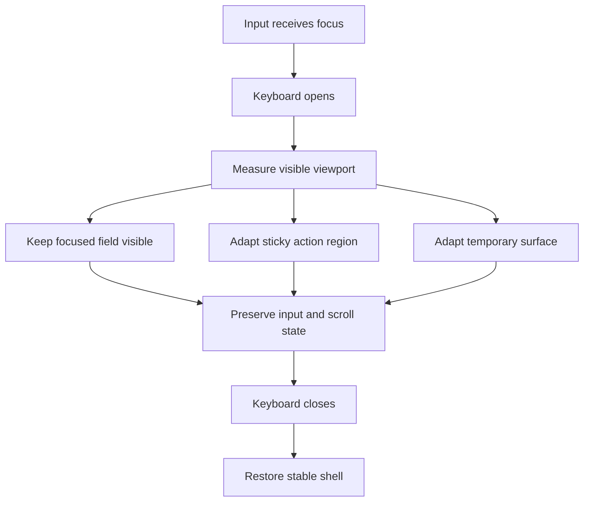

---

# Keyboard Dismissal

Users must be able to dismiss the keyboard without losing input.

Possible mechanisms:

- System Back
- Done action
- Tap outside where safe
- Explicit keyboard dismissal control when necessary

Dismissing the keyboard must not submit the form unless explicitly designed.

---

# Bottom Sheets

Bottom sheets are a primary Mobile temporary-surface pattern.

Appropriate uses:

- Quick actions
- Filters
- Account selector
- Category selector
- Date or period selection
- Confirmation choices
- Compact transaction actions
- Sharing options

---

# Bottom-Sheet Anatomy

```text
Backdrop

Sheet surface

Optional drag indicator

Title

Content

Actions

Safe-area padding
```

---

# Bottom-Sheet Sizes

Conceptual sizes:

```text
Content height

Half height

Expanded height

Full height
```

The sheet should use the smallest size that supports the task safely.

---

# Bottom-Sheet Behavior

A bottom sheet must:

- Support screen-reader labeling.
- Keep actions visible.
- Support content scrolling.
- Adapt to the virtual keyboard.
- Respect safe areas.
- Close with system Back when safe.
- Return focus to the trigger.
- Avoid accidental dismissal during sensitive forms.

---

# Bottom-Sheet Dragging

Dragging to dismiss is optional.

It must not be the only close mechanism.

Dragging should be disabled or protected when:

- Unsaved data exists.
- A critical confirmation is active.
- Dismissal would interrupt processing.
- The virtual keyboard creates unstable movement.

---

# Bottom Sheet Versus Full Screen

Use a bottom sheet when:

- The task is short.
- Context should remain visible.
- Choices are limited.
- The workflow is easily reversible.

Use full screen when:

- The form is long.
- Several sections exist.
- Validation is complex.
- The keyboard is central.
- The workflow requires focus.
- The content may expand significantly.

---

# Mobile Dialogs

Dialogs should be reserved for:

- Confirmation
- Short protected decisions
- Critical errors
- Reauthentication prompts
- Small choices

Complex workflows should not be placed in small dialogs.

---

# Confirmation Dialog

A confirmation must identify:

- The exact action
- The affected item
- The consequence
- Whether undo exists

Bad:

```text
Are you sure?
```

Better:

```text
Delete “Electricity bill”?

This transaction will be removed from your reports.

[Cancel] [Delete]
```

---

# Full-Screen Workflows

Full-screen presentation is appropriate for:

- Create transaction
- Edit complex transaction
- Create account
- Create goal
- Advanced filters
- Import review
- Security setup
- Account deletion
- Conflict resolution

The workflow should preserve:

- Clear title
- Back or Cancel
- Progress when multi-stage
- Reachable primary action
- Draft state
- Safe keyboard behavior

---

# Full-Screen Detail

Transaction, account and goal details may use a full-screen route.

The detail screen should provide:

```text
Context

Primary value

Supporting information

Actions

Related records

Back path
```

The user must return to the exact prior list context.

---

# Mobile Lists

Mobile lists should prioritize:

- Fast scanning
- Stable amount alignment
- Clear grouping
- Touch-friendly rows
- Incremental loading
- Accessible actions

Each list must define:

- Loading
- Empty
- Filtered empty
- Error
- Offline
- End-of-list
- Selection

---

# Transaction List Item

Recommended structure:

```text
Category or merchant icon

Description

Amount

Category or account

Date or status
```

Example:

```text
[Icon] Supermarket               −R$ 185,40
       Food · Main account · Today
```

The amount must not truncate.

---

# Row Actions

Routine actions should be available through:

- Tap to open
- Overflow menu
- Swipe enhancement
- Selection mode

Essential actions must not require long press or swipe.

---

# Mobile Cards

Cards should be used selectively.

Appropriate:

- Financial summary
- Goal progress
- Upcoming obligation
- Important insight
- Account summary

Avoid placing every list item inside a large card.

Mobile vertical space is limited.

---

# Mobile Financial Values

Financial values must:

- Use tabular numerals.
- Preserve currency.
- Preserve signs.
- Never truncate.
- Remain contextualized.
- Respect privacy mode.
- Avoid ambiguous compact notation.

When space is constrained:

1. Wrap the label.
2. Remove secondary metadata.
3. Move actions.
4. Reduce non-essential visual decoration.
5. Use a detail screen.

Do not reduce the financial amount until it becomes difficult to read.

---

# Compact Financial Notation

Compact notation may be used in charts or constrained summaries.

Example:

```text
R$ 12,4 mil
```

The exact value must remain available through:

- Accessible label
- Detail view
- Tap-to-inspect
- Supporting text

---

# Mobile Charts

Mobile charts must focus on one clear financial question.

Recommended behavior:

- One primary chart per view
- Textual summary first
- Limited visible series
- Large touch inspection targets
- Simplified axis labels
- Accessible data alternative
- Scrollable time range when useful

Do not shrink Desktop charts indiscriminately.

---

# Chart Touch Inspection

Touching a chart point or segment should:

- Select a stable data point.
- Display a readable detail.
- Avoid requiring precise finger placement.
- Keep the result visible until dismissed or changed.
- Avoid blocking page scrolling unnecessarily.
- Provide a non-chart alternative.

---

# Mobile Tables

Traditional wide tables should rarely be used on Mobile.

Preferred transformations:

```text
Table

↓

Structured list

or

Expandable rows

or

Priority data cards
```

A horizontally scrolling table is acceptable only when column comparison is essential and no clearer transformation exists.

---

# Mobile Filters

Mobile filters should normally open in:

- Bottom sheet
- Full-screen filter view
- Compact selector
- Search mode

Active filters must remain visible.

Example:

```text
Filters · 3
```

---

# Filter Application

A filter workflow should provide:

```text
Current filter values

Clear action

Apply action

Expected result count when practical
```

The user must understand whether changes apply immediately or after confirmation.

---

# Search

Search may use:

- Expandable top bar
- Dedicated search screen
- Persistent field on Wide Mobile
- Feature-specific search

Search must preserve:

- Query
- Filters
- Result position
- Selected result
- Back path

---

# Search Results

Search results must:

- Highlight relevant context without excessive markup.
- Respect privacy mode.
- Display empty state.
- Display loading state.
- Support clear action.
- Remain accessible.
- Avoid revealing unauthorized records.

---

# Mobile Privacy Mode

Privacy mode must be applied before sensitive content renders.

It applies to:

- Dashboard
- Transactions
- Accounts
- Goals
- Reports
- Notifications
- Assistant
- Search
- Recent items
- Clipboard
- Share previews
- App-switcher snapshot

---

# Privacy Rendering Rule

Forbidden sequence:

```text
Render exact balance

↓

Load privacy preference

↓

Hide balance
```

Required sequence:

```text
Load or assume protected privacy state

↓

Resolve preference

↓

Render permitted value
```

This prevents sensitive-value flashes.

---

# Application Switcher Privacy

When platform capability permits, Nexio should obscure sensitive content in app-switcher previews.

Possible presentation:

```text
Nexio logo

Application locked

Financial information hidden
```

Returning to the app should restore the valid state after appropriate checks.

---

# Mobile Offline Shell

The application shell should remain available offline when possible.

The offline state may display:

```text
Offline

You can continue using saved data.

Changes will synchronize when connection returns.
```

The message should be calm and non-blocking.

---

# Offline Fallback Page

A static offline fallback may be used only when the application shell cannot load.

It should provide:

- Nexio identity
- Clear offline explanation
- Retry action
- No false claim that user data was deleted
- No sensitive cached data
- Accessible text
- Light and dark compatibility where practical

The fallback must not imitate a complete functional application.

---

# Offline Operation Status

A locally saved operation may show:

```text
Saved on this device

Waiting to synchronize
```

After cloud confirmation:

```text
Synchronized
```

The distinction must remain visible where relevant.

---

# Mobile Synchronization Status

Possible states:

```text
Synchronized

Synchronizing

Offline

Changes pending

Conflict

Action required
```

Routine successful synchronization should not create repeated notifications.

---

# Capacitor Platform Boundary

The Capacitor layer translates native events into application-level platform events.

Conceptual flow:

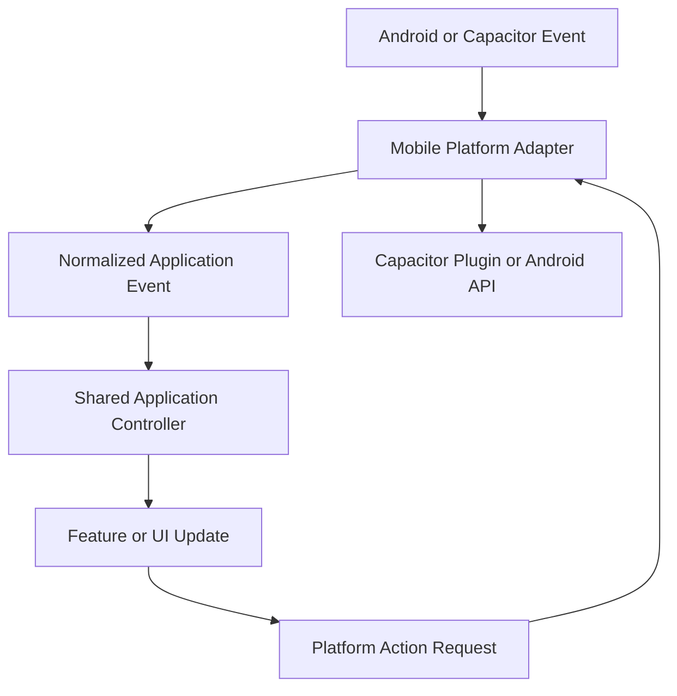

Feature modules must not depend directly on individual native plugins when an application adapter exists.

---

# Platform Service Contract

A shared platform service may expose capabilities such as:

```javascript
platform.isNative()
platform.getNetworkStatus()
platform.share(payload)
platform.openFile(options)
platform.onBackButton(handler)
platform.onAppStateChange(handler)
platform.setStatusBarAppearance(theme)
platform.getSafeArea()
```

Feature code should consume the stable application contract.

It should not depend on native-plugin implementation details.

---

# Native Capability Detection

The application must detect whether a capability exists.

Example:

```text
Share plugin available
→ Use native share sheet.

Share plugin unavailable
→ Use Web Share API or supported fallback.

No share capability
→ Offer copy or file download where appropriate.
```

The user must not receive controls that cannot function.

---

# App Lifecycle

Native application lifecycle states may include:

```text
Active

Inactive

Background

Resumed

Terminated
```

Lifecycle changes must not become business actions.

---

# Background Transition

When the application moves to the background:

- Preserve safe drafts.
- Pause unnecessary animations.
- Avoid unnecessary polling.
- Protect app-switcher privacy.
- Persist pending local state.
- Avoid signing out automatically unless required.
- Avoid clearing the current route.

---

# Resume Transition

When the application resumes:

```text
Validate application state

↓

Validate session when necessary

↓

Check connection

↓

Check pending synchronization

↓

Refresh only stale or required data

↓

Restore current route and focus
```

The application must not refetch every dataset automatically after every brief interruption.

---

# Mobile Deep Links

Native or Web deep links may open:

- Transaction
- Account
- Goal
- Notification target
- Report
- Settings section
- Authentication callback

Deep links must:

- Validate authentication.
- Validate authorization.
- Validate the target.
- Respect privacy mode.
- Provide a valid Back path.
- Handle missing records.
- Avoid duplicate navigation.

---

# Native Share

Native sharing may support:

- Report
- Exported file
- Goal summary
- Transaction information when permitted
- Application link

Before sharing sensitive information, the user must review what will be shared.

Automatic sharing is forbidden.

---

# File Access

File-system or file-picker integration may support:

- Import
- Export
- PDF preview
- Document attachment
- Backup or restore where defined

The platform adapter must normalize:

- Permission errors
- Cancel behavior
- Unsupported format
- File size
- Temporary access
- Cleanup

---

# Native Notifications

Native notifications may represent:

- Upcoming obligation
- Goal reminder
- Synchronization action required
- Security event
- User-approved financial reminder

They must respect:

- User permission
- Privacy preference
- Device lock state
- Notification-channel configuration
- Quiet behavior
- Sensitive-content settings

---

# Notification Permission

Permission should be requested in context.

Bad:

```text
Request notification permission on first startup without explanation.
```

Better:

```text
Explain the benefit when the user enables a reminder or alert.

Then request system permission.
```

Denial must not break the application.

---

# Status-Bar Integration

The Android status bar should coordinate with:

- Light theme
- Dark theme
- Authentication
- Full-screen workflows
- Dialog states
- Startup screen

Status-bar icons must remain readable.

The Web content must respect the inset.

---

# Navigation-Bar Integration

The Android navigation bar or gesture area should coordinate with:

- Bottom navigation
- Bottom sheets
- Full-screen forms
- Theme
- Safe-area padding

Interactive elements must not sit beneath the system gesture region.

---

# Native Theme Integration

When the application theme changes:

```text
Web semantic tokens

+

Status-bar appearance

+

Navigation-bar appearance

+

Native launch theme
```

should remain visually coordinated.

Native theme integration must not create separate brand colors.

---

# Startup Experience

The startup sequence should avoid:

- Blank white screen
- Incorrect theme flash
- Unstyled HTML
- Sensitive-value flash
- Repeated logo transitions
- Long blocking animation

Recommended sequence:

```text
Native launch surface

↓

Minimal Web shell

↓

Theme and privacy preference

↓

Session state

↓

Cached useful content

↓

Background synchronization
```

---

# Startup Failure

When startup fails:

- Show a clear recoverable state.
- Avoid technical stack traces.
- Provide retry.
- Explain offline limitations.
- Preserve local data.
- Provide a safe route to authentication when necessary.

---

# Mobile Performance Principles

Mobile performance is a product requirement.

Priority order:

```text
1. Fast touch response

2. Useful content quickly

3. Stable scrolling

4. Low memory use

5. Controlled network use

6. Battery efficiency

7. Stable WebView behavior
```

---

# Mobile Rendering

Mobile screens should:

- Render cached or structural content first.
- Avoid loading every chart immediately.
- Avoid rendering hidden Desktop components.
- Update only affected regions.
- Defer secondary insights.
- Use incremental lists.
- Remove unused temporary surfaces.

---

# Mobile JavaScript Performance

Mobile code should:

- Avoid duplicate global listeners.
- Clean up lifecycle subscriptions.
- Cancel obsolete requests.
- Debounce expensive search.
- Batch viewport measurements.
- Avoid repeated forced layout.
- Avoid large synchronous parsing.
- Use workers where justified.
- Avoid maintaining duplicate state.

---

# Mobile CSS Performance

Avoid excessive:

- Full-screen blur
- Large fixed shadows
- Continuous animation
- Deep selectors
- Large background images
- Layout-dependent animation
- Complex filters
- Unnecessary off-screen content

---

# Mobile Memory Management

Release:

- Closed dialogs
- Old chart instances
- Temporary file URLs
- Image previews
- Import buffers
- Event listeners
- Network listeners
- Keyboard listeners
- App-state listeners
- Aborted requests

Repeated navigation must not produce continuous memory growth.

---

# Battery Awareness

Avoid:

- Constant polling
- Continuous GPS use
- Continuous background animation
- Repeated full synchronization
- Excessive haptic feedback
- Unnecessary wake locks
- High-frequency native bridge calls

---

# Mobile Accessibility

Mobile accessibility must support:

- Touch
- Screen readers
- Switch access
- External keyboard
- Text scaling
- Zoom
- High contrast
- Reduced motion
- System Back
- Orientation changes
- Voice-control identification where supported

---

# Mobile Screen-Reader Structure

Every screen should provide:

- Screen title
- Main-content region
- Clear navigation state
- Proper control labels
- Financial-value context
- Error announcements
- Loading announcements where necessary
- Temporary-surface labels

---

# Accessible Financial Values

A screen reader should receive complete financial meaning.

Visual:

```text
−R$ 185,40
```

Accessible meaning:

```text
Expense of 185 reais and 40 centavos
```

Where context is already clear, repetition may be reduced carefully.

Privacy mode must announce:

```text
Amount hidden
```

not the exact amount.

---

# Text Scaling

At increased text size:

- Bottom navigation may adapt.
- Labels may wrap.
- Icons must remain associated with labels.
- Cards must expand vertically.
- Sticky actions must remain reachable.
- Two-column summaries may become one column.
- Financial values must remain intact.
- Fixed heights must be avoided.

---

# Reduced Motion

Mobile must respect:

```css
@media (prefers-reduced-motion: reduce)
```

Reduced motion should remove unnecessary:

- Page slides
- Card entrances
- Bottom-sheet spring effects
- Number animations
- Chart animation
- Parallax

It must preserve state feedback and meaning.

---

# Mobile Foundation Anti-Patterns

The following are prohibited:

## Shrunk Desktop Layout

Using Desktop tables, sidebars and multi-panel screens at phone width.

## Oversized Tablet Copy

Using large Tablet spacing that reduces useful Mobile content.

## Top-Only Actions

Placing every frequent action in difficult-to-reach top corners.

## Gesture-Only Behavior

Requiring swipe, drag or long press without alternatives.

## Hidden Financial Context

Displaying amounts without labels, period or account scope.

## Unsafe Keyboard Layout

Allowing the virtual keyboard to hide fields or confirmation actions.

## Permanent Floating Obstruction

Allowing a floating action to cover content or navigation.

## Sensitive Startup Flash

Rendering exact balances before privacy state is resolved.

## False Synchronization

Displaying cloud success while data remains only local.

## Duplicate Native Business Logic

Implementing transaction or account rules inside Capacitor or Android files.

## Direct Plugin Coupling

Allowing feature modules to depend directly on multiple native plugins.

## Excessive Bottom Sheets

Using bottom sheets for every screen and workflow.

## Small Touch Targets

Reducing controls to fit more content.

## System Back Conflict

Closing the application while a temporary surface or unsaved form is active.

## Native-Web Theme Mismatch

Displaying dark Web content with unreadable light-system-bar icons.

## Continuous Background Work

Polling or synchronizing without a meaningful trigger.

---

# Mobile Foundation Review Questions

Before approving a Mobile implementation, verify:

```text
What is the main task on this screen?

Can it be completed with one hand?

Is the primary action reachable?

Are touch targets safe?

Does the screen remain usable at 320px?

What happens when the keyboard opens?

What happens when Android Back is pressed?

What happens offline?

Is locally saved data distinguished from synchronized data?

Does privacy mode apply before rendering?

Can a screen reader understand every financial value?

Do gestures have visible alternatives?

Does the application preserve state after backgrounding?

Does the implementation reuse shared business logic?

Is native integration isolated behind an adapter?
```

---

# Mobile Foundation Acceptance Criteria

The Mobile foundation is accepted only when:

```text
□ Mobile is implemented as a first-class platform.

□ The shell is stable across primary destinations.

□ Bottom navigation uses a limited and consistent destination set.

□ Root, Detail, Search, Selection and Form modes are defined.

□ Frequent actions are reachable with one hand.

□ Touch targets meet accessibility requirements.

□ System Back follows the official priority.

□ Unsaved work is protected.

□ The virtual keyboard does not hide required content.

□ Bottom sheets are used only for suitable short workflows.

□ Complex workflows use full-screen presentation.

□ Financial values remain exact and contextualized.

□ Privacy mode applies before sensitive content renders.

□ Offline and synchronized states remain distinguishable.

□ Capacitor remains a platform adapter.

□ Native plugins are accessed through stable application contracts.

□ Status and navigation bars coordinate with themes.

□ Startup avoids incorrect-theme and privacy flashes.

□ App background and resume preserve valid state.

□ Deep links validate authentication and permissions.

□ Native notification permission is requested in context.

□ Gesture actions have visible alternatives.

□ Light and Dark themes are supported.

□ Text scaling and reduced motion are supported.

□ Mobile CSS contains only Mobile presentation adaptation.

□ Mobile JavaScript contains only Mobile UI coordination.

□ Native Android code contains no duplicated business logic.

□ Mid-range Android performance is considered.

□ Event listeners and native subscriptions are cleaned up.
```

---

# Mobile Constitutional Rule

Every Mobile decision must answer:

```text
Does this help the user understand or act on their finances quickly, safely and comfortably on a small touch screen?
```

When the answer is unclear, prefer the implementation that:

- Reduces steps.
- Preserves context.
- Keeps actions reachable.
- Protects private information.
- Works offline where possible.
- Uses native capabilities only when beneficial.
- Preserves standard system behavior.
- Supports accessibility.
- Avoids unnecessary animation.
- Reuses shared components.
- Preserves financial meaning.
- Performs reliably on mid-range devices.

Mobile is the immediate and touch-first expression of Nexio.

It is not a reduced copy of Desktop.

---

# Mobile Feature Experiences

This section defines how the primary Nexio features behave on smartphones and compact Mobile environments.

Every Mobile feature must consume the same:

```text
Application state

Business rules

Validation

Financial calculations

Repositories

Synchronization services

Formatting utilities

Design System components
```

Mobile may adapt:

- Information priority
- Screen composition
- Navigation placement
- Visible metadata
- Touch interaction
- Full-screen presentation
- Bottom-sheet behavior
- One-handed action placement
- Offline feedback
- Native capability usage

Mobile must not create an independent implementation of any financial rule.

---

# Mobile Feature Adaptation Model

Each feature should define behavior for:

```text
Narrow Mobile

Standard Mobile

Wide Mobile

Landscape Mobile

Offline State

Privacy State

Virtual Keyboard State
```

The same feature state must remain valid when the presentation changes.

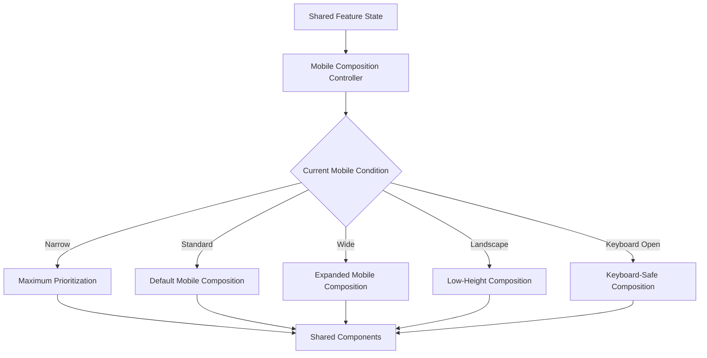

Presentation changes must not reset business state.

---

# Mobile Dashboard

The Mobile dashboard is the fastest financial overview in Nexio.

It should help the user answer:

```text
What is my current financial position?

What happened recently?

What requires attention today?

What action should I take next?

Are my latest changes synchronized?
```

The dashboard must prioritize immediate understanding.

It must not reproduce the full Desktop dashboard vertically.

---

# Mobile Dashboard Hierarchy

Recommended priority:

```text
1. Current financial position

2. Selected period result

3. Upcoming obligation or important alert

4. Primary transaction action

5. Recent transactions

6. Budget or spending progress

7. Goal progress

8. Secondary insights
```

Only the most relevant secondary modules should appear on the initial screen.

Additional analysis belongs in dedicated features.

---

# Dashboard Standard Mobile Composition

Recommended structure:

```text
Top Application Bar

↓

Primary Financial Summary

↓

Income, Expenses and Result

↓

Important Obligation or Alert

↓

Primary Creation Action

↓

Recent Transactions

↓

Budget or Goal Progress

↓

Secondary Insights
```

Conceptual example:

```text
┌──────────────────────────────┐
│ Hello, User        [Privacy] │
├──────────────────────────────┤
│ Available Balance            │
│ R$ 14.250,00                 │
│ +R$ 850,00 this month        │
├───────────────┬──────────────┤
│ Income        │ Expenses     │
│ R$ 6.500,00   │ R$ 5.650,00 │
├──────────────────────────────┤
│ Upcoming payment             │
│ Credit card · 28 July        │
│ R$ 1.450,00                  │
├──────────────────────────────┤
│ Recent Transactions          │
│                              │
│ Supermarket      −R$ 185,40 │
│ Salary         +R$ 4.500,00 │
└──────────────────────────────┘
```

---

# Dashboard Narrow Mobile

At narrow widths:

- Financial values remain exact.
- Supporting labels may wrap.
- Summary cards may stack.
- Secondary metadata may move to detail views.
- Chart labels may reduce.
- Action groups may become vertical.
- Non-critical modules may move below the fold.

The primary balance must not shrink to an unreadable size.

---

# Dashboard Wide Mobile

Wide Mobile may use:

- Two compact financial summaries per row
- Wider transaction rows
- More visible account context
- Improved chart labels
- Side-by-side budget and goal summaries

Wide Mobile remains a single-primary-column experience unless a two-column composition clearly improves understanding.

---

# Dashboard Landscape

Landscape Mobile has limited vertical space.

Recommended adaptations:

- Compact top application bar
- Reduced decorative spacing
- Primary summary and selected period in one region
- Horizontal summary row where safe
- Fewer sticky elements
- Scrollable content
- Bottom navigation adaptation

Landscape must not hide critical financial context merely to keep everything above the fold.

---

# Dashboard Financial Summary

The primary summary should display:

```text
Context label

Exact or protected balance

Selected period result

Account scope

Relevant change

Privacy control
```

Example:

```text
Available balance

R$ 14.250,00

All active accounts
```

The account and period scope must remain understandable.

---

# Dashboard Privacy Behavior

Privacy mode must hide:

- Main balance
- Income
- Expenses
- Net result
- Transaction amounts
- Upcoming-obligation values
- Goal values
- Budget values
- Chart tooltips
- Assistant context
- Accessibility labels

It must not hide the screen structure completely.

Users should still understand:

```text
Which information exists

Which account or period is selected

Which actions are available
```

---

# Dashboard Startup Privacy

Sensitive values must not render before privacy preference is resolved.

Required behavior:

```text
Protected placeholder

↓

Load local privacy preference

↓

Validate session state

↓

Render permitted values
```

The application must avoid balance flashes during startup or resume.

---

# Dashboard Period Selector

The period control may use:

- Compact select
- Segmented control
- Bottom sheet
- Horizontal month selector
- Full-screen custom-range workflow

The selected period must update all related dashboard modules.

Independent modules must not silently use different periods.

---

# Dashboard Month Navigation

Common month navigation may support:

```text
Previous month

Current month

Next month when future planning is supported
```

Swipe may enhance month navigation.

Visible previous and next controls must remain available.

The selected month should be announced accessibly.

---

# Dashboard Primary Action

The most frequent action is typically:

```text
Add transaction
```

It may be exposed through:

- Floating action button
- Bottom action
- Navigation-associated action
- Visible dashboard button

Opening the action may present:

```text
Add expense

Add income

Create transfer
```

The options must remain financially distinct.

---

# Dashboard Upcoming Obligations

Upcoming obligations should prioritize:

- Description
- Amount
- Due date
- Status
- Relevant action

Examples:

```text
Pay

Review

Mark as completed

Open transaction
```

Overdue state must use more than color.

---

# Dashboard Recent Transactions

The dashboard should show a limited recent set.

Recommended behavior:

- Display only enough records for quick review.
- Provide a clear `View all` action.
- Preserve exact amounts.
- Show pending synchronization state.
- Avoid full editing controls inside the dashboard.
- Open the transaction detail on tap.

The dashboard must not become a duplicate Transactions screen.

---

# Dashboard Chart Strategy

Mobile dashboard charts should answer one clear question.

Examples:

```text
How are expenses changing this month?

Which categories use most of the budget?

Is the monthly result improving?
```

Charts should include:

- Short textual summary
- Simplified labels
- Touch inspection
- Accessible alternative
- Clear period
- Limited number of series

---

# Dashboard Insights

Insights should appear after reliable primary data.

Appropriate insights:

```text
Expenses are 8% higher than last month.

Food spending is approaching the monthly budget.

A recurring payment is due tomorrow.
```

Insights must not:

- Invent missing data.
- Claim guaranteed outcomes.
- visually dominate the balance.
- Replace primary financial summaries.
- expose hidden values.

---

# Dashboard Pull to Refresh

Pull to refresh may update dashboard data.

It must:

- Preserve cached content.
- Avoid duplicating active synchronization.
- Keep local pending changes visible.
- Provide progress.
- Avoid resetting the selected period.
- Avoid scrolling the user unexpectedly after completion.

---

# Dashboard Offline State

When offline:

```text
Offline

Showing saved financial information.

New changes will synchronize later.
```

The dashboard may show cached:

- Balance
- Recent transactions
- Goals
- Budgets
- Obligations

Data freshness should be communicated when relevant.

---

# Dashboard Empty State

First use:

```text
Start organizing your finances

Create an account and add your first transaction.

[Create account]
```

No activity for period:

```text
No activity this month

Add a transaction or review another period.

[Add transaction] [Change period]
```

Do not show several independent empty cards.

---

# Dashboard Mobile Anti-Patterns

Forbidden:

- Reproducing the full Desktop module grid vertically.
- Displaying several large charts.
- Repeating the balance in multiple sections.
- Rendering exact values before privacy resolution.
- Showing AI insights before verified financial data.
- Blocking the dashboard because one module failed.
- Hiding the period context.
- Resetting the selected month after resume.
- Placing every important action in the top-right corner.
- Using an oversized header that reduces useful content.

---

# Dashboard Mobile Acceptance Criteria

```text
□ Current financial position is immediately understandable.

□ Period and account scope are visible.

□ Primary action is reachable.

□ Privacy mode applies before sensitive rendering.

□ Upcoming obligations receive appropriate priority.

□ Recent transactions remain concise.

□ Charts answer one clear question.

□ Partial failures remain isolated.

□ Offline data is clearly identified.

□ Pull to refresh does not duplicate synchronization.

□ Narrow and landscape layouts remain usable.

□ Financial values never truncate.
```

---

# Mobile Transactions

Transactions are one of the most frequent Mobile workflows.

The Mobile experience must support:

- Quick creation
- Fast review
- Search
- Filtering
- Editing
- Categorization
- Offline entry
- Pending synchronization
- Selection
- Protected deletion

The interface should minimize typing and unnecessary navigation.

---

# Transactions Screen Structure

Recommended composition:

```text
Top Application Bar

↓

Search and Filter Access

↓

Period or Compact Summary

↓

Transaction Groups

↓

Incremental Loading

↓

Primary Creation Action

↓

Bottom Navigation
```

---

# Transaction List

Transactions should normally use a structured list rather than cards.

Recommended item anatomy:

```text
Category or merchant icon

Description

Amount

Category or account

Date or status

Pending indicator where relevant
```

Example:

```text
[Icon] Supermarket               −R$ 185,40
       Food · Main account · Today
```

---

# Transaction Amount Behavior

Amounts must:

- Align consistently.
- Use tabular numerals.
- Preserve signs.
- Preserve currency.
- Never truncate.
- Respect privacy mode.
- Remain distinguishable without color.

Transfer items should show direction or account context.

Example:

```text
Main Account → Savings
R$ 500,00
```

---

# Transaction Grouping

Recommended default grouping:

```text
Today

Yesterday

Earlier this week

Previous dates
```

or:

```text
Specific date headings
```

Group headers may include a compact daily result when useful.

They should not become overloaded financial summaries.

---

# Transaction Search

Search should support:

- Description
- Category
- Account
- Notes
- Tags
- Merchant
- Supported reference fields

Mobile search may use a dedicated top-bar mode.

---

# Search Flow

```text
Tap Search

↓

Top bar transforms into search mode

↓

Keyboard opens

↓

Results update

↓

Tap result

↓

Open detail

↓

Back returns to search results
```

The query and result position must remain preserved.

---

# Search Privacy

Search suggestions and results must respect privacy mode.

When amounts are hidden, they must not appear in:

- Visual result metadata
- Accessibility labels
- Native keyboard suggestions controlled by the app
- Search history
- Recent-item previews

---

# Search Empty State

```text
No transactions found

Try another description or adjust the filters.

[Clear search]
```

Search-empty and filter-empty states must remain distinguishable.

---

# Transaction Filters

Common Mobile filters:

```text
Period

Type

Account

Category

Status
```

Advanced filters may include:

```text
Amount range

Recurring

Tags

Imported

Pending synchronization
```

---

# Filter Presentation

Filters should normally use:

- Bottom sheet
- Full-screen filter workflow
- Compact horizontal control for one common filter

A filter surface should show:

```text
Title

Current selections

Clear action

Apply action

Optional result count
```

---

# Active Filter Visibility

Active filters must remain visible after the filter surface closes.

Example:

```text
July · Expenses · Main Account

Filters · 3
```

The active state must use more than color.

---

# Transaction Detail

Transaction detail normally uses a full-screen route.

Recommended hierarchy:

```text
Type and description

Exact amount

Status

Account

Destination account when transfer

Category

Date and time

Recurrence

Notes

Synchronization status

Actions
```

---

# Transaction Detail Actions

Frequent actions:

```text
Edit

Duplicate

Categorize
```

Secondary actions:

```text
Move account

Archive

Delete
```

Destructive actions should normally appear in an overflow menu or protected section.

---

# Transaction Detail Back Behavior

Back must return to:

- The same search
- The same filters
- The same scroll position
- The same period
- The same selected grouping

The list must not reload unnecessarily.

---

# Add Transaction Flow

The transaction-creation workflow should minimize entry effort.

Recommended field priority:

```text
1. Type

2. Amount

3. Description

4. Account

5. Category

6. Date
```

Secondary fields:

```text
Notes

Tags

Recurring configuration

Attachment

Advanced metadata
```

---

# Transaction Type Selection

The user should explicitly choose or confirm:

```text
Expense

Income

Transfer
```

The form may remember a safe default.

It must not infer a high-impact type ambiguously.

---

# Quick Expense Flow

A frequent expense flow may prioritize:

```text
Amount

Description

Account

Category
```

Default date may be today.

The user must be able to review and change inferred values.

---

# Transfer Flow

Transfers require:

```text
Source account

Destination account

Amount

Date
```

Validation must prevent:

- Same source and destination
- Unsupported account combination
- Invalid amount
- Unauthorized account
- Unsupported currency behavior

A transfer must not appear as an ordinary expense.

---

# Transaction Form Layout

Mobile forms should use one column.

Recommended order:

```text
Transaction type

Amount

Description

Account

Category

Date

Additional information
```

The amount may receive strong visual emphasis without becoming the only context on screen.

---

# Transaction Currency Keyboard

The currency field should:

- Open a suitable numeric keyboard.
- Support comma and decimal input according to locale.
- Avoid cursor jumps.
- Preserve the canonical numeric value.
- Format safely after input.
- Prevent multiple decimal separators.
- Preserve user input during validation failure.

---

# Transaction Category Selector

Category selection may use a bottom sheet or full-screen selector.

It should support:

- Search
- Recent categories
- Suggested categories
- Full category list
- Create category where appropriate
- Accessible labels

Suggestions must remain distinguishable from confirmed choices.

---

# Transaction Account Selector

The account selector should display:

- Account name
- Type
- Masked identifier when relevant
- Currency
- Availability or status
- Optional balance only when privacy permits and useful

Archived or unavailable accounts must not appear as valid routine choices.

---

# Transaction Date Selection

Date selection should use:

- Native date picker
- Accessible calendar
- Bottom-sheet date selection
- Manual editing when supported

Quick options may include:

```text
Today

Yesterday

Custom date
```

---

# Transaction Save Behavior

When Save is selected:

```text
Validate canonical values

↓

Persist safely locally or remotely

↓

Prevent duplicate submission

↓

Update application state

↓

Update affected summaries

↓

Show accurate status

↓

Return or remain according to workflow
```

---

# Local Save Status

When offline or cloud confirmation is pending:

```text
Saved on this device

Waiting to synchronize
```

Do not display:

```text
Synchronized
```

until remote confirmation exists.

---

# Transaction Save Failure

When save fails:

- Keep all entered data.
- Explain whether a local copy exists.
- Identify the recoverable action.
- Avoid dismissing the form.
- Provide Retry.
- Preserve attachments or selections where safe.
- Avoid exposing technical details.

---

# Duplicate Submission Prevention

The Save action must:

- Enter loading state.
- Disable repeated activation.
- Maintain visible label context.
- Use an idempotency mechanism when supported.
- Recover correctly after timeout.
- Avoid creating two transactions after a repeated network response.

---

# Transaction Edit Flow

Editing should preserve:

- Original record version
- Current list state
- Search
- Filters
- Scroll
- Pending synchronization status

When remote data changed, conflict handling must occur before overwrite.

---

# Transaction Delete

Deletion may use:

```text
Delete

↓

Immediate visual removal

↓

Undo opportunity
```

when safe and reversible.

Confirmation is required when:

- The transaction has linked records.
- It belongs to a recurring series.
- It affects reconciliation.
- It is part of an import batch with constraints.
- Undo cannot be guaranteed.

---

# Transaction Undo

Undo feedback should remain reachable above bottom navigation.

Example:

```text
Transaction deleted

[Undo]
```

Undo must restore:

- Record
- List position
- Summaries
- Category totals
- Account balance effects
- Synchronization state

---

# Recurring Transactions

Editing a recurring transaction must ask:

```text
Only this transaction

This and future transactions

Entire series
```

The meaning of each option must be explained in simple language.

---

# Transaction Selection Mode

Selection may begin through:

- Long press
- Visible selection control
- Overflow action

Long press must not be the only entry method.

Selection mode should display:

```text
Close

Selected count

Primary bulk action

Overflow
```

---

# Bulk Actions on Mobile

Appropriate bulk actions:

- Categorize
- Add tag
- Archive
- Export selected
- Delete

Actions should normally use a full-screen or bottom-sheet confirmation when configuration is needed.

---

# Bulk Delete

Bulk deletion must show:

```text
Delete 12 transactions?
```

It should explain:

- Whether the action can be undone.
- Whether linked records are affected.
- Whether some records cannot be deleted.
- Partial failure behavior.

---

# Swipe Actions

Swipe may expose:

```text
Edit

Categorize

Archive

Delete
```

A visible overflow action must provide the same functionality.

Swipe must not conflict with system Back gestures.

---

# Transaction Offline Queue

Pending transaction changes may show:

```text
Waiting to synchronize

Synchronization failed

Review required
```

A pending indicator should be calm and understandable.

---

# Transaction Conflict Resolution

When the same record changes remotely:

```text
This transaction was updated on another device.

Review the latest version before saving.
```

The Mobile conflict screen should prioritize:

- Latest saved value
- Current local changes
- Fields that differ
- Available actions

---

# Large Transaction Lists

Mobile lists should use:

- Incremental loading
- Pagination
- Virtualization where appropriate
- Stable identifiers
- Controlled DOM size
- Server-side filtering when required

Loading more records must not reset the user's position.

---

# Transactions Mobile Anti-Patterns

Forbidden:

- Using a wide Desktop table.
- Turning every row into an oversized card.
- Hiding the amount context.
- Requiring swipe for essential actions.
- Clearing search after opening a detail.
- Treating a transfer as an expense.
- Dismissing the form after a failed save.
- Claiming cloud success before synchronization.
- Deleting immediately without protection.
- Rendering an unbounded list.
- Exposing hidden values in search.
- Resetting filters after app resume.

---

# Transactions Mobile Acceptance Criteria

```text
□ Transaction review is touch-friendly and scannable.

□ Amounts remain exact and aligned.

□ Search and filters remain preserved.

□ Detail returns to the same list context.

□ Creation minimizes unnecessary typing.

□ Transfers have distinct semantics.

□ Offline saves are identified accurately.

□ Duplicate submissions are prevented.

□ Swipe has a visible alternative.

□ Deletion uses undo or confirmation.

□ Conflicts prevent silent overwrite.

□ Large lists use scalable rendering.

□ Privacy mode protects every result and detail.
```

---

# Mobile Accounts

The Accounts experience should help users quickly understand:

```text
Where money is available

What is owed

Which account changed

Which account requires attention
```

Mobile should prioritize overview and fast account inspection.

---

# Accounts Screen Structure

Recommended composition:

```text
Top Application Bar

↓

Total Position Summary

↓

Account Groups or Filters

↓

Account List

↓

Primary Creation Action
```

---

# Account Position Summary

The summary may display:

```text
Positive balances

Liabilities

Net position

Active account count
```

Assets and liabilities must remain visually and semantically distinct.

---

# Account List Item

Recommended content:

```text
Account icon

Account name

Type or institution

Current balance

Status or synchronization information
```

Sensitive identifiers must remain masked.

---

# Account Grouping

Accounts may be grouped by:

```text
Cash and banking

Credit

Investments

Debts

Archived
```

The grouping must reflect the supported account model.

---

# Account Detail

Account detail should show:

```text
Account name

Current balance

Available balance where relevant

Account type

Currency

Recent transactions

Period summary

Pending items

Synchronization state

Account actions
```

The account detail should not duplicate the full Transactions feature.

---

# Account Recent Transactions

The detail may show a small list scoped to the account.

A `View all transactions` action should open Transactions with the account filter active.

---

# Account Balance Privacy

When privacy is enabled:

- Balances are hidden.
- Accessible labels are protected.
- Chart values are hidden.
- Recent transaction amounts are hidden.
- Native sharing and clipboard remain protected.

The account name may remain visible unless a stronger privacy mode exists.

---

# Add Account

Account creation should normally use a full-screen form.

Common fields:

```text
Account name

Account type

Initial balance

Currency

Institution

Optional icon
```

The initial-balance meaning must be explained.

---

# Initial Balance Explanation

The user should understand whether the initial balance:

- Creates an opening transaction
- Establishes a current snapshot
- Starts account history
- Uses another supported model

It must not create unexplained financial history.

---

# Account Edit

Routine editable fields may include:

- Name
- Institution
- Icon
- Visibility
- Default status
- Archive state

High-impact model changes require additional review.

---

# Account Archive

Archive is preferred when financial history exists.

The interface must explain:

```text
The account will stop appearing in routine selections.

Existing transactions and reports will remain available.
```

---

# Account Delete

Deletion requires a protected review.

The user must understand the effect on:

- Transactions
- Transfers
- Reports
- Goals
- Synchronization
- Historical balances

A simple `Are you sure?` dialog is insufficient.

---

# Credit and Debt Accounts

Credit and debt accounts must clearly communicate:

- Amount owed
- Available credit when supported
- Due date
- Closing date
- Payment status
- Related transactions

Debt must not be visually confused with a system error.

---

# Accounts Offline Behavior

Cached account information may remain visible offline.

Actions requiring remote verification should explain their limitation.

Locally supported changes must show pending synchronization status.

---

# Accounts Mobile Anti-Patterns

Forbidden:

- Combining liabilities and assets without labels.
- Showing complete account identifiers.
- Deleting accounts without dependency review.
- Using a different Mobile balance calculation.
- Hiding account currency.
- Showing stale remote values without status.
- Displaying too many metrics inside every account row.
- Resetting selected account after resume.

---

# Accounts Mobile Acceptance Criteria

```text
□ Total position has a clear scope.

□ Assets and liabilities remain distinct.

□ Account rows are easy to scan.

□ Identifiers remain protected.

□ Account detail remains scoped.

□ Initial balance behavior is explained.

□ Archive preserves history.

□ Delete identifies dependencies.

□ Privacy applies to balances and related values.

□ Offline account data is identified accurately.
```

---

# Mobile Goals

Goals should help users understand and advance financial objectives.

The Mobile experience should support:

- Quick progress review
- Contribution
- Planning
- Milestone awareness
- Completion

---

# Goals Screen Structure

Recommended composition:

```text
Goals Summary

↓

Active Goals

↓

Primary Add Goal Action

↓

Completed or Archived Goals
```

---

# Goal Card

Recommended content:

```text
Goal name

Current value

Target value

Progress percentage

Remaining amount

Expected date

Status

Contribution action
```

A card should not contain every planning metric.

---

# Goal Progress

Progress must include:

```text
R$ 4.000,00 of R$ 10.000,00

40% completed
```

Visual progress alone is insufficient.

---

# Goal Detail

Goal detail may show:

```text
Current progress

Target

Remaining amount

Expected completion

Contribution history

Recommended contribution

Linked account

Planning options

Notes
```

---

# Add Goal

The form should prioritize:

```text
Goal name

Target amount

Current amount when applicable

Target date

Linked account or funding model
```

Optional information should use progressive disclosure.

---

# Goal Contribution

Contribution must explain whether it:

- Moves account money
- Creates a planning allocation
- Records external progress
- Updates a simulated balance

The interface must not leave this effect ambiguous.

---

# Quick Contribution

A quick contribution flow may ask:

```text
Amount

Source account when relevant

Date

Optional note
```

After completion, the goal and related financial state must update consistently.

---

# Goal Scenario Planning

Mobile scenario planning should use a focused workflow.

Examples:

```text
Change monthly contribution

Choose a new target date

Add a one-time contribution

Compare completion result
```

Scenario values remain temporary until explicitly applied.

---

# Goal Status

Possible statuses:

```text
On track

Attention required

Behind schedule

Paused

Completed

Archived
```

Status calculation must come from shared business rules.

---

# Goal Completion

Completion should:

- Confirm the achievement.
- Preserve history.
- Provide an archive or continuation choice.
- Avoid blocking the user with excessive animation.
- Avoid altering account money without explicit rules.

---

# Goal Privacy

Privacy mode must hide:

- Current value
- Target
- Remaining amount
- Contribution history
- Recommended values
- Assistant goal context

The goal name may remain visible unless stronger protection applies.

---

# Goals Mobile Anti-Patterns

Forbidden:

- Displaying progress only through color.
- Hiding target or remaining amount.
- Saving a scenario automatically.
- Claiming guaranteed completion.
- Combining currencies silently.
- Updating account balances through Mobile UI logic.
- Using oversized celebration that delays navigation.
- Losing scenario input when the app backgrounds.

---

# Goals Mobile Acceptance Criteria

```text
□ Current, target and remaining values are clear.

□ Progress includes text and visuals.

□ Contributions explain their financial effect.

□ Scenarios remain temporary until applied.

□ Status comes from shared business rules.

□ Completed goals preserve history.

□ Privacy protects goal values.

□ Draft planning survives temporary interruption.
```

---

# Mobile Reports

Mobile reports should provide useful financial understanding without compressing Desktop analytics.

Mobile should prioritize:

```text
Direct summary

One primary visualization

Key breakdown

Accessible detail

Clear filters
```

---

# Reports Screen Structure

Recommended composition:

```text
Report Type and Period

↓

Textual Summary

↓

Primary Chart

↓

Key Categories or Values

↓

Detailed List or Accessible Table

↓

Export or Share
```

---

# Report Selection

Report type may be selected through:

- Tabs
- Compact selector
- Bottom sheet
- Dedicated report menu

The currently active report must remain visible.

---

# Report Context

Every report must display:

- Report type
- Period
- Account scope
- Currency
- Active filters
- Comparison context
- Data freshness when relevant

---

# Report Text Summary

A summary should appear before or near the chart.

Example:

```text
Expenses increased by 8% compared with June.

Housing was the largest category.
```

The summary must distinguish verified calculations from generated interpretation.

---

# Mobile Chart Strategy

Recommended chart behavior:

- One primary chart at a time
- Limited visible series
- Simplified labels
- Touch-to-inspect
- Selected value retained
- Accessible text summary
- Detailed list below
- Horizontal scroll only when useful

---

# Chart Full-Screen Inspection

A chart may open in full-screen landscape for detailed inspection.

The user must retain:

- Report period
- Active filters
- Selected series
- Back path
- Privacy state

Full-screen chart mode must not be the only way to access exact values.

---

# Category Breakdown

Category reports should provide a list such as:

```text
Housing
R$ 1.850,00 · 34%

Food
R$ 1.140,00 · 21%
```

The list provides a more precise alternative to the chart.

---

# Report Filters

Filters should use a bottom sheet or full-screen flow.

Possible controls:

```text
Period

Accounts

Categories

Transaction type

Comparison

Currency scope
```

Active filters should remain summarized after closing.

---

# Report Drill-Down

Tapping a category or chart point may open:

- Filtered transaction list
- Full-screen breakdown
- Transaction group
- Account-specific detail

The original report state must remain preserved.

---

# Report Comparison

Mobile comparison should remain focused.

Possible presentation:

```text
Current period

Previous period

Difference

Percentage change
```

Avoid showing several complex comparison series simultaneously.

---

# Report Export

Export may use:

- Native share sheet
- File generation
- Email or supported sharing workflow
- CSV or PDF when supported

The user must review:

- Report type
- Period
- Included filters
- File format
- Privacy warning where appropriate

---

# Reports Offline Behavior

Some cached summaries may remain available offline.

Remote-only or heavy reports should explain:

```text
This report requires a connection.

Your saved transactions remain available.
```

Do not display a generic application failure.

---

# Reports Mobile Anti-Patterns

Forbidden:

- Shrinking complex Desktop charts.
- Showing a chart without a text summary.
- Hiding report scope.
- Requiring precise hover.
- Using several charts on one compact screen.
- Resetting filters after drill-down.
- Presenting estimates as exact.
- Using a chart as the only accessible representation.
- Exporting without context metadata.

---

# Reports Mobile Acceptance Criteria

```text
□ Report scope is always visible.

□ Text summary precedes or supports visualization.

□ One primary chart question is emphasized.

□ Touch inspection is usable.

□ Exact values are available in a list or table.

□ Filters remain preserved.

□ Drill-down returns to the same report context.

□ Export identifies included data.

□ Offline limitations are specific.

□ Privacy applies to charts and summaries.
```

---

# Mobile Categories

Category management on Mobile should support:

- Search
- Quick assignment
- Creation
- Editing
- Archive
- Uncategorized review
- Limited hierarchy management

Complex hierarchy restructuring may be easier on larger platforms, but core management must remain available.

---

# Categories Screen Structure

Recommended composition:

```text
Search

↓

Income and Expense Context

↓

Category List

↓

Add Category Action

↓

Archived Categories
```

---

# Category List Item

Recommended content:

```text
Icon

Name

Type

Usage count or compact context

Overflow actions
```

Icon alone must not identify the category.

---

# Category Hierarchy

When subcategories exist:

- Indentation must remain readable.
- Depth should be limited.
- Expand and collapse must be touch-friendly.
- Screen readers must receive hierarchy context.
- Search results must show parent context.

---

# Create Category

The form may include:

```text
Name

Financial type

Parent category

Approved icon

Approved color when supported

Description
```

Custom colors must remain within the official palette.

---

# Category Edit

Changing category type may affect existing transactions.

The interface must validate and explain the impact.

Routine name or icon changes should preserve history.

---

# Category Assignment

From a transaction, category selection should support:

```text
Recent categories

Suggested categories

Search

All categories

Create category
```

A suggestion must not appear as already confirmed.

---

# Uncategorized Review

Mobile may use a focused review flow:

```text
Transaction

↓

Suggested category

↓

Confirm or choose another

↓

Next transaction
```

The user should be able to exit without losing completed assignments.

---

# Category Merge

Merge is a high-impact action.

Mobile should use a full-screen review displaying:

- Source
- Destination
- Affected transaction count
- Automation effects
- Reversal availability

---

# Category Archive

Archive must preserve historical use.

Archived categories should not appear in routine selection unless explicitly requested.

---

# Categories Offline Behavior

Cached category selection and creation may be queueable where supported.

Pending categories must not create duplicate records after synchronization.

---

# Categories Mobile Anti-Patterns

Forbidden:

- Using icons without labels.
- Creating unrestricted colors.
- Compressing deep hierarchy into unreadable rows.
- Applying suggestions without confirmation.
- Merging through a small generic dialog.
- Deleting history silently.
- Reimplementing category totals in Mobile UI.
- Losing completed uncategorized assignments after interruption.

---

# Categories Mobile Acceptance Criteria

```text
□ Categories are searchable and understandable.

□ Type remains visible and validated.

□ Suggestions remain distinguishable from confirmed values.

□ Uncategorized review is efficient.

□ Hierarchy remains accessible.

□ Merge identifies affected records.

□ Archive preserves history.

□ Offline creation avoids duplication.

□ Category calculations remain shared.
```

---

# Mobile Assistant

The Nexio Assistant may provide:

- Financial explanations
- Data summaries
- Navigation guidance
- Category suggestions
- Planning scenarios
- Report interpretation
- Suggested next actions

The Assistant must not replace reliable product logic.

---

# Assistant Presentation

Mobile Assistant may appear as:

- Dedicated full-screen conversation
- Contextual bottom sheet
- Inline explanation
- Voice-enabled input when safely supported

A full-screen conversation is preferred for longer interactions.

---

# Assistant Context

The interface must show the financial context shared with the Assistant.

Example:

```text
Using context

Report: Expenses by category

Period: July 2026

Account: Main Account
```

Users should be able to remove context before sending.

---

# Assistant Input

Input may support:

- Text
- Suggested prompts
- Voice-to-text through platform capability
- Selected transaction context
- Selected report context

Voice input must:

- Require clear user activation.
- Respect microphone permission.
- Display recording state.
- Allow cancellation.
- Avoid recording unexpectedly.
- Provide an editable transcript before high-impact use.

---

# Assistant Response Structure

Responses should prioritize:

```text
Direct answer

Supporting financial evidence

Relevant period and account

Uncertainty

Suggested next action
```

Long responses should use clear sections and progressive disclosure.

---

# Assistant Financial Actions

The Assistant may propose:

```text
Create a draft budget

Review unusual transactions

Open filtered expenses

Create a goal scenario

Suggest a category
```

No financial data change should execute without explicit user review.

---

# Assistant Confirmation Flow

```text
Assistant suggestion

↓

Review screen

↓

User edits or confirms

↓

Shared validation

↓

Application action

↓

Accurate result feedback
```

---

# Assistant Offline State

When the Assistant requires a network connection:

```text
Assistant unavailable offline

Your saved financial data and manual tools remain available.
```

Cached Assistant responses must not appear current without clear context.

---

# Assistant Privacy

The Assistant must respect:

- Balance privacy
- Selected-data scope
- Notification privacy
- Hidden accounts
- Authorization
- Local draft sensitivity
- Voice-input permission

Hidden values must not appear in generated output.

---

# Assistant Failure

When reliable analysis is unavailable:

```text
I could not analyze this period because some transaction data is unavailable.

Review the transaction list or try again when synchronization is complete.
```

The Assistant must not invent missing numbers.

---

# Assistant Mobile Anti-Patterns

Forbidden:

- Automatically changing financial data.
- Hiding shared context.
- Requiring the Assistant for navigation.
- Exposing hidden values.
- Using voice input without explicit activation.
- Presenting predictions as guarantees.
- Replacing financial summaries with generated text.
- Inventing unavailable records.
- Blocking core features when Assistant service fails.

---

# Assistant Mobile Acceptance Criteria

```text
□ Shared context remains visible.

□ Generated and verified information remain distinguishable.

□ Financial actions require review.

□ Voice input is explicit and cancellable.

□ Privacy mode is respected.

□ Offline limitation is clear.

□ Assistant failure does not block core features.

□ Conversation state survives temporary backgrounding.

□ Touch and screen-reader use are supported.
```

---

# Mobile Notifications

Mobile notifications may appear through:

- Native system notifications
- In-app notification center
- Persistent alerts
- Badges
- Toasts for temporary feedback

Notification type determines the appropriate channel.

---

# Notification Categories

Possible categories:

```text
Upcoming obligation

Overdue payment

Budget threshold

Goal milestone

Synchronization problem

Import completed

Security event

Product information
```

Financial and security notifications must remain distinct from promotional content.

---

# Notification Permission Flow

Permission should be requested only after explaining the benefit.

Example:

```text
Receive reminders before recurring payments are due.

[Enable reminders]
```

After the user chooses to enable, request system permission.

---

# Native Notification Privacy

The notification may adapt according to privacy settings.

Detailed:

```text
Credit card bill of R$ 1.450,00 is due tomorrow.
```

Protected:

```text
A financial obligation is due tomorrow.
```

Lock-screen behavior must follow user preference and platform capability.

---

# Notification Tap Behavior

Tapping a notification should:

- Open the exact relevant context.
- Validate authentication.
- Respect privacy.
- Avoid duplicate routes.
- Provide a valid Back path.
- Handle missing records.

---

# In-App Notification Center

Recommended structure:

```text
Unread filter

Today

Earlier

Notification actions

View preferences
```

Notification items should contain:

- Type
- Title
- Short context
- Time
- Read state
- Relevant action

---

# Notification Read State

Unread state must use:

- Visual indicator
- Text emphasis
- Accessible unread label

Color alone is insufficient.

---

# Critical Notifications

Critical financial or security alerts must not disappear as temporary toasts.

They may use:

- Persistent banner
- Notification center priority
- Dedicated review screen
- Native notification where permitted

---

# Notification Actions

Examples:

```text
Review payment

Open goal

Resolve synchronization

Review security event

Open import result
```

Actions must open the appropriate feature context.

---

# Notification Settings

Users may control:

- Notification category
- Delivery channel
- Reminder timing
- Sensitive preview
- Sound or vibration where supported
- Quiet behavior

Security-critical notifications may remain mandatory.

---

# Notification Duplication

The same event should not create:

- Multiple native alerts
- Repeated in-app messages
- Duplicate badges
- Repeated toast messages

Deduplication must use stable event identity when possible.

---

# Notifications Mobile Anti-Patterns

Forbidden:

- Requesting permission without explanation.
- Showing exact values despite privacy settings.
- Using toasts for critical warnings.
- Opening a generic dashboard instead of the target.
- Mixing promotional and security messages.
- Continuously animating unread indicators.
- Marking notifications as read before meaningful viewing.
- Duplicating one event across channels without purpose.

---

# Notifications Mobile Acceptance Criteria

```text
□ Permission is requested in context.

□ Lock-screen privacy is supported.

□ Notification taps open the correct target.

□ Critical alerts remain persistent.

□ Read state uses more than color.

□ User preferences are understandable.

□ Duplicate notifications are prevented.

□ Security notifications remain protected.

□ Notification center is touch- and screen-reader-accessible.
```

---

# Mobile Settings

Mobile Settings should use a category-to-detail structure.

Recommended categories:

```text
Profile

Appearance

Financial preferences

Notifications

Security

Data and synchronization

Accessibility

Language and region

Privacy

Account management
```

---

# Settings Root Screen

The root should display:

```text
Category icon

Category title

Short description where useful

Navigation indicator
```

The root should not contain every setting directly.

---

# Settings Detail Screen

A detail screen should contain:

```text
Back action

Section title

Description

Grouped controls

Save behavior

Feedback
```

Related settings must remain grouped.

---

# Immediate Settings

Appropriate immediate settings:

- Theme
- Privacy mode
- Non-destructive notification preferences
- Reduced effects
- Supported accessibility preferences

The result should be visible immediately.

---

# Explicit-Save Settings

Appropriate explicit-save settings:

- Profile data
- Financial preferences with historical impact
- Security settings
- Connected-service configuration
- Regional settings with data implications

The Save action must preserve entered values after errors.

---

# Appearance Settings

May include:

```text
Light theme

Dark theme

System theme

Privacy mode

Reduced effects

Text preferences where supported
```

Appearance must use official tokens and supported values.

---

# Financial Preferences

May include:

```text
Default currency

Default account

Start day of financial month

Default transaction type

Date and number behavior
```

Changes must not silently reinterpret historical records.

---

# Notification Settings

Mobile may expose:

- System permission status
- Notification categories
- Reminder timing
- Lock-screen preview
- Sound and vibration where supported
- Channel settings link when required by Android

The application should explain when a setting is controlled by the operating system.

---

# Security Settings

May include:

```text
Password

Biometric access

Automatic lock

Active sessions

Two-factor authentication

Security history

Recovery
```

Complex security flows should use protected full-screen presentation.

---

# Biometric Access

Biometric access must:

- Be optional.
- Use platform-supported authentication.
- Provide fallback authentication.
- Explain what it unlocks.
- Not store biometric data inside Nexio.
- Revalidate when security state changes.

---

# Automatic Lock

Users may configure an inactivity lock where supported.

The setting should explain:

- Lock delay
- Authentication method
- Draft behavior
- Notification behavior
- App-switcher privacy

---

# Active Sessions

Mobile may display:

- Device
- Approximate location
- Last activity
- Current session
- Revoke action

The interface must not present approximate location as precise.

---

# Data and Synchronization Settings

May include:

```text
Current status

Last synchronization

Pending changes

Offline storage

Storage usage

Backup or restore

Data export

Connected services
```

---

# Pending Changes Review

The user may open a review screen showing:

```text
Transaction waiting to synchronize

Category update failed

Goal contribution requires review
```

Technical payloads must remain hidden.

---

# Storage Management

Mobile storage settings may show:

- Cached-data size
- Downloaded files
- Temporary data
- Draft data
- Clear-cache action

Clearing cache must explain:

- What will be removed
- What remains in cloud
- What pending local data may be at risk
- Whether offline access will be reduced

Pending unsynchronized data must not be deleted silently.

---

# Data Export

Complete data export is a sensitive action.

It may require:

- Reauthentication
- Scope review
- File generation
- Privacy warning
- Native sharing or secure download

---

# Account Deletion

Account deletion requires a protected full-screen workflow.

It must explain:

- Deleted information
- Retained information
- Timing
- Recovery possibility
- Connected-service impact
- Subscription impact where relevant
- Data export option

The final action requires explicit confirmation and appropriate authentication.

---

# Settings Search

Mobile settings search may use a dedicated search screen.

Results should display:

- Setting name
- Category
- Short context

Selecting a result should open and focus the control.

---

# Unsaved Settings

When Back would discard changes:

```text
Discard changes?

[Keep editing]

[Discard]
```

Where supported:

```text
[Save]
```

---

# Settings Offline Behavior

Settings requiring remote confirmation should indicate offline limitations.

Local appearance and accessibility settings may continue to work offline.

---

# Settings Mobile Anti-Patterns

Forbidden:

- Displaying every setting on one long screen.
- Mixing destructive actions with routine preferences.
- Using switches for commands requiring confirmation.
- Allowing arbitrary CSS customization.
- Hiding operating-system-controlled behavior.
- Deleting cache without protecting pending data.
- Changing historical interpretation silently.
- Using a small dialog for account deletion.
- Losing values after validation failure.
- Exposing technical configuration names.

---

# Settings Mobile Acceptance Criteria

```text
□ Settings use a clear category-to-detail hierarchy.

□ Immediate and saved changes remain distinguishable.

□ Appearance uses official supported values.

□ Historical financial meaning is protected.

□ Notification permission state is understandable.

□ Security workflows use protected presentation.

□ Cache clearing protects pending local data.

□ Account deletion explains consequences.

□ Search opens the correct control.

□ Unsaved changes are protected.

□ Offline limitations are specific.
```

---

# Mobile Cross-Feature Navigation

Features should connect through contextual navigation.

Examples:

```text
Dashboard expense summary
→ Transactions filtered by period and type.

Account recent transaction
→ Transaction detail with account context.

Report category
→ Transactions filtered by category.

Goal contribution
→ Related financial movement.

Notification
→ Exact affected item.

Assistant suggestion
→ Review screen before action.
```

---

# Navigation Context Contract

Contextual navigation may preserve:

- Origin screen
- Selected period
- Account scope
- Search query
- Active filters
- Selected record
- Return path

Invalid, stale or unauthorized context must be discarded safely.

---

# Mobile Deep-Link Experience

A deep link may open:

- Transaction
- Account
- Goal
- Report
- Notification target
- Settings
- Authentication callback

The user must receive:

- Valid authentication handling
- Permission validation
- Correct Mobile presentation
- Privacy protection
- Missing-record state
- Valid Back path

---

# Mobile Back Stack

The route stack should reflect meaningful user navigation.

Temporary surfaces should not always create permanent history entries.

Example:

```text
Transactions

↓

Transaction detail

↓

Edit transaction
```

Back should return in the reverse meaningful order.

---

# System Back Priority Across Features

```text
Temporary menu

↓

Bottom sheet

↓

Dialog

↓

Search mode

↓

Selection mode

↓

Full-screen detail

↓

Feature route

↓

Root destination

↓

Application exit
```

Unsaved work may require confirmation.

---

# Mobile Loading Strategy

Mobile loading must be progressive and localized.

Recommended priority:

```text
Application shell

↓

Cached primary content

↓

Main feature data

↓

Secondary details

↓

Charts and insights
```

The user should not see a full-screen spinner for a small secondary request.

---

# Feature Loading States

Examples:

```text
Transaction list loading
→ Structural list skeleton.

Account detail loading
→ Keep account list or shell available.

Chart loading
→ Keep textual summary or card structure available.

Save action
→ Button-level loading state.
```

---

# Mobile Empty-State Types

Every feature must distinguish:

```text
First use

No data

No search results

No filter results

No permission

Offline unavailable

Load failure

No item selected where applicable
```

Each state requires a different explanation and action.

---

# Mobile Error Recovery

Errors should preserve user work.

Examples:

```text
Transaction save failed
→ Keep form data.

Report failed
→ Keep period and filters.

Account detail failed
→ Keep account list.

Assistant failed
→ Keep core financial features available.

Synchronization failed
→ Keep local queue.
```

---

# Mobile Offline Experience

Offline mode should allow supported workflows to continue.

The interface must distinguish:

```text
Available offline

Temporarily unavailable

Saved locally

Waiting to synchronize

Conflict requiring review
```

---

# Reconnection Flow

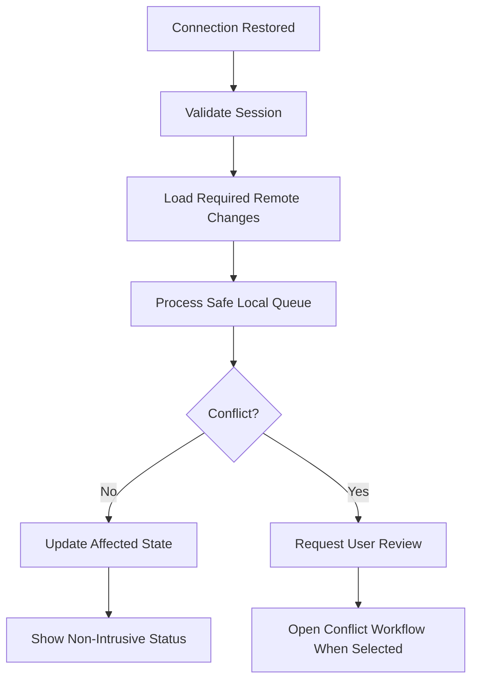

Routine reconnection should not interrupt the current task.

---

# Mobile Privacy Across Features

Privacy mode must apply consistently to:

- Dashboard
- Transactions
- Accounts
- Goals
- Reports
- Categories where values appear
- Assistant
- Notifications
- Search
- Clipboard
- Share
- App-switcher preview
- Native widgets when introduced

No feature may implement an independent privacy rule.

---

# Mobile Performance Requirements

Feature implementations should prioritize:

- Immediate touch response
- Stable scrolling
- Low memory usage
- Controlled network usage
- Progressive content
- Efficient native-bridge communication
- Battery awareness

---

# Large Dataset Handling

Mobile features must use:

- Pagination
- Incremental loading
- Virtualization where appropriate
- Server-side filtering
- Server-side search when necessary
- Stable record identifiers
- Controlled selection

Unbounded DOM rendering is forbidden.

---

# Mobile Feature Accessibility

Every feature must support:

- Touch
- Screen reader
- External keyboard
- Switch access
- Text scaling
- Zoom
- Reduced motion
- High contrast
- System Back
- Orientation change
- Privacy-safe accessible labels

---

# Mobile Feature Review Checklist

For each feature, verify:

```text
What is the primary Mobile task?

Can it be completed with one hand?

Is the primary action reachable?

What happens at 320px?

What happens in landscape?

What happens when the keyboard opens?

What happens when system Back is pressed?

What remains available offline?

Is local data distinguished from synchronized data?

Does privacy apply before rendering?

Can a screen reader understand the financial context?

Do gestures have visible alternatives?

Does backgrounding preserve the workflow?

Does the feature reuse shared business logic?
```

---

# Acceptance Criteria — Mobile Feature Experiences

The Mobile feature experience is accepted only when:

```text
□ Dashboard prioritizes immediate financial understanding.

□ Transactions support fast creation and review.

□ Accounts distinguish available money and liabilities.

□ Goals provide exact progress and safe contribution flows.

□ Reports summarize before visualizing.

□ Categories support efficient assignment.

□ Assistant actions require review.

□ Notifications respect system and privacy preferences.

□ Settings use category-to-detail navigation.

□ Cross-feature navigation preserves meaningful context.

□ System Back follows a consistent hierarchy.

□ Search and filters remain preserved.

□ Loading is progressive and localized.

□ Errors preserve entered work.

□ Offline actions show accurate synchronization status.

□ Privacy applies visually and accessibly.

□ Essential actions do not depend on gestures.

□ Financial values never truncate.

□ Large datasets use scalable rendering.

□ Mobile-specific code does not duplicate business logic.
```

---

# Android Application Lifecycle

The Android application lifecycle must be treated as a platform concern.

Lifecycle events may affect:

- Visible interface state
- Authentication validation
- Privacy protection
- Draft persistence
- Synchronization
- Network listeners
- Native notifications
- Temporary files
- Native plugin subscriptions
- Background processing

Lifecycle events must not independently alter financial data.

The native shell reports lifecycle changes.

Shared application services decide whether data must be refreshed, synchronized or protected.

---

# Lifecycle States

The Mobile application must recognize the following conceptual states:

```text
Cold Start

Initializing

Active

Inactive

Background

Resuming

Locked

Offline

Session Expired

Terminated
```

These states describe application availability.

They are not business states.

---

# Cold Start

A cold start occurs when no valid application process is available.

Recommended sequence:

```text
Native Launch Surface

↓

Initialize Native Bridge

↓

Load Minimal Web Shell

↓

Resolve Theme

↓

Resolve Privacy Preference

↓

Initialize Local Persistence

↓

Restore Authentication Session

↓

Restore Safe Route

↓

Render Cached Useful Content

↓

Check Network

↓

Synchronize Required Data

↓

Application Ready
```

The first useful interface should not wait for every remote request.

---

# Cold-Start Priorities

Priority order:

```text
1. Protect sensitive information.

2. Render the correct theme.

3. Restore a safe application shell.

4. Determine authentication state.

5. Present cached useful content.

6. Synchronize remote data.

7. Load secondary modules.
```

Startup animation is lower priority than useful content.

---

# Startup State Machine

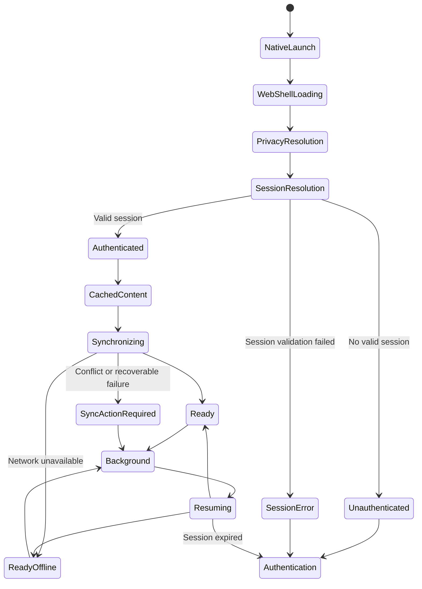

---

# Warm Start

A warm start occurs when the application process exists and the user returns after a short interruption.

A warm start should normally preserve:

- Current route
- Selected record
- Search query
- Filters
- Scroll position
- Draft form
- Active period
- Privacy state
- Pending local operations
- Open feature context

It should not rerun the full cold-start sequence unnecessarily.

---

# Resume Validation

On resume, the application should evaluate:

```text
Was the application backgrounded long enough to require session validation?

Did the network state change?

Did the user sign out in another environment?

Did protected data become stale?

Are there pending local operations?

Did a deep link or notification open the application?

Was the application locked because of inactivity?
```

Only required work should execute.

---

# Resume Flow

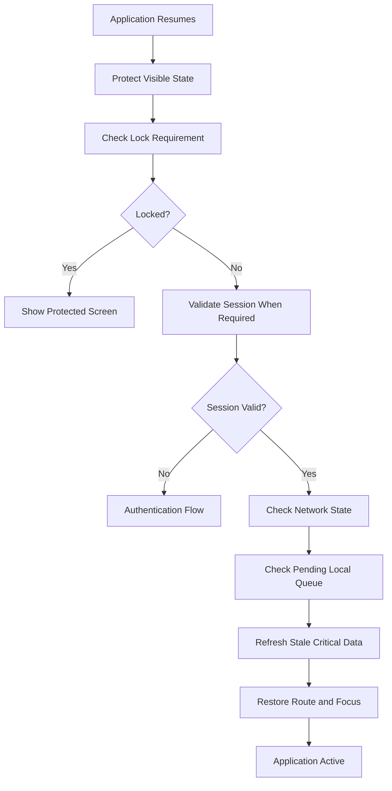

---

# Background Transition

When Nexio enters the background, it should:

- Protect app-switcher content when configured.
- Persist meaningful drafts.
- Persist pending local operations.
- Pause unnecessary animations.
- Pause high-frequency timers.
- Stop non-essential polling.
- Release temporary camera or microphone access.
- Close sensitive transient native resources.
- Preserve route and UI context.
- Keep safe synchronization work only when supported.
- Avoid signing the user out solely because the app backgrounded.

---

# Background Persistence

Before entering the background, persist only what is necessary.

Potentially persistent:

```text
Current route

Draft identifier

Draft canonical values

Selected period

Safe filters

Pending synchronization queue

Theme preference

Privacy preference

Last successful synchronization metadata
```

Avoid persisting:

```text
Passwords

Temporary authentication codes

Raw tokens in ordinary storage

Full imported files without purpose

Unnecessary financial snapshots

Temporary validation messages

Open menu state

Pointer or hover state
```

---

# Process Termination

Android may terminate the application process while it is in the background.

The application must not assume that in-memory state will survive.

Important state must be recoverable from:

- Safe route information
- Local persistence
- Draft storage
- Synchronization queue
- Authentication provider state
- Server state

---

# Process-Death Recovery

After process death:

```text
Restart Application

↓

Restore Safe Shell

↓

Restore Privacy State

↓

Restore Authentication

↓

Check Recoverable Drafts

↓

Restore Route When Valid

↓

Reload Required Data

↓

Resume Pending Synchronization Safely
```

The application must not automatically resubmit an uncertain operation after process death.

---

# Uncertain Submission Recovery

Example:

```text
The user selected Save.

The network request began.

The Android process was terminated before confirmation.
```

On recovery, Nexio must determine whether the operation:

- Was committed remotely
- Exists only locally
- Remains pending
- Failed
- Has an unknown outcome

Use:

- Idempotency identifiers
- Stable local operation identifiers
- Remote lookup
- Queue reconciliation

Do not create a duplicate transaction merely because confirmation was lost.

---

# Lifecycle Event Contract

Native lifecycle events should be normalized.

Example application events:

```text
platform.applicationActivated

platform.applicationBackgrounded

platform.applicationResumed

platform.applicationLocked

platform.networkChanged

platform.deepLinkReceived
```

Payloads should contain only required metadata.

Feature modules should not subscribe directly to multiple native plugin events.

---

# Lifecycle Listener Ownership

Listeners must be registered through one platform lifecycle coordinator.

Avoid:

```text
Dashboard registers app-state listener.

Transactions registers another app-state listener.

Reports registers another app-state listener.
```

Prefer:

```text
Platform Lifecycle Coordinator

↓

Normalized Application Event

↓

Shared State and Feature Consumers
```

This prevents duplicate refreshes and listener leaks.

---

# Inactivity Lock

Where supported, Nexio may lock after a configured period of inactivity.

The lock timer should account for:

- Application background time
- Active user interaction
- Sensitive workflow
- Authentication policy
- User preference
- Device biometric availability

---

# Lock Behavior

When locked:

- Financial values must be hidden.
- Screenshots or app previews should remain protected where supported.
- Pending drafts should remain safely stored.
- Background synchronization may continue only if permitted.
- The application route may remain internally preserved.
- Unlock must restore the intended context.

---

# Unlock Flow

```text
Protected Screen

↓

User Chooses Unlock

↓

Biometric or Supported Authentication

↓

Validate Session

↓

Restore Privacy Preference

↓

Restore Intended Route

↓

Refresh Stale Critical Data

↓

Continue Workflow
```

Biometric failure must provide a supported fallback.

---

# Session Expiration

When the authenticated session expires:

- Protected content must be obscured immediately.
- Remote requests must stop using the invalid session.
- Pending local changes must remain protected.
- The user should be directed to authentication.
- The intended destination may be restored after successful authentication.
- Sensitive information must not remain visible behind the authentication view.

---

# Authentication Restoration

After reauthentication:

- Validate user identity.
- Ensure the same authorized account is active.
- Restore pending changes only for that account.
- Restore the route when still valid.
- Recheck permissions.
- Resume synchronization safely.

Pending data from one account must never be applied to another account.

---

# Android Permission Architecture

Permissions must be requested according to feature need.

Nexio must follow these principles:

```text
Minimum permission

Contextual request

Clear explanation

Graceful denial

Safe fallback

No hidden escalation
```

A permission must not be requested merely because a plugin is installed.

---

# Permission Inventory

Every native permission must be documented in a permission inventory.

Recommended location:

```text
docs/mobile/PERMISSIONS.md
```

Recommended structure:

| Permission or Capability | Feature | Required? | Request Moment | Denial Fallback | Data Accessed |
|---|---|---:|---|---|---|
| Notifications | Financial reminders | No | When enabling reminder | In-app reminders | Notification content |
| Camera | Receipt capture | No | When opening capture | File picker or manual entry | Captured image |
| Microphone | Assistant voice input | No | When starting recording | Text input | Audio while active |
| Biometrics | App unlock | No | When enabling biometric access | Password or supported authentication | Platform result only |
| File access | Import or export | Contextual | During file operation | Alternative picker or share | Selected file |
| Location | Only if an approved feature requires it | Normally no | Feature-specific | Feature remains unavailable | Defined location scope |

Unused permissions must not remain in the Android manifest.

---

# Permission Categories

Permissions and capabilities may be classified as:

```text
No Runtime Permission Required

Runtime Permission Required

System Setting Controlled

Native Capability Without Sensitive Permission

Unsupported Capability
```

The interface must distinguish these cases.

---

# Permission Request Flow

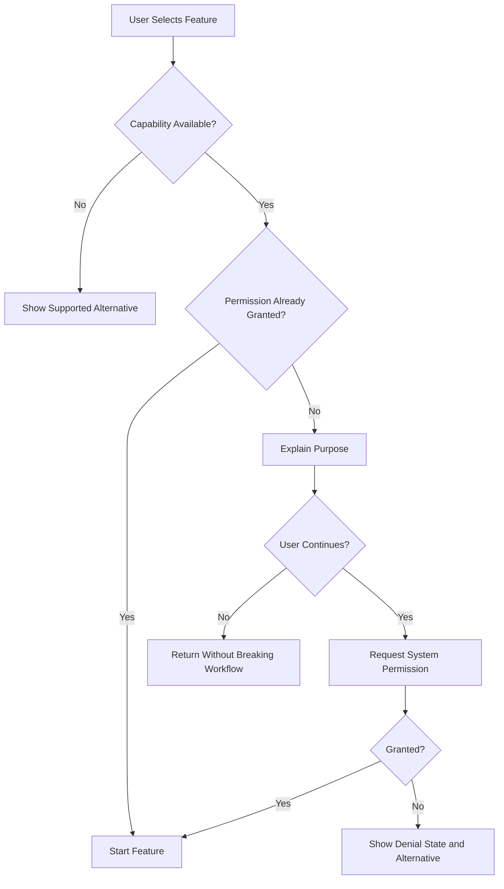

---

# Permission Explanation

Before invoking the system prompt, explain:

- What feature needs access
- What information will be accessed
- When access occurs
- Whether access continues in the background
- What happens if permission is denied

The explanation must be concise and specific.

---

# Permission Denial

Permission denial must not:

- Crash the application
- Trap the user
- Repeatedly request permission
- Disable unrelated features
- Claim that permission was granted
- Send the user to system settings without explanation

The feature should provide a fallback where possible.

---

# Permanent Denial

When the operating system no longer presents the permission prompt:

```text
Camera access is disabled for Nexio.

Enable it in Android settings to capture a receipt.

[Open settings] [Use file instead]
```

The Settings action must be user-initiated.

---

# Notification Permission

Notification permission should be requested when the user enables a meaningful notification feature.

Examples:

- Recurring-payment reminder
- Budget threshold alert
- Goal reminder
- Security notification
- Synchronization action required

Do not request permission during initial startup without contextual benefit.

---

# Camera Permission

Camera access may be requested only for an approved feature such as:

- Receipt capture
- Document attachment
- Supported QR or barcode capture

The camera must stop when:

- The capture screen closes
- The application backgrounds
- Permission is revoked
- The feature completes
- An error occurs

---

# Microphone Permission

Microphone access may be requested only after an explicit action such as:

```text
Start voice input
```

The interface must display:

- Recording state
- Stop action
- Cancel action
- Permission state
- Transcript review where supported

Nexio must not listen continuously.

---

# Biometric Capability

Biometric authentication should be accessed through the platform authentication API.

Nexio must not receive or store:

- Fingerprints
- Face data
- Biometric templates

The application should receive only the authentication result provided by the operating system.

---

# File Access

File import and export should prefer:

- Android document picker
- Android share sheet
- Application-scoped files
- Temporary content URI access
- Supported browser file APIs

Avoid broad storage permissions when a scoped document workflow is sufficient.

---

# Location Permission

Location must not be requested unless an approved product feature has a clear financial purpose.

Location must not be collected for:

- General analytics
- Decorative personalization
- Routine transaction creation
- Advertising
- Background monitoring without explicit approved need

Any future location feature requires a documented privacy and architecture decision.

---

# Permission Revocation

The user may revoke permission outside Nexio.

The application must recheck capability before use.

Do not assume that a previously granted permission remains available forever.

---

# Permission State Changes

When permission state changes:

- Update the related setting.
- Disable only the affected capability.
- Preserve unrelated data.
- Explain the required next action.
- Avoid repeatedly displaying alerts.
- Remove active listeners or resources.

---

# Native Notification Architecture

Native notifications are platform delivery mechanisms.

Notification business decisions remain in shared application services.

Conceptual flow:

```text
Business Event or Reminder Rule

↓

Notification Application Service

↓

Privacy and Preference Evaluation

↓

Notification Platform Adapter

↓

Android Notification Delivery
```

Android code must not independently decide financial thresholds or due dates.

---

# Notification Types

Nexio may support:

```text
Local Scheduled Notification

Remote Push Notification

Security Notification

Synchronization Notification

Reminder Notification

In-App Notification
```

Each type must have a documented source and ownership.

---

# Local Notifications

Local notifications may be suitable for:

- User-configured reminders
- Locally known due dates
- Goal reminders
- Draft reminders when explicitly supported

Local notifications must be updated or cancelled when the underlying record changes.

---

# Remote Push Notifications

Remote notifications may be suitable for:

- Security events
- Server-detected account events
- Synchronization action required
- Cross-device updates requiring awareness

Remote notification payloads must contain minimal sensitive information.

---

# Notification Channels

Android notification channels should group related notification types.

Conceptual channels:

```text
Financial Reminders

Security

Synchronization

Goals and Budgets

General Product Information
```

Channel naming must be user-facing and understandable.

Security and routine product information should not share the same channel.

---

# Notification Priority

Priority should reflect urgency.

Examples:

```text
High priority:
Important security action or urgent approved financial reminder

Default priority:
Upcoming obligation

Low priority:
Routine completed background activity
```

Routine synchronization success should normally remain silent.

---

# Notification Content

A notification should include:

- Clear title
- Concise context
- Relevant time
- Safe action
- Privacy-appropriate detail
- Stable event identifier

Avoid technical content.

Bad:

```text
Sync worker failed with HTTP 401.
```

Better:

```text
Nexio needs you to sign in again to synchronize pending changes.
```

---

# Notification Privacy Levels

Recommended conceptual privacy values:

```text
Detailed

Protected

Minimal
```

## Detailed

May display approved description and amount when the user permits it.

## Protected

Displays the event without sensitive values.

Example:

```text
A payment is due tomorrow.
```

## Minimal

Displays only:

```text
Nexio has a new notification.
```

---

# Lock-Screen Behavior

Notification lock-screen visibility must follow:

- User preference
- Android system setting
- Privacy mode
- Notification type
- Security sensitivity

Sensitive values must not appear when protected mode is active.

---

# Notification Deep Link

A notification may include a safe target such as:

```text
Transaction detail

Goal detail

Payment reminder

Synchronization review

Security review
```

The payload should use a stable application route or event reference.

It must not expose authorization-sensitive data in plain form unnecessarily.

---

# Notification Open Flow

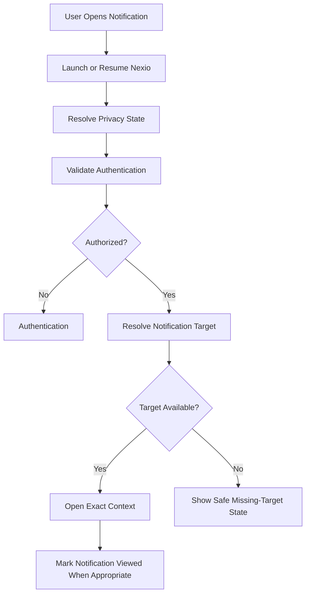

---

# Notification Deduplication

Each notification event should use a stable identifier.

Deduplication should prevent:

- Multiple notifications for the same event
- Duplicate delivery after retry
- Duplicate in-app and native entries without purpose
- Repeated scheduled reminders after an item is completed

---

# Notification Update and Cancellation

When the underlying record changes:

```text
Due date changed
→ Update scheduled notification.

Record completed
→ Cancel pending reminder.

Record deleted
→ Cancel notification.

Privacy changed
→ Future notifications use new privacy level.

User disabled category
→ Cancel applicable scheduled notifications.
```

---

# Notification Actions

Optional notification actions may include:

```text
Review

Open

Mark as completed when safe

Snooze when supported

Sign in
```

High-impact financial actions should normally open Nexio for review.

---

# Notification Failure

Notification scheduling or delivery failure must not alter the financial record.

The application may show:

```text
This reminder could not be scheduled.

Your transaction is still saved.
```

---

# Notification Testing

Test:

- Permission not requested
- Permission granted
- Permission denied
- Permanent denial
- Detailed privacy
- Protected privacy
- App active
- App backgrounded
- App terminated
- Session expired
- Missing target
- Updated due date
- Deleted record
- Duplicate delivery
- Dark and light system theme
- Device reboot where scheduled behavior applies

---

# Native Import Architecture

Mobile import may begin through:

- In-app file picker
- Android Share target where implemented
- Open-with intent
- Cloud document provider
- Browser file selection
- Supported attachment workflow

Every source must normalize to a shared import service.

---

# Import Intake Flow

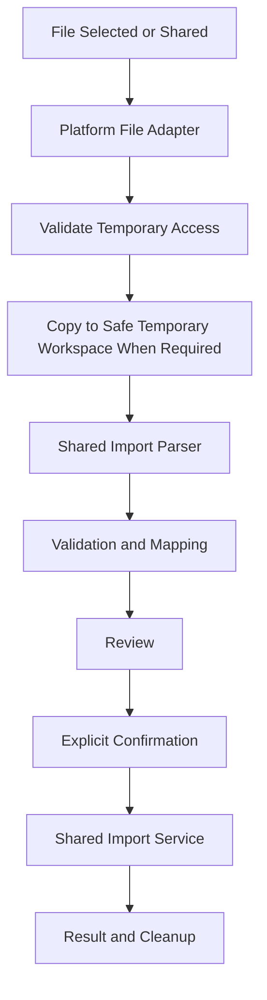

---

# Import Source Safety

Before processing:

- Validate that a file was actually selected.
- Validate supported format.
- Validate declared and detected file type.
- Validate size.
- Reject empty files.
- Handle inaccessible content URIs.
- Handle provider cancellation.
- Avoid trusting the filename alone.
- Avoid executing embedded content.

---

# Temporary Import Files

Temporary files must:

- Use application-controlled temporary storage.
- Have unpredictable internal names where practical.
- Avoid including sensitive values in filenames.
- Be removed after completion or cancellation.
- Be removed after expiration.
- Not remain in public storage unnecessarily.
- Not enter crash logs.

---

# Import Backgrounding

If the application backgrounds during import review:

- Preserve the selected file reference when still valid.
- Preserve mapping and corrections.
- Pause unsafe processing.
- Avoid restarting from the beginning unnecessarily.
- Explain when the external provider access expired.
- Avoid duplicate import jobs.

---

# Import and Process Death

For long imports, persist enough operation metadata to determine:

- File still accessible
- Parsing completed
- Validation completed
- Confirmation received
- Commit started
- Commit completed
- Cleanup pending

Do not automatically commit after process recovery unless explicit confirmation was durably recorded and the operation is idempotent.

---

# Mobile Import Review

The review must display:

```text
Total rows

Ready rows

Warnings

Errors

Possible duplicates

Excluded rows
```

Compact screens should use filters and step-based review rather than a compressed full table.

---

# Mobile Import Mapping

A step-based mapping may follow:

```text
1. Choose the amount column.

2. Choose the date column.

3. Choose the description column.

4. Define debit and credit interpretation.

5. Choose default account.

6. Review optional category mapping.
```

Sample values must appear beside each source column.

---

# Import Validation Accessibility

Validation messages must identify:

- Row or group
- Field
- Problem
- Corrective action

Color alone is insufficient.

---

# Import Commit

The final import action must show:

- Number of records to create
- Number excluded
- Accepted warnings
- Included duplicates
- Account scope
- Date range
- Whether new categories will be created

---

# Import Progress

During commit:

- Prevent duplicate confirmation.
- Show current stage.
- Show processed quantity when known.
- Preserve screen-awake behavior only when justified.
- Support safe backgrounding where possible.
- Make cancellation semantics clear.
- Avoid claiming cancellation after records were already committed.

---

# Import Completion

Completion should report:

```text
Imported

Skipped

Failed

Possible duplicates included

Accounts affected

Categories created or matched
```

Provide:

- View imported transactions
- Review failures
- Export error details when useful
- Undo import when safely supported

---

# Native Export Architecture

Mobile exports should use:

```text
Shared Export Service

↓

Temporary File Generator

↓

Platform Share or Save Adapter

↓

User-Selected Destination
```

Android-native code controls file delivery.

Shared services control export content.

---

# Export Scope Review

Before generation, show:

- Data type
- Period
- Accounts
- Filters
- Number of records where practical
- Format
- Sensitive-content warning
- Destination choice when applicable

---

# Export File Naming

Export filenames should be:

- Understandable
- Free of authentication information
- Free of internal database identifiers
- Free of unnecessary personal data
- Stable enough for user recognition

Example:

```text
nexio-transactions-2026-07.csv
```

Avoid:

```text
user-uuid-access-token-transactions.csv
```

---

# Export Temporary Files

Generated files must:

- Use safe temporary or application-scoped storage.
- Be shared using a platform-supported URI.
- Be deleted according to a cleanup policy.
- Not remain indefinitely after cancellation.
- Not expose internal storage paths.
- Use the correct MIME type.
- Remain unavailable to unauthorized application contexts where possible.

---

# Export Share Flow

```text
Configure Export

↓

Review Sensitive Scope

↓

Generate File

↓

Open Android Share Sheet

↓

User Chooses Destination or Cancels

↓

Return to Nexio

↓

Display Accurate Result
```

Opening the share sheet does not prove that the file was successfully delivered.

Do not claim:

```text
File shared successfully
```

unless the platform provides reliable confirmation.

Prefer:

```text
Share options opened
```

or:

```text
Export prepared
```

---

# Export Failure

On failure:

- Preserve export configuration.
- Explain whether a file was created.
- Clean partial files.
- Allow retry.
- Avoid duplicate generation.
- Log only safe diagnostic metadata.
- Avoid exposing filesystem details.

---

# Native Share Privacy

Before sharing a transaction or report:

- Show the information to be shared.
- Apply privacy preference.
- Avoid including hidden values.
- Require explicit user action.
- Avoid preselecting an external destination.
- Avoid sharing authentication or internal metadata.

---

# Android Security Architecture

Security must be applied across:

```text
Web Application

Capacitor Bridge

Android Native Shell

Local Storage

Network Communication

Notifications

Files

Clipboard

Screenshots

Logs

Build Configuration
```

No single layer is sufficient by itself.

---

# Client Secret Policy

The Mobile application must never contain:

- Supabase service-role keys
- Private server secrets
- Signing-store passwords
- Production database passwords
- Private API secrets intended for trusted servers
- Long-lived administrative credentials

Values shipped inside Web or Android application packages must be treated as discoverable.

---

# Public Client Configuration

Public client configuration may be included only when the backend security model expects it.

Authorization must rely on:

- Authenticated user identity
- Row-level access rules
- Server-side validation
- Least-privilege operations
- Secure session handling

A public client key must never be treated as the primary authorization mechanism.

---

# Authentication Token Storage

Authentication tokens must use the official authentication client and approved platform storage strategy.

Do not:

- Print tokens to logs.
- Include tokens in URLs unnecessarily.
- Copy tokens to clipboard.
- Store tokens in ordinary debug files.
- Expose tokens through user-facing error messages.
- Include tokens in analytics.

---

# Secure Storage Adapter

When sensitive platform storage is required, use a stable application contract.

Example:

```javascript
secureStorage.set(key, value)
secureStorage.get(key)
secureStorage.remove(key)
secureStorage.clearForUser(userId)
```

Feature modules must not depend directly on a specific secure-storage plugin.

---

# Local Financial Data

Locally cached financial data must follow:

- User ownership
- Authentication state
- Logout cleanup policy
- Encryption strategy where applicable
- Retention policy
- Offline requirement
- Account-switching isolation

Do not keep another user's cached records after account switching.

---

# Logout Cleanup

On sign-out:

- Clear protected in-memory state.
- Stop synchronization.
- Remove or protect authentication tokens.
- Clear user-specific temporary files.
- Clear sensitive notifications when appropriate.
- Clear app-switcher protected state.
- Handle pending local data according to documented policy.
- Avoid deleting recoverable data silently.

If unsynchronized data exists, the user must be warned before destructive cleanup.

---

# Account Switching

When a different account authenticates:

- Never reuse the previous user's application state.
- Never attach old pending operations to the new user.
- Clear previous route identifiers when unauthorized.
- Reinitialize repositories with the new ownership scope.
- Reload preferences for the new user.
- Reevaluate privacy mode.
- Reevaluate notification ownership.

---

# WebView Navigation Security

The Android WebView must restrict navigation according to the approved application policy.

External URLs should:

- Open through a safe external-browser flow when appropriate.
- Be validated before opening.
- Avoid inheriting privileged native bridge access.
- Avoid silently replacing the Nexio application origin.

Untrusted external pages must not receive access to Nexio native capabilities.

---

# Deep-Link Security

Deep links must be treated as untrusted input.

Validate:

- Scheme or domain
- Route
- Identifier format
- Authentication
- Authorization
- Allowed query parameters
- Redirect destination
- Expiration when applicable

A deep link must not bypass permission or ownership checks.

---

# Authentication Callback Security

Authentication callbacks must:

- Validate expected state where applicable.
- Avoid open redirects.
- Avoid exposing tokens in visible error content.
- Complete only through approved domains or schemes.
- Remove temporary callback state after completion.
- Handle repeated callback delivery safely.

---

# Network Security

The Mobile application must:

- Use encrypted network communication.
- Reject insecure production endpoints.
- Avoid mixed secure and insecure content.
- Avoid disabling certificate validation.
- Avoid logging full request headers.
- Use server-side authorization.
- Handle connection failure without weakening security.

Debug-only networking exceptions must never enter production builds accidentally.

---

# Clipboard Security

Clipboard operations should be limited.

Nexio must not copy automatically:

- Passwords
- Tokens
- Full account identifiers
- Hidden financial values
- Recovery codes without explicit action
- Sensitive debug information

After copying sensitive data, provide clear user feedback without repeating protected content unnecessarily.

---

# Screenshot and Screen-Recording Policy

The application should define which screens may require screenshot protection.

Possible protected contexts:

- Authentication recovery
- Security credentials
- Sensitive export review
- Complete account deletion confirmation
- Other formally approved security workflows

Routine financial screens may rely on privacy mode unless stronger protection is justified.

Screenshot blocking must not be applied indiscriminately without considering usability and support needs.

---

# App-Switcher Protection

When enabled, the native shell should replace or obscure sensitive content before the system captures the application preview.

The protected preview may show:

```text
Nexio

Financial information hidden
```

The protection must not alter the actual stored application state.

---

# Rooted or Compromised Devices

The application may detect some high-risk device conditions if a reliable approved mechanism exists.

However:

- Detection is not guaranteed.
- Detection must not replace backend security.
- False positives must be considered.
- The application should avoid making unsupported security guarantees.
- Blocking behavior requires a documented security decision.

---

# Logging Policy

Logs must not contain:

- Passwords
- Authentication tokens
- Exact financial datasets
- Full account identifiers
- Personal notes
- Raw imported files
- Private notification content
- Biometric information
- Hidden balances
- Signing credentials

---

# Safe Diagnostic Metadata

Allowed examples:

```text
Feature name

Operation type

Error category

Duration

Retry count

Application version

Platform version

Anonymous correlation identifier

Network availability state
```

Only collect what is necessary.

---

# Production Debugging

Production builds must not expose:

- Developer menus
- Verbose bridge logs
- Raw API errors
- WebView debugging without explicit approved need
- Internal routes
- Test accounts
- Mock data controls
- Build secrets

---

# Dependency Security

Native and JavaScript dependencies must be reviewed for:

- Maintenance status
- Required permissions
- Transitive dependencies
- Native code
- Privacy behavior
- Security advisories
- Bundle impact
- Compatibility
- License

A dependency should not be added only to solve a small behavior that can be implemented safely without it.

---

# Build Artifact Ownership

The following are not canonical source architecture:

```text
android/app/build/
android/.gradle/
Generated APK files
Generated AAB files
Generated intermediates
Generated merged resources
Generated caches
IDE workspace state
```

These artifacts should be regenerated from source.

---

# Canonical Mobile Source

Canonical Mobile source includes:

```text
Shared Web application source

css/mobile.css

js/ui/mobile.js

mobile-capacitor.js

capacitor.config.ts

Intentional android/ source configuration

capacitor-overrides/android/

android-web/ fallback source

Build and release documentation
```

Generated files should not be manually edited unless they are intentionally promoted into a documented source override.

---

# Android Override Strategy

Intentional native changes should be maintained through:

```text
capacitor-overrides/android/
```

or another documented canonical mechanism.

The override process must define:

- Source file
- Target generated file
- Application command
- Validation
- Conflict detection
- Compatibility with Capacitor updates

---

# Override Application Flow

```text
Update Web Source

↓

Build Web Assets

↓

Synchronize Capacitor

↓

Apply Documented Android Overrides

↓

Validate Manifest and Resources

↓

Build Android Project

↓

Run Tests

↓

Generate Release Artifact
```

Manual undocumented changes inside generated files are forbidden.

---

# Override Inventory

Maintain an inventory such as:

| Override | Target | Purpose | Required Validation |
|---|---|---|---|
| `AndroidManifest.xml` | Android app manifest | Approved platform configuration | Manifest merge review |
| `MainActivity.java` | Main Activity | WebView or lifecycle customization | Startup and navigation tests |
| `styles.xml` | Native theme | Launch and system UI appearance | Light and dark tests |
| `values-night/styles.xml` | Native dark theme | Dark startup integration | Dark startup test |
| `colors.xml` | Native color resources | System UI integration | Token consistency review |
| `strings.xml` | Native labels | Android application labels | Localization review |

---

# Capacitor Synchronization Rules

After changing:

- Web output
- Capacitor plugins
- Capacitor configuration
- Native dependencies
- Android resources

run the documented synchronization process.

The build documentation must specify the canonical commands.

Do not rely on developers remembering an undocumented sequence.

---

# Android Build Pipeline

Conceptual pipeline:

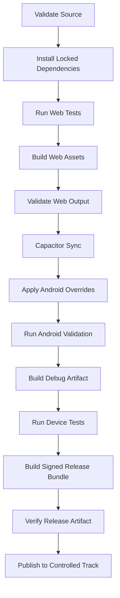

---

# Dependency Installation

Release builds must use the locked dependency versions defined by the project.

A release must not silently update dependencies during the build.

Dependency changes require:

- Explicit commit
- Review
- Tests
- Changelog consideration
- Native compatibility validation

---

# Web Asset Build

Before Android synchronization:

- Build the correct production Web assets.
- Verify production configuration.
- Verify no development endpoint is embedded.
- Verify theme and privacy initialization.
- Verify offline fallback files.
- Verify required static assets.
- Verify source-map policy.
- Verify file paths under WebView.

---

# Capacitor Web Directory

The configured Web asset directory is the source copied into the Android application.

The release process must verify that:

- It contains the latest production build.
- It does not contain server logs.
- It does not contain local secrets.
- It does not contain unnecessary development tools.
- It includes required offline and startup assets.
- It uses correct relative paths.

---

# Android Manifest Review

Before release, review:

- Application permissions
- Deep-link intent filters
- Exported components
- Network configuration
- Backup configuration
- File providers
- Notification components
- Application labels
- Theme
- Orientation behavior
- Package identity

Only required components should be exposed.

---

# Versioning

Every Android release requires:

```text
Human-readable version name

Monotonically increasing version code
```

The version must correspond to the product release record.

Do not reuse a version code for a different artifact.

---

# Release Identity

Release identity includes:

- Application package identifier
- Signing key
- Upload key where applicable
- Version code
- Version name
- Distribution track
- Build configuration

Changes to package identity or signing strategy require a formal release decision.

---

# Signing Security

Signing credentials must not be:

- Committed to source control
- Included in documentation screenshots
- Stored in public cloud folders
- Added to application assets
- Shared through ordinary chat
- Printed in build logs

Signing access must be limited and recoverable according to the project's release policy.

---

# Signing Configuration

Release signing should use:

- Environment variables
- Protected local configuration
- Secure build-system secrets
- Documented credential ownership

Local property files containing secrets must remain outside version control.

---

# Release Artifact

The preferred production artifact should follow the active Android distribution strategy.

The release process must verify:

- Correct package identifier
- Correct version
- Correct signature
- Correct production endpoint
- Correct application name
- Correct icon
- Correct launch theme
- Correct permissions
- No debug behavior
- No test data
- No development menu

---

# Debug Build

Debug builds may enable:

- WebView debugging
- Development logging
- Mock environment
- Local server access
- Test deep links
- Debug menu

These capabilities must be disabled or excluded from production builds.

---

# Release Build

Release builds must:

- Use production configuration.
- Disable debug-only controls.
- Minimize sensitive logging.
- Use approved optimization.
- Preserve required accessibility metadata.
- Preserve required Web assets.
- Use production signing.
- Pass startup and authentication tests.
- Pass offline and privacy tests.

---

# Build Reproducibility

Given the same:

- Source commit
- Locked dependencies
- Build tools
- Configuration
- Android overrides

the build process should produce functionally equivalent output.

Document:

- Required runtime versions
- Required Java environment
- Required Android tooling
- Required commands
- Required environment variables
- Override process
- Artifact output location

---

# Generated Artifact Verification

After building:

- Install the release candidate.
- Verify the displayed version.
- Verify the application signature through approved tooling.
- Verify startup.
- Verify login.
- Verify core transaction creation.
- Verify offline behavior.
- Verify app resume.
- Verify deep links.
- Verify notification handling.
- Verify account deletion route where applicable.
- Verify privacy policy access.

---

# Release Channels

Android releases should progress through controlled channels.

Conceptual sequence:

```text
Internal Testing

↓

Closed Testing

↓

Open or Wider Testing When Applicable

↓

Production
```

The exact distribution process must follow the active store configuration.

---

# Staged Rollout

Production releases may use staged rollout.

During rollout, review:

- Crash rate
- Startup failures
- Authentication failures
- Synchronization failures
- Transaction-save failures
- Android Back defects
- WebView loading failures
- Performance regressions
- User feedback

A rollout should be paused when severe regressions appear.

---

# Rollback Strategy

The project must define how to respond to a defective release.

Possible actions:

- Halt rollout
- Publish a corrected version
- Disable a feature through a safe feature flag
- Disable a server-dependent capability
- Restore compatible backend behavior

A published Android binary generally cannot be remotely replaced without a new release.

Backend and schema changes must remain backward-compatible during rollout.

---

# Mobile Backward Compatibility

During staged release, multiple app versions may be active.

Backend changes must consider:

- Older request formats
- Older database expectations
- Older notification payload handling
- Older deep-link routes
- Older synchronization queues
- Older cached data schemas

Breaking compatibility requires a coordinated migration strategy.

---

# Database Migration Safety

Mobile releases and database migrations must be ordered safely.

Preferred strategy:

```text
1. Deploy backward-compatible backend changes.

2. Release Mobile client using new capability.

3. Confirm adoption and stability.

4. Remove deprecated backend compatibility later.
```

Do not deploy a database change that immediately breaks the currently published application.

---

# Local Storage Migration

When local schema changes:

- Detect the previous schema version.
- Migrate deterministically.
- Preserve pending operations.
- Preserve drafts where compatible.
- Validate migration success.
- Provide safe recovery.
- Avoid silently deleting financial data.

---

# Local Migration Failure

If migration fails:

- Stop unsafe synchronization.
- Preserve the original data where possible.
- Show a recoverable state.
- Record safe diagnostics.
- Provide Retry.
- Avoid creating a new empty database over the old one.
- Avoid claiming that cloud data was deleted.

---

# Mobile Release Documentation

Each release should record:

```text
Version

Build identifier

Source commit

Release date

Distribution channel

Feature changes

Bug fixes

Database or storage migrations

Permission changes

Plugin changes

Known issues

Rollback or mitigation plan
```

---

# Store Listing Consistency

The store listing must remain consistent with the application.

Review:

- Application name
- Description
- Screenshots
- Feature claims
- Privacy policy
- Support contact
- Data-use declarations
- Account-deletion information
- Notification behavior
- Subscription information where applicable

Do not claim capabilities that are unavailable in the published build.

---

# Privacy Policy Access

The privacy policy must be accessible:

- From the store listing
- From within Nexio
- Before or during sensitive consent where required
- Without requiring access to financial data

The application must link to the active policy version.

---

# Account Deletion Access

When user accounts can be created, the deletion process must remain discoverable.

The application should provide:

```text
Settings

↓

Account Management

↓

Delete Account
```

The workflow must match the published support and privacy information.

---

# Data Declaration Review

Before release, review whether application behavior changed in areas such as:

- Financial data
- Authentication
- Analytics
- Crash diagnostics
- Device identifiers
- Notifications
- Files
- Camera
- Microphone
- Biometrics
- Assistant data
- Advertising

Store declarations and privacy documentation must match the actual release.

---

# Permission Change Review

Adding a permission is a release-significant change.

Before adding one:

1. Confirm the feature requirement.
2. Confirm no lower-privilege alternative exists.
3. Update the permission inventory.
4. Update privacy documentation when necessary.
5. Add contextual permission UI.
6. Add denial behavior.
7. Add tests.
8. Review store declarations.
9. Review the manifest.
10. Verify production behavior.

---

# Native Plugin Change Review

Adding or updating a Capacitor plugin requires:

- Architecture review
- Permission review
- Android manifest review
- Lifecycle review
- Privacy review
- Build compatibility review
- Bundle-size review
- Security review
- Device testing
- Documentation update

---

# Mobile Observability

Production Mobile observability should identify failures without collecting unnecessary financial information.

Monitor:

```text
Startup success

WebView load failure

Authentication restoration

Transaction save failure

Synchronization failure

Import failure

Export failure

Deep-link failure

Notification-open failure

Native bridge failure

Unhandled JavaScript error

Unhandled Android error

Application-not-responding indicators

Memory pressure

Performance regression
```

---

# Error Correlation

Use anonymous correlation identifiers to connect:

- User-visible error
- JavaScript diagnostic
- Native diagnostic
- Server request

Correlation identifiers must not encode:

- User email
- Account number
- Financial amount
- Authentication token
- Record description

---

# Crash Reporting

Crash reports may include:

- Application version
- Android version
- Device class
- Stack trace
- Feature context
- Safe operation category
- Memory state
- Network state

Crash reports must exclude sensitive application content.

---

# User-Facing Error Reference

For support-sensitive failures, show a short reference:

```text
We could not complete this action.

Reference: NX-7F2A
```

The reference should map to safe diagnostics without revealing internal details.

---

# Mobile Analytics

Mobile analytics may evaluate:

- Feature adoption
- Workflow completion
- Screen transition
- Permission acceptance
- Import completion
- Notification interaction
- Offline usage
- Error rates
- Performance
- Abandonment

Analytics must not collect exact financial content unless explicitly justified, documented and permitted.

---

# Analytics Event Design

Prefer:

```text
transaction_create_started

transaction_create_completed

transaction_create_failed

filter_applied

import_review_completed
```

Avoid:

```text
user_spent_185_40_at_supermarket
```

---

# Mobile Testing Strategy

Required testing layers:

```text
Shared Unit Tests

↓

Mobile UI Component Tests

↓

Platform Adapter Tests

↓

Android Integration Tests

↓

End-to-End Tests

↓

Visual Regression Tests

↓

Accessibility Tests

↓

Performance and Reliability Tests

↓

Release-Candidate Device Tests
```

---

# Shared Unit Tests

Shared tests should cover:

- Financial calculations
- Transaction validation
- Account rules
- Goal calculations
- Report aggregation
- Synchronization queue
- Conflict resolution
- Formatting
- Privacy rules
- Import interpretation

These tests must not be duplicated for Android.

---

# Mobile UI Unit Tests

Test:

- Shell-mode selection
- Back-action priority
- Bottom-navigation state
- Search mode
- Selection mode
- Virtual-keyboard adaptation
- Privacy rendering
- Offline labels
- Notification route parsing
- Draft detection
- Feature-state preservation

---

# Platform Adapter Tests

Test the adapter behavior for:

- Native environment available
- Web environment fallback
- Plugin available
- Plugin unavailable
- Permission granted
- Permission denied
- Permission revoked
- Native call success
- Native call cancellation
- Native call failure
- Listener cleanup
- Duplicate lifecycle event

---

# Android Integration Tests

Test:

- Cold start
- Warm start
- Resume
- Background
- Process recreation
- System Back
- Deep link
- Notification open
- File picker
- Share sheet
- Theme synchronization
- Status bar
- Navigation bar
- Offline fallback
- Session expiration
- App-switcher privacy

---

# Mobile End-to-End Journeys

Critical journeys:

```text
Install and open application

Sign in

Review dashboard

Create expense

Create income

Create transfer

Edit transaction

Review account

Create goal

Open report

Change privacy mode

Use offline mode

Reconnect and synchronize

Sign out
```

High-risk journeys:

```text
Import financial data

Bulk delete

Delete account

Export all data

Resolve synchronization conflict

Recover from process termination

Reauthenticate after session expiration

Open a security notification
```

---

# Android Back Test Matrix

Test Back from:

```text
Root dashboard

Root transactions

Bottom sheet

Dialog

Overflow menu

Search mode

Selection mode

Transaction detail

Transaction edit form

Unsaved form

Import review

Import processing

Authentication

Protected lock screen

Deep-linked detail
```

One Back action must trigger one predictable result.

---

# Lifecycle Test Matrix

Test:

```text
Cold start online

Cold start offline

Cold start with expired session

Warm resume

Resume after long inactivity

Background during form entry

Background during save

Background during import

Process termination with draft

Process termination with pending transaction

Resume from notification

Resume from deep link

Resume after permission change

Resume after account sign-out elsewhere
```

---

# Permission Test Matrix

For every permission:

```text
Not requested

Explanation dismissed

Granted

Denied once

Denied permanently

Revoked in settings

Unavailable capability

Request during offline mode

Request after process recreation

Privacy preference active
```

---

# Notification Test Matrix

Test:

```text
Notifications disabled

Permission granted

Permission denied

Scheduled reminder

Updated reminder

Cancelled reminder

Duplicate event

Protected preview

Detailed preview

Application active

Application backgrounded

Application terminated

Session expired

Missing destination record

Deep link unauthorized

Notification channel disabled
```

---

# Import Test Matrix

Test:

```text
File picker cancelled

Unsupported format

Empty file

Corrupted file

Large file

Ambiguous date

Invalid amount

Debit and credit columns

Possible duplicates

Mapping preserved after background

Process termination during review

Process termination during commit

Partial commit failure

Retry without duplication

Temporary-file cleanup

Undo import
```

---

# Export Test Matrix

Test:

```text
Export cancelled

Generation success

Generation failure

Share sheet cancelled

File save success

No compatible share destination

Large export

Privacy mode

Expired temporary file

Process background during generation

Reauthentication requirement

Complete-data export
```

---

# Security Test Matrix

Test:

```text
Session expired

Sign out with pending changes

Account switch

Deep-link tampering

Unauthorized record identifier

External URL navigation

Token absent

Token invalid

Screenshot-protected screen

Clipboard restriction

Production logging

Debug feature disabled

Insecure endpoint configuration
```

---

# Offline Test Matrix

Test:

```text
Start offline

Lose connection on dashboard

Lose connection during transaction entry

Lose connection during save

Create multiple offline transactions

Edit pending offline transaction

Delete pending offline transaction

Reconnect

Conflict after reconnect

Authentication expired while offline

Queue retry failure

Application restart with pending queue
```

---

# Mobile Visual Test Matrix

Representative widths:

```text
320px

360px

390px

412px

480px

599px
```

Representative heights:

```text
568px

640px

720px

780px

844px

915px
```

Also test:

- Landscape
- Cutout or safe-area device
- Gesture navigation
- Three-button navigation when supported
- Large text
- Display scaling
- Dark theme
- Light theme
- Virtual keyboard open

---

# Android Device Matrix

The supported device plan should include:

```text
Minimum supported Android environment

Representative mid-range Android device

Representative low-memory device

Representative modern Android device

Large phone

Narrow phone

Device with display cutout

Gesture-navigation device

Three-button-navigation device

Tablet or foldable transition where applicable
```

Test the actual minimum and target versions defined by the project configuration.

---

# WebView Testing

Because Nexio uses a WebView-based shell, test:

- Initial WebView load
- Cached asset load
- WebView update compatibility
- JavaScript bridge readiness
- Local asset paths
- External navigation
- File selection
- Virtual keyboard
- History navigation
- Offline fallback
- Theme
- Storage persistence
- Browser-feature support

---

# Accessibility Test Matrix

Test with:

- TalkBack
- Touch exploration
- Switch access where available
- External keyboard
- Large font
- Display scaling
- High-contrast settings
- Reduced animation
- Dark theme
- Privacy mode
- System Back
- Permission dialogs
- Notification interaction

---

# TalkBack Journey

For each critical screen:

```text
1. Hear the screen title.

2. Identify current navigation destination.

3. Understand financial context.

4. Navigate primary actions.

5. Complete the main form.

6. Hear validation errors.

7. Hear save status.

8. Return to prior context.

9. Use system Back.

10. Confirm hidden values remain hidden.
```

---

# Performance Tests

Measure:

- Cold-start useful content
- Warm-start restoration
- Touch-response delay
- Transaction-list scrolling
- Chart rendering
- Keyboard opening
- Bottom-sheet opening
- Search response
- Offline queue processing
- Import parsing
- Memory growth
- Native bridge call frequency
- Battery-intensive background behavior

---

# Reliability Tests

Run repeated scenarios:

```text
Open and close transaction form 50 times

Rotate repeatedly

Background and resume repeatedly

Open and close bottom sheets repeatedly

Switch theme repeatedly

Create and delete local drafts

Lose and restore network repeatedly

Open notification targets repeatedly

Import and cancel repeatedly
```

Verify:

- No listener accumulation
- No duplicate records
- No memory growth trend
- No duplicated notifications
- No broken Back stack
- No privacy flash

---

# Release Candidate Smoke Test

Before publishing:

```text
□ Install clean release build.

□ Upgrade from previous production version.

□ Confirm version and package.

□ Confirm correct signing.

□ Open application online.

□ Open application offline.

□ Sign in.

□ Restore existing session.

□ Create expense.

□ Create income.

□ Create transfer.

□ Edit and delete transaction.

□ Test privacy mode.

□ Test system Back.

□ Test background and resume.

□ Test notification opening.

□ Test import.

□ Test export.

□ Test account deletion access.

□ Test privacy policy access.

□ Confirm no debug menu.

□ Confirm no verbose sensitive logs.
```

---

# Upgrade Testing

Test upgrading from supported earlier versions.

Verify:

- Local schema migration
- Authentication restoration
- Pending queue preservation
- Draft preservation
- Theme preference
- Privacy preference
- Notification scheduling
- Deep links
- Account ownership
- Removed plugin compatibility
- Android override compatibility

---

# Clean Installation Testing

A clean install must verify:

- Correct launch theme
- No stale local data
- Correct onboarding or authentication
- Contextual permission requests
- Default privacy behavior
- Offline fallback
- Store-installed asset integrity
- Correct notification channels
- Correct application icon and name

---

# Mobile Legacy Migration

The Mobile architecture should be migrated incrementally.

Recommended sequence:

```text
1. Define platform adapter.

2. Consolidate lifecycle listeners.

3. Consolidate Android Back handling.

4. Protect startup privacy.

5. Consolidate Mobile shell modes.

6. Migrate bottom navigation.

7. Migrate transaction creation.

8. Migrate temporary surfaces.

9. Migrate offline indicators.

10. Migrate file import and export.

11. Migrate notifications.

12. Remove obsolete native and Mobile presentation code.
```

---

# Legacy Mobile Audit

For each existing implementation, document:

- Current behavior
- File ownership
- Shared dependencies
- Native-plugin dependencies
- Direct Supabase access
- Duplicated financial logic
- Back-button behavior
- Lifecycle listeners
- Permission usage
- Offline behavior
- Privacy defects
- Accessibility defects
- Performance risks
- Migration tests

---

# Legacy Native Audit

Review:

```text
mobile-capacitor.js

capacitor.config.ts

AndroidManifest.xml

MainActivity.java

Native styles

Native colors

Offline assets

Capacitor plugins

Gradle dependencies
```

Identify which files are:

```text
Canonical source

Generated source

Intentional override

Build output

Local environment file

Temporary artifact
```

---

# Generated File Rule

Do not manually maintain generated build output.

If a generated file requires a permanent modification:

1. Identify the canonical source.
2. Create an approved override or configuration.
3. Document the generation step.
4. Add validation.
5. Remove the undocumented manual edit.

---

# Mobile Migration Safety

Migration must preserve:

- Authentication
- Financial calculations
- Local pending changes
- Offline data
- Deep links
- Back behavior
- Notification routes
- Privacy mode
- Account ownership
- Database compatibility

A visual migration must not rewrite stable business behavior unnecessarily.

---

# Native Plugin Migration

When replacing a plugin:

```text
Identify current public adapter contract

↓

Add new plugin behind the adapter

↓

Run compatibility tests

↓

Migrate permission behavior

↓

Migrate lifecycle handling

↓

Validate stored data or scheduled notifications

↓

Remove old plugin

↓

Remove obsolete permissions
```

Feature modules should not require major changes when the adapter contract remains stable.

---

# Offline Queue Migration

When changing queue structure:

- Preserve old pending operations.
- Assign schema versions.
- Migrate operation identifiers.
- Preserve idempotency.
- Preserve ownership.
- Validate canonical financial values.
- Avoid replaying already completed operations.

---

# Mobile Feature Flags

Feature flags may control:

- New Mobile shell
- New transaction form
- New offline queue
- Native notifications
- Biometric lock
- Advanced import
- Protected app preview
- New deep-link handler

Each flag must define:

- Owner
- Default
- Safe fallback
- Supported versions
- Metrics
- Removal criteria

Feature flags must not create permanent parallel business implementations.

---

# Mobile AI Implementation Contract

AI coding tools must read:

```text
docs/00-FOUNDATION.md

docs/01-ARCHITECTURE.md

docs/02-DESIGN-SYSTEM.md

docs/03-DESKTOP.md

docs/04-TABLET.md

docs/05-MOBILE.md

CAPACITOR_ANDROID_BUILD.md

Relevant feature documentation

Existing Mobile and native source
```

The current implementation must be inspected before generating changes.

---

# AI Mobile Decision Process

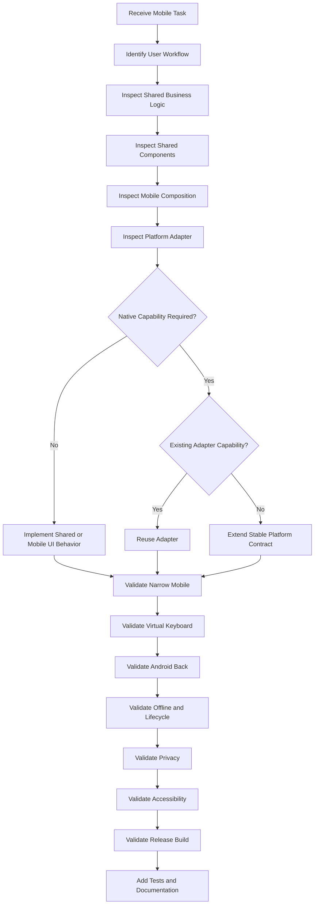

---

# AI Required Mobile Behaviors

AI-generated Mobile code must:

- Reuse shared financial calculations.
- Reuse shared validation.
- Reuse services and repositories.
- Reuse formatting.
- Use official Design System tokens.
- Preserve one-handed usability.
- Support 320px width.
- Support virtual-keyboard behavior.
- Support Android system Back.
- Support offline state.
- Distinguish local and synchronized data.
- Apply privacy before rendering.
- Use native capabilities through adapters.
- Request permissions contextually.
- Handle permission denial.
- Clean native and Web listeners.
- Preserve lifecycle state.
- Protect pending operations.
- Avoid duplicate submission.
- Test production configuration.
- Update documentation.

---

# AI Forbidden Mobile Behaviors

AI tools must not:

- Add business calculations to `mobile.js`.
- Add business calculations to `mobile-capacitor.js`.
- Access Supabase directly from native UI coordination.
- Add a service-role key to the application.
- Add broad permissions without review.
- Request permissions during startup without context.
- Depend directly on multiple native plugins from features.
- Break Android Back.
- Dismiss unsaved forms during backgrounding.
- Render sensitive values before privacy resolution.
- Claim synchronization before remote confirmation.
- Store tokens in logs.
- Include secrets in `capacitor.config.ts`.
- Edit generated build files as canonical source.
- Commit signing passwords.
- Add WebView debugging to production.
- Allow untrusted pages native-bridge access.
- Add notification payloads with unnecessary financial detail.
- Use a generic dialog for account deletion.
- Use swipe or long press as the only action path.
- Ignore permission denial.
- leave temporary imported or exported files indefinitely.
- Restart imports after every orientation or lifecycle event.
- Duplicate notification delivery.
- Render unlimited transaction records.
- Introduce unrelated architectural rewrites.
- Remove accessibility behavior.
- Hide technical debt instead of documenting it.

---

# AI Native Change Requirements

Before changing Android or Capacitor code, the AI must identify:

```text
Canonical source file

Generated target

Affected plugin

Required permission

Lifecycle impact

Back-button impact

Deep-link impact

Privacy impact

Build impact

Required tests
```

A native modification without this analysis is incomplete.

---

# AI Permission Review

For any proposed permission, answer:

```text
Which exact user feature requires it?

Can the feature work without it?

Can a lower-privilege system picker be used?

When will the explanation appear?

What happens after denial?

What data is accessed?

Does access continue in the background?

Which documentation and store declarations change?
```

---

# AI Notification Review

For notification changes, answer:

```text
What creates the notification?

Is it local or remote?

Which preference controls it?

Which channel is used?

What privacy level applies?

How is duplication prevented?

What happens when the record changes?

Where does the notification open?

What happens when the target no longer exists?
```

---

# AI Release Review

AI-generated release changes must verify:

- Version increment
- Production configuration
- Manifest permissions
- Android overrides
- Capacitor synchronization
- Debug behavior disabled
- Signing configuration not exposed
- Release artifact generation
- Upgrade test
- Clean-install test
- Smoke test
- Documentation

---

# Mobile Pull Request Template

```markdown
## Problem

What Mobile problem is being solved?

## User Workflow

What must the user complete?

## Shared Architecture

Which shared services, state, repositories and components are reused?

## Mobile Composition

How does the feature behave at Narrow, Standard and Wide Mobile?

## Native Integration

Which Capacitor or Android capability is involved?

## Lifecycle

What happens during background, resume and process recreation?

## Android Back

How does system Back behave?

## Virtual Keyboard

How are focused fields and actions preserved?

## Permissions

Which permission is required, when is it requested and what is the fallback?

## Privacy and Security

How are financial data, tokens, files, notifications and logs protected?

## Offline and Synchronization

Which actions work offline and how is pending state communicated?

## Accessibility

How are touch, TalkBack, keyboard, text scaling and reduced motion supported?

## Performance

How are memory, scrolling, native-bridge calls and large datasets handled?

## Build and Release

Are Capacitor sync, overrides and release configuration affected?

## Tests

Which unit, integration, device, accessibility and release tests were completed?

## Migration

Which legacy code or generated file behavior was removed or remains?
```

---

# Mobile Code Review Checklist

## Architecture

```text
□ Shared business logic is reused.

□ Mobile files contain presentation behavior only.

□ Native integration uses an adapter.

□ No direct privileged backend access exists.

□ No duplicate state system was introduced.

□ Generated files are not treated as canonical source.
```

## Lifecycle

```text
□ Cold start is safe.

□ Warm resume is efficient.

□ Background preserves drafts.

□ Process recreation is recoverable.

□ Session expiration protects content.

□ Listener registration is centralized.

□ Pending submissions remain idempotent.
```

## Navigation

```text
□ Bottom navigation is stable.

□ Android Back follows the official priority.

□ Deep links are validated.

□ Notification routes are validated.

□ Browser and native history remain consistent.

□ Unsaved changes are protected.
```

## Permissions

```text
□ Only required permissions are declared.

□ Permission request is contextual.

□ Purpose is explained.

□ Denial is handled.

□ Permanent denial is handled.

□ Revocation is handled.

□ Fallback is available where possible.
```

## Security

```text
□ No secrets are embedded.

□ Tokens are not logged.

□ External navigation is controlled.

□ Temporary files are cleaned.

□ Privacy mode applies before rendering.

□ App-switcher behavior is safe.

□ Notification content respects privacy.

□ Account switching isolates local data.
```

## Offline

```text
□ Cached data remains understandable.

□ Local saves are identified.

□ Cloud confirmation is accurate.

□ Queue ownership is safe.

□ Conflicts prevent silent overwrite.

□ Reconnection does not duplicate operations.
```

## Accessibility

```text
□ Touch targets are sufficient.

□ TalkBack labels are complete.

□ Financial values have context.

□ Hidden values remain hidden accessibly.

□ Virtual keyboard is safe.

□ Text scaling works.

□ Reduced motion is supported.

□ Gestures have visible alternatives.
```

## Performance

```text
□ Startup prioritizes useful content.

□ Large lists are scalable.

□ Native bridge calls are controlled.

□ Temporary resources are released.

□ Listeners are cleaned up.

□ Charts are disposed.

□ Background work is justified.

□ Memory growth is tested.
```

## Release

```text
□ Production configuration is correct.

□ Version is updated.

□ Manifest is reviewed.

□ Android overrides are applied.

□ Debug functionality is disabled.

□ Release artifact is verified.

□ Clean-install test passes.

□ Upgrade test passes.

□ Release documentation is updated.
```

---

# Mobile Definition of Done

A Mobile implementation is complete only when:

```text
□ The primary Mobile task is clear.

□ Shared business logic is reused.

□ Narrow Mobile is supported.

□ Standard Mobile is supported.

□ Wide Mobile is supported.

□ Landscape remains usable.

□ One-handed operation is considered.

□ Touch interaction is complete.

□ Virtual-keyboard behavior is safe.

□ Android Back behavior is correct.

□ Cold start is protected.

□ Background and resume are supported.

□ Process recreation is recoverable.

□ Permissions are contextual and minimal.

□ Permission denial is supported.

□ Native integration uses stable adapters.

□ Privacy applies before rendering.

□ Offline state is accurate.

□ Pending operations are idempotent.

□ Conflicts prevent silent data loss.

□ Notifications respect privacy and preferences.

□ Imports and exports clean temporary files.

□ Security review is complete.

□ Accessibility testing is complete.

□ Performance testing is complete.

□ Production build is verified.

□ Clean-install and upgrade tests pass.

□ Documentation is updated.

□ Acceptance criteria are satisfied.
```

---

# Final Mobile Acceptance Criteria

The Nexio Mobile experience is accepted only when:

1. Mobile is treated as a first-class touch platform.

2. Users can understand their immediate financial position quickly.

3. Frequent actions remain reachable with one hand.

4. The interface remains usable from 320px through Expanded Mobile widths.

5. Financial values remain exact, readable and contextualized.

6. Privacy preference is applied before sensitive information renders.

7. Android system Back closes the correct surface or route.

8. Unsaved work survives interruption or receives explicit protection.

9. Cold start, warm start, background, resume and process recreation are handled safely.

10. Authentication expiration immediately protects financial content.

11. Offline-capable operations clearly distinguish local persistence from cloud synchronization.

12. Pending operations use stable identifiers and avoid duplicate submission.

13. Synchronization conflicts never silently overwrite newer financial data.

14. Native capabilities are accessed through a stable platform adapter.

15. Permissions are minimal, contextual and safely denied.

16. Notification content respects user preference, lock-screen privacy and event relevance.

17. Notification taps validate authentication, authorization and target availability.

18. Imported files are validated, reviewed and cleaned after use.

19. Exported files accurately describe their scope and remain under user control.

20. Temporary native files do not remain indefinitely.

21. No private server secret or signing credential is included in the application.

22. Untrusted external pages cannot access privileged native capabilities.

23. Account switching isolates cached data and pending operations.

24. Capacitor and Android overrides are documented and reproducible.

25. Generated Android build artifacts are not treated as source code.

26. Production builds contain no debug menu, verbose sensitive logs or test data.

27. Release candidates pass clean-install, upgrade and critical-flow tests.

28. Store information, privacy documentation and actual application behavior remain consistent.

29. Backend and local-storage migrations remain compatible with published Mobile versions.

30. Touch, TalkBack, external keyboard, text scaling and reduced motion are supported.

31. Large lists, reports, imports and native events remain performant on representative mid-range devices.

32. AI-generated Mobile code follows the same architecture, security, accessibility and release rules as human-generated code.

33. Legacy Mobile and native code is migrated incrementally without duplicating business behavior.

---

# Mobile Constitutional Rule

Every Mobile and Android decision must answer:

```text
Does this help the user understand or act on their finances quickly, safely and reliably on a small, interruption-prone device?
```

When the answer is unclear, prefer the implementation that:

- Protects financial data.
- Preserves the current workflow.
- Reduces unnecessary steps.
- Keeps actions reachable.
- Uses the least native privilege.
- Preserves standard Android behavior.
- Works offline where safe.
- Distinguishes local and synchronized state.
- Reuses shared business logic.
- Uses native adapters.
- Remains accessible.
- Performs reliably on mid-range hardware.
- Produces a reproducible release.
- Avoids hidden technical debt.

Mobile is the immediate, private and resilient expression of Nexio.

Android and Capacitor exist to support that experience.

They do not define a separate financial product.

---

# Final Authority

This document is the official Mobile and Android experience specification for Nexio.

All future Mobile:

- Layouts
- Navigation
- Forms
- Touch interactions
- Gestures
- Bottom sheets
- Full-screen workflows
- Offline behavior
- Android lifecycle behavior
- Permissions
- Notifications
- Native integrations
- Imports and exports
- Security controls
- Build processes
- Release procedures
- Testing strategies

must comply with this specification.

Exceptions require a documented engineering, security or design decision.

Undocumented exceptions are considered technical, security or design debt.

---