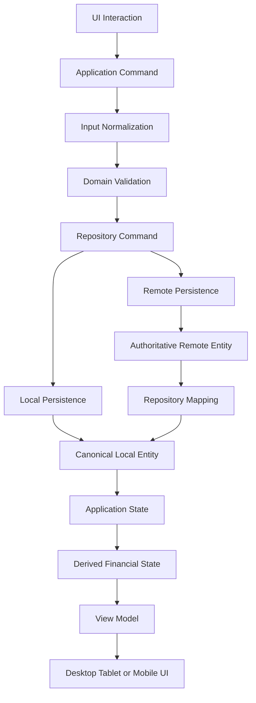
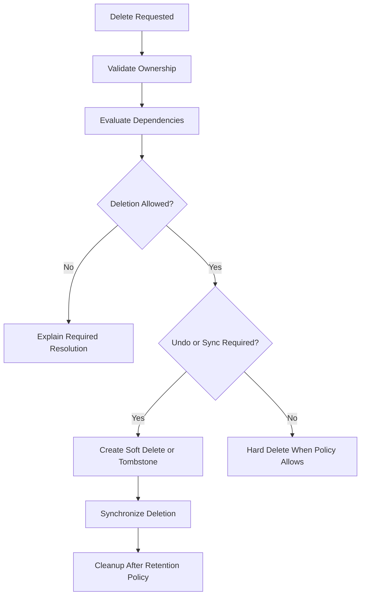
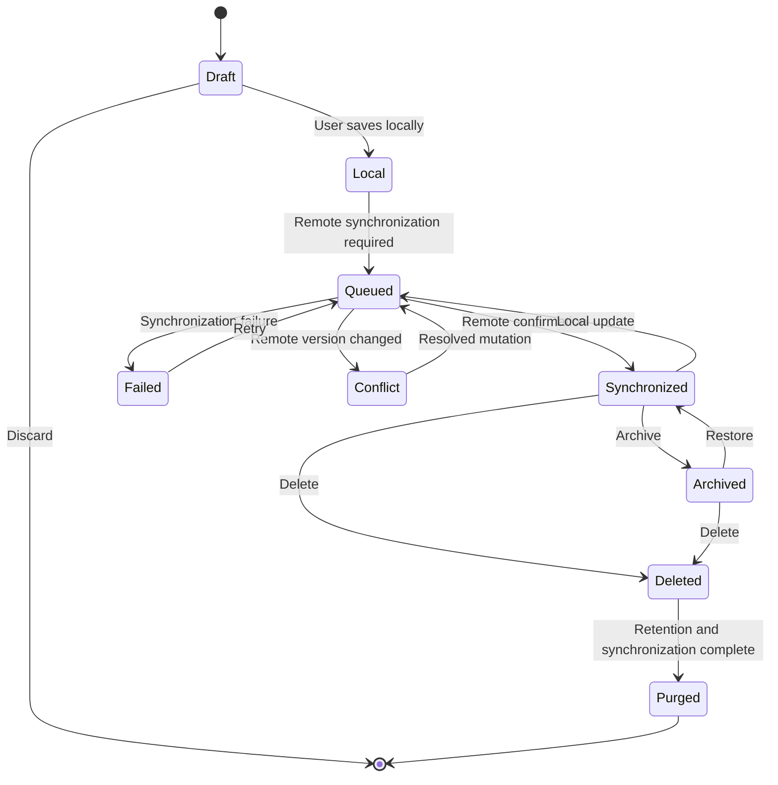
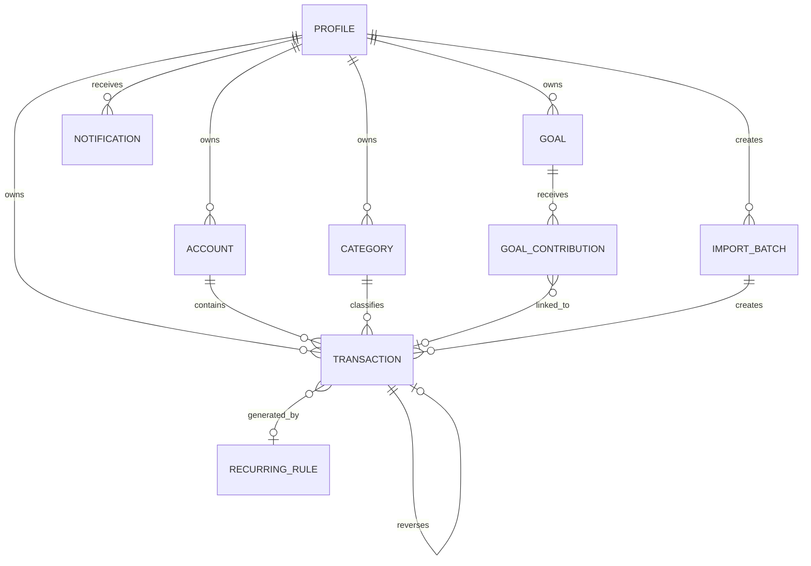
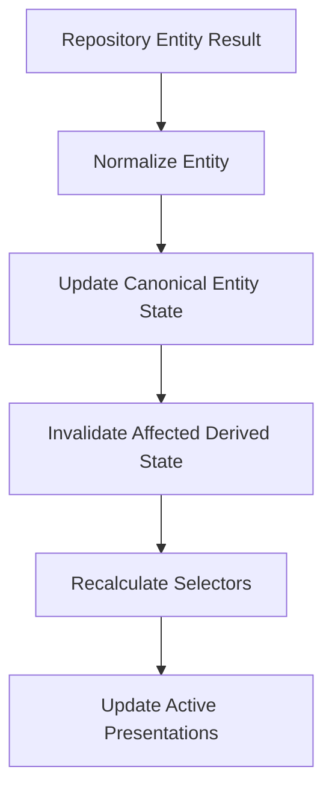
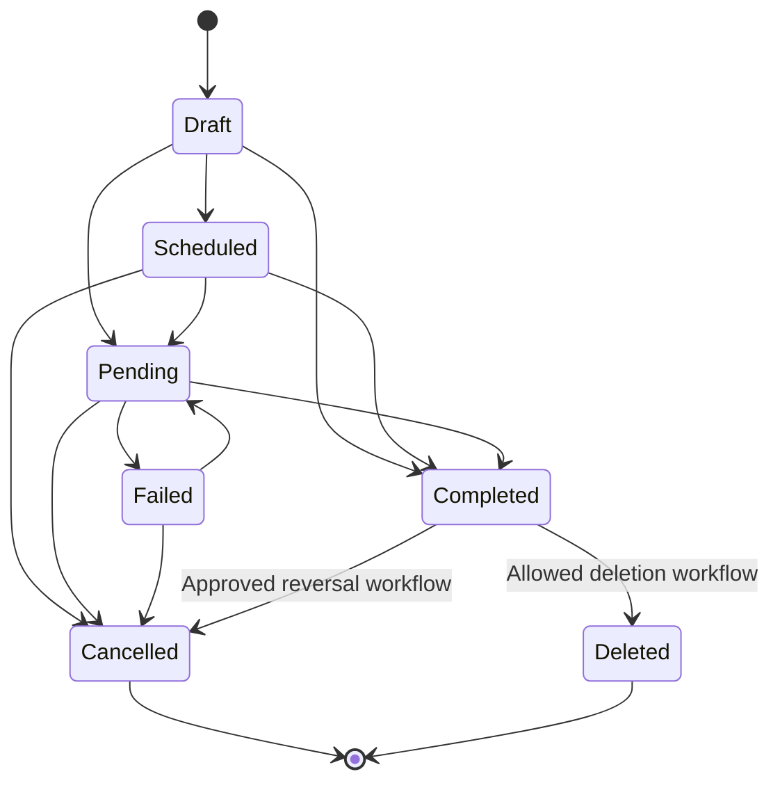

# Nexio Data Model and State Specification

Version: 1.0  
Status: Official  
Authority Level: Data and Domain Standard  
Applies To: Web, Desktop, Tablet, Mobile, Android, Supabase and Offline Storage

---

# Purpose

This document defines the official data model and state architecture of Nexio.

It establishes:

- Canonical financial data types
- Entity ownership
- Monetary-value representation
- Date and time rules
- Identifiers
- Persistence boundaries
- Application-state categories
- Derived financial state
- Repository contracts
- Local-storage responsibilities
- Cloud-storage responsibilities
- Offline operation representation
- Validation boundaries
- Concurrency requirements
- Deletion and archival behavior
- Privacy classification
- Migration requirements
- Data testing standards

The objective is to ensure that every Nexio platform interprets financial data in exactly the same way.

Desktop, Tablet, Mobile, reports, notifications and the Assistant may present information differently.

They must not create different meanings for the same stored data.

---

# Relationship with Other Documents

This document must be interpreted together with:

```text
docs/00-FOUNDATION.md
docs/01-ARCHITECTURE.md
docs/02-DESIGN-SYSTEM.md
docs/03-DESKTOP.md
docs/04-TABLET.md
docs/05-MOBILE.md
docs/07-SECURITY.md
docs/08-OFFLINE-AND-SYNC.md
docs/09-TESTING.md
```

Responsibilities are divided as follows:

| Document | Responsibility |
|---|---|
| `00-FOUNDATION.md` | Product principles and constitutional rules |
| `01-ARCHITECTURE.md` | Technical layers and dependency direction |
| `02-DESIGN-SYSTEM.md` | Visual and interaction standards |
| `03-DESKTOP.md` | Desktop composition |
| `04-TABLET.md` | Tablet composition |
| `05-MOBILE.md` | Mobile and Android composition |
| `06-DATA-MODEL.md` | Canonical entities, data types and state |
| `07-SECURITY.md` | Authentication, authorization and protection |
| `08-OFFLINE-AND-SYNC.md` | Synchronization and conflict resolution |
| `09-TESTING.md` | Quality and verification strategy |

This document defines data meaning.

Presentation documents define how that meaning is shown.

---

# Current Implementation Anchors

The existing project contains data-related implementation points such as:

```text
supabase-schema.sql
supabase-config.js

js/core/storage.js
js/core/finance.js
js/core/transactions.js
js/core/categories.js
js/core/goals.js
js/core/notifications.js
js/core/profiles.js
js/core/reports.js
js/core/utils.js
```

These files currently represent parts of:

- Persistence
- Domain behavior
- Financial calculations
- Entity management
- Formatting
- Reporting
- State access

The target architecture must clarify their ownership and prevent overlapping responsibilities.

---

# Data Architecture Overview

The intended flow is:

```text
User Interaction

↓

Application Command

↓

Domain Validation

↓

Repository

↓

Local or Remote Persistence

↓

Canonical Entity

↓

Application State

↓

Derived Financial State

↓

UI Presentation
```

Presentation layers must never bypass this flow for convenience.

---

# Data Constitutional Principles

## One Meaning per Field

A field must have one documented meaning.

Example:

```text
amount
```

must not mean:

- Positive magnitude in one feature
- Signed value in another feature
- Formatted string in a third feature
- Amount in cents in one table
- Amount in reais in another table

The unit, sign and purpose must be explicit.

---

## One Canonical Representation

Every important data concept requires one canonical internal representation.

Examples:

```text
Money
Date-only value
Timestamp
Currency
Percentage
Entity identifier
Transaction type
Synchronization status
```

Formatting for display is not the canonical representation.

---

## Data Before Presentation

Business meaning must exist independently of the interface.

Forbidden:

```text
Red text means expense, therefore the application knows it is an expense.
```

Required:

```text
transaction.type === "expense"

↓

UI chooses the semantic expense presentation.
```

---

## Derived Values Are Not Independent Truths

Values such as:

- Account balance
- Monthly income
- Monthly expenses
- Net result
- Category totals
- Goal progress
- Report percentages

should be calculated from canonical source data or from explicitly managed aggregates.

They must not become unrelated manually editable values.

---

## Persistence Is Not the Domain Model

Database rows are persistence representations.

UI objects are presentation representations.

The domain model sits between them.

```text
Database Row

↓

Repository Mapping

↓

Domain Entity

↓

View Model

↓

UI
```

Database column names must not leak throughout the interface.

---

## User Ownership Is Mandatory

Every private financial record must belong to an authenticated owner.

Ownership must be:

- Explicit
- Validated
- Enforced remotely
- Preserved locally
- Included in synchronization
- Rechecked after authentication changes

A UI filter is not an authorization mechanism.

---

## Exact Financial Arithmetic

Financial arithmetic must not rely on binary floating-point behavior.

Forbidden:

```javascript
0.1 + 0.2
```

as the basis of financial calculations.

Required:

- Integer minor units
- An approved decimal library
- Exact database decimal operations
- Explicit rounding rules

---

## Offline State Must Remain Honest

A locally stored mutation is not automatically a cloud-confirmed mutation.

The application must distinguish:

```text
Saved locally

Queued

Synchronizing

Synchronized

Failed

Conflict
```

---

## Historical Meaning Must Be Preserved

Editing configuration must not silently reinterpret historical data.

Examples:

- Changing default currency must not convert old transactions automatically.
- Renaming a category may change its label but not its historical identity.
- Archiving an account must not remove it from old reports.
- Changing a financial-month preference must not rewrite transaction dates.

---

# Sources of Truth

Nexio may contain several data copies.

They do not have equal authority.

Recommended hierarchy:

```text
Committed Authoritative Data

↓

Canonical Local Replica

↓

Pending Local Operations

↓

Derived Application State

↓

Presentation State
```

---

# Committed Authoritative Data

Committed authoritative data is the accepted persisted version of an entity.

For cloud-enabled user data, this will normally be the record accepted by the authorized backend.

Examples:

- Confirmed transaction
- Confirmed account
- Confirmed category
- Confirmed goal
- Confirmed profile setting

Authoritative does not mean immutable.

It means this version has been accepted by the responsible persistence system.

---

# Canonical Local Replica

The local replica contains data available on the current device.

It may include:

- Cached cloud records
- Locally created records
- Local metadata
- Last known server version
- Synchronization markers

The local replica supports:

- Faster startup
- Offline review
- Offline mutation
- Resilient navigation
- Process recovery

It must preserve entity ownership.

---

# Pending Local Operations

A pending operation represents an intended change that has not yet received authoritative confirmation.

Examples:

```text
Create transaction

Update category

Archive account

Delete goal

Add goal contribution
```

Pending operations must have stable identities.

They must not be represented only by temporary visual state.

---

# Derived Application State

Derived state is calculated from canonical entities and active context.

Examples:

```text
Current-month expenses

Selected-account balance

Filtered transactions

Goal progress

Notification unread count

Report category percentages
```

Derived state must be reproducible.

It should not be persisted as independent truth unless an approved aggregate strategy exists.

---

# Presentation State

Presentation state includes:

- Open dialog
- Selected tab
- Scroll position
- Active row
- Expanded section
- Current hover
- Temporary animation
- Bottom-sheet position

Presentation state must not determine financial meaning.

---

# Canonical Data Flow



---

# Model Categories

Nexio uses three primary model categories:

```text
Persistence Model

Domain Model

Presentation Model
```

---

# Persistence Model

The persistence model represents database or local-storage structure.

Examples:

```text
Database columns

Foreign keys

Indexes

Storage keys

Synchronization metadata

Serialized operation records
```

Persistence models may contain technical fields that should not be presented directly.

---

# Domain Model

The domain model represents product meaning.

Examples:

```text
Transaction

Account

Category

Money

Goal

Profile

Notification
```

Domain models should be independent of:

- HTML
- CSS
- Database-client response objects
- Supabase-specific metadata
- Platform-specific APIs

---

# Presentation Model

A presentation model prepares data for one interface composition.

Examples:

```text
TransactionListItemViewModel

DashboardSummaryViewModel

GoalProgressViewModel

AccountCardViewModel
```

Presentation models may contain:

- Formatted strings
- Display labels
- Accessibility labels
- Visibility decisions
- Platform-specific grouping

They must not recalculate business truth independently.

---

# Data Mapping Boundary

Repositories or dedicated mappers convert between models.

Example:

```javascript
const transaction = transactionMapper.fromPersistence(row);
const row = transactionMapper.toPersistence(transaction);
```

Mapping must be:

- Deterministic
- Tested
- Centralized
- Version-aware
- Explicit about optional fields

---

# Naming Conventions

Canonical naming should use clear English terms in source code and schema.

Recommended:

```text
accountId
categoryId
transactionDate
createdAt
updatedAt
currencyCode
amountMinor
```

Avoid ambiguous abbreviations:

```text
acc
cat
dt
vlr
usr
```

Database naming may use `snake_case`.

JavaScript domain models may use `camelCase`.

The repository performs the conversion.

Example:

```text
Database:
account_id

Domain:
accountId
```

---

# Identifier Standard

Every persistent entity requires a stable identifier.

Recommended standard:

```text
UUID
```

Identifiers should be generated before remote persistence when offline creation is supported.

This allows:

- Offline references
- Idempotent submission
- Stable UI keys
- Conflict detection
- Cross-device synchronization
- Relationship creation before upload

---

# Identifier Rules

Identifiers must:

- Remain stable for the entity's lifetime.
- Never be reused for another entity.
- Not encode sensitive information.
- Not depend on list position.
- Not depend on display name.
- Not change after synchronization.
- Be validated before repository use.

---

# Local and Remote Identifiers

Avoid separate local and server identifiers when the architecture can use one client-generated UUID.

Preferred:

```text
Local ID:
550e8400-e29b-41d4-a716-446655440000

Remote ID:
The same identifier
```

If a legacy system requires different identifiers, the mapping must be explicit.

---

# Idempotency Identifier

Mutation operations should have their own stable operation identifier.

Example:

```text
entityId:
Transaction being created

operationId:
Create-operation submission
```

Repeated submission of the same operation must not create duplicate financial records.

---

# User Ownership

Private entities should include or inherit an owner identifier.

Conceptual field:

```text
ownerId
```

Persistence equivalent may be:

```text
user_id
```

Ownership is distinct from:

- Creator
- Last editor
- Device
- Workspace
- Account entity

---

# Ownership Rules

Every repository operation must execute within an ownership scope.

Conceptual example:

```javascript
transactionRepository.list({
  ownerId: authenticatedUser.id,
});
```

The backend must enforce ownership independently.

Passing `ownerId` from the UI is not sufficient protection.

---

# Child Entity Ownership

Child entities may inherit ownership through a parent relationship.

However, explicit ownership may still be stored when it improves:

- Authorization
- Synchronization
- Query performance
- Data isolation
- Auditability

Ownership duplication must remain consistent and validated.

---

# Account Switching

When the active user changes:

1. Stop current synchronization.
2. Clear in-memory private state.
3. Close private subscriptions.
4. Change repository ownership scope.
5. Load the new user's local replica.
6. Load the new user's preferences.
7. Resume authorized synchronization.

Data from different users must never share the same unscoped local keys.

---

# Canonical Money Type

All monetary values must use a canonical Money structure.

Conceptual contract:

```javascript
/**
 * @typedef {Object} Money
 * @property {string} currency
 * @property {number} minorUnits
 */
```

Example:

```javascript
const amount = {
  currency: "BRL",
  minorUnits: 125050,
};
```

Represents:

```text
R$ 1.250,50
```

---

# Money Requirements

`minorUnits` must:

- Be an integer.
- Be within the supported safe range.
- Never contain a decimal fraction.
- Use the currency's defined minor-unit scale.
- Not include formatting separators.

`currency` must:

- Use the supported canonical currency code.
- Be stored with the value.
- Not be inferred only from user preference.
- Remain stable for historical records.

---

# Database Money Representation

Preferred persistence structure:

```text
amount_minor BIGINT

currency_code TEXT
```

Alternative legacy representation:

```text
amount NUMERIC
currency_code TEXT
```

When a database uses `NUMERIC`, the repository must preserve exact decimal behavior.

A database decimal must not be converted blindly into a JavaScript floating-point value.

---

# Money Arithmetic

All arithmetic must use approved Money utilities.

Conceptual API:

```javascript
money.add(a, b)
money.subtract(a, b)
money.compare(a, b)
money.multiplyRatio(amount, ratio, roundingMode)
money.allocate(amount, parts)
money.format(amount, locale)
```

Direct arithmetic on formatted strings is forbidden.

---

# Currency Compatibility

Adding or comparing amounts requires compatible currencies.

Forbidden:

```text
BRL 100 + USD 50
```

without an approved conversion model.

Required behavior:

```text
Currencies differ

↓

Use explicit conversion rate and date

or

Keep values separated
```

---

# Currency Conversion

When introduced, conversion requires:

- Source currency
- Target currency
- Exchange rate
- Rate date and time
- Rate source
- Rounding rule
- Original amount
- Converted amount

Converted values must not replace the original historical value silently.

---

# Transaction Amount Rule

A transaction should store a non-negative monetary magnitude.

Example:

```javascript
{
  type: "expense",
  amount: {
    currency: "BRL",
    minorUnits: 18540,
  },
}
```

The expense meaning comes from `type`.

The stored magnitude is not:

```text
−18540
```

---

# Why Magnitude and Type Are Separate

Using both a signed amount and a type creates contradictory states.

Invalid example:

```javascript
{
  type: "expense",
  amountMinor: -18540,
}
```

The application must then decide whether the value is:

- Negative twice
- Correctly negative
- Invalid
- A refund

Separate magnitude and type prevent this ambiguity.

---

# Transaction Direction

Recommended transaction types:

```text
income

expense

transfer
```

Additional types require a documented domain decision.

Examples that may require separate modeling:

- Refund
- Adjustment
- Opening balance
- Credit-card payment
- Goal allocation
- Reconciliation adjustment

Do not add types only to solve a visual requirement.

---

# Transfer Amount

A transfer uses one positive Money value.

Direction comes from:

```text
sourceAccountId

destinationAccountId
```

A transfer must not be represented as unrelated expense and income records unless the data model explicitly links them as one transfer.

---

# Refunds and Reversals

A refund must preserve its relationship with the original transaction when possible.

Possible model:

```text
Original expense

↓

Refund transaction

↓

originalTransactionId
```

Do not silently edit the original expense amount when a separate refund event occurred.

---

# Opening Balance

Opening balance requires explicit classification.

It must not be indistinguishable from ordinary income.

Conceptual field:

```text
origin: "opening_balance"
```

Reports may treat opening balances differently from earned income.

---

# Percentage Type

Percentages should use a documented canonical scale.

Recommended conceptual representation:

```javascript
{
  basisPoints: 1250,
}
```

Represents:

```text
12.50%
```

Alternatively, an approved decimal type may be used.

Do not mix:

```text
12.5
0.125
1250
"12.5%"
```

without explicit conversion.

---

# Ratio Calculation

Percentage calculations must define:

- Numerator
- Denominator
- Zero-denominator behavior
- Precision
- Rounding mode
- Display precision

Example:

```text
Current expenses:
R$ 500

Previous expenses:
R$ 0
```

The application must not display an arbitrary infinite percentage increase.

---

# Rounding Rules

Every financial calculation requiring rounding must define a mode.

Potential modes:

```text
Half up

Half even

Floor

Ceiling

Toward zero
```

The selected rule must reflect the financial operation.

Rounding must occur at an intentional boundary.

---

# Allocation Rounding

When distributing an amount among several parts:

```text
R$ 100,00 among 3 categories
```

the total allocated amount must remain exactly:

```text
R$ 100,00
```

The allocation utility must distribute the remainder deterministically.

---

# Date and Time Types

Nexio distinguishes:

```text
Date-only value

Local date and time

Absolute timestamp

Time zone

Period
```

These concepts must not be stored interchangeably.

---

# Date-Only Value

A financial transaction date is often a date without an exact instant.

Canonical representation:

```text
YYYY-MM-DD
```

Example:

```text
2026-07-23
```

A date-only value must not be converted through UTC in a way that changes the calendar date.

---

# Date-Only JavaScript Rule

Avoid:

```javascript
new Date("2026-07-23");
```

when the value represents a local financial date.

Depending on parsing and time zone, this may produce unintended date shifts.

Use a date-only utility or explicit parser.

---

# Absolute Timestamp

Audit and synchronization events should use absolute timestamps.

Examples:

```text
createdAt

updatedAt

deletedAt

synchronizedAt

lastLoginAt
```

Canonical transport format:

```text
ISO 8601 UTC
```

Example:

```text
2026-07-23T14:30:00.000Z
```

---

# User Time Zone

The user's time zone affects:

- Display
- Reminders
- Recurrence
- Day boundaries
- Report periods
- Due-date interpretation

The time zone should use an IANA identifier when supported.

Example:

```text
America/Sao_Paulo
```

Avoid storing only a fixed UTC offset because offsets may change historically.

---

# Transaction Date Versus Creation Time

A transaction should distinguish:

```text
transactionDate:
The financial date selected by the user

createdAt:
When the record was created

updatedAt:
When the record was last modified
```

These values must not substitute for one another.

---

# Period Type

Reports and filters should use an explicit period model.

Conceptual example:

```javascript
const period = {
  startDate: "2026-07-01",
  endDate: "2026-07-31",
};
```

Define whether the end date is:

- Inclusive
- Exclusive

Recommended date-only reporting behavior:

```text
Start date inclusive

End date inclusive
```

Repository queries may convert it to an exclusive next-day boundary internally.

---

# Recurrence Time

Recurring rules must define:

- Frequency
- Interval
- Start date
- Optional end date
- Time zone
- Day-of-month behavior
- Missing-day behavior
- Edit scope
- Next occurrence

Example question:

```text
What happens to a transaction scheduled for the 31st in February?
```

The rule must be explicit.

---

# Locale and Storage

Locale affects presentation.

It must not alter canonical storage.

Canonical:

```text
2026-07-23
125050 minor units
BRL
```

Brazilian display:

```text
23/07/2026
R$ 1.250,50
```

Another locale may display the same data differently.

---

# Boolean Fields

Boolean fields must represent genuine two-state concepts.

Good:

```text
isArchived

isRead

isActive
```

Avoid booleans for multi-state workflows.

Bad:

```text
isSync
```

when the actual states are:

```text
local

queued

synchronizing

synchronized

failed

conflict
```

Use an enum instead.

---

# Enumerations

Enums must have documented allowed values.

Example:

```javascript
const TransactionType = {
  INCOME: "income",
  EXPENSE: "expense",
  TRANSFER: "transfer",
};
```

Unknown values must be handled safely.

Do not silently map an unknown value to the first option.

---

# Enum Migration

When renaming an enum value:

1. Add compatibility handling.
2. Migrate stored data.
3. Migrate queued operations.
4. Update validation.
5. Update reports.
6. Update tests.
7. Remove the old value after compatibility is no longer needed.

---

# Null and Missing Values

The architecture must distinguish:

```text
Missing

Unknown

Not applicable

Intentionally empty

Not loaded

Removed
```

These states must not all become:

```javascript
null
```

without documented meaning.

---

# Optional Text Fields

For optional user-entered text, define whether empty input becomes:

```text
null
```

or:

```text
""
```

Recommended canonical behavior:

```text
No meaningful value:
null

Meaningful text:
trimmed string
```

Presentation may display an empty field.

---

# Not Loaded Versus Empty

Example:

```text
transactions: []
```

may mean:

- Loaded and empty
- Not loaded yet

Application state should distinguish them.

Conceptual state:

```javascript
{
  status: "loaded",
  data: [],
}
```

---

# Entity Metadata

Persistent entities should normally include:

```text
id

ownerId

createdAt

updatedAt
```

Depending on requirements:

```text
deletedAt

version

createdBy

updatedBy

source

schemaVersion
```

---

# Entity Version

A version field may support optimistic concurrency.

Example:

```text
version: 7
```

Update command:

```text
Update entity where:

id matches

and

version equals 7
```

Successful update produces:

```text
version: 8
```

This helps detect stale edits.

---

# Updated Timestamp

`updatedAt` may support stale-data detection.

It must not be the only conflict strategy when two updates can share timestamp precision or when clocks are untrusted.

Server-generated timestamps are preferred for committed remote records.

---

# Creation Source

Entities may record a controlled creation source.

Examples:

```text
manual

import

recurring_rule

assistant_review

system_migration

opening_balance
```

Source is metadata.

It must not override the entity's business type.

---

# Audit Metadata

Audit metadata should answer:

- When was the entity created?
- When was it modified?
- What process created it?
- What version is current?
- Was it deleted or archived?

Audit metadata should not expose private implementation details to ordinary users.

---

# Archival and Deletion

Archival and deletion are separate concepts.

---

# Archive

Archive means:

- Entity remains stored.
- Historical relationships remain valid.
- Entity is removed from routine active selection.
- Entity may be restored where supported.
- Reports preserve historical use.

Common archive candidates:

- Account
- Category
- Goal
- Recurring rule

---

# Soft Delete

Soft delete marks an entity as deleted while preserving synchronization and recovery metadata.

Conceptual field:

```text
deletedAt
```

Soft deletion may be required for:

- Cross-device synchronization
- Conflict resolution
- Undo
- Audit
- Relationship cleanup

---

# Hard Delete

Hard delete permanently removes data.

It should occur only when:

- Retention rules permit it.
- Dependencies are resolved.
- Synchronization is complete.
- Recovery period expired where applicable.
- User ownership is verified.
- Legal and product requirements permit it.

---

# Tombstones

A synchronization tombstone represents a deleted entity so other devices can learn about the deletion.

A tombstone may contain:

```text
entityId

entityType

ownerId

deletedAt

version
```

It should not retain unnecessary financial content.

---

# Deletion Flow



---

# Entity Lifecycle

A persistent entity may move through:

```text
Draft

Local

Queued

Synchronized

Updated

Archived

Deleted

Purged
```

Not every entity uses every state.

The lifecycle must be documented per entity.

---

# Entity Lifecycle State Machine



---

# Conceptual Entity Catalog

The target domain may include:

```text
Profile

Account

Category

Transaction

Transfer

Recurring Rule

Goal

Goal Contribution

Notification

Import Batch

Import Row

Attachment

User Preference

Synchronization Operation
```

Only supported product entities should be implemented.

This catalog does not authorize creating unused tables.

---

# Profile

Represents user-level product information and preferences not owned exclusively by authentication.

Potential responsibilities:

- Display name
- Locale
- Time zone
- Default currency
- Financial-month preference
- Privacy preference
- Theme preference
- Onboarding state

Sensitive authentication credentials do not belong in Profile.

---

# Account

Represents a financial container or liability.

Potential types:

```text
checking

savings

cash

credit

investment

wallet

debt

other
```

Account balances should normally be derived from:

- Opening balance
- Transactions
- Transfers
- Approved adjustments

---

# Category

Represents transaction classification.

A category may define:

- Name
- Type compatibility
- Parent
- Icon
- Approved color
- Archive state

Category identity must survive renaming.

---

# Transaction

Represents a financial event.

Core conceptual fields may include:

```text
id

ownerId

type

amount

transactionDate

description

accountId

categoryId

status

notes

createdAt

updatedAt
```

Transfer-specific fields must be modeled explicitly.

---

# Recurring Rule

Represents instructions for creating or expecting repeated financial events.

The rule is distinct from generated transactions.

Editing a rule must not silently rewrite completed historical occurrences.

---

# Goal

Represents a financial objective.

Potential fields:

- Name
- Target amount
- Current model
- Target date
- Status
- Linked account
- Archive state

The financial effect of contributions must be explicitly defined.

---

# Notification

Represents an in-app notification or notification event.

It is distinct from an Android-delivery record.

The notification entity may contain:

- Type
- User-facing message reference
- Target
- Read state
- Created time
- Priority
- Deduplication key

---

# Import Batch

Represents one reviewed import operation.

Potential responsibilities:

- Source
- File metadata
- Mapping version
- Record counts
- Confirmation state
- Commit result
- Undo relationship

Raw file content should not remain indefinitely without purpose.

---

# Synchronization Operation

Represents a local mutation waiting for authoritative confirmation.

Potential fields:

```text
operationId

ownerId

entityType

entityId

action

payload

baseVersion

status

attemptCount

createdAt

lastAttemptAt
```

Detailed synchronization behavior belongs in `08-OFFLINE-AND-SYNC.md`.

---

# Conceptual Entity Relationships



This diagram is conceptual.

The exact persistence schema must follow approved domain requirements.

---

# Application State Categories

Application state should be divided into:

```text
Session State

Entity State

Query State

Derived State

Draft State

Synchronization State

Presentation State

Platform State
```

---

# Session State

Examples:

- Authentication status
- Active user
- Session expiration
- Lock state
- Active ownership scope

Session state controls access to private entity state.

---

# Entity State

Contains normalized canonical entities.

Conceptual structure:

```javascript
{
  transactionsById: {},
  accountsById: {},
  categoriesById: {},
  goalsById: {},
}
```

Normalized state reduces duplication.

---

# Query State

Represents a requested collection or view.

Example:

```javascript
{
  transactionQuery: {
    status: "loaded",
    ids: ["id-1", "id-2"],
    filters: {},
    sorting: {},
    cursor: null,
  },
}
```

Query state references canonical entities by identifier.

---

# Derived State

Derived state is calculated through selectors or domain services.

Example:

```javascript
selectAccountBalance(state, accountId)
selectMonthlyExpenses(state, period)
selectGoalProgress(state, goalId)
```

Derived selectors must remain pure where practical.

---

# Draft State

Draft state contains unsaved user input.

A draft must remain separate from the saved entity until submission succeeds or an optimistic strategy explicitly applies.

Example:

```javascript
{
  entityId: "transaction-id",
  values: {},
  baseVersion: 4,
  dirtyFields: [],
  validation: {},
}
```

---

# Synchronization State

Represents:

- Pending operations
- Current synchronization
- Last success
- Last failure
- Conflicts
- Retry state
- Device-local status

It must not be represented only by a spinner.

---

# Presentation State

Examples:

- Open detail
- Current tab
- Active bottom sheet
- Selected rows
- Scroll restoration key

Presentation state may be platform-specific.

It must not be stored inside domain entities.

---

# Platform State

Examples:

- Online or offline
- Mobile app active
- Virtual keyboard visible
- Current layout class
- Native capability availability
- Android permission state

Platform state informs presentation and available actions.

It does not change financial meaning.

---

# Normalized Entity State

Avoid storing repeated copies of the same entity in several feature states.

Bad:

```text
Dashboard transaction copy

Transactions-screen copy

Account-detail transaction copy

Report transaction copy
```

Preferred:

```text
Canonical transaction entity

+

Different query identifier lists

+

Different presentation models
```

---

# State Update Flow



A transaction update should automatically affect:

- Transaction list
- Account balance
- Dashboard summary
- Category totals
- Reports
- Goals when linked

---

# Derived-State Dependency

Example:

```text
Transaction change

↓

Account balance changes

↓

Monthly expense total changes

↓

Dashboard result changes

↓

Category report changes

↓

Budget or goal state may change
```

The application should express these dependencies through shared selectors or domain services.

UI modules must not manually update every affected number.

---

# Repository Boundary

Repositories own persistence access.

Conceptual contracts:

```javascript
transactionRepository.getById(id)
transactionRepository.list(query)
transactionRepository.create(entity, context)
transactionRepository.update(entity, context)
transactionRepository.delete(id, context)
```

Repositories may coordinate local and remote adapters.

---

# Repository Responsibilities

A repository may:

- Validate ownership context
- Map persistence rows
- Read local data
- Read remote data
- Write local data
- Write remote data
- Return canonical domain entities
- Handle persistence errors
- Participate in synchronization
- Apply schema compatibility

---

# Repository Non-Responsibilities

A repository should not:

- Format currency for UI
- Render components
- Control dialogs
- Choose Desktop or Mobile layout
- Show toast messages
- Calculate unrelated report presentation
- Read DOM values
- Use CSS classes
- Depend on UI modules

---

# Storage Adapter

Storage implementation should use a stable contract.

Conceptual example:

```javascript
storage.get(namespace, key)
storage.set(namespace, key, value)
storage.remove(namespace, key)
storage.transaction(callback)
storage.clearOwner(ownerId)
```

Feature modules should not depend directly on browser-storage details.

---

# Storage Categories

Nexio may use:

```text
Memory

Session storage

Local preferences

Structured local database

Secure platform storage

Remote database

Temporary files
```

Each category has a distinct purpose.

---

# Memory Storage

Appropriate for:

- Active presentation state
- Temporary calculation
- In-flight requests
- Short-lived caches
- Open UI context

Memory must not be assumed to survive process termination.

---

# Session Storage

Appropriate for:

- Safe navigation recovery
- Short workflow context
- Temporary non-sensitive draft references
- Browser-tab-specific state

Session storage is not appropriate for authoritative financial data.

---

# Local Preferences

Appropriate for:

- Theme
- Privacy mode
- Last safe destination
- Non-sensitive display preferences
- Onboarding markers

Preferences must be namespaced by user when user-specific.

---

# Structured Local Database

Appropriate for:

- Canonical local entities
- Offline records
- Pending operations
- Draft recovery
- Query metadata
- Synchronization checkpoints

Large financial datasets must not be stored as one unstructured JSON value.

---

# Secure Platform Storage

Appropriate for approved sensitive platform values such as authentication material when required by the selected authentication architecture.

It must not become the primary financial database.

---

# Remote Database

Responsible for:

- Authoritative committed entities
- Cross-device availability
- Authorization enforcement
- Durable relationships
- Server timestamps
- Central schema
- Controlled migrations

---

# Temporary File Storage

Appropriate for:

- Import processing
- Export generation
- Attachment preview
- Native sharing

Temporary files require cleanup and ownership controls.

---

# Serialization Rules

Serialized data must preserve:

- Exact values
- Entity type
- Schema version
- Dates
- Currency
- Ownership
- Operation identity

Do not serialize formatted financial strings as canonical values.

---

# Schema Version

Local serialized structures should contain a schema version where migration may be required.

Example:

```javascript
{
  schemaVersion: 3,
  data: {},
}
```

The schema version must not be confused with entity concurrency version.

---

# Validation Boundaries

Validation should occur at several layers.

```text
Input validation

Domain validation

Repository validation

Database validation

Authorization validation
```

Each layer protects a different boundary.

---

# Input Validation

Checks whether user input is structurally usable.

Examples:

- Required field
- Valid date text
- Valid money input
- Description length
- Selected account

---

# Domain Validation

Checks product rules.

Examples:

- Transfer accounts differ
- Amount is allowed
- Account is active
- Category is compatible
- Goal contribution is valid
- Recurrence rule is coherent

---

# Repository Validation

Checks persistence context.

Examples:

- Entity has identifier
- Ownership context exists
- Expected version exists
- Required relationship identifiers exist
- Payload is serializable

---

# Database Validation

Uses:

- Non-null constraints
- Foreign keys
- Check constraints
- Unique constraints
- Data types
- Row-level authorization

Client validation does not replace database constraints.

---

# Validation Result

Validation should return structured results.

Conceptual example:

```javascript
{
  valid: false,
  errors: [
    {
      code: "TRANSFER_SAME_ACCOUNT",
      field: "destinationAccountId",
    },
  ],
}
```

User-facing text should be produced by the localization layer.

---

# Error Taxonomy

Data operations should classify errors.

Recommended categories:

```text
validation

authentication

authorization

not_found

conflict

network

offline

storage

constraint

rate_limit

unknown
```

Do not expose raw backend errors directly to users.

---

# Recoverability

Errors should indicate whether they are:

```text
Retryable

Requires user correction

Requires authentication

Conflict requiring review

Permanent for current action

Unknown
```

This supports accurate interface behavior.

---

# Data Privacy Classification

Data should be classified by sensitivity.

Recommended levels:

```text
Public

Internal

Private

Sensitive

Restricted
```

---

# Public Data

Examples:

- Public product content
- Public legal pages
- Non-user-specific documentation

---

# Internal Data

Examples:

- Feature flags
- Non-sensitive application metadata
- Safe diagnostics

---

# Private Data

Examples:

- User preferences
- Category names
- Goal names
- Account names

---

# Sensitive Data

Examples:

- Transaction values
- Balances
- Financial notes
- Imported statement content
- Account identifiers
- Report details

---

# Restricted Data

Examples:

- Authentication tokens
- Security recovery material
- Signing credentials
- Administrative secrets

Restricted data requires the strongest handling and should rarely enter client-visible storage.

---

# Logging by Classification

```text
Public:
May be logged when useful.

Internal:
May be logged in controlled form.

Private:
Avoid content; use identifiers only when necessary.

Sensitive:
Do not log raw content.

Restricted:
Never log.
```

---

# Data-Minimization Rule

Store only data required for:

- Product function
- User expectation
- Security
- Synchronization
- Legal requirement
- Explicitly approved analytics

Do not collect information merely because storage is available.

---

# Data Foundational Anti-Patterns

The following are prohibited:

## Floating-Point Money

Using JavaScript decimal arithmetic for financial totals.

## Formatted Storage

Storing `R$ 1.250,00` as the canonical amount.

## Ambiguous Sign

Combining negative amounts with transaction types inconsistently.

## Time-Zone Date Shift

Converting date-only financial values through UTC carelessly.

## UI as Source of Truth

Calculating a financial value from rendered text or CSS state.

## Unscoped User Data

Using local or remote queries without owner isolation.

## Duplicate Entity Copies

Maintaining conflicting copies of one transaction in several features.

## Manual Derived Updates

Updating Dashboard, Account and Report totals separately after a transaction change.

## Database Row Leakage

Allowing Supabase-specific row structures throughout UI code.

## Independent Platform Models

Creating different Mobile and Desktop transaction entities.

## Silent Historical Rewrite

Changing old financial meaning after preference edits.

## Hard Delete Without Dependency Review

Removing records before relationships and synchronization are resolved.

## Boolean Multi-State

Using one boolean for complex synchronization or lifecycle state.

## Missing Conflict Version

Overwriting a remote change without version or equivalent stale-write protection.

## Local Equals Synchronized

Treating a local save as remote confirmation.

## Identifier from Display Text

Using account name or transaction description as a key.

## Sensitive Logging

Logging exact financial data, tokens or imported records.

## Unversioned Local Schema

Changing stored data shape without a migration mechanism.

---

# Data Foundation Review Questions

Before implementing or changing a data concept, answer:

```text
What is the canonical domain representation?

What is the persistence representation?

What is the unit?

What determines the sign?

Which currency applies?

Is the date a date-only value or timestamp?

Who owns the entity?

How is ownership enforced?

Can the entity be created offline?

When is its identifier created?

How is duplicate submission prevented?

Is the value canonical or derived?

How are stale updates detected?

How is deletion synchronized?

Does historical meaning remain stable?

What privacy classification applies?

Which migrations are required?
```

---

# Data Foundation Acceptance Criteria

The data foundation is accepted only when:

```text
□ Every core concept has one canonical representation.

□ Financial values use exact arithmetic.

□ Money includes currency and minor units.

□ Transaction type and magnitude are not contradictory.

□ Transfers use explicit source and destination accounts.

□ Date-only values remain distinct from timestamps.

□ User time zone is handled explicitly.

□ Entity identifiers are stable.

□ Offline-created entities can use stable identifiers.

□ Mutation operations support idempotency.

□ Private entities have ownership scope.

□ Backend authorization does not depend on UI filtering.

□ Persistence rows map through repositories.

□ UI modules consume domain or presentation models.

□ Derived values remain reproducible.

□ Canonical entities are normalized in state.

□ Draft state remains separate from committed entities.

□ Local and synchronized states remain distinguishable.

□ Concurrency or stale-write protection exists.

□ Archive and delete remain separate concepts.

□ Deletion supports synchronization where required.

□ Local storage uses explicit ownership namespaces.

□ Local schema changes support versioned migration.

□ Validation exists at input, domain, repository and database boundaries.

□ Errors use a structured taxonomy.

□ Sensitive data is excluded from routine logging.

□ Desktop, Tablet and Mobile use the same domain entities.
```

---

# Data Constitutional Rule

Every data decision must answer:

```text
Can this value be interpreted exactly and consistently on every platform, after synchronization, migration and historical review?
```

When the answer is unclear, prefer the implementation that:

- Preserves exact financial meaning.
- Uses explicit types.
- Preserves ownership.
- Supports offline identity.
- Avoids duplicate truth.
- Separates canonical and derived values.
- Preserves historical records.
- Detects stale writes.
- Uses deterministic mapping.
- Minimizes sensitive data.
- Remains testable.
- Supports safe migration.

Data is the long-term memory of Nexio.

Presentation may change.

Financial meaning must remain stable.

---
---

# Canonical Entity Contracts

This section defines the official domain contracts for Nexio entities.

The contracts describe:

- Entity identity
- Ownership
- Required fields
- Optional fields
- Allowed states
- Relationships
- Validation rules
- Derived values
- Archival behavior
- Deletion behavior
- Synchronization considerations
- Privacy classification

These contracts are platform-independent.

Desktop, Tablet and Mobile must consume the same entity meaning.

---

# Entity Contract Conventions

All canonical entities should follow these conventions where applicable:

```javascript
{
  id: "uuid",
  ownerId: "uuid",
  createdAt: "ISO-8601 timestamp",
  updatedAt: "ISO-8601 timestamp",
  version: 1
}
```

Optional lifecycle fields may include:

```javascript
{
  archivedAt: null,
  deletedAt: null,
  source: "manual",
  schemaVersion: 1
}
```

Not every entity requires every metadata field.

The field must exist only when it serves a defined responsibility.

---

# Canonical Metadata Fields

## `id`

Stable entity identifier.

Requirements:

- Generated before remote persistence when offline creation is supported.
- Never changes after synchronization.
- Never reused.
- Does not encode sensitive information.
- Used for relationships and stable UI keys.

---

## `ownerId`

Identifies the authenticated owner of the entity.

Requirements:

- Mandatory for private user data.
- Validated by repositories.
- Enforced by the backend.
- Used to isolate local data.
- Never accepted as authorization proof from UI input alone.

---

## `createdAt`

Absolute timestamp identifying when the entity was first created.

Requirements:

- Prefer server-generated timestamp after remote confirmation.
- Local creation may temporarily use device time.
- Remote confirmation may reconcile the authoritative value.
- Must not be used as the transaction's financial date.

---

## `updatedAt`

Absolute timestamp of the latest accepted modification.

Requirements:

- Prefer authoritative server time for synchronized data.
- Used for diagnostics and stale-data detection.
- Must not be the only concurrency mechanism when stronger versioning exists.

---

## `version`

Monotonic entity concurrency version.

Requirements:

- Starts from a documented value.
- Increases after every accepted mutation.
- Used for optimistic concurrency.
- Included in update and delete operations.
- Never decreases.

---

## `archivedAt`

Absolute timestamp indicating that an entity was archived.

Archive means:

- Entity remains historically valid.
- Entity stops appearing in routine active selections.
- Entity may be restored when supported.

---

## `deletedAt`

Absolute timestamp indicating soft deletion.

Soft-deleted records:

- Are excluded from ordinary queries.
- May remain available for synchronization.
- May later be purged.
- Must not participate in active calculations unless a historical rule explicitly requires them.

---

## `source`

Controlled metadata describing how an entity originated.

Allowed conceptual values may include:

```text
manual

import

recurring_rule

assistant_review

migration

opening_balance

system
```

Source must not determine authorization or override business type.

---

# Entity Contract Pattern

A canonical domain contract may be expressed conceptually as:

```javascript
/**
 * @typedef {Object} BaseEntity
 * @property {string} id
 * @property {string} ownerId
 * @property {string} createdAt
 * @property {string} updatedAt
 * @property {number} version
 * @property {string|null} archivedAt
 * @property {string|null} deletedAt
 */
```

Entity-specific contracts extend this conceptual base.

---

# Profile Entity

The Profile entity stores user-level product information that does not belong to the authentication provider.

Profile is not the authentication account itself.

It must not store:

- Passwords
- Authentication tokens
- Recovery secrets
- Biometric data
- Administrative roles not required by the client
- Private server credentials

---

# Profile Responsibilities

Profile may define:

- Display name
- Preferred locale
- Time zone
- Default currency
- Financial-month preference
- Theme preference
- Privacy preference
- Onboarding state
- Accessibility preferences
- Default account
- Notification preference reference
- User-created date

---

# Profile Contract

Conceptual structure:

```javascript
/**
 * @typedef {Object} Profile
 * @property {string} id
 * @property {string} ownerId
 * @property {string|null} displayName
 * @property {string} locale
 * @property {string} timeZone
 * @property {string} defaultCurrency
 * @property {number} financialMonthStartDay
 * @property {string|null} defaultAccountId
 * @property {"light"|"dark"|"system"} themePreference
 * @property {boolean} hideFinancialValues
 * @property {boolean} onboardingCompleted
 * @property {string} createdAt
 * @property {string} updatedAt
 * @property {number} version
 */
```

---

# Profile Identity

Recommended relationship:

```text
Authentication User

1:1

Profile
```

The profile identifier may match the authentication-user identifier when the architecture benefits from that simplification.

When identifiers differ, the relationship must remain explicit.

---

# Profile Locale

`locale` defines presentation preferences.

Example:

```text
pt-BR
```

Locale affects:

- Currency formatting
- Date formatting
- Number formatting
- Translation
- Pluralization

Locale does not alter canonical stored values.

---

# Profile Time Zone

`timeZone` should use an IANA identifier.

Example:

```text
America/Sao_Paulo
```

It affects:

- Reminder scheduling
- Recurring rules
- Date boundaries
- Timestamp presentation
- Report periods

---

# Default Currency

`defaultCurrency` provides defaults for new entities and unsupported aggregate views.

It must not:

- Rewrite historical transaction currencies.
- Convert existing amounts automatically.
- Remove explicit currency from Money values.
- Determine the currency of an already saved account.

---

# Financial Month Start Day

`financialMonthStartDay` may support financial periods that do not begin on calendar day one.

Example:

```text
1
```

or:

```text
25
```

Rules must define behavior when a month does not contain the configured day.

Recommended behavior:

```text
Use the last valid day of that month.
```

Changing the preference changes future period interpretation.

It must not alter transaction dates.

---

# Profile Privacy Preference

`hideFinancialValues` controls supported visual privacy behavior.

It is not an authorization mechanism.

It must apply consistently to:

- Dashboard
- Transactions
- Accounts
- Goals
- Reports
- Assistant
- Notifications
- Search
- Clipboard
- Native previews

A local cached copy may be used to prevent sensitive startup flashes.

---

# Profile Theme Preference

Allowed values:

```text
light

dark

system
```

The selected value must map to Design System themes.

Arbitrary theme identifiers are not allowed without a formally supported theme extension.

---

# Profile Validation

Requirements:

```text
ownerId is valid

locale is supported

timeZone is supported

defaultCurrency is supported

financialMonthStartDay is within the approved range

defaultAccountId belongs to the same owner when present

themePreference is a supported enum
```

---

# Profile Deletion

Profile deletion normally occurs as part of account deletion.

Deleting only the Profile while leaving financial entities active is invalid unless a documented migration or recovery process exists.

---

# Profile Privacy Classification

| Field | Classification |
|---|---|
| Display name | Private |
| Locale | Private |
| Time zone | Private |
| Default currency | Private |
| Privacy preference | Private |
| Authentication relationship | Sensitive |
| Authentication token | Restricted and not part of Profile |

---

# Account Entity

An Account represents a financial container, asset, liability or tracked financial source.

Examples:

```text
Checking account

Savings account

Cash wallet

Credit card

Investment account

Loan

Digital wallet

Other supported financial container
```

---

# Account Contract

Conceptual structure:

```javascript
/**
 * @typedef {Object} Account
 * @property {string} id
 * @property {string} ownerId
 * @property {string} name
 * @property {AccountType} type
 * @property {string} currency
 * @property {Money|null} openingBalance
 * @property {string} openingBalanceDate
 * @property {string|null} institutionName
 * @property {string|null} maskedIdentifier
 * @property {string|null} icon
 * @property {string|null} colorToken
 * @property {boolean} includeInNetWorth
 * @property {string|null} archivedAt
 * @property {string|null} deletedAt
 * @property {string} createdAt
 * @property {string} updatedAt
 * @property {number} version
 */
```

---

# Account Type

Recommended conceptual values:

```text
checking

savings

cash

credit

investment

wallet

debt

loan

other
```

A type should be added only when it creates meaningful business behavior.

Visual differences alone do not justify a new account type.

---

# Asset and Liability Classification

Account type must map to a financial classification.

Conceptual values:

```text
asset

liability
```

Example mapping:

| Account Type | Classification |
|---|---|
| Checking | Asset |
| Savings | Asset |
| Cash | Asset |
| Investment | Asset |
| Credit | Liability |
| Loan | Liability |
| Debt | Liability |

The mapping belongs to shared domain logic.

---

# Account Currency

Every account has one canonical currency.

Transactions associated with the account should normally use the same currency.

A transaction using another currency requires an explicit conversion or multi-currency model.

The application must not silently attach a BRL transaction to a USD account.

---

# Opening Balance

Opening balance establishes the starting financial value for the account.

Recommended canonical model:

```javascript
{
  openingBalance: {
    currency: "BRL",
    minorUnits: 500000
  },
  openingBalanceDate: "2026-01-01"
}
```

The opening balance must remain distinct from ordinary income or expense.

---

# Opening Balance Alternatives

The architecture must select one official strategy:

```text
Strategy A:
Store opening balance on Account and include it in balance calculations.

Strategy B:
Create a protected opening-balance transaction.
```

The project must not use both strategies simultaneously for the same account.

Recommended target:

```text
Store opening balance on the Account domain entity.

Expose it through a synthetic historical event only when presentation requires it.
```

This prevents opening balances from being mistaken for earned income.

---

# Opening Balance Sign

For asset accounts:

```text
Positive opening balance
→ Money available

Negative opening balance
→ Overdrawn position where supported
```

For liability accounts:

The stored Money remains a non-negative magnitude.

Financial classification determines how it contributes to net worth.

Example:

```text
Credit card amount owed:
R$ 1.450,00

Net-worth contribution:
−R$ 1.450,00
```

---

# Account Balance

Current balance is normally derived.

Conceptual formula for an asset account:

```text
Opening balance

+ Income transactions

− Expense transactions

− Transfers sent

+ Transfers received

+ Approved adjustments
```

For liability accounts, calculation rules must be explicitly documented.

The UI must never maintain its own editable balance copy.

---

# Available Balance

Available balance may differ from current balance.

Possible reasons:

- Pending transactions
- Credit limit
- Reserved amounts
- Reconciliation
- External institution synchronization

`availableBalance` should only exist as stored data if there is an authoritative source.

Otherwise, it must be derived.

---

# Credit Account Fields

A credit account may require additional fields:

```javascript
{
  creditLimit: Money | null,
  closingDay: number | null,
  dueDay: number | null
}
```

These fields must be modeled only when the product supports credit-account behavior.

---

# Credit Limit

Credit limit is not account balance.

Conceptual derived value:

```text
Available credit

=

Credit limit

− Current amount owed
```

The exact treatment of pending transactions must be documented.

---

# Account Identifier

`maskedIdentifier` may contain a protected display value such as:

```text
•••• 1234
```

The full external identifier should not be stored unless required and protected.

Masked values must not be used as entity identifiers.

---

# Account Color

`colorToken` must reference an approved Design System token or constrained palette.

Do not store arbitrary CSS values such as:

```text
#ff2388
```

unless the product formally supports custom colors and sanitizes them.

---

# Account Archive

Archiving an account:

- Preserves all historical transactions.
- Removes it from routine account selectors.
- Preserves report relationships.
- Prevents new transactions unless explicitly restored.
- Preserves transfers involving the account.
- May allow restoration.

---

# Account Delete

An account cannot be hard-deleted while dependent financial records remain unless those records are explicitly migrated or deleted under an approved workflow.

Dependency review includes:

- Transactions
- Transfers
- Goal links
- Recurring rules
- Import mappings
- Notifications
- Synchronization operations

---

# Account Validation

Requirements:

```text
name is non-empty

type is supported

currency is supported

openingBalance currency matches account currency

openingBalanceDate is valid

credit fields exist only for applicable account types

owner owns related entities

archived account cannot receive routine new transactions

masked identifier contains no unsafe raw value
```

---

# Account Privacy Classification

| Data | Classification |
|---|---|
| Account name | Private |
| Account type | Private |
| Balance | Sensitive |
| Institution | Private |
| Masked identifier | Sensitive |
| Full account identifier | Restricted or highly sensitive |
| Currency | Private |
| Credit limit | Sensitive |

---

# Category Entity

A Category classifies income and expense transactions.

A category must have stable identity independent of its displayed name.

Renaming:

```text
Food
```

to:

```text
Food and Dining
```

must not create a new historical category.

---

# Category Contract

Conceptual structure:

```javascript
/**
 * @typedef {Object} Category
 * @property {string} id
 * @property {string} ownerId
 * @property {string} name
 * @property {"income"|"expense"|"both"} transactionCompatibility
 * @property {string|null} parentCategoryId
 * @property {string|null} icon
 * @property {string|null} colorToken
 * @property {number|null} sortOrder
 * @property {boolean} isSystem
 * @property {string|null} archivedAt
 * @property {string|null} deletedAt
 * @property {string} createdAt
 * @property {string} updatedAt
 * @property {number} version
 */
```

---

# Category Compatibility

Recommended values:

```text
income

expense

both
```

`both` should be used sparingly.

A category compatible with both income and expense may create ambiguous reporting.

Examples where `both` might be valid require documented justification.

---

# Category Hierarchy

`parentCategoryId` creates an optional parent-child relationship.

Rules:

- Parent belongs to the same owner.
- Parent cannot be the category itself.
- Cycles are forbidden.
- Maximum supported depth should be documented.
- Parent compatibility must not contradict child compatibility.
- Archived parents require defined child behavior.

---

# Recommended Hierarchy Depth

Recommended target:

```text
Maximum two visible levels:

Category

Subcategory
```

Deeper structures may complicate:

- Mobile navigation
- Reporting
- Search
- Accessibility
- Category assignment

A deeper hierarchy requires explicit product approval.

---

# System Categories

`isSystem` identifies categories supplied by Nexio.

System categories may:

- Have protected identifiers.
- Have localized display labels.
- Be hidden or archived according to rules.
- Prevent destructive modification of required categories.

System categories must not use translated labels as identifiers.

---

# Category Naming

Category names should:

- Be trimmed.
- Respect length limits.
- Not be empty.
- Be unique according to the chosen scope when required.
- Avoid invisible duplicate characters.
- Support localization and Unicode safely.

Case-insensitive duplicate detection may be used.

Example:

```text
Food

food
```

may be treated as conflicting within the same parent and compatibility scope.

---

# Category Color

Color is supplementary.

Reports and transaction lists must not rely only on category color.

`colorToken` should reference an approved palette.

---

# Category Sort Order

`sortOrder` may control user-defined ordering.

It must not determine financial priority.

Reordering should use a stable strategy that avoids rewriting every category when possible.

---

# Category Archive

Archiving a category:

- Preserves historical transaction classification.
- Removes it from routine new selections.
- Preserves report labels.
- Does not set existing transactions to uncategorized.
- May allow restoration.

---

# Category Delete

A category with historical transactions should normally be archived or merged.

Hard deletion requires:

- No dependent transactions
- No dependent recurring rules
- No pending import mappings
- No child categories
- Completed synchronization

---

# Category Merge

Merge moves relationships from one category to another.

Conceptual command:

```javascript
mergeCategory({
  sourceCategoryId,
  destinationCategoryId,
  expectedSourceVersion,
  expectedDestinationVersion
});
```

Merge must:

- Validate compatibility.
- Preserve transaction history.
- Update recurring rules.
- Update import mappings where applicable.
- Preserve audit metadata.
- Archive or delete the source according to policy.
- Be atomic where possible.

---

# Category Validation

Requirements:

```text
name is valid

compatibility is supported

parent belongs to owner

no hierarchy cycle exists

parent and child compatibility are valid

system-category restrictions are respected

archived categories cannot be selected for new routine transactions
```

---

# Transaction Entity

A Transaction represents one financial event.

The canonical entity must support:

```text
Income

Expense

Transfer
```

Special origins such as opening balance, refund or recurring generation should use explicit metadata or relationships.

---

# Transaction Contract

Conceptual discriminated union:

```javascript
/**
 * @typedef {IncomeTransaction|ExpenseTransaction|TransferTransaction}
 * Transaction
 */
```

Shared fields:

```javascript
/**
 * @typedef {Object} TransactionBase
 * @property {string} id
 * @property {string} ownerId
 * @property {"income"|"expense"|"transfer"} type
 * @property {Money} amount
 * @property {string} transactionDate
 * @property {string} description
 * @property {string|null} categoryId
 * @property {string|null} notes
 * @property {TransactionStatus} status
 * @property {string|null} recurringRuleId
 * @property {string|null} originalTransactionId
 * @property {string|null} importBatchId
 * @property {string} source
 * @property {string} createdAt
 * @property {string} updatedAt
 * @property {number} version
 * @property {string|null} deletedAt
 */
```

---

# Income Transaction

Conceptual contract:

```javascript
{
  type: "income",
  accountId: "account-id",
  amount: {
    currency: "BRL",
    minorUnits: 450000
  },
  categoryId: "income-category-id"
}
```

Income increases the balance of an asset account according to account rules.

---

# Expense Transaction

Conceptual contract:

```javascript
{
  type: "expense",
  accountId: "account-id",
  amount: {
    currency: "BRL",
    minorUnits: 18540
  },
  categoryId: "expense-category-id"
}
```

Expense decreases the balance of an asset account according to account rules.

---

# Transfer Transaction

Conceptual contract:

```javascript
{
  type: "transfer",
  sourceAccountId: "source-id",
  destinationAccountId: "destination-id",
  amount: {
    currency: "BRL",
    minorUnits: 50000
  },
  categoryId: null
}
```

A transfer is one canonical transaction entity.

It is not two unrelated transactions.

---

# Transfer Modeling Decision

The target Nexio model defines Transfer as a Transaction variant.

A separate Transfer table or entity should not be introduced unless it stores transfer-specific metadata that cannot safely exist on the Transaction entity.

The canonical transfer identity remains:

```text
One transfer

One transaction identifier

One amount

One source account

One destination account
```

---

# Transaction Account Fields

For income and expense:

```text
accountId is required

sourceAccountId is null or absent

destinationAccountId is null or absent
```

For transfer:

```text
accountId is null or absent

sourceAccountId is required

destinationAccountId is required
```

The model must prevent contradictory combinations.

---

# Transaction Amount

`amount` is always a non-negative Money magnitude.

The transaction type and account relationship determine the financial direction.

Invalid:

```javascript
{
  type: "expense",
  amount: {
    minorUnits: -18540
  }
}
```

---

# Zero Amount

The project must define whether zero-value transactions are supported.

Recommended default:

```text
Zero-value ordinary transactions are invalid.
```

Exceptions such as informational records require a different entity or explicit approved type.

---

# Transaction Description

Description should:

- Be trimmed.
- Respect length limits.
- Preserve user meaning.
- Support Unicode.
- Avoid storing display HTML.
- Not be used as an identifier.

A generated default may be used only when the user can understand it.

---

# Transaction Category

For income and expense:

- Category may be required or optional according to product rules.
- Category compatibility must match transaction type.
- Category must belong to the same owner.
- Archived categories cannot normally be selected for new transactions.

For transfer:

```text
categoryId should normally be null.
```

Transfers should not inflate income or expense category reports.

---

# Transaction Date

`transactionDate` is a date-only value.

It represents the financial date selected or accepted by the user.

It is distinct from:

```text
createdAt

updatedAt

synchronizedAt
```

---

# Transaction Status

Recommended conceptual values:

```text
completed

pending

scheduled

cancelled

failed
```

Synchronization status must remain separate.

Example:

```text
Transaction status:
completed

Synchronization status:
queued
```

Do not combine these into one field.

---

# Completed Transaction

Represents a financial event considered effective in current calculations.

Whether pending records affect balances must be defined per account or feature.

---

# Pending Transaction

May represent:

- Pending external confirmation
- Future settlement
- Credit-card pending purchase
- User-approved pending item

It must not be confused with pending synchronization.

---

# Scheduled Transaction

Represents a planned future occurrence that has not yet become financially effective.

A recurring rule may generate scheduled or expected occurrences according to the product model.

---

# Cancelled Transaction

A cancelled transaction remains historically visible when needed but does not affect current financial calculations.

Cancellation should be preferred over deletion when preserving business history is important.

---

# Transaction Source

Examples:

```text
manual

import

recurring_rule

assistant_review

system_migration
```

Source supports:

- Audit
- Import rollback
- Review
- Reporting diagnostics

It does not determine the transaction's financial direction.

---

# Transaction Notes

Notes are sensitive user content.

Requirements:

- Optional
- Stored as plain text
- Length-limited
- Not rendered as HTML
- Excluded from routine logs
- Excluded from notifications unless explicitly approved
- Protected during exports according to scope

---

# Refund Relationship

A refund may use:

```text
type:
income

originalTransactionId:
original expense
```

Additional metadata may identify:

```text
relationshipType:
refund
```

The original expense remains unchanged unless the user explicitly edits it.

---

# Reversal Relationship

A reversal may use a linked transaction.

Conceptual example:

```javascript
{
  originalTransactionId: "original-id",
  relationshipType: "reversal"
}
```

A reversal should preserve:

- Original record
- Reason
- Date
- Reversing amount
- Audit history

---

# Adjustment Transactions

Adjustments should use an explicit origin or relationship.

They must not be indistinguishable from user income or expense when reports treat them differently.

Possible source:

```text
system_adjustment
```

or controlled relationship metadata.

---

# Transaction Validation

Shared validation includes:

```text
owner exists

type is supported

amount is positive

currency matches involved accounts

transactionDate is valid

description is valid

income or expense has accountId

transfer has source and destination

source and destination differ

category compatibility is valid

related entities belong to owner

deleted or archived restrictions are respected

status transition is valid
```

---

# Transaction State Transitions

Conceptual transitions:



Exact transitions depend on supported features.

---

# Transaction Update Rules

Editing may change:

- Description
- Date
- Category
- Account
- Amount
- Notes
- Status where valid

High-impact edits may require additional protection:

- Changing type
- Changing transfer direction
- Changing currency
- Editing reconciled records
- Editing imported protected records
- Editing generated recurring history

---

# Transaction Delete

Delete must evaluate:

- Linked transfer data
- Refund or reversal relationship
- Recurring series
- Import batch
- Goal contribution
- Reconciliation
- Synchronization status

Soft delete is preferred when cross-device synchronization or undo is required.

---

# Transaction Privacy Classification

| Field | Classification |
|---|---|
| Description | Sensitive |
| Amount | Sensitive |
| Account relationship | Sensitive |
| Category | Private or Sensitive |
| Notes | Sensitive |
| Date | Sensitive |
| Import source | Private |
| Internal version | Internal |

---

# Recurring Rule Entity

A Recurring Rule defines how future financial events are expected or generated.

It is not itself a completed transaction.

---

# Recurring Rule Contract

Conceptual structure:

```javascript
/**
 * @typedef {Object} RecurringRule
 * @property {string} id
 * @property {string} ownerId
 * @property {"income"|"expense"|"transfer"} transactionType
 * @property {Money} amount
 * @property {string} description
 * @property {string|null} accountId
 * @property {string|null} sourceAccountId
 * @property {string|null} destinationAccountId
 * @property {string|null} categoryId
 * @property {RecurrencePattern} recurrence
 * @property {string} startDate
 * @property {string|null} endDate
 * @property {string|null} nextOccurrenceDate
 * @property {"active"|"paused"|"completed"|"cancelled"} status
 * @property {string} timeZone
 * @property {string} createdAt
 * @property {string} updatedAt
 * @property {number} version
 */
```

---

# Recurrence Pattern

Conceptual structure:

```javascript
{
  frequency: "monthly",
  interval: 1,
  dayOfMonth: 10,
  dayOfWeek: null,
  missingDayPolicy: "last_day"
}
```

Potential frequencies:

```text
daily

weekly

monthly

yearly
```

Additional frequencies require a documented model.

---

# Recurrence Interval

`interval` determines repetition.

Examples:

```text
frequency:
weekly

interval:
2

Meaning:
Every two weeks
```

---

# Missing Day Policy

Monthly recurrence may target dates absent from some months.

Example:

```text
Day 31
```

Recommended policies:

```text
last_day

skip_month

next_valid_day
```

The selected policy must be explicit and stable.

---

# Recurring Generation

Generated transactions must reference:

```text
recurringRuleId
```

Generation must use an occurrence identity to prevent duplicates.

Conceptual occurrence key:

```text
recurringRuleId + occurrenceDate
```

A retried generation must not create two transactions for the same occurrence.

---

# Recurring Rule Editing

Editing scope must support:

```text
Only this generated transaction

This and future occurrences

Entire rule
```

Completed historical transactions should normally remain unchanged.

---

# Recurring Rule Pause

Paused rules:

- Do not generate new occurrences.
- Preserve history.
- Preserve future configuration.
- May be resumed.

---

# Recurring Rule Completion

A rule may complete when:

- End date passes
- Maximum occurrences are reached
- User completes it
- Related entity becomes invalid

Completion is distinct from cancellation.

---

# Recurring Rule Deletion

Deleting a rule must not automatically delete completed generated transactions.

Future scheduled occurrences may be cancelled according to policy.

---

# Goal Entity

A Goal represents a planned financial objective.

Examples:

```text
Emergency reserve

Travel

Debt reduction

Education

Property purchase
```

The Goal entity must make its funding model explicit.

---

# Goal Contract

Conceptual structure:

```javascript
/**
 * @typedef {Object} Goal
 * @property {string} id
 * @property {string} ownerId
 * @property {string} name
 * @property {Money} targetAmount
 * @property {string|null} targetDate
 * @property {GoalFundingMode} fundingMode
 * @property {string|null} linkedAccountId
 * @property {"active"|"paused"|"completed"|"archived"} status
 * @property {string|null} notes
 * @property {string|null} completedAt
 * @property {string} createdAt
 * @property {string} updatedAt
 * @property {number} version
 */
```

---

# Goal Funding Mode

Recommended values:

```text
manual_tracking

linked_contributions

linked_account_balance
```

Only supported modes should be implemented.

---

## `manual_tracking`

Goal progress comes from explicit Goal Contribution records.

No account money moves automatically.

---

## `linked_contributions`

Goal progress comes from contributions that may reference financial transactions.

The relationship must be explicit.

---

## `linked_account_balance`

Goal progress derives from an approved linked account balance or allocation model.

This mode requires careful rules because the account may contain unrelated funds.

It should not be introduced without a clear product decision.

---

# Goal Target Amount

`targetAmount` must:

- Use exact Money.
- Have a supported currency.
- Be positive.
- Remain stable unless explicitly edited.
- Match contribution currency unless conversion is supported.

---

# Goal Current Value

Current goal value is derived.

It should not be stored independently unless an authoritative snapshot model is explicitly introduced.

Conceptual selector:

```javascript
selectGoalCurrentAmount(goalId)
```

---

# Goal Contribution Entity

A Goal Contribution represents an explicit progress event.

Conceptual contract:

```javascript
/**
 * @typedef {Object} GoalContribution
 * @property {string} id
 * @property {string} ownerId
 * @property {string} goalId
 * @property {Money} amount
 * @property {string} contributionDate
 * @property {string|null} transactionId
 * @property {string|null} notes
 * @property {string} source
 * @property {string} createdAt
 * @property {string} updatedAt
 * @property {number} version
 */
```

---

# Contribution Financial Effect

The contribution model must state whether the contribution:

```text
Tracks progress only

or

References a real financial transaction
```

A contribution must not silently reduce an account balance.

When a real transfer or expense exists, use:

```text
transactionId
```

to link the contribution to the actual financial event.

---

# Contribution Amount

Contribution amount must:

- Be positive.
- Match goal currency unless conversion exists.
- Not exceed unsupported limits.
- Remain exact.
- Be counted once.

---

# Goal Progress

Conceptual calculation:

```text
Current amount

=

Sum of valid contributions

or

Approved linked-account calculation
```

Progress percentage:

```text
Current amount / Target amount
```

Rules must define behavior when progress exceeds 100%.

Recommended behavior:

- Preserve exact current amount.
- Display progress as completed.
- Allow overfunding where supported.
- Do not silently cap stored value.

---

# Goal Status

Recommended values:

```text
active

paused

completed

archived
```

Derived presentation statuses such as:

```text
on_track

attention_required

behind_schedule
```

should normally be calculated, not stored as independent truth.

---

# Goal Completion

Completion may occur:

- Automatically when the target is reached, if the product defines that behavior.
- Manually through explicit confirmation.
- Through another approved condition.

The chosen rule must be stable.

`completedAt` records the accepted completion instant.

---

# Goal Archive

Archived goals:

- Preserve contribution history.
- Preserve reports.
- Stop appearing in routine active-goal lists.
- May be restored where supported.

---

# Goal Delete

A Goal with contributions should normally be archived.

Hard deletion requires handling:

- Goal contributions
- Linked transactions
- Notifications
- Recurring contribution rules
- Synchronization operations

Linked financial transactions must not be deleted automatically.

---

# Goal Validation

Requirements:

```text
name is valid

target amount is positive

target currency is supported

target date is valid when present

linked account belongs to owner

linked account currency is compatible

funding mode is supported

contributions belong to owner

contribution currency matches goal

status transition is valid
```

---

# Notification Entity

A Notification represents an in-app user notification or notification event.

It is separate from the Android delivery record.

One notification may have:

- In-app representation
- Native delivery
- Email delivery
- No external delivery

according to user preferences.

---

# Notification Contract

Conceptual structure:

```javascript
/**
 * @typedef {Object} Notification
 * @property {string} id
 * @property {string} ownerId
 * @property {NotificationType} type
 * @property {string} titleKey
 * @property {Object} messageParameters
 * @property {NotificationTarget|null} target
 * @property {"low"|"normal"|"high"|"critical"} priority
 * @property {string} deduplicationKey
 * @property {boolean} isRead
 * @property {string|null} readAt
 * @property {string|null} expiresAt
 * @property {string} createdAt
 * @property {number} version
 */
```

---

# Notification Message Storage

Prefer structured localization data:

```javascript
{
  titleKey: "notification.payment_due.title",
  messageParameters: {
    dueDate: "2026-07-28"
  }
}
```

Avoid storing sensitive fully rendered content when not required.

This allows:

- Localization
- Privacy adaptation
- Consistent rendering
- Reduced sensitive payloads

---

# Notification Type

Potential values:

```text
payment_due

payment_overdue

budget_threshold

goal_milestone

synchronization_action

import_completed

security_event

product_information
```

Only supported types should exist.

---

# Notification Target

Conceptual structure:

```javascript
{
  entityType: "transaction",
  entityId: "transaction-id",
  route: "/transactions/transaction-id"
}
```

The target must be validated before navigation.

A stored route does not bypass authorization.

---

# Notification Deduplication Key

The deduplication key prevents repeated notifications for the same event.

Example:

```text
payment-due:transaction-id:2026-07-28
```

It must not expose sensitive content unnecessarily.

---

# Notification Read State

Rules:

```text
isRead false
→ readAt must be null

isRead true
→ readAt should contain an accepted timestamp
```

Opening a notification may mark it as read according to product behavior.

---

# Notification Expiration

Notifications may expire when:

- The event is no longer relevant.
- A due date passes.
- A record is deleted.
- A security state is resolved.
- A retention limit is reached.

Expired notifications should not remain in the active unread count.

---

# Notification Delivery Record

Native delivery state should use a separate technical model.

Conceptual fields:

```text
notificationId

channel

scheduledFor

deliveredAt

cancelledAt

platformIdentifier

status
```

Delivery failure must not alter the core financial entity.

---

# Notification Privacy

Sensitive values should not be stored in delivery payloads unless required and permitted.

Privacy level may be resolved at delivery time.

---

# Import Batch Entity

An Import Batch represents one user-reviewed import process.

It provides traceability and safe rollback.

---

# Import Batch Contract

Conceptual structure:

```javascript
/**
 * @typedef {Object} ImportBatch
 * @property {string} id
 * @property {string} ownerId
 * @property {string} sourceType
 * @property {string|null} originalFileName
 * @property {string|null} fileFingerprint
 * @property {number} mappingVersion
 * @property {ImportBatchStatus} status
 * @property {number} totalRows
 * @property {number} readyRows
 * @property {number} warningRows
 * @property {number} errorRows
 * @property {number} excludedRows
 * @property {number} importedRows
 * @property {string|null} confirmedAt
 * @property {string|null} completedAt
 * @property {string} createdAt
 * @property {string} updatedAt
 * @property {number} version
 */
```

---

# Import Batch Status

Recommended values:

```text
selected

mapping

review

confirmed

processing

completed

partially_completed

failed

cancelled

rolled_back
```

The status must reflect actual progress.

---

# File Fingerprint

A fingerprint may help detect repeated import of the same file.

It must not be treated as definitive duplicate detection because:

- The same file may be intentionally reimported.
- Equivalent data may exist in different files.
- File metadata may change.

The fingerprint must not contain the full raw file.

---

# Original Filename

Filename is user-visible metadata.

It may contain private information.

Requirements:

- Sanitize before display.
- Do not use as the storage path.
- Do not use as a trusted type indicator.
- Avoid including it in logs.
- Remove it according to retention rules when no longer needed.

---

# Import Row Entity

An Import Row represents one parsed candidate record during review.

It may be temporary or persisted for recoverable import workflows.

Conceptual structure:

```javascript
/**
 * @typedef {Object} ImportRow
 * @property {string} id
 * @property {string} ownerId
 * @property {string} importBatchId
 * @property {number} sourceRowNumber
 * @property {Object} rawValues
 * @property {Object|null} normalizedValues
 * @property {"ready"|"warning"|"error"|"duplicate"|"excluded"|"imported"} status
 * @property {Array<ImportIssue>} issues
 * @property {string|null} createdTransactionId
 */
```

---

# Raw Import Values

Raw values are sensitive.

They should:

- Be stored only when required.
- Have a retention limit.
- Not enter routine logs.
- Be removed after completion when no longer needed.
- Remain isolated by owner.
- Not be rendered as HTML.

---

# Normalized Import Values

Normalized values may include:

```javascript
{
  type: "expense",
  amount: {
    currency: "BRL",
    minorUnits: 18540
  },
  transactionDate: "2026-07-21",
  description: "Supermarket",
  accountId: "account-id",
  categoryId: "category-id"
}
```

They must pass the same domain validation as manually entered transactions.

---

# Import Issue

Conceptual structure:

```javascript
{
  code: "AMBIGUOUS_DATE",
  field: "transactionDate",
  severity: "warning",
  sourceValue: "07/08/2026"
}
```

User-facing text belongs to localization.

---

# Import Duplicate Candidate

Duplicate review may reference:

```text
Import row

Existing transaction

Matching criteria

Confidence

User decision
```

The duplicate decision must remain explicit.

---

# Import Commit

Commit creates canonical Transaction entities through the normal transaction repository or application service.

Import must not insert database rows through an independent unvalidated path.

---

# Import Rollback

Rollback uses:

```text
importBatchId
```

to identify created transactions.

Rollback must verify:

- Transaction still belongs to the batch.
- Transaction was not materially changed afterward.
- Deletion is allowed.
- Related records are handled.
- Synchronization is complete or queueable.

---

# Attachment Entity

Attachments may support:

- Receipt images
- Documents
- Transaction evidence
- Import references

Attachments require a separate storage and security policy.

---

# Attachment Contract

Conceptual structure:

```javascript
/**
 * @typedef {Object} Attachment
 * @property {string} id
 * @property {string} ownerId
 * @property {string} entityType
 * @property {string} entityId
 * @property {string} fileName
 * @property {string} mimeType
 * @property {number} sizeBytes
 * @property {string} storageKey
 * @property {string|null} checksum
 * @property {"local"|"queued"|"uploaded"|"failed"} uploadStatus
 * @property {string} createdAt
 * @property {string|null} deletedAt
 */
```

---

# Attachment Rules

Attachments must:

- Belong to the same owner as the parent.
- Use controlled MIME types.
- Respect size limits.
- Avoid trusting filename extensions.
- Use protected storage.
- Avoid public permanent URLs.
- Be cleaned after failed uploads.
- Support offline status where implemented.

---

# User Preference Entity

Some preferences may remain inside Profile.

A separate preference entity may be justified when:

- Preferences are numerous.
- They require independent synchronization.
- They have per-device and per-user scopes.
- They have distinct privacy or migration needs.

---

# Preference Scope

Every preference must declare:

```text
Global user preference

Device-specific preference

Session preference

Feature preference
```

Example:

```text
Theme:
Global user preference or local fallback

Sidebar collapsed:
Device-specific

Active search query:
Session preference
```

---

# Relationship Integrity

All relationships must preserve:

- Same owner
- Existing target
- Valid entity type
- Valid lifecycle state
- Currency compatibility
- Domain compatibility

A foreign-key relationship alone may not validate every business rule.

---

# Owner Consistency Rule

Invalid:

```text
Transaction owner:
User A

Account owner:
User B
```

Every relationship between private entities must remain within the same authorized ownership scope unless multi-user workspaces are formally introduced.

---

# Currency Relationship Rules

Examples:

```text
Transaction currency
=
Account currency
```

```text
Goal contribution currency
=
Goal target currency
```

```text
Transfer source currency
=
Transfer destination currency
```

unless an explicit conversion model is active.

---

# Archive Relationship Rules

Archived entities remain valid for historical relationships.

Examples:

```text
Historical transaction
→ May reference archived category.

New transaction
→ Cannot normally select archived category.
```

```text
Historical transfer
→ May reference archived account.

New transfer
→ Cannot use archived account.
```

---

# Delete Relationship Rules

Soft-deleted entities must not become selectable.

Existing historical references may:

- Remain through soft-deleted record access
- Use a preserved snapshot label
- Use tombstone metadata

The chosen strategy must prevent broken reports.

---

# Historical Label Preservation

Renaming an Account or Category changes the current entity label.

Reports may display the current label.

If historical label snapshots are required, they must be modeled explicitly.

Do not copy names into every transaction without a documented reason.

---

# Snapshot Fields

A relationship may store a snapshot only when historical interpretation requires it.

Examples:

- External merchant description
- Imported original description
- Exchange rate at transaction time
- Tax rate at transaction time

Snapshot duplication must remain intentional.

---

# Entity Aggregate Boundaries

Important consistency boundaries include:

```text
Transaction aggregate

Account aggregate

Goal aggregate

Import aggregate

Recurring-rule aggregate
```

---

# Transaction Aggregate

A Transaction aggregate may include:

- Transaction
- Transfer account relationship
- Refund or reversal relationship
- Attachments
- Goal-contribution link
- Synchronization metadata

A change affecting the aggregate should be validated together.

---

# Account Aggregate

An Account aggregate may include:

- Account
- Opening balance
- Account-specific configuration
- Credit configuration
- Synchronization metadata

Transactions remain separate entities referencing the Account.

---

# Goal Aggregate

A Goal aggregate may include:

- Goal
- Goal contributions
- Goal status
- Goal planning metadata

Linked financial transactions remain canonical Transaction entities.

---

# Import Aggregate

An Import Batch aggregate may include:

- Batch
- Mapping
- Rows
- Issues
- Confirmation
- Commit result
- Rollback metadata

---

# Recurring Aggregate

A Recurring Rule aggregate may include:

- Rule
- Occurrence identities
- Generation state
- Future scheduling metadata

Generated transactions remain canonical Transaction entities.

---

# Atomicity Requirements

Operations that must normally be atomic include:

- Creating a transfer
- Merging a category
- Committing an import batch
- Linking a contribution to a transaction
- Updating an entity and concurrency version
- Soft deleting an entity and creating its tombstone
- Completing a recurring occurrence and recording its identity

Partial success must be detectable and recoverable.

---

# Cross-Entity Derived Calculations

Derived values include:

```text
Account balance

Net worth

Monthly income

Monthly expenses

Monthly result

Category total

Goal progress

Unread notification count

Import completion summary
```

They must use shared selectors or services.

---

# Account Balance Selector

Conceptual input:

```text
Account

Transactions for account

Transfers involving account

Calculation period when applicable
```

Conceptual output:

```javascript
{
  currentBalance: Money,
  pendingBalance: Money | null,
  availableBalance: Money | null
}
```

---

# Net Worth Selector

Conceptual calculation:

```text
Included asset balances

− Included liability balances
```

Requirements:

- Exclude archived accounts only according to product rules.
- Respect account `includeInNetWorth`.
- Keep different currencies separate unless conversion is supported.
- Explain unavailable totals.

---

# Period Summary Selector

Conceptual output:

```javascript
{
  income: Money,
  expenses: Money,
  netResult: Money,
  transactionCount: number
}
```

Transfers must not count as income or expense.

Opening balances must not count as period income unless explicitly configured.

---

# Category Summary Selector

Category totals should include:

- Valid income or expense transactions
- Selected period
- Selected account scope
- Active filter context

They should exclude:

- Transfers
- Deleted records
- Cancelled records
- Opening balance
- Unsupported adjustments according to rules

---

# Goal Progress Selector

Conceptual output:

```javascript
{
  currentAmount: Money,
  targetAmount: Money,
  remainingAmount: Money,
  progressBasisPoints: number,
  completionState: string
}
```

---

# Entity Validation Order

Recommended validation sequence:

```text
1. Structural validation

2. Canonical normalization

3. Ownership validation

4. Relationship validation

5. Currency validation

6. Domain invariant validation

7. Lifecycle validation

8. Concurrency validation

9. Persistence constraints
```

---

# Entity Mutation Command

A mutation should use explicit command input.

Example:

```javascript
updateTransaction({
  ownerId,
  transactionId,
  expectedVersion,
  changes,
  operationId
});
```

The command should not accept an unrestricted full object from the UI without validation.

---

# Create Command

Create commands should:

- Generate entity identifier.
- Generate operation identifier.
- Normalize values.
- Validate relationships.
- Set controlled defaults.
- Set source.
- Persist local state when supported.
- Queue or execute remote persistence.
- Return accurate synchronization status.

---

# Update Command

Update commands should:

- Load current entity.
- Validate ownership.
- Validate expected version.
- Apply allowed fields only.
- Revalidate the complete entity.
- Increment version after acceptance.
- Update affected derived state.
- Queue synchronization when needed.

---

# Delete Command

Delete commands should:

- Load current entity.
- Validate ownership.
- Validate dependencies.
- Validate expected version.
- Select archive, soft delete or hard delete.
- Create tombstone when required.
- Update derived state.
- Queue synchronization.

---

# Entity Conflict

A conflict occurs when:

```text
Local expected version

does not match

Authoritative current version
```

Conflict output should include:

- Entity identifier
- Base version
- Current version
- Local intended changes
- Remote current entity
- Fields changed remotely when calculable
- Safe resolution options

Detailed conflict behavior belongs in `08-OFFLINE-AND-SYNC.md`.

---

# Entity Serialization Examples

## Account

```json
{
  "id": "60cf52e7-0cff-42a2-a379-ceb8f3df3505",
  "ownerId": "c8a56db0-760d-4af0-a8c4-433ea21544cf",
  "name": "Main Account",
  "type": "checking",
  "currency": "BRL",
  "openingBalance": {
    "currency": "BRL",
    "minorUnits": 500000
  },
  "openingBalanceDate": "2026-01-01",
  "institutionName": "Example Bank",
  "maskedIdentifier": "•••• 1234",
  "includeInNetWorth": true,
  "archivedAt": null,
  "deletedAt": null,
  "createdAt": "2026-01-01T12:00:00.000Z",
  "updatedAt": "2026-01-01T12:00:00.000Z",
  "version": 1
}
```

---

## Expense Transaction

```json
{
  "id": "9c60cb72-739d-4f4a-a440-e168a199d7ea",
  "ownerId": "c8a56db0-760d-4af0-a8c4-433ea21544cf",
  "type": "expense",
  "accountId": "60cf52e7-0cff-42a2-a379-ceb8f3df3505",
  "sourceAccountId": null,
  "destinationAccountId": null,
  "amount": {
    "currency": "BRL",
    "minorUnits": 18540
  },
  "transactionDate": "2026-07-21",
  "description": "Supermarket",
  "categoryId": "5bfa73fb-0538-4f85-a13d-29ca26de54b3",
  "status": "completed",
  "notes": null,
  "recurringRuleId": null,
  "originalTransactionId": null,
  "importBatchId": null,
  "source": "manual",
  "createdAt": "2026-07-21T18:25:00.000Z",
  "updatedAt": "2026-07-21T18:25:00.000Z",
  "version": 1,
  "deletedAt": null
}
```

---

## Transfer Transaction

```json
{
  "id": "ddfa018d-ad1c-4149-87fd-a8d6301e1a08",
  "ownerId": "c8a56db0-760d-4af0-a8c4-433ea21544cf",
  "type": "transfer",
  "accountId": null,
  "sourceAccountId": "60cf52e7-0cff-42a2-a379-ceb8f3df3505",
  "destinationAccountId": "13db875a-5a9b-4655-a63e-bfbec2162cc3",
  "amount": {
    "currency": "BRL",
    "minorUnits": 50000
  },
  "transactionDate": "2026-07-22",
  "description": "Transfer to savings",
  "categoryId": null,
  "status": "completed",
  "notes": null,
  "source": "manual",
  "createdAt": "2026-07-22T13:30:00.000Z",
  "updatedAt": "2026-07-22T13:30:00.000Z",
  "version": 1,
  "deletedAt": null
}
```

---

# Entity Invariant Checklist

## Profile

```text
□ One valid profile exists for the authenticated owner.

□ Locale is supported.

□ Time zone is valid.

□ Default currency is supported.

□ Default account belongs to the owner.

□ Privacy preference does not replace authorization.
```

## Account

```text
□ Account has one currency.

□ Opening balance uses the same currency.

□ Account type maps to an asset or liability rule.

□ Archived accounts remain historically valid.

□ Account balance is derived.

□ Delete protects dependent records.
```

## Category

```text
□ Category compatibility is valid.

□ Parent belongs to the owner.

□ Hierarchy contains no cycle.

□ Archived category remains historically visible.

□ Merge preserves relationships.
```

## Transaction

```text
□ Amount is a positive magnitude.

□ Type determines direction.

□ Income and expense have accountId.

□ Transfer has source and destination.

□ Transfer accounts differ.

□ Currency matches accounts.

□ Category compatibility is valid.

□ Date is a date-only value.

□ Synchronization state remains separate.
```

## Recurring Rule

```text
□ Recurrence pattern is valid.

□ Occurrence identity prevents duplicates.

□ Editing does not rewrite completed history silently.

□ Paused rules generate no new occurrences.

□ Generated transactions reference the rule.
```

## Goal

```text
□ Target amount is positive.

□ Funding mode is explicit.

□ Current amount is derived.

□ Contributions are counted once.

□ Linked transactions remain canonical financial events.

□ Scenarios are not stored as committed values until applied.
```

## Notification

```text
□ Notification has stable deduplication identity.

□ Target is validated before opening.

□ Read state is consistent.

□ Privacy level is applied at presentation and delivery.

□ Native delivery remains separate from notification business data.
```

## Import

```text
□ Batch status reflects actual progress.

□ Rows use shared transaction validation.

□ Raw data has limited retention.

□ Commit uses normal repositories.

□ Retry avoids duplicate records.

□ Rollback protects later user changes.
```

---

# Entity Anti-Patterns

The following are prohibited:

## Separate Mobile Transaction Entity

Creating a second transaction model only for Mobile presentation.

## Transfer as Unlinked Pair

Creating an expense and income without a stable transfer identity.

## Editable Account Balance

Allowing users or UI code to overwrite current balance independently of financial events.

## Category Name as Identity

Using `"Food"` as the relationship key.

## Goal Progress as Uncontrolled Stored Number

Storing current progress independently while also storing contributions.

## Notification Text as Business Event

Using rendered notification text to determine navigation or business behavior.

## Import Direct Database Insert

Allowing imported rows to bypass transaction validation and repositories.

## Recurring Duplicate Creation

Generating repeated transactions without an occurrence identity.

## Cross-Owner Relationships

Allowing a transaction to reference another user's account or category.

## Ambiguous Archive and Delete

Using one flag to mean both inactive and permanently deleted.

## Raw File Retention

Keeping imported financial files indefinitely without a defined purpose.

## Platform-Specific Currency Rules

Formatting or calculating currency differently on Android and Web.

---

# Entity Review Questions

Before approving an entity change, answer:

```text
Which domain problem requires this field?

Is the value canonical or derived?

What is the exact data type?

What is the unit?

Who owns it?

What entities may reference it?

Can it be created offline?

Does it require an operation identifier?

How is concurrency handled?

How is it archived?

How is it deleted?

What happens to historical relationships?

What privacy classification applies?

Does it affect reporting?

Does it affect synchronization?

Does it require a migration?

Can older application versions safely ignore it?
```

---

# Entity Contract Acceptance Criteria

The entity contracts are accepted only when:

```text
□ Profile remains separate from authentication credentials.

□ Accounts have explicit type, currency and ownership.

□ Account balances are derived consistently.

□ Categories preserve stable identity across renaming.

□ Category hierarchy prevents cycles.

□ Transactions use one canonical discriminated model.

□ Transfers use one stable transaction identity.

□ Transaction amount remains a positive magnitude.

□ Transaction financial date remains distinct from timestamps.

□ Recurring rules remain separate from generated transactions.

□ Recurring occurrences prevent duplication.

□ Goal funding mode is explicit.

□ Goal progress is derived from canonical data.

□ Goal contributions do not silently move account money.

□ Notifications separate business event and native delivery.

□ Import batches preserve review and rollback context.

□ Imported rows use normal transaction validation.

□ Attachments use protected ownership and storage.

□ Every private relationship preserves owner consistency.

□ Archive and delete behavior is defined per entity.

□ Currency compatibility is validated.

□ Derived calculations use shared selectors or services.

□ Entity mutations use explicit commands and expected versions.

□ Desktop, Tablet and Mobile consume the same contracts.
```

---

# Entity Constitutional Rule

Every entity and relationship must answer:

```text
What exact financial fact does this record represent, and can that fact remain correct after editing, synchronization, migration and historical review?
```

When the answer is unclear, prefer the model that:

- Stores one canonical fact.
- Avoids duplicate truth.
- Preserves historical identity.
- Uses explicit relationships.
- Preserves ownership.
- Separates business state from synchronization state.
- Separates financial date from technical timestamps.
- Uses exact Money values.
- Supports offline identifiers.
- Detects stale writes.
- Keeps derived values reproducible.
- Minimizes sensitive storage.

Entities are not screen data.

They are the durable financial language of Nexio.

---
---

# Supabase Persistence Architecture

Supabase is a persistence and backend integration technology.

It is not the Nexio domain model.

The intended relationship is:

```text
Nexio Domain Entity

↓

Repository Mapper

↓

Supabase Persistence Row

↓

PostgreSQL Table
```

Supabase-specific objects must remain inside:

- Remote persistence adapters
- Repository implementations
- Authentication adapters
- Storage adapters
- Synchronization infrastructure
- Controlled backend functions

UI components and feature controllers must not manipulate raw Supabase rows directly.

---

# Supabase Source Files

The project may use source files such as:

```text
supabase-schema.sql
supabase-config.js
supabase/migrations/
```

Recommended responsibility:

## `supabase-schema.sql`

May provide:

- Consolidated schema reference
- Development bootstrap
- Human-readable schema snapshot
- Local environment setup

It must not replace ordered migrations.

## `supabase-config.js`

May provide:

- Public client initialization
- Environment validation
- Authentication-client configuration
- Safe runtime configuration
- Supabase adapter creation

It must not contain:

- Service-role keys
- Database passwords
- Signing credentials
- Administrative secrets
- Unrestricted privileged operations

## `supabase/migrations/`

Should become the canonical history of database changes.

Every production schema modification must be represented by an ordered migration.

---

# Database Namespace

Private product entities should normally exist in:

```text
public
```

or another formally approved application schema.

The authentication schema remains owned by Supabase Auth.

Application tables may reference:

```text
auth.users
```

They must not modify authentication tables directly.

---

# Table Naming

Recommended PostgreSQL naming:

```text
snake_case

plural table names

singular column concepts
```

Examples:

```text
profiles

accounts

categories

transactions

recurring_rules

goals

goal_contributions

notifications

import_batches

import_rows

attachments
```

Avoid inconsistent variants such as:

```text
tbl_transactions

transactionData

tb_account
```

---

# Column Naming

Recommended:

```text
id

user_id

account_id

category_id

transaction_date

amount_minor

currency_code

created_at

updated_at

archived_at

deleted_at

version
```

Repositories map database `snake_case` to domain `camelCase`.

---

# PostgreSQL Type Standards

Recommended persistence types:

| Domain Concept | PostgreSQL Type |
|---|---|
| Entity identifier | `uuid` |
| Owner identifier | `uuid` |
| Date-only value | `date` |
| Absolute timestamp | `timestamptz` |
| Money minor units | `bigint` |
| Currency code | `text` or constrained domain |
| Enum-like value | `text` with constraint or PostgreSQL enum after review |
| Flexible technical metadata | `jsonb` |
| Boolean | `boolean` |
| Entity version | `bigint` |
| User text | `text` with validation |

Use `jsonb` only when the structure is genuinely variable.

Core financial fields must use dedicated typed columns.

---

# Timestamp Standard

Timestamp columns should use:

```sql
timestamptz
```

Recommended defaults:

```sql
created_at timestamptz not null default now(),
updated_at timestamptz not null default now()
```

Date-only financial fields should use:

```sql
transaction_date date not null
```

Do not store transaction dates as midnight timestamps.

---

# Money Persistence Standard

Preferred fields:

```sql
amount_minor bigint not null,
currency_code text not null
```

Ordinary transaction amounts should use:

```sql
check (amount_minor > 0)
```

Values must remain within the supported application range.

Example:

```sql
check (
  amount_minor between 1 and 9007199254740991
)
```

This protects compatibility with JavaScript safe integers when the runtime Money implementation uses `number`.

---

# Big Integer Transport

PostgreSQL `bigint` values may cross the network as strings depending on the client and serialization path.

Repositories must normalize them explicitly.

Conceptual example:

```javascript
function parseMinorUnits(value) {
  const parsed = typeof value === "string"
    ? Number(value)
    : value;

  if (!Number.isSafeInteger(parsed)) {
    throw new DataMappingError("UNSAFE_MONEY_INTEGER");
  }

  return parsed;
}
```

Feature code must not assume that persistence values already have the correct runtime type.

---

# Currency Code Constraint

Currency codes should use uppercase canonical values.

Conceptual constraint:

```sql
check (currency_code ~ '^[A-Z]{3}$')
```

This validates structure.

A supported-currency registry or domain service determines whether the currency is currently supported by Nexio.

---

# Version Standard

Persistent mutable entities should normally contain:

```sql
version bigint not null default 1
```

Updates must use optimistic concurrency.

Conceptual update:

```sql
update transactions
set
  description = :description,
  version = version + 1,
  updated_at = now()
where id = :id
  and user_id = :user_id
  and version = :expected_version;
```

If no row is updated, the repository must determine whether the cause is:

- Missing entity
- Unauthorized entity
- Deleted entity
- Version conflict

---

# Soft-Delete Standard

Entities requiring synchronized deletion should contain:

```sql
deleted_at timestamptz null
```

Active queries should explicitly use:

```sql
deleted_at is null
```

Soft-deleted records must not remain available through ordinary repository methods.

Historical and synchronization methods may use controlled access.

---

# Archive Standard

Archivable entities should contain:

```sql
archived_at timestamptz null
```

Archive and deletion remain separate.

```text
archived_at is not null
→ Inactive but historically valid.

deleted_at is not null
→ Removed from ordinary product behavior.
```

---

# Target Supabase Table Catalog

Recommended target tables:

```text
profiles

accounts

categories

transactions

recurring_rules

recurring_occurrences

goals

goal_contributions

notifications

notification_deliveries

import_batches

import_rows

attachments

entity_tombstones
```

Not every table must be created immediately.

Only tables supporting implemented product behavior should exist.

---

# Profiles Table

Recommended target structure:

```sql
create table public.profiles (
  id uuid primary key references auth.users(id) on delete cascade,

  display_name text null,
  locale text not null default 'pt-BR',
  time_zone text not null default 'America/Sao_Paulo',
  default_currency text not null default 'BRL',

  financial_month_start_day integer not null default 1,
  default_account_id uuid null,

  theme_preference text not null default 'system',
  hide_financial_values boolean not null default false,
  onboarding_completed boolean not null default false,

  version bigint not null default 1,

  created_at timestamptz not null default now(),
  updated_at timestamptz not null default now(),

  constraint profiles_financial_month_start_day_check
    check (financial_month_start_day between 1 and 31),

  constraint profiles_theme_preference_check
    check (theme_preference in ('light', 'dark', 'system')),

  constraint profiles_default_currency_check
    check (default_currency ~ '^[A-Z]{3}$')
);
```

In the domain mapping:

```text
Profile.id
=
Profile.ownerId
=
profiles.id
```

---

# Accounts Table

Recommended target structure:

```sql
create table public.accounts (
  id uuid primary key,
  user_id uuid not null references auth.users(id) on delete cascade,

  name text not null,
  type text not null,
  classification text not null,
  currency_code text not null,

  opening_balance_minor bigint not null default 0,
  opening_balance_date date not null,

  institution_name text null,
  masked_identifier text null,
  icon text null,
  color_token text null,

  include_in_net_worth boolean not null default true,

  credit_limit_minor bigint null,
  closing_day integer null,
  due_day integer null,

  archived_at timestamptz null,
  deleted_at timestamptz null,

  version bigint not null default 1,

  created_at timestamptz not null default now(),
  updated_at timestamptz not null default now(),

  constraint accounts_user_id_id_unique
    unique (user_id, id),

  constraint accounts_name_check
    check (char_length(trim(name)) between 1 and 120),

  constraint accounts_type_check
    check (
      type in (
        'checking',
        'savings',
        'cash',
        'credit',
        'investment',
        'wallet',
        'debt',
        'loan',
        'other'
      )
    ),

  constraint accounts_classification_check
    check (classification in ('asset', 'liability')),

  constraint accounts_currency_check
    check (currency_code ~ '^[A-Z]{3}$'),

  constraint accounts_opening_balance_safe_check
    check (
      opening_balance_minor between
      -9007199254740991 and 9007199254740991
    ),

  constraint accounts_credit_limit_check
    check (
      credit_limit_minor is null
      or credit_limit_minor >= 0
    ),

  constraint accounts_closing_day_check
    check (
      closing_day is null
      or closing_day between 1 and 31
    ),

  constraint accounts_due_day_check
    check (
      due_day is null
      or due_day between 1 and 31
    )
);
```

Account-type and classification combinations should also be validated through domain logic or a database constraint.

Example:

```text
credit
→ liability

checking
→ asset
```

---

# Profile Default Account Relationship

Because `profiles` is created before or independently from `accounts`, the default-account foreign key may be added after both tables exist.

Conceptual migration:

```sql
alter table public.profiles
add constraint profiles_default_account_fk
foreign key (id, default_account_id)
references public.accounts (user_id, id)
on delete set null;
```

This composite relationship ensures that the default account belongs to the same user.

---

# Categories Table

Recommended target structure:

```sql
create table public.categories (
  id uuid primary key,
  user_id uuid not null references auth.users(id) on delete cascade,

  name text not null,
  normalized_name text not null,

  transaction_compatibility text not null,
  parent_category_id uuid null,

  icon text null,
  color_token text null,
  sort_order bigint null,

  is_system boolean not null default false,

  archived_at timestamptz null,
  deleted_at timestamptz null,

  version bigint not null default 1,

  created_at timestamptz not null default now(),
  updated_at timestamptz not null default now(),

  constraint categories_user_id_id_unique
    unique (user_id, id),

  constraint categories_name_check
    check (char_length(trim(name)) between 1 and 120),

  constraint categories_compatibility_check
    check (
      transaction_compatibility in (
        'income',
        'expense',
        'both'
      )
    ),

  constraint categories_parent_not_self_check
    check (parent_category_id is distinct from id),

  constraint categories_parent_fk
    foreign key (user_id, parent_category_id)
    references public.categories (user_id, id)
    on delete restrict
);
```

Hierarchy-cycle prevention cannot be guaranteed by a simple check constraint.

It requires:

- Domain validation
- Database function
- Trigger
- Recursive query during mutation

---

# Category Normalized Name

`normalized_name` may support duplicate prevention.

It should be produced through one approved normalization function.

Potential normalization:

- Trim
- Unicode normalization
- Locale-independent lowercase where appropriate
- Internal-space normalization

The original user-facing `name` remains preserved.

---

# Category Uniqueness

A possible uniqueness rule:

```sql
create unique index categories_active_name_unique
on public.categories (
  user_id,
  transaction_compatibility,
  coalesce(parent_category_id, '00000000-0000-0000-0000-000000000000'),
  normalized_name
)
where deleted_at is null;
```

The exact rule must reflect whether identical names are allowed under different compatibility types or parents.

---

# Transactions Table

Recommended target structure:

```sql
create table public.transactions (
  id uuid primary key,
  user_id uuid not null references auth.users(id) on delete cascade,

  type text not null,

  account_id uuid null,
  source_account_id uuid null,
  destination_account_id uuid null,

  amount_minor bigint not null,
  currency_code text not null,

  transaction_date date not null,
  description text not null,

  category_id uuid null,

  status text not null default 'completed',

  notes text null,

  recurring_rule_id uuid null,
  original_transaction_id uuid null,
  relationship_type text null,
  import_batch_id uuid null,

  source text not null default 'manual',

  deleted_at timestamptz null,

  version bigint not null default 1,

  created_at timestamptz not null default now(),
  updated_at timestamptz not null default now(),

  constraint transactions_user_id_id_unique
    unique (user_id, id),

  constraint transactions_type_check
    check (type in ('income', 'expense', 'transfer')),

  constraint transactions_amount_check
    check (
      amount_minor between 1 and 9007199254740991
    ),

  constraint transactions_currency_check
    check (currency_code ~ '^[A-Z]{3}$'),

  constraint transactions_description_check
    check (char_length(trim(description)) between 1 and 240),

  constraint transactions_status_check
    check (
      status in (
        'completed',
        'pending',
        'scheduled',
        'cancelled',
        'failed'
      )
    ),

  constraint transactions_source_check
    check (
      source in (
        'manual',
        'import',
        'recurring_rule',
        'assistant_review',
        'migration',
        'system_adjustment'
      )
    ),

  constraint transactions_relationship_type_check
    check (
      relationship_type is null
      or relationship_type in (
        'refund',
        'reversal',
        'adjustment'
      )
    ),

  constraint transactions_account_shape_check
    check (
      (
        type in ('income', 'expense')
        and account_id is not null
        and source_account_id is null
        and destination_account_id is null
      )
      or
      (
        type = 'transfer'
        and account_id is null
        and source_account_id is not null
        and destination_account_id is not null
        and source_account_id <> destination_account_id
        and category_id is null
      )
    )
);
```

---

# Transaction Composite Foreign Keys

Same-owner relationships should be enforced where practical.

```sql
alter table public.transactions
add constraint transactions_account_fk
foreign key (user_id, account_id)
references public.accounts (user_id, id)
on delete restrict;

alter table public.transactions
add constraint transactions_source_account_fk
foreign key (user_id, source_account_id)
references public.accounts (user_id, id)
on delete restrict;

alter table public.transactions
add constraint transactions_destination_account_fk
foreign key (user_id, destination_account_id)
references public.accounts (user_id, id)
on delete restrict;

alter table public.transactions
add constraint transactions_category_fk
foreign key (user_id, category_id)
references public.categories (user_id, id)
on delete restrict;

alter table public.transactions
add constraint transactions_original_fk
foreign key (user_id, original_transaction_id)
references public.transactions (user_id, id)
on delete restrict;
```

Composite foreign keys prevent cross-owner relationships even when a programming error supplies a foreign identifier.

---

# Cross-Table Transaction Validation

Some rules require values from related records.

Examples:

- Transaction currency equals account currency.
- Category compatibility matches transaction type.
- Referenced account is not archived.
- Transfer source and destination currencies match.
- Related transaction belongs to a compatible type.
- Imported transaction references the correct batch.

These rules cannot be enforced fully by ordinary check constraints.

They require one or more of:

```text
Transactional database function

Server-side trigger

Repository validation

Database constraint through additional modeled fields
```

Critical invariants should have server-side enforcement.

---

# Recurring Rules Table

Recommended target structure:

```sql
create table public.recurring_rules (
  id uuid primary key,
  user_id uuid not null references auth.users(id) on delete cascade,

  transaction_type text not null,

  amount_minor bigint not null,
  currency_code text not null,

  description text not null,

  account_id uuid null,
  source_account_id uuid null,
  destination_account_id uuid null,
  category_id uuid null,

  frequency text not null,
  interval_value integer not null default 1,

  day_of_month integer null,
  day_of_week integer null,
  missing_day_policy text null,

  start_date date not null,
  end_date date null,
  next_occurrence_date date null,

  time_zone text not null,

  status text not null default 'active',

  archived_at timestamptz null,
  deleted_at timestamptz null,

  version bigint not null default 1,

  created_at timestamptz not null default now(),
  updated_at timestamptz not null default now(),

  constraint recurring_rules_user_id_id_unique
    unique (user_id, id),

  constraint recurring_rules_type_check
    check (
      transaction_type in ('income', 'expense', 'transfer')
    ),

  constraint recurring_rules_amount_check
    check (
      amount_minor between 1 and 9007199254740991
    ),

  constraint recurring_rules_frequency_check
    check (
      frequency in ('daily', 'weekly', 'monthly', 'yearly')
    ),

  constraint recurring_rules_interval_check
    check (interval_value >= 1),

  constraint recurring_rules_day_of_month_check
    check (
      day_of_month is null
      or day_of_month between 1 and 31
    ),

  constraint recurring_rules_day_of_week_check
    check (
      day_of_week is null
      or day_of_week between 0 and 6
    ),

  constraint recurring_rules_missing_day_check
    check (
      missing_day_policy is null
      or missing_day_policy in (
        'last_day',
        'skip_month',
        'next_valid_day'
      )
    ),

  constraint recurring_rules_status_check
    check (
      status in (
        'active',
        'paused',
        'completed',
        'cancelled'
      )
    ),

  constraint recurring_rules_date_range_check
    check (
      end_date is null
      or end_date >= start_date
    )
);
```

Account-shape and owner constraints should mirror Transaction invariants.

---

# Recurring Occurrences Table

A recurrence occurrence ledger prevents duplicate generation.

```sql
create table public.recurring_occurrences (
  id uuid primary key,
  user_id uuid not null references auth.users(id) on delete cascade,

  recurring_rule_id uuid not null,
  occurrence_date date not null,
  transaction_id uuid null,

  status text not null,

  created_at timestamptz not null default now(),
  updated_at timestamptz not null default now(),

  constraint recurring_occurrences_unique
    unique (user_id, recurring_rule_id, occurrence_date),

  constraint recurring_occurrences_status_check
    check (
      status in (
        'reserved',
        'generated',
        'skipped',
        'failed',
        'cancelled'
      )
    ),

  constraint recurring_occurrences_rule_fk
    foreign key (user_id, recurring_rule_id)
    references public.recurring_rules (user_id, id)
    on delete restrict,

  constraint recurring_occurrences_transaction_fk
    foreign key (user_id, transaction_id)
    references public.transactions (user_id, id)
    on delete restrict
);
```

Generation should reserve or insert the occurrence identity atomically before creating the transaction.

---

# Goals Table

Recommended target structure:

```sql
create table public.goals (
  id uuid primary key,
  user_id uuid not null references auth.users(id) on delete cascade,

  name text not null,

  target_amount_minor bigint not null,
  currency_code text not null,

  target_date date null,

  funding_mode text not null,
  linked_account_id uuid null,

  status text not null default 'active',

  notes text null,

  completed_at timestamptz null,
  archived_at timestamptz null,
  deleted_at timestamptz null,

  version bigint not null default 1,

  created_at timestamptz not null default now(),
  updated_at timestamptz not null default now(),

  constraint goals_user_id_id_unique
    unique (user_id, id),

  constraint goals_name_check
    check (char_length(trim(name)) between 1 and 160),

  constraint goals_target_amount_check
    check (
      target_amount_minor between 1 and 9007199254740991
    ),

  constraint goals_currency_check
    check (currency_code ~ '^[A-Z]{3}$'),

  constraint goals_funding_mode_check
    check (
      funding_mode in (
        'manual_tracking',
        'linked_contributions',
        'linked_account_balance'
      )
    ),

  constraint goals_status_check
    check (
      status in (
        'active',
        'paused',
        'completed',
        'archived'
      )
    ),

  constraint goals_account_fk
    foreign key (user_id, linked_account_id)
    references public.accounts (user_id, id)
    on delete restrict
);
```

---

# Goal Contributions Table

Recommended target structure:

```sql
create table public.goal_contributions (
  id uuid primary key,
  user_id uuid not null references auth.users(id) on delete cascade,

  goal_id uuid not null,

  amount_minor bigint not null,
  currency_code text not null,

  contribution_date date not null,

  transaction_id uuid null,
  notes text null,

  source text not null default 'manual',

  deleted_at timestamptz null,

  version bigint not null default 1,

  created_at timestamptz not null default now(),
  updated_at timestamptz not null default now(),

  constraint goal_contributions_user_id_id_unique
    unique (user_id, id),

  constraint goal_contributions_amount_check
    check (
      amount_minor between 1 and 9007199254740991
    ),

  constraint goal_contributions_goal_fk
    foreign key (user_id, goal_id)
    references public.goals (user_id, id)
    on delete restrict,

  constraint goal_contributions_transaction_fk
    foreign key (user_id, transaction_id)
    references public.transactions (user_id, id)
    on delete restrict
);
```

Currency compatibility with the Goal requires server-side or repository validation.

---

# Notifications Table

Recommended target structure:

```sql
create table public.notifications (
  id uuid primary key,
  user_id uuid not null references auth.users(id) on delete cascade,

  type text not null,

  title_key text not null,
  message_parameters jsonb not null default '{}'::jsonb,

  target_entity_type text null,
  target_entity_id uuid null,
  target_route text null,

  priority text not null default 'normal',

  deduplication_key text not null,

  is_read boolean not null default false,
  read_at timestamptz null,

  expires_at timestamptz null,

  version bigint not null default 1,

  created_at timestamptz not null default now(),
  updated_at timestamptz not null default now(),

  constraint notifications_user_id_id_unique
    unique (user_id, id),

  constraint notifications_type_check
    check (
      type in (
        'payment_due',
        'payment_overdue',
        'budget_threshold',
        'goal_milestone',
        'synchronization_action',
        'import_completed',
        'security_event',
        'product_information'
      )
    ),

  constraint notifications_priority_check
    check (
      priority in ('low', 'normal', 'high', 'critical')
    ),

  constraint notifications_read_state_check
    check (
      (is_read = false and read_at is null)
      or
      (is_read = true and read_at is not null)
    ),

  constraint notifications_deduplication_unique
    unique (user_id, deduplication_key)
);
```

Polymorphic notification targets must be validated by the application service before navigation.

---

# Notification Deliveries Table

Technical delivery state should remain separate.

```sql
create table public.notification_deliveries (
  id uuid primary key,
  user_id uuid not null references auth.users(id) on delete cascade,

  notification_id uuid not null,
  channel text not null,

  platform_identifier text null,

  scheduled_for timestamptz null,
  delivered_at timestamptz null,
  cancelled_at timestamptz null,

  status text not null,

  created_at timestamptz not null default now(),
  updated_at timestamptz not null default now(),

  constraint notification_deliveries_channel_check
    check (channel in ('in_app', 'native', 'email')),

  constraint notification_deliveries_status_check
    check (
      status in (
        'scheduled',
        'delivered',
        'failed',
        'cancelled'
      )
    ),

  constraint notification_deliveries_notification_fk
    foreign key (user_id, notification_id)
    references public.notifications (user_id, id)
    on delete cascade
);
```

Client access to delivery tables should be limited to what the product requires.

---

# Import Batches Table

Recommended target structure:

```sql
create table public.import_batches (
  id uuid primary key,
  user_id uuid not null references auth.users(id) on delete cascade,

  source_type text not null,

  original_file_name text null,
  file_fingerprint text null,

  mapping_version integer not null default 1,

  status text not null,

  total_rows integer not null default 0,
  ready_rows integer not null default 0,
  warning_rows integer not null default 0,
  error_rows integer not null default 0,
  excluded_rows integer not null default 0,
  imported_rows integer not null default 0,

  confirmed_at timestamptz null,
  completed_at timestamptz null,

  deleted_at timestamptz null,

  version bigint not null default 1,

  created_at timestamptz not null default now(),
  updated_at timestamptz not null default now(),

  constraint import_batches_user_id_id_unique
    unique (user_id, id),

  constraint import_batches_status_check
    check (
      status in (
        'selected',
        'mapping',
        'review',
        'confirmed',
        'processing',
        'completed',
        'partially_completed',
        'failed',
        'cancelled',
        'rolled_back'
      )
    ),

  constraint import_batches_counts_check
    check (
      total_rows >= 0
      and ready_rows >= 0
      and warning_rows >= 0
      and error_rows >= 0
      and excluded_rows >= 0
      and imported_rows >= 0
    )
);
```

---

# Import Rows Table

Raw import rows should be persisted remotely only when recovery requirements justify it.

Recommended target:

```sql
create table public.import_rows (
  id uuid primary key,
  user_id uuid not null references auth.users(id) on delete cascade,

  import_batch_id uuid not null,
  source_row_number integer not null,

  raw_values jsonb null,
  normalized_values jsonb null,

  status text not null,
  issues jsonb not null default '[]'::jsonb,

  created_transaction_id uuid null,

  created_at timestamptz not null default now(),
  updated_at timestamptz not null default now(),

  constraint import_rows_source_row_check
    check (source_row_number >= 1),

  constraint import_rows_status_check
    check (
      status in (
        'ready',
        'warning',
        'error',
        'duplicate',
        'excluded',
        'imported'
      )
    ),

  constraint import_rows_batch_fk
    foreign key (user_id, import_batch_id)
    references public.import_batches (user_id, id)
    on delete cascade,

  constraint import_rows_transaction_fk
    foreign key (user_id, created_transaction_id)
    references public.transactions (user_id, id)
    on delete restrict
);
```

A retention process should remove unnecessary `raw_values` after completion.

---

# Attachments Table

Metadata may exist in PostgreSQL while file content exists in protected object storage.

```sql
create table public.attachments (
  id uuid primary key,
  user_id uuid not null references auth.users(id) on delete cascade,

  entity_type text not null,
  entity_id uuid not null,

  file_name text not null,
  mime_type text not null,
  size_bytes bigint not null,

  storage_key text not null,
  checksum text null,

  upload_status text not null,

  deleted_at timestamptz null,

  version bigint not null default 1,

  created_at timestamptz not null default now(),
  updated_at timestamptz not null default now(),

  constraint attachments_size_check
    check (size_bytes >= 0),

  constraint attachments_status_check
    check (
      upload_status in (
        'local',
        'queued',
        'uploaded',
        'failed'
      )
    ),

  constraint attachments_storage_key_unique
    unique (storage_key)
);
```

Polymorphic parent relationships require application-service validation or separate relation tables.

---

# Entity Tombstones Table

A server tombstone may support cross-device deletion synchronization.

```sql
create table public.entity_tombstones (
  id uuid primary key,
  user_id uuid not null references auth.users(id) on delete cascade,

  entity_type text not null,
  entity_id uuid not null,

  entity_version bigint not null,
  deleted_at timestamptz not null,

  created_at timestamptz not null default now(),

  constraint entity_tombstones_unique
    unique (user_id, entity_type, entity_id)
);
```

Tombstones must contain no unnecessary financial payload.

---

# Foreign-Key Deletion Strategy

Recommended rules:

| Relationship | Delete Behavior |
|---|---|
| Auth user → Profile | `CASCADE` through account-deletion process |
| Auth user → Private entities | `CASCADE` only after protected user deletion |
| Account → Transaction | `RESTRICT` |
| Category → Transaction | `RESTRICT` |
| Recurring rule → Generated transaction | `RESTRICT` or soft-delete preservation |
| Goal → Contribution | `RESTRICT` |
| Transaction → Goal contribution | `RESTRICT` |
| Import batch → Import rows | `CASCADE` |
| Notification → Delivery | `CASCADE` |
| Attachment metadata → File | Controlled cleanup |

Routine feature deletion should normally use archive or soft delete before a database cascade becomes relevant.

---

# Row-Level Security

Every private user table must enable Row-Level Security.

Conceptual requirement:

```sql
alter table public.accounts enable row level security;
alter table public.categories enable row level security;
alter table public.transactions enable row level security;
```

Where supported and operationally appropriate, force RLS for ordinary table access.

---

# RLS Ownership Principle

The central rule is:

```text
Authenticated user identifier

must equal

stored entity owner identifier
```

For tables with `user_id`:

```sql
auth.uid() = user_id
```

For Profile:

```sql
auth.uid() = id
```

---

# Profiles RLS Example

```sql
create policy profiles_select_own
on public.profiles
for select
using (auth.uid() = id);

create policy profiles_insert_own
on public.profiles
for insert
with check (auth.uid() = id);

create policy profiles_update_own
on public.profiles
for update
using (auth.uid() = id)
with check (auth.uid() = id);
```

Profile deletion should follow the protected account-deletion service rather than unrestricted client deletion.

---

# Standard Private-Table RLS Example

```sql
create policy accounts_select_own
on public.accounts
for select
using (auth.uid() = user_id);

create policy accounts_insert_own
on public.accounts
for insert
with check (auth.uid() = user_id);

create policy accounts_update_own
on public.accounts
for update
using (auth.uid() = user_id)
with check (auth.uid() = user_id);

create policy accounts_delete_own
on public.accounts
for delete
using (auth.uid() = user_id);
```

Equivalent policies should exist for other client-accessible private tables.

---

# RLS Is Not Enough Alone

RLS protects row ownership.

It does not automatically validate:

- Account currency compatibility
- Category compatibility
- Transfer invariants
- Goal funding rules
- Recurring generation
- Import atomicity
- Valid lifecycle transitions

These require domain and database-operation validation.

---

# Service Role

The service-role credential:

- Must never enter browser code.
- Must never enter Android assets.
- Must never be stored in `supabase-config.js`.
- Must never be included in build logs.
- Must never be exposed to AI-generated client code.
- Must be limited to trusted backend environments.

Service-role access bypasses ordinary user RLS and therefore requires strict ownership validation in backend code.

---

# RLS Testing

Every policy must be tested for:

```text
Owner can read own row.

Owner cannot read another user's row.

Owner can create only own row.

Owner cannot change user_id to another owner.

Owner cannot update another user's row.

Owner cannot delete another user's row.

Unauthenticated user cannot access private rows.

Composite relationships cannot cross owners.
```

Tests must use at least two independent users.

---

# Storage Object Policies

Attachments and export files stored in Supabase Storage must use owner-isolated paths.

Recommended conceptual key:

```text
user-id/entity-type/entity-id/file-id
```

Example:

```text
c8a56db0.../transactions/9c60cb72.../receipt-id
```

Storage policies must validate the authenticated owner.

Do not rely only on an unguessable filename.

---

# Public File URLs

Sensitive financial attachments must not use permanent public URLs.

Preferred access:

- Authenticated download
- Time-limited signed URL
- Controlled application proxy
- Protected storage request

Signed URLs must have limited lifetime.

---

# Storage Cleanup

When attachment metadata is deleted:

1. Validate ownership.
2. Mark deletion.
3. Remove object when safe.
4. Confirm deletion.
5. Remove or retain tombstone according to synchronization policy.
6. Record safe diagnostics on failure.

Metadata and file cleanup must be recoverable from partial failure.

---

# Database Functions

Complex operations should use transactional database functions or trusted backend commands.

Candidates:

```text
create_transfer

update_transaction_with_version

merge_category

commit_import_batch

rollback_import_batch

generate_recurring_occurrence

complete_goal_with_contribution

soft_delete_entity
```

---

# Function Security

Functions must define carefully whether they use:

```text
Security invoker

Security definer
```

Prefer ordinary invoker behavior when it satisfies the operation.

A security-definer function requires:

- Fixed search path
- Explicit ownership checks
- Restricted execute permission
- Safe parameter validation
- No dynamic untrusted SQL
- Dedicated tests

---

# Atomic Transfer Function

Creating a Transfer may require one atomic command.

Conceptual responsibilities:

```text
Validate authenticated owner

Validate source account

Validate destination account

Validate accounts differ

Validate currency compatibility

Validate amount

Create transaction

Return canonical result
```

There must be no intermediate state where only one side of the transfer exists.

---

# Atomic Category Merge

A category merge should:

1. Lock or validate source and destination versions.
2. Validate ownership.
3. Validate compatibility.
4. Update transaction relationships.
5. Update recurring rules.
6. Update import mappings where applicable.
7. Archive source category.
8. Increment destination version when needed.
9. Commit atomically.
10. Return affected counts.

---

# Atomic Import Commit

Import commit should:

- Validate batch status.
- Validate explicit confirmation.
- Lock the batch.
- Validate each normalized row.
- Create canonical transactions.
- Use stable operation identities.
- Record created transaction identifiers.
- Update counts.
- Mark completion or partial failure accurately.
- Avoid duplicate commit after retry.

---

# Recurring Occurrence Function

Recurring generation should:

1. Validate active rule.
2. Determine occurrence date.
3. Insert or reserve unique occurrence identity.
4. Create canonical transaction.
5. Link transaction to rule and occurrence.
6. Update next occurrence.
7. Commit atomically.

A retry must detect the existing occurrence.

---

# Updated-At Management

`updated_at` should be controlled consistently.

A common trigger may set:

```sql
new.updated_at = now();
```

The trigger must not hide concurrency behavior.

Version increments should remain explicit or guaranteed through a documented mutation function.

---

# Database Views

Views may support read-only summaries.

Examples:

```text
active_accounts

active_categories

transaction_period_summary

notification_unread_summary
```

Views exposed to clients must preserve user authorization.

A view must not accidentally bypass table RLS.

When safe invoker behavior cannot be guaranteed, prefer:

- Repository queries
- Parameterized functions
- Server endpoints
- Materialized aggregates with explicit policies

---

# Materialized Aggregates

Materialized views or aggregate tables may be introduced for performance only when:

- Source entities remain canonical.
- Refresh behavior is documented.
- Staleness is visible or acceptable.
- Ownership is preserved.
- Rebuild is possible.
- Validation compares aggregate and source data.

An aggregate must not become an independently editable truth.

---

# Index Strategy

Indexes should support real query patterns.

They must not be added blindly to every column.

Index review should consider:

- Query frequency
- Filter combinations
- Sorting
- Row count
- Write cost
- Storage cost
- Partial active-record filtering
- RLS ownership access

---

# Transactions Primary Indexes

Recommended examples:

```sql
create index transactions_user_date_active_idx
on public.transactions (
  user_id,
  transaction_date desc,
  created_at desc,
  id desc
)
where deleted_at is null;
```

```sql
create index transactions_user_account_date_active_idx
on public.transactions (
  user_id,
  account_id,
  transaction_date desc
)
where deleted_at is null;
```

```sql
create index transactions_user_category_date_active_idx
on public.transactions (
  user_id,
  category_id,
  transaction_date desc
)
where deleted_at is null;
```

```sql
create index transactions_user_type_date_active_idx
on public.transactions (
  user_id,
  type,
  transaction_date desc
)
where deleted_at is null;
```

```sql
create index transactions_user_status_date_active_idx
on public.transactions (
  user_id,
  status,
  transaction_date desc
)
where deleted_at is null;
```

---

# Transaction Relationship Indexes

Recommended:

```sql
create index transactions_recurring_rule_idx
on public.transactions (user_id, recurring_rule_id)
where recurring_rule_id is not null;

create index transactions_import_batch_idx
on public.transactions (user_id, import_batch_id)
where import_batch_id is not null;

create index transactions_original_transaction_idx
on public.transactions (user_id, original_transaction_id)
where original_transaction_id is not null;

create index transactions_transfer_source_idx
on public.transactions (user_id, source_account_id, transaction_date desc)
where type = 'transfer' and deleted_at is null;

create index transactions_transfer_destination_idx
on public.transactions (user_id, destination_account_id, transaction_date desc)
where type = 'transfer' and deleted_at is null;
```

---

# Accounts Indexes

Recommended:

```sql
create index accounts_user_active_idx
on public.accounts (
  user_id,
  archived_at,
  created_at
)
where deleted_at is null;
```

```sql
create index accounts_user_type_active_idx
on public.accounts (
  user_id,
  type
)
where deleted_at is null
  and archived_at is null;
```

---

# Categories Indexes

Recommended:

```sql
create index categories_user_parent_active_idx
on public.categories (
  user_id,
  parent_category_id,
  sort_order
)
where deleted_at is null
  and archived_at is null;
```

The active unique-name index also supports category selection.

---

# Goal Indexes

Recommended:

```sql
create index goals_user_status_active_idx
on public.goals (
  user_id,
  status,
  target_date
)
where deleted_at is null;
```

```sql
create index goal_contributions_goal_date_idx
on public.goal_contributions (
  user_id,
  goal_id,
  contribution_date desc
)
where deleted_at is null;
```

---

# Notification Indexes

Recommended:

```sql
create index notifications_user_unread_idx
on public.notifications (
  user_id,
  created_at desc
)
where is_read = false;
```

```sql
create index notifications_user_created_idx
on public.notifications (
  user_id,
  created_at desc
);
```

---

# Import Indexes

Recommended:

```sql
create index import_batches_user_created_idx
on public.import_batches (
  user_id,
  created_at desc
);
```

```sql
create index import_rows_batch_status_idx
on public.import_rows (
  user_id,
  import_batch_id,
  status,
  source_row_number
);
```

---

# Index Verification

Every important index should be verified through:

- Representative data volume
- Query plans
- Actual filter combinations
- Sorting behavior
- RLS conditions
- Write performance
- Mobile pagination

Unused or redundant indexes should be removed after evidence-based review.

---

# Query Architecture

Feature code must request data through repositories or query services.

Forbidden:

```javascript
supabase
  .from("transactions")
  .select("*");
```

inside:

- Dashboard UI
- Mobile screen controller
- Desktop table
- Chart component
- Assistant component

Required:

```javascript
transactionRepository.list(query);
```

---

# Query Contract

A query should be a typed canonical object.

Conceptual example:

```javascript
const query = {
  ownerId: activeUser.id,
  period: {
    startDate: "2026-07-01",
    endDate: "2026-07-31",
  },
  types: ["expense"],
  accountIds: ["account-id"],
  categoryIds: [],
  statuses: ["completed"],
  search: null,
  sorting: {
    field: "transactionDate",
    direction: "desc",
  },
  page: {
    limit: 50,
    cursor: null,
  },
};
```

Repositories validate query input.

---

# Stable Sorting

Every paginated query requires deterministic ordering.

Recommended transaction ordering:

```text
transaction_date descending

created_at descending

id descending
```

The final identifier tie-breaker prevents unstable page boundaries.

---

# Cursor Pagination

Large transaction lists should prefer cursor pagination.

Conceptual cursor:

```javascript
{
  transactionDate: "2026-07-21",
  createdAt: "2026-07-21T18:25:00.000Z",
  id: "transaction-id",
}
```

The cursor must match the sorting order.

---

# Offset Pagination

Offset pagination may be acceptable for:

- Small administrative lists
- Stable short result sets
- Non-critical pages

It is less suitable for large transaction streams because inserted records can shift page boundaries.

---

# Page Limits

Repositories should enforce maximum page size.

Example:

```text
Default:
50 records

Maximum:
200 records
```

A UI must not request thousands of records through one ordinary list query.

---

# Search Query

Transaction search may use:

- Normalized text
- Safe full-text search
- Trigram search when formally introduced
- Controlled prefix search

Search input must be parameterized.

User input must never be concatenated into SQL.

---

# Search Scope

Search should explicitly define searchable fields.

Example:

```text
description

notes when permitted

category name

account name

merchant metadata
```

Sensitive fields should not enter broad indexing without privacy review.

---

# Query Projection

Repositories should select only required fields.

List query:

```text
id

type

amount

date

description

category reference

account reference

status

version
```

Detail query may load:

- Notes
- Relationships
- Attachments
- Audit metadata

Avoid selecting large notes or raw import metadata for every list row.

---

# Query Hydration

Repositories may return normalized entities and relationship references.

Avoid returning deeply duplicated nested graphs that create inconsistent copies.

Preferred:

```javascript
{
  transactions: [...],
  accounts: [...],
  categories: [...],
}
```

or normalized state updates.

---

# Summary Queries

Financial summaries should be calculated:

- Through shared domain selectors for locally available data
- Through authorized database aggregation for large remote data
- Through verified aggregate services when necessary

The calculation rules must remain identical.

---

# Database Aggregation

Remote period summary may calculate:

```text
Income

Expenses

Net result

Transaction count
```

Transfers must be excluded from income and expense totals.

Cancelled and deleted transactions must be excluded according to domain rules.

The database function must return exact integer minor units.

---

# Multi-Currency Summary

A summary must not combine currencies without conversion.

Possible result:

```javascript
{
  BRL: {
    incomeMinor: 500000,
    expenseMinor: 300000
  },
  USD: {
    incomeMinor: 20000,
    expenseMinor: 10000
  }
}
```

The presentation decides whether to:

- Display separate totals
- Request explicit conversion
- Limit scope to one currency

---

# Query Error Mapping

Supabase or PostgreSQL errors must map into the Nexio error taxonomy.

Examples:

| Persistence Condition | Domain Error |
|---|---|
| RLS denial | `authorization` |
| Unique constraint | `constraint` |
| Foreign-key failure | `constraint` or `validation` |
| No row with expected version | `conflict` or `not_found` |
| Network unavailable | `offline` or `network` |
| Timeout | `network` |
| Invalid session | `authentication` |

Raw database messages must not be shown directly to users.

---

# Repository Architecture

Recommended repository composition:

```text
Domain Repository Interface

├── Local Repository Adapter
├── Remote Supabase Adapter
└── Synchronization Coordinator
```

Example:

```text
TransactionRepository

├── IndexedDbTransactionAdapter
├── SupabaseTransactionAdapter
└── TransactionSyncCoordinator
```

---

# Repository Interface

Conceptual contract:

```javascript
class TransactionRepository {
  async getById(id, context) {}

  async list(query, context) {}

  async create(command, context) {}

  async update(command, context) {}

  async delete(command, context) {}

  async summarize(query, context) {}
}
```

`context` may include:

```javascript
{
  ownerId,
  operationId,
  signal,
  consistency,
}
```

---

# Repository Return Contract

Mutation result should communicate both entity and persistence state.

Conceptual example:

```javascript
{
  entity: transaction,
  persistence: {
    local: "saved",
    remote: "queued",
  },
  operationId: "operation-id",
}
```

After remote confirmation:

```javascript
{
  entity: confirmedTransaction,
  persistence: {
    local: "saved",
    remote: "synchronized",
  },
  operationId: "operation-id",
}
```

---

# Repository Mapping

Each entity should have dedicated mapping.

Example:

```javascript
transactionMapper.fromRow(row)
transactionMapper.toInsert(entity)
transactionMapper.toUpdate(command)
```

Mapping responsibilities:

- Snake-case conversion
- Big-integer normalization
- Money construction
- Date validation
- Enum validation
- Null normalization
- Version conversion
- Unknown-column isolation

---

# Unknown Persistence Values

When the repository receives an unknown enum or unsupported data shape:

- Do not silently select a default.
- Return a structured mapping error.
- Preserve safe diagnostics.
- Avoid corrupting local canonical state.
- Allow migration or compatibility handling.

---

# Repository Ownership Context

The active owner must come from trusted session state.

A component must not provide arbitrary ownership.

Bad:

```javascript
repository.list({
  ownerId: ownerIdFromFormInput,
});
```

Required:

```javascript
repository.list(query, {
  ownerId: session.user.id,
});
```

The backend still enforces RLS independently.

---

# Local-First Reads

For offline-capable entities, a read may use:

```text
Read local replica

↓

Return cached result

↓

Refresh remote in background

↓

Merge authoritative changes

↓

Update application state
```

The result must expose data freshness when relevant.

---

# Remote-First Reads

Remote-first may be appropriate for:

- Security state
- Active sessions
- Account deletion status
- Sensitive authorization
- Server-generated exports
- Server-only report
- Latest conflict version

The repository strategy must be explicit.

---

# Write Strategy

Offline-capable write:

```text
Validate command

↓

Create stable entity and operation IDs

↓

Persist local entity

↓

Persist pending operation

↓

Update application state

↓

Attempt remote synchronization

↓

Confirm or retain queued state
```

Online-only protected write:

```text
Validate command

↓

Execute remote transaction

↓

Persist confirmed local result

↓

Update application state
```

---

# Repository Transaction Boundary

Local entity and local pending operation should be persisted atomically.

Forbidden local state:

```text
Entity updated

but

Operation queue not written
```

or:

```text
Operation queued

but

Entity not updated
```

Structured local storage must support transactions.

---

# Local Storage Architecture

Nexio should use structured local persistence for financial entities.

Preferred technology:

```text
IndexedDB
```

or a stable abstraction supporting equivalent transactional behavior.

`localStorage` must not become the financial database.

---

# Local Storage Responsibilities

Structured local storage may contain:

- Canonical entity replicas
- Query metadata
- Drafts
- Pending operations
- Synchronization checkpoints
- Tombstones
- Import review state
- Cached notification state
- Local attachment metadata

---

# Suggested Local Stores

Conceptual stores:

```text
metadata

profiles

accounts

categories

transactions

recurring_rules

recurring_occurrences

goals

goal_contributions

notifications

import_batches

import_rows

attachments

drafts

operations

query_cache

sync_state

tombstones
```

The actual storage schema should remain normalized and versioned.

---

# Owner-Scoped Local Keys

Every private local record must include owner scope.

Possible compound key:

```text
[ownerId, entityId]
```

Example IndexedDB key path:

```javascript
["ownerId", "id"]
```

Indexes may support:

```text
ownerId + transactionDate

ownerId + accountId

ownerId + categoryId

ownerId + deletedAt
```

---

# Local Metadata Store

May contain:

```javascript
{
  key: "database",
  schemaVersion: 4,
  lastMigratedAt: "timestamp"
}
```

Owner-specific metadata may include:

```javascript
{
  ownerId: "user-id",
  lastSuccessfulSyncAt: "timestamp",
  syncCursor: "cursor",
  lastSafeRoute: "/transactions"
}
```

---

# Local Entity Record

Example:

```javascript
{
  ownerId: "user-id",
  id: "transaction-id",
  entity: canonicalTransaction,
  remoteVersion: 7,
  localState: "synchronized",
  updatedLocallyAt: "timestamp"
}
```

Technical synchronization metadata should not be mixed into the public domain entity unless formally defined.

---

# Local Operation Store

Conceptual record:

```javascript
{
  operationId: "uuid",
  ownerId: "user-id",
  entityType: "transaction",
  entityId: "transaction-id",
  action: "update",
  payload: {},
  baseVersion: 7,
  status: "queued",
  attemptCount: 0,
  createdAt: "timestamp",
  lastAttemptAt: null
}
```

Detailed processing belongs in `08-OFFLINE-AND-SYNC.md`.

---

# Local Draft Store

Conceptual record:

```javascript
{
  draftId: "uuid",
  ownerId: "user-id",
  entityType: "transaction",
  entityId: null,
  values: {},
  baseVersion: null,
  schemaVersion: 2,
  updatedAt: "timestamp",
  expiresAt: "timestamp"
}
```

Drafts must be removed after successful submission or expiration.

---

# Query Cache Store

Query cache should reference entity identifiers.

Example:

```javascript
{
  ownerId: "user-id",
  queryKey: "transactions:period=2026-07:type=expense",
  entityIds: ["id-1", "id-2"],
  status: "loaded",
  cursor: null,
  fetchedAt: "timestamp"
}
```

Do not store full duplicate entity copies inside every query result.

---

# Local Storage Transactions

Operations such as transaction creation should write atomically:

```text
Canonical entity

Pending operation

Affected query metadata

Synchronization status
```

If any write fails, the local transaction must roll back.

---

# Local Storage Limits

The application must handle:

- Quota exceeded
- Storage unavailable
- Corrupted record
- Migration failure
- Private browsing limitations
- WebView storage reset
- Partial file cleanup
- Low-device storage

Storage failure must produce a structured recoverable error.

---

# Local Data Encryption

The project must not claim that IndexedDB is automatically secure against all local-device threats.

Sensitive local storage protection should consider:

- Device operating-system security
- Application lock
- Authentication
- Data minimization
- Platform secure storage where applicable
- Encryption strategy if formally implemented
- Logout cleanup
- User-account isolation

Any application-level encryption requires a documented key-management strategy.

---

# Preference Storage

`localStorage` or an equivalent simple preference store may contain:

- Theme
- Protected startup privacy preference
- Non-sensitive layout preference
- Onboarding marker
- Last safe route reference

It must not contain:

- Transaction databases
- Raw imported statements
- Authentication secrets
- Complete account balances as independent truth
- Pending mutation payloads

---

# Secure Storage

Secure platform storage may contain authentication-related material only according to the approved authentication architecture.

Feature data must not access secure storage directly.

Use:

```text
Authentication Adapter

or

Secure Storage Adapter
```

---

# Local Data Cleanup

Cleanup events include:

- Sign-out
- Account switch
- Account deletion
- Draft expiration
- Import completion
- Export completion
- Attachment deletion
- Cache-size management
- Schema migration
- User-requested cache clearing

Pending unsynchronized operations must not be deleted silently.

---

# Local Cache Clearing

Before clearing user data, determine:

```text
Is the data confirmed remotely?

Is a pending operation present?

Is a recoverable draft present?

Is the active user authorized?

Will offline access be lost?
```

The interface must explain the consequences.

---

# Query Cache Invalidation

Mutations must invalidate affected query keys.

Example transaction creation may affect:

```text
Transaction lists

Account-specific transaction lists

Current-period summary

Dashboard summary

Category summaries

Reports

Goal progress when linked
```

Invalidation should use a shared dependency map.

---

# Derived State Invalidation

Prefer selector recalculation from canonical entity state.

Avoid manually writing:

```text
new dashboard balance

new account balance

new report total

new category total
```

after each mutation.

One canonical entity update should cause affected selectors to recalculate.

---

# Query Key Standard

Query keys should be deterministic.

Conceptual example:

```javascript
createQueryKey("transactions", {
  period,
  type,
  accountIds,
  categoryIds,
  status,
  search,
  sorting,
});
```

Equivalent filters must create the same key regardless of object-property insertion order.

---

# Request Cancellation

Repositories should accept cancellation signals.

Example:

```javascript
transactionRepository.list(query, {
  ownerId,
  signal: abortController.signal,
});
```

Changing a filter should cancel obsolete remote requests when possible.

Cancelled requests must not become user-facing errors.

---

# Stale Response Protection

An older response must not overwrite newer query state.

Use:

- Request identifiers
- Cancellation
- Query-key comparison
- Fetch timestamps
- State-version checks

---

# Supabase Realtime

Realtime subscriptions may update selected entities or lists.

Realtime is an enhancement.

It must not become the only synchronization mechanism.

---

# Realtime Subscription Ownership

Subscriptions should be centralized by:

- Active user
- Feature need
- Entity scope

Avoid one independent subscription per component.

---

# Realtime Event Validation

Incoming events must:

- Match the active owner.
- Map through repository mappers.
- Validate data shape.
- Respect deletion.
- Compare versions.
- Avoid overwriting local unsaved changes.
- Integrate with pending operations.

---

# Realtime and Local Edits

When a remote event affects an entity with an active local draft:

- Preserve the draft.
- Mark the base version stale.
- Notify the editing workflow.
- Require conflict review before save.
- Do not replace input fields silently.

---

# Realtime Event Deduplication

The application may receive the same change through:

- Mutation response
- Realtime subscription
- Synchronization refresh

Entity version and operation identifiers must prevent duplicate state application.

---

# Database Migration Architecture

Database migrations are the official history of Supabase schema changes.

Recommended directory:

```text
supabase/migrations/
```

Recommended filename:

```text
20260723090000_create_accounts.sql
20260723093000_create_transactions.sql
20260723100000_enable_transaction_rls.sql
```

Migrations must be ordered, immutable after production use and reviewable.

---

# Migration Principles

Every migration should be:

- Deterministic
- Transactional where possible
- Backward-compatible during rollout
- Tested on realistic data
- Safe to retry where practical
- Explicit about irreversible actions
- Documented
- Observable

---

# Never Edit Production Manually

Direct production changes through a dashboard or SQL console must not become undocumented schema state.

Emergency changes require:

1. Record the exact change.
2. Create an equivalent migration immediately.
3. Validate schema history.
4. Document why emergency access was required.
5. Verify all environments.

---

# Expand-Migrate-Contract

Breaking changes should use:

```text
Expand

↓

Migrate

↓

Contract
```

---

## Expand

Add backward-compatible structures.

Examples:

- New nullable column
- New table
- New enum-compatible value
- New index
- New function version
- New API field

Old application versions continue working.

---

## Migrate

Move or backfill data.

Examples:

- Convert decimal amount to minor units
- Populate owner columns
- Generate stable identifiers
- Normalize category names
- Convert date timestamps to date-only values

Migration must be observable and verifiable.

---

## Contract

Remove obsolete structures only after:

- New application versions are deployed.
- Old versions no longer require the field.
- Backfill is complete.
- Synchronization queues are compatible.
- Rollout is stable.
- Rollback window has passed.

---

# Mobile Rollout Compatibility

Multiple published Mobile versions may access Supabase simultaneously.

A migration must consider:

- Old column expectations
- Old enum values
- Old RLS queries
- Old notification payloads
- Old synchronization operations
- Old local schemas
- Old RPC signatures

Database changes must not immediately break a currently distributed application.

---

# Column Rename Strategy

Do not rename a production column in one immediate step.

Preferred:

```text
1. Add new column.

2. Write both columns temporarily.

3. Backfill new column.

4. Read new column with fallback.

5. Release compatible clients.

6. Stop writing old column.

7. Remove old column later.
```

---

# Money Migration

Example legacy field:

```text
amount numeric
```

Target:

```text
amount_minor bigint
currency_code text
```

Safe migration:

1. Add target columns.
2. Define currency source.
3. Backfill using exact decimal conversion.
4. Validate row counts.
5. Validate total values.
6. Update repository to read target with fallback.
7. Update writes to target.
8. Monitor.
9. Remove legacy field later.

---

# Date Migration

Example legacy timestamp used as financial date:

```text
transaction_at timestamptz
```

Target:

```text
transaction_date date
```

Migration must define the time zone used for conversion.

Do not cast timestamps to dates without confirming historical interpretation.

---

# Ownership Migration

When adding `user_id`:

1. Determine reliable owner source.
2. Backfill every row.
3. Detect orphan records.
4. Add relationship constraints.
5. Add indexes.
6. Enable RLS.
7. Test two-user isolation.
8. Make column non-null.
9. Remove legacy unscoped access.

---

# Version Migration

When adding optimistic concurrency:

1. Add `version` with default.
2. Backfill existing rows.
3. Update repository mappings.
4. Update mutation commands.
5. Add conditional update behavior.
6. Add conflict tests.
7. Prevent unrestricted legacy writes.

---

# Enum Migration

Before adding a new enum-like value:

- Confirm older clients can ignore it safely.
- Avoid returning unknown values to unsupported clients where harmful.
- Add compatibility mapping.
- Add domain validation.
- Add database constraint update.
- Add tests.
- Document removal of old values if applicable.

---

# Backfill Safety

Large backfills should:

- Run in controlled batches.
- Avoid long table locks.
- Track progress.
- Be restartable.
- Validate affected counts.
- Preserve ownership.
- Avoid exhausting database resources.
- Support monitoring.

---

# Migration Verification

Every migration should verify:

```text
Expected table exists.

Expected columns exist.

Constraints are active.

Indexes exist.

RLS is enabled.

Policies behave correctly.

Row counts remain correct.

Financial totals remain correct.

No orphan relationships exist.

No cross-owner relationships exist.

Old application version remains compatible when required.
```

---

# Migration Rollback

Not every migration can be safely reversed.

The migration description must identify:

```text
Reversible

Forward-fix only

Requires data restoration

Requires application rollback coordination
```

Destructive data migrations require backup and recovery planning.

---

# Migration Record

Recommended documentation:

```markdown
# Migration Title

## Purpose

## Application Compatibility

## Schema Changes

## Data Backfill

## RLS Impact

## Local Storage Impact

## Verification

## Rollback or Forward Fix

## Removal of Legacy Structure
```

---

# Local Schema Migrations

Structured local storage requires its own schema version.

Example:

```text
IndexedDB version 1

↓

IndexedDB version 2

↓

IndexedDB version 3
```

Local versioning is distinct from Supabase migration numbering.

---

# Local Migration Requirements

A local migration must preserve:

- Canonical entities
- Pending operations
- Drafts
- Owner scope
- Idempotency identifiers
- Entity versions
- Synchronization checkpoints
- Tombstones
- Privacy preferences where applicable

---

# Local Migration Order

Recommended sequence:

```text
Open old database

↓

Create new stores or indexes

↓

Transform records

↓

Validate transformed records

↓

Update schema metadata

↓

Resume application access
```

The application must not use partially migrated data.

---

# Local Migration Failure

On failure:

- Abort the migration transaction.
- Preserve the previous database where possible.
- Stop unsafe synchronization.
- Show a recoverable error.
- Record safe diagnostics.
- Provide Retry.
- Avoid creating an empty replacement database silently.

---

# Pending Operation Migration

When an operation payload changes:

- Detect payload schema version.
- Map old command to new command.
- Preserve operation ID.
- Preserve entity ID.
- Preserve owner.
- Preserve base version.
- Avoid replaying completed operations.

---

# Draft Migration

Draft migration may:

- Rename fields
- Convert amount strings to canonical Money
- Convert date values
- Remove unsupported temporary fields
- Preserve user-entered text

When a draft cannot be migrated safely, explain that it is incompatible instead of submitting corrupted data.

---

# Schema Snapshot

A consolidated schema file may be regenerated after migrations.

The snapshot helps:

- New development environments
- Human review
- Documentation
- Disaster recovery planning

Migration history remains the authoritative change sequence.

---

# Seed Data

Seed data may include:

- System categories
- Supported currency metadata
- Development-only example data
- Test users in isolated environments

Seed data must not include:

- Production user records
- Real financial statements
- Real authentication tokens
- Real account identifiers
- Private imported files

---

# System Category Seeding

System categories should use stable identifiers or stable symbolic keys.

Localized labels should not become database identity.

Example:

```text
system_key:
food

Localized label:
Alimentação
```

User-created categories do not require a system key.

---

# Test Data Factories

Tests should use deterministic factories.

Example concepts:

```javascript
createTestAccount()
createTestExpense()
createTestTransfer()
createTestGoal()
createTestImportBatch()
```

Factories must produce valid canonical entities by default.

Invalid variants should be explicit.

---

# Data Backup and Recovery

Backup strategy should cover:

- PostgreSQL data
- Storage objects
- Schema migrations
- Configuration
- Encryption or signing dependencies where applicable
- Recovery documentation

A database backup without object-storage recovery may be incomplete when attachments exist.

---

# Recovery Validation

Backup existence is insufficient.

Recovery must be tested periodically in an isolated environment.

Verify:

- Entity relationships
- User ownership
- RLS policies
- Financial totals
- Attachments
- Migrations
- Authentication relationships
- Notification references
- Import traceability

---

# Retention Policy

Data retention must be defined for:

```text
Active financial records

Deleted records

Tombstones

Notifications

Import raw rows

Temporary files

Exports

Attachments

Diagnostics

Drafts

Synchronization operations
```

Retention must balance:

- User expectation
- Recovery
- Synchronization
- Privacy
- Legal requirements
- Storage cost

---

# Import Raw-Data Retention

Raw imported data should normally be removed after:

- Successful import
- Rollback window
- Error-resolution period
- User cancellation
- Documented expiration

Normalized canonical transactions remain.

---

# Notification Retention

Old notifications may be removed after a defined period.

Security or audit-related events may use a different retention rule.

Unread count must exclude expired or deleted notifications.

---

# Tombstone Retention

Tombstones must remain long enough for supported devices to learn about deletions.

They may be purged only when:

- Synchronization policy permits.
- Recovery window expired.
- Old supported clients no longer require them.
- Authoritative deletion is complete.

---

# Operation Retention

Completed synchronization operations may be retained temporarily for:

- Deduplication
- Diagnostics
- Idempotency
- Conflict review

They must not remain indefinitely without purpose.

---

# Data Testing Strategy

Data architecture requires:

```text
Domain tests

Mapper tests

Repository tests

Database constraint tests

RLS tests

Migration tests

Synchronization tests

Performance tests

Property-based tests
```

---

# Money Tests

Test:

```text
Addition

Subtraction

Comparison

Allocation

Rounding

Formatting

Safe integer boundaries

Different currencies

Zero

Large values

Negative derived results

Database-string conversion
```

---

# Date Tests

Test:

```text
Date-only parsing

Brazilian display

UTC timestamp display

Month boundaries

Leap years

Day 31 recurrence

Time-zone transitions

Custom financial-month start

Report inclusive boundaries

Migration from legacy timestamp
```

---

# Transaction Invariant Tests

Test:

```text
Valid income

Valid expense

Valid transfer

Transfer with same account

Transfer with different currency

Expense with negative magnitude

Transfer with category

Income without account

Archived account

Archived category

Cross-owner category

Cross-owner account

Deleted relationship

Stale version update
```

---

# Derived Calculation Tests

Verify:

```text
Transfers do not change income or expense totals.

Transfers change involved account balances.

Opening balance does not count as income.

Cancelled transactions do not affect active totals.

Deleted transactions do not affect active totals.

Archived categories remain in historical reports.

Liabilities reduce net worth.

Multiple currencies remain separate.
```

---

# RLS Test Matrix

For each private table:

```text
Owner select

Other user select

Anonymous select

Owner insert

Insert for another user

Owner update

Change ownership attempt

Other user update

Owner delete

Other user delete

Composite foreign-key cross-owner attempt
```

---

# Repository Tests

Test:

- Persistence-to-domain mapping
- Domain-to-persistence mapping
- Bigint normalization
- Null normalization
- Unknown enum
- Network error mapping
- RLS error mapping
- Constraint error mapping
- Version conflict
- Request cancellation
- Stale response protection
- Local-first refresh
- Remote confirmation
- Local queue fallback

---

# Migration Tests

Every migration should be tested from:

- Previous production schema
- Empty database where applicable
- Representative existing data
- Maximum-length text
- Multiple users
- Archived records
- Deleted records
- Pending operations
- Different currencies
- Large transaction volume

---

# Local Migration Tests

Test:

- Existing synchronized entities
- Pending create
- Pending update
- Pending delete
- Draft
- Corrupted record
- Quota limitation
- Interrupted migration
- Account switch
- Old privacy preference
- Old operation payload

---

# Query Performance Tests

Use representative datasets such as:

```text
100 transactions

10,000 transactions

100,000 transactions for stress validation

Many categories

Many accounts

Long date range

Multiple active filters

Search plus filters

Unread notifications

Large import batch
```

Verify query plans and user-perceived latency.

---

# Data Observability

Safe data diagnostics may record:

```text
Repository operation

Entity type

Operation status

Duration

Error category

Migration version

Synchronization state

Row count

Retry count

Conflict occurrence
```

Do not record raw sensitive payloads.

---

# Data Integrity Monitoring

Controlled monitoring may identify:

- Orphan relationships
- Cross-owner relationships
- Invalid currency combinations
- Negative transaction magnitudes
- Duplicate recurring occurrences
- Inconsistent notification read states
- Import-count mismatches
- Goal-contribution mismatch
- Invalid archive and deletion combinations

Integrity checks should not expose user data in logs.

---

# Data Incident Response

When integrity risk is detected:

1. Stop unsafe writes when necessary.
2. Preserve evidence safely.
3. Identify affected entity types and versions.
4. Avoid automatic destructive repair.
5. Create a validated remediation.
6. Notify affected users when required.
7. Document the cause.
8. Add prevention tests.
9. Verify restored totals.

---

# AI Data Implementation Contract

AI coding tools must read:

```text
docs/00-FOUNDATION.md

docs/01-ARCHITECTURE.md

docs/06-DATA-MODEL.md

supabase-schema.sql

All existing Supabase migrations

js/core/storage.js

Relevant repositories and domain modules
```

The actual current schema must be inspected before proposing a migration.

---

# AI Required Data Behaviors

AI-generated data changes must:

- Identify the canonical domain field.
- Identify the persistence field.
- Define the exact type.
- Define ownership.
- Define nullability.
- Define default behavior.
- Define validation.
- Define relationships.
- Define RLS impact.
- Define index impact.
- Define local-storage impact.
- Define synchronization impact.
- Define migration steps.
- Define backward compatibility.
- Add tests.
- Update documentation.

---

# AI Forbidden Data Behaviors

AI tools must not:

- Store money as formatted text.
- Use floating-point financial arithmetic.
- Introduce negative transaction magnitudes.
- Create separate Mobile and Desktop schemas.
- Access raw Supabase rows throughout UI code.
- Add a field without defining ownership and meaning.
- Add `jsonb` for ordinary typed financial fields.
- Disable RLS to solve a query problem.
- Add public policies to private tables.
- use a service-role key in client code.
- trust `user_id` supplied by the interface.
- create cross-owner relationships.
- hard-delete referenced financial records casually.
- rename production columns in one destructive step.
- edit production schema without migration.
- modify old applied migrations.
- remove columns before published clients stop using them.
- combine currencies silently.
- convert date-only values through UTC carelessly.
- store independent editable account balances.
- duplicate Goal progress and contributions.
- bypass repositories during import.
- generate recurring transactions without occurrence identity.
- ignore optimistic concurrency.
- overwrite conflicts silently.
- clear local pending operations during migration.
- treat `localStorage` as the financial database.
- log sensitive payloads.
- add indexes without query justification.
- select every column for every list.
- expose raw PostgreSQL errors to users.
- introduce unrelated schema rewrites.

---

# AI Schema Change Questions

Before accepting an AI-generated schema change, answer:

```text
What exact product fact does this field represent?

Is it canonical or derived?

What is its PostgreSQL type?

What is its domain type?

Can it be null?

What is the default?

Who owns it?

Which foreign keys apply?

How is same-owner consistency enforced?

Which constraints apply?

Which RLS policies apply?

Which indexes support its queries?

How does local storage represent it?

How do old application versions behave?

How is existing data backfilled?

How is failure detected?

How is rollback or forward repair performed?
```

---

# Data Pull Request Template

```markdown
## Domain Problem

What financial or application concept is being changed?

## Canonical Model

What is the domain representation?

## Persistence Model

Which tables, columns, functions or indexes change?

## Ownership and RLS

How is user isolation enforced?

## Constraints

Which structural and cross-entity invariants are protected?

## Repositories

Which mappings and contracts change?

## Local Storage

Which stores, indexes or schema versions change?

## Synchronization

How are pending operations and conflicts affected?

## Migration

How is existing data transformed?

## Compatibility

How do currently published application versions continue working?

## Privacy

What classification and retention rules apply?

## Performance

Which queries and indexes were reviewed?

## Tests

Which domain, repository, RLS, migration and performance tests were added?

## Rollback or Forward Fix

How will a failed deployment be handled?
```

---

# Data Code Review Checklist

## Canonical Meaning

```text
□ The field has one documented meaning.

□ Canonical and derived values are separated.

□ Money uses exact representation.

□ Date-only and timestamp values are distinct.

□ Currency is explicit.

□ Null behavior is defined.
```

## Ownership

```text
□ Private entities contain owner scope.

□ RLS is enabled.

□ Insert and update checks prevent owner changes.

□ Relationships preserve the same owner.

□ Anonymous access is denied.

□ Service-role usage remains backend-only.
```

## Schema

```text
□ Data types are appropriate.

□ Required values are non-null.

□ Constraints protect structural invariants.

□ Foreign-key behavior is intentional.

□ Archive and deletion are distinct.

□ Versioning supports stale-write detection.
```

## Repositories

```text
□ Supabase rows are mapped centrally.

□ UI code does not access Supabase directly.

□ Bigint values are normalized safely.

□ Errors map to the official taxonomy.

□ Requests support cancellation.

□ Stale responses cannot overwrite current state.
```

## Local Storage

```text
□ Structured storage is used for financial entities.

□ Records are owner-scoped.

□ Pending operations are atomic with entity writes.

□ Local schema is versioned.

□ Drafts have cleanup rules.

□ Account switching isolates data.
```

## Migrations

```text
□ Migration is ordered and documented.

□ Existing data is preserved.

□ Backfill is verifiable.

□ Published clients remain compatible.

□ RLS is tested after migration.

□ Local migrations preserve pending work.

□ Destructive changes use expand-migrate-contract.
```

## Performance

```text
□ Query patterns are documented.

□ Pagination is stable.

□ Required indexes exist.

□ Unnecessary indexes are avoided.

□ List queries use projections.

□ Large datasets were tested.
```

## Privacy

```text
□ Sensitive data is minimized.

□ Raw import values have retention limits.

□ Temporary files have cleanup rules.

□ Logs exclude sensitive payloads.

□ Attachments use protected storage.
```

---

# Data Definition of Done

A data-model change is complete only when:

```text
□ The product fact is documented.

□ The canonical domain type is defined.

□ The persistence type is defined.

□ Ownership is defined.

□ RLS is defined and tested.

□ Null and default behavior are defined.

□ Constraints are implemented.

□ Relationships are validated.

□ Currency behavior is defined.

□ Date behavior is defined.

□ Concurrency behavior is defined.

□ Repository mapping is implemented.

□ Local-storage representation is implemented.

□ Synchronization impact is handled.

□ Query impact is handled.

□ Index impact is reviewed.

□ Migration is implemented.

□ Backward compatibility is validated.

□ Privacy classification is documented.

□ Retention behavior is documented.

□ Domain tests are complete.

□ Repository tests are complete.

□ RLS tests are complete.

□ Migration tests are complete.

□ Performance tests are complete where relevant.

□ Documentation is updated.
```

---

# Final Data Model Acceptance Criteria

The Nexio data architecture is accepted only when:

1. Every financial concept has one canonical meaning.

2. Desktop, Tablet and Mobile consume the same domain entities.

3. Money uses exact minor-unit or approved decimal representation.

4. Monetary values always preserve explicit currency.

5. Transactions store positive magnitude and explicit financial type.

6. Transfers use one stable identity with source and destination accounts.

7. Date-only financial values remain separate from technical timestamps.

8. Account balances remain derived from canonical financial events.

9. Goal progress remains derived from explicit supported funding data.

10. Categories preserve stable identity across renaming and archival.

11. Recurring generation uses occurrence identity to prevent duplicates.

12. Imported rows pass the same validation as manually created transactions.

13. Every private entity remains owner-scoped locally and remotely.

14. Supabase RLS independently enforces user isolation.

15. Cross-owner relationships are prevented through constraints and services.

16. Client code contains no privileged service credential.

17. UI code does not depend directly on Supabase row structures.

18. Repositories map persistence rows into canonical entities.

19. Local financial data uses structured and versioned storage.

20. Pending local operations remain atomic with local entity changes.

21. Local and remotely synchronized states remain distinguishable.

22. Optimistic concurrency prevents silent stale overwrites.

23. Archive, soft delete and hard delete remain separate operations.

24. Deletion tombstones preserve cross-device deletion when required.

25. Large lists use stable pagination and appropriate indexes.

26. Financial summaries exclude transfers and unsupported record states correctly.

27. Multiple currencies remain separate unless explicit conversion exists.

28. Supabase schema changes use ordered migrations.

29. Breaking changes use expand-migrate-contract.

30. Database changes remain compatible with currently distributed Mobile versions.

31. Local schema migrations preserve drafts and pending operations.

32. Sensitive data is minimized, protected and excluded from routine logs.

33. Raw import data and temporary files have documented retention and cleanup.

34. RLS, repository, migration and financial-invariant tests are mandatory.

35. AI-generated data changes follow the same ownership, precision, migration and testing rules as human-generated changes.

---

# Data Model Constitutional Rule

Every database, state and repository decision must answer:

```text
Can this financial fact remain exact, owned, synchronized, migratable and historically understandable across every supported Nexio platform?
```

When the answer is unclear, prefer the implementation that:

- Stores one canonical fact.
- Uses explicit types.
- Preserves exact arithmetic.
- Preserves currency.
- Preserves financial dates.
- Enforces ownership remotely.
- Prevents cross-owner relationships.
- Supports stable offline identity.
- Detects stale changes.
- Avoids duplicate truth.
- Preserves historical relationships.
- Uses ordered migrations.
- Protects published clients.
- Minimizes sensitive storage.
- Remains verifiable through tests.

The database is not a collection of interface fields.

It is the durable financial record of Nexio.

---

# Final Authority

This document is the official data-model, persistence and state specification for Nexio.

All future:

- Entities
- Financial fields
- Supabase tables
- Database constraints
- Row-Level Security policies
- Database functions
- Local-storage structures
- Repository contracts
- Query contracts
- Synchronization payloads
- Migrations
- Data-retention rules
- Data tests

must comply with this specification.

Exceptions require a documented architecture, data or security decision.

Undocumented exceptions are considered data, security or technical debt.

---