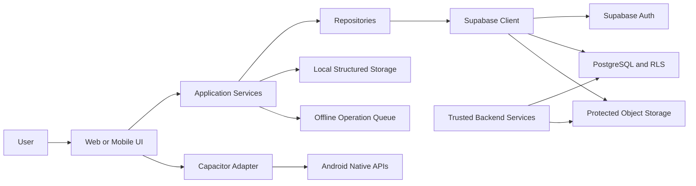
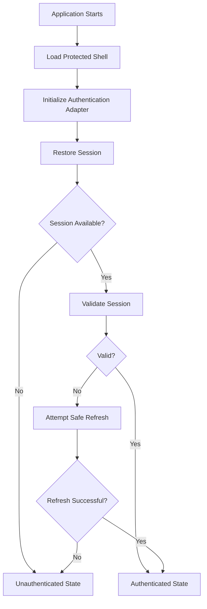
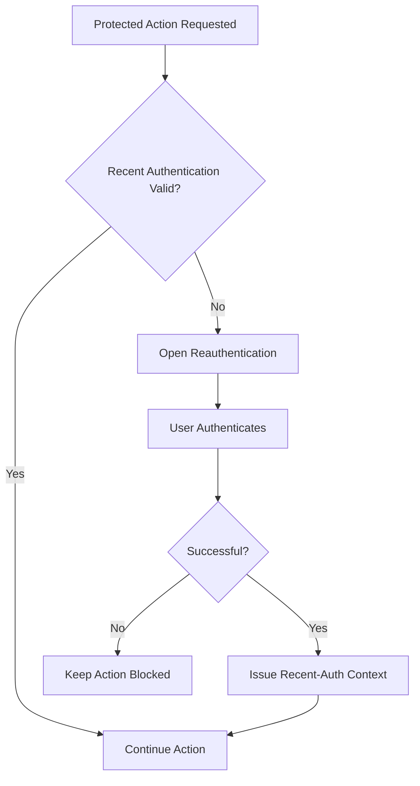
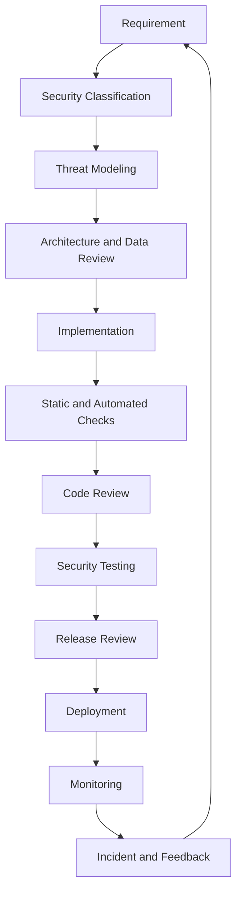
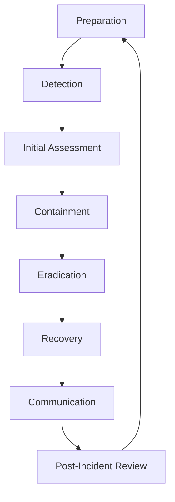
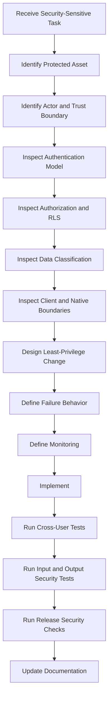

# Nexio Security and Privacy Specification

Version: 1.0  
Status: Official  
Authority Level: Security Standard  
Applies To: Web, Desktop, Tablet, Mobile, Android, Capacitor, Supabase, Local Storage and Backend Services

---

# Purpose

This document defines the official security and privacy architecture of Nexio.

It establishes:

- Security principles
- Threat model
- Trust boundaries
- Authentication requirements
- Authorization requirements
- Session lifecycle
- Row-Level Security expectations
- Client and server responsibilities
- Secret-management rules
- Data-protection requirements
- Local-storage protection
- Web and WebView security
- Native Android security
- File and attachment protection
- Notification privacy
- Logging and observability limits
- Incident response
- Security testing
- Release security
- AI implementation restrictions

Nexio handles personal financial information.

Security is therefore a product requirement, not an optional technical enhancement.

---

# Relationship with Other Documents

This document must be interpreted together with:

```text
docs/00-FOUNDATION.md
docs/01-ARCHITECTURE.md
docs/02-DESIGN-SYSTEM.md
docs/03-DESKTOP.md
docs/04-TABLET.md
docs/05-MOBILE.md
docs/06-DATA-MODEL.md
docs/08-OFFLINE-AND-SYNC.md
docs/09-TESTING.md
```

Responsibilities are divided as follows:

| Document | Responsibility |
|---|---|
| `00-FOUNDATION.md` | Product principles |
| `01-ARCHITECTURE.md` | Technical layers and dependencies |
| `02-DESIGN-SYSTEM.md` | Visual and interaction standards |
| `03-DESKTOP.md` | Desktop platform experience |
| `04-TABLET.md` | Tablet platform experience |
| `05-MOBILE.md` | Mobile, Android and Capacitor behavior |
| `06-DATA-MODEL.md` | Canonical data and ownership |
| `07-SECURITY.md` | Protection, authentication and authorization |
| `08-OFFLINE-AND-SYNC.md` | Local mutations and synchronization |
| `09-TESTING.md` | Verification strategy |

The Data Model defines what the information means.

The Security specification defines who may access it and how it must be protected.

---

# Security Scope

This specification applies to:

```text
Authentication

Authorization

Supabase access

Row-Level Security

Database functions

Web application

Android WebView

Capacitor bridge

Native plugins

Local persistence

Offline queue

Attachments

Imports and exports

Notifications

Deep links

Clipboard

Application logs

Analytics

Build configuration

Release artifacts

Support workflows

AI-generated code
```

---

# Security Objectives

Nexio security must protect:

## Confidentiality

Financial data must be accessible only to authorized users and approved services.

## Integrity

Transactions, accounts, goals and reports must not be modified without authorization or valid domain rules.

## Availability

Users should be able to access supported financial functions reliably, including safe offline behavior.

## Authenticity

The application must distinguish legitimate users, sessions, services and application builds.

## Accountability

Important security and data operations should produce safe, reviewable audit information.

## Privacy

Nexio must minimize collection, storage and exposure of personal financial information.

---

# Security Constitutional Principles

## Deny by Default

Access must be denied unless explicitly permitted.

This applies to:

- Database rows
- Storage objects
- Native capabilities
- Administrative functions
- Internal tools
- Deep-link targets
- Export actions
- Sensitive settings

An absent permission must never be interpreted as approval.

---

## Least Privilege

Every user, service, application component and credential must receive only the minimum capabilities required.

Examples:

```text
A client may read its own transactions.

A client may not read all users' transactions.

A notification worker may create approved notifications.

It may not receive unrestricted access to unrelated financial records.

A file picker may access the user-selected file.

It should not require broad storage access.
```

---

## Defense in Depth

No single security control is sufficient.

Example:

```text
UI hides another user's record

+

Repository validates owner

+

Supabase RLS enforces owner

+

Foreign keys prevent cross-owner relationships

+

Tests verify isolation
```

The interface is never the final authorization boundary.

---

## Trust No Client Input

All client input must be treated as untrusted.

This includes:

- Entity identifiers
- Owner identifiers
- Amounts
- Dates
- Redirect URLs
- Deep-link parameters
- File names
- MIME types
- Notification payloads
- Import data
- Assistant-generated actions
- Local-storage content
- Feature flags
- Form fields

Client validation improves usability.

Trusted backend validation protects the system.

---

## Authentication Is Not Authorization

Authentication answers:

```text
Who is the user?
```

Authorization answers:

```text
What may this user access or change?
```

A valid session does not grant unrestricted access.

Every protected operation still requires authorization.

---

## Ownership Must Be Enforced Remotely

The client may provide entity identifiers.

The server must independently verify ownership.

Forbidden:

```text
The UI only displays the current user's transactions,
therefore unauthorized access is impossible.
```

Required:

```text
RLS and backend validation prevent access even when a malicious client sends another user's identifier.
```

---

## Secrets Do Not Belong in Client Applications

Values included in:

- JavaScript bundles
- Android APKs
- Android App Bundles
- Capacitor configuration
- Web assets
- Public repositories
- Browser storage

must be treated as discoverable.

Private server credentials must remain in trusted server environments.

---

## Sensitive Data Must Be Minimized

Do not collect or store sensitive information without a clear product need.

Examples:

- Do not store full bank account numbers when a masked value is sufficient.
- Do not retain imported statement files indefinitely.
- Do not include transaction notes in logs.
- Do not place exact balances in notification payloads unnecessarily.
- Do not export hidden technical metadata.

---

## Security Must Preserve Usability

Security controls must not unnecessarily prevent legitimate financial use.

Examples:

- Permission denial should provide a fallback.
- Session expiration should preserve safe drafts.
- Reauthentication should return users to the intended workflow.
- Privacy mode should hide values without breaking navigation.
- Offline data should remain honest and recoverable.

---

## Security State Must Be Explicit

The application must distinguish:

```text
Authenticated

Unauthenticated

Session validating

Session expired

Locked

Reauthentication required

Authorized

Permission denied

Offline

Security action required
```

Security state must not be inferred from whether a screen happens to be visible.

---

# Threat Model

Nexio must assume that an attacker may:

- Inspect client JavaScript
- Decompile Android application packages
- Modify browser requests
- Change local storage
- Guess entity identifiers
- Replay requests
- Open crafted deep links
- Upload malicious files
- Manipulate import content
- Attempt cross-user access
- Exploit stale sessions
- Access a lost or shared device
- Read notification previews
- Inspect clipboard contents
- Trigger actions repeatedly
- Intercept insecure network traffic
- Use an outdated application version
- Inject content into user-controlled text fields
- Attempt to access privileged native capabilities
- Inspect application logs
- Abuse public Supabase credentials
- Exploit incorrectly configured RLS policies

---

# Protected Assets

Security design must protect:

## Authentication Assets

- Sessions
- Access tokens
- Refresh tokens
- Recovery state
- Authentication callbacks
- Reauthentication state

## Financial Assets

- Transactions
- Balances
- Accounts
- Categories
- Goals
- Reports
- Import files
- Attachments
- Financial notes

## Identity Assets

- User identifier
- Email
- Profile information
- Device sessions
- Notification preferences

## Administrative Assets

- Service-role credentials
- Database credentials
- Signing keys
- Upload keys
- Backend secrets
- Deployment tokens

## Application Integrity

- Source configuration
- Release artifacts
- Database migrations
- Native overrides
- Dependency lock files
- Feature flags

---

# Threat Actors

Potential threat actors include:

```text
Unauthenticated external attacker

Authenticated malicious user

Attacker with access to a user's unlocked device

Attacker with access to local application files

Malicious or compromised third-party dependency

Misconfigured backend service

Unauthorized support or administrative operator

Automated credential-stuffing system

Malicious imported file provider

Compromised older application version
```

Security controls must not assume that every authenticated user behaves honestly.

---

# Trust Boundaries

Nexio contains several trust boundaries.



Every arrow crossing a boundary requires:

- Validation
- Authorization
- Error handling
- Data minimization
- Safe logging

---

# Trusted and Untrusted Components

## Trusted Server Components

May include:

- Supabase Auth
- PostgreSQL constraints
- Row-Level Security
- Approved database functions
- Controlled backend services
- Secure deployment environment

Trusted does not mean unrestricted.

Every trusted component still requires least privilege.

---

## Untrusted Client Components

The following must be considered attacker-controlled or observable:

- Browser JavaScript
- Android Web assets
- Client-side state
- Local-storage values
- URL parameters
- Deep-link parameters
- Form input
- Import files
- Client-provided owner identifiers
- Feature flags stored locally

Client logic cannot be the final security authority.

---

## Semi-Trusted Local Platform

Android and browser storage may benefit from operating-system protections.

However:

- Devices may be shared.
- Devices may be compromised.
- Backups may expose data.
- Local files may be inspected.
- Browser extensions may access content.
- Rooted devices may weaken protections.

Local-device protection must not replace backend authorization.

---

# Security Layers

The Nexio security model should include:

```text
Layer 1:
User authentication

Layer 2:
Session validation

Layer 3:
Application authorization

Layer 4:
Repository ownership validation

Layer 5:
Supabase RLS

Layer 6:
Database constraints

Layer 7:
Storage-object policies

Layer 8:
Local device protection

Layer 9:
Privacy presentation controls

Layer 10:
Monitoring and incident response
```

---

# Authentication Architecture

Authentication must use one approved provider and session model.

The target architecture may use Supabase Auth through a stable authentication adapter.

Feature modules must not depend directly on provider-specific session objects.

---

# Authentication Adapter

Conceptual contract:

```javascript
auth.initialize()

auth.getSession()

auth.getCurrentUser()

auth.signIn(credentials)

auth.signOut()

auth.refreshSession()

auth.requestPasswordReset(email)

auth.updatePassword(input)

auth.onAuthStateChange(handler)

auth.requireRecentAuthentication(context)
```

The adapter normalizes provider behavior for the application.

---

# Authentication Adapter Responsibilities

The adapter may:

- Initialize the authentication client.
- Restore a valid session.
- Normalize user identity.
- Refresh tokens.
- Handle authentication callbacks.
- Publish session-state changes.
- Clear authentication state.
- Map provider errors.
- Coordinate secure platform storage where approved.

---

# Authentication Adapter Non-Responsibilities

The adapter must not:

- Calculate financial values.
- Decide row ownership independently of RLS.
- Render authentication screens.
- Store passwords.
- Contain service-role credentials.
- Bypass application authorization.
- Expose raw provider tokens to feature modules.
- Manage transaction repositories.

---

# Authentication State

Recommended application state:

```javascript
{
  status:
    "initializing"
    | "authenticated"
    | "unauthenticated"
    | "refreshing"
    | "expired"
    | "locked"
    | "error",

  user: null | {
    id: "uuid",
    email: "user@example.com"
  },

  sessionExpiresAt: null | "timestamp"
}
```

Feature code should consume normalized authentication state.

---

# Authentication Initialization

Recommended flow:



Protected financial content must not display before the session state is resolved.

---

# Sign-In Requirements

Sign-in must:

- Use encrypted transport.
- Avoid logging credentials.
- Prevent duplicate submission.
- Use generic failure messages where account enumeration is a concern.
- Rate-limit abusive attempts through the provider or backend.
- Support password-manager integration.
- Provide accessible errors.
- Clear password fields appropriately.
- Avoid storing raw credentials.

---

# Sign-In Error Messages

User-facing errors should be useful without revealing unnecessary account information.

Recommended:

```text
We could not sign you in with those details.
```

Avoid overly specific unauthenticated responses such as:

```text
This email exists, but the password is incorrect.
```

unless the authentication policy explicitly accepts that disclosure.

---

# Credential Storage

Nexio must never store:

```text
Plain-text password

Encrypted password created by Nexio client code

Password in localStorage

Password in IndexedDB

Password in logs

Password in analytics

Password in draft state
```

Password handling belongs to the approved authentication provider.

---

# Password Reset

Password-reset flows must:

- Avoid confirming whether an account exists when not appropriate.
- Use time-limited provider-controlled links.
- Validate callback state.
- Avoid open redirects.
- Require a strong new password according to policy.
- Invalidate or review sessions when necessary.
- Provide clear completion feedback.
- Avoid exposing tokens in logs or UI errors.

---

# Authentication Callback

Authentication callbacks must validate:

- Approved URL scheme or domain
- Expected callback path
- State or equivalent anti-forgery mechanism where supported
- Session result
- Redirect target
- Expiration
- Repeated delivery

Temporary callback parameters must be removed or ignored after successful handling.

---

# Email Verification

When email verification is required:

- Unverified users must receive a clear state.
- Protected financial operations may remain restricted.
- Verification links must be provider-controlled and time-limited.
- Repeated verification requests should be rate-limited.
- The application should not create duplicate Profiles.
- Verification state changes should refresh safely.

---

# Multi-Factor Authentication

When supported, multi-factor authentication may protect:

- Account access
- Password changes
- Account deletion
- Complete data export
- Security-setting changes
- Session revocation

MFA implementation must remain provider-backed.

The application must not implement custom insecure one-time-code storage.

---

# Recent Authentication

High-impact actions may require recent authentication.

Examples:

```text
Delete account

Change password

Export complete data

Disable multi-factor authentication

Revoke all sessions

Change authentication email

Reveal protected recovery information
```

Recent authentication should expire after a documented duration.

---

# Reauthentication Flow



Reauthentication must return the user to the intended protected workflow.

---

# Biometric Authentication

Biometric authentication may unlock an existing authorized application session.

It must not replace backend authentication.

Biometric behavior must:

- Use approved Android or platform APIs.
- Store no biometric template.
- Receive only success, failure or cancellation.
- Provide a supported fallback.
- Require reauthentication after important account changes.
- Respect device capability.
- Respect user choice.
- Avoid claiming that Nexio stores fingerprints or face data.

---

# Biometric Unlock Scope

Biometric unlock may protect:

- Application lock
- Locally stored session access
- Sensitive settings entry

It must not independently authorize:

- Another user's data
- Server administration
- RLS bypass
- Expired remote sessions
- Unauthorized deep-link targets

---

# Sign-Out

Sign-out must:

1. Stop new protected requests.
2. Stop active private subscriptions.
3. Clear in-memory financial state.
4. End the authentication session.
5. Protect or clear tokens.
6. Handle pending local operations.
7. Handle user-specific drafts.
8. Remove sensitive temporary files.
9. Clear private notification content where appropriate.
10. Reset route and ownership scope.
11. Render unauthenticated content.

---

# Sign-Out with Pending Changes

When unsynchronized financial changes exist, sign-out must not silently delete them.

Possible behavior:

```text
You have 3 changes waiting to synchronize.

Connect and synchronize before signing out,
or confirm that local pending changes will be removed.
```

The exact policy must be documented.

Pending changes must never migrate to another authenticated user.

---

# Account Switching

When another user authenticates:

```text
Stop previous user synchronization

↓

Clear previous in-memory state

↓

Close subscriptions

↓

Change local owner namespace

↓

Load new user's profile and data

↓

Resume authorized synchronization
```

The previous user's:

- Transactions
- Drafts
- Notifications
- Account names
- Search history
- Pending operations

must not appear in the new session.

---

# Session Architecture

A session proves that the authentication provider has authenticated a user.

A session must have:

- User identifier
- Expiration
- Refresh behavior
- Revocation behavior
- Authentication assurance level where applicable

Feature code should not parse or depend on raw token contents.

---

# Session Token Rules

Tokens must not be:

- Logged
- Included in analytics
- Displayed
- Copied
- Added to query parameters unnecessarily
- Stored in ordinary debug files
- Sent to unrelated services
- Included in exported data
- Embedded in notification payloads

---

# Access Token Lifecycle

Conceptual lifecycle:

```text
Issued

↓

Active

↓

Near expiration

↓

Refreshed

or

Expired

↓

Rejected and cleared
```

Refresh should be coordinated centrally.

Several features must not independently refresh the same session.

---

# Refresh Token Handling

Refresh-token handling must be delegated to the approved authentication client or secure adapter.

Feature code must never:

- Read refresh tokens directly.
- Send refresh tokens manually.
- Persist duplicate token copies.
- Include refresh tokens in logs.
- Copy tokens between users.
- Build custom token-refresh logic without security review.

---

# Session Refresh Concurrency

When several requests detect an expiring session:

```text
One centralized refresh operation

↓

Other requests wait

↓

New session distributed

↓

Requests resume
```

Avoid multiple simultaneous refresh attempts.

---

# Session Expiration

When session renewal fails:

- Stop protected network activity.
- Hide sensitive content.
- Preserve safe drafts.
- Preserve pending local operations securely.
- Show authentication.
- Explain that the session ended.
- Avoid exposing backend errors.
- Restore the intended route after successful sign-in when safe.

---

# Session Revocation

Sessions may be revoked because of:

- User sign-out
- Password change
- Security action
- Administrative security response
- Expiration
- Suspicious activity
- User revocation from another device

Other active application windows must respond promptly.

---

# Cross-Tab Session Coordination

Web sessions may exist in multiple tabs.

Authentication state should be coordinated through an approved mechanism such as:

- Authentication-provider events
- BroadcastChannel
- Storage events
- Shared application coordinator

Signing out in one tab must protect other tabs.

---

# Cross-Window Session Event

Conceptual event:

```javascript
{
  type: "session_signed_out",
  userId: "uuid",
  occurredAt: "timestamp"
}
```

Avoid broadcasting raw tokens.

---

# Session Lock Versus Sign-Out

Lock and sign-out are different.

## Lock

- Preserves authenticated session.
- Hides financial content.
- Requires local or recent authentication to continue.
- Preserves route and safe drafts.

## Sign-Out

- Ends authenticated session.
- Clears private active state.
- Changes owner scope.
- Requires full authentication to continue.

---

# Inactivity Lock

When supported, inactivity lock may be triggered by:

- Configured timeout
- Long background period
- Security policy
- Explicit user action

The timer should not reset because of background synchronization.

Only meaningful user interaction should reset inactivity.

---

# Lock State

When locked:

```text
Financial content hidden

Notifications protected

Clipboard actions unavailable

Sensitive native previews obscured

Route preserved internally

Synchronization behavior follows policy
```

---

# Authorization Architecture

Authorization decisions must occur at several levels.

```text
Application capability

Entity ownership

Entity lifecycle

Domain permission

Database RLS

Storage policy

Protected operation rule
```

---

# Application Capability Authorization

Some actions may be unavailable because of:

- Authentication state
- Feature availability
- Account state
- Platform capability
- Security level
- Required recent authentication
- Subscription or plan where formally supported

The UI may hide or disable unavailable actions.

The backend must still enforce protected rules.

---

# Ownership Authorization

Every private entity operation must verify:

```text
Authenticated user

equals

Entity owner
```

This must be enforced through:

- Repository context
- RLS
- Same-owner foreign keys
- Backend functions

---

# Entity Lifecycle Authorization

Even an owner may not perform every action in every state.

Examples:

- Cannot use an archived account for a new transaction.
- Cannot edit a deleted transaction.
- Cannot merge a system-protected category.
- Cannot modify a completed import batch arbitrarily.
- Cannot update a stale entity version.
- Cannot attach a file to an unauthorized entity.

These are domain authorization rules.

---

# Operation Authorization

Protected operations may include:

```text
Read

Create

Update

Archive

Restore

Delete

Export

Share

Import

Merge

Synchronize

Revoke session

Delete account
```

Permission for one operation does not automatically imply another.

---

# Authorization Context

Conceptual context:

```javascript
{
  authenticatedUserId: "uuid",
  recentAuthenticationAt: "timestamp",
  sessionAssurance: "standard",
  platform: "android",
  featureFlags: {},
}
```

Only trusted session information may define authorization identity.

---

# Authorization Result

Recommended structured result:

```javascript
{
  allowed: false,
  reason: "ENTITY_NOT_OWNED",
  requiredAction: null
}
```

or:

```javascript
{
  allowed: false,
  reason: "RECENT_AUTHENTICATION_REQUIRED",
  requiredAction: "reauthenticate"
}
```

User-facing text belongs to the presentation or localization layer.

---

# Authorization Failure

Authorization failure must not reveal unnecessary information.

Example:

```text
You do not have access to this item.
```

Avoid confirming that another user's exact record exists.

For external identifiers, it may be safer to return a generic unavailable state.

---

# Row-Level Security

Every private Supabase table must use Row-Level Security.

RLS is the final database ownership boundary for direct client access.

Required principle:

```sql
auth.uid() = user_id
```

or, for Profile:

```sql
auth.uid() = id
```

---

# RLS Requirements

Each client-accessible private table must define policies for:

- Select
- Insert
- Update
- Delete when client deletion is supported

Policies must prevent:

- Reading another user
- Creating a row for another user
- Changing row ownership
- Updating another user's row
- Deleting another user's row

---

# RLS Update Protection

An update policy should include both:

```sql
using (auth.uid() = user_id)
```

and:

```sql
with check (auth.uid() = user_id)
```

This prevents an owner from changing `user_id` to another value.

---

# RLS Insert Protection

Insert policies must verify the new row owner.

Example:

```sql
with check (auth.uid() = user_id)
```

The database must not trust a client-provided `user_id` without this check.

---

# RLS Delete Protection

Deletion policies must verify ownership.

High-impact deletion may additionally be restricted to:

- Approved database functions
- Backend services
- Soft-delete operations
- Recent-authentication workflows

---

# RLS and Composite Relationships

RLS does not automatically prevent a user from referencing another user's entity if foreign keys allow it.

Same-owner composite foreign keys should be used where practical.

Example:

```text
Transaction:

(user_id, account_id)

references

Account:

(user_id, id)
```

---

# RLS for Views

Views exposed to clients must preserve authorization.

Before exposing a view, verify:

- Whether it uses invoker security
- Whether underlying RLS remains effective
- Whether joins expose another user's rows
- Whether aggregates leak row existence
- Whether filters include owner scope

A convenient view must not become an RLS bypass.

---

# RLS for Functions

Database functions must explicitly validate:

- Authenticated user
- Entity ownership
- Input identifiers
- Allowed operation
- Entity version
- Domain invariants

A security-definer function may bypass ordinary RLS.

It therefore requires stronger review.

---

# Security-Definer Functions

A security-definer function must:

- Have a fixed safe search path.
- Avoid dynamic untrusted SQL.
- Validate `auth.uid()`.
- Validate ownership.
- Validate every input.
- Expose only required output.
- Restrict execute permission.
- Avoid returning sensitive unrelated data.
- Have dedicated security tests.

---

# Service-Role Access

Service-role access bypasses ordinary RLS.

It may exist only in trusted backend environments.

Every service-role operation must explicitly scope data by owner or approved system purpose.

Forbidden:

```text
Use the service-role key in Web or Android code to avoid RLS problems.
```

---

# Public Supabase Client Key

A public Supabase client key may be present in client configuration when required by the platform architecture.

It must be treated as public.

Security must rely on:

- Authentication
- RLS
- Backend validation
- Storage policies
- Database constraints

The public client key is not a secret authorization mechanism.

---

# Authorization Test Matrix

For every protected entity:

```text
Owner reads own record.

Owner creates own record.

Owner updates own record.

Owner deletes own record when permitted.

Owner cannot read another user's record.

Owner cannot update another user's record.

Owner cannot delete another user's record.

Owner cannot assign another user's account.

Owner cannot assign another user's category.

Owner cannot change user_id.

Anonymous user cannot access private data.

Stale version cannot overwrite current data.
```

---

# Resource Authorization

Protected non-database resources include:

- Attachments
- Export files
- Import files
- Generated reports
- Notification targets
- Deep-link destinations
- Temporary files

Access requires the same owner and authorization principles as database rows.

---

# Storage-Object Authorization

Protected storage paths should include owner scope.

Conceptual path:

```text
user-id/entity-type/entity-id/file-id
```

Storage policies must verify that the authenticated user owns the path or associated metadata.

An unguessable filename alone is not authorization.

---

# Signed URLs

Signed URLs may be used for temporary protected access.

They must:

- Expire.
- Be generated only after authorization.
- Expose only the intended object.
- Avoid unnecessary long lifetimes.
- Not be stored permanently in entity records.
- Not appear in routine logs.
- Not be shared automatically.

---

# Deep-Link Authorization

Deep links are untrusted inputs.

A deep link may identify a target.

It does not prove access.

Opening a deep link requires:

```text
Validate route

↓

Validate identifier

↓

Validate session

↓

Load entity through authorized repository

↓

Handle unavailable or unauthorized result safely
```

---

# Notification-Target Authorization

Notification payloads may become stale or manipulated.

Before opening a target:

- Validate session.
- Validate target type.
- Validate target identifier.
- Load through an authorized repository.
- Handle deleted records.
- Handle unauthorized records.
- Avoid exposing raw errors.

---

# Export Authorization

Export is a read operation with increased privacy risk.

Before export:

- Validate authenticated user.
- Validate requested scope.
- Validate every filter.
- Apply owner isolation.
- Require recent authentication for complete exports when defined.
- Exclude unauthorized or internal fields.
- Generate through a controlled service.

---

# Import Authorization

Import must validate:

- Active authenticated owner
- Target account ownership
- Category ownership
- File ownership context
- Batch ownership
- Confirmation
- Allowed operation

Imported `user_id`, account identifiers or category identifiers from a file must not be trusted.

---

# Assistant Authorization

The Assistant may suggest actions.

It must not gain additional authority.

Assistant-created commands must pass through the same:

- Authentication
- Ownership
- Validation
- Recent-authentication
- Repository
- RLS

rules as manually initiated actions.

---

# Secret Management

Secrets include credentials that provide privileged access.

Examples:

```text
Supabase service-role key

Database password

Android signing-store password

Private API secret

Deployment token

Email-provider secret

Push-notification server key

Administrative access credential
```

---

# Client-Visible Configuration

Client-visible configuration may include:

- Public project URL
- Public client key
- Public application identifier
- Non-sensitive feature configuration
- Public callback path

Every client-visible value must be assumed discoverable.

---

# Secret Locations

Secrets may exist only in approved environments such as:

- Secure deployment secrets
- Protected CI/CD variables
- Trusted backend environment
- Protected local release configuration
- Authorized password manager
- Secure build service

---

# Forbidden Secret Locations

Secrets must not be stored in:

```text
JavaScript source

HTML

CSS

capacitor.config.ts

Android resources

Public repository

Committed .env files

Screenshots

Documentation examples

Chat messages

Analytics

Crash reports

Application logs

Generated Web assets

APK or AAB assets
```

---

# Environment Variables

Environment variables containing secrets must be consumed only by trusted server or build environments.

A build-time environment variable injected into a client bundle is not secret.

The build process must classify every environment value as:

```text
Public client configuration

or

Private trusted secret
```

---

# `.env` Policy

Recommended files:

```text
.env.example
```

Contains:

- Variable names
- Safe placeholders
- Documentation

Local real-value files such as:

```text
.env.local
.env.production.local
```

must remain outside version control when they contain secrets.

---

# Secret Rotation

Every privileged secret should have:

- Owner
- Purpose
- Storage location
- Rotation procedure
- Revocation procedure
- Dependency inventory
- Incident procedure

Rotation must avoid long application outages.

---

# Exposed Secret Response

When a secret may have been exposed:

1. Revoke or rotate immediately.
2. Identify affected systems.
3. Review logs and access.
4. Remove the secret from source history where appropriate.
5. Update deployment configuration.
6. Validate application behavior.
7. Document the incident.
8. Add prevention controls.

Deleting a secret from the latest commit is not sufficient if it remains valid or in history.

---

# Signing Credentials

Android signing credentials require special protection.

Do not store:

- Keystore file in public source control
- Keystore password in source
- Key password in Gradle scripts
- Credentials in screenshots
- Credentials in release documentation

Signing ownership and recovery must be documented separately.

---

# Backend Administrative Credentials

Administrative credentials must be used only by controlled backend processes.

A support tool requiring administrative access must:

- Authenticate the operator
- Authorize the exact operation
- Record safe audit metadata
- Minimize data exposure
- Avoid unrestricted browsing
- Support revocation

---

# Security Error Taxonomy

Recommended security-related errors:

```text
authentication_required

session_expired

reauthentication_required

authorization_denied

resource_not_found

account_locked

permission_denied

security_policy_violation

invalid_callback

invalid_deep_link

token_refresh_failed

suspicious_request

rate_limited
```

---

# Security Error Presentation

User-facing errors should:

- Explain the next safe action.
- Avoid exposing stack traces.
- Avoid exposing policy names unnecessarily.
- Avoid confirming another user's record.
- Avoid exposing tokens.
- Avoid exposing database structure.
- Preserve safe user work.

---

# Authentication Error Example

```text
Your session has ended.

Sign in again to continue.

[Sign in]
```

---

# Authorization Error Example

```text
This item is unavailable or you do not have access to it.
```

---

# Reauthentication Error Example

```text
Confirm your identity to continue with this security-sensitive action.
```

---

# Security Logging Principles

Security events may be recorded when necessary.

Potential events:

```text
Sign-in success

Sign-in failure category

Session refresh failure

Sign-out

Password change

Reauthentication

MFA change

Session revocation

Authorization denial category

Account deletion request

Complete data export

Suspicious deep-link attempt

RLS policy failure category
```

---

# Security Log Restrictions

Security logs must not include:

- Passwords
- Authentication tokens
- Recovery codes
- Full transaction data
- Financial notes
- Full account identifiers
- Raw import data
- Full exported file content
- Biometric data
- Signing credentials

---

# Safe Security Metadata

May include:

- Anonymous correlation ID
- User ID where operationally required and protected
- Event type
- Timestamp
- Application version
- Platform
- Result category
- IP metadata only when justified and handled according to policy
- Device session identifier
- Authorization rule category

---

# Security Event Ownership

Security events should be produced by centralized services.

Avoid each UI component creating its own security-event format.

---

# Privacy Mode Versus Security

Privacy mode reduces visual exposure.

It does not:

- Encrypt data
- Replace authentication
- Change authorization
- Protect against a compromised device
- Remove data from network responses
- Prevent access through developer tools

Privacy mode is one layer of defense.

---

# Protected Startup

The application must avoid:

```text
Render financial values

↓

Resolve session and privacy

↓

Hide unauthorized or protected values
```

Required:

```text
Render protected shell

↓

Resolve privacy

↓

Resolve session

↓

Load authorized data

↓

Render permitted content
```

---

# Security Foundational Anti-Patterns

The following are prohibited:

## UI-Only Authorization

Hiding a button while leaving the backend operation unrestricted.

## Client-Owned Identity

Trusting a `userId` supplied by a form or URL.

## Service Role in Client

Using privileged backend credentials in Web or Android code.

## Disabled RLS

Turning off Row-Level Security to simplify queries.

## Public Private-Data Policy

Creating broad policies such as:

```sql
using (true)
```

for private financial tables.

## Token Logging

Writing authentication tokens to console, analytics or crash reports.

## Password Storage

Saving user passwords locally.

## Cross-Owner Foreign Key

Allowing one user's transaction to reference another user's account.

## Authentication Equals Authorization

Assuming every authenticated user may access every record.

## Permanent Signed URL

Storing long-lived attachment URLs.

## Trusting Deep Links

Opening entity routes without authorized repository loading.

## Assistant Privilege

Allowing Assistant actions to bypass confirmation or authorization.

## Secret in Build Variable

Treating a value as secret merely because it entered the client bundle through an environment variable.

## Silent Session Failure

Continuing to display protected data after session invalidation.

## Account Switch Leakage

Showing cached data from the previous user.

## Generic Security-Definer Function

Creating a privileged database function without explicit ownership checks.

## Detailed Unauthorized Error

Confirming another user's record exists.

---

# Security Foundation Review Questions

Before implementing a protected feature, answer:

```text
What asset is being protected?

Who may access it?

Which authentication state is required?

Which owner controls it?

Where is authorization enforced?

Does RLS protect the table?

Do same-owner relationships exist?

Does the operation require recent authentication?

Could the input be manipulated?

Could a deep link invoke it?

Could an Assistant invoke it?

What happens after session expiration?

What appears in logs?

What client-visible configuration is required?

Does any secret enter the client bundle?

Which tests prove isolation?
```

---

# Security Foundation Acceptance Criteria

The security foundation is accepted only when:

```text
□ Security objectives are documented.

□ Threat actors and protected assets are identified.

□ Trust boundaries are explicit.

□ Client input is treated as untrusted.

□ Authentication uses a centralized adapter.

□ Feature modules do not handle raw tokens.

□ Passwords are never stored by Nexio.

□ Session initialization protects financial content.

□ Session refresh is centralized.

□ Session expiration hides protected content.

□ Sign-out clears active private state.

□ Account switching isolates every data store.

□ Lock and sign-out remain distinct.

□ High-impact actions may require recent authentication.

□ Biometric access remains a platform-backed unlock mechanism.

□ Authorization is enforced independently of UI visibility.

□ Private records use owner scope.

□ RLS is enabled for private client-accessible tables.

□ Insert and update policies prevent owner changes.

□ Cross-owner relationships are prevented.

□ Security-definer functions receive dedicated review.

□ Service-role credentials remain server-only.

□ Deep links and notification targets are authorized after opening.

□ Exports and imports validate owner scope.

□ Assistant actions use ordinary authorization paths.

□ Client-visible configuration contains no private secret.

□ Signing and deployment credentials remain protected.

□ Security errors avoid sensitive disclosure.

□ Security logs exclude credentials and financial payloads.

□ Privacy mode applies before sensitive rendering.

□ Two-user isolation tests are mandatory.
```

---

# Security Constitutional Rule

Every security decision must answer:

```text
Can a malicious client, another authenticated user, a compromised device or an outdated application use this path to access or change financial data beyond the user's authorization?
```

When the answer is uncertain, prefer the implementation that:

- Denies access by default.
- Enforces ownership remotely.
- Uses least privilege.
- Validates every boundary.
- Keeps secrets outside clients.
- Protects sessions centrally.
- Requires recent authentication for high-impact actions.
- Minimizes sensitive data.
- Preserves safe drafts.
- Avoids information leakage.
- Produces testable authorization rules.
- Maintains usability for legitimate users.

Authentication identifies the user.

Authorization protects the user's financial life.

---
---

# Data Protection Architecture

Nexio must protect financial data throughout its lifecycle.

Protection applies while data is:

```text
Created

Validated

Stored locally

Stored remotely

Synchronized

Displayed

Copied

Shared

Exported

Imported

Attached

Logged

Deleted
```

Security must address both:

```text
Data at rest

and

Data in transit
```

The same data may pass through several trust boundaries.

Every boundary must preserve:

- Ownership
- Integrity
- Confidentiality
- Exact financial meaning
- Retention policy
- Privacy classification

---

# Data Classification

Nexio should classify information before deciding how to store, transmit or expose it.

Recommended categories:

```text
Public

Internal

Private

Sensitive

Restricted
```

---

# Public Data

Examples:

- Public legal documents
- Public support documentation
- Public application metadata
- Public store-listing information

Public does not mean unvalidated.

Public content must still be protected against tampering and injection.

---

# Internal Data

Examples:

- Non-sensitive feature flags
- Application version
- Safe error category
- Migration version
- Performance metrics
- Non-sensitive configuration

Internal data should not be exposed unnecessarily.

However, accidental disclosure normally creates lower direct financial risk than Sensitive or Restricted data.

---

# Private Data

Examples:

- Profile preferences
- Category names
- Account display names
- Goal names
- Notification preferences
- Search configuration

Private data requires authenticated ownership.

---

# Sensitive Data

Examples:

- Transaction descriptions
- Transaction amounts
- Account balances
- Credit limits
- Financial notes
- Imported bank statements
- Reports
- Goal values
- Account identifiers
- Attachment content
- Exported financial files

Sensitive data must be minimized in:

- Logs
- Notifications
- Clipboard
- Analytics
- Error messages
- Temporary files
- App-switcher previews

---

# Restricted Data

Examples:

- Authentication tokens
- Recovery material
- MFA secrets
- Service-role keys
- Database passwords
- Signing credentials
- Deployment secrets
- Administrative credentials

Restricted data must never enter ordinary client-visible application state.

---

# Data Protection Matrix

| Data Type | Local Storage | Remote Storage | Logs | Notifications | Clipboard | Export |
|---|---|---|---|---|---|---|
| Public | Allowed | Allowed | Allowed when useful | Allowed | Allowed | Allowed |
| Internal | Limited | Allowed | Safe metadata only | Rarely | Rarely | Usually excluded |
| Private | Owner-scoped | RLS-protected | Avoid raw content | Protected | Explicit action | Scoped |
| Sensitive | Minimized and owner-scoped | Strongly protected | No raw content | Privacy-filtered | Explicit action | Warning and authorization |
| Restricted | Approved secure mechanism only | Trusted service only | Never | Never | Never | Never |

---

# Data at Rest

Data at rest may exist in:

- PostgreSQL
- Supabase Storage
- IndexedDB
- Browser storage
- Native secure storage
- Android application storage
- Temporary files
- Export files
- Cached attachments
- Device backups
- Build systems
- Logs

Each storage location requires an explicit purpose.

---

# Remote Database Protection

Remote financial records must be protected through:

- Authentication
- Row-Level Security
- Same-owner foreign keys
- Database constraints
- Trusted transactional functions
- Controlled administrative access
- Backup protection
- Audit and incident procedures

Database encryption provided by the hosting platform does not replace row authorization.

---

# Local Storage Protection

Local storage must be treated as potentially inspectable by someone with sufficient device access.

Nexio must:

- Minimize stored sensitive data.
- Separate records by owner.
- Avoid unrestricted plaintext exports inside application storage.
- Clear or protect records during account switching.
- Protect pending operations.
- Avoid storing credentials in ordinary Web storage.
- Respect logout and deletion policy.
- Avoid claiming local storage is inaccessible to a compromised device.

---

# Local Storage Threats

Potential threats include:

- Shared browser profile
- Lost device
- Rooted Android device
- Browser extension access
- Local developer tools
- Device backup extraction
- Malware
- Physical access to an unlocked device
- Incorrect owner namespace
- Application cache leakage

---

# Local Financial Database

Structured local financial data should use an approved storage adapter.

Potential implementation:

```text
IndexedDB

or

Native structured storage behind an adapter
```

Security requirements:

- Owner-scoped keys
- Versioned schema
- Atomic writes
- Controlled serialization
- Logout policy
- Account-switch isolation
- Corruption detection
- Pending-operation protection

---

# Local Data Ownership

Every local private record must include an owner scope.

Conceptual key:

```text
[ownerId, entityId]
```

Unscoped keys such as:

```text
transactions
```

are insufficient when several accounts may use the same application environment.

---

# Local Storage Tampering

Local data must be treated as untrusted when loaded.

The application must validate:

- Entity shape
- Owner
- Enum values
- Money representation
- Dates
- Versions
- Operation identifiers
- Schema version

A manipulated local record must not bypass remote authorization.

---

# Local Data Integrity

Local records may include integrity metadata such as:

- Schema version
- Entity version
- Operation identifier
- Expected owner
- Checksum for files
- Migration status

Checksums may detect accidental corruption.

They do not prove authenticity when the attacker controls the same local environment.

---

# Local Encryption

Application-level encryption may be introduced only with a complete key-management design.

Encryption requires answers to:

```text
Where is the key created?

Where is the key stored?

How is the key recovered?

What happens after sign-out?

How is account switching handled?

How is data synchronized?

How are backups handled?

What happens when the device is lost?

How are key rotations handled?
```

Adding encryption without key management may create false security or permanent data loss.

---

# Encryption at Rest Claims

Nexio must not claim:

```text
All local data is encrypted
```

unless the complete local persistence path is verified.

Platform-level disk encryption, browser isolation and application-level encryption are separate controls.

Documentation must describe the actual protection accurately.

---

# Native Secure Storage

Native secure storage may be used for approved authentication material or encryption keys when required.

It must not become:

- A general transaction database
- A storage location for full reports
- A raw import archive
- A duplicate financial state system

Access should occur through one stable security adapter.

---

# Browser Storage

Potential browser storage mechanisms:

```text
localStorage

sessionStorage

IndexedDB

Cache Storage

Cookies
```

Each has different security and lifecycle properties.

---

# `localStorage`

Appropriate only for limited non-sensitive preferences such as:

- Theme fallback
- Privacy-mode startup preference
- Last safe public route
- Non-sensitive feature preference

Avoid storing:

- Access tokens when the approved auth architecture offers safer handling
- Transactions
- Account balances
- Pending financial operations
- Raw imports
- Sensitive drafts
- Full profile records

---

# `sessionStorage`

May be used for:

- Temporary route recovery
- Tab-specific safe context
- Short-lived workflow identifiers

It is not a trusted authorization source.

---

# IndexedDB

May be used for:

- Offline entities
- Pending operations
- Drafts
- Query cache
- Synchronization metadata

It must be:

- Owner-scoped
- Schema-versioned
- Validated on read
- Cleared or isolated on account changes
- Protected against silent destructive migration

---

# Cache Storage

Cache Storage may contain:

- Static application assets
- Safe offline shell
- Public resources
- Controlled API responses when formally designed

Sensitive API responses should not be cached indiscriminately.

Caching rules must avoid:

- Cross-user response reuse
- Stale authorization
- Private response exposure
- Long-lived financial response caches without ownership checks

---

# Cookie Security

When cookies are used by the authentication architecture, appropriate attributes should be considered:

```text
Secure

HttpOnly where server-controlled

SameSite

Path

Expiration
```

Client-readable authentication cookies carry additional XSS risk.

Cookie strategy requires architecture and security review.

---

# Data in Transit

All production communication must use encrypted transport.

Required:

```text
HTTPS

WSS for secure realtime transport
```

Forbidden:

```text
HTTP production API

Mixed content

Disabled certificate validation

Insecure WebSocket transport

Hardcoded development endpoint in production
```

---

# Transport Security

The application must:

- Validate production endpoint configuration.
- Reject insecure endpoint schemes.
- Avoid sending tokens to unrelated origins.
- Avoid including sensitive data in URLs.
- Use approved backend domains.
- Handle TLS failure without fallback to insecure transport.
- Avoid exposing complete request bodies in diagnostics.

---

# Sensitive Data in URLs

Do not place sensitive information in:

- Query strings
- URL fragments
- Deep-link paths
- Redirect parameters
- Referrer-visible locations

Examples of forbidden URL content:

```text
?token=...

?balance=145000

?note=personal-financial-note
```

URLs may appear in:

- Browser history
- Logs
- Analytics
- Screenshots
- Referrer headers
- Support exports

---

# Request Payload Minimization

Send only fields required by the operation.

Example transaction update:

```text
transactionId

expectedVersion

changed fields

operationId
```

Avoid sending:

- Entire user profile
- Unrelated account list
- Hidden UI state
- Other users' identifiers
- Full cached application state

---

# Response Minimization

Repositories should request only required columns.

A transaction-list response should not automatically include:

- Long notes
- Attachment URLs
- Import raw values
- Security metadata
- Internal audit payloads

Detail should be loaded only when necessary.

---

# Remote Function Responses

Database functions must return only the intended result.

Avoid returning:

- Full user rows
- Authentication metadata
- Internal database errors
- Unrelated entity fields
- Hidden administrative state

---

# Encryption in Transit for Files

Imports, exports and attachments must use encrypted transfer.

Temporary upload or download URLs must:

- Be authorized
- Expire
- Be limited to one object
- Avoid appearing in logs
- Avoid unrestricted reuse

---

# Web Application Security

The Web application must be designed under the assumption that untrusted content may attempt to execute inside the browser.

Primary Web threats include:

- Cross-Site Scripting
- Injection
- Cross-Site Request Forgery
- Clickjacking
- Open redirect
- Malicious third-party scripts
- Unsafe external navigation
- DOM clobbering
- Prototype pollution
- Dependency compromise
- Sensitive browser storage exposure

---

# Cross-Site Scripting

Nexio must prevent execution of user-controlled content as HTML or JavaScript.

Potential untrusted content includes:

- Transaction descriptions
- Notes
- Category names
- Account names
- Goal names
- Imported file values
- Notification text
- Assistant output
- External error messages
- File names
- Query parameters

---

# Safe Text Rendering

Preferred rendering:

```javascript
element.textContent = userValue;
```

Framework-equivalent escaped text rendering is acceptable.

Avoid:

```javascript
element.innerHTML = userValue;
```

---

# `innerHTML` Rule

`innerHTML` may be used only when:

- Content is trusted static application markup, or
- Content passes through an approved sanitization process, and
- The use is documented and tested.

User-controlled content must not reach `innerHTML` directly.

---

# HTML Sanitization

When rich text is formally supported:

- Use a maintained sanitizer.
- Define an allowed-tag list.
- Define allowed attributes.
- Remove scripts.
- Remove event handlers.
- Remove dangerous URLs.
- Remove unsupported embedded content.
- Test malformed HTML.
- Re-sanitize after format migration where needed.

Nexio should prefer plain text for financial notes unless rich text has a strong product need.

---

# Assistant Output Security

Assistant-generated text is untrusted content.

It must:

- Render as escaped text or approved structured Markdown.
- Avoid raw HTML execution.
- Avoid executable links without validation.
- Avoid automatic command execution.
- Avoid automatic deep-link navigation.
- Pass actions through ordinary validation and authorization.

Generated content must never be treated as trusted because it came from Nexio's Assistant.

---

# Markdown Rendering

When Markdown is supported:

- Disable raw HTML by default.
- Sanitize generated output.
- Validate links.
- Restrict image loading.
- Prevent dangerous URI schemes.
- Avoid inline script-capable constructs.
- Test nested and malformed syntax.

---

# Dangerous URL Schemes

Links must reject or safely handle schemes such as:

```text
javascript:

data:

file:

intent:

custom unapproved schemes
```

Approved schemes may include:

```text
https:

mailto:

tel:
```

only where appropriate and user-initiated.

---

# External Link Handling

External links should:

- Be visibly identifiable when helpful.
- Open through an approved browser flow.
- Avoid providing native bridge access to the external page.
- Use safe opener behavior.
- Be validated against allowed schemes.
- Avoid including tokens or sensitive context.

---

# `target="_blank"`

When opening a new browser context, use appropriate protection such as:

```text
noopener

noreferrer when required
```

The exact behavior should follow browser compatibility and privacy needs.

---

# DOM-Based Injection

Avoid constructing selectors, HTML, script or style content from untrusted values.

Examples requiring care:

- `querySelector()` with user input
- Dynamic CSS selectors
- Inline style strings
- `eval`
- `new Function`
- String-based timers
- Dynamic script URLs

---

# Prohibited Dynamic Code Execution

Forbidden in application code:

```javascript
eval(userValue);

new Function(userValue);

setTimeout(userValue, 1000);
```

Dynamic code execution requires exceptional security review and is not expected for Nexio features.

---

# Prototype Pollution

When merging untrusted objects:

- Use schema validation.
- Reject dangerous keys.
- Avoid unrestricted deep merge.
- Avoid assigning imported JSON directly to application configuration.
- Use explicit field mapping.

Dangerous keys may include:

```text
__proto__

constructor

prototype
```

---

# Object Shape Validation

Imported, local and remote objects should be parsed through explicit schemas or mappers.

Avoid:

```javascript
Object.assign(target, untrustedObject);
```

Prefer:

```javascript
const transaction = {
  id: parseId(input.id),
  type: parseTransactionType(input.type),
  amount: parseMoney(input.amount),
};
```

---

# Content Security Policy

Nexio should define a Content Security Policy appropriate to its architecture.

CSP can reduce the impact of injection.

It does not replace safe coding.

---

# CSP Objectives

CSP should restrict:

- Script sources
- Style sources
- Image sources
- Connection destinations
- Frame ancestors
- Object embedding
- Base URL changes
- Form destinations

---

# Conceptual CSP

A target policy may include principles such as:

```text
default-src 'self'

script-src 'self'

object-src 'none'

base-uri 'self'

frame-ancestors 'none'

connect-src approved Nexio and Supabase endpoints

img-src 'self' data: approved object-storage sources

form-action 'self'
```

Exact directives must be validated against:

- Capacitor
- WebView
- Supabase
- Build output
- Inline styles
- Development environment
- Native asset loading

---

# Inline Script Policy

Inline scripts should be avoided.

Where the build architecture requires them, prefer:

- Nonces
- Hashes
- External bundled files

Avoid broadly enabling:

```text
'unsafe-inline'
```

for scripts.

---

# Inline Style Policy

Inline styles may be more difficult to eliminate.

The project should minimize them and evaluate:

- Nonces
- Hashes
- Approved style strategy
- Design System classes
- CSS custom properties

Do not allow arbitrary user-controlled style strings.

---

# `connect-src`

The policy must explicitly allow only required endpoints.

Examples:

- Supabase project endpoint
- Approved backend APIs
- Approved realtime endpoint
- Approved diagnostics endpoint

Do not allow unrestricted:

```text
connect-src *
```

in production.

---

# Frame Protection

Nexio should normally prevent embedding in untrusted frames.

Potential controls:

```text
frame-ancestors 'none'
```

or an approved restricted list.

This reduces clickjacking risk.

---

# Clickjacking

High-impact actions must not be vulnerable to invisible overlay interaction.

Protection includes:

- Frame restrictions
- Visible confirmation
- Recent authentication
- Clear target names
- No destructive single-click defaults

---

# Base URI Protection

A malicious injected `<base>` element could change link destinations.

CSP should restrict:

```text
base-uri 'self'
```

or another approved value.

---

# Subresource Integrity

When loading external static resources is unavoidable, consider Subresource Integrity.

Preferred approach:

```text
Bundle trusted dependencies locally.
```

Avoid remote third-party script delivery for core financial workflows.

---

# Third-Party Scripts

Third-party scripts can access rendered financial data.

Adding any script requires review of:

- Purpose
- Data access
- Network destinations
- Privacy policy
- Security history
- Subresource behavior
- Failure impact
- Ability to run arbitrary code
- User consent requirements

Advertising or unrelated tracking scripts must not be introduced into protected financial application surfaces without formal approval.

---

# Cross-Site Request Forgery

CSRF risk depends on the authentication model.

When authentication credentials are sent automatically through cookies, state-changing requests require CSRF protection.

Potential controls:

- SameSite cookies
- Anti-CSRF tokens
- Origin validation
- Custom request headers
- Double-submit strategy
- Backend framework protection

Bearer-token architectures have different risks but remain vulnerable to token theft through XSS.

---

# Origin Validation

Sensitive callbacks and backend operations should validate expected origin where appropriate.

Do not rely only on client-provided headers when the server platform cannot trust them.

---

# Open Redirect Prevention

Redirect destinations must use:

- Approved internal routes
- Allowlisted external destinations
- Validated schemes and hosts

Forbidden:

```text
redirectTo = arbitrary user URL
```

Authentication and deep-link callbacks require particular care.

---

# Route Validation

Internal routes should be constructed from known route definitions.

Avoid treating arbitrary path strings as trusted application destinations.

---

# File Download Headers

Server-generated downloads should use appropriate headers such as:

- Correct content type
- Controlled content disposition
- Safe filename
- No unnecessary inline rendering
- Cache-control appropriate to sensitive data

Sensitive exports should generally avoid public caching.

---

# Browser Cache Protection

Sensitive pages and generated downloads may require:

```text
Cache-Control: no-store
```

or another appropriate policy.

Caching decisions must consider:

- Offline product behavior
- Shared browser risks
- Authentication
- Performance
- Data sensitivity

Offline capability must not result in uncontrolled private browser caching.

---

# Referrer Policy

The application should use a privacy-conscious Referrer Policy.

This reduces leakage of:

- Routes
- Query parameters
- Internal identifiers

The exact policy must be compatible with required integrations.

---

# Permissions Policy

A browser Permissions Policy may restrict capabilities such as:

- Camera
- Microphone
- Geolocation
- Clipboard
- Fullscreen

Only capabilities required by Nexio should be enabled.

---

# WebView Security

The Android WebView is a privileged application surface.

It combines Web content with native capabilities.

Security must ensure that only trusted Nexio content can access the native bridge.

---

# WebView Content Origin

The WebView should load:

- Packaged Nexio assets
- Approved Nexio origin
- Explicitly approved development server in debug builds only

Production must not load arbitrary remote pages as the main privileged application content.

---

# Native Bridge Isolation

Untrusted external content must not receive access to:

- Capacitor plugins
- File system
- Notifications
- Secure storage
- Native sharing
- Camera
- Microphone
- Android Back coordination
- Authentication state

External pages should open outside the privileged Nexio WebView when practical.

---

# WebView Navigation Policy

Navigation should distinguish:

```text
Internal Nexio route

Approved authentication callback

Approved external HTTPS link

Unapproved or dangerous URL
```

Recommended behavior:

- Internal route → remain in Nexio.
- Approved callback → validate and process.
- External HTTPS → open in system browser.
- Dangerous or unsupported URL → block safely.

---

# WebView Debugging

WebView debugging may be enabled in approved debug builds.

Production WebView debugging must be disabled unless a documented operational need exists.

Debugging can expose:

- DOM
- Network requests
- Tokens
- Local storage
- Application state

---

# Mixed Content

Production WebView must not allow insecure mixed content.

The application must not load HTTP resources inside an HTTPS or packaged secure context.

---

# JavaScript Interface Security

When custom native JavaScript interfaces exist:

- Expose the smallest possible API.
- Validate every argument.
- Avoid generic command execution.
- Avoid exposing filesystem paths.
- Avoid exposing unrestricted intents.
- Restrict interface availability to trusted origins.
- Return minimal data.
- Add dedicated tests.

Capacitor's standard bridge should be preferred over custom unrestricted interfaces.

---

# WebView File Access

Review settings related to:

- File URL access
- Universal access from file URLs
- Content access
- Local file exposure
- External storage access

Enable only what the application requires.

---

# WebView External Schemes

External scheme handling must validate:

- Scheme
- Target
- Installed capability
- User initiation
- Sensitive parameters

Avoid invoking arbitrary Android intents from untrusted content.

---

# Intent Security

Android intents received by Nexio must be treated as untrusted.

Validate:

- Action
- MIME type
- URI
- Source assumptions
- File size
- Route
- Extras
- Identifier format

Do not trust another application merely because Android delivered the intent.

---

# Exported Android Components

Android components should be exported only when required.

Review:

- Activities
- Services
- Receivers
- Providers

Each exported component requires:

- Explicit purpose
- Input validation
- Permission strategy
- Abuse analysis
- Tests

---

# FileProvider

Shared files should use a configured FileProvider or equivalent approved mechanism.

Do not expose:

- Raw internal file paths
- Broad directory access
- Permanent world-readable files

Grant only temporary access required for the user-selected action.

---

# Android Backup

The project must define whether Android backup includes:

- Authentication state
- Local financial database
- Pending operations
- Secure storage
- Temporary exports
- Attachments

Sensitive data should not be backed up accidentally.

Backup behavior requires explicit manifest and platform review.

---

# Android Logs

Production Android logs must not include:

- Tokens
- Financial values
- Import content
- File paths containing private names
- Account identifiers
- Notification payload content
- WebView request headers
- Signing configuration

---

# Native Crash Reports

Crash reports may include:

- Stack trace
- Application version
- Android version
- Device class
- Safe feature context

They must exclude:

- DOM snapshots containing financial data
- Raw WebView storage
- Tokens
- Full URLs with sensitive parameters
- Imported files

---

# Android Screen Protection

Sensitive screens may use native screenshot or app-preview protection when justified.

Potential protected contexts:

- Recovery codes
- Security credentials
- Complete export review
- Account deletion
- Sensitive authentication setup

Routine financial screens may rely on privacy mode unless the security policy defines stronger protection.

---

# App-Switcher Privacy

When Nexio enters the background, the native shell may replace or obscure the system preview.

The preview should not expose:

- Balances
- Transactions
- Reports
- Account identifiers
- Assistant financial responses

---

# App-Switcher Transition

The privacy layer should activate before or during background transition.

It must not:

- Delete application state
- Reset routes
- Clear drafts
- Trigger visible flicker during active use
- become stuck after resume

---

# Clipboard Security

Clipboard data may be accessible to the operating system and other applications according to platform rules.

Copy must always be user-initiated.

---

# Clipboard-Sensitive Data

Sensitive clipboard examples:

- Transaction amount
- Account identifier
- Export password
- Recovery code
- Financial note

Before enabling Copy, consider:

- Is copying necessary?
- Can a masked value be copied instead?
- Should a warning appear?
- Should the application clear the clipboard later where supported?
- Does privacy mode permit the operation?

---

# Privacy Mode and Clipboard

When financial values are hidden, generic Copy actions must not copy the hidden exact value unintentionally.

Example:

```text
Visual amount:
••••••

Copy action:
Must not silently place R$ 1.450,00 on clipboard.
```

The application may:

- Disable copying
- Copy the protected representation
- Require explicit reveal and confirmation

---

# Clipboard Feedback

Feedback should not repeat sensitive content.

Recommended:

```text
Account reference copied.
```

Avoid:

```text
Account 123456789 copied.
```

---

# Clipboard Reading

Nexio should not read clipboard contents automatically without a clear user action and supported product purpose.

Clipboard reads may expose unrelated private user content.

---

# Import Security

Imported files are untrusted.

Potential threats:

- Malformed CSV
- Formula injection
- Spreadsheet formula execution
- Excessive file size
- Resource exhaustion
- Invalid encoding
- Embedded script
- Polyglot file
- Misleading extension
- Path traversal
- Malicious archive
- Sensitive-content retention
- Cross-owner identifiers
- Duplicate financial operations

---

# Import File Validation

Validate:

- File selected
- Size
- Supported type
- Actual detected structure
- Encoding
- Row limits
- Column limits
- Compression ratio where archives are supported
- Malformed records
- Password protection
- Unsupported macros
- Unsupported embedded content

Filename and extension alone are insufficient.

---

# Import Size Limits

Define limits for:

- File bytes
- Row count
- Column count
- Cell length
- Total parsed text
- Attachment count
- Nested archive depth if supported

Limits should prevent memory and denial-of-service problems.

---

# CSV Security

CSV imports require protection against:

- Unexpected delimiters
- Quoted multiline fields
- Extremely long cells
- Formula-like values
- Null bytes
- Encoding confusion
- Duplicate header names

The parser should be maintained and configured explicitly.

---

# Spreadsheet Formula Injection

Values beginning with characters such as:

```text
=

+

-

@
```

may be interpreted as formulas by spreadsheet software.

For imports:

- Treat cell values as data.
- Do not execute formulas.
- Avoid using evaluated formula results unless the parser and product explicitly support them.
- Preserve or sanitize formula-like text safely.

For exports:

- Protect cells that could become formulas when opened externally.

---

# Export Formula Protection

User-controlled exported text may require escaping.

Example dangerous value:

```text
=HYPERLINK("malicious-url")
```

The export service should neutralize formula execution according to the target format.

Possible strategy:

```text
Prefix dangerous text with an apostrophe
```

or another documented format-specific approach.

The original visible meaning should remain understandable.

---

# Import Path Traversal

Archive or attachment processing must reject paths such as:

```text
../../secret-file
```

File extraction must remain inside an application-controlled directory.

Prefer not supporting archive extraction unless necessary.

---

# Import MIME Validation

Validate:

- Declared MIME type
- File extension
- Content signature or parse result

These signals may disagree.

The application should fail safely.

---

# Import Parsing Isolation

Large or complex parsing may use:

- Worker thread
- Controlled backend parser
- Native background worker
- Isolated temporary process where available

Parsing must not block the UI indefinitely.

---

# Import Resource Limits

Stop parsing when limits are exceeded.

Do not continue consuming:

- Memory
- CPU
- Storage
- Battery

The user should receive a specific safe message.

---

# Import Content Rendering

Raw imported values must be rendered as escaped text.

Do not render imported HTML.

Long cells should use:

- Truncation with safe expansion
- Plain-text preview
- Maximum display length

---

# Import Entity References

A file must not be allowed to assign:

- Another user's `ownerId`
- Unauthorized account IDs
- Unauthorized category IDs
- Internal versions
- Restricted entity states
- Server timestamps
- Synchronization status

The application must map imported values through the active user's authorized entities.

---

# Import Confirmation

No financial record should be committed solely because a file was selected.

Required flow:

```text
Select

↓

Parse

↓

Map

↓

Validate

↓

Review

↓

Explicit confirmation

↓

Commit
```

---

# Import Idempotency

Commit must use:

- Import batch identity
- Stable row identity
- Operation identity
- Duplicate review
- Transactional persistence

A retry must not create duplicate transactions silently.

---

# Import Temporary Storage

Raw imported content must have:

- Owner scope
- Limited lifetime
- Cleanup after completion
- Cleanup after cancellation
- Cleanup after failure
- No routine logging
- No public URL

---

# Import Privacy

The interface should explain when a file:

- Is processed locally
- Is uploaded remotely
- Is temporarily retained
- Is shared with a third-party parser

The explanation must match actual behavior.

---

# Export Security

Exports convert protected application data into portable files.

Portable files may leave Nexio's security boundary.

Export therefore requires:

- Authorization
- Scope review
- Data minimization
- Safe formatting
- Temporary storage
- User-controlled destination
- Cleanup
- Privacy warning

---

# Export Scope

The user must know whether the export contains:

- All data
- Selected transactions
- Current filters
- One report
- One account
- Notes
- Tags
- Archived records
- Attachments
- Hidden values
- Internal metadata

---

# Complete Export

A complete data export may require:

- Recent authentication
- Explicit scope review
- Server-side generation
- Protected download
- Expiring link
- Audit event
- Rate limiting

---

# Export File Content

Exports must exclude:

- Tokens
- Password hashes
- Service metadata
- RLS internals
- Internal operation payloads
- Device identifiers
- Private debugging state
- Unnecessary database IDs
- Signed attachment URLs with excessive lifetime

---

# Export Filenames

Filenames must not expose unnecessary sensitive information.

Recommended:

```text
nexio-transactions-2026-07.csv
```

Avoid:

```text
daise-full-financial-data-account-123456789.csv
```

---

# Export Temporary Storage

Temporary exports must:

- Use owner-isolated storage.
- Have expiration.
- Use unpredictable internal keys.
- Be deleted after retention.
- Avoid public permanent access.
- Be inaccessible to other users.
- Have correct content type.

---

# Export Download

Download or share URLs should be:

- Time-limited
- Authorized
- Single-object scoped
- Regenerable
- Excluded from logs where practical

---

# Export Caching

Sensitive export responses should not be cached publicly.

Browser and CDN behavior must be reviewed.

---

# Export Sharing

Opening the native share sheet gives the user control over the destination.

The application must not:

- Choose a destination automatically
- Claim successful delivery without confirmation
- Record the destination unnecessarily
- Send a complete export to analytics or support

---

# Export Password Protection

Password-protected exports may be introduced only with a secure format and product need.

The system must define:

- Encryption format
- Password handling
- Password delivery
- Recovery limitations
- Compatibility
- Key derivation
- User education

Custom ad hoc encryption is forbidden.

---

# Attachment Security

Attachments may include sensitive documents and images.

Examples:

- Receipts
- Statements
- Contracts
- Payment evidence
- Screenshots

Attachments require protection at metadata, file and delivery layers.

---

# Attachment Validation

Validate:

- Owner
- Parent entity
- File size
- MIME type
- Content signature when practical
- Filename
- File count
- Upload status
- Storage path
- Checksum when used

---

# Attachment MIME Allowlist

Only approved content types should be accepted.

Example categories:

```text
Images

PDF

Approved document formats
```

Executable formats should not be accepted.

---

# Attachment Filename

User filenames must:

- Be sanitized for display.
- Not become the internal storage key.
- Not contain path separators.
- Not control content type.
- Not appear in logs unnecessarily.
- Have a length limit.

---

# Attachment Storage Key

Internal storage keys should use:

- Owner identifier
- Parent entity
- Attachment identifier
- Controlled extension when needed

Do not use raw user filename as the storage path.

---

# Attachment Upload

Upload flow:

```text
Validate metadata

↓

Create controlled attachment record

↓

Upload to owner-scoped storage

↓

Verify result

↓

Update status

↓

Clean temporary file
```

Partial failure must remain recoverable.

---

# Attachment Download

Download requires:

- Authenticated owner
- Authorized parent entity
- Protected object request
- Safe content disposition
- Expiring access
- Correct MIME type

---

# Attachment Preview

Preview must not execute active content.

Examples:

- Images rendered through safe image elements
- PDFs opened through an approved viewer
- Documents downloaded instead of embedded when safer

Do not render arbitrary uploaded HTML inside Nexio.

---

# PDF Preview Security

PDF viewers may execute complex content depending on the implementation.

Prefer:

- Maintained browser or platform viewer
- Sandbox where applicable
- No privileged bridge access
- External viewing when safer
- Controlled download

---

# Image Metadata

Images may contain EXIF metadata such as:

- Location
- Device
- Time
- Camera details

When uploading or sharing receipt images, the product should consider removing unnecessary metadata.

Any metadata stripping behavior must be documented.

---

# Malicious Attachments

Nexio should consider:

- Antivirus or malware scanning for remote files where appropriate
- File-type restrictions
- Safe preview
- User warnings
- Delayed availability until validation

Client-side checks alone cannot guarantee that a file is safe.

---

# Attachment Deletion

Deleting an attachment should coordinate:

- Metadata soft delete
- Object deletion
- Synchronization
- Temporary URL invalidation
- Cache cleanup
- Error recovery

---

# Notification Security and Privacy

Notifications may expose data outside the active application.

Potential exposure surfaces:

- Lock screen
- Notification shade
- Wearable
- Connected car
- Desktop notification mirror
- Shared device
- Screenshot
- System logs

---

# Notification Data Minimization

Notification payloads should contain the minimum required information.

Prefer:

```text
A payment is due tomorrow.
```

over:

```text
Your Main Bank account has R$ 327,14 and the R$ 1.450,00 credit card invoice is due tomorrow.
```

unless the user explicitly permits detailed previews.

---

# Notification Privacy Modes

Recommended levels:

```text
Detailed

Protected

Minimal
```

## Detailed

May include approved description and amount.

## Protected

Includes event meaning without exact sensitive data.

## Minimal

Displays only a generic Nexio notification.

---

# Notification Payload Trust

Native and remote notification payloads are untrusted inputs.

Validate:

- Event type
- Target type
- Target identifier
- Route
- Expiration
- Deduplication key
- User session
- Authorization

Payload content must not directly execute an action.

---

# Notification Action Safety

High-impact actions should open Nexio for review.

Avoid direct notification actions for:

- Deleting financial records
- Transferring money
- Changing account settings
- Exporting data
- Disabling security
- Confirming imported transactions

Low-risk actions may be supported after review.

---

# Notification Deep Links

Notification deep links must follow normal authentication and authorization.

A notification does not grant access to its target.

---

# Notification Tokens

Push-notification device tokens are sensitive operational identifiers.

They must:

- Belong to one authenticated user or device session.
- Be updated when rotated.
- Be removed after sign-out according to policy.
- Not be exposed to other users.
- Not be logged unnecessarily.
- Be stored in protected backend tables.

---

# Notification Device Registration

Registration should include:

- User
- Device installation identifier
- Platform
- Token
- Last updated time
- Notification preference
- Revocation state

Avoid storing broad device fingerprinting data without purpose.

---

# Notification Sign-Out

After sign-out:

- Remove or deactivate user-specific push registration.
- Clear sensitive local notifications when appropriate.
- Avoid delivering another user's notification to the same session.
- Re-register only after new authenticated ownership is established.

---

# Notification Duplication

Deduplicate across:

- Native push
- Local scheduled notification
- In-app notification
- Realtime event
- Retry delivery

One financial event should not produce repeated alerts without purpose.

---

# Clipboard, Share and Intent Boundaries

Clipboard, share sheets and Android intents move information outside Nexio.

Every use requires explicit user intent.

---

# Native Share Payload

Share payload should contain only:

- User-reviewed text
- User-selected file
- Approved application link
- Supported MIME type

Do not include:

- Tokens
- Internal IDs without purpose
- Hidden values
- Debug information
- Raw application state

---

# Incoming Share Intent

Files shared into Nexio must enter the normal import or attachment validation pipeline.

Do not trust:

- Sender
- Filename
- MIME type
- File path
- Content URI lifetime

---

# Outgoing Intent

Before opening an external application:

- Validate target scheme.
- Avoid unrestricted implicit intents when abuse is possible.
- Preserve user control.
- Avoid leaking sensitive parameters.
- Handle cancellation.

---

# Analytics Security

Analytics systems may receive application behavior data.

They must not receive raw financial content unless explicitly approved.

---

# Prohibited Analytics Content

Do not send:

- Exact transaction amounts
- Transaction descriptions
- Account names
- Account identifiers
- Goal names
- Notes
- Import rows
- Attachment filenames
- Export content
- Authentication tokens
- Password-reset parameters

---

# Safe Analytics Examples

```text
transaction_create_started

transaction_create_completed

transaction_create_failed

report_opened

filter_applied

import_completed

permission_denied
```

Safe metadata may include:

- Application version
- Platform
- Feature
- Duration bucket
- Error category
- Anonymous experiment assignment

---

# User Identifiers in Analytics

When a user identifier is needed:

- Use the minimum stable identifier.
- Avoid email.
- Avoid account number.
- Avoid financial attributes.
- Respect privacy and consent policy.
- Separate analytics identity from authentication tokens.

---

# Analytics Consent

Where consent or opt-out is required, the application must:

- Explain the purpose.
- Respect the user's choice.
- Avoid tracking before consent where prohibited.
- Allow preference changes.
- Avoid dark patterns.

---

# Crash Reporting Security

Crash reporting may capture:

- Stack traces
- Error categories
- Application version
- Platform
- Safe breadcrumbs

It must not capture:

- Input field values
- DOM text containing financial data
- Network headers
- Tokens
- Raw request bodies
- Imported file content
- Clipboard content

---

# Breadcrumbs

Safe breadcrumbs:

```text
Opened Transactions screen

Started transaction creation

Repository update failed

Session refresh started
```

Unsafe breadcrumbs:

```text
Created expense of R$ 185,40 at Supermarket
```

---

# Console Logging

Production code must avoid `console.log` of:

- User objects
- Session objects
- Supabase responses
- Transaction arrays
- File contents
- Error objects containing request data

Development logs should use safe redaction.

---

# Redaction

A shared redaction utility should remove:

- Tokens
- Passwords
- Cookies
- Authorization headers
- Financial values
- Notes
- Full identifiers
- Signed URLs

Redaction should happen before data reaches the logging provider.

---

# Dependency Security

Dependencies may execute with the same privileges as Nexio code.

They can access:

- DOM
- Network
- Local storage
- Build environment
- Native bridge
- User data

Every dependency introduces supply-chain risk.

---

# Dependency Admission Criteria

Before adding a dependency, evaluate:

- Exact need
- Maintenance activity
- Security history
- Ownership
- Release frequency
- Dependency tree
- Bundle size
- License
- Native permissions
- Network behavior
- Browser support
- Android support
- Replacement cost

---

# Dependency Minimization

Prefer:

- Standard platform APIs
- Existing approved dependencies
- Small focused libraries
- Maintained security-sensitive libraries

Avoid adding large packages for trivial tasks.

---

# Lock Files

Dependency lock files must be committed and used in reproducible builds.

Production builds must not resolve uncontrolled new versions automatically.

---

# Dependency Updates

Updates require:

- Changelog review
- Security advisory review
- Breaking-change review
- Bundle review
- Native permission review
- Tests
- Release-note consideration

Automated update tools may propose changes.

They must not bypass review.

---

# Vulnerability Scanning

The project should use automated dependency scanning for:

- JavaScript packages
- Android dependencies
- Build plugins
- Container images where used

Results require triage.

A reported vulnerability may be:

- Reachable
- Not reachable
- Development-only
- False positive
- Accepted temporarily with mitigation

---

# Vulnerability Exception

A temporary exception must document:

```text
Package

Vulnerability

Affected code path

Exploitability

Mitigation

Owner

Target update date

Removal condition
```

---

# Typosquatting

Package names must be verified carefully.

AI-generated dependency additions require extra review for:

- Misspelled names
- Unofficial forks
- New packages with little history
- Similar-looking malicious packages

---

# Install Scripts

Dependencies may execute install scripts.

Review packages that use:

- `preinstall`
- `install`
- `postinstall`

Restrict or disable scripts in controlled build environments when practical.

---

# Native Plugin Security

Capacitor plugins require additional review because they may:

- Add Android permissions
- Export components
- Access files
- Access microphone or camera
- Execute native code
- Change build configuration

---

# Native Plugin Review

Before adding or updating a plugin, verify:

- Maintainer
- Source
- Required permissions
- Exported components
- Data collection
- Network access
- Lifecycle listeners
- Android compatibility
- Capacitor compatibility
- Security advisories
- Fallback behavior
- Removal procedure

---

# Plugin Adapter Rule

Feature modules must use stable platform adapters.

Forbidden:

```javascript
import { Camera } from "@capacitor/camera";
```

throughout several features.

Preferred:

```javascript
platform.captureReceipt();
```

The adapter centralizes:

- Permission handling
- Error mapping
- Cleanup
- Security behavior
- Testing

---

# Dependency Integrity in CI

CI should install dependencies using:

- Lock file
- Clean environment
- Approved registry
- Integrity verification
- Limited credentials
- Controlled network access where practical

---

# Build-Time Secrets

Build tools must not print private environment variables.

Review:

- Verbose output
- Build-cache content
- Source maps
- Generated configuration
- CI artifacts
- Failure logs

---

# Source Maps

Production source-map policy must be explicit.

Public source maps may reveal:

- Internal source
- Routes
- Feature flags
- Endpoint names
- Security assumptions

Options:

```text
No production source maps

Private source maps uploaded only to trusted diagnostics

Restricted authenticated access
```

Source maps must never contain secrets.

---

# Minification Is Not Security

Minification or obfuscation does not protect:

- Client credentials
- Business logic
- API endpoints
- Public keys
- Hidden features

All client code must be considered inspectable.

---

# Package Integrity

Release artifacts should be produced from:

- Reviewed source commit
- Locked dependencies
- Approved build environment
- Approved native overrides
- Controlled signing configuration

---

# Software Bill of Materials

A Software Bill of Materials may be generated for releases.

It can help identify:

- JavaScript dependencies
- Native dependencies
- Versions
- Licenses
- Vulnerability exposure

---

# Security Headers

The Web deployment should review headers such as:

```text
Content-Security-Policy

Referrer-Policy

Permissions-Policy

X-Content-Type-Options

Cross-Origin-Opener-Policy

Cross-Origin-Resource-Policy

Strict-Transport-Security
```

The exact combination must match application architecture and integrations.

---

# `X-Content-Type-Options`

Use:

```text
nosniff
```

where supported to reduce MIME-type confusion.

---

# Strict Transport Security

Production HTTPS deployment may use HSTS after validating:

- All subdomains
- Certificate operations
- Redirect behavior
- Development separation

Misconfigured HSTS can create availability problems.

---

# Cross-Origin Resource Sharing

CORS must allow only required origins and methods.

Avoid:

```text
Access-Control-Allow-Origin: *
```

for authenticated private APIs when credentials or sensitive responses are involved.

---

# CORS Is Not Authorization

CORS protects browser interaction patterns.

It does not prevent:

- Direct HTTP clients
- Mobile applications
- Server requests
- Malicious scripts outside browser enforcement

Backend authorization remains mandatory.

---

# API Rate Limiting

Sensitive endpoints should consider rate limits.

Examples:

- Sign-in
- Password reset
- MFA verification
- Complete export
- Import commit
- Attachment upload
- Assistant requests
- Notification registration

Rate limiting should avoid harming legitimate recovery.

---

# Abuse Protection

Potential abuse scenarios:

- Repeated large imports
- Repeated export generation
- Attachment storage exhaustion
- Assistant request flooding
- Notification spam
- Password-reset abuse
- Deep-link enumeration

Controls may include:

- Quotas
- Rate limits
- File limits
- Idempotency
- Cooldowns
- Verification
- Monitoring

---

# Denial-of-Service Resilience

Client and backend logic should prevent unbounded work.

Examples:

- Limit report periods
- Paginate transactions
- Limit file size
- Limit import rows
- Limit note length
- Limit attachment count
- Limit recursive category depth
- Limit realtime subscriptions
- Cancel obsolete requests

---

# Data Retention Security

Data should not remain forever without purpose.

Retention must be defined for:

- Temporary exports
- Raw imports
- Signed URLs
- Drafts
- Notification payloads
- Logs
- Analytics
- Attachments
- Tombstones
- Completed operations
- Revoked sessions

---

# Secure Deletion

Secure deletion in distributed and backed-up systems has limitations.

Nexio must describe deletion accurately.

Possible states:

```text
Removed from active application

Marked for deletion

Deleted from primary storage

Expired from backups according to policy
```

Do not promise immediate physical erasure from every backup unless the infrastructure guarantees it.

---

# Account Deletion Security

Account deletion is a high-impact operation.

It requires:

- Authentication
- Recent authentication
- Clear scope
- Pending-change review
- Export option where applicable
- Explicit confirmation
- Background deletion workflow
- Audit event
- Session revocation
- Device registration cleanup
- Local cleanup
- Completion status

---

# Account Deletion Confirmation

A protected workflow may require the user to:

- Reauthenticate
- Confirm account identifier
- Type a confirmation phrase
- Acknowledge irreversibility

Avoid unnecessary dark patterns.

The purpose is deliberate confirmation, not obstruction.

---

# Pending Operations During Deletion

Before account deletion:

- Stop new mutations.
- Resolve or explicitly discard pending local changes.
- Prevent synchronization after deletion begins.
- Prevent another account from inheriting the queue.
- Preserve deletion operation identity.

---

# Post-Deletion Session

After deletion begins or completes:

- Revoke sessions.
- Clear private state.
- Clear push registrations.
- Clear local owner data.
- Protect temporary files.
- Redirect to a safe unauthenticated state.

---

# Security and Privacy User Experience

Security controls must communicate:

- What is protected
- Why an action is required
- What data is accessed
- What happens after denial
- What the user should do next

Avoid vague messages such as:

```text
Security error.
```

---

# Permission Education

Before requesting native permission, explain:

```text
Feature benefit

Data accessed

When access occurs

Fallback
```

Example:

```text
Allow camera access to photograph a receipt.

Nexio uses the camera only while this screen is open.

[Continue]
```

---

# Sensitive Action Review

Before a high-impact action, show:

- Exact action
- Exact entity or scope
- Consequence
- Reversibility
- Authentication requirement

---

# Privacy Settings

Users may control supported privacy behavior such as:

- Hide financial values
- Notification preview level
- Automatic lock
- App-switcher protection
- Analytics preference where applicable

Settings must reflect actual capability.

---

# Privacy Defaults

Defaults should favor protection when exposure risk is high.

Examples:

- Protected notification preview
- No automatic clipboard copying
- No raw imported-file retention beyond need
- No assistant context beyond selected scope
- No public attachment URLs

---

# Security State Accessibility

Security messages and controls must support:

- Screen readers
- Keyboard
- Touch
- Large text
- High contrast
- Clear focus
- Error announcements
- Time-limit extension where relevant

Security must not become inaccessible.

---

# Timeout Accessibility

Authentication or verification timeouts should:

- Provide enough time.
- Warn before expiration when possible.
- Allow retry.
- Preserve safe entered data.
- Avoid relying only on countdown animation.

---

# Security Part 2 Anti-Patterns

The following are prohibited:

## Local Encryption Without Key Strategy

Encrypting data with a key stored beside the encrypted data and claiming strong protection.

## Arbitrary HTML Rendering

Rendering notes, imports or Assistant output through unsanitized `innerHTML`.

## Broad CSP Exception

Using unrestricted script or connection sources to solve configuration problems.

## External Page in Privileged WebView

Loading arbitrary websites where they can access the native bridge.

## Production WebView Debugging

Leaving remote inspection enabled in production without formal approval.

## Trusting MIME Type

Accepting files only because the extension or MIME string looks correct.

## Spreadsheet Formula Export

Writing user-controlled values into CSV without formula-injection protection.

## Permanent Public Attachment URL

Making sensitive receipts or documents publicly accessible.

## Raw Import Logging

Logging statement rows for debugging.

## Export Without Scope Review

Generating a complete financial file from a generic Share button.

## Clipboard Privacy Bypass

Copying exact hidden values while privacy mode is active.

## Detailed Lock-Screen Notification by Default

Exposing amounts before the user chooses that privacy level.

## Direct Plugin Use Everywhere

Allowing every feature to invoke native plugins independently.

## Unreviewed Dependency

Adding a package based only on code convenience.

## Public Source Maps with Sensitive Internals

Publishing debug artifacts indiscriminately.

## CORS as Authorization

Assuming browser-origin restrictions protect private data from direct clients.

## Client File Validation Only

Assuming the backend may trust a file because the UI accepted it.

## No Resource Limits

Parsing unbounded imports or rendering unbounded records.

## Indefinite Temporary Files

Never cleaning exports, imports or attachments.

---

# Security Part 2 Review Questions

Before approving data handling or platform integration, verify:

```text
What is the data classification?

Where is the data stored?

How long is it retained?

Who may access it?

Is the data encrypted in transit?

Is local protection described accurately?

Could untrusted content execute?

Is HTML rendering required?

What CSP rules apply?

Can an external page access the native bridge?

Which Android components are exported?

Which file limits apply?

Can the file contain formulas or active content?

How are temporary files removed?

Does privacy mode affect clipboard and notifications?

Does a notification payload contain unnecessary data?

Which third-party dependency receives access?

Are logs and analytics redacted?

What happens on a compromised or shared device?
```

---

# Security Part 2 Acceptance Criteria

The data and platform protection layer is accepted only when:

```text
□ Data classifications are defined.

□ Storage decisions reflect classification.

□ Local private data is owner-scoped.

□ Local data is validated when read.

□ Encryption claims match actual implementation.

□ Restricted data does not enter ordinary client storage.

□ Production communication uses encrypted transport.

□ Sensitive data is excluded from URLs.

□ Requests and responses are minimized.

□ User-controlled text renders safely.

□ Raw HTML is disabled or sanitized.

□ Assistant output is treated as untrusted.

□ Dangerous URL schemes are rejected.

□ Dynamic code execution is prohibited.

□ Object mapping rejects dangerous keys.

□ A production CSP is defined and tested.

□ Third-party scripts receive formal review.

□ External links do not expose privileged application context.

□ The WebView loads only trusted privileged content.

□ External pages cannot use the native bridge.

□ Production WebView debugging is disabled.

□ Mixed content is disabled.

□ Android intents are validated.

□ Exported Android components are minimized.

□ App-switcher previews protect financial data when configured.

□ Clipboard access requires explicit user action.

□ Privacy mode prevents hidden-value clipboard leakage.

□ Import files are treated as untrusted.

□ File size and parsing limits exist.

□ CSV and spreadsheet formula risks are addressed.

□ Import confirmation precedes commit.

□ Import retries are idempotent.

□ Raw imports have retention and cleanup rules.

□ Exports require authorization and scope review.

□ Exported content excludes restricted metadata.

□ Export files use protected temporary storage.

□ Attachments use owner-scoped protected storage.

□ Attachment type, size and parent are validated.

□ Attachment preview cannot execute arbitrary active content.

□ Notification previews respect privacy preferences.

□ Notification payloads are minimized and validated.

□ Push registrations are tied to authenticated ownership.

□ Analytics exclude raw financial content.

□ Crash reporting and logs use redaction.

□ Dependencies use locked reviewed versions.

□ Native plugins use stable adapters.

□ Vulnerability scanning is part of maintenance.

□ Security headers are reviewed.

□ CORS is not treated as authorization.

□ Abuse and resource limits exist.

□ Retention and deletion behavior are documented.
```

---

# Data Protection Constitutional Rule

Every storage, rendering, file, notification and dependency decision must answer:

```text
Could this decision expose, execute, retain or transmit more financial information or privilege than the user's intended action requires?
```

When the answer is uncertain, prefer the implementation that:

- Stores less data.
- Retains it for less time.
- Uses explicit owner scope.
- Escapes untrusted content.
- Restricts executable sources.
- Keeps external content outside the privileged WebView.
- Uses the least native capability.
- Validates files by content and structure.
- Protects portable exports.
- Minimizes notification detail.
- Avoids clipboard exposure.
- Redacts logs.
- Limits third-party dependencies.
- Uses reproducible reviewed builds.
- Fails safely.

Nexio must protect financial information even when it leaves the primary screen.

Security follows the data.

---
---

# Security Governance

Security governance defines how Nexio security decisions are:

- Proposed
- Reviewed
- Approved
- Implemented
- Tested
- Monitored
- Documented
- Revisited

Security must not depend on undocumented individual knowledge.

Every important security control requires:

```text
Purpose

Owner

Implementation

Validation

Monitoring

Failure behavior

Review frequency

Removal or replacement condition
```

---

# Security Roles

A small project may assign several roles to the same person.

The responsibilities must still remain explicit.

Recommended conceptual roles:

```text
Security Owner

Application Architecture Owner

Data Owner

Backend Owner

Mobile and Android Owner

Release Owner

Incident Coordinator

Privacy Owner
```

---

# Security Owner

Responsible for:

- Maintaining security standards
- Coordinating threat modeling
- Reviewing high-risk changes
- Managing vulnerabilities
- Coordinating incident response
- Reviewing privileged access
- Approving temporary security exceptions
- Ensuring security tests exist

---

# Application Architecture Owner

Responsible for:

- Trust boundaries
- Dependency direction
- Authentication adapter
- Authorization architecture
- Native platform boundaries
- Secure repository contracts
- Preventing UI security bypasses

---

# Data Owner

Responsible for:

- Data classification
- Retention
- Ownership
- RLS expectations
- Migration security
- Backup and recovery
- Sensitive-data minimization
- Deletion behavior

---

# Backend Owner

Responsible for:

- Row-Level Security
- Database functions
- Trusted services
- Service-role access
- API validation
- Rate limiting
- Remote audit events
- Database recovery

---

# Mobile and Android Owner

Responsible for:

- Capacitor security
- Android permissions
- WebView configuration
- Exported components
- Deep links
- Native notifications
- Secure storage
- Application signing
- Native release security

---

# Release Owner

Responsible for:

- Production configuration
- Secret separation
- Dependency lock
- Release signing
- Artifact validation
- Store declarations
- Security smoke tests
- Rollout monitoring
- Rollback coordination

---

# Security Decision Record

Security-significant decisions should use a documented record.

Recommended location:

```text
docs/decisions/security/
```

Recommended template:

```markdown
# Security Decision Title

## Context

What security or privacy problem exists?

## Assets

Which data, credentials or operations are protected?

## Threats

Which realistic threats are considered?

## Decision

What approach was selected?

## Alternatives

Which alternatives were rejected and why?

## Controls

Which preventive and detective controls apply?

## Residual Risk

What risk remains?

## Validation

How is the decision tested?

## Monitoring

How will failure be detected?

## Review Date

When should this decision be reconsidered?
```

---

# Security Exception

A temporary exception must document:

```text
Control not currently satisfied

Reason

Affected assets

Risk

Compensating controls

Owner

Approval date

Expiration date

Removal plan
```

Exceptions without expiration become undocumented permanent risk.

---

# Security Review Triggers

A security review is mandatory when a change introduces or modifies:

- Authentication
- Session storage
- Password recovery
- Multi-factor authentication
- Row-Level Security
- Security-definer functions
- Service-role access
- User ownership
- Complete data export
- Account deletion
- File upload
- File import
- Attachment preview
- Native plugin
- Android permission
- Deep link
- Notification payload
- External integration
- Third-party script
- Sensitive analytics
- Encryption
- Key storage
- New production secret
- Public API
- Administrative tool
- Database migration affecting private data

---

# Security Review Depth

Review depth should reflect risk.

## Standard Review

Appropriate for:

- Low-risk UI changes
- Non-sensitive accessibility changes
- Safe dependency patch
- Documentation updates

## Enhanced Review

Required for:

- Financial-data mutation
- Authentication
- Authorization
- Files
- Notifications
- Offline queue
- Native capabilities

## Critical Review

Required for:

- Administrative access
- Service-role functions
- Account deletion
- Complete export
- Key rotation
- Encryption
- Authentication-provider migration
- Signing strategy
- Production incident remediation

---

# Secure Development Lifecycle

Security must be integrated into the development lifecycle.



---

# Security Requirements

A security-sensitive task must define:

- Protected asset
- Authorized users
- Data classification
- Trust boundaries
- Required session state
- Recent-authentication requirement
- Failure behavior
- Logging limits
- Test cases

A vague requirement such as:

```text
Make export secure
```

is insufficient.

Better:

```text
Only the authenticated owner may generate a complete export.

Recent authentication is required.

The export excludes tokens and internal metadata.

The file expires after the approved retention period.
```

---

# Threat Modeling

Threat modeling should occur before implementation for high-risk features.

The process should identify:

```text
Asset

Actor

Entry point

Trust boundary

Threat

Existing control

Required control

Residual risk

Test
```

---

# Threat Modeling Questions

For each feature, ask:

```text
Can another user access this data?

Can an unauthenticated user invoke the operation?

Can the identifier be guessed or replaced?

Can the request be replayed?

Can the input execute code?

Can the action be triggered through a deep link?

Can the action be triggered through a notification?

Can an external page access native capabilities?

Can local storage be manipulated?

Can the operation create duplicate financial records?

Can sensitive data enter logs, URLs or analytics?

Can an older application version bypass a new rule?

What happens after account switching?

What happens after session expiration?
```

---

# Abuse Cases

Security requirements should include abuse cases.

Example:

```text
Legitimate case:
User exports their own transactions.

Abuse case:
User modifies the request to export another user's transactions.

Controls:
Session validation, RLS, owner-scoped export query and security test.
```

---

# Secure Coding Standards

Security-sensitive implementation must follow:

- Explicit input mapping
- Centralized validation
- Escaped rendering
- Parameterized queries
- Owner-scoped repository access
- Stable operation identifiers
- Structured errors
- Safe logging
- Listener cleanup
- Dependency minimization

---

# Input Validation Standard

Every external input should be validated at its boundary.

External inputs include:

- URL parameters
- Deep links
- Notification payloads
- Form input
- Import files
- Local storage
- Native plugin results
- Database responses
- Assistant actions
- Clipboard input
- External callback data

---

# Output Encoding Standard

Data must be encoded for its output context.

Examples:

```text
HTML text
→ Escaped text.

URL parameter
→ URL encoding.

CSV cell
→ CSV escaping and formula protection.

SQL
→ Parameterized query.

File name
→ Safe filename normalization.

Notification
→ Privacy-filtered plain text.
```

One generic sanitization function cannot safely handle every output context.

---

# Query Security Standard

Database access must use:

- Parameterized client APIs
- Approved repository methods
- Validated database functions
- RLS
- Constraints

Dynamic SQL must not concatenate untrusted input.

---

# Error Handling Standard

Security-sensitive errors must:

- Fail closed
- Preserve safe user work
- Avoid exposing internal structure
- Avoid exposing another user's record existence
- Produce safe diagnostic metadata
- Avoid retrying destructive actions blindly

---

# Fail-Closed Behavior

When security state is uncertain:

```text
Session unknown
→ Protect financial content.

Ownership unknown
→ Deny access.

Permission state unknown
→ Do not invoke the capability.

File validation incomplete
→ Do not process or preview.

Export scope invalid
→ Do not generate the file.
```

---

# Code Review Security Requirements

Code review must explicitly examine:

- Authentication assumptions
- Authorization enforcement
- RLS effects
- Ownership
- Input validation
- Output encoding
- Error disclosure
- Logging
- Secret exposure
- Local storage
- Native bridge use
- Dependency changes
- Migration compatibility
- Test coverage

---

# Reviewer Independence

Critical changes should receive review from someone other than the original implementer when practical.

High-risk self-approved changes should be limited to emergencies and documented afterward.

---

# Security Review Comments

Review comments should identify:

```text
Threat

Affected asset

Exploit path

Required change

Validation method
```

Example:

```text
The account identifier comes from the deep-link parameter and is passed directly to a privileged function.

Validate the identifier through the authenticated repository and add a cross-user test.
```

---

# Source-Control Security

Source control must protect:

- Main branches
- Release branches
- Migration history
- CI configuration
- Dependency lock files
- Native overrides
- Signing configuration references

---

# Branch Protection

Protected branches should require, where practical:

- Pull request
- Review
- Passing automated checks
- No unresolved security findings
- Restricted force push
- Restricted direct deletion
- Verified release process

---

# Commit Security

Commits must not include:

- Secrets
- Production data
- Raw financial exports
- Signing files
- Authentication tokens
- Database backups
- Sensitive screenshots
- Private imported files

---

# Secret Scanning

Automated secret scanning should inspect:

- Commits
- Pull requests
- Build output
- Configuration
- Documentation
- Generated Web assets
- Android resources

Detected secrets must be treated as potentially exposed.

---

# Repository History

Removing a secret from the current file does not remove it from source history.

Response may require:

- Credential rotation
- History rewriting where appropriate
- Cache cleanup
- CI artifact cleanup
- Deployment update
- Incident review

Rotation is more important than cosmetic removal.

---

# Development Data

Developers must not use real production financial data for ordinary testing.

Use:

- Synthetic records
- Redacted fixtures
- Isolated test accounts
- Controlled anonymized datasets after approval

---

# Local Development Environment

Development environments should:

- Use non-production credentials
- Use isolated projects or databases
- Avoid unrestricted production access
- Store secrets outside source control
- Disable unnecessary external integrations
- Use approved test notification targets
- Avoid sending test analytics into production

---

# Production Access

Direct production access must be limited.

Access should be:

- Role-based
- Time-limited where possible
- Auditable
- Revocable
- Protected by strong authentication
- Used only for approved operational need

---

# Administrative Access

Administrative operations may include:

- User support
- Data recovery
- Incident investigation
- Account deletion support
- Security response
- Migration repair

These operations require stronger controls than ordinary user access.

---

# Administrative Tool Requirements

An administrative tool must:

- Authenticate the operator.
- Authorize the exact capability.
- Avoid unrestricted database browsing.
- Minimize displayed financial data.
- Record an audit event.
- Require a case or reason where appropriate.
- Support session revocation.
- Avoid service-role credentials in the browser.
- Protect exports and screenshots.

---

# Support Access

Support personnel should not need complete financial access for routine issues.

Prefer support information such as:

```text
Application version

Synchronization status

Error reference

Feature state

Safe operation metadata
```

before exposing sensitive financial content.

---

# Impersonation

User impersonation is a high-risk capability.

It should be avoided unless there is a critical product need.

When implemented, it requires:

- Strong operator authorization
- Explicit user or case context
- Visible impersonation state
- Time limit
- Audit trail
- No hidden long-lived session
- Restricted high-impact actions
- Termination control

---

# Continuous Integration Security

CI/CD systems are trusted build and deployment environments.

They may access:

- Deployment credentials
- Signing credentials
- Production configuration
- Source code
- Release artifacts
- Package registries

They require strict least privilege.

---

# CI Credential Rules

CI credentials should:

- Be scoped to the required environment.
- Be stored in protected secret management.
- Avoid exposure to untrusted pull requests.
- Be rotated.
- Have defined owners.
- Be unavailable to ordinary build logs.
- Be separated between development and production.

---

# Pull Requests from Untrusted Sources

Untrusted pull requests must not receive production secrets.

Build workflows should distinguish:

```text
Untrusted validation workflow

Trusted deployment workflow
```

A pull request must not deploy to production automatically merely by modifying workflow configuration.

---

# CI Workflow Protection

Changes to CI/CD configuration require enhanced review.

Review:

- Secret access
- Artifact upload
- External commands
- Package installation
- Deployment destination
- Signing steps
- Cache use
- Log output
- Pull-request permissions

---

# Dependency Installation in CI

CI should:

- Use lock files.
- Use clean installation.
- Use approved registries.
- Avoid uncontrolled version resolution.
- Review install scripts.
- Verify integrity.
- Avoid exposing registry credentials to package scripts unnecessarily.

---

# Build Isolation

Production builds should run in a controlled environment.

The environment should not contain:

- Personal developer files
- Unrelated credentials
- Production data
- Old artifacts
- Undocumented build modifications

---

# Build Artifact Security

Build artifacts must be:

- Associated with a reviewed source commit
- Associated with a version
- Protected from unauthorized modification
- Validated before release
- Retained according to policy
- Free from unnecessary secrets
- Free from test data

---

# Artifact Provenance

Where supported, record:

```text
Source commit

Build workflow

Dependency lock hash

Build timestamp

Application version

Signing identity

Artifact checksum
```

This supports release investigation.

---

# Artifact Integrity

Release artifacts should be verified using:

- Digital signing
- Checksums
- Store verification
- Controlled artifact repository
- Reproducibility checks where practical

---

# CI Security Checks

Recommended checks:

```text
Unit tests

Security unit tests

Static analysis

Secret scanning

Dependency scanning

License review

Database migration validation

RLS tests

Web security checks

Android manifest review

Release configuration validation

Production-build smoke test
```

---

# Static Application Security Testing

Static analysis may detect:

- Unsafe dynamic HTML
- Hardcoded secrets
- Dangerous URL handling
- Insecure random identifiers
- Direct Supabase access from UI
- Unhandled promise failures
- Debug configuration
- Dangerous Android settings
- Unsafe native interfaces

Static findings require triage.

---

# Dynamic Application Security Testing

Dynamic testing may evaluate:

- Authentication
- Session handling
- Authorization
- RLS
- Input injection
- XSS
- Deep links
- File handling
- Error disclosure
- Rate limiting
- Security headers
- WebView navigation

Testing must use an isolated authorized environment.

---

# Database Security Testing

Database tests should verify:

- RLS enabled
- Policy coverage
- Owner isolation
- Insert ownership
- Update ownership preservation
- Delete ownership
- Same-owner relationships
- Function authorization
- Service-role boundaries
- Migration security

---

# RLS Regression Testing

Every schema migration affecting a private table should rerun the complete RLS isolation suite.

Adding a new nullable relationship may accidentally create a cross-owner access path.

---

# Security Function Testing

Security-definer or privileged functions must be tested for:

```text
Unauthenticated invocation

Owner invocation

Another-user invocation

Malformed identifier

Cross-owner relationship

Stale version

Deleted entity

Unexpected null

Repeated invocation

SQL injection attempt

Excessive input size
```

---

# Web Security Testing

Test:

- Stored XSS
- Reflected XSS
- DOM XSS
- Unsafe Markdown
- Dangerous link schemes
- Open redirect
- Clickjacking
- CSP violations
- Sensitive URL leakage
- Cache behavior
- External script behavior

---

# Stored XSS Test Inputs

Representative values:

```text
<script>alert(1)</script>


javascript:alert(1)

"><svg onload=alert(1)>

${constructor.constructor('alert(1)')()}
```

These values must render as harmless text or be rejected according to field rules.

---

# File Security Testing

Test:

- Wrong extension
- Wrong MIME type
- Malformed CSV
- Formula injection
- Very large file
- Extremely long cell
- Null bytes
- Path traversal
- Duplicate headers
- Unsupported encoding
- Polyglot file
- Corrupted PDF
- Malicious image metadata
- Cancelled picker
- Expired content URI

---

# Export Security Testing

Test:

- Formula-like description
- Sensitive note exclusion
- Hidden-value privacy
- Cross-user scope attempt
- Complete export without recent authentication
- Expired signed URL
- Share cancellation
- Temporary-file cleanup
- Browser caching
- Unauthorized download

---

# Mobile Security Testing

Test:

- Production WebView debugging disabled
- External page blocked from native bridge
- Dangerous intent blocked
- Untrusted deep link
- Exported component misuse
- Permission denial
- Permission revocation
- Clipboard privacy
- App-switcher privacy
- Screenshot-protected workflow
- Sign-out notification cleanup
- Account-switch local-data isolation

---

# Authentication Security Testing

Test:

```text
Correct credentials

Incorrect credentials

Unknown account behavior

Expired reset link

Repeated reset request

Invalid callback

Modified callback

Session expiration

Refresh failure

Cross-tab sign-out

Revoked session

Recent-authentication expiration

Biometric cancellation

Biometric fallback
```

---

# Authorization Security Testing

Use at least:

```text
User A

User B

Unauthenticated user
```

For every private entity, verify:

- User A cannot read User B.
- User A cannot update User B.
- User A cannot delete User B.
- User A cannot reference User B's account.
- User A cannot reference User B's category.
- User A cannot export User B.
- User A cannot open User B through deep link.
- User A cannot open User B through notification payload.
- Anonymous access fails safely.

---

# IDOR Testing

Insecure Direct Object Reference testing must replace valid identifiers with:

- Another user's valid identifier
- Random identifier
- Deleted identifier
- Malformed identifier
- Archived identifier
- Identifier of another entity type

The result must not expose unauthorized information.

---

# Session Security Testing

Verify:

- Token expiration
- Token refresh
- Refresh concurrency
- Sign-out
- Cross-tab sign-out
- Password-change revocation
- Account deletion revocation
- Application background
- Process recreation
- Offline session expiration
- Return after long inactivity
- Account switching

---

# Rate-Limit Testing

Test authorized limits without disrupting production.

Targets may include:

- Sign-in
- Password reset
- MFA
- Export
- Import
- File upload
- Assistant
- Notification registration

The response must remain understandable and not expose internal thresholds unnecessarily.

---

# Denial-of-Service Testing

Validate controlled behavior for:

- Large reports
- Large imports
- Many attachments
- Rapid filter changes
- Repeated synchronization retries
- Multiple realtime events
- Large transaction lists
- Repeated export generation
- Deep category hierarchy attempt

---

# Security Performance

Security controls must not create unacceptable instability.

Monitor:

- Authentication initialization
- RLS query latency
- Recent-authentication flow
- Encryption or secure-storage access
- File validation
- Malware scanning where applicable
- Audit logging
- Security headers
- Permission coordination

Performance pressure must not justify removing essential controls.

---

# Penetration Testing

Independent penetration testing should be considered before:

- Major public launch
- Authentication redesign
- Complete export release
- Attachment feature launch
- Administrative tool launch
- Significant native bridge expansion
- Major backend migration

---

# Penetration Test Scope

Potential scope:

```text
Web application

Mobile application

Android package

Supabase configuration

Row-Level Security

Database functions

Storage policies

Authentication callbacks

Deep links

Native bridge

File handling

API endpoints

Administrative interfaces
```

---

# Penetration Test Rules

Testing must define:

- Authorized environment
- Allowed techniques
- Data handling
- Contact
- Time window
- Rate limits
- Evidence protection
- Reporting format
- Cleanup expectations

Unauthorized testing against production users is forbidden.

---

# Vulnerability Management

A vulnerability is a weakness that may affect:

- Confidentiality
- Integrity
- Availability
- Privacy
- Authentication
- Authorization
- Application integrity

Vulnerabilities may originate from:

- Internal code
- Dependencies
- Infrastructure
- Configuration
- Process
- Third-party service
- Human error

---

# Vulnerability Intake

Sources may include:

- Automated scanners
- Code review
- Penetration test
- User report
- Security researcher
- Dependency advisory
- Incident analysis
- Internal audit

Every report should receive:

- Identifier
- Owner
- Severity
- Affected versions
- Status
- Remediation plan
- Verification result

---

# Vulnerability Severity

Recommended conceptual levels:

```text
Critical

High

Medium

Low

Informational
```

Severity should consider:

- Exploitability
- Required access
- Data sensitivity
- Financial integrity
- Number of users affected
- Detection likelihood
- Existing mitigation
- Public exposure

---

# Critical Vulnerability

Examples may include:

- Cross-user financial access
- Service-role key exposure
- Authentication bypass
- Remote code execution
- Signing-key compromise
- Unauthorized complete export
- Privileged native bridge exposure

Critical issues require immediate containment.

---

# High Vulnerability

Examples may include:

- Stored XSS in authenticated financial surfaces
- Significant session weakness
- Unauthorized attachment access
- RLS policy gap with limited conditions
- Account-deletion authorization weakness

---

# Medium Vulnerability

Examples may include:

- Sensitive metadata leakage
- Missing rate limit on non-critical operation
- Temporary-file retention beyond policy
- Security-header weakness with limited exploitability

---

# Low Vulnerability

Examples may include:

- Minor information disclosure
- Defense-in-depth weakness
- Limited hardening issue
- Low-risk outdated dependency

---

# Remediation Priority

Remediation should prioritize actual risk.

A lower numerical scanner score does not automatically outrank a vulnerability affecting user financial ownership.

---

# Temporary Mitigation

Possible temporary controls:

- Disable feature
- Restrict route
- Revoke credential
- Block vulnerable file type
- Add server-side rule
- Pause rollout
- Increase monitoring
- Require reauthentication
- Remove external integration

Temporary mitigation does not replace permanent remediation.

---

# Vulnerability Verification

A fix is complete only after:

- Original exploit no longer works
- Regression test exists
- Related variants are reviewed
- Production configuration is validated
- Monitoring is updated where useful
- Documentation is updated

---

# Responsible Disclosure

The project should provide a security contact or reporting method when publicly distributed.

Reports should not require posting sensitive vulnerability details publicly.

---

# Security Monitoring

Security monitoring should identify meaningful suspicious or failing behavior without collecting excessive financial data.

Monitor categories such as:

```text
Authentication anomalies

Authorization denials

RLS failures

Session refresh failures

Security-function failures

Repeated export attempts

Repeated file validation failures

Suspicious deep links

Unexpected native bridge calls

Secret scanning findings

Dependency vulnerabilities

Account deletion failures
```

---

# Monitoring Principles

Security monitoring must:

- Minimize sensitive payloads
- Use stable event categories
- Support correlation
- Avoid treating every normal error as an attack
- Define alert thresholds
- Define owners
- Define response procedures
- Define retention

---

# Security Event Structure

Conceptual structure:

```javascript
{
  eventType: "authorization_denied",
  occurredAt: "timestamp",
  severity: "warning",
  correlationId: "safe-id",
  userId: "protected-user-reference",
  applicationVersion: "version",
  platform: "web",
  metadata: {
    resourceType: "transaction",
    reason: "owner_mismatch"
  }
}
```

Do not include the transaction amount or description.

---

# Authentication Monitoring

Potential indicators:

- Large number of failed attempts
- Password-reset abuse
- Refresh failures across many users
- Sign-ins from unusual environments
- Repeated expired callback use
- MFA failures
- Session revocation spikes

Automated blocking requires careful false-positive review.

---

# Authorization Monitoring

Potential indicators:

- Repeated access to non-owned identifiers
- Cross-owner relationship attempts
- Repeated security-function denial
- Unauthorized export requests
- Invalid attachment paths
- Deep-link enumeration

---

# File Monitoring

Potential indicators:

- Repeated oversized imports
- Repeated malicious MIME mismatch
- Path traversal attempts
- Repeated corrupted attachments
- Storage-quota abuse
- Formula-injection patterns

Content monitoring must avoid retaining raw sensitive files unnecessarily.

---

# Native Monitoring

Potential indicators:

- Unexpected plugin failure
- Invalid external intent
- Repeated dangerous URL scheme
- Deep-link validation failure
- Secure-storage failure
- App-integrity warning where supported

---

# Alert Design

Every security alert requires:

```text
Condition

Severity

Owner

Notification channel

Immediate action

Investigation guide

False-positive guidance

Closure criteria
```

---

# Alert Fatigue

Alerts should represent actionable risk.

Do not alert on every ordinary:

- Invalid form field
- User cancellation
- Offline request
- Expired draft
- Closed permission prompt

These may remain metrics rather than incidents.

---

# Audit Logging

Audit logging should record high-impact actions without recording unnecessary financial content.

Potential audited actions:

- Authentication method change
- MFA enable or disable
- Session revocation
- Complete export
- Account deletion
- Administrative access
- Security setting change
- Category merge
- Import commit
- Import rollback
- Privileged function execution
- Secret rotation
- RLS policy change
- Production deployment

---

# Audit Event Fields

Recommended:

```text
Event identifier

Timestamp

Actor type

Actor identifier

Action

Resource type

Resource identifier where appropriate

Result

Reason category

Application version

Correlation identifier
```

---

# Audit Event Restrictions

Avoid storing:

- Password
- Token
- Transaction notes
- Full export contents
- Raw import rows
- Attachment contents
- Recovery codes
- Signing secrets

---

# Audit Integrity

Audit records should be protected from ordinary user modification.

Administrative audit records should use trusted backend storage and restricted access.

---

# Audit Retention

Audit retention must match:

- Security need
- Privacy
- Operational investigation
- Legal requirement
- Storage cost

Not every low-risk product event requires long-term audit retention.

---

# Security Dashboard

A security dashboard may summarize:

- Authentication failures
- Authorization denials
- Open vulnerabilities
- Dependency alerts
- Incident status
- Secret findings
- Production versions
- RLS test status
- Backup status
- Recovery-test status

It must avoid displaying raw user financial data.

---

# Incident Response

A security incident is an event that may compromise:

- Confidentiality
- Integrity
- Availability
- Authentication
- Authorization
- Privacy
- Application signing
- Production systems

---

# Incident Response Phases



---

# Incident Preparation

Preparation includes:

- Contact list
- Incident roles
- Credential-rotation procedures
- Deployment rollback
- Feature-disable mechanism
- Backup access
- Recovery documentation
- Logging access
- User communication path
- Legal and privacy escalation path
- Evidence-handling process

---

# Incident Detection

An incident may be detected through:

- Alert
- User report
- Security researcher
- Dependency advisory
- Unexpected financial-data behavior
- RLS test failure
- Secret scanning
- Store report
- Support investigation
- Infrastructure provider

---

# Initial Assessment

Initial assessment should identify:

```text
What happened?

Which systems are affected?

Which users may be affected?

Which data classes are involved?

Is the issue ongoing?

Can the issue be reproduced?

Which application versions are affected?

Which credentials may be compromised?

Is containment urgent?
```

---

# Incident Severity

Recommended incident levels:

```text
SEV-1:
Critical active or widespread compromise.

SEV-2:
Serious security impact with limited scope or strong containment.

SEV-3:
Moderate impact requiring planned remediation.

SEV-4:
Low-risk security event or near miss.
```

---

# SEV-1 Examples

- Service-role credential exposed and used
- Cross-user financial data broadly accessible
- Authentication bypass
- Signing key compromised
- Active destructive unauthorized mutations
- Production database compromise

---

# Containment

Possible containment actions:

- Revoke secret
- Disable compromised feature
- Disable vulnerable function
- Pause deployment
- Halt rollout
- Force session revocation
- Restrict storage access
- Block malicious file type
- Apply emergency RLS policy
- Isolate affected environment
- Preserve logs and evidence

Containment should minimize additional user harm.

---

# Emergency Changes

Emergency security changes may bypass ordinary timing but not accountability.

They require:

- Named incident
- Change record
- Reviewer when available
- Immediate validation
- Equivalent migration or source change
- Follow-up review

---

# Evidence Preservation

Evidence may include:

- Safe logs
- Audit records
- Configuration
- Source commit
- Artifact checksum
- Database policy state
- Vulnerability reproduction
- Timeline

Evidence must be protected from unnecessary access and modification.

---

# Evidence Data Minimization

Do not copy full user financial datasets into incident documents unless absolutely required.

Prefer:

- Record counts
- Affected identifiers
- Hashes
- Redacted examples
- Time ranges
- Error categories

---

# Eradication

Eradication addresses the underlying cause.

Examples:

- Fix authorization
- Rotate credentials
- Patch dependency
- Remove malicious package
- Correct WebView configuration
- Add validation
- Repair migration
- Remove public storage policy
- Rebuild release artifact
- Revoke compromised signing material according to platform process

---

# Recovery

Recovery should:

- Restore secure operation.
- Verify affected controls.
- Restore data integrity.
- Validate sessions.
- Reenable features gradually.
- Monitor for recurrence.
- Communicate accurate status.
- Avoid restoring vulnerable configuration.

---

# Financial Integrity Recovery

When unauthorized or incorrect financial mutations may have occurred:

1. Identify affected records.
2. Preserve audit information.
3. Compare authoritative history.
4. Avoid automatic destructive correction without validation.
5. Restore through controlled operations.
6. Recalculate derived values.
7. Verify reports and balances.
8. Notify affected users when required.

---

# Credential Recovery

After credential compromise:

- Revoke
- Rotate
- Update trusted systems
- Invalidate caches
- Rebuild affected artifacts
- Verify no old credential remains
- Review access history
- Add prevention controls

---

# Signing-Key Incident

A signing-key incident requires immediate release and platform escalation.

Response may involve:

- Stop release activity
- Identify key type
- Determine whether upload or application signing is affected
- Contact platform support where required
- Revoke or rotate supported keys
- Review published artifacts
- Secure replacement process
- Communicate release impact

---

# Incident Communication

Communication should be:

- Accurate
- Timely
- Limited to verified facts
- Clear about user action
- Consistent across channels
- Reviewed for privacy

Avoid unsupported reassurance.

---

# User Notification

When users must take action, explain:

```text
What happened

What information may be affected

What Nexio has done

What the user should do

Where to get support
```

Do not expose other users' information.

---

# Regulatory and Legal Escalation

Incidents involving personal data may require legal or privacy review.

The project must not assume that technical remediation alone satisfies every obligation.

---

# Incident Timeline

Maintain a timeline including:

- Detection
- Triage
- Containment
- Credential rotation
- Deployment
- Recovery
- Communication
- Closure

Use UTC or explicitly documented time zone.

---

# Post-Incident Review

Every significant incident should produce:

- Root cause
- Contributing factors
- Detection analysis
- Response analysis
- User impact
- Technical remediation
- Process remediation
- Test additions
- Documentation updates
- Owners and due dates

---

# Blameless Analysis

Post-incident review should focus on:

- System conditions
- Missing controls
- Process gaps
- Ambiguous ownership
- Tool limitations
- Review failures

Accountability remains necessary, but personal blame alone does not prevent recurrence.

---

# Incident Closure

An incident may close only when:

```text
Immediate risk is contained.

Root cause is addressed or accepted explicitly.

Credentials are secured.

Affected data integrity is reviewed.

Required communication is completed.

Monitoring is updated.

Regression tests exist.

Follow-up work has owners.
```

---

# Backup Security

Backups contain sensitive financial data.

They require:

- Access control
- Encryption
- Retention
- Integrity
- Restoration testing
- Geographic or provider strategy where applicable
- Secure deletion policy
- Auditability

---

# Backup Access

Backup access should be more restricted than ordinary application access.

Users do not need direct database-backup access to use Nexio.

---

# Backup Content

Backup strategy should consider:

- PostgreSQL
- Object storage
- Authentication relationships
- Migration history
- Configuration
- Notification references
- Attachment metadata
- Audit records

---

# Backup Secrets

Backups must not include unnecessary:

- Build secrets
- Signing credentials
- Plaintext deployment tokens
- Developer environment files

---

# Recovery Point Objective

The project should define the acceptable maximum data-loss window.

Conceptual:

```text
Recovery Point Objective:
How much recent data may be lost after disaster?
```

---

# Recovery Time Objective

The project should define the acceptable restoration time.

Conceptual:

```text
Recovery Time Objective:
How long may the service remain unavailable?
```

Values must reflect actual infrastructure capabilities.

---

# Recovery Testing

Recovery must be tested in an isolated environment.

Verify:

- Database restoration
- Storage-object access
- RLS
- Authentication relationships
- Financial calculations
- Migrations
- Application compatibility
- Owner isolation
- Attachment links
- Notification targets

---

# Recovery Security

A recovery environment must not accidentally:

- Send production notifications
- Send production emails
- Process real scheduled jobs
- Expose data publicly
- Use production analytics incorrectly
- Allow unrestricted developer access

---

# Business Continuity

Business-continuity planning should consider:

- Supabase outage
- Storage outage
- Authentication outage
- DNS issue
- Certificate issue
- Store-release delay
- Compromised dependency
- Broken production migration
- Lost signing access
- CI/CD outage

---

# Degraded Security Mode

Nexio must not reduce authorization or encryption to remain available.

Example:

```text
RLS unavailable or uncertain
→ Disable protected operation.

Do not:
Temporarily expose tables publicly.
```

Availability must not override user ownership.

---

# Security Maintenance

Security requires continuous maintenance.

Recurring activities may include:

```text
Dependency review

Secret inventory review

Access review

RLS regression test

Backup review

Recovery exercise

Permission inventory review

Native plugin review

Security-header review

Incident exercise

Threat-model refresh
```

---

# Access Review

Periodically review:

- Production database access
- Deployment access
- CI access
- Signing access
- Secret-management access
- Store-console access
- Administrative tool access
- Support access
- Analytics access
- Crash-report access

Remove unnecessary or inactive access.

---

# Secret Inventory Review

Verify:

- Secret still required
- Owner exists
- Scope remains minimal
- Rotation date
- Last use
- Exposure risk
- Removal plan

Unused secrets should be revoked.

---

# RLS Review

Review all private tables for:

- RLS enabled
- Policy presence
- Policy correctness
- Insert checks
- Update checks
- Delete policy
- Function bypass
- View behavior
- Same-owner relationship
- New columns

---

# Android Permission Review

Periodically compare:

```text
Declared manifest permissions

Installed plugin requirements

Actual product features

Store declarations
```

Remove unused permissions.

---

# Dependency Review

Review:

- Unsupported packages
- Unmaintained plugins
- Known vulnerabilities
- Deprecated APIs
- Unexpected transitive dependencies
- Changed package ownership
- New install scripts

---

# Security Training

People implementing Nexio should understand:

- User ownership
- RLS
- Client-secret limitations
- XSS prevention
- Safe file handling
- Native bridge risks
- Logging restrictions
- Incident escalation
- AI-generated code review

---

# Security Documentation Maintenance

Security documentation must change when implementation changes.

Outdated security documentation can create false confidence.

---

# Security Test Matrix

Minimum cross-platform matrix:

```text
Web Desktop

Web Tablet

Web Mobile

Android WebView

Offline mode

Online mode

Light theme

Dark theme

Privacy mode

User A

User B

Unauthenticated user

Expired session

Locked application
```

---

# Authentication Test Matrix

```text
□ New sign-in

□ Existing session restoration

□ Expired access token

□ Refresh success

□ Refresh failure

□ Sign-out

□ Cross-tab sign-out

□ Password-reset request

□ Expired reset link

□ Invalid callback

□ Reauthentication

□ Biometric success

□ Biometric cancellation

□ Biometric fallback

□ Account switching
```

---

# Authorization Test Matrix

```text
□ Owner read

□ Owner create

□ Owner update

□ Owner archive

□ Owner delete when allowed

□ Other-user read denied

□ Other-user update denied

□ Other-user delete denied

□ Cross-owner account denied

□ Cross-owner category denied

□ Cross-owner attachment denied

□ Cross-owner export denied

□ Anonymous access denied

□ Stale version denied
```

---

# Data Exposure Test Matrix

```text
□ Financial values absent from logs

□ Tokens absent from logs

□ Notes absent from analytics

□ Hidden values absent from accessibility output

□ Hidden values absent from clipboard

□ Hidden values absent from app preview

□ Protected notification content

□ Sensitive values absent from URL

□ Export excludes internal fields

□ Source maps contain no secrets
```

---

# Web Test Matrix

```text
□ Stored XSS

□ DOM XSS

□ Assistant Markdown safety

□ Dangerous URL scheme

□ Open redirect

□ Clickjacking protection

□ CSP enforcement

□ External-script restrictions

□ Cache-control behavior

□ Referrer policy

□ CORS configuration
```

---

# Mobile Test Matrix

```text
□ WebView debugging disabled

□ Mixed content disabled

□ External page outside privileged WebView

□ Native bridge inaccessible to external content

□ Deep-link validation

□ Intent validation

□ Exported components minimized

□ FileProvider scope

□ Notification privacy

□ Push registration ownership

□ App-switcher protection

□ Permission revocation

□ Secure-storage failure
```

---

# File Test Matrix

```text
□ Unsupported type

□ MIME mismatch

□ Oversized file

□ Excessive rows

□ Excessive cell length

□ CSV formula

□ Export formula

□ Path traversal

□ Malformed PDF

□ Malicious image

□ Temporary-file cleanup

□ Signed URL expiration

□ Cross-owner file access

□ Attachment deletion
```

---

# Incident Readiness Checklist

```text
□ Security contact exists.

□ Incident roles are defined.

□ Secret rotation is documented.

□ Release rollback is documented.

□ Feature-disable mechanism exists.

□ Backup access is controlled.

□ Recovery has been tested.

□ Audit logs are available.

□ User communication path exists.

□ Legal and privacy escalation path exists.

□ Evidence handling is documented.

□ Incident template exists.
```

---

# Security Release Gate

A production release must not proceed when:

- Critical vulnerability remains unresolved
- High-risk authorization test fails
- RLS test fails
- Secret is detected in artifact
- Production WebView debugging is enabled unexpectedly
- Required permission lacks review
- Release signing is uncertain
- Migration creates cross-user access
- Account deletion is broken
- Complete export bypasses recent authentication
- Sensitive logging is active
- Dependency integrity is uncertain

---

# Security Release Checklist

## Authentication

```text
□ Session restoration works.

□ Refresh is centralized.

□ Expiration protects content.

□ Sign-out clears active private state.

□ Reauthentication protects sensitive actions.

□ Account switching isolates owners.
```

## Authorization

```text
□ RLS tests pass.

□ Cross-user tests pass.

□ Same-owner foreign keys are valid.

□ Privileged functions validate auth.uid().

□ Deep links use authorized repositories.

□ Notification targets are revalidated.
```

## Client Security

```text
□ No secret exists in Web assets.

□ No unsafe dynamic HTML was introduced.

□ CSP is valid.

□ Production source-map policy is correct.

□ External links use safe handling.

□ Logs are redacted.
```

## Mobile Security

```text
□ Production WebView debugging is disabled.

□ Mixed content is disabled.

□ Native plugins are reviewed.

□ Android permissions are minimal.

□ Exported components are reviewed.

□ App preview respects privacy policy.

□ Notification previews are protected.
```

## Files

```text
□ Import limits exist.

□ Formula risks are addressed.

□ Attachment types are allowlisted.

□ Temporary files expire.

□ Exports require authorization.

□ Complete export requires the defined protection.

□ Storage policies pass cross-user tests.
```

## Dependencies and Build

```text
□ Lock files are used.

□ Dependency scan is reviewed.

□ Secret scan passes.

□ CI uses trusted credentials safely.

□ Release artifact matches reviewed commit.

□ Artifact signature is correct.

□ Debug functionality is absent.
```

## Data and Recovery

```text
□ Migration security tests pass.

□ RLS remains enabled.

□ Backup status is healthy.

□ Recovery procedure remains valid.

□ Data-retention changes are documented.

□ Old application compatibility was reviewed.
```

---

# Security Definition of Done

A security-sensitive implementation is complete only when:

```text
□ Protected assets are identified.

□ Threats are documented.

□ Data classification is defined.

□ Authentication requirements are defined.

□ Authorization is enforced remotely.

□ RLS impact is implemented and tested.

□ Same-owner relationships are protected.

□ Input validation is implemented.

□ Output encoding is appropriate.

□ Security errors fail closed.

□ Logs exclude sensitive content.

□ Secrets remain outside client code.

□ Local storage behavior is documented.

□ Web and WebView impact is reviewed.

□ Permissions are minimal and contextual.

□ File behavior is validated and limited.

□ Privacy behavior is implemented.

□ Abuse limits are defined.

□ Monitoring is defined.

□ Incident-response impact is reviewed.

□ Automated security tests exist.

□ Manual security tests are completed.

□ Release configuration is validated.

□ Documentation is updated.
```

---

# AI Security Implementation Contract

AI coding tools must read:

```text
docs/00-FOUNDATION.md

docs/01-ARCHITECTURE.md

docs/05-MOBILE.md

docs/06-DATA-MODEL.md

docs/07-SECURITY.md

docs/08-OFFLINE-AND-SYNC.md when applicable

Current Supabase migrations

Current RLS policies

Current authentication adapter

Current native platform adapter

Current CI and release configuration
```

AI tools must inspect existing implementation before proposing security-sensitive changes.

---

# AI Security Decision Process



---

# AI Required Security Behaviors

AI-generated security-sensitive code must:

- Identify the protected asset.
- Use the active authenticated identity.
- Enforce ownership remotely.
- Preserve RLS.
- Use same-owner relationships.
- Treat client values as untrusted.
- Use explicit field mapping.
- Escape untrusted output.
- Reject dangerous URLs.
- Keep service credentials server-side.
- Use platform adapters.
- Minimize permissions.
- Handle denial safely.
- Exclude sensitive logs.
- Protect local owner namespaces.
- Preserve pending work during session failure.
- Validate deep links and notification targets.
- Add security tests.
- Update threat and architecture documentation.

---

# AI Forbidden Security Behaviors

AI tools must not:

- Disable RLS.
- Add `using (true)` to private-table policies.
- Add a service-role key to client code.
- Trust `userId` from UI input.
- Bypass repository authorization.
- Create unrestricted security-definer functions.
- Expose another user's record existence.
- Store passwords.
- Log tokens.
- Log financial payloads.
- Render untrusted HTML.
- Use `eval` or `new Function`.
- Add unrestricted CSP directives.
- Open arbitrary external pages in the privileged WebView.
- Enable production WebView debugging.
- Add Android permissions without review.
- Export complete data without protected scope review.
- Trust file extension or MIME type alone.
- Retain raw imports indefinitely.
- Publish permanent public attachment URLs.
- Add dependencies without verification.
- Place secrets in build-time client variables.
- Modify CI to expose production credentials to pull requests.
- remove security tests to make a build pass.
- suppress vulnerability findings without documented analysis.
- create unrelated security rewrites during a focused task.

---

# AI Authentication Review

Before modifying authentication, answer:

```text
Which provider behavior changes?

How is session restoration affected?

How are tokens handled?

How is refresh centralized?

What happens on failure?

How is account switching handled?

Does reauthentication change?

Which existing sessions remain valid?

Which tests prove safe behavior?
```

---

# AI Authorization Review

Before modifying protected data access, answer:

```text
Which user owns the resource?

Where is ownership enforced?

Which RLS policy applies?

Can the owner field be changed?

Can a relationship cross owners?

Does a database function bypass RLS?

How are unauthorized and missing records presented?

Which two-user tests were added?
```

---

# AI File Review

Before adding file behavior, answer:

```text
Which file types are supported?

What size limits apply?

How is content validated?

Can active content execute?

Where is the file stored?

Who owns it?

How is it shared?

How is it deleted?

What is the retention period?

Which malformed-file tests exist?
```

---

# AI Native Review

Before changing Android or Capacitor behavior, answer:

```text
Which native capability is required?

Which permission is required?

Can a lower-privilege alternative be used?

Can external content reach the capability?

Which Android component changes?

What happens after denial or revocation?

What production-build setting changes?

Which device tests are required?
```

---

# Security Pull Request Template

```markdown
## Security Context

Which protected asset or trust boundary is affected?

## Threat

What abuse or failure path is being addressed?

## Authentication

Which session state is required?

## Authorization

Where is ownership or permission enforced?

## RLS and Database

Which policies, functions or constraints change?

## Data Classification

Which data types are processed or exposed?

## Client Security

How are input validation, output encoding, URLs and logs handled?

## Native Security

Which permissions, plugins, intents or WebView settings change?

## Files and Notifications

How are portable or externally visible data protected?

## Secrets

Which public configuration or private secret is involved?

## Monitoring

Which events or alerts identify failure?

## Incident Impact

How would this feature be disabled, contained or recovered?

## Tests

Which cross-user, injection, lifecycle, file and release tests were completed?

## Residual Risk

What risk remains and why is it acceptable?
```

---

# Security Code Review Checklist

## Authentication

```text
□ Authentication uses the approved adapter.

□ Feature code does not access raw tokens.

□ Session expiration protects content.

□ Refresh is centralized.

□ Reauthentication protects high-impact actions.

□ Account switching clears previous ownership scope.
```

## Authorization

```text
□ Ownership is explicit.

□ RLS is enabled.

□ Insert uses ownership checks.

□ Update prevents ownership changes.

□ Delete is protected.

□ Cross-owner relationships are prevented.

□ Privileged functions validate the authenticated user.
```

## Input and Output

```text
□ External input is validated.

□ User text is escaped.

□ Dangerous URL schemes are rejected.

□ SQL is parameterized.

□ CSV exports protect against formulas.

□ File names and paths are normalized.

□ Error messages avoid sensitive disclosure.
```

## Client and Native

```text
□ No secret enters the client bundle.

□ External content cannot use the native bridge.

□ Production debugging is disabled.

□ Permissions are minimal.

□ Denial and revocation are handled.

□ Android components are exported only when required.
```

## Storage and Files

```text
□ Local records are owner-scoped.

□ Restricted values use approved storage.

□ Temporary files have cleanup.

□ Attachments use protected storage.

□ Signed URLs expire.

□ Raw import data has limited retention.
```

## Logging and Monitoring

```text
□ Tokens are excluded.

□ Financial content is excluded.

□ Security events use safe metadata.

□ Monitoring has an owner.

□ Alert thresholds are documented.

□ Audit events are protected.
```

## Delivery

```text
□ Secret scanning passes.

□ Dependency scanning is reviewed.

□ RLS tests pass.

□ Security test matrix is complete.

□ Release configuration is verified.

□ Artifact matches reviewed source.

□ Documentation is updated.
```

---

# Final Security Acceptance Criteria

The Nexio security architecture is accepted only when:

1. Financial information is classified and protected according to sensitivity.

2. Authentication and authorization remain separate responsibilities.

3. Every private entity is remotely owner-scoped.

4. Row-Level Security protects every client-accessible private table.

5. Insert and update policies prevent user-ownership manipulation.

6. Same-owner foreign keys or equivalent controls prevent cross-user relationships.

7. Privileged database functions validate the authenticated user explicitly.

8. Service-role credentials never enter Web or Android clients.

9. Feature modules do not handle raw authentication tokens.

10. Session initialization protects financial content before rendering.

11. Session refresh is centralized.

12. Session expiration hides protected content and preserves safe work.

13. Account switching isolates local, remote and notification data.

14. High-impact actions use recent authentication where defined.

15. Client input is treated as untrusted at every boundary.

16. User-controlled and Assistant-generated content cannot execute as code.

17. Production Content Security Policy and security headers are validated.

18. Untrusted external pages cannot access the native bridge.

19. Production WebView debugging and insecure mixed content are disabled.

20. Android permissions remain minimal and contextual.

21. Imported files use strict type, size, structure and resource validation.

22. Exports are authorized, reviewed, minimized and temporary.

23. Attachments use protected owner-scoped storage.

24. Notification content respects privacy and target authorization.

25. Clipboard, share and intent workflows require explicit user action.

26. Logs, analytics and crash reports exclude credentials and financial payloads.

27. Dependencies and native plugins receive security review.

28. CI/CD protects secrets and release integrity.

29. Untrusted pull requests cannot access production credentials.

30. Every release passes secret, dependency, RLS and production-configuration checks.

31. Cross-user authorization tests exist for every private resource.

32. Security monitoring identifies actionable failures without excessive data collection.

33. High-impact security events produce protected audit records.

34. Incident-response roles, containment procedures and communication paths are documented.

35. Backups are protected and restoration is tested.

36. Vulnerabilities are tracked, prioritized, remediated and verified.

37. Security exceptions have owners, compensating controls and expiration.

38. Security documentation evolves with the implementation.

39. AI-generated code follows the same authentication, authorization, privacy and release requirements as human-generated code.

---

# Security Constitutional Rule

Every security, privacy and operational decision must answer:

```text
Can any user, client, service, file, dependency, device or application version gain more access, expose more data or perform more financial change than the explicitly authorized workflow requires?
```

When the answer is uncertain, prefer the implementation that:

- Denies by default.
- Uses least privilege.
- Enforces ownership remotely.
- Validates every trust boundary.
- Stores less sensitive data.
- Retains data for less time.
- Keeps secrets outside clients.
- Protects sessions centrally.
- Requires deliberate confirmation for high-impact actions.
- Produces safe audit information.
- Supports containment and recovery.
- Adds testable controls.
- Preserves legitimate user work.
- Fails closed.

Security is not one feature of Nexio.

It is the condition that allows every other feature to be trusted.

---

# Final Authority

This document is the official Security and Privacy specification for Nexio.

All future:

- Authentication flows
- Authorization rules
- Row-Level Security policies
- Database functions
- Session behavior
- Local-storage strategies
- Web and WebView configuration
- Native capabilities
- Android permissions
- Deep links
- Files
- Imports
- Exports
- Attachments
- Notifications
- Logging
- Analytics
- Dependencies
- CI/CD workflows
- Release procedures
- Incident-response processes
- Security tests

must comply with this specification.

Exceptions require a documented security decision with explicit risk ownership.

Undocumented exceptions are considered security, privacy and technical debt.

---