# Nexio Offline and Synchronization Specification

Version: 1.0  
Status: Official  
Authority Level: Data Consistency Standard  
Applies To: Web, Desktop, Tablet, Mobile, Android, IndexedDB, Supabase and Background Synchronization

---

# Purpose

This document defines the official offline and synchronization architecture of Nexio.

It establishes:

- Offline product principles
- Local-first behavior
- Canonical local replica
- Pending-operation queue
- Synchronization states
- Idempotency
- Retry behavior
- Network-state handling
- Startup synchronization
- Reconnection behavior
- Remote-change intake
- Cross-device consistency
- Ownership isolation
- Deletion synchronization
- Draft protection
- Error classification
- User-facing synchronization status
- Observability
- Testing
- Migration requirements
- AI implementation restrictions

Nexio must remain understandable and reliable when:

- The device has no internet connection.
- The connection is unstable.
- The application backgrounds.
- The Android process is terminated.
- The remote service is temporarily unavailable.
- Several devices modify the same user data.
- A request succeeds remotely but confirmation is lost.
- A local operation requires conflict review.
- The session expires while local changes exist.

Offline behavior must preserve financial truth.

The application must never imply that a local operation is synchronized before authoritative confirmation exists.

---

# Relationship with Other Documents

This document must be interpreted together with:

```text
docs/00-FOUNDATION.md
docs/01-ARCHITECTURE.md
docs/03-DESKTOP.md
docs/04-TABLET.md
docs/05-MOBILE.md
docs/06-DATA-MODEL.md
docs/07-SECURITY.md
docs/09-TESTING.md
```

Responsibilities are divided as follows:

| Document | Responsibility |
|---|---|
| `00-FOUNDATION.md` | Product principles |
| `01-ARCHITECTURE.md` | Technical layers and dependencies |
| `03-DESKTOP.md` | Desktop synchronization presentation |
| `04-TABLET.md` | Tablet synchronization presentation |
| `05-MOBILE.md` | Mobile lifecycle and offline experience |
| `06-DATA-MODEL.md` | Canonical entities, versions and ownership |
| `07-SECURITY.md` | Session, authorization and local-data protection |
| `08-OFFLINE-AND-SYNC.md` | Local replica, operation queue and reconciliation |
| `09-TESTING.md` | Verification strategy |

The Data Model defines what entities mean.

This document defines how those entities move safely between local and authoritative storage.

---

# Current Implementation Anchors

The project contains synchronization-related implementation points such as:

```text
js/core/storage.js
js/core/transactions.js
js/core/finance.js
js/core/categories.js
js/core/goals.js
js/core/notifications.js
js/core/profiles.js
supabase-config.js
mobile-capacitor.js
android-web/offline.html
```

The target architecture must prevent these files from becoming overlapping synchronization systems.

Recommended ownership:

```text
Application Commands

↓

Repositories

↓

Synchronization Coordinator

├── Local Structured Storage Adapter
├── Pending Operation Queue
├── Remote Supabase Adapter
├── Conflict Detector
└── Connectivity and Lifecycle Coordinator
```

UI modules may display synchronization state.

They must not independently execute synchronization logic.

---

# Offline Constitutional Principles

## Offline Is a Supported Operating State

Offline must not be treated as an unexpected application failure.

Where technically and financially safe, users should be able to:

- Review cached transactions
- Review cached accounts
- Review cached goals
- Review cached categories
- Create transactions
- Edit eligible transactions
- Categorize transactions
- Create drafts
- Review pending changes
- Navigate the application

Features that require remote execution must explain their limitation specifically.

---

## Local Save Is Not Remote Confirmation

The application must distinguish:

```text
Saved locally

Queued

Synchronizing

Synchronized

Failed

Conflict
```

Forbidden message:

```text
Transaction synchronized successfully
```

when the operation exists only in local storage.

---

## One Canonical Entity Identity

An entity created offline must receive its permanent identifier before remote synchronization.

Preferred:

```text
Local identifier:
UUID

Remote identifier:
The same UUID
```

Synchronization must not replace local identity with a new remote identity.

---

## Every Mutation Has an Operation Identity

Every queued mutation requires a stable:

```text
operationId
```

The operation identifier is distinct from the entity identifier.

Example:

```text
Entity:
Transaction 7a4...

Operation:
Create Transaction 91c...
```

Repeated delivery of the same operation must not duplicate its financial effect.

---

## Local State Must Be Durable Before UI Success

When the interface reports:

```text
Saved on this device
```

the entity and pending operation must already be durably stored.

An in-memory object alone is not a local save.

---

## Entity and Queue Writes Must Be Atomic

A local mutation must not create:

```text
Updated entity without queued operation
```

or:

```text
Queued operation without updated entity
```

Both records must commit in one local-storage transaction.

---

## Synchronization Must Be Idempotent

Retrying the same operation must produce the same accepted outcome.

It must not:

- Duplicate transactions
- Duplicate goal contributions
- Duplicate recurring occurrences
- Duplicate notifications
- Repeat category merges
- Repeat import commits

---

## Synchronization Must Preserve Ownership

Every local entity, operation, draft, cursor and conflict must belong to one authenticated owner.

A pending operation must never execute after another user signs in.

---

## Synchronization Must Preserve Historical Meaning

Reconnection must not silently:

- Change transaction type
- Convert currency
- Replace a category incorrectly
- Change a financial date
- Drop a transfer relationship
- Rewrite a completed recurring occurrence
- Remove a user note
- Recalculate using a different rule

---

## Conflicts Must Not Be Hidden

When two changes cannot be merged safely, Nexio must:

- Preserve the local intent
- Preserve the remote version
- Stop automatic overwrite
- Explain the conflict
- Offer safe resolution

Last-write-wins must not be used for sensitive financial fields without an explicit domain decision.

---

## Connection Status Is a Hint, Not Proof

A platform may report:

```text
Online
```

while Supabase remains unreachable.

The application must distinguish:

```text
Network interface available

Remote service reachable

Session valid

Synchronization successful
```

---

# Offline Terminology

## Local Replica

The owner-scoped structured local copy of canonical entities.

## Authoritative Remote State

The version accepted by the remote authorized persistence system.

## Pending Operation

A local mutation awaiting authoritative confirmation.

## Operation Queue

The ordered collection of pending or failed operations.

## Synchronization Cycle

One attempt to exchange local and remote changes.

## Push

Sending local operations to the remote system.

## Pull

Receiving authoritative remote changes.

## Conflict

A state where local intent cannot be safely applied to the current remote entity automatically.

## Tombstone

A deletion marker used to communicate that an entity no longer exists in active state.

## Checkpoint

Metadata describing remote progress already processed by the local replica.

## Idempotency

The property that repeated execution of the same operation does not duplicate its effect.

---

# Synchronization Architecture

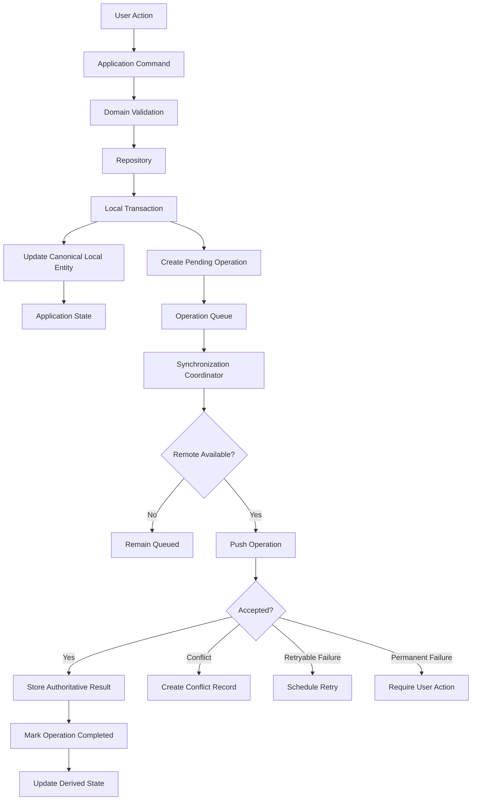

---

# Synchronization Components

Recommended components:

```text
Connectivity Monitor

Lifecycle Coordinator

Synchronization Coordinator

Operation Queue Repository

Local Entity Repository

Remote Entity Adapter

Remote Change Puller

Conflict Detector

Conflict Repository

Checkpoint Repository

Synchronization Status Store
```

---

# Connectivity Monitor

Responsible for:

- Receiving browser or native network events
- Performing lightweight remote-reachability checks when needed
- Publishing normalized connectivity state
- Avoiding excessive polling
- Distinguishing local network from remote availability

It must not:

- Modify financial records
- Retry operations directly
- Authenticate users
- Display UI messages
- Decide conflict resolution

---

# Lifecycle Coordinator

Responsible for:

- Application startup
- Background transition
- Resume
- Process-recovery triggers
- Cross-tab activity
- Synchronization suspension when necessary
- Preventing duplicate coordinators

It must not contain entity-specific financial rules.

---

# Synchronization Coordinator

Responsible for:

- Starting and stopping synchronization cycles
- Enforcing one active cycle per owner
- Reading queued operations
- Ordering operations
- Pushing mutations
- Pulling remote changes
- Updating checkpoints
- Detecting conflicts
- Applying retry policy
- Publishing status
- Preventing duplicate workers

---

# Operation Queue Repository

Responsible for:

- Persisting pending operations
- Reading operations in deterministic order
- Updating attempt metadata
- Marking completion
- Marking failure
- Marking conflict
- Preserving operation identity
- Migrating operation payloads

---

# Local Entity Repository

Responsible for:

- Storing canonical local entities
- Reading owner-scoped data
- Maintaining local technical metadata
- Applying authoritative remote results
- Applying tombstones
- Supporting atomic entity and queue transactions

---

# Remote Adapter

Responsible for:

- Sending validated remote commands
- Supplying operation identifiers
- Applying expected versions
- Mapping remote responses
- Mapping remote errors
- Respecting authentication
- Supporting cancellation
- Returning authoritative entities

---

# Conflict Detector

Responsible for:

- Comparing expected and authoritative versions
- Detecting stale updates
- Identifying changed fields
- Evaluating approved automatic-merge rules
- Producing a structured conflict

It must not choose destructive resolution silently.

---

# Checkpoint Repository

Responsible for storing progress such as:

```text
lastRemoteUpdatedAt

remoteCursor

lastSuccessfulPullAt

lastSuccessfulPushAt

schemaVersion
```

A checkpoint is owner-specific.

---

# Synchronization Status Store

Provides normalized status to the application.

Conceptual state:

```javascript
{
  ownerId: "uuid",
  status:
    "idle"
    | "offline"
    | "checking"
    | "synchronizing"
    | "pending"
    | "action_required"
    | "authentication_required"
    | "error",

  pendingCount: 0,
  conflictCount: 0,
  lastSuccessfulSyncAt: null,
  currentOperationId: null,
  errorCategory: null
}
```

---

# Sources of Synchronization Truth

Recommended hierarchy:

```text
Authoritative remote entity

+

Accepted local pending intent

↓

Canonical local projected entity

↓

Derived application state

↓

UI
```

The local display may include an optimistic projection.

That projection must preserve metadata indicating that remote confirmation is pending.

---

# Local Projected Entity

A locally edited entity may temporarily represent:

```text
Authoritative base version

+

Pending local change
```

Technical metadata should preserve:

```javascript
{
  remoteVersion: 7,
  localState: "queued",
  pendingOperationIds: ["operation-id"]
}
```

The public domain entity should remain clean of unnecessary synchronization internals.

---

# Canonical Local Record

Conceptual storage record:

```javascript
{
  ownerId: "user-id",
  entityType: "transaction",
  entityId: "transaction-id",

  entity: {
    // Canonical domain entity
  },

  remoteVersion: 7,
  localRevision: 9,

  synchronizationState: "queued",

  lastRemoteUpdatedAt: "timestamp",
  lastLocalUpdatedAt: "timestamp",

  pendingOperationIds: [
    "operation-id"
  ]
}
```

---

# Local Revision

`localRevision` may increase for every accepted local change.

It is distinct from remote entity `version`.

Example:

```text
Remote version:
7

Local revision:
9

Meaning:
Two local edits exist after remote version 7.
```

Local revision is technical metadata.

It must not be sent as authoritative entity version unless the protocol defines it.

---

# Pending Operation Contract

Conceptual structure:

```javascript
/**
 * @typedef {Object} SyncOperation
 * @property {string} operationId
 * @property {string} ownerId
 * @property {string} entityType
 * @property {string} entityId
 * @property {"create"|"update"|"delete"|"archive"|"restore"|"command"} action
 * @property {Object} payload
 * @property {number|null} baseVersion
 * @property {number} payloadSchemaVersion
 * @property {string} status
 * @property {number} attemptCount
 * @property {string} createdAt
 * @property {string|null} lastAttemptAt
 * @property {string|null} nextAttemptAt
 * @property {string|null} lastErrorCategory
 * @property {Array<string>} dependencyOperationIds
 */
```

---

# Operation Status

Recommended values:

```text
queued

processing

retry_wait

synchronized

failed

conflict

cancelled

superseded
```

---

# Queued Operation

The operation is durably stored and eligible for processing.

---

# Processing Operation

The operation is currently being attempted by the active coordinator.

A process restart must recover operations left in `processing`.

They must not remain permanently blocked.

---

# Retry-Wait Operation

A retryable failure occurred.

The operation has a future:

```text
nextAttemptAt
```

It remains pending.

---

# Synchronized Operation

The remote system confirmed the operation.

It may remain temporarily for:

- Deduplication
- Audit
- Diagnostics
- Idempotency reconciliation

It should later be removed according to retention policy.

---

# Failed Operation

A non-conflict error requires user or developer action.

Examples:

- Invalid relationship
- Unsupported currency
- Permanently missing dependency
- Rejected lifecycle transition
- Unsupported old operation payload

---

# Conflict Operation

The remote entity changed after the local operation's base version.

The operation remains preserved for review.

---

# Cancelled Operation

The user or system explicitly cancelled an operation that had not been authoritatively committed.

Cancellation must not claim success if the remote result is uncertain.

---

# Superseded Operation

A later local operation replaced an earlier unsent operation safely.

Example:

```text
Queued transaction description update:
"Market"

Later local update before synchronization:
"Supermarket"

The earlier update may be superseded by a combined operation.
```

Superseding is allowed only when no financial intent is lost.

---

# Operation Payload

The payload must contain only the intended command data.

Example update:

```javascript
{
  changes: {
    description: "Supermarket",
    categoryId: "category-id"
  },
  expectedVersion: 7
}
```

Avoid storing full unrelated application state.

---

# Operation Payload Version

Every queued payload requires:

```text
payloadSchemaVersion
```

This supports local application upgrades.

Old operations must be migrated before execution.

---

# Operation Dependencies

Some operations depend on earlier operations.

Example:

```text
Create Account

↓

Create Transaction using that Account
```

The Transaction operation depends on the Account creation operation.

Conceptual field:

```javascript
dependencyOperationIds: [
  "create-account-operation"
]
```

---

# Dependency Rules

An operation may process only when all required dependencies are:

```text
synchronized
```

or otherwise authoritatively satisfied.

If a dependency fails permanently, the dependent operation must enter an action-required state.

---

# Operation Ordering

Default ordering should use:

```text
Dependency order

↓

Creation time

↓

Stable operation identifier
```

Entity-specific rules may override simple chronological order.

---

# Same-Entity Operation Ordering

Operations for one entity must process sequentially.

Example:

```text
Create transaction

↓

Update transaction category

↓

Delete transaction
```

The update cannot process before creation.

The delete may supersede an unconfirmed create when safe.

---

# Cross-Entity Ordering

Examples:

```text
Create account
before
Create transaction using account
```

```text
Create transaction
before
Create goal contribution linked to transaction
```

```text
Commit import batch
before
Rollback import batch
```

---

# Operation Compaction

The queue may combine compatible unsent operations.

Example:

```text
Update description

+

Update category

↓

One combined update
```

Compaction must preserve:

- Latest intended field values
- Base version
- Operation traceability
- Dependency relationships
- Delete semantics
- User-visible status

---

# Safe Compaction Rules

Potentially safe:

```text
Several updates to different fields on the same unsynchronized entity
```

Potentially unsafe:

```text
Create contribution

+

Delete transaction

```

```text
Create transfer

+

Change transfer currency

```

```text
Import commit

+

Import rollback
```

High-impact commands should remain explicit.

---

# Create Followed by Delete

When an offline-created entity is deleted before it ever synchronizes:

```text
Create operation

+

Delete operation
```

may be cancelled locally if:

- No remote request succeeded.
- No dependent remote entity exists.
- No user-visible history must be preserved.
- All dependent local operations are resolved.
- The operation outcome is known.

The entity and operations may be removed according to local retention policy.

---

# Unknown Remote Outcome

A network failure after request transmission may leave the result uncertain.

Example:

```text
Request reached server.

Server committed transaction.

Response was lost.
```

The operation must not immediately retry as a new mutation.

It should reconcile through:

- `operationId`
- Remote idempotency lookup
- Entity lookup
- Version comparison
- Command-result table
- Approved RPC response recovery

---

# Idempotency Architecture

Every remotely mutating operation should include:

```text
operationId
```

The remote system must remember or recognize prior execution.

Conceptual behavior:

```text
First request with operationId
→ Execute and store result.

Repeated request with same operationId
→ Return the original accepted result.

Same operationId with different payload
→ Reject as integrity violation.
```

---

# Idempotency Record

A trusted backend may store:

```text
operation_id

user_id

operation_type

payload_fingerprint

result_reference

status

created_at
```

The exact strategy must avoid retaining unnecessary sensitive payloads.

---

# Payload Fingerprint

A payload fingerprint may detect reuse of one operation ID with different content.

It should use a deterministic canonical command representation.

The fingerprint itself is not authorization.

---

# Idempotency Scope

Operation IDs must be scoped by:

```text
Owner

Operation identifier
```

A different user must not obtain another user's prior command result.

---

# Idempotency Retention

Remote idempotency records must remain long enough to cover:

- Offline retries
- Process termination
- Mobile update delays
- Network uncertainty
- Supported client retry window

Retention must be documented.

---

# Remote Mutation Contract

Conceptual command:

```javascript
remoteTransactionService.create({
  operationId,
  ownerContext,
  transaction,
});
```

Conceptual result:

```javascript
{
  status: "accepted",
  operationId,
  entity: authoritativeTransaction
}
```

Repeated result:

```javascript
{
  status: "already_accepted",
  operationId,
  entity: authoritativeTransaction
}
```

---

# Local Mutation Flow

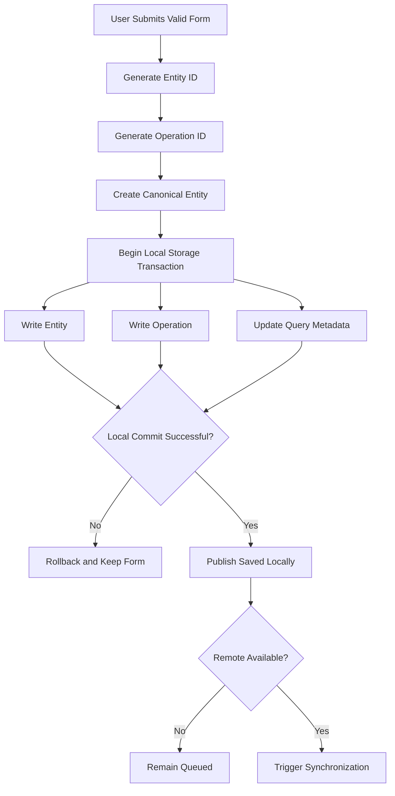

---

# Local Save Failure

If local persistence fails:

- Do not close the form.
- Do not show local success.
- Preserve input in memory when possible.
- Explain storage failure.
- Provide Retry.
- Avoid attempting remote persistence through an untracked path.
- Record safe diagnostics.

---

# Optimistic UI

Optimistic presentation may show the local projected entity immediately after durable local storage.

It must display synchronization state when relevant.

Example:

```text
Supermarket

−R$ 185,40

Waiting to synchronize
```

Optimistic UI must not imply remote confirmation.

---

# Pessimistic Operations

Some operations may require remote confirmation before local completion.

Examples:

- Account deletion
- Session revocation
- Complete data export
- Sensitive security changes
- Operations requiring server-only validation
- Cross-currency financial operation when remote rate is required

The repository strategy must identify which operations are:

```text
Offline-capable

Queueable

Online-only
```

---

# Operation Capability Classification

Every mutation should declare one of:

```text
offline_full

offline_draft_only

online_required

online_protected
```

---

## `offline_full`

The entity may be committed locally and synchronized later.

Examples may include:

- Create ordinary transaction
- Edit eligible transaction
- Categorize transaction
- Create category
- Create goal draft or supported goal

---

## `offline_draft_only`

The workflow may preserve input locally but not commit the canonical operation offline.

Examples may include:

- Complex import awaiting remote parser
- External-bank connection setup
- Server-calculated protected action

---

## `online_required`

The action requires current remote availability.

Examples:

- Server-only report
- Security session listing
- Remote attachment download
- Authentication callback

---

## `online_protected`

The action requires remote availability and stronger authentication or authorization.

Examples:

- Delete account
- Complete export
- Disable MFA
- Revoke all sessions

---

# Offline Capability Registry

Recommended conceptual registry:

```javascript
{
  "transaction.create": "offline_full",
  "transaction.update": "offline_full",
  "account.delete": "online_protected",
  "data.completeExport": "online_protected",
  "attachment.download": "online_required"
}
```

UI behavior should consume this registry rather than invent feature-specific offline assumptions.

---

# Network State Model

Recommended normalized state:

```javascript
{
  interfaceState:
    "unknown"
    | "offline"
    | "online",

  remoteState:
    "unknown"
    | "unreachable"
    | "reachable",

  authenticationState:
    "unknown"
    | "valid"
    | "expired",

  lastCheckedAt: null
}
```

---

# Browser Online Events

Browser events such as:

```text
online

offline
```

are useful hints.

They are not proof of Supabase reachability.

The application should not mark all operations synchronized because an `online` event occurred.

---

# Native Network Events

Capacitor or Android network events should be normalized through the platform adapter.

Feature modules must not subscribe directly to native network plugins.

---

# Remote Reachability Check

A lightweight remote check may occur when:

- Application starts
- Connection appears restored
- Synchronization begins
- Several remote operations fail
- Application resumes after a meaningful interval

Avoid high-frequency polling.

---

# Reachability Check Requirements

The check should:

- Use an approved endpoint.
- Require minimal response.
- Avoid exposing sensitive data.
- Respect authentication state.
- Have a short timeout.
- Avoid triggering financial mutations.
- Be cancellable.

---

# Connectivity State Transitions

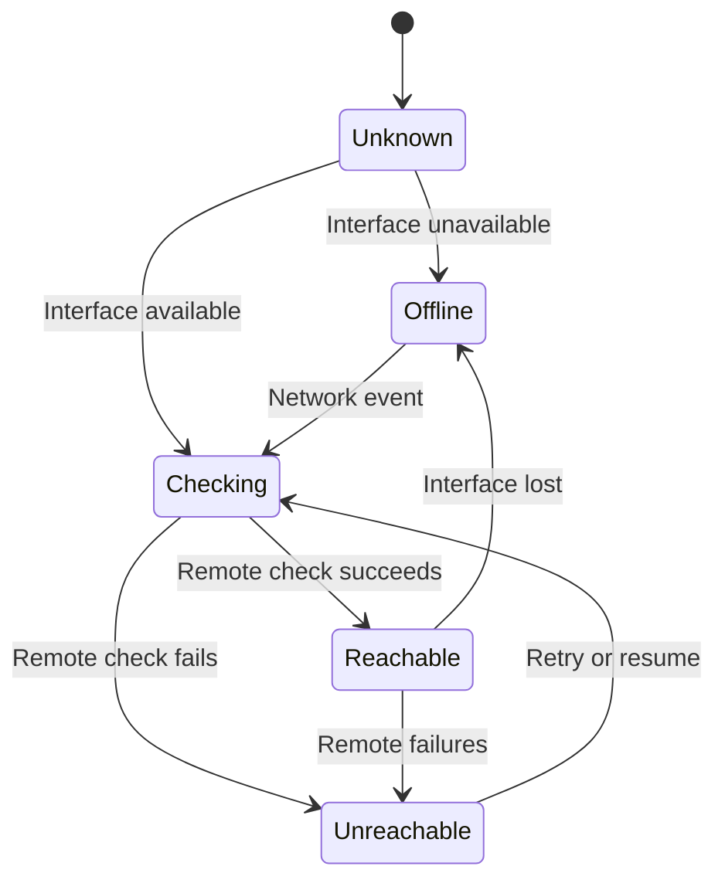

---

# Offline Indicator

The interface should display an offline indicator when meaningful.

Recommended:

```text
Offline

You can continue using saved data.

Changes will synchronize when connection returns.
```

The indicator should not block the entire application.

---

# Remote-Unreachable State

When the device has network connectivity but Nexio services are unavailable:

```text
Nexio cannot reach the synchronization service.

Your saved data remains available.
```

Avoid blaming the user's internet connection when the remote service is unavailable.

---

# Authentication-Required State

When the connection exists but the session expired:

```text
Sign in again to synchronize pending changes.

Your local changes remain saved on this device.
```

Sensitive content must follow session and lock policy.

---

# Synchronization Trigger Sources

A synchronization cycle may be triggered by:

- Successful local mutation
- Application startup
- Application resume
- Connection restoration
- Manual retry
- Pull to refresh
- Scheduled background opportunity
- Realtime notification
- Authentication restoration
- Another tab or window
- Remote push signal

Triggers must converge on one coordinator.

---

# Synchronization Lock

Only one active synchronization cycle should run per:

```text
Owner

Local application storage scope
```

This prevents:

- Duplicate remote operations
- Competing checkpoint writes
- Repeated conflict creation
- Unstable queue ordering

---

# Cross-Tab Synchronization Lock

Web environments with several tabs may use:

- Web Locks API
- BroadcastChannel coordination
- Local lease record
- Service worker coordinator

The mechanism must handle crashed or closed tabs.

---

# Synchronization Lease

A local lease may contain:

```javascript
{
  ownerId: "user-id",
  holderId: "tab-or-process-id",
  acquiredAt: "timestamp",
  expiresAt: "timestamp",
  heartbeatAt: "timestamp"
}
```

Expired leases may be reclaimed safely.

---

# Duplicate Coordinator Protection

A process must verify ownership of the synchronization lease before:

- Reading the next queue item
- Marking an operation processing
- Writing checkpoints
- Performing remote mutation
- Applying remote changes

---

# Synchronization Cycle Phases

Recommended high-level sequence:

```text
1. Validate active owner.

2. Validate session.

3. Validate remote reachability.

4. Recover interrupted operations.

5. Pull critical remote changes when required.

6. Push queued local operations.

7. Pull resulting and additional remote changes.

8. Apply tombstones.

9. Update checkpoints.

10. Recalculate derived state.

11. Publish final status.
```

---

# Push-First Versus Pull-First

The sequence may depend on the operation type and consistency need.

## Pull First

Appropriate when:

- Local operations depend on latest remote versions.
- The application resumed after a long interval.
- Realtime was unavailable.
- Conflicts are likely.
- Schema or ownership state changed.

## Push First

Appropriate when:

- Local operations are independent creates with stable IDs.
- The remote protocol is idempotent.
- Immediate upload improves durability.
- A prior pull recently completed.

The coordinator should use a documented hybrid strategy.

---

# Recommended Cycle Strategy

```text
Quick validation pull

↓

Push safe queued operations

↓

Full incremental pull

↓

Conflict and tombstone processing

↓

Checkpoint update
```

---

# Startup Synchronization

Application startup must prioritize:

```text
Protected shell

↓

Authentication

↓

Local useful data

↓

Synchronization
```

The application should not delay all content until remote completion.

---

# Startup Flow

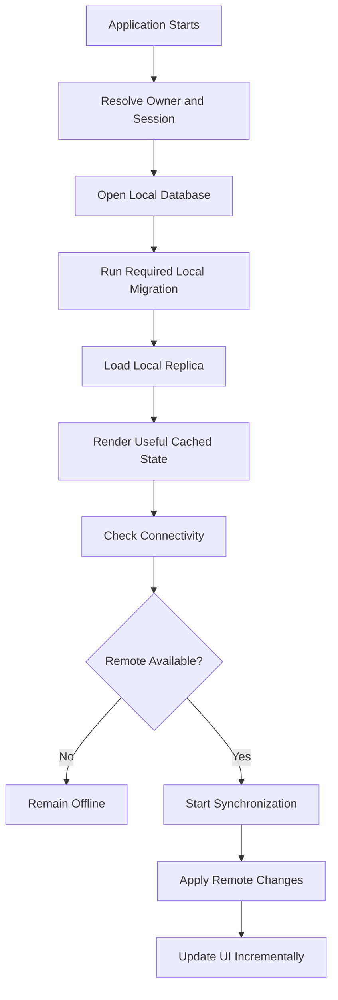

---

# Startup Data Freshness

Cached data may include:

```text
Last synchronized:
Today at 09:42
```

Freshness information should appear only when useful.

It should not overwhelm ordinary use.

---

# Cold Start Offline

When the application starts offline:

- Resolve local owner safely.
- Validate local session policy.
- Load owner-scoped local data.
- Show offline state.
- Preserve pending queue.
- Avoid clearing data because remote validation failed.
- Restrict remote-only protected operations.

---

# Cold Start with Expired Session

An expired session may require authentication before exposing local financial content according to security policy.

Pending local data must remain preserved.

The application must not:

- Delete pending operations
- Reassign them
- Synchronize them as another user
- Display them to an unauthorized user

---

# Resume Synchronization

On resume:

1. Protect the application preview.
2. Validate lock state.
3. Validate session when required.
4. Check connection.
5. Recover interrupted queue processing.
6. Refresh stale critical data.
7. Synchronize pending operations.
8. Preserve the current route and draft.

A brief background interruption should not trigger a full data reload.

---

# Background Synchronization

Background synchronization may be supported when the platform permits it.

The application must not promise continued processing when the platform cannot guarantee execution.

---

# Background Sync Requirements

Background work must:

- Use the active owner scope.
- Use a valid session.
- Respect battery and platform restrictions.
- Avoid opening UI.
- Process only safe queue operations.
- Use idempotency.
- Stop on authentication failure.
- Record accurate state.
- Avoid repeated notifications for routine success.

---

# Background Sync Limitations

Possible limitations:

- Browser closes
- Android suspends process
- Battery saver
- Network restrictions
- Session expiration
- Background execution timeout
- Storage unavailable

Pending operations must remain recoverable after interruption.

---

# Interrupted Processing Recovery

On startup or resume, operations marked:

```text
processing
```

must be evaluated.

Possible result:

```text
Remote operation confirmed
→ Mark synchronized.

Remote operation not found
→ Return to queued.

Outcome unknown
→ Reconcile through operation ID.

Conflict detected
→ Mark conflict.
```

---

# Operation Recovery Timeout

An operation must not remain in processing forever.

A processing lease may include:

```text
processingStartedAt

processingOwnerId

processingLeaseExpiresAt
```

Expired processing state may be reclaimed.

---

# Push Operation Flow

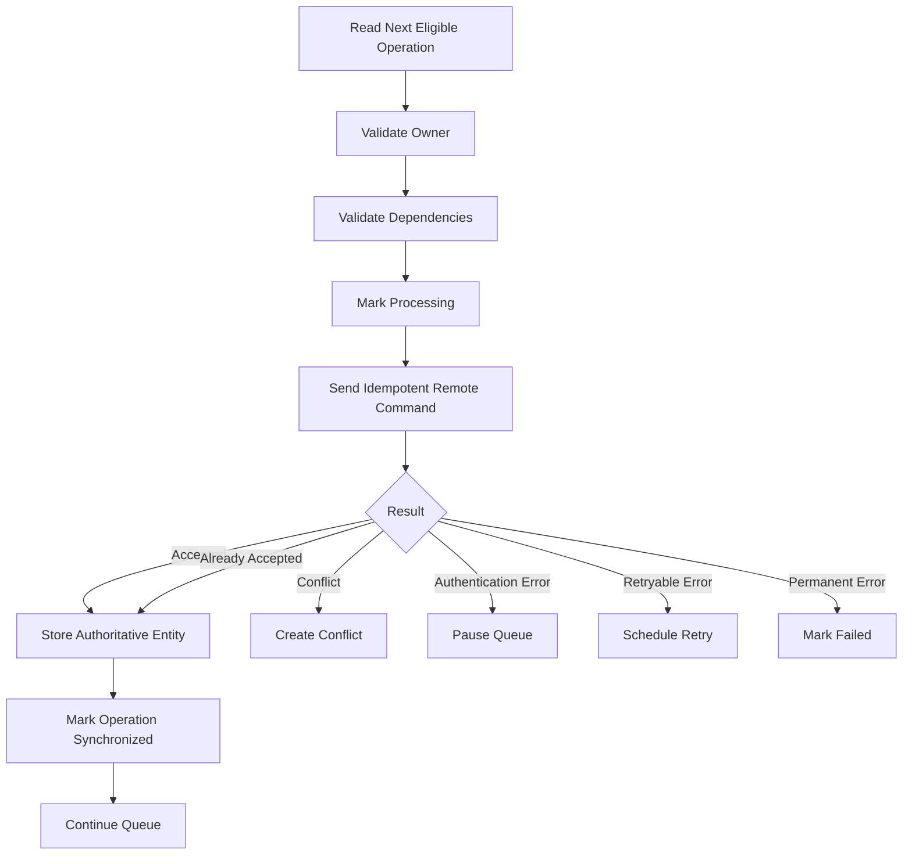

---

# Push Batch Size

The coordinator may process several operations in one cycle.

Batch size must consider:

- Network quality
- Operation dependencies
- Database transaction limits
- Mobile battery
- Error isolation
- User feedback
- Remote rate limits

Do not send the entire queue without bounds.

---

# Sequential Versus Parallel Push

Sequential processing is preferred for:

- Same entity
- Dependent operations
- Imports
- Transfers
- Deletions
- Conflict-prone updates

Limited parallel processing may be used for independent operations after careful validation.

---

# Parallelism Limits

Parallel operations must not:

- Target the same entity
- Share unresolved dependencies
- Depend on queue order
- Produce competing checkpoints
- Exceed remote limits
- create uncontrolled battery or network usage

---

# Pull Architecture

Pull retrieves remote changes since a trusted checkpoint.

Preferred characteristics:

- Incremental
- Owner-scoped
- Deterministically ordered
- Version-aware
- Tombstone-aware
- Paginated
- Restartable
- Idempotent

---

# Pull Checkpoint

Conceptual checkpoint:

```javascript
{
  ownerId: "user-id",
  cursor: {
    updatedAt: "2026-07-23T14:30:00.000Z",
    entityType: "transaction",
    entityId: "uuid"
  },
  lastSuccessfulPullAt: "timestamp"
}
```

---

# Stable Pull Ordering

Remote changes require deterministic ordering.

Example:

```text
updated_at ascending

entity_type ascending

entity_id ascending
```

The final identifier prevents ambiguous cursor boundaries.

---

# Timestamp Limitations

`updatedAt` alone may be insufficient because:

- Several rows may share the same timestamp.
- Timestamp precision may vary.
- Updates may arrive out of order.
- Deletions may use separate records.

Use a compound cursor or server change sequence when available.

---

# Change Sequence

A server-generated monotonic change sequence may provide stronger incremental synchronization.

Conceptual:

```text
change_seq:
982771
```

The client requests:

```text
changes after 982771
```

A formal change-log architecture may be introduced when required.

---

# Entity-Based Pull

Simpler implementations may pull each entity type using:

```text
updated_at

+

id
```

This requires separate checkpoints or a coordinated entity sequence.

The approach must be tested for missed changes.

---

# Pull Page Processing

For each page:

1. Validate owner context.
2. Map persistence rows.
3. Validate entity shape.
4. Compare remote version.
5. Check pending local operations.
6. Apply safe remote change.
7. Create conflict when necessary.
8. Apply tombstone.
9. Commit local page atomically.
10. Advance checkpoint only after commit.

---

# Checkpoint Atomicity

A checkpoint must not advance before all changes in the corresponding page are durably applied locally.

Forbidden:

```text
Advance checkpoint

↓

Application crashes before writing entities
```

This could permanently skip remote changes.

---

# Remote Create Intake

When a remote entity does not exist locally:

- Validate owner.
- Validate schema.
- Store canonical entity.
- Update query indexes.
- Update derived state.
- Preserve remote version.

---

# Remote Update Intake

When a remote update arrives and no local pending operation exists:

- Compare versions.
- Apply the newer authoritative entity.
- Preserve stable identity.
- Update local metadata.
- Recalculate derived state.

---

# Stale Remote Event

If the incoming remote version is older than the local known remote version:

```text
Ignore as stale
```

Safe diagnostics may record the event category.

---

# Equal Remote Version

If the same version arrives repeatedly:

- Treat it as duplicate.
- Avoid rerendering unnecessarily.
- Avoid duplicate notification.
- Preserve pending local projection if applicable.

---

# Remote Update with Local Pending Changes

When local pending changes exist:

```text
Remote base changed

↓

Evaluate automatic merge

↓

Apply safe merge

or

Create conflict
```

Automatic merge rules must be entity- and field-specific.

Detailed conflict behavior belongs in Part 2.

---

# Remote Deletion Intake

When a remote tombstone arrives:

- Validate owner.
- Identify the entity.
- Check pending local operations.
- Apply deletion when safe.
- Create conflict when local unsynchronized intent exists.
- Remove from active queries.
- Preserve required tombstone metadata.
- Recalculate derived state.

---

# Remote Deletion Without Local Change

Safe behavior:

```text
Remove entity from active local state.

Preserve tombstone.

Remove from active query results.

Preserve historical snapshot only when required.
```

---

# Remote Deletion with Local Update

Example:

```text
Device A deletes transaction.

Device B edits it offline.
```

The update must not automatically recreate or overwrite the deletion.

Create a conflict requiring user review.

---

# Reconnection Architecture

Reconnection is a synchronization trigger.

It is not itself proof of success.

---

# Reconnection Flow

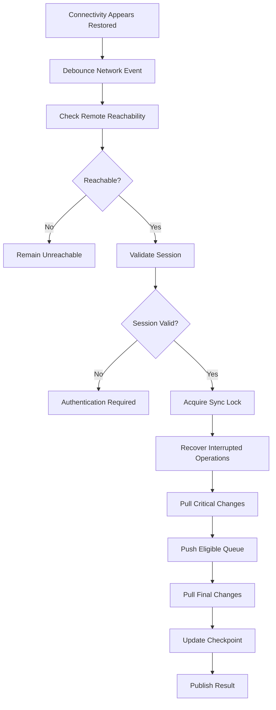

---

# Reconnection Debounce

Network events may fire repeatedly.

The coordinator should debounce or coalesce them.

Avoid starting several synchronization cycles from one physical connection change.

---

# Reconnection User Experience

Routine success may use a subtle update:

```text
Synchronized
```

or no interruption.

When pending work remains:

```text
2 changes still need attention.
```

When authentication is required:

```text
Sign in again to synchronize 3 saved changes.
```

---

# Manual Synchronization

A manual Retry or Refresh action may trigger a cycle.

It must:

- Avoid duplicate workers.
- Preserve queue ordering.
- Respect retry timing when needed.
- Explain authentication requirements.
- Not clear failed operations automatically.
- Not create duplicate records.

---

# Pull to Refresh

Pull to refresh may:

- Check remote changes
- Process pending queue
- Update the current feature

It should not:

- Delete cached content
- Reset filters
- Reset scroll
- Restart all application services
- claim success before processing ends

---

# Retry Policy

Retry applies only to retryable failures.

Potential retryable categories:

```text
network

timeout

temporary_remote_unavailable

rate_limited

temporary_storage_failure

server_overload
```

Potential non-retryable categories:

```text
validation

authorization

unsupported_operation

invalid_relationship

permanent_not_found

schema_incompatible
```

Conflict uses a separate path.

---

# Exponential Backoff

Recommended conceptual delay:

```text
baseDelay × 2^attempt
```

with:

- Maximum delay
- Random jitter
- Server `Retry-After` support
- Reset after success

---

# Retry Example

```text
Attempt 1:
5 seconds

Attempt 2:
10 seconds

Attempt 3:
20 seconds

Attempt 4:
40 seconds

Maximum:
Configured upper limit
```

Exact values belong to implementation configuration.

---

# Retry Jitter

Jitter prevents many clients from retrying simultaneously.

Conceptual:

```text
calculated delay

±

small random variation
```

---

# Retry Count

A retryable operation should not become invisible after many failures.

After a configured threshold:

- Continue controlled background retries where appropriate.
- Mark user-visible attention when useful.
- Preserve operation.
- Provide manual Retry.
- Record safe diagnostics.

---

# Rate-Limit Response

When the server requests a delay:

- Respect `Retry-After` or equivalent metadata.
- Do not retry immediately.
- Avoid displaying technical rate-limit details.
- Preserve queued state.

---

# Authentication Failure During Sync

On authentication failure:

1. Stop pushing operations.
2. Do not mark operations failed permanently.
3. Preserve queue.
4. Protect local content according to session policy.
5. Request sign-in.
6. Resume only after the same owner is authenticated.

---

# Authorization Failure During Sync

An authorization denial requires investigation.

Possible causes:

- Entity no longer belongs to user
- Session owner mismatch
- RLS change
- Corrupted local operation
- Account deletion
- Security incident

The operation should become:

```text
failed
```

or:

```text
action_required
```

It must not retry indefinitely.

---

# Validation Failure During Sync

A previously valid local operation may become invalid because:

- Related account was archived remotely.
- Category was deleted.
- Currency configuration changed.
- Domain rule changed.
- Old application version created unsupported payload.

The operation must remain preserved for correction or explicit discard.

---

# Missing Dependency

Example:

```text
Queued transaction references an account deleted remotely.
```

The application may offer:

- Choose another account
- Restore the account when permitted
- Discard the local transaction
- Save as draft
- Review remote deletion conflict

---

# Local Queue Visibility

Users should be able to understand unresolved changes.

Possible screen:

```text
Pending changes

3 waiting to synchronize

1 needs review
```

---

# Queue Item Presentation

Use user-facing descriptions.

Good:

```text
Expense “Supermarket” is waiting to synchronize.
```

Bad:

```text
PATCH operation 91c failed with 409.
```

---

# Queue Item Actions

Depending on state:

```text
Retry

Review

Edit

Discard local change

Compare versions

Open affected item
```

Destructive discard requires confirmation.

---

# Discarding a Pending Create

Discarding an unsynchronized create may remove the local entity when:

- It was never committed remotely.
- No dependent operations remain.
- The remote outcome is known.
- User confirms.

---

# Discarding a Pending Update

Discarding a local update should restore the last authoritative remote version.

The user must understand that local changes will be lost.

---

# Discarding a Pending Delete

Discarding a local delete should restore the entity to active local state when the remote deletion was not accepted.

---

# Unknown Outcome Discard

An operation with uncertain remote outcome cannot be discarded blindly.

The application must reconcile first.

---

# Synchronization UI States

Recommended visible states:

```text
Synchronized

Synchronizing

Offline

Changes pending

Needs attention

Sign-in required
```

---

# Synchronized State

Means:

- No unresolved eligible local operations
- Latest required remote changes processed
- Session valid during the completed cycle
- No known conflict

It does not guarantee that every external service in the world is current.

---

# Synchronizing State

Should indicate active work without blocking ordinary navigation.

Example:

```text
Synchronizing changes…
```

---

# Changes-Pending State

Example:

```text
3 changes waiting to synchronize.
```

This may occur while offline or during retry wait.

---

# Needs-Attention State

Example:

```text
One transaction needs review before it can synchronize.
```

The action should open the relevant queue or conflict screen.

---

# Status Placement

Synchronization status may appear in:

- Application shell
- Settings
- Account or profile menu
- Queue screen
- Affected entity row
- Non-intrusive banner

Do not place a large persistent alert on every screen for routine pending work.

---

# Entity-Level Status

An affected transaction may show:

```text
Waiting to synchronize

Synchronization failed

Conflict
```

Entity status must remain separate from the transaction's financial status.

---

# Accessibility of Sync Status

Status must:

- Use text, not color alone.
- Provide an accessible label.
- Announce important changes appropriately.
- Avoid repeated live-region announcements.
- Remain understandable with hidden financial values.
- Support keyboard and touch.

---

# Privacy and Sync Status

Privacy mode may hide amounts.

It should not hide synchronization state.

Example:

```text
Transaction amount hidden

Waiting to synchronize
```

---

# Offline Read Strategy

Offline reads should return:

- Canonical local entities
- Query metadata
- Data freshness
- Pending local projections
- Tombstone-aware results

They must not return records belonging to another owner.

---

# Local Query Consistency

When a local operation changes an entity:

- Active queries should update immediately.
- Derived state should recalculate.
- Pagination metadata should remain valid.
- Filters should remain applied.
- Deleted records should disappear from active results.
- Conflicts should remain discoverable.

---

# Local Search

Offline search may operate on locally cached fields.

The UI should not claim complete search coverage when only part of the remote dataset exists locally.

Example:

```text
Searching saved data on this device.
```

---

# Partial Local Dataset

If Nexio does not cache the complete history:

- The application must know the cached range.
- Reports must identify incomplete coverage.
- Search must communicate scope.
- Offline totals must not pretend to include unavailable records.

---

# Local Coverage Metadata

Conceptual:

```javascript
{
  entityType: "transaction",
  ownerId: "user-id",
  coverage: {
    startDate: "2025-01-01",
    endDate: "2026-07-23",
    complete: false
  }
}
```

---

# Offline Reports

Reports may be available offline only when required source data exists locally.

Possible states:

```text
Complete offline report

Partial offline report

Unavailable offline
```

The interface must communicate the correct state.

---

# Offline Dashboard

The dashboard may use cached:

- Account balances
- Period summaries
- Recent transactions
- Goal progress
- Upcoming obligations

It should identify stale or partial data when meaningful.

---

# Offline Attachments

Attachment metadata may be cached while file content is unavailable.

Possible state:

```text
Attachment available online only.
```

Do not show a broken preview as a generic application error.

---

# Offline Notifications

In-app notifications may remain cached.

Opening a target may fail when the target was not cached.

The application should explain:

```text
Connect to load this item.
```

---

# Local Deletion

An offline delete may:

- Mark entity locally deleted.
- Create a pending delete operation.
- Remove it from active queries.
- Preserve undo according to policy.
- Preserve tombstone metadata.

---

# Delete Undo Before Sync

If the user selects Undo before remote synchronization:

- Cancel or supersede the delete operation.
- Restore the local entity.
- Restore affected queries.
- Avoid sending the deletion.

---

# Delete Undo After Sync

If the deletion already synchronized, Undo may require:

- Restore command
- New operation ID
- Authorization
- Dependency validation
- Entity version handling

It is not cancellation of the original operation.

---

# Archive Synchronization

Archive should use an explicit mutation.

It must not be represented as deletion.

An archived entity remains available for historical relationships.

---

# Recurring Rules Offline

Offline edits to recurring rules require special care.

The application must avoid duplicate occurrence generation across devices.

Recommended behavior:

- Recurring-generation authority belongs to one trusted service or deterministic occurrence protocol.
- Offline devices may edit the rule.
- They should not independently generate authoritative duplicate transactions without occurrence identity.

---

# Recurring Occurrence Idempotency

Occurrence identity should include:

```text
ruleId

occurrenceDate
```

or a stable occurrence UUID.

The remote system enforces uniqueness.

---

# Import Offline Behavior

Possible support levels:

```text
Select and parse locally

Map and review locally

Commit locally

Commit remotely
```

The implemented level must be explicit.

Large or server-validated imports may be:

```text
offline_draft_only
```

---

# Import Queueing

A confirmed import batch must use a stable:

```text
importBatchId

operationId
```

Retry must not duplicate imported transactions.

---

# Goal Contribution Offline

A goal contribution may be queued when:

- Funding mode supports local contribution.
- Related goal exists locally.
- Currency is valid.
- Linked transaction rules are satisfied.

If it references a new transaction, dependency ordering is required.

---

# Cross-Device Consistency

Several devices may independently:

- Create entities
- Update entities
- Delete entities
- Archive entities
- Change preferences
- Mark notifications read

Synchronization must produce understandable convergence.

---

# Eventual Consistency

Nexio may use eventual consistency for ordinary offline-capable changes.

This means devices may temporarily display different states.

They should converge after:

- Connectivity
- Authentication
- Successful synchronization
- Conflict resolution

---

# Stronger Consistency Operations

Some operations require remote transactional consistency.

Examples:

- Account deletion
- Category merge
- Import commit
- Recurring occurrence generation
- Security-setting change
- Complete export request
- Cross-currency conversion using authoritative rate

These operations may be online-only.

---

# Convergence Requirements

After all operations synchronize and conflicts are resolved:

- Every device should contain the same authoritative entity versions.
- Deleted entities should be removed from active state.
- Pending operation queues should be empty.
- Derived financial totals should match.
- Notification read state should follow the selected merge rule.
- No duplicate entity should exist for one operation.

---

# Sync Schema Compatibility

Synchronization protocols must support versioning.

Potential versions:

```text
Entity schema version

Operation payload version

Local database version

Remote API version

Synchronization protocol version
```

These are distinct.

---

# Protocol Version

A request may include:

```text
syncProtocolVersion
```

The remote system may reject unsupported versions safely.

---

# Older Client Behavior

When an older client receives an unknown field:

- Repository mapper should ignore safe additive fields.
- Unknown required enum values must not silently default.
- Unsupported high-impact entities may require update.
- Operations must remain preserved.

---

# Minimum Supported Client

The backend may define a minimum supported application version when continued operation would be unsafe.

The user should receive:

```text
Update Nexio to continue synchronizing securely.
```

Local pending changes must remain protected during update.

---

# Forced Update Safety

A forced update must not:

- Clear local data
- Delete pending operations
- Reassign owner state
- Remove recoverable drafts
- Prevent data migration after installation

---

# Synchronization Error Taxonomy

Recommended categories:

```text
offline

remote_unreachable

authentication

authorization

validation

conflict

dependency

rate_limit

timeout

local_storage

remote_storage

schema_incompatible

operation_unknown

unknown
```

---

# Error Recoverability

Each error should declare:

```text
retryable

user_action_required

authentication_required

conflict_review

permanent

unknown_outcome
```

---

# Safe Error Mapping

Raw errors from:

- Supabase
- PostgreSQL
- Browser storage
- Capacitor
- Android
- Network stack

must map to the Nexio taxonomy.

---

# User-Facing Error Examples

## Offline

```text
This change is saved on your device and will synchronize later.
```

## Session Expired

```text
Sign in again to synchronize your saved changes.
```

## Conflict

```text
This transaction changed on another device and needs review.
```

## Invalid Dependency

```text
Choose another account before synchronizing this transaction.
```

## Local Storage Failure

```text
Nexio could not save this change on your device.

Your form remains open.
```

---

# Synchronization Logging

Safe synchronization diagnostics may include:

```text
Operation type

Entity type

Operation ID

Owner-scoped protected reference

Attempt count

Duration

Result category

Conflict category

Queue size

Protocol version

Application version
```

---

# Prohibited Synchronization Logs

Do not log:

- Amount
- Description
- Notes
- Full operation payload
- Authentication token
- Raw database response
- Imported row
- Attachment contents
- Account identifier
- Signed URL

---

# Synchronization Metrics

Potential metrics:

```text
Pending-operation count

Average synchronization delay

Retry count

Conflict rate

Authentication-paused queue count

Failed-operation count

Pull duration

Push duration

Queue recovery count

Duplicate-operation prevention count
```

Metrics must not contain raw financial content.

---

# Synchronization Alerts

Operational alerts may detect:

- Widespread authentication failures
- Queue processing halted
- High conflict rate after release
- Idempotency failures
- Duplicate transaction increase
- Remote pull checkpoint failures
- Local migration failures
- Operation schema incompatibility
- Tombstone processing failure

---

# Offline Foundation Anti-Patterns

The following are prohibited:

## In-Memory Success

Displaying local success before durable storage commit.

## Local Equals Remote

Treating local persistence as cloud synchronization.

## Entity ID Replacement

Generating a new remote entity ID after offline creation.

## Mutation Without Operation ID

Sending retryable financial writes without idempotency identity.

## Non-Atomic Local Write

Updating an entity without storing its operation in the same transaction.

## Blind Retry

Repeating an uncertain mutation without reconciliation.

## Infinite Immediate Retry

Retrying continuously without backoff.

## UI-Owned Synchronization

Allowing screens to execute independent queue processing.

## Multiple Coordinators

Running competing sync workers for the same owner and local database.

## Timestamp-Only Unsafe Cursor

Using a non-unique timestamp cursor that may skip changes.

## Checkpoint Before Commit

Advancing remote progress before local entity writes complete.

## Cross-User Queue

Using one unscoped queue for several authenticated owners.

## Last-Write-Wins by Default

Silently replacing financial edits with whichever device wrote last.

## Hidden Conflict

Marking an operation synchronized after discarding local intent.

## Transfer Duplication

Sending transfer sides as independent unlinked retries.

## Recurrence Without Occurrence Identity

Allowing several devices to generate the same recurring transaction.

## LocalStorage Financial Queue

Using one large `localStorage` JSON object as the synchronization database.

## Network Event as Proof

Assuming browser `online` means Supabase is reachable.

## Full Reload on Reconnection

Resetting the complete application after network restoration.

## Pending Queue Deletion on Sign-Out

Removing unsynchronized changes without explicit policy and warning.

## Sensitive Payload Logging

Logging operation payloads for debugging.

---

# Offline Foundation Review Questions

Before making a feature offline-capable, answer:

```text
What is the canonical local entity?

Can the entity receive a permanent ID before remote creation?

Which mutation capability classification applies?

What is the operation ID?

What is the base entity version?

Which dependencies exist?

Can operations be compacted safely?

What proves remote acceptance?

How is uncertain outcome reconciled?

Which errors are retryable?

Which errors require user action?

What happens after process termination?

What happens after sign-out?

What happens after account switching?

What happens when the related entity changes remotely?

How is conflict detected?

Which local and remote schema versions apply?

What user-facing status appears?
```

---

# Offline Foundation Acceptance Criteria

The offline and synchronization foundation is accepted only when:

```text
□ Offline is treated as a supported application state.

□ Local save and remote synchronization remain distinct.

□ Offline-created entities receive stable permanent identifiers.

□ Every remote mutation has a stable operation identifier.

□ Entity and queue writes are locally atomic.

□ Operations are idempotent remotely.

□ Pending operations remain owner-scoped.

□ One synchronization coordinator operates per owner and storage scope.

□ Network interface state and remote reachability remain distinct.

□ Startup loads useful local data before waiting for full synchronization.

□ Reconnection does not reset the active workflow.

□ Interrupted processing can recover after process termination.

□ Unknown remote outcomes are reconciled before retry.

□ Operation dependencies are explicit.

□ Same-entity operations preserve order.

□ Safe operation compaction is documented.

□ Retry uses bounded exponential backoff and jitter.

□ Authentication failure pauses rather than destroys the queue.

□ Permanent validation failures require user action.

□ Pull processing uses stable pagination or change sequence.

□ Checkpoints advance only after local atomic commit.

□ Remote tombstones synchronize deletion.

□ Remote deletion with local edits creates conflict.

□ Partial local datasets communicate coverage.

□ Entity synchronization status remains separate from financial status.

□ Offline reports identify complete, partial or unavailable coverage.

□ Recurring generation uses occurrence identity.

□ Imports use stable batch and operation identities.

□ Logs exclude financial payloads.

□ Synchronization metrics use safe metadata.

□ Old operation payloads support migration.

□ Published older clients remain compatible or receive a safe update path.
```

---

# Offline Constitutional Rule

Every offline and synchronization decision must answer:

```text
Can this financial change survive connection loss, retries, process termination, multiple devices and application updates without duplication, silent loss or unauthorized ownership?
```

When the answer is unclear, prefer the implementation that:

- Persists locally before reporting success.
- Uses stable entity and operation identities.
- Separates local and remote state.
- Uses atomic writes.
- Retries idempotently.
- Preserves operation ownership.
- Detects stale versions.
- Exposes conflicts.
- Advances checkpoints only after commit.
- Preserves user intent.
- Uses explicit dependencies.
- Fails safely.
- Remains recoverable after interruption.
- Produces testable synchronization states.

Offline capability is not the absence of a network request.

It is the controlled preservation of financial intent until authoritative consistency can be restored.

---
---

# Conflict Resolution Architecture

A synchronization conflict occurs when local intent can no longer be applied safely to the current authoritative entity without review or an approved deterministic merge.

Typical causes:

- The same entity changed on another device.
- The entity was deleted remotely while edited locally.
- A related Account or Category changed remotely.
- A queued operation was created from an outdated entity version.
- A recurring rule changed while an occurrence was being generated.
- An imported transaction was edited after import confirmation.
- A local operation depends on an entity that no longer exists.
- A security or ownership rule changed before synchronization.

Conflicts are expected in a multi-device offline system.

They are not exceptional programming crashes.

They must be represented, stored, displayed and resolved deliberately.

---

# Conflict Constitutional Principles

## Preserve Both Sides

When a conflict is detected, Nexio must preserve:

```text
Local intended change

Authoritative remote state

Base state when available

Conflict metadata
```

The application must not discard either side before resolution.

---

## Do Not Silently Overwrite Financial Intent

Last-write-wins is forbidden as a default strategy for:

- Transaction amount
- Transaction type
- Transaction date
- Account
- Transfer direction
- Currency
- Goal contribution
- Account deletion
- Category merge
- Import commit
- Recurring occurrence generation

Automatic resolution is allowed only when the merge is deterministic and cannot change financial meaning unexpectedly.

---

## Conflict Is Separate from Failure

A conflict means:

```text
The operation may still be valid,
but the base state changed.
```

A permanent validation failure means:

```text
The operation is no longer valid in its current form.
```

These states require different user experiences.

---

## Conflict Resolution Creates a New Operation

Resolving a conflict should normally create a new operation with:

- New `operationId`
- Latest authoritative base version
- Explicit resolved payload
- Reference to the previous conflict
- Preserved ownership

The original conflicting operation should become:

```text
resolved

superseded

or

cancelled
```

It must not be mutated into an unrelated command without traceability.

---

## Automatic Merge Must Be Field-Specific

A generic object merge such as:

```javascript
{
  ...remoteEntity,
  ...localEntity
}
```

is forbidden.

Merge logic must understand:

- Entity type
- Field meaning
- Field dependencies
- Financial impact
- Version history
- Deletion state
- User intent

---

# Conflict Record

A durable conflict record may use the following conceptual structure:

```javascript
/**
 * @typedef {Object} SyncConflict
 * @property {string} conflictId
 * @property {string} ownerId
 * @property {string} entityType
 * @property {string} entityId
 * @property {string} operationId
 * @property {number|null} baseVersion
 * @property {Object|null} baseEntity
 * @property {Object|null} localIntent
 * @property {Object|null} remoteEntity
 * @property {Array<ConflictField>} fields
 * @property {string} conflictType
 * @property {"open"|"resolving"|"resolved"|"discarded"} status
 * @property {string} createdAt
 * @property {string|null} resolvedAt
 * @property {string|null} resolutionOperationId
 */
```

---

# Conflict Field

Conceptual structure:

```javascript
{
  field: "amount",
  baseValue: {
    currency: "BRL",
    minorUnits: 18540
  },
  localValue: {
    currency: "BRL",
    minorUnits: 21000
  },
  remoteValue: {
    currency: "BRL",
    minorUnits: 19500
  },
  resolution:
    "automatic_local"
    | "automatic_remote"
    | "manual"
    | "not_applicable"
}
```

Sensitive values inside a conflict record must follow normal owner and storage protection.

---

# Conflict Types

Recommended conflict types:

```text
concurrent_update

remote_delete_local_update

local_delete_remote_update

relationship_changed

dependency_deleted

currency_changed

entity_archived

duplicate_create

operation_already_applied_different_payload

schema_incompatible

recurring_occurrence_collision

import_batch_changed

ownership_invalid

unknown_remote_outcome
```

---

# Concurrent Update

Occurs when:

```text
Local operation base version:
7

Authoritative remote version:
8
```

The system must compare changed fields.

---

# Remote Delete and Local Update

Occurs when one environment deletes an entity while another edits it offline.

Example:

```text
Device A deletes a transaction.

Device B changes its category offline.
```

The application must not restore the transaction automatically.

---

# Local Delete and Remote Update

Occurs when the local user deleted an entity offline while another device updated it.

The conflict requires a decision between:

```text
Keep the remote entity

or

Apply deletion to the latest remote version
```

---

# Relationship Changed

Occurs when the transaction itself may be unchanged remotely, but one of its relationships changed.

Examples:

- Account archived
- Category merged
- Goal deleted
- Recurring rule paused
- Linked transaction cancelled

---

# Dependency Deleted

Occurs when an operation references an entity deleted remotely.

Example:

```text
Local queued expense

references

Account deleted on another device
```

The transaction cannot synchronize until another valid account is selected or the local operation is discarded.

---

# Duplicate Create

May occur when:

- The same user action produced two different operation IDs.
- A legacy client retried without stable idempotency.
- An import generated equivalent rows.
- Two devices independently created the same intended logical item.

Duplicate create is not always a version conflict.

It may require duplicate detection and user review.

---

# Idempotency Integrity Conflict

Occurs when the same `operationId` is reused with a different payload.

Required response:

- Reject the operation.
- Preserve diagnostics.
- Stop automatic retry.
- Treat as integrity violation.
- Require investigation or local operation regeneration.

The remote system must not choose one payload arbitrarily.

---

# Conflict Detection Flow

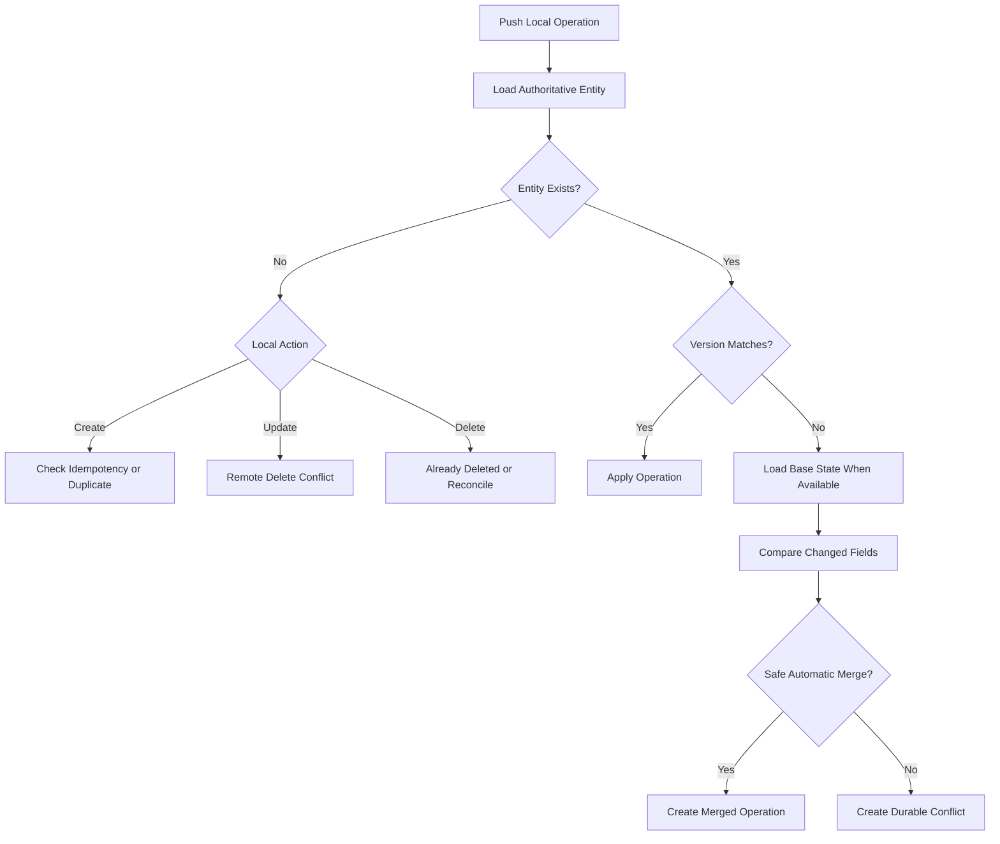

---

# Three-Way Merge

A reliable merge should compare:

```text
Base entity

Local intent

Remote entity
```

This is a three-way merge.

Without the base state, it may be impossible to determine which side changed a field.

---

# Three-Way Comparison

For each field:

```text
Base equals local
and
remote differs
→ Only remote changed.

Base equals remote
and
local differs
→ Only local changed.

Local equals remote
→ Both reached same result.

All differ
→ Direct conflict.
```

---

# Three-Way Merge Example

Base:

```javascript
{
  description: "Market",
  categoryId: "food",
  notes: null
}
```

Local:

```javascript
{
  description: "Supermarket",
  categoryId: "food",
  notes: null
}
```

Remote:

```javascript
{
  description: "Market",
  categoryId: "groceries",
  notes: null
}
```

Safe merged result:

```javascript
{
  description: "Supermarket",
  categoryId: "groceries",
  notes: null
}
```

The fields changed independently.

---

# Direct Conflict Example

Base:

```javascript
{
  amount: BRL 185.40
}
```

Local:

```javascript
{
  amount: BRL 210.00
}
```

Remote:

```javascript
{
  amount: BRL 195.00
}
```

Automatic choice is forbidden.

The user must review both values.

---

# Missing Base State

When the base entity is unavailable:

- Use recorded changed-field metadata when reliable.
- Compare operation payload with current remote entity.
- Avoid automatic merge of sensitive fields.
- Prefer conflict review.
- Record that the base could not be reconstructed.

The absence of base state must not become permission to overwrite.

---

# Changed-Field Tracking

Queued updates should preserve the fields intentionally changed.

Conceptual payload:

```javascript
{
  changes: {
    categoryId: "new-category"
  },
  changedFields: [
    "categoryId"
  ],
  expectedVersion: 7
}
```

This supports safer merge than sending an entire stale entity.

---

# Patch-Based Operations

Updates should normally use explicit patches.

Preferred:

```javascript
{
  description: "Supermarket"
}
```

Avoid:

```javascript
{
  // Complete stale transaction object
}
```

unless the command explicitly requires full replacement.

---

# Merge Result Validation

Every automatically or manually merged entity must pass:

1. Structural validation
2. Ownership validation
3. Relationship validation
4. Currency validation
5. Domain invariant validation
6. Lifecycle validation
7. Latest concurrency validation

A syntactically merged object is not automatically valid.

---

# Automatic Merge Policy

Every entity should define fields as:

```text
Automatically mergeable

Conditionally mergeable

Manual review required

Never mergeable
```

---

# Common Metadata Merge Rules

Potential automatic behavior:

| Field | Default Strategy |
|---|---|
| `updatedAt` | Remote authoritative value after accepted operation |
| `version` | Latest authoritative version |
| `createdAt` | Preserve authoritative creation value |
| `source` | Preserve original source |
| `deletedAt` | Deletion conflict rules |
| `archivedAt` | Lifecycle conflict rules |
| `ownerId` | Never merge; must remain authenticated owner |

---

# Transaction Merge Policy

Transaction fields require strict treatment.

| Field | Default Conflict Policy |
|---|---|
| `description` | Merge when only one side changed |
| `notes` | Merge when only one side changed; manual when both changed |
| `categoryId` | Merge when only one side changed and Category remains valid |
| `transactionDate` | Manual review when both changed |
| `amount` | Manual review when both changed |
| `type` | Manual review |
| `accountId` | Manual review when both changed |
| `sourceAccountId` | Manual review |
| `destinationAccountId` | Manual review |
| `currency` | Never merge automatically |
| `status` | State-transition-specific review |
| `recurringRuleId` | Conditional domain review |
| `originalTransactionId` | Never change casually |
| `importBatchId` | Preserve immutable origin |

---

# Transaction Description Merge

Safe automatic merge:

```text
Local changed description.

Remote changed category.

No shared field conflict.
```

Unsafe:

```text
Both changed description differently.
```

The conflict screen should show both complete descriptions.

---

# Transaction Notes Merge

Text notes should not use automatic line-based source-code merge by default.

Financial notes may contain:

- Personal explanation
- Payment reference
- Important context

When both sides changed:

- Show local note
- Show remote note
- Allow user to choose or create a combined note
- Do not silently concatenate

---

# Transaction Category Merge

Automatic local Category application may occur only when:

- Remote did not change Category.
- Category still exists.
- Category belongs to owner.
- Category compatibility remains valid.
- Category is not deleted.
- Archive rules permit the operation.

---

# Transaction Amount Conflict

Amount conflicts require manual selection.

Conflict presentation:

```text
Amount changed on two devices

Saved on this device:
R$ 210,00

Latest synchronized value:
R$ 195,00
```

Actions:

```text
Use R$ 210,00

Keep R$ 195,00

Edit amount
```

The exact selection must create a new validated operation.

---

# Transaction Type Conflict

Changing type may alter:

- Account requirements
- Category compatibility
- Report totals
- Transfer fields
- Sign semantics

Type conflicts require a full transaction review, not a small field selector.

---

# Transaction Account Conflict

When both sides changed Account:

- Show both account names.
- Protect account identifiers.
- Validate current account lifecycle.
- Recalculate currency compatibility.
- Require explicit selection.

---

# Transfer Conflict

Transfer changes affect two accounts.

Any concurrent changes to:

- Amount
- Source Account
- Destination Account
- Currency
- Date
- Status

should require manual review unless only one side changed a non-financial descriptive field.

A transfer must remain one atomic entity.

---

# Transaction Status Conflict

Status transitions require domain-specific resolution.

Examples:

```text
Local:
completed → cancelled

Remote:
completed → pending
```

The application must not select the newest timestamp automatically.

It must validate allowed transitions and financial effect.

---

# Account Merge Policy

| Field | Default Policy |
|---|---|
| `name` | Merge when only one side changed |
| `institutionName` | Merge when only one side changed |
| `maskedIdentifier` | Manual when both changed |
| `icon` | Last explicit user choice may merge when independent |
| `colorToken` | Merge when only one side changed |
| `includeInNetWorth` | Manual when both changed |
| `openingBalance` | Manual review |
| `openingBalanceDate` | Manual review |
| `currency` | Never automatic |
| `type` | Manual review |
| `classification` | Never independent of type |
| `creditLimit` | Manual review |
| `archivedAt` | Lifecycle conflict rules |
| `deletedAt` | Deletion conflict rules |

---

# Account Currency Conflict

Currency changes are high impact.

An existing Account currency should normally be immutable after financial records exist.

If a legacy or exceptional workflow permits change, synchronization must require:

- No incompatible transactions
- Explicit conversion strategy
- Full validation
- Online authoritative operation

It must not merge offline automatically.

---

# Opening Balance Conflict

Concurrent opening-balance changes affect all historical balances.

Required resolution:

- Show both values and dates.
- Explain impact.
- Require explicit choice.
- Recalculate affected summaries after acceptance.
- Preserve audit metadata.

---

# Category Merge Policy

| Field | Default Policy |
|---|---|
| `name` | Merge when only one side changed |
| `icon` | Merge when only one side changed |
| `colorToken` | Merge when only one side changed |
| `sortOrder` | Apply ordering strategy |
| `transactionCompatibility` | Manual review |
| `parentCategoryId` | Manual review and cycle validation |
| `archivedAt` | Lifecycle rules |
| Merge command | Online transactional operation |

---

# Category Rename Conflict

When both sides rename differently:

```text
Local:
Food and Dining

Remote:
Meals
```

The user chooses or enters a new name.

Historical identity remains the same Category ID.

---

# Category Parent Conflict

Concurrent hierarchy changes require:

- Cycle validation
- Depth validation
- Compatibility validation
- Archived-parent validation

Automatic object merge is forbidden.

---

# Category Reordering Conflict

Reordering is usually lower risk than financial-value changes.

Possible strategy:

- Use fractional or position keys.
- Apply the latest explicit user ordering operation.
- Recompute stable order.
- Avoid conflict dialog unless order cannot be reconciled.

Ordering must not affect Category identity or transaction classification.

---

# Category Merge Command Conflict

Category merge is a high-impact online command.

If the source or destination changed before execution:

- Stop commit.
- Reload both Categories.
- Show affected transaction counts.
- Require review.
- Submit a new command with current versions.

---

# Goal Merge Policy

| Field | Default Policy |
|---|---|
| `name` | Merge when only one side changed |
| `notes` | Manual when both changed |
| `targetAmount` | Manual review |
| `targetDate` | Manual when both changed |
| `fundingMode` | Manual review |
| `linkedAccountId` | Manual review |
| `status` | State-specific review |
| Contributions | Additive only with unique contribution IDs |

---

# Goal Contribution Merge

Contributions are distinct entities.

Independent contribution creates may coexist when they have unique IDs and are not duplicates.

Do not merge two contributions by adding their amounts simply because they occurred near the same time.

---

# Goal Contribution Duplicate Detection

Potential duplicate signals:

- Same Goal
- Same amount
- Same date
- Same linked transaction
- Same operation ID
- Same import origin

Only operation identity or explicit relationship can prove duplication reliably.

Similarity requires review.

---

# Goal Target Conflict

When both devices changed target amount:

- Show both target values.
- Show effect on remaining amount and progress.
- Require explicit selection.
- Recalculate status after acceptance.

---

# Goal Status Conflict

Examples:

```text
Local:
paused

Remote:
completed
```

Completion should not be reverted automatically.

A completed remote Goal may require the user to reopen explicitly through a valid command.

---

# Recurring Rule Merge Policy

Recurring rules affect future generated Transactions.

High-impact fields include:

- Amount
- Frequency
- Interval
- Start date
- End date
- Occurrence day
- Account
- Category
- Transfer direction
- Missing-day policy

Concurrent changes to these fields require manual review.

---

# Recurring Rule Descriptive Merge

Independent changes to:

- Description
- Notes
- Display label

may merge automatically when no scheduling field conflict exists.

---

# Recurrence Schedule Conflict

The resolution screen should show a readable interpretation.

Example:

```text
Saved on this device:
R$ 200 every month on day 10

Latest synchronized rule:
R$ 250 every month on day 15
```

The user should choose or edit the complete schedule.

---

# Existing Occurrences

Resolving a recurring-rule conflict must not rewrite completed generated Transactions automatically.

The resolution applies according to explicit scope:

```text
Future occurrences only

or

Entire rule configuration without rewriting completed history
```

---

# Profile Merge Policy

User preferences may use different strategies.

| Preference | Suggested Strategy |
|---|---|
| Theme | Latest explicit preference may win |
| Privacy mode | Prefer most protective state during uncertainty |
| Locale | Latest explicit preference |
| Time zone | Manual or latest explicit value |
| Default currency | Manual review when financial impact exists |
| Default Account | Validate ownership and lifecycle |
| Notification preview | Prefer more private value during uncertainty |
| Onboarding state | Monotonic completion |

---

# Privacy Preference Conflict

When devices disagree:

```text
Local:
Detailed values visible

Remote:
Financial values hidden
```

The application should prefer the more protective state until the preference is confirmed.

---

# Notification Read-State Merge

Read state may use monotonic merge:

```text
Unread + Read

→ Read
```

A read notification normally should not become unread because another device has stale state.

Manual `mark unread` must be modeled as a new explicit operation if supported.

---

# Notification Deletion or Expiration

Expired Notifications should not be restored by stale devices.

Remote expiration or deletion normally wins unless a valid product rule says otherwise.

---

# Import Batch Conflict

Import batches are workflow aggregates.

Concurrent edits to:

- Mapping
- Included rows
- Duplicate decisions
- Confirmation
- Rollback state

should not use field-level automatic merge after confirmation begins.

---

# Import Confirmation Conflict

Only one authoritative commit should occur for an Import Batch.

Stable:

```text
batchId

operationId
```

must prevent duplicate commit.

If another device already committed the batch:

- Load authoritative result.
- Mark local confirmation operation as already accepted.
- Do not create another import.

---

# Import Mapping Conflict

Before confirmation, mapping changes may be treated as workflow draft conflicts.

The user should choose:

- Continue local mapping
- Load synchronized mapping
- Duplicate the batch into a new draft when supported

---

# Import Rollback Conflict

Rollback must validate whether imported Transactions were edited after import.

If they changed:

- Do not delete automatically.
- Show affected records.
- Allow selective review according to policy.
- Preserve later user changes.

---

# Attachment Conflict

Attachment creates use unique IDs and may coexist.

Conflicts may occur when:

- Parent entity deleted
- Attachment deleted remotely while upload pending
- Same local attachment operation receives uncertain result
- Metadata changes concurrently

File content must not be merged.

---

# Attachment Delete Conflict

When remote deletion exists and local upload is pending:

- Stop upload.
- Preserve temporary file only for a limited review period.
- Ask whether to attach it elsewhere when supported.
- Do not restore deleted parent automatically.

---

# Deletion Conflict Architecture

Deletion has stronger semantics than ordinary update.

Nexio must distinguish:

```text
Soft delete

Archive

Cancel

Restore

Hard delete
```

A deletion conflict must understand the exact operation.

---

# Remote Delete Versus Local Update

Default policy:

```text
Manual review required
```

Possible actions:

```text
Keep deleted

Restore using local changes

Save local changes as a new entity

Discard local change
```

Not every entity supports every action.

---

# Restore Using Local Changes

A restore may be permitted only when:

- User remains owner.
- Entity is soft-deleted, not purged.
- Dependencies remain valid.
- Restoration is supported.
- Latest tombstone version is known.
- A new restore operation is created.
- Domain validation succeeds.

---

# Save as New Entity

This may be appropriate for:

- Transaction notes or records the user still needs
- Goal draft
- Category replacement

It must create:

- New entity ID
- New operation ID
- Explicit source such as `conflict_recovery`
- No false historical identity

---

# Local Delete Versus Remote Update

The user may choose:

```text
Delete latest synchronized version

or

Keep remote update
```

Applying deletion requires a new delete command against the latest version.

---

# Delete Already Accepted

If the operation result was lost but the tombstone exists remotely:

- Mark the local operation synchronized.
- Apply the tombstone locally.
- Do not create a second delete.

---

# Purged Entity

When the entity was permanently purged:

- Restore may be unavailable.
- Local update cannot target the original ID.
- Saving as a new entity may be offered.
- Historical relationships require careful treatment.

---

# Conflict Resolution User Experience

Conflict UI must focus on user meaning.

Avoid exposing:

```text
Version 7

HTTP 409

PATCH conflict

JSON payload
```

unless a developer diagnostic view is explicitly available.

---

# Conflict Center

A dedicated conflict or pending-changes screen may show:

```text
Needs review

2 transactions

1 account

1 recurring rule
```

Each item should identify:

- Entity
- Conflict reason
- Last relevant date
- Safe primary action
- Privacy-protected summary

---

# Conflict Priority

Suggested priority:

```text
1. Security or ownership conflict

2. Deletion conflict

3. Transfer conflict

4. Transaction amount, type or account conflict

5. Import or recurring-rule conflict

6. Goal financial conflict

7. Descriptive metadata conflict

8. Preference conflict
```

---

# Conflict Detail Screen

Recommended structure:

```text
Conflict explanation

↓

Entity context

↓

Local value

↓

Latest synchronized value

↓

Affected financial impact

↓

Resolution controls

↓

Confirm resolution
```

---

# Conflict Accessibility

Conflict UI must:

- Use complete labels.
- Identify local and synchronized values.
- Avoid color-only comparison.
- Support keyboard.
- Support screen readers.
- Preserve financial-value privacy.
- Announce validation errors.
- Keep actions reachable on Mobile.

---

# Conflict Draft

Manual conflict resolution should itself use a draft.

If the application backgrounds:

- Preserve selected resolution.
- Preserve edited combined values.
- Preserve source conflict ID.
- Revalidate before confirmation.

---

# Conflict Resolution Flow

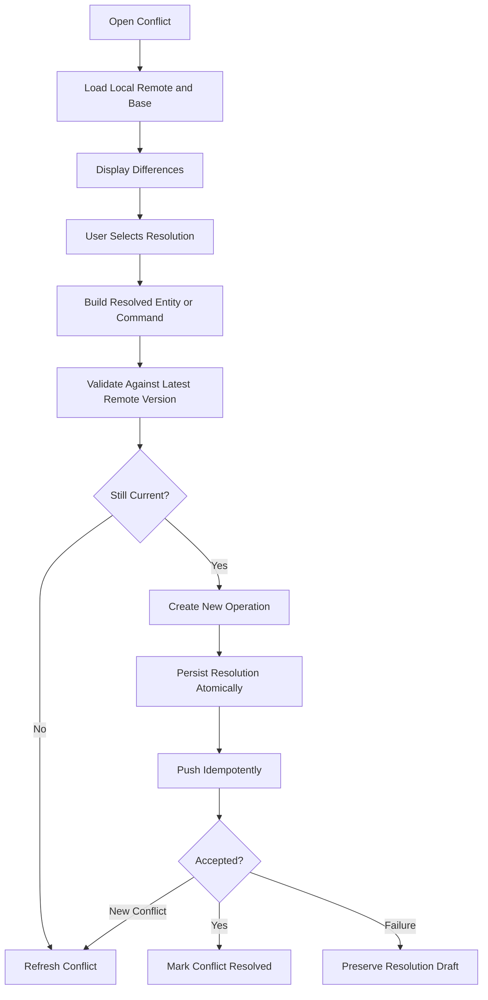

---

# Conflict Resolution Race

The remote entity may change while the user reviews the conflict.

Before confirming:

- Reload or validate the latest remote version.
- Compare with the conflict's remote version.
- Refresh the comparison when stale.
- Preserve the user's selected intent where possible.

---

# Conflict Discard

Discarding local intent must:

- Require explicit confirmation for meaningful financial changes.
- Restore the latest authoritative entity.
- Cancel or supersede the conflicting operation.
- Update queries and derived state.
- Preserve safe audit metadata.
- Remove the conflict after completion.

---

# Conflict Retention

Resolved conflicts may be retained temporarily for:

- Diagnostics
- User history
- Audit
- Synchronization recovery

They should not retain complete sensitive snapshots indefinitely without purpose.

---

# Conflict Privacy

Conflict snapshots may duplicate financial data.

Retention and storage must therefore be stricter than ordinary operational metadata.

Recommended cleanup:

- Remove unnecessary base and remote snapshots after resolution.
- Retain only safe resolution metadata where practical.
- Exclude snapshots from logs and analytics.

---

# Cross-Device Synchronization

Nexio should assume a user may operate on:

- Desktop browser
- Tablet browser
- Mobile browser
- Android application
- Several browser tabs
- Multiple physical devices

Each environment may have:

- Different application version
- Different local replica
- Different offline history
- Different feature capabilities
- Different clock
- Different network quality

---

# Device Installation Identity

A device or installation may have a random identifier for safe synchronization diagnostics.

Conceptual:

```text
installationId
```

Requirements:

- Random
- Not derived from hardware identifiers
- Not used for authorization
- Rotatable
- Scoped to the application installation
- Excluded from user-facing identity

---

# Tab or Process Identity

Each active browser tab or app process may use:

```text
runtimeId
```

for:

- Synchronization lease
- Event coordination
- Listener ownership
- Diagnostic correlation

It must not become a persistent user identifier.

---

# Device Clock

Client clocks are not authoritative for:

- Remote version order
- Authorization
- Token validity
- Conflict precedence
- Idempotency
- Audit sequence

Client time may support:

- Local display
- Draft timestamps
- Retry scheduling
- Temporary local ordering

Authoritative server timestamps should replace or reconcile technical timestamps after synchronization.

---

# Clock Skew

The system must tolerate devices whose clocks are:

- Ahead
- Behind
- Changed manually
- Incorrect after restart

Do not resolve financial conflicts by comparing client timestamps alone.

---

# Multi-Device Creation

Independent entity creates with unique UUIDs normally coexist.

Example:

```text
Device A creates one expense.

Device B creates another expense.
```

No conflict exists merely because both were created offline.

---

# Multi-Device Update

Updates to the same entity require version comparison.

Different-field updates may merge.

Same-field or dependent-field updates may require review.

---

# Multi-Device Delete

Deletion must synchronize through tombstones.

A stale device must not reintroduce a deleted entity through ordinary pull or update.

---

# Multi-Device Preferences

Preference merge rules should reflect risk.

Examples:

```text
Theme:
Latest explicit choice may win.

Privacy:
More protective state during uncertainty.

Notification read:
Read is monotonic.

Default currency:
Manual review when financial meaning may change.
```

---

# Cross-Device Queue Isolation

Each device keeps its own pending queue.

Remote idempotency and entity versioning coordinate across devices.

One device must not directly modify another device's local queue.

---

# Cross-Device Conflict Notification

A conflict created on one device may be represented remotely when cross-device visibility is needed.

Potential behavior:

- Local conflict remains device-specific.
- A remote `action_required` Notification informs other devices.
- The underlying authoritative entity remains unchanged.
- Resolution on one device invalidates stale conflict state elsewhere.

---

# Conflict Resolution on Another Device

When another device resolves a conflict:

- Pull the accepted authoritative entity.
- Mark local stale conflict resolved or obsolete.
- Cancel superseded local resolution operations.
- Preserve local unsubmitted edits as a recoverable draft when needed.
- Avoid presenting a resolved conflict indefinitely.

---

# Realtime Architecture

Supabase Realtime or another event stream may provide prompt remote updates.

Realtime is a change notification channel.

It is not the authoritative synchronization record by itself.

---

# Realtime Responsibilities

Realtime may:

- Signal that remote data changed.
- Deliver row-change metadata.
- Prompt an incremental pull.
- Update low-conflict entities promptly.
- Reduce stale UI time.
- Notify about tombstones or action-required events.

---

# Realtime Non-Responsibilities

Realtime must not:

- Replace durable checkpoints.
- Replace queue processing.
- Replace idempotency.
- Replace conflict detection.
- Replace startup pull.
- Replace reconnection pull.
- Bypass repository mapping.
- Apply unvalidated rows directly to UI.
- Assume every event is delivered exactly once.

---

# Realtime Delivery Characteristics

The application must assume Realtime events may be:

- Delayed
- Duplicated
- Out of order
- Missed
- Received after mutation response
- Received after a full pull
- Received while offline
- Received during local edit

---

# Realtime Event Flow

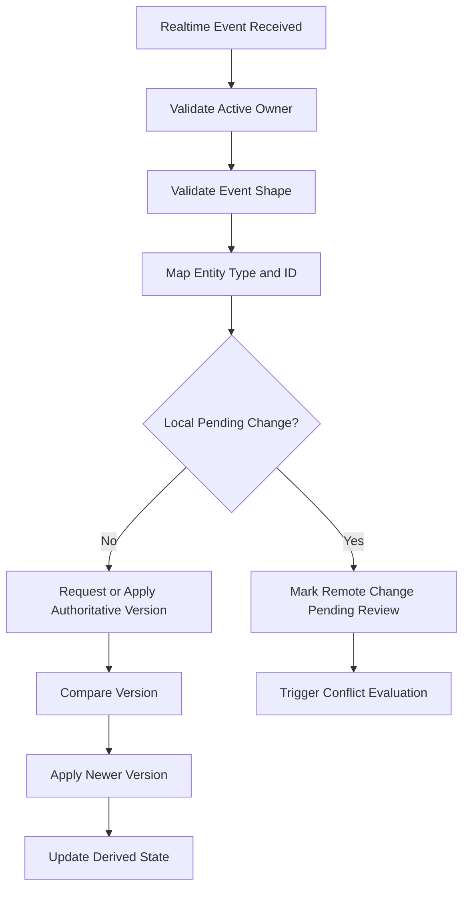

---

# Realtime Subscription Scope

Subscriptions should be:

- Owner-scoped
- Authenticated
- Centralized
- Limited to required entities
- Closed on sign-out
- Reopened after session restoration
- Reconfigured after account switching

---

# Realtime Channel Ownership

One shared Realtime coordinator should normally manage channels.

Avoid each screen opening independent subscriptions to the same table.

---

# Realtime and RLS

Realtime delivery must follow the active authorization configuration.

The application must still validate:

- Active owner
- Entity shape
- Version
- Lifecycle

Client-side validation does not replace secure backend configuration.

---

# Realtime Reconnect

After Realtime disconnects and reconnects:

- Do not assume no events were missed.
- Trigger an incremental pull from the durable checkpoint.
- Deduplicate events by entity version.
- Preserve local operations.

---

# Realtime Event Coalescing

Several rapid events for one entity may be coalesced.

The application should load or retain the latest authoritative version.

It need not render every intermediate version unless audit or business behavior requires it.

---

# Realtime and Mutation Response

The same accepted update may arrive through:

```text
Remote mutation response

and

Realtime event
```

Version comparison and operation identity should prevent double application.

---

# Realtime and Active Form

When a remote change affects an entity being edited:

- Do not overwrite input.
- Mark the form as based on an older version.
- Provide a non-destructive notice.
- Require comparison before save when needed.

Example:

```text
This transaction changed on another device.

Review the latest version before saving.
```

---

# Service Worker Architecture

A Service Worker may support:

- Static application-shell caching
- Offline fallback
- Controlled asset updates
- Background synchronization where available
- Network request strategy
- Push notification intake where implemented

A Service Worker must not become a second uncoordinated business application.

---

# Service Worker Responsibilities

Potential responsibilities:

```text
Cache approved static assets

Serve offline shell

Coordinate background sync trigger

Receive push events

Open validated application routes

Clean old asset caches
```

---

# Service Worker Non-Responsibilities

The Service Worker must not independently:

- Calculate account balances
- Create Transactions from guessed input
- Resolve conflicts
- Modify financial entities outside repository contracts
- Store unscoped user data
- Use service-role credentials
- Treat cached API responses as universal across users
- Bypass authentication

---

# Application Shell Cache

Recommended cached resources:

- Versioned JavaScript bundles
- Versioned CSS
- Icons
- Public fonts when licensed and approved
- Static public assets
- Offline fallback page
- Minimal application shell

---

# Sensitive Response Caching

Private API responses should not be placed in generic shared caches.

When controlled response caching is formally implemented, it requires:

- Owner scope
- Authentication awareness
- Cache key validation
- Expiration
- Logout cleanup
- Account-switch cleanup
- Schema version
- Privacy review

Structured financial entities should normally remain in the local database rather than opaque HTTP caches.

---

# Cache Names

Cache names should include application version or asset revision.

Example:

```text
nexio-shell-v42
```

Old caches should be removed after the new shell becomes stable.

---

# Service Worker Update

A new Service Worker may wait while an older application session remains active.

Update behavior must avoid:

- Breaking in-flight forms
- Mixing incompatible JavaScript and HTML
- Clearing local data
- Restarting imports
- Losing pending operations

---

# Update Available State

The application may show:

```text
A Nexio update is ready.

Restart when convenient to use the latest version.
```

A forced security update may require stronger action.

Pending data must remain protected.

---

# Service Worker Activation

Before activating a breaking shell update:

- Confirm local schema compatibility.
- Confirm operation payload compatibility.
- Preserve drafts.
- Avoid taking control midway through a sensitive transaction.
- Coordinate active tabs.

---

# Service Worker Fetch Strategy

Potential strategies:

```text
Cache first:
Versioned static assets.

Network first:
Public content requiring freshness.

Local database first:
Financial entities through application repositories.

Network only:
Authentication and protected online-only operations.
```

One strategy must not be applied indiscriminately to every request.

---

# Offline Navigation Fallback

When route navigation occurs offline:

- Serve the application shell for valid Nexio routes.
- Let the application router determine the view.
- Show specific unavailable states for missing data.
- Avoid returning a generic browser error.

---

# Background Sync Through Service Worker

Where supported, a Service Worker may wake and trigger safe queue processing.

Requirements:

- Same owner identity
- Valid authentication
- Stable operation IDs
- Idempotent remote commands
- Bounded execution
- No UI dependency
- Accurate failure state
- No processing after sign-out
- No use of another owner's queue

---

# Background Sync Authentication

The Service Worker must use the approved session mechanism.

It must stop when:

- Session expired
- User signed out
- Owner is unknown
- Security state cannot be validated

It must not use a privileged server credential.

---

# Service Worker Push

Push payloads must remain minimal and untrusted.

The Service Worker may:

- Display a privacy-filtered Notification
- Store a safe event marker
- Prompt application refresh after opening

It must not use payload content as proof of entity authorization.

---

# Service Worker Logging

Avoid logging:

- Push payload content
- Tokens
- Financial values
- Cached private responses
- Operation payloads

---

# Web Storage Event Coordination

Browser tabs may coordinate through:

- BroadcastChannel
- Web Locks
- Storage events
- Service Worker messaging

Events should contain safe metadata.

---

# Cross-Tab Event Types

Potential normalized events:

```text
session_changed

entity_updated

operation_queued

sync_started

sync_completed

conflict_created

conflict_resolved

privacy_changed

service_worker_update_ready
```

---

# Cross-Tab Event Payload

Prefer:

```javascript
{
  type: "entity_updated",
  entityType: "transaction",
  entityId: "uuid",
  version: 8
}
```

Avoid broadcasting complete sensitive entities unless the channel and need are formally reviewed.

Receiving tabs may reload from the owner-scoped local repository.

---

# Cross-Tab Sign-Out

When one tab signs out:

- Other tabs must protect content.
- Stop synchronization.
- Close Realtime.
- Clear in-memory private state.
- Switch to unauthenticated state.
- Avoid displaying cached financial values.

---

# Cross-Tab Privacy Change

A privacy-mode change should propagate promptly.

Tabs should default to the more protective state during transition.

---

# Failure Recovery Architecture

Synchronization recovery must handle failures at every stage.

Potential interruption points:

- Before local write
- During local write
- After local commit
- Before remote request
- During remote request
- After remote commit but before response
- During local authoritative update
- During checkpoint update
- During conflict creation
- During application shutdown
- During schema migration

---

# Local Transaction Recovery

Structured local writes should be atomic.

If the process stops during a transaction:

```text
All writes commit

or

No writes commit
```

The application must verify storage technology behavior and use transactions correctly.

---

# After Local Commit Before Push

State:

```text
Entity saved locally

Operation queued
```

Recovery:

- Reload entity.
- Reload queue.
- Resume synchronization.
- No user action normally required.

---

# During Remote Request

Outcome may be uncertain.

Recovery requires operation-ID reconciliation.

Do not create a new operation ID for the same intended mutation until the first result is known.

---

# After Remote Commit Before Local Update

Remote accepted the change, but local replica remains queued.

Recovery:

- Query remote idempotency result.
- Load authoritative entity.
- Apply locally.
- Mark operation synchronized.
- Update checkpoint.

---

# After Local Entity Update Before Operation Completion

The authoritative entity may be stored locally while the operation remains `processing`.

Recovery:

- Compare local remote version.
- Query operation result when necessary.
- Mark operation synchronized.
- Avoid sending again blindly.

---

# After Operation Completion Before Checkpoint

The operation is safe.

A later pull may receive the same entity version.

Deduplication should handle it.

Checkpoint should advance only after all corresponding local state is committed.

---

# Corrupted Queue Record

When a queue record cannot be parsed:

- Preserve raw record in quarantined storage when safe.
- Stop automatic execution.
- Mark action required.
- Avoid deleting financial intent.
- Provide safe diagnostics.
- Offer recovery or export of a protected support package when formally supported.

---

# Quarantine State

A corrupted or unsupported operation may enter:

```text
quarantined
```

It must not process automatically.

The user-facing interface may say:

```text
One saved change needs application support before it can synchronize.
```

---

# Local Database Corruption

Potential response:

1. Stop writes.
2. Protect current in-memory data.
3. Attempt read-only diagnosis.
4. Avoid replacing the database with an empty one.
5. Preserve pending operations where possible.
6. Offer Retry or controlled recovery.
7. Record safe diagnostics.
8. Require explicit user confirmation before destructive reset.

---

# Storage Quota Failure

When storage is full:

- Stop claiming offline save.
- Keep form open.
- Explain the device-storage problem.
- Offer safe cache cleanup.
- Protect pending operations.
- Avoid deleting unsynchronized data automatically.
- Allow online-only save only through a tracked approved path when architecture supports it.

---

# Remote Service Outage

During outage:

- Keep local features available.
- Queue supported mutations.
- Use bounded retry.
- Avoid mass user notifications for routine short outages.
- Display specific service-unavailable status.
- Monitor queue growth.
- Avoid disabling authorization controls.

---

# Database Migration Failure

If the remote schema migration is partially incompatible:

- Pause affected operations.
- Preserve queues.
- Prevent repeated invalid writes.
- Use feature flags or compatibility layer.
- Apply forward repair.
- Avoid clearing client data.

---

# Local Migration Failure

If the local database cannot migrate:

- Abort the migration.
- Preserve previous data.
- Prevent synchronization using partially migrated structures.
- Show a recovery state.
- Provide Retry after application update.
- Avoid silently recreating storage.

---

# Protocol Incompatibility

When the server rejects an old protocol:

```text
Update Nexio to synchronize your saved changes.
```

Requirements:

- Preserve local queue.
- Preserve drafts.
- Prevent unsupported retries.
- Migrate after update.
- Avoid exposing raw protocol details.

---

# Operation Schema Migration

Queued operations must be migrated before processing.

Conceptual flow:

```text
Load operation

↓

Inspect payloadSchemaVersion

↓

Apply ordered migrations

↓

Validate new command

↓

Persist migrated operation

↓

Process
```

---

# Failed Operation Recovery

A failed operation should include:

- Error category
- User-action requirement
- Last attempt
- Entity reference
- Safe available actions

---

# User-Correctable Operation

Example:

```text
Category was deleted remotely.
```

Possible recovery:

1. Open affected Transaction.
2. Select a valid Category.
3. Create a replacement operation.
4. Supersede the invalid operation.
5. Synchronize.

---

# User Discard of Failed Operation

Discard requires:

- Clear consequence
- Current authoritative-state restoration
- Dependency review
- No unknown remote outcome
- Confirmation

---

# Developer-Required Operation

Examples:

- Unsupported payload version
- Integrity violation
- Mapper defect
- Impossible lifecycle combination

The application should preserve the operation and provide a safe support reference.

---

# Synchronization State Matrix

| Local Entity | Operation | Remote Entity | Result |
|---|---|---|---|
| Absent | Create queued | Absent | Create remotely |
| Present local | Create queued | Same ID present from operation | Reconcile as accepted |
| Present local | Create queued | Same ID unrelated | Integrity conflict |
| Present | Update queued | Same base version | Apply update |
| Present | Update queued | Newer version, independent fields | Auto-merge and retry |
| Present | Update queued | Newer version, same field | Manual conflict |
| Deleted locally | Delete queued | Same base version | Apply deletion |
| Deleted locally | Delete queued | Newer remote update | Deletion conflict |
| Updated locally | Update queued | Deleted remotely | Deletion conflict |
| Present | No operation | Newer remote version | Apply remote update |
| Present | No operation | Remote tombstone | Apply deletion |
| Absent | No operation | Remote entity | Create local replica |

---

# Connectivity State Matrix

| Interface | Remote | Session | Queue Behavior |
|---|---|---|---|
| Offline | Unknown | Valid local state | Remain queued |
| Online | Reachable | Valid | Synchronize |
| Online | Unreachable | Valid | Retry with backoff |
| Online | Reachable | Expired | Pause and request sign-in |
| Online | Reachable | Unknown | Validate session first |
| Unknown | Unknown | Valid | Avoid destructive assumptions |
| Offline | Unknown | Expired | Protect data and preserve queue |

---

# Operation Result Matrix

| Remote Result | Local Action |
|---|---|
| Accepted | Apply authoritative result and complete operation |
| Already accepted | Reconcile result and complete operation |
| Validation denied | Mark user action required |
| Authorization denied | Pause or fail securely |
| Version conflict | Create conflict |
| Rate limited | Schedule retry |
| Timeout before send | Retry safely |
| Timeout after possible send | Reconcile by operation ID |
| Remote unavailable | Retry with backoff |
| Schema incompatible | Pause and require update |
| Unknown error | Preserve operation and use bounded retry or review |

---

# Deletion State Matrix

| Local State | Remote State | Required Behavior |
|---|---|---|
| Active | Active | Normal |
| Deleted pending | Active unchanged | Push delete |
| Deleted pending | Active updated | Review deletion conflict |
| Active updated pending | Deleted | Review restore or discard |
| Active unchanged | Deleted | Apply tombstone |
| Deleted synchronized | Deleted | Converged |
| Restored pending | Deleted soft | Validate restore command |
| Restored pending | Purged | Save as new or discard |

---

# Conflict Severity Matrix

| Conflict | Severity |
|---|---|
| Theme preference | Low |
| Notification read state | Low |
| Category icon | Low |
| Transaction description | Medium |
| Transaction Category | Medium |
| Goal target date | Medium |
| Transaction amount | High |
| Transaction type | High |
| Transfer direction | High |
| Account opening balance | High |
| Currency | Critical financial review |
| Account deletion | High |
| Ownership mismatch | Security critical |
| Idempotency payload mismatch | Integrity critical |

---

# User Notification Matrix

| Condition | Presentation |
|---|---|
| Short synchronization | No interruption or subtle status |
| Offline with no pending work | Small offline indicator |
| Offline with pending work | Pending count |
| Retry wait | Calm pending state |
| Authentication required | Persistent action banner |
| One conflict | Entity-level and queue indication |
| Several conflicts | Conflict center badge or banner |
| Permanent failure | Action-required message |
| Widespread service outage | Specific service-unavailable notice |
| Successful recovery | Brief non-intrusive confirmation |

---

# Reconciliation After Long Offline Period

A device returning after a long absence should:

1. Validate application and protocol version.
2. Validate session.
3. Load local queue.
4. Acquire synchronization lock.
5. Pull remote ownership and tombstones.
6. Evaluate dependencies.
7. Push safe creates.
8. Evaluate stale updates.
9. Create conflicts.
10. Pull final state.
11. Update checkpoint.
12. Show unresolved action count.

---

# Long-Offline Risk

Long-offline devices are more likely to contain:

- Stale versions
- Deleted relationships
- Unsupported payloads
- Old Category structure
- Expired sessions
- Purged tombstones
- Older application schema

The synchronization protocol must not assume only brief disconnection.

---

# Tombstone Retention and Old Devices

Tombstones must remain available for the supported offline window.

When a device returns after tombstone retention expired:

- A full reconciliation may be required.
- Server entity inventory may identify missing records.
- Unsupported old clients may require update.
- Stale local entities must not be uploaded as new creates accidentally.

---

# Full Reconciliation

A full reconciliation compares local known entities with authoritative remote inventory.

It may be triggered by:

- Missing checkpoint
- Corrupted checkpoint
- Very old device
- Protocol migration
- Tombstone-retention gap
- Integrity monitoring
- User-requested repair

---

# Full Reconciliation Requirements

It must:

- Remain owner-scoped.
- Use pagination.
- Preserve pending local operations.
- Avoid deleting local intent.
- Distinguish remote absence from not-yet-loaded data.
- Create conflicts where necessary.
- Rebuild query metadata.
- Verify derived totals afterward.

---

# Full Reconciliation Flow

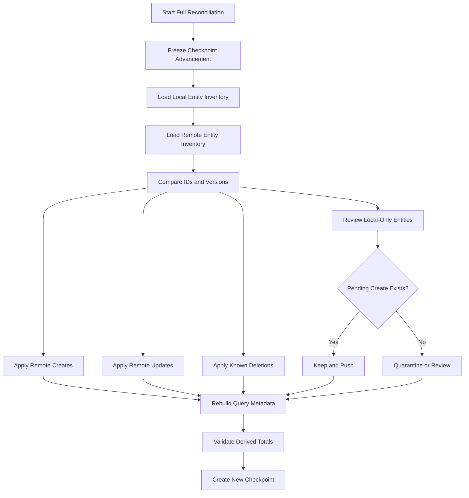

---

# Local-Only Entity Without Operation

This is an integrity anomaly.

Possible causes:

- Queue corruption
- Legacy storage bug
- Incomplete migration
- Manual local tampering

Required behavior:

- Do not upload automatically.
- Quarantine the entity.
- Preserve it for review.
- Avoid including it in authoritative totals without status.
- Provide safe recovery.

---

# Remote-Only Entity

Normal after another device creates data.

Apply to local replica after validation.

---

# Version Gap

When local remote version is several revisions behind:

- The latest authoritative entity may be sufficient for ordinary state.
- Audit history may remain remote.
- Local pending patch must compare against its base.
- Conflict resolution may need the base version snapshot.

---

# Synchronization Integrity Checks

After a cycle, verify:

```text
No operation remains processing past its lease.

No completed operation still affects a pending count.

No local entity references another owner.

No synchronized entity has an impossible version.

No deleted entity remains in active query lists.

No duplicate recurring occurrence exists.

No import row created duplicate transaction through one operation.

No checkpoint exceeds unapplied local changes.

No conflict is missing its operation.
```

---

# Financial Consistency Verification

After major reconciliation or recovery, verify:

- Account balances
- Period income
- Period expenses
- Transfers
- Goal progress
- Category totals
- Net worth
- Unread Notification count

Derived values must be recalculated from canonical entities.

---

# Synchronization Observability

Safe observability should answer:

```text
Is synchronization running?

How many operations are pending?

How old is the oldest pending operation?

Are conflicts increasing?

Are operations duplicating?

Are clients failing after an update?

Are checkpoint failures occurring?

Is one application version producing invalid operations?
```

---

# Conflict Metrics

Potential metrics:

```text
conflict_created

conflict_resolved

conflict_discarded

automatic_merge_applied

automatic_merge_rejected

remote_delete_conflict

idempotency_mismatch

average_conflict_age
```

Do not include conflict values.

---

# Queue Health Metrics

Potential metrics:

```text
pending_count

oldest_pending_age_bucket

retry_wait_count

failed_count

quarantined_count

processing_lease_recovery_count

average_push_duration

average_pull_duration
```

---

# Realtime Metrics

Potential metrics:

```text
subscription_connected

subscription_disconnected

event_duplicate

event_stale

event_conflict_triggered

incremental_pull_after_reconnect
```

---

# Service Worker Metrics

Potential metrics:

```text
shell_cache_update

background_sync_started

background_sync_completed

background_sync_authentication_blocked

old_cache_removed

update_waiting_duration
```

---

# Conflict Testing Strategy

Conflict behavior must be tested at:

```text
Domain merge layer

Repository layer

Local storage layer

Remote database layer

UI layer

End-to-end multi-device layer
```

---

# Three-Way Merge Tests

Test:

- Only local changed
- Only remote changed
- Both changed same value
- Both changed differently
- Independent fields
- Dependent fields
- Missing base
- Unknown enum
- Deleted relationship
- Archived relationship
- Currency mismatch

---

# Transaction Conflict Tests

Test:

```text
Description versus Category independent merge

Amount versus amount conflict

Account versus account conflict

Type conflict

Transfer source conflict

Transfer destination conflict

Transaction date conflict

Remote delete with local edit

Local delete with remote edit

Status transition conflict

Notes changed on both devices

Category deleted remotely
```

---

# Account Conflict Tests

Test:

- Name and icon independent merge
- Opening balance conflict
- Currency conflict
- Account archived remotely
- Account deleted remotely
- Credit limit changed on both devices
- `includeInNetWorth` conflict

---

# Category Conflict Tests

Test:

- Rename conflict
- Parent conflict
- Hierarchy cycle
- Compatibility conflict
- Reordering
- Merge source changed
- Merge destination deleted
- Category archived remotely

---

# Goal Conflict Tests

Test:

- Concurrent target amount
- Concurrent target date
- Contribution creates from two devices
- Duplicate linked contribution
- Goal completed remotely
- Goal deleted remotely
- Funding mode conflict

---

# Recurrence Conflict Tests

Test:

- Amount conflict
- Schedule conflict
- Rule paused remotely
- Rule deleted remotely
- Same occurrence generated twice
- Long-offline recurrence
- Edit future only
- Completed occurrences unchanged

---

# Import Conflict Tests

Test:

- Batch confirmed on another device
- Mapping changed on both devices
- Commit retry
- Rollback after transaction edit
- Duplicate row decisions differ
- Process termination during commit
- Batch deleted remotely

---

# Deletion Conflict Tests

Test:

- Remote delete and local update
- Local delete and remote update
- Delete already accepted
- Restore soft-deleted entity
- Restore purged entity
- Save as new
- Dependent operations
- Tombstone expired

---

# Realtime Tests

Test:

- Event delivered once
- Event delivered twice
- Events out of order
- Event missed
- Event after mutation response
- Event during local edit
- Reconnect followed by pull
- Sign-out closes channel
- Account switch changes channel
- Stale event ignored

---

# Service Worker Tests

Test:

- Shell loads offline
- Old cache removed
- Update waits safely
- Update with open form
- Background sync succeeds
- Background sync interrupted
- Background sync session expired
- Push opens authorized route
- Push target missing
- Private API response not leaked through cache

---

# Multi-Device End-to-End Tests

Use at least two independent application instances.

Test:

```text
Device A creates while Device B is offline.

Device B reconnects and pulls.

Both edit different fields.

Both edit the same amount.

Device A deletes while Device B edits.

Device A archives Account while Device B creates Transaction.

Both create Goal contributions.

Both attempt the same import commit.

Both receive Realtime update.

One resolves conflict while the other remains open.
```

---

# Failure-Recovery Tests

Test interruption:

```text
Before local transaction commit

After local commit

Before remote send

During remote send

After remote commit

Before local authoritative write

Before operation completion

Before checkpoint update

During conflict creation

During local migration

During full reconciliation
```

---

# Clock-Skew Tests

Test devices:

- Ten minutes ahead
- One day behind
- Clock changed during queue processing
- Incorrect time zone
- Time-zone change while offline

Entity version and server timestamps must preserve consistency.

---

# Long-Offline Tests

Simulate:

```text
One day offline

Thirty days offline

Application version upgrade while offline

Tombstone-retention boundary

Many queued operations

Deleted dependencies

Expired session

Protocol version change
```

---

# Conflict UI Acceptance Criteria

```text
□ Local and synchronized values are clearly identified.

□ Financial values remain exact.

□ Privacy mode remains active.

□ Conflict reason is understandable.

□ User may preserve local intent.

□ User may keep authoritative state.

□ Editing a combined result is supported when appropriate.

□ Confirmation creates a new operation.

□ Stale conflict refresh preserves the draft.

□ System Back protects unresolved edits.

□ Screen readers receive complete comparison context.
```

---

# Conflict and Realtime Anti-Patterns

The following are prohibited:

## Generic Object Spread Merge

Using object-spread precedence as conflict resolution.

## Timestamp Wins

Choosing a financial value only because one client timestamp is later.

## Silent Remote Delete Win

Discarding meaningful local edits without review.

## Silent Local Restore

Recreating a remotely deleted entity through an update retry.

## Concatenated Notes

Joining two changed notes automatically.

## Transfer Field Merge

Combining source from one version and destination from another without complete validation.

## Currency Auto-Merge

Selecting a currency automatically during conflict.

## Duplicate Realtime Application

Applying mutation response and Realtime event as two separate changes.

## Realtime as Durable Sync

Assuming no missed event after reconnect.

## One Subscription per Component

Creating uncontrolled duplicate Realtime channels.

## Caching Private API Responses Globally

Using Service Worker caches without owner isolation.

## Service Worker Business Logic

Calculating financial rules independently inside the Service Worker.

## Forced Update Data Loss

Clearing local queues because a newer application version is required.

## Conflict Without Base or Intent

Displaying only the latest remote entity and calling it a conflict.

## Immediate Conflict Snapshot Retention Forever

Keeping duplicate sensitive entity copies indefinitely.

## Remote Payload Execution

Treating Realtime or push payloads as authorized commands.

---

# Conflict Review Questions

Before approving a merge policy, answer:

```text
What is the base value?

What did the local user explicitly change?

What changed remotely?

Are the fields independent?

Does one field affect validation of another?

Could automatic merge change financial meaning?

Does deletion override the operation?

Does currency remain compatible?

Does the relationship still exist?

Can the user understand the comparison?

What new operation will represent resolution?

How is a second concurrent change handled?

How long are conflict snapshots retained?
```

---

# Realtime Review Questions

Before adding a Realtime subscription, answer:

```text
Which entity changes require immediate awareness?

What happens when an event is missed?

What version proves freshness?

How are duplicate events handled?

What happens during an active local edit?

Who owns the subscription?

How is it closed on sign-out?

Does reconnect trigger an incremental pull?

Can event payloads expose unnecessary data?
```

---

# Service Worker Review Questions

Before adding Service Worker behavior, answer:

```text
Which resources are cached?

Are any responses user-specific?

How is owner isolation preserved?

What happens after sign-out?

How is an update activated safely?

Can the Service Worker access a valid session?

What happens when the session expires?

Which operations may run in the background?

How are old caches removed?

Can external push data invoke privileged behavior?
```

---

# Part 2 Acceptance Criteria

Conflict resolution and remote-change intake are accepted only when:

```text
□ Conflicts preserve local, remote and base context where available.

□ Financial conflicts are never resolved through generic last-write-wins.

□ Automatic merge is field- and entity-specific.

□ Changed fields are recorded in queued updates.

□ Merged entities pass complete domain validation.

□ Transaction amount conflicts require explicit review.

□ Transfer conflicts preserve atomic transfer identity.

□ Currency conflicts are never merged automatically.

□ Account opening-balance conflicts require explicit review.

□ Category hierarchy conflicts prevent cycles.

□ Goal contributions use unique entity identity.

□ Recurring rules preserve completed historical occurrences.

□ Import commit remains idempotent.

□ Deletion conflicts distinguish restore, delete and save-as-new.

□ Conflict resolution creates a new operation.

□ Conflict confirmation validates the latest remote version.

□ Conflict UI preserves privacy and accessibility.

□ Realtime is treated as a notification channel, not durable truth.

□ Realtime events are validated, versioned and deduplicated.

□ Realtime reconnect triggers incremental pull.

□ Active forms are not overwritten by remote events.

□ Service Worker caches only approved resources.

□ Private API data is not placed in unscoped shared caches.

□ Background synchronization uses ordinary owner and session rules.

□ Service Worker push payloads remain untrusted.

□ Cross-tab synchronization uses one active coordinator.

□ Cross-tab sign-out protects all open surfaces.

□ Interrupted remote outcomes reconcile through operation identity.

□ Corrupted operations are quarantined rather than discarded.

□ Full reconciliation preserves pending local intent.

□ Long-offline devices cannot recreate deleted entities accidentally.

□ Derived financial state is recalculated after reconciliation.

□ Conflict, queue, Realtime and Service Worker behavior is tested across multiple instances.
```

---

# Conflict Constitutional Rule

Every conflict-resolution decision must answer:

```text
Can Nexio prove that combining, replacing, deleting or restoring these values preserves the user's intended financial fact?
```

When the answer is unclear, prefer the implementation that:

- Preserves both versions.
- Requires explicit review.
- Uses the latest authoritative base.
- Creates a new traceable operation.
- Protects deletion semantics.
- Preserves currency and relationships.
- Avoids duplicate financial events.
- Keeps completed history unchanged.
- Validates the resolved entity completely.
- Minimizes conflict-data retention.
- Remains understandable to the user.
- Supports recovery after interruption.

Conflict resolution is not choosing which device wins.

It is restoring one valid financial truth without losing the user's intent.

---
---

# Synchronization Technical Contracts

This section defines the technical contracts required to implement the Nexio offline and synchronization architecture.

These contracts must remain:

- Platform-independent
- Owner-scoped
- Versioned
- Idempotent
- Recoverable
- Testable
- Compatible with local and remote persistence
- Independent from UI composition

Desktop, Tablet, Mobile, Android, Service Worker and browser tabs must converge on the same synchronization services.

No platform may create an independent queue or conflict protocol.

---

# Synchronization Module Boundaries

Recommended target modules:

```text
Synchronization Coordinator

Operation Queue Repository

Conflict Repository

Checkpoint Repository

Local Entity Store

Remote Command Adapter

Remote Change Adapter

Connectivity Adapter

Lifecycle Adapter

Realtime Adapter

Service Worker Adapter

Synchronization Metrics Adapter
```

Each module must have one clear responsibility.

---

# Synchronization Coordinator Contract

Conceptual interface:

```javascript
class SynchronizationCoordinator {
  async initialize(context) {}

  async startCycle(trigger, context) {}

  async pause(reason, context) {}

  async resume(context) {}

  async retryOperation(operationId, context) {}

  async resolveConflict(command, context) {}

  async reconcileUnknownOutcome(operationId, context) {}

  async runFullReconciliation(context) {}

  async getStatus(context) {}

  async shutdown(context) {}
}
```

---

# Synchronization Context

Conceptual structure:

```javascript
{
  ownerId: "uuid",
  installationId: "uuid",
  runtimeId: "uuid",
  applicationVersion: "1.0.0",
  syncProtocolVersion: 1,
  signal: AbortSignal
}
```

The authenticated owner must come from trusted session state.

The caller must not supply an arbitrary owner from form or route input.

---

# Synchronization Trigger

Recommended values:

```text
startup

resume

local_mutation

manual_refresh

manual_retry

network_restored

realtime_signal

background_sync

authentication_restored

full_reconciliation

application_update
```

Trigger identifies why a cycle began.

It must not alter financial behavior.

---

# Synchronization Cycle Result

Conceptual result:

```javascript
{
  cycleId: "uuid",
  trigger: "network_restored",

  startedAt: "timestamp",
  completedAt: "timestamp",

  pushed: {
    attempted: 3,
    synchronized: 2,
    retrying: 1,
    failed: 0,
    conflicts: 0
  },

  pulled: {
    pages: 2,
    entitiesApplied: 18,
    tombstonesApplied: 1,
    conflictsCreated: 0
  },

  status: "pending",

  checkpointAdvanced: true,
  pendingCount: 1,
  conflictCount: 0
}
```

The result must not contain raw financial payloads for logging or analytics.

---

# Synchronization State Machine

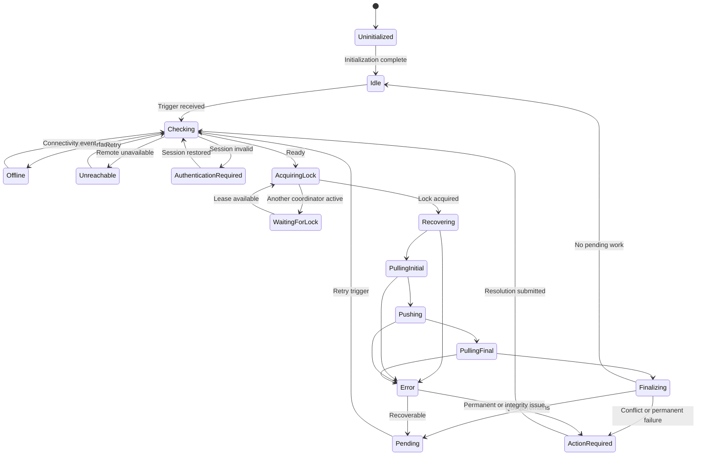

---

# One-Cycle Rule

Only one synchronization cycle may mutate queue and checkpoint state for one owner and local storage scope at a time.

Additional triggers should:

- Join the active cycle
- Set a follow-up-cycle flag
- Coalesce into one later cycle
- Return current status

They must not start competing workers.

---

# Follow-Up Cycle

A follow-up cycle may run when new work arrives during an active cycle.

Example:

```text
Cycle begins.

↓

A new Transaction is created locally.

↓

Operation is queued.

↓

Current cycle completes.

↓

Coordinator detects new eligible work.

↓

One follow-up cycle begins.
```

Avoid recursive uncontrolled cycles.

---

# Synchronization Lock Contract

Conceptual interface:

```javascript
syncLock.acquire({
  ownerId,
  runtimeId,
  leaseDurationMs
});

syncLock.renew({
  ownerId,
  runtimeId
});

syncLock.release({
  ownerId,
  runtimeId
});

syncLock.isOwner({
  ownerId,
  runtimeId
});
```

---

# Lock Requirements

The lock must:

- Be owner-scoped.
- Be recoverable after process death.
- Use expiration.
- Use heartbeat or renewal.
- Reject stale holders.
- Prevent another runtime from writing checkpoints concurrently.
- Avoid containing financial data.
- Support browser and native environments.

---

# Lock Loss

If the coordinator loses its lease:

- Stop taking new operations.
- Cancel safe in-flight requests where possible.
- Do not mark uncertain operations failed.
- Preserve current state.
- Allow reconciliation by the next coordinator.
- Avoid writing a checkpoint after lock loss.

---

# Operation Queue Repository Contract

Conceptual interface:

```javascript
class OperationQueueRepository {
  async enqueue(operation, transactionContext) {}

  async getNextEligible(query) {}

  async getById(operationId, context) {}

  async list(query, context) {}

  async markProcessing(operationId, lease, context) {}

  async markRetry(operationId, retryState, context) {}

  async markConflict(operationId, conflictId, context) {}

  async markFailed(operationId, failure, context) {}

  async markSynchronized(operationId, result, context) {}

  async markSuperseded(operationId, replacementOperationId, context) {}

  async cancel(operationId, context) {}

  async recoverExpiredProcessingLeases(context) {}

  async compact(entityId, context) {}
}
```

---

# Eligible Operation Query

An operation is eligible when:

```text
Owner matches active owner.

Status is queued or retry_wait.

nextAttemptAt is absent or reached.

Dependencies are satisfied.

No unresolved earlier operation exists for the same entity.

Payload schema is supported.

No open conflict blocks it.

The coordinator owns the synchronization lock.
```

---

# Queue Sorting

Recommended deterministic sort:

```text
Dependency depth ascending

Created time ascending

Operation ID ascending
```

Operations for the same entity preserve explicit sequence.

---

# Processing Lease

Conceptual structure:

```javascript
{
  holderId: "runtime-id",
  startedAt: "timestamp",
  expiresAt: "timestamp"
}
```

The processing lease is separate from the global synchronization lock.

It helps recover individual operations after interruption.

---

# Operation Attempt Record

Conceptual metadata:

```javascript
{
  attemptCount: 4,
  lastAttemptAt: "timestamp",
  nextAttemptAt: "timestamp",
  lastErrorCategory: "remote_unreachable",
  lastCorrelationId: "safe-id"
}
```

Raw backend errors must not be persisted as user-facing queue data.

---

# Operation Completion Record

Conceptual metadata:

```javascript
{
  synchronizedAt: "timestamp",
  remoteEntityVersion: 8,
  remoteResultReference: "safe-reference",
  retentionUntil: "timestamp"
}
```

Completed operation retention must support idempotency and diagnostics without retaining unnecessary payload copies indefinitely.

---

# Conflict Repository Contract

Conceptual interface:

```javascript
class ConflictRepository {
  async create(conflict, context) {}

  async getById(conflictId, context) {}

  async listOpen(query, context) {}

  async markResolving(conflictId, context) {}

  async markResolved(conflictId, resolution, context) {}

  async markDiscarded(conflictId, context) {}

  async markObsolete(conflictId, reason, context) {}

  async removeExpiredSnapshots(context) {}
}
```

---

# Checkpoint Repository Contract

Conceptual interface:

```javascript
class CheckpointRepository {
  async get(entityScope, context) {}

  async stage(nextCheckpoint, transactionContext) {}

  async commit(nextCheckpoint, transactionContext) {}

  async reset(reason, context) {}

  async getFullReconciliationState(context) {}
}
```

---

# Checkpoint Categories

Possible checkpoints:

```text
Global change sequence

Per-entity updated-at cursor

Tombstone cursor

Notification cursor

Realtime recovery cursor

Full-reconciliation generation
```

The selected architecture must avoid gaps between independently advanced checkpoints.

---

# Checkpoint Record

Conceptual structure:

```javascript
{
  ownerId: "uuid",
  scope: "global",
  protocolVersion: 1,

  cursor: {
    sequence: 982771
  },

  lastSuccessfulPullAt: "timestamp",
  updatedAt: "timestamp"
}
```

---

# Checkpoint Reset

Checkpoint reset may be required after:

- Corruption
- Unsupported protocol change
- Tombstone gap
- Integrity check failure
- Manual repair
- Full reconciliation

Reset must not delete pending local operations.

---

# Local Database Contract

The local database must support:

- Owner-scoped records
- Atomic transactions
- Ordered indexes
- Schema migrations
- Cursor queries
- Durable queue records
- Conflict records
- Drafts
- Checkpoints
- Tombstones
- Query metadata

---

# Recommended Local Stores

```text
sync_metadata

entities

operations

conflicts

checkpoints

tombstones

drafts

query_cache

coverage

leases

quarantine
```

A project may use entity-specific stores when performance or query needs justify them.

The public contracts remain unchanged.

---

# Unified Entity Store

Conceptual key:

```text
[ownerId, entityType, entityId]
```

Conceptual indexes:

```text
[ownerId, entityType]

[ownerId, entityType, synchronizationState]

[ownerId, entityType, lastRemoteUpdatedAt]

[ownerId, entityType, deletedAt]
```

---

# Entity-Specific Stores

Separate stores may improve:

- Transaction-date queries
- Account filtering
- Category filtering
- Goal contribution lookups
- Large dataset performance

When used, all stores must still enforce owner scope and shared synchronization metadata.

---

# Local Database Atomic Mutation

Conceptual transaction:

```javascript
await localDatabase.transaction(
  [
    "transactions",
    "operations",
    "query_cache",
    "sync_metadata"
  ],
  async (tx) => {
    await tx.transactions.put(localTransaction);
    await tx.operations.put(createOperation);
    await tx.query_cache.invalidate(affectedKeys);
    await tx.sync_metadata.updatePendingCount(1);
  }
);
```

A failure must roll back all writes.

---

# Local Deletion Record

A locally deleted entity may remain as:

```javascript
{
  entity: lastKnownEntity,
  deletedLocallyAt: "timestamp",
  synchronizationState: "queued_delete",
  pendingOperationIds: ["delete-operation"]
}
```

It should be excluded from active queries.

---

# Local Tombstone Record

Conceptual structure:

```javascript
{
  ownerId: "uuid",
  entityType: "transaction",
  entityId: "uuid",
  remoteVersion: 8,
  deletedAt: "timestamp",
  source: "remote",
  retainedUntil: "timestamp"
}
```

---

# Quarantine Store

The quarantine store may contain:

- Corrupted operation
- Unsupported operation payload
- Local-only entity without operation
- Invalid mapping result
- Integrity anomaly

It must be:

- Owner-scoped
- Excluded from automatic execution
- Protected
- Retained only as needed
- Visible through safe support state

---

# Local Database Open Flow

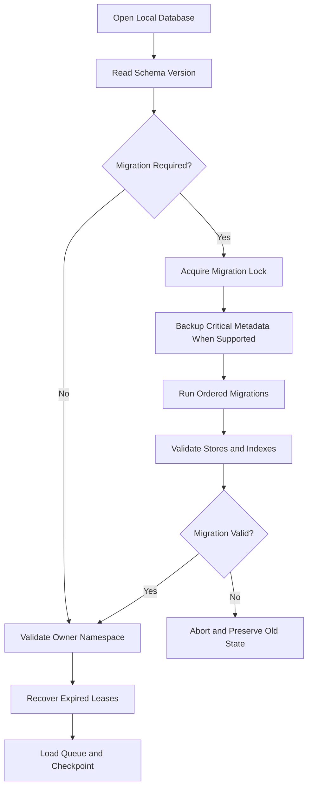

---

# Remote Command Contract

Remote mutations should use one stable command shape.

Conceptual structure:

```javascript
{
  operationId: "uuid",
  operationType: "transaction.update",
  protocolVersion: 1,

  entityId: "uuid",
  expectedVersion: 7,

  payload: {
    changes: {
      categoryId: "uuid"
    }
  }
}
```

The authenticated owner must be derived remotely from the session.

---

# Remote Command Result

Conceptual success:

```javascript
{
  operationId: "uuid",
  status: "accepted",
  entityType: "transaction",
  entityId: "uuid",
  authoritativeVersion: 8,
  entity: {
    // Canonical response
  },
  serverTime: "timestamp"
}
```

---

# Already-Accepted Result

```javascript
{
  operationId: "uuid",
  status: "already_accepted",
  entityType: "transaction",
  entityId: "uuid",
  authoritativeVersion: 8,
  entity: {
    // Original accepted result
  }
}
```

---

# Conflict Result

```javascript
{
  operationId: "uuid",
  status: "conflict",
  entityType: "transaction",
  entityId: "uuid",
  expectedVersion: 7,
  authoritativeVersion: 8,
  authoritativeEntity: {
    // Current entity
  },
  conflictCode: "VERSION_MISMATCH"
}
```

---

# Rejected Result

Conceptual:

```javascript
{
  operationId: "uuid",
  status: "rejected",
  error: {
    category: "validation",
    code: "CATEGORY_NOT_AVAILABLE",
    field: "categoryId",
    retryable: false
  }
}
```

Raw database error text must not be returned directly.

---

# Remote Command Security

Every command must validate:

- Session
- Authenticated owner
- Operation ID
- Operation type
- Protocol version
- Entity identifier
- Expected version
- Payload structure
- Ownership of relationships
- Domain invariants
- Idempotency record
- Rate limits where appropriate

---

# Remote Owner Rule

The remote command must not accept ownership authority from:

```javascript
payload.ownerId
```

Owner identity comes from the authenticated session.

If the payload includes owner metadata for consistency checks, it must equal the authenticated owner.

---

# Remote Idempotency Table

Conceptual schema:

```sql
create table public.sync_operations (
  operation_id uuid not null,
  user_id uuid not null references auth.users(id) on delete cascade,

  operation_type text not null,
  entity_type text not null,
  entity_id uuid not null,

  payload_fingerprint text not null,

  status text not null,

  result_version bigint null,
  result_metadata jsonb null,

  created_at timestamptz not null default now(),
  completed_at timestamptz null,

  primary key (user_id, operation_id),

  constraint sync_operations_status_check
    check (
      status in (
        'processing',
        'accepted',
        'rejected',
        'conflict'
      )
    )
);
```

The table is technical infrastructure.

It must not expose raw sensitive command payloads unnecessarily.

---

# Idempotency Transaction

Recommended remote sequence:

```text
Begin database transaction

↓

Insert idempotency operation as processing

or

Load existing operation

↓

Validate payload fingerprint

↓

Execute domain mutation

↓

Store accepted result reference

↓

Commit
```

---

# Existing Operation Handling

When the operation already exists:

```text
Same fingerprint and accepted
→ Return original result.

Same fingerprint and processing
→ Reconcile processing lease or return pending.

Same fingerprint and rejected
→ Return same rejection when still applicable.

Different fingerprint
→ Reject as idempotency integrity conflict.
```

---

# Remote Processing Lease

A remote operation may include:

```text
processing_started_at

processing_expires_at

worker_identifier
```

Expired processing state may be recovered through a controlled function.

---

# Remote Result Metadata

Result metadata should contain enough information to reconcile.

Possible fields:

```text
entity ID

authoritative version

accepted timestamp

result code

safe reference
```

Avoid storing complete financial entities in the idempotency table when the current entity can be loaded securely.

---

# RPC Architecture

Complex mutations should use transactional RPCs or trusted backend functions.

Candidate RPCs:

```text
sync_create_transaction

sync_update_transaction

sync_delete_transaction

sync_create_transfer

sync_update_account

sync_merge_category

sync_commit_import_batch

sync_generate_recurring_occurrence

sync_create_goal_contribution

sync_restore_entity
```

---

# RPC Naming

Names should identify:

- Synchronization behavior
- Entity
- Action

Avoid generic functions such as:

```text
save_data

update_anything

execute_command
```

Generic privileged RPCs create excessive attack surface.

---

# RPC Input

RPC input should use explicit parameters or a validated JSON command.

Example:

```sql
sync_update_transaction(
  p_operation_id uuid,
  p_transaction_id uuid,
  p_expected_version bigint,
  p_changes jsonb,
  p_protocol_version integer
)
```

The function derives the authenticated user through:

```sql
auth.uid()
```

---

# RPC Output

RPC should return a stable structured result.

Example:

```sql
table (
  status text,
  operation_id uuid,
  entity_id uuid,
  authoritative_version bigint,
  result jsonb,
  error_code text
)
```

The exact contract must remain versioned.

---

# Security-Definer RPC Requirements

When `security definer` is required:

- Set a safe fixed `search_path`.
- Revoke public execution by default.
- Grant only required authenticated role.
- Validate `auth.uid()`.
- Validate ownership.
- Validate operation type.
- Avoid dynamic SQL.
- Avoid arbitrary table or field names.
- Return only required data.
- Add two-user tests.
- Add idempotency tests.

---

# Direct Table Mutation Policy

Direct client inserts and updates may be allowed only when they can preserve:

- Idempotency
- Version checks
- Ownership
- Domain invariants
- Same-owner relationships
- Atomic aggregate behavior

For complex financial mutations, RPC is preferred.

---

# Transaction RPC

A Transaction create or update RPC should validate:

- Type
- Positive amount
- Currency
- Account
- Category
- Transfer shape
- Status
- Date
- Owner
- Archived and deleted relationships
- Expected version
- Operation ID

---

# Transfer RPC

Transfer creation must be atomic.

It must not create two independent rows unless the approved schema models one transfer aggregate across linked rows.

The current target remains:

```text
One transfer Transaction entity
```

---

# Import Commit RPC

The Import commit RPC must:

- Lock the Import Batch.
- Validate owner.
- Validate current status.
- Validate operation ID.
- Validate normalized rows.
- Prevent duplicate commit.
- Create Transactions atomically or report controlled partial behavior.
- Record created IDs.
- Update counts.
- Return authoritative result.

---

# Recurring Occurrence RPC

The recurrence RPC must enforce:

```text
unique owner + rule + occurrence date
```

or equivalent stable occurrence identity.

A repeated call must return the existing generated result.

---

# Restore RPC

Restore must validate:

- Entity supports restore.
- Soft-deleted record exists.
- User remains owner.
- Dependencies remain valid.
- Expected tombstone or entity version.
- New operation ID.
- No conflicting replacement exists.

---

# Remote Change Feed

A change feed may use:

- Monotonic sequence table
- Per-table updated timestamps
- Realtime plus pull
- Database-triggered change log
- Controlled synchronization endpoint

The selected mechanism must be durable and owner-scoped.

---

# Change Log Table

A formal change-log architecture may use:

```sql
create table public.sync_changes (
  sequence_id bigint generated always as identity primary key,

  user_id uuid not null references auth.users(id) on delete cascade,

  entity_type text not null,
  entity_id uuid not null,

  entity_version bigint not null,
  change_type text not null,

  changed_at timestamptz not null default now(),

  constraint sync_changes_type_check
    check (change_type in ('create', 'update', 'delete'))
);
```

---

# Change Log Payload

The change log should normally contain references, not full financial payloads.

The client may load the current entity securely.

For deletes, a tombstone or deletion metadata is required.

---

# Change Feed Query

Conceptual:

```text
Fetch changes for authenticated owner

where sequence_id > checkpoint

order by sequence_id ascending

limit page size
```

RLS or backend service must enforce owner scope.

---

# Change Feed Retention

Change records must remain available for the supported incremental synchronization window.

When retention expires, clients with old checkpoints require full reconciliation.

---

# Change Feed Compaction

Several changes to the same entity may be compacted for delivery.

The client generally needs the latest current version and deletion state.

Compaction must not remove required deletion knowledge.

---

# Tombstone RPC or Feed

Deletes should produce:

- Entity type
- Entity ID
- Owner
- Deleted version
- Deleted timestamp
- Change sequence

No unnecessary amount or description is required.

---

# Push and Pull Transaction Boundaries

Push and pull should use separate controlled transactions.

A single giant transaction for an entire synchronization cycle is discouraged because it may:

- Hold locks too long
- Fail all work after one invalid operation
- Increase retry cost
- Reduce error isolation

---

# Local Page Commit

Each pulled page should commit locally in one transaction containing:

- Entities
- Tombstones
- Conflict records
- Query invalidation
- Checkpoint stage

Checkpoint becomes active only after successful page commit.

---

# Push Result Commit

One pushed operation should commit locally:

- Authoritative entity or tombstone
- Operation completion
- Conflict resolution update
- Query invalidation
- Pending-count update
- Safe result metadata

---

# Synchronization Consistency Levels

Repositories may expose:

```text
local

local_then_remote

remote

authoritative_remote
```

---

## `local`

Return only local data.

Used when:

- Offline
- Immediate startup
- Current workflow requires no remote refresh

---

## `local_then_remote`

Return local immediately and refresh remotely.

Used for most ordinary list and dashboard reads.

---

## `remote`

Request remote state and update local replica.

Used for manual refresh or stale data.

---

## `authoritative_remote`

Require current remote confirmation before continuing.

Used for:

- Security settings
- Account deletion
- Conflict resolution confirmation
- Complete export
- Critical administrative state

---

# Synchronization Security

Synchronization must comply with the Security specification.

Requirements:

- Authenticated owner
- RLS
- Same-owner relationships
- Protected operation queue
- No service-role key in client
- No raw payload logging
- No cross-user queue processing
- Session validation
- Safe deep-link and notification behavior
- Local-data isolation

---

# Queue Encryption Claims

The project must not claim that the operation queue is encrypted unless:

- Queue storage encryption exists.
- Key management exists.
- Process recovery is supported.
- Account switching is handled.
- Testing verifies the actual storage path.

Owner scoping and application lock are not equivalent to encryption.

---

# Operation Payload Minimization

Queue payload should contain only:

- Fields changed
- Expected version
- Required relationship IDs
- Required command metadata

Avoid storing:

- Complete application state
- Rendered strings
- Account lists
- Authentication tokens
- Supabase session objects
- Unrelated entity copies

---

# Conflict Snapshot Minimization

Conflict records should retain only fields required for comparison.

For a Category conflict, do not copy all user Transactions.

For a Transaction conflict, do not copy unrelated Account records.

---

# Logout Security

On sign-out:

- Stop coordinator.
- Release lock.
- Close Realtime.
- Stop background sync.
- Prevent queue processing.
- Protect or clear local owner data according to policy.
- Remove active in-memory entities.
- Deactivate push registration.

Pending queue behavior must follow the documented sign-out policy.

---

# Account Switch Security

Before switching owner:

1. Stop current synchronization.
2. Confirm no operation remains actively processing.
3. Release current lock.
4. Close subscriptions.
5. Clear in-memory state.
6. Open new owner namespace.
7. Load new checkpoint and queue.
8. Start synchronization only for the new owner.

---

# Deleted Account

When remote account deletion is confirmed:

- Stop all queue processing.
- Cancel background work.
- Revoke local active ownership.
- Clear protected local state according to policy.
- Remove push registration.
- Remove temporary files.
- Do not retry prior operations.

---

# Synchronization Migrations

Synchronization changes may affect:

```text
Local database schema

Operation payload schema

Conflict schema

Checkpoint schema

Remote RPC contract

Change-feed protocol

Idempotency records

Realtime event format
```

Each layer requires versioning.

---

# Synchronization Version Catalog

Recommended distinct versions:

```text
localDatabaseVersion

entitySchemaVersion

operationPayloadVersion

conflictSchemaVersion

syncProtocolVersion

remoteRpcVersion

changeFeedVersion
```

They must not be collapsed into one ambiguous version number.

---

# Operation Payload Migration Registry

Conceptual:

```javascript
const operationMigrations = {
  1: migrateOperationV1ToV2,
  2: migrateOperationV2ToV3,
};
```

Migration runs sequentially.

Skipping versions is forbidden unless a direct migration is formally validated.

---

# Operation Migration Result

Conceptual:

```javascript
{
  migrated: true,
  fromVersion: 1,
  toVersion: 3,
  operation: migratedOperation,
  warnings: []
}
```

When migration cannot preserve intent:

```javascript
{
  migrated: false,
  reason: "UNSUPPORTED_LEGACY_TRANSFER",
  action: "quarantine"
}
```

---

# Conflict Migration

Open conflicts may survive application updates.

Migration must preserve:

- Owner
- Entity
- Local intent
- Remote version
- Resolution draft
- Original operation reference

---

# Checkpoint Migration

When the change-feed format changes:

- Preserve old checkpoint.
- Add new checkpoint structure.
- Perform compatibility pull or full reconciliation.
- Activate the new checkpoint only after validation.
- Retain recovery metadata temporarily.

---

# RPC Version Migration

A remote service may support:

```text
Version 1

and

Version 2
```

during rollout.

Clients should identify protocol version explicitly.

Old RPC versions may be removed only after supported clients no longer depend on them.

---

# Expand-Migrate-Contract for Sync

Recommended sequence:

```text
Expand:
Add new payload and RPC support.

Migrate:
Update clients and queued operations.

Observe:
Verify successful adoption.

Contract:
Remove old protocol support later.
```

---

# Queue Migration During Forced Update

A required application update must:

- Leave queue intact.
- Install new application.
- Open old local schema safely.
- Migrate operations.
- Resume synchronization.
- Quarantine unsupported records rather than delete them.

---

# Background Worker Migration

When replacing synchronization worker architecture:

- Prevent both old and new workers from running together.
- Introduce a coordination flag or lease version.
- Migrate processing records.
- Validate no duplicate remote commands.
- Remove old worker after adoption.

---

# Realtime Migration

When changing channels or event format:

- Keep incremental pull as fallback.
- Support old and new event formats temporarily.
- Validate owner and version.
- Close old subscriptions.
- Monitor missed-event recovery.

---

# Service Worker Migration

When changing Service Worker synchronization behavior:

- Coordinate update activation.
- Preserve queues.
- Avoid old and new workers processing simultaneously.
- Use lock versioning.
- Validate session behavior.
- Clean obsolete caches.

---

# Rollout Strategy

Synchronization changes should use gradual rollout.

Recommended sequence:

```text
1. Internal development environment

2. Automated multi-instance tests

3. Internal testing track

4. Limited user cohort

5. Wider staged rollout

6. Full production
```

---

# Rollout Feature Flags

Potential flags:

```text
sync_v2_enabled

conflict_center_enabled

remote_idempotency_v2

change_feed_enabled

service_worker_background_sync

realtime_sync_signals

full_reconciliation_v2
```

---

# Feature Flag Requirements

Every synchronization flag must define:

- Owner
- Default
- Eligible application versions
- Safe fallback
- Queue compatibility
- Remote compatibility
- Metrics
- Rollback behavior
- Removal date

---

# Dual-Write Risk

Dual-writing old and new synchronization systems may cause duplicate operations.

It should be avoided.

When unavoidable, one system must be authoritative and the other shadow-only.

---

# Shadow Validation

A new synchronization implementation may run in shadow mode.

Shadow mode may:

- Calculate expected ordering
- Compare merge result
- Compare pull coverage
- Compare queue eligibility

It must not:

- Execute duplicate mutations
- Advance real checkpoints
- mark real operations complete
- Create user-visible conflicts
- Alter financial state

---

# Rollout Metrics

Monitor by application version:

```text
Synchronization success rate

Pending-operation age

Conflict rate

Idempotency replay rate

Duplicate entity detection

Authentication-paused queue

Operation migration failure

Full reconciliation frequency

Checkpoint reset frequency

Background sync success
```

---

# Rollout Stop Conditions

Pause rollout when:

- Duplicate Transactions increase
- Queue loss is detected
- Cross-owner anomaly appears
- Idempotency mismatches increase
- Conflict rate changes unexpectedly
- Old clients cannot synchronize
- Local migration fails
- Checkpoints skip changes
- Financial totals diverge
- Authentication queues are deleted
- Service Worker creates competing coordinators

---

# Rollback Strategy

Rollback may include:

- Disable new sync feature flag
- Stop new worker
- Restore old RPC support
- Pause affected mutation class
- Require online-only operation temporarily
- Publish corrected application
- Trigger full reconciliation

Rollback must not discard queues created by the newer version.

---

# Forward-Fix Preference

When queue or schema state has already changed, a forward fix may be safer than reverting code to an older incompatible version.

The decision must consider:

- Payload compatibility
- Local schema
- Remote schema
- Published application versions
- Pending operation volume
- Conflict state

---

# Observability Architecture

Synchronization observability should provide:

```text
Technical health

Data integrity signals

User-impact signals

Version-specific regressions

Recovery progress
```

It must not expose financial content.

---

# Synchronization Cycle Event

Conceptual event:

```javascript
{
  eventType: "sync_cycle_completed",
  cycleId: "safe-id",
  ownerReference: "protected-reference",
  trigger: "resume",
  applicationVersion: "1.0.0",
  durationMs: 1480,
  result: "pending",
  pushedCount: 3,
  pulledCount: 12,
  conflictCount: 1,
  pendingCount: 2
}
```

---

# Operation Event

Conceptual:

```javascript
{
  eventType: "sync_operation_result",
  operationType: "transaction.update",
  attemptCount: 2,
  result: "conflict",
  durationMs: 320,
  applicationVersion: "1.0.0",
  errorCategory: "conflict"
}
```

Do not include the transaction fields.

---

# Integrity Event

Potential events:

```text
local_entity_without_operation

operation_without_entity

checkpoint_gap

idempotency_payload_mismatch

cross_owner_relationship_detected

duplicate_recurring_occurrence

duplicate_import_commit

processing_lease_expired

conflict_missing_base

unsupported_operation_version
```

Integrity events require priority review.

---

# Safe Correlation

Use:

```text
cycleId

operationId

conflictId

correlationId
```

These identifiers must not encode financial content.

---

# Synchronization Dashboard

An internal operational dashboard may show:

- Current release versions
- Synchronization success
- Average queue delay
- Conflict count
- Oldest pending age
- Migration errors
- Protocol-version distribution
- Change-feed lag
- Idempotency mismatch
- Full-reconciliation count

It must not display Transaction descriptions or amounts.

---

# User Support Diagnostics

A user-facing support package may include:

- Application version
- Platform
- Local database version
- Protocol version
- Pending count
- Conflict count
- Error categories
- Safe operation references
- Last successful synchronization time

It must exclude:

- Tokens
- Exact values
- Notes
- Raw queue payloads
- Imported rows
- Attachment content

---

# Manual Repair Tools

Repair tools may support:

```text
Retry queue

Rebuild query cache

Reset checkpoint and reconcile

Recover expired leases

Validate local ownership

Recalculate derived state

Export protected diagnostics

Quarantine invalid operation
```

They must not expose generic unrestricted data mutation.

---

# Repair Authorization

User-level repair must affect only the authenticated owner's local data.

Backend repair requires administrative authorization and audit.

---

# Full Reconciliation Trigger

The application may offer:

```text
Repair synchronization
```

only when necessary.

The user-facing description should explain:

```text
Nexio will compare saved information on this device with the synchronized version.

Your pending changes will be preserved.
```

---

# Derived-State Repair

Because balances and reports are derived, repair should:

- Reload canonical entities
- Rebuild indexes
- Recalculate selectors
- Compare expected totals
- Avoid manually adjusting balances

---

# Synchronization Testing Architecture

Required layers:

```text
Pure domain tests

Queue repository tests

Local database tests

Remote RPC tests

RLS tests

Idempotency tests

Conflict tests

Migration tests

Multi-instance integration tests

Android lifecycle tests

Service Worker tests

Performance and reliability tests
```

---

# Queue Repository Tests

Test:

```text
Enqueue

Stable ordering

Dependency blocking

Dependency completion

Retry eligibility

Processing lease

Expired lease recovery

Conflict state

Failure state

Superseded operation

Cancellation

Compaction

Owner isolation
```

---

# Local Atomicity Tests

Simulate failure:

- Before entity write
- After entity write
- Before operation write
- After operation write
- During query invalidation
- During metadata update

Expected result:

```text
Complete commit

or

Complete rollback
```

---

# Idempotency Tests

Test:

```text
First request accepted

Repeated request returns same result

Repeated request after lost response

Same operation ID with different payload

Concurrent same operation requests

Processing lease expiration

Rejected operation replay

Operation after account deletion

Cross-user operation ID reuse
```

---

# Remote RPC Tests

Test:

- Valid owner
- Other owner
- Anonymous
- Invalid entity
- Stale version
- Deleted relationship
- Archived relationship
- Invalid currency
- Transfer same account
- Duplicate operation
- Unsupported protocol
- Oversized payload
- Unknown fields

---

# Change Feed Tests

Test:

```text
Sequential changes

Same timestamp changes

Pagination boundary

Duplicate change

Delete tombstone

Checkpoint restart

Checkpoint gap

Old checkpoint

Owner isolation

Compacted entity changes

Full reconciliation fallback
```

---

# Checkpoint Atomicity Tests

Simulate crash:

- Before page commit
- During entity write
- After entity write
- Before checkpoint commit
- After checkpoint commit

No remote change may be permanently skipped.

---

# Migration Tests

Test operation migrations with:

```text
Queued create

Queued update

Queued delete

Conflict

Processing lease

Retry wait

Old enum

Old Money format

Old date format

Unsupported payload

Cross-owner corrupted record
```

---

# Protocol Compatibility Tests

Use:

```text
Old client + new server

New client + old-compatible server

New client + new server

Old queued operation + new client

New Realtime event + old-compatible client

Old checkpoint + new change feed
```

---

# Multiple Coordinator Tests

Test:

- Two browser tabs
- Tab crashes while holding lease
- Service Worker and page compete
- Android process resumes while background worker active
- Lock renewal failure
- Trigger storm
- Account switch during cycle

Only one coordinator may mutate queue and checkpoint at a time.

---

# Lifecycle Tests

Test synchronization during:

```text
Cold start

Warm resume

Background transition

Process termination

Process recreation

Device lock

Session expiration

Network loss

Network restoration

Application update

Forced update
```

---

# Data-Integrity Tests

Verify after synchronization:

```text
Account balances match.

Transfers do not count as income or expense.

Goal contributions count once.

Recurring occurrences are unique.

Import rows do not duplicate.

Deleted entities leave active queries.

Archived entities preserve history.

Multiple currencies remain separate.

Notification read state converges.
```

---

# Load Tests

Representative queue sizes:

```text
1 operation

10 operations

100 operations

1,000 operations for stress validation
```

Representative pull sizes:

```text
100 entity changes

10,000 entity changes

Large tombstone set

Long-offline reconciliation
```

---

# Performance Budgets

The project should define budgets for:

- Local mutation commit
- Queue read
- Startup local load
- Synchronization-cycle overhead
- Pull page apply
- Conflict comparison
- Full reconciliation
- Local migration

Exact values depend on target hardware and data volume.

---

# Battery and Network Tests

Test:

- Limited mobile network
- High latency
- Packet loss
- Metered connection
- Battery saver
- Android background restriction
- Repeated Realtime reconnect
- Large pending queue

Synchronization must avoid aggressive uncontrolled retry.

---

# Reliability Tests

Repeated scenarios:

```text
Create 500 offline Transactions.

Restart after every 20 operations.

Reconnect repeatedly.

Interrupt remote responses.

Open several tabs.

Resolve conflicts.

Upgrade application.

Run full reconciliation.
```

Verify:

- No duplicate Transactions
- No lost operations
- No cross-owner data
- No permanently processing operations
- No skipped remote changes
- Stable totals

---

# Chaos Testing

Controlled test environments may inject:

- Network timeout
- Delayed response
- Duplicated response
- Out-of-order Realtime event
- Local storage failure
- Remote constraint failure
- Session expiration
- Lock loss
- Process termination
- Checkpoint corruption

---

# Synchronization Security Tests

Test:

```text
Modified owner ID

Modified operation payload

Reused operation ID across users

Unauthorized entity reference

Tampered local queue

Expired session

Revoked session

Service-role absent from client

Cross-owner Realtime event

Cross-owner change-feed query

Cross-owner attachment dependency
```

---

# Acceptance Test Journey

Critical offline journey:

```text
1. Sign in online.

2. Synchronize initial data.

3. Disconnect network.

4. Create an expense.

5. Edit the expense.

6. Create a Category.

7. Assign the Category.

8. Restart the application.

9. Confirm data remains saved locally.

10. Restore network.

11. Synchronize.

12. Confirm one Transaction exists remotely.

13. Confirm final values match local intent.

14. Confirm queue is empty.

15. Confirm account and report totals are correct.
```

---

# Conflict Journey

```text
1. Device A and Device B load Transaction version 7.

2. Device A changes amount to R$ 195,00 and synchronizes.

3. Device B changes amount to R$ 210,00 offline.

4. Device B reconnects.

5. Nexio creates a conflict.

6. User reviews both values.

7. User selects or edits the final amount.

8. Nexio creates a new operation against version 8.

9. Remote accepts version 9.

10. Both devices converge on version 9.
```

---

# Unknown Outcome Journey

```text
1. User creates a Transaction.

2. Remote request is sent.

3. Server accepts it.

4. Response is lost.

5. Application restarts.

6. Operation remains unresolved.

7. Coordinator queries operation ID.

8. Remote reports already accepted.

9. Local replica stores authoritative entity.

10. Operation completes without duplicate creation.
```

---

# Release Validation Checklist

## Local Storage

```text
□ Database opens on clean install.

□ Previous schema migrates.

□ Owner namespaces remain isolated.

□ Entity and queue writes are atomic.

□ Pending operations survive restart.

□ Conflicts survive restart.

□ Quarantine records remain protected.
```

## Queue

```text
□ Stable ordering works.

□ Dependencies block correctly.

□ Processing leases recover.

□ Backoff works.

□ Manual Retry works.

□ Cancellation is safe.

□ Compaction preserves intent.
```

## Remote

```text
□ RPC validates session.

□ RPC validates owner.

□ RPC validates version.

□ Idempotency works.

□ Repeated requests do not duplicate.

□ Cross-user tests pass.

□ Change feed is owner-scoped.
```

## Pull

```text
□ Pagination is stable.

□ Tombstones apply.

□ Checkpoints are atomic.

□ Missed Realtime events recover.

□ Old checkpoints trigger safe reconciliation.

□ No changes are skipped.
```

## Conflicts

```text
□ Financial conflicts require review.

□ Independent fields merge safely.

□ Deletion conflicts preserve intent.

□ Resolution creates a new operation.

□ Conflict snapshots follow retention policy.

□ Privacy and accessibility remain correct.
```

## Lifecycle

```text
□ Startup loads local data.

□ Resume does not reset workflow.

□ Background does not lose queue.

□ Process death recovers.

□ Sign-out stops synchronization.

□ Account switching isolates queues.

□ Forced update preserves operations.
```

## Service Worker and Realtime

```text
□ One coordinator remains active.

□ Private data is not cached globally.

□ Realtime duplicates are ignored.

□ Realtime reconnect triggers pull.

□ Background sync respects authentication.

□ Old caches are removed safely.
```

## Observability

```text
□ Logs exclude financial payloads.

□ Queue health metrics exist.

□ Integrity alerts exist.

□ Version-specific failures are visible.

□ Support diagnostics are protected.
```

---

# Synchronization Definition of Done

A synchronization implementation is complete only when:

```text
□ The mutation capability classification is defined.

□ Permanent entity ID is created locally.

□ Stable operation ID is created.

□ Local write is atomic.

□ Queue record is owner-scoped.

□ Operation payload is versioned.

□ Dependencies are explicit.

□ Retry behavior is defined.

□ Unknown remote outcome is recoverable.

□ Remote idempotency is implemented.

□ Expected version is enforced.

□ Conflicts preserve local and remote intent.

□ Deletion semantics are defined.

□ Checkpoint behavior is atomic.

□ Realtime fallback pull exists.

□ One coordinator is enforced.

□ Account switching is safe.

□ Sign-out behavior is defined.

□ Local and remote migrations are implemented.

□ Old client compatibility is reviewed.

□ Integrity monitoring exists.

□ Unit tests exist.

□ Multi-instance tests exist.

□ Lifecycle tests exist.

□ Security tests exist.

□ Performance tests are complete where relevant.

□ Documentation is updated.
```

---

# AI Synchronization Implementation Contract

AI coding tools must read:

```text
docs/00-FOUNDATION.md

docs/01-ARCHITECTURE.md

docs/05-MOBILE.md

docs/06-DATA-MODEL.md

docs/07-SECURITY.md

docs/08-OFFLINE-AND-SYNC.md

Current local storage implementation

Current Supabase schema and migrations

Current repository interfaces

Current Realtime and Service Worker code

Current Android lifecycle adapter
```

The current queue, local schema and remote mutation path must be inspected before changes are generated.

---

# AI Synchronization Decision Process

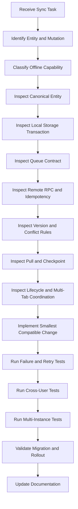

---

# AI Required Synchronization Behaviors

AI-generated synchronization code must:

- Use stable entity IDs.
- Use stable operation IDs.
- Persist entity and queue atomically.
- Preserve owner scope.
- Use explicit operation payload versions.
- Preserve dependencies.
- Implement bounded retry.
- Use idempotent remote commands.
- Reconcile unknown outcomes.
- Enforce expected versions.
- Create durable conflicts.
- Preserve deletion semantics.
- Use deterministic pagination.
- Advance checkpoints after commit.
- Deduplicate Realtime events.
- Keep one coordinator.
- Preserve queues after process termination.
- Preserve queues through updates.
- Stop processing after sign-out.
- Isolate account switching.
- Exclude sensitive logs.
- Add migration and failure tests.

---

# AI Forbidden Synchronization Behaviors

AI tools must not:

- Report synchronization before remote confirmation.
- Store queue only in memory.
- Use one unscoped queue for all users.
- Generate a new entity ID remotely.
- Retry a financial mutation without operation identity.
- Create a new operation ID after an unknown outcome.
- Write entity and operation separately without transaction.
- Use generic last-write-wins.
- Merge financial entities through object spread.
- Advance checkpoints before local commit.
- Use timestamp-only ordering without a tie-breaker.
- Treat Realtime as guaranteed delivery.
- Run several coordinators for one owner.
- Allow Service Worker and page to push the same queue concurrently.
- Delete pending operations during sign-out silently.
- Reset local database after migration failure silently.
- Ignore operation payload versions.
- discard unsupported operations.
- log queue payloads.
- use service-role credentials in client synchronization.
- bypass repositories.
- disable RLS to simplify synchronization.
- recreate remotely deleted entities through stale updates.
- count Transfers as income or expense during repair.
- introduce a second platform-specific synchronization protocol.
- remove conflict tests to simplify implementation.
- perform unrelated architecture rewrites.

---

# AI Operation Review

Before adding or changing an operation, answer:

```text
What entity does it affect?

Is it create, update, delete or command?

Can it run offline?

What is its operation ID?

What is its payload version?

What is its expected remote version?

Which dependencies exist?

Can it be compacted?

What proves remote acceptance?

How is retry idempotent?

What creates a conflict?

How is it migrated after update?

What user-facing state appears?
```

---

# AI RPC Review

Before adding or changing RPC behavior, answer:

```text
How is auth.uid() validated?

Which owner-scoped entities are loaded?

Which invariants are enforced?

How is expected version checked?

How is operation ID stored?

What happens on repeated request?

What happens on payload mismatch?

Which transaction boundary applies?

Which safe result is returned?

Which RLS and two-user tests exist?
```

---

# AI Pull Review

Before changing pull behavior, answer:

```text
What is the cursor?

Is ordering deterministic?

How are equal timestamps handled?

How are deletes delivered?

When does the checkpoint advance?

How are pending local edits handled?

What happens after missed Realtime events?

What happens when the cursor is too old?

Which full-reconciliation path exists?
```

---

# AI Migration Review

Before changing synchronization schema, answer:

```text
Which version changes?

How are queued operations migrated?

How are open conflicts migrated?

How are processing leases migrated?

How are checkpoints migrated?

Can older clients still synchronize?

What happens during forced update?

How is rollback or forward repair handled?

Which data-loss tests exist?
```

---

# Synchronization Pull Request Template

```markdown
## Synchronization Problem

What offline, retry, conflict or multi-device problem is being solved?

## Entity and Operation

Which entity and operation types are affected?

## Offline Capability

Is the workflow offline-full, draft-only, online-required or online-protected?

## Local Persistence

Which stores and atomic writes change?

## Operation Queue

How are operation identity, dependencies, ordering and retry handled?

## Remote Command

Which RPC or remote adapter changes?

## Idempotency

How are repeated and uncertain requests reconciled?

## Concurrency

Which expected version and conflict policy apply?

## Pull and Checkpoint

How are remote changes and tombstones received safely?

## Realtime and Background

How are duplicate coordinators and missed events handled?

## Security

How are owner scope, RLS and session state protected?

## Migration

How are old queues, conflicts and checkpoints migrated?

## Observability

Which metrics and integrity signals are added?

## Tests

Which atomicity, retry, process-death, multi-device and cross-user tests were completed?

## Rollout

Which feature flags, stop conditions and rollback path apply?
```

---

# Synchronization Code Review Checklist

## Identity

```text
□ Entity ID is stable.

□ Operation ID is stable.

□ Operation ID is owner-scoped.

□ Unknown outcomes reuse the same operation ID.

□ Dependencies use stable IDs.
```

## Local Persistence

```text
□ Entity and operation write atomically.

□ Owner namespace is explicit.

□ Payload version is stored.

□ Processing lease is recoverable.

□ Migration preserves pending intent.

□ Quarantine is available for unsupported records.
```

## Remote

```text
□ Session is validated.

□ Owner is derived from authentication.

□ Expected version is enforced.

□ Idempotency is enforced.

□ Payload mismatch is rejected.

□ Domain invariants are enforced.

□ Safe structured errors are returned.
```

## Pull

```text
□ Cursor is deterministic.

□ Pagination includes tie-breaker.

□ Tombstones are delivered.

□ Page commit is atomic.

□ Checkpoint advances after commit.

□ Old cursor recovery exists.

□ Full reconciliation preserves local intent.
```

## Conflicts

```text
□ Base, local and remote context are preserved.

□ Financial fields do not use generic merge.

□ Resolution creates a new operation.

□ Latest remote version is revalidated.

□ Deletion conflicts are explicit.

□ Snapshots have retention rules.
```

## Coordination

```text
□ One coordinator is enforced.

□ Lock loss is handled.

□ Cross-tab events contain safe metadata.

□ Service Worker uses the same lock.

□ Realtime reconnect triggers pull.

□ Active forms are protected.
```

## Security

```text
□ Queue is owner-scoped.

□ Sign-out stops processing.

□ Account switching isolates state.

□ Service-role credentials are absent.

□ Logs exclude operation payloads.

□ Cross-user tests pass.
```

## Delivery

```text
□ Protocol compatibility is reviewed.

□ Old operations migrate.

□ Feature flag has fallback.

□ Rollout metrics exist.

□ Stop conditions are defined.

□ Release tests cover process death and retries.
```

---

# Final Offline and Synchronization Acceptance Criteria

The Nexio offline and synchronization architecture is accepted only when:

1. Offline is treated as a supported product state.

2. Local save remains distinct from authoritative synchronization.

3. Every offline-created entity receives a stable permanent identifier.

4. Every remote mutation uses a stable owner-scoped operation identifier.

5. Local entity and queue records are written atomically.

6. The queue survives application restart and process termination.

7. Queue records are versioned and migratable.

8. Operation dependencies are explicit and enforced.

9. Same-entity operations preserve deterministic order.

10. Compatible updates may be compacted without losing intent.

11. Unknown remote outcomes are reconciled with the original operation ID.

12. Remote mutations are idempotent.

13. Operation-ID reuse with another payload is rejected.

14. Expected entity versions prevent stale overwrites.

15. Financial conflicts never use generic last-write-wins.

16. Conflict resolution preserves base, local and remote context where available.

17. Conflict resolution creates a new traceable operation.

18. Remote deletion cannot be silently overwritten by stale local updates.

19. Tombstones propagate deletion across supported devices.

20. Recurring occurrences remain unique.

21. Import commits remain idempotent.

22. One synchronization coordinator operates per owner and local storage scope.

23. Browser tabs, Service Worker and Android background work share the same coordination rules.

24. Realtime is treated as a notification mechanism rather than durable truth.

25. Missed Realtime events recover through incremental pull.

26. Pull ordering is deterministic and paginated.

27. Checkpoints advance only after local durable commit.

28. Old or invalid checkpoints trigger safe reconciliation.

29. Full reconciliation preserves pending local intent.

30. Long-offline devices cannot recreate deleted entities accidentally.

31. Sign-out stops synchronization without silently losing pending work.

32. Account switching isolates queues, conflicts, checkpoints and local entities.

33. Session expiration pauses synchronization and preserves the queue.

34. Local and remote schema changes support ordered migration.

35. Forced updates preserve pending operations and drafts.

36. Old supported clients remain compatible during rollout.

37. Synchronization logs and metrics exclude financial payloads.

38. Integrity anomalies produce actionable alerts.

39. Financial totals are recalculated from canonical entities after repair.

40. Multi-instance, failure-injection, lifecycle, security and migration tests are mandatory.

41. AI-generated synchronization code follows the same identity, atomicity, idempotency, conflict, ownership and rollout rules as human-generated code.

---

# Offline and Synchronization Constitutional Rule

Every offline, queue, RPC, retry, pull, conflict and migration decision must answer:

```text
Can this user's financial intent survive interruption, duplication, concurrency, process death, long disconnection, application update and multiple devices while remaining owned, exact and recoverable?
```

When the answer is unclear, prefer the implementation that:

- Persists intent before reporting success.
- Uses stable entity and operation identity.
- Writes locally in one transaction.
- Preserves owner scope.
- Retries idempotently.
- Reconciles uncertain results.
- Detects stale versions.
- Preserves both sides of a conflict.
- Protects deletion.
- Advances checkpoints only after commit.
- Uses one coordinator.
- Preserves queues through migration.
- Supports full reconciliation.
- Exposes accurate user status.
- Produces safe integrity monitoring.
- Fails without losing financial intent.

Offline synchronization is not a background convenience.

It is a financial consistency protocol.

---

# Final Authority

This document is the official Offline and Synchronization specification for Nexio.

All future:

- Local databases
- Offline entities
- Pending-operation queues
- Synchronization coordinators
- Retry systems
- Idempotency mechanisms
- Remote mutation RPCs
- Change feeds
- Realtime subscriptions
- Service Worker synchronization
- Checkpoints
- Tombstones
- Conflict workflows
- Full reconciliation
- Synchronization migrations
- Observability
- Rollout strategies
- Synchronization tests

must comply with this specification.

Exceptions require a documented architecture, data, security and synchronization decision.

Undocumented exceptions are considered financial-consistency, security and technical debt.

---