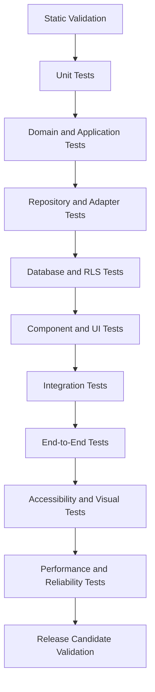
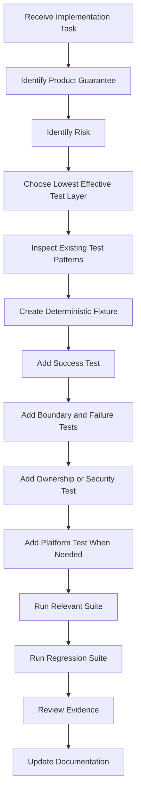

# Nexio Testing and Quality Assurance Specification

Version: 1.0  
Status: Official  
Authority Level: Quality Standard  
Applies To: Web, Desktop, Tablet, Mobile, Android, Capacitor, Supabase, Local Storage, Offline Synchronization and Release Pipelines

---

# Purpose

This document defines the official testing and quality-assurance architecture of Nexio.

It establishes:

- Quality principles
- Test layers
- Test ownership
- Test environments
- Test-data rules
- Unit-testing standards
- Domain-testing standards
- Repository-testing standards
- Local-storage testing
- Supabase testing
- Row-Level Security testing
- Synchronization testing
- Interface testing
- Accessibility testing
- Mobile and Android testing
- Security testing
- Performance testing
- Visual regression
- Migration testing
- Release validation
- Failure investigation
- Flaky-test management
- Quality metrics
- AI implementation requirements

The goal is not merely to increase test quantity.

The goal is to prove that Nexio remains:

- Financially exact
- Secure
- Accessible
- Consistent
- Recoverable
- Responsive
- Compatible
- Understandable
- Safe across platforms and application versions

---

# Relationship with Other Documents

This document must be interpreted together with:

```text
docs/00-FOUNDATION.md
docs/01-ARCHITECTURE.md
docs/02-DESIGN-SYSTEM.md
docs/03-DESKTOP.md
docs/04-TABLET.md
docs/05-MOBILE.md
docs/06-DATA-MODEL.md
docs/07-SECURITY.md
docs/08-OFFLINE-AND-SYNC.md
```

Responsibilities are divided as follows:

| Document | Responsibility |
|---|---|
| `00-FOUNDATION.md` | Product principles and acceptance expectations |
| `01-ARCHITECTURE.md` | Layers, boundaries and dependency direction |
| `02-DESIGN-SYSTEM.md` | Visual, interaction and accessibility standards |
| `03-DESKTOP.md` | Desktop behavior |
| `04-TABLET.md` | Tablet behavior |
| `05-MOBILE.md` | Mobile, Android and Capacitor behavior |
| `06-DATA-MODEL.md` | Entity and persistence invariants |
| `07-SECURITY.md` | Authentication, authorization and protection |
| `08-OFFLINE-AND-SYNC.md` | Local replica, queue, conflict and reconciliation |
| `09-TESTING.md` | Verification of all previous contracts |

Every normative requirement in the preceding documents should have at least one practical verification path.

---

# Quality Constitutional Principles

## Financial Correctness Is Non-Negotiable

Tests must prove that:

- Money remains exact.
- Transactions preserve direction.
- Transfers do not inflate income or expense.
- Account balances derive correctly.
- Goal progress counts contributions once.
- Reports use the correct period.
- Currency values do not combine silently.
- Deleted or cancelled entities do not affect active totals incorrectly.
- Offline retries do not duplicate financial events.

A visually correct interface with incorrect financial meaning is a failed release.

---

## Security Must Be Tested, Not Assumed

Security requirements must have explicit tests for:

- Authentication
- Session expiration
- User ownership
- Row-Level Security
- Cross-owner relationships
- Storage access
- Deep links
- Notification targets
- File access
- Service-role exclusion
- Secret leakage
- Local account isolation

A policy existing in SQL is not proof that the policy behaves correctly.

---

## Accessibility Is a Release Requirement

Accessibility must be verified through:

- Automated checks
- Keyboard tests
- Screen-reader tests
- Touch-target tests
- Text-scaling tests
- Focus-order tests
- Reduced-motion tests
- Color-independent meaning
- Error announcement tests

Accessibility failures in primary financial workflows block release.

---

## Tests Must Reflect User Outcomes

Tests should verify meaningful outcomes.

Preferred:

```text
Creating an expense updates the account balance,
the transaction list and the monthly expense summary.
```

Less useful:

```text
The internal function was called three times.
```

Implementation-detail assertions should be used only when they protect an important boundary.

---

## Tests Must Be Deterministic

A reliable test should produce the same result when:

- Run locally
- Run in CI
- Run repeatedly
- Run in a different order
- Run in another time zone
- Run around midnight
- Run with a different locale
- Run after a clean installation

Tests must not depend accidentally on:

- Current date
- Current time
- Network availability
- Real production data
- Test execution order
- Random identifiers without a seed
- Shared mutable global state

---

## Failure Must Be Diagnosable

When a test fails, the result should identify:

- Workflow
- Expected behavior
- Actual behavior
- Relevant state
- Safe diagnostic information
- Screenshot or trace when appropriate
- Application version
- Test-data identity

A test suite that fails without useful evidence slows recovery and encourages unsafe disabling.

---

## Tests Must Respect Architectural Boundaries

Testing strategy must reinforce:

```text
Domain logic

Application services

Repositories

Persistence adapters

Platform adapters

UI composition
```

Tests must not require UI rendering to verify every financial rule.

Tests must not require a real Android device to validate pure Money arithmetic.

---

## Production Defects Require Regression Tests

Every confirmed defect should produce a regression test at the lowest effective layer.

Example:

```text
Bug:
A retried offline Transaction was created twice.

Required regression:
Remote idempotency test

and

End-to-end unknown-outcome test
```

Fixing code without adding regression coverage leaves the defect partially unresolved.

---

## Tests Must Avoid Sensitive Data

Test fixtures must not contain:

- Production financial records
- Real authentication tokens
- Real bank identifiers
- Real imported statements
- Real user notes
- Real signing credentials
- Production service-role keys

Use synthetic or controlled test data.

---

## Quality Gates Must Be Enforced

A required failing test must block:

- Merge
- Deployment
- Production rollout

It must not be ignored because:

- The change appears visually correct.
- The test is inconvenient.
- The failure happens only on Mobile.
- The problem affects only offline mode.
- The failure is difficult to reproduce manually.

---

# Quality Objectives

Nexio testing should provide confidence in:

## Correctness

Financial and domain rules produce exact results.

## Safety

Unauthorized access and destructive errors are prevented.

## Reliability

Application state survives interruptions and retries.

## Usability

Primary workflows are understandable and complete.

## Accessibility

Users can operate Nexio with assistive technologies.

## Performance

The application remains responsive on representative devices and datasets.

## Compatibility

Published versions remain compatible with current backend and local data.

## Recoverability

Failures, migrations and synchronization problems preserve user intent.

---

# Testing Scope

The official testing scope includes:

```text
Money utilities

Dates and periods

Financial calculations

Entity validation

Application commands

Repositories

Supabase mappings

Database constraints

Row-Level Security

Database functions

Local structured storage

Offline operation queue

Idempotency

Conflict resolution

Realtime intake

Service Worker

Desktop UI

Tablet UI

Mobile UI

Android lifecycle

Capacitor adapters

Permissions

Notifications

Imports

Exports

Attachments

Authentication

Account deletion

Accessibility

Performance

Migrations

Release artifacts
```

---

# Test Architecture Overview



Each layer protects different risks.

No single layer replaces the others.

---

# Test Layers

Recommended layers:

```text
Static Analysis

Pure Unit Tests

Domain Tests

Application-Service Tests

Mapper Tests

Repository Tests

Persistence Tests

Database Constraint Tests

RLS Tests

Platform Adapter Tests

Component Tests

Feature Integration Tests

End-to-End Tests

Accessibility Tests

Visual Regression Tests

Performance Tests

Security Tests

Migration Tests

Release Smoke Tests
```

---

# Static Analysis

Static analysis may verify:

- Syntax
- Type contracts
- Unused code
- Dangerous APIs
- Direct Supabase access from UI
- Unsafe HTML
- Missing promise handling
- Invalid imports
- Dependency boundaries
- Android configuration
- Secret patterns

Static analysis must run before expensive test stages where practical.

---

# Pure Unit Tests

Pure unit tests validate deterministic logic without:

- Network
- Database
- Browser rendering
- Android runtime
- Real clock
- Shared external state

Examples:

- Money arithmetic
- Date-period boundaries
- Transaction validation
- Goal calculations
- Conflict merge rules
- Operation ordering
- Query-key generation

---

# Domain Tests

Domain tests verify business meaning.

Examples:

- Expense reduces an asset account.
- Transfer changes two accounts but not income.
- Cancelled transaction leaves active total.
- Archived Category remains historically valid.
- Goal contribution is counted once.
- Recurring occurrence identity prevents duplication.

---

# Application-Service Tests

Application-service tests verify workflows across domain objects and repository contracts.

Examples:

- Create Transaction command
- Update Transaction command
- Archive Account command
- Merge Category command
- Resolve conflict command
- Complete Import Batch command

External adapters may use controlled fakes.

---

# Mapper Tests

Mapper tests verify conversions between:

```text
Persistence row

Domain entity

Presentation model

Serialized local record
```

Examples:

- PostgreSQL `bigint` string to safe Money
- `snake_case` to `camelCase`
- `date` string preservation
- Null normalization
- Unknown enum handling
- Version conversion

---

# Repository Tests

Repository tests verify:

- Owner scope
- Query mapping
- Error mapping
- Pagination
- Request cancellation
- Local-first behavior
- Remote confirmation
- Conflict result
- Structured return contract

---

# Persistence Tests

Persistence tests verify:

- IndexedDB transactions
- Store indexes
- Owner isolation
- Atomic writes
- Schema migrations
- Quota errors
- Corruption handling
- Draft recovery
- Queue recovery

---

# Database Tests

Database tests verify:

- Tables
- Types
- Constraints
- Foreign keys
- Index behavior
- Functions
- Triggers
- Views
- Migrations

---

# RLS Tests

RLS tests verify actual isolation between:

```text
User A

User B

Unauthenticated user
```

They must use authenticated database requests, not only SQL inspection.

---

# Component Tests

Component tests verify isolated interface behavior.

Examples:

- Money input
- Date field
- Transaction list item
- Privacy-value component
- Bottom sheet
- Dialog
- Sync-status badge
- Conflict comparison field

---

# Feature Integration Tests

Feature integration tests verify a complete feature with controlled repositories or a test backend.

Examples:

- Transaction form and list
- Account detail
- Goal contribution
- Report filtering
- Settings security flow

---

# End-to-End Tests

End-to-end tests verify real user journeys across:

- UI
- Application services
- Repositories
- Test database
- Authentication
- Local storage

They are fewer, slower and higher-value.

---

# Accessibility Tests

Accessibility tests verify:

- Semantic structure
- Names and roles
- Keyboard behavior
- Screen-reader behavior
- Text scaling
- Contrast
- Focus
- Touch targets
- Motion preference

---

# Visual Regression Tests

Visual tests detect:

- Layout breaks
- Spacing regressions
- Wrong typography
- Hidden content
- Overlay clipping
- Mobile safe-area failures
- Dark-theme errors
- Privacy flash

They must not replace semantic or behavioral tests.

---

# Performance Tests

Performance tests measure:

- Startup
- Rendering
- List scrolling
- Search
- Chart rendering
- Local mutation
- Synchronization
- Import parsing
- Database queries
- Memory use
- Battery-sensitive behavior

---

# Security Tests

Security tests verify:

- Authentication
- Authorization
- RLS
- XSS
- File validation
- Deep-link validation
- Notification-target validation
- Secret absence
- WebView restrictions
- Export access

---

# Migration Tests

Migration tests verify:

- Supabase schema changes
- Local database upgrades
- Operation-payload upgrades
- Conflict-schema upgrades
- Checkpoint upgrades
- Old application compatibility

---

# Release Smoke Tests

Release smoke tests verify the exact production candidate.

They must use:

- Production build mode
- Release configuration
- Correct package
- Correct version
- Correct permissions
- Correct endpoints
- No debug tools
- No test data

---

# Test Pyramid

The Nexio test pyramid should favor fast, focused tests.

```text
Large foundation:
Unit and domain tests

Middle:
Repository, adapter and integration tests

Smaller top:
End-to-end, device and release tests
```

A healthy system should not depend primarily on slow end-to-end tests.

---

# Test Pyramid Guidance

Recommended relative emphasis:

```text
Many:
Unit and domain tests

A substantial number:
Repository, database and component tests

A focused set:
Integration tests

A smaller critical set:
End-to-end and device tests
```

Exact counts are less important than risk coverage.

---

# Test Distribution by Risk

Higher-risk areas require more layers.

Example: Transaction creation

```text
Money unit test

Transaction validation test

Application-command test

Repository test

RLS test

Offline-queue test

UI form test

End-to-end test

Android lifecycle test
```

Example: Decorative icon alignment

```text
Component test

Visual regression
```

---

# Test Ownership

Every test suite should have an owner.

Recommended ownership categories:

```text
Domain Owner

Data Owner

Security Owner

Desktop UI Owner

Mobile UI Owner

Android Owner

Release Owner

Quality Owner
```

---

# Test Maintenance Ownership

Ownership includes:

- Updating tests when requirements change
- Investigating failures
- Removing obsolete tests
- Fixing flaky tests
- Reviewing fixtures
- Maintaining environments
- Reviewing performance budgets
- Preserving regression coverage

---

# Test Naming Standard

Test names should describe behavior.

Preferred:

```text
rejects a Transfer when source and destination Accounts are equal
```

Avoid:

```text
testTransfer2
```

---

# Test Structure

Recommended pattern:

```text
Given

When

Then
```

Example:

```javascript
test("does not count Transfers as income or expense", () => {
  // Given
  const transactions = [
    createTransfer({ amountMinor: 50000 })
  ];

  // When
  const summary = calculatePeriodSummary(transactions);

  // Then
  expect(summary.income.minorUnits).toBe(0);
  expect(summary.expenses.minorUnits).toBe(0);
});
```

---

# Test Isolation

Each test should create its own state.

Avoid:

- Shared mutable entity arrays
- Tests depending on previous insertion
- Reused authenticated session without reset
- One global IndexedDB reused across suites
- One database row modified by several parallel tests
- Implicit sequence dependencies

---

# Parallel Execution

Tests may run in parallel only when they have isolated:

- User identifiers
- Database schema or records
- Local database name
- Files
- Ports
- Application instances
- Notification tokens
- Temporary directories

---

# Test Repeatability

A test should pass when run:

```text
Alone

With the full suite

In random order

Several times

On CI

On a developer machine
```

---

# Random Test Data

Random test data should use:

- Fixed seed
- Recorded seed on failure
- Stable factories
- Deterministic cleanup

Completely uncontrolled randomness makes failures difficult to reproduce.

---

# Property-Based Testing

Property-based tests are useful for:

- Money allocation
- Date periods
- Transaction aggregation
- Queue ordering
- Idempotency
- Serialization
- Merge invariants

Example property:

```text
For any valid allocation:

Sum of allocated parts

equals

Original amount.
```

---

# Golden Tests

Golden or snapshot tests may verify:

- Stable serialized contracts
- Export format
- Complex report result
- Accessibility tree
- Visual output

They must be reviewed carefully.

A snapshot update is not proof that the new output is correct.

---

# Snapshot Test Rules

Before updating a snapshot:

- Understand every changed field.
- Confirm product intent.
- Check sensitive content.
- Avoid snapshots of unstable timestamps.
- Avoid entire application-state snapshots without need.
- Avoid masking real regressions through mass updates.

---

# Test Environments

Recommended environments:

```text
Local Development

Automated Unit Environment

Automated Integration Environment

Supabase Test Environment

Browser End-to-End Environment

Android Emulator Environment

Physical Device Environment

Staging

Release Candidate Environment
```

---

# Local Development Environment

Purpose:

- Fast feedback
- Focused debugging
- Unit and component testing
- Local integration
- Synthetic data

It must not require production credentials.

---

# Automated Unit Environment

Characteristics:

- No external network
- Controlled clock
- Deterministic locale
- Deterministic time zone
- Isolated filesystem
- Fast execution
- Repeatable seed

---

# Automated Integration Environment

May include:

- Local or isolated database
- Test Supabase project
- IndexedDB implementation
- Test authentication
- Browser runtime
- Service Worker
- Controlled network simulation

---

# Supabase Test Environment

Must be separate from production.

It should contain:

- Test authentication users
- Test schema
- Test migrations
- RLS policies
- Storage buckets
- Test database functions
- Synthetic data only

---

# Browser End-to-End Environment

Should support:

- Chromium-based browser
- Additional supported browser where applicable
- Desktop viewport
- Tablet viewport
- Mobile viewport
- Offline simulation
- Permission simulation
- Accessibility inspection
- Download and upload testing

---

# Android Emulator Environment

Should support:

- Clean installation
- Upgrade installation
- Process termination
- Background and resume
- Deep links
- Notifications
- Permissions
- Rotation
- Virtual keyboard
- Network changes
- WebView behavior
- App-switcher privacy

---

# Physical Device Environment

Required for behaviors difficult to trust only in emulation:

- Real performance
- Memory pressure
- Battery behavior
- Biometric prompt
- Camera
- File providers
- Notification behavior
- OEM keyboard behavior
- Gesture navigation
- App-switcher preview
- Low-memory process termination

---

# Staging

Staging should resemble production in:

- Build mode
- Authentication
- RLS
- Database schema
- Storage policies
- Security headers
- Android configuration
- Feature flags
- Realtime
- Service Worker

Staging must not use production user data.

---

# Release Candidate Environment

The release candidate must be the exact artifact intended for distribution.

Do not replace it with a debug build for final validation.

---

# Environment Configuration

Each environment must define:

```text
Application URL

Supabase project

Public client configuration

Feature flags

Logging level

Analytics destination

Notification destination

Storage bucket

Android application ID

Build mode
```

---

# Environment Isolation

Development and test environments must not:

- Send production notifications
- Write production data
- Use production signing credentials unnecessarily
- Pollute production analytics
- Trigger production emails
- Share production storage buckets

---

# Test Accounts

Test accounts should use controlled identities.

Recommended:

```text
User A

User B

User C for deleted or locked scenarios
```

Identifiers should be generated or reserved for testing.

---

# Test-Data Principles

Test data must be:

- Synthetic
- Deterministic
- Minimal
- Representative
- Safe
- Easy to create
- Easy to remove
- Owner-scoped
- Valid by default

---

# Test Data Factories

Recommended factories:

```javascript
createTestProfile()

createTestAccount()

createTestCategory()

createTestTransaction()

createTestTransfer()

createTestRecurringRule()

createTestGoal()

createTestContribution()

createTestNotification()

createTestImportBatch()

createTestOperation()

createTestConflict()
```

---

# Factory Defaults

Factories should create valid canonical entities by default.

Example:

```javascript
createTestExpense({
  amountMinor: 18540
});
```

should supply:

- Valid owner
- Valid Account
- Valid Category
- Valid date
- Valid version
- Valid currency

Invalid test cases should override explicitly.

---

# Invalid Data Builders

Use explicit helpers:

```javascript
createInvalidTransfer({
  sameAccount: true
});
```

or direct controlled changes.

Avoid factories that produce random invalid combinations unintentionally.

---

# Time Control

Tests should use an injectable Clock.

Conceptual interface:

```javascript
clock.now()

clock.today(timeZone)

clock.advance(duration)

clock.set(instant)
```

Production uses the real clock.

Tests use a fixed clock.

---

# Fixed Date

Example:

```text
Current instant:
2026-07-23T14:30:00.000Z

User time zone:
America/Sao_Paulo
```

All date-dependent tests should declare their temporal context.

---

# Time-Zone Matrix

Test at least:

```text
America/Sao_Paulo

UTC

A time zone ahead of UTC

A time zone behind UTC
```

When recurrence or date boundaries are involved.

---

# Locale Matrix

Test supported formatting with:

```text
pt-BR

en-US or another contrasting locale
```

Canonical data must remain unchanged.

---

# Currency Test Data

Use representative currencies with different minor-unit behavior when multi-currency support exists.

Examples may include:

```text
BRL

USD

A zero-decimal currency

A three-decimal currency
```

Only supported currencies should enter product tests.

---

# Money Test Boundaries

Include:

```text
1 minor unit

Zero when allowed only in derived state

Large safe integer

Maximum supported amount

Negative derived balance

Allocation remainder

Different currencies
```

---

# Synthetic Financial Dataset

A representative dataset should include:

- Income
- Expense
- Transfer
- Pending transaction
- Cancelled transaction
- Archived Account
- Archived Category
- Goal contribution
- Recurring Transaction
- Imported Transaction
- Refund
- Deleted Transaction
- Multiple periods
- Multiple currencies when supported

---

# Data Cleanup

Integration and end-to-end tests must clean:

- Database rows
- Storage objects
- Local databases
- Service Worker caches
- Notifications
- Temporary files
- Test sessions
- Push registrations

Cleanup must run even after failure where practical.

---

# Cleanup Safety

Cleanup must be scoped to:

- Test user
- Test run identifier
- Test database
- Test bucket path
- Test application package

A test cleanup function must never target production resources.

---

# Test Run Identifier

A test run may use:

```text
testRunId
```

for:

- Entity prefixes
- User identities
- File paths
- Diagnostics
- Cleanup

It must not replace real entity IDs inside domain logic.

---

# Test Fixtures

Static fixtures are appropriate for:

- Legacy schema examples
- Import files
- Export expected files
- Malformed payloads
- Security attack strings
- Migration snapshots

Fixtures must remain small and understandable.

---

# Import Fixtures

Recommended fixture categories:

```text
valid-small.csv

valid-multiline.csv

invalid-date.csv

invalid-amount.csv

duplicate-candidate.csv

formula-injection.csv

oversized-cell.csv

utf8.csv

legacy-format.csv
```

---

# Attachment Fixtures

Use safe synthetic files representing:

- Valid image
- Valid PDF
- Wrong extension
- MIME mismatch
- Oversized file
- Corrupted file
- Malformed metadata
- Unsupported executable

Do not commit real private documents.

---

# Unit Testing Standards

Unit tests should be:

- Fast
- Pure
- Focused
- Deterministic
- Independent
- Descriptive
- Extensive for financial logic

---

# Unit Test Boundaries

A unit test should normally test one:

- Function
- Class
- Selector
- Validator
- Mapper
- State reducer
- Queue policy
- Merge rule

It may use simple collaborators when the behavior remains focused.

---

# Mocking Principles

Mocks should represent boundaries, not every internal function.

Good mock targets:

- Network
- Clock
- UUID generator
- Repository interface
- Platform adapter
- File picker
- Notification adapter

Avoid mocking:

- The function under test
- Every helper in the same module
- Pure Money utilities
- Domain validation unnecessarily
- Internal call counts with no product meaning

---

# Fake Versus Mock

## Fake

A working lightweight implementation.

Examples:

- In-memory repository
- Fake Clock
- Fake local database
- Fake notification adapter

## Mock

An expectation-based replacement.

Use fakes for stateful workflow tests.

Use mocks for narrow interaction guarantees.

---

# Stub

A stub returns predefined results.

Useful for:

- Remote accepted result
- Permission denial
- Session expiration
- File-picker cancellation
- Network timeout

---

# Spy

A spy observes calls.

Use only when call behavior is itself important.

Example:

```text
The secure-storage adapter must be cleared on sign-out.
```

---

# Domain Unit Test Catalog

Core areas:

```text
Money

Percentage

Date-only values

Periods

Financial month

Transaction validation

Transfer validation

Account balance

Net worth

Goal progress

Category hierarchy

Recurring dates

Notification deduplication

Import normalization

Operation ordering

Retry calculation

Three-way merge

Deletion state
```

---

# Money Utility Tests

Required:

```text
Addition

Subtraction

Comparison

Equality

Allocation

Ratio multiplication

Rounding

Formatting

Currency mismatch

Safe-integer validation

Database-string conversion

Serialization

Deserialization
```

---

# Money Addition

Example:

```text
R$ 10,50

+

R$ 2,25

=

R$ 12,75
```

The test must use canonical minor units.

---

# Currency Mismatch Test

```text
BRL 100

+

USD 100

→ Error or separated result
```

The utility must never combine them silently.

---

# Money Allocation

Example:

```text
R$ 100,00 allocated into 3 equal parts
```

Required properties:

- Every part uses integer minor units.
- Sum equals R$ 100,00.
- Remainder distribution is deterministic.

---

# Money Formatting Test

Verify:

```text
Canonical:
125050 minor units BRL

pt-BR:
R$ 1.250,50
```

Formatting test must not modify canonical data.

---

# Safe Integer Test

Values beyond supported range must be rejected before financial arithmetic.

---

# Percentage Tests

Verify:

- Canonical basis-point representation
- Zero denominator
- Negative result where meaningful
- Rounding
- Display precision
- Values above 100%
- Values below 0% when domain allows

---

# Date-Only Tests

Required:

```text
Parse YYYY-MM-DD

Reject invalid day

Preserve date across time zones

Leap year

Month end

Year transition

Comparison

Range inclusion

Serialization
```

---

# UTC Shift Regression Test

A date-only value:

```text
2026-07-23
```

must remain:

```text
2026-07-23
```

in:

- America/Sao_Paulo
- UTC
- Another supported time zone

---

# Period Tests

Verify:

- Start inclusive
- End inclusive
- Month boundary
- Custom financial-month start
- Day 31 fallback
- Leap-year February
- Date-range validation
- Previous-period comparison

---

# Financial Month Test

Example:

```text
financialMonthStartDay:
25

Reference date:
2026-07-23
```

The active financial period may be:

```text
2026-06-25 through 2026-07-24
```

according to the approved rule.

---

# Transaction Validation Tests

Required:

```text
Valid income

Valid expense

Valid transfer

Zero amount

Negative amount

Missing Account

Missing source Account

Missing destination Account

Same transfer Account

Currency mismatch

Invalid Category compatibility

Archived Account

Deleted Account

Archived Category

Cross-owner Account

Cross-owner Category

Invalid date

Invalid status transition

Invalid source
```

---

# Transfer Tests

Verify:

- One stable Transaction identity
- Positive Money magnitude
- Source and destination differ
- Currency compatibility
- No Category
- Correct balance effect
- No income or expense effect
- Idempotent create
- Atomic validation

---

# Account Balance Tests

Test combinations:

```text
Opening balance

Income

Expense

Transfer sent

Transfer received

Pending transaction

Cancelled transaction

Deleted transaction

Archived Account

Liability Account
```

---

# Asset Account Balance Example

```text
Opening balance:
R$ 1.000,00

Income:
R$ 500,00

Expense:
R$ 200,00

Transfer sent:
R$ 100,00

Transfer received:
R$ 50,00

Expected:
R$ 1.250,00
```

---

# Liability Balance Tests

Verify the selected liability model.

Do not reuse asset arithmetic without explicit mapping.

---

# Net Worth Tests

Verify:

- Assets add
- Liabilities subtract
- Excluded Accounts do not count
- Archived Account rule
- Multiple currencies remain separate
- Empty state
- Negative net worth

---

# Period Summary Tests

Verify:

```text
Income total

Expense total

Net result

Transaction count

Transfer exclusion

Opening-balance exclusion

Cancelled exclusion

Deleted exclusion

Date boundary

Account filter

Category filter

Currency grouping
```

---

# Goal Progress Tests

Required:

- No contributions
- One contribution
- Several contributions
- Linked transaction
- Duplicate contribution prevention
- Deleted contribution
- Target reached
- Target exceeded
- Different currency
- Completed Goal
- Archived Goal

---

# Category Hierarchy Tests

Verify:

- Valid parent
- Self-parent rejection
- Cycle rejection
- Maximum depth
- Compatibility
- Archived parent
- Deleted parent
- Sort order
- Merge validation
- Same-owner relationship

---

# Recurring Rule Tests

Required:

```text
Daily interval

Weekly interval

Monthly day

Yearly date

Day 31 last-day policy

Day 31 skip policy

Leap year

End date

Paused rule

Completed rule

Occurrence identity

Duplicate occurrence

Time-zone behavior
```

---

# Recurrence Property

For every supported recurrence:

```text
Generated occurrence dates must be strictly increasing.
```

unless the rule is completed.

---

# Notification Tests

Verify:

- Deduplication key
- Read-state consistency
- Expiration
- Priority
- Target validation
- Privacy rendering
- Read monotonic merge
- Deleted target
- Unauthorized target

---

# Import Normalization Tests

Verify:

- Amount parsing
- Date parsing
- Debit and credit mapping
- Description trimming
- Account mapping
- Category mapping
- Duplicate candidate
- Formula-like text
- Invalid row
- Warning row
- Excluded row
- Unicode
- Locale-specific decimal

---

# Export Unit Tests

Verify:

- Correct columns
- Correct Money format
- Correct date format
- Field escaping
- CSV quotes
- Formula neutralization
- Sensitive-field exclusion
- Stable ordering
- Empty export
- Multiple currencies

---

# Operation Ordering Tests

Verify:

```text
Create before Update

Update before Delete

Dependency before dependent operation

Retry wait blocks only itself

Independent operations remain eligible

Same-entity operations remain sequential

Stable ordering with equal timestamps

Owner isolation
```

---

# Operation Compaction Tests

Verify:

- Two compatible field updates merge.
- Latest field value wins only for the same local intent chain.
- Delete supersedes unsent update where safe.
- Create and delete may cancel when never sent.
- Transfer commands do not compact unsafely.
- Import commit does not compact with rollback.
- Dependencies remain valid.

---

# Retry Calculation Tests

Verify:

- Initial delay
- Exponential increase
- Maximum cap
- Jitter bounds
- `Retry-After`
- Attempt reset after success
- Non-retryable error
- Authentication pause
- Manual retry

---

# Three-Way Merge Tests

For every entity:

```text
Only local changed

Only remote changed

Both changed same value

Both changed different values

Independent fields

Dependent fields

Missing base

Remote deletion

Local deletion
```

---

# Transaction Merge Unit Tests

Required:

- Description and Category independent merge
- Amount conflict
- Account conflict
- Type conflict
- Currency conflict
- Notes conflict
- Transfer conflict
- Deleted Category dependency
- Archived Account dependency
- Latest-version validation

---

# Privacy Logic Tests

Verify:

- Hidden Money renders protected value.
- Accessible label does not reveal hidden Money.
- Copy action does not reveal hidden Money.
- Notification uses protected content.
- App preview uses protected content.
- Export requires explicit scope.
- Privacy preference conflict chooses safer state.

---

# Selector Tests

Selectors should be pure and tested for:

- Empty state
- Loaded state
- Partial data
- Pending local projection
- Deleted entities
- Archived entities
- Multiple currencies
- Stable memoization where relevant
- No mutation of input state

---

# State Reducer Tests

Verify:

- Entity normalization
- Query result update
- Pending status
- Conflict state
- Realtime duplicate
- Sign-out clear
- Account switch clear
- Privacy state
- Session expiration
- Stale response rejection

---

# Mapper Testing Standards

Every mapper must test:

```text
Valid row

Optional null fields

Bigint string

Date-only value

Timestamp

Unknown enum

Missing required field

Unexpected extra field

Unsafe integer

Invalid owner

Legacy field fallback
```

---

# Round-Trip Mapping

Where applicable:

```text
Domain entity

↓

Persistence representation

↓

Domain entity
```

must preserve canonical meaning.

Exact technical metadata may differ where server-generated values apply.

---

# Unknown Field Behavior

Safe additive persistence fields may be ignored.

Unknown required enum values must produce a controlled mapping error.

---

# Repository Unit Testing

Repositories should be tested with fake adapters for:

- List
- Get by ID
- Create
- Update
- Delete
- Archive
- Restore
- Summarize
- Offline fallback
- Remote confirmation
- Error mapping
- Cancellation

---

# Repository Ownership Tests

Verify repository context cannot accidentally use a form-provided owner.

Expected owner comes from trusted session context.

---

# Repository Error Mapping Tests

Map:

```text
Network error

Offline

RLS denial

Constraint failure

Version conflict

Not found

Authentication error

Timeout

Schema error

Unknown error
```

into the official error taxonomy.

---

# Request Cancellation Tests

Verify:

- Aborted query stops result application.
- Cancelled request does not show user error.
- Old response cannot replace new filter result.
- Aborted synchronization preserves operation.

---

# Stale Response Tests

Scenario:

```text
Query A starts.

Query B starts later.

Query B returns first.

Query A returns afterward.
```

Query A must not overwrite Query B state.

---

# Query-Key Tests

Verify equivalent filter objects produce the same deterministic key.

Property order must not affect the key.

---

# Pagination Unit Tests

Verify:

- Stable ordering
- Tie-breaker ID
- Cursor encoding
- Cursor decoding
- Empty next page
- Insert between pages
- Delete between pages
- Multiple equal dates
- Owner scope

---

# Local Database Unit and Integration Boundary

Pure storage wrappers may use focused tests.

Actual IndexedDB behavior requires integration tests with a real or faithful implementation.

Do not rely only on a simplistic Map fake for transaction and migration behavior.

---

# Test Doubles for Platform Adapters

Recommended fakes:

```text
Fake Network Adapter

Fake Lifecycle Adapter

Fake Permission Adapter

Fake Notification Adapter

Fake File Adapter

Fake Secure Storage Adapter

Fake Share Adapter

Fake Biometric Adapter
```

---

# Platform Adapter Contract Tests

Every real adapter must pass the same contract suite as its fake.

Example:

```text
Permission adapter:

unknown

granted

denied

permanently denied

revoked

unavailable
```

---

# Contract Test Pattern

```javascript
function permissionAdapterContract(createAdapter) {
  test("returns denied without throwing when permission is denied", async () => {
    const adapter = createAdapter({
      state: "denied"
    });

    await expect(adapter.request("camera"))
      .resolves
      .toMatchObject({
        state: "denied"
      });
  });
}
```

The same contract can test:

- Browser implementation
- Capacitor implementation
- Fake implementation

---

# Unit Test Anti-Patterns

The following are prohibited:

## Testing Private Implementation Only

Asserting call order without proving user or domain behavior.

## Mocking Everything

Replacing the entire domain with mocks so no real rule is tested.

## Current-Date Dependency

Using the real current date in deterministic unit tests.

## Random Unseeded Fixtures

Generating unreproducible failures.

## Snapshot-Only Financial Test

Approving financial output by updating a snapshot without explicit assertions.

## Shared Mutable Fixture

One test changing data used by another.

## Production Data Fixture

Using real user records.

## Floating-Point Expected Value

Using imprecise decimal arithmetic in test expectations.

## Silent Unknown Enum Default

Expecting unsupported persistence values to become a valid default.

## Testing UI for Pure Math

Rendering a complete screen only to verify Money addition.

## Excessive Call-Count Assertions

Failing tests after harmless internal refactoring.

---

# Unit Testing Review Questions

Before approving a unit-test suite, answer:

```text
Which product or domain rule is protected?

Is the test deterministic?

Does it use canonical Money and date types?

Does it depend on the real clock?

Does it depend on execution order?

Does it verify behavior instead of only implementation?

Are boundary values included?

Are invalid states included?

Are owner and currency rules included?

Will the failure message explain the defect?

Can this defect be tested at a lower and faster layer?
```

---

# Part 1 Acceptance Criteria

The testing foundation is accepted only when:

```text
□ Quality principles are documented.

□ Financial correctness is treated as a release requirement.

□ Security and accessibility require explicit verification.

□ Test layers have clear responsibilities.

□ Unit and end-to-end tests are not used interchangeably.

□ Test environments are isolated from production.

□ Test data is synthetic and owner-scoped.

□ Real production credentials are absent.

□ Time and time zone are controllable.

□ Test factories create valid canonical entities.

□ Invalid fixtures are explicit.

□ Tests are independent and deterministic.

□ Random data uses reproducible seeds.

□ Money utilities have exhaustive boundary coverage.

□ Date-only values are tested across time zones.

□ Period and financial-month rules are tested.

□ Transaction and Transfer invariants are covered.

□ Account balance and net-worth calculations are covered.

□ Goal progress and contribution uniqueness are covered.

□ Category hierarchy prevents cycles.

□ Recurring occurrence identity is tested.

□ Import and export normalization are covered.

□ Queue ordering and retry calculations are covered.

□ Three-way merge rules are covered.

□ Privacy logic prevents hidden-value leakage.

□ Mapper round trips preserve canonical meaning.

□ Repository ownership and error mapping are tested.

□ Request cancellation and stale response behavior are tested.

□ Platform adapters have reusable contract tests.

□ Confirmed defects require regression tests.

□ Unit-test anti-patterns are prohibited.
```

---

# Testing Constitutional Rule

Every test decision must answer:

```text
What user, financial, security, accessibility or reliability guarantee does this test prove, and at which layer can that guarantee be verified most clearly and efficiently?
```

When the answer is unclear, prefer the test that:

- Protects product behavior.
- Uses the lowest effective layer.
- Uses exact canonical values.
- Is deterministic.
- Is isolated.
- Produces useful failure evidence.
- Avoids production data.
- Covers boundaries.
- Reinforces architecture.
- Prevents regression.
- Runs reliably in CI.

Tests are not documentation that code executed.

They are evidence that Nexio preserved its promises.

---
---

# Integration Testing Architecture

Integration tests verify that several real Nexio components work together through their public contracts.

They should exercise combinations such as:

```text
Application Service

+

Repository

+

Mapper

+

Persistence Adapter
```

or:

```text
UI Feature

+

Application State

+

Repository Contract
```

Integration tests must not automatically become complete end-to-end tests.

The objective is to prove that boundaries integrate correctly while preserving fast and diagnosable feedback.

---

# Integration Test Scope

Recommended integration targets:

```text
Application command with local repository

Application command with Supabase repository

Repository with real mapper

Repository with real IndexedDB

Repository with isolated Supabase environment

Authentication adapter with protected repository

Synchronization coordinator with local queue

Synchronization coordinator with fake remote service

Conflict resolution with repositories

Feature controller with real application services

Service Worker with cache and message channels

Realtime coordinator with repository intake
```

---

# Integration Test Boundaries

An integration test should clearly identify:

- Real components
- Replaced external systems
- Owner context
- Clock
- Network state
- Database state
- Expected persistence effect
- Expected application result

Example:

```text
Real:
Transaction application service
Transaction repository
IndexedDB adapter
Operation queue

Fake:
Remote Supabase adapter
```

---

# Integration Test Determinism

Integration tests must control:

- Authentication user
- Current date
- UUID generation where assertions require stable values
- Database name
- Network response
- Retry timing
- Feature flags
- Local-storage version
- Realtime event order

---

# Integration Test Isolation

Each test should use a unique:

```text
Database name

Owner ID

Test run ID

Storage path

Notification registration

Service Worker scope where possible
```

Parallel tests must not share mutable records.

---

# Integration Fixture Lifecycle

Recommended lifecycle:

```text
Create isolated environment

↓

Apply schema or local migrations

↓

Create synthetic users and entities

↓

Run workflow

↓

Collect assertions and diagnostics

↓

Remove data and temporary resources
```

---

# Application-Service Integration Tests

Application-service integration tests should verify complete command behavior across:

- Input normalization
- Domain validation
- Repository calls
- Local persistence
- Queue creation
- Derived-state invalidation
- Error mapping

---

# Create Transaction Integration Test

Required scenario:

```text
Given:
Authenticated User A
Active BRL Account
Valid expense Category
Online or offline-capable repository

When:
User creates an Expense

Then:
Transaction receives a stable ID
Operation receives a stable ID
Transaction is stored locally
Operation is queued atomically
Transaction appears in the active query
Account balance changes
Monthly Expense summary changes
Remote status remains accurate
```

---

# Create Transaction Atomicity Test

Simulate failure after:

```text
Entity write

but before

Operation write
```

Expected:

```text
Neither Entity nor Operation persists.
```

The test must use the actual local transaction implementation.

---

# Update Transaction Integration Test

Verify:

- Expected version included
- Only changed fields submitted
- Local projection updates
- Operation queue stores patch
- Derived totals recalculate when amount, date or Account changes
- Description-only edit does not alter totals
- Archived relationship is rejected

---

# Delete Transaction Integration Test

Verify:

- Active query removes Transaction
- Pending delete operation is stored
- Account balance recalculates
- Undo restores the local entity before synchronization
- Remote-confirmed deletion produces tombstone
- Deleted Transaction does not return through stale query cache

---

# Transfer Integration Test

Verify:

- One canonical Transfer entity
- Source Account decreases
- Destination Account increases
- Income and Expense summaries remain unchanged
- Queue contains one Transfer operation
- Retry does not create another Transfer
- Delete or cancellation restores both Account effects correctly

---

# Category Integration Tests

Required:

```text
Create Category

Rename Category

Archive Category

Restore Category

Merge Category

Reject hierarchy cycle

Reject cross-owner parent

Preserve historical Transaction references
```

---

# Category Merge Integration Test

Given:

- Source Category with Transactions
- Destination Category
- Recurring Rules referencing source
- Current versions

When:

```text
Merge command executes
```

Then:

- Relationships move atomically
- Source becomes archived or deleted according to policy
- Destination remains valid
- Reports recalculate
- No Transaction becomes uncategorized
- Retry does not repeat destructive work

---

# Goal Integration Tests

Verify:

- Goal creation
- Contribution creation
- Linked Transaction
- Contribution removal
- Target completion
- Progress recalculation
- Duplicate contribution prevention
- Archived Goal remains historically visible

---

# Import Integration Tests

Import integration should exercise:

```text
File selection result

Parser

Normalizer

Mapper

Validation

Review state

Commit service

Transaction repository

Import Batch update
```

---

# Import Commit Integration Test

Given:

- Reviewed Import Batch
- Valid normalized rows
- Stable batch and operation IDs

When:

```text
Import is confirmed
```

Then:

- Transactions use normal repository validation
- Batch status changes accurately
- Imported row links to created Transaction
- Counts match
- Retry returns accepted result
- No duplicate Transaction is created
- Derived state updates

---

# Import Partial Failure Test

When partial completion is supported:

- Valid rows commit according to policy.
- Invalid rows remain reviewable.
- Batch status becomes `partially_completed`.
- Imported count is exact.
- Retry does not duplicate accepted rows.
- User can understand unresolved rows.

When atomic import is required:

- One invalid row causes the complete transaction to roll back.
- No partial Transaction remains.

---

# Export Integration Tests

Verify:

- Repository query uses active owner
- Filters match current scope
- Internal fields excluded
- Money and Date formatted correctly
- Formula protection applied
- Temporary file created
- Share or Download adapter receives only approved file
- Temporary file is cleaned

---

# Authentication Integration Tests

Authentication integration should verify interactions among:

```text
Authentication Adapter

Session State

Repository Scope

Local Database

Realtime Coordinator

Synchronization Coordinator

Application Router
```

---

# Session Restoration Integration Test

Given:

- Stored valid session
- Local data for User A

When:

```text
Application starts
```

Then:

- Protected shell displays first
- Session validates
- User A namespace opens
- Local data loads
- Realtime and synchronization start for User A
- No unauthenticated content flashes over protected data

---

# Expired Session Integration Test

Given:

- Expired session
- Pending operations for User A

When:

```text
Application starts or resumes
```

Then:

- Financial content follows lock and security policy
- Queue remains intact
- Synchronization pauses
- Sign-in is requested
- Another user cannot inherit the queue

---

# Account Switch Integration Test

Given:

- User A authenticated with cached data
- User B signs in

Then:

- User A synchronization stops
- User A Realtime closes
- User A in-memory data clears
- User B namespace opens
- User B data loads
- No User A Transaction, Account, Goal or Notification appears

---

# Supabase Integration Testing

Supabase integration tests must use an isolated non-production project or local Supabase environment.

They should validate:

- Authentication
- Database schema
- RLS
- Storage policies
- Database functions
- Realtime
- Migrations
- Error mapping
- Idempotency

---

# Supabase Environment Setup

A test environment should include:

```text
Current migrations

Current RLS policies

Current database functions

Current Storage buckets and policies

Synthetic test users

Known configuration

Automated cleanup
```

Tests must fail when schema initialization is incomplete.

---

# Migration-First Setup

Integration environments should be created through official migrations.

Avoid manually creating tables for tests in a way that differs from production.

Recommended:

```text
Create empty test database

↓

Apply all migrations in order

↓

Apply safe test seed

↓

Run tests
```

---

# Supabase Client Roles

Tests should use the correct role for each scenario.

```text
Anonymous client

Authenticated User A client

Authenticated User B client

Trusted administrative test client
```

Administrative credentials may prepare and clean data.

They must not be used for ordinary authorization assertions.

---

# Supabase Mapper Integration

Verify actual response types for:

- UUID
- `bigint`
- `date`
- `timestamptz`
- nullable values
- JSON fields
- enum-like text
- RPC results

Do not assume local mock behavior matches the real client.

---

# Bigint Integration Test

Insert an amount within the supported high range.

Verify:

- PostgreSQL stores exact value.
- Supabase client returns expected representation.
- Mapper normalizes safely.
- Domain Money remains exact.
- Invalid unsafe values are rejected.

---

# Date Integration Test

Insert:

```text
transaction_date:
2026-07-23
```

Read it in different client time zones.

Expected:

```text
2026-07-23
```

It must not shift to the previous day.

---

# Timestamp Integration Test

Verify:

- `created_at` and `updated_at` use UTC-capable timestamps.
- Domain mapping preserves instant.
- Display conversion uses Profile time zone.
- Technical timestamp does not replace financial Date.

---

# Database Constraint Tests

Every important constraint must have:

```text
One accepted case

One rejected case
```

---

# Account Constraint Tests

Verify rejection of:

- Empty name
- Unsupported type
- Unsupported classification
- Invalid Currency structure
- Invalid credit day
- Unsafe opening balance
- Duplicate key where prohibited

---

# Category Constraint Tests

Verify rejection of:

- Empty name
- Invalid compatibility
- Self-parent
- Cross-owner parent through composite foreign key
- Duplicate normalized active name where prohibited

Hierarchy cycles require separate function or trigger tests.

---

# Transaction Constraint Tests

Verify rejection of:

- Unsupported type
- Zero amount
- Negative amount
- Missing Account for Income
- Missing Account for Expense
- Missing source for Transfer
- Missing destination for Transfer
- Same Transfer Account
- Category on Transfer
- Invalid status
- Invalid Currency structure
- Cross-owner Account
- Cross-owner Category

---

# Goal Constraint Tests

Verify rejection of:

- Zero target
- Invalid funding mode
- Invalid status
- Cross-owner linked Account
- Negative contribution
- Cross-owner Goal relationship

---

# Notification Constraint Tests

Verify:

- Read false with null `read_at`
- Read true with non-null `read_at`
- Invalid combinations rejected
- Duplicate deduplication key rejected
- Unsupported priority rejected

---

# Foreign-Key Tests

Test every relationship for:

```text
Valid same-owner reference

Missing reference

Cross-owner reference

Delete behavior

Soft-delete domain behavior

Archive behavior
```

---

# Composite Foreign-Key Verification

For every same-owner composite relationship:

```text
User A child

cannot reference

User B parent
```

This must fail at the database level even when the client is privileged enough to bypass ordinary UI validation in the test environment.

---

# Database Function Tests

Functions should be tested directly through the approved client or SQL harness.

Required dimensions:

- Authentication
- Ownership
- Input
- Current version
- Idempotency
- Transactionality
- Error result
- Repeat behavior
- Concurrency

---

# Transaction RPC Integration Test

Test:

```text
First valid create
Repeated same operation
Same operation with changed payload
Cross-user Account
Invalid amount
Transfer same Account
Unsupported protocol
```

---

# Idempotency Concurrency Test

Send the same operation concurrently through two requests.

Expected:

```text
One financial mutation

One authoritative entity

Two compatible responses

No duplicate record
```

---

# Version Conflict Integration Test

Given Transaction version 7:

1. User A request updates it to version 8.
2. A second request still expects version 7.

Expected:

- Second request returns structured conflict.
- Entity remains version 8.
- No stale overwrite occurs.

---

# Database Transaction Rollback Test

Inject failure inside a multi-step RPC.

Verify:

- No partial entity
- No partial relationship
- No incorrect idempotency accepted record
- No incorrect change-feed record
- No incorrect aggregate result

---

# RLS Testing Architecture

RLS tests must verify behavior through actual authenticated clients.

Policy text inspection alone is insufficient.

---

# RLS Test Users

At minimum:

```text
User A

User B

Anonymous
```

Each test should identify which client executes the request.

---

# RLS Select Tests

For every private table:

```text
User A can select User A row.

User A cannot select User B row.

User B cannot select User A row.

Anonymous cannot select private row.
```

A hidden row may produce an empty result rather than explicit authorization error.

The assertion should reflect the actual secure contract.

---

# RLS Insert Tests

Verify:

```text
User A can insert a row owned by User A.

User A cannot insert a row owned by User B.

Anonymous cannot insert.

Missing owner is rejected.

Owner cannot be inferred from arbitrary payload.
```

---

# RLS Update Tests

Verify:

- User A updates own row.
- User A cannot update User B row.
- User A cannot change `user_id`.
- User A cannot attach another user's relationship.
- Anonymous cannot update.

---

# RLS Delete Tests

Verify:

- Owner deletes when allowed.
- Other user cannot delete.
- Anonymous cannot delete.
- Protected deletion requires RPC where defined.

---

# RLS Function Tests

For security-definer functions:

- Owner invocation succeeds.
- Other-user target fails.
- Anonymous invocation fails.
- Modified identifier fails.
- Malformed input fails.
- Function does not return unrelated data.
- Execute permission is restricted.

---

# RLS View Tests

For every client-visible View:

- User A sees only User A data.
- Aggregates do not include User B.
- Row counts do not reveal another user.
- Joins do not bypass underlying ownership.
- Anonymous receives no private data.

---

# RLS Realtime Tests

Where supported, verify:

- User A receives authorized changes.
- User A does not receive User B changes.
- Sign-out closes access.
- Account switching changes subscription scope.
- Policy changes do not expose prior unauthorized events.

---

# RLS Storage Tests

For every protected bucket:

```text
User A uploads to User A path.

User A downloads User A file.

User A cannot download User B file.

User A cannot overwrite User B file.

Anonymous cannot access protected object.

Signed URL requires prior authorization.
```

---

# RLS Regression Suite

Every migration affecting:

- Owner field
- Relationship
- View
- RPC
- Storage path
- Table policy
- Realtime table

must rerun the complete isolation suite.

---

# Local Storage Integration Testing

Local-storage tests must use the actual structured storage implementation or a faithful browser environment.

Required areas:

```text
Database open

Schema creation

Atomic transaction

Indexes

Owner scope

Migration

Quota failure

Corruption

Process restart

Account switch

Cleanup
```

---

# Clean Database Test

Verify:

- Stores created
- Indexes created
- Metadata version stored
- No user data present
- Application can create first entity

---

# Existing Database Upgrade Test

Given previous local schema:

```text
Version N
```

When current application opens:

- Ordered migrations run.
- Entities remain exact.
- Queue remains intact.
- Conflicts remain intact.
- Checkpoint remains valid or is migrated.
- Drafts remain recoverable.
- New indexes exist.

---

# Local Migration Interruption Test

Interrupt migration during transformation.

Expected:

- Transaction aborts.
- Old schema remains usable or recoverable.
- No partial new metadata becomes active.
- Synchronization does not run on partial state.

---

# Local Owner Isolation Test

Store data for User A and User B.

Verify each owner-scoped repository returns only the active owner.

Test:

- List
- Get by ID
- Query index
- Queue
- Conflict
- Draft
- Checkpoint
- Tombstone

---

# Local Atomic Queue Test

When creating a Transaction:

```text
Transaction entity

and

Create operation
```

must both appear or neither appear.

Repeat for:

- Update
- Delete
- Goal contribution
- Category creation
- Import confirmation

---

# Local Query Index Test

Verify indexes support:

- Transactions by date
- Transactions by Account
- Transactions by Category
- Pending operations by eligibility
- Conflicts by status
- Owner-scoped checkpoints

---

# Local Quota Failure Test

Simulate storage quota exhaustion.

Verify:

- Form remains open.
- No success displayed.
- No partial record persists.
- User receives actionable message.
- Existing pending operations remain protected.

---

# Local Corruption Test

Insert malformed local record.

Verify:

- Mapper rejects it.
- Automatic remote upload does not occur.
- Record enters quarantine or controlled error.
- Other valid records remain usable.
- Safe diagnostic reference is produced.

---

# Sign-Out Local Storage Test

Verify policy for:

- In-memory clear
- Local owner namespace
- Pending operations
- Drafts
- Temporary files
- Preferences
- Secure storage

No pending data may migrate to another owner.

---

# Service Worker Integration Testing

Service Worker tests should use a browser environment capable of actual registration and cache behavior.

---

# Service Worker Installation Test

Verify:

- Correct script registered.
- Approved shell assets cached.
- Private API responses not cached globally.
- Offline fallback available.
- Cache version correct.

---

# Service Worker Activation Test

Verify:

- Old cache remains until safe activation.
- New cache activates.
- Obsolete cache is removed.
- Open form is not reset unexpectedly.
- Local database remains untouched.
- Pending queue remains intact.

---

# Offline Shell Test

Given previously loaded application:

1. Disconnect network.
2. Navigate to valid Nexio route.
3. Reload.

Expected:

- Application shell loads.
- Router resolves route.
- Cached local data appears.
- Offline status appears.
- Missing remote-only data receives specific state.

---

# Service Worker Cache-Isolation Test

Verify:

- User A private response is not served to User B.
- Sign-out does not leave reusable private HTTP response cache.
- Cache keys do not omit ownership.
- Sensitive export does not enter public cache.

---

# Background Sync Integration Test

Where supported:

- Queue one operation.
- Close or background page.
- Trigger background sync.
- Verify one remote mutation.
- Verify local operation completion after next application load.
- Verify session expiration pauses work.

---

# Service Worker Update Test

With an active old client:

- Install new Service Worker.
- Preserve current workflow.
- Show Update available when required.
- Activate safely after approval.
- Prevent old and new workers from processing the same queue concurrently.

---

# Realtime Integration Testing

Realtime tests should use actual channel behavior where possible.

Required:

- Connection
- Authorized event
- Unauthorized event absence
- Duplicate event
- Out-of-order event
- Reconnect
- Missed event recovery
- Active form protection

---

# Realtime Mutation Response Test

1. Client submits update.
2. Remote returns accepted entity.
3. Realtime sends the same entity version.

Expected:

- Entity applied once.
- No duplicate Notification.
- No extra conflict.
- No incorrect derived recalculation.

---

# Realtime Missed Event Test

1. Disconnect Realtime.
2. Modify entity remotely.
3. Reconnect.

Expected:

- Incremental pull discovers the change.
- Local replica updates.
- Checkpoint advances.
- Realtime is not assumed complete.

---

# Realtime Active-Form Test

Given a Transaction form with local unsaved edits:

- Remote update arrives.

Expected:

- Form fields remain unchanged.
- Stale-base notice appears.
- User can compare before save.
- Remote event does not overwrite input.

---

# Synchronization Integration Testing

Synchronization integration tests should exercise the real coordinator with:

- Real local database
- Controlled remote adapter
- Controlled Clock
- Controlled connectivity
- Controlled lifecycle
- Stable IDs

---

# Basic Offline-to-Online Test

```text
Start online and synchronize.

Disconnect.

Create Expense.

Restart application.

Confirm local Expense remains.

Reconnect.

Run synchronization.

Confirm exactly one remote Expense.

Confirm operation queue empty.

Confirm balance correct.
```

---

# Queue Ordering Integration Test

Queue:

```text
Create Account A

Create Transaction referencing A

Update Transaction

Delete Transaction
```

Verify deterministic processing and safe compaction according to policy.

---

# Dependency Failure Integration Test

When Account creation fails permanently:

- Dependent Transaction does not process.
- Transaction remains preserved.
- User receives action-required state.
- Queue does not retry dependency endlessly.

---

# Retry Integration Test

Simulate:

- First remote attempt timeout
- Second remote attempt temporary failure
- Third attempt success

Verify:

- Same operation ID
- Attempt count increments
- Backoff applied
- One remote entity
- Final operation synchronized

---

# Unknown Outcome Integration Test

Simulate remote commit followed by lost response.

After restart:

- Operation remains unresolved.
- Coordinator queries operation identity.
- Already-accepted result returns.
- No duplicate entity.
- Local state converges.

---

# Conflict Integration Test

Two application instances:

1. Both load version 7.
2. Instance A updates amount and synchronizes.
3. Instance B updates amount offline.
4. Instance B reconnects.

Verify:

- Conflict record created.
- Local intent preserved.
- Remote version preserved.
- No overwrite.
- Resolution creates new operation.
- Both instances converge.

---

# Independent Field Merge Test

Two instances edit:

```text
A:
Description

B:
Category
```

Verify:

- Three-way merge succeeds automatically.
- Complete entity passes validation.
- One new version accepted.
- No conflict dialog required.

---

# Remote Delete Integration Test

1. Device A deletes Transaction.
2. Device B edits Transaction offline.
3. Device B reconnects.

Expected:

- Remote deletion conflict
- No automatic recreation
- User may discard, restore when supported or save as new
- Tombstone remains authoritative until resolution

---

# Full Reconciliation Integration Test

Create mismatch among:

- Local entities
- Remote entities
- Tombstones
- Pending local creates
- Missing checkpoint

Run full reconciliation.

Verify:

- Remote entities applied
- Remote deletes applied
- Pending local creates preserved
- Local-only unexplained entity quarantined
- Query cache rebuilt
- Derived totals correct
- New checkpoint created

---

# Synchronization Sign-Out Test

During active synchronization:

- Trigger sign-out.

Verify:

- New operations stop.
- Safe cancellation occurs.
- Uncertain operation remains recoverable.
- Lock releases.
- Realtime closes.
- Owner data leaves memory.
- Queue does not process under another user.

---

# Synchronization Account-Switch Test

Switch from User A to User B while User A has pending operations.

Verify:

- User A queue remains owner-scoped.
- User B coordinator cannot read or send it.
- User B state contains no User A entity.
- Returning to User A restores pending state according to policy.

---

# Conflict Resolution Integration Testing

Conflict resolution must test:

- Resolution draft
- Latest-version revalidation
- New operation creation
- Original operation superseding
- Conflict completion
- Second concurrent remote change
- Process restart during resolution

---

# Conflict Revalidation Test

1. User opens conflict against remote version 8.
2. Another device creates version 9.
3. User confirms old resolution.

Expected:

- Version 8 resolution is rejected or refreshed.
- User intent remains in draft.
- Comparison updates to version 9.
- No stale overwrite.

---

# User Interface Integration Testing

UI integration tests should verify complete feature behavior with controlled repositories.

They should test:

- Semantics
- Input
- Validation
- State transitions
- Loading
- Empty state
- Error state
- Offline state
- Privacy
- Accessibility
- Responsive adaptation

---

# Shared UI Contract Tests

Reusable UI elements should have shared contract tests.

Examples:

```text
Button

Text field

Money field

Date field

Select field

Dialog

Bottom sheet

Toast

Banner

Privacy value

Sync status

Empty state

Error state

Data table

List item
```

---

# Button Contract Tests

Verify:

- Accessible name
- Keyboard activation
- Touch activation
- Disabled behavior
- Loading state
- Focus visibility
- No duplicate submission
- Destructive semantics
- Icon-only label

---

# Text Field Contract Tests

Verify:

- Visible label
- Programmatic label
- Description
- Required state
- Error association
- Keyboard input
- Paste
- Autofill where appropriate
- Clear behavior
- Character limit

---

# Money Field Integration Tests

Verify:

- `pt-BR` typing
- Pasted formatted value
- Minor-unit conversion
- Empty state
- Zero rejection where required
- Large value
- Invalid characters
- Negative sign rejection for ordinary Transaction magnitude
- Accessible error
- Virtual keyboard behavior

---

# Date Field Integration Tests

Verify:

- Typed date
- Date picker
- Invalid date
- Leap year
- Minimum and maximum
- Locale display
- Canonical `YYYY-MM-DD` value
- Mobile keyboard behavior

---

# Dialog Contract Tests

Verify:

- Focus moves into dialog.
- Background is inert.
- Escape behavior follows policy.
- System Back closes when appropriate.
- Focus returns to trigger.
- Destructive action requires clear confirmation.
- Long text remains scrollable.

---

# Bottom Sheet Contract Tests

Verify:

- Accessible dialog semantics where applicable
- Drag and Back behavior
- Keyboard-open adaptation
- Safe-area padding
- Focus management
- Dismiss confirmation for dirty forms
- Screen-reader navigation

---

# Privacy Value Contract Tests

Verify:

- Visible exact value in normal mode
- Hidden visual value in privacy mode
- Hidden accessible value
- Copy behavior
- Search behavior
- Tooltip behavior
- Chart label behavior
- Animation without flash

---

# Synchronization Status Component Tests

States:

```text
Synchronized

Synchronizing

Offline

Pending

Action required

Authentication required
```

Verify:

- Correct text
- No color-only meaning
- Accessible label
- Correct action
- No excessive live announcements
- Privacy independence

---

# Desktop UI Integration Tests

Desktop tests should verify:

- Sidebar
- Top navigation
- Dense tables
- Keyboard workflows
- Multi-panel layouts
- Large chart inspection
- Bulk selection
- Context preservation
- Window resizing

---

# Desktop Transaction Journey

```text
Open Transactions

Apply date filter

Search description

Open detail panel

Edit Category

Save

Confirm row updates

Confirm summary updates

Use keyboard to move to next Transaction
```

---

# Desktop Table Tests

Verify:

- Semantic table
- Sort
- Filter
- Pagination
- Sticky header
- Row selection
- Keyboard focus
- Horizontal overflow
- Hidden financial values
- Empty and error rows

---

# Tablet UI Integration Tests

Tablet tests should verify:

- Touch-primary controls
- Two-pane transitions
- Portrait and landscape
- Split-screen width
- Bottom sheet
- Virtual keyboard
- Stylus or keyboard where supported
- Adaptive navigation

---

# Tablet Rotation Test

Open a Transaction detail in portrait.

Rotate to landscape.

Expected:

- Same entity remains open.
- Draft remains.
- Focus remains sensible.
- Layout adapts without duplicate screen.
- Scroll context remains useful.

---

# Mobile UI Integration Tests

Mobile tests should verify:

- Bottom navigation
- Top app bar
- System Back
- One-handed actions
- Sticky form actions
- Bottom sheets
- Safe areas
- Virtual keyboard
- Narrow widths
- Privacy mode
- Offline indicators

---

# Mobile Transaction Creation Journey

```text
Open quick action

Choose Expense

Enter amount

Choose Account

Choose Category

Enter description

Submit offline

Confirm local success

Return to list

See pending status

Reconnect

See synchronized status
```

---

# Mobile Keyboard Test

Verify:

- Focused input remains visible.
- Sticky action does not cover field.
- Bottom sheet resizes.
- Submit remains reachable.
- Back first dismisses keyboard according to platform behavior.
- Draft remains intact.

---

# Android Back Integration Tests

Required order depends on state.

Example priority:

```text
Close keyboard

↓

Close menu

↓

Close bottom sheet

↓

Close dialog

↓

Leave detail

↓

Move to previous route

↓

Exit application at root
```

Tests must verify the documented priority.

---

# Search Integration Tests

Verify:

- Debounce
- Cancellation
- Stale response protection
- Offline local scope
- Empty result
- Search term preservation
- Clear action
- Screen-reader result count
- Privacy-safe result text

---

# Filter Integration Tests

Verify:

- Apply
- Clear
- Multiple filters
- Date period
- Account
- Category
- Type
- Status
- Currency
- Offline cached coverage
- URL or navigation-state restoration where supported

---

# Dashboard Integration Tests

Verify:

- Initial loading
- Cached offline state
- Current period
- Account totals
- Goal progress
- Recent Transactions
- Privacy mode
- Partial coverage
- Synchronization update
- Empty first-use state

---

# Account Feature Integration Tests

Verify:

- Account creation
- Account detail
- Balance derivation
- Archive
- Restore
- Delete dependency block
- Currency mismatch
- Liability display
- Privacy mode
- Offline update

---

# Goal Feature Integration Tests

Verify:

- Empty state
- Goal creation
- Contribution
- Progress update
- Completion
- Overfunding
- Pause
- Archive
- Conflict
- Offline contribution

---

# Reports Integration Tests

Verify:

- Period selection
- Account filtering
- Category filtering
- Income versus Expense
- Transfer exclusion
- Empty state
- Partial offline coverage
- Multiple currencies
- Chart and table consistency
- Privacy mode

---

# Report Chart and Table Consistency

For every chart:

```text
Chart values

must equal

Associated table or summary values
```

within the exact approved rounding strategy.

---

# Notification Feature Integration Tests

Verify:

- List
- Unread count
- Mark read
- Read merge
- Expiration
- Deep-link target
- Deleted target
- Unauthorized target
- Offline cached target
- Native privacy level

---

# Settings Integration Tests

Verify:

- Theme
- Privacy mode
- Auto-lock
- Notification preview
- Default Currency
- Default Account
- Time zone
- Sign-out
- Session list
- Export
- Account deletion

High-impact settings require authentication and security integration.

---

# Empty-State Testing

Every primary feature requires tests for:

- No entities
- No query results
- First use
- Offline no cache
- Filtered empty
- Permission-denied empty
- Error versus empty distinction

---

# Error-State Testing

Every feature should test:

```text
Network error

Authentication error

Authorization error

Validation error

Local-storage error

Conflict

Remote service unavailable

Unknown error
```

The user must receive the correct next action.

---

# Loading-State Testing

Verify:

- Initial loading
- Background refresh
- Pagination loading
- Mutation loading
- Skeleton behavior
- No stale sensitive flash
- No layout collapse
- Accessible loading announcement

---

# Optimistic-State Testing

Verify:

- Local entity appears only after durable local save.
- Pending status is visible.
- Remote rejection preserves user intent.
- Remote confirmation removes pending status.
- Duplicate UI entry does not appear.
- Derived totals use local projected state correctly.

---

# Responsive Integration Matrix

At minimum, test viewport classes:

```text
320px narrow Mobile

360px standard Mobile

412px wide Mobile

600px compact Tablet boundary

768px Tablet

1024px Desktop boundary

1280px Desktop

Large Desktop
```

Also test relevant heights.

---

# Orientation Matrix

For Mobile and Tablet:

```text
Portrait

Landscape

Keyboard open

Split-screen or reduced width
```

---

# Browser Integration Matrix

According to supported browsers, test at least:

```text
Primary Chromium-based browser

Android WebView

Another supported engine where applicable
```

Feature detection must be tested where behavior differs.

---

# Accessibility Integration Testing

Automated accessibility tools should run on:

- Authentication
- Dashboard
- Transactions
- Accounts
- Goals
- Reports
- Assistant
- Notifications
- Settings
- Dialogs
- Forms
- Conflict center
- Offline state

---

# Automated Accessibility Checks

May detect:

- Missing labels
- Invalid roles
- Duplicate IDs
- Contrast issues
- Heading-order issues
- Missing alternative text
- Incorrect ARIA
- Focusable hidden content
- Dialog structure problems

Automated tools do not replace manual testing.

---

# Keyboard Integration Tests

For Desktop and keyboard-capable Tablet:

- Navigate all primary controls.
- Open and close menus.
- Operate forms.
- Operate tables.
- Operate dialogs.
- Resolve conflict.
- Avoid focus traps.
- Verify visible focus.

---

# Focus Restoration Tests

After closing:

```text
Dialog

Bottom sheet

Menu

Detail panel

Conflict review
```

focus should return to a logical trigger or next location.

---

# Screen Reader Integration Tests

Primary journeys should be tested with supported screen readers.

Verify:

- Page title
- Heading hierarchy
- Navigation landmarks
- Field labels
- Money reading
- Privacy mode
- Error announcements
- Loading state
- Dialog entry
- Table headers
- Chart alternatives
- Sync status
- Conflict comparison

---

# Text Scaling Tests

Test:

```text
200% browser zoom where applicable

Large operating-system font

Android font scaling

Small viewport plus large text
```

No critical action may become unreachable.

---

# Touch Target Tests

Interactive targets should meet the approved minimum.

Test:

- Icon buttons
- Checkboxes
- Bottom navigation
- Row menus
- Close buttons
- Calendar controls
- Chart points when interactive
- Drag handles

---

# Reduced Motion Tests

When reduced motion is enabled:

- Non-essential transitions reduce or stop.
- Loading remains understandable.
- Privacy-value hiding does not flash.
- Sheet and dialog behavior remains clear.
- Charts remain usable.

---

# Color Independence Tests

Verify status remains understandable without color:

- Income and Expense
- Sync status
- Validation
- Conflict
- Goal status
- Report legends
- Notification priority

Use text, icon, shape or label.

---

# Integration Test Evidence

On failure, collect where appropriate:

- Screenshot
- DOM or accessibility snapshot
- Network trace with redaction
- Console errors with redaction
- Local-storage state summary
- Queue state summary
- Application version
- Test step
- Video for complex UI failure

---

# Screenshot Privacy

Automated screenshots must use synthetic data.

Failure evidence must not capture production information.

---

# Integration Test Timeouts

Timeouts should reflect expected behavior.

Avoid solving slow or flaky tests by setting extremely long global timeouts.

Investigate:

- Unresolved promise
- Missing event
- Environment startup
- Network mock
- Animation
- Service Worker lifecycle
- Database cleanup

---

# Integration Test Anti-Patterns

The following are prohibited:

## Privileged Client for RLS Test

Using service-role access and claiming user isolation was verified.

## Mocked Database Constraint

Testing only a client validator for a database invariant.

## Fake IndexedDB Only

Claiming migration atomicity without testing actual storage behavior.

## One Global Test User

Using one user for all authorization tests.

## Shared Test Database State

Allowing test order to determine results.

## Production Supabase Project

Running automated destructive tests against production.

## Realtime as Immediate Guarantee

Failing tests because an event did not arrive in an exact short interval without fallback synchronization.

## Private Response in Service Worker Cache

Using convenient cache rules that ignore owner scope.

## UI Text as Financial Source

Reading rendered amount text to calculate expected totals.

## Direct Database Cleanup Without Scope

Deleting broad tables after tests.

## Ignoring Mobile Keyboard

Testing forms only with Desktop layout.

## Automated Accessibility Only

Declaring accessibility complete after one scanner.

## Snapshot Update as Review

Accepting broad visual or DOM changes by regenerating snapshots blindly.

## End-to-End for Every Branch

Using expensive browser journeys for logic that belongs in unit tests.

---

# Integration Review Questions

Before approving an integration suite, answer:

```text
Which real components are integrated?

Which external systems are faked?

Is the owner context explicit?

Is the environment isolated?

Does the test use official migrations?

Does it verify actual persistence effects?

Does it verify derived state?

Does it test failure and rollback?

Does it test User A versus User B?

Does it test offline and reconnection where relevant?

Does it collect useful evidence?

Can it run repeatedly and in parallel?
```

---

# Supabase and RLS Review Questions

```text
Was the request executed as an authenticated ordinary user?

Was another user tested?

Was anonymous access tested?

Can ownership be changed?

Can a cross-owner relationship be created?

Does the function bypass RLS?

Are Storage policies tested?

Does the View preserve isolation?

Does Realtime preserve isolation?

Does the migration rerun this suite?
```

---

# Local Storage Review Questions

```text
Is actual transactional behavior tested?

Does restart preserve state?

Does migration preserve queues and drafts?

Does account switching isolate data?

What happens on quota failure?

What happens on corruption?

Can partial writes exist?

Are indexes and query patterns verified?
```

---

# UI Integration Review Questions

```text
Is the complete user outcome verified?

Are loading, empty, error and offline states covered?

Is privacy mode covered?

Is keyboard behavior covered?

Is System Back covered?

Are responsive widths covered?

Is accessibility verified manually and automatically?

Does the test avoid implementation-only selectors?

Does it preserve stable diagnostics?
```

---

# Part 2 Acceptance Criteria

Integration, persistence and interface testing are accepted only when:

```text
□ Application services are tested with real repository contracts.

□ Transaction create, update and delete workflows have integration coverage.

□ Transfer integration preserves one atomic financial identity.

□ Category merge is tested transactionally.

□ Goal contribution and progress are tested together.

□ Import commit uses normal repository validation in tests.

□ Export integration verifies scope, sanitization and cleanup.

□ Authentication integrates with owner-scoped repositories.

□ Session expiration preserves pending work.

□ Account switching prevents data leakage.

□ Supabase tests use isolated non-production infrastructure.

□ Official migrations create the test schema.

□ Actual PostgreSQL types and Supabase mappings are tested.

□ Every important database constraint has accepted and rejected cases.

□ Composite foreign keys receive cross-owner tests.

□ RPC idempotency is tested under repeated and concurrent requests.

□ Version conflicts prevent stale overwrite.

□ RLS is tested as User A, User B and Anonymous.

□ Storage-object policies receive owner-isolation tests.

□ Views and Realtime are verified for authorization.

□ Local database creation and upgrade are tested.

□ Local entity and queue writes are tested atomically.

□ Local quota and corruption behavior are tested.

□ Service Worker shell and cache behavior are verified.

□ Private responses are excluded from unscoped caches.

□ Background synchronization respects session and owner.

□ Realtime duplicates and missed events are handled.

□ Synchronization survives restart and unknown outcomes.

□ Conflict creation and resolution are tested across instances.

□ Full reconciliation preserves local intent.

□ Sign-out and account switching stop unsafe synchronization.

□ Shared components have reusable behavioral contracts.

□ Desktop, Tablet and Mobile feature compositions are tested.

□ Android Back and virtual keyboard behavior are covered.

□ Loading, empty, error, offline and optimistic states are covered.

□ Responsive widths and orientations are covered.

□ Automated accessibility checks run on primary features.

□ Keyboard, screen-reader, scaling and focus behavior receive manual coverage.

□ Integration failures produce safe diagnostic evidence.

□ Integration anti-patterns are prohibited.
```

---

# Integration Testing Constitutional Rule

Every integration test must answer:

```text
Do the real components at this boundary preserve financial meaning, ownership, persistence, accessibility and recovery when they operate together?
```

When the answer is unclear, prefer the test that:

- Uses real contracts.
- Uses isolated infrastructure.
- Exercises ordinary user authorization.
- Includes failure behavior.
- Verifies durable state.
- Verifies derived financial outcomes.
- Includes cross-user protection.
- Covers offline and lifecycle conditions.
- Produces useful evidence.
- Avoids production data.
- Runs reliably in CI.

Integration tests prove that individually correct components do not become incorrect when connected.

---
---

# End-to-End Testing Architecture

End-to-end tests verify complete Nexio journeys through the same public surfaces used by a real user.

A complete end-to-end test may include:

```text
Application startup

Authentication

User interface

Application services

Repositories

Local structured storage

Supabase test environment

Synchronization

Platform adapters

Final visible and persisted result
```

End-to-end tests are valuable because they verify that the complete system works together.

They are also:

- Slower
- More expensive
- More sensitive to environment problems
- More difficult to diagnose
- More likely to become unstable when poorly designed

End-to-end coverage must therefore focus on critical user guarantees.

---

# Critical End-to-End Journeys

The following journeys require complete coverage:

```text
First application launch

Sign-in

Session restoration

Create Income

Create Expense

Create Transfer

Edit Transaction

Delete and restore Transaction where supported

Create and archive Account

Create and merge Category

Create Goal and Contribution

Generate Report

Import Transactions

Export selected data

Offline Transaction creation

Reconnection and synchronization

Synchronization conflict

Session expiration with pending work

Account switching

Sign-out

Complete data export

Account deletion
```

Not every field variation requires a separate end-to-end test.

Detailed validation belongs primarily in lower layers.

---

# End-to-End Environment Requirements

The environment must provide:

- Isolated test users
- Isolated Supabase data
- Current database migrations
- Current RLS policies
- Current Storage policies
- Production-like build
- Controlled feature flags
- Local-storage isolation
- Synthetic files
- Safe Notification destination
- Deterministic cleanup
- Test run identifier

---

# End-to-End Selectors

Tests should use stable selectors based on:

- Accessible role
- Accessible name
- Visible label
- Stable test identifier when no semantic selector is practical

Preferred:

```javascript
getByRole("button", {
  name: "Save transaction"
});
```

Acceptable when necessary:

```javascript
getByTestId("transaction-save");
```

Avoid:

```text
CSS class generated by styling

DOM position

Nested child index

Exact implementation structure
```

---

# Test Identifier Policy

Test identifiers must:

- Describe the product element.
- Remain independent of layout.
- Avoid exposing sensitive values.
- Not become application logic.
- Be added only where semantic selectors are insufficient.

Example:

```text
transaction-form-amount

sync-status

conflict-local-value

conflict-remote-value
```

---

# End-to-End User Interaction

Tests should interact as a user would.

Prefer:

- Click
- Keyboard input
- Touch action
- Navigation
- File selection
- Permission decision
- System Back
- Application resume

Avoid mutating application state directly unless preparing the test environment through an approved fixture API.

---

# Direct Database Setup

Direct database setup may be used to prepare complex states.

It must not replace testing the user action under evaluation.

Example:

```text
Allowed:
Insert a historical Transaction to prepare a conflict.

Not sufficient:
Insert the final Transaction directly and claim Transaction creation was tested.
```

---

# End-to-End Waiting Strategy

Tests must wait for observable state.

Preferred:

```text
Wait until synchronization status becomes Synchronized.

Wait until Transaction row appears.

Wait until dialog closes.

Wait until URL or route changes.
```

Avoid fixed delays such as:

```javascript
await sleep(5000);
```

Fixed delays make tests slow and unreliable.

---

# Network Request Waiting

A test may wait for a specific controlled request or response when the network event is part of the workflow.

It should still verify the final user-visible and persisted outcome.

---

# End-to-End Authentication Journey

Required scenario:

```text
1. Open Nexio.

2. Protected shell appears.

3. Enter valid test credentials.

4. Submit.

5. Dashboard loads.

6. User-owned Account and Transaction data appear.

7. Another user's records remain inaccessible.

8. Reload application.

9. Session restores safely.

10. Protected content does not flash before authentication resolution.
```

---

# Failed Sign-In Journey

Verify:

- Invalid credentials do not authenticate.
- Generic error appears.
- Password is not logged.
- Form remains usable.
- Duplicate submission is prevented.
- Application does not reveal whether another account exists unnecessarily.

---

# Session Expiration Journey

```text
1. User signs in.

2. User opens Transaction form.

3. User enters draft values.

4. Session expires.

5. User submits.

6. Nexio preserves draft.

7. Authentication is requested.

8. User signs in as the same owner.

9. Draft is restored.

10. User completes the intended operation safely.
```

---

# Expense Creation End-to-End Journey

```text
1. Open Transactions.

2. Choose Create Expense.

3. Enter R$ 185,40.

4. Select Account.

5. Select Expense Category.

6. Enter description.

7. Choose financial date.

8. Save.

9. Confirm Transaction appears once.

10. Confirm Account balance updates.

11. Confirm monthly Expense summary updates.

12. Confirm privacy and accessibility behavior.

13. Reload.

14. Confirm persisted result remains exact.
```

---

# Income Creation End-to-End Journey

Verify:

- Positive Money magnitude
- Income Category
- Account balance increase
- Income summary increase
- No Expense total change
- Exact Date
- One persisted Transaction

---

# Transfer End-to-End Journey

```text
1. Select Transfer.

2. Choose source Account.

3. Choose destination Account.

4. Enter amount.

5. Save.

6. Confirm one Transfer record.

7. Confirm source balance decreases.

8. Confirm destination balance increases.

9. Confirm Income total unchanged.

10. Confirm Expense total unchanged.

11. Retry or reload.

12. Confirm no duplicate Transfer.
```

---

# Transaction Edit Journey

Verify edits to:

- Description
- Category
- Date
- Amount
- Account

Each edit should update only affected derived state.

Example:

```text
Description-only edit

must not change

Account balance or monthly totals.
```

---

# Transaction Delete Journey

Verify:

- Confirmation
- Active-list removal
- Derived-value recalculation
- Local Undo before synchronization
- Remote deletion after synchronization
- Tombstone intake on another instance
- No stale cache restoration

---

# Account Journey

Required flow:

```text
Create Account

↓

Set opening balance

↓

Create Transaction

↓

Review derived balance

↓

Archive Account

↓

Confirm historical Transactions remain visible

↓

Restore Account
```

Deletion with dependencies must be blocked or redirected to the approved workflow.

---

# Category Journey

Required flow:

```text
Create Category

↓

Assign to Transaction

↓

Rename Category

↓

Confirm historical relationship remains

↓

Archive Category

↓

Confirm existing Transaction remains categorized

↓

Prevent new routine selection
```

---

# Category Merge Journey

Verify:

- Source and destination review
- Affected record count
- Explicit confirmation
- Transactional mutation
- Historical Transaction preservation
- Recurring Rule update
- Report recalculation
- Retry safety

---

# Goal Journey

```text
1. Create Goal with target amount.

2. Add Contribution.

3. Confirm exact progress.

4. Link approved Transaction when supported.

5. Add another Contribution.

6. Confirm no double counting.

7. Reach or exceed target.

8. Confirm completion behavior.

9. Archive Goal.

10. Confirm history remains available.
```

---

# Report Journey

Verify:

- Period selection
- Account filter
- Category filter
- Currency scope
- Chart values
- Table values
- Export scope
- Privacy mode
- Empty state
- Partial offline state

The report's table, chart and summary must agree.

---

# Import End-to-End Journey

```text
1. Select supported file.

2. Parse.

3. Map columns.

4. Review normalized rows.

5. Resolve warnings.

6. Exclude invalid row.

7. Review duplicate candidate.

8. Confirm import.

9. Verify Import Batch completion.

10. Verify exact number of Transactions.

11. Verify no formula execution.

12. Retry confirmation.

13. Verify no duplicates.
```

---

# Import Cancellation Journey

Verify:

- Selection can be cancelled.
- Review state can be abandoned deliberately.
- Temporary raw data is cleaned according to policy.
- No Transaction is committed without confirmation.

---

# Export End-to-End Journey

Verify:

- User selects scope.
- Scope summary appears.
- Recent authentication occurs where required.
- File generates.
- File contains only expected records.
- Internal fields are absent.
- Formula-like fields are neutralized.
- Temporary access expires.
- Temporary file is cleaned.

---

# Complete Data Export Journey

A complete export test must verify:

- Current authenticated owner
- Recent authentication
- Explicit confirmation
- Owner-isolated generation
- Protected download
- Audit event
- Expiration
- No cross-user data
- No token or internal operation payload

---

# Account Deletion End-to-End Journey

This journey requires a dedicated isolated user.

Verify:

```text
Recent authentication

↓

Scope explanation

↓

Pending-operation review

↓

Explicit irreversible confirmation

↓

Deletion request

↓

Session revocation

↓

Local owner data cleanup

↓

Push registration cleanup

↓

Unauthenticated safe state

↓

Old credentials or session cannot access deleted data
```

The test environment must clean remaining test resources through trusted administrative cleanup when necessary.

---

# Offline End-to-End Journey

```text
1. Sign in online.

2. Load initial Account and Category data.

3. Disconnect network.

4. Create Expense.

5. See Saved on this device or equivalent accurate state.

6. Close application.

7. Reopen offline.

8. Confirm Expense remains.

9. Confirm pending synchronization state.

10. Restore network.

11. Synchronize.

12. Confirm exactly one remote Transaction.

13. Confirm status becomes Synchronized.

14. Confirm balance and report totals remain correct.
```

---

# Unknown Remote Outcome Journey

The test must simulate:

```text
Remote accepts mutation

but

Client does not receive response
```

After restart:

- Same operation ID is reconciled.
- Remote result is found.
- Local operation completes.
- No duplicate entity exists.
- UI becomes synchronized.

---

# Conflict End-to-End Journey

Use two independent browser contexts or devices.

```text
1. Both instances load Transaction version 7.

2. Instance A changes amount and synchronizes.

3. Instance B changes amount offline.

4. Instance B reconnects.

5. Conflict appears.

6. Both values are shown accurately.

7. User selects or edits final value.

8. A new operation is submitted.

9. Both instances converge.

10. Conflict disappears.
```

---

# Independent Merge End-to-End Journey

Instance A changes description.

Instance B changes Category.

Expected:

- Safe automatic merge
- No unnecessary conflict dialog
- Final entity contains both valid changes
- Version increments correctly

---

# Remote Delete Conflict Journey

Instance A deletes Transaction.

Instance B edits it offline.

Expected:

- Transaction is not recreated automatically.
- Conflict explains deletion.
- Supported resolution options appear.
- Chosen resolution is traceable.
- Both instances converge.

---

# End-to-End Privacy Journey

Verify privacy mode across:

- Dashboard
- Accounts
- Transactions
- Goals
- Reports
- Assistant
- Search
- Notifications
- Clipboard
- App-switcher preview
- Accessibility tree

Exact financial values must not leak through hidden secondary surfaces.

---

# End-to-End Accessibility Journey

Primary flows must be completable through:

- Keyboard
- Screen reader
- Touch
- Large text

At minimum:

```text
Sign-in

Create Expense

Edit Transaction

Resolve validation error

Navigate Dashboard

Open Report

Resolve synchronization conflict

Change privacy setting

Sign-out
```

---

# Android Testing Architecture

Android testing must verify the released Nexio application inside its actual native container.

This includes:

- Capacitor
- Android WebView
- Manifest
- Native permissions
- Intents
- Notifications
- Application lifecycle
- Process death
- Secure storage
- FileProvider
- Back navigation
- App-switcher privacy
- Release signing

---

# Android Test Layers

Recommended layers:

```text
JVM or pure Java/Kotlin tests where applicable

Native adapter contract tests

Android instrumentation tests

WebView integration tests

Emulator end-to-end tests

Physical-device tests

Release-artifact tests
```

---

# Android Version Matrix

The supported matrix should include:

- Minimum supported Android version
- A representative middle version
- Current target version
- Current recent Android version
- Relevant WebView versions

Exact versions must follow the application's official support policy.

---

# Device Capability Matrix

Test representative devices with:

```text
Small screen

Standard screen

Large screen

Low memory

Modern high-performance device

Gesture navigation

Three-button navigation

Biometric capability

No biometric capability

Camera capability

Restricted storage
```

---

# Android Clean Installation Test

Verify:

- Installation succeeds.
- Application launches.
- No stale local data exists.
- Correct onboarding or authentication appears.
- Required native configuration is present.
- No debug indicator appears.
- Production endpoints are correct.

---

# Android Upgrade Test

Install a previous supported build with:

- Local entities
- Pending operations
- Drafts
- Preferences
- Conflicts

Then install the current build over it.

Verify:

- Local schema migrates.
- User remains safe.
- Pending work remains.
- Drafts remain.
- Conflicts remain.
- Application launches.
- Synchronization resumes.
- No duplicate entities appear.

---

# Android Process-Death Test

Scenario:

1. Open Transaction form.
2. Enter draft.
3. Background application.
4. Terminate process.
5. Relaunch.

Verify the documented draft-recovery behavior.

Repeat while:

- Operation queued
- Synchronization processing
- Conflict resolution open
- Import review open

---

# Android Background and Resume Test

Verify:

- App-switcher preview is protected.
- Active route remains.
- Draft remains.
- Session is revalidated when required.
- Synchronization resumes once.
- Realtime reconnects safely.
- No duplicate lifecycle listeners appear.

---

# Android System Back Test

Test Back from:

- Keyboard
- Menu
- Bottom sheet
- Dialog
- Transaction detail
- Nested route
- Root screen
- Conflict resolution
- Import review
- Dirty form

The documented priority must remain consistent.

---

# Android Gesture Navigation Test

Verify:

- Edge gesture does not conflict with important horizontal controls.
- Sheet gestures remain usable.
- Back prediction or platform transition behaves safely where supported.
- Draft confirmation appears when required.

---

# Android Keyboard Test

Test:

- Numeric Money input
- Date input
- Multiline Notes
- Search
- Bottom sheet
- Landscape
- Small screen
- Large font

Verify the focused field and action remain visible.

---

# Android Permission Tests

For each permission:

```text
Not requested

Granted

Denied

Denied permanently

Revoked after grant

Unavailable
```

The application must provide a fallback.

---

# Camera Permission Journey

Verify:

- Explanation before system prompt
- Permission request only after user action
- Grant behavior
- Denial behavior
- Permanent-denial Settings guidance
- Cancellation
- Process recreation
- No unrelated permission request

---

# Notification Permission Journey

Verify:

- Contextual request
- Denial does not block application
- In-app Notification remains available
- Settings guidance
- Preference consistency
- Privacy-preview level

---

# Android Deep-Link Tests

Test:

- Valid internal link
- Valid authenticated target
- Unauthenticated target
- Unauthorized identifier
- Deleted entity
- Malformed identifier
- Dangerous external scheme
- Authentication callback
- Duplicate delivery
- Cold-start delivery
- Warm application delivery

---

# Android Intent Tests

Incoming:

- Supported shared file
- Unsupported file
- MIME mismatch
- Expired content URI
- Large file
- Malformed URI
- Missing permission

Outgoing:

- Share file
- Share text
- Browser link
- Cancelled share
- Missing target application

---

# FileProvider Tests

Verify:

- Only approved files are shared.
- Internal root directories remain inaccessible.
- Access permission is temporary.
- URI expires or becomes invalid according to lifecycle.
- Raw file path is not exposed.

---

# Android Notification Tests

Verify:

- Notification channel
- Privacy level
- Lock-screen content
- Tap navigation
- Deleted target
- Unauthorized target
- Duplicate prevention
- Sign-out cleanup
- User switch
- Notification permission denial
- App in foreground
- App in background
- App terminated

---

# Biometric Tests

Where supported:

```text
Success

Failure

Cancellation

Temporary lockout

No enrolled biometric

Hardware unavailable

Fallback authentication

Session expired remotely
```

Biometric success must not bypass remote authorization or an expired session.

---

# Android Secure Storage Tests

Verify:

- Approved values only
- Read
- Write
- Clear
- Sign-out cleanup
- Account switching
- Device lock behavior
- Failure mapping
- Migration
- No financial database stored there

---

# Android Backup Tests

Verify actual backup configuration for:

- Tokens
- Local database
- Pending operations
- Preferences
- Temporary files
- Secure storage

The test must confirm that declared policy matches the produced application package.

---

# Android App-Switcher Test

Background Nexio from:

- Dashboard
- Transaction detail
- Report
- Conflict screen
- Complete export
- Security settings

Verify the system preview follows privacy policy.

---

# Android Screenshot Protection Test

For screens configured as protected:

- Screenshot attempt follows platform behavior.
- Screen recording follows documented behavior where controllable.
- Ordinary screens are not unnecessarily blocked unless policy requires it.

---

# Android WebView Security Tests

Verify:

- Production debugging disabled
- Mixed content disabled
- Trusted origin
- External links leave privileged context
- Dangerous schemes blocked
- Native bridge unavailable to external content
- File access restricted
- Authentication callback validated
- CSP behavior remains compatible

---

# Android Exported Component Tests

Inspect the release manifest.

For every exported:

- Activity
- Service
- Receiver
- Provider

verify purpose, input validation and permission.

Unexpected exported components block release.

---

# Android Release Artifact Tests

The exact AAB or APK should be inspected for:

- Package identifier
- Version code
- Version name
- Target SDK
- Minimum SDK
- Permissions
- Exported components
- Debuggable state
- Signing identity
- Included assets
- Public configuration
- Absence of private secrets
- WebView configuration
- Native overrides

---

# Physical-Device Test Plan

Physical-device validation must cover:

```text
Clean installation

Upgrade

Sign-in

Expense creation

Offline creation

Process death

Notification

Permission denial

Camera or file import

Share export

Biometric where supported

App-switcher privacy

Large text

Gesture navigation
```

---

# Security Testing Architecture

Security testing must be integrated into ordinary quality assurance.

Required categories:

```text
Authentication

Authorization

Session

RLS

Input validation

Output encoding

XSS

File security

Export security

Deep links

Notifications

Native bridge

Secrets

Dependencies

Administrative operations
```

---

# Authentication Security Tests

Verify:

- Generic sign-in failure
- Password not logged
- Reset-link expiration
- Callback validation
- Session expiration
- Token refresh
- Cross-tab sign-out
- Revoked session
- Recent-authentication requirement
- MFA behavior where supported
- Rate limiting

---

# Authorization Security Tests

Use ordinary clients for:

```text
User A

User B

Anonymous
```

Attempt every protected action with replaced identifiers.

Targets:

- Transaction
- Account
- Category
- Goal
- Contribution
- Import Batch
- Notification
- Attachment
- Export
- Conflict
- Synchronization operation

---

# IDOR Security Tests

For each target identifier, test:

- User B valid ID
- Random valid UUID
- Malformed ID
- Deleted ID
- Archived ID
- ID of another entity type

The response must not reveal unauthorized data.

---

# XSS Security Tests

Attack strings should enter:

- Transaction description
- Notes
- Account name
- Category name
- Goal name
- Imported value
- Filename
- Assistant-rendered content
- Notification parameter
- Search query

Verify:

- No script executes.
- DOM remains safe.
- Stored content remains plain text or sanitized.
- Export remains safe.
- Reopening the record remains safe.

---

# URL Security Tests

Test:

```text
javascript:

data:

file:

intent:

malformed HTTPS URL

open redirect

external callback

deep-link parameter injection
```

Only approved navigation should occur.

---

# CSP Tests

Production-like tests should verify:

- Inline script blocked unless approved
- External unapproved script blocked
- Unapproved connection blocked
- Frame embedding blocked
- Dangerous object content blocked
- Required Supabase connections allowed
- Capacitor production behavior remains functional

---

# File Security Tests

Use synthetic fixtures for:

- MIME mismatch
- Formula injection
- Path traversal
- Oversized content
- Excessive rows
- Long cell
- Corrupted PDF
- Malformed image
- Unsupported executable
- Polyglot content where practical
- Filename injection

---

# Export Security Tests

Verify:

- Cross-owner request denied
- Internal fields absent
- Signed URL expires
- Public access denied
- Browser cache protected
- Temporary file deleted
- Formula attack neutralized
- Complete export requires recent authentication

---

# Secret-Exposure Tests

Automated scanning should inspect:

- Source
- Git changes
- Web bundles
- Source maps
- Android resources
- AAB or APK
- Logs
- CI artifacts
- Documentation
- `.env` files
- Generated configuration

---

# Dependency Security Tests

CI should verify:

- Lock file consistency
- Known vulnerability report
- Package integrity
- Unsupported dependency detection
- Native plugin permission change
- Unexpected install script
- License policy where applicable

---

# Penetration Test Regression

Confirmed penetration-test findings require automated regression when technically practical.

Manual-only closure is insufficient for reproducible application defects.

---

# Performance Testing Architecture

Performance tests must measure actual user-relevant outcomes.

Areas:

```text
Startup

Authentication restoration

Initial local data load

Dashboard rendering

Transaction list

Search

Filtering

Chart rendering

Local mutation

Synchronization

Import parsing

Export generation

Local migration

Full reconciliation

Android memory and battery
```

---

# Performance Environment

Performance results require a documented environment:

- Device or machine
- Operating system
- Browser or WebView
- Application build
- Dataset size
- Network profile
- Battery state where relevant
- Test repetition count
- Cold or warm state

A performance number without environment context is incomplete.

---

# Performance Budgets

The project should define explicit budgets.

Conceptual categories:

```text
Application shell visible

Useful local content visible

Interactive state

Local Transaction save

Transaction list response

Search update

Report render

Synchronization cycle

Import preview

Conflict screen
```

Exact thresholds should be based on representative hardware and product expectations.

---

# Startup Performance Tests

Measure:

```text
Cold start

Warm start

Offline start

Start with expired session

Start with local migration

Start with large local dataset

Android process recreation
```

---

# Useful Content Metric

Startup performance should distinguish:

```text
Shell displayed

Useful cached financial state displayed

Remote synchronization completed
```

The application should not delay useful local content unnecessarily.

---

# Transaction List Performance

Datasets:

```text
100 Transactions

1,000 Transactions

10,000 Transactions

100,000 Transactions for stress analysis
```

Measure:

- Initial list display
- Pagination
- Scroll smoothness
- Filter
- Search
- Memory
- Row rendering
- Privacy toggle

---

# Rendering Performance

Large lists should avoid:

- Rendering all records simultaneously
- Recreating every row after one update
- Expensive formatting on every frame
- Repeated chart recalculation
- Layout thrashing
- Unbounded event listeners

---

# Search Performance

Test:

- Rapid typing
- Request cancellation
- Local search
- Remote search
- Large dataset
- Several filters
- Slow network
- No results
- Privacy mode

---

# Chart Performance

Test:

- Several data points
- Large period
- Multiple Categories
- Empty chart
- Theme change
- Privacy toggle
- Resize
- Orientation change
- Screen-reader alternative

Charts must not block navigation.

---

# Local Mutation Performance

Measure duration from:

```text
Submit

to

Durable local save and useful UI update
```

Remote synchronization time must be measured separately.

---

# Synchronization Performance

Measure:

- One operation
- Ten operations
- One hundred operations
- Large retry queue
- Pull page
- Reconciliation
- Conflict creation
- Unknown-outcome recovery

Performance optimization must not remove atomicity or idempotency.

---

# Import Performance

Test:

```text
Small file

Medium file

Maximum supported file

Many warning rows

Many duplicate candidates

Malformed file

Low-memory Android device
```

Measure:

- Parse time
- Main-thread blocking
- Memory
- Review rendering
- Commit time
- Cleanup

---

# Full Reconciliation Performance

Measure with:

- Large local inventory
- Large remote inventory
- Tombstones
- Pending creates
- Conflicts
- Old checkpoint

The interface should remain understandable during long work.

---

# Memory Testing

Monitor:

- Transaction list
- Charts
- File import
- PDF or image preview
- Repeated navigation
- Realtime subscriptions
- Repeated dialogs
- Application background and resume

Look for:

- Detached DOM nodes
- Listener leaks
- Retained large files
- Duplicate repositories
- Duplicate subscriptions
- Unreleased object URLs

---

# Listener Leak Test

Repeatedly open and close a feature.

Verify:

- Listener count remains stable.
- Realtime channels do not multiply.
- Network events do not multiply.
- Back handlers do not multiply.
- Memory returns near baseline.

---

# Android Low-Memory Test

On representative low-memory environment:

- Navigate several features.
- Open Import.
- Background application.
- Trigger memory pressure.
- Resume.

Verify recovery without corrupted state or uncontrolled crash.

---

# Network Performance Profiles

Test:

```text
Offline

High latency

Low bandwidth

Packet loss

Temporary disconnect

Metered connection

Remote service slow

Realtime reconnecting
```

---

# Battery-Sensitive Testing

Monitor Android behavior for:

- Aggressive retry
- Frequent reachability polling
- Realtime reconnect loop
- Background synchronization
- Location or camera misuse
- Long-running import
- Wake-lock use where applicable

---

# Performance Regression Policy

A performance regression requires:

- Measurement
- Comparison with baseline
- User-impact analysis
- Root cause
- Fix or explicit temporary acceptance
- Owner
- Expiration for accepted regression

---

# Visual Regression Testing

Visual tests verify consistency with the Design System and responsive specifications.

Required visual states:

```text
Light theme

Dark theme

Privacy mode

Loading

Empty

Error

Offline

Pending synchronization

Conflict

Large text

Desktop

Tablet

Mobile
```

---

# Visual Baseline Policy

Baselines should be:

- Version-controlled
- Reviewed
- Generated in a stable environment
- Associated with viewport and theme
- Free of dynamic timestamps
- Free of random data
- Free of production information

---

# Visual Diff Review

A reviewer must determine whether a change is:

```text
Expected improvement

Expected requirement change

Acceptable rendering variation

Regression
```

Mass approval without inspection is prohibited.

---

# Visual Test Stability

Control:

- Fonts
- Browser version
- Animations
- Time
- Locale
- Dataset
- Viewport
- Device scale
- Scroll position

---

# Visual Accessibility

Visual regression should include:

- Focus ring
- Error state
- High contrast where supported
- Large text
- Reduced motion state where visually relevant
- Color-independent status indicators

---

# Privacy Flash Visual Test

Capture startup frames or a controlled sequence.

Verify sensitive values never appear before privacy or session state is resolved.

---

# Overlay Visual Tests

Test:

- Dialog
- Bottom sheet
- Menu
- Toast
- Banner
- Keyboard-open sheet
- Safe-area device
- Landscape

No action should be clipped or hidden behind system UI.

---

# Migration Testing Architecture

Migrations must be tested as application workflows, not only SQL syntax.

Migration types:

```text
Remote database

Local database

Entity schema

Operation payload

Conflict schema

Checkpoint

Service Worker cache

Authentication storage

Android native configuration
```

---

# Remote Migration Tests

For every production migration:

1. Start from previous production schema.
2. Load representative data.
3. Apply migration.
4. Verify constraints.
5. Verify RLS.
6. Verify indexes.
7. Verify functions.
8. Verify financial totals.
9. Verify old-client compatibility where required.
10. Verify rollback or forward-fix plan.

---

# Empty Database Migration Test

Applying all migrations to an empty database must create a valid current environment.

---

# Sequential Migration Test

The migration chain must work from supported historical checkpoints.

Example:

```text
Version N

↓

N + 1

↓

N + 2

↓

Current
```

Do not test only the final schema snapshot.

---

# Backfill Tests

Verify:

- Expected row count
- No lost rows
- No orphan ownership
- Exact Money conversion
- Date conversion
- Null handling
- Duplicate detection
- Restart or batch recovery
- Performance

---

# Money Migration Test

For decimal-to-minor-unit migration, include:

```text
0.01

1.00

1.005 legacy invalid precision

Large value

Negative opening balance when supported

Multiple currencies
```

The conversion rule must be explicit.

---

# Date Migration Test

Verify historical Date using the approved time zone.

Test timestamps near:

- Midnight
- UTC day boundary
- Daylight-saving transition where relevant
- Month end
- Year end

---

# Ownership Migration Test

Verify:

- Every row receives correct owner.
- Orphan rows are identified.
- RLS activates safely.
- Cross-owner relationship cannot be introduced.
- Anonymous access remains denied.

---

# Local Database Migration Tests

Use actual previous-version databases.

Verify:

- Entities
- Operations
- Conflicts
- Checkpoints
- Drafts
- Tombstones
- Query cache
- Owner scope

---

# Interrupted Migration Test

Terminate or inject failure.

Expected:

- Previous state preserved
- Partial schema not activated
- Synchronization paused
- Retry possible
- No silent empty database

---

# Operation Payload Migration Tests

Include:

- Create
- Update
- Delete
- Archive
- Restore
- Transfer
- Import commit
- Goal contribution
- Unsupported legacy operation
- Corrupted payload

Unsupported intent must be quarantined, not discarded.

---

# Published Client Compatibility Test

Run current backend with:

- Previous supported Web client
- Previous supported Android build
- Current client

Verify:

- Authentication
- Reads
- Ordinary writes
- Enum compatibility
- RPC compatibility
- RLS
- Synchronization queue
- Update-required behavior

---

# Reliability and Recovery Testing

Reliability tests verify behavior under repeated failure and interruption.

Required categories:

```text
Process death

Network loss

Remote timeout

Storage failure

Session expiration

Lock loss

Realtime disconnect

Migration failure

Service Worker update

Device restart

Repeated retry
```

---

# Failure Injection

The test infrastructure should allow controlled failure:

```text
Before local commit

After local commit

Before remote request

After remote commit

Before local confirmation

Before checkpoint commit

During conflict creation

During file upload

During export generation

During account deletion
```

---

# Chaos Testing

Controlled chaos tests may randomly inject:

- Network delay
- Response loss
- Duplicate response
- Out-of-order response
- Process termination
- Local-storage error
- Realtime duplication
- Lock expiration
- Session invalidation

Every failing run must record the reproducible seed.

---

# Soak Testing

Long-running tests may simulate:

- Repeated navigation
- Repeated synchronization
- Realtime activity
- Background and resume
- Large queue processing
- Several application updates
- Repeated imports
- Notification delivery

Monitor:

- Memory
- Listener count
- Queue health
- Duplicate entities
- Error rate
- Battery behavior

---

# Reliability Invariants

After reliability testing:

```text
No duplicate financial event exists.

No pending operation is lost.

No operation remains processing forever.

No cross-owner record appears.

No checkpoint skips an unapplied change.

No deleted entity returns unexpectedly.

Derived totals remain correct.

Application remains usable.
```

---

# CI/CD Testing Architecture

CI/CD should provide progressive feedback.

Recommended stages:

```text
1. Formatting and static validation

2. Unit and domain tests

3. Component tests

4. Local-storage and repository tests

5. Database and RLS tests

6. Browser integration tests

7. Security scans

8. Build

9. End-to-end critical journeys

10. Android validation

11. Performance and visual checks where scheduled or required

12. Release-candidate gate
```

---

# Pull Request Pipeline

A normal pull request should run:

- Static validation
- Unit tests
- Domain tests
- Component tests
- Focused integration tests
- Secret scan
- Dependency scan
- Build validation
- Relevant migration checks

High-risk changes trigger additional suites.

---

# Risk-Based CI Selection

Changed areas should add relevant suites.

Examples:

```text
RLS migration
→ Complete cross-user RLS suite.

Money utility
→ Complete financial calculation suite.

Mobile layout
→ Mobile integration and visual suite.

Service Worker
→ Offline shell, cache and coordinator tests.

Synchronization
→ Multi-instance and failure-injection tests.

Android manifest
→ Release manifest and exported-component tests.
```

Risk-based selection must supplement, not permanently replace, periodic full-suite execution.

---

# Main Branch Pipeline

The main branch should run:

- Complete required automated suite
- Current migrations from empty state
- Previous schema upgrade
- RLS regression
- Production build
- Critical end-to-end journeys
- Release configuration checks

---

# Scheduled Quality Pipeline

Scheduled runs may include:

- Full browser matrix
- Physical-device tests
- Large dataset performance
- Soak testing
- Chaos testing
- Complete dependency scan
- Recovery exercise
- Visual regression matrix

---

# Release Candidate Pipeline

The exact release artifact must pass:

```text
Production build validation

Critical journey tests

Authentication tests

RLS tests

Offline synchronization tests

Android artifact inspection

Secret scan

Dependency review

Migration validation

Accessibility gate

Performance gate

Manual release checklist
```

---

# CI Environment Security

Test workflows must:

- Use test credentials.
- Protect trusted secrets.
- Prevent untrusted pull requests from receiving production credentials.
- Redact logs.
- Remove test artifacts according to policy.
- Avoid production data.
- Scope cleanup.

---

# Test Artifact Retention

Potential test artifacts:

- Screenshots
- Videos
- Traces
- Accessibility reports
- Visual diffs
- Performance reports
- Test logs
- AAB or APK
- Migration reports

Retention should balance diagnostics, privacy and storage.

---

# Failure Artifact Redaction

Artifacts must not contain:

- Tokens
- Passwords
- Real user data
- Service-role credentials
- Production financial content
- Signing secrets

---

# CI Retry Policy

A failed required test should not be automatically retried repeatedly until it passes without recording the original failure.

One controlled retry may help identify infrastructure instability.

Repeated retry success is evidence of flakiness, not proof of quality.

---

# Test Coverage Policy

Coverage metrics are indicators.

They are not quality guarantees.

Required coverage dimensions include:

```text
Statement coverage

Branch coverage

Function coverage

Domain-rule coverage

Requirement coverage

Platform coverage

Failure-path coverage
```

---

# Coverage Targets

The project may define numerical thresholds.

Higher thresholds should apply to:

- Money
- Financial calculations
- Validators
- Conflict merge logic
- Queue ordering
- Idempotency
- Security utilities
- Mappers

A lower-risk presentation file may use different expectations.

---

# Branch Coverage

Branch coverage is especially important for:

- Validation
- Error mapping
- State machines
- Merge rules
- Retry rules
- Permission handling
- Session behavior
- Import parsing

---

# Mutation Testing

Mutation testing may be used for critical pure logic.

Examples:

- Change `>` to `>=`
- Remove currency validation
- Reverse Expense arithmetic
- Skip Transfer exclusion
- Ignore conflict branch

A strong test suite should detect these mutations.

---

# Requirement Traceability

Important requirements should map to tests.

Conceptual matrix:

| Requirement | Test Layer | Test ID |
|---|---|---|
| Transfers excluded from Expenses | Unit, integration, E2E | `FIN-TRF-001` |
| Cross-owner Transaction denied | RLS, security E2E | `SEC-RLS-TRX-001` |
| Offline create survives restart | Sync integration, Android E2E | `SYNC-OFF-001` |
| Privacy hides accessible values | Component, accessibility E2E | `PRIV-A11Y-001` |

A formal identifier system is optional but useful for critical guarantees.

---

# Coverage Exclusions

Exclusions require justification.

Potential valid exclusions:

- Generated code
- Type-only declarations
- Unreachable platform shim
- Trusted vendor bundle
- Defensive line impossible to trigger in current environment

Do not exclude difficult business logic to improve percentages.

---

# Flaky Test Management

A flaky test passes and fails without an intentional application change.

Flaky tests reduce trust in the entire suite.

---

# Flaky Test Indicators

Common causes:

- Fixed sleeps
- Shared data
- Real clock
- Animation
- Uncontrolled network
- Realtime timing
- Service Worker lifecycle
- Incorrect cleanup
- Test order
- Device performance
- Unstable selectors
- Race condition in application code

A flaky test may reveal a real product race.

---

# Flaky Test Policy

When a test is flaky:

1. Record the failure.
2. Assign an owner.
3. Determine whether product or test is unstable.
4. Fix promptly.
5. Add diagnostic evidence.
6. Avoid indefinite quarantine.
7. Preserve equivalent coverage during quarantine.

---

# Test Quarantine

Temporary quarantine may be allowed when:

- Failure is confirmed unstable.
- Risk is understood.
- Owner is assigned.
- Expiration exists.
- Replacement coverage exists.
- Issue is tracked.

Quarantine must not become permanent deletion by neglect.

---

# Quarantine Record

```text
Test

Affected requirement

Failure pattern

Owner

Date

Risk

Replacement coverage

Target fix date
```

---

# Flaky Test Detection

CI may track:

- Retry success
- Intermittent failure rate
- Failure by environment
- Failure by test order
- Failure duration
- Recent application changes

---

# Test Health Metrics

Potential metrics:

```text
Required suite pass rate

Flaky-test count

Average failure investigation time

Average pipeline duration

Coverage by critical domain

Escaped-defect count

Regression-test completion

Release-blocking accessibility issues

Performance-regression count
```

Metrics must not reward gaming.

---

# Defect Management

A confirmed defect should include:

- User impact
- Affected platforms
- Financial impact
- Security impact
- Reproduction
- Expected behavior
- Actual behavior
- Version
- Environment
- Evidence
- Severity
- Regression test plan

---

# Defect Severity

Recommended levels:

```text
Critical

High

Medium

Low
```

---

# Critical Defect Examples

- Cross-user data access
- Lost financial operations
- Duplicate financial events at scale
- Incorrect balances
- Authentication bypass
- Broken account deletion
- Release signing compromise
- Application cannot start after upgrade

---

# High Defect Examples

- Transaction creation fails in a supported platform
- Offline queue cannot synchronize
- Import duplicates records
- Primary workflow inaccessible by keyboard
- Exact financial values exposed in privacy mode
- Major RLS policy failure with limited scope

---

# Medium Defect Examples

- Secondary report filter incorrect
- Non-critical layout break
- Notification target unavailable
- Performance degradation with workaround
- Recoverable synchronization message incorrect

---

# Low Defect Examples

- Minor visual inconsistency
- Cosmetic spacing
- Non-blocking wording issue
- Low-impact animation problem

---

# Defect Triage Questions

```text
Can this affect financial truth?

Can this expose another user?

Can this lose local intent?

Can this duplicate a mutation?

Does this block a primary journey?

Does this affect accessibility?

Does this affect a released Android version?

Does this prevent recovery?

Is there a safe workaround?
```

---

# Regression Test Placement

Place the regression at the lowest layer that reliably reproduces the defect.

Add higher-level coverage when the integration path also failed.

---

# Escaped Defect Review

A defect found after release should ask:

```text
Which requirement was missing?

Which test was missing?

Which environment was missing?

Which release gate failed?

Was the defect visible in monitoring?

Did an unstable test hide it?

Which process change prevents recurrence?
```

---

# Manual Testing

Manual testing remains required for areas difficult to automate fully.

Examples:

- Screen-reader quality
- Physical-device usability
- Biometric experience
- Camera experience
- App-switcher privacy
- Visual polish
- Complex conflict comprehension
- Store installation
- Notification behavior
- Low-memory device experience

---

# Manual Test Script

Each script should define:

```text
Purpose

Environment

Preconditions

Steps

Expected result

Evidence

Tester

Date

Application version
```

---

# Exploratory Testing

Exploratory testing should focus on:

- Unusual sequences
- Interruptions
- Platform combinations
- User confusion
- Accessibility
- Data recovery
- Long sessions
- Repeated Back behavior
- Account switching
- Permission revocation

Findings should become reproducible defects and automated tests where practical.

---

# Release Quality Gate

A release may proceed only when:

- Required automated tests pass.
- Critical manual journeys pass.
- No unresolved Critical defect exists.
- No unacceptable High defect exists.
- RLS suite passes.
- Financial-invariant suite passes.
- Offline synchronization suite passes.
- Accessibility gate passes.
- Production artifact passes security inspection.
- Migrations pass.
- Rollback or forward-fix plan exists.
- Monitoring is ready.

---

# Release Blocking Conditions

Release must stop when:

```text
Financial total is incorrect.

Transfer affects Income or Expense incorrectly.

Cross-user access succeeds.

Pending operations are lost.

Idempotency fails.

Checkpoint skips changes.

Account switching leaks data.

Privacy mode exposes values.

Primary workflow is inaccessible.

Production WebView debugging is enabled.

Required migration fails.

Release artifact contains a private secret.

Application cannot upgrade safely.

Critical test is quarantined without replacement coverage.
```

---

# Accessibility Release Gate

Release-blocking accessibility failures include:

- Sign-in not operable by keyboard or screen reader
- Transaction creation unavailable
- Missing form labels
- Focus trap
- Unreachable confirmation
- Hidden financial value exposed through accessibility tree
- Error not announced
- Text scaling hides primary action
- Color-only critical meaning
- Touch target prevents primary action

---

# Performance Release Gate

A significant performance regression in a primary journey requires:

- Fix
- Documented exception
- Owner
- Impact assessment
- Target correction date

The release should stop when the regression makes the application practically unusable on supported hardware.

---

# Migration Release Gate

Before release:

```text
□ Empty schema migration passes.

□ Previous production schema upgrade passes.

□ RLS remains correct.

□ Financial totals remain exact.

□ Local database upgrade passes.

□ Pending operation migration passes.

□ Old supported client compatibility passes.

□ Recovery plan exists.
```

---

# Android Release Gate

```text
□ AAB or APK installs.

□ Upgrade installs.

□ Package and version are correct.

□ Signing identity is correct.

□ Debuggable is false.

□ Production WebView debugging is disabled.

□ Permissions are approved.

□ Exported components are approved.

□ Deep links are validated.

□ App-switcher privacy works.

□ Critical offline journey passes.

□ Notification behavior passes.

□ No private secret exists in artifact.
```

---

# Final Release Smoke Test

The exact candidate should complete:

```text
Install or open

Sign in

Load Dashboard

Create Expense

Edit Expense

Create Transfer

Open Report

Toggle privacy

Go offline

Create Transaction

Restart

Reconnect

Synchronize

Sign out
```

High-risk releases add relevant journeys such as Import, Export, conflict or Account deletion.

---

# Production Rollout Testing

During staged rollout, monitor:

- Crash rate
- Sign-in failures
- Synchronization success
- Pending queue age
- Conflict rate
- Duplicate Transaction signals
- Migration failures
- RLS errors
- Android startup
- Performance
- User reports

---

# Rollout Validation Cohorts

Possible cohorts:

```text
Internal testers

Small percentage

Larger percentage

Full rollout
```

Each stage should have explicit stop conditions.

---

# Post-Release Verification

After deployment:

- Verify production health.
- Verify authentication.
- Verify one safe synthetic or controlled user journey where policy permits.
- Verify migrations.
- Verify monitoring.
- Verify no secret or configuration issue.
- Verify store availability.
- Review early errors by application version.

---

# Rollback Testing

Rollback procedures should be tested before an emergency.

Verify:

- Previous build compatibility
- Database forward-fix requirements
- Local schema compatibility
- Queue compatibility
- Feature-flag fallback
- Service Worker behavior
- Android store constraints

A rollback that loses pending operations is unacceptable.

---

# Quality Reporting

A release quality report may include:

```text
Application version

Source commit

Artifact checksum

Automated test result

Manual test result

RLS result

Security scan result

Accessibility result

Performance comparison

Migration result

Known accepted defects

Rollout plan

Rollback plan
```

---

# Testing Documentation

Test documentation should remain close to:

- Feature specification
- Test code
- Release process
- Environment setup
- Known limitations

Outdated test documentation must be corrected or removed.

---

# Test Suite Maintenance

Regular maintenance includes:

- Remove obsolete tests
- Improve slow tests
- Fix flaky tests
- Update fixtures
- Review device matrix
- Review browser matrix
- Review performance budgets
- Review accessibility technology
- Review migration history
- Review security attack fixtures

---

# AI Testing Implementation Contract

AI coding tools must read:

```text
docs/00-FOUNDATION.md

docs/01-ARCHITECTURE.md

docs/02-DESIGN-SYSTEM.md

docs/03-DESKTOP.md

docs/04-TABLET.md

docs/05-MOBILE.md

docs/06-DATA-MODEL.md

docs/07-SECURITY.md

docs/08-OFFLINE-AND-SYNC.md

docs/09-TESTING.md

Current test configuration

Current package scripts

Current CI workflows

Current Supabase migrations

Current Android configuration
```

AI tools must inspect existing tests before introducing a second incompatible testing approach.

---

# AI Testing Decision Process



---

# AI Required Testing Behaviors

AI-generated changes must:

- Identify the behavior being protected.
- Add tests at the lowest effective layer.
- Use canonical Money.
- Use fixed time.
- Use synthetic data.
- Preserve owner isolation.
- Cover failure behavior.
- Cover invalid input.
- Cover offline behavior when relevant.
- Cover cross-user access when relevant.
- Cover accessibility for UI changes.
- Cover Android lifecycle for native changes.
- Cover migration for schema changes.
- Avoid unstable fixed delays.
- Use stable selectors.
- Add regression tests for repaired defects.
- Run relevant existing tests.
- Avoid weakening release gates.

---

# AI Forbidden Testing Behaviors

AI tools must not:

- Delete a failing test merely to make CI pass.
- Skip a test without documented reason.
- Replace exact assertions with vague snapshots.
- Use production data.
- Use production credentials.
- Add fixed long sleeps as synchronization.
- Depend on real current date.
- Depend on test order.
- Use one user for authorization testing.
- Use service-role access to prove RLS.
- Mock the entire feature under test.
- Update all visual baselines without review.
- Lower coverage thresholds without justification.
- Ignore Android testing for Capacitor changes.
- ignore accessibility for interface changes.
- claim migration safety from an empty-database test only.
- retry flaky tests indefinitely.
- quarantine tests without owner and expiration.
- add a second unrelated test framework during a focused task.
- perform unrelated application rewrites to simplify testing.

---

# AI Test Selection Questions

Before adding a test, answer:

```text
Which user or system guarantee is protected?

What is the lowest effective test layer?

Which higher-level integration path also needs coverage?

Which boundary values apply?

Which failure applies?

Does ownership matter?

Does currency matter?

Does time zone matter?

Does offline state matter?

Does Android lifecycle matter?

Does accessibility matter?

How will the test remain deterministic?

What evidence appears on failure?
```

---

# AI End-to-End Review

```text
Is this journey critical enough for end-to-end coverage?

Can lower-layer tests cover detailed variations?

Does the journey use ordinary user access?

Does it verify persisted outcome?

Does it clean isolated data?

Does it avoid fixed delays?

Does it use stable selectors?

Does it produce screenshot or trace safely?
```

---

# AI Migration Test Review

```text
Was the previous production schema tested?

Was an empty schema tested?

Was representative data used?

Were financial totals compared?

Was RLS rerun?

Were pending operations preserved?

Were old clients tested?

Was interruption tested?

Is recovery documented?
```

---

# AI Android Test Review

```text
Was the release build tested?

Was upgrade tested?

Was process death tested?

Was System Back tested?

Was permission denial tested?

Was the manifest inspected?

Was app-switcher privacy tested?

Was a physical device used where required?
```

---

# Testing Pull Request Template

```markdown
## Product Guarantee

What behavior must remain correct?

## Risk

What financial, security, accessibility, synchronization or platform risk exists?

## Test Layers

Which unit, integration, database, UI, end-to-end or device tests were added?

## Test Data

Which synthetic users and entities are used?

## Time and Locale

How are date, time zone, locale and currency controlled?

## Ownership and Security

Which User A, User B and Anonymous cases are covered?

## Offline and Synchronization

Which retry, process-death, idempotency or conflict cases are covered?

## Accessibility

Which automated and manual checks are included?

## Android

Which lifecycle, permission, Back, Notification or artifact tests apply?

## Migration

Which historical schema or client versions were tested?

## Performance

Which budget or baseline was reviewed?

## Evidence

Which screenshots, traces, reports or logs are produced safely?

## Known Limitations

Which scenarios remain manual or deferred, and why?
```

---

# Final Testing Code Review Checklist

## Test Quality

```text
□ Test name describes behavior.

□ Test is deterministic.

□ Test is isolated.

□ Test data is synthetic.

□ Test uses exact Money.

□ Test uses controlled time.

□ Failure output is useful.
```

## Domain

```text
□ Success path is covered.

□ Boundary values are covered.

□ Invalid states are covered.

□ Currency compatibility is covered.

□ Date boundaries are covered.

□ Derived financial effects are covered.
```

## Data and Security

```text
□ User A is covered.

□ User B is covered.

□ Anonymous is covered when relevant.

□ RLS is tested through ordinary clients.

□ Cross-owner relationships are tested.

□ Secrets and private data are absent.
```

## Offline and Synchronization

```text
□ Local atomicity is tested.

□ Retry is tested.

□ Idempotency is tested.

□ Unknown outcome is tested.

□ Conflict is tested.

□ Process death is tested.

□ Account switching is tested.
```

## Interface

```text
□ Loading state is covered.

□ Empty state is covered.

□ Error state is covered.

□ Offline state is covered.

□ Privacy mode is covered.

□ Responsive layout is covered.

□ Stable semantic selectors are used.
```

## Accessibility

```text
□ Labels and roles are valid.

□ Keyboard behavior is tested.

□ Focus management is tested.

□ Error announcement is tested.

□ Text scaling is reviewed.

□ Color is not the only indicator.

□ Hidden values do not leak.
```

## Android

```text
□ Release build is tested.

□ Upgrade is tested.

□ Back behavior is tested.

□ Keyboard behavior is tested.

□ Permission denial is tested.

□ Lifecycle is tested.

□ Manifest and artifact are inspected.
```

## Delivery

```text
□ Required suites pass.

□ Flaky tests are addressed.

□ Migration tests pass.

□ Performance impact is reviewed.

□ Visual changes are reviewed.

□ Regression coverage is added.

□ Documentation is updated.
```

---

# Testing Definition of Done

A product change is complete only when:

```text
□ Product behavior is documented.

□ Financial impact is tested.

□ Success path is tested.

□ Failure path is tested.

□ Boundary values are tested.

□ Ownership is tested.

□ Security behavior is tested.

□ Local persistence is tested where relevant.

□ Synchronization is tested where relevant.

□ Accessibility is tested.

□ Responsive behavior is tested.

□ Android behavior is tested where relevant.

□ Migration is tested where relevant.

□ Performance is reviewed.

□ Regression coverage exists.

□ Required CI suites pass.

□ Manual validation is complete where required.

□ Test evidence is safe.

□ Documentation is updated.
```

---

# Final Quality Acceptance Criteria

The Nexio testing architecture is accepted only when:

1. Financial correctness has explicit automated coverage.

2. Money arithmetic uses exact canonical values in tests.

3. Date-only values are tested across time zones.

4. Transactions, Transfers, balances and reports agree.

5. Transfers do not inflate Income or Expense.

6. Goals and Contributions cannot double count.

7. Recurring occurrences remain unique.

8. Imports and retries do not duplicate Transactions.

9. User ownership is tested with at least two users.

10. Anonymous access is tested for private resources.

11. RLS is verified through actual authenticated clients.

12. Cross-owner relationships fail at the database boundary.

13. Local entity and queue writes are tested atomically.

14. Pending operations survive restart and process death.

15. Unknown remote outcomes reconcile idempotently.

16. Conflicts preserve local and remote intent.

17. Checkpoints cannot skip unapplied changes.

18. Sign-out and account switching isolate all private state.

19. Realtime duplication and missed-event recovery are tested.

20. Service Worker caches do not leak private data.

21. Primary Desktop, Tablet and Mobile journeys have integration coverage.

22. Critical user journeys have focused end-to-end coverage.

23. Android release behavior is tested in the native container.

24. Android upgrade and process-death behavior are verified.

25. Android permissions, intents and exported components are tested.

26. Accessibility combines automated and manual verification.

27. Primary workflows work with keyboard and screen reader.

28. Privacy mode does not leak values visually or semantically.

29. Responsive layouts are tested across supported widths and orientations.

30. Loading, empty, error, offline and conflict states are covered.

31. Security testing covers authentication, authorization, XSS, files and secrets.

32. Migrations are tested from previous production states and from empty state.

33. Published-client compatibility is tested during backend changes.

34. Performance budgets exist for primary workflows.

35. Visual regression changes receive human review.

36. Failure injection proves recovery without financial duplication or loss.

37. CI enforces progressive, risk-based and full-suite validation.

38. Flaky tests have owners, evidence and expiration when quarantined.

39. Confirmed defects receive regression tests.

40. The exact release artifact passes production-mode validation.

41. Release-blocking conditions are explicit and enforced.

42. AI-generated code follows the same testing, security, accessibility and release standards as human-generated code.

---

# Testing Constitutional Rule

Every quality decision must answer:

```text
What evidence proves that Nexio preserves financial truth, user ownership, accessibility, recoverability and platform consistency under both normal use and realistic failure?
```

When the answer is unclear, prefer the verification approach that:

- Tests the user guarantee.
- Uses the lowest effective layer.
- Uses real boundaries where necessary.
- Includes failure.
- Includes ownership.
- Includes exact Money and Date.
- Includes offline and lifecycle behavior.
- Includes accessibility.
- Uses isolated synthetic data.
- Produces reproducible evidence.
- Blocks unsafe release.
- Adds permanent regression protection.

Quality is not the absence of a reported error.

Quality is the accumulated evidence that Nexio continues to keep its promises.

---

# Final Authority

This document is the official Testing and Quality Assurance specification for Nexio.

All future:

- Unit tests
- Domain tests
- Repository tests
- Database tests
- RLS tests
- Local-storage tests
- Synchronization tests
- Component tests
- Integration tests
- End-to-end tests
- Accessibility tests
- Android tests
- Security tests
- Performance tests
- Visual regression tests
- Migration tests
- Reliability tests
- CI/CD quality gates
- Release validation
- Defect regression tests

must comply with this specification.

Exceptions require a documented quality, architecture, security or release decision.

Undocumented exceptions are considered quality, financial-consistency, security and technical debt.

---