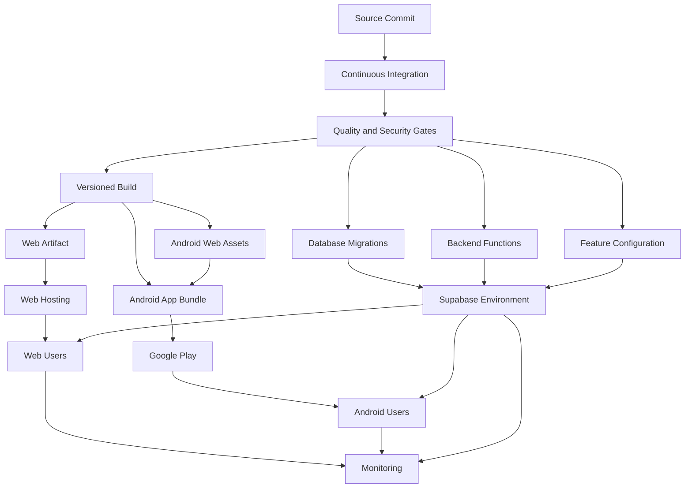
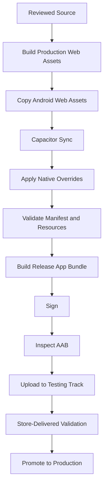
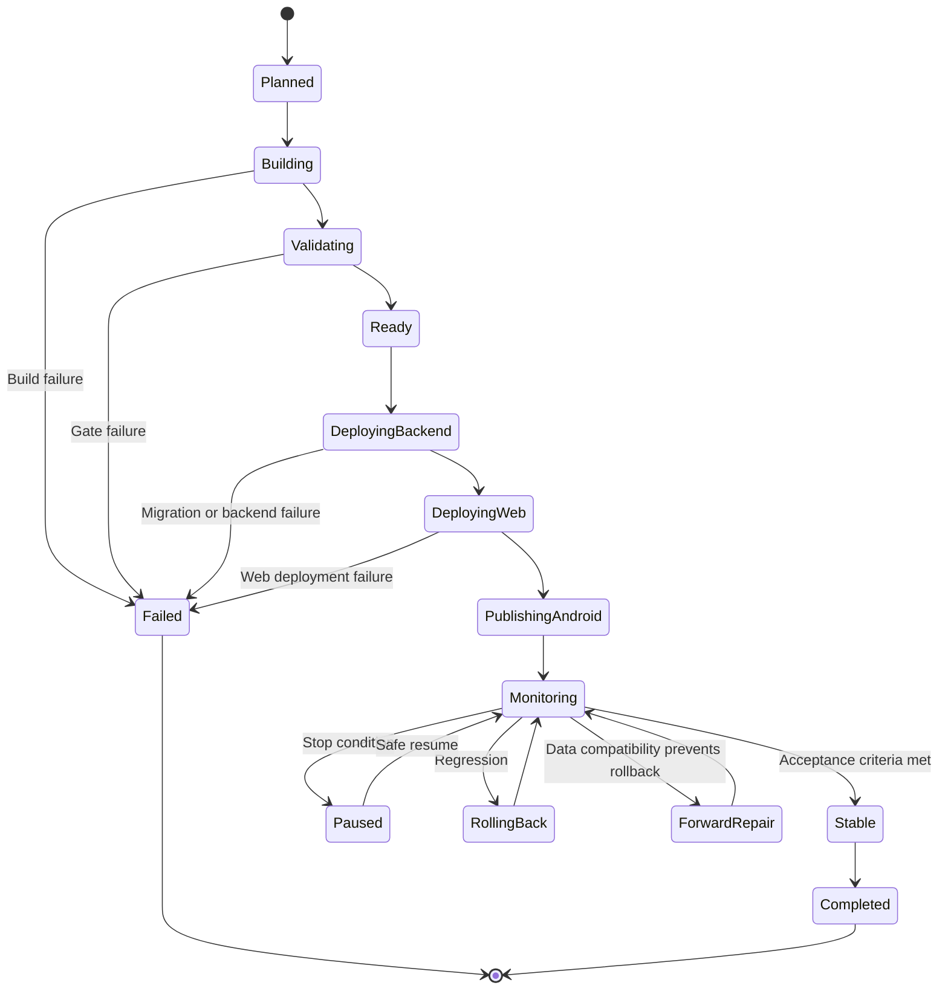
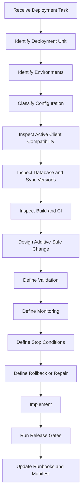

# Nexio Deployment and Operations Specification

Version: 1.0  
Status: Official  
Authority Level: Delivery and Operations Standard  
Applies To: Web, Vercel, Supabase, Android, Capacitor, Google Play, CI/CD, Production Monitoring and Operational Recovery

---

# Purpose

This document defines the official deployment and production-operations architecture of Nexio.

It establishes:

- Environment architecture
- Configuration management
- Public and private configuration
- Application versioning
- Database and synchronization versioning
- Build reproducibility
- Continuous Integration
- Continuous Delivery
- Web deployment
- Supabase deployment
- Android build and signing
- Google Play release channels
- Feature flags
- Deployment ordering
- Release manifests
- Artifact provenance
- Staged rollout
- Monitoring
- Rollback
- Forward repair
- Backup and recovery
- Operational runbooks
- Production access
- Release validation
- AI implementation restrictions

A feature is not complete merely because it works in a local development environment.

It must also be:

- Buildable
- Configurable
- Deployable
- Observable
- Recoverable
- Compatible with published clients
- Secure in production
- Supportable after release

---

# Relationship with Other Documents

This document must be interpreted together with:

```text
docs/00-FOUNDATION.md
docs/01-ARCHITECTURE.md
docs/02-DESIGN-SYSTEM.md
docs/03-DESKTOP.md
docs/04-TABLET.md
docs/05-MOBILE.md
docs/06-DATA-MODEL.md
docs/07-SECURITY.md
docs/08-OFFLINE-AND-SYNC.md
docs/09-TESTING.md
```

Responsibilities are divided as follows:

| Document | Responsibility |
|---|---|
| `00-FOUNDATION.md` | Product principles |
| `01-ARCHITECTURE.md` | Technical boundaries |
| `02-DESIGN-SYSTEM.md` | Visual and interaction contracts |
| `03-DESKTOP.md` | Desktop behavior |
| `04-TABLET.md` | Tablet behavior |
| `05-MOBILE.md` | Mobile, Capacitor and Android behavior |
| `06-DATA-MODEL.md` | Canonical data and persistence |
| `07-SECURITY.md` | Authentication, authorization and protection |
| `08-OFFLINE-AND-SYNC.md` | Offline state and synchronization |
| `09-TESTING.md` | Verification and quality gates |
| `10-DEPLOYMENT-AND-OPERATIONS.md` | Delivery, production and operational control |

Testing determines whether an artifact is acceptable.

Deployment and Operations determine how that artifact reaches users safely and remains reliable afterward.

---

# Current Project Delivery Anchors

The current repository contains delivery-related files such as:

```text
package.json
package-lock.json
vercel.json
capacitor.config.ts
CAPACITOR_ANDROID_BUILD.md
PLAY_STORE_LISTING.md
supabase-config.js
supabase-schema.sql
android/
android-web/
capacitor-overrides/android/
```

Recommended responsibility:

| File or Directory | Responsibility |
|---|---|
| `package.json` | Scripts, package metadata and dependencies |
| `package-lock.json` | Reproducible JavaScript dependency graph |
| `vercel.json` | Web hosting, routing and deployment configuration |
| `capacitor.config.ts` | Capacitor public runtime configuration |
| `CAPACITOR_ANDROID_BUILD.md` | Android build procedure |
| `PLAY_STORE_LISTING.md` | Store-listing source content |
| `supabase-config.js` | Safe public Supabase client initialization |
| `supabase-schema.sql` | Consolidated schema reference |
| `supabase/migrations/` | Ordered authoritative database changes |
| `android/` | Generated and maintained Android project |
| `android-web/` | Packaged Android Web assets |
| `capacitor-overrides/android/` | Controlled native overrides |

No one file should become an undocumented release process.

The release architecture must be executable through repeatable scripts and documented operational steps.

---

# Deployment Constitutional Principles

## Production Must Be Reproducible

A production artifact must be reproducible from:

```text
Reviewed source commit

+

Locked dependencies

+

Approved build tools

+

Approved configuration

+

Controlled build environment
```

A production artifact must not depend on:

- Uncommitted local changes
- Files copied manually from a developer computer
- Undocumented IDE settings
- Random dependency resolution
- Untracked native edits
- Personal environment variables
- Development-server availability

---

## Configuration Must Be Explicit

Every environment-dependent value must be classified and documented.

Examples:

```text
Supabase project URL

Public Supabase client key

Application base URL

Authentication callback URL

Feature flags

Logging destination

Analytics destination

Android application ID

Web origin

Storage bucket

Release channel
```

The application must not guess production configuration.

---

## Client Configuration Is Public

Any value included in:

- Browser JavaScript
- HTML
- CSS
- Android assets
- APK
- AAB
- Capacitor configuration
- Source maps

must be treated as discoverable.

Private credentials must never rely on client-bundle secrecy.

---

## Deployment Is a Controlled State Transition

A deployment changes one or more production states:

```text
Application code

Database schema

Database functions

RLS policies

Storage policies

Feature flags

Service Worker

Android application version

Backend compatibility
```

The transition must be:

- Ordered
- Observable
- Validated
- Reversible or forward-repairable
- Compatible with active clients

---

## Database and Client Compatibility Must Overlap

The backend may serve several application versions simultaneously.

Database deployment must support:

```text
Current Web application

Current Android release

Older supported Android releases

Clients with pending offline operations

Clients returning after long offline periods
```

A schema change must not assume that every user immediately receives the newest application.

---

## Rollback Must Be Designed Before Release

A release is not operationally ready when the team cannot explain:

```text
How do we stop the rollout?

How do we disable the feature?

How do we restore the previous application?

How do we preserve newly written data?

How do we recover pending offline operations?

How do we communicate the incident?
```

---

## Production Must Be Observable

After deployment, Nexio must provide enough safe telemetry to answer:

```text
Did the application deploy?

Can users authenticate?

Can users load their financial data?

Are mutations succeeding?

Are queues synchronizing?

Did migrations complete?

Did errors increase?

Did performance regress?

Are Android clients crashing?

Are old clients still compatible?
```

---

## Releases Must Preserve User Intent

A deployment must never silently remove:

- Pending offline operations
- Drafts
- Conflict resolutions
- Local owner namespaces
- Saved Transactions
- Goal contributions
- Import review state

Application updates must migrate or preserve supported local state.

---

## Security Cannot Be Relaxed for Availability

Forbidden emergency action:

```text
Disable RLS temporarily so the application works.
```

Required behavior:

```text
Disable the affected feature,
repair the policy,
validate isolation,
then restore service.
```

---

# Delivery Architecture



---

# Deployment Units

Nexio contains several independently deployable units.

Recommended units:

```text
Web Application

Android Application

Supabase Database Schema

Supabase Database Functions

Supabase RLS Policies

Supabase Storage Policies

Supabase Edge or Backend Functions when used

Feature Configuration

Service Worker

Operational Monitoring Configuration
```

Each unit must have:

- Version or revision
- Deployment process
- Validation process
- Compatibility policy
- Rollback or repair process
- Operational owner

---

# Environment Model

Recommended environments:

```text
Local

Development

Preview

Staging

Production
```

Additional dedicated environments may exist for:

- Automated tests
- Security testing
- Performance testing
- Migration rehearsal
- Disaster recovery

---

# Environment Isolation

Each environment should have isolated:

- Supabase project or database
- Authentication users
- Storage buckets
- URLs
- Feature flags
- Logging destination
- Analytics destination
- Notification configuration
- Application identifiers where needed

Production user data must not appear in lower environments without approved anonymization and a clear operational requirement.

---

# Local Environment

Purpose:

- Individual development
- Fast feedback
- Unit tests
- Local UI verification
- Local Supabase when available
- Synthetic data

Local configuration must not require production credentials.

---

# Local Environment Characteristics

Recommended:

```text
Environment name:
local

Supabase:
Local instance or isolated development project

Logging:
Verbose but redacted

Analytics:
Disabled or local-only

Notifications:
Test-only

Application origin:
localhost or approved local origin

Data:
Synthetic
```

---

# Development Environment

Purpose:

- Shared development integration
- Early feature testing
- Database migration testing
- Authentication integration
- Realtime testing
- Internal demonstrations

Development must remain independent from production.

---

# Preview Environment

A Preview environment may be created per branch or pull request.

Purpose:

- UI review
- Product review
- Accessibility review
- Integration validation
- Stakeholder approval

Preview environments must not automatically receive privileged production credentials.

---

# Preview Data

Preview may use:

- Synthetic seeded data
- Isolated test users
- Temporary database schema
- Mocked remote adapters for UI-only review

The preview must clearly identify when it does not use the complete backend.

---

# Preview Expiration

Temporary Preview deployments should expire or be removed after:

- Pull request closure
- Defined retention period
- Merge
- Abandonment

Temporary environments must not accumulate unrestricted storage and credentials.

---

# Staging Environment

Staging should resemble Production as closely as practical.

It should use:

- Production build mode
- Production-like security headers
- Current migrations
- Current RLS
- Current storage policies
- Current Service Worker
- Release Android configuration where possible
- Synthetic data

---

# Staging Differences

Permitted differences may include:

- Different domain
- Different Supabase project
- Test signing or testing track
- Safe test notifications
- Non-production analytics
- Reduced infrastructure scale

Differences must be documented.

---

# Production Environment

Production contains:

- Real user accounts
- Real financial records
- Active Web application
- Active Android clients
- Production authentication
- Production Supabase
- Production storage
- Production monitoring
- Production feature flags

Production access and changes require the strongest controls.

---

# Environment Identification

The application should expose safe environment identity in non-production environments.

Example:

```text
Nexio — Staging
```

Production should not display unnecessary environment banners.

---

# Environment Configuration Contract

Conceptual normalized configuration:

```javascript
{
  environment: "production",

  application: {
    version: "2.4.0",
    build: "20400",
    releaseId: "2026-07-24.1"
  },

  web: {
    origin: "approved-origin",
    basePath: "/"
  },

  supabase: {
    projectUrl: "public-project-url",
    publicClientKey: "public-client-key"
  },

  synchronization: {
    protocolVersion: 2,
    minimumSupportedProtocolVersion: 1
  },

  features: {
    conflictCenter: true,
    backgroundSync: false
  },

  diagnostics: {
    environmentTag: "production",
    loggingLevel: "error"
  }
}
```

The configuration object must contain no private server credential.

---

# Configuration Classification

Every configuration value must be classified as:

```text
Public Client Configuration

Private Build Credential

Private Runtime Credential

Operational Configuration

Feature Configuration
```

---

# Public Client Configuration

Examples:

- Supabase project URL
- Supabase public client key
- Application version
- Public Web origin
- Public callback route
- Public feature availability
- Supported locale list

These values may appear in client artifacts.

Security must not depend on hiding them.

---

# Private Build Credentials

Examples:

- Android keystore password
- Android key password
- Package registry token
- Deployment token
- Store upload credential

They may be used during controlled build or release.

They must not be embedded into the resulting application.

---

# Private Runtime Credentials

Examples:

- Supabase service-role key
- Database password
- Email provider secret
- Push server credential
- Administrative API secret

They belong only in trusted server environments.

---

# Operational Configuration

Examples:

- Retry thresholds
- Alert thresholds
- Retention periods
- Rollout percentages
- Minimum supported application version
- Maintenance-mode state

Operational configuration may require backend protection and audit.

---

# Feature Configuration

Feature configuration determines controlled availability.

Examples:

```text
New Dashboard enabled

Conflict Center enabled

Import v2 enabled

New synchronization protocol enabled

Complete Export enabled
```

Feature flags must not become authorization controls.

---

# Environment Variable Naming

Recommended pattern:

```text
NEXIO_PUBLIC_SUPABASE_URL

NEXIO_PUBLIC_SUPABASE_KEY

NEXIO_PUBLIC_APP_ENV

NEXIO_PRIVATE_SERVICE_ROLE_KEY

NEXIO_ANDROID_KEYSTORE_PASSWORD
```

The exact build tooling may require a different prefix.

Any variable exposed through the client build must be labeled public explicitly.

---

# Configuration Validation

The application and build pipeline must validate required configuration.

Example:

```javascript
function validatePublicConfiguration(config) {
  const errors = [];

  if (!["local", "development", "preview", "staging", "production"]
    .includes(config.environment)) {
    errors.push("INVALID_ENVIRONMENT");
  }

  if (!config.supabase.projectUrl.startsWith("https://")) {
    errors.push("INVALID_SUPABASE_URL");
  }

  if (!config.application.version) {
    errors.push("MISSING_APPLICATION_VERSION");
  }

  if (errors.length > 0) {
    throw new ConfigurationError(errors);
  }
}
```

Production must fail closed when critical configuration is missing.

---

# Production Configuration Validation

Before release, verify:

```text
Environment equals production.

Supabase URL targets production project.

Public key belongs to production project.

No localhost URL exists.

No development server exists.

No test analytics destination exists.

No debug feature remains enabled.

No test user is embedded.

No private credential is present.
```

---

# Configuration Drift

Configuration drift occurs when deployed environments differ from documented or version-controlled expectations.

Potential causes:

- Manual dashboard change
- Forgotten environment variable
- Expired credential
- Undocumented feature flag
- Different Storage policy
- Direct production SQL
- Modified hosting route

Drift must be detectable and corrected.

---

# Configuration Inventory

Maintain an inventory containing:

```text
Configuration name

Classification

Environment

Purpose

Owner

Storage location

Rotation or review period

Default

Required or optional
```

The inventory must not contain secret values.

---

# Application Versioning

Nexio should use semantic versioning for public application releases where practical.

Format:

```text
MAJOR.MINOR.PATCH
```

Example:

```text
2.4.1
```

---

# Major Version

Increase when introducing a major incompatible product or platform change.

Examples:

- Authentication architecture replacement
- Unsupported old data model
- Significant navigation redesign
- Synchronization protocol generation change requiring application update

Major versions should remain rare.

---

# Minor Version

Increase for backward-compatible feature additions.

Examples:

- New report
- New Goal functionality
- Conflict Center
- New export option
- New notification preference

---

# Patch Version

Increase for backward-compatible fixes.

Examples:

- Validation fix
- Layout correction
- Performance improvement
- Security patch
- Synchronization defect correction

---

# Android Version Code

Google Play requires a monotonically increasing integer version code.

Conceptual mapping:

```text
Application version:
2.4.1

Android version code:
20401
```

The exact mapping may differ.

Version code must never decrease or repeat for a new uploaded App Bundle.

---

# Version Code Strategy

A reliable strategy should support:

- Normal release
- Hotfix
- Internal testing
- Closed testing
- Production
- Parallel tracks
- Emergency rebuild

Example date-based build code:

```text
2026072401
```

Example semantic-derived code:

```text
204010
```

The project must choose one documented strategy.

---

# Build Number

A build number identifies one produced artifact.

Several builds may share an application version during testing.

Example:

```text
Version:
2.4.1

Build:
20260724.3
```

---

# Release Identifier

A release identifier should uniquely correlate:

- Source commit
- Build
- Deployment
- Web artifact
- Android artifact
- Database migration set
- Monitoring

Example:

```text
nexio-2.4.1-20260724.3
```

---

# Source Commit Identity

Every production artifact must record the source commit.

Possible safe runtime metadata:

```javascript
{
  version: "2.4.1",
  build: "20260724.3",
  commit: "a1b2c3d",
  releaseId: "nexio-2.4.1-20260724.3"
}
```

A shortened commit may appear in diagnostic screens.

---

# Version Surfaces

Application version should be available in:

- Settings or About screen
- Safe diagnostics
- Error reports
- Synchronization metrics
- Android package metadata
- Web release metadata

It should not require exposing internal secrets.

---

# Version Families

Nexio uses several independent version dimensions:

```text
Application Version

Android Version Code

Build Number

Local Database Version

Entity Schema Version

Operation Payload Version

Synchronization Protocol Version

Remote RPC Version

Database Migration Version

Service Worker Cache Version
```

They must not be represented by one ambiguous number.

---

# Version Compatibility Matrix

A release should document compatibility.

Example:

| Component | Version |
|---|---|
| Application | `2.4.1` |
| Local Database | `6` |
| Sync Protocol | `2` |
| Supported Remote Protocols | `1–2` |
| Minimum Supported App | `2.1.0` |
| Database Migration | `20260724090000` |
| Android Version Code | `20401` |
| Service Worker Cache | `42` |

---

# Minimum Supported Application Version

The backend may define a minimum supported version when old clients create security or consistency risk.

The policy must distinguish:

```text
Recommended update

Required update

Blocked synchronization

Blocked complete application access
```

---

# Recommended Update

The user may continue using the application.

Message:

```text
A newer Nexio version is available.
```

---

# Required Update for Synchronization

The application may preserve local access but stop unsafe remote operations.

Message:

```text
Update Nexio to synchronize your saved changes securely.
```

Pending work must remain preserved.

---

# Complete Application Block

This should be rare and reserved for severe incompatibility or security risk.

Local recovery and support implications must be considered.

---

# Version Compatibility Endpoint

A trusted backend endpoint or configuration may return:

```javascript
{
  minimumSupportedVersion: "2.1.0",
  minimumSyncProtocolVersion: 1,
  latestRecommendedVersion: "2.4.1",
  updateRequired: false
}
```

The result must be authenticated or integrity-protected when it affects security behavior.

---

# Release Channels

Recommended channels:

```text
Development

Preview

Internal

Closed Testing

Staging

Production
```

Web and Android channels may have different distribution mechanisms but should share release identity.

---

# Android Release Tracks

Possible Google Play tracks:

```text
Internal Testing

Closed Testing

Open Testing

Production
```

Each track must define:

- Intended users
- Build configuration
- Version-code policy
- Data environment
- Promotion criteria
- Rollback or halt behavior

---

# Internal Testing Track

Purpose:

- Fast store-delivery validation
- Signing verification
- App Bundle verification
- Deep-link testing
- Production-like Android configuration
- Small trusted tester group

---

# Closed Testing Track

Purpose:

- Wider controlled validation
- Device coverage
- Upgrade testing
- Realistic lifecycle behavior
- Store compliance
- Crash and performance observation

---

# Open Testing Track

Optional.

Appropriate when broader pre-production testing is useful and privacy, backend capacity and support are prepared.

---

# Production Track

Production releases should use staged rollout for meaningful changes.

Immediate 100% rollout may be acceptable only for:

- Low-risk static content change
- Urgent security fix after validation
- Small known-user base with strong monitoring

---

# Branch Strategy

Recommended simplified strategy:

```text
main

feature branches

hotfix branches when needed
```

`main` should remain releasable.

Long-lived environment branches should be avoided unless the team can prevent divergence.

---

# Feature Branch

A feature branch should:

- Start from current `main`
- Contain focused changes
- Include tests
- Include migrations where required
- Include documentation
- Pass CI
- Be reviewed before merge

---

# Release Branch

A temporary release branch may be used when:

- Store review requires stabilization
- Several fixes must be selected
- Production release needs controlled freeze

It must not become a second permanent development line.

---

# Hotfix Branch

A hotfix should:

- Start from the affected production commit or approved branch
- Include the smallest safe correction
- Include regression tests
- Pass security and release gates
- Merge back into `main`
- Receive a new version and build identity

---

# Source Tag

Production releases should use a protected source tag.

Example:

```text
v2.4.1
```

The tag should reference the exact reviewed commit used to build production artifacts.

---

# Build Architecture

Recommended build stages:

```text
Clean workspace

↓

Install locked dependencies

↓

Validate configuration

↓

Run static checks

↓

Run required tests

↓

Generate Web assets

↓

Generate Android Web assets

↓

Synchronize Capacitor project

↓

Apply controlled native overrides

↓

Build Android App Bundle

↓

Verify artifacts

↓

Sign and publish
```

---

# Clean Build

Production builds must begin from a clean workspace.

Verify:

```text
No uncommitted changes

No untracked generated assets required

No previous build output

No stale native override

No personal configuration file included
```

---

# Dependency Installation

Use the committed lock file.

Recommended behavior:

```text
Clean install

Exact dependency versions

Integrity verification

Approved registry
```

Avoid resolving new dependency versions during production build.

---

# Build Tool Versioning

Document required versions of:

- Node.js
- npm
- Java
- Android Gradle Plugin
- Gradle
- Android SDK
- Capacitor
- Supabase CLI
- Deployment CLI

Unexpected tool-version changes may produce different artifacts.

---

# Tool Version File

The repository may contain tool-version declarations such as:

```text
.nvmrc

.node-version

Java toolchain configuration

Gradle wrapper
```

The selected strategy must be enforced in CI.

---

# Build Reproducibility

Two builds from the same:

- Commit
- Dependencies
- Tool versions
- Configuration

should produce functionally equivalent artifacts.

Exact binary identity may vary because of timestamps or signing.

Differences must be understood.

---

# Web Build Output

The Web build should contain only required production assets.

Review:

- JavaScript
- CSS
- HTML
- Images
- Icons
- Fonts
- Service Worker
- Manifest
- Source-map policy
- Public configuration

---

# Android Web Assets

The Android package must use the approved production Web assets.

The build must not accidentally package:

- Local-development URLs
- Stale Web files
- Unreviewed test page
- Old Service Worker
- Debug logging
- Mock data

---

# Capacitor Synchronization

A controlled Capacitor step may copy Web assets and update native dependencies.

Conceptual command sequence:

```text
Build Web assets

↓

Copy assets into Android project

↓

Synchronize plugins

↓

Apply approved overrides

↓

Build native artifact
```

The sequence must be scripted or documented precisely.

---

# Native Override Strategy

Native changes should live in:

```text
capacitor-overrides/android/
```

or another controlled source location.

The release process should apply them deterministically.

Manual editing only inside generated Android output creates drift.

---

# Native Override Validation

After applying overrides, verify:

- AndroidManifest
- MainActivity
- Resources
- Themes
- Colors
- Night mode
- Network security
- Exported components
- Permissions

---

# Build-Time Generated Metadata

The build may generate a safe file such as:

```javascript
window.__NEXIO_RELEASE__ = {
  version: "2.4.1",
  build: "20260724.3",
  commit: "a1b2c3d",
  environment: "production"
};
```

It must contain no secrets.

---

# Source Map Strategy

Choose one explicit policy:

```text
No production source maps

or

Private source maps uploaded to trusted diagnostics
```

Public source maps require security and intellectual-property review.

Source maps must never contain private configuration.

---

# Web Artifact Validation

Before deployment, inspect for:

```text
localhost

127.0.0.1

development Supabase URL

test email

service-role key pattern

debug flag

mock data

unexpected source map

unapproved external script

HTTP endpoint
```

---

# Android Artifact Validation

Inspect the AAB or derived APK for:

- Application ID
- Version code
- Version name
- Signing certificate
- Permissions
- Exported components
- Deep-link declarations
- Public configuration
- Debuggable state
- Network security
- Packaged Web assets
- Unexpected files

---

# Artifact Checksum

Generate and record checksums for production artifacts.

Example:

```text
SHA-256
```

Checksums support:

- Integrity verification
- Release investigation
- Artifact correlation
- Operational audit

---

# Artifact Retention

Retain according to policy:

- Production Web artifact
- Android App Bundle
- Checksums
- Release manifest
- Migration set
- Test reports
- Source tag
- Signing metadata reference

Private credentials must not be stored with ordinary artifacts.

---

# Artifact Provenance

A release record should identify:

```text
Source commit

Source tag

Build workflow

Build tools

Dependency lock hash

Environment

Version

Build number

Artifact checksum

Signing identity

Database migration range

Feature-flag state
```

---

# Release Manifest

Recommended release-manifest format:

```yaml
release_id: nexio-2.4.1-20260724.3

application:
  version: 2.4.1
  build: 20260724.3
  commit: a1b2c3d
  tag: v2.4.1

web:
  artifact_checksum: sha256:...
  service_worker_cache_version: 42

android:
  version_code: 20401
  bundle_checksum: sha256:...
  package_id: approved.package.id

supabase:
  migrations:
    from: 20260701090000
    to: 20260724090000
  sync_protocol_version: 2
  rpc_version: 2

compatibility:
  minimum_application_version: 2.1.0
  supported_sync_protocols:
    - 1
    - 2

features:
  conflict_center: enabled
  background_sync: disabled
```

---

# Release Manifest Security

The release manifest must not contain:

- Keystore password
- Signing-key password
- Service-role key
- Database password
- Deployment token
- Private user data

---

# Continuous Integration

CI validates every meaningful source change.

Recommended pipeline:

```text
Checkout

↓

Install locked dependencies

↓

Validate environment safety

↓

Lint and static analysis

↓

Unit and domain tests

↓

Integration tests

↓

Database migration tests

↓

RLS and security tests

↓

Web build

↓

Android build where required

↓

Artifact inspection
```

---

# Continuous Delivery

Continuous Delivery means the application is always prepared for a controlled release.

It does not require automatic production deployment after every merge.

Production promotion may require explicit approval.

---

# Continuous Deployment

Automatic production deployment may be appropriate for low-risk Web changes after all required gates pass.

High-risk changes may require:

- Manual approval
- Maintenance window
- Migration rehearsal
- Staged feature enablement
- Android compatibility confirmation

---

# Pipeline Identity

Every pipeline run should have:

```text
Run ID

Commit

Branch

Environment

Trigger

Initiating actor

Result

Artifact references
```

---

# CI Trigger Types

Potential triggers:

```text
Pull request

Merge to main

Release tag

Manual release

Scheduled security scan

Scheduled migration rehearsal

Hotfix
```

---

# Pull Request Pipeline

Should include:

- Configuration safety check
- Lint
- Static analysis
- Unit and domain tests
- Relevant integration tests
- Changed migration validation
- Secret scanning
- Web preview build

---

# Main Branch Pipeline

Should include:

- Complete required test suite
- Web production build
- Database migration validation
- RLS tests
- Android compile validation
- Artifact generation
- Staging deployment where applicable

---

# Release Pipeline

Should include:

- Protected source tag
- Full tests
- Security scans
- Migration rehearsal
- Production Web build
- Android Release AAB
- Artifact inspection
- Checksums
- Release manifest
- Controlled deployment or promotion

---

# Untrusted Pull Request Safety

Untrusted pull requests must not receive:

- Production deployment tokens
- Android signing credentials
- Production service-role key
- Store credentials
- Database passwords

A pull request must not gain those credentials by modifying CI workflow code.

---

# CI Secret Access

Production secrets should be available only to:

- Protected branch
- Protected environment
- Approved workflow
- Approved actor
- Approved release trigger

---

# CI Log Redaction

Build and release logs must not contain:

- Secret values
- Signing passwords
- Tokens
- Private keys
- Production database strings
- User financial data

---

# Build Cache Security

Build caches may contain:

- Dependencies
- Compiled output
- Generated configuration
- Native intermediates

Caches must not contain reusable private secrets.

Untrusted workflows should not restore privileged caches.

---

# Web Deployment Architecture

Web hosting should support:

- HTTPS
- Correct routing
- Static asset caching
- HTML freshness
- Service Worker
- Security headers
- Environment configuration
- Deployment rollback
- Preview deployments

---

# Web Route Handling

Single-page application routes should return the application shell.

Examples:

```text
/transactions

/accounts

/goals

/reports

/settings
```

Static asset requests must still return correct not-found responses.

---

# Authentication Callback Routes

Authentication callbacks require explicit routing.

They must not be rewritten incorrectly into an unrelated page or cached as ordinary content.

---

# Web Deployment Atomicity

A Web deployment should become visible as one coherent release.

Avoid serving:

```text
New HTML

with

Old incompatible JavaScript
```

or:

```text
Old HTML

with

Deleted JavaScript assets
```

Versioned asset filenames reduce this risk.

---

# HTML Cache Policy

Main HTML should usually have short or revalidation-based caching.

It must discover the current asset set promptly.

---

# Static Asset Cache Policy

Hashed static assets may use long-term immutable caching.

Example:

```text
Cache-Control:
public, max-age=31536000, immutable
```

Only when filenames change with content.

---

# Service Worker Cache Policy

Service Worker cache version must align with the release.

It must:

- Preserve offline shell
- Remove obsolete caches safely
- Avoid private-response leakage
- Avoid mixing incompatible asset versions
- Coordinate updates

---

# Web Deployment Verification

After deployment, verify:

```text
Homepage loads

Deep route loads

Authentication callback works

Supabase connection works

Service Worker installs

Current release metadata appears

No mixed content

Security headers exist

No development endpoint exists

Primary Transaction workflow works
```

---

# Web Rollback

A Web rollback may restore a prior artifact quickly.

Before rollback, confirm:

- Prior artifact supports current database schema.
- New clients have not written incompatible data.
- Service Worker will not reapply the broken release.
- Feature flags are compatible.
- Current migrations are backward-compatible.

---

# Supabase Deployment Architecture

Supabase deployment may include:

```text
Database migrations

Functions

RLS policies

Storage policies

Seed or reference data

Realtime configuration

Backend functions
```

---

# Migration Ordering

Recommended order:

```text
1. Expand database schema.

2. Add compatible functions and policies.

3. Deploy compatible client code.

4. Enable feature for limited cohort.

5. Backfill or migrate data.

6. Observe.

7. Remove legacy structures later.
```

---

# Supabase Preflight

Before applying production migration:

- Validate migration checksum.
- Confirm current schema version.
- Confirm backup state.
- Rehearse on staging.
- Test realistic data.
- Test RLS.
- Review lock risk.
- Estimate duration.
- Confirm rollback or forward repair.
- Confirm application compatibility.

---

# Migration Lock Risk

Review whether migration may:

- Lock a large table
- Rewrite many rows
- Block reads
- Block writes
- Exhaust storage
- Cause long transactions
- Delay synchronization
- Trigger timeouts

Large migrations should use controlled phases.

---

# Migration Execution Record

Record:

```text
Migration identifier

Start time

End time

Operator or workflow

Environment

Result

Affected row count

Validation result

Follow-up action
```

---

# Post-Migration Validation

Verify:

- Expected tables and columns
- Constraints
- Indexes
- RLS
- Functions
- Storage policies
- Representative reads
- Representative writes
- Cross-user denial
- Old-client compatibility
- Synchronization behavior

---

# Failed Migration

When migration fails:

1. Stop dependent deployment.
2. Determine committed and uncommitted changes.
3. Preserve logs safely.
4. Apply documented rollback or forward repair.
5. Validate schema.
6. Validate user access.
7. Update incident or release record.
8. Do not continue blindly.

---

# Direct Production SQL

Direct SQL in production should be exceptional.

When required:

- Use an approved operator.
- Record the exact command.
- Validate environment.
- Review owner scope.
- Create equivalent migration.
- Validate afterward.
- Audit the action.

---

# Android Build Architecture

Android release flow:



---

# Android Release Prerequisites

Required:

- Approved package ID
- Version name
- New version code
- Approved signing configuration
- Production Web assets
- Production public configuration
- Current Android SDK
- Current Gradle wrapper
- Current native overrides
- Passing Android release tests

---

# Android Signing Identity

The release process must know:

```text
Signing key identity

Certificate fingerprint

Keystore location

Upload-key status

Application-signing status

Recovery procedure
```

Passwords and private key files remain protected.

---

# Upload Key Versus Application Signing Key

When Google Play App Signing is used:

- Upload key signs uploaded bundles.
- Google manages application signing for distributed APKs.
- Losing or compromising each key has different recovery implications.

The process must document the actual configuration.

---

# Signing Verification

Before upload:

- Inspect signing certificate.
- Compare expected fingerprint.
- Confirm correct package ID.
- Confirm Release build.
- Confirm version code.
- Confirm no debug certificate.

---

# Android Build Output

Primary production artifact:

```text
.aab
```

An APK may be generated for local inspection, but Google Play production uses the approved App Bundle workflow.

---

# AAB Inspection

Inspect:

- Manifest
- Permissions
- Activities
- Services
- Receivers
- Providers
- Deep links
- Native libraries
- Packaged Web assets
- Resources
- Version
- Debuggable flag
- Cleartext-traffic behavior

---

# Android Permission Diff

Every release should compare Android permissions with the previous production version.

Unexpected new permission requires review.

---

# Android Native Component Diff

Review newly added or changed:

- Exported Activity
- Service
- Broadcast Receiver
- Content Provider
- Intent filter
- FileProvider path

---

# Android Track Promotion

Promotion should move the same tested artifact between tracks.

Avoid rebuilding a different AAB for Production after testing another AAB in Internal or Closed Testing.

---

# Android Store-Delivered Validation

Install from the testing track and verify:

- Correct signing
- Correct split APK delivery
- Startup
- Authentication
- Deep links
- Notifications
- Offline behavior
- Upgrade
- Native plugins
- Production endpoint

---

# Google Play Listing Source

Store-listing content should be maintained from a controlled source such as:

```text
PLAY_STORE_LISTING.md
```

Review:

- Application name
- Short description
- Full description
- Screenshots
- Privacy-policy URL
- Support contact
- Data-safety declarations
- Release notes

---

# Store Declaration Accuracy

Google Play declarations must match actual application behavior.

Examples:

- Data collection
- Data sharing
- Account deletion
- Permissions
- Advertising
- Financial features
- Encryption claims

A declaration must not describe planned behavior as already implemented.

---

# Android Release Notes

Release notes should explain meaningful user changes.

Avoid:

```text
Bug fixes and improvements.
```

when a more useful description is available.

Do not expose sensitive technical vulnerabilities before remediation is safely deployed.

---

# Feature Flag Architecture

Feature flags support controlled release.

They must not replace:

- Authentication
- Authorization
- RLS
- Domain validation
- Database compatibility

---

# Feature Flag Categories

Recommended:

```text
Release Flag

Experiment Flag

Operational Kill Switch

Compatibility Flag

Development Flag
```

---

# Release Flag

Gradually enables a completed feature.

Example:

```text
conflict_center_enabled
```

---

# Experiment Flag

Tests a product hypothesis.

It requires:

- User assignment
- Metrics
- Privacy review
- End date
- Removal plan

---

# Operational Kill Switch

Disables a risky integration or mutation rapidly.

Example:

```text
import_commit_enabled
```

Kill switches must fail safely.

---

# Compatibility Flag

Supports overlap between old and new protocols.

Example:

```text
sync_v2_accept_writes
```

---

# Development Flag

Used only outside Production.

It must not accidentally enable debug behavior in Production.

---

# Flag Evaluation

Flag evaluation should use:

- Trusted remote configuration where needed
- Safe local fallback
- Stable owner or installation assignment for experiments
- Explicit default
- Version constraints
- Environment constraints

---

# Flag Default

Every flag must define behavior when configuration is unavailable.

Security-sensitive default should normally be:

```text
Disabled
```

or the safest compatible behavior.

---

# Flag Metadata

Each flag should define:

```text
Name

Purpose

Owner

Environment

Default

Eligible versions

Start date

End date

Removal condition

Fallback

Monitoring
```

---

# Flag State and Offline Mode

Offline clients may use the last safely cached flag state.

The behavior must remain compatible and secure.

A remotely disabled dangerous mutation should not remain enabled indefinitely offline unless the operation is designed to queue safely.

---

# Flag Removal

After full rollout and stabilization:

- Remove dead branches.
- Remove obsolete configuration.
- Remove tests specific only to disabled path where no longer needed.
- Update documentation.
- Preserve migration compatibility where required.

Permanent unused flags create complexity and risk.

---

# Deployment Ordering

A release plan must specify the order among:

```text
Database

Backend functions

Feature flags

Web application

Android application

Service Worker

Monitoring
```

---

# Backend-First Deployment

Use when new client code depends on additive backend capability.

Sequence:

```text
Deploy compatible backend

↓

Validate

↓

Deploy clients

↓

Enable feature
```

---

# Client-First Deployment

Use when old backend already supports the new client and a later backend change removes legacy behavior.

Sequence:

```text
Deploy compatible clients

↓

Wait for adoption

↓

Verify old-client reduction

↓

Remove legacy backend later
```

---

# Flag-First Deployment

A disabled feature flag may be deployed before code.

Then:

```text
Deploy backend support

↓

Deploy client code hidden

↓

Validate

↓

Enable flag gradually
```

---

# Database-First Constraint

Database-first is safe only when the migration remains compatible with currently active clients.

---

# Deployment State Machine



---

# Deployment Plan

Every meaningful release should document:

```text
Release identity

Scope

Risk

Affected components

Deployment order

Database changes

Compatibility

Feature flags

Validation

Monitoring

Stop conditions

Rollback

Forward repair

Communication
```

---

# Deployment Window

A dedicated deployment window may be appropriate for:

- Large migration
- Authentication change
- Synchronization protocol change
- Account-deletion change
- Major Android release
- Storage-policy change

Low-risk Web releases may not need a formal maintenance window.

---

# Maintenance Mode

Maintenance mode should be used sparingly.

It may restrict:

- New mutations
- Authentication
- Imports
- Exports

Read-only local access may remain available where safe.

---

# Maintenance Mode Security

Maintenance mode must not:

- Expose data publicly
- Disable RLS
- Use a universal bypass
- Lose pending operations
- Impersonate successful synchronization

---

# Read-Only Mode

A controlled read-only mode may allow:

- Viewing synchronized data
- Viewing local cached data
- Exporting when safe

while blocking:

- New remote mutations
- High-risk commands

Offline-capable local changes require a deliberate policy during maintenance.

---

# Release Readiness Review

Before declaring a release Ready:

```text
Scope is frozen.

Version is assigned.

Migration is reviewed.

Compatibility is documented.

Tests pass.

Security scans pass.

Artifacts build.

Feature flags exist.

Monitoring exists.

Rollback or repair exists.

Operators are available.
```

---

# Release Notes

Internal release notes should include:

- Technical changes
- Database changes
- Compatibility risks
- Feature flags
- Operational metrics
- Known limitations
- Support guidance
- Rollback considerations

User release notes should focus on product value and meaningful fixes.

---

# Part 1 Operational Anti-Patterns

The following are prohibited:

## Local Machine Production Build

Publishing an undocumented artifact built from a developer's modified workspace.

## Floating Dependency Build

Installing uncontrolled new dependency versions during production build.

## Secret in Client Environment

Treating a client-injected environment value as private.

## Manual Native Drift

Editing generated Android files without preserving changes in controlled source.

## Rebuilt Promotion

Testing one Android bundle and publishing a different rebuilt bundle.

## Reused Version Code

Uploading a new AAB with an already used or lower version code.

## Database Breaking Change First

Removing a field before active clients stop using it.

## Immediate Full Rollout

Publishing a high-risk release to all users without staged observation.

## Feature Flag as Authorization

Assuming a disabled UI flag prevents unauthorized backend access.

## Undocumented Production SQL

Changing Production without a migration or operational record.

## Rollback Without Compatibility Review

Restoring old clients against an incompatible new schema.

## RLS Disabled During Incident

Relaxing ownership protection to restore availability.

## Permanent Development Flag

Leaving debug or test behavior reachable in Production.

## Unvalidated Configuration

Allowing Production to start with missing or development values.

## Service Worker Version Drift

Deploying Web assets without coordinating the offline shell.

## Untracked Artifact

Publishing without source commit, checksum or release identity.

## Store Declaration Guess

Submitting privacy or data-safety information that does not match implementation.

---

# Part 1 Review Questions

Before approving a release architecture change, answer:

```text
Which deployment unit changes?

Which environments are affected?

Which configuration values are public?

Which values are private?

Which application versions remain active?

Which database schema do they expect?

Which local database versions exist?

Which synchronization protocols remain supported?

Can the build be reproduced?

Which source commit produced the artifact?

Which feature flag controls rollout?

Which monitoring proves success?

Which conditions stop rollout?

Can the Web artifact be rolled back safely?

Can the Android rollout be halted?

Can database changes be reversed?

Would forward repair be safer?

How are pending offline operations preserved?
```

---

# Build Review Questions

```text
Are dependencies locked?

Are tool versions controlled?

Is the workspace clean?

Is production configuration validated?

Are native overrides deterministic?

Does the artifact contain development URLs?

Does the artifact contain secrets?

Is the signing identity correct?

Does the artifact match the release manifest?

Was the exact artifact tested?
```

---

# Environment Review Questions

```text
Is the environment isolated?

Does it contain production data?

Which authentication users exist?

Which storage bucket is used?

Where do notifications go?

Where do logs go?

Are feature flags environment-specific?

Can a Preview environment access production credentials?

How is the environment removed?
```

---

# Version Review Questions

```text
What is the application version?

What is the Android version code?

What is the build number?

What is the local database version?

What is the synchronization protocol version?

What is the latest database migration?

What is the minimum supported application version?

Can an offline older client return safely?
```

---

# Part 1 Acceptance Criteria

The deployment foundation is accepted only when:

```text
□ Environments are documented and isolated.

□ Production data does not enter lower environments without approval.

□ Public and private configuration are clearly separated.

□ Client configuration contains no private credential.

□ Production configuration is validated before build and startup.

□ Configuration drift is detectable.

□ Application, Android, database and protocol versions remain distinct.

□ Android version codes increase monotonically.

□ Every release has a unique release identifier.

□ Every artifact maps to a source commit.

□ Dependencies use a committed lock file.

□ Build-tool versions are controlled.

□ Production builds begin from a clean workspace.

□ Web and Android assets use approved production configuration.

□ Native overrides are deterministic and source-controlled.

□ Production source-map policy is explicit.

□ Web and Android artifacts receive secret and endpoint inspection.

□ Production artifacts receive checksums.

□ Release manifests record compatibility and provenance.

□ Pull requests cannot access production release secrets.

□ CI logs redact private credentials.

□ Web deployment uses coherent versioned assets.

□ Service Worker version aligns with the Web release.

□ Supabase migrations are rehearsed before Production.

□ Migration lock and duration risks are reviewed.

□ Post-migration RLS and compatibility tests run.

□ Android App Bundles receive signing and manifest inspection.

□ The exact tested App Bundle is promoted between tracks.

□ Google Play declarations match actual behavior.

□ Feature flags have owners, defaults and removal plans.

□ Feature flags do not replace authorization.

□ Deployment order is documented.

□ High-risk releases use staged rollout.

□ Rollback and forward-repair paths are defined before release.

□ Maintenance behavior preserves ownership and pending work.

□ Release readiness requires testing, security, monitoring and recovery.
```

---

# Deployment Foundation Constitutional Rule

Every environment, configuration, version, build and deployment decision must answer:

```text
Can this exact reviewed change reach the intended users without exposing secrets, breaking active clients, losing pending financial intent or leaving the team unable to observe and recover the result?
```

When the answer is unclear, prefer the process that:

- Uses isolated environments.
- Classifies configuration explicitly.
- Keeps private credentials outside clients.
- Builds from reviewed source.
- Locks dependencies and tools.
- Generates traceable artifacts.
- Preserves backward compatibility.
- Deploys additive backend support first.
- Uses staged feature enablement.
- Observes real outcomes.
- Defines stop conditions.
- Preserves user data during rollback or repair.
- Requires the exact artifact to be tested.
- Fails closed.

Deployment is not copying files to a server.

It is a controlled compatibility transition across Web, Android, data and active user state.

---
---

# Release Execution Architecture

Release execution converts an approved release plan into controlled production changes.

The execution process must coordinate:

```text
Database

Backend functions

RLS policies

Storage policies

Web application

Service Worker

Android App Bundle

Feature flags

Monitoring

Support readiness
```

A release must not be considered complete merely because deployment commands finished successfully.

Completion requires:

- Technical validation
- User-path validation
- Monitoring review
- Compatibility confirmation
- Rollout stability
- Operational handoff

---

# Release Roles

Recommended operational roles:

```text
Release Coordinator

Database Operator

Web Deployment Owner

Android Release Owner

Security Reviewer

Quality Reviewer

Monitoring Owner

Incident Coordinator

Support Contact
```

One person may hold several roles in a small project.

The responsibilities must still remain explicit.

---

# Release Coordinator

Responsible for:

- Confirming release readiness
- Maintaining the release timeline
- Coordinating deployment order
- Confirming required approvals
- Recording deployment progress
- Pausing rollout when stop conditions occur
- Coordinating rollback or forward repair
- Declaring release completion

---

# Database Operator

Responsible for:

- Migration preflight
- Backup confirmation
- Migration execution
- Database validation
- RLS validation
- Lock and performance observation
- Forward repair when required
- Migration record maintenance

---

# Web Deployment Owner

Responsible for:

- Producing or retrieving the approved artifact
- Validating Web configuration
- Deploying the exact tested artifact
- Verifying routes and headers
- Verifying Service Worker behavior
- Managing Web rollback

---

# Android Release Owner

Responsible for:

- Version-code validation
- Signing verification
- AAB inspection
- Track upload
- Store-delivered testing
- Staged rollout
- Crash and ANR review
- Rollout halt or promotion
- Release-note accuracy

---

# Monitoring Owner

Responsible for:

- Confirming dashboards
- Confirming alerts
- Watching release metrics
- Comparing pre-release and post-release behavior
- Escalating unusual patterns
- Recording stability evidence

---

# Release Timeline

A meaningful release should record:

```text
Release planned

Build started

Artifacts validated

Staging validated

Database deployment started

Database deployment completed

Web deployment started

Web deployment completed

Android upload completed

Feature rollout started

Monitoring window started

Release declared stable
```

Use one documented time zone or UTC.

---

# Release Runbook

Every production release should follow a runbook.

Recommended structure:

```markdown
# Release Runbook

## Release Identity

Version, build, commit and release ID.

## Scope

Features, fixes and migrations.

## Risk

Financial, security, availability and compatibility risks.

## Preconditions

Required approvals, backups, tests and access.

## Deployment Order

Exact ordered actions.

## Validation

Checks after every action.

## Monitoring

Metrics, dashboards and alerts.

## Stop Conditions

Conditions requiring pause.

## Rollback

Safe rollback procedure.

## Forward Repair

Safe repair procedure when rollback is incompatible.

## Communication

Internal and user communication.

## Completion

Conditions for stable declaration.
```

---

# Release Preconditions

Before execution begins:

```text
□ Source commit is approved.

□ Release tag exists when required.

□ Release manifest exists.

□ Required tests pass.

□ Security scans pass.

□ Migration rehearsal passes.

□ Backup status is confirmed.

□ Rollback or repair plan exists.

□ Feature flags are ready.

□ Monitoring dashboards are ready.

□ Alert recipients are available.

□ Exact Web artifact is available.

□ Exact Android artifact is available.

□ Production access is confirmed.

□ Support guidance is prepared.
```

---

# Release Freeze

A release freeze may begin when the release candidate is approved.

During freeze:

- No unrelated source changes enter the release.
- Artifact identity remains fixed.
- Database migration set remains fixed.
- Feature-flag defaults remain fixed.
- Release notes remain traceable.
- Emergency changes require explicit revalidation.

---

# Artifact Promotion

Promotion means moving the same approved artifact to a higher environment or release track.

Preferred:

```text
Build once

↓

Validate

↓

Promote same artifact
```

Avoid:

```text
Build for testing

↓

Rebuild separately for production
```

Rebuilding creates artifact drift.

---

# Web Release Execution

Recommended Web release sequence:

```text
1. Confirm production artifact checksum.

2. Confirm production configuration.

3. Confirm backend compatibility.

4. Deploy immutable assets.

5. Deploy HTML and routing configuration.

6. Activate Service Worker configuration.

7. Verify release metadata.

8. Run smoke tests.

9. Monitor errors and performance.

10. Declare Web release stable.
```

---

# Web Pre-Deployment Checks

Verify:

- Production Supabase project URL
- Production public client key
- Correct application version
- Correct release ID
- No localhost reference
- No test user
- No debug overlay
- Correct source-map policy
- Correct security headers
- Correct feature defaults
- Correct Service Worker revision

---

# Web Deployment Atomicity

Deployment should prevent partial release exposure.

Safe strategies may include:

- Immutable versioned assets
- Atomic hosting promotion
- Deployment aliases
- Blue-green deployment
- Versioned static directories

---

# Blue-Green Web Deployment

Conceptual flow:

```text
Current Production:
Blue

New Candidate:
Green

↓

Deploy and validate Green privately

↓

Switch production alias to Green

↓

Monitor

↓

Retain Blue temporarily for rollback
```

---

# Canary Web Deployment

When supported, a small cohort may receive the new Web release first.

Canary selection must be stable and privacy-conscious.

Canary users must still receive:

- Full authorization
- Correct data model
- Compatible backend
- Safe rollback

---

# Web Smoke Test

Immediately after deployment:

```text
Open root route.

Open deep route.

Load authentication.

Sign in with controlled test user.

Load Dashboard.

Read Transactions.

Create or update one controlled test entity where permitted.

Verify synchronization.

Verify privacy mode.

Sign out.
```

---

# Web Header Validation

Verify production response headers such as:

```text
Content-Security-Policy

Strict-Transport-Security

Referrer-Policy

Permissions-Policy

X-Content-Type-Options

Cache-Control
```

The exact header set must match the Security specification.

---

# Web Routing Validation

Test:

```text
/

 /transactions

 /accounts

 /goals

 /reports

 /settings

Authentication callback

Unknown route

Static asset route
```

Unknown static assets must not return the application shell incorrectly.

---

# Service Worker Release Execution

A Service Worker release requires special care because old clients may remain controlled by a previous worker.

---

# Service Worker Deployment Steps

```text
1. Publish versioned assets.

2. Publish new Service Worker.

3. Verify installation.

4. Verify waiting or activation behavior.

5. Verify old cache retention during transition.

6. Verify obsolete cache cleanup.

7. Verify offline shell.

8. Verify no private response leakage.

9. Verify update messaging.

10. Monitor activation failures.
```

---

# Service Worker Compatibility

The new Service Worker must remain compatible with:

- Existing local database
- Existing queue
- Existing open tabs
- Current HTML
- Current asset names
- Supported older client sessions during transition

---

# Service Worker Emergency Disable

An emergency response may:

- Publish a minimal worker that stops interception
- Remove broken cache behavior
- Force network-first shell retrieval
- Disable background synchronization

The response must not delete pending local operations.

---

# Supabase Release Execution

Recommended sequence:

```text
1. Confirm migration set.

2. Confirm backup or recovery capability.

3. Apply additive migrations.

4. Validate schema.

5. Validate RLS.

6. Validate database functions.

7. Validate Storage policies.

8. Validate old-client compatibility.

9. Deploy Web or Android clients.

10. Enable feature gradually.

11. Perform later contract cleanup.
```

---

# Database Migration Preflight Checklist

```text
□ Migration file is immutable.

□ Migration identifier is unique.

□ Staging rehearsal passed.

□ Representative data was tested.

□ RLS tests passed.

□ Estimated duration is known.

□ Table-lock risk is reviewed.

□ Storage growth is reviewed.

□ Rollback or repair is documented.

□ Old clients remain compatible.

□ Pending sync operations remain compatible.

□ Required indexes are included.

□ Backfill strategy is defined.
```

---

# Database Migration Execution

During execution, observe:

- Lock waits
- Active transactions
- Query latency
- CPU
- Memory
- Storage
- Error rate
- Connection count
- Replication or platform health where available

---

# Online Migration Strategy

For large tables, prefer techniques such as:

- Add nullable column first
- Backfill in batches
- Add index concurrently where supported
- Validate data
- Add constraint later
- Make column non-null after verification
- Remove legacy column in a future release

---

# Migration Batch Control

Backfill batches should define:

```text
Batch size

Pause between batches

Maximum runtime

Retry behavior

Progress checkpoint

Failure handling

Validation query
```

---

# Migration Feature Isolation

A new feature should remain disabled until:

- Schema exists
- Functions exist
- Policies exist
- Backfill is sufficient
- Current clients are deployed
- Monitoring is active

---

# Post-Migration Smoke Test

Using ordinary authenticated clients:

- User A reads own data.
- User B reads own data.
- User A cannot read User B.
- Create works.
- Update works.
- Delete or archive works according to policy.
- RPC idempotency works.
- Realtime still works.
- Sync queue processes.
- Reports remain exact.

---

# Migration Validation Queries

Validation may compare:

```text
Row counts

Null counts

Owner counts

Orphan relationships

Duplicate logical records

Currency distribution

Version distribution

Migration status
```

Queries must avoid exposing private data unnecessarily.

---

# RLS Deployment Validation

After any policy change:

```text
User A own read succeeds.

User B cross-read fails.

Anonymous read fails.

User A own insert succeeds.

Cross-owner insert fails.

Ownership change fails.

Cross-owner relationship fails.

Privileged function validates auth.uid().
```

---

# Storage Policy Deployment

Verify:

- Owner path upload
- Owner path download
- Cross-owner denial
- Anonymous denial
- Signed URL generation
- Signed URL expiration
- Object deletion
- Attachment metadata consistency

---

# Database Function Deployment

For each changed function:

- Confirm function version
- Confirm grants
- Confirm safe search path
- Confirm authenticated behavior
- Confirm cross-user denial
- Confirm idempotency
- Confirm error mapping
- Confirm transaction rollback

---

# Supabase Rollback Limitations

Some database changes cannot be safely rolled back after new data is written.

Examples:

- Destructive data transformation
- New enum values used by clients
- New records requiring new fields
- Removed legacy representation
- New synchronization protocol writes

In these cases, use forward repair.

---

# Forward Repair

Forward repair means deploying an additional compatible change that restores safe behavior without reverting incompatible data.

Examples:

- Add compatibility View
- Restore deprecated field temporarily
- Repair RLS policy
- Add missing index
- Correct migration data
- Reintroduce old RPC version
- Disable feature flag
- Publish client hotfix

---

# Forward Repair Principles

A forward repair must:

- Preserve user data.
- Preserve operation queues.
- Restore compatibility.
- Be documented.
- Receive focused validation.
- Avoid introducing a second undocumented architecture.
- Be followed by permanent cleanup.

---

# Android Release Execution

Recommended Android release sequence:

```text
1. Confirm version name and version code.

2. Confirm exact AAB checksum.

3. Confirm signing certificate.

4. Upload to Internal Testing.

5. Install from Google Play.

6. Run store-delivered smoke tests.

7. Promote to Closed Testing when required.

8. Monitor crashes, ANRs and feedback.

9. Promote same artifact to Production.

10. Start staged rollout.

11. Monitor and expand gradually.
```

---

# Android Internal Testing Validation

Verify:

- App Bundle accepted
- Package name correct
- Version code correct
- Signing correct
- Installation succeeds
- Upgrade succeeds
- Production-like endpoint correct
- Deep links work
- Notifications work
- Offline queue survives
- No debug tooling appears

---

# Android Closed Testing Validation

Use a broader device set.

Verify:

- Different Android versions
- Different screen sizes
- Upgrade from previous production
- Process death
- Permissions
- Camera or file picker
- App-switcher privacy
- Background synchronization
- Realtime recovery
- Store listing accuracy

---

# Android Production Staged Rollout

Recommended conceptual progression:

```text
1%

↓

5%

↓

10%

↓

25%

↓

50%

↓

100%
```

Exact percentages and observation periods depend on user base and risk.

---

# Android Rollout Promotion Criteria

Before increasing rollout:

- Crash rate remains acceptable.
- ANR rate remains acceptable.
- Authentication succeeds.
- Synchronization succeeds.
- No duplicate financial events appear.
- No migration failures appear.
- Support reports remain acceptable.
- Performance remains within expected range.
- No security issue appears.

---

# Android Rollout Halt

Halt rollout when:

- Startup crash increases.
- Authentication fails broadly.
- Offline queue is lost.
- Data migration fails.
- Duplicate Transactions appear.
- WebView cannot load.
- Required permission is broken.
- Notification privacy fails.
- Signing or package issue appears.
- Critical security issue appears.

---

# Android Rollback Reality

Google Play rollback differs from Web rollback.

A lower version code cannot replace a higher installed version.

Recovery generally requires:

- Halt rollout
- Publish a fixed build with higher version code
- Disable broken feature remotely
- Preserve backend compatibility
- Communicate update requirement

---

# Android Hotfix

A hotfix must:

- Use a higher version code
- Contain the smallest safe change
- Preserve local data
- Preserve pending queue
- Remain backend-compatible
- Pass focused and critical regression tests
- Use staged rollout unless urgency requires otherwise

---

# Android Emergency Feature Disable

Remote flags may disable:

- Import commit
- Attachment upload
- Background synchronization
- New report
- Assistant integration

The application must still remain safe and understandable.

---

# Store Review Delay

Android release planning must account for possible store review delay.

Backend changes must not require an Android update to become available immediately.

---

# Rollout Architecture

Rollout controls exposure to a release or feature.

Rollout may be based on:

```text
Percentage

User cohort

Application version

Platform

Environment

Account capability

Internal allowlist
```

---

# Stable Cohort Assignment

Percentage rollout should use a stable assignment.

Conceptual:

```text
hash(ownerId or installationId + flagName)
```

Security-sensitive flags should prefer authenticated owner assignment when appropriate.

---

# Rollout Consistency

A user should not move randomly between enabled and disabled states on every session.

Stable assignment prevents:

- Confusing UI changes
- Inconsistent migrations
- Repeated onboarding
- Incompatible queue behavior

---

# Rollout and Multiple Devices

When a feature changes data shape, assignment should normally be user-based rather than device-based.

Otherwise:

```text
Device A writes new format.

Device B lacks feature support.
```

Compatibility must remain explicit.

---

# Percentage Rollout

A rollout percentage does not replace version compatibility.

All exposed clients must already support the required backend and data model.

---

# Cohort Rollout

Useful cohorts:

```text
Internal team

Test accounts

New users

Users without pending operations

Users on minimum supported version

Specific platform
```

Cohorts must not create discriminatory or unexplained access patterns.

---

# Rollout Observation Window

Each stage should define an observation period.

Monitor:

- Error rate
- Crash rate
- Queue health
- Conflict rate
- Data-integrity signals
- Performance
- User feedback

---

# Rollout Stop Conditions

Define before release.

Examples:

```text
Crash-free sessions fall below threshold.

Synchronization failures exceed threshold.

Duplicate-transaction signal appears.

RLS denial unexpectedly increases.

Migration failures exceed zero for critical migration.

Authentication failure rises significantly.

Pending queue age grows unexpectedly.

Support receives repeated data-loss reports.
```

---

# Rollout Completion

A rollout is complete only when:

- Target exposure is reached.
- Stability period passes.
- Metrics remain healthy.
- No unresolved critical issue exists.
- Flags are documented for later cleanup.
- Release record is complete.

---

# Operational Monitoring Architecture

Monitoring should cover:

```text
Availability

Authentication

Authorization

Financial mutations

Synchronization

Database

Storage

Web performance

Android stability

Security

Background jobs

Feature rollout
```

---

# Monitoring Layers

Recommended:

```text
User Experience Monitoring

Application Error Monitoring

Backend Monitoring

Database Monitoring

Synchronization Monitoring

Android Vitals

Security Monitoring

Business Integrity Monitoring
```

---

# User Experience Monitoring

Measures user-visible outcomes such as:

- Application loads
- Dashboard becomes useful
- Transaction creation completes
- Synchronization status settles
- Reports load
- Import completes
- Authentication succeeds

---

# Application Error Monitoring

Track:

- JavaScript exceptions
- Unhandled promise rejection
- Native crash
- WebView error
- Repository error category
- Local database error
- Migration failure
- Service Worker failure

Sensitive payloads must be redacted.

---

# Backend Monitoring

Track:

- RPC success
- RPC rejection category
- API latency
- Authentication latency
- Function failures
- Storage failures
- Rate limiting
- Background-job failures

---

# Database Monitoring

Track:

- CPU
- Memory
- Connections
- Query latency
- Lock waits
- Storage
- Slow queries
- Deadlocks
- Migration status
- RLS-related failure patterns

---

# Synchronization Monitoring

Track:

```text
Synchronization success rate

Pending operation count

Oldest pending age

Retry count

Conflict rate

Idempotency replay

Idempotency mismatch

Checkpoint failure

Full reconciliation count

Processing lease recovery
```

---

# Android Monitoring

Use available Android and store signals such as:

- Crash rate
- ANR rate
- Startup failures
- Device-specific issue
- Android-version issue
- Release-version issue
- Excessive background behavior
- User feedback

---

# Business Integrity Monitoring

Business-integrity signals detect logical corruption.

Examples:

```text
Transfer counted as income

Duplicate recurring occurrence

Duplicate import commit

Cross-owner relationship

Impossible negative amount

Missing operation for local-only entity

Transaction without valid Account

Goal contribution counted twice
```

---

# Monitoring Data Privacy

Monitoring must not include:

- Transaction descriptions
- Exact amounts
- Account names
- Notes
- Imported rows
- Attachment content
- Authentication tokens
- Recovery codes
- Signed URLs

---

# Release Comparison

Compare:

```text
Before release

versus

After release
```

by:

- Application version
- Platform
- Cohort
- Environment
- Feature-flag state

---

# Monitoring Dashboard Structure

Recommended dashboards:

```text
Release Health

Authentication

Financial Mutations

Synchronization

Database

Android Stability

Security

Migrations

Feature Flags
```

---

# Release Health Dashboard

May show:

- Release ID
- Deployment time
- Active versions
- Error rate
- Crash rate
- Successful session rate
- Successful mutation rate
- Synchronization health
- Rollout percentage
- Open alerts

---

# Health Checks

Health checks should verify technical readiness without exposing user data.

Potential checks:

```text
Web artifact available

Backend endpoint reachable

Database connection available

Required migration present

Authentication provider reachable

Storage service reachable

Current release metadata available
```

---

# Shallow Health Check

Confirms that a service process responds.

It does not prove full user functionality.

---

# Deep Synthetic Check

May use a controlled test account to:

- Authenticate
- Read one protected record
- Execute one safe reversible mutation
- Verify synchronization
- Clean up

Use sparingly and safely.

---

# Service-Level Indicators

Potential SLIs:

```text
Availability

Successful authentication rate

Successful financial mutation rate

Synchronization completion rate

P95 response latency

Crash-free session rate

Migration success rate

Data-integrity anomaly rate
```

---

# Service-Level Objectives

SLOs define target reliability over a period.

Conceptual examples:

```text
Web availability:
99.9%

Successful authenticated reads:
99.9%

Successful ordinary financial mutations:
99.5%

Crash-free Android sessions:
99.5%

Synchronization completion within defined window:
99%
```

Exact values must reflect real product maturity and infrastructure.

---

# SLO Categories

Recommended:

```text
Availability SLO

Authentication SLO

Mutation SLO

Synchronization SLO

Android Stability SLO

Data Integrity SLO

Recovery SLO
```

---

# Data Integrity SLO

Financial-integrity defects may use a stricter objective.

Conceptual:

```text
Confirmed cross-user access:
Zero tolerance

Confirmed duplicate operation due to idempotency failure:
Zero tolerance

Confirmed silent loss of accepted Transaction:
Zero tolerance
```

---

# Error Budget

An error budget represents acceptable unreliability under an SLO.

When the budget is exhausted:

- Slow feature rollout
- Prioritize reliability work
- Increase testing
- Pause risky changes
- Review root causes

Financial-integrity and security incidents may bypass ordinary error-budget tolerance.

---

# Alerting Architecture

Alerts should be:

- Actionable
- Prioritized
- Owned
- Documented
- Rate controlled
- Connected to a runbook

---

# Alert Severity

Recommended:

```text
Critical

High

Medium

Informational
```

---

# Critical Alert Examples

- Cross-owner access signal
- Service-role credential exposure
- Broad authentication outage
- Financial mutations failing widely
- Duplicate Transaction spike
- Production database unavailable
- Migration corrupting data
- Android startup crash spike

---

# High Alert Examples

- Synchronization backlog increasing
- RLS denial anomaly
- Storage upload failures
- Import commit failures
- Significant performance regression
- Realtime disconnection spike
- High ANR rate

---

# Medium Alert Examples

- Non-critical report failures
- Temporary queue delay
- Isolated device issue
- Feature-specific error increase

---

# Alert Runbook

Every alert should link to:

```text
Meaning

Likely causes

Immediate checks

Containment

Escalation

Recovery

Closure criteria
```

---

# Alert Deduplication

Repeated symptoms from one incident should not produce uncontrolled alert storms.

Correlate by:

- Release
- Service
- Error category
- Time window
- Feature
- Platform

---

# Alert Silence

Temporary alert silence requires:

- Reason
- Owner
- Start time
- Expiration
- Compensating monitoring

Permanent silencing without correction is prohibited.

---

# Operational Logs

Logs support diagnosis and audit.

Recommended categories:

```text
Application operational log

Synchronization operational log

Security event log

Migration log

Deployment log

Administrative audit log
```

---

# Structured Logging

Prefer structured fields:

```javascript
{
  eventType: "sync_cycle_failed",
  releaseId: "nexio-2.4.1-20260724.3",
  platform: "android",
  errorCategory: "remote_unreachable",
  operationCount: 3,
  correlationId: "safe-id"
}
```

---

# Log Levels

Recommended:

```text
error

warning

info

debug
```

Production debug logging should be disabled or narrowly controlled.

---

# Log Redaction

Redact:

- Tokens
- Cookies
- Passwords
- Authorization headers
- Exact amounts
- Notes
- Full entity payloads
- File contents
- Signed URLs
- Private keys

---

# Log Retention

Retention should depend on:

- Operational need
- Security investigation
- Privacy
- Cost
- Legal requirements

Not every debug event requires long retention.

---

# Log Access

Production log access must be:

- Role-based
- Auditable
- Revocable
- Limited to operational need

---

# Correlation IDs

Correlation IDs may connect:

```text
Client request

Repository operation

RPC execution

Synchronization cycle

Alert

Support case
```

They must not encode user financial data.

---

# Production Support Diagnostics

A safe diagnostics screen may show:

```text
Application version

Build number

Release ID

Platform

Local database version

Sync protocol version

Last successful synchronization

Pending operation count

Conflict count

Safe error reference
```

It must not expose tokens or raw payloads.

---

# Backup Architecture

Backups must protect:

```text
PostgreSQL data

Database schema

Object storage

Migration history

Operational configuration

Critical audit records
```

Authentication and external-service recovery dependencies must also be understood.

---

# Backup Types

Potential types:

```text
Automated platform backup

Point-in-time recovery

Manual pre-migration snapshot

Object-storage versioning or replication

Configuration backup

Release artifact retention
```

---

# Backup Schedule

The project should define:

- Backup frequency
- Retention
- Storage location
- Encryption
- Access
- Validation
- Restore testing

---

# Pre-Migration Backup

High-risk migrations should confirm an appropriate recovery point before execution.

A backup existing somewhere is insufficient unless restoration is understood.

---

# Backup Encryption

Backups must use provider-supported encryption and controlled access.

Encryption keys and credentials must not be stored with ordinary backup exports.

---

# Backup Integrity

Verify:

- Backup completed
- Backup is readable
- Expected data scope exists
- Corruption is not reported
- Retention policy applies
- Restore procedure can locate it

---

# Backup Access Review

Only approved operators should access backup data.

Backups may expose all user financial records and therefore require stronger protection than ordinary user queries.

---

# Backup Retention

Retention must balance:

- Recovery needs
- Offline client support
- Security
- Privacy
- Cost
- Deletion obligations

---

# Object Storage Backup

Attachment and export storage requires a specific strategy.

Database backup alone does not restore file contents.

---

# Configuration Backup

Back up or version-control:

- RLS policies
- Storage policies
- Migrations
- Feature-flag definitions
- Hosting configuration
- Monitoring configuration
- CI/CD workflow
- Android native overrides

Do not place secret values in ordinary configuration backup.

---

# Restore Architecture

Restoration must be rehearsed.

A restore plan should identify:

```text
Target environment

Recovery point

Expected data loss window

Expected downtime

Authentication behavior

Storage restoration

Client compatibility

Validation

Communication
```

---

# Restore Types

Possible restore scenarios:

```text
Single-record logical repair

Object restoration

Database point-in-time recovery

Full environment recovery

Configuration recovery

Release artifact rollback
```

---

# Single-Record Logical Repair

Use controlled administrative tooling or migration.

Requirements:

- Exact affected user
- Exact affected entity
- Audit
- Ownership validation
- Derived-state recalculation
- User communication where required

---

# Point-in-Time Recovery

Point-in-time recovery may restore the database to a previous moment.

Risks:

- Accepted newer Transactions may disappear.
- Android offline queues may later reapply operations.
- Storage objects may no longer match metadata.
- Authentication sessions may reference newer state.
- Idempotency records may be lost.

A recovery plan must reconcile these states.

---

# Post-Restore Synchronization Risk

After restoring an older database state, clients may contain:

- Operations previously accepted
- Higher entity versions
- Newer checkpoints
- Newer tombstones
- Attachments uploaded after recovery point

The synchronization protocol must prevent uncontrolled duplication.

---

# Post-Restore Reconciliation

Potential steps:

1. Pause financial mutations.
2. Restore database.
3. Restore or reconcile storage.
4. Identify lost accepted operation window.
5. Review idempotency records.
6. Validate owner isolation.
7. Reset or repair change-feed checkpoints.
8. Reconcile client queues.
9. Recalculate financial totals.
10. Resume gradually.

---

# Restore Validation

After restore:

```text
Authentication works.

User A sees User A data.

User B sees User B data.

Cross-user access fails.

Transactions are exact.

Balances recalculate.

Attachments resolve.

Sync operations reconcile.

RLS works.

Required migrations exist.

Monitoring works.
```

---

# Recovery Point Objective

RPO defines acceptable potential data-loss duration.

Example:

```text
RPO:
15 minutes
```

The value must reflect actual backup and recovery capability.

---

# Recovery Time Objective

RTO defines the target time to restore service.

Example:

```text
RTO:
4 hours
```

The value must reflect actual staffing, infrastructure and procedures.

---

# Recovery Exercise

A recovery exercise should:

- Use isolated environment
- Use realistic synthetic data
- Restore database
- Restore Storage or simulate
- Run RLS tests
- Run synchronization tests
- Validate reports
- Measure actual recovery time
- Record findings

---

# Disaster Recovery

Disaster scenarios may include:

- Supabase regional outage
- Database corruption
- Credential compromise
- Storage loss
- DNS failure
- Hosting failure
- CI/CD compromise
- Signing-key loss
- Store-account access loss

---

# Web Hosting Failure

Potential response:

- Restore prior artifact
- Switch hosting alias
- Use secondary static hosting when formally supported
- Preserve backend
- Communicate outage

---

# Supabase Failure

Potential response:

- Enter controlled offline mode
- Pause online-only mutations
- Preserve local queues
- Monitor recovery
- Avoid disabling security
- Reconcile after restoration

---

# DNS Failure

Response may require:

- Provider investigation
- DNS correction
- Certificate validation
- Cache propagation monitoring
- Alternative operational communication

---

# Credential Compromise

Response:

- Revoke credential
- Rotate credential
- Update trusted services
- Rebuild artifacts when necessary
- Review access logs
- Trigger incident response
- Verify no client contains private key

---

# Deployment Rollback

Rollback restores a previous compatible application or configuration state.

Rollback categories:

```text
Web artifact rollback

Feature-flag rollback

Backend-function rollback

Policy rollback

Android rollout halt

Configuration rollback
```

---

# Feature-Flag Rollback

Often the fastest containment.

Requirements:

- Safe disabled state
- No authorization dependency
- Compatible data already written
- User experience remains understandable
- Monitoring confirms effect

---

# Web Artifact Rollback

Steps:

1. Identify last stable artifact.
2. Confirm current database compatibility.
3. Confirm current local schema compatibility.
4. Confirm Service Worker behavior.
5. Promote prior artifact.
6. Validate routes and primary workflow.
7. Monitor.
8. Document.

---

# Policy Rollback

RLS or Storage policy rollback requires extreme care.

A rollback must never restore a known exposure.

Test:

- User A own access
- User B denial
- Anonymous denial
- Cross-owner relationships
- Functions and Views

---

# Backend Function Rollback

Before rollback:

- Confirm old function understands current data.
- Confirm old operation payload remains supported.
- Confirm idempotency compatibility.
- Confirm active clients still call expected version.

---

# Android Rollback Strategy

Usually:

```text
Halt staged rollout

↓

Disable affected feature remotely

↓

Publish higher-version hotfix

↓

Promote after validation
```

Already updated users cannot automatically downgrade.

---

# Rollback Decision

Rollback is appropriate when:

- Prior state remains compatible.
- New data does not require new code.
- Previous artifact remains secure.
- Recovery is faster and safer than repair.

---

# Forward Repair Decision

Forward repair is appropriate when:

- New schema is already in use.
- New client data cannot be understood by old code.
- Rollback would lose data.
- Migration cannot be reversed.
- Store users cannot downgrade.
- A focused compatible fix is available.

---

# Operational Incident During Release

A release incident begins when:

- Stop condition occurs
- Critical alert appears
- Validation fails after deployment
- User-impacting regression appears
- Security or financial integrity is uncertain

---

# Release Incident Actions

```text
1. Pause rollout.

2. Preserve evidence.

3. Identify affected components.

4. Disable risky feature when possible.

5. Choose rollback or forward repair.

6. Validate containment.

7. Communicate status.

8. Monitor recovery.

9. Complete incident review.
```

---

# Operational Communication

Internal communication should state:

- Release ID
- Current status
- Impact
- Affected platforms
- Action taken
- Next checkpoint
- Owner

---

# User-Facing Operational Message

When needed:

```text
Nexio is temporarily unable to synchronize changes.

Your saved information remains on this device and will synchronize after service is restored.
```

Only make claims supported by actual behavior.

---

# Maintenance Communication

A maintenance message should identify:

- Affected capability
- Expected behavior
- Whether local use remains available
- Whether user action is needed
- Completion state

---

# Status Page

A public status page may report:

- Authentication
- Synchronization
- Web application
- Android services
- Imports
- Attachments

It should not expose internal security or user details.

---

# Operational Runbooks

Required runbooks may include:

```text
Web deployment failure

Database migration failure

Authentication outage

Supabase outage

Synchronization backlog

Duplicate Transaction alert

RLS incident

Storage outage

Android crash spike

Signing-key issue

Feature-flag failure

Backup restoration
```

---

# Runbook Structure

```markdown
# Incident or Alert Name

## Symptoms

## User Impact

## Immediate Checks

## Containment

## Diagnosis

## Recovery

## Validation

## Communication

## Escalation

## Closure
```

---

# Synchronization Backlog Runbook

Immediate checks:

- Remote reachability
- Authentication failure
- RPC error rate
- Rate limits
- Queue protocol version
- Release version
- Database latency

Containment:

- Pause risky new writes when required
- Disable affected feature
- Preserve local queues
- Avoid clearing operations

Recovery:

- Repair backend
- Resume gradually
- Monitor oldest pending age
- Run reconciliation where needed

---

# Duplicate Transaction Runbook

Immediate actions:

1. Pause affected mutation path.
2. Identify application and protocol versions.
3. Inspect idempotency behavior.
4. Preserve operation records.
5. Stop rollout.
6. Prevent further duplication.
7. Determine repair strategy.
8. Recalculate affected totals.

---

# RLS Incident Runbook

Immediate actions:

1. Disable affected client path.
2. Restrict policy safely.
3. Preserve logs.
4. Identify affected tables and users.
5. Validate cross-user access.
6. Rotate credentials if needed.
7. Apply corrected migration.
8. Run full RLS suite.
9. Follow security incident process.

---

# Android Crash Spike Runbook

Checks:

- Version code
- Android version
- Device model
- Startup path
- WebView version
- Native plugin
- Migration step
- Feature flag

Actions:

- Halt rollout
- Disable remote feature
- Prepare hotfix
- Test affected devices
- Publish higher version code

---

# Operational Audit

Operationally significant actions should be recorded.

Examples:

- Production deployment
- Migration
- Feature-flag change
- Rollout increase
- Rollout halt
- Rollback
- Secret rotation
- Backup restore
- Administrative data repair
- RLS policy change

---

# Operational Audit Fields

Recommended:

```text
Action

Actor

Environment

Release ID

Timestamp

Reason

Result

Affected component

Approval

Related incident or ticket
```

---

# Production Access Management

Production access must use least privilege.

Categories may include:

```text
Read-only monitoring

Deployment access

Database migration access

Administrative repair access

Signing access

Store-console access

Secret-management access
```

---

# Access Review

Review periodically:

- Active users
- Role
- Last use
- Business need
- Strong authentication
- Revocation capability
- Shared account usage

Shared credentials should be avoided.

---

# Break-Glass Access

Emergency access may exist for critical recovery.

It requires:

- Strong authentication
- Restricted custody
- Explicit use record
- Immediate review
- Credential rotation after use where appropriate

---

# Operational Change Management

Production changes outside normal release flow still require:

- Change description
- Risk
- Owner
- Approval
- Validation
- Audit
- Follow-up migration or source update

---

# Manual Feature-Flag Change

Before changing:

- Confirm environment
- Confirm flag
- Confirm eligible versions
- Confirm current percentage
- Confirm fallback
- Confirm monitoring

After changing:

- Verify effect
- Record action
- Monitor
- Revert when unexpected

---

# Part 2 Operational Anti-Patterns

The following are prohibited:

## Deployment Equals Completion

Declaring success immediately after command execution without validation.

## Migration Without Observation

Applying Production migration without monitoring locks and latency.

## Android 100% Immediate Rollout

Publishing a high-risk native release to every user without staged observation.

## Store-Test Artifact Mismatch

Promoting a rebuilt AAB instead of the tested artifact.

## Realtime as Health Check

Assuming one connected subscription proves full synchronization health.

## Logs with Financial Payload

Recording Transaction content for operational convenience.

## Backup Without Restore Test

Claiming recovery readiness because automated backups exist.

## Rollback to Incompatible Client

Restoring old Web code after new incompatible data is written.

## Clearing Queue During Incident

Deleting pending operations to reduce backlog.

## Alert Without Owner

Creating notifications that no one is responsible for handling.

## Permanent Alert Silence

Suppressing recurring failure instead of fixing it.

## Metric Without Version

Combining all releases so regressions cannot be identified.

## Feature Rollout Without Stop Conditions

Increasing exposure without predefined pause criteria.

## Manual Production Change Without Record

Changing policy, flag or SQL without traceability.

## Android Downgrade Assumption

Assuming Google Play can restore a lower version code to updated users.

## Status Message Without Evidence

Telling users that data is safe or synchronized without confirming actual state.

## Public Backup Access

Storing full financial backups in broadly accessible locations.

---

# Part 2 Review Questions

Before executing a release, answer:

```text
Is this the exact tested artifact?

Which migration runs first?

Which active clients remain compatible?

Which feature flags remain disabled initially?

Which metrics prove success?

Which alerts are armed?

What stops rollout?

Can Web roll back safely?

Can Android rollout be halted?

Does rollback preserve new data?

Would forward repair be safer?

Are backups restorable?

Who owns each operational step?

How will users be informed if synchronization is unavailable?
```

---

# Monitoring Review Questions

```text
Can we distinguish Web and Android versions?

Can we distinguish feature cohorts?

Can we detect duplicate financial operations?

Can we detect lost synchronization progress?

Can we detect authentication outage?

Can we detect migration failure?

Can we detect cross-owner anomalies?

Do logs exclude sensitive payloads?

Does every critical alert have a runbook?
```

---

# Backup and Recovery Review Questions

```text
What data is backed up?

What is not backed up?

How often are backups created?

How long are they retained?

Who may access them?

When was restoration last tested?

What is the actual RPO?

What is the actual RTO?

How are Storage objects restored?

How are client queues reconciled after restore?
```

---

# Rollback Review Questions

```text
Which exact state is being restored?

Does the old application understand the current schema?

Does the old application understand current operation payloads?

Will the Service Worker preserve compatibility?

Will Android users still require a hotfix?

Could rollback duplicate or lose accepted operations?

Which validation proves recovery?
```

---

# Part 2 Acceptance Criteria

Release execution and production operations are accepted only when:

```text
□ Releases use explicit roles and runbooks.

□ Production deployment uses the exact approved artifacts.

□ Release timelines and actions are recorded.

□ Web deployment is atomic or uses coherent artifact promotion.

□ Deep routes and authentication callbacks are validated.

□ Service Worker updates preserve local state and queue compatibility.

□ Supabase migrations follow additive compatible ordering.

□ Migration execution monitors locks, latency and storage.

□ Large backfills use bounded batches.

□ Post-migration RLS and old-client checks run.

□ Database functions receive production validation.

□ Storage policies receive owner-isolation validation.

□ Android App Bundles are installed from a testing track before Production.

□ The same tested AAB is promoted between tracks.

□ Android rollout uses staged exposure.

□ Android rollout has explicit halt criteria.

□ Android hotfixes use higher version codes.

□ Feature rollout uses stable assignment.

□ User-level data features use compatible cross-device assignment.

□ Every rollout stage has an observation window.

□ Stop conditions exist before rollout starts.

□ Monitoring covers availability, authentication, financial mutations and synchronization.

□ Android crashes and ANRs are monitored by version.

□ Business-integrity anomalies are monitored.

□ Monitoring excludes raw financial content.

□ SLOs and error budgets are documented.

□ Critical financial and security anomalies have zero-tolerance handling.

□ Alerts are actionable, owned and linked to runbooks.

□ Logs are structured and redacted.

□ Release and support diagnostics include safe version metadata.

□ Database and Storage backup strategies are explicit.

□ Backup access is restricted.

□ Recovery procedures are rehearsed.

□ Post-restore client synchronization risk is addressed.

□ RPO and RTO reflect actual capability.

□ Web rollback checks database and Service Worker compatibility.

□ Android recovery does not assume downgrade.

□ Forward repair is used when rollback would corrupt compatibility.

□ Release incidents pause rollout and preserve evidence.

□ Operational changes are audited.

□ Production access follows least privilege.

□ Break-glass access is controlled and reviewed.

□ Manual production changes receive equivalent source or migration updates.
```

---

# Release Operations Constitutional Rule

Every rollout, monitoring, backup, rollback and recovery decision must answer:

```text
Can Nexio detect failure quickly, limit user impact, preserve financial intent and return to a verified safe state without weakening ownership or losing traceability?
```

When the answer is unclear, prefer the operation that:

- Releases gradually.
- Uses the exact tested artifact.
- Keeps backend compatibility.
- Monitors user outcomes.
- Defines stop conditions.
- Preserves queues and drafts.
- Uses feature flags for containment.
- Avoids destructive rollback.
- Restores through rehearsed procedures.
- Protects backups.
- Redacts operational data.
- Records every production change.
- Validates recovery with ordinary user permissions.
- Fails safely.

Production reliability is not the absence of alerts.

It is the ability to understand, contain and recover from failure while preserving financial truth.

---
---

# Continuous Operations

Production operation continues after a release is declared stable.

Nexio requires recurring operational work for:

- Reliability
- Security
- Performance
- Capacity
- Cost control
- Dependency maintenance
- Database health
- Android compatibility
- Backup validation
- Support readiness
- Version deprecation
- Documentation accuracy

Operational maintenance must be planned.

It must not occur only after incidents.

---

# Operational Maintenance Categories

Recommended categories:

```text
Daily operational review

Weekly reliability review

Monthly access and cost review

Quarterly recovery exercise

Dependency maintenance

Android platform maintenance

Database maintenance

Security maintenance

Documentation maintenance

Version-support review
```

The exact frequency may change according to product scale and risk.

---

# Daily Operational Review

A lightweight daily review may check:

- Critical alerts
- Authentication health
- Mutation success
- Synchronization success
- Oldest pending-operation age
- Android crash spikes
- Database availability
- Failed migrations
- Storage availability
- Active incidents

No review should require reading raw financial data.

---

# Weekly Reliability Review

Recommended review:

```text
Release health

Open incidents

Recurring errors

Synchronization backlog

Conflict rate

Performance trends

Android version distribution

Database slow queries

Storage failures

Support themes

Flaky production monitoring
```

---

# Monthly Operational Review

Recommended review:

- Production access
- Secret inventory
- Backup status
- Cost trends
- Capacity utilization
- Dependency age
- Unsupported client versions
- Feature-flag inventory
- Temporary operational exceptions
- Log and audit retention
- Store declarations
- Runbook accuracy

---

# Quarterly Operational Exercise

A quarterly exercise may include:

- Backup restoration
- Web rollback rehearsal
- Feature kill-switch exercise
- Authentication outage simulation
- Synchronization-backlog simulation
- Android hotfix rehearsal
- Production-access review
- Incident-response tabletop exercise

The exercise must use isolated or controlled environments.

---

# Maintenance Ownership

Every recurring task should define:

```text
Task

Owner

Frequency

Evidence

Escalation

Completion criteria
```

A maintenance task without an owner is unlikely to remain reliable.

---

# Maintenance Calendar

Recommended operational calendar:

```text
Daily:
Critical health review.

Weekly:
Reliability and incident review.

Monthly:
Access, cost, dependency and version review.

Quarterly:
Recovery and incident exercise.

Before every major release:
Compatibility and capacity review.

Annually:
Architecture, provider and disaster-recovery review.
```

---

# Operational Health Summary

A periodic summary may include:

```text
Current production release

Active Web release

Active Android versions

Minimum supported version

Synchronization protocol versions

Open incidents

Open critical vulnerabilities

Backup status

Last restore exercise

SLO status

Error-budget status

Capacity status

Cost status
```

---

# Capacity Management

Capacity management ensures Nexio can support expected growth without harming:

- Availability
- Query latency
- Synchronization
- Storage
- Authentication
- Background jobs
- User experience
- Cost sustainability

---

# Capacity Dimensions

Monitor:

```text
Database storage

Database CPU

Database memory

Database connections

Query throughput

Authentication requests

Storage-object volume

Storage bandwidth

Realtime connections

Synchronization operation volume

Web bandwidth

Android active installations

Log volume

Backup size
```

---

# Capacity Baseline

Establish a baseline for ordinary operation.

Example categories:

```text
Average daily active users

Peak concurrent sessions

Transactions created per day

Average Transactions per user

Attachments uploaded per day

Synchronization operations per day

Peak Realtime connections

Database storage growth per month
```

Exact values belong to operational records.

---

# Capacity Forecasting

Forecast should consider:

- User growth
- Transaction-history growth
- Attachment growth
- Import adoption
- Report complexity
- Android adoption
- Notification delivery
- Retention changes
- New feature data models

---

# Peak Capacity

Potential peaks:

- Beginning or end of month
- Salary periods
- Billing periods
- New release
- Import campaign
- Notification campaign
- Service recovery after outage
- Many offline devices reconnecting simultaneously

---

# Reconnection Surge

After a remote outage, many clients may reconnect together.

The system must tolerate:

```text
Reachability checks

Session refresh

Queue pushes

Incremental pulls

Realtime reconnects

Conflict evaluation
```

Controls may include:

- Jitter
- Backoff
- Rate limits
- Batch limits
- Queue prioritization
- Capacity scaling

---

# Database Connection Management

Monitor:

- Active connections
- Idle connections
- Connection limit
- Pool saturation
- Long transactions
- Abandoned sessions

Client architecture must not open uncontrolled database connections.

---

# Query Capacity

Review high-volume queries such as:

- Transaction list
- Dashboard summary
- Report aggregation
- Synchronization change feed
- Notification list
- Full reconciliation
- Import commit
- Administrative repair

---

# Index Capacity Review

Indexes improve reads but consume:

- Storage
- Write time
- Maintenance resources

Review:

- Missing indexes
- Unused indexes
- Duplicate indexes
- Large indexes
- Index selectivity
- Migration impact

---

# Storage Capacity

Storage planning should distinguish:

```text
Database rows

Attachments

Temporary exports

Raw imports

Logs

Backups

Build artifacts

Test artifacts
```

Each category requires a retention strategy.

---

# Attachment Capacity

Monitor:

- File count
- Total bytes
- Average file size
- Failed upload residue
- Orphan objects
- Expired temporary files
- Deleted metadata with remaining object

---

# Temporary Storage Cleanup

Automated cleanup should handle:

- Expired exports
- Cancelled uploads
- Failed import files
- Temporary previews
- Old diagnostics
- Obsolete cache files

Cleanup must not delete active or pending user data.

---

# Capacity Alerting

Alerts may trigger when:

```text
Database storage exceeds threshold

Connection pool nears saturation

Query latency rises

Storage growth accelerates

Realtime connections near limit

Synchronization backlog grows

Backup duration increases

Log volume spikes
```

Thresholds require owners and runbooks.

---

# Capacity Expansion

Expansion may include:

- Database plan change
- Storage expansion
- Query optimization
- Index optimization
- Pagination improvement
- Retention adjustment
- Attachment limits
- Background-job scheduling
- Provider scaling

Capacity changes require cost and risk review.

---

# Capacity Reduction

When usage falls or architecture improves, capacity may be reduced.

Before reduction:

- Review peak behavior.
- Review release surges.
- Review backup and recovery requirements.
- Review future roadmap.
- Define rollback.

---

# Performance Operations

Performance must be monitored continuously, not only during development.

Track by:

- Release
- Platform
- Device class
- Dataset size
- Feature flag
- Network class

---

# Performance Regression Investigation

When performance regresses:

1. Identify affected release.
2. Identify affected platform.
3. Compare feature cohorts.
4. Determine client or backend cause.
5. Review query and network traces safely.
6. Apply optimization or rollback.
7. Add regression test.
8. Update performance budget when justified.

---

# Cost Management

Cost management must preserve reliability and security.

Cost reduction must not:

- Disable backups
- Reduce RLS protection
- Remove monitoring
- Delete pending operations
- Expose private data
- Break supported clients
- Remove required redundancy without review

---

# Cost Categories

Monitor:

```text
Web hosting

Database compute

Database storage

Authentication

Object storage

Storage bandwidth

Realtime

Backend functions

Email or notification delivery

Monitoring

Logging

Build infrastructure

Google Play operations

Support tooling
```

---

# Cost Attribution

Where practical, costs should be attributable by:

- Environment
- Service
- Feature
- Storage category
- Release
- Test versus Production

---

# Non-Production Cost Control

Controls may include:

- Preview expiration
- Test-data cleanup
- Temporary Storage cleanup
- Scheduled environment suspension
- Log-retention limits
- Artifact-retention limits

Production-like environments must remain available when required for release safety.

---

# Cost Anomaly Detection

Potential anomalies:

- Unexpected Storage growth
- Realtime connection spike
- Excessive report queries
- Infinite retry loop
- Background-function loop
- Log explosion
- Attachment abuse
- Preview-environment accumulation

---

# Cost Optimization Review

Before optimizing, answer:

```text
Which user outcome is affected?

Which reliability control changes?

Which security control changes?

Which capacity margin remains?

Which rollback exists?

How is the saving measured?
```

---

# Provider Quotas

Document relevant quotas for:

- Database
- Authentication
- Storage
- Realtime
- Functions
- Web hosting
- Build system
- Google Play

Quota exhaustion must produce a safe operational response.

---

# Quota Failure Behavior

When quota is reached:

- Avoid data corruption.
- Preserve pending local operations.
- Display accurate service status.
- Stop uncontrolled retries.
- Alert operators.
- Increase capacity or reduce approved load safely.

---

# Database Maintenance

Database maintenance may include:

- Index review
- Statistics review
- Slow-query analysis
- Storage review
- Vacuum or provider maintenance where applicable
- Constraint validation
- RLS regression testing
- Function review
- Migration cleanup

---

# Slow Query Review

A slow query record should identify:

```text
Query category

Release

Duration

Rows processed

Index behavior

Frequency

User impact

Remediation
```

Do not record raw financial parameters unnecessarily.

---

# Long Transaction Review

Long transactions may cause:

- Lock waits
- Migration failure
- Synchronization delay
- User-visible timeouts

Review:

- Import commit
- Category merge
- Large backfill
- Full reconciliation support functions
- Administrative repair

---

# Database Integrity Maintenance

Recurring integrity checks may identify:

```text
Cross-owner relationship

Orphan record

Duplicate recurring occurrence

Duplicate import result

Invalid entity version

Missing tombstone

Accepted operation without entity

Entity without valid Account

Invalid Goal contribution
```

---

# Integrity Check Behavior

Integrity checks should:

- Avoid modifying data automatically unless formally designed.
- Produce safe identifiers.
- Alert operators.
- Link to repair runbook.
- Preserve evidence.
- Avoid logging exact financial content.

---

# Object Storage Maintenance

Review:

- Orphan objects
- Missing objects
- Incorrect MIME metadata
- Public objects in protected bucket
- Expired signed URLs
- Temporary object retention
- Storage-path ownership

---

# Orphan Object Cleanup

An object is potentially orphaned when no active metadata references it.

Cleanup must:

1. Reconfirm no pending upload exists.
2. Reconfirm no delayed database transaction exists.
3. Respect retention window.
4. Record safe deletion result.
5. Avoid deleting recently uploaded valid files.

---

# Orphan Metadata

Attachment metadata may reference a missing object.

Required behavior:

- Mark attachment unavailable.
- Avoid broken infinite retry.
- Alert when widespread.
- Offer repair or deletion.
- Preserve parent entity.

---

# Authentication Operations

Operational review should include:

- Sign-in success
- Password-reset delivery
- Session refresh
- Callback errors
- MFA behavior when enabled
- Revoked sessions
- Authentication-provider incidents
- Suspicious failure spikes

---

# Session-Key Rotation

When authentication keys or provider credentials rotate:

- Confirm provider procedure.
- Validate active-session behavior.
- Validate refresh behavior.
- Validate callbacks.
- Update trusted services.
- Monitor authentication failures.
- Avoid embedding private key material in clients.

---

# Email and Callback Operations

Review:

- Redirect URLs
- Domain ownership
- HTTPS
- Staging separation
- Expired links
- Delivery errors
- Abuse protection

---

# Notification Operations

Monitor:

- Device registration
- Token rotation
- Delivery failure
- Duplicate delivery
- Privacy configuration
- Sign-out cleanup
- Invalid target rate

---

# Push Token Cleanup

Remove or deactivate tokens when:

- Provider reports invalid token
- User signs out according to policy
- Installation is replaced
- Account is deleted
- Token has not been refreshed within retention policy

---

# Realtime Operations

Monitor:

- Connection success
- Reconnect rate
- Channel count
- Unauthorized event anomalies
- Event delay
- Missed-event recovery
- Version distribution

Realtime failure must fall back to pull synchronization.

---

# Synchronization Operations

Recurring review should include:

```text
Oldest pending operation

Pending count by application version

Retry distribution

Authentication-paused queue

Conflict age

Unknown outcomes

Full reconciliation rate

Idempotency mismatch

Protocol compatibility
```

---

# Old Pending Operation

An operation older than the expected synchronization window may indicate:

- User remains offline
- Session expired
- Unsupported client
- Permanent validation issue
- Remote outage
- Queue defect

The system should distinguish these cases.

---

# Queue-Age Buckets

Safe operational buckets:

```text
Under 5 minutes

5–60 minutes

1–24 hours

1–7 days

Over 7 days
```

Exact thresholds depend on product expectations.

---

# Conflict Aging

Old unresolved conflicts may require:

- User reminder
- Improved explanation
- Support guidance
- Product review
- Retention review

Nexio must not resolve financial conflicts automatically merely because they are old.

---

# Unsupported Operation Version

When old queue payloads remain:

- Identify application version.
- Preserve operation.
- Require update.
- Migrate when supported.
- Quarantine only when migration is impossible.
- Provide safe support path.

---

# Dependency Maintenance

Dependencies require continuous review.

Categories:

```text
JavaScript dependencies

Capacitor

Capacitor plugins

Android Gradle Plugin

Gradle

Java toolchain

Android SDK

Supabase client

Supabase CLI

Build and deployment tools
```

---

# Dependency Update Classes

## Security Update

Addresses vulnerability.

Priority depends on actual exploitability and exposure.

## Compatibility Update

Required for provider, Android or browser compatibility.

## Maintenance Update

Improves stability or support.

## Major Update

May introduce breaking changes and requires planned migration.

---

# Dependency Update Workflow

```text
Review advisory and changelog

↓

Identify affected code

↓

Update in focused branch

↓

Regenerate lock file

↓

Run required tests

↓

Inspect permissions and bundle

↓

Deploy through ordinary rollout
```

---

# Dependency Pinning

Use lock files and controlled versions.

Avoid:

- Unbounded ranges for production-critical tools
- Automatic major upgrades
- Unreviewed native plugin changes
- Floating CI tool versions

---

# Unsupported Dependency

When a dependency becomes unsupported:

1. Assess security and compatibility risk.
2. Identify replacement.
3. Create migration plan.
4. Add compatibility tests.
5. Remove old dependency.
6. Verify artifact and permissions.
7. Update documentation.

---

# Android Platform Maintenance

Android maintenance should track:

- Target SDK requirements
- Minimum SDK
- Google Play policy
- WebView behavior
- Notification permission changes
- Background-execution changes
- Storage APIs
- Deep-link behavior
- Signing requirements
- Data-safety declarations

Current requirements must be verified before each relevant release.

---

# Target SDK Update

A target SDK change may alter:

- Permissions
- Notifications
- Background execution
- Storage
- Security
- WebView
- File access

It requires:

- Release-mode testing
- Permission review
- Device matrix
- Store testing-track validation
- Documentation update

---

# Minimum Android Version Review

Raising minimum Android version affects existing users.

Before change:

- Review active-version distribution.
- Review security risk.
- Review feature compatibility.
- Define user communication.
- Preserve backend compatibility for unsupported installed clients where practical.
- Define update or retirement path.

---

# Web Platform Maintenance

Track:

- Browser support
- Service Worker changes
- IndexedDB behavior
- Storage quotas
- CSP support
- New security headers
- Authentication callback behavior
- Deprecation of browser APIs

---

# Browser Support Policy

Define:

```text
Supported

Best effort

Unsupported
```

The policy should use real product and usage needs.

---

# Browser Deprecation

When support ends:

- Measure active usage.
- Communicate.
- Preserve data export or access path where appropriate.
- Avoid silent failure.
- Update support matrix.
- Remove compatibility code later.

---

# Supabase Platform Maintenance

Review:

- Client library updates
- Database-version changes
- Auth behavior
- RLS behavior
- Storage policies
- Realtime changes
- Backup capabilities
- Provider limits
- Deprecations

---

# Service Deprecation Management

When a provider deprecates a feature:

1. Identify affected Nexio capability.
2. Identify deadline.
3. Design replacement.
4. Implement compatibility overlap.
5. Test migrations.
6. Roll out gradually.
7. Remove legacy integration.
8. Update runbooks.

---

# Feature Lifecycle

Every significant feature may pass through:

```text
Proposed

Development

Internal

Limited rollout

General availability

Maintenance

Deprecated

Removed
```

---

# General Availability

A feature is generally available only when:

- Documentation exists.
- Security review is complete.
- Accessibility is complete.
- Monitoring exists.
- Support guidance exists.
- Rollback or kill switch exists.
- Compatibility is understood.

---

# Feature Deprecation

Deprecation means the feature remains available temporarily but is scheduled for removal.

Required:

```text
Reason

Affected users

Replacement

Deprecation date

Removal date

Data handling

Communication

Support path
```

---

# Feature Removal

Removal must address:

- Existing data
- Pending operations
- Deep links
- Notifications
- Feature flags
- Database schema
- Local schema
- Android old versions
- Documentation
- Support content

---

# Data-Preserving Feature Removal

Example:

```text
Feature UI removed

but

Historical data remains read-only
```

The product must explain how users can access or export existing data.

---

# Data Migration During Feature Removal

When data moves to a replacement model:

- Preserve identifiers when appropriate.
- Preserve ownership.
- Preserve financial meaning.
- Preserve audit history.
- Test old clients.
- Avoid duplicate interpretation.
- Provide rollback or repair.

---

# Version Support Policy

Nexio must define which client versions remain supported.

Possible states:

```text
Current

Supported

Update recommended

Update required for synchronization

Unsupported
```

---

# Current Version

Latest generally available stable release.

---

# Supported Version

Continues to receive compatible backend behavior and critical fixes according to policy.

---

# Update Recommended

Works but lacks improvements or security hardening.

---

# Update Required for Synchronization

Local data may remain available, but remote operations are blocked until update.

Pending work must remain preserved.

---

# Unsupported Version

No longer guaranteed to function.

The backend should still fail safely.

---

# Version Deprecation Criteria

Consider:

- Security risk
- Synchronization protocol
- Data-model compatibility
- Android platform support
- Provider requirements
- Active usage
- Support burden
- Available update path

---

# Version Deprecation Timeline

Recommended sequence:

```text
Announce recommended update

↓

Observe adoption

↓

Require update for risky remote operations

↓

End support after documented period

↓

Remove legacy backend support later
```

---

# Old Offline Client

An old client may return after the support window.

Required behavior:

- Preserve local data.
- Avoid unsafe synchronization.
- Require application update.
- Migrate queue after update.
- Avoid recreating deleted remote entities.
- Provide support when migration fails.

---

# Protocol Retirement

Before removing a synchronization protocol version:

- Measure active clients.
- Measure queued operations by version.
- Publish compatible update.
- Wait through supported offline window.
- Confirm old traffic is negligible or blocked safely.
- Preserve migration path.
- Remove server support through controlled release.

---

# RPC Retirement

Before removing an RPC version:

- Confirm supported clients no longer call it.
- Confirm pending operations no longer require it.
- Confirm replacement is deployed.
- Monitor invocation count.
- Retain emergency restoration plan temporarily.

---

# Database Field Retirement

Use expand-migrate-contract:

```text
Stop new writes to field

↓

Backfill replacement

↓

Deploy clients reading replacement

↓

Measure old reads

↓

Remove old field later
```

---

# Feature Flag Retirement

A completed feature flag should be removed after:

- Full rollout
- Stability period
- No fallback need
- Legacy path removal
- Documentation update

---

# Operational Governance

Operational governance defines how production decisions are approved and recorded.

---

# Operational Decision Categories

Recommended:

```text
Standard change

High-risk change

Emergency change

Security change

Data repair

Access change

Provider migration

Version deprecation
```

---

# Standard Change

Examples:

- Low-risk Web deployment
- Documentation update
- Safe dependency patch
- Non-sensitive feature-flag adjustment

Uses normal review and release process.

---

# High-Risk Change

Examples:

- Database migration
- Authentication change
- RLS change
- Synchronization protocol
- Account deletion
- Android permission
- Signing change
- Data backfill

Requires enhanced review and validation.

---

# Emergency Change

Used to contain active risk.

Requires:

- Incident or emergency reason
- Named owner
- Minimal scope
- Immediate validation
- Audit
- Follow-up review
- Permanent source or migration update

---

# Data Repair Governance

Production data repair requires:

- Exact user or scope
- Root cause
- Approved repair procedure
- Backup or evidence
- Ownership validation
- Dry run where possible
- Audit
- Post-repair calculation validation
- User communication when appropriate

---

# Bulk Data Repair

Bulk repair requires:

- Affected-row estimate
- Batch strategy
- Idempotency
- Pause and resume
- Progress tracking
- Failure recovery
- Validation
- Monitoring

---

# Operational Approval

Approval should match risk.

Potential approvers:

- Release Owner
- Data Owner
- Security Owner
- Product Owner
- Incident Coordinator

One person should not approve every critical change alone when independent review is practical.

---

# Change Record

Recommended fields:

```text
Change ID

Release or incident

Environment

Components

Risk

Approvers

Execution time

Validation

Result

Rollback or repair

Follow-up
```

---

# Operational Documentation

Documentation should include:

- Current environment map
- Release runbook
- Deployment commands
- Migration process
- Android build process
- Signing procedure
- Monitoring dashboard map
- Alert runbooks
- Backup procedure
- Restore procedure
- Access policy
- Version-support policy
- Feature-flag inventory
- Incident procedures

---

# Documentation Verification

Operational documentation should be tested through exercises.

A runbook that has never been followed may be incomplete.

---

# Production Support Architecture

Support must help users without unnecessary exposure to financial data.

---

# Support Levels

Conceptual levels:

```text
Self-service

General support

Technical support

Security escalation

Data-repair escalation
```

---

# Self-Service Support

May include:

- Help content
- Sync status explanation
- Offline behavior
- Import guidance
- Export guidance
- Account deletion guidance
- Version information
- Update instructions

---

# General Support

Should use safe information such as:

- Application version
- Platform
- Error reference
- Last sync time
- Pending count
- Feature name
- Steps to reproduce

---

# Technical Support

May use protected diagnostics.

It must avoid requesting:

- Password
- Authentication token
- Full bank statement
- Complete financial export
- Recovery codes
- Service-role information

---

# Security Escalation

Support reports indicating:

- Another user's data
- Unauthorized access
- Suspicious sign-in
- Exposed token
- Public attachment
- Unexpected account deletion

must enter the Security incident process immediately.

---

# Data-Repair Escalation

Potential cases:

- Duplicate Transaction
- Missing accepted Transaction
- Incorrect migration
- Broken relationship
- Import duplication
- Goal contribution duplication

Support must not directly alter production data without approved repair workflow.

---

# Support Case Metadata

Safe fields:

```text
Case ID

User-provided contact

Application version

Platform

Feature

Error category

Safe correlation ID

Incident relation

Status
```

---

# User-Provided Screenshots

Screenshots may contain sensitive financial data.

Support should:

- Warn users before upload.
- Request masking when practical.
- Restrict access.
- Limit retention.
- Avoid copying into unrelated systems.
- Delete according to policy.

---

# Support Diagnostic Package

A protected diagnostic package may include:

- Release ID
- Platform
- Local schema version
- Sync protocol version
- Queue counts
- Conflict counts
- Safe error categories
- Recent technical events
- Feature flags relevant to issue

It must exclude:

- Tokens
- Exact values
- Notes
- Raw imported rows
- Attachments
- Passwords

---

# Support and Privacy Mode

Support guidance should not ask users to disable privacy protection unnecessarily.

When values are required to investigate a calculation issue, request only the minimum relevant values.

---

# Support Communication

Support must avoid unsupported claims such as:

```text
Your data is definitely synchronized.
```

unless the system confirms it.

Prefer:

```text
The application reports that synchronization completed at 09:42.
```

---

# Operational Knowledge Base

The knowledge base should include:

- Common sync states
- Sign-in recovery
- Offline behavior
- Import failures
- Export behavior
- Attachment issues
- Update requirements
- Android permissions
- Account deletion
- Privacy mode
- Known incident guidance

---

# Maintenance Mode User Experience

During maintenance:

- Explain affected features.
- Preserve local access where safe.
- Preserve pending work.
- Avoid generic fatal screen.
- Provide Retry.
- Update status after recovery.

---

# End-of-Life Planning

End-of-life planning applies if:

- Nexio service is discontinued
- A platform version ends
- A major provider is replaced
- An application package changes
- A data model is retired

---

# Service End-of-Life Requirements

A complete service closure plan should address:

```text
User communication

Data export

Account deletion

Authentication shutdown

Storage deletion

Database retention

Android listing

Web application

Support period

Legal and privacy obligations

Final backups

Credential revocation
```

---

# End-of-Life Data Export

Users should receive a reasonable opportunity to export their data according to product and legal policy.

The export must remain:

- Authorized
- Complete according to declared scope
- Secure
- Understandable
- Available during the announced period

---

# End-of-Life Synchronization

Before shutdown:

- Stop accepting unsupported new mutations at a defined time.
- Allow final synchronization.
- Explain pending local changes.
- Provide update or export path.
- Avoid silently abandoning queued financial intent.

---

# End-of-Life Credentials

After final retention obligations:

- Revoke deployment credentials.
- Revoke provider credentials.
- Revoke signing access where appropriate.
- Disable administrative tools.
- Remove public endpoints.
- Preserve only required records.

---

# Operational Readiness for New Features

Before a new feature reaches general availability, verify:

```text
Monitoring exists.

Alerting exists.

Support guidance exists.

Capacity impact is reviewed.

Cost impact is reviewed.

Backup scope is reviewed.

Recovery behavior is documented.

Feature flag exists where needed.

Kill switch exists where needed.

Version compatibility is documented.

Data retention is defined.

Runbook exists for major failure.
```

---

# Operations Definition of Done

An operational change is complete only when:

```text
□ Scope is documented.

□ Risk is classified.

□ Owner is assigned.

□ Environment is validated.

□ Exact artifact or migration is identified.

□ Compatibility is reviewed.

□ Backup or recovery is confirmed.

□ Execution is recorded.

□ Post-change validation passes.

□ Monitoring confirms expected behavior.

□ Alerts remain healthy.

□ Rollback or repair remains available.

□ Documentation is updated.

□ Temporary flags or exceptions have removal dates.
```

---

# Release Definition of Done

A release is complete only when:

```text
□ Source commit is reviewed.

□ Release version is assigned.

□ Release manifest is complete.

□ Dependencies are locked.

□ Required tests pass.

□ Security scans pass.

□ Accessibility gates pass.

□ Migration rehearsal passes.

□ Web artifact is validated.

□ Android AAB is validated.

□ Artifact checksums are recorded.

□ Signing identity is confirmed.

□ Database compatibility is documented.

□ Active-client compatibility is documented.

□ Local queue compatibility is documented.

□ Feature flags are configured.

□ Monitoring dashboards are ready.

□ Alerts and runbooks are ready.

□ Backups are healthy.

□ Rollback or forward repair is documented.

□ Web deployment passes smoke tests.

□ Android store-delivered artifact passes smoke tests.

□ Staged rollout remains healthy.

□ Support guidance is published.

□ Release is declared stable explicitly.
```

---

# Final Operational Release Checklist

## Release Identity

```text
□ Application version is correct.

□ Android version code is new.

□ Build number is correct.

□ Release ID is unique.

□ Source tag points to reviewed commit.

□ Release manifest matches artifacts.
```

## Configuration

```text
□ Production environment is selected.

□ Supabase URL is correct.

□ Public client key is correct.

□ No private key is bundled.

□ No local or test endpoint exists.

□ Feature-flag defaults are correct.

□ Logging level is correct.

□ Source-map policy is correct.
```

## Database

```text
□ Migration rehearsal passed.

□ Backup or recovery point is confirmed.

□ Lock risk is reviewed.

□ Backfill strategy is bounded.

□ RLS tests pass.

□ RPC tests pass.

□ Storage policies pass.

□ Old clients remain compatible.

□ Pending operation payloads remain compatible.
```

## Web

```text
□ Production Web build succeeds.

□ Artifact inspection passes.

□ Routes work.

□ Authentication callback works.

□ Security headers are present.

□ Service Worker version is correct.

□ Offline shell works.

□ Private responses are not cached globally.

□ Rollback artifact remains available.
```

## Android

```text
□ Release AAB builds.

□ Package ID is correct.

□ Version name is correct.

□ Version code is correct.

□ Signing certificate is correct.

□ Debuggable is false.

□ Permissions are reviewed.

□ Exported components are reviewed.

□ Deep links are correct.

□ Production endpoints are packaged.

□ Store-delivered installation passes.

□ Upgrade from previous production passes.
```

## Synchronization

```text
□ Offline create survives restart.

□ Pending queue survives update.

□ Idempotent retry passes.

□ Unknown outcome recovery passes.

□ Conflict resolution passes.

□ Realtime fallback pull passes.

□ Account switching remains isolated.

□ Minimum supported protocol is correct.
```

## Security

```text
□ Secret scanning passes.

□ Dependency scan is reviewed.

□ Cross-user tests pass.

□ RLS remains enabled.

□ Service-role key is absent from clients.

□ WebView debugging is disabled.

□ Mixed content is disabled.

□ Protected Storage remains private.
```

## Accessibility and User Experience

```text
□ Primary keyboard journeys pass.

□ Screen-reader critical journeys pass.

□ Mobile Back behavior passes.

□ Large text remains usable.

□ Privacy mode does not leak.

□ Error and maintenance states are understandable.
```

## Monitoring

```text
□ Release dashboard identifies the release.

□ Error monitoring is active.

□ Authentication monitoring is active.

□ Mutation monitoring is active.

□ Synchronization monitoring is active.

□ Android Vitals are available.

□ Integrity alerts are active.

□ Alert owners are available.
```

## Recovery

```text
□ Web rollback is compatible.

□ Feature kill switches work.

□ Android rollout can be halted.

□ Android hotfix version-code path exists.

□ Forward-repair plan exists.

□ Backup status is healthy.

□ Restore procedure is current.

□ Incident contacts are available.
```

## Support

```text
□ User release notes are prepared.

□ Internal release notes are prepared.

□ Known limitations are documented.

□ Support guidance is updated.

□ Security escalation path is active.

□ Data-repair escalation path is active.
```

---

# Operational Metrics Catalog

Recommended safe metrics:

```text
web_availability

authenticated_read_success

financial_mutation_success

sync_cycle_success

pending_operation_age

conflict_age

idempotency_replay

idempotency_mismatch

database_query_latency

storage_upload_success

android_crash_free_sessions

android_anr_rate

release_adoption

minimum_version_block

migration_failure

integrity_anomaly
```

---

# Operational Metric Ownership

Every critical metric should define:

```text
Owner

Source

Calculation

Target

Alert threshold

Runbook

Retention
```

---

# Operational Exception Management

Temporary exceptions may include:

- Unsupported browser workaround
- Delayed dependency update
- Reduced rollout
- Disabled feature
- Temporary capacity limit
- Deferred migration cleanup

Every exception requires:

```text
Reason

Risk

Compensating control

Owner

Expiration

Resolution plan
```

---

# Operational Anti-Patterns

The following are prohibited:

## Maintenance Without Schedule or Owner

Relying on informal memory for recurring operational tasks.

## Capacity by Guess

Scaling only after users experience failure.

## Cost Reduction by Removing Protection

Disabling backups, monitoring or security to reduce cost.

## Unlimited Retention

Keeping exports, imports, logs or test artifacts forever.

## Automatic Integrity Repair Without Review

Changing financial records based only on anomaly detection.

## Dependency Neglect

Leaving unsupported security-sensitive packages indefinitely.

## Provider Deprecation Surprise

Ignoring announced platform deadlines.

## Old Client Forever

Maintaining unsafe protocols without deprecation policy.

## Immediate Protocol Removal

Removing backend support before offline clients can update.

## Feature Removal Without Data Plan

Removing UI while orphaning historical data.

## Production Repair by Ad Hoc SQL

Changing user data without scoped, reviewed and audited procedure.

## Support Request for Password

Asking users to share credentials.

## Support Access to Full Data by Default

Using unrestricted financial-data access for ordinary troubleshooting.

## Alerting Without Capacity Context

Treating expected peak behavior as an incident or missing real saturation.

## Runbook Never Tested

Assuming recovery steps work without rehearsal.

## Permanent Operational Exception

Allowing a temporary exception to remain indefinitely.

## End-of-Life Without Export

Closing a service without addressing user access to their data.

---

# Operations Review Questions

Before approving an operational process, answer:

```text
Who owns this process?

How often does it run?

Which evidence proves completion?

Which user data does it access?

Which capacity or cost threshold applies?

What happens when it fails?

Which alert detects failure?

Which runbook handles it?

Which temporary data is cleaned?

Which versions remain supported?

Which deprecation date applies?

Which support guidance exists?
```

---

# Capacity Review Questions

```text
What is current usage?

What is peak usage?

What is expected growth?

Which quota is nearest?

What happens after an outage reconnection surge?

Which operation creates the highest load?

Which capacity alert exists?

How quickly can capacity expand?

Which cost change results?
```

---

# Cost Review Questions

```text
Which service creates the cost?

Is the cost expected?

Which release or feature changed it?

Can data retention be reduced safely?

Can queries be optimized?

Can Preview resources expire?

Would optimization reduce reliability?

How is the saving verified?
```

---

# Deprecation Review Questions

```text
Which clients still depend on this capability?

Which pending operations use it?

What replacement exists?

How will users update?

How long may a device remain offline?

What happens to historical data?

Which backend compatibility remains?

Which date ends support?

Which monitoring proves retirement is safe?
```

---

# Support Review Questions

```text
Can support diagnose this without raw financial data?

Which safe metadata is available?

Does the user need to share a screenshot?

How is sensitive evidence protected?

Does this require security escalation?

Does this require approved data repair?

Which claims can support verify?
```

---

# AI Deployment and Operations Contract

AI coding tools must read:

```text
docs/00-FOUNDATION.md

docs/01-ARCHITECTURE.md

docs/05-MOBILE.md

docs/06-DATA-MODEL.md

docs/07-SECURITY.md

docs/08-OFFLINE-AND-SYNC.md

docs/09-TESTING.md

docs/10-DEPLOYMENT-AND-OPERATIONS.md

Current package scripts

Current CI workflows

Current Vercel configuration

Current Supabase migrations

Current Capacitor configuration

Current Android Gradle configuration

Current native overrides

Current release documentation
```

AI tools must inspect the active delivery process before changing build, deployment or production behavior.

---

# AI Deployment Decision Process



---

# AI Required Deployment Behaviors

AI-generated deployment changes must:

- Identify the exact environment.
- Separate public and private configuration.
- Keep secrets outside client artifacts.
- Preserve locked dependencies.
- Preserve reproducible builds.
- Record version and release metadata.
- Preserve active-client compatibility.
- Preserve pending offline operations.
- Use additive database migration where possible.
- Validate RLS after migration.
- Validate Android release configuration.
- Preserve artifact identity through promotion.
- Add monitoring.
- Define stop conditions.
- Define rollback or forward repair.
- Update release documentation.
- Add operational tests where applicable.

---

# AI Forbidden Deployment Behaviors

AI tools must not:

- Put service-role credentials in client code.
- Treat client environment variables as secret.
- Change Production configuration silently.
- Build from uncommitted local files.
- Remove the lock file.
- Use uncontrolled dependency versions.
- edit generated Android files without preserving controlled source.
- reuse Android version codes.
- publish a different artifact from the tested artifact.
- remove database fields before clients migrate.
- disable RLS for availability.
- bypass migration files with undocumented SQL.
- remove old RPC or sync protocol prematurely.
- clear local queues during update.
- assume Android users can downgrade.
- enable a feature for all users without rollout review.
- create an alert without owner or runbook.
- log production financial payloads.
- claim backup readiness without restore testing.
- reduce security controls to save cost.
- delete user data through automated integrity checks without approved repair.
- add permanent feature flags without removal plans.
- suppress production errors without investigation.
- perform unrelated operational rewrites during a focused task.

---

# AI Migration Review

Before creating a migration, answer:

```text
Which active clients read or write the affected structure?

Is the change additive?

Which old operation payloads remain?

Which RLS policies change?

Which indexes are required?

How large is the backfill?

Which lock risk exists?

How is progress tracked?

How is failure repaired?

Which post-migration tests run?
```

---

# AI Web Deployment Review

```text
Which artifact is deployed?

Which environment configuration is embedded?

Which routes change?

Which security headers change?

Which Service Worker cache version changes?

Can the prior artifact run against the current database?

Which smoke tests prove success?
```

---

# AI Android Release Review

```text
What is the version name?

What is the version code?

Which signing identity applies?

Which permissions change?

Which native components change?

Which production endpoints are packaged?

Was the exact AAB installed from Google Play?

How is rollout halted?

Which higher version code is available for hotfix?
```

---

# AI Monitoring Review

```text
Which user outcome is monitored?

Which safe event fields exist?

Which release and platform dimensions exist?

Which threshold triggers alert?

Who owns the alert?

Which runbook applies?

Does monitoring exclude financial content?
```

---

# AI Recovery Review

```text
What exact state is restored?

Which new data may exist?

Which clients have newer local state?

Which idempotency records may be affected?

How are Storage objects reconciled?

How are checkpoints repaired?

How is financial integrity validated?

How is service resumed gradually?
```

---

# Deployment Pull Request Template

```markdown
## Deployment Scope

Which Web, Android, Supabase, Service Worker or operational unit changes?

## Environments

Which environments are affected?

## Configuration

Which public and private values change?

## Versioning

Which application, Android, local database, protocol and migration versions change?

## Compatibility

Which active clients and pending operations remain supported?

## Build

How is the artifact produced reproducibly?

## Database

Which migrations, functions, RLS or Storage policies change?

## Android

Which permissions, components, signing or store behavior changes?

## Rollout

Which flags, cohorts and percentages apply?

## Monitoring

Which metrics and alerts prove success?

## Stop Conditions

What pauses rollout?

## Rollback

Can the prior artifact be restored safely?

## Forward Repair

What happens when rollback is incompatible?

## Capacity and Cost

Which operational limits or costs change?

## Support

Which user guidance and runbooks change?

## Validation

Which release, migration, security and store-delivered tests were completed?
```

---

# Deployment Code Review Checklist

## Configuration

```text
□ Environment is explicit.

□ Public values are labeled public.

□ Private values remain server-side or in release secret storage.

□ Missing Production configuration fails closed.

□ No development endpoint enters the artifact.
```

## Versioning

```text
□ Application version is correct.

□ Android version code increases.

□ Local schema version is correct.

□ Sync protocol compatibility is documented.

□ Migration identifier is unique.

□ Release ID maps to source commit.
```

## Build

```text
□ Dependencies are locked.

□ Tool versions are controlled.

□ Workspace is clean.

□ Native overrides are deterministic.

□ Artifact is inspected.

□ Checksums are recorded.
```

## Database

```text
□ Migration is additive where possible.

□ Backfill is bounded.

□ RLS is tested.

□ Functions validate ownership.

□ Old clients remain compatible.

□ Rollback or repair exists.
```

## Web and Service Worker

```text
□ Assets are versioned.

□ Routes are validated.

□ Security headers are correct.

□ Service Worker preserves queues and local data.

□ Private responses are not cached globally.
```

## Android

```text
□ AAB is Release mode.

□ Signing certificate is correct.

□ Permissions are minimal.

□ Exported components are reviewed.

□ Deep links are validated.

□ Store-delivered artifact was tested.

□ Rollout halt and hotfix paths exist.
```

## Operations

```text
□ Monitoring exists.

□ Alerts have owners.

□ Runbooks exist.

□ Backup status is healthy.

□ Capacity impact is reviewed.

□ Cost impact is reviewed.

□ Support guidance is updated.

□ Temporary exceptions expire.
```

---

# Deployment and Operations Definition of Done

A deployment or operational change is complete only when:

```text
□ Deployment unit is identified.

□ Environment is identified.

□ Risk is classified.

□ Configuration classification is complete.

□ Version changes are explicit.

□ Active-client compatibility is reviewed.

□ Pending-operation compatibility is reviewed.

□ Build is reproducible.

□ Exact artifact is traceable.

□ Database change is migrated safely.

□ RLS and Storage policies are validated.

□ Web routes and Service Worker are validated.

□ Android Release artifact is validated.

□ Staged rollout is defined.

□ Monitoring and alerting exist.

□ Capacity and cost impact are reviewed.

□ Backup and recovery impact are reviewed.

□ Rollback or forward repair is documented.

□ Support and communication are prepared.

□ Runbooks are updated.

□ Release manifest is updated.

□ Operational owner is assigned.
```

---

# Final Deployment and Operations Acceptance Criteria

The Nexio deployment and operations architecture is accepted only when:

1. Local, Development, Preview, Staging and Production environments are explicit and isolated.

2. Public client configuration and private credentials remain separate.

3. Production starts only with validated configuration.

4. Application, Android, local database, protocol and migration versions remain distinct.

5. Every production artifact maps to reviewed source.

6. Dependencies and build tools are controlled.

7. Web and Android artifacts are inspected before release.

8. Native overrides remain deterministic and source-controlled.

9. Release manifests record artifact and compatibility information.

10. Database migrations use additive compatibility strategies where possible.

11. Migration risks are rehearsed and monitored.

12. RLS and Storage policies are validated after deployment.

13. Old supported clients remain compatible with backend changes.

14. Pending offline operations survive application updates.

15. Service Worker updates preserve local state and synchronization queues.

16. The exact Android App Bundle tested through Google Play is promoted to Production.

17. Android version codes never decrease or repeat.

18. Android rollout can be halted.

19. Android recovery uses a higher-version hotfix rather than assumed downgrade.

20. Feature flags have owners, safe defaults and removal conditions.

21. Feature flags do not replace authorization.

22. High-risk releases use staged rollout.

23. Rollout stages have observation windows and stop conditions.

24. Monitoring covers availability, authentication, financial mutations and synchronization.

25. Monitoring distinguishes release, platform and feature cohort.

26. Financial and security integrity anomalies receive zero-tolerance handling.

27. Logs and diagnostics exclude sensitive financial payloads and credentials.

28. Critical alerts have owners and runbooks.

29. Backups cover database, Storage and critical configuration.

30. Backup restoration is rehearsed.

31. Recovery planning accounts for offline client queues and idempotency state.

32. Rollback is used only when compatibility is preserved.

33. Forward repair is used when rollback would risk data loss or incompatibility.

34. Production changes are audited.

35. Production access follows least privilege.

36. Capacity and quotas are monitored before saturation.

37. Reconnection surges are controlled through backoff, jitter and limits.

38. Costs are monitored without weakening security or reliability.

39. Temporary data and environments have cleanup policies.

40. Dependencies, Android platform requirements and provider deprecations receive continuous maintenance.

41. Client and protocol versions have explicit support and retirement policies.

42. Old offline clients receive a safe update and migration path.

43. Feature deprecation addresses historical data and pending operations.

44. Support can diagnose common issues without unrestricted financial access.

45. Production data repairs use scoped, reviewed and audited workflows.

46. Operational runbooks are exercised rather than merely documented.

47. Service end-of-life planning includes data export, deletion, credentials and synchronization.

48. New features include monitoring, support, capacity and recovery before general availability.

49. Release completion requires explicit stability confirmation.

50. AI-generated delivery changes follow the same compatibility, security, rollout, recovery and operational-governance requirements as human-generated changes.

---

# Deployment and Operations Constitutional Rule

Every build, migration, release, rollout, maintenance, support and recovery decision must answer:

```text
Can Nexio deliver, operate, update and recover this change while preserving financial truth, user ownership, pending intent, client compatibility and a complete operational record?
```

When the answer is uncertain, prefer the process that:

- Uses explicit isolated environments.
- Keeps secrets outside clients.
- Builds once from reviewed source.
- Promotes the exact tested artifact.
- Preserves backward compatibility.
- Uses additive migrations.
- Deploys gradually.
- Monitors user outcomes.
- Stops quickly on integrity risk.
- Preserves offline queues.
- Uses rehearsed recovery.
- Controls capacity and cost.
- Supports users without unnecessary data exposure.
- Deprecates versions deliberately.
- Records every production action.
- Fails safely.

Deployment ends when files are published.

Operations continue for as long as users trust Nexio with their financial information.

---

# Final Authority

This document is the official Deployment and Operations specification for Nexio.

All future:

- Environments
- Configuration
- Versioning
- Build systems
- CI/CD workflows
- Web deployments
- Service Worker releases
- Supabase migrations
- RLS deployments
- Storage-policy deployments
- Android builds
- Google Play releases
- Feature flags
- Staged rollouts
- Monitoring
- Alerting
- Logging
- Capacity planning
- Cost management
- Backups
- Restoration
- Rollback
- Forward repair
- Production access
- Support procedures
- Data repairs
- Version deprecation
- Feature retirement
- End-of-life plans

must comply with this specification.

Exceptions require a documented architecture, security, data, release or operational decision with:

- Named owner
- Explicit risk
- Compensating controls
- Expiration
- Resolution plan

Undocumented exceptions are considered operational, financial-integrity, security and technical debt.

---