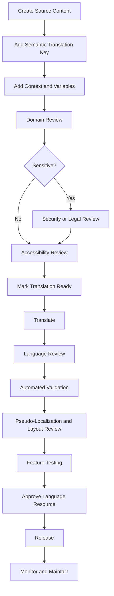
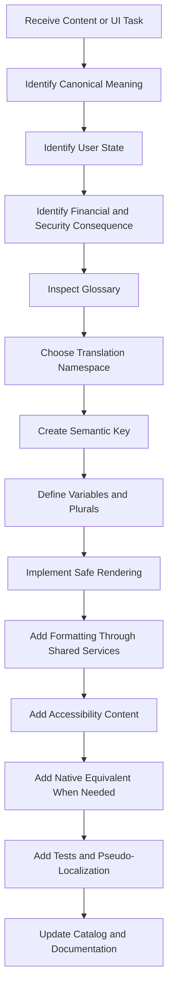

# Nexio Internationalization and Content Specification

Version: 1.0  
Status: Official  
Authority Level: Language, Localization and Product Content Standard  
Applies To: Web, Desktop, Tablet, Mobile, Android, Notifications, Imports, Exports, Reports, Assistant and Support Content

---

# Purpose

This document defines the official internationalization, localization and product-content architecture of Nexio.

It establishes:

- Language architecture
- Locale selection
- Translation resources
- Translation-key design
- Fallback behavior
- Financial terminology
- Currency formatting
- Date and time formatting
- Number and percentage formatting
- Pluralization
- Gender-neutral language
- User-generated content
- Error-message standards
- Empty-state content
- Notification content
- Import and export localization
- Accessibility language
- Android resource coordination
- Translation testing
- Content governance
- AI implementation restrictions

Nexio must communicate financial information accurately and consistently across:

- Languages
- Locales
- Currencies
- Time zones
- Devices
- Screen sizes
- Accessibility technologies
- Online and offline states
- Application versions

Localization must never alter canonical financial meaning.

---

# Relationship with Other Documents

This document must be interpreted together with:

```text
docs/00-FOUNDATION.md
docs/01-ARCHITECTURE.md
docs/02-DESIGN-SYSTEM.md
docs/03-DESKTOP.md
docs/04-TABLET.md
docs/05-MOBILE.md
docs/06-DATA-MODEL.md
docs/07-SECURITY.md
docs/08-OFFLINE-AND-SYNC.md
docs/09-TESTING.md
docs/10-DEPLOYMENT-AND-OPERATIONS.md
```

Responsibilities are divided as follows:

| Document | Responsibility |
|---|---|
| `00-FOUNDATION.md` | Product purpose and product principles |
| `01-ARCHITECTURE.md` | Module boundaries and dependency direction |
| `02-DESIGN-SYSTEM.md` | Visual and interaction consistency |
| `03-DESKTOP.md` | Desktop composition |
| `04-TABLET.md` | Tablet adaptation |
| `05-MOBILE.md` | Mobile and Android behavior |
| `06-DATA-MODEL.md` | Canonical financial values and entity meaning |
| `07-SECURITY.md` | Privacy and safe information exposure |
| `08-OFFLINE-AND-SYNC.md` | Local and remote consistency |
| `09-TESTING.md` | Localization and content verification |
| `10-DEPLOYMENT-AND-OPERATIONS.md` | Language-resource delivery and versioning |
| `11-INTERNATIONALIZATION-AND-CONTENT.md` | Language, locale, formatting and product copy |

The Data Model defines canonical values.

This document defines how those values are presented and explained to people.

---

# Current Implementation Anchors

The current project contains internationalization-related implementation points such as:

```text
i18n.js
index.html
app.js
js/ui/
js/core/
mobile-capacitor.js
android-web/
capacitor-overrides/android/res/values/strings.xml
PLAY_STORE_LISTING.md
politica-de-privacidade.html
excluir-conta.html
```

Recommended responsibility:

| Location | Responsibility |
|---|---|
| `i18n.js` | Translation runtime and language-resource registration |
| `locales/` | Version-controlled language resources |
| `js/core/formatting.js` | Locale-aware formatting adapters |
| `js/core/terminology.js` | Canonical financial labels where needed |
| `js/ui/` | Translation-key consumption |
| Android `strings.xml` | Native-only Android strings |
| `PLAY_STORE_LISTING.md` | Store-listing source copy |
| Legal HTML pages | Localized legal and support content |

UI modules must not contain independent translation systems.

---

# Internationalization Constitutional Principles

## Canonical Data Is Locale-Neutral

Canonical data must not store presentation formatting.

Store:

```javascript
{
  amountMinor: 18540,
  currency: "BRL",
  transactionDate: "2026-07-24"
}
```

Do not store:

```javascript
{
  amount: "R$ 185,40",
  transactionDate: "24/07/2026"
}
```

Formatted text belongs to the presentation layer.

---

## Language and Locale Are Different Concepts

Language identifies the communication language.

Examples:

```text
pt

en

es
```

Locale identifies regional presentation conventions.

Examples:

```text
pt-BR

en-US

en-GB

es-ES
```

A user may use:

```text
Language:
Portuguese

Locale:
Brazil
```

The architecture must not treat every language as one universal regional format.

---

## Currency Is Not Derived from Language

Portuguese language does not automatically imply BRL.

English language does not automatically imply USD.

Currency must come from:

- Financial entity
- Account
- Profile preference
- Explicit user selection
- Supported import mapping

Never infer a transaction currency only from interface language.

---

## Time Zone Is Not Derived from Language

A Portuguese-speaking user may live in another time zone.

The user time zone must be explicit or safely resolved.

Language changes must not change:

- Financial dates
- Stored timestamps
- Recurrence dates
- Report periods
- Synchronization order

---

## Translation Must Preserve Financial Meaning

A translated label must not change domain semantics.

Examples:

```text
Income

Expense

Transfer

Refund

Opening Balance

Available Balance

Credit Limit
```

These concepts require approved translations.

A visually natural translation is insufficient when it changes accounting meaning.

---

## No User-Visible Hardcoded Text

User-facing text should normally use translation resources.

This includes:

- Buttons
- Labels
- Headings
- Placeholders
- Errors
- Empty states
- Tooltips
- Toasts
- Dialogs
- Synchronization states
- Notifications
- Accessibility labels
- Chart legends
- Export column names

Exceptions require explicit review.

---

## Formatting Must Use Standard Locale APIs

Preferred formatting infrastructure:

```text
Intl.NumberFormat

Intl.DateTimeFormat

Intl.PluralRules

Intl.RelativeTimeFormat

Intl.ListFormat
```

Avoid manually assembling locale-dependent punctuation and ordering.

---

## Translation Must Support Expansion

Translated text may be longer than the source language.

Layouts must support:

- Longer labels
- Multi-line buttons where appropriate
- Flexible dialog width
- Flexible table headings
- Dynamic bottom-sheet height
- Text scaling
- Screen-reader descriptions

Do not design interfaces around one fixed language length.

---

## Meaning Must Not Depend on Word Order

Translations may reorder variables.

Preferred:

```text
Translation resource controls the complete sentence.
```

Avoid:

```javascript
translate("deleted") + " " + entityName;
```

The target language may require a different order.

---

## Fallback Must Be Predictable

When a translation is missing:

- Use the defined fallback language.
- Record a safe diagnostic.
- Avoid displaying raw translation keys in Production where possible.
- Avoid mixing several languages on one screen.
- Preserve workflow usability.

---

## User-Generated Content Must Not Be Translated Automatically

Examples:

- Transaction descriptions
- Account names
- Category names created by the user
- Goal names
- Notes
- Imported descriptions

These values must remain exactly as entered unless the user explicitly requests transformation.

---

## Security and Privacy Messages Must Remain Precise

Localization must not weaken:

- Authentication instructions
- Deletion consequences
- Export warnings
- Privacy explanations
- Conflict explanations
- Permission requests
- Security alerts

Sensitive messages require content and security review.

---

# Terminology

## Language

The language used for user-facing communication.

## Locale

Regional rules for formatting numbers, dates and other presentation.

## Translation Key

Stable semantic identifier for one translatable message.

## Translation Resource

A version-controlled collection mapping translation keys to localized messages.

## Source Language

The language in which canonical product copy is authored and reviewed.

## Fallback Language

The language used when a requested translation is unavailable.

## Interpolation

Insertion of variables into a translated message.

## Pluralization

Language-specific selection of message form based on quantity.

## Formatting Adapter

A service that converts canonical values into locale-aware presentation.

## Content Design

The discipline of creating clear, consistent and actionable interface text.

---

# Supported Language Model

The initial supported-language set must be explicit.

Recommended initial configuration:

```text
Primary language:
Portuguese

Primary locale:
pt-BR

Fallback language:
Portuguese

Fallback locale:
pt-BR
```

Additional languages must be added only when:

- Translation coverage exists
- Financial terminology is reviewed
- Primary workflows are tested
- Legal and support implications are reviewed
- Android and Web resources are coordinated

---

# Language Registry

Conceptual registry:

```javascript
const supportedLanguages = {
  "pt-BR": {
    language: "pt",
    locale: "pt-BR",
    direction: "ltr",
    displayNameKey: "language.portugueseBrazil",
    fallback: null,
    enabled: true
  },

  "en-US": {
    language: "en",
    locale: "en-US",
    direction: "ltr",
    displayNameKey: "language.englishUnitedStates",
    fallback: "pt-BR",
    enabled: false
  }
};
```

A language may exist in development while remaining disabled for Production.

---

# Language Support States

Recommended states:

```text
draft

internal

beta

supported

deprecated

removed
```

---

## Draft Language

Translation work is incomplete.

It must not be available to ordinary Production users.

---

## Internal Language

Available only for internal review and testing.

---

## Beta Language

May be available to a limited cohort with clear support expectations.

Critical financial and security content must already be complete.

---

## Supported Language

Receives:

- Complete primary workflow coverage
- Regression testing
- Content maintenance
- Support documentation
- Release compatibility

---

## Deprecated Language

Still available temporarily but scheduled for removal.

Users must receive migration guidance.

---

# Locale Resolution

Recommended resolution order:

```text
1. Explicit authenticated Profile preference

2. Explicit unauthenticated local preference

3. Device or browser supported locale

4. Application fallback locale
```

---

# Locale Resolution Contract

Conceptual:

```javascript
function resolveLocale({
  profileLocale,
  localLocale,
  deviceLocales,
  supportedLocales,
  fallbackLocale
}) {
  // Return one normalized supported locale.
}
```

---

# Unsupported Device Locale

Example:

```text
Device locale:
fr-FR

Supported locales:
pt-BR
```

Result:

```text
pt-BR
```

The application must not create an incomplete hybrid locale automatically.

---

# Locale Normalization

Inputs may arrive as:

```text
pt-BR

pt_BR

PT-br

pt
```

The resolver should normalize safely.

Language-only matches may map to an approved default locale.

Example:

```text
pt
→ pt-BR
```

only when the registry defines this mapping.

---

# Language Preference Ownership

An authenticated language preference belongs to the Profile.

It should synchronize across supported devices according to preference merge rules.

An unauthenticated preference may remain local until sign-in.

---

# Language Change Behavior

Changing language should:

- Update visible translated UI
- Preserve current route
- Preserve form values
- Preserve canonical Money
- Preserve canonical dates
- Reformat displayed values
- Update document language metadata
- Update accessibility labels
- Persist preference
- Avoid full application data reset

---

# Language Change During Form Entry

Example:

```text
Amount entered:
185,40

Canonical form state:
18540 minor units BRL
```

After changing language:

- Canonical Money remains 18540 minor units.
- Display is reformatted according to the new locale.
- No duplicate submission occurs.
- Other input remains preserved.

---

# Document Language Metadata

The Web document should update:

```html
<html lang="pt-BR">
```

according to the active language.

Android native surfaces should use appropriate localized native resources.

---

# Text Direction

The architecture should support:

```text
ltr

rtl
```

even if the initial supported language is left-to-right.

Direction must be associated with locale resources.

---

# RTL Readiness

When a right-to-left language is introduced:

- Use logical CSS properties.
- Mirror directional icons where appropriate.
- Preserve non-directional icons.
- Review charts.
- Review tables.
- Review account and currency display.
- Review mixed Latin and numeric content.
- Test Android Back and navigation affordances.

Do not enable RTL support without full review.

---

# Translation Resource Architecture

Recommended structure:

```text
locales/
├── pt-BR/
│   ├── common.json
│   ├── authentication.json
│   ├── dashboard.json
│   ├── transactions.json
│   ├── accounts.json
│   ├── categories.json
│   ├── goals.json
│   ├── reports.json
│   ├── notifications.json
│   ├── synchronization.json
│   ├── settings.json
│   ├── errors.json
│   ├── accessibility.json
│   └── legal.json
└── en-US/
    └── ...
```

A JavaScript module format may be used when required by current tooling.

The conceptual namespaces remain useful.

---

# Translation Namespace

Namespaces organize keys by product context.

Recommended namespaces:

```text
common

navigation

authentication

dashboard

transactions

accounts

categories

goals

reports

assistant

notifications

synchronization

imports

exports

attachments

settings

errors

accessibility

legal

support
```

---

# Translation-Key Principles

Translation keys must be:

- Semantic
- Stable
- Contextual
- Independent from source-language wording
- Easy to search
- Appropriate for reuse only when meaning is identical

---

# Preferred Translation Keys

```text
transactions.form.amount.label

transactions.form.amount.error.required

transactions.delete.dialog.title

sync.status.pending

accounts.balance.available.label
```

---

# Prohibited Translation Keys

Avoid source-text keys:

```text
"Save"

"Delete this transaction?"

"Your changes were saved"
```

A wording change should not require renaming the key.

---

# Avoid Positional Keys

Avoid:

```text
button1

message2

titleTop

labelLeft
```

Keys must describe meaning, not current layout.

---

# Key Reuse

Reuse one key only when:

- Meaning is identical
- Grammar context is identical
- Capitalization context is compatible
- Accessibility meaning is identical

The word:

```text
Save
```

may require different translation contexts for:

- Save a form
- Save money
- Savings account

These must not share one ambiguous key.

---

# Translation Key Catalog

A translation-key catalog should record:

```text
Key

Namespace

Source text

Description

Variables

Plural behavior

Screen or feature

Security sensitivity

Accessibility usage

Deprecated state
```

---

# Translation Entry

Conceptual resource:

```json
{
  "transactions.form.amount.label": "Valor",
  "transactions.form.amount.help": "Informe o valor da transação.",
  "transactions.form.amount.error.required": "Informe um valor."
}
```

---

# Translator Context

Every non-obvious key should provide translator context.

Example:

```text
Key:
accounts.balance.available.label

Context:
Label for the amount currently available to spend in an Account.

Not:
A command meaning “make available”.
```

---

# Translation Comments

When the resource format supports comments poorly, maintain context in:

- Translation catalog
- Separate metadata file
- Localization platform
- Type definitions

---

# Interpolation

Variables must be named semantically.

Preferred:

```text
{accountName}

{transactionCount}

{formattedAmount}
```

Avoid:

```text
{value1}

{x}

{thing}
```

---

# Interpolation Safety

Translated messages must treat interpolated user text as text.

Do not allow translation interpolation to execute:

- HTML
- Markdown
- JavaScript
- URL schemes
- Native commands

---

# Interpolation Formatting

Format canonical values before or through approved message formatting.

Conceptual:

```javascript
t("transactions.delete.confirmation", {
  description: transaction.description
});
```

For Money:

```javascript
t("goals.remaining", {
  amount: formatMoney(goal.remaining, locale)
});
```

When using a message-format system, locale-aware number formatting may occur inside the translation runtime.

---

# Full Sentence Translation

Preferred:

```text
"{count} transactions need review."
```

Do not assemble:

```text
count

+

"transactions"

+

"need review"
```

Plural and word order vary by language.

---

# Pluralization

Pluralization must use language rules.

Portuguese example:

```text
0 transações

1 transação

2 transações
```

The translation system should select forms through:

```text
Intl.PluralRules
```

or an approved message-format implementation.

---

# Plural Translation Entry

Conceptual:

```json
{
  "transactions.count.one": "{count} transação",
  "transactions.count.other": "{count} transações"
}
```

A richer message format may use:

```text
{count, plural,
  one {# transação}
  other {# transações}
}
```

---

# Zero Form

Some messages may require a special zero form.

Example:

```text
No pending changes
```

instead of:

```text
0 pending changes
```

This is a content decision, not a universal plural rule.

---

# Ordinals

When ordinal language is required, use locale rules.

Examples:

- First installment
- Second step
- Third occurrence

Do not create ordinal suffixes manually across languages.

---

# Lists

Use:

```text
Intl.ListFormat
```

or equivalent for natural lists.

Example:

```text
Account, Category and Date
```

List punctuation and conjunctions vary by locale.

---

# Translation Fallback Architecture

Recommended fallback chain:

```text
Requested full locale

↓

Requested language default locale

↓

Configured application fallback locale

↓

Safe built-in critical message
```

---

# Example Fallback

```text
Requested:
pt-PT

Not supported.

Language default:
pt-BR

Result:
pt-BR
```

The mapping must be explicit.

---

# Missing Translation Behavior

In Development:

- Display a visible marker when useful.
- Log missing key.
- Fail tests for required coverage.
- Preserve key context.

In Production:

- Use fallback translation.
- Record safe diagnostic.
- Avoid showing raw keys when possible.
- Preserve workflow usability.

---

# Critical Built-In Fallbacks

A minimal safe bundle may include messages such as:

```text
Unable to continue.

Sign in again.

This action could not be completed.

Your changes remain saved on this device.

Update Nexio to continue.
```

These fallbacks should be localized in the primary language and bundled with the application.

---

# Missing Variable Behavior

If a translation expects a missing variable:

- Do not display `undefined`.
- Do not display raw object output.
- Record a diagnostic.
- Use a safe fallback message.
- Preserve the operation.

---

# Extra Variable Behavior

Unused variables may be ignored safely.

They should not be serialized into visible output or logs unnecessarily.

---

# Translation Loading

Translation resources may be:

- Bundled
- Lazy-loaded by namespace
- Cached
- Versioned

Primary navigation and authentication messages should be available without fragile remote dependency.

---

# Core Translation Bundle

The initial bundle should contain:

- Application shell
- Authentication
- Navigation
- Common actions
- Loading
- Errors
- Offline status
- Security prompts
- Update requirement

---

# Lazy Translation Bundle

Feature-specific bundles may load when opening:

- Reports
- Import
- Assistant
- Advanced settings
- Conflict Center

A loading failure must use fallback content.

---

# Translation Resource Version

Translation resources should align with:

```text
Application release

or

Explicit localization resource version
```

A client must not receive translations referencing unavailable features without safe handling.

---

# Translation Cache

Cached resources require:

- Locale key
- Resource version
- Namespace
- Expiration or immutable content hash
- Application compatibility

---

# Translation Update

When translation text changes without code changes:

- Review product meaning.
- Review security-sensitive wording.
- Version resource.
- Test layout.
- Test accessibility.
- Deploy through controlled process.

Translation updates are production changes.

---

# Service Worker and Translation Resources

The Service Worker may cache versioned translation resources.

It must avoid:

- Mixing old UI code with incompatible translation keys
- Serving one locale resource as another
- Keeping deprecated legal text indefinitely
- Breaking offline critical messages

---

# Offline Language Support

A language available offline must have required resources cached or bundled.

The application must not allow switching to a language that becomes unusable immediately offline.

---

# Locale-Aware Formatting Architecture

Recommended formatting service:

```javascript
class FormattingService {
  formatMoney(money, options) {}

  formatNumber(value, options) {}

  formatPercentage(value, options) {}

  formatDate(dateOnly, options) {}

  formatDateTime(instant, options) {}

  formatRelativeTime(value, unit, options) {}

  formatList(values, options) {}
}
```

Feature modules should not instantiate arbitrary formatters repeatedly without shared policy.

---

# Formatting Context

Conceptual:

```javascript
{
  locale: "pt-BR",
  timeZone: "America/Sao_Paulo",
  defaultCurrency: "BRL",
  privacyMode: false
}
```

The entity's currency remains authoritative for Money formatting.

---

# Money Formatting

Canonical:

```javascript
{
  currency: "BRL",
  minorUnits: 18540
}
```

Localized `pt-BR` display:

```text
R$ 185,40
```

Localized `en-US` display of the same currency:

```text
R$185.40
```

or the approved `Intl.NumberFormat` result.

Language changes formatting, not currency.

---

# Money Formatter Contract

Conceptual:

```javascript
formatMoney(
  {
    currency: "BRL",
    minorUnits: 18540
  },
  {
    locale: "pt-BR",
    display: "symbol"
  }
);
```

---

# Currency Minor Units

The formatter must know the currency's supported fraction digits.

It must not assume every currency has two decimal places.

The canonical Money implementation remains responsible for exact storage.

---

# Currency Symbol Ambiguity

Some symbols are ambiguous.

Examples:

```text
$

£
```

Where context is unclear, use:

```text
USD 100.00

CAD 100.00
```

or the approved locale-aware currency code display.

---

# Money Sign

Transaction magnitude remains non-negative canonically.

Presentation may add direction:

```text
+ R$ 1.000,00

− R$ 185,40
```

The sign comes from financial meaning, not from a negative stored amount.

---

# Privacy-Mode Money Formatting

Privacy mode should return a protected representation.

Examples:

```text
R$ •••••

••••••

Valor oculto
```

The chosen pattern must:

- Avoid leaking digit count when required
- Avoid accessible-value leakage
- Preserve Currency context only according to privacy policy
- Remain visually consistent

---

# Compact Money Formatting

Compact representation may be used in constrained charts or summaries.

Examples:

```text
R$ 1,2 mil

R$ 1,2 mi
```

Requirements:

- Never use compact formatting for editable exact values.
- Provide exact accessible or detail value where privacy permits.
- Use locale-aware notation.
- Document rounding.

---

# Exact Money Surfaces

Use full exact formatting for:

- Transaction detail
- Forms
- Confirmation dialogs
- Conflict comparison
- Export review
- Account deletion impact
- Import validation

---

# Number Formatting

Use locale-aware grouping and decimals.

Example:

```text
pt-BR:
1.250,5

en-US:
1,250.5
```

Do not manually replace punctuation.

---

# Integer Count Formatting

Counts may use grouping:

```text
1.250 transações
```

according to locale.

---

# Percentage Formatting

Canonical percentage may use:

- Basis points
- Ratio
- Decimal value

The formatter must know which representation it receives.

Example:

```javascript
formatPercentage(
  {
    basisPoints: 2534
  },
  {
    locale: "pt-BR"
  }
);
```

Display:

```text
25,34%
```

---

# Percentage Rounding

Different surfaces may require:

```text
0 decimal places

1 decimal place

2 decimal places
```

The rule must be explicit.

Do not vary precision unpredictably.

---

# Date-Only Formatting

Canonical:

```text
2026-07-24
```

`pt-BR` display:

```text
24/07/2026
```

Long display:

```text
24 de julho de 2026
```

The formatter must not convert the Date through UTC in a way that changes the day.

---

# Date Formatter Contract

Conceptual:

```javascript
formatDate(
  "2026-07-24",
  {
    locale: "pt-BR",
    style: "short"
  }
);
```

---

# Date Styles

Recommended named styles:

```text
short

medium

long

monthYear

weekdayShort

inputDisplay
```

Named styles produce consistency.

---

# Date Input

Native and custom date inputs must preserve canonical:

```text
YYYY-MM-DD
```

Display formatting must not alter stored value.

---

# Date-Time Formatting

Canonical timestamp:

```text
2026-07-24T12:30:00.000Z
```

Formatting requires:

- Locale
- Profile time zone
- Date style
- Time style

---

# Date-Time Formatter Contract

```javascript
formatDateTime(
  "2026-07-24T12:30:00.000Z",
  {
    locale: "pt-BR",
    timeZone: "America/Sao_Paulo",
    dateStyle: "short",
    timeStyle: "short"
  }
);
```

---

# Technical Time Zone

System logs and operational records may use UTC.

User-facing content should use Profile time zone unless a workflow explicitly requires another zone.

---

# Relative Time

Examples:

```text
há 5 minutos

ontem

em 2 dias
```

Use relative time only when it improves understanding.

Exact time should remain available when important.

---

# Relative-Time Refresh

Relative labels may need periodic refresh.

Avoid high-frequency timers for every row.

Use a centralized controlled refresh strategy.

---

# Relative-Time Boundaries

A label such as:

```text
yesterday
```

depends on the user's time zone and local date.

Tests must control both.

---

# Month Names

Use locale APIs.

Do not maintain manual month-name arrays unless required by a controlled fallback.

---

# Week Start

Week-start convention varies by locale and product policy.

The application must define whether week-based reports use:

- Locale week start
- User preference
- Fixed business rule

The rule must not change silently when language changes if it affects financial reporting.

---

# Financial Period versus Calendar Formatting

A financial period may start on a configured day.

Formatting should present it clearly:

```text
25 June – 24 July 2026
```

The calculation comes from the financial-period domain.

The formatter only presents the calculated boundaries.

---

# Time Format Preference

The locale may prefer:

```text
24-hour

12-hour
```

The application may follow locale or explicit user preference.

Do not store a formatted time string as canonical state.

---

# Numeric Input Localization

Numeric entry is more complex than numeric display.

The parser must distinguish:

```text
pt-BR:
1.250,50

en-US:
1,250.50
```

---

# Numeric Input Contract

Conceptual:

```javascript
parseLocalizedMoneyInput({
  input: "1.250,50",
  locale: "pt-BR",
  currency: "BRL"
});
```

Result:

```javascript
{
  currency: "BRL",
  minorUnits: 125050
}
```

---

# Numeric Parser Requirements

The parser must:

- Accept supported locale punctuation.
- Reject ambiguous malformed values.
- Reject unsupported precision.
- Reject unsafe range.
- Reject invalid sign when not permitted.
- Preserve empty input state separately from zero.
- Return structured validation errors.

---

# Paste Behavior

Pasted values may include:

```text
R$ 1.250,50

1 250,50

1250.50
```

The parser must define supported patterns per locale.

Ambiguous input must not be guessed silently.

---

# Ambiguous Numeric Input

Example in `pt-BR`:

```text
1.250
```

Could mean:

```text
One thousand two hundred fifty

or

One and twenty-five hundredths
```

The parser should use explicit locale rules and field behavior.

Where ambiguity remains, request correction.

---

# Normalization During Typing

Formatting while typing must not:

- Move cursor unpredictably
- Delete intended digits
- Convert empty to zero
- Change value after language switch incorrectly
- Prevent accessibility input
- Break paste

---

# Canonical Form State

The form may preserve:

```javascript
{
  rawInput: "185,40",
  parsedMoney: {
    currency: "BRL",
    minorUnits: 18540
  },
  parseState: "valid"
}
```

Only valid canonical Money should enter the Domain command.

---

# Financial Terminology Architecture

Nexio requires a controlled financial glossary.

Recommended terms:

```text
Account

Balance

Available Balance

Opening Balance

Income

Expense

Transfer

Refund

Credit

Debit

Category

Goal

Contribution

Recurring Transaction

Pending

Completed

Cancelled

Archived

Net Worth

Cash Flow

Statement

Import

Export
```

---

# Terminology Record

Each term should define:

```text
Canonical English concept

Approved Portuguese term

Definition

Contexts

Terms to avoid

Abbreviation policy

Accessibility notes
```

---

# Example Terminology Record

```text
Concept:
Expense

Approved Portuguese:
Despesa

Definition:
An outflow that reduces financial result for the selected period.

Avoid:
Débito, when the meaning is specifically Expense.

Reason:
A debit may represent other accounting or banking behavior.
```

---

# Account Terminology

`Account` may represent:

- Bank account
- Cash wallet
- Credit card
- Liability account
- Other financial container

The translated term must remain broad enough for supported Account types.

---

# Balance Terminology

Different concepts must remain distinct:

```text
Current Balance

Available Balance

Opening Balance

Statement Balance

Outstanding Balance

Credit Limit
```

Do not translate all of them as one generic:

```text
Saldo
```

without qualifying context.

---

# Transaction Terminology

`Transaction` is the broad entity.

It may include:

- Income
- Expense
- Transfer
- Refund
- Adjustment where supported

The interface should not use `Expense` when the entity may be another type.

---

# Transfer Terminology

A Transfer moves value between Accounts.

It is not:

- Income
- Expense
- Payment received
- Category spending

Translation must preserve this distinction.

---

# Pending Terminology

`Pending` may refer to:

```text
Financial status

Synchronization state

Approval state

Import review state
```

These contexts need distinct keys.

Examples:

```text
transaction.status.pending

sync.status.pending

import.status.pendingReview
```

---

# Delete, Remove and Archive

These actions have different meanings.

## Delete

Removes an entity according to lifecycle policy.

## Remove

Disconnects or removes an item from a local context.

## Archive

Preserves historical use while removing from ordinary active selection.

Translations and buttons must use the correct action.

---

# Cancel

`Cancel` may mean:

```text
Close dialog without saving

or

Change Transaction status to Cancelled
```

Use distinct keys and wording.

Example:

```text
common.action.cancel

transactions.action.markCancelled
```

---

# Save Terminology

`Save` means persisting current user input.

`Save money` is a different semantic concept.

Do not reuse one ambiguous translation key.

---

# Synchronization Terminology

Approved user-facing concepts should distinguish:

```text
Saved on this device

Waiting to synchronize

Synchronizing

Synchronized

Needs review

Sign-in required
```

Avoid technical terms:

```text
Queued PATCH

Conflict 409

Remote mutation failed
```

---

# Offline Terminology

Preferred communication:

```text
Offline

You can continue using saved information.

Changes will synchronize when the connection returns.
```

Avoid:

```text
No internet. Application unavailable.
```

when local capability remains available.

---

# Error Terminology

Errors should explain:

```text
What happened

What remains safe

What the user can do
```

They should not expose internal implementation.

---

# Content Tone

Nexio content should be:

- Clear
- Calm
- Direct
- Respectful
- Non-judgmental
- Specific
- Actionable

---

# Financially Neutral Tone

Avoid judgmental language about spending.

Avoid:

```text
You spent too much again.

Bad spending habit.

You failed your Goal.
```

Prefer:

```text
Expenses are above the selected limit.

This Goal is behind the planned progress.
```

---

# Avoid Blame

Do not say:

```text
You entered an invalid value.
```

Prefer:

```text
Enter a value greater than zero.
```

The message should focus on correction.

---

# Avoid False Reassurance

Do not say:

```text
Everything is safe.
```

when the system only knows:

```text
The change was saved locally.
```

Use the exact verified state.

---

# Avoid Technical Jargon

User-facing text should avoid:

- RPC
- RLS
- JSON
- IndexedDB
- Operation ID
- HTTP status
- Mutation
- Payload
- Schema
- Cursor

Safe diagnostic references may appear separately.

---

# Concise Interface Content

Buttons should normally use short action labels.

Examples:

```text
Save

Continue

Review

Retry

Export

Archive
```

Long explanation belongs in nearby supporting text.

---

# Sentence Capitalization

Use sentence-style capitalization according to language norms.

Avoid title case copied from English into Portuguese.

Preferred Portuguese:

```text
Criar nova transação
```

Avoid:

```text
Criar Nova Transação
```

unless brand or specific style requires it.

---

# Punctuation

Buttons and short labels normally do not require periods.

Complete explanatory sentences should use appropriate punctuation.

---

# Ellipsis

Use an ellipsis only when an action opens another step or requires more input.

Example:

```text
Exportar…
```

only when selecting it opens an export configuration flow.

Do not add ellipsis merely for decoration.

---

# Abbreviations

Avoid unexplained abbreviations.

Potential accepted abbreviations must be documented.

Examples:

```text
CPF

CNPJ

CSV

PDF
```

Where required, provide full explanation in help content.

---

# Acronym Localization

Acronyms may remain unchanged when they are standard in the target locale.

Do not translate technical acronyms inconsistently.

---

# Placeholder Policy

Placeholder text must not replace a visible label.

Good:

```text
Label:
Descrição

Placeholder:
Ex.: supermercado
```

The placeholder is an example, not the field identity.

---

# Example Content

Examples must use synthetic non-sensitive content.

Recommended examples:

```text
Supermercado

Salário

Aluguel

Transporte
```

Avoid real user names, real financial identifiers or personal records.

---

# Content and Privacy

User-facing content must avoid revealing financial details in:

- Notification previews
- Browser titles
- URLs
- Android app preview
- Error messages
- Support references
- Accessibility labels during privacy mode

---

# Browser Title

Page title may identify the feature.

Example:

```text
Transações — Nexio
```

It should not include:

```text
Saldo de R$ 5.420,18
```

---

# URL Content

URLs and query parameters must not contain:

- Amount
- Description
- Note
- Account name
- Authentication token
- Imported row

Use safe entity identifiers when required and reauthorize them.

---

# Translation Runtime Contract

Conceptual interface:

```javascript
class I18nService {
  initialize(options) {}

  setLocale(locale) {}

  getLocale() {}

  translate(key, variables, options) {}

  hasTranslation(key, locale) {}

  loadNamespace(namespace, locale) {}

  subscribe(listener) {}

  dispose() {}
}
```

---

# Translation Result

The default result should be plain text.

Returning raw HTML should require a separate explicit reviewed API.

---

# Rich Translation Content

When a message requires links or emphasis:

- Prefer structured UI composition.
- Translate complete surrounding phrases.
- Keep interactive elements semantic.
- Avoid raw translated HTML.

Conceptual:

```javascript
{
  prefixKey: "legal.accept.prefix",
  linkKey: "legal.accept.privacyPolicy",
  suffixKey: "legal.accept.suffix"
}
```

A richer message component may support named safe slots.

---

# Translation HTML Prohibition

Forbidden:

```javascript
element.innerHTML = t("message");
```

unless the translation has passed an explicitly approved sanitization and rich-content architecture.

Plain translation values must use safe text rendering.

---

# Translation Key Type Safety

Where tooling permits, generate or maintain a key type.

Conceptual:

```typescript
type TranslationKey =
  | "common.action.save"
  | "common.action.cancel"
  | "transactions.form.amount.label"
  | "sync.status.pending";
```

This reduces missing and mistyped keys.

---

# Namespace Loading Error

When a feature namespace fails to load:

- Use bundled fallback where available.
- Preserve the feature state.
- Avoid displaying blank controls.
- Record safe diagnostics.
- Offer Retry when needed.

---

# Internationalization State

Conceptual application state:

```javascript
{
  requestedLocale: "pt-BR",
  activeLocale: "pt-BR",
  fallbackLocale: "pt-BR",

  status:
    "uninitialized"
    | "loading"
    | "ready"
    | "fallback"
    | "error",

  loadedNamespaces: [
    "common",
    "transactions"
  ]
}
```

---

# Initialization Order

Recommended startup order:

```text
Load critical local language preference

↓

Resolve supported locale

↓

Load core translation bundle

↓

Set document language and direction

↓

Render application shell

↓

Load feature namespace as needed
```

Avoid rendering raw translation keys before initialization.

---

# Authentication Language

Unauthenticated authentication screens should use:

- Saved local preference
- Device-supported locale
- Fallback locale

After authentication, the Profile preference may become authoritative.

---

# Locale Transition After Sign-In

When local and Profile preferences differ:

- Apply documented preference policy.
- Avoid flashing several languages.
- Preserve authentication result.
- Update document metadata.
- Persist resolved preference when appropriate.

---

# Server-Generated Messages

Trusted backend APIs should prefer stable error codes over localized sentences.

Example:

```javascript
{
  category: "validation",
  code: "CATEGORY_NOT_AVAILABLE"
}
```

The client maps the code to:

```text
errors.categoryNotAvailable
```

---

# Why Error Codes Are Preferred

Backend-localized text may:

- Use wrong locale
- Be difficult to update
- Expose internal details
- Become inconsistent across platforms
- Prevent precise client formatting

---

# Unknown Error Code

When the client receives an unknown code:

- Use a safe generic error.
- Preserve safe diagnostic reference.
- Record the unknown code.
- Avoid displaying raw backend text.

---

# Native Android Strings

Native Android strings may be required for:

- Application name
- Permission rationale native surface
- Notification channel names
- System shortcuts
- Share-sheet labels
- Native error fallback
- FileProvider descriptions

These resources should align with the main language catalog.

---

# Android String Resource Structure

Example:

```text
res/values/strings.xml

res/values-pt-rBR/strings.xml

res/values-en-rUS/strings.xml
```

The exact default resource strategy must respect Android requirements.

---

# Native and Web Translation Duplication

Some messages may exist in both:

- Web translation resources
- Android native resources

A synchronization process or documented ownership should prevent contradictory wording.

---

# Notification Channel Localization

Android Notification channel names are user-visible.

They should use approved localized strings.

Example categories:

```text
Lembretes

Segurança

Sincronização
```

Changing a channel name after creation requires Android-specific validation.

---

# Android Store Localization

Google Play listing localization should include:

- Application name
- Short description
- Full description
- Screenshots
- Release notes
- Support links
- Privacy-policy link

Store language support must not exceed actual application support without explanation.

---

# Legal Content Localization

Legal and privacy documents require controlled translation.

Machine translation alone is insufficient for authoritative legal text.

Each legal-language version should define:

- Effective date
- Version
- Jurisdiction or scope
- Review status
- Source version
- Contact

---

# Legal Fallback

When authoritative legal content is unavailable in the active language:

- Display the available authoritative language clearly.
- Explain the language limitation.
- Avoid presenting an unreviewed translation as legally authoritative.

---

# Content Resource Security

Translation resources are code-adjacent production assets.

They must not contain:

- Secrets
- Raw user data
- Executable HTML
- Unapproved external URLs
- Hidden debug instructions
- Sensitive incident details

---

# Translation Resource Integrity

Remote or cached translation resources should be protected through:

- Trusted origin
- HTTPS
- Versioning
- Content hashing where applicable
- Controlled deployment
- CSP compatibility

---

# Translation Resource Failure

A corrupted translation resource must not:

- Execute code
- Break authentication
- Replace authorization decisions
- Alter canonical values
- Delete local state

Fallback to a safe bundled resource.

---

# Part 1 Internationalization Anti-Patterns

The following are prohibited:

## Formatted Canonical Data

Storing `R$ 185,40` as the financial amount.

## Currency from Language

Assuming Portuguese means BRL.

## Time Zone from Locale

Changing financial dates because language changed.

## Hardcoded User Text

Embedding interface sentences directly throughout UI modules.

## Source-Text Translation Keys

Using the full Portuguese or English sentence as the key.

## String Concatenation

Building translated sentences from separately translated fragments.

## Generic Save Key

Using one ambiguous key for saving a form and financial savings.

## One Pending Label

Using the same translation for financial Pending and synchronization Pending.

## HTML Translation Injection

Rendering translation values through unrestricted `innerHTML`.

## User-Content Translation

Automatically translating a Transaction description.

## Manual Currency Punctuation

Replacing dots and commas manually.

## Floating-Point Input Parsing

Parsing Money through imprecise decimal arithmetic.

## Raw Backend Error

Displaying PostgreSQL or Supabase error text directly.

## Language Switch Reset

Reloading and losing form state when changing locale.

## Missing-Key Production Display

Showing raw keys such as `transactions.form.amount.label`.

## Incomplete Offline Language

Allowing selection of a language whose core resources are not available offline.

## Layout Fixed to Portuguese Length

Using rigid widths that break with translation expansion.

## Legal Machine Translation as Authority

Publishing unreviewed translated legal content.

## Android and Web Terminology Drift

Using different financial terms across native and Web surfaces.

---

# Part 1 Review Questions

Before adding a language or localized feature, answer:

```text
What is the canonical data value?

Which language is used?

Which locale formats the value?

Which Currency belongs to the entity?

Which time zone applies?

Which translation namespace owns the message?

Does the key describe meaning?

Which variables exist?

Which plural forms exist?

Can the text expand?

Is the message security-sensitive?

Is it available offline?

Does Android require a native equivalent?

What happens when the translation is missing?

Which tests validate formatting and fallback?
```

---

# Translation-Key Review Questions

```text
Is the key semantic?

Is its context unambiguous?

Can it be reused safely?

Does it contain layout terminology?

Does the translation require pluralization?

Does it interpolate user content?

Does it need translator context?

Is it used by accessibility?

Is it security or legally sensitive?
```

---

# Formatting Review Questions

```text
Is the canonical value locale-neutral?

Is the Currency explicit?

Is Money exact?

Is the value display-only or editable?

Which precision is required?

Does privacy mode apply?

Does the date represent a day or an instant?

Which time zone applies?

Is compact formatting permitted?

Does the accessible value match the visible meaning?
```

---

# Part 1 Acceptance Criteria

The internationalization and content foundation is accepted only when:

```text
□ Canonical data remains locale-neutral.

□ Language, locale, Currency and time zone remain separate concepts.

□ Currency is never inferred only from language.

□ Date-only values remain stable across locale changes.

□ User-facing text uses centralized translation resources.

□ Translation keys are semantic and stable.

□ Translation namespaces reflect product contexts.

□ Financial terminology has approved meanings.

□ Financial Pending and synchronization Pending use distinct keys.

□ Translation variables have semantic names.

□ Complete sentences are translated as complete units.

□ Pluralization uses locale rules.

□ Missing translations use a predictable fallback.

□ Production avoids exposing raw translation keys.

□ Critical fallback messages are bundled.

□ User-generated content is not translated automatically.

□ Translation interpolation is rendered safely as text.

□ Raw translated HTML is prohibited by default.

□ Locale changes preserve route, form state and canonical values.

□ Document language metadata updates correctly.

□ Core translation resources are available offline.

□ Translation resources are versioned with compatible releases.

□ Money formatting uses canonical Money and locale-aware APIs.

□ Currency minor-unit behavior is respected.

□ Privacy-mode formatting prevents visual and accessible leakage.

□ Exact financial surfaces avoid compact formatting.

□ Date-only and instant formatting use different contracts.

□ User time zone is explicit for timestamps.

□ Numeric input parsing follows locale rules.

□ Ambiguous numeric input is not guessed silently.

□ Backend errors use stable codes mapped by the client.

□ Android native strings align with Web terminology.

□ Store-listing language support matches application support.

□ Legal translations have explicit review status.

□ Translation resources contain no executable or sensitive content.

□ Layouts support translation expansion.

□ Internationalization anti-patterns are prohibited.
```

---

# Internationalization Constitutional Rule

Every translation, formatting and content decision must answer:

```text
Does this presentation preserve the exact financial, security and workflow meaning of the canonical value for this language, locale, Currency, time zone and platform?
```

When the answer is unclear, prefer the implementation that:

- Keeps canonical data locale-neutral.
- Uses explicit Currency and time zone.
- Uses semantic translation keys.
- Translates complete messages.
- Uses locale-aware standard APIs.
- Preserves exact Money.
- Distinguishes financial and technical states.
- Protects user-generated content.
- Provides predictable fallback.
- Supports translation expansion.
- Preserves accessibility.
- Avoids raw HTML.
- Remains available offline.
- Uses approved terminology.
- Fails safely.

Localization is not replacing words.

It is preserving one financial meaning across languages and regional conventions.

---
---

# Product Content Architecture

Product content must follow the same architectural discipline as code and financial data.

Content should be organized into:

```text
Global actions

Component content

Feature terminology

Workflow instructions

Validation messages

System states

Security and privacy messages

Accessibility descriptions

Notifications

Legal and support content
```

Every message should have:

- One clear purpose
- One owning feature or namespace
- One intended audience
- One severity
- One recommended user action
- One translation key
- One tested fallback

---

# Content Hierarchy

When several pieces of content appear together, recommended hierarchy is:

```text
Title

↓

Short explanation

↓

Primary information or input

↓

Supporting guidance

↓

Validation or status

↓

Primary and secondary actions
```

Avoid presenting several equally prominent instructions.

---

# Content Priority

Content priority should follow:

```text
1. Security or data-loss prevention

2. Required user action

3. Financial consequence

4. Current workflow state

5. Supporting explanation

6. Optional education
```

Decorative or promotional content must never obscure:

- Validation
- Synchronization status
- Financial amount
- Deletion consequence
- Authentication requirement
- Conflict resolution

---

# Content Density

Content density should adapt to the surface.

## Desktop

May include:

- More context
- Supporting labels
- Table descriptions
- Persistent filters
- Inline help

## Tablet

Should balance context with touch-friendly spacing.

## Mobile

Should prioritize:

- One clear heading
- One main action
- Short explanation
- Progressive disclosure
- Essential validation

The semantic meaning must remain the same across platforms.

---

# Content Component Contract

A reusable content-bearing component should define:

```javascript
{
  titleKey: "string",
  descriptionKey: "string | null",
  actionKeys: [],
  statusKey: "string | null",
  accessibilityKey: "string | null",
  variables: {},
  severity: "neutral | success | warning | error | critical"
}
```

Component APIs should receive translation keys or semantic values according to architecture.

They should not receive preassembled arbitrary HTML.

---

# Common Action Vocabulary

Approved common action concepts:

```text
Add

Apply

Archive

Back

Cancel

Clear

Close

Confirm

Continue

Create

Delete

Discard

Done

Edit

Export

Import

Open

Remove

Restore

Retry

Review

Save

Search

Select

Share

Sign in

Sign out

Skip

Update
```

Each action must use the correct semantic key.

---

# Primary Action Content

A primary action should state the result.

Preferred:

```text
Create transaction

Save changes

Confirm import

Delete account

Resolve conflict
```

Less useful:

```text
OK

Yes

Submit
```

Generic actions may be used only when the result is already completely clear.

---

# Secondary Action Content

Secondary actions should preserve user control.

Examples:

```text
Cancel

Back

Not now

Review later

Keep editing
```

Avoid ambiguous secondary labels such as:

```text
No
```

when the actual result is:

```text
Keep transaction
```

---

# Destructive Action Vocabulary

Use explicit action labels:

```text
Delete transaction

Delete account

Discard changes

Remove attachment

Cancel transaction
```

Do not use a generic:

```text
Confirm
```

for destructive final actions.

---

# Destructive Dialog Content

Recommended structure:

```text
Title:
Delete this transaction?

Explanation:
This transaction will be removed from active records and your totals will be recalculated.

Primary action:
Delete transaction

Secondary action:
Keep transaction
```

The exact explanation must match lifecycle behavior.

---

# Archive Dialog Content

Archive is not deletion.

Example:

```text
Title:
Archive this account?

Explanation:
The account will no longer appear in active selections, but its transaction history will remain available.

Primary action:
Archive account

Secondary action:
Keep account active
```

---

# Cancel Workflow Content

Closing a dialog and changing a financial entity to `cancelled` must use distinct wording.

Dialog exit:

```text
Cancel
```

Financial status action:

```text
Mark as cancelled
```

---

# Button Loading Content

When an action is processing, the label may change to a present-progress form.

Examples:

```text
Saving…

Importing…

Exporting…

Synchronizing…
```

Requirements:

- Preserve button width where practical.
- Prevent duplicate submission.
- Expose busy state to assistive technologies.
- Avoid inaccurate progress claims.

---

# Button Success Content

Do not leave a button permanently showing:

```text
Saved
```

when the workflow has already completed.

Use:

- Toast
- Status
- Navigation result
- Updated entity

Temporary inline success may be appropriate when it clarifies completion.

---

# Icon-Only Actions

Every icon-only action requires:

- Accessible name
- Tooltip where appropriate
- Clear icon
- Consistent meaning

Examples:

```text
Edit transaction

Delete attachment

Close dialog

Open filters

Show values
```

The accessible name must describe the action, not the icon.

Avoid:

```text
Pencil

Trash icon

Eye
```

---

# Link Content

Links should describe their destination or action.

Preferred:

```text
View privacy policy

Review pending changes

Open account details
```

Avoid:

```text
Click here

Learn more
```

when a specific label is possible.

---

# Navigation Content

Navigation labels should use stable feature names.

Recommended:

```text
Dashboard

Transactions

Accounts

Goals

Reports

Notifications

Assistant

Settings
```

Navigation labels should not change based on temporary promotional language.

---

# Page Titles

Page titles should identify the current feature or entity.

Examples:

```text
Transactions

New transaction

Edit transaction

Main account

July report

Synchronization issues
```

---

# Breadcrumb Content

When breadcrumbs are used:

- Use concise feature or entity names.
- Do not include sensitive values.
- Preserve hierarchy.
- Avoid unnecessary repetition.

Example:

```text
Accounts / Main account
```

---

# Tab Labels

Tab labels should use short parallel nouns or concepts.

Example:

```text
Overview

Transactions

Details
```

Avoid mixing:

```text
Overview

View transactions

Account settings
```

---

# Form Content Architecture

Every form should define:

```text
Form title

Purpose

Required fields

Optional fields

Field labels

Supporting text

Validation messages

Primary action

Secondary action

Dirty-state behavior

Success state
```

---

# Form Title

A form title should describe the entity and action.

Examples:

```text
New expense

Edit income

New transfer

Create account

Edit goal
```

---

# Form Introduction

Use introductory content only when needed.

Example:

```text
Record money moved between two of your accounts.
```

Avoid repeating the form title in a longer sentence.

---

# Field Labels

Field labels should be:

- Visible
- Specific
- Stable
- Short
- Grammatically consistent

Examples:

```text
Amount

Account

Category

Date

Description

Notes

Target amount

Target date
```

---

# Required Field Indication

Required state must be communicated:

- Visually
- Programmatically
- In form instructions where helpful

Avoid adding:

```text
(required)
```

to every label when most fields are required and the form explains optional fields instead.

A recommended approach:

```text
Fields marked “Optional” may be left blank.
```

---

# Optional Field Label

Example:

```text
Notes
Optional
```

The optional indicator should not become part of the field's core name when assistive technology behavior would become repetitive.

---

# Supporting Text

Supporting text should explain:

- Accepted format
- Consequence
- Selection rule
- Privacy behavior

Examples:

```text
Use a name that helps you identify this account.

This date determines which report period includes the transaction.

Only active expense categories are shown.
```

---

# Placeholder Content

Placeholders may show examples.

Examples:

```text
Ex.: Supermarket

Ex.: Emergency fund
```

Placeholders must not:

- Contain required instructions
- Replace labels
- Disappear as the only context
- Use real personal data

---

# Input Prefix and Suffix

Currency symbol, percentage sign or units should not replace the label.

Example:

```text
Label:
Amount

Prefix:
R$
```

Accessible content must communicate the complete field meaning.

---

# Money Input Content

Recommended structure:

```text
Label:
Amount

Supporting text when needed:
Enter a value greater than zero.

Error:
Enter a valid amount.
```

Avoid displaying several technical formatting instructions before the user makes an error.

---

# Localized Amount Validation

Examples for Portuguese:

```text
Informe um valor.

Informe um valor maior que zero.

Use no máximo duas casas decimais para BRL.

O valor informado é muito alto.

Verifique o formato do valor.
```

The exact messages must come from translation resources.

---

# Date Input Content

Recommended messages:

```text
Select a date.

Enter a valid date.

The date cannot be after the allowed limit.

The end date must be after the start date.
```

Do not expose JavaScript date parsing details.

---

# Select Field Content

Default empty option:

```text
Select an account

Select a Category

Select a Transaction type
```

Avoid:

```text
Choose…
```

without identifying what must be chosen.

---

# Searchable Select Content

States:

```text
Search accounts

No accounts found

Create a new account

Loading accounts…

Accounts unavailable offline
```

---

# Checkbox Content

Checkbox labels should describe the checked state.

Preferred:

```text
Include this account in net worth
```

Avoid:

```text
Net worth
```

when the effect is unclear.

---

# Toggle Content

A toggle requires:

- Clear label
- Current state where needed
- Consequence description for sensitive settings

Example:

```text
Hide financial values

When enabled, amounts are hidden across Nexio.
```

---

# Radio Group Content

Radio options should be mutually exclusive and parallel.

Example:

```text
Transaction type

Income

Expense

Transfer
```

---

# Form Validation Architecture

Validation messages should be:

- Specific
- Localized
- Actionable
- Near the affected field
- Announced accessibly
- Consistent with Domain rules

---

# Validation Timing

Validation may occur:

```text
After field interaction

On submit

After dependent selection

After remote validation
```

Avoid showing all errors before the user interacts with a new form unless necessary.

---

# Validation Message Pattern

Preferred:

```text
Required correction
```

Examples:

```text
Select an Account.

Enter a value greater than zero.

Choose different source and destination Accounts.

Select a Category compatible with Expenses.
```

---

# Invalid Value Message

Avoid:

```text
Invalid field.
```

Prefer:

```text
Enter a date in the supported format.
```

or:

```text
Select a valid active Account.
```

---

# Validation Summary

Long forms may display a summary:

```text
Review 3 fields before continuing.
```

The summary should link or move focus to the first invalid field.

---

# Dependent Validation

Example:

```text
Destination Account must use the same Currency as the source Account.
```

The message should identify the dependency.

---

# Archived Relationship Validation

Example:

```text
This Account is archived. Select an active Account to continue.
```

---

# Deleted Relationship Validation

Example:

```text
This Category is no longer available. Select another Category.
```

---

# Cross-Currency Validation

Example:

```text
These Accounts use different currencies. Create separate transactions or select compatible Accounts.
```

Do not imply automatic conversion when none exists.

---

# Server Validation Content

Backend error codes should map to localized messages.

Conceptual mapping:

```javascript
{
  CATEGORY_NOT_AVAILABLE:
    "transactions.error.categoryUnavailable",

  ACCOUNT_CURRENCY_MISMATCH:
    "transactions.error.accountCurrencyMismatch",

  VERSION_MISMATCH:
    "sync.error.entityChanged"
}
```

---

# Form Error Recovery

When submission fails:

- Preserve entered values.
- Preserve focus context.
- Explain whether data was saved locally.
- Provide Retry when appropriate.
- Avoid closing the form.

---

# Dirty Form Content

When leaving a form with unsaved input:

```text
Title:
Discard unsaved changes?

Explanation:
Your changes have not been saved.

Primary action:
Discard changes

Secondary action:
Keep editing
```

---

# Locally Saved Draft Content

Example:

```text
Draft saved on this device.
```

Do not say:

```text
Draft synchronized
```

unless it was remotely confirmed.

---

# Success Message Architecture

Success content should confirm:

- What completed
- Whether it is local or synchronized
- Relevant next state

Examples:

```text
Transaction saved.

Transaction saved on this device.

Transaction synchronized.

Account archived.

Import completed.
```

---

# Local Save Success

Recommended:

```text
Saved on this device

This change will synchronize when Nexio is online.
```

Use only when the local durable commit succeeded.

---

# Remote Success

Recommended:

```text
Synchronized
```

or:

```text
Transaction synchronized.
```

Avoid unnecessary success popups for every background synchronization.

---

# Success Toast

A toast should:

- Be short
- Not contain critical-only information
- Not require immediate action
- Remain accessible
- Avoid revealing hidden values

---

# Error Content Architecture

Every error message should answer, where possible:

```text
What happened?

Was anything saved?

What can the user do now?
```

---

# Error Severity

Recommended content severity:

```text
Informational

Warning

Recoverable error

Blocking error

Critical security or integrity error
```

Visual and wording severity should match actual risk.

---

# Recoverable Error Pattern

```text
Nexio could not synchronize this change.

It remains saved on this device.

Try again after checking the connection.
```

---

# Blocking Error Pattern

```text
Nexio could not save this transaction.

Your form remains open.

Review the highlighted fields and try again.
```

---

# Unknown Error Pattern

```text
Nexio could not complete this action.

Try again. If the problem continues, use the error reference when contacting support.
```

---

# Error Reference

Example:

```text
Error reference:
NX-7F32
```

The reference must not encode sensitive information.

---

# Authentication Error Content

Examples:

```text
Check your email and password.

Your session expired. Sign in again to continue.

This link is no longer valid. Request a new one.

Nexio could not confirm your account.
```

Avoid revealing whether a specific email address exists when account enumeration is a risk.

---

# Authorization Error Content

Example:

```text
You do not have access to this item.
```

Do not reveal whether another user's entity exists.

---

# Network Error Content

Distinguish:

```text
Offline

Nexio service unavailable

Request timed out
```

Examples:

```text
You are offline. Saved information remains available.

Nexio cannot reach the synchronization service right now.

This request took too long. Try again.
```

---

# Local Storage Error Content

Example:

```text
Nexio could not save this change on your device.

Your form remains open.

Free some device storage and try again.
```

---

# File Error Content

Examples:

```text
This file type is not supported.

The file is larger than the allowed limit.

Nexio could not read this file.

The file contents do not match the selected format.
```

---

# Error Technical Detail

Technical detail should be available only through controlled diagnostics.

Do not display:

- Stack traces
- SQL errors
- Supabase raw messages
- File paths
- Tokens
- Internal table names

---

# Loading Content Architecture

Loading states should communicate what is happening only when delay is meaningful.

Examples:

```text
Loading transactions…

Preparing report…

Reading file…

Synchronizing changes…
```

---

# Loading Versus Refreshing

Initial load:

```text
Loading transactions…
```

Background refresh:

```text
Updating transactions…
```

The user may continue reading existing content during background refresh.

---

# Loading Accessibility

Loading content should:

- Use an appropriate live region
- Avoid repeated announcements
- Mark relevant region as busy
- Announce completion when meaningful

---

# Skeleton Content

Skeletons should not include fake text read by assistive technology.

They must not imply real financial values.

---

# Long-Running Operation Content

For imports or exports:

```text
Preparing your export…

You can keep Nexio open while this finishes.
```

Only claim background continuation when it is actually supported.

---

# Progress Content

Use determinate progress only when accurate.

Examples:

```text
25 of 100 rows reviewed

Uploading 2 of 4 attachments
```

Avoid fake percentages.

---

# Empty-State Architecture

An empty state should explain:

```text
What is empty

Why it may be empty

What the user can do
```

---

# First-Use Empty State

Example:

```text
Title:
No transactions yet

Description:
Record income, expenses and transfers to start tracking your finances.

Primary action:
Create transaction
```

---

# Filtered Empty State

Example:

```text
Title:
No transactions match these filters

Description:
Change or clear the filters to see more results.

Primary action:
Clear filters
```

---

# Offline Empty State

Example:

```text
Title:
No saved transactions on this device

Description:
Connect to the internet to load your synchronized history.
```

---

# Search Empty State

Example:

```text
No results for “supermarket”.
```

User search text must be safely rendered.

---

# Permission Empty State

Example:

```text
Nexio cannot access your files.

Allow file access when selecting a statement to import.
```

The message must match actual platform behavior and permission model.

---

# No-Error Empty State

Do not show an error icon for a normal first-use empty state.

---

# Authentication Content

Authentication content must be:

- Calm
- Secure
- Clear
- Minimal
- Free of unnecessary financial details

---

# Sign-In Screen

Recommended content:

```text
Title:
Sign in to Nexio

Fields:
Email
Password

Primary action:
Sign in

Secondary links:
Forgot password?
Create account
```

---

# Password Field Content

Supporting content may explain requirements during account creation.

Avoid displaying password rules only after several failed attempts.

---

# Show Password Action

Accessible action should reflect the result:

```text
Show password

Hide password
```

---

# Forgot Password Content

Example:

```text
Title:
Reset your password

Description:
Enter your email and Nexio will send instructions when the account is eligible.

Primary action:
Send instructions
```

Wording should avoid account enumeration.

---

# Password Reset Sent State

Example:

```text
Check your email

If an eligible account uses this address, Nexio will send password-reset instructions.
```

---

# Expired Session Content

Example:

```text
Your session expired

Sign in again to synchronize your saved changes.

Your pending changes remain saved on this device.
```

Use only when pending changes are actually preserved.

---

# Recent Authentication Content

Example:

```text
Confirm your identity

Sign in again before deleting your account.
```

---

# Authentication Callback Content

States:

```text
Confirming your sign-in…

Sign-in confirmed

This sign-in link is invalid or expired
```

---

# Sign-Out Confirmation

Ordinary sign-out may not require confirmation unless pending local risks exist.

With pending changes:

```text
Title:
Sign out with pending changes?

Description:
3 changes are saved on this device but have not synchronized.

Primary action:
Sign out

Secondary action:
Keep using Nexio
```

Policy may require stronger handling.

---

# Onboarding Content

Onboarding should explain product value without promising unsupported outcomes.

Recommended concepts:

```text
Record transactions

Organize accounts

Review reports

Use Nexio offline where supported

Protect financial privacy
```

---

# Onboarding Length

Onboarding should be concise.

Required setup should be separated from optional education.

---

# Onboarding Skip

When onboarding is optional:

```text
Skip for now
```

The user should still have a usable first screen.

---

# First Account Setup

Example:

```text
Title:
Add your first account

Description:
Create an account to record transactions and track its balance.

Primary action:
Add account
```

---

# Dashboard Content

Dashboard content should communicate:

- Current period
- Financial summary
- Recent activity
- Goal progress
- Synchronization or data coverage when relevant

---

# Dashboard Heading

Examples:

```text
Overview

Financial overview

July overview
```

Avoid overly promotional headings that obscure period context.

---

# Dashboard Summary Labels

Recommended distinct labels:

```text
Income

Expenses

Net result

Available balance

Net worth
```

Each label must match the actual calculation.

---

# Net Result Content

When positive:

```text
Positive result
```

When negative:

```text
Negative result
```

Avoid judgmental labels such as:

```text
Good

Bad
```

---

# Dashboard Data Freshness

When useful:

```text
Last synchronized today at 09:42.
```

Do not display freshness constantly when the data is current and no action is required.

---

# Partial Dashboard Data

Example:

```text
Showing information saved on this device.

Connect to update the complete overview.
```

---

# Transaction Content Architecture

Transaction content must preserve:

```text
Type

Amount

Currency

Account

Category

Date

Status

Synchronization state
```

Financial status and synchronization status must remain distinct.

---

# Transaction Type Labels

Approved concepts:

```text
Income

Expense

Transfer
```

Additional types require terminology review.

---

# New Transaction Entry

Generic entry:

```text
New transaction
```

Type-specific options:

```text
Add income

Add expense

Add transfer
```

---

# Transaction Form Fields

Potential keys:

```text
transactions.form.type.label

transactions.form.amount.label

transactions.form.account.label

transactions.form.sourceAccount.label

transactions.form.destinationAccount.label

transactions.form.category.label

transactions.form.date.label

transactions.form.description.label

transactions.form.notes.label
```

---

# Transaction Description Help

Example:

```text
Use a description that helps you recognize this transaction.
```

---

# Transfer Form Content

Example:

```text
Title:
New transfer

Description:
Move money between two Accounts without counting it as income or Expense.

Fields:
Source Account
Destination Account
Amount
Date
Description
```

---

# Transaction Status Content

Potential financial statuses:

```text
Pending

Completed

Cancelled
```

These keys must be separate from synchronization status.

---

# Transaction Pending Explanation

Example:

```text
This transaction has not been completed yet and may not affect all totals.
```

Use only if that matches the domain rule.

---

# Transaction Cancelled Explanation

Example:

```text
Cancelled transactions remain in history but are excluded from active totals.
```

---

# Transaction Delete Content

Example:

```text
Delete transaction?

This transaction will be removed from active history and affected totals will be recalculated.
```

If soft deletion and recovery exist, explain accurately.

---

# Transaction Duplicate Content

If duplication is supported:

```text
Duplicate transaction
```

The new Transaction must be clearly presented as a separate record.

---

# Account Content Architecture

Account content should distinguish:

```text
Account name

Account type

Classification

Currency

Opening balance

Current balance

Available balance

Credit limit

Archive state
```

---

# Account Creation Content

Example:

```text
Title:
Create account

Description:
Add a financial account to organize transactions and balances.
```

---

# Account Name Help

Example:

```text
Use a name you will recognize, such as “Main account” or “Cash”.
```

---

# Opening Balance Help

Example:

```text
Enter the balance this account had on the selected opening date.
```

---

# Account Currency Content

Example:

```text
Currency

This Currency applies to transactions recorded in this Account.
```

Changing Currency after Transactions exist may require stronger content or be prohibited.

---

# Include in Net Worth Content

```text
Include in net worth

When enabled, this Account contributes to your net-worth total.
```

---

# Archive Account Content

Example:

```text
Archive account?

You will no longer be able to select this Account for new transactions, but its history will remain available.
```

---

# Account Delete Dependency Content

Example:

```text
This Account cannot be deleted because it is linked to Transactions.

Archive it instead to preserve history.
```

---

# Category Content Architecture

Categories classify supported Transaction types.

Content must distinguish:

- Income Category
- Expense Category
- Compatible with both, if supported
- Archived Category
- Parent and child Category

---

# Category Creation Content

Example:

```text
Title:
Create Category

Description:
Use Categories to organize Transactions and Reports.
```

---

# Category Compatibility Content

Example:

```text
Use for

Income

Expenses
```

or:

```text
Transaction compatibility
```

---

# Category Archive Content

```text
Archive Category?

Existing Transactions will keep this Category, but it will not appear for new Transactions.
```

---

# Category Merge Content

Example:

```text
Title:
Merge Categories

Description:
Transactions using the source Category will be moved to the destination Category.

Source Category

Destination Category

Primary action:
Merge Categories
```

---

# Category Merge Warning

Example:

```text
This action changes historical classification and may update Reports.
```

---

# Goal Content Architecture

Goals should use encouraging but neutral language.

Avoid blame when progress is slow.

---

# Goal Creation Content

Example:

```text
Title:
Create Goal

Fields:
Goal name
Target amount
Target date
Funding method
Linked Account
Notes
```

---

# Goal Progress Labels

Recommended:

```text
Saved

Remaining

Target

Progress

Target date
```

---

# Goal Behind Schedule Content

Preferred:

```text
This Goal is behind the planned pace.
```

Avoid:

```text
You are failing this Goal.
```

---

# Goal Completed Content

Example:

```text
Goal reached

You have reached the target amount.
```

Do not trigger unnecessary celebratory motion when reduced motion is enabled.

---

# Goal Contribution Content

Example:

```text
Add contribution

Record an amount added toward this Goal.
```

---

# Goal Overfunding Content

Example:

```text
This contribution exceeds the remaining target by {amount}.
```

The user may continue only when domain policy permits.

---

# Reports Content Architecture

Reports should communicate:

- Scope
- Period
- Filters
- Currency
- Calculation
- Data completeness
- Chart alternative

---

# Report Title

Examples:

```text
Income and Expenses

Expenses by Category

Cash flow

Net worth

Account activity
```

---

# Report Period Content

Examples:

```text
This month

Last month

Custom period

25 June – 24 July 2026
```

The displayed period must match calculated boundaries.

---

# Report Filter Content

Potential labels:

```text
Period

Accounts

Categories

Transaction types

Status

Currency
```

---

# Report Empty State

Example:

```text
No transactions are available for this report period.
```

Filtered:

```text
No data matches the selected filters.
```

---

# Partial Report Content

Example:

```text
This report uses only information saved on this device.

Connect to load the complete period.
```

---

# Multiple Currency Report Content

Example:

```text
Results are separated by Currency.

Nexio does not combine values from different currencies automatically.
```

---

# Chart Accessibility Content

Every chart requires an equivalent summary.

Example:

```text
Expenses by Category

Groceries: R$ 520,00

Transport: R$ 180,00

Other: R$ 95,00
```

Privacy mode must protect chart and alternative content equally.

---

# Report Comparison Content

Example:

```text
Expenses increased by 12% compared with the previous period.
```

The comparison period and rounding must be clear.

---

# Synchronization Content Architecture

Synchronization content must communicate exact technical state in user language.

Approved states:

```text
Saved on this device

Waiting to synchronize

Synchronizing

Synchronized

Needs review

Sign-in required

Synchronization unavailable
```

---

# Synchronized Content

Use only when:

- Required queue is clear
- Remote confirmation exists
- No known conflict blocks completion

Example:

```text
All changes are synchronized.
```

---

# Waiting to Synchronize

Example:

```text
3 changes are waiting to synchronize.
```

---

# Offline with Pending Changes

Example:

```text
You are offline

3 changes are saved on this device and will synchronize when the connection returns.
```

---

# Remote Service Unavailable

Example:

```text
Nexio cannot reach the synchronization service.

Your saved information remains available.
```

---

# Authentication Required for Sync

Example:

```text
Sign in again to synchronize 3 saved changes.
```

---

# Synchronization Failure

Example:

```text
One change could not be synchronized.

Review the affected transaction.
```

---

# Retry Content

Primary action:

```text
Try again
```

or:

```text
Retry synchronization
```

Use the more specific action where context benefits.

---

# Synchronization Details Screen

Recommended sections:

```text
Status summary

Pending changes

Changes needing review

Last successful synchronization

Retry action

Support reference
```

---

# Conflict Content Architecture

Conflict content must identify:

```text
What changed

Where it changed

Which values differ

What actions are available
```

Avoid technical concurrency language.

---

# Conflict Summary

Example:

```text
This transaction changed on another device.
```

---

# Conflict Comparison Labels

Recommended:

```text
Saved on this device

Latest synchronized version

Previous value
```

---

# Conflict Amount Example

```text
Amount changed in two places

Saved on this device:
R$ 210,00

Latest synchronized amount:
R$ 195,00
```

---

# Conflict Actions

Examples:

```text
Use saved value

Keep synchronized value

Edit final value

Save as new transaction

Keep deleted
```

Actions depend on entity and conflict type.

---

# Conflict Resolution Confirmation

Example:

```text
Save resolved transaction
```

Avoid:

```text
Resolve
```

when the exact result is unclear.

---

# Remote Deletion Conflict Content

Example:

```text
This transaction was deleted on another device while you were editing it.

You can keep it deleted or save your changes as a new transaction.
```

---

# Conflict Stale Review

Example:

```text
This item changed again while you were reviewing it.

The latest synchronized values are now shown.
```

The user's resolution draft should remain preserved.

---

# Import Content Architecture

Import is a multi-step workflow.

Recommended step content:

```text
Select file

Map columns

Review rows

Resolve issues

Confirm import

View result
```

---

# Import Start Content

Example:

```text
Title:
Import Transactions

Description:
Select a supported statement file to review before adding Transactions to Nexio.
```

---

# Import Safety Content

Example:

```text
Nothing will be added until you review and confirm the Import.
```

---

# File Selection Content

```text
Select file

Supported formats:
CSV
```

Only list formats actually supported.

---

# Import Mapping Content

Labels:

```text
Date column

Description column

Amount column

Transaction type column

Account
```

---

# Import Row Status Content

Recommended:

```text
Ready

Needs review

Invalid

Excluded

Duplicate candidate

Imported
```

---

# Duplicate Candidate Content

Example:

```text
This row may match an existing Transaction.
```

Actions:

```text
Import anyway

Exclude row

Compare
```

---

# Import Validation Summary

Example:

```text
94 rows are ready.

4 rows need review.

2 rows will be excluded.
```

---

# Import Confirmation Content

Example:

```text
Import 94 transactions?

Nexio will add the reviewed rows to Main Account.
```

---

# Import Completion Content

Example:

```text
Import completed

94 transactions were added.

2 rows were not imported.
```

---

# Import Retry Content

A repeated commit must not imply a second import.

Example:

```text
Checking the previous import result…
```

---

# Export Content Architecture

Export content should explain:

- Scope
- Format
- Included data
- Security consequence
- Generation state
- Completion

---

# Export Start Content

Example:

```text
Title:
Export Transactions

Description:
Create a file using the current period and filters.
```

---

# Export Scope Content

Example:

```text
Period:
1–31 July 2026

Accounts:
2 selected

Format:
CSV
```

---

# Export Privacy Warning

Example:

```text
The exported file may contain private financial information.

Store and share it carefully.
```

---

# Export Completion

Example:

```text
Your export is ready.
```

Actions:

```text
Download

Share

Close
```

---

# Export Failure

Example:

```text
Nexio could not prepare the export.

Your data was not changed.
```

---

# Attachment Content Architecture

Attachment workflows must explain:

- File selection
- Allowed types
- Upload status
- Privacy
- Delete behavior
- Offline availability

---

# Attachment Add Content

```text
Add attachment

Attach a receipt, image or supported document.
```

Only list supported file categories.

---

# Attachment Upload States

```text
Waiting to upload

Uploading…

Uploaded

Upload failed

Available online only
```

---

# Attachment Privacy Content

Example:

```text
Attachments may contain private information.

Only add files you want stored with this transaction.
```

---

# Attachment Delete Content

Example:

```text
Remove this attachment?

The file will no longer be available from this transaction.
```

---

# Notification Content Architecture

Notifications may be:

```text
In-app

Native push

Email where supported

Security notification

Reminder

Synchronization notification
```

---

# Notification Privacy Levels

Recommended levels:

```text
Detailed

Protected

Minimal
```

---

# Detailed Notification Example

```text
Goal reminder

Your Emergency Fund goal is due in 7 days.
```

Avoid exact amounts unless the user explicitly permits detailed previews.

---

# Protected Notification Example

```text
Nexio reminder

Open Nexio to review your financial reminder.
```

---

# Minimal Notification Example

```text
Nexio has an update.
```

---

# Security Notification Content

Security messages should be direct.

Examples:

```text
New sign-in detected

Your password was changed

A session was revoked

Your account-deletion request was completed
```

Do not include sensitive device detail beyond approved scope.

---

# Notification Target Failure

Example:

```text
This item is no longer available.
```

Do not reveal unauthorized entity details.

---

# Permission Content Architecture

Permission requests should follow:

```text
Explain need

Request permission

Handle result

Provide fallback
```

---

# Permission Rationale

Example for camera:

```text
Use the camera to photograph a receipt.

Nexio will request camera access only when you choose to take a photo.
```

---

# Permission Denied

Example:

```text
Camera access was not allowed.

You can choose an existing file instead.
```

---

# Permission Permanently Denied

Example:

```text
Camera access is turned off for Nexio.

Open device settings to allow access.
```

Actions:

```text
Open settings

Not now
```

---

# Notification Permission Content

Example:

```text
Allow notifications?

Nexio can send reminders and security updates.

You can choose how much information appears in notification previews.
```

Do not request notification permission before explaining value.

---

# Settings Content Architecture

Settings should group content by meaning.

Recommended groups:

```text
Profile

Appearance

Language and region

Privacy

Notifications

Security

Data

About
```

---

# Language Setting Content

```text
Language

Choose the language used by Nexio.
```

---

# Locale Setting Content

When exposed separately:

```text
Regional format

Controls how dates, numbers and currencies are displayed.
```

It must not change entity Currency.

---

# Time Zone Setting Content

```text
Time zone

Used to display times and calculate date-based reminders.
```

Financial date calculation rules must remain documented.

---

# Privacy Mode Content

```text
Hide financial values

Hide amounts across Nexio until you choose to show them again.
```

---

# Privacy Mode Confirmation

Privacy mode normally should apply immediately without confirmation.

The content should update to:

```text
Financial values are hidden.
```

---

# Notification Preview Setting

Options:

```text
Detailed

Protected

Minimal
```

Supporting content must explain each level.

---

# Auto-Lock Content

```text
Auto-lock

Require authentication again after Nexio is inactive.
```

---

# Sign-Out Content

```text
Sign out
```

Supporting content is usually unnecessary unless pending changes exist.

---

# Data Settings Content

Potential actions:

```text
Export data

Delete account

Review pending changes

Repair synchronization
```

High-risk actions should not be visually grouped with ordinary preferences without separation.

---

# Account Deletion Content Architecture

Account deletion requires precise and complete content.

It must explain:

- What will be deleted
- What may be retained
- Whether deletion is immediate or requested
- Pending-operation behavior
- Export option
- Reauthentication
- Irreversibility
- Completion state

---

# Account Deletion Entry

```text
Delete account

Permanently remove your Nexio account and associated data according to the deletion policy.
```

---

# Account Deletion Review

Recommended structure:

```text
Title:
Delete your Nexio account?

Explanation:
This action removes access to your account and starts permanent deletion of associated data according to the privacy policy.

Before continuing:
Review pending changes.
Export your data if needed.
Confirm your identity.
```

---

# Account Deletion Pending Changes

Example:

```text
3 changes are saved on this device but have not synchronized.

They may not be included in your account data unless they synchronize before deletion.
```

The wording must match actual deletion architecture.

---

# Account Deletion Final Confirmation

Primary action:

```text
Delete my account
```

Secondary action:

```text
Keep my account
```

Avoid:

```text
Yes

Cancel
```

---

# Account Deletion Reauthentication

```text
Confirm your identity to continue with account deletion.
```

---

# Account Deletion Processing

```text
Deleting your account…
```

Do not close the application or claim completion until authoritative result exists.

---

# Account Deletion Completed

Example:

```text
Your account-deletion request is complete.

You have been signed out.
```

Use exact wording based on whether deletion is immediate or pending.

---

# Account Deletion Failure

Example:

```text
Nexio could not complete account deletion.

Your account remains active.

Try again or contact support using the error reference.
```

---

# Assistant Content Architecture

The Nexio Assistant must use clear boundaries.

It may help users:

- Understand their own data
- Find information
- Explain reports
- Suggest organizational actions
- Navigate features
- Create reviewable drafts or proposed commands

It must not imply unsupported financial authority.

---

# Assistant Entry Content

Example:

```text
Ask Nexio

Get help understanding your financial information and using the application.
```

---

# Assistant Scope Disclosure

Example:

```text
The Assistant can help explain information in Nexio.

Review important financial decisions before acting.
```

---

# Assistant Empty State

Example prompts:

```text
How much did I spend on transport this month?

Show my largest expenses.

Explain my net result.

How do I create a Goal?
```

Prompts must reflect implemented capability.

---

# Assistant Data Scope

When the Assistant uses only partial cached data:

```text
This answer uses information saved on this device.

Connect to load the complete synchronized history.
```

---

# Assistant Uncertainty Content

Example:

```text
I could not confirm this from the available data.
```

Avoid fabricating a confident financial answer.

---

# Assistant Calculation Content

The Assistant should cite scope in natural language:

```text
From 1 to 31 July, recorded Expenses total R$ 1.250,00.
```

It should identify:

- Period
- Currency
- Filters
- Exclusions when relevant

---

# Assistant Proposed Action

Example:

```text
I prepared a transaction draft for review.

Nothing has been saved yet.
```

or:

```text
The transaction is saved on this device and waiting to synchronize.
```

The content must match actual state.

---

# Assistant Confirmation

High-impact actions require explicit review.

Example:

```text
Review this transfer before saving.
```

The Assistant must not use vague confirmation:

```text
Do it?
```

---

# Assistant Unsupported Request

Example:

```text
The Assistant cannot perform that action.

You can complete it from Account settings.
```

---

# Assistant Error Content

```text
The Assistant is unavailable right now.

Your financial data and saved changes are unaffected.
```

Only make the unaffected claim when supported.

---

# Assistant Privacy Content

Example:

```text
Avoid entering passwords, authentication codes or information unrelated to your financial organization.
```

---

# Assistant Generated Text Safety

Assistant output rendered inside Nexio must:

- Be treated as untrusted text
- Use approved Markdown subset when supported
- Sanitize links
- Block scripts and raw HTML
- Preserve privacy mode
- Avoid hidden financial-value leakage

---

# Accessibility Content Architecture

Accessibility content includes:

- Accessible names
- Descriptions
- Status announcements
- Error announcements
- Landmark labels
- Table captions
- Chart summaries
- Privacy-safe alternatives
- Keyboard instructions when necessary

---

# Accessible Name Principles

An accessible name should describe:

```text
What the control is

or

What action it performs
```

Examples:

```text
Create transaction

Open Account filters

Hide financial values

Remove receipt.pdf
```

---

# Accessible Description

Descriptions provide additional consequence or context.

Example:

```text
Archive Account

This keeps existing transaction history.
```

---

# Repeated Item Actions

For repeated lists, include entity context.

Preferred:

```text
Edit transaction Supermarket

Delete Category Transport

Open Account Main Account
```

Privacy mode may require a safer label.

---

# Privacy-Safe Accessible Names

When values are hidden:

Preferred:

```text
Expense amount hidden
```

Forbidden:

```text
Expense of R$ 185,40
```

---

# Money Screen-Reader Content

Normal mode may use a localized readable form.

Example:

```text
Negative one hundred eighty-five reais and forty centavos
```

or the approved platform output.

Privacy mode:

```text
Amount hidden
```

---

# Synchronization Announcement

Important state transitions may announce:

```text
Transaction saved on this device.

Synchronization completed.

One transaction needs review.
```

Avoid announcing every background retry.

---

# Form Error Announcement

On submission:

```text
Review 2 fields before continuing.
```

Then move focus to the first relevant error or summary.

---

# Dialog Announcement

A dialog title should identify the decision.

Example:

```text
Delete this transaction?
```

The description should explain consequence.

---

# Table Content

Every table should have:

- Caption or accessible name
- Column labels
- Sort state
- Row context
- Empty-state row
- Pagination labels

---

# Sort Control Content

Examples:

```text
Sort by Date, descending

Sort by Amount, ascending
```

---

# Pagination Content

Examples:

```text
Previous page

Next page

Page 2 of 8

Showing 21–40 of 153 transactions
```

---

# Chart Content

Charts require:

- Title
- Summary
- Data table or structured alternative
- Interactive point labels where applicable
- Privacy protection

---

# Landmark Labels

Examples:

```text
Main navigation

Account navigation

Transaction filters

Report summary

Pending synchronization changes
```

---

# Toast Accessibility

Toasts should:

- Announce concise content
- Avoid stealing focus
- Remain long enough to understand
- Not be the only location for critical instructions

---

# Keyboard Instruction Content

Instructions should appear only when needed.

Example:

```text
Use the arrow keys to move between options.
```

Do not provide Desktop keyboard instructions on touch-only contexts unnecessarily.

---

# System Back Content

System Back behavior generally should not require visible instructional text.

When leaving would discard a form, show the dirty-form confirmation.

---

# Localization of Accessibility Text

Accessibility strings require the same translation quality as visible text.

They must not be treated as developer-only labels.

---

# Content State Matrix

| State | Primary Content Goal |
|---|---|
| Initial | Explain purpose |
| Loading | Explain ongoing work |
| Empty | Explain absence and next action |
| Success | Confirm verified result |
| Warning | Explain risk without blocking unnecessarily |
| Error | Explain failure and recovery |
| Offline | Explain available local behavior |
| Pending Sync | Explain local preservation |
| Conflict | Explain competing changes |
| Authentication Required | Explain protected next step |
| Maintenance | Explain temporary limitation |

---

# Message Severity Matrix

| Severity | Content Tone | Typical Action |
|---|---|---|
| Neutral | Informational | Optional action |
| Success | Confirming | Continue |
| Warning | Cautious | Review |
| Error | Direct and recoverable | Retry or correct |
| Critical | Explicit consequence | Stop and protect |

---

# Notification Content Matrix

| Type | Detailed | Protected | Minimal |
|---|---|---|---|
| Goal reminder | Goal name and due context | Generic financial reminder | Nexio update |
| Sync issue | Number and feature when safe | Open Nexio to review | Nexio needs attention |
| Security | Approved security detail | Security update available | Nexio security update |
| Import complete | Count when safe | Import completed | Nexio update |

---

# Error Content Matrix

| Error Category | Message Focus |
|---|---|
| Validation | How to correct input |
| Authentication | Sign in or request new link |
| Authorization | Access unavailable |
| Offline | Local capability and later sync |
| Remote unavailable | Service temporarily unreachable |
| Local storage | Device save failure |
| Conflict | Review competing changes |
| File | Type, size or readability |
| Update required | Preserve data and update |
| Unknown | Retry and safe reference |

---

# Content Review Workflow

Every high-impact message should be reviewed for:

- Domain accuracy
- Security accuracy
- Financial accuracy
- Accessibility
- Translation context
- Platform fit
- Offline accuracy
- User action

---

# High-Impact Content

Includes:

```text
Account deletion

Transaction deletion

Transfer confirmation

Import confirmation

Export warning

Authentication

Session expiration

Conflict resolution

Security notification

Permission rationale

Update required

Synchronization failure
```

---

# Content Anti-Patterns

The following are prohibited:

## Generic Confirmation

Using `Yes` and `No` for actions with financial consequence.

## Success Before Confirmation

Displaying `Synchronized` after local save only.

## Error Without Recovery

Saying `Something went wrong` without a next action.

## Technical Error Exposure

Displaying raw HTTP, SQL or Supabase text.

## Placeholder as Label

Using `Amount` only inside the input.

## Judgmental Financial Tone

Criticizing the user's spending behavior.

## One Message for Every Failure

Using the same generic error for validation, offline and authorization.

## Hidden Consequence

Deleting, archiving or merging without explaining effect.

## Notification Privacy Drift

Showing detailed financial text when Protected mode is active.

## Accessible Value Leak

Hiding an amount visually but exposing it to screen readers.

## Toast-Only Critical Information

Putting destructive or recovery instructions only in a disappearing toast.

## Fake Progress

Displaying a percentage unrelated to actual work.

## False Background Promise

Saying the user may close the application when the platform cannot continue processing.

## Assistant Overconfidence

Providing an unsupported exact financial conclusion.

## Assistant Implicit Commit

Saving or deleting through conversational language without explicit review.

## Conflicting Native and Web Text

Using different consequences in Android and Web surfaces.

## Ambiguous Pending

Failing to distinguish financial Pending from synchronization Pending.

---

# Part 2 Content Review Questions

Before approving component or workflow content, answer:

```text
What does the user need to understand?

What exact state is verified?

What financial consequence exists?

What remains saved?

What action can the user take?

Is the message concise?

Is the tone neutral?

Does the message expose sensitive content?

Does privacy mode change it?

Does the accessible label preserve the same meaning?

Can translation expansion fit?

Does Android need native equivalent text?

What happens offline?

What happens when the backend returns another error code?
```

---

# Form Content Review Questions

```text
Is every field visibly labeled?

Is optional status clear?

Is supporting text necessary?

Are examples synthetic?

Are validation messages specific?

Does the form preserve input after failure?

Does the success message distinguish local and remote save?

Does leaving the form explain unsaved changes?

Are dependent validations understandable?
```

---

# Error Content Review Questions

```text
Does the message identify what failed?

Does it explain whether data remains safe?

Does it provide a real next action?

Does it avoid technical detail?

Does it avoid unsupported reassurance?

Is severity accurate?

Does it preserve privacy?

Is a safe error reference available?
```

---

# Financial Feature Content Review Questions

```text
Does the terminology match the Data Model?

Is Transfer distinct from Income and Expense?

Is Currency explicit?

Is the report period visible?

Are archived and deleted states distinct?

Does synchronization status remain separate?

Does the content avoid judgment?
```

---

# Accessibility Content Review Questions

```text
Does every control have a meaningful name?

Do repeated controls include context?

Does privacy mode protect accessible content?

Are errors announced?

Are loading and completion announced appropriately?

Do charts have equivalent summaries?

Do dialogs explain consequence?

Does translated accessibility content remain natural?
```

---

# Part 2 Acceptance Criteria

Component and workflow content is accepted only when:

```text
□ Primary actions describe their result.

□ Destructive actions use explicit labels.

□ Archive, Delete, Remove and Cancel remain distinct.

□ Buttons expose accurate loading state.

□ Icon-only controls have meaningful accessible names.

□ Links describe their destination.

□ Forms use visible labels.

□ Optional fields are identified consistently.

□ Placeholders provide examples rather than required instructions.

□ Money and Date inputs have localized validation.

□ Dependent validation identifies the relationship.

□ Form input remains preserved after recoverable failure.

□ Dirty forms require explicit discard confirmation.

□ Local save and remote synchronization use different success content.

□ Errors explain what happened and what the user can do.

□ Raw technical errors remain hidden.

□ Empty states distinguish first use, filters, offline and errors.

□ Authentication content avoids account enumeration.

□ Session-expiration content preserves accurate pending-work claims.

□ Dashboard labels match actual calculations.

□ Transaction financial status and synchronization status remain separate.

□ Transfer content explains that it is not Income or Expense.

□ Account content distinguishes opening, current and available balances.

□ Archive content explains historical preservation.

□ Category merge content explains report impact.

□ Goal content remains neutral and non-judgmental.

□ Reports show period, filters, Currency and completeness.

□ Charts have localized accessible alternatives.

□ Synchronization content reflects verified queue and remote state.

□ Conflicts show local and synchronized values clearly.

□ Import content explains review before commit.

□ Import completion reports exact accepted and rejected counts.

□ Export content warns about private financial information.

□ Attachments communicate upload and offline state.

□ Notification content obeys selected privacy level.

□ Permission requests explain purpose before system prompt.

□ Settings separate ordinary preferences from high-risk data actions.

□ Account deletion explains consequence, pending work and authentication.

□ Assistant content identifies data scope and uncertainty.

□ Assistant-generated actions remain reviewable.

□ Accessibility strings receive full translation review.

□ Hidden financial values remain hidden from assistive technologies.

□ Critical instructions are not delivered only through temporary toasts.

□ Translation expansion is supported across workflow content.

□ Native Android and Web wording remain aligned.

□ Content anti-patterns are prohibited.
```

---

# Product Content Constitutional Rule

Every label, instruction, validation, error, notification and Assistant response must answer:

```text
Does this tell the user exactly what Nexio knows, what financial or security consequence exists, what remains preserved and what action is genuinely available?
```

When the answer is unclear, prefer content that:

- States the verified condition.
- Uses the correct financial term.
- Distinguishes local and remote state.
- Explains consequence.
- Offers a real next action.
- Preserves privacy.
- Avoids blame.
- Avoids jargon.
- Supports translation.
- Supports accessibility.
- Remains accurate offline.
- Avoids unsupported reassurance.
- Requires explicit review for high-impact actions.

Good product content does not decorate the interface.

It helps users make correct financial decisions without misunderstanding the system state.

---
---

# Localization Governance

Internationalization infrastructure and product content require explicit governance.

Without governance, Nexio may accumulate:

- Duplicate translation keys
- Contradictory financial terms
- Missing accessibility content
- Unreviewed legal translations
- Hardcoded interface text
- Android and Web wording differences
- Incorrect formatting assumptions
- Outdated feature instructions
- Unsafe error messages
- Incomplete language releases

Localization governance must define:

```text
Who writes source content

Who reviews financial terminology

Who reviews security-sensitive wording

Who translates

Who validates accessibility

Who approves a language release

Who maintains translation resources

Who resolves terminology disputes
```

---

# Localization Roles

Recommended roles:

```text
Content Owner

Localization Owner

Domain Reviewer

Security Reviewer

Accessibility Reviewer

Language Reviewer

Native Platform Reviewer

Release Owner
```

One person may perform several roles in a small project.

The responsibilities must remain explicit.

---

# Content Owner

Responsible for:

- Source-language product content
- Message purpose
- Tone
- User action
- Workflow consistency
- Content hierarchy
- Content acceptance criteria

The Content Owner must understand the actual application behavior before approving text.

---

# Localization Owner

Responsible for:

- Translation architecture
- Locale registry
- Translation resources
- Key conventions
- Fallback behavior
- Coverage reports
- Translation release
- Deprecation and cleanup

---

# Domain Reviewer

Responsible for validating financial concepts such as:

- Income
- Expense
- Transfer
- Refund
- Account balance
- Available balance
- Net worth
- Goal contribution
- Recurring transaction
- Import
- Report period

The Domain Reviewer protects semantic accuracy.

---

# Security Reviewer

Required for:

- Authentication
- Session expiration
- Authorization
- Account deletion
- Export warnings
- Security notifications
- Permission requests
- Privacy mode
- Suspicious activity
- Update requirements
- Support escalation

---

# Accessibility Reviewer

Responsible for:

- Accessible names
- Descriptions
- Announcements
- Screen-reader phrasing
- Hidden-value behavior
- Landmark labels
- Chart alternatives
- Focus-related content
- Translation expansion with large text

---

# Language Reviewer

A fluent reviewer should verify:

- Natural language
- Grammar
- Terminology
- Regional conventions
- Tone
- Plurals
- Variable placement
- Abbreviations
- Platform appropriateness

Fluency alone does not replace Domain or Security review.

---

# Native Platform Reviewer

Responsible for Android-specific content such as:

- Notification channel names
- Permission rationale
- Native fallback errors
- Application shortcuts
- Share labels
- File-provider descriptions
- Store listing
- System settings guidance

---

# Release Owner

Responsible for confirming:

- Translation completeness
- Resource version
- Application compatibility
- Offline resource availability
- Android resource packaging
- Store localization
- Required tests
- Rollback or correction path

---

# Content Decision Record

High-impact content decisions should be recorded.

Conceptual template:

```markdown
# Content Decision Record

## Decision

What wording or terminology was selected?

## Context

Which feature and workflow are affected?

## User Meaning

What must the user understand?

## Financial Meaning

Which Domain rule is represented?

## Security or Privacy Impact

Does the message affect trust, authorization or data exposure?

## Alternatives Considered

Which terms or structures were rejected?

## Languages

Which localized versions were reviewed?

## Accessibility

How is the meaning exposed to assistive technology?

## Approval

Who approved the decision?
```

---

# Content Source Language

Nexio must define one source language for canonical product content.

The source language is used for:

- Product-copy review
- Translation context
- Terminology definitions
- Change tracking
- Release comparison

The source language does not necessarily determine the initial user locale.

---

# Source Content Requirements

Source content must be:

- Final enough for translation
- Contextual
- Free of hidden concatenation assumptions
- Clear about variables
- Clear about plural behavior
- Clear about financial consequence
- Clear about user action
- Reviewed before translation

Translating unstable draft text repeatedly increases cost and inconsistency.

---

# Content Lifecycle

Recommended states:

```text
draft

domain_review

security_review

accessibility_review

translation_ready

translated

language_review

approved

released

deprecated

removed
```

Not every low-risk message requires every specialist review.

High-impact messages do.

---

# Translation Workflow

Recommended workflow:



---

# Translation Request Package

A translation request should include:

```text
Translation key

Source message

Feature

Screen

User goal

Variables

Variable examples

Plural rules

Financial terminology

Screenshot or design context

Character constraints when real

Accessibility use

Security sensitivity

Previous related terms
```

---

# Context Screenshot

A screenshot may help translators understand:

- Button versus heading
- Error versus explanation
- Destructive action
- Available space
- Entity relationship
- Variable position

Screenshots must use synthetic data.

---

# Translation Context Without Screenshot

When screenshots are unavailable, provide a complete description.

Example:

```text
This is the final destructive button in the account-deletion confirmation screen.

It permanently confirms the user's intent to delete the account.
```

---

# Character Limits

Character limits should be used only when a real platform restriction exists.

Examples:

- Google Play short description
- Push-notification title
- Android shortcut label
- Very narrow system-provided surface

Do not use arbitrary limits to compensate for inflexible UI.

---

# Translator Variable Protection

Variables such as:

```text
{count}

{accountName}

{formattedAmount}

{date}
```

must remain intact.

Automated validation should detect:

- Missing variables
- Renamed variables
- Added unknown variables
- Broken braces
- Invalid message syntax

---

# Translator Notes for Money

When a message includes Money:

- Explain whether the value is preformatted.
- Explain whether sign is included.
- Explain privacy behavior.
- Explain whether Currency code or symbol appears.
- Avoid hardcoding Currency in translation.

Preferred:

```text
Remaining: {formattedAmount}
```

Avoid:

```text
Remaining: R$ {amount}
```

when several currencies may exist.

---

# Translator Notes for Dates

Specify whether a variable is:

```text
Date-only

Date-time

Relative time

Period label
```

The translated message should not parse or reformat the raw value independently.

---

# Translator Notes for Entities

Clarify whether user-generated entity names may contain:

- Mixed language
- Numbers
- Symbols
- Personal text

Translations must not alter user-generated names.

---

# Translation Review

A language review should verify:

- Meaning
- Naturalness
- Correct financial terminology
- Variable placement
- Pluralization
- Punctuation
- Capitalization
- Gender neutrality
- Platform context
- Accessibility phrasing
- Consistency with glossary

---

# Independent Review

Critical content should be reviewed by someone other than the original translator when practical.

Examples:

- Account deletion
- Security alerts
- Transfer confirmation
- Export warning
- Conflict resolution
- Legal content
- Update requirement

---

# Glossary Governance

The financial glossary is a controlled product asset.

It must be:

- Version-controlled
- Searchable
- Reviewed
- Linked to translation resources
- Updated with new features
- Used across Web, Android, support and store content

---

# Glossary Structure

Recommended fields:

```text
Concept ID

Canonical concept

Definition

Approved source-language term

Approved localized terms

Part of speech

Usage examples

Terms to avoid

Related concepts

Financial notes

Accessibility notes

Status
```

---

# Glossary Example

```yaml
concept_id: transfer
canonical_concept: Transfer
definition: Movement of value between two Accounts owned by the same user.
pt-BR: Transferência
part_of_speech: noun
avoid:
  - Receita
  - Despesa
  - Pagamento recebido
related:
  - source_account
  - destination_account
  - transaction
notes:
  - Must not be counted as Income or Expense.
status: approved
```

---

# Terminology Consistency

The same concept should use the same approved term across:

- Navigation
- Forms
- Reports
- Notifications
- Assistant
- Errors
- Support
- Android native surfaces
- Store listing

Variation is allowed only when grammar or context requires it.

---

# Prohibited Synonym Drift

Example of risky inconsistency:

```text
Account

Wallet

Bank record

Financial source
```

when all refer to the same canonical Account entity.

Uncontrolled synonyms increase user confusion.

---

# Context-Specific Terminology

Some concepts require different wording in different grammatical roles.

Example:

```text
Archive
```

as a verb:

```text
Archive Account
```

as a state:

```text
Archived
```

as a noun:

```text
Archive
```

Use distinct keys where needed.

---

# Gender-Neutral Language

Content should avoid unnecessary gender assumptions.

Preferred structures:

```text
User

Account holder

Person

They, where appropriate in English

Neutral sentence restructuring
```

In Portuguese, prefer neutral constructions where natural.

Example:

```text
Sua sessão expirou.
```

instead of a gendered statement about the user.

---

# Inclusive Content

Nexio should avoid assumptions about:

- Family structure
- Employment
- Income source
- Banking access
- Financial goals
- Spending ability
- Disability
- Gender
- Age
- Location

Examples should remain broad and respectful.

---

# Financial Stress Content

Financial information may be emotionally sensitive.

Messages should avoid:

- Shame
- Alarmist language
- Moral judgment
- Manipulative urgency
- Unverified recommendations

Preferred:

```text
Expenses are above the selected limit.
```

Avoid:

```text
Your finances are out of control.
```

---

# Legal and Regulatory Terminology

Terms with legal or regulatory meaning require specialist review.

Examples:

- Consent
- Account deletion
- Retention
- Data sharing
- Financial advice
- Authorization
- Privacy
- Legal notice

Product copy must not imply legal guarantees beyond implementation and policy.

---

# Financial Guidance Boundary

Nexio content should distinguish:

```text
Data description

Educational explanation

Suggestion

Financial advice
```

The Assistant and product copy must not present personalized financial advice as guaranteed professional guidance unless that capability is formally governed.

---

# Content Inventory

A content inventory should identify all user-facing text sources.

Potential sources:

```text
Translation resources

HTML files

JavaScript

CSS generated content

Android strings

Android Manifest labels

Notification templates

Email templates

Service Worker messages

Supabase function responses

Legal pages

Store listing

Support articles

Assistant prompts

Export headers
```

---

# Hardcoded Text Audit

Automated or manual audits should search for:

- Quoted user-facing strings
- `textContent` assignments
- `aria-label`
- `title`
- `placeholder`
- Toast messages
- Dialog titles
- Notification content
- Native resource literals

Not every string is user-facing.

The audit should classify findings.

---

# Hardcoded Text Exceptions

Potential legitimate exceptions:

- Internal error code
- Technical enum
- Test fixture
- Debug-only development label
- File format literal
- Currency code
- Brand name

Exceptions must not become an excuse for unlocalized visible content.

---

# Content Migration Architecture

Existing hardcoded content should be migrated incrementally.

Recommended sequence:

```text
1. Inventory current strings.

2. Group by feature.

3. Identify duplicate meanings.

4. Create glossary.

5. Create semantic keys.

6. Move source text into resources.

7. Replace UI literals.

8. Add missing accessibility strings.

9. Add fallback tests.

10. Remove obsolete strings.
```

---

# Migration Priority

Recommended priority:

```text
1. Authentication and security

2. Transactions and Money

3. Synchronization and errors

4. Account deletion and export

5. Navigation and shared components

6. Accounts, Categories and Goals

7. Reports and charts

8. Imports and attachments

9. Assistant

10. Secondary support content
```

---

# Duplicate String Migration

Two identical visible strings may represent different meanings.

Example:

```text
Cancel
```

could mean:

- Close dialog
- Cancel Transaction
- Cancel Import
- Cancel upload

Do not automatically map all identical text to one key.

---

# Existing Key Renaming

Translation keys may be renamed when:

- Meaning was ambiguous
- Namespace changed
- Feature ownership changed
- Financial terminology was corrected

Key migration should include:

- New key
- Resource update
- Code update
- Coverage validation
- Old key deprecation
- Later removal

---

# Translation Key Deprecation

Deprecated keys should be marked and measured.

Example metadata:

```javascript
{
  key: "common.pending",
  replacement: "sync.status.pending",
  deprecatedSince: "2.4.0"
}
```

---

# Key Removal

Remove a deprecated key only when:

- No supported client uses it.
- No lazy bundle uses it.
- No native surface references it.
- No remote template uses it.
- Translation coverage remains complete.

---

# Content Versioning

Content changes should be versioned with:

- Application release
- Translation-resource revision
- Legal document version
- Store-listing revision
- Support-article revision

Not every visible change requires a public semantic version increase, but every production content change must remain traceable.

---

# Translation Resource Manifest

Conceptual:

```json
{
  "locale": "pt-BR",
  "resourceVersion": "2026.07.24.1",
  "applicationCompatibility": {
    "minimum": "2.4.0",
    "maximum": null
  },
  "namespaces": {
    "common": "hash",
    "transactions": "hash",
    "synchronization": "hash"
  }
}
```

---

# Content Change Classification

Recommended:

```text
Editorial correction

Terminology correction

Behavioral clarification

Security wording change

Legal change

New feature content

Translation-only change

Accessibility content change
```

---

# Editorial Correction

Examples:

- Typo
- Punctuation
- Grammar
- Capitalization

Still requires review and release traceability.

---

# Behavioral Clarification

Changes the user's understanding of product behavior.

Example:

```text
Saved
```

changed to:

```text
Saved on this device
```

This is higher impact than a typo.

---

# Security Wording Change

May affect:

- User action
- Risk understanding
- Trust
- Account recovery
- Authorization
- Deletion

Requires Security review.

---

# Legal Change

Requires:

- Effective date
- Version update
- Legal review
- User-notification analysis
- Archive of previous version where required

---

# Pseudo-Localization

Pseudo-localization transforms source text to expose layout and architecture problems before a real language is added.

It may simulate:

- Text expansion
- Accented characters
- Bracketed strings
- Right-to-left direction
- Variable preservation
- Long words
- Different punctuation

---

# Pseudo-Locale Registry

Recommended internal locales:

```text
en-XA or pseudo-expanded

ar-XB or pseudo-RTL
```

The exact labels may follow tooling conventions.

They must remain disabled for ordinary Production users.

---

# Expanded Pseudo-Localization

Example:

```text
Save changes
```

becomes conceptually:

```text
⟦Šåṽë çħåñĝëš — expanded⟧
```

Purpose:

- Detect clipped buttons
- Detect fixed-width labels
- Detect untranslated strings
- Detect concatenation
- Detect missing resource lookup

---

# Expansion Factor

Pseudo-localization may expand text by:

```text
30%

50%

100%
```

Different surfaces may require different stress levels.

---

# Pseudo-RTL

Pseudo-RTL should test:

- Logical margins
- Navigation order
- Directional icons
- Tables
- Charts
- Mixed numbers
- Money
- Input alignment
- Dialog actions
- Android native surfaces

---

# Pseudo-Localization Requirements

Pseudo-localization must preserve:

- Translation variables
- Markup placeholders
- Currency codes
- File-format names
- Brand name
- Test identifiers
- URLs where appropriate

---

# Pseudo-Localization Testing Matrix

Test:

```text
Authentication

Dashboard

Transactions

Accounts

Goals

Reports

Import

Export

Conflict Center

Settings

Account deletion

Assistant

Notifications
```

Across:

```text
Desktop

Tablet

Mobile

Android

Large text
```

---

# Truncation Policy

Truncation may be acceptable for:

- Long user-generated names in compact lists
- Secondary metadata
- Dense table cells

It is normally unacceptable for:

- Primary action
- Error message
- Security warning
- Financial amount
- Dialog title
- Field label
- Account-deletion consequence

---

# Tooltip for Truncated Text

Where text truncation occurs:

- Full text should remain accessible.
- Hover or focus disclosure may be added on Desktop.
- Mobile requires a touch-appropriate solution.
- Privacy mode must still apply.

---

# Localization Quality Assurance

Localization QA includes:

```text
Automated resource validation

Unit tests

Formatting tests

Pseudo-localization

Visual testing

Accessibility testing

Language review

Feature integration tests

Android native review

Store-listing review
```

---

# Resource Validation

Automated checks should detect:

- Missing locale file
- Missing required key
- Extra unknown key
- Duplicate key
- Invalid JSON
- Variable mismatch
- Invalid plural syntax
- Empty translation
- Untranslated source copy
- Forbidden HTML
- Suspicious URL
- Encoding issue

---

# Required-Key Validation

Core supported languages must contain all required keys for:

- Authentication
- Navigation
- Financial workflows
- Errors
- Synchronization
- Security
- Account deletion
- Accessibility
- Update requirement

---

# Optional-Key Validation

Optional namespaces may load only for enabled features.

A disabled feature may not require its complete supported-language bundle until release.

---

# Empty Translation

An empty string must not be treated automatically as a valid translation.

It may hide:

- Label
- Button
- Error
- Accessible name

Empty values should fail validation unless explicitly allowed.

---

# Source-Language Equality Check

A translation identical to the source may be:

- Correct
- Untranslated
- Brand term
- Technical literal

The validator should flag it for review rather than always reject it.

---

# Variable Consistency Test

Example:

Source:

```text
{count} transactions need review.
```

Translation must contain:

```text
{count}
```

It must not replace it with:

```text
{transactionCount}
```

unless the source contract also changes.

---

# Plural Coverage Test

For each pluralized message, test locale categories.

Potential categories:

```text
zero

one

two

few

many

other
```

Only relevant categories for the locale are required.

---

# Formatting Unit Tests

Required:

- Money by locale
- Currency code display
- Date-only
- Date-time with time zone
- Percentage
- Relative time
- Lists
- Counts
- Compact Money
- Privacy mode
- Large values
- Unsupported locale fallback

---

# Money Localization Test Matrix

Test combinations such as:

```text
BRL in pt-BR

BRL in en-US

USD in pt-BR

USD in en-US

Zero-decimal Currency

Three-decimal Currency

Negative presentation direction

Privacy mode

Compact display

Exact display
```

---

# Numeric Input Test Matrix

Test:

```text
Typed value

Pasted value

Grouping separator

Decimal separator

Leading zero

Empty input

Too many decimals

Ambiguous punctuation

Currency symbol included

Negative sign

Very large value

Locale switch while editing
```

---

# Date Localization Test Matrix

Test:

```text
Date-only across time zones

Date-time across time zones

Leap day

Month end

Year end

Relative yesterday boundary

Financial period

Locale switch

Week-start rule
```

---

# Fallback Tests

Test:

- Supported full locale
- Language-only input
- Unsupported full locale
- Missing namespace
- Missing key
- Corrupted resource
- Missing interpolation variable
- Offline resource unavailable
- Old cached resource
- New application with old resource

---

# Translation Loading Tests

Verify:

- Core bundle loads before shell.
- Lazy namespace loads once.
- Concurrent requests deduplicate.
- Failure uses fallback.
- Locale switch cancels stale load.
- Old locale response does not overwrite new locale.
- Cache uses locale and version.

---

# Locale Switch Tests

During:

- Empty screen
- Loaded Dashboard
- Open Transaction form
- Money input
- Open dialog
- Offline mode
- Pending synchronization
- Active import
- Assistant response

Verify:

- Canonical state remains.
- Text updates.
- Formatting updates.
- No duplicate command occurs.
- Focus remains logical.
- Route remains.
- Accessibility metadata updates.

---

# Visual Localization Tests

Capture:

- Long headings
- Long button text
- Error messages
- Dialogs
- Tables
- Bottom navigation
- Bottom sheets
- Notification cards
- Settings rows
- Conflict comparison
- Account-deletion flow

---

# Accessibility Localization Tests

Verify:

- Correct document language
- Correct native locale
- Natural accessible names
- No hidden-value leakage
- Error announcements
- Plural announcements
- Chart alternatives
- Direction changes
- Punctuation pronunciation
- Mixed Currency and user text

---

# Screen-Reader Language

When content language changes, assistive technology should receive the correct language metadata.

Mixed-language user-generated content may use inherited language unless explicit language detection is formally supported.

---

# Translation Expansion Test

Test at least:

```text
30% text expansion

200% text scaling

Narrow Mobile viewport
```

simultaneously for critical flows.

---

# Native Android Localization Tests

Verify:

- Application name
- Notification channels
- Permission rationale
- Notification action labels
- Shortcuts
- File chooser context
- Native fallback messages
- Store-delivered language selection
- System settings route instructions

---

# Android Locale Change Test

Change device language while Nexio is:

- Closed
- Backgrounded
- Open
- In a form

Verify documented behavior and state preservation.

---

# Per-App Language Test

Where supported, test Android per-application language selection.

It must coordinate with the Profile preference according to product policy.

---

# Store Listing Localization QA

Verify:

- Character limits
- Formatting
- Screenshots
- Feature accuracy
- Privacy links
- Account-deletion information
- Support contact
- Release notes
- Application-language availability

---

# Legal Localization QA

Verify:

- Correct source version
- Effective date
- Complete sections
- Contact information
- Links
- Language identification
- Review status
- No missing clause
- No accidental fallback section

---

# Content Regression Testing

A content regression occurs when:

- Wrong label appears
- Missing key appears
- Button consequence changes incorrectly
- Financial term drifts
- Privacy message reveals data
- Fallback mixes languages
- Translation breaks layout
- Android and Web disagree
- Error loses recovery action

Every confirmed regression should receive appropriate coverage.

---

# Screenshot Review

Localization screenshots should use:

- Synthetic entities
- Representative long names
- Representative large values
- Privacy mode
- Light and dark themes
- Large text

---

# Content Metrics

Metrics may support localization operations.

Safe metrics include:

```text
missing_translation_key

fallback_locale_used

namespace_load_failed

resource_version_mismatch

unknown_error_code

content_overflow_detected

language_switch_failed

unsupported_locale_requested
```

Do not include user-generated content in localization metrics.

---

# Translation Coverage Metric

Coverage may be calculated by:

```text
Translated required keys

divided by

Total required keys
```

Coverage should also consider:

- Reviewed
- Approved
- Tested
- Released

A translated but unreviewed key is not complete.

---

# Coverage States

Recommended:

```text
missing

draft

translated

reviewed

approved

released
```

---

# Language Readiness Score

A language-release readiness report may include:

```text
Core key coverage

Financial glossary coverage

Security message coverage

Accessibility coverage

Legal content status

Android native coverage

Store listing coverage

Automated test status

Manual review status
```

---

# Fallback Rate

A high fallback rate may indicate:

- Missing translations
- Wrong locale resolution
- Resource loading failure
- Version mismatch
- Unsupported namespace

Monitor by application version and locale.

---

# Unknown Error-Code Metric

An unknown backend error code indicates client and backend content drift.

It should trigger:

- Contract review
- Translation-key addition
- Compatibility review
- Safe fallback confirmation

---

# Content Quality Metrics

Potential qualitative metrics:

- Support confusion related to terminology
- Form correction rate
- Error recovery success
- Account-deletion abandonment due to unclear copy
- Import row resolution success
- Conflict-resolution completion
- Language-specific crash or layout issue

Metrics must not be interpreted without product context.

---

# Localization Incident

A localization incident may occur when:

- Security message is misleading
- Account-deletion text is wrong
- Financial term changes meaning
- Currency formatting is wrong
- Date shifts
- Privacy content leaks a value
- A supported language becomes unusable
- Legal content is incomplete
- Android native resource is missing

---

# Localization Incident Response

Recommended actions:

```text
1. Identify affected language and release.

2. Determine financial, security or legal impact.

3. Disable affected language or feature when needed.

4. Restore safe fallback.

5. Correct resource.

6. Validate all platforms.

7. Release through controlled deployment.

8. Add regression test.

9. Review related keys.
```

---

# Language Disable

A language may be temporarily disabled when:

- Critical translation is unsafe
- Core resource fails
- Legal content is invalid
- Financial terminology is materially wrong

Users should fall back safely.

Their canonical data must remain unchanged.

---

# Content Rollback

A translation resource may roll back only when:

- It remains compatible with current keys.
- Legal or security text does not regress.
- Application behavior still matches the wording.
- Offline caches can receive the correction safely.

---

# Forward Content Repair

When old wording no longer matches current behavior, publish a compatible corrected resource rather than restoring misleading older content.

---

# Language Release Architecture

Adding a supported language is a product release.

It requires:

```text
Locale registry

Complete core resources

Glossary

Formatting support

Input parsing support

Financial review

Security review

Accessibility review

Android resources

Legal status

Store listing

Testing

Support readiness

Monitoring
```

---

# Language Release Stages

Recommended:

```text
Draft

Internal

Beta cohort

Supported rollout

General availability
```

---

# Internal Language Release

Internal release should test:

- Complete primary workflows
- Pseudo-localization findings resolved
- Financial terms
- Money and date formatting
- Android native surfaces
- Accessibility
- Offline resources

---

# Beta Language Release

Beta may use a limited cohort.

Requirements:

- Critical content complete
- Fallback safe
- Feedback channel
- Monitoring
- Clear beta status
- No unsupported legal claims

---

# General Language Availability

A language becomes supported when:

```text
□ Core translation coverage is complete.

□ Financial glossary is approved.

□ Security content is approved.

□ Accessibility content is approved.

□ Money and Date formatting pass.

□ Numeric input parsing passes.

□ Primary journeys pass.

□ Android native resources pass.

□ Offline behavior passes.

□ Legal content status is documented.

□ Store listing is aligned.

□ Support guidance exists.

□ Monitoring is active.
```

---

# Language Rollout

A language may be enabled gradually through:

- Internal allowlist
- Profile cohort
- Percentage
- Platform
- Application version

Users must retain a reliable fallback.

---

# Language Preference Migration

When adding a new locale mapping:

- Preserve existing Profile preference.
- Normalize legacy values.
- Avoid changing Currency.
- Avoid changing time zone.
- Preserve current language when possible.
- Record unsupported values safely.

---

# Locale Deprecation

A locale may be deprecated when:

- Translation is no longer maintained
- Usage is extremely low
- Legal or support requirements cannot be met
- Another locale replaces it
- Platform support ends

---

# Locale Deprecation Plan

Must define:

```text
Affected users

Replacement locale

Communication

Preference migration

Resource retention

Offline behavior

Removal date

Support period
```

---

# Removed Locale

When removed:

- Map users to an approved fallback.
- Preserve canonical data.
- Preserve Currency and time zone.
- Remove obsolete resources later.
- Keep migration logic for older local preferences.

---

# Content Release Checklist

## Source Content

```text
□ Message purpose is clear.

□ Source text is approved.

□ Variables are documented.

□ Plural behavior is defined.

□ Financial consequence is accurate.

□ User action is accurate.
```

## Translation Keys

```text
□ Keys are semantic.

□ Namespace is correct.

□ No source-text key exists.

□ No ambiguous reuse exists.

□ Deprecated keys are tracked.

□ Required metadata exists.
```

## Financial Meaning

```text
□ Income, Expense and Transfer remain distinct.

□ Balance terms remain distinct.

□ Currency is not hardcoded.

□ Date and time meaning are correct.

□ Pending states remain contextual.
```

## Security and Privacy

```text
□ Authentication wording is safe.

□ Authorization errors reveal no entity existence.

□ Export warning is accurate.

□ Account-deletion wording is accurate.

□ Notification privacy levels are correct.

□ Privacy mode protects accessible content.
```

## Formatting

```text
□ Money formatting passes.

□ Currency fraction digits pass.

□ Date-only formatting passes.

□ Date-time time zone passes.

□ Percentage formatting passes.

□ Numeric input parsing passes.

□ Ambiguous input is handled.
```

## Accessibility

```text
□ Document language is correct.

□ Controls have localized accessible names.

□ Errors are announced.

□ Charts have localized alternatives.

□ Hidden values remain hidden.

□ Text expansion remains usable.
```

## Platforms

```text
□ Desktop passes.

□ Tablet passes.

□ Mobile passes.

□ Android native strings pass.

□ Notification channels pass.

□ Store listing is aligned.
```

## Fallback and Offline

```text
□ Missing keys use fallback.

□ Missing namespaces use fallback.

□ Core resources are bundled.

□ Offline language use passes.

□ Resource-version mismatch is handled.

□ Corrupted resources fail safely.
```

## Review and Delivery

```text
□ Language review is complete.

□ Domain review is complete.

□ Security review is complete where required.

□ Legal review is complete where required.

□ Automated validation passes.

□ Pseudo-localization passes.

□ Visual review passes.

□ Release manifest is updated.
```

---

# Internationalization Definition of Done

A localized feature is complete only when:

```text
□ All user-facing text uses translation resources.

□ Semantic keys exist.

□ Translator context exists.

□ Variables are documented.

□ Pluralization is implemented.

□ Financial terminology is approved.

□ Money and Date formatting use shared services.

□ Numeric input follows locale rules.

□ Loading, empty, success and error states are translated.

□ Offline and synchronization states are translated.

□ Accessibility content is translated.

□ Privacy mode is tested.

□ Android native equivalents exist where needed.

□ Fallback is tested.

□ Pseudo-localization is tested.

□ Translation expansion is tested.

□ Supported-language resources are complete.

□ Source and translated content are reviewed.

□ Metrics and diagnostics exclude user content.

□ Documentation is updated.
```

---

# AI Internationalization and Content Contract

AI coding tools must read:

```text
docs/00-FOUNDATION.md

docs/01-ARCHITECTURE.md

docs/02-DESIGN-SYSTEM.md

docs/03-DESKTOP.md

docs/04-TABLET.md

docs/05-MOBILE.md

docs/06-DATA-MODEL.md

docs/07-SECURITY.md

docs/08-OFFLINE-AND-SYNC.md

docs/09-TESTING.md

docs/10-DEPLOYMENT-AND-OPERATIONS.md

docs/11-INTERNATIONALIZATION-AND-CONTENT.md

Current i18n runtime

Current translation resources

Current Android strings

Current formatting utilities

Current glossary

Current legal and store content
```

AI tools must inspect existing terminology and translation patterns before adding visible content.

---

# AI Localization Decision Process



---

# AI Required Internationalization Behaviors

AI-generated changes must:

- Keep canonical values locale-neutral.
- Separate language, locale, Currency and time zone.
- Use existing translation infrastructure.
- Use semantic keys.
- Add translator context.
- Translate complete messages.
- Use approved glossary terms.
- Use shared Money and Date formatters.
- Use localized input parsing.
- Preserve user-generated content.
- Preserve form state during locale changes.
- Add accessible names and descriptions.
- Protect privacy-mode content.
- Map backend error codes to translation keys.
- Add Android native strings when required.
- Add fallback tests.
- Add pseudo-localization coverage.
- Update content inventory or catalog.
- Preserve offline core resources.

---

# AI Forbidden Internationalization Behaviors

AI tools must not:

- Store formatted Money as canonical data.
- Infer Currency from language.
- Infer time zone from locale.
- hardcode user-facing text in feature code without review.
- use source sentences as translation keys.
- concatenate translated fragments.
- reuse ambiguous keys.
- use one `pending` label for unrelated states.
- render translated content through unrestricted `innerHTML`.
- translate user-generated content automatically.
- manually replace number separators.
- parse Money through floating-point arithmetic.
- display raw backend errors.
- expose raw missing keys in Production.
- reset forms during language change.
- enable an incomplete language in Production.
- publish unreviewed legal translation.
- create Android and Web terminology differences.
- hide exact values visually while exposing them accessibly.
- use machine translation as final approval for security or legal text.
- add hard character limits instead of fixing layout.
- remove fallback resources.
- mix incompatible resource versions.
- perform unrelated content-system rewrites during a focused task.

---

# AI Translation-Key Review

Before creating a key, answer:

```text
What exact meaning does this message represent?

Which feature owns it?

Is the key semantic?

Could the same source word mean something else?

Does it require variables?

Does it require pluralization?

Is it visible or accessibility-only?

Is it security-sensitive?

Does Android need the same concept?

Which glossary term applies?
```

---

# AI Formatting Review

Before formatting a value, answer:

```text
What is the canonical type?

Which Currency belongs to it?

Is it exact or compact?

Which locale applies?

Which time zone applies?

Is it Date-only or an instant?

Does privacy mode apply?

Is this display or input?

Which shared formatter or parser exists?
```

---

# AI Error-Content Review

Before adding an error message, answer:

```text
What failed?

Was anything saved?

What remains available?

What can the user do?

Is the error validation, authentication, authorization, network, conflict or storage?

Could the message reveal another user's entity?

Does a stable backend error code exist?

Is a safe reference needed?
```

---

# AI Assistant-Content Review

Before generating Assistant-facing content, answer:

```text
Which user data scope is available?

Is the data complete?

Which period and Currency apply?

Is the conclusion calculated or inferred?

Does the answer require uncertainty language?

Does the proposed action require review?

Could the text be treated as financial advice?

Does privacy mode change the response?
```

---

# AI Legal-Content Review

AI-generated legal drafts must be treated as drafts.

They require authorized review before becoming authoritative.

AI tools must not mark a legal translation as approved automatically.

---

# Internationalization Pull Request Template

```markdown
## Content Purpose

What does the user need to understand or do?

## Canonical Meaning

Which Domain state, entity or action does the content represent?

## Translation Keys

Which namespaces and semantic keys were added or changed?

## Variables and Plurals

Which interpolation variables and plural forms exist?

## Financial Terminology

Which approved glossary terms are used?

## Formatting

Which Money, Number, Date, Date-Time or Percentage formatting applies?

## Input Parsing

Does the change affect localized input?

## Security and Privacy

Does the content affect Authentication, Export, Deletion, Permissions or Privacy mode?

## Accessibility

Which accessible names, descriptions or announcements change?

## Android

Which native strings, Notification channels or store content change?

## Fallback and Offline

What happens when the translation resource is missing or offline?

## Testing

Which resource validation, pseudo-localization, visual, accessibility and locale-switch tests were completed?

## Review

Which Domain, Security, Language, Accessibility or Legal reviews are required?
```

---

# Internationalization Code Review Checklist

## Canonical Data

```text
□ No formatted Money is stored.

□ Date-only values remain canonical.

□ Currency is explicit.

□ Time zone is explicit where required.

□ User-generated text remains unchanged.
```

## Translation Architecture

```text
□ User-facing text uses translation resources.

□ Keys are semantic.

□ Namespace is correct.

□ Variables are named clearly.

□ Complete messages are translated.

□ Plural rules are implemented.
```

## Financial Meaning

```text
□ Income and Expense remain distinct.

□ Transfer remains separate.

□ Balance labels are accurate.

□ Pending context is explicit.

□ Archive and Delete remain distinct.
```

## Safety

```text
□ Translation renders as safe text.

□ Raw backend errors are hidden.

□ Authorization messages reveal no private existence.

□ Privacy mode protects visible and accessible content.

□ Legal or security content has required review.
```

## Formatting

```text
□ Shared formatters are used.

□ Currency minor units are respected.

□ Date-only and Date-Time use separate paths.

□ Numeric input follows locale.

□ Ambiguous values are rejected safely.
```

## Accessibility

```text
□ Document language updates.

□ Accessible names are localized.

□ Errors and status announcements are localized.

□ Charts have localized alternatives.

□ Large text and expansion are supported.
```

## Delivery

```text
□ Core resources work offline.

□ Resource versions are compatible.

□ Android strings are aligned.

□ Store content matches support level.

□ Pseudo-localization passes.

□ Translation coverage passes.
```

---

# Final Internationalization and Content Acceptance Criteria

The Nexio internationalization and content architecture is accepted only when:

1. Canonical financial data remains independent from language and locale.

2. Language, locale, Currency and time zone remain separate settings.

3. Currency is never inferred solely from interface language.

4. Financial dates do not shift during locale changes.

5. All primary user-facing text uses centralized translation resources.

6. Translation keys describe semantic meaning rather than source wording.

7. Translation namespaces follow feature ownership.

8. Translation variables are explicit and validated.

9. Complete sentences are translated as complete messages.

10. Pluralization follows locale rules.

11. User-generated content remains unchanged unless explicitly transformed by the user.

12. Translation output is rendered safely as text by default.

13. Financial terminology uses an approved glossary.

14. Income, Expense and Transfer remain semantically distinct.

15. Current, available and opening balances remain distinct.

16. Financial Pending and synchronization Pending use separate concepts.

17. Delete, Remove, Archive and Cancel remain distinct.

18. Money formatting uses exact canonical Money and standard locale APIs.

19. Currency fraction digits are respected.

20. Date-only and Date-Time values use separate formatting paths.

21. Timestamps use the user's explicit time zone.

22. Numeric input parsing follows locale-specific rules without floating-point financial arithmetic.

23. Ambiguous numeric input is not guessed silently.

24. Language changes preserve route, form state and canonical values.

25. Core language resources remain available offline.

26. Translation-resource fallback is deterministic.

27. Missing keys and resource failures produce safe diagnostics.

28. Production avoids exposing raw translation keys.

29. Backend errors use stable codes mapped to localized content.

30. Authentication content avoids account enumeration.

31. Authorization content does not reveal another user's entity.

32. Synchronization content distinguishes local save from remote confirmation.

33. Conflict content preserves and explains local and synchronized values.

34. Account-deletion content accurately explains consequence and pending work.

35. Export content warns about private financial information.

36. Notification content follows selected privacy level.

37. Privacy mode protects visual, accessible, Notification and Assistant content.

38. Assistant responses identify scope, uncertainty and review requirements.

39. Accessible names, descriptions, errors and chart alternatives are localized.

40. Layouts support translation expansion and large text.

41. Pseudo-localization tests detect hardcoded strings and layout constraints.

42. Android native strings align with Web terminology.

43. Google Play localization does not claim unsupported language capabilities.

44. Legal translations have explicit version and review status.

45. Supported-language releases include financial, security, accessibility, Android and offline validation.

46. Translation resources are versioned and compatible with application releases.

47. Language fallback and rollback preserve canonical user data.

48. Locale deprecation includes preference migration and user communication.

49. Localization incidents have containment and repair procedures.

50. AI-generated content follows the same glossary, formatting, safety, accessibility and review requirements as human-generated content.

---

# Internationalization and Content Constitutional Rule

Every translation key, formatted value, message, notification, legal text and Assistant response must answer:

```text
Does this preserve the exact financial, security and workflow meaning of Nexio for this user, language, locale, Currency, time zone, platform and accessibility context?
```

When the answer is uncertain, prefer the implementation that:

- Preserves canonical data.
- Uses explicit Currency and time zone.
- Uses approved terminology.
- Uses semantic translation keys.
- Translates complete messages.
- Formats through shared locale services.
- Protects user-generated content.
- Distinguishes local and synchronized state.
- Explains verified consequences.
- Preserves privacy.
- Supports accessibility.
- Provides safe fallback.
- Works offline.
- Is reviewed in context.
- Fails without changing financial meaning.

Internationalization is complete only when users in every supported language can understand the same financial truth and make the same safe decisions.

---

# Final Authority

This document is the official Internationalization and Product Content specification for Nexio.

All future:

- Languages
- Locales
- Translation resources
- Translation keys
- Financial terminology
- Money formatting
- Date formatting
- Number and percentage formatting
- Localized input parsing
- Form labels
- Validation messages
- Empty states
- Loading states
- Error messages
- Synchronization messages
- Conflict content
- Notifications
- Permission explanations
- Account-deletion content
- Assistant content
- Accessibility strings
- Android native strings
- Store localization
- Legal translations
- Support content
- Pseudo-localization
- Content testing
- Language rollout
- Locale deprecation

must comply with this specification.

Exceptions require a documented Product, Domain, Security, Accessibility, Localization or Legal decision with:

- Named owner
- Explicit meaning
- Risk
- Approved fallback
- Review status
- Expiration or permanent resolution

Undocumented exceptions are considered product-content, financial-integrity, accessibility, localization and security debt.

---