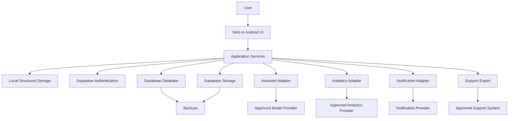
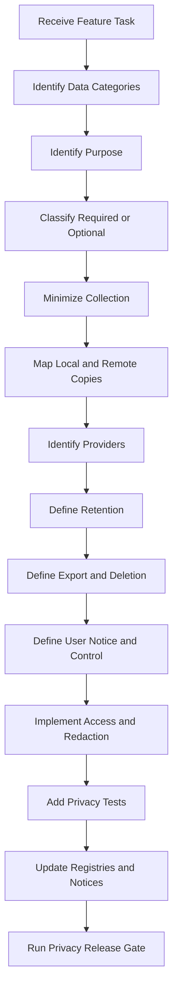

# Nexio Privacy and Data Governance Specification

Version: 1.0  
Status: Official  
Authority Level: Privacy, Data Use and User Rights Standard  
Applies To: Web, Android, Supabase, Local Storage, Synchronization, Assistant, Analytics, Notifications, Imports, Exports, Attachments, Support and Operational Systems

---

# Purpose

This document defines the official privacy and data-governance architecture of Nexio.

It establishes:

- Privacy principles
- Data inventory
- Data ownership
- Data classification
- Processing purposes
- Collection rules
- Data minimization
- User transparency
- Consent architecture
- User preferences
- User rights
- Identity verification
- Access requests
- Correction
- Portability
- Deletion
- Retention
- Restriction and objection handling where applicable
- Analytics and telemetry boundaries
- Assistant data use
- Third-party provider governance
- International processing review
- Support-data handling
- Data-flow documentation
- Privacy testing
- Release governance
- Incident response
- AI implementation restrictions

Nexio handles information that may reveal detailed financial behavior.

Privacy must therefore be designed as a core product property rather than added only through a policy page.

---

# Relationship with Other Documents

This document must be interpreted together with:

```text
docs/00-FOUNDATION.md
docs/01-ARCHITECTURE.md
docs/02-DESIGN-SYSTEM.md
docs/03-DESKTOP.md
docs/04-TABLET.md
docs/05-MOBILE.md
docs/06-DATA-MODEL.md
docs/07-SECURITY.md
docs/08-OFFLINE-AND-SYNC.md
docs/09-TESTING.md
docs/10-DEPLOYMENT-AND-OPERATIONS.md
docs/11-INTERNATIONALIZATION-AND-CONTENT.md
docs/12-ASSISTANT-AND-AI.md
```

Responsibilities are divided as follows:

| Document | Responsibility |
|---|---|
| `00-FOUNDATION.md` | Product purpose and user trust principles |
| `01-ARCHITECTURE.md` | Technical ownership and module boundaries |
| `02-DESIGN-SYSTEM.md` | Privacy-state visual behavior |
| `03-DESKTOP.md` | Desktop privacy surfaces |
| `04-TABLET.md` | Tablet privacy surfaces |
| `05-MOBILE.md` | Android privacy, notifications and app-switcher behavior |
| `06-DATA-MODEL.md` | Canonical data structures |
| `07-SECURITY.md` | Protection against unauthorized access |
| `08-OFFLINE-AND-SYNC.md` | Local replicas and distributed data lifecycle |
| `09-TESTING.md` | Privacy verification |
| `10-DEPLOYMENT-AND-OPERATIONS.md` | Production access and operational retention |
| `11-INTERNATIONALIZATION-AND-CONTENT.md` | Privacy wording and transparency |
| `12-ASSISTANT-AND-AI.md` | AI context, retention and provider boundaries |
| `13-PRIVACY-AND-DATA-GOVERNANCE.md` | Data purposes, rights, retention and governance |

Security asks:

```text
Who may access the data?
```

Privacy asks:

```text
Why does Nexio use the data, how much is necessary, how long is it retained and what control does the user have?
```

Both are required.

---

# Current Project Privacy Anchors

The current repository contains privacy-related implementation points such as:

```text
politica-de-privacidade.html
excluir-conta.html
supabase-config.js
supabase-schema.sql
i18n.js
app.js
mobile-capacitor.js
android/
android-web/
js/core/
js/ui/
```

Recommended responsibility:

| Location | Responsibility |
|---|---|
| `politica-de-privacidade.html` | Published privacy notice |
| `excluir-conta.html` | Public account-deletion guidance |
| `supabase-schema.sql` | Data model and ownership reference |
| `supabase/migrations/` | Authoritative data lifecycle changes |
| `js/core/` | Privacy-aware Domain and application services |
| `js/ui/` | Privacy controls and user rights workflows |
| `mobile-capacitor.js` | Native privacy boundaries |
| Android Manifest and resources | Native permissions and declarations |
| `docs/13-PRIVACY-AND-DATA-GOVERNANCE.md` | Internal authoritative privacy architecture |

The public privacy notice must accurately reflect the implemented architecture.

This internal specification must not claim that a feature exists merely because it is described in public text.

---

# Privacy Constitutional Principles

## Financial Data Belongs to the User

Nexio processes financial information on behalf of the authenticated user.

Product design must prioritize:

- User control
- User understanding
- Accurate access
- Safe portability
- Safe deletion
- Purpose limitation
- Minimal exposure

The application must not treat personal financial data as unrestricted product property.

---

## Collect Only What Is Necessary

Nexio must not collect information merely because it may become useful later.

Every field, event and external transmission must have:

```text
Purpose

Owner

Necessity

Retention

Access policy

Deletion behavior
```

---

## Purpose Must Be Defined Before Collection

A new collection must not begin before the project defines:

- Why the data is needed
- Which user outcome it supports
- Whether a less intrusive alternative exists
- Whether the data leaves the device
- Which provider receives it
- How long it remains
- How the user can control it

---

## Privacy Defaults Must Protect the User

Default settings should minimize exposure.

Examples:

```text
Protected notification previews

No public attachment URLs

No indefinite Assistant history by default

No optional Analytics before required configuration

No exact amount in browser titles

No production data in lower environments
```

---

## Local Data Is Still Personal Data

Information stored only in:

- IndexedDB
- Local Storage
- Secure native storage
- Cache Storage
- Android application files
- Local drafts

still requires privacy controls.

Local-only storage does not remove the need for:

- Owner isolation
- Deletion
- Account switching
- Device privacy
- Retention
- User transparency

---

## Derived Data Requires Governance

Derived information may include:

- Period totals
- Spending patterns
- Recurring-payment candidates
- Goal progress
- Assistant summaries
- Risk or anomaly signals
- Product-segmentation attributes

Derived data must not escape governance merely because it was calculated from existing records.

---

## Inferences Must Be Limited

Nexio must not infer sensitive personal attributes casually from Transaction history.

Examples of prohibited uncontrolled inference:

```text
Health condition

Religion

Political affiliation

Sexual orientation

Criminal status

Family status

Employment status
```

Financial records can indirectly reveal sensitive information.

---

## User Control Must Be Real

A control is not meaningful when:

- The setting does not affect actual collection.
- Deletion removes only the visible interface.
- Privacy mode hides values only visually.
- Consent withdrawal does not stop optional processing.
- Export omits important supported data without explanation.

---

## Privacy Claims Must Match Implementation

Nexio must not state:

```text
We never retain this data.

Your data is fully deleted immediately.

No third party receives information.

The Assistant stores nothing.
```

unless those statements are technically and operationally true.

---

## Authorization Does Not Automatically Establish Purpose

A user may authorize access to data without authorizing every possible use.

Example:

```text
Permission to read Transactions for a report
```

does not automatically authorize:

```text
Sending raw Transactions to an external AI provider.
```

---

## Deletion Must Address Distributed Copies

Deletion planning must consider:

- Primary database
- Local replica
- Pending queue
- Conflicts
- Attachments
- Imports
- Exports
- Assistant history
- Notifications
- Backups
- Logs
- Support systems
- Third-party processors

---

## Privacy Must Survive Failure

During incidents, outages and debugging, Nexio must not expose more data than during normal operation.

Emergency access, logs and support exports require equal or stronger controls.

---

# Privacy Goals

Nexio privacy architecture must ensure:

```text
Users understand what is collected.

Users understand why it is used.

Users can access supported information.

Users can correct supported Profile information.

Users can export supported financial records.

Users can delete their account through a protected process.

Optional collection follows explicit policy.

Data is retained only as long as required.

Third-party processing is documented.

Production access is restricted and auditable.

Privacy failures are detectable and recoverable.
```

---

# Scope

This specification applies to data processed through:

```text
Nexio Web application

Nexio Android application

Supabase database

Supabase Authentication

Supabase Storage

Service Worker

Local structured storage

Assistant and model providers

Analytics providers

Crash-reporting providers

Notification providers

Email providers

Support systems

CI/CD and operational tooling

Backups

Exports

Imports

Attachments
```

---

# Privacy Terminology

## Personal Data

Information relating to an identifiable user or account.

## Financial Data

Information describing Accounts, Transactions, balances, Goals, Categories, imports, reports or related behavior.

## Sensitive Financial Data

Financial information whose exposure may create significant privacy, safety or fraud risk.

## Processing

Any operation performed on data, including:

- Collection
- Storage
- Reading
- Calculation
- Synchronization
- Transmission
- Export
- Deletion

## Purpose

The defined user or operational outcome for which data is processed.

## Data Subject

The person whose personal information is processed.

## Processor or Service Provider

An external service that processes data according to an approved contract or configuration.

## Controller or Product Owner

The entity responsible for deciding why and how Nexio processes personal data.

The exact legal classification must be confirmed for the applicable organization and jurisdiction.

## Consent

A user choice authorizing an optional processing purpose where consent is the approved basis.

## Retention

The period during which data remains stored or recoverable.

## Portability

Providing user data in an understandable and usable export format.

## Derived Data

Information calculated or inferred from primary user records.

## Anonymized Data

Information transformed so that the user cannot reasonably be identified under the approved method and context.

Removing a name alone does not necessarily anonymize financial behavior.

## Pseudonymized Data

Information where direct identifiers are replaced but reidentification remains possible through additional information.

Pseudonymized data remains protected.

---

# Privacy Responsibility Model

Recommended roles:

```text
Privacy Owner

Data Owner

Security Owner

Product Owner

Engineering Owner

Assistant or AI Owner

Support Owner

Operations Owner

Legal or Compliance Reviewer

Release Owner
```

---

# Privacy Owner

Responsible for:

- Privacy architecture
- Data inventory
- Purpose registry
- Retention registry
- User-rights workflows
- Provider review
- Privacy notices
- Privacy incidents
- Release approval for high-impact data changes

---

# Data Owner

Responsible for:

- Entity meaning
- Field necessity
- Data quality
- Retention
- Deletion behavior
- Export behavior
- Derived calculations

---

# Engineering Owner

Responsible for implementing:

- Collection boundaries
- Owner isolation
- Preferences
- Export
- Deletion
- Retention jobs
- Redaction
- Provider adapters
- Privacy tests

---

# Support Owner

Responsible for ensuring support workflows:

- Request only necessary information
- Protect user evidence
- Escalate privacy concerns
- Avoid unauthorized data repairs
- Follow retention rules

---

# Legal or Compliance Reviewer

Responsible for confirming applicable:

- Privacy notices
- User-rights obligations
- Consent wording
- Data-transfer requirements
- Retention requirements
- Contractual safeguards
- Jurisdiction-specific requirements

This specification defines product architecture and does not replace authorized legal review.

---

# Data Inventory Architecture

Nexio must maintain a structured inventory of personal and financial data.

Each inventory entry should define:

```text
Data category

Specific fields

Source

Purpose

Required or optional

Canonical storage

Local storage

External recipients

Retention

Deletion behavior

Export behavior

Access roles

Security classification

Applicable feature
```

---

# Data Inventory Record

Conceptual:

```yaml
data_category: transaction
fields:
  - transaction_id
  - type
  - amount_minor
  - currency
  - account_id
  - category_id
  - transaction_date
  - description
  - notes
source: user_input
purpose:
  - financial_recordkeeping
required: true
canonical_storage: supabase.transactions
local_storage: indexeddb.transactions
external_recipients: []
retention: account_lifecycle
deletion: tombstone_then_policy_cleanup
export: included
classification: restricted
owner: data_owner
```

---

# Data Inventory Update Triggers

Update the inventory when:

- A field is added.
- A new entity is added.
- A provider receives new data.
- Retention changes.
- A new Analytics event is created.
- Assistant context changes.
- A new permission is requested.
- Export scope changes.
- Account deletion changes.
- A new derived insight is created.

---

# Core Data Categories

Recommended categories:

```text
Account and Authentication Data

Profile and Preference Data

Financial Account Data

Transaction Data

Category Data

Goal Data

Recurring Rule Data

Import Data

Attachment Data

Export Data

Synchronization Data

Notification Data

Assistant Data

Analytics Data

Operational Log Data

Support Data

Security Event Data

Backup Data
```

---

# Account and Authentication Data

Potential fields:

```text
User ID

Email address

Authentication provider

Session metadata

Password hash managed by authentication provider

MFA state

Session list

Password-reset state

Account creation timestamp

Account deletion state
```

Nexio client code must not receive password hashes or private authentication secrets.

---

# Authentication Purpose

Approved purposes may include:

- Account creation
- Sign-in
- Session restoration
- Session revocation
- Password recovery
- Protected actions
- Account deletion

Authentication data must not be reused for unrelated profiling.

---

# Profile and Preference Data

Potential fields:

```text
Display name

Locale

Time zone

Default Currency

Default Account

Theme

Privacy mode

Notification preview level

Auto-lock preference

Accessibility preference

Assistant preference
```

---

# Preference Purpose

Preferences support:

- User experience
- Formatting
- Privacy
- Accessibility
- Notification behavior
- Cross-device consistency

A preference should not become a behavioral profile without a separate approved purpose.

---

# Financial Account Data

Potential fields:

```text
Account name

Account type

Currency

Opening balance

Opening date

Current derived balance

Credit limit

Archive status

Net-worth inclusion
```

Financial Account data is Restricted by default.

---

# Transaction Data

Potential fields:

```text
Type

Amount

Currency

Account

Category

Date

Description

Notes

Status

Version

Deletion state

Synchronization state
```

Descriptions and notes may reveal highly sensitive personal behavior.

They require strong minimization in:

- Logs
- Analytics
- Assistant context
- Support evidence
- Notifications

---

# Category Data

Potential fields:

```text
Category name

Compatibility

Hierarchy

Archive state

User-created or system-created source
```

User-created Category names may reveal sensitive personal information.

---

# Goal Data

Potential fields:

```text
Goal name

Target amount

Currency

Target date

Progress

Contribution history

Funding method

Linked Account
```

Goal names may reveal health, family, education, housing or other private plans.

---

# Recurring Rule Data

Potential fields:

```text
Frequency

Amount

Currency

Account

Category

Description

Start date

End date

Generated occurrence history
```

Recurring patterns may reveal subscriptions, employment or personal routines.

---

# Import Data

Potential fields:

```text
Original filename

File type

Raw rows

Normalized rows

Mapping

Validation results

Duplicate candidates

Import Batch status
```

Raw imported statements should receive stricter retention than canonical Transactions when possible.

---

# Attachment Data

Potential fields:

```text
Filename

MIME type

Size

Storage path

Parent entity

Upload status

Created timestamp

File contents
```

Attachment contents may include:

- Receipts
- Personal addresses
- Tax identifiers
- Merchant details
- Health-related purchases
- Payment data

Attachments are Restricted.

---

# Export Data

Potential fields:

```text
Export type

Requested scope

File format

Temporary file path

Creation timestamp

Expiration timestamp

Download status
```

Generated export files should be treated as Restricted temporary data.

---

# Synchronization Data

Potential fields:

```text
Operation ID

Entity reference

Action type

Payload version

Status

Attempt count

Conflict reference

Checkpoint

Last synchronization timestamp

Error category
```

Raw operation payloads may contain financial data and must not appear in ordinary telemetry.

---

# Notification Data

Potential fields:

```text
Notification type

Target entity

Read state

Delivery state

Device registration

Privacy level

Scheduled time
```

Notification content should be minimized and governed by preview preference.

---

# Assistant Data

Potential fields:

```text
User message

Generated response

Context summary

Tool results

Proposal

Model version

Prompt version

Feedback

Safety event
```

Assistant retention and provider transmission require explicit inventory entries.

---

# Analytics Data

Potential fields:

```text
Application version

Platform

Feature use

Screen transition

Error category

Performance duration

Feature-flag cohort

Locale

Device class
```

Analytics should not include raw financial content.

---

# Operational Log Data

Potential fields:

```text
Release ID

Error category

Correlation ID

Operation category

Duration

Platform

Application version

Environment
```

Logs must not contain full entity payloads by default.

---

# Support Data

Potential fields:

```text
Support case ID

Contact information

Application version

Platform

Safe error reference

User-provided screenshot

User-provided explanation

Diagnostic package
```

Support attachments may contain Restricted financial content.

---

# Security Event Data

Potential fields:

```text
Sign-in event

Session revocation

Suspicious authorization failure

Credential rotation event

Administrative access

Account-deletion request

Privacy incident reference
```

Security events require access control and retention review.

---

# Backup Data

Backups may contain complete copies of:

- Profiles
- Transactions
- Attachments
- Assistant data
- Security events
- Deleted-but-not-yet-purged records

Backup access must be more restricted than ordinary application access.

---

# Data Source Classification

Data may originate from:

```text
Direct user input

Device or browser

Authentication provider

Application calculation

Import file

Attachment extraction

Assistant interaction

Operational system

Support interaction

Third-party integration
```

---

# Direct User Input

Examples:

- Account name
- Transaction description
- Goal name
- Import mapping
- Support message

The application should explain why required fields are needed when purpose is not obvious.

---

# Device and Browser Data

Potential:

```text
Platform

Application version

Device class

Locale

Time zone

Notification capability

Network state

Crash metadata
```

Do not collect precise device information without a defined purpose.

---

# Derived Data

Examples:

```text
Current Account balance

Monthly Expense total

Net Result

Goal progress

Recurring-payment candidate

Synchronization health state
```

Derived data requires the same owner isolation as source data.

---

# Inferred Data

Examples:

```text
Possible subscription

Unusual amount

Likely Category

Assistant intent
```

Inferences must carry confidence and must not be treated as confirmed facts automatically.

---

# Data Classification

Privacy classification should align with Security classification.

Recommended classes:

```text
Public

Internal

Private

Sensitive

Restricted
```

---

# Public

Information intentionally available publicly.

Examples:

- Public privacy notice
- Public account-deletion instructions
- Store listing
- Public support documentation

---

# Internal

Non-user-specific operational information.

Examples:

- Feature configuration
- Non-sensitive test results
- Architecture documentation

---

# Private

User-related but lower-impact data.

Examples:

- Locale
- Theme
- General product preference

---

# Sensitive

Information whose exposure may cause meaningful privacy impact.

Examples:

- Email
- Device registrations
- Support case content
- Assistant conversation

---

# Restricted

Highest-protection Nexio data.

Examples:

- Exact financial Transactions
- Account balances
- Attachments
- Full exports
- Raw imports
- Authentication secrets
- Complete backups
- Service-role credentials

---

# Data Classification Matrix

| Data | Default Classification |
|---|---|
| Public privacy notice | Public |
| Application version | Internal |
| Locale preference | Private |
| Email address | Sensitive |
| Notification token | Sensitive |
| Assistant conversation | Sensitive or Restricted by content |
| Transaction amount | Restricted |
| Transaction description | Restricted |
| Account balance | Restricted |
| Import file | Restricted |
| Attachment | Restricted |
| Export file | Restricted |
| Operational correlation ID | Internal |
| Session token | Restricted |
| Backup | Restricted |

---

# Classification Inheritance

A container inherits the strongest classification of its contents.

Example:

```text
Support ticket with a financial screenshot
```

must be treated as Restricted.

---

# Data Flow Architecture



Every arrow requires a purpose, scope and retention record.

---

# Data Flow Record

Recommended fields:

```text
Source system

Destination system

Data categories

Purpose

Trigger

Authentication

Encryption

Retention

Deletion

Provider

Environment

Owner
```

---

# Purpose Registry

Every processing purpose must have a stable identifier.

Examples:

```text
account_authentication

financial_recordkeeping

financial_reporting

offline_synchronization

goal_tracking

transaction_import

data_export

attachment_storage

security_monitoring

operational_reliability

assistant_explanation

assistant_draft_preparation

optional_product_analytics

customer_support
```

---

# Purpose Record

Conceptual:

```yaml
purpose_id: financial_reporting
description: Calculate and display reports from the user's own financial records.
data_categories:
  - transaction
  - account
  - category
required_for_service: true
external_providers: []
retention_dependency: source_entity_lifecycle
user_control:
  - report_filters
  - account_archive
  - account_deletion
owner: product_data_owner
```

---

# Required Service Purposes

Some processing is required to provide core Nexio functionality.

Examples:

- Authentication
- Saving Transactions
- Calculating balances
- Synchronizing devices
- Applying ownership rules
- Detecting failed operations
- Fulfilling export and deletion requests

Required processing must still be minimized and transparent.

---

# Optional Purposes

Potential optional purposes:

- Product Analytics
- Personalized suggestions
- Assistant external processing
- Marketing communication
- Non-essential notifications
- Beta experimentation

Optional processing requires a defined control strategy.

---

# Purpose Limitation

Data collected for one purpose must not be reused silently for an unrelated purpose.

Example:

```text
Transaction descriptions collected for user recordkeeping
```

must not automatically become:

```text
Advertising profile input.
```

---

# Compatible Secondary Use Review

Before adding a secondary use, evaluate:

- User expectation
- Data sensitivity
- Original purpose
- New purpose
- Necessity
- Provider impact
- Retention impact
- User control
- Legal review
- Security risk

---

# Purpose Change

A material purpose change may require:

- New privacy notice
- Updated consent
- User communication
- Data migration
- Provider review
- Opt-out or disable path
- Deletion of data not valid for the new purpose

---

# Data Minimization Architecture

Data minimization applies to:

```text
Collection

Storage

Queries

Model context

Analytics

Logs

Support

Exports

Notifications

Backups

Administrative access
```

---

# Field Minimization

Before adding a field, ask:

```text
Is it required?

Can it be derived?

Can it remain local?

Can it be stored temporarily?

Can a less sensitive value work?

Can it be optional?

Can it be deleted earlier?
```

---

# Query Minimization

Repositories should select only required fields.

Avoid:

```text
Select complete Transaction records
```

when the feature requires only:

```text
Date and amount aggregate
```

---

# Assistant Minimization

For an Expense summary, use:

- Calculated total
- Period
- Currency
- Coverage

Avoid sending:

- Every Transaction note
- Every Account name
- Attachments
- Authentication metadata

---

# Analytics Minimization

Prefer:

```text
transaction_create_completed
```

with safe operational dimensions.

Avoid:

```text
transaction_description
transaction_amount
account_name
```

---

# Notification Minimization

A Notification should contain the least information required for the selected preview level.

---

# Support Minimization

Support should request:

- Safe reference
- Application version
- Platform
- Feature
- User explanation

before requesting screenshots or exports.

---

# Collection Architecture

Every collection point must have:

- UI or system trigger
- Purpose
- Required or optional status
- Validation
- Privacy classification
- Storage destination
- User control
- Failure behavior

---

# Direct Collection Notice

A field generally does not require a separate notice when its purpose is obvious from the workflow.

Example:

```text
Amount
```

inside:

```text
Create Expense
```

A separate explanation is appropriate when collection is less obvious.

---

# Contextual Notice

Examples:

```text
Nexio uses your time zone to display times and schedule reminders.

The selected file will be read to prepare an Import review.

Assistant requests may use selected Nexio data to answer this question.
```

---

# Just-in-Time Notice

Use before:

- Camera access
- File access
- Notification permission
- Complete data export
- Assistant external processing
- Optional Analytics
- Support diagnostic sharing

---

# Notice Requirements

A notice should explain:

```text
What data

Why

Where it goes

Whether it is optional

How to change the choice
```

The depth depends on risk and surface.

---

# Consent Architecture

Consent should be used only for purposes where it is the approved control.

Consent must not be used to disguise processing that is actually required for the requested core service.

---

# Consent Requirements

A consent record should define:

```text
Purpose

Scope

Notice version

User action

Timestamp

Locale

Application version

Withdrawal method

Resulting behavior
```

---

# Consent Record

Conceptual:

```javascript
{
  consentId: "uuid",
  ownerId: "trusted-owner",
  purposeId: "optional_product_analytics",
  status: "granted",
  noticeVersion: "analytics-notice-v2",
  locale: "pt-BR",
  grantedAt: "timestamp",
  withdrawnAt: null
}
```

---

# Consent States

Recommended:

```text
not_requested

granted

denied

withdrawn

expired

requires_review
```

---

# Explicit Consent

Consent must require an affirmative action.

Avoid:

- Preselected checkbox
- Consent hidden inside unrelated Terms acceptance
- Treating application use as consent for optional processing
- Ambiguous button labels

---

# Granular Consent

Separate materially different purposes.

Example:

```text
Product Analytics

Marketing email

Assistant external processing
```

One permission should not authorize unrelated optional uses.

---

# Consent Withdrawal

Withdrawal should be:

- Easy to find
- As clear as granting
- Effective for future optional processing
- Reflected across devices where applicable
- Auditable
- Explained accurately

Withdrawal does not necessarily delete historical data that must be retained for another valid purpose.

The resulting behavior must be documented.

---

# Consent Synchronization

Authenticated consent preferences should synchronize.

Local unauthenticated preferences must remain isolated from other users.

---

# Consent Offline Behavior

When consent state cannot be confirmed remotely:

- Use the last valid local state only when policy allows.
- Do not enable optional processing by default.
- Queue preference changes safely.
- Avoid external transmission until state is valid.

---

# Consent Version Change

When a material notice changes:

- Mark affected consent as requiring review where necessary.
- Explain the change.
- Preserve disabled state until review for optional processing.
- Store the accepted notice version.

---

# Privacy Preferences

Potential settings:

```text
Privacy mode

Notification preview level

Optional Analytics

Assistant data processing

Conversation history

Personalized insights

Marketing communication
```

Not every setting is consent.

The product architecture must distinguish:

- Privacy display preference
- Processing preference
- Communication preference
- Legal consent record

---

# Privacy Preference Registry

Each preference should define:

```text
Preference ID

Purpose

Default

Owner scope

Local or synchronized

Effect

Dependencies

Retention

UI location
```

---

# Privacy Mode

Privacy mode controls presentation.

It does not automatically:

- Stop synchronization
- Stop database storage
- Delete data
- Disable reports
- Withdraw Analytics consent

Its scope must be explained clearly.

---

# Data-Processing Preference

A processing preference may control whether optional data leaves the device.

Example:

```text
Share optional product-usage Analytics
```

This is distinct from hiding values visually.

---

# Personalization Preference

Potentially controls:

- Suggested prompts
- Personalized insights
- Recurring-payment candidates
- Assistant context history

Personalization must have a defined data scope.

---

# User Transparency Architecture

Transparency exists through:

```text
Privacy notice

Contextual notices

Settings

Data-scope panels

Permission explanations

Export scope

Deletion review

Provider disclosures where required

Support documentation
```

---

# Privacy Notice

The public privacy notice should explain:

- Data categories
- Purposes
- Required and optional processing
- Local and remote storage
- Providers
- Retention
- User controls
- User-rights process
- Security principles
- Contact and updates

It must match current implementation.

---

# Privacy Notice Version

Every published version should include:

```text
Version

Effective date

Language

Source revision

Change summary where appropriate
```

---

# Privacy Notice Archive

Previous versions should remain available when required by policy or operational need.

---

# Material Privacy Change

Potential examples:

- New external AI provider
- New Analytics collection
- New advertising purpose
- New attachment processing
- New retention period
- New data-sharing category
- New biometric integration
- New external financial integration

Material changes require enhanced review and communication.

---

# User Rights Architecture

Nexio should provide workflows for applicable user rights and product commitments.

Potential rights include:

```text
Access

Correction

Portability

Deletion

Consent withdrawal

Restriction

Objection

Information about processing

Review of certain automated outcomes where applicable
```

The exact legally required rights and response periods must be confirmed for the operating jurisdiction.

---

# Rights Request Registry

Each supported request should define:

```text
Request type

Entry point

Authentication requirement

Identity-verification level

Data scope

Processing steps

Completion state

Rejection reasons

Audit record

Communication
```

---

# Rights Request States

Recommended:

```text
draft

identity_required

submitted

in_review

additional_information_required

processing

completed

partially_completed

rejected

cancelled
```

---

# Self-Service Rights

Where safe and supported, users should be able to:

- View Profile information
- Edit preferences
- Export financial records
- Clear Assistant conversation
- Delete attachments
- Delete account through protected workflow
- Withdraw optional consent

---

# Assisted Rights Request

Some requests may require support or privacy review.

Examples:

- Complex access request
- Correction of immutable audit information
- Backup-related deletion explanation
- Provider-side data inquiry
- Identity dispute

---

# Identity Verification

Rights requests must protect against unauthorized disclosure or deletion.

Verification strength should match risk.

---

# Verification Levels

Recommended:

```text
Authenticated session

Recent authentication

Additional account verification

Manual privacy review
```

---

# Ordinary Access Request

Viewing account data inside an authenticated session may use ordinary session validation.

---

# Complete Export Request

May require recent authentication.

It exposes a large amount of Restricted financial information.

---

# Account Deletion Request

Requires:

- Active authenticated owner
- Recent authentication
- Pending-work review
- Explicit consequence
- Final confirmation

---

# Manual Request Verification

Support must not rely only on:

- Email sender address
- Screenshot
- Claimed name
- Public information

A controlled verification procedure is required.

---

# Excessive Data Collection for Verification

Identity verification must remain proportionate.

Do not request an identity document automatically when existing authenticated verification is sufficient.

---

# Access Right Architecture

An access workflow may provide:

- Profile information
- Accounts
- Transactions
- Categories
- Goals
- Recurring Rules
- Attachments metadata
- Consent records
- Assistant history according to policy
- Relevant processing information

Security secrets and internal anti-abuse information may require exclusion or special treatment.

---

# Access Request Output

The output should be:

- Understandable
- Structured
- Authorized
- Securely delivered
- Time-limited where downloaded
- Documented by scope

---

# Correction Right Architecture

Users should be able to correct supported Profile and financial information through ordinary editing workflows.

Some technical records should not be altered directly.

Examples:

- Audit timestamps
- Operation IDs
- Security events
- Idempotency records

Incorrect technical records require approved repair.

---

# Financial Record Correction

A Transaction correction should use:

- Update
- Reversal
- Refund
- Cancellation

according to Domain policy.

Privacy correction must not corrupt financial history.

---

# Portability Architecture

Portability should use stable documented formats.

Potential formats:

```text
CSV

JSON

PDF for human-readable summary
```

Machine-readable formats should preserve:

- IDs where appropriate
- Dates
- Money
- Currency
- Relationships
- Status
- Version context when useful

---

# Portability Scope

The export must define:

- Included entities
- Excluded internal records
- Date range
- Currency representation
- Attachment handling
- Assistant history handling
- Deleted or archived records
- Technical metadata

---

# Portable Money Representation

Preferred machine-readable representation:

```javascript
{
  "amount_minor": 18540,
  "currency": "BRL"
}
```

Avoid using only:

```text
R$ 185,40
```

in machine-readable exports.

---

# Portable Date Representation

Use canonical:

```text
YYYY-MM-DD
```

for date-only values.

Use ISO timestamps for instants.

---

# Portability Security

Complete exports require:

- Recent authentication
- Owner scope
- Safe file generation
- Formula protection
- Temporary storage
- Expiration
- Download protection
- Cleanup
- Privacy warning

---

# Deletion Architecture

Deletion must distinguish:

```text
Entity deletion

Attachment deletion

Conversation deletion

Import-file deletion

Account deletion

Retention expiration

Backup expiration
```

---

# Entity Deletion

Financial entities follow the lifecycle defined by the Data Model and synchronization architecture.

Deletion may use:

- Soft delete
- Tombstone
- Deferred purge
- Archive
- Reversal

The UI must explain the actual effect.

---

# Conversation Deletion

Deleting Assistant conversation history must not delete:

- Transactions
- Accounts
- Goals
- Executed commands
- Required audit references

---

# Attachment Deletion

Deleting an Attachment should address:

- Metadata
- Object storage
- Local cached copy
- Pending upload
- Thumbnail
- Signed URL
- Backup retention

---

# Account Deletion

Account deletion is a coordinated privacy and security workflow.

It must address:

```text
Authentication

Pending local operations

Remote data

Local replicas

Attachments

Imports

Exports

Assistant history

Notifications

Provider registrations

Consent records

Backups

Logs

Support cases

Legal or operational retention
```

---

# Data Lifecycle

Recommended lifecycle stages:

```text
Collected

Validated

Active

Derived

Archived

Deleted

Tombstoned

Pending purge

Purged

Retained in protected backup

Backup expired
```

---

# Collection State

Data enters through an approved purpose and collection path.

---

# Active State

Data supports the current feature.

---

# Archived State

Data remains available for history but is removed from ordinary active selection.

---

# Deleted State

Data is no longer active and is scheduled according to deletion policy.

---

# Tombstoned State

A minimal deletion marker remains for synchronization and conflict safety.

---

# Pending Purge

Data has passed ordinary deletion but waits for:

- Retention requirement
- Backup expiration
- Provider cleanup
- Synchronization safety window
- Operational verification

---

# Purged State

Data is removed from active production storage according to policy.

---

# Backup Retention State

The record may remain in protected backup until backup expiration.

It must not return to ordinary production use without a controlled recovery process.

---

# Data Access Governance

Access must follow:

- Least privilege
- Role-based control
- Owner scope
- Purpose
- Environment
- Audit
- Time limitation where appropriate

---

# Access Categories

Recommended:

```text
User self-access

Application service access

Operational read access

Support access

Administrative repair access

Backup access

Provider processing access
```

---

# User Self-Access

The user accesses only their own authorized records through ordinary application interfaces.

---

# Application Service Access

Services use only the fields and operations required for the current purpose.

---

# Operational Read Access

Operational staff should prefer:

- Aggregated metrics
- Redacted logs
- Safe identifiers
- Release metadata

They should not access raw Transactions by default.

---

# Support Access

Support access must be:

- User-initiated or case-based
- Minimized
- Audited
- Time-limited where possible
- Restricted to the case purpose

---

# Administrative Repair Access

Requires:

- Approved repair plan
- Exact owner scope
- Audit
- Validation
- Independent review for high-risk repair
- Post-repair verification

---

# Backup Access

Backup access is exceptional and highly restricted.

It may expose all users simultaneously.

---

# Third-Party Provider Architecture

Every provider receiving personal data requires an inventory record.

Potential providers:

```text
Supabase

Web hosting

Model provider

Analytics provider

Crash-reporting provider

Notification provider

Email provider

Support platform

Build and release platform
```

---

# Provider Record

Recommended:

```text
Provider name

Service

Data categories

Purpose

Environment

Retention

Training or secondary-use status

Processing location

Subprocessors

Security review

Contract review

Deletion process

Incident process

Owner

Review date
```

---

# Provider Admission

Before adding a provider:

1. Define necessity.
2. Identify data categories.
3. Minimize transmitted fields.
4. Review retention.
5. Review secondary use.
6. Review security.
7. Review data location.
8. Review deletion.
9. Review incident notification.
10. Update privacy notice when required.
11. Add provider abstraction.
12. Add kill switch where applicable.

---

# Provider Configuration

Privacy behavior may depend on configuration.

Examples:

- Log retention
- Model training setting
- Analytics IP handling
- Crash attachment collection
- Session replay
- Storage region
- Support-record retention

Provider name alone does not define privacy behavior.

---

# Provider Change

Changing provider or configuration is a privacy-impacting production change.

It requires:

- Inventory update
- Purpose review
- Data-flow update
- Notice review
- Security review
- Retention review
- Testing
- Staged rollout

---

# Provider Removal

Provider removal must address:

- Data export
- Data deletion
- Credential revocation
- Integration disablement
- Historical records
- Contract closure
- Monitoring
- Notice update

---

# International Processing Review

When data is processed in another region or jurisdiction, the project must document:

- Provider
- Data categories
- Processing location
- Purpose
- Contractual safeguards
- User notice
- Applicable review
- Alternatives
- Retention

The required legal mechanism must be confirmed by authorized review.

---

# Non-Production Data

Production personal data must not be copied into:

- Development
- Preview
- Test
- Demo
- Performance environments

unless a formally approved process exists.

---

# Synthetic Data

Lower environments should use synthetic data designed to represent:

- Financial variety
- Multiple currencies
- Large values
- Edge cases
- Sensitive-looking but fictional content

---

# Anonymized Data

When anonymized production-derived data is considered:

- Reidentification risk must be assessed.
- Free-text fields require special treatment.
- Rare Transaction patterns may remain identifiable.
- Exact dates and amounts may reveal users.
- The method must be documented.

---

# Pseudonymized Data

Pseudonymized production data remains protected and should not be treated as ordinary test data.

---

# Privacy by Environment

| Environment | Personal Data Policy |
|---|---|
| Local | Synthetic only |
| Development | Synthetic only |
| Preview | Synthetic only |
| Staging | Synthetic or approved anonymized data |
| Production | Real user data |
| Recovery environment | Restricted controlled production copy when required |

---

# Cookies and Client Storage Architecture

Nexio may use:

```text
Authentication cookies

Local Storage

Session Storage

IndexedDB

Cache Storage

Native secure storage

Application files
```

Each mechanism requires a purpose and lifecycle.

---

# Authentication Cookie

Where used, it should support:

- Authentication
- Session continuity
- Security

It should use approved security attributes and must not contain unnecessary financial data.

---

# Local Storage

Appropriate for limited non-sensitive preferences when architecture allows.

Avoid storing:

- Session token in an unsafe pattern
- Raw financial database
- Complete Assistant history
- Full export contents

---

# Session Storage

May hold short-lived UI state.

It must clear appropriately after tab or session end.

---

# IndexedDB

May hold:

- Owner-scoped local replica
- Queue
- Conflicts
- Drafts
- Checkpoints

It requires account switching and deletion controls.

---

# Cache Storage

Should contain:

- Approved public shell assets
- Versioned translations
- Offline fallback

It should not contain unscoped private API responses.

---

# Native Secure Storage

May hold:

- Authentication-related secrets
- Encryption material
- Protected preferences

It should not become an unstructured financial database.

---

# Client Storage Inventory

Maintain:

```text
Storage mechanism

Key or store

Data category

Owner scope

Purpose

Retention

Sign-out behavior

Account-deletion behavior

Migration version
```

---

# Privacy and Offline Storage

Offline capability increases the number of copies.

The user should understand that selected data may remain on the device for offline use.

Account switching and deletion must remove or isolate local copies according to policy.

---

# Device Loss

Privacy architecture should consider:

- Device lock
- Application auto-lock
- Privacy mode
- Secure token storage
- Session revocation
- Local data encryption strategy
- Remote sign-out

---

# Browser Shared Device

On a shared browser:

- Sign-out must clear memory.
- Owner namespace must not leak.
- Browser history must not reveal financial values.
- Downloads remain outside full application control and require warnings.
- Saved passwords remain a browser policy outside Nexio control.

---

# Privacy Anti-Patterns

The following are prohibited:

## Collect Now, Define Purpose Later

Adding fields or events without a documented purpose.

## Entire Entity in Analytics

Sending complete Transaction objects for product measurement.

## Consent Bundling

Combining unrelated optional purposes into one unavoidable choice.

## Preselected Optional Consent

Enabling optional processing through a prechecked control.

## Privacy Mode as Deletion

Presenting visual hiding as if data were deleted.

## Deletion Only in UI

Removing an entity from the screen while retaining unrestricted active copies.

## Raw Financial Logs

Logging amounts, descriptions, notes or attachments for convenience.

## Production Data in Preview

Using real financial data for interface review.

## Assistant Context by Default

Sending all Accounts and Transactions to the model for every request.

## Provider Without Inventory

Adding an external service without documenting data and retention.

## Pseudonymized Equals Anonymous

Treating replaceable identifiers as complete anonymization.

## Export Without Authentication

Allowing complete financial download from a stale or unauthenticated session.

## Support by Full Account Access

Giving support unrestricted financial access for ordinary cases.

## Backup as Permanent Exception

Keeping deleted data indefinitely because backups exist.

## Consent Withdrawal Without Effect

Changing a toggle while optional transmission continues.

## Hidden Purpose Change

Reusing financial records for a new profiling purpose without review.

## Identifier in URL

Placing sensitive personal or financial content in query parameters.

## Sensitive Derived Profiling

Inferring health, religion or politics from spending history.

---

# Part 1 Privacy Review Questions

Before collecting or using data, answer:

```text
What data is involved?

Who does it belong to?

What is the exact purpose?

Is the purpose required or optional?

Can less data achieve the same result?

Can the processing remain local?

Which system stores it?

Which provider receives it?

How long is it retained?

How is it deleted?

How is it exported?

How is it protected?

Which user control applies?

Which notice explains it?
```

---

# Data Inventory Review Questions

```text
Are all fields listed?

Are derived values listed?

Are local copies listed?

Are backups listed?

Are provider copies listed?

Are support copies listed?

Is retention explicit?

Is deletion behavior explicit?

Is export behavior explicit?

Who owns the record?
```

---

# Consent Review Questions

```text
Is consent the appropriate control?

Is the purpose optional?

Is the action affirmative?

Is the choice granular?

Is the notice clear?

Is the notice version stored?

Can the user withdraw easily?

Does withdrawal stop future processing?

What happens offline?

What happens across devices?
```

---

# User Rights Review Questions

```text
Can the user complete the request through self-service?

Which identity verification is required?

Which data is included?

Which information is excluded and why?

How is the result delivered securely?

How are local copies handled?

How are provider copies handled?

How is completion recorded?

Does the request preserve financial integrity?
```

---

# Provider Review Questions

```text
Why is the provider necessary?

Which data categories are transmitted?

Can the data be minimized?

Does the provider use data for another purpose?

What is retained?

Where is it processed?

How is it deleted?

Which subprocessors exist?

How are incidents reported?

Which kill switch exists?
```

---

# Part 1 Acceptance Criteria

The Privacy and Data Governance foundation is accepted only when:

```text
□ Financial data is treated as user-controlled Restricted data.

□ Every collection has a documented purpose.

□ Data is not collected for undefined future use.

□ Local copies are included in privacy governance.

□ Derived and inferred data are inventoried.

□ Sensitive personal attributes are not inferred casually.

□ Privacy settings have real technical effects.

□ Privacy claims match implementation.

□ Authorization and purpose remain separate concepts.

□ Deletion planning includes distributed copies.

□ Privacy roles and owners are defined.

□ A structured data inventory exists.

□ Inventory records include source, purpose, storage, retention and deletion.

□ Account, Profile, financial, Assistant, Analytics, support and backup data are inventoried.

□ Raw imports and Attachments receive Restricted classification.

□ Data-flow diagrams and records are maintained.

□ Every processing purpose has a stable identifier.

□ Required and optional purposes remain distinct.

□ Purpose changes receive formal review.

□ Field, query, Analytics, Assistant and support minimization are implemented.

□ Collection points identify purpose and user control.

□ High-impact collection uses contextual or just-in-time notice.

□ Consent records include purpose and notice version.

□ Optional consent requires affirmative action.

□ Materially different purposes use separate controls.

□ Consent withdrawal stops future optional processing according to policy.

□ Privacy display preferences remain distinct from processing consent.

□ Privacy notices are versioned and implementation-accurate.

□ User-rights workflows are documented.

□ Complete export and deletion require appropriate identity verification.

□ Financial corrections preserve Domain history.

□ Portability uses canonical Money and Date representations.

□ Account deletion addresses remote, local, provider and backup copies.

□ Data lifecycle states are explicit.

□ Operational, support, repair and backup access remain purpose-limited.

□ Every provider has a privacy inventory record.

□ Provider admission includes retention, security and deletion review.

□ International processing receives documented review.

□ Production data is excluded from lower environments by default.

□ Client storage mechanisms have a lifecycle inventory.

□ Offline storage remains owner-scoped.

□ Shared-device and device-loss risks are considered.

□ Privacy anti-patterns are prohibited.
```

---

# Privacy Foundation Constitutional Rule

Every data field, query, storage location, provider transmission, derived insight and user-rights workflow must answer:

```text
Is this data necessary for a clear user or operational purpose, limited to the minimum scope, protected throughout its lifecycle and controllable through an honest user-facing process?
```

When the answer is uncertain, prefer the architecture that:

- Collects less.
- Stores less.
- Keeps processing local.
- Uses aggregates.
- Avoids free-text transmission.
- Uses explicit optional controls.
- Provides clear notice.
- Limits retention.
- Supports export.
- Supports deletion.
- Restricts provider access.
- Protects local copies.
- Records purpose and ownership.
- Fails without expanding data use.

Privacy is not achieved by hiding data practices inside a policy.

It is achieved when the implementation itself prevents unnecessary collection, reuse and retention.

---
---

# Retention Architecture

Retention determines how long data remains:

- Active
- Archived
- Recoverable
- Searchable
- Exportable
- Present in backups
- Present in provider systems

Retention must be defined by data category and purpose.

Nexio must not use one indefinite retention rule for every type of information.

---

# Retention Principles

## Retain for Purpose, Not Convenience

Data should remain only while required for:

- User-requested functionality
- Security
- Synchronization
- Recovery
- User rights
- Legal or contractual requirements
- Approved operational needs

The possibility that information may be useful later is not a sufficient retention purpose.

---

## Active Data and Operational Evidence Differ

A Transaction may remain during the Account lifecycle.

A temporary diagnostic event related to that Transaction may require only short retention.

Operational data must not inherit the full retention of the financial record automatically.

---

## Retention Must Be Enforceable

A retention statement must map to technical behavior.

Example:

```text
Temporary exports expire after 24 hours.
```

must correspond to:

- Expiration timestamp
- Download rejection after expiration
- Storage cleanup
- Metadata cleanup
- Monitoring
- Failure handling

---

## Retention Must Cover Every Copy

A retention policy must consider:

```text
Primary database

Local replica

Synchronization queue

Conflict storage

Object Storage

Temporary export storage

Assistant context

Analytics provider

Crash provider

Support platform

Notification provider

Backups
```

---

## Retention Does Not Mean Public Availability

Data retained for security, audit or backup must not remain available through ordinary product interfaces when its active purpose has ended.

---

# Retention Registry

Every retained data category should have a registry entry.

Recommended fields:

```text
Retention ID

Data category

Purpose

Active period

Archive period

Deletion trigger

Purge delay

Backup retention

Provider retention

Legal hold behavior

Owner

Review frequency
```

---

# Retention Record Example

```yaml
retention_id: temporary_export
data_category: generated_export_file
purpose: user_requested_data_delivery
active_period: 24_hours
deletion_trigger: expiration_timestamp
purge_delay: immediate_cleanup_job
backup_retention: excluded_when_possible
provider_retention: hosting_cache_policy
legal_hold_behavior: not_applicable
owner: privacy_owner
```

---

# Retention Classes

Recommended classes:

```text
Session

Temporary

Operational short-term

Account lifecycle

Post-deletion limited

Security retention

Backup retention

Legally required retention

User-controlled
```

---

# Session Retention

Data exists only during an active session or application process.

Examples:

- Temporary UI state
- Unsaved form values in memory
- Short-lived Assistant context
- Selected filters not persisted

Session data should be removed after:

- Sign-out
- Account switch
- Application termination where applicable
- Expiration

---

# Temporary Retention

Examples:

- Generated exports
- Upload staging
- Import parsing files
- Temporary previews
- Password-reset state
- Assistant context package

Temporary data requires explicit expiration.

---

# Operational Short-Term Retention

Examples:

- Error categories
- Performance events
- Safe synchronization metrics
- Deployment logs
- Temporary support diagnostics

Retention should be long enough to investigate ordinary failures but shorter than primary financial records.

---

# Account Lifecycle Retention

Examples:

- Profile
- Accounts
- Transactions
- Categories
- Goals
- Recurring Rules

These normally remain while the user maintains the Account, subject to entity deletion and archival behavior.

---

# Post-Deletion Limited Retention

Some minimal data may remain temporarily after deletion for:

- Synchronization tombstones
- Fraud or abuse prevention where approved
- Security investigation
- Deletion completion audit
- Backup expiration

The remaining scope must be minimized.

---

# Security Retention

Security events may require a distinct period.

Examples:

- Sign-in event
- Session revocation
- Administrative access
- Deletion request
- Credential rotation
- Confirmed security incident

Security retention must not include unnecessary financial payload.

---

# User-Controlled Retention

Examples:

- Assistant conversation history
- Saved search history
- Optional drafts
- Certain local preferences

The user may have a clear removal control.

---

# Legal Hold

A legal hold may temporarily prevent deletion of narrowly defined records.

Requirements:

- Authorized instruction
- Defined scope
- Defined reason
- Restricted access
- Audit
- Periodic review
- Release procedure

A legal hold must not become a general indefinite-retention mechanism.

---

# Retention Conflict Resolution

When several retention purposes apply, document:

```text
Shortest applicable period

Longer mandatory period

Data fields required for the longer purpose

Access restriction during extended retention

Final purge condition
```

Retain only the fields necessary for the surviving purpose.

---

# Retention Review

Retention schedules should be reviewed:

- When a feature launches
- When a provider changes
- When legal requirements change
- When Account deletion changes
- When backup architecture changes
- At a defined periodic interval

---

# Retention Automation

Automated retention jobs should be:

- Idempotent
- Observable
- Owner-aware
- Safe under retry
- Able to resume
- Audited
- Tested against active data

---

# Retention Job Contract

Conceptual:

```javascript
{
  jobType: "purge_expired_exports",
  cutoff: "timestamp",
  batchSize: 500,
  dryRun: false,
  cursor: "safe-cursor",
  result: {
    evaluated: 500,
    deleted: 480,
    skipped: 20,
    failed: 0
  }
}
```

---

# Retention Dry Run

High-impact cleanup should support a dry run that reports:

- Candidate count
- Data categories
- Oldest record
- Newest record
- Exclusions
- Expected storage recovery

The dry run must not expose raw financial content.

---

# Retention Batch Processing

Large cleanup must use bounded batches.

Requirements:

- Stable cursor
- Retry
- Idempotency
- Pause
- Progress tracking
- Rate control
- Failure quarantine

---

# Retention Failure

When deletion fails:

- Do not mark the data as purged.
- Record a safe failure.
- Retry according to policy.
- Alert after threshold.
- Avoid restoring ordinary user access inadvertently.

---

# Retention Verification

Verify periodically:

```text
Expired exports are unavailable.

Expired raw imports are removed.

Deleted attachments are not downloadable.

Assistant contexts expire.

Old support uploads are removed.

Consent withdrawal stops future collection.

Backup expiration follows policy.
```

---

# Data Disposal Architecture

Disposal includes:

```text
Logical deletion

Physical deletion

Cryptographic erasure

Provider deletion

Cache invalidation

Local cleanup

Backup expiration
```

---

# Logical Deletion

Logical deletion prevents ordinary active use while preserving a minimal record.

Used for:

- Synchronization tombstone
- Conflict prevention
- Auditable lifecycle transition

---

# Physical Deletion

Physical deletion removes the active stored record or object.

It should occur after required safety and retention conditions are met.

---

# Cryptographic Erasure

Where encrypted data uses dedicated keys, destruction of the relevant key may make retained ciphertext unreadable.

This method requires:

- Documented key architecture
- Verified key isolation
- Backup behavior
- Recovery implications
- Security review

It must not be claimed unless implemented correctly.

---

# Cache Invalidation

Deletion must invalidate:

- Memory cache
- IndexedDB indexes
- Service Worker cache where relevant
- Thumbnail cache
- Assistant context cache
- Search index
- Report cache

---

# Provider Deletion

External provider deletion requires:

- Provider API or documented process
- Request tracking
- Completion evidence
- Failure handling
- Provider retention caveat
- Escalation

---

# Disposal Evidence

Operational evidence should record:

```text
Data category

Deletion request reference

Deletion stage

Systems completed

Systems pending

Timestamp

Failure category
```

It should not reproduce deleted financial content.

---

# Local Data Retention

Local data categories may include:

```text
Replica

Queue

Conflict records

Drafts

Cached translations

Preferences

Assistant history

Downloaded exports
```

---

# Local Replica Retention

The replica should remain only for:

- Active authenticated owner
- Supported offline access
- Pending synchronization
- Recovery according to policy

---

# Sign-Out Local Behavior

The sign-out policy must define whether local financial data is:

```text
Immediately removed

Retained encrypted for faster return

Retained only when user explicitly chooses

Removed after pending sync review
```

The behavior must be explained and consistently enforced.

---

# Account Switch Local Behavior

Account switching must:

- Clear in-memory state
- Change owner namespace
- Cancel active Assistant requests
- Cancel Realtime subscriptions
- Hide prior owner data
- Prevent prior queue display
- Load the new owner's namespace

---

# Account Deletion Local Behavior

After authoritative Account deletion:

- Remove local replica.
- Remove local queue.
- Remove conflicts.
- Remove local drafts.
- Remove Assistant history according to policy.
- Revoke session.
- Clear notification target data.
- Remove secure credentials.
- Clear owner-specific caches.

---

# Pending Operations Before Local Removal

The user must be informed when pending local operations have not synchronized.

Possible choices may include:

```text
Synchronize first

Export local records

Continue deletion knowing pending changes may not reach remote storage
```

The actual supported behavior must be explicit.

---

# Orphaned Local Data

Local records may become orphaned after:

- Session revocation
- Account deletion on another device
- Owner mismatch
- Corrupt migration
- Unsupported application downgrade

The application must quarantine or remove them safely.

---

# Full Data Export Architecture

A Full Data Export provides a user-authorized copy of supported Nexio data.

It must be:

- Complete according to declared scope
- Structured
- Secure
- Understandable
- Versioned
- Time-limited
- Generated from authorized data
- Protected against spreadsheet execution risks

---

# Export Types

Recommended:

```text
Filtered Transaction Export

Account Activity Export

Report Export

Assistant Conversation Export

Complete Account Export

Attachment Export
```

Each type has a different privacy risk.

---

# Complete Account Export Scope

Potentially includes:

```text
Profile

Preferences

Accounts

Transactions

Categories

Goals

Goal Contributions

Recurring Rules

Notifications

Consent records

Assistant history according to policy

Import history

Attachment metadata

Attachments when explicitly requested

Synchronization status summary
```

---

# Export Exclusions

Potential exclusions:

- Password hash
- Authentication token
- Service credentials
- Internal anti-abuse rules
- Other users' information
- Internal security secrets
- Provider confidential metadata
- Unnecessary operational logs

Exclusions must be documented where relevant.

---

# Export Request Flow

Recommended:

```text
1. User opens Data settings.

2. User selects export type.

3. Nexio explains scope and privacy risk.

4. Recent authentication is confirmed.

5. Export request receives a stable ID.

6. Data is assembled from authorized sources.

7. File is validated.

8. File is encrypted or protected where supported.

9. Time-limited delivery becomes available.

10. Expired files are purged.
```

---

# Export Request State

Recommended:

```text
draft

authentication_required

queued

generating

ready

downloaded

expired

failed

cancelled
```

---

# Export Request Record

Conceptual:

```javascript
{
  exportId: "uuid",
  ownerId: "trusted-owner",
  type: "complete_account",
  status: "generating",
  format: "json",
  requestedAt: "timestamp",
  expiresAt: "timestamp",
  scopeVersion: "complete-export-v2",
  fileReference: null
}
```

---

# Export Authentication

A complete export should require:

- Active session
- Recent authentication
- Current owner
- No cross-account state
- Rate limiting

---

# Export Generation Isolation

Export generation should:

- Query by trusted owner
- Use bounded resources
- Avoid including another owner's relationship
- Avoid logging exported content
- Write to an owner-scoped temporary location
- Validate output before delivery

---

# Export Manifest

A complete export should contain a manifest.

Example:

```json
{
  "export_version": "2",
  "generated_at": "2026-07-24T12:30:00.000Z",
  "locale": "pt-BR",
  "time_zone": "America/Sao_Paulo",
  "included_entities": [
    "profile",
    "accounts",
    "transactions",
    "categories",
    "goals"
  ],
  "currency_representation": "minor_units_with_iso_currency",
  "date_representation": "ISO_8601"
}
```

---

# Export Money

Machine-readable export:

```json
{
  "amount_minor": 18540,
  "currency": "BRL"
}
```

Human-readable fields may be added separately:

```json
{
  "formatted_amount": "R$ 185,40"
}
```

Canonical fields remain authoritative.

---

# Export Relationships

Relationships should use stable identifiers.

Example:

```json
{
  "transaction_id": "uuid",
  "account_id": "uuid",
  "category_id": "uuid"
}
```

---

# Export Deleted and Archived Records

The export policy must state whether it includes:

- Archived Accounts
- Archived Categories
- Cancelled Transactions
- Soft-deleted records
- Tombstones
- Purged records

Purged records cannot be exported.

---

# Export Attachment Handling

Options:

```text
Metadata only

Separate attachment archive

Complete package with files
```

Attachment export requires additional size, security and retention controls.

---

# Export File Formats

## JSON

Preferred for structured completeness.

## CSV

Appropriate for tabular Transactions and Accounts.

## PDF

Appropriate for human-readable summaries but not complete machine portability.

## ZIP

May package several files and Attachments.

---

# CSV Formula Injection Protection

Values beginning with spreadsheet-executable characters may be interpreted as formulas.

Potential dangerous prefixes:

```text
=

+

-

@
```

CSV export must apply an approved escaping or neutralization policy.

This is especially important for:

- Transaction descriptions
- Account names
- Category names
- Notes

---

# Export Encoding

Use a documented encoding such as:

```text
UTF-8
```

CSV delimiter and decimal conventions must be clear.

Canonical numeric fields should avoid locale ambiguity.

---

# Export Storage

Temporary export storage must be:

- Private
- Owner-scoped
- Time-limited
- Non-indexed
- Protected by authorization or short-lived signed access
- Monitored
- Purged

---

# Export Link

Export links must not contain:

- Raw token in logs
- Financial values
- User email
- File content
- Permanent public path

---

# Export Download

Before download:

- Validate owner.
- Validate expiration.
- Validate export state.
- Record safe delivery event.
- Apply correct Content Type.
- Apply download filename safely.
- Avoid caching by shared intermediaries.

---

# Export Filename

Example:

```text
nexio-export-2026-07-24.json
```

Avoid including:

- Full user name
- Email
- Account name
- Exact balance

---

# Export Expiration

After expiration:

- Link fails safely.
- Object is deleted.
- Metadata records completion or expiration.
- User may request a new export.
- Old object is not silently reactivated.

---

# Export Cancellation

A user may cancel before completion where supported.

Cancellation should:

- Stop pending generation when possible.
- Remove partial file.
- Preserve canonical financial data.
- Record safe status.

---

# Export Failure

Example:

```text
Nexio could not prepare the export.

Your financial data was not changed.
```

The user may retry with a new request ID.

---

# Export Rate Limiting

Complete exports may be rate limited to prevent:

- Abuse
- Resource exhaustion
- Repeated sensitive file generation
- Account compromise impact

The limit must not prevent legitimate user-rights access unreasonably.

---

# Export Privacy Warning

Before creation:

```text
This file may contain complete financial information.

Store it securely and share it only with people or services you trust.
```

---

# Account Deletion Architecture

Account deletion is one of Nexio's highest-risk privacy operations.

It must coordinate:

- Identity
- Financial state
- Synchronization
- Local storage
- Remote storage
- Third-party providers
- Retention
- User communication
- Recovery limits

---

# Account Deletion Types

Potential models:

```text
Immediate deletion

Deletion request with short processing window

Scheduled deletion with cancellation period

Deactivation followed by purge
```

Nexio must implement and document one explicit model.

---

# Account Deletion Preconditions

Before final confirmation:

```text
Active authenticated session

Recent authentication

Correct owner

Pending-operation review

Conflict review

Export option

Retention explanation

Irreversibility explanation

Provider-processing explanation where applicable
```

---

# Account Deletion Review Screen

Recommended sections:

```text
What will be deleted

What may remain temporarily

Pending changes

Available export

Sign-out result

Final confirmation
```

---

# What Will Be Deleted

Potential content:

```text
Profile

Accounts

Transactions

Categories

Goals

Recurring Rules

Attachments

Imports

Assistant conversations

Notification registrations

Optional Analytics identifier
```

The list must match implementation.

---

# What May Remain Temporarily

Potential examples:

- Synchronization tombstones
- Security records
- Protected backups
- Required deletion audit
- Support case retained for active dispute
- Provider retention according to documented terms

The explanation must remain specific and non-misleading.

---

# Pending Change Review

Before deletion, show:

```text
Pending changes

Conflicts

Last successful synchronization

Local-only drafts
```

The user should understand whether those changes are included in remote data.

---

# Account Deletion Export Option

Offer:

```text
Export my data first
```

where supported.

The deletion flow must not automatically cancel after export unless the user chooses to stop.

---

# Final Deletion Confirmation

Use an action-specific label:

```text
Delete my Nexio Account
```

Avoid:

```text
Confirm

Continue

Yes
```

---

# Recent Authentication

The user may need to:

- Re-enter password
- Complete provider sign-in
- Complete MFA
- Confirm another approved factor

---

# Deletion Request Record

Conceptual:

```javascript
{
  deletionRequestId: "uuid",
  ownerId: "trusted-owner",
  status: "processing",
  requestVersion: "account-deletion-v2",
  requestedAt: "timestamp",
  confirmedAt: "timestamp",
  completedAt: null,
  cancellationDeadline: null
}
```

---

# Account Deletion States

Recommended:

```text
draft

authentication_required

confirmed

processing

partially_completed

completed

failed

cancelled
```

---

# Deletion Processing Order

A conceptual order:

```text
1. Mark Account deletion in progress.

2. Block new ordinary mutations.

3. Revoke or restrict active sessions.

4. Cancel Notification registrations.

5. Remove or schedule deletion of Attachments.

6. Remove user-owned financial entities.

7. Remove Assistant history and proposals.

8. Remove optional Analytics linkage.

9. Trigger provider deletion.

10. Remove local data on active device.

11. Record minimal completion audit.

12. Confirm completion.
```

The exact sequence must preserve transactional safety.

---

# Deletion Transaction Boundaries

Not every external system can participate in one database transaction.

The process should use:

- Durable deletion workflow
- Step status
- Idempotency
- Retry
- Compensating actions
- Completion checks

---

# Deletion Step Record

Conceptual:

```javascript
{
  step: "delete_storage_objects",
  status: "completed",
  attempts: 1,
  completedAt: "timestamp"
}
```

---

# Idempotent Deletion

Repeating the same deletion step must not:

- Recreate data
- Affect another owner
- Fail because the object is already absent
- Duplicate provider requests

---

# Deletion Failure

When one step fails:

- Keep the Account restricted.
- Record the failed step.
- Retry safely.
- Notify operations after threshold.
- Avoid claiming completion.
- Provide accurate user status.

---

# Partial Completion

Example:

```text
Your Account deletion is still being completed.

Access has been disabled, and remaining protected copies are being removed according to the deletion process.
```

Only use when accurate.

---

# Deletion Completion

Completion should mean:

- Active production access is removed.
- User-owned ordinary data is removed or irreversibly scheduled.
- Provider deletion requests are completed or tracked according to policy.
- Local active-device data is removed.
- Remaining protected retention is documented.

---

# Deletion Completion Message

Example:

```text
Your Nexio Account deletion is complete.

You have been signed out.
```

---

# Deletion Cancellation

When a cancellation window exists:

- Deadline must be explicit.
- Cancellation requires authentication.
- Data not yet purged may be restored.
- Already permanently deleted data may not be recoverable.
- Provider cancellation capability must be understood.

---

# Deletion Without Cancellation Window

The interface must state that the final confirmation begins an irreversible process.

---

# Account Re-Creation

A person may later create a new Nexio Account using the same email when policy permits.

The new Account must not automatically recover deleted financial data.

---

# Deletion and Offline Devices

An offline device may retain local data temporarily after remote Account deletion.

When it reconnects:

- Authentication fails or deletion state is recognized.
- Local data is removed.
- Pending operations are not uploaded.
- User A data is not shown to another user.
- Deletion tombstone or account state prevents resurrection.

---

# Deleted Account Resurrection Prevention

The synchronization system must reject:

- Old queued create
- Old entity update
- Old restore
- Old Assistant proposal
- Old attachment upload

from a deleted owner.

---

# Deletion and Backups

Backups may retain encrypted copies until expiration.

Requirements:

- Restricted access
- No ordinary restoration of deleted Account
- Deletion state reapplication after recovery
- Documented expiration
- Restore runbook

---

# Restore After Account Deletion

If a full backup restore reintroduces deleted Account data:

1. Apply deletion ledger or tombstone.
2. Re-run pending deletion workflow.
3. Validate no user access.
4. Validate no notifications.
5. Validate no Assistant context.
6. Record completion.

---

# Deletion Ledger

A minimal deletion ledger may contain:

- Non-reversible user reference
- Deletion request reference
- Completion status
- Timestamp
- Required restore suppression marker

It must not retain financial data.

---

# Deletion and Support Cases

An active support or legal issue may require limited retention.

Requirements:

- Narrow scope
- Restricted access
- Documented purpose
- Defined expiration
- No continued product profiling

---

# Deletion and Analytics

Deletion should remove or sever user-linked optional Analytics identifiers where technically supported and required.

Aggregated truly anonymized statistics may remain only when they are not reasonably linked back to the user.

---

# Deletion and Assistant Providers

If Assistant requests were sent to an external provider:

- Apply provider deletion mechanism where supported.
- Follow configured retention.
- Record completion or limitation.
- Reflect provider behavior accurately in notices.

---

# Backup Governance

Backups are essential for resilience but create privacy risk.

They may contain complete copies of:

- Financial records
- Attachments
- Authentication metadata
- Deleted records
- Assistant history
- Security events

---

# Backup Privacy Principles

Backups must be:

- Encrypted
- Access restricted
- Environment specific
- Retention limited
- Restore tested
- Deletion aware
- Audited

---

# Backup Inventory

Record:

```text
Backup system

Data categories

Frequency

Retention

Encryption

Access roles

Region

Provider

Restore process

Deletion behavior
```

---

# Backup Access

Backup access should require:

- Approved operational role
- Strong authentication
- Explicit purpose
- Audit
- Time limitation where possible

---

# Backup Copy Prohibition

Operators must not download production backups to personal devices or uncontrolled storage.

---

# Backup Restore Environment

A restore should occur only in:

- Approved Production recovery
- Restricted recovery environment
- Approved isolated test using synthetic data

Restoring production backup to ordinary Staging or Development is prohibited.

---

# Backup Deletion

A user Account may remain in immutable backup until the backup expires.

The privacy notice should explain this accurately when relevant.

---

# Backup Recovery Suppression

After restore, deleted Accounts and consent withdrawals must be re-applied.

The system should preserve:

- Deletion ledger
- Consent change log
- Credential revocations
- Provider-removal state

---

# Analytics Architecture

Analytics must support product improvement without exposing financial content.

---

# Analytics Categories

Recommended:

```text
Essential operational metrics

Optional product Analytics

Performance monitoring

Crash reporting

Security monitoring

Experiment metrics
```

---

# Essential Operational Metrics

Purpose:

- Availability
- Reliability
- Error detection
- Synchronization health
- Security

Data should remain minimal.

---

# Optional Product Analytics

Purpose:

- Feature adoption
- Navigation patterns
- Funnel understanding
- Usability improvement

Optional Analytics should follow the approved consent or preference model.

---

# Performance Monitoring

Potential fields:

- Duration
- Platform
- Application version
- Device class
- Route category
- Network class
- Error category

Do not include financial values.

---

# Crash Reporting

Crash reporting may include:

- Stack trace
- Application version
- Platform
- Device class
- Safe breadcrumbs

It must exclude:

- Transaction object
- Account name
- Exact amount
- User note
- Authentication token
- Imported rows

---

# Session Replay

Session replay is highly intrusive for a financial application.

It should be disabled by default.

Any future use requires:

- Explicit privacy review
- Strong masking
- No financial text capture
- No input capture
- Limited cohort
- Short retention
- Provider review
- User control
- Security testing

---

# Analytics Event Contract

Conceptual:

```javascript
{
  eventName: "transaction_create_completed",

  properties: {
    platform: "android",
    applicationVersion: "2.4.0",
    transactionType: "expense",
    synchronizationResult: "saved_locally"
  }
}
```

Forbidden properties:

```text
amount

description

account_name

category_name

notes

attachment_filename
```

---

# Analytics Taxonomy

Every event must define:

```text
Event name

Purpose

Trigger

Required properties

Forbidden properties

Retention

Optional or essential

Owner

Version
```

---

# Analytics Event Review

Before adding an event:

```text
Which decision will this event support?

Can an existing event answer it?

Can an aggregate answer it?

Does it include user content?

Is it optional?

What is the retention?

Which provider receives it?
```

---

# Analytics Identity

Prefer:

- Rotatable pseudonymous identifier
- Environment-specific identifier
- Separation from authentication where possible
- No raw email

---

# Analytics Account Switching

On account switch:

- End prior owner scope.
- Reset user-linked Analytics context.
- Avoid cross-owner session association.
- Apply the new owner's preference.

---

# Analytics Consent Denied

When optional Analytics is denied:

- Stop optional event transmission.
- Stop new optional user association.
- Retain only approved essential operational events.
- Update UI state.
- Synchronize preference where applicable.

---

# Analytics Consent Withdrawn

Withdrawal should take effect promptly.

Pending optional events not yet sent should be removed.

---

# Offline Analytics

Optional events queued offline must be discarded when:

- Consent is withdrawn before upload.
- Account changes.
- Event expires.
- User deletes Account.

---

# Analytics Retention

Retention should be shorter than primary financial records.

Aggregate reports may use a longer period only when individual linkage is removed according to an approved process.

---

# Analytics Experimentation

Experiments require:

- Hypothesis
- Cohort
- Metrics
- Privacy review
- Feature flag
- End date
- Removal plan

Sensitive financial attributes must not be used for cohort assignment without explicit governance.

---

# Advertising

If Nexio does not use data for advertising, the architecture must prevent advertising integrations from receiving financial information.

Introducing advertising would require a separate high-impact privacy, product and legal review.

---

# Cookies and Similar Technologies

The Web application may use cookies or comparable storage for:

- Authentication
- Security
- User preferences
- Optional Analytics

---

# Cookie Inventory

Record:

```text
Cookie name

Purpose

Provider

First or third party

Required or optional

Expiration

Secure attributes

Deletion behavior
```

---

# Essential Cookie

An essential cookie may support:

- Authentication
- Session integrity
- Security
- Load balancing where necessary

It must not carry unrelated tracking data.

---

# Optional Analytics Cookie

Requires the approved optional processing control.

It must not be created before permission when prior permission is required by the product's applicable policy.

---

# Cookie Banner

A cookie banner should appear only when required by actual technologies and policy.

It must not claim to control:

- IndexedDB
- All local storage
- Server processing
- Authentication

unless those behaviors are truly connected.

---

# Cookie Preference Center

Potential controls:

```text
Essential:
Always active

Analytics:
Optional

Personalization:
Optional
```

The exact categories must reflect implementation.

---

# Cookie Withdrawal

Withdrawal should:

- Remove optional cookies where possible.
- Stop optional scripts.
- Stop future optional event transmission.
- Persist the preference.
- Avoid re-prompting immediately without reason.

---

# Notification Privacy Governance

Notifications may expose data outside the application.

They may appear on:

- Lock screen
- Wearable
- Desktop notification center
- Shared device
- Connected car
- Email preview

---

# Notification Privacy Levels

Recommended:

```text
Detailed

Protected

Minimal
```

---

# Detailed

May show approved contextual information.

Exact amounts should remain excluded by default unless a separately approved setting exists.

---

# Protected

Example:

```text
Nexio reminder

Open Nexio to review.
```

---

# Minimal

Example:

```text
Nexio has an update.
```

---

# Notification Data Inventory

Record:

- Notification type
- Title template
- Body template
- Entity reference
- Provider
- Retention
- Delivery log
- Privacy level

---

# Notification Provider Payload

Send only required fields.

Avoid:

- Full Transaction
- Exact balance
- Notes
- Attachment
- Authentication token

---

# Notification Token

Device tokens are Sensitive.

They require:

- Owner association
- Rotation
- Invalid-token cleanup
- Sign-out handling
- Account-deletion handling
- Provider protection

---

# Notification Deep Link

The payload should use a safe internal reference.

On open:

- Authenticate.
- Authorize.
- Validate target.
- Handle deletion.
- Respect current Account.

---

# Notification Delivery Logs

Delivery logs should not reproduce message content unnecessarily.

Safe fields:

- Notification type
- Delivery state
- Provider response category
- Platform
- Version
- Timestamp

---

# Email Notifications

Email may expose data through:

- Subject line
- Preview
- Forwarding
- Shared mailbox

Financial details should be minimized.

---

# Security Email

A security email may include:

- Event type
- Time
- General device or location information when approved
- Recovery action

It should not include financial details.

---

# Support Data Governance

Support often receives the most sensitive voluntary disclosures.

The support process must minimize unnecessary collection.

---

# Support Data Categories

Potential:

```text
Contact information

User explanation

Safe error reference

Application version

Platform

Screenshot

Export

Diagnostic package

Attachment
```

---

# Support Intake

Begin with minimal fields:

```text
Issue category

Description

Application version

Platform

Safe error reference
```

Request more only when required.

---

# Support Screenshot

Before upload:

```text
Screenshots may contain private financial information.

Hide or crop information that is not needed for support.
```

---

# Support Export

A support export should differ from a complete financial export.

It should contain only:

- Safe technical metadata
- Error categories
- Versions
- Queue counts
- Relevant state transitions
- User-selected entity information when explicitly approved

---

# Support Diagnostic Package

Conceptual:

```javascript
{
  applicationVersion: "2.4.0",
  platform: "android",
  localSchemaVersion: 6,
  syncProtocolVersion: 2,
  pendingOperationCount: 3,
  conflictCount: 1,
  lastSyncCategory: "authentication_required",
  safeReferences: ["NX-1234"]
}
```

---

# Support Access Control

Support personnel should not have broad database access by default.

Use:

- Case-specific tooling
- Redacted views
- Time-limited authorization
- Audit
- Approval for Restricted content

---

# Support Impersonation

Support should not impersonate users silently.

Any controlled impersonation capability requires:

- Strong approval
- Visible audit
- Narrow scope
- Time limit
- User notification where appropriate
- Security review

Prefer non-impersonating diagnostics.

---

# Support Data Retention

Support cases require:

- Retention period
- Attachment retention
- Closure cleanup
- Access review
- Provider deletion
- Legal hold handling

Financial screenshots should generally have shorter retention than the case summary.

---

# Support Case Closure

On closure:

- Remove temporary diagnostics.
- Remove unnecessary screenshots.
- Retain minimal case outcome.
- Apply retention schedule.
- Revoke temporary access.

---

# Support and Account Deletion

Account deletion should locate linked support data.

Potential treatment:

- Delete ordinary support evidence
- Retain minimal case record where required
- Restrict active dispute records
- Remove user-linked financial attachments

---

# Privacy Request Operations

Privacy requests must be tracked through a controlled workflow.

---

# Request Types

Potential:

```text
Access

Correction

Export

Deletion

Consent withdrawal

Processing information

Restriction

Objection

Provider-data inquiry
```

---

# Privacy Request Intake

Entry points may include:

- In-app settings
- Public privacy page
- Account-deletion page
- Support
- Email contact

All paths should converge into one governed process.

---

# Request Record

Conceptual:

```javascript
{
  privacyRequestId: "uuid",
  type: "access",
  ownerId: "trusted-owner-or-pending-verification",
  status: "submitted",
  channel: "in_app",
  submittedAt: "timestamp",
  dueAt: "timestamp-or-policy-reference",
  verificationLevel: "recent_authentication",
  resultReference: null
}
```

---

# Privacy Request Verification

Verification must be proportionate.

Use:

- Authenticated self-service
- Recent authentication
- Verified communication channel
- Additional review only when required

---

# Privacy Request Due Dates

Applicable response periods may vary by jurisdiction and request type.

The system should:

- Store policy or legal deadline
- Alert before deadline
- Record pauses for required clarification
- Escalate overdue requests

Exact legal deadlines require authorized legal confirmation.

---

# Request Status Communication

User-facing states:

```text
Received

Identity confirmation required

In review

Processing

Completed

Additional information required

Unable to complete
```

---

# Request Scope Clarification

When a request is broad or ambiguous:

```text
Please confirm whether you need a complete Account export or only Transactions from a specific period.
```

Do not narrow the request silently.

---

# Request Completion Evidence

Record:

- Completed steps
- Data categories
- Delivery method
- Deletion systems
- Provider status
- Completion timestamp
- Remaining protected retention

Do not include the full delivered data in ordinary workflow logs.

---

# Request Rejection

A request may be declined or limited only through an approved reason.

The response should explain:

- What could not be completed
- Why
- What alternative exists
- How to contact the privacy owner

---

# Repeated Requests

Repeated requests may be managed through proportionate controls.

Controls must not block legitimate privacy rights automatically.

---

# Correction Request

When a user asks support to correct financial data:

- Prefer ordinary edit workflow.
- Preserve audit and Domain integrity.
- Use approved repair only when ordinary editing is impossible.
- Validate totals afterward.

---

# Provider Governance

External services extend Nexio's privacy boundary.

---

# Provider Categories

Potential:

```text
Infrastructure provider

Authentication provider

Storage provider

Notification provider

Email provider

Analytics provider

Crash provider

AI model provider

Support provider

CI/CD provider
```

---

# Provider Data Processing Agreement

Where required, provider use should be governed by an appropriate contract or accepted service terms.

The review should cover:

- Purpose limitation
- Confidentiality
- Security
- Subprocessors
- Deletion
- Incident notification
- International processing
- Audit rights where applicable

---

# Provider Least Data

Each provider should receive only what its service requires.

Example:

```text
Notification provider:
Device token and protected message
```

not:

```text
Complete Transaction history
```

---

# Provider Credentials

Provider credentials must:

- Remain outside clients when private
- Use least privilege
- Be environment-specific
- Be rotated
- Be audited
- Be revoked after provider removal

---

# Provider Retention Verification

Provider settings must be reviewed after:

- Initial setup
- Plan change
- Contract change
- Product update
- Provider migration
- Security incident

---

# Provider Privacy Drift

Privacy drift may occur when:

- New provider feature enables logging
- Retention default changes
- Training option changes
- Region changes
- New subprocessor is added
- Session replay becomes enabled

Configuration monitoring should detect or review these changes.

---

# Provider Incident

When a provider reports an incident:

1. Identify affected data.
2. Identify affected users.
3. Disable integration when needed.
4. Preserve evidence.
5. Rotate credentials.
6. Confirm provider containment.
7. Follow privacy and security incident processes.
8. Communicate accurately.
9. Review replacement or continued use.

---

# Provider Exit Plan

Every high-impact provider should have an exit plan.

It should cover:

- Data export
- Data deletion
- Credential revocation
- Replacement adapter
- Feature disablement
- User impact
- Notice update
- Monitoring

---

# Assistant Privacy Governance

The Assistant may process some of Nexio's most sensitive data.

Its privacy architecture must follow the minimum-data rule.

---

# Assistant Processing Modes

Recommended:

```text
Local deterministic

Remote aggregate

Remote selected entity

Remote limited transaction list

Remote attachment analysis

Disabled
```

---

# Local Deterministic Mode

Data remains on the device or within trusted Nexio services.

Examples:

- Local period total
- Local search
- Product explanation
- Draft construction from explicit input

---

# Remote Aggregate Mode

The model receives only:

- Period
- Currency
- Approved aggregate
- Data coverage
- Safe labels

Preferred for many financial questions.

---

# Remote Selected Entity Mode

The model may receive one authorized entity summary.

Example:

- One Goal
- One Transaction
- One Account summary

Only required fields should be included.

---

# Remote Limited Transaction List

Use only when necessary.

Controls:

- Explicit period
- Result limit
- Selected fields
- No notes by default
- No Attachments
- No authentication data
- Provider review

---

# Remote Attachment Analysis

This is a separate high-risk capability.

It requires:

- User-selected file
- Notice
- File validation
- Provider inventory
- Retention
- Training configuration
- Extraction-only scope
- Reviewable draft
- Deletion

---

# Assistant Context Record

A context inventory should record:

```text
Capability

Data categories

Fields

Provider

Retention

Purpose

Local or remote

User control

Privacy mode behavior
```

---

# Assistant Conversation Retention

Potential options:

```text
No persistent history

Local history only

Synchronized user-controlled history

Short remote history
```

The chosen behavior must be visible to users.

---

# Assistant Conversation Clear

Clearing history should:

- Remove visible history.
- Remove local copies.
- Remove synchronized copies.
- Remove pending proposals according to policy.
- Trigger provider deletion when supported and applicable.
- Preserve executed financial records.

---

# Assistant Feedback

Feedback should use:

- Response reference
- Capability
- User-selected reason
- Safe versions

Full conversation content should be optional and clearly disclosed.

---

# Assistant Provider Training

Nexio must not claim model-provider training exclusion unless the configured service and agreement support it.

The provider record should state:

```text
Training use:
Enabled, disabled or contractually restricted

Retention:
Configured period

Human review:
Possible or prohibited according to provider terms
```

---

# Assistant Privacy Mode

Privacy mode must apply before context transmission where policy requires.

Potential behavior:

- Prevent remote exact-value request
- Use qualitative aggregate
- Require explicit reveal
- Use local-only answer
- Redact exact values

---

# Assistant Prompt Logs

Full prompts and responses should not be stored in ordinary telemetry.

Temporary debug capture requires:

- Explicit incident reason
- Restricted access
- Short retention
- Redaction
- Approval
- Cleanup

---

# Automated Decision Governance

Nexio should distinguish:

```text
Automated calculation

Automated suggestion

Automated classification

Automated action

High-impact automated decision
```

---

# Automated Calculation

Examples:

- Balance
- Goal progress
- Period total

These are deterministic and explainable.

---

# Automated Suggestion

Examples:

- Possible recurring Transaction
- Suggested Category
- Suggested Goal reminder

The user retains control.

---

# Automated Classification

Examples:

- Import row mapping
- Category suggestion
- Receipt field extraction

It requires confidence and review.

---

# Automated Action

An automated action changes state without immediate user confirmation.

This should be limited and separately governed.

Examples may include:

- Scheduled recurring occurrence generation
- Retention cleanup
- Notification delivery

---

# High-Impact Automated Decision

A decision significantly affecting the user's rights or access requires dedicated legal, privacy, product and human-review assessment.

The general Assistant must not create such a capability implicitly.

---

# Explanation of Automated Output

Where an automated suggestion materially affects the user, Nexio should explain:

- What was suggested
- Which data was used
- Confidence
- How to correct it
- Whether it was saved

---

# Data Sharing Governance

Data sharing means making data available to another person, company or external service.

---

# User-Initiated Sharing

Examples:

- Share export
- Share report
- Share Attachment

Requirements:

- Explicit user action
- Scope preview
- Privacy warning
- Safe file or link
- Expiration where applicable
- No background sharing

---

# Service Provider Processing

A provider processing data on behalf of Nexio must be documented separately from user-initiated sharing.

---

# Public Sharing

Nexio should not provide public financial links by default.

Any future public-sharing feature requires:

- Expiration
- Revocation
- Scope
- Authentication options
- Search-engine blocking
- Download controls
- Abuse monitoring
- Clear warning

---

# Share Sheet

Android or Web share interfaces should receive only the selected safe content.

Do not place authentication tokens or internal references into shared text.

---

# Privacy Operational Metrics

Safe metrics may include:

```text
privacy_request_received

privacy_request_completed

privacy_request_overdue

account_deletion_started

account_deletion_completed

account_deletion_step_failed

export_created

export_expired

consent_granted

consent_withdrawn

retention_job_failed

provider_deletion_pending
```

---

# Privacy Metrics Restrictions

Do not include:

- Exact financial values
- Request content
- User notes
- Export content
- Attachment content
- Authentication secrets

---

# Privacy Dashboard

Recommended sections:

```text
User rights requests

Account deletion

Export lifecycle

Consent states

Retention jobs

Provider deletion

Support-data retention

Backup status

Privacy incidents
```

---

# Privacy Alerts

Critical alerts:

```text
Account deletion completed without removing active access

Deleted user data restored to Production

Optional Analytics sent after withdrawal

Cross-owner export

Public Attachment exposure

Provider receives prohibited fields

Privacy-mode value leak

Expired export remains downloadable
```

---

# High Alerts

Examples:

```text
Retention job repeatedly failing

Provider deletion overdue

Export generation error spike

Support attachment retention exceeded

Assistant context exceeds approved scope

Consent-state mismatch across devices
```

---

# Privacy Incident Response

Privacy incidents may involve:

- Unauthorized disclosure
- Excessive collection
- Retention beyond policy
- Failed deletion
- Incorrect provider transmission
- Consent failure
- Support-data exposure
- Notification leak
- Export leak

---

# Privacy Incident Actions

```text
1. Stop the affected processing.

2. Preserve safe evidence.

3. Restrict access.

4. Identify data categories and users.

5. Remove public or unauthorized copies.

6. Rotate credentials where required.

7. Correct configuration or code.

8. Complete required notification assessment.

9. Restore service gradually.

10. Add regression coverage.

11. Update inventory and runbooks.
```

---

# Data Breach Assessment

A privacy incident may also be a security incident.

Assessment should consider:

- Confidentiality
- Integrity
- Availability
- Data sensitivity
- Number of users
- Duration
- Recipient
- Recoverability
- Potential harm
- Applicable notification requirements

Legal notification obligations require authorized review.

---

# Privacy Operational Anti-Patterns

The following are prohibited:

## Retention Without Enforcement

Documenting an expiration without a cleanup process.

## Cleanup Without Dry Run

Deleting large data sets without scope validation.

## Export as Public File

Generating a permanent publicly accessible export link.

## CSV Formula Exposure

Writing untrusted user text into spreadsheet cells without neutralization.

## Deletion Complete Before Provider Steps

Claiming full completion while known external copies remain untracked.

## Account Deletion Without Offline Handling

Allowing an old device to re-upload deleted Account data.

## Backup Restore Resurrection

Restoring deleted user data without reapplying deletion state.

## Analytics with Amount

Sending exact Money or descriptions in Analytics events.

## Session Replay by Default

Recording financial screens or inputs for ordinary Analytics.

## Optional Tracking Before Choice

Initializing optional provider scripts before the user's approved choice.

## Consent Toggle Without Queue Cleanup

Uploading queued optional events after withdrawal.

## Detailed Lock-Screen Notification

Displaying sensitive financial information without explicit approved preference.

## Support Screenshot Forever

Retaining user-provided financial images indefinitely.

## Full Support Database Access

Using broad Production access for ordinary troubleshooting.

## Provider Default Trust

Assuming provider privacy behavior without reviewing configuration.

## Assistant Full Prompt Logging

Storing every private prompt and response for debugging.

## Automated Classification as Fact

Treating a suggested Category as user-confirmed data.

## Privacy Request in Email Only

Requiring users to use an insecure or inaccessible channel when safer self-service exists.

## One Deletion Step

Assuming database row deletion completes the entire distributed lifecycle.

---

# Part 2 Privacy Review Questions

Before defining retention or deletion, answer:

```text
Which copies exist?

Which purpose requires each copy?

Which expiration applies?

Which deletion trigger applies?

Which providers hold copies?

Which backups contain the data?

How is deletion verified?

What happens after restore?

What happens on an offline device?

What evidence remains?
```

---

# Export Review Questions

```text
Which entities are included?

Which fields are excluded?

Which format is used?

How is Money represented?

How are Dates represented?

Are archived records included?

Are Attachments included?

How is CSV injection prevented?

How long does the file remain?

How is the owner reauthenticated?
```

---

# Account Deletion Review Questions

```text
What is the deletion model?

Can the request be cancelled?

Which data is deleted immediately?

Which data remains temporarily?

Which provider steps exist?

Which local copies exist?

How are pending operations handled?

How is resurrection prevented?

How are backups handled?

When can completion be claimed?
```

---

# Analytics Review Questions

```text
Is the event essential or optional?

What decision does it support?

Does it contain user content?

Does it contain Money?

Which provider receives it?

Which consent or preference applies?

How long is it retained?

What happens after withdrawal?

What happens offline?
```

---

# Support Review Questions

```text
Can the issue be diagnosed with safe metadata?

Is a screenshot necessary?

Which financial data may be visible?

Who may access it?

How long is it retained?

Is temporary access revoked?

Does Account deletion affect it?
```

---

# Assistant Privacy Review Questions

```text
Can the request be answered locally?

Can an aggregate replace raw Transactions?

Which provider receives data?

Which fields are transmitted?

Which retention applies?

Is provider training disabled or restricted?

Does privacy mode reduce scope?

Can the user clear the history?

Does Account deletion remove the data?
```

---

# Provider Review Questions

```text
Which service is provided?

Which data is necessary?

Which configuration affects retention?

Which subprocessors exist?

Which regions apply?

Which deletion API exists?

Which kill switch exists?

How is provider exit completed?
```

---

# Part 2 Acceptance Criteria

Retention, deletion and privacy operations are accepted only when:

```text
□ Every data category has a defined retention class.

□ Retention maps to enforceable technical behavior.

□ Primary, local, provider and backup copies are covered.

□ Retention jobs are idempotent, observable and resumable.

□ High-impact cleanup supports dry-run review.

□ Disposal distinguishes logical and physical deletion.

□ Cache and search indexes are cleared after deletion.

□ Provider deletion is tracked.

□ Local Account switching isolates owner data.

□ Account deletion removes local replica, queue, conflicts and drafts.

□ Full exports use owner-authorized generation.

□ Complete export requires recent authentication.

□ Export formats preserve canonical Money and Dates.

□ Export relationships use stable identifiers.

□ CSV exports prevent formula injection.

□ Temporary export storage is private and expiring.

□ Expired exports cannot be downloaded.

□ Account deletion has explicit states and durable steps.

□ Account deletion prevents new ordinary mutations.

□ Provider deletion steps are idempotent.

□ Partial deletion completion is not presented as complete.

□ Offline devices cannot resurrect deleted Accounts.

□ Backup restoration reapplies deletion state.

□ Deletion completion evidence contains no financial payload.

□ Backup systems have a privacy inventory.

□ Production backups are not copied to uncontrolled devices.

□ Analytics events exclude Money, descriptions, notes and Account names.

□ Optional Analytics follows the approved user choice.

□ Queued optional events are removed after withdrawal.

□ Session replay remains disabled unless separately approved.

□ Cookie and local-storage inventories are maintained.

□ Optional cookies are not created before the approved choice.

□ Notification content follows the selected privacy level.

□ Notification tokens are removed after Account deletion.

□ Support begins with minimum necessary information.

□ Support screenshots receive warning, access control and limited retention.

□ Support diagnostics exclude raw financial records by default.

□ Privacy requests converge into a controlled workflow.

□ Privacy-request identity verification is proportionate.

□ Request deadlines and status are tracked.

□ Provider configurations and privacy settings are reviewed.

□ Every high-impact provider has an exit plan.

□ Assistant processing modes have explicit data scopes.

□ Aggregate Assistant context is preferred over raw Transactions.

□ Assistant conversation retention is user-controllable.

□ Assistant provider training and retention claims match configuration.

□ Automated suggestions remain distinct from confirmed data.

□ User-initiated sharing requires explicit scope review.

□ Privacy metrics exclude sensitive content.

□ Critical privacy failures trigger alerts and incidents.

□ Privacy operational anti-patterns are prohibited.
```

---

# Retention and Rights Constitutional Rule

Every retained copy, export, deletion step, Analytics event, support attachment and provider transmission must answer:

```text
Does this data still serve a documented purpose, remain limited to the minimum necessary scope and have a reliable path to access, expiration, deletion or withdrawal?
```

When the answer is uncertain, prefer the implementation that:

- Retains less.
- Expires sooner.
- Uses temporary private storage.
- Requires recent authentication.
- Uses canonical portable formats.
- Applies deletion to every copy.
- Prevents offline resurrection.
- Reapplies deletion after restore.
- Excludes financial content from Analytics.
- Minimizes support evidence.
- Uses aggregate Assistant context.
- Tracks provider deletion.
- Verifies completion.
- Avoids claiming more than the system can prove.

Data governance is complete only when Nexio can explain not just where information is stored, but why it remains and how it will leave every system safely.

---
---

# Privacy Governance Architecture

Privacy governance ensures that Nexio continues to respect documented data purposes after:

- New features
- New providers
- New Android permissions
- New Analytics events
- New Assistant capabilities
- Database migrations
- Retention changes
- Support-process changes
- Regulatory changes
- Product experiments
- Organizational changes

Privacy approval must not be treated as a one-time launch activity.

It is a recurring engineering, product and operational responsibility.

---

# Privacy Governance Objectives

The governance process must ensure that:

```text
Every data category has an owner.

Every processing purpose remains valid.

Every provider remains documented.

Every retention rule remains enforceable.

Every user control changes real behavior.

Every privacy claim matches Production.

Every high-risk change receives impact review.

Every privacy incident receives containment and correction.

Every supported user right remains operational.
```

---

# Privacy Governance Roles

Recommended roles:

```text
Privacy Owner

Product Owner

Data Owner

Security Owner

Engineering Owner

Operations Owner

Support Owner

Assistant or AI Owner

Legal or Compliance Reviewer

Accessibility Reviewer

Release Owner
```

---

# Privacy Owner Responsibilities

The Privacy Owner should:

- Maintain the data inventory.
- Maintain the purpose registry.
- Maintain the retention registry.
- Coordinate privacy-impact reviews.
- Review provider changes.
- Review user-rights workflows.
- Review public notices.
- Coordinate privacy incidents.
- Approve or reject privacy exceptions.
- Confirm periodic privacy audits.

---

# Product Owner Responsibilities

The Product Owner should:

- Explain the user outcome requiring processing.
- Challenge unnecessary collection.
- Ensure optional processing is distinguishable.
- Ensure user controls are understandable.
- Ensure privacy friction is proportional.
- Ensure feature metrics do not require financial payloads.

---

# Data Owner Responsibilities

The Data Owner should:

- Define canonical data meaning.
- Confirm field necessity.
- Define archive and deletion behavior.
- Define export scope.
- Define derived-data treatment.
- Define retention dependencies.
- Review data-quality and repair processes.

---

# Security Owner Responsibilities

The Security Owner should:

- Review access controls.
- Review encryption and secrets.
- Review provider security.
- Review administrative access.
- Review privacy incidents involving unauthorized access.
- Review deletion and export authorization.
- Review production-data handling.

---

# Engineering Owner Responsibilities

The Engineering Owner should:

- Implement minimization.
- Implement consent and preferences.
- Implement export.
- Implement deletion.
- Implement retention jobs.
- Implement redaction.
- Implement provider abstractions.
- Add privacy tests.
- Preserve privacy during migrations and rollback.

---

# Operations Owner Responsibilities

The Operations Owner should:

- Monitor retention jobs.
- Monitor provider deletion.
- Monitor exports.
- Review backup privacy.
- Control Production access.
- Execute privacy runbooks.
- Preserve safe operational evidence.
- Reapply deletion after recovery.

---

# Support Owner Responsibilities

The Support Owner should:

- Minimize user evidence.
- Restrict screenshot access.
- Follow request-verification procedures.
- Escalate privacy requests.
- Escalate suspected data exposure.
- Ensure temporary access expires.
- Apply case-retention policy.

---

# Assistant or AI Owner Responsibilities

The Assistant or AI Owner should:

- Maintain Assistant context inventory.
- Review provider transmission.
- Review model-retention settings.
- Ensure context minimization.
- Ensure conversation deletion.
- Prevent sensitive inference.
- Maintain privacy-mode behavior.
- Review Assistant feedback collection.

---

# Legal or Compliance Reviewer Responsibilities

This role should confirm, where applicable:

- Public privacy notices
- Legal bases or approved processing grounds
- Consent requirements
- User-rights obligations
- Data-transfer safeguards
- Retention requirements
- Incident-notification requirements
- Provider contracts
- Automated-decision implications

This specification does not substitute authorized legal interpretation.

---

# Privacy Decision Record

High-impact privacy decisions should use a durable record.

Recommended template:

```markdown
# Privacy Decision Record

## Decision

What data processing decision was made?

## Feature or System

Which component is affected?

## Data Categories

Which personal, financial or technical data is involved?

## Purpose

Why is the processing necessary?

## Required or Optional

Is the processing required for the requested service?

## Alternatives

Which less intrusive alternatives were evaluated?

## User Control

Which notice, preference, consent, export or deletion control applies?

## Storage and Providers

Where is the data stored or transmitted?

## Retention

How long does each copy remain?

## Risks

Which privacy harms are possible?

## Controls

Which technical and operational safeguards apply?

## Reviewers

Who approved the decision?

## Expiration or Revisit Date

When must this decision be reviewed again?
```

---

# Privacy Exception

A privacy exception is a temporary deviation from this specification.

Examples:

- Provider deletion temporarily unavailable
- Retention cleanup delayed
- Legacy client missing one privacy preference
- Temporary support-access expansion during incident

---

# Privacy Exception Requirements

Every exception must define:

```text
Exception ID

Scope

Reason

Affected data

Affected users

Risk

Compensating controls

Owner

Approval

Start date

Expiration

Resolution plan
```

---

# Privacy Exception Prohibitions

An exception must not:

- Authorize cross-user access.
- Permit public financial data.
- Remove export or deletion indefinitely.
- Allow unrestricted provider reuse.
- Disable RLS.
- Permit credentials in client code.
- Become permanent through silence.

---

# Privacy Impact Assessment

A Privacy Impact Assessment, or PIA, evaluates whether proposed processing creates material privacy risk.

A PIA should begin before implementation becomes difficult to change.

---

# PIA Triggers

A PIA is required or strongly recommended when a change introduces:

```text
New personal-data category

New financial-data field

New external provider

New model or AI provider

New Android permission

New background collection

New Analytics or experiment

New data sharing

New long-term retention

New biometric or identity processing

New attachment analysis

New sensitive inference

New automated classification

New account-deletion behavior

New international processing location

New public or shared link

Large-scale data migration
```

---

# PIA Risk Levels

Recommended:

```text
Low

Moderate

High

Critical
```

---

# Low Privacy Risk

Examples:

- New local-only theme preference
- New static help page
- New aggregated operational metric without owner linkage

May use a lightweight review.

---

# Moderate Privacy Risk

Examples:

- New synchronized preference
- New support diagnostic field
- New notification type
- New temporary export format

Requires documented review and tests.

---

# High Privacy Risk

Examples:

- New AI context mode
- New attachment provider
- New complete export
- New product Analytics provider
- New account-deletion workflow
- New sensitive Category inference

Requires full PIA and cross-functional approval.

---

# Critical Privacy Risk

Examples:

- Public sharing of financial information
- Biometric identity processing
- Automated decisions materially affecting access or rights
- Large-scale provider migration involving complete financial histories
- New use of Transactions for unrelated profiling

Requires executive, legal, privacy, security and architecture review before implementation.

---

# PIA Structure

Recommended sections:

```text
Feature Description

User Benefit

Data Categories

Data Subjects

Data Sources

Processing Purposes

Required versus Optional Processing

Data Flows

Storage Locations

Providers

Access Roles

Retention

Deletion

User Controls

Transparency

International Processing

Security Controls

Potential Harms

Likelihood

Impact

Mitigations

Residual Risk

Approval

Review Date
```

---

# PIA Data Mapping

The assessment should map:

```text
Collection

↓

Local processing

↓

Remote processing

↓

Provider processing

↓

Derived data

↓

User presentation

↓

Retention

↓

Deletion
```

---

# PIA Harm Categories

Potential harms include:

```text
Financial embarrassment

Fraud or theft risk

Exposure of private behavior

Exposure of sensitive inferences

Loss of control

Unexpected provider use

Incorrect automated classification

Account lockout

Deletion failure

Cross-user disclosure

Discriminatory profiling

Physical safety risk

Reputational harm
```

---

# PIA Likelihood Scale

Example:

```text
1 — Rare

2 — Unlikely

3 — Possible

4 — Likely

5 — Frequent
```

---

# PIA Impact Scale

Example:

```text
1 — Minimal

2 — Limited

3 — Significant

4 — Severe

5 — Critical
```

---

# Residual Risk

Residual risk is the risk remaining after controls.

High residual risk requires:

- Additional mitigation
- Reduced scope
- Limited rollout
- Stronger user control
- Provider replacement
- Feature rejection

---

# Data Protection by Design Review

Every high-impact design review should ask:

```text
Can the feature use less data?

Can processing remain local?

Can an aggregate replace raw records?

Can identifiers be temporary?

Can retention be shorter?

Can the feature work without a new provider?

Can the user review before external transmission?

Can the user disable the optional behavior?

Can sensitive free text be excluded?

Can the result remain useful without persistent history?
```

---

# Data Protection by Default Review

Default settings should answer:

```text
Is optional processing disabled until selected?

Are notification previews protected?

Is conversation retention minimized?

Are public links disabled?

Are detailed logs disabled?

Is support access unavailable until required?

Are Assistant exact-value transmissions minimized?

Are Analytics events free of financial content?
```

---

# Privacy Threat Modeling

Privacy threat modeling complements security threat modeling.

It focuses on misuse even when access is technically authorized.

---

# Privacy Threat Actors

Potential actors:

```text
External attacker

Malicious insider

Over-privileged support operator

Compromised provider

Curious developer

Shared-device user

Unintended notification viewer

Incorrectly configured Analytics system

Language model provider

User receiving another user's export
```

---

# Privacy Threat Scenarios

Examples:

```text
Support operator views complete Transaction history unnecessarily.

Analytics event includes Transaction description.

Export link remains public after expiration.

Assistant sends raw notes to model provider.

Backup restore revives deleted Account.

Notification exposes Goal name on lock screen.

Session replay records financial form input.

Account switch shows prior user's cached Assistant response.
```

---

# Privacy Abuse Cases

Privacy tests should include abuse cases such as:

```text
Operator searches for a known person's Account.

Developer adds debug logging around Transactions.

Provider configuration enables long prompt retention.

User pastes another user's entity ID.

Support requests a complete export unnecessarily.

Experiment cohort uses sensitive spending behavior.

Deletion workflow skips offline-device cleanup.

Staging receives copied Production backup.
```

---

# Privacy Control Categories

Recommended controls:

```text
Minimization

Isolation

Authentication

Authorization

Encryption

Redaction

Retention

Deletion

Transparency

Consent or preference

Audit

Monitoring

Provider contract

Human review
```

---

# Privacy Engineering Standards

Privacy requirements should become code-level contracts.

Examples:

```text
Analytics payload schemas reject amount fields.

Export service requires recent authentication.

Assistant context builder excludes notes by default.

Support diagnostic schema excludes entity payloads.

Retention jobs use explicit cutoff fields.

Account switch invalidates owner-scoped caches.

Deletion workflow is idempotent.
```

---

# Privacy Schema Annotations

Where tooling permits, data fields may declare metadata.

Conceptual:

```javascript
{
  field: "transaction.notes",
  classification: "restricted",
  purposes: ["financial_recordkeeping"],
  analyticsAllowed: false,
  assistantDefaultAllowed: false,
  exportIncluded: true,
  retention: "account_lifecycle"
}
```

---

# Privacy Policy as Code

Selected rules should be automatically enforceable.

Potential rules:

```text
Restricted fields cannot enter Analytics schemas.

Authentication secrets cannot enter model context.

Complete exports require recent authentication.

Provider calls require registered purpose.

Optional events require active preference.

Temporary files require expiration.

Account deletion requires all registered deletion handlers.
```

---

# Data Lineage

Data lineage records where information originated and how it was transformed.

Example:

```text
Imported CSV row

↓

Normalized Transaction draft

↓

User-reviewed Transaction

↓

Period Expense aggregate

↓

Assistant explanation
```

---

# Data Lineage Benefits

Lineage supports:

- Correction
- Deletion
- Export
- Incident investigation
- Automated-output explanation
- Provider deletion
- Data-quality review

---

# Derived Data Lineage

A derived result should identify:

```text
Source entity types

Calculation version

Period

Currency

Generation timestamp

Coverage

Retention
```

It should not require retaining all source payloads inside the derived record.

---

# Privacy Audits

Privacy audits verify that documented practices match actual systems.

Recommended audit categories:

```text
Data inventory audit

Provider audit

Retention audit

Deletion audit

Export audit

Analytics audit

Support audit

Assistant audit

Access audit

Backup audit

Notice accuracy audit
```

---

# Audit Frequency

Potential schedule:

```text
Before high-risk launch

After material incident

Quarterly for critical controls

Semiannually for providers and retention

Annually for complete privacy program

After major architecture change
```

The exact schedule should reflect product scale and risk.

---

# Data Inventory Audit

Verify:

- Current entities are listed.
- Current fields are listed.
- Current local stores are listed.
- Current providers are listed.
- Current derived data is listed.
- Current retention matches implementation.
- Current deletion handlers exist.
- Current export scope is documented.

---

# Provider Audit

Verify:

- Provider remains necessary.
- Data scope remains minimal.
- Retention settings remain correct.
- Training or secondary-use settings remain correct.
- Region remains approved.
- Subprocessors are reviewed.
- Credentials remain least privilege.
- Exit plan remains viable.

---

# Retention Audit

Verify:

- Cleanup jobs run.
- Cutoff logic is correct.
- Expired records are absent.
- Failures alert.
- Provider retention matches registry.
- Backup retention matches registry.
- Legal holds remain narrow and reviewed.

---

# Deletion Audit

Use synthetic Accounts to test:

- Active database deletion
- Local replica deletion
- Queue deletion
- Conflict deletion
- Attachment deletion
- Assistant deletion
- Notification-token deletion
- Provider deletion
- Backup-suppression behavior
- Offline-device behavior

---

# Export Audit

Verify:

- Owner scope
- Recent authentication
- Canonical Money
- Canonical Dates
- CSV protection
- Private storage
- Expiration
- Link revocation
- Attachment scope
- No other user's data

---

# Analytics Audit

Verify:

- Event inventory
- Approved purposes
- Consent or preference state
- No financial payload
- No raw email
- Offline queue cleanup
- Account-switch reset
- Provider retention
- Disabled session replay

---

# Support Audit

Verify:

- Minimal intake
- Restricted screenshot access
- Temporary-access expiration
- Diagnostic redaction
- Case-retention cleanup
- Account-deletion integration
- No shared support credentials

---

# Assistant Privacy Audit

Verify:

- Capability context scopes
- Aggregate-first behavior
- Notes excluded by default
- Provider retention settings
- Conversation deletion
- Privacy-mode redaction
- Feedback minimization
- No full prompt telemetry
- Account-switch isolation

---

# Access Audit

Verify:

```text
Who has Production access?

Which role?

Which purpose?

Which last-use date?

Which approval?

Which MFA state?

Which access should be removed?
```

---

# Backup Privacy Audit

Verify:

- Encryption
- Retention
- Access
- Region
- Restore environment
- Deleted-user suppression
- No uncontrolled downloads
- Provider contract

---

# Notice Accuracy Audit

Compare public notices with:

- Actual data inventory
- Actual providers
- Actual retention
- Actual Assistant behavior
- Actual Analytics behavior
- Actual Account deletion
- Actual user controls

Any mismatch must be corrected promptly.

---

# Privacy Test Architecture

Privacy testing should exist across:

```text
Unit tests

Integration tests

Database tests

RLS tests

Client-storage tests

End-to-end tests

Provider-contract tests

Manual review

Operational exercises
```

---

# Privacy Test Data

Use:

- Synthetic users
- Synthetic financial records
- Synthetic Attachments
- Synthetic support cases
- Synthetic Assistant conversations
- Synthetic provider callbacks

Do not use real user data in ordinary test suites.

---

# Unit Privacy Tests

Required areas:

- Purpose validation
- Preference state
- Consent state machine
- Analytics schema rejection
- Redaction
- Export-field selection
- Retention cutoff
- Deletion step idempotency
- Assistant context minimization
- Notification privacy level
- Support diagnostic minimization

---

# Consent State Tests

Test transitions:

```text
not_requested → granted

not_requested → denied

granted → withdrawn

withdrawn → granted

granted → requires_review

offline change → synchronized
```

---

# Analytics Enforcement Tests

Attempt to send:

```text
amount

description

accountName

notes

email

attachmentFilename
```

Expected:

- Schema rejection
- No provider call
- Safe diagnostic
- Test failure in development

---

# Assistant Context Tests

For each capability, compare expected and actual fields.

Example:

```text
Category summary expected:
category label
period
currency
aggregate
coverage

Unexpected and forbidden:
notes
attachment
email
session token
unrelated Accounts
```

---

# Export Authorization Tests

Test:

- User A exports own data.
- User A cannot export User B.
- Anonymous export fails.
- Expired recent-auth state fails.
- Stale export link fails.
- Export ID cannot be enumerated.
- File expiration works.

---

# Export Content Tests

Verify:

- Correct entity count
- Correct ownership
- Correct archived-state policy
- Correct cancelled-state policy
- Correct attachment policy
- Canonical amount
- Canonical Date
- CSV formula protection
- UTF-8 behavior

---

# Account Deletion Integration Tests

Test:

```text
No pending work

Pending local operations

Conflicts

Attachments

Assistant history

Notification tokens

Optional Analytics

Provider deletion

Offline second device

Backup recovery simulation

Repeated deletion request
```

---

# Offline Deletion Test

1. Device A is offline.
2. Device B deletes Account.
3. Device A creates local Transaction.
4. Device A reconnects.

Expected:

- Session or Account deletion recognized.
- Pending operation rejected.
- Local owner data removed.
- No Account resurrection.
- No cross-user display.

---

# Account Switch Privacy Test

1. User A opens Dashboard and Assistant.
2. User A signs out.
3. User B signs in.

Verify:

- No User A financial value
- No User A conversation
- No User A proposal
- No User A Notification
- No User A search result
- No User A Analytics identity
- No User A Realtime event

---

# Notification Privacy Tests

For each level:

```text
Detailed

Protected

Minimal
```

verify:

- Lock-screen title
- Lock-screen body
- Wearable preview
- Deep link
- Account switching
- Deleted entity
- Accessibility announcement

---

# Support Privacy Tests

Verify:

- Diagnostic package excludes financial payload.
- Screenshot warning appears.
- Temporary support access expires.
- Case attachment cleanup runs.
- Support cannot query arbitrary users.
- Account deletion applies to linked evidence according to policy.

---

# Provider Contract Tests

Where APIs support it, verify:

- Configured retention
- Deletion endpoint
- Region
- Training setting
- Logging setting
- Error behavior
- Authentication
- Request minimization

---

# Client Storage Privacy Tests

Verify:

- Owner namespaces
- Sign-out behavior
- Account-switch behavior
- Account-deletion cleanup
- Cache cleanup
- Secure credential removal
- No private API response in shared cache
- No exact amount in browser history

---

# Browser Privacy Tests

Verify:

- Browser title excludes financial values.
- URLs exclude financial data.
- Back-forward cache does not expose prior owner.
- Shared cache does not contain protected responses.
- Download warning appears.
- Clipboard follows privacy mode.

---

# Android Privacy Tests

Verify:

- App-switcher protection
- Notification previews
- Secure storage
- Screenshot behavior where implemented
- Deep-link authorization
- Share-sheet scope
- Permission rationale
- Sign-out cleanup
- Account-deletion cleanup

---

# Backup Privacy Tests

Simulate:

1. Create synthetic Account.
2. Delete Account.
3. Create backup or recovery snapshot.
4. Restore older state.
5. Reapply deletion ledger.
6. Verify Account remains inaccessible.
7. Verify deletion workflow resumes.

---

# Privacy Regression Suite

Every confirmed privacy defect should receive a regression test where technically practical.

Examples:

- Amount in Analytics
- Expired export accessible
- Old conversation after Account switch
- Deleted Account restored
- Protected Notification showing Goal name
- Support diagnostic containing description
- Model context containing notes

---

# Privacy Test Severity

Recommended:

```text
Critical:
Cross-user disclosure, deletion failure, consent violation, public export.

High:
Provider overcollection, privacy-mode leak, retention failure.

Medium:
Notice inconsistency, non-sensitive preference mismatch.

Low:
Minor wording or inventory metadata defect.
```

---

# Privacy Release Governance

A release may require Privacy approval when it changes:

- Data categories
- Purposes
- Retention
- Providers
- Permissions
- Export
- Deletion
- Assistant context
- Analytics
- Notifications
- Support access
- Public notice

---

# Privacy Change Classification

Recommended:

```text
No privacy impact

Low privacy impact

Moderate privacy impact

High privacy impact

Emergency privacy repair
```

---

# No Privacy Impact

Examples:

- Pure layout adjustment
- Static icon correction
- Internal code cleanup with no data-flow change

Still requires ordinary Security and regression review.

---

# Low Privacy Impact

Examples:

- New local preference
- Improved privacy wording
- Reduced data collection

Requires documented verification.

---

# Moderate Privacy Impact

Examples:

- New notification type
- New export column
- New support diagnostic
- New temporary provider field

Requires Privacy review and tests.

---

# High Privacy Impact

Examples:

- New provider
- New Assistant data scope
- New complete export
- New consent purpose
- New public-sharing feature
- New Account deletion model

Requires full PIA and release gate.

---

# Emergency Privacy Repair

Examples:

- Stop prohibited Analytics event
- Disable exposed export
- Remove public Attachment access
- Disable overbroad Assistant context
- Correct deletion failure

Emergency repair must be minimal, audited and followed by full review.

---

# Privacy Pull Request Requirements

A privacy-impacting pull request should explain:

```text
Data added

Data removed

Purpose

Required or optional

Storage

Provider

Retention

Export

Deletion

User notice

Preference or consent

Tests

Rollback or kill switch
```

---

# Privacy Release Gate

Recommended gates:

```text
Inventory Gate

Purpose Gate

Minimization Gate

Transparency Gate

Consent and Preference Gate

Export Gate

Deletion Gate

Provider Gate

Retention Gate

Security Gate

Testing Gate

Operations Gate
```

---

# Inventory Gate

```text
□ New fields are inventoried.

□ Derived data is inventoried.

□ Local copies are inventoried.

□ Provider copies are inventoried.

□ Support and backup copies are inventoried.
```

---

# Purpose Gate

```text
□ Every processing activity has a stable purpose.

□ Required and optional purposes are separated.

□ Secondary use was reviewed.

□ No unrelated profiling was introduced.
```

---

# Minimization Gate

```text
□ Only required fields are collected.

□ Queries select only needed fields.

□ Analytics excludes financial content.

□ Assistant uses aggregates where possible.

□ Support diagnostics remain minimal.
```

---

# Transparency Gate

```text
□ Contextual notice exists where needed.

□ Privacy notice remains accurate.

□ Provider disclosure is updated where required.

□ User-facing claims match technical behavior.
```

---

# Consent and Preference Gate

```text
□ Optional processing uses the approved control.

□ Consent is affirmative where required.

□ Notice version is stored.

□ Withdrawal stops future optional processing.

□ Offline behavior is safe.

□ Cross-device preference behavior is defined.
```

---

# Export Gate

```text
□ Export is owner-scoped.

□ Complete export requires recent authentication.

□ Canonical Money and Dates are included.

□ CSV protection passes.

□ Temporary storage is private.

□ Expiration passes.
```

---

# Deletion Gate

```text
□ Deletion handlers cover every registered data system.

□ Local cleanup passes.

□ Offline-device prevention passes.

□ Provider deletion is tracked.

□ Backup recovery suppression passes.

□ Completion claims are accurate.
```

---

# Provider Gate

```text
□ Provider necessity is documented.

□ Data scope is minimal.

□ Retention is configured.

□ Secondary use or training is reviewed.

□ Region is reviewed.

□ Deletion path exists.

□ Exit plan exists.

□ Kill switch exists where appropriate.
```

---

# Retention Gate

```text
□ Retention record exists.

□ Expiration field exists.

□ Cleanup job exists.

□ Cleanup is observable.

□ Dry run exists for large deletion.

□ Backup retention is documented.
```

---

# Security Gate

```text
□ Owner isolation passes.

□ Least privilege passes.

□ Production access is controlled.

□ Secrets remain outside clients.

□ Export and deletion authorization pass.

□ Provider credentials are protected.
```

---

# Testing Gate

```text
□ Unit privacy tests pass.

□ User A and User B tests pass.

□ Account-switch tests pass.

□ Consent tests pass.

□ Export tests pass.

□ Deletion tests pass.

□ Provider-contract tests pass where applicable.

□ Android and Web privacy tests pass.
```

---

# Operations Gate

```text
□ Privacy metrics exist.

□ Alerts exist.

□ Retention runbooks exist.

□ Deletion runbook exists.

□ Provider incident runbook exists.

□ Request deadlines are monitored.

□ Owners are assigned.
```

---

# Privacy Release Checklist

## Data Inventory

```text
□ Every new field is listed.

□ Every new derived value is listed.

□ Every local store is listed.

□ Every provider is listed.

□ Every backup copy is listed.
```

## Purpose and Necessity

```text
□ Processing purpose is explicit.

□ User benefit is explicit.

□ Required or optional state is explicit.

□ Less intrusive alternatives were evaluated.

□ No unrelated secondary use exists.
```

## Classification

```text
□ Data classification is correct.

□ Restricted fields receive strongest controls.

□ Container classification inherits sensitive contents.

□ Free-text risk is reviewed.
```

## Collection

```text
□ Collection point is documented.

□ Required fields are truly required.

□ Optional fields are labeled.

□ Contextual notice exists where needed.

□ Permission requests use just-in-time explanation.
```

## Consent and Preferences

```text
□ Consent is used only where appropriate.

□ Optional choices are not preselected.

□ Purposes are granular.

□ Notice version is stored.

□ Withdrawal works.

□ Queued optional processing is removed after withdrawal.
```

## Local Storage

```text
□ Owner namespace is enforced.

□ Sign-out behavior is defined.

□ Account-switch behavior is tested.

□ Account-deletion cleanup is tested.

□ Private API responses are not cached globally.
```

## Providers

```text
□ Provider record is complete.

□ Retention is reviewed.

□ Training or secondary use is reviewed.

□ Region is reviewed.

□ Credentials are least privilege.

□ Deletion and exit paths exist.
```

## Assistant

```text
□ Context scope is registered.

□ Aggregate-first processing is used.

□ Notes and Attachments are excluded by default.

□ Provider retention is documented.

□ Privacy mode affects transmission and rendering.

□ Conversation clearing works.
```

## Analytics

```text
□ Event purpose is documented.

□ Event is essential or optional.

□ Amount and descriptions are absent.

□ Raw email is absent.

□ Consent or preference is enforced.

□ Retention is defined.

□ Session replay is disabled unless separately approved.
```

## Notifications

```text
□ Privacy level is respected.

□ Exact values are excluded by default.

□ Device token lifecycle is correct.

□ Deep link reauthorizes target.

□ Account deletion removes registrations.
```

## Export

```text
□ Recent authentication is required where needed.

□ Owner scope is validated.

□ Canonical formats are used.

□ CSV injection protection exists.

□ Temporary file expiration exists.

□ Download links are private.
```

## Deletion

```text
□ Deletion workflow is durable.

□ Every deletion step is idempotent.

□ Local and remote copies are covered.

□ Provider copies are covered.

□ Offline resurrection is prevented.

□ Backup restoration reapplies deletion.

□ Completion message is accurate.
```

## Support

```text
□ Minimal intake is used.

□ Screenshot warning appears.

□ Temporary access expires.

□ Diagnostics exclude raw financial payload.

□ Case retention is defined.

□ Account deletion integration is defined.
```

## Testing and Operations

```text
□ Privacy test suite passes.

□ Retention jobs are healthy.

□ Deletion monitoring is active.

□ Export monitoring is active.

□ Consent monitoring is active.

□ Provider deletion monitoring is active.

□ Privacy runbooks are current.
```

---

# Privacy Incident Governance

Privacy incidents must be handled with the same discipline as Security and financial-integrity incidents.

---

# Privacy Incident Categories

Recommended:

```text
Unauthorized disclosure

Excessive collection

Purpose violation

Consent violation

Retention violation

Deletion failure

Provider misconfiguration

Notification disclosure

Export disclosure

Support disclosure

Assistant disclosure

Backup disclosure
```

---

# Incident Severity

## Critical

Examples:

- Cross-user financial data exposure
- Public complete export
- Deleted Account restored to active access
- Provider receives authentication tokens
- Optional processing continues after explicit withdrawal at scale

## High

Examples:

- Privacy-mode exact-value leak
- Expired exports remain available
- Support personnel receive unnecessary complete financial history
- Assistant context materially exceeds approved scope

## Medium

Examples:

- Retention cleanup delayed
- Privacy notice temporarily outdated
- Provider deletion delayed but data remains restricted

## Low

Examples:

- Internal inventory metadata mismatch without processing impact

---

# Immediate Containment

Potential actions:

```text
Disable affected feature

Disable provider integration

Revoke export links

Restrict Storage policy

Stop Analytics transmission

Disable Assistant context mode

Remove support access

Pause deletion completion claims

Rotate credentials

Force protected notification mode
```

---

# Privacy Incident Evidence

Collect only what is required.

Potential evidence:

```text
Release ID

Provider configuration

Event schema

Export reference

Deletion step state

Access audit

Safe user references

Timestamp

Affected data categories
```

Avoid reproducing exposed financial content unnecessarily.

---

# Affected User Identification

Determine:

- Which Accounts
- Which data categories
- Which time period
- Which recipient
- Which platform
- Whether access occurred
- Whether data was downloaded
- Whether copies remain

---

# Incident Communication

Communication must be:

- Accurate
- Timely
- Understandable
- Free of unsupported reassurance
- Coordinated with Security and authorized legal review

---

# Post-Incident Actions

Required:

- Root-cause analysis
- Data inventory update
- Purpose review
- Provider review
- Control correction
- Regression tests
- Runbook update
- Training or process correction
- Retention or deletion follow-up
- Exception closure

---

# Privacy Metrics

Metrics should evaluate whether privacy controls operate, not how much private information users create.

---

# Operational Privacy Metrics

Potential:

```text
retention_job_success_rate

expired_export_cleanup_rate

account_deletion_completion_rate

account_deletion_step_failure_rate

provider_deletion_completion_rate

privacy_request_completion_rate

privacy_request_overdue_count

optional_event_block_rate

consent_state_mismatch_rate

support_attachment_expiration_rate

privacy_test_pass_rate
```

---

# Privacy Quality Metrics

Potential:

```text
data_inventory_coverage

provider_inventory_coverage

retention_policy_coverage

deletion_handler_coverage

purpose_registry_coverage

privacy_notice_accuracy_review_status

assistant_context_minimization_score

analytics_schema_compliance
```

---

# Privacy Metrics Prohibitions

Metrics must not include:

- Exact financial value
- Transaction description
- Goal name
- Account name
- Raw support message
- Raw Assistant prompt
- Attachment content
- Email address where unnecessary

---

# Privacy Dashboard

Recommended dashboard sections:

```text
User Rights

Account Deletion

Exports

Retention Jobs

Consent and Preferences

Provider Deletion

Analytics Compliance

Assistant Data Scope

Support Retention

Privacy Incidents

Audit Findings
```

---

# Privacy SLOs

Potential operational targets:

```text
Expired export unavailability:
100%

Cross-user export:
Zero tolerance

Optional Analytics after withdrawal:
Zero tolerance

Account deletion active-access removal:
Within defined operational target

Provider deletion completion:
Within documented provider target

Privacy request completion:
Within applicable policy deadline
```

Exact targets must reflect actual capability and applicable requirements.

---

# Privacy Control Ownership

Every critical metric or control should define:

```text
Owner

Source

Calculation

Target

Alert threshold

Runbook

Review frequency
```

---

# Privacy Training

People with access to Production, support evidence or provider configuration should receive role-appropriate privacy training.

Topics may include:

- Data classification
- Minimization
- Support evidence
- Export handling
- Production access
- Provider configuration
- Privacy incidents
- User-rights requests
- Assistant prompt handling

---

# Developer Privacy Training

Developers should understand:

```text
Why financial data is Restricted

Why logs must exclude payloads

Why Analytics schemas are strict

Why local data still requires deletion

Why Account switching is a privacy boundary

Why Assistant context must be minimized

Why backup restore can revive deleted data
```

---

# Support Privacy Training

Support staff should understand:

- Minimum necessary evidence
- Screenshot risk
- No password requests
- No unrestricted Account access
- Privacy-request escalation
- Security escalation
- Temporary-access removal
- Case-retention rules

---

# Privacy Documentation Set

Recommended documents:

```text
Public privacy notice

Public Account deletion page

Internal data inventory

Purpose registry

Retention registry

Provider registry

Data-flow map

Privacy-impact assessments

User-rights runbooks

Privacy incident runbooks

Consent catalog

Analytics event catalog

Assistant context catalog
```

---

# Documentation Consistency

The following must not contradict each other:

```text
Public privacy notice

Application settings

Google Play declarations

Account deletion page

Assistant disclosure

Provider inventory

Retention registry

Actual code
```

---

# Privacy Documentation Review

Review after:

- Provider change
- Assistant change
- Analytics change
- New Android permission
- New export
- New Account deletion behavior
- New support platform
- New retention policy
- Privacy incident

---

# Privacy Definition of Done

A privacy-impacting feature is complete only when:

```text
□ User purpose is documented.

□ Data categories are inventoried.

□ Required and optional processing are distinguished.

□ Data flow is documented.

□ Collection is minimized.

□ Local and remote copies are identified.

□ Providers are reviewed.

□ Retention is defined.

□ Export behavior is defined.

□ Deletion behavior is defined.

□ Account deletion integration is defined.

□ User notice is accurate.

□ Consent or preference behavior is implemented where needed.

□ Security controls are implemented.

□ Privacy tests pass.

□ Operational metrics exist.

□ Alerts and runbooks exist.

□ Public documentation is updated.

□ Privacy Owner approves the release where required.
```

---

# AI Privacy Implementation Contract

AI coding tools must read:

```text
docs/00-FOUNDATION.md

docs/01-ARCHITECTURE.md

docs/05-MOBILE.md

docs/06-DATA-MODEL.md

docs/07-SECURITY.md

docs/08-OFFLINE-AND-SYNC.md

docs/09-TESTING.md

docs/10-DEPLOYMENT-AND-OPERATIONS.md

docs/11-INTERNATIONALIZATION-AND-CONTENT.md

docs/12-ASSISTANT-AND-AI.md

docs/13-PRIVACY-AND-DATA-GOVERNANCE.md

Current database schema

Current local-storage schema

Current provider configuration

Current Analytics catalog

Current consent catalog

Current retention registry

Current export implementation

Current Account deletion implementation
```

AI tools must inspect actual data flows before modifying privacy behavior.

---

# AI Privacy Decision Process



---

# AI Required Privacy Behaviors

AI-generated changes must:

- Identify every personal-data field.
- Identify the processing purpose.
- Distinguish required and optional processing.
- Prefer local processing.
- Prefer aggregates.
- Exclude financial content from Analytics.
- Keep Restricted data out of logs.
- Add retention metadata.
- Add deletion handling.
- Add export behavior where applicable.
- Add Account deletion integration.
- Register provider transmission.
- Add consent or preference handling where required.
- Add user transparency.
- Add User A and User B tests.
- Add Account-switch tests.
- Add privacy-mode tests.
- Add provider deletion handling.
- Update public documentation when behavior changes.
- Add operational monitoring.

---

# AI Forbidden Privacy Behaviors

AI tools must not:

- Collect a field without purpose.
- add Analytics containing amount or description.
- copy Production data into Development.
- treat pseudonymized data as anonymous automatically.
- store full user payloads in logs.
- store full Assistant prompts in ordinary telemetry.
- expose export files publicly.
- create permanent signed URLs.
- bypass recent authentication for complete export.
- mark Account deletion complete before all required steps are tracked.
- ignore local data during Account deletion.
- allow offline devices to resurrect deleted Accounts.
- skip provider deletion.
- claim provider training is disabled without evidence.
- enable session replay by default.
- bundle unrelated optional purposes into one consent.
- preselect optional consent.
- continue optional processing after withdrawal.
- request excessive identity documents.
- give support broad database access.
- retain support screenshots indefinitely.
- infer sensitive personal attributes from Transactions.
- create public financial sharing without full privacy review.
- remove retention jobs to reduce cost.
- perform unrelated privacy-architecture rewrites during a focused task.

---

# AI Data Collection Review

Before adding a field, answer:

```text
What user outcome requires it?

Is the field necessary?

Can it be derived?

Can it remain local?

Is it optional?

Which classification applies?

Which storage receives it?

Which provider receives it?

How long is it retained?

How is it exported?

How is it deleted?
```

---

# AI Analytics Review

Before adding an event, answer:

```text
Which product decision will this support?

Is the event essential or optional?

Does it contain user-generated content?

Does it contain Money?

Can the metric be aggregated locally?

Which provider receives it?

Which retention applies?

What happens after withdrawal?
```

---

# AI Provider Review

Before adding a provider, answer:

```text
Why is the provider required?

Which data categories are transmitted?

Can fields be reduced?

Which region is used?

Which retention is configured?

Is data used for training or secondary purposes?

Which deletion API exists?

Which exit plan exists?

Which kill switch exists?
```

---

# AI Export Review

```text
Which entities are included?

Which fields are excluded?

Does recent authentication apply?

How are Money and Dates represented?

How is CSV formula execution prevented?

Where is the file stored?

When does it expire?

How is Account ownership revalidated?
```

---

# AI Account Deletion Review

```text
Which systems hold user data?

Which local stores exist?

Which provider copies exist?

Which steps are idempotent?

How are pending operations handled?

How is offline resurrection prevented?

How are backups handled?

When is completion accurate?
```

---

# Privacy Pull Request Template

```markdown
## User Purpose

What user outcome requires the processing?

## Data Categories

Which personal, financial, technical or derived data changes?

## Required or Optional

Is the processing required for the requested service?

## Collection

Where and when is data collected?

## Data Flow

Which local, remote and provider systems receive it?

## Minimization

Which fields were excluded or aggregated?

## Classification

Which privacy and security classification applies?

## User Control

Which setting, consent, notice, export or deletion control applies?

## Retention

How long does each copy remain?

## Export

How is this data represented in user exports?

## Deletion

How is it removed from active storage, local storage, providers and backups?

## Assistant and Analytics

Does the data enter model context, Analytics, logs or support diagnostics?

## Providers

Which provider or region changes?

## Testing

Which authorization, Account-switch, retention, export, deletion and privacy-mode tests were added?

## Documentation

Which inventory, notice, provider, retention or Analytics records were updated?
```

---

# Privacy Code Review Checklist

## Purpose and Minimization

```text
□ Purpose is documented.

□ Required and optional processing are distinct.

□ Only necessary fields are collected.

□ Aggregate or local alternatives were considered.

□ No unrelated secondary use exists.
```

## Data Flow

```text
□ Local storage is identified.

□ Remote storage is identified.

□ Provider transmission is identified.

□ Backup copy is identified.

□ Support copy is identified.
```

## Security and Access

```text
□ Owner scope is enforced.

□ User A and User B tests pass.

□ Production access is least privilege.

□ Restricted data is redacted from logs.

□ Secrets remain outside clients.
```

## Consent and Preferences

```text
□ Control is appropriate to the purpose.

□ Optional processing is not preselected.

□ Withdrawal works.

□ Offline state is safe.

□ Cross-device state is consistent.
```

## Retention and Deletion

```text
□ Retention rule exists.

□ Cleanup mechanism exists.

□ Deletion handler exists.

□ Account deletion includes the data.

□ Provider deletion is tracked.

□ Backup behavior is documented.
```

## Export and Portability

```text
□ Export scope is defined.

□ Canonical Money is preserved.

□ Canonical Dates are preserved.

□ CSV protection exists.

□ Temporary files expire.
```

## Assistant, Analytics and Support

```text
□ Assistant context is minimized.

□ Analytics excludes financial payloads.

□ Support diagnostics are minimal.

□ Notification privacy is respected.

□ Feedback collection is minimized.
```

## Delivery

```text
□ Privacy tests pass.

□ Inventory is updated.

□ Provider registry is updated.

□ Retention registry is updated.

□ Notice is updated where required.

□ Monitoring and alerts exist.
```

---

# Final Privacy and Data Governance Acceptance Criteria

The Nexio privacy and data-governance architecture is accepted only when:

1. Every personal and financial field has a documented purpose.

2. Undefined future usefulness is not accepted as a collection purpose.

3. Required and optional processing remain distinguishable.

4. Financial data receives Restricted classification by default.

5. User-generated descriptions, notes and filenames are treated as potentially sensitive.

6. Local replicas and caches remain within privacy governance.

7. Derived and inferred data have documented lineage and purpose.

8. Sensitive personal attributes are not inferred casually from spending behavior.

9. Every data flow identifies source, destination, purpose and retention.

10. Every external provider has a complete inventory record.

11. Provider configuration, not only provider name, is reviewed.

12. Provider training, retention and secondary use are documented accurately.

13. Production data is excluded from lower environments by default.

14. Pseudonymized data is not treated as anonymous automatically.

15. Collection is minimized at field, query, Analytics, Assistant and support levels.

16. Optional processing uses an appropriate explicit control.

17. Optional controls are not preselected.

18. Consent records preserve purpose and notice version where required.

19. Consent withdrawal stops future optional processing.

20. Queued optional events are removed after withdrawal.

21. Privacy mode remains distinct from processing consent.

22. Privacy notices match actual Production behavior.

23. Material privacy changes receive enhanced review and communication.

24. User-rights workflows use proportionate identity verification.

25. Complete exports require appropriate recent authentication.

26. Exports preserve canonical Money, Currency, Dates and relationships.

27. CSV exports neutralize formula execution risk.

28. Export files remain private and expire automatically.

29. Account deletion is a durable multi-step workflow.

30. Account deletion covers local, remote, provider and notification copies.

31. Account deletion prevents offline resurrection.

32. Backup recovery reapplies Account deletion and consent state.

33. Account deletion completion is claimed only when defined completion conditions are met.

34. Retention schedules map to observable technical cleanup.

35. Large retention cleanup supports dry runs and bounded batches.

36. Retention failures generate alerts.

37. Provider deletion is tracked through completion or documented limitation.

38. Analytics events exclude amounts, descriptions, notes and Account names.

39. Session replay remains disabled unless separately approved.

40. Notification content follows the selected privacy level.

41. Support requests minimum necessary evidence first.

42. Support screenshots receive restricted access and limited retention.

43. Support personnel do not receive unrestricted database access by default.

44. Assistant context uses aggregate-first processing.

45. Full Assistant prompts and responses are excluded from ordinary telemetry.

46. Assistant conversation retention is visible and user-controllable.

47. Account deletion includes Assistant history and provider handling.

48. Automated suggestions remain distinct from confirmed user records.

49. Public financial sharing does not exist by default.

50. High-risk new processing receives a Privacy Impact Assessment.

51. Privacy audits compare documentation with actual systems.

52. Deletion, export, retention, provider, Analytics and support controls receive recurring audits.

53. Privacy tests use synthetic data.

54. User A and User B privacy tests pass.

55. Account-switch privacy tests pass across UI, Assistant, notifications and Analytics.

56. Android and Web privacy surfaces receive platform-specific testing.

57. Privacy incidents can disable affected processing independently.

58. Privacy incidents preserve minimal safe evidence.

59. Privacy metrics measure control health without collecting financial content.

60. Every critical privacy control has an owner, target, alert and runbook.

61. Privacy exceptions are temporary, documented and expiring.

62. Public privacy notice, Account deletion page, store declarations and code remain consistent.

63. Privacy training covers developers, support and Production operators.

64. AI-generated implementation changes follow the same minimization, purpose, retention, export and deletion requirements as human changes.

65. Undocumented data processing is treated as a release blocker.

---

# Privacy and Data Governance Constitutional Rule

Every collection, calculation, transmission, retention, export, deletion, support action and provider integration must answer:

```text
Is this processing necessary for a clear purpose, limited to the least data possible, understandable to the user, reversible where appropriate and removable from every system through a reliable lifecycle?
```

When the answer is uncertain, prefer the architecture that:

- Collects less.
- Derives instead of stores.
- Processes locally.
- Uses aggregates.
- Avoids free text.
- Keeps optional processing disabled.
- Requires explicit user control.
- Retains for less time.
- Exports securely.
- Deletes across every copy.
- Prevents restoration of deleted Accounts.
- Minimizes provider access.
- Restricts support evidence.
- Records purpose and lineage.
- Audits implementation.
- Fails without expanding data use.

Privacy is not a promise that exists only in documentation.

It is a system property that must remain enforceable through code, configuration, operations and user control.

---

# Final Authority

This document is the official Privacy and Data Governance specification for Nexio.

All future:

- Data fields
- Data entities
- Derived data
- User preferences
- Consent records
- Analytics events
- Cookies
- Local storage
- Assistant contexts
- External providers
- Imports
- Attachments
- Exports
- Notifications
- Support evidence
- Retention schedules
- Cleanup jobs
- Account deletion
- User-rights requests
- Backups
- Data repairs
- Privacy notices
- Privacy-impact assessments
- Privacy audits
- Privacy metrics
- Privacy incidents
- AI-generated implementation changes

must comply with this specification.

Exceptions require a documented Privacy, Product, Architecture, Security, Data or Legal decision containing:

- Named owner
- Data categories
- Purpose
- Affected users
- Risk
- Compensating controls
- Retention
- User impact
- Expiration
- Permanent resolution plan

Undocumented exceptions are considered privacy, financial-integrity, security, compliance and architectural debt.

---