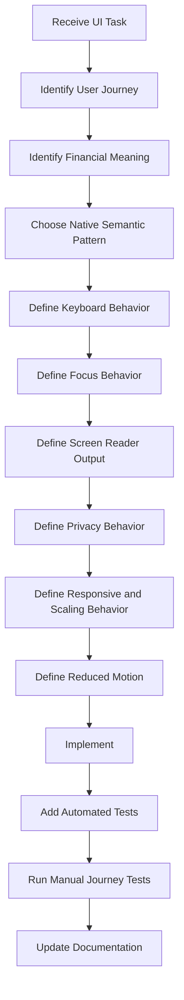

# Nexio Accessibility Specification

Version: 1.0  
Status: Official  
Authority Level: Accessibility and Inclusive Interaction Standard  
Applies To: Web, Desktop, Tablet, Mobile, Android, Assistant, Notifications, Reports, Imports, Exports, Authentication and Support Workflows

---

# Purpose

This document defines the official accessibility architecture of Nexio.

It establishes requirements for:

- Semantic structure
- Keyboard operation
- Focus management
- Screen-reader behavior
- Accessible names and descriptions
- Forms and validation
- Dialogs and overlays
- Navigation
- Responsive layouts
- Touch targets
- Text scaling
- Zoom
- Contrast
- Color independence
- Privacy mode
- Motion and animation
- Charts and Reports
- Tables and lists
- Loading, error and offline states
- Android accessibility
- Notifications
- Assistant interactions
- Localization
- Testing
- Governance
- Release approval
- AI implementation restrictions

Nexio must remain understandable and operable for users who may:

- Use only a keyboard
- Use a screen reader
- Use voice control
- Use switch control
- Use magnification
- Use large text
- Have reduced vision
- Have color-vision differences
- Have reduced dexterity
- Have cognitive or attention-related accessibility needs
- Prefer reduced motion
- Use a small screen
- Use the application in a noisy, bright or distracting environment
- Use more than one assistive technology

Accessibility must not be treated as a secondary visual enhancement.

It is part of financial correctness, privacy, security and user control.

---

# Relationship with Other Documents

This document must be interpreted together with:

```text
docs/00-FOUNDATION.md
docs/01-ARCHITECTURE.md
docs/02-DESIGN-SYSTEM.md
docs/03-DESKTOP.md
docs/04-TABLET.md
docs/05-MOBILE.md
docs/06-DATA-MODEL.md
docs/07-SECURITY.md
docs/08-OFFLINE-AND-SYNC.md
docs/09-TESTING.md
docs/10-DEPLOYMENT-AND-OPERATIONS.md
docs/11-INTERNATIONALIZATION-AND-CONTENT.md
docs/12-ASSISTANT-AND-AI.md
docs/13-PRIVACY-AND-DATA-GOVERNANCE.md
```

Responsibilities are divided as follows:

| Document | Responsibility |
|---|---|
| `00-FOUNDATION.md` | Product purpose and inclusive product principles |
| `01-ARCHITECTURE.md` | UI, Domain and platform boundaries |
| `02-DESIGN-SYSTEM.md` | Accessible design tokens and component foundations |
| `03-DESKTOP.md` | Desktop layout and keyboard composition |
| `04-TABLET.md` | Tablet interaction and responsive behavior |
| `05-MOBILE.md` | Mobile and Android interaction |
| `06-DATA-MODEL.md` | Canonical financial meaning |
| `07-SECURITY.md` | Secure authentication and privacy boundaries |
| `08-OFFLINE-AND-SYNC.md` | Accessible synchronization states |
| `09-TESTING.md` | Accessibility test architecture |
| `10-DEPLOYMENT-AND-OPERATIONS.md` | Accessibility release gates |
| `11-INTERNATIONALIZATION-AND-CONTENT.md` | Accessible language and localized content |
| `12-ASSISTANT-AND-AI.md` | Accessible Assistant behavior |
| `13-PRIVACY-AND-DATA-GOVERNANCE.md` | Accessible privacy and rights workflows |
| `14-ACCESSIBILITY.md` | Inclusive interaction and semantic implementation |

Accessibility does not replace Domain accuracy.

Accessible presentation must expose the same financial meaning as the visual interface.

---

# Accessibility Target

Nexio should target:

```text
WCAG 2.2 Level AA
```

as the minimum Web accessibility standard for supported workflows.

Where platform guidance, user need or product risk justifies stronger behavior, Nexio should exceed the minimum.

Android implementation should also follow:

- Native Android accessibility semantics
- TalkBack-compatible interaction
- Platform text-scaling behavior
- Touch-target guidance
- Accessible Notification behavior
- System reduced-motion and contrast preferences where supported

Compliance with a checklist alone does not guarantee usability.

Critical journeys must also be tested with real interaction patterns.

---

# Accessibility Constitutional Principles

## Accessibility Is a Product Requirement

Accessibility must be considered during:

```text
Requirements

Design

Content

Implementation

Testing

Release

Support

Maintenance
```

It must not be postponed to final visual review.

---

## Financial Meaning Must Be Equivalent

A screen-reader user, keyboard user and visual touch user must receive equivalent information about:

- Amount
- Currency
- Transaction type
- Account
- Category
- Date
- Status
- Synchronization
- Financial consequence
- Error
- Confirmation

The interface may present information differently, but it must not change its meaning.

---

## Visual Privacy and Accessible Privacy Must Match

When privacy mode hides a value visually, the exact value must also be hidden from:

- Accessible name
- Accessible description
- Screen-reader-only text
- Tooltip
- Clipboard
- Notification
- Browser title
- Conversation preview
- App-switcher content

A visually hidden value is not private when assistive technology still exposes it.

---

## Every Action Must Have an Operable Alternative

No critical action may require only:

- Dragging
- Swiping
- Hover
- Color recognition
- Complex gesture
- Precise pointer movement
- Visual chart interpretation

Equivalent accessible controls must exist.

---

## Keyboard Operation Must Be Complete

Every supported Web workflow must be operable through a keyboard alone.

This includes:

- Navigation
- Forms
- Dialogs
- Menus
- Tables
- Filters
- Charts where interactive
- Assistant
- Conflict resolution
- Export
- Account deletion

---

## Focus Must Follow User Intent

Focus must:

- Move predictably
- Remain visible
- Avoid unexpected jumps
- Return after overlays close
- Reach validation errors
- Avoid entering hidden or disabled content
- Reflect route and screen transitions

---

## Semantics Must Come Before ARIA Repair

Prefer native semantic elements.

Use:

```html
<button>
<a>
<input>
<select>
<textarea>
<table>
<nav>
main
header
footer
dialog
```

before rebuilding them with generic containers.

ARIA must enhance correct semantics, not simulate avoidable native behavior.

---

## Accessible Names Must Describe Meaning

Accessible names should describe:

- The control
- The action
- The relevant entity
- The current state where necessary

Avoid names based only on icon appearance.

Preferred:

```text
Edit Transaction Supermarket

Hide financial values

Open Account filters
```

Avoid:

```text
Pencil

Eye icon

Button
```

---

## Content Must Not Depend on Sensory Characteristics

Instructions must not rely only on:

- Color
- Shape
- Position
- Sound
- Animation

Avoid:

```text
Select the green button on the right.
```

Prefer:

```text
Select “Save Transaction”.
```

---

## Status Changes Must Be Communicated

Important changes must be available to assistive technology.

Examples:

- Form saved
- Validation failed
- Synchronization completed
- Offline state started
- Conflict appeared
- Export became ready
- Proposal is ready for review
- Account deletion completed

Announcements must be useful and restrained.

---

## Reduced Motion Must Be Respected

Motion must not be required to understand or operate Nexio.

When reduced motion is requested:

- Disable unnecessary transitions.
- Avoid parallax.
- Reduce animated chart transitions.
- Avoid celebratory motion.
- Avoid pulsing financial values.
- Preserve state changes through non-motion cues.

---

## Text Must Scale Without Loss

Users must be able to increase text size and zoom without:

- Missing content
- Overlapping controls
- Horizontal page scrolling for ordinary reading
- Clipped buttons
- Hidden validation
- Unusable dialogs
- Truncated exact financial values

---

## Accessibility Must Survive Responsive Change

A component must remain accessible when transformed from:

```text
Desktop table

to

Mobile card list
```

Semantic meaning, labels, ordering and actions must remain equivalent.

---

## Accessibility Must Survive Offline and Error States

Offline, loading, error, empty and synchronization states require the same accessibility quality as successful states.

---

## Accessibility Must Be Testable

A requirement should map to:

- Automated test
- Manual keyboard test
- Screen-reader test
- Visual test
- Android test
- Content review
- Release gate

---

# Accessibility Scope

This specification applies to:

```text
Application shell

Authentication

Onboarding

Dashboard

Transactions

Accounts

Categories

Goals

Reports

Notifications

Imports

Exports

Attachments

Settings

Privacy mode

Synchronization Center

Conflict Center

Assistant

Account deletion

Legal pages

Support content

Android native surfaces
```

---

# Accessibility Responsibility Model

Recommended roles:

```text
Accessibility Owner

Product Designer

Content Designer

Frontend Engineer

Android Engineer

Quality Engineer

Security Reviewer

Privacy Reviewer

Release Owner
```

---

# Accessibility Owner

Responsible for:

- Accessibility standards
- Exception review
- Component guidance
- Test strategy
- Release gates
- Accessibility backlog
- Periodic audits
- User feedback triage

---

# Product Designer

Responsible for:

- Reading order
- Focus order
- Contrast
- Touch targets
- Responsive behavior
- Non-color communication
- Motion behavior
- Error and empty states
- Large-text behavior

---

# Content Designer

Responsible for:

- Clear labels
- Accessible instructions
- Error messages
- Status announcements
- Link purpose
- Action-specific confirmation
- Non-judgmental financial language
- Translation context

---

# Frontend Engineer

Responsible for:

- Semantic HTML
- Keyboard support
- Focus management
- ARIA where required
- Live regions
- Zoom behavior
- Accessible custom components
- Browser compatibility

---

# Android Engineer

Responsible for:

- Native accessibility metadata
- TalkBack behavior
- Focus traversal
- Touch targets
- Text scaling
- Notification accessibility
- Native dialogs
- WebView accessibility integration

---

# Quality Engineer

Responsible for:

- Automated accessibility checks
- Keyboard journeys
- Screen-reader journeys
- Zoom testing
- Large-text testing
- Android accessibility testing
- Regression tracking

---

# Accessibility Terminology

## Accessible Name

The primary text assistive technology uses to identify a control or region.

## Accessible Description

Additional explanatory information associated with a control.

## Focus

The element currently receiving keyboard or assistive-technology interaction.

## Focus Order

The sequence in which focus moves through controls.

## Reading Order

The sequence in which content is exposed to assistive technology.

## Live Region

A region that announces dynamic changes without requiring focus.

## Landmark

A semantic page region such as:

- Navigation
- Main content
- Search
- Complementary content
- Footer

## Modal

An interface state that restricts interaction to one overlay until it closes.

## Touch Target

The interactive area available for touch or pointer activation.

## Reflow

The ability for content to adapt when zoomed or displayed in narrow viewports.

## Reduced Motion

A user or system preference requesting fewer non-essential animations.

---

# Accessibility Architecture

Recommended layers:

```text
Accessible Design Tokens

Semantic Component Primitives

Shared Interaction Utilities

Feature Components

Platform Adapters

Accessibility Test Harness
```

---

# Accessible Design Tokens

Tokens should define:

- Text contrast
- Focus indicator
- Disabled state
- Error state
- Warning state
- Success state
- Minimum target size
- Motion duration
- Reduced-motion alternative
- Text scale behavior
- Spacing for zoom and large text

---

# Semantic Component Primitives

Shared primitives should include:

```text
Button

Link

Input

Select

Checkbox

Radio Group

Toggle

Dialog

Alert Dialog

Menu

Tabs

Accordion

Tooltip

Toast

Status Banner

Data Table

Pagination

Progress Indicator

Skeleton

Bottom Sheet

Navigation Drawer
```

Feature teams should not rebuild core accessibility behavior repeatedly.

---

# Shared Interaction Utilities

Potential utilities:

```text
Focus trap

Focus return

Route focus manager

Live-region announcer

Reduced-motion observer

Accessible ID generator

Keyboard list navigation

Roving tabindex controller

Scroll-to-error

Privacy-safe accessible formatter
```

---

# Platform Adapters

Adapters may normalize:

- Browser focus behavior
- Android Back
- TalkBack labels
- Native permission dialogs
- Notification channels
- Haptic behavior
- System text scale
- Reduced-motion preferences

---

# Semantic Document Structure

A typical Web page should use:

```html
<header>
  <nav aria-label="Main navigation"></nav>
</header>

<main>
  <h1>Transactions</h1>
</main>
```

A page should generally have one primary `main` landmark.

---

# Heading Architecture

Headings should describe content hierarchy.

Recommended:

```text
H1:
Page title

H2:
Major page sections

H3:
Subsections
```

Do not select heading levels for visual size alone.

---

# Heading Requirements

- Every primary screen requires a clear heading.
- Heading levels should not skip unpredictably.
- Modal dialogs require an accessible title.
- Card headings should not create unnecessary heading noise.
- Hidden headings may be used to label regions when visually unnecessary.

---

# Landmark Architecture

Recommended landmarks:

```text
Banner

Main navigation

Main content

Search

Complementary content

Footer
```

Each repeated landmark should have a distinct accessible label.

Example:

```text
Main navigation

Account navigation
```

---

# Main Navigation

The active navigation item should expose current state.

Potential:

```html
<a aria-current="page">Transactions</a>
```

Do not communicate active state through color alone.

---

# Skip Navigation

Desktop and Web layouts should provide a skip mechanism when repeated navigation precedes main content.

Example:

```text
Skip to main content
```

The skip link should become visible on focus.

---

# DOM Order

DOM order should follow logical reading and interaction order.

Avoid using CSS visual reordering that creates a different semantic sequence.

---

# Responsive DOM Order

When layout changes:

```text
Sidebar beside content

to

Drawer before content
```

the reading and focus order must remain understandable.

---

# Semantic Text

Use real text instead of:

- Images of text
- CSS-generated critical labels
- Canvas-only financial labels
- Icon glyphs without text alternatives

---

# Language Metadata

The document must expose the active language.

Example:

```html
<html lang="pt-BR">
```

Language changes must update this metadata.

---

# Mixed-Language Content

User-generated names may remain in another language.

Explicit language metadata should be added only when the language is known reliably and improves pronunciation.

Do not guess language from financial content automatically.

---

# Native Elements First

Preferred implementations:

```html
<button type="button">Save</button>

<label for="amount">Amount</label>
<input id="amount">
```

Avoid:

```html
<div role="button" tabindex="0">Save</div>
```

unless a native element cannot support the required behavior.

---

# ARIA Use Principles

ARIA must:

- Match actual behavior.
- Use supported roles.
- Use valid states.
- Update dynamically.
- Avoid duplicate labels.
- Avoid hiding focusable elements.
- Avoid contradicting native semantics.

---

# No ARIA Is Better Than Incorrect ARIA

Incorrect semantics may create more harm than missing enhancement.

Custom ARIA patterns require reference implementation and testing.

---

# Accessible Name Calculation

A control may receive its name from:

- Visible text
- Associated label
- `aria-label`
- `aria-labelledby`

Visible text is generally preferred when it accurately names the control.

---

# Accessible Description

Use descriptions for:

- Consequences
- Formatting help
- Privacy behavior
- Validation guidance
- Destructive-action explanation

Avoid making the description excessively repetitive.

---

# Name and State

A control's accessible output may include:

```text
Hide financial values, switch, off
```

The label should describe the feature.

The state should come from semantic state rather than manually repeated text when possible.

---

# Duplicate Names

Repeated actions require context.

Avoid multiple buttons named:

```text
Edit
```

Prefer:

```text
Edit Transaction Supermarket

Edit Account Main Account
```

---

# Dynamic Names

When a state changes:

```text
Show values

Hide values
```

the accessible name must update consistently with the visible action.

---

# Privacy-Safe Names

Normal mode:

```text
Expense Supermarket, R$ 185,40
```

Privacy mode:

```text
Expense Supermarket, amount hidden
```

---

# Keyboard Architecture

All interactive Web controls must be keyboard operable.

Supported keys depend on component type.

---

# Global Keyboard Principles

- `Tab` moves between interactive controls.
- `Shift + Tab` moves backward.
- `Enter` activates links and buttons where native behavior applies.
- `Space` activates buttons, checkboxes and similar controls.
- `Escape` closes dismissible overlays where appropriate.
- Arrow keys operate composite widgets according to their pattern.
- Focus must remain visible.

---

# No Positive Tabindex

Avoid:

```html
tabindex="1"
tabindex="2"
```

Use DOM order and `tabindex="0"` or `-1` only where appropriate.

---

# Hidden Content and Focus

Hidden or inert content must not remain keyboard focusable.

When a modal opens, background controls must not receive focus.

---

# Custom Keyboard Behavior

Custom widgets must document:

```text
Focus entry

Arrow-key behavior

Selection

Activation

Escape

Focus exit
```

---

# Keyboard Shortcuts

Keyboard shortcuts may improve efficiency but must:

- Be optional
- Avoid browser conflicts
- Avoid screen-reader conflicts
- Avoid single-character activation during typing
- Be documented
- Have a disable or remap strategy when necessary

Critical workflows must not depend on shortcuts.

---

# Single-Key Shortcuts

Single-character shortcuts should be avoided unless:

- Focus context is tightly controlled.
- The user can disable or remap them.
- They do not activate while typing.

---

# Keyboard Navigation Through Cards

A non-interactive card should not receive `tabindex="0"` merely because it is visually grouped.

Only interactive elements should enter Tab order.

When the entire card is a link, use one semantic link and avoid nested conflicting controls.

---

# Nested Interactive Controls

Avoid:

```text
Button inside Link

Link inside Button
```

Cards with multiple actions require separate semantic controls.

---

# Roving Tabindex

Composite components such as:

- Tabs
- Menus
- Toolbars
- Radio-like selections

may use roving tabindex.

One item remains in the page Tab order while arrow keys navigate inside.

---

# Keyboard Table Interaction

Ordinary data tables should not become complex grids unless cell-level interaction requires it.

Prefer:

- Native table navigation through reading
- Focusable links and buttons inside cells
- Separate sorting buttons
- Separate row action menu

---

# Keyboard Drag Alternative

When drag-and-drop exists, provide an alternative.

Examples:

```text
Move up

Move down

Choose destination

Reorder through dialog
```

---

# Touch Gesture Alternative

Swipe-to-delete must have a visible or discoverable button alternative.

Pinch or multi-finger gestures must not be required for core operation.

---

# Focus Architecture

Focus management is required for:

- Route changes
- Dialogs
- Bottom sheets
- Menus
- Validation
- Dynamic content
- Deletion
- Assistant proposals
- Conflict resolution
- Notifications opening content

---

# Visible Focus

Every keyboard-focusable control must have a visible focus indicator.

The focus indicator must:

- Contrast against adjacent colors
- Remain visible in light and dark themes
- Remain visible on colored surfaces
- Not rely only on subtle color change
- Not be removed by global CSS

---

# Focus Token

Recommended conceptual token:

```css
--focus-ring-width
--focus-ring-offset
--focus-ring-color
--focus-ring-shadow
```

The token must be validated across supported themes.

---

# Focus Versus Hover

Focus and hover may share some visual styling but must remain independently visible.

A keyboard user must not need hover capability.

---

# Route Focus

After meaningful navigation, focus should move to:

```text
Primary page heading

or

Primary content container
```

according to route behavior.

The browser's natural focus should not remain on a removed navigation element.

---

# Same-Page Updates

Filtering or sorting should not always move focus.

It should:

- Preserve focus on the triggering control.
- Announce the updated result count when useful.
- Keep the user near the current context.

---

# Dialog Focus

When a dialog opens:

1. Save the triggering element.
2. Move focus into the dialog.
3. Keep focus within the dialog when modal.
4. Place initial focus appropriately.
5. Return focus when the dialog closes.

---

# Dialog Initial Focus

Initial focus depends on context.

## Informational Dialog

Focus may move to:

- Dialog title
- Primary action

## Destructive Confirmation

Initial focus should generally avoid automatically selecting the destructive action.

Prefer:

- Dialog container or title
- Safe secondary action where appropriate

---

# Focus Return

When an overlay closes, focus should return to:

- Original trigger
- Logical replacement
- Nearby stable control

If the trigger was deleted, focus should move to a logical list heading or next item.

---

# Menu Focus

When a menu opens:

- Focus moves to first or selected menu item.
- Arrow keys navigate.
- Escape closes.
- Focus returns to trigger.
- Disabled items are identified correctly.

---

# Bottom Sheet Focus

A modal bottom sheet follows dialog focus rules.

A non-modal informational sheet must not trap focus unnecessarily.

---

# Drawer Focus

A modal Mobile navigation drawer should:

- Receive focus when opened.
- Prevent background interaction.
- Close with Escape or Android Back where appropriate.
- Return focus to the menu trigger.

---

# Validation Focus

After form submission failure:

- Announce error count.
- Focus the error summary or first invalid field.
- Preserve all entered values.
- Provide links from summary to fields where used.

---

# Focus on Success

After successful creation:

- Move focus to the created entity heading, success message or logical destination.
- Avoid leaving focus on a removed Save button.
- Announce local versus synchronized status accurately.

---

# Focus on Error

After command failure:

- Keep the review or form available.
- Move focus to the error message when necessary.
- Preserve the user's draft.
- Avoid resetting the form.

---

# Focus During Loading

Do not move focus repeatedly while loading.

Loading indicators should communicate state through semantics.

---

# Focus During Streaming Assistant Response

Do not move focus for every content update.

Announce response completion rather than every token.

---

# Screen-Reader Architecture

Screen-reader users must receive:

- Correct structure
- Correct names
- Correct states
- Correct reading order
- Correct financial meaning
- Important status changes
- Privacy-safe output

---

# Screen-Reader Output Order

A Transaction card should expose a predictable order.

Example:

```text
Expense

Supermarket

R$ 185,40

Main Account

Groceries

24 July 2026

Synchronized
```

The exact order should match user priorities.

---

# Avoid Duplicate Announcement

Do not expose the same visible text through:

- Native text
- `aria-label`
- Hidden duplicate
- Description

simultaneously unless the duplication serves a specific purpose.

---

# Visually Hidden Content

Use visually hidden text for:

- Additional context
- Icon labels
- Table captions
- Clarifying state

It must remain:

- Available to assistive technology
- Outside privacy leaks
- Outside duplicate reading
- Compatible with zoom

---

# Decorative Elements

Decorative icons and images should be hidden from assistive technology.

Example:

```html
aria-hidden="true"
```

only when the element conveys no unique meaning.

---

# Informative Icons

An icon conveying unique meaning requires:

- Accessible label
- Visible text
- Or associated text alternative

Examples:

- Warning
- Offline
- Conflict
- Security issue

Color and icon alone are insufficient.

---

# Live Region Architecture

Recommended live-region categories:

```text
Polite status

Assertive critical alert

Dedicated form-error summary

Synchronization status

Assistant completion
```

---

# Polite Announcements

Use for:

- Save completed
- Results updated
- Synchronization completed
- Draft ready
- Export ready

---

# Assertive Announcements

Use sparingly for:

- Session expiration blocking current action
- Critical validation preventing protected action
- Security warning requiring immediate attention
- Account deletion failure

---

# Announcement Deduplication

Repeated background retries should not repeatedly announce the same status.

---

# Announcement Content

Preferred:

```text
Transaction saved on this device.

Three changes are waiting to synchronize.

Review two fields before continuing.
```

Avoid:

```text
Success.

Error.

Updated.
```

without context.

---

# Loading Semantics

A loading region may use:

- `aria-busy`
- Status text
- Progress semantics
- Controlled announcement

Skeletons should be hidden from assistive technology when they contain no meaningful data.

---

# Progress Indicators

## Indeterminate

Use when completion percentage is unknown.

Example:

```text
Preparing export…
```

## Determinate

Use when actual progress exists.

Example:

```text
42 of 100 rows reviewed
```

Do not fabricate progress.

---

# Accessible Forms

Every input requires:

- Visible label
- Programmatic label association
- Required or optional state
- Supporting text where needed
- Validation association
- Correct input type
- Predictable keyboard behavior

---

# Label Architecture

Preferred:

```html
<label for="transaction-amount">Amount</label>
<input id="transaction-amount">
```

---

# Placeholder Prohibition

Placeholder text must not be the only label.

It disappears during input and may have insufficient contrast.

---

# Required Fields

Required state should be communicated:

- Visually
- Programmatically
- In form-level guidance where appropriate

Use the platform's required semantics where possible.

---

# Optional Fields

When most fields are required, identify optional fields clearly.

Example:

```text
Notes — Optional
```

---

# Field Help

Supporting text should be linked through the accessible description.

Example:

```text
This date determines which Report period includes the Transaction.
```

---

# Error Association

A field error should be programmatically associated with the field.

The invalid state should update when appropriate.

---

# Error Message Quality

Errors must be:

- Specific
- Actionable
- Localized
- Non-judgmental
- Financially accurate

Preferred:

```text
Choose different source and destination Accounts.
```

Avoid:

```text
Invalid selection.
```

---

# Error Summary

Long forms should provide a summary when several fields fail.

Example:

```text
Review 3 fields before continuing.
```

Each summary item should navigate to the relevant field.

---

# Error Timing

Avoid announcing validation errors on every keystroke unless immediate feedback is necessary.

Prefer:

- After field interaction
- On blur
- On submit
- After dependent selection

---

# Money Input Accessibility

A Money field must expose:

- Label
- Currency
- Raw input behavior
- Validation
- Exact canonical value in review
- Privacy behavior

The currency symbol alone is insufficient.

Example accessible label:

```text
Amount in Brazilian reais
```

---

# Date Input Accessibility

A Date field must expose:

- Label
- Expected input behavior
- Validation
- Selected canonical date
- Calendar control semantics

Custom calendar dialogs require complete keyboard and screen-reader support.

Native date controls are preferred when they meet platform needs.

---

# Select Accessibility

Native select controls are preferred for simple selection.

Custom searchable selection requires:

- Input label
- Expanded state
- Result list semantics
- Active-option announcement
- Keyboard navigation
- Selection announcement
- Empty results
- Loading state

---

# Checkbox Accessibility

The label should describe the checked behavior.

Example:

```text
Include this Account in Net Worth
```

---

# Toggle Accessibility

A toggle should expose:

- Label
- Current state
- Consequence when non-obvious

Avoid using a switch for actions that are not immediate binary settings.

---

# Radio Group Accessibility

A Radio Group requires:

- Group label
- Individual option labels
- Arrow-key behavior
- Selected state
- Error association

---

# Form Review Accessibility

Before a financial mutation, the review screen should present values in a logical sequence.

Example:

```text
Expense

Amount:
R$ 185,40

Account:
Main Account

Category:
Groceries

Date:
24 July 2026
```

The confirmation action must have a specific name:

```text
Save Expense
```

---

# Dialog Accessibility

A dialog requires:

- Accessible role
- Accessible title
- Description when needed
- Focus management
- Keyboard close when appropriate
- Visible close control when dismissible
- Background inertness when modal

---

# Alert Dialog

Use an alert-dialog pattern only when the user must respond before continuing.

Do not use it for ordinary informational messages.

---

# Destructive Dialog Content

The title and description must explain:

- Entity
- Consequence
- Reversibility
- Financial effect when relevant

Primary action:

```text
Delete Transaction
```

Secondary action:

```text
Keep Transaction
```

---

# Escape Behavior

Escape should close dismissible dialogs.

It should not:

- Confirm an action
- Discard unsaved critical data without confirmation
- Close a required security prompt unexpectedly

---

# Close Button

A visible close button requires an accessible name:

```text
Close dialog
```

or contextual:

```text
Close Transaction filters
```

---

# Popover Accessibility

A popover must define whether it behaves as:

- Non-modal disclosure
- Menu
- Listbox
- Dialog

Do not combine several patterns ambiguously.

---

# Tooltip Accessibility

A tooltip:

- Supplements an existing accessible name.
- Does not contain critical-only content.
- Appears on keyboard focus.
- Remains visible long enough.
- Can be dismissed when required.
- Does not require hover.

---

# Toast Accessibility

A toast may announce:

- Save success
- Ordinary background status
- Non-critical error

A toast must not be the only location for:

- Account deletion consequence
- Export privacy warning
- Required correction
- Conflict resolution
- Security action

---

# Navigation Accessibility

Navigation must provide:

- Clear labels
- Current page
- Logical order
- Keyboard operation
- Touch operation
- Screen-reader landmarks

---

# Bottom Navigation

Mobile bottom navigation should:

- Use meaningful labels
- Expose selected state
- Maintain sufficient target size
- Avoid icon-only ambiguity
- Support text scaling
- Avoid hidden labels that cause pronunciation confusion

---

# Navigation Drawer

The drawer should:

- Have a navigation landmark
- Identify current route
- Trap focus only when modal
- Close through keyboard and system Back
- Return focus
- Prevent background reading when modal

---

# Tabs Accessibility

Tabs require:

- Tab list
- Tab roles where custom
- Selected state
- Associated panel
- Keyboard arrow navigation
- Focus behavior
- Persistent state where appropriate

---

# Accordion Accessibility

Accordion headers should be buttons.

They must expose:

- Expanded state
- Controlled panel
- Clear heading relationship
- Keyboard operation

---

# Breadcrumb Accessibility

Breadcrumbs should:

- Use navigation landmark
- Identify current item
- Avoid unnecessary repetition
- Exclude sensitive values where possible

---

# Visual Accessibility Architecture

Visual design must remain usable across:

- Light theme
- Dark theme
- High brightness
- Low brightness
- Magnification
- Color-vision differences
- Privacy mode
- Disabled state
- Error state

---

# Contrast Requirements

Text, controls, icons and focus indicators must meet the project's approved contrast targets.

The design system must test:

- Normal text
- Large text
- Placeholder
- Disabled state
- Focus ring
- Error text
- Chart labels
- Graph lines
- Icons
- Borders required to identify controls

---

# Disabled State Contrast

Disabled content may use reduced prominence but must remain understandable when necessary.

Do not use disabled styling for read-only content when users still need to read it.

---

# Placeholder Contrast

Placeholder text must remain distinguishable from entered content but cannot be so faint that it becomes unreadable.

It must not replace the label.

---

# Color Independence

Color may reinforce meaning but cannot be the only indicator.

Examples:

```text
Income:
Plus sign, label and color

Expense:
Minus sign, label and color

Error:
Icon, text and color

Conflict:
Status label, icon and color
```

---

# Income and Expense Colors

A green/red distinction alone is insufficient.

Use:

- Text label
- Direction sign
- Icon where helpful
- Position or grouping
- Accessible name

---

# Chart Color

Chart series must use more than color.

Potential differentiators:

- Pattern
- Marker
- Line style
- Direct labels
- Legend text
- Accessible data table

---

# Error State

An error field should include:

- Error text
- Error association
- Icon where helpful
- Border or state
- Programmatic invalid state

Do not rely only on red border.

---

# Focus Contrast

Focus rings must remain visible against:

- White
- Dark surface
- Brand color
- Error background
- Modal overlay
- Chart canvas

---

# Text Scaling

Nexio must support substantial text scaling.

At larger sizes:

- Controls may grow vertically.
- Labels may wrap.
- Cards may stack.
- Navigation may change form.
- Table layouts may become cards.
- Dialogs may become full screen.
- Exact amounts must remain visible.

---

# Browser Zoom

Critical Web workflows should remain usable at high zoom.

Requirements:

- No hidden confirmation actions
- No inaccessible horizontal scroll for ordinary content
- No clipped error text
- No overlapping navigation
- No unreadable chart
- No focus loss

---

# Reflow

At narrow effective width, content should reflow rather than shrink below readable size.

Exceptions may include:

- Complex data tables
- Charts
- Code-like technical support output

These require an accessible alternative.

---

# Exact Financial Values

Exact values must not be truncated with ellipsis in:

- Forms
- Review screens
- Transaction details
- Conflict comparison
- Export confirmation
- Account deletion impact

They may wrap or use responsive layout.

---

# Long User-Generated Text

Long Account, Goal or Category names may wrap.

Compact lists may truncate when:

- Full text remains available.
- Accessible name contains the appropriate privacy-safe full value.
- The layout remains operable.
- A touch-accessible disclosure exists on Mobile.

---

# Text Spacing

Layouts should tolerate increased:

- Line height
- Letter spacing
- Word spacing
- Paragraph spacing

without loss of content or function.

---

# Orientation

Nexio should not unnecessarily restrict orientation.

When a feature works only in one orientation due to genuine functional need, document and test the exception.

---

# Target Size

Interactive controls require touch-friendly target areas.

The visible icon may be smaller than the interactive target.

Targets should not overlap or require precise touch.

---

# Target Spacing

Adjacent destructive and non-destructive controls require sufficient separation.

Examples:

```text
Delete

Save
```

should not be placed so closely that accidental activation is likely.

---

# Pointer Cancellation

Where possible, an action should activate on release rather than initial pointer contact.

Users should be able to move away before completing an accidental press.

---

# Dragging Movements

Any function using dragging must have a non-drag alternative.

Examples:

- Reorder Category
- Move chart range
- Adjust Goal slider

---

# Slider Accessibility

Use a slider only when approximate continuous selection is appropriate.

Exact Money should generally use a numeric input rather than slider-only interaction.

A slider requires:

- Accessible label
- Current value
- Minimum
- Maximum
- Step
- Keyboard support
- Direct-entry alternative where precision matters

---

# Motion Architecture

Motion may communicate:

- Relationship
- State change
- Navigation
- Loading
- Success

It must not distract from financial decisions.

---

# Reduced-Motion Detection

Web should observe:

```css
prefers-reduced-motion
```

Android should follow relevant system animation and accessibility settings where supported.

---

# Reduced-Motion Behavior

When requested:

- Remove large transforms.
- Remove parallax.
- Reduce fade duration.
- Disable looping decorative animation.
- Replace animated chart transitions with immediate rendering.
- Avoid bouncing or pulsing.
- Keep progress understandable.

---

# Essential Motion

Motion is rarely essential in Nexio.

When motion communicates a spatial relationship, provide an equivalent static state.

---

# Flashing Content

Avoid flashing or rapid high-contrast changes.

Notifications and validation should not use repeated flashing.

---

# Auto-Updating Content

Auto-updating content must:

- Avoid stealing focus.
- Avoid resetting reading position.
- Announce only meaningful changes.
- Allow pause where continuous updates interfere.
- Preserve user-entered data.

---

# Timed Interactions

Critical financial workflows should not rely on short time limits.

When a time limit exists for security:

- Warn the user.
- Allow extension where policy permits.
- Preserve drafts.
- Explain expiration.
- Avoid silent data loss.

---

# Session Expiration

Example:

```text
Your session expired.

Sign in again to synchronize your saved changes.
```

The dialog and recovery path must be keyboard and screen-reader accessible.

---

# Auto-Lock

Before auto-lock:

- Preserve safe local state.
- Avoid losing form input.
- Restore the user to an understandable state after authentication.
- Announce why authentication is required.

---

# Media

Nexio should avoid auto-playing audio or video.

Any future media must provide:

- Captions
- Transcript
- Controls
- No auto-play with sound
- Keyboard operation
- Reduced-motion consideration

---

# Images

Informative images require text alternatives.

Decorative images should be ignored by assistive technology.

Screenshots used in help content require:

- Text explanation
- Current UI accuracy
- Privacy-safe synthetic data

---

# Logos

The Nexio logo should have an accessible name when it functions as:

- Home link
- Application identity

Decorative duplicate logos may be hidden.

---

# Icon Architecture

Every icon should be classified:

```text
Decorative

Label reinforcement

Interactive

Status

Data visualization
```

---

# Decorative Icon

No accessible name.

---

# Label Reinforcement Icon

Visible text supplies the meaning.

The icon is hidden from assistive technology.

---

# Interactive Icon

Requires an accessible action name.

Example:

```text
Open Notifications
```

---

# Status Icon

Requires text or accessible status.

Example:

```text
Waiting to synchronize
```

---

# Financial Privacy Accessibility

Privacy mode must define accessible behavior for:

```text
Amounts

Balances

Charts

Reports

Assistant

Notifications

Widgets

Search results

Recent items

Copy

Share
```

---

# Privacy Mode Announcements

When enabled:

```text
Financial values are hidden.
```

When disabled:

```text
Financial values are visible.
```

Avoid announcing every hidden field individually.

---

# Reveal Values

The reveal control should be:

- Keyboard accessible
- Screen-reader accessible
- Explicitly named
- Protected by reauthentication where policy requires
- Consistent across platforms

---

# Chart Privacy

When values are hidden:

- Remove visible labels.
- Remove accessible data values.
- Protect chart summary.
- Protect legends containing values.
- Protect tooltips.
- Protect exported image alternatives.

---

# Notification Privacy

Native and browser Notification content must match selected privacy level.

Accessible Notification text must not contain information hidden visually.

---

# Loading, Empty and Error States

Every state must have:

- Meaningful heading or status
- Explanation
- Available action
- Accessible semantics
- Privacy-safe content

---

# Loading State

Example:

```text
Loading Transactions…
```

Use a status role or busy state as appropriate.

---

# Empty State

Example:

```text
No Transactions yet

Create a Transaction to begin tracking activity.
```

The illustration is secondary to the text.

---

# Filtered Empty State

Example:

```text
No Transactions match these filters.

Clear filters to view more results.
```

---

# Offline State

Example:

```text
You are offline.

Saved information remains available on this device.
```

---

# Error State

Example:

```text
Nexio could not load Transactions.

Try again.
```

The Retry action must be keyboard and screen-reader accessible.

---

# Maintenance State

Maintenance messages must explain:

- Affected capability
- Available local behavior
- User action
- Expected recovery when known

---

# Status Severity

Severity must not rely only on color.

Use:

- Heading
- Icon
- Text
- Programmatic semantics

---

# Accessibility Anti-Patterns

The following are prohibited:

## Div Button

Using a generic container as a button without complete semantic behavior when a native button is available.

## Placeholder-Only Label

Using placeholder text as the only field identification.

## Focus Outline Removal

Removing visible focus without an accessible replacement.

## Positive Tabindex

Manually forcing Tab sequence through positive values.

## Color-Only Status

Using green and red as the only difference between Income and Expense.

## Icon-Only Ambiguity

Providing an unlabeled icon action.

## Visual Privacy Only

Hiding values visually while exposing them to assistive technology.

## Modal Without Focus Control

Opening an overlay while background content remains interactive.

## Focus Loss After Delete

Deleting a row and leaving focus nowhere meaningful.

## Automatic Destructive Focus

Opening a dialog with focus directly on the destructive action without justification.

## Live-Region Flood

Announcing every synchronization retry or generated token.

## Fake Progress

Providing an inaccessible or inaccurate percentage.

## Table as Generic Divs

Rebuilding tabular financial data without meaningful row and column relationships.

## ARIA Grid Without Need

Using a complex grid pattern for an ordinary table.

## Swipe-Only Action

Requiring swipe to edit or delete.

## Hover-Only Help

Showing necessary instructions only on hover.

## Fixed Text Height

Clipping labels when text scales.

## Ellipsized Exact Amount

Hiding part of an exact financial value in a review workflow.

## Motion-Only State Change

Using movement as the only indication that an action completed.

## Inaccessible Custom Select

Implementing a searchable selector without keyboard and screen-reader behavior.

## Unlabeled Currency

Presenting an amount input without exposing the Currency.

## Toast-Only Critical Error

Putting required recovery information only in a temporary toast.

## Screen-Reader Duplicate

Reading visible text twice because of redundant labels.

## Mobile Focus Trap Failure

Allowing focus to move behind a bottom sheet or drawer.

---

# Part 1 Accessibility Review Questions

Before approving a screen or component, answer:

```text
What is the semantic structure?

What is the primary heading?

Which landmarks exist?

What is the reading order?

What is the keyboard order?

Which controls require names?

Which controls require descriptions?

Where does focus move after actions?

Which status changes require announcement?

What happens at large text?

What happens at high zoom?

Does color carry unique meaning?

Does privacy mode protect accessible output?

Does reduced motion change the behavior?

Can every gesture be replaced?
```

---

# Semantic Review Questions

```text
Can native HTML or native Android components be used?

Does ARIA match actual behavior?

Are headings hierarchical?

Are landmarks labeled?

Does DOM order match visual order?

Are hidden elements removed from accessibility focus?

Are decorative elements hidden correctly?
```

---

# Keyboard Review Questions

```text
Can every action be reached with Tab?

Can every action be activated?

Does Escape behave safely?

Do arrow keys follow the component pattern?

Is focus always visible?

Does focus return after closing overlays?

Can dragging and swiping be replaced?

Are shortcuts optional and conflict-free?
```

---

# Focus Review Questions

```text
Where does focus start?

Where does focus move after navigation?

Where does focus move after validation failure?

Where does focus move after Save?

Where does focus move after Delete?

What happens when the trigger disappears?

Does a modal trap focus?

Does background content become inert?
```

---

# Visual Review Questions

```text
Does text contrast meet the target?

Does focus contrast meet the target?

Is any meaning color-only?

Can text wrap?

Can exact Money remain visible?

Does the layout reflow?

Does it work with large text?

Does it work in dark theme?

Does reduced motion preserve understanding?
```

---

# Form Review Questions

```text
Does every field have a visible label?

Is the label programmatically associated?

Is Currency exposed?

Is required state exposed?

Is help text associated?

Is the error associated?

Are several errors summarized?

Does failure preserve the form?

Is the final financial review readable?
```

---

# Part 1 Acceptance Criteria

The accessibility foundation is accepted only when:

```text
□ Nexio targets WCAG 2.2 Level AA for supported Web workflows.

□ Android accessibility behavior follows platform semantics.

□ Accessibility is included from requirements through release.

□ Financial meaning remains equivalent across interaction modes.

□ Privacy mode protects visual and accessible output equally.

□ Every critical action has a non-gesture alternative.

□ Every Web workflow is keyboard operable.

□ Focus order follows logical user intent.

□ Native semantic elements are preferred.

□ ARIA is used only when necessary and valid.

□ Every interactive control has a meaningful accessible name.

□ Repeated controls include entity context.

□ Content does not rely only on color, position, shape or sound.

□ Important status changes are announced.

□ Reduced-motion preferences are respected.

□ Text scaling does not remove content or function.

□ Responsive changes preserve semantic equivalence.

□ Offline, loading, empty and error states are accessible.

□ Accessibility roles and ownership are defined.

□ Shared components centralize accessibility behavior.

□ Application pages use meaningful headings and landmarks.

□ Main navigation exposes current state.

□ Skip navigation is available where repeated content requires it.

□ DOM and reading order remain logical.

□ Hidden content is not focusable.

□ Positive tabindex is prohibited.

□ Custom widgets document complete keyboard behavior.

□ Dragging and swipe actions have alternatives.

□ Focus indicators remain visible in all themes.

□ Route changes place focus logically.

□ Dialogs manage initial focus, trapping and return.

□ Destructive dialogs avoid unsafe automatic focus.

□ Validation moves or links focus to errors.

□ Success and failure preserve understandable focus.

□ Screen-reader output follows predictable financial order.

□ Decorative elements are hidden from assistive technology.

□ Live-region announcements are useful and deduplicated.

□ Skeletons do not announce fake content.

□ Progress indicators report only real progress.

□ Every form field has a visible associated label.

□ Placeholder text does not replace labels.

□ Required, optional, help and error states are exposed.

□ Money fields expose Currency.

□ Date and searchable selection controls are keyboard accessible.

□ Dialogs expose titles and consequences.

□ Tooltips do not contain critical-only information.

□ Toasts are not the only source of critical information.

□ Tabs, accordions and navigation drawers follow established semantic patterns.

□ Text and controls meet approved contrast targets.

□ Income, Expense, warning and error meaning does not depend only on color.

□ Exact financial values are not truncated in critical workflows.

□ Large text and high zoom remain usable.

□ Touch targets are sufficiently large and separated.

□ Slider-only input is not used for exact Money.

□ Reduced motion removes non-essential animation.

□ Time-limited security flows preserve drafts and explain expiration.

□ Informative images and icons have appropriate alternatives.

□ Privacy mode protects charts, Reports, Assistant and Notifications.

□ Loading, empty, offline, maintenance and error states expose meaningful actions.

□ Accessibility anti-patterns are prohibited.
```

---

# Accessibility Foundation Constitutional Rule

Every screen, component, status, chart and financial action must answer:

```text
Can a user understand and complete this workflow without relying on vision, color, precise touch, complex gestures, animation or a specific input device while receiving the same financial, privacy and security meaning?
```

When the answer is uncertain, prefer the implementation that:

- Uses native semantics.
- Preserves logical reading order.
- Supports keyboard operation.
- Shows visible focus.
- Uses explicit labels.
- Communicates state through text.
- Provides gesture alternatives.
- Supports large text and reflow.
- Respects reduced motion.
- Protects accessible privacy.
- Announces meaningful changes.
- Preserves exact financial information.
- Fails without removing user control.

Accessibility is not an alternate version of Nexio.

It is the quality of the primary product when used through different human capabilities and technologies.

---
---

# Feature Accessibility Architecture

Every Nexio feature must expose the same essential information and actions through:

```text
Visual interface

Keyboard

Screen reader

Touch exploration

Voice access where supported

Large text

Zoom

Reduced motion

Privacy mode
```

Feature accessibility requirements must be defined for:

```text
Initial state

Loading state

Populated state

Empty state

Filtered state

Offline state

Pending synchronization

Conflict state

Error state

Success state

Privacy mode
```

A feature is not accessible when only its ordinary successful state works correctly.

---

# Shared Financial Information Order

Where practical, financial entities should expose information in a predictable order.

Recommended priority:

```text
Entity type

Primary description or name

Exact Amount and Currency

Account

Category

Date or period

Financial status

Synchronization status

Available actions
```

The exact order may vary by feature, but the most important financial meaning should come before secondary metadata.

---

# Shared Status Separation

The interface must distinguish:

```text
Financial status

Synchronization status

Archive or deletion state

Validation state

Security state
```

Example:

```text
Transaction:
Pending

Synchronization:
Waiting to synchronize
```

These must not be announced as one ambiguous:

```text
Pending
```

---

# Dashboard Accessibility

The Dashboard summarizes financial information and provides navigation to detailed features.

It must remain understandable without relying on visual chart scanning.

---

# Dashboard Page Structure

Recommended structure:

```text
H1:
Dashboard or Financial overview

Period selector

Financial summary region

Accounts region

Recent Transactions region

Goals region

Insights region

Synchronization status
```

Each major region should have:

- A heading
- Logical reading order
- Clear accessible name
- Optional navigation to details

---

# Dashboard Period Selector

The active period must be exposed explicitly.

Example:

```text
Selected period:
July 2026
```

The control must support:

- Keyboard operation
- Screen-reader announcement
- Date-range understanding
- Large text
- Locale formatting
- Custom-period validation

---

# Dashboard Period Change

When the period changes:

- Preserve focus on the period control.
- Update all affected summaries.
- Announce the new period and update completion.
- Avoid announcing every individual card separately.
- Preserve privacy mode.
- Avoid moving focus to the top unexpectedly.

Example announcement:

```text
Dashboard updated for July 2026.
```

---

# Dashboard Summary Cards

Potential summary cards:

```text
Income

Expenses

Net Result

Available Balance

Net Worth
```

Each card should expose:

- Label
- Exact value and Currency
- Period or scope where relevant
- Trend or comparison where present
- Privacy state
- Navigation action where interactive

---

# Summary Card Semantics

A non-interactive card should not receive keyboard focus.

When the card opens a detail page, use a semantic link or button.

Avoid turning the entire card into a focusable container when it also contains nested actions.

---

# Summary Card Accessible Output

Example:

```text
Expenses

R$ 2.400,00

July 2026

12 percent higher than June
```

Privacy mode:

```text
Expenses

Amount hidden

July 2026

Higher than June
```

Only preserve the comparison when it does not reveal a protected exact value contrary to privacy policy.

---

# Positive and Negative Results

A positive or negative result must not rely only on:

- Green
- Red
- Up arrow
- Down arrow

Use explicit text:

```text
Positive Net Result

Negative Net Result
```

or a meaningful sign and accessible label.

---

# Dashboard Comparison

A comparison must identify:

```text
Current period

Comparison period

Difference

Direction

Currency

Percentage when valid
```

Screen-reader output should avoid ambiguous:

```text
Up 12
```

Prefer:

```text
Expenses increased by 12 percent compared with June.
```

---

# Dashboard Charts

Charts must have:

- Clear title
- Period
- Currency
- Text summary
- Data table or list alternative
- Non-color differentiation
- Keyboard-accessible interactive details when interactive
- Privacy-mode equivalent

---

# Dashboard Chart Alternative

Example:

```text
Expenses by Category, July 2026

Groceries:
R$ 520,00

Housing:
R$ 1.200,00

Transport:
R$ 280,00

Other:
R$ 400,00
```

---

# Dashboard Insight Accessibility

Insights should expose:

```text
Observation

Evidence

Period

Confidence where relevant

Action
```

Example:

```text
Possible recurring payment

Three similar Transactions appear monthly.

Review Transactions
```

The words:

```text
Possible

May

Appears
```

must remain available to assistive technology.

---

# Dashboard Recent Transactions

The recent list should:

- Use a list or table according to layout.
- Expose Type, Description, Amount, Account, Date and status.
- Provide meaningful row actions.
- Avoid repeated generic buttons.
- Preserve privacy mode.

---

# Dashboard Empty State

Example:

```text
No Transactions yet

Create a Transaction to begin tracking your finances.
```

The primary action must be keyboard and screen-reader accessible.

---

# Dashboard Partial Data

When using local-only or partial data:

```text
Showing information saved on this device.

Connect to load the complete synchronized overview.
```

This status should be exposed before or near the summary.

---

# Dashboard Loading

Loading should use one meaningful status for the region.

Avoid announcing each card as it loads.

---

# Transaction List Accessibility

The Transaction list is a critical financial record surface.

It must support:

- Search
- Filters
- Sorting
- Pagination or incremental loading
- Row navigation
- Row actions
- Privacy mode
- Offline state
- Synchronization status
- Responsive transformation

---

# Transaction List Structure

Desktop may use a table.

Mobile may use cards.

Both must expose equivalent fields.

---

# Transaction Table

Recommended columns:

```text
Date

Description

Type

Category

Account

Amount

Financial status

Synchronization status

Actions
```

The exact order may adapt to user priorities.

---

# Transaction Table Caption

The table should have an accessible caption or label.

Example:

```text
Transactions for July 2026
```

Filtered:

```text
Filtered Transactions for July 2026
```

---

# Transaction Column Headers

Headers must be programmatically associated with cells.

Sortable headers should use a button inside the header.

Example accessible output:

```text
Date, sorted descending
```

---

# Transaction Row Output

Example:

```text
Expense

Supermarket

R$ 185,40

Groceries

Main Account

24 July 2026

Completed

Synchronized
```

---

# Transaction Row Navigation

When the row opens details:

- Use a clearly labeled link.
- Avoid making the entire row a custom keyboard grid without need.
- Ensure row actions remain separately reachable.
- Prevent nested interactive conflicts.

---

# Transaction Row Actions

Avoid several buttons announced only as:

```text
Edit

Delete

More
```

Preferred:

```text
Edit Transaction Supermarket

Delete Transaction Supermarket

More actions for Transaction Supermarket
```

---

# Transaction Privacy Mode

Normal:

```text
Expense Supermarket, R$ 185,40
```

Protected:

```text
Expense Supermarket, amount hidden
```

When Description is also considered sensitive under a stronger privacy mode, use the approved protected alternative.

---

# Transaction Search

The Search field requires:

- Visible label
- Search semantics
- Clear action
- Result count
- No-results message
- Safe rendering of search text
- Privacy behavior

Example announcement:

```text
12 Transactions found.
```

---

# Transaction Filter Region

Filters should be grouped under a labeled region.

Example:

```text
Transaction filters
```

Potential controls:

```text
Period

Account

Category

Type

Status

Currency

Amount range
```

---

# Filter Application

After applying filters:

- Keep focus on Apply or filter control.
- Announce result count.
- Expose active filters.
- Provide Clear all.
- Do not reset scroll or focus unnecessarily.

---

# Active Filter Accessibility

Example:

```text
Active filter:
Account, Main Account

Remove Account filter
```

Filter chips must not rely on an unlabeled `X` icon.

---

# Clear Filters

Use:

```text
Clear all filters
```

not a generic:

```text
Clear
```

when several values are affected.

---

# Transaction Sorting

Sort controls should expose:

```text
Field

Direction

Current state
```

Example:

```text
Sort by Amount, descending
```

---

# Incremental Loading

When loading more Transactions:

- Preserve focus.
- Announce newly available item count only when useful.
- Avoid returning screen-reader position to the beginning.
- Avoid duplicate items.

---

# Pagination

Pagination should expose:

```text
Previous page

Next page

Page 2 of 8

Showing 21 to 40 of 153 Transactions
```

---

# Mobile Transaction Cards

Cards should preserve logical reading order.

Recommended:

```text
Type and Description

Amount

Date

Account and Category

Financial status

Synchronization status

Actions
```

---

# Swipe Actions

Swipe-to-edit or swipe-to-delete may exist only as optional shortcuts.

Visible or menu-based alternatives must exist.

---

# Transaction Detail Accessibility

The detail screen should expose:

```text
H1:
Transaction Description or Transaction details

Type

Amount and Currency

Account

Category

Date

Notes

Financial status

Synchronization status

Created and updated metadata where useful

Actions
```

---

# Transaction Detail Amount

Exact Amount and Currency should be announced together.

Example:

```text
Expense amount:
R$ 185,40
```

---

# Transaction Detail Notes

Notes may be long and sensitive.

They should:

- Wrap
- Remain selectable only according to privacy policy
- Avoid exposing hidden content in previews
- Preserve user punctuation
- Not be interpreted as interface instructions

---

# Transaction Creation Accessibility

The New Transaction journey must support:

- Type selection
- Money input
- Account selection
- Category selection
- Date
- Description
- Notes
- Review
- Save state
- Offline state

---

# Transaction Type Selection

The group should expose:

```text
Transaction type

Income

Expense

Transfer
```

Use Radio Group or equivalent selection pattern.

---

# Dynamic Transaction Form

Changing Type may change fields.

Example:

```text
Expense:
Account and Category

Transfer:
Source Account and Destination Account
```

When fields change:

- Preserve compatible values.
- Move focus only when necessary.
- Announce significant form changes.
- Remove hidden fields from focus and accessibility tree.

Example:

```text
Transfer fields are now available.
```

---

# Money Field

Accessible content should expose:

```text
Amount in Brazilian reais
```

or the selected Currency.

The field must support:

- Localized input
- Clear validation
- Paste
- Keyboard entry
- Screen-reader editing
- Exact review value

---

# Transfer Form Accessibility

Transfer requires:

```text
Source Account

Destination Account

Amount

Currency

Date

Description
```

The review must state:

```text
This Transfer changes both Account balances and is not counted as Income or Expense.
```

---

# Same-Account Transfer Error

Example:

```text
Choose different source and destination Accounts.
```

Focus should move to or associate with the relevant fields.

---

# Cross-Currency Transfer Error

Example:

```text
These Accounts use different currencies.

Select Accounts with the same Currency.
```

---

# Transaction Form Review

Before Save, the review should expose every material field.

The final control should be:

```text
Save Expense

Save Income

Save Transfer
```

not:

```text
Confirm
```

---

# Transaction Save Status

Local success:

```text
Transaction saved on this device.

Waiting to synchronize.
```

Remote-confirmed success:

```text
Transaction saved and synchronized.
```

These states must not be conflated.

---

# Transaction Edit Accessibility

The Edit form should:

- Load existing values.
- Announce the form purpose.
- Preserve fields after failure.
- Identify changes where review exists.
- Revalidate archived or deleted relationships.

---

# Transaction Delete Accessibility

The confirmation must expose:

- Transaction identity
- Exact consequence
- Reversibility
- Impact on totals
- Specific actions

Example:

```text
Delete Transaction Supermarket?

This Transaction will be removed from active history and July totals will be recalculated.
```

Actions:

```text
Delete Transaction

Keep Transaction
```

---

# Transaction Cancellation Accessibility

Changing financial status to Cancelled must not be confused with closing a dialog.

Use:

```text
Mark Transaction as cancelled
```

---

# Account List Accessibility

The Account list should expose:

```text
Account name

Account type

Currency

Current Balance

Available Balance where applicable

Archive state

Synchronization state

Actions
```

---

# Account Card Output

Example:

```text
Main Account

Bank Account

Currency:
BRL

Current Balance:
R$ 3.250,40

Included in Net Worth

Active
```

---

# Account Balance Privacy

When values are hidden:

```text
Current Balance:
Amount hidden
```

Do not expose the value through the card's accessible label.

---

# Account List Navigation

Each Account should have:

```text
Open Account Main Account
```

Separate actions:

```text
Edit Account Main Account

Archive Account Main Account
```

---

# Account Creation Accessibility

Fields may include:

```text
Account name

Account type

Currency

Opening balance

Opening date

Include in Net Worth
```

---

# Account Currency

Currency selection must be explicit and programmatically labeled.

Changing Currency after Transactions exist may be blocked.

The error or warning must explain why.

---

# Opening Balance

The field should expose:

```text
Opening Balance in Brazilian reais
```

and associated date.

---

# Include in Net Worth

Use a descriptive checkbox or switch label:

```text
Include this Account in Net Worth
```

---

# Account Detail Accessibility

Recommended sections:

```text
H1:
Account name

Account summary

Balance information

Recent activity

Reports

Account settings

Synchronization state
```

---

# Account Summary Balance Types

Distinct labels must remain distinct:

```text
Opening Balance

Current Balance

Available Balance

Credit Limit

Outstanding Balance
```

Screen readers must not receive all values simply as:

```text
Balance
```

---

# Account Archive Accessibility

Confirmation:

```text
Archive Main Account?

This Account will no longer be available for new Transactions, but its history will remain accessible.
```

Actions:

```text
Archive Account

Keep Account active
```

---

# Account Dependency Error

Example:

```text
This Account cannot be deleted because it has linked Transactions.

Archive it to preserve the history.
```

---

# Category Accessibility

Category interfaces must expose:

```text
Category name

Income or Expense compatibility

Parent Category where applicable

Archive state

Transaction count where useful

Actions
```

---

# Category Compatibility

Avoid color-only classification.

Use visible and accessible labels:

```text
Expense Category

Income Category

Compatible with Income and Expenses
```

---

# Category Creation

The form should expose:

```text
Category name

Use for

Parent Category

Icon

Color
```

Icon and color are supplementary.

The Category remains understandable through its name and compatibility.

---

# Category Color Selection

Color selection requires:

- Text labels or values
- Selected state
- Keyboard support
- Non-color identity
- Contrast validation

Do not offer unlabeled color circles only.

---

# Category Icon Selection

Icons require names.

Examples:

```text
Shopping icon

Transport icon

Home icon
```

The selected Category should not depend only on its icon.

---

# Category Archive

Example:

```text
Archive Groceries?

Existing Transactions will keep this Category, but it will not be available for new Transactions.
```

---

# Category Merge Accessibility

Category Merge is high impact.

The review should expose:

```text
Source Category

Destination Category

Affected Transaction count

Affected Recurring Rule count

Report impact

Reversibility
```

---

# Category Merge Review

Example:

```text
Merge Groceries into Household?

42 Transactions and 2 Recurring Rules will use Household after the merge.

Reports may change.
```

Actions:

```text
Merge Categories

Keep Categories separate
```

---

# Goal List Accessibility

A Goal card should expose:

```text
Goal name

Saved Amount

Target Amount

Currency

Progress percentage

Target date

Status

Action
```

---

# Goal Progress

Progress must not be communicated only through a circular or linear bar.

Example:

```text
Emergency Fund

R$ 6.500,00 of R$ 10.000,00

65 percent complete
```

---

# Goal Progress Bar

When visual progress is used, apply appropriate progress semantics.

It must expose:

- Minimum
- Maximum
- Current value
- Text label

---

# Goal Privacy Mode

Protected:

```text
Emergency Fund

Amount hidden

65 percent complete
```

The product must decide whether percentage itself is considered sensitive under stronger privacy modes.

---

# Goal Creation Accessibility

Fields:

```text
Goal name

Target Amount

Currency

Target date

Funding method

Linked Account

Notes
```

---

# Goal Date

The selected target date should be clear and localized.

Validation:

```text
Select a target date after today.
```

only when that is the actual Domain rule.

---

# Goal Contribution Accessibility

Review:

```text
Goal:
Emergency Fund

Contribution:
R$ 300,00

Date:
24 July 2026
```

Action:

```text
Add Contribution
```

---

# Goal Completed State

Completion should be communicated through:

- Text
- Progress
- Status
- Optional restrained visual celebration

Reduced motion must remove non-essential celebration.

---

# Goal Behind Planned Pace

Use neutral language.

Example:

```text
This Goal is behind the planned pace.
```

Do not use shaming content.

---

# Report Accessibility

Reports must be understandable without visual chart interpretation.

Every Report should expose:

```text
Report title

Period

Accounts

Categories

Transaction types

Currencies

Data completeness

Calculation summary

Accessible data representation
```

---

# Report Page Structure

Recommended:

```text
H1:
Report title

Filter region

Summary region

Chart region

Data table

Calculation notes

Export action
```

---

# Report Filters

Filters must be:

- Labeled
- Keyboard accessible
- Screen-reader accessible
- Clearable
- Reflected in Report title or summary
- Preserved during responsive changes

---

# Report Scope Summary

Example:

```text
Expenses by Category

Period:
1 to 31 July 2026

Accounts:
All active Accounts

Currency:
BRL

Data:
Synchronized Transactions
```

---

# Report Currency Separation

When several currencies exist:

- Use separate summaries.
- Use separate chart series only when clearly labeled.
- Avoid combined totals.
- Expose a textual explanation.

---

# Report Chart Requirements

Every chart needs:

```text
Accessible title

Description

Period

Currency

Summary

Data table

Legend

Non-color differentiation
```

---

# Chart Interactive Points

When data points are interactive:

- They must be keyboard reachable through an established pattern.
- Focus state must be visible.
- The value must be announced.
- The user must be able to exit the chart.
- The chart must not create hundreds of Tab stops unnecessarily.

---

# Chart Keyboard Strategy

Potential strategies:

```text
One focusable chart region with arrow-key navigation

or

A separate accessible data table
```

The chosen pattern must be documented and tested.

---

# Chart Tooltip

Tooltips must appear for:

- Pointer hover
- Keyboard focus
- Touch activation

They must not contain information unavailable elsewhere.

---

# Chart Sonification

Sonification is optional and must never be the only accessible representation.

---

# Report Data Table

The table should expose the exact underlying summary.

Example:

```text
Category

Amount

Percentage of Expenses
```

---

# Report No Data

Example:

```text
No Transactions are available for this Report period.
```

Filtered:

```text
No data matches the selected filters.
```

---

# Report Partial Data

Example:

```text
This Report uses information saved on this device.

Connect to load the complete synchronized period.
```

---

# Report Export

The export control must identify scope.

Example:

```text
Export current Report
```

The confirmation must include the privacy warning.

---

# Table Accessibility

Tables should use native table semantics where information has row and column relationships.

---

# Table Caption

Every important data table requires a caption or accessible label.

---

# Table Headers

Use column and row headers appropriately.

Multi-level headers require explicit associations.

---

# Responsive Table Transformation

When converting a table to cards:

- Preserve each field label.
- Preserve field order.
- Preserve sorting and filtering.
- Preserve actions.
- Preserve status.
- Preserve privacy mode.

Do not show unlabeled values in Mobile cards.

---

# Horizontal Scrolling Tables

When unavoidable:

- Make the region keyboard scrollable.
- Provide visible indication of additional columns.
- Keep row and column headers understandable.
- Ensure focusable content is not clipped.
- Provide a card or detail alternative when possible.

---

# Sticky Headers

Sticky headers must not hide focused controls or screen-reader reading context.

---

# Row Selection

Selectable rows require:

- Explicit selection control
- Group label
- Selected count
- Keyboard operation
- Clear all selection
- No selection by color alone

---

# Bulk Actions

Bulk actions must identify:

- Number of selected items
- Action consequence
- Undo or confirmation policy
- Current scope

Example:

```text
Archive 4 Categories
```

---

# Pagination Accessibility

Pagination controls require:

- Accessible names
- Current page
- Disabled state
- Focus preservation
- Result range

---

# Import Accessibility

Import is a complex multi-step workflow.

Recommended steps:

```text
Select file

Map columns

Review rows

Resolve issues

Confirm Import

View result
```

---

# Import Step Indicator

The step indicator should expose:

```text
Step 2 of 5:
Map columns
```

It must not communicate progress through color alone.

---

# File Selection

The file control should expose:

- Label
- Supported file types
- Maximum size
- Privacy notice
- Selected filename
- Remove or replace action
- Error state

---

# Selected Filename

User-generated filenames may be sensitive.

Privacy mode and support surfaces must handle them according to policy.

---

# File Drag and Drop

Drag-and-drop may be supported, but a standard file-selection button is required.

---

# Import Parsing State

Example:

```text
Reading file…

1,250 rows found.
```

Use real progress only when available.

---

# Column Mapping

Each required field should expose:

```text
Nexio field

Selected file column

Example value

Validation
```

---

# Mapping Controls

Searchable selections must be keyboard accessible.

The user should be able to skip optional columns.

---

# Import Row Table

Potential columns:

```text
Include

Row number

Date

Description

Amount

Type

Category

Status

Issue
```

---

# Import Row Error

Example:

```text
Row 14

Date could not be recognized.

Edit date
```

---

# Import Error Navigation

Provide:

```text
Next issue

Previous issue

Show only rows needing review
```

These controls must be keyboard accessible.

---

# Duplicate Candidate

Example:

```text
Possible duplicate

A Transaction with the same date, amount and description already exists.
```

Actions:

```text
Compare

Import anyway

Exclude row
```

---

# Import Row Selection

Bulk include or exclude requires:

- Explicit checkbox
- Selected count
- Clear scope
- No color-only state

---

# Import Confirmation

The review must expose:

```text
Rows to import

Rows excluded

Rows needing review

Destination Account

Currency

Financial effect
```

---

# Import Final Action

Use:

```text
Import 94 Transactions
```

not:

```text
Confirm
```

---

# Import Completion

Example:

```text
Import completed.

94 Transactions were added.

2 rows were excluded.
```

---

# Import Partial Failure

The result should identify:

- Imported rows
- Failed rows
- Excluded rows
- Retry or review action
- No duplicate behavior

---

# Export Accessibility

Export workflows must expose:

```text
Scope

Format

Included data

Privacy consequence

Generation state

Expiration

Download action
```

---

# Export Format Selection

The Radio Group or select must identify:

```text
JSON

CSV

PDF

ZIP
```

with explanatory text where useful.

---

# Export Privacy Warning

The warning must be:

- Visible
- Programmatically associated
- Read before the final action
- Not available only in a tooltip

---

# Export Progress

Example:

```text
Preparing complete Account export…
```

For actual progress:

```text
Exporting 3 of 8 data sections.
```

---

# Export Ready

Announcement:

```text
Your export is ready.
```

The Download action should identify the file type:

```text
Download JSON export
```

---

# Export Expiration

Example:

```text
This export expires on 25 July 2026 at 12:30.
```

Use the user's time zone and accessible date formatting.

---

# Attachment Accessibility

Attachment interfaces must expose:

```text
Filename

File type

Size

Upload status

Availability

Open action

Remove action

Privacy warning
```

---

# Attachment Action Names

Preferred:

```text
Open attachment receipt-july.pdf

Remove attachment receipt-july.pdf
```

---

# Attachment Preview

An image preview requires:

- Useful alternative text when content is known
- Generic descriptive label otherwise
- Zoom controls where needed
- Non-visual download or open option
- Privacy protection

---

# Receipt Image Alternative

Do not automatically describe financial contents unless an approved extraction capability exists.

Safe:

```text
Receipt image attachment
```

---

# Attachment Upload State

Examples:

```text
Waiting to upload

Uploading

Uploaded

Upload failed

Available online only
```

Status changes should be announced appropriately.

---

# Synchronization Center Accessibility

The Synchronization Center should expose:

```text
Overall status

Pending changes

Changes needing review

Last successful synchronization

Authentication requirements

Retry actions

Affected entities
```

---

# Synchronization Summary

Example:

```text
Synchronization status

3 changes waiting

1 change needs review

Last synchronized today at 09:42
```

---

# Synchronization Status Semantics

Potential states:

```text
Saved on this device

Waiting to synchronize

Synchronizing

Synchronized

Needs review

Sign-in required

Service unavailable
```

---

# Synchronization Announcement

Announce meaningful transitions:

```text
Synchronization completed.

One Transaction needs review.

Sign in again to synchronize three changes.
```

Avoid announcing every retry attempt.

---

# Pending Change List

Each item should expose:

```text
Entity type

Safe entity description

Operation type

Created time

Current state

Available action
```

Do not expose raw queue payloads.

---

# Manual Retry

Use:

```text
Retry synchronization
```

The control must preserve operation identity.

---

# Unknown Outcome

Example:

```text
Nexio is checking whether the previous save reached the synchronization service.

Do not create the Transaction again.
```

This message must be persistent enough to understand.

---

# Conflict Center Accessibility

Conflict resolution is a critical financial workflow.

It must expose all competing values clearly.

---

# Conflict List

Each conflict should identify:

```text
Entity type

Description

Fields in conflict

Date detected

Review action
```

---

# Conflict Comparison

Recommended columns or regions:

```text
Field

Saved on this device

Latest synchronized value

Previous common value
```

---

# Conflict Reading Order

For each field:

```text
Amount

Saved on this device:
R$ 210,00

Latest synchronized value:
R$ 195,00

Previous value:
R$ 200,00
```

This is usually easier than reading all local fields followed by all remote fields.

---

# Conflict Color

Do not rely on:

- Green for local
- Blue for remote
- Red for changed

Use text labels and structural grouping.

---

# Conflict Action Names

Examples:

```text
Use value saved on this device

Use latest synchronized value

Edit final value

Save as new Transaction

Keep deleted
```

Avoid:

```text
Use left

Use right
```

---

# Conflict Financial Consequence

When a choice changes totals:

```text
Using R$ 210,00 increases July Expenses by R$ 15,00 compared with the synchronized value.
```

The difference must be deterministic.

---

# Conflict Changed During Review

Announcement:

```text
This Transaction changed again.

The latest values are now shown.
```

Preserve the user's draft selection where safe.

---

# Authentication Accessibility

Authentication must support:

- Keyboard
- Screen reader
- Password managers
- Autofill
- Error recovery
- Large text
- Zoom
- Reduced motion
- Secure content

---

# Sign-In Form

Fields:

```text
Email

Password
```

Actions:

```text
Sign in

Forgot password?

Create Account
```

---

# Authentication Labels

Labels must remain visible.

Use correct input types and autocomplete attributes where appropriate.

---

# Password Visibility

Use actions:

```text
Show password

Hide password
```

The state and action must update.

---

# Password Manager Compatibility

Do not block:

- Paste
- Password managers
- Autofill
- Secure browser behavior

without a justified security reason.

---

# Authentication Error

Avoid account enumeration.

Example:

```text
Check your email and password.
```

The error should be associated with the form and announced.

---

# Session Expiration

A blocking session-expiration dialog must:

- Have a clear title.
- Explain preserved work accurately.
- Move focus correctly.
- Provide Sign in action.
- Preserve local drafts.

---

# Password Reset

The workflow should expose:

```text
Reset your password

Email

Send instructions
```

Completion:

```text
If an eligible Account uses this address, Nexio will send instructions.
```

---

# Authentication Callback

States:

```text
Confirming sign-in

Sign-in confirmed

Link invalid or expired
```

The page must not remain indefinitely in an unlabeled loading state.

---

# Recent Authentication

Protected actions may require:

```text
Confirm your identity
```

The workflow must return the user to the original protected action after success.

---

# MFA Accessibility

When implemented, MFA must support:

- Clear code label
- Digit grouping that does not disrupt screen readers
- Paste
- Autofill
- Resend
- Expiration
- Alternative method where supported
- Error announcement

---

# Account Deletion Accessibility

Account deletion requires the strongest accessibility quality.

A user must be able to understand and complete it without relying on visual emphasis.

---

# Account Deletion Page Structure

Recommended:

```text
H1:
Delete Nexio Account

What will be deleted

What may remain temporarily

Pending changes

Export option

Identity confirmation

Final confirmation
```

---

# Deletion Consequence

The consequence must be written as complete text.

Do not rely only on:

- Warning color
- Trash icon
- Disabled-looking screen
- Bold text

---

# Pending Work

Example:

```text
Three changes are saved on this device but have not synchronized.
```

The user must be able to open and review them.

---

# Export Before Deletion

Action:

```text
Export my data before deletion
```

The deletion workflow should preserve context after export.

---

# Final Deletion Control

Use:

```text
Delete my Nexio Account
```

The button should not receive initial focus automatically.

---

# Typed Confirmation

If typed confirmation is used:

- The required text must be accessible.
- Copy and paste policy must be justified.
- The field must have a visible label.
- The mechanism must not replace recent authentication.
- Large text must remain usable.

Typed confirmation is not automatically more accessible or secure.

---

# Deletion Processing

Example:

```text
Deleting your Account…
```

The user should receive an accessible progress state.

---

# Partial Deletion State

Example:

```text
Account access has been disabled.

Nexio is completing the remaining deletion steps.
```

Do not announce completion prematurely.

---

# Deletion Completion

Announcement:

```text
Your Nexio Account deletion is complete.

You have been signed out.
```

---

# Assistant Accessibility

The Assistant must support:

- Semantic conversation structure
- Keyboard composer
- Screen-reader messages
- Controlled streaming
- Accessible result cards
- Proposal review
- Privacy mode
- Large text
- Reduced motion
- Error recovery

---

# Assistant Conversation Region

The conversation should have:

```text
Assistant heading

Message list

Composer

Status region

Suggested prompts
```

---

# Assistant Message Semantics

Each message should identify:

```text
Sender

Content

Status where relevant

Actions
```

Example:

```text
Nexio Assistant

From 1 to 31 July, recorded Expenses total R$ 2.400,00.
```

---

# Assistant Streaming

When streaming:

- Mark response as in progress.
- Do not announce each token.
- Provide Stop response.
- Announce completion.
- Prevent actions from partial output.

---

# Suggested Prompts

Suggested prompts should be semantic buttons.

They must be:

- Keyboard reachable
- Screen-reader labeled
- Privacy-safe
- Appropriate to available capability

---

# Assistant Grounded Answer

The response should expose:

```text
Answer

Period

Currency

Data coverage

How calculated

Related action
```

---

# Assistant Partial Answer

Example:

```text
Using information saved on this device, Expenses total R$ 1.250,00.

The complete synchronized history is not available offline.
```

The qualification must not be visually or semantically hidden.

---

# Assistant Proposal Review

A proposed Transaction must be represented as a structured review region.

Example:

```text
Expense draft

Amount:
R$ 185,40

Account:
Main Account

Category:
Groceries

Date:
24 July 2026

Description:
Supermarket
```

Actions:

```text
Edit draft

Save Expense

Cancel draft
```

---

# Assistant Proposal Focus

When a proposal becomes ready:

- Announce it.
- Provide direct Review action.
- Avoid moving focus unexpectedly while the user is typing.
- Move focus into review only after user activation or where justified.

---

# Assistant Privacy Mode

Exact values must remain hidden in:

- Messages
- Proposal cards
- Accessible names
- Copy
- Conversation previews
- Suggested prompts
- Notifications

---

# Assistant Error

Example:

```text
The Assistant could not complete this request.

Your financial data and saved changes were not modified.
```

Use the non-modification claim only when verified.

---

# Android Accessibility Architecture

Nexio Android may combine:

```text
WebView content

Capacitor plugins

Native Activities

Native dialogs

Notification surfaces

System permission flows
```

Accessibility must remain consistent across these boundaries.

---

# Android WebView Accessibility

The Web content must:

- Expose semantic HTML.
- Support TalkBack.
- Avoid trapped WebView focus.
- Support text scaling according to product policy.
- Preserve route focus.
- Work with external keyboard.
- Avoid hidden native overlays.

---

# Native and Web Focus Transition

When opening a native surface from WebView:

- Announce or focus the native surface.
- Preserve the originating Web control.
- Return focus logically after closing.
- Avoid duplicate screen-reader focus.

---

# Android Accessibility Labels

Native controls require meaningful:

```text
contentDescription

text

stateDescription
```

according to platform APIs.

Decorative native icons should not receive redundant labels.

---

# TalkBack Traversal

Traversal order must follow visual and logical order.

Test:

- Portrait
- Landscape
- Large text
- Dialogs
- Bottom sheets
- Permission transitions
- App restart

---

# Android Back Accessibility

System Back should:

- Close temporary overlays first.
- Close drawers.
- Return from detail to list.
- Prompt before discarding unsaved changes.
- Not confirm destructive actions.
- Exit only from the appropriate root state.

---

# Android Text Scaling

Test system font scaling at:

```text
Default

Large

Very large

Maximum supported
```

Requirements:

- No clipped labels
- No hidden confirmation
- No overlapping bottom navigation
- No truncated exact values
- Scrollable full-screen dialogs

---

# Android Display Scaling

Test display-size changes in addition to font scaling.

---

# Android Touch Targets

Native and WebView controls must maintain adequate target size.

The WebView must account for device pixel density and viewport configuration.

---

# Android Permission Accessibility

Before system permission:

- Explain purpose in accessible Web or native content.
- Move focus to the explanation.
- Request permission after explicit action where appropriate.

After result:

- Return to Nexio.
- Announce granted or denied result.
- Provide fallback.

---

# Camera Permission

Example:

```text
Use the camera to photograph a receipt.
```

Denied:

```text
Camera access was not allowed.

Choose an existing file instead.
```

---

# File Picker Accessibility

The selected file should be announced after returning.

Example:

```text
Selected file:
statement-july.csv
```

---

# Notification Permission

The pre-permission screen should explain:

- Types of Notifications
- Privacy level
- Ability to change later

---

# Android Notifications

Notifications must support:

- Meaningful title
- Meaningful action
- Privacy-level compliance
- TalkBack reading
- Safe deep link
- Deleted-target handling

---

# Notification Actions

Examples:

```text
Open Nexio

Review Goal

Review synchronization
```

Avoid ambiguous:

```text
View
```

when the destination can be clearer.

---

# Notification Channels

Channel names and descriptions must be localized and understandable.

Examples:

```text
Reminders

Security

Synchronization
```

---

# Android App Switcher

When privacy protection is enabled, the app-switcher preview must not expose exact financial information.

This protection must not make TalkBack or current foreground content unusable.

---

# Android Screenshots

When screenshot restrictions are used:

- Explain behavior where necessary.
- Apply consistently to sensitive screens.
- Avoid blocking legitimate accessibility use without review.
- Ensure support and export workflows remain available.

---

# Android Haptics

Haptics may reinforce:

- Successful action
- Error
- Selection

They must not be the only indication.

Users should be able to use Nexio without perceiving haptics.

---

# Android Orientation

Portrait and landscape should preserve:

- Reading order
- Focus
- Form values
- Dialog state
- Proposal state
- Privacy mode

---

# Android Process Death

After process recreation:

- Restore only safe state.
- Do not expose prior owner's data.
- Preserve confirmed local financial state.
- Restore drafts according to policy.
- Restore focus logically.
- Avoid duplicate submission.

---

# Android External Keyboard

Test:

- Tab navigation
- Enter
- Space
- Escape where mapped
- Arrow keys
- Form submission
- Dialog operation

---

# Android Voice Access

Controls should use visible and unique labels that can be spoken.

Avoid several visible actions all named:

```text
More
```

without contextual distinction.

---

# Android Switch Access

Ensure:

- Logical focus traversal
- Sufficient target grouping
- No gesture-only action
- No automatic timeout that prevents selection

---

# Android Accessibility Scanner

Automated scanning may identify:

- Missing labels
- Small touch targets
- Low contrast
- Traversal issues

Scanner success does not replace TalkBack and manual testing.

---

# Legal Page Accessibility

Privacy policy, Account deletion instructions and Terms must use:

- Semantic headings
- Lists
- Link purpose
- Language metadata
- Reflow
- High zoom
- Keyboard navigation
- Printable structure

---

# Support Content Accessibility

Support content should:

- Use clear headings
- Explain screenshots in text
- Avoid image-only instructions
- Provide accessible contact paths
- Preserve language and privacy
- Support high zoom

---

# Feature Accessibility State Matrix

| Feature | Critical Accessible States |
|---|---|
| Dashboard | Loading, partial data, privacy mode, chart alternative |
| Transactions | Table/card, filters, form errors, delete, offline save |
| Accounts | Multiple balance types, archive, dependency error |
| Categories | Compatibility, color/icon alternatives, merge |
| Goals | Progress, contribution, completion, privacy mode |
| Reports | Filters, charts, tables, partial data, export |
| Import | File selection, mapping, row issues, confirmation |
| Export | Scope, privacy warning, progress, expiration |
| Sync | Pending, retry, auth required, unknown outcome |
| Conflicts | Side-by-side values, consequence, revalidation |
| Authentication | Errors, password visibility, callback, MFA |
| Account deletion | Consequences, pending work, progress, completion |
| Assistant | Streaming, partial answer, proposal, privacy mode |
| Android | TalkBack, Back, permissions, notifications, scaling |

---

# Feature Accessibility Anti-Patterns

The following are prohibited:

## Dashboard Values Without Labels

Announcing several numbers without identifying Income, Expenses or Net Result.

## Chart-Only Report

Providing no textual or tabular alternative.

## Table Header Loss on Mobile

Converting rows to cards without field labels.

## Generic Row Actions

Repeating unlabeled or ambiguous Edit and Delete controls.

## Filter Update Focus Reset

Moving focus to the top after every filter change.

## Swipe-Only Transaction Actions

Requiring swipe for Edit or Delete.

## Hidden Transfer Consequence

Failing to explain that both Accounts change.

## Balance Type Collapse

Calling Current, Available and Opening Balance all `Balance`.

## Category Color as Meaning

Using color alone to identify Category type.

## Goal Progress Bar Without Text

Providing no exact or percentage progress.

## Import Error by Color

Highlighting invalid rows without error text or navigation.

## Drag-Only File Upload

Providing no standard file-selection action.

## Export Ready Without Announcement

Making the Download button appear silently.

## Sync Retry Flood

Announcing every retry.

## Conflict Left and Right Labels

Using position instead of semantic source labels.

## Authentication Autofill Blocking

Preventing password managers without justified need.

## Account Deletion Initial Destructive Focus

Placing focus directly on final Delete action.

## Assistant Token Announcements

Reading each generated token.

## Proposal as Plain Paragraph

Failing to expose fields as a structured review.

## Android Native Label Drift

Using native labels inconsistent with Web semantics.

## Permission Prompt Without Context

Opening system permission dialog without explanation.

## App-Switcher Privacy Leak

Showing exact values in recent-app preview.

## Process-Restoration Data Leak

Restoring prior owner's content after account change.

---

# Part 2 Feature Review Questions

Before approving a feature journey, answer:

```text
What is the primary heading?

What financial fields must be exposed?

What is the reading order?

What is the keyboard path?

What is the Mobile card equivalent?

Which actions need entity context?

Which status changes require announcements?

What happens in privacy mode?

What happens offline?

What happens with partial data?

What happens at large text?

What happens with TalkBack?

What happens after Android Back?
```

---

# Dashboard Review Questions

```text
Is the period explicit?

Do summary cards identify values?

Are comparison periods clear?

Do Charts have summaries and tables?

Does privacy mode protect values and alternatives?

Is partial data disclosed?
```

---

# Transaction Review Questions

```text
Are Type, Amount, Currency, Account, Category and Date exposed?

Are financial and synchronization statuses separate?

Are filters labeled and clearable?

Are row actions contextual?

Does the form expose Currency?

Does Save distinguish local and synchronized state?

Does Delete explain total impact?
```

---

# Report Review Questions

```text
Is the Report scope explicit?

Are multiple currencies separated?

Does every chart have a data alternative?

Can interactive points be reached?

Does partial data remain visible?

Can the Report be used at high zoom?
```

---

# Import Review Questions

```text
Are steps announced?

Can the file be selected without dragging?

Can mapping be completed by keyboard?

Can users navigate between issues?

Are duplicate candidates explained?

Does final confirmation show counts and destination?
```

---

# Synchronization Review Questions

```text
Are pending, synchronizing and synchronized states distinct?

Are retries deduplicated?

Are unknown outcomes explained?

Are raw queue payloads hidden?

Can affected items be reviewed?
```

---

# Conflict Review Questions

```text
Are local, synchronized and previous values labeled semantically?

Are field differences read in a logical order?

Is financial consequence available?

Can the user edit a final value?

Is revalidation announced?
```

---

# Android Review Questions

```text
Does TalkBack traversal match layout?

Does system Back behave safely?

Do native and Web labels agree?

Does text scaling preserve controls?

Are permission results announced?

Are Notification previews protected?

Does process recreation preserve owner isolation?
```

---

# Part 2 Acceptance Criteria

Feature accessibility is accepted only when:

```text
□ Dashboard regions use headings and logical reading order.

□ Dashboard periods are explicit and keyboard operable.

□ Summary cards expose labels, values, Currency and scope.

□ Positive and negative results do not rely only on color.

□ Dashboard Charts provide text and table alternatives.

□ Recent Transactions expose complete financial context.

□ Partial Dashboard data is disclosed.

□ Transaction tables use correct captions and headers.

□ Mobile Transaction cards preserve field labels.

□ Transaction row actions include entity context.

□ Search, filters and sorting are keyboard accessible.

□ Filter updates preserve focus and announce result count.

□ Swipe actions have visible alternatives.

□ Transaction details expose financial and synchronization status separately.

□ Transaction forms expose Type, Amount, Currency, Account, Category and Date.

□ Dynamic Transaction fields update semantics correctly.

□ Transfer forms expose source, destination and financial consequence.

□ Review screens show every material value.

□ Transaction confirmation labels identify the exact action.

□ Local save and remote synchronization produce different announcements.

□ Transaction deletion explains impact and reversibility.

□ Account cards distinguish all supported balance types.

□ Account creation exposes Currency and Opening Balance clearly.

□ Account archive preserves history explanation.

□ Category compatibility does not rely on color or icon.

□ Category color and icon selectors have text alternatives.

□ Category merge exposes affected records and report impact.

□ Goal progress includes exact values or percentage text.

□ Goal completion remains understandable with reduced motion.

□ Report filters, scope and Currency are explicit.

□ Every Report Chart has an accessible data representation.

□ Interactive Chart points have a documented keyboard strategy.

□ Report partial-data status is exposed.

□ Tables preserve headers and relationships.

□ Responsive tables preserve labels and actions.

□ Row selection and Bulk actions expose counts and consequences.

□ Import steps are announced.

□ Import file selection does not require drag-and-drop.

□ Column mapping is keyboard and screen-reader accessible.

□ Import row issues include specific text and navigation.

□ Duplicate candidates expose review actions.

□ Import confirmation exposes accepted, excluded and unresolved counts.

□ Export scope, format and privacy warning are accessible.

□ Export readiness and expiration are announced.

□ Attachments expose file metadata and upload status.

□ Synchronization states use clear user-facing labels.

□ Synchronization announcements are deduplicated.

□ Pending changes can be reviewed without raw payload exposure.

□ Conflict comparisons label local, synchronized and previous values.

□ Conflict actions use semantic source names rather than position.

□ Conflict financial consequences are deterministic and accessible.

□ Authentication supports labels, autofill, password managers and error recovery.

□ Session expiration preserves drafts and accessible focus.

□ MFA supports paste, autofill and alternative methods where available.

□ Account deletion exposes all consequences through semantic content.

□ Final Account deletion does not receive unsafe initial focus.

□ Deletion progress and partial completion are announced accurately.

□ Assistant messages identify sender and status.

□ Assistant streaming does not flood screen readers.

□ Assistant proposals use structured accessible review regions.

□ Assistant privacy mode protects every accessible surface.

□ Android WebView and native surfaces preserve semantic continuity.

□ TalkBack traversal follows logical order.

□ Android Back follows safe navigation and dirty-form behavior.

□ Android text and display scaling preserve all critical actions.

□ Permission requests include accessible rationale and result.

□ Notification actions have meaningful labels.

□ App-switcher protection prevents financial-value exposure.

□ Process recreation preserves owner isolation and prevents duplicates.

□ Legal and support pages use semantic structure and reflow.

□ Feature accessibility anti-patterns are prohibited.
```

---

# Feature Accessibility Constitutional Rule

Every financial journey must answer:

```text
Can a user find, understand, review and complete this feature through keyboard, screen reader, touch exploration, large text and reduced motion while receiving the same exact financial consequence and system state?
```

When the answer is uncertain, prefer the implementation that:

- Exposes all fields explicitly.
- Uses semantic structure.
- Preserves focus.
- Announces meaningful status.
- Provides Chart alternatives.
- Avoids gesture-only actions.
- Shows every assumption.
- Separates financial and synchronization state.
- Protects privacy in accessible output.
- Supports responsive transformation.
- Uses precise confirmation labels.
- Preserves manual recovery.
- Remains operable through Android accessibility services.

Accessible financial software does not merely allow users to reach a button.

It allows them to understand exactly what that button will do before they activate it.

---
---

# Accessibility Verification Architecture

Accessibility verification must combine:

```text
Automated checks

Component tests

Keyboard tests

Screen-reader tests

Visual tests

Responsive tests

Android tests

Content review

Manual journey testing

User feedback

Periodic audits
```

No single testing method is sufficient.

Automated tools can detect many technical defects, but they cannot fully determine whether:

- Financial meaning is understandable
- Focus behavior is logical
- A confirmation is safe
- A chart alternative is useful
- Screen-reader output is concise
- A workflow remains usable under cognitive load
- Privacy mode protects every accessible surface

---

# Accessibility Test Principles

## Test Complete User Journeys

Testing isolated elements is necessary but insufficient.

Critical journeys must be completed from beginning to end.

Examples:

```text
Sign in

Create Expense

Create Transfer

Edit Transaction

Delete Transaction

Create Account

Archive Account

Create Goal

Add Goal Contribution

Review Report

Import Transactions

Export Data

Resolve Conflict

Recover from Session Expiration

Delete Account

Use Assistant Proposal

Complete Offline Save
```

---

## Test Real States

Each journey should be tested with:

```text
Normal data

No data

Large data

Long text

Validation errors

Offline state

Pending synchronization

Conflict

Privacy mode

Large text

Reduced motion

Dark theme
```

---

## Test With Canonical Financial Meaning

The evaluator must know the expected financial result.

Example:

```text
Transfer:
R$ 500,00 from Main Account to Reserve Account
```

The test must verify that assistive technology exposes:

- Source Account
- Destination Account
- Amount
- Currency
- Date
- Effect on both balances
- Exclusion from Income and Expense
- Save state

---

## Test Without Visual Assumptions

Keyboard and screen-reader testing should be completed without relying on mouse positioning or visual color interpretation.

---

## Test Privacy Separately

Privacy mode must have dedicated accessibility tests.

A normal accessibility pass does not prove that hidden values remain hidden.

---

## Test Native and Web Boundaries

Android testing must include transitions between:

```text
WebView

Native permission dialog

Native file picker

Notification

System Settings

Share sheet

Authentication provider

Application return
```

---

# Accessibility Test Layers

Recommended layers:

```text
Static analysis

Unit tests

Component integration tests

Page integration tests

End-to-end journey tests

Manual assistive-technology tests

Platform certification tests

Production monitoring
```

---

# Static Accessibility Analysis

Static analysis may detect:

- Missing labels
- Invalid ARIA attributes
- Duplicate IDs
- Empty buttons
- Images without alternatives
- Positive tabindex
- Invalid heading patterns
- Focusable hidden content
- Missing form association
- Incorrect role nesting

Static analysis should run during development and CI.

---

# Automated Browser Audits

Automated audit tools may evaluate:

- Semantic structure
- Color contrast
- Accessible names
- Form labels
- Landmark use
- ARIA validity
- Document language
- Heading structure
- Duplicate attributes

Automated findings must be reviewed rather than accepted blindly.

---

# Automated Audit Limitations

Automated tools generally cannot confirm:

- Logical focus order
- Useful accessible name
- Correct financial terminology
- Safe destructive confirmation
- Complete keyboard operation
- Quality of chart alternatives
- Correct live-region timing
- Privacy-mode value leakage
- Accurate local versus synchronized announcements

---

# Unit Accessibility Tests

Shared component unit tests should cover:

```text
Accessible name

Accessible description

Role

State

Keyboard activation

Disabled behavior

Focus behavior

Error association

Privacy rendering

Reduced-motion behavior
```

---

# Button Unit Tests

Verify:

- Native button semantics
- Accessible name
- `Enter` activation
- `Space` activation
- Disabled state
- Loading state
- No duplicate submission
- Focus visibility
- Icon-only label

---

# Link Unit Tests

Verify:

- Meaningful destination text
- Keyboard activation
- Current-page state where relevant
- Safe target
- No button behavior hidden inside a link

---

# Input Unit Tests

Verify:

- Visible label
- Programmatic association
- Required or optional state
- Description
- Error association
- Invalid state
- Keyboard entry
- Screen-reader value announcement

---

# Dialog Unit Tests

Verify:

- Dialog role
- Title association
- Description association
- Initial focus
- Focus trap
- Escape behavior
- Background inertness
- Focus return
- Destructive-action labeling

---

# Menu Unit Tests

Verify:

- Trigger state
- Menu role where appropriate
- Arrow-key navigation
- Escape
- Selection
- Disabled item
- Focus return

---

# Tabs Unit Tests

Verify:

- Tab list
- Selected state
- Controlled panel
- Arrow-key behavior
- Focus model
- Panel visibility
- Large-text behavior

---

# Toast Unit Tests

Verify:

- Correct live-region type
- No focus theft
- No critical-only content
- Dismiss behavior when required
- Announcement deduplication

---

# Progress Unit Tests

Verify:

- Correct role
- Current value when determinate
- No false percentage
- Accessible label
- Completion announcement

---

# Component Accessibility Contract

Each reusable component should document:

```text
Semantic role

Accessible name source

Description source

Keyboard interaction

Focus behavior

Screen-reader behavior

Large-text behavior

Reduced-motion behavior

Privacy behavior

Known limitations
```

---

# Component Story Matrix

Every shared component should be demonstrated in:

```text
Default

Hover

Focus

Active

Disabled

Loading

Error

Long content

Large text

Dark theme

Privacy mode where relevant

Reduced motion
```

---

# Keyboard Testing Strategy

Keyboard testing must be performed manually for all critical Web journeys.

---

# Keyboard Test Method

For each journey:

1. Start with mouse or touch unused.
2. Enter through the normal route.
3. Use only keyboard controls.
4. Confirm visible focus at every step.
5. Complete all required fields.
6. Trigger validation.
7. Recover from validation.
8. Complete the action.
9. Confirm focus after success.
10. Confirm Back or Escape behavior.

---

# Keyboard Test Checklist

Verify:

```text
All controls reachable

Logical Tab order

No focus trap outside intended modal

No hidden focus

Visible focus

Correct activation key

Safe Escape behavior

No required hover

No required drag

No required swipe

Focus preserved after update

Focus returned after overlay

No duplicate submission
```

---

# Keyboard Journey: Create Expense

Expected path:

```text
Open Transactions

Activate New Transaction

Select Expense

Enter Amount

Select Account

Select Category

Choose Date

Enter Description

Review

Save Expense

Reach result
```

Verify:

- Dynamic field behavior
- Currency announcement
- Validation focus
- Exact review values
- Local or synchronized result
- Logical focus destination

---

# Keyboard Journey: Create Transfer

Verify:

- Source and destination are distinguishable.
- Same-Account error is understandable.
- Cross-Currency error is understandable.
- Final review states both Accounts.
- Final action is `Save Transfer`.
- Transfer consequence is exposed.

---

# Keyboard Journey: Resolve Conflict

Verify:

- Local, synchronized and previous values are reachable.
- Each field is grouped logically.
- Action names use semantic source labels.
- Final value can be edited.
- Revalidation failure remains understandable.
- Focus remains in the review workflow.

---

# Keyboard Journey: Account Deletion

Verify:

- Consequences are read before final action.
- Export option is reachable.
- Pending changes are reachable.
- Recent authentication is operable.
- Destructive action is not initial focus.
- Final confirmation is explicit.
- Completion state receives focus or announcement.

---

# Screen-Reader Testing Strategy

Screen-reader testing must include at least one primary combination per supported platform.

Recommended baseline:

```text
Windows:
Chrome or Edge with NVDA

macOS:
Safari with VoiceOver

Android:
TalkBack with supported Android version
```

Additional combinations may be required by user distribution and defect history.

---

# Screen-Reader Test Method

For each screen:

1. Navigate by landmarks.
2. Navigate by headings.
3. Navigate by form controls.
4. Read content sequentially.
5. Complete the workflow.
6. Trigger errors.
7. Trigger dynamic updates.
8. Enable privacy mode.
9. Test large text where applicable.
10. Verify no duplicate or missing announcements.

---

# Screen-Reader Heading Test

Verify:

- One meaningful primary heading
- Logical heading hierarchy
- Dialog titles
- Region headings
- No headings used only for visual styling
- No excessive heading noise

---

# Screen-Reader Landmark Test

Verify:

```text
Main navigation

Main content

Search

Filters

Complementary regions

Footer where applicable
```

Repeated landmarks require distinct labels.

---

# Screen-Reader Form Test

Verify:

- Field name
- Input type
- Current value
- Required state
- Supporting text
- Error
- Currency
- Group relationship
- Selected option

---

# Screen-Reader Dynamic-State Test

Verify announcements for:

```text
Form error count

Save completed

Saved on device

Synchronization completed

Offline state

Conflict detected

Export ready

Assistant response complete

Proposal ready

Session expired

Account deletion completed
```

---

# Screen-Reader Privacy Test

With privacy mode active, inspect:

- Summary cards
- Transaction rows
- Account balances
- Reports
- Chart alternatives
- Assistant messages
- Proposal cards
- Accessible names
- Notifications
- Copy behavior

No exact protected value may be exposed.

---

# Screen-Reader Duplicate Test

Check for duplication caused by:

- Visible label plus `aria-label`
- Visible heading plus hidden heading
- Icon name plus button text
- Table cell plus redundant row label
- Status text plus live-region duplicate

---

# Screen-Reader Verbosity Review

The output should provide enough context without becoming exhausting.

Example of excessive repetition:

```text
Expense, Transaction Expense, Expense Amount, amount R$ 185,40, Expense Transaction.
```

Preferred:

```text
Expense, Supermarket, R$ 185,40, Main Account, 24 July 2026.
```

---

# Android TalkBack Testing

TalkBack testing should cover:

```text
Linear navigation

Explore by touch

Headings

Controls

Text fields

Dialogs

Bottom sheets

Navigation drawer

WebView to native transition

Native to WebView return

System Back

Notifications

Permission dialogs

Large text

Landscape
```

---

# TalkBack Focus Order

Verify focus order after:

- Route navigation
- Opening a dialog
- Returning from file picker
- Returning from system permission
- Opening Notification
- Process recreation
- Closing bottom sheet

---

# TalkBack WebView Boundary

Verify that the user can:

- Enter WebView content
- Navigate all controls
- Exit to native content
- Return without duplicate focus
- Use system Back safely
- Understand current screen

---

# Voice Access Testing

Where supported, verify that visible labels are:

- Unique
- Speakable
- Consistent
- Not duplicated excessively

Avoid several actions labeled:

```text
Open

More

Edit
```

without contextual differentiation.

---

# Switch Access Testing

Verify:

- Logical scanning order
- Reachable controls
- No gesture-only action
- Adequate target grouping
- No short timeout
- No invisible focus state

---

# Magnification Testing

Test with browser zoom, operating-system magnification and Android display scaling.

Verify:

- Focused element remains visible.
- Dialog content can scroll.
- Sticky elements do not obscure focus.
- Exact amounts remain available.
- Navigation does not cover form actions.
- Horizontal scrolling is limited to justified components.

---

# Text Scaling Matrix

Test at least:

```text
100%

200%

Maximum supported browser or platform text scale

Android large font

Android maximum supported font scale
```

---

# Text Scaling Requirements

At large text:

- Labels wrap.
- Buttons expand.
- Cards stack.
- Navigation adapts.
- Dialogs become scrollable or full-screen.
- Bottom navigation remains understandable.
- Error text remains visible.
- Financial values do not overlap.
- Touch targets remain usable.

---

# Zoom and Reflow Matrix

Recommended effective viewport tests:

```text
320 CSS pixels

360 CSS pixels

400 CSS pixels

Tablet split screen

Desktop at 200% zoom

Desktop at 400% zoom for ordinary reading workflows
```

Complex tables may use an accessible scroll or card alternative.

---

# Orientation Testing

Test:

```text
Mobile portrait

Mobile landscape

Tablet portrait

Tablet landscape
```

Verify:

- No state loss
- No focus loss
- No hidden actions
- No privacy-mode reset
- No duplicate command
- No broken reading order

---

# Color and Contrast Testing

Contrast must be tested for:

```text
Light theme

Dark theme

Focus state

Error state

Warning state

Success state

Disabled state

Privacy mode

Charts

Icons

Borders

Placeholder text
```

---

# Contrast Test Method

Use both:

- Automated contrast measurement
- Visual inspection in real layouts

A token may pass in isolation but fail when placed over another surface.

---

# Non-Color Test

Simulate or inspect with:

- Grayscale
- Color-vision deficiency tools
- High contrast conditions

Verify that meaning remains through:

- Text
- Icon
- Pattern
- Sign
- Position with labels
- Semantic state

---

# Motion Testing

Test with reduced motion enabled.

Verify:

- Essential state remains clear.
- Chart data appears without required animation.
- Dialogs remain understandable.
- Success remains visible.
- No pulsing or looping distraction.
- Focus is not delayed by animation.
- Screen readers are not blocked by transitions.

---

# Flashing Test

Verify no screen or Notification effect produces unsafe flashing patterns.

---

# Target-Size Testing

Measure:

- Icon buttons
- Bottom navigation
- Row actions
- Checkboxes
- Radio options
- Date controls
- Chart controls
- Close controls
- Assistant prompt buttons

Adjacent controls must not overlap.

---

# Pointer and Touch Testing

Verify:

- Activation occurs predictably.
- Accidental movement can cancel where applicable.
- Swipe has alternative.
- Drag has alternative.
- Long press is not required.
- Hover-only content has focus and touch alternatives.

---

# Cognitive Accessibility Review

Nexio should support users who benefit from:

- Clear language
- Predictable structure
- Limited simultaneous decisions
- Persistent instructions
- Specific errors
- Visible progress
- Review before high-impact action
- Stable terminology
- Recoverable mistakes

---

# Cognitive Review Questions

```text
Is the page purpose clear?

Is one primary action obvious?

Are instructions persistent?

Are errors specific?

Are financial terms consistent?

Are several similar states distinguished?

Can the user review before committing?

Can mistakes be corrected?

Does the interface avoid unnecessary urgency?

Are long workflows divided into steps?
```

---

# Authentication Cognitive Accessibility

Authentication should avoid:

- Unclear password rules
- Unexpected session loss
- Short code-entry deadlines without warning
- Hidden recovery options
- Generic errors
- Blocking paste or password managers

---

# Import Cognitive Accessibility

Import should:

- Use numbered steps
- Show current progress
- Explain row issues
- Allow issue filtering
- Preserve mappings
- Show final counts
- Prevent accidental duplicate import

---

# Conflict Cognitive Accessibility

Conflict resolution should:

- Explain why review is needed
- Compare one field at a time
- Avoid technical concurrency terminology
- Show consequences
- Preserve draft decisions
- Avoid forcing immediate action without context

---

# Accessibility Test Matrix

Recommended baseline matrix:

| Platform | Browser or Surface | Assistive Technology | Required |
|---|---|---|---|
| Windows | Chrome | NVDA | Yes |
| Windows | Edge | NVDA | Yes |
| macOS | Safari | VoiceOver | Yes |
| Android | WebView and Native | TalkBack | Yes |
| Android | External keyboard | Native focus system | Yes |
| Web | Keyboard only | None | Yes |
| Web | 200–400% zoom | Browser zoom | Yes |
| Android | Large text and display size | System scaling | Yes |
| All | Reduced motion | System preference | Yes |
| All | Privacy mode | Screen reader and visual | Yes |

The matrix should be updated based on actual supported platforms and user distribution.

---

# Browser Support Accessibility Review

When browser support changes, verify:

- Semantic HTML behavior
- Dialog implementation
- Focus handling
- `inert` behavior
- Form control behavior
- Date input
- Live regions
- Reduced motion
- Zoom and reflow

---

# Android Version Review

When minimum or target Android version changes, verify:

- TalkBack behavior
- Notification permission
- Per-app language
- System Back
- WebView accessibility
- Text scaling
- Native dialog behavior
- App-switcher privacy

---

# Automated Accessibility CI

CI should run:

```text
Static linting

Component accessibility tests

Page automated audits

Keyboard smoke tests where supported

Contrast checks

DOM landmark checks

Translation and accessible-name checks
```

---

# CI Failure Policy

Critical automated failures should block merge or release.

Examples:

- Missing name on interactive control
- Invalid dialog semantics
- Focusable hidden content
- Missing form label
- Invalid ARIA
- Exact protected value in accessibility tree test
- Inaccessible primary navigation

---

# Automated Baseline

Temporary baselines may be used only with:

- Defect ID
- Owner
- Severity
- Reason
- Expiration
- Remediation plan

Do not indefinitely suppress accessibility findings.

---

# Visual Regression Testing

Visual regression should cover:

- Focus indicators
- Large text
- High zoom
- Long translations
- Error states
- Dark theme
- Reduced motion snapshots where possible
- Privacy mode
- Dialogs
- Bottom sheets
- Charts

---

# Accessibility Snapshot Testing

Accessibility-tree snapshots may help detect:

- Missing names
- Duplicate labels
- Role changes
- Hidden-value leaks
- Unexpected focusable elements

Snapshot changes require semantic review rather than blind approval.

---

# Accessibility Journey Automation

Automated end-to-end tests may verify:

- Tab order checkpoints
- Dialog focus
- Error focus
- Focus return
- Route heading focus
- Keyboard activation
- Privacy-mode tree output
- Export-ready announcement
- Assistant proposal structure

Manual verification remains required.

---

# Manual Accessibility Test Scripts

Every critical journey should have a reusable script.

Recommended fields:

```text
Journey name

Preconditions

Synthetic data

Input method

Assistive technology

Steps

Expected focus

Expected announcement

Expected financial result

Privacy expectation

Recovery path
```

---

# Manual Test Script Example

```markdown
## Create Expense with Screen Reader

### Preconditions

- User authenticated
- Locale pt-BR
- Main Account active
- Groceries Category active
- Privacy mode disabled

### Steps

1. Open Transactions.
2. Navigate to New Transaction.
3. Select Expense.
4. Enter R$ 185,40.
5. Select Main Account.
6. Select Groceries.
7. Select 24 July 2026.
8. Enter Supermarket.
9. Review.
10. Save Expense.

### Expected

- Every field has a label.
- Currency is announced.
- Review exposes all values.
- Save action is named Save Expense.
- Result announces local or synchronized state accurately.
```

---

# Accessibility Audit Architecture

Periodic audits should evaluate both technical compliance and journey usability.

Recommended audit categories:

```text
Design-system audit

Application-shell audit

Feature audit

Content audit

Mobile and Android audit

Privacy accessibility audit

Assistant accessibility audit

Legal-page audit

Support-content audit
```

---

# Design-System Audit

Verify:

- Token contrast
- Focus ring
- Component semantics
- Keyboard behavior
- Large-text behavior
- Reduced-motion behavior
- Disabled state
- Error state
- Dark theme
- Touch targets

---

# Application-Shell Audit

Verify:

- Heading structure
- Landmarks
- Skip link
- Main navigation
- Current-page state
- Route focus
- Drawer behavior
- Bottom navigation
- Account switching

---

# Feature Audit

Audit each major feature against:

- Populated state
- Empty state
- Loading state
- Error state
- Offline state
- Privacy mode
- Large text
- Keyboard
- Screen reader

---

# Content Accessibility Audit

Verify:

- Clear labels
- Action-specific buttons
- Link purpose
- Error specificity
- Consistent terminology
- Destructive consequences
- Non-judgmental language
- Translation quality
- Accessible status wording

---

# Privacy Accessibility Audit

Verify:

- Hidden values absent from accessibility tree
- Hidden values absent from copy
- Hidden values absent from charts
- Hidden values absent from Assistant
- Notification previews protected
- App-switcher protected
- Reveal action accessible

---

# Assistant Accessibility Audit

Verify:

- Message semantics
- Sender identification
- Streaming behavior
- Status announcements
- Proposal structure
- Grounding details
- Privacy mode
- Suggested prompts
- Error recovery
- Focus after completion

---

# Android Accessibility Audit

Verify:

- TalkBack traversal
- Native labels
- WebView transition
- System Back
- Permissions
- Notifications
- Large text
- Display scaling
- Process recreation
- External keyboard
- Voice Access
- Switch Access

---

# Audit Frequency

Recommended:

```text
Before first public release

Before major redesign

Before new high-impact feature

After major Android change

After accessibility incident

Quarterly focused audits

Annual comprehensive audit
```

Exact frequency may adapt to release cadence and risk.

---

# Independent Audit

An independent accessibility review is valuable for:

- Major release
- High-impact redesign
- Account deletion
- Authentication
- Financial reports
- Assistant confirmed actions

Independent review should include real journey testing, not only automated scanning.

---

# Accessibility User Feedback

Nexio should provide an accessible feedback path for users to report:

```text
Keyboard issue

Screen-reader issue

Text-scaling issue

Contrast issue

Motion issue

Unclear label

Privacy leak

Android accessibility issue
```

---

# Accessibility Feedback Form

The form should request only necessary information:

```text
Feature

Platform

Assistive technology

Problem description

Application version

Optional screenshot
```

Do not require users to identify a disability.

---

# Feedback Screenshot Warning

Example:

```text
Screenshots may contain private financial information.

Hide or crop information that is not needed.
```

---

# Accessibility Support Response

Support should:

- Acknowledge the barrier
- Avoid blaming user configuration
- Record platform and assistive technology
- Offer safe workaround when available
- Escalate critical barriers
- Avoid requesting unnecessary financial data

---

# Accessibility Defect Management

Accessibility defects require:

```text
Severity

Affected journey

Affected platform

Affected assistive technology

User consequence

Workaround

Owner

Target release

Regression test
```

---

# Accessibility Severity Model

## Critical

A user cannot access or safely complete a critical journey.

Examples:

- Sign-in impossible with keyboard
- Account deletion inaccessible to screen reader
- Hidden values exposed through accessibility tree
- Transfer confirmation omits source or destination
- Focus trapped permanently
- User cannot recover from session expiration

## High

A major feature is severely difficult or misleading.

Examples:

- Report has no accessible data alternative
- Transaction form errors are not announced
- Conflict values lack source labels
- Android Back discards unsaved work
- Large text hides Save action

## Medium

A feature remains usable but with meaningful friction.

Examples:

- Repeated generic action names
- Focus return is inconvenient
- Long labels wrap poorly
- Non-critical status not announced

## Low

Minor improvement with limited user impact.

Examples:

- Decorative icon announced
- Slightly verbose accessible name
- Non-critical heading inconsistency

---

# Critical Defect Release Policy

A Critical accessibility defect in a supported critical journey blocks release unless:

- The affected feature is disabled.
- A safe accessible alternative exists.
- A documented emergency exception is approved.
- A near-term repair is scheduled.

---

# High Defect Release Policy

High defects generally block the affected feature or release.

An exception requires:

- User impact
- Workaround
- Scope
- Owner
- Expiration
- Remediation date

---

# Accessibility Workaround

A workaround must be:

- Discoverable
- Accessible itself
- Safe
- Available on supported platforms
- Documented for support

A mouse-only workaround is not acceptable for a keyboard defect.

---

# Accessibility Regression

Every fixed Critical or High defect should receive:

- Automated test where possible
- Manual test update
- Component guidance update where relevant
- Audit follow-up

---

# Accessibility Debt Register

Known accessibility debt should include:

```text
Defect

Severity

Affected users

Affected journeys

Workaround

Owner

Target release

Expiration
```

Accessibility debt must not be hidden in general technical debt without severity.

---

# Accessibility Metrics

Metrics should measure accessibility quality without collecting sensitive health information.

Potential metrics:

```text
critical_accessibility_defects

high_accessibility_defects

accessibility_test_pass_rate

keyboard_journey_pass_rate

screen_reader_journey_pass_rate

large_text_pass_rate

contrast_violation_count

focus_regression_count

privacy_accessibility_leak_count

accessibility_feedback_resolution_time
```

---

# Accessibility Metrics Prohibitions

Do not infer or track:

- Disability status
- Medical condition
- Assistive technology linked to identity without necessity
- Sensitive personal profile

Feedback may include assistive technology voluntarily, but retention should remain limited.

---

# Accessibility Dashboard

Recommended sections:

```text
Open defects by severity

Critical journey status

Platform matrix

Automated audit status

Manual test status

Privacy accessibility

Android accessibility

Feedback

Audit findings

Exceptions
```

---

# Accessibility SLOs

Potential operational goals:

```text
Cross-owner accessible data leak:
Zero tolerance

Privacy-mode accessible value leak:
Zero tolerance

Critical journey keyboard completion:
100%

Critical journey screen-reader completion:
100%

Critical accessibility defects in release:
Zero

High defects:
Resolved or feature-disabled before release
```

---

# Accessibility Incident

An accessibility defect becomes an incident when it:

- Blocks a critical financial action
- Exposes hidden financial data
- Prevents authentication or account deletion
- Causes an unintended destructive action
- Affects a large released cohort
- Results from a platform or provider change
- Creates significant legal or user-trust risk

---

# Accessibility Incident Categories

Recommended:

```text
Access-blocking incident

Financial-meaning incident

Privacy accessibility incident

Focus and navigation incident

Android platform incident

Content or translation incident

Motion or visual safety incident
```

---

# Accessibility Incident Response

```text
1. Confirm the barrier.

2. Identify affected platforms and journeys.

3. Determine financial, privacy and security impact.

4. Disable or constrain the affected feature when needed.

5. Publish an accessible workaround where possible.

6. Correct the component or workflow.

7. Run focused and regression tests.

8. Release through controlled deployment.

9. Notify affected users when appropriate.

10. Complete post-incident review.
```

---

# Accessibility Kill Switch

High-risk optional features should support disablement when accessibility fails.

Examples:

```text
Disable custom chart interaction

Disable Assistant streaming

Disable custom date picker

Disable animated transition

Return to native select

Return to standard form workflow
```

Core financial access must remain available through an accessible path.

---

# Accessibility Governance

Accessibility governance should ensure that standards survive new design and implementation work.

---

# Accessibility Decision Record

High-impact exceptions or patterns should be documented.

Recommended:

```markdown
# Accessibility Decision Record

## Component or Journey

What is affected?

## User Need

Which barrier or requirement is addressed?

## Semantic Pattern

Which role and interaction model are used?

## Keyboard Behavior

How is the component operated?

## Focus Behavior

Where does focus move and return?

## Screen-Reader Behavior

What is announced?

## Visual Behavior

How do contrast, scaling and reflow work?

## Privacy

Could accessible output expose protected data?

## Alternatives

Which native or simpler patterns were considered?

## Testing

Which platforms and assistive technologies were tested?

## Approval

Who approved the decision?
```

---

# Accessibility Exception

An exception requires:

```text
Exception ID

Affected requirement

Affected users

Affected platform

Reason

Workaround

Risk

Owner

Approval

Expiration

Repair plan
```

---

# Accessibility Exception Prohibitions

An exception must not permanently permit:

- Keyboard-inaccessible critical action
- Screen-reader-inaccessible account deletion
- Visual-only financial meaning
- Privacy-mode accessible leak
- Destructive action without accessible consequence
- Gesture-only critical workflow

---

# Accessibility Change Classification

Recommended:

```text
No accessibility impact

Low accessibility impact

Moderate accessibility impact

High accessibility impact

Emergency accessibility repair
```

---

# No Accessibility Impact

Examples:

- Internal data-service refactor
- Backend-only index
- Non-user-visible configuration change

Regression tests still apply.

---

# Low Accessibility Impact

Examples:

- Non-semantic visual spacing change
- Decorative illustration change
- Minor copy correction

Requires verification.

---

# Moderate Accessibility Impact

Examples:

- New form field
- New filter
- New Notification action
- New empty state
- New chart series

Requires focused accessibility tests.

---

# High Accessibility Impact

Examples:

- New custom component
- New navigation architecture
- New Account deletion workflow
- New Assistant proposal interface
- New Import workflow
- New native Android surface
- New interactive chart

Requires full design and test review.

---

# Emergency Accessibility Repair

Examples:

- Restore focus outline
- Add missing label
- Block privacy leak
- Replace broken custom control
- Disable inaccessible feature
- Correct destructive-action announcement

Emergency repair should remain minimal and receive full follow-up review.

---

# Accessibility Design Review Gate

Before implementation, verify:

```text
Semantic structure exists.

Keyboard behavior is specified.

Focus behavior is specified.

Screen-reader output is specified.

Large-text behavior is specified.

Responsive transformation is specified.

Reduced-motion behavior is specified.

Privacy behavior is specified.

Error and offline states are specified.

Testing plan exists.
```

---

# Accessibility Implementation Gate

Before merge, verify:

```text
Native semantics are used where possible.

Accessible names are complete.

Keyboard behavior passes.

Focus behavior passes.

Errors are associated.

Dynamic announcements exist.

Privacy mode passes.

Large text passes.

Reduced motion passes.

Automated audits pass.
```

---

# Accessibility Release Gate

Before release, verify:

```text
Critical journeys pass keyboard testing.

Critical journeys pass screen-reader testing.

Android journeys pass TalkBack testing.

Large text and zoom pass.

Privacy accessibility passes.

Critical and High defects are resolved or feature-disabled.

Audits are current.

Support guidance is current.

Exceptions are approved and unexpired.
```

---

# Accessibility Release Checklist

## Structure

```text
□ Primary heading exists.

□ Heading hierarchy is logical.

□ Landmarks exist.

□ Main navigation identifies current page.

□ Reading order matches visual order.

□ Skip navigation works where required.
```

## Controls

```text
□ Native elements are used where possible.

□ Every control has a meaningful name.

□ Repeated actions include context.

□ Disabled state is correct.

□ Icon-only actions are labeled.

□ Gesture alternatives exist.
```

## Keyboard

```text
□ Every action is reachable.

□ Tab order is logical.

□ Focus is visible.

□ Escape is safe.

□ Arrow-key behavior follows pattern.

□ No positive tabindex exists.

□ No unintended focus trap exists.
```

## Focus

```text
□ Route focus is logical.

□ Dialog initial focus is safe.

□ Modal focus remains contained.

□ Focus returns after closing.

□ Validation focus is correct.

□ Focus after Save and Delete is correct.
```

## Forms

```text
□ Every field has a visible label.

□ Required and optional states are exposed.

□ Help text is associated.

□ Errors are associated and announced.

□ Currency is exposed.

□ Review screen shows all material values.

□ Final action label is specific.
```

## Dynamic States

```text
□ Loading is announced appropriately.

□ Results updates are announced.

□ Save status distinguishes local and synchronized state.

□ Offline state is exposed.

□ Conflict state is exposed.

□ Export readiness is announced.

□ Repeated announcements are deduplicated.
```

## Visual

```text
□ Text contrast passes.

□ Focus contrast passes.

□ Non-text contrast passes.

□ Meaning does not depend only on color.

□ Dark theme passes.

□ Disabled content remains understandable.

□ Exact values are not truncated.
```

## Responsive and Scaling

```text
□ 320-pixel width passes.

□ 200% zoom passes.

□ High zoom ordinary reading passes.

□ Android large text passes.

□ Android display scaling passes.

□ Landscape passes.

□ Text spacing passes.

□ Dialogs remain scrollable.
```

## Motion

```text
□ Reduced motion is respected.

□ No essential state depends on animation.

□ No unsafe flashing exists.

□ Auto-updating content does not steal focus.
```

## Privacy

```text
□ Hidden values are absent visually.

□ Hidden values are absent from accessibility tree.

□ Hidden values are absent from copy.

□ Charts and Reports are protected.

□ Assistant and Notifications are protected.

□ App-switcher behavior is protected.
```

## Feature Journeys

```text
□ Authentication passes.

□ Create Expense passes.

□ Create Transfer passes.

□ Edit and Delete Transaction pass.

□ Account Archive passes.

□ Goal Contribution passes.

□ Report and Chart alternative pass.

□ Import passes.

□ Export passes.

□ Synchronization passes.

□ Conflict resolution passes.

□ Account deletion passes.

□ Assistant proposal passes.
```

## Android

```text
□ TalkBack traversal passes.

□ WebView and native transitions pass.

□ System Back passes.

□ Permission rationale passes.

□ Notification actions pass.

□ Process recreation preserves owner isolation.

□ External keyboard passes.
```

## Documentation and Operations

```text
□ Test scripts are current.

□ Defect register is current.

□ Audit findings are resolved or tracked.

□ Support workaround exists where required.

□ Accessibility metrics are active.

□ Exceptions are approved and unexpired.
```

---

# Accessibility Definition of Done

A user-facing feature is complete only when:

```text
□ Semantic structure is implemented.

□ Keyboard operation is complete.

□ Focus behavior is implemented.

□ Screen-reader behavior is verified.

□ Accessible names and descriptions are reviewed.

□ Form validation is accessible.

□ Loading, error, empty and offline states are accessible.

□ Privacy mode is tested.

□ Large text is tested.

□ Zoom and reflow are tested.

□ Reduced motion is tested.

□ Touch targets are tested.

□ Responsive transformation preserves semantics.

□ Android behavior is tested where applicable.

□ Automated tests pass.

□ Manual keyboard tests pass.

□ Manual screen-reader tests pass.

□ Critical defects are resolved.

□ Documentation is updated.
```

---

# Accessibility Pull Request Template

```markdown
## User Journey

Which user-facing workflow changes?

## Semantic Structure

Which headings, landmarks, lists, tables or form relationships apply?

## Controls

Which native or custom controls are used?

## Keyboard

How is every action reached and activated?

## Focus

Where does focus start, move and return?

## Screen Reader

Which names, descriptions, states and announcements apply?

## Financial Meaning

Which Amount, Currency, Account, Category, Date and status information must be exposed?

## Privacy

How does privacy mode affect visible and accessible output?

## Responsive Behavior

How does the component transform across Desktop, Tablet and Mobile?

## Scaling

How does it behave with high zoom and large text?

## Motion

How does reduced motion affect it?

## Android

Which TalkBack, native, Notification or Back behaviors apply?

## Testing

Which automated, keyboard, screen-reader, zoom, large-text and Android tests were completed?

## Known Limitations

Are any approved accessibility exceptions involved?
```

---

# Accessibility Code Review Checklist

## Semantics

```text
□ Native element is used where possible.

□ Role matches behavior.

□ Name is meaningful.

□ Description is necessary and concise.

□ Heading level is correct.

□ Landmark is correct.

□ Hidden content is not focusable.
```

## Keyboard and Focus

```text
□ Tab order follows DOM order.

□ Activation keys work.

□ Escape is safe.

□ Focus is visible.

□ Overlay focus is controlled.

□ Focus return works.

□ Dynamic updates preserve focus.
```

## Forms

```text
□ Label is visible and associated.

□ Currency is exposed.

□ Required state is exposed.

□ Help is associated.

□ Error is associated.

□ Error summary works.

□ Draft survives failure.
```

## Dynamic Content

```text
□ Live region is appropriate.

□ Announcement is specific.

□ Duplicate announcements are prevented.

□ Loading is accurate.

□ Completion state is accurate.
```

## Visual and Responsive

```text
□ Contrast passes.

□ Color is not the only cue.

□ Text wraps.

□ Exact Amount remains visible.

□ Large text passes.

□ Zoom passes.

□ Narrow layout passes.

□ Reduced motion passes.
```

## Privacy

```text
□ Hidden values are not in accessible labels.

□ Hidden values are not in descriptions.

□ Hidden values are not copied.

□ Hidden values are not announced.

□ Chart alternatives follow privacy mode.
```

## Platform

```text
□ TalkBack behavior is verified.

□ Native and Web labels match.

□ Android Back is safe.

□ Permission result returns focus.

□ Notification action is meaningful.
```

---

# AI Accessibility Implementation Contract

AI coding tools must read:

```text
docs/00-FOUNDATION.md

docs/01-ARCHITECTURE.md

docs/02-DESIGN-SYSTEM.md

docs/03-DESKTOP.md

docs/04-TABLET.md

docs/05-MOBILE.md

docs/06-DATA-MODEL.md

docs/07-SECURITY.md

docs/08-OFFLINE-AND-SYNC.md

docs/09-TESTING.md

docs/10-DEPLOYMENT-AND-OPERATIONS.md

docs/11-INTERNATIONALIZATION-AND-CONTENT.md

docs/12-ASSISTANT-AND-AI.md

docs/13-PRIVACY-AND-DATA-GOVERNANCE.md

docs/14-ACCESSIBILITY.md

Current design tokens

Current shared components

Current routing and focus utilities

Current Android native resources

Current accessibility tests
```

AI tools must inspect existing semantics and interaction patterns before changing a user-facing component.

---

# AI Accessibility Decision Process



---

# AI Required Accessibility Behaviors

AI-generated changes must:

- Prefer native semantic elements.
- Preserve logical DOM order.
- Add meaningful accessible names.
- Add contextual names for repeated actions.
- Define keyboard interaction.
- Define focus entry and return.
- Associate form labels, help and errors.
- Add status announcements where required.
- Preserve privacy mode in accessible output.
- Support large text.
- Support zoom and reflow.
- Respect reduced motion.
- Provide gesture alternatives.
- Preserve exact financial values.
- Preserve responsive semantic equivalence.
- Add Android labels where required.
- Add automated accessibility tests.
- Identify manual keyboard and screen-reader tests.
- Update component and feature documentation.

---

# AI Forbidden Accessibility Behaviors

AI tools must not:

- Replace native controls with generic containers without need.
- remove focus outlines.
- add positive tabindex.
- use placeholder as the only label.
- create icon-only actions without names.
- use color as the only financial distinction.
- create swipe-only or drag-only critical actions.
- hide exact values visually while exposing them accessibly.
- trap focus unintentionally.
- move focus on every dynamic update.
- announce every Assistant token.
- use a toast as the only critical error.
- truncate exact Amounts in review screens.
- create inaccessible custom selects or date pickers.
- block password managers or paste without justification.
- focus destructive actions automatically without review.
- create chart-only Reports.
- convert tables to unlabeled Mobile cards.
- add native Android labels inconsistent with Web terminology.
- open permission dialogs without accessible rationale.
- restore prior-owner content after process recreation.
- suppress automated findings without an expiring defect record.
- claim accessibility completion based only on an automated scanner.
- perform unrelated accessibility rewrites during a focused task.

---

# AI Semantic Review

Before implementing a component, answer:

```text
What native element matches this behavior?

What is the accessible name?

What additional description is needed?

What role and state apply?

What is the reading order?

What is the focus order?

What happens when the component is hidden?

What happens in privacy mode?
```

---

# AI Keyboard Review

```text
How is the control reached?

Which key activates it?

Do arrow keys apply?

Does Escape apply?

Where does focus move after activation?

Where does focus return?

Is there a gesture alternative?

Can the workflow be completed without a pointer?
```

---

# AI Form Review

```text
Is the label visible?

Is the label associated?

Is Currency exposed?

Is the field required or optional?

Is help associated?

Is the error associated?

When is the error announced?

Does failure preserve input?

Does the review expose every material value?
```

---

# AI Dynamic-State Review

```text
Which status changes require announcement?

Which live-region priority applies?

Could repeated events cause announcement flood?

Does focus remain stable?

Does loading state reflect real work?

Does completion distinguish local and synchronized state?
```

---

# AI Privacy Accessibility Review

```text
Which values are protected?

Are they removed from accessible names?

Are they removed from descriptions?

Are they removed from chart alternatives?

Are they removed from copy and Notification text?

Does the reveal control remain accessible?
```

---

# AI Android Accessibility Review

```text
Does TalkBack traversal match visual order?

Does native contentDescription use the correct terminology?

Does system Back behave safely?

What happens after permission result?

What happens after file picker?

Does large text preserve the action?

Does process recreation preserve owner isolation?
```

---

# Final Accessibility Acceptance Criteria

The Nexio accessibility architecture is accepted only when:

1. Supported Web journeys target WCAG 2.2 Level AA.

2. Android surfaces follow native accessibility semantics.

3. Accessibility is included from requirements through operations.

4. Financial meaning remains equivalent across visual, keyboard, screen-reader and touch interaction.

5. Privacy mode protects visible and accessible output equally.

6. Every critical action has a non-gesture alternative.

7. Every critical Web journey is keyboard operable.

8. Every focusable control has a visible focus state.

9. Focus order follows logical user intent.

10. Route changes place focus meaningfully.

11. Dialogs manage initial focus, containment and return.

12. Destructive dialogs do not receive unsafe automatic focus.

13. Native semantic elements are preferred over custom replicas.

14. ARIA matches actual behavior.

15. Every control has a meaningful accessible name.

16. Repeated actions include entity context.

17. Headings and landmarks expose page structure.

18. DOM order matches logical reading order.

19. Important status changes are announced.

20. Announcement flooding is prevented.

21. Screen-reader output preserves Amount, Currency, Account, Category, Date and status meaning.

22. Financial status and synchronization status remain distinct.

23. Every form field has a visible associated label.

24. Money fields expose Currency.

25. Required, optional, help and error states are programmatically available.

26. Validation preserves input and guides focus.

27. Confirmation screens expose every material financial field.

28. Confirmation buttons state the exact action.

29. Color is never the only carrier of financial or system meaning.

30. Contrast requirements pass in light and dark themes.

31. Focus indicators pass across all supported surfaces.

32. Exact financial values are not truncated in critical workflows.

33. Large text preserves content and actions.

34. High zoom and narrow effective width preserve ordinary workflows.

35. Responsive tables retain labels and relationships.

36. Touch targets are large enough and adequately separated.

37. Dragging and swiping have accessible alternatives.

38. Reduced motion preserves all meaning and operation.

39. Flashing and distracting animation are prohibited.

40. Timed security workflows warn users and preserve safe drafts.

41. Dashboard summaries expose labels, values, period and Currency.

42. Every financial chart has a textual or tabular alternative.

43. Transaction lists expose complete row context.

44. Filters, sorting and pagination are accessible.

45. Transfer workflows expose source, destination and effect on both Accounts.

46. Account balances retain distinct labels.

47. Category compatibility does not depend on color or icon.

48. Goal progress includes textual progress.

49. Imports support keyboard mapping and issue navigation.

50. Exports expose scope, privacy warning, readiness and expiration.

51. Synchronization states are understandable and deduplicated.

52. Conflict values identify local, synchronized and previous sources.

53. Authentication supports password managers, autofill and recovery.

54. Account deletion is fully keyboard and screen-reader operable.

55. Assistant streaming avoids token-by-token announcements.

56. Assistant proposals use structured review semantics.

57. Android TalkBack traversal follows logical order.

58. Native and Web labels remain consistent.

59. Android Back preserves data and avoids destructive confirmation.

60. Permission requests include accessible context and result.

61. Notification content follows privacy settings and meaningful action labels.

62. Process recreation cannot expose another owner's data.

63. Automated accessibility tests run in CI.

64. Manual keyboard and screen-reader journeys are maintained.

65. Large-text, zoom, reduced-motion and privacy tests are release requirements.

66. Critical and High defects block or disable affected features.

67. Accessibility exceptions are documented, owned and expiring.

68. Accessibility metrics avoid collecting disability profiles.

69. Accessibility incidents have containment and repair procedures.

70. AI-generated changes follow the same semantic, keyboard, focus, privacy and testing requirements as human changes.

---

# Accessibility Constitutional Rule

Every user-facing component and journey must answer:

```text
Can a user perceive, understand, navigate, review and complete this action through different input and assistive technologies while receiving the same exact financial, privacy and security meaning?
```

When the answer is uncertain, prefer the implementation that:

- Uses native semantics.
- Uses explicit labels.
- Preserves logical order.
- Supports keyboard operation.
- Manages focus visibly.
- Communicates through text.
- Provides Chart alternatives.
- Supports large text and reflow.
- Respects reduced motion.
- Protects accessible privacy.
- Requires explicit review.
- Preserves user input.
- Offers a manual alternative.
- Fails without removing access or user control.

Accessibility is not proven because a screen can be read.

It is proven when a user can understand the consequences, make the decision and complete the same financial workflow safely.

---

# Final Authority

This document is the official Accessibility specification for Nexio.

All future:

- Pages
- Navigation
- Forms
- Buttons
- Links
- Dialogs
- Menus
- Tables
- Cards
- Charts
- Reports
- Imports
- Exports
- Notifications
- Authentication
- Synchronization
- Conflict resolution
- Account deletion
- Assistant interactions
- Privacy controls
- Android native surfaces
- WebView integration
- Responsive transformations
- Motion
- Content
- Automated tests
- Manual test scripts
- Accessibility audits
- Accessibility defects
- AI-generated implementation changes

must comply with this specification.

Exceptions require a documented Accessibility, Product, Design, Architecture, Security or Privacy decision containing:

- Named owner
- Affected users
- Affected journey
- Platform
- Risk
- Workaround
- Test evidence
- Expiration
- Permanent resolution plan

Undocumented exceptions are considered accessibility, financial-integrity, privacy, security and product-quality debt.

---