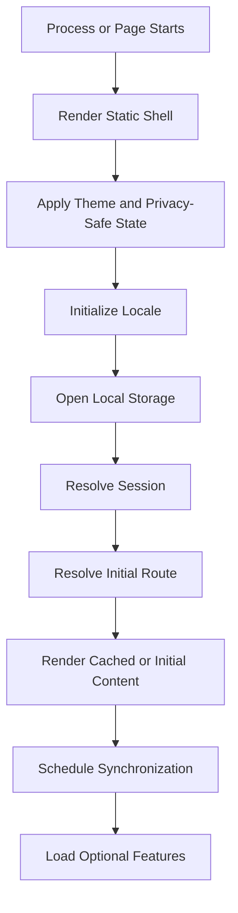
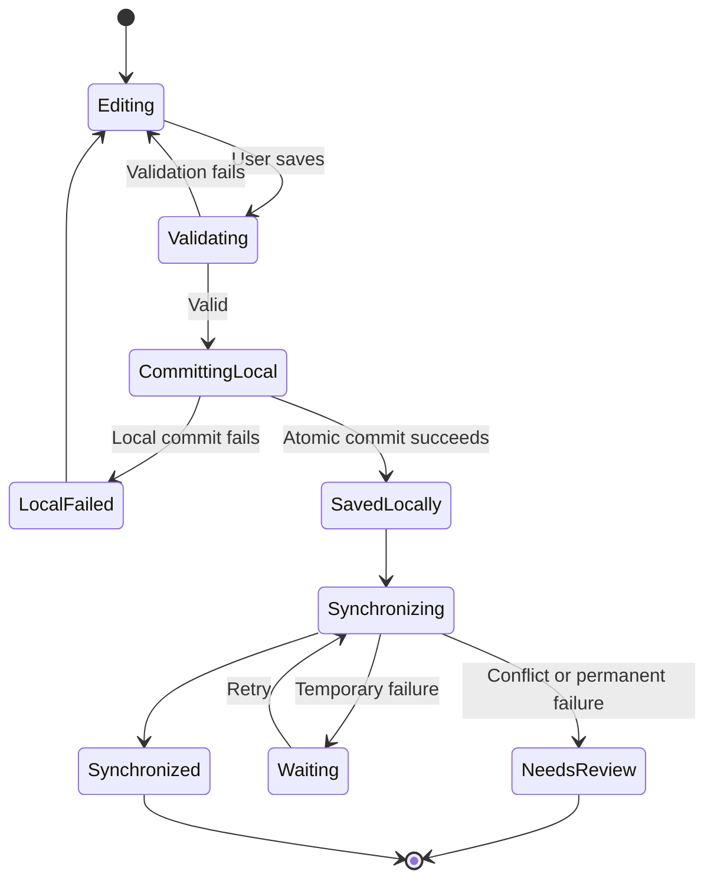
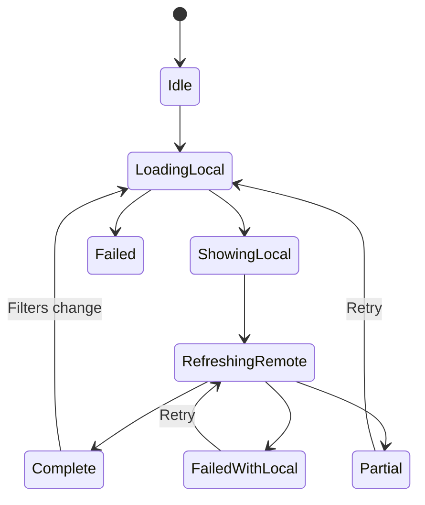
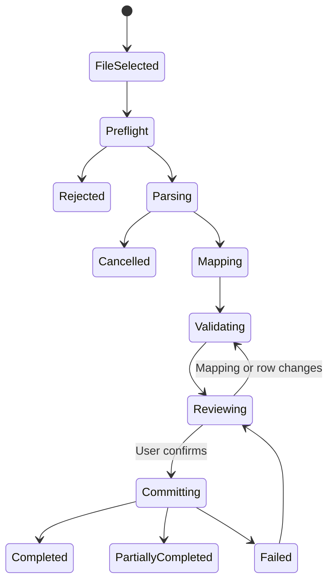
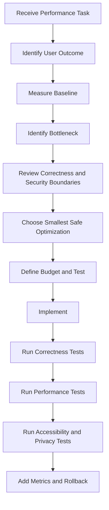

# Nexio Performance and Reliability Specification

Version: 1.0  
Status: Official  
Authority Level: Performance, Efficiency and Runtime Reliability Standard  
Applies To: Web, Desktop, Tablet, Mobile, Android, Supabase, Local Storage, Service Worker, Synchronization, Reports, Imports, Exports and Assistant

---

# Purpose

This document defines the official performance and runtime-reliability architecture of Nexio.

It establishes requirements for:

- Application startup
- Route loading
- Rendering
- User-input responsiveness
- Financial calculation performance
- Network efficiency
- Database-query efficiency
- Local-storage efficiency
- Synchronization performance
- Memory use
- CPU use
- Battery use
- Background work
- Large data sets
- Reports and Charts
- Imports and Exports
- Attachments
- Assistant latency
- Service Worker behavior
- Android WebView performance
- Performance budgets
- Graceful degradation
- Runtime recovery
- Monitoring
- Capacity planning
- Regression testing
- Release governance
- AI implementation restrictions

Nexio must remain responsive and financially correct under:

```text
Slow networks

Offline operation

Large Transaction histories

Low-memory devices

Background and foreground transitions

Concurrent synchronization

Partial service outages

Provider latency

Database contention

Application upgrades

Long-running sessions
```

Performance optimization must never weaken:

- Financial accuracy
- Ownership isolation
- Security
- Privacy
- Accessibility
- Durable local persistence
- Synchronization correctness
- User confirmation

---

# Relationship with Other Documents

This document must be interpreted together with:

```text
docs/00-FOUNDATION.md
docs/01-ARCHITECTURE.md
docs/02-DESIGN-SYSTEM.md
docs/03-DESKTOP.md
docs/04-TABLET.md
docs/05-MOBILE.md
docs/06-DATA-MODEL.md
docs/07-SECURITY.md
docs/08-OFFLINE-AND-SYNC.md
docs/09-TESTING.md
docs/10-DEPLOYMENT-AND-OPERATIONS.md
docs/11-INTERNATIONALIZATION-AND-CONTENT.md
docs/12-ASSISTANT-AND-AI.md
docs/13-PRIVACY-AND-DATA-GOVERNANCE.md
docs/14-ACCESSIBILITY.md
```

Responsibilities are divided as follows:

| Document | Responsibility |
|---|---|
| `00-FOUNDATION.md` | Product trust and financial-correctness principles |
| `01-ARCHITECTURE.md` | Dependency direction and module responsibilities |
| `02-DESIGN-SYSTEM.md` | Efficient reusable visual components |
| `03-DESKTOP.md` | Desktop layout and interaction |
| `04-TABLET.md` | Tablet adaptation |
| `05-MOBILE.md` | Mobile and Android behavior |
| `06-DATA-MODEL.md` | Canonical financial entities and calculations |
| `07-SECURITY.md` | Secure runtime behavior |
| `08-OFFLINE-AND-SYNC.md` | Local-first persistence and synchronization |
| `09-TESTING.md` | Test architecture and performance verification |
| `10-DEPLOYMENT-AND-OPERATIONS.md` | Production monitoring and capacity operations |
| `11-INTERNATIONALIZATION-AND-CONTENT.md` | Locale-safe formatting and content loading |
| `12-ASSISTANT-AND-AI.md` | Assistant latency and cost boundaries |
| `13-PRIVACY-AND-DATA-GOVERNANCE.md` | Data-minimization and retention effects |
| `14-ACCESSIBILITY.md` | Performance under accessibility conditions |
| `15-PERFORMANCE-AND-RELIABILITY.md` | Runtime speed, efficiency, degradation and capacity |

Performance requirements must preserve all stronger Domain, Security, Privacy and Accessibility requirements.

---

# Current Project Performance Anchors

The current repository contains performance-sensitive implementation points such as:

```text
index.html
app.js
nexio-v2.css
styles.css
i18n.js
mobile-capacitor.js
supabase-config.js
supabase-schema.sql
vercel.json
android/
android-web/
js/core/
js/ui/
css/mobile.css
css/tablet.css
```

Recommended responsibility:

| Location | Performance Responsibility |
|---|---|
| `index.html` | Critical shell, initial resource order and startup markup |
| `app.js` | Application initialization and route orchestration |
| `js/core/` | Efficient Domain services and repository access |
| `js/ui/` | Rendering, interaction and view lifecycle |
| `supabase-schema.sql` | Query indexes, constraints and remote efficiency |
| `supabase-config.js` | Connection and client configuration |
| `mobile-capacitor.js` | Native bridge and lifecycle coordination |
| `android-web/` | Android shell and offline startup |
| `nexio-v2.css` and responsive CSS | Render cost, layout and responsive behavior |
| `vercel.json` | Web delivery and caching policy |
| `docs/15-PERFORMANCE-AND-RELIABILITY.md` | Authoritative performance contract |

---

# Performance Constitutional Principles

## Correctness Comes Before Speed

Nexio must not improve response time by:

- Using stale financial totals without disclosure
- Dropping pending operations
- Ignoring conflicts
- Skipping ownership checks
- Skipping validation
- Using floating-point Money
- Marking local saves as synchronized
- Removing confirmation
- Combining currencies
- Hiding failures

A slower correct result is preferable to a fast incorrect financial result.

---

## User Intent Must Become Durable Quickly

After a confirmed offline-capable financial command, Nexio should make the intent durable locally as soon as practical.

The user should not wait for remote synchronization before the interface can safely acknowledge:

```text
Saved on this device
```

Remote confirmation remains a separate state.

---

## The Main Thread Must Remain Responsive

Long work must not block:

- Typing
- Scrolling
- Navigation
- Focus
- Screen-reader interaction
- Privacy controls
- Cancel or Stop actions

Expensive tasks should use:

- Incremental processing
- Background execution
- Web Workers where justified
- Native background facilities where appropriate
- Server-side processing
- Bounded batches

---

## Performance Must Be Measured by User Experience

Internal speed alone is insufficient.

Nexio should measure:

```text
How quickly meaningful content appears

How quickly controls respond

How quickly confirmed intent becomes durable

How quickly errors become understandable

How well the application remains usable under load
```

---

## Performance Must Include Slow and Constrained Devices

A feature is not performant only because it works on a development computer.

Evaluation must include:

- Mid-range Android device
- Low-memory conditions
- Slow CPU
- Slow storage
- High network latency
- Packet loss
- Large data set
- Large text
- Screen reader
- Dark theme
- Long-running session

---

## Performance Must Be Predictable

Users should not experience unexplained changes from:

```text
Immediate

to

Several seconds

to

Timeout
```

for the same ordinary workflow without visible reason.

Performance variance should be monitored.

---

## Loading Must Reflect Real State

Nexio must not use:

- Fake completion percentages
- Arbitrary delay to appear smooth
- Premature success
- Infinite skeletons
- Unbounded spinners

When work is long, explain the phase and provide safe cancellation where possible.

---

## Partial Results Must Be Explicit

When only local or partial data is available:

```text
Showing information saved on this device.
```

A partial fast result must not be presented as complete synchronized truth.

---

## Optimization Must Be Evidence-Based

Before implementing a complex optimization, identify:

- Measured bottleneck
- User impact
- Baseline
- Target
- Risk
- Expected improvement
- Verification method
- Rollback path

---

## Performance Improvements Must Preserve Accessibility

Optimization must not:

- Remove semantic elements
- Delay focus
- Hide content from screen readers
- Use inaccessible canvas-only rendering
- Prevent text wrapping
- Truncate exact values
- Announce every loading increment
- Disable zoom

---

## Performance Improvements Must Preserve Privacy

Optimization must not introduce:

- Shared private caches
- Unscoped persisted responses
- Raw financial telemetry
- Permanent temporary files
- Cross-owner memory reuse
- Provider overcollection

---

## Background Work Must Be Bounded

Every background process requires:

- Trigger
- Maximum work
- Priority
- Cancellation or pause behavior
- Retry policy
- Battery policy
- Network policy
- User-visible state where relevant

---

## Degraded Mode Must Preserve Core Financial Access

When optional systems fail, users should retain access to:

- Saved Accounts
- Saved Transactions
- Manual creation
- Local calculations
- Pending synchronization
- Export where technically available
- Privacy and security controls

Optional features must not block core financial records.

---

# Performance Goals

Nexio performance architecture must ensure:

```text
Fast application startup

Fast first meaningful financial content

Responsive forms

Responsive navigation

Efficient large lists

Predictable local saves

Efficient synchronization

Bounded memory

Controlled battery use

Efficient remote queries

Safe background processing

Graceful provider failure

Observable regressions

Scalable data growth
```

---

# Performance Terminology

## Cold Start

Application startup without an active process or warm resource state.

## Warm Start

Application startup when some process, cache or runtime state remains available.

## First Meaningful Content

The first screen state that provides useful authenticated or unauthenticated information.

## Interaction Latency

Time between user input and visible or semantic response.

## Input Responsiveness

Ability to type, scroll, navigate or focus without noticeable blocking.

## Long Task

Main-thread work long enough to delay interaction materially.

## Throughput

Amount of work completed during a period.

Examples:

- Transactions synchronized per minute
- Import rows validated per second
- Export records processed per second

## Tail Latency

Slow response behavior at higher percentiles such as:

```text
p95

p99
```

Average latency alone may hide serious user impact.

## Performance Budget

An approved maximum for:

- Time
- Size
- Memory
- Queries
- Requests
- CPU
- Battery
- Storage

## Graceful Degradation

Preserving safe core functionality while reducing optional capability during failure or resource pressure.

## Backpressure

Mechanisms preventing producers from generating more work than consumers can process safely.

---

# Performance Responsibility Model

Recommended roles:

```text
Performance Owner

Feature Owner

Frontend Owner

Android Owner

Data Owner

Backend Owner

Synchronization Owner

Operations Owner

Quality Owner

Release Owner
```

---

# Performance Owner

Responsible for:

- Performance budgets
- Measurement standards
- Regression review
- Cross-feature optimization
- Device test matrix
- Capacity reporting
- Performance exceptions

---

# Feature Owner

Responsible for:

- Feature-specific budgets
- Large-data behavior
- Loading and error states
- Query scope
- Rendering strategy
- User-visible degradation

---

# Frontend Owner

Responsible for:

- Startup
- Bundles
- Rendering
- Interaction latency
- DOM size
- Memory cleanup
- Browser caching
- Service Worker behavior

---

# Android Owner

Responsible for:

- WebView startup
- Native bridge cost
- Process lifecycle
- Memory pressure
- Battery
- Background work
- Network policy
- Application package size

---

# Data Owner

Responsible for:

- Query shape
- Index requirements
- Aggregation rules
- Pagination
- Data-growth estimates
- Retention impact

---

# Synchronization Owner

Responsible for:

- Queue throughput
- Pull and push batching
- Retry
- Backpressure
- Reconciliation
- Checkpoint efficiency
- Realtime event handling

---

# Operations Owner

Responsible for:

- Production metrics
- Capacity
- Alerts
- Provider latency
- Database health
- Cost
- Incident response

---

# Performance Budget Architecture

Performance budgets should be maintained for:

```text
Application shell

Route transition

User interaction

Financial command

Local storage

Remote API

Database query

Synchronization

Report calculation

Import

Export

Assistant

Android package

Memory

Battery
```

---

# Budget Categories

Recommended:

```text
Critical

Target

Warning

Maximum
```

---

# Critical Budget

Crossing this threshold creates unacceptable user or correctness risk.

Examples:

- Main thread frozen during Save
- Local durable Save delayed excessively
- Memory crash
- Export generation affecting other users
- Database query timeout for ordinary list

---

# Target Budget

Normal healthy performance objective.

---

# Warning Budget

Indicates degradation requiring review before release or continued rollout.

---

# Maximum Budget

The highest permitted value before feature disablement, rollback or architectural correction.

---

# Initial Budget Philosophy

Exact numeric budgets should be finalized through measurement on supported devices.

Until validated, teams must define relative expectations such as:

```text
Immediate:
Visual control response

Fast:
Local route and cached content

Moderate:
Remote refresh and ordinary Report

Long-running with progress:
Large Import, Export or reconciliation
```

No workflow may remain without a measurable target.

---

# Core Interaction Budget

Ordinary control activation should provide immediate visible or semantic response.

Examples:

- Button pressed state
- Menu opening
- Toggle state
- Field validation indicator
- Loading state

The final remote result may arrive later.

---

# Local Financial Save Budget

A confirmed local-capable financial command should:

1. Validate.
2. Commit entity and queue operation atomically.
3. Return a durable local state.
4. Render the result.

This path should not depend on:

- Remote API
- Assistant model
- Analytics provider
- Notification provider
- Realtime subscription

---

# Remote Synchronization Budget

Synchronization may complete later.

The UI must distinguish:

```text
Saved locally

Waiting

Synchronizing

Synchronized
```

---

# Startup Performance Architecture

Application startup includes:

```text
Runtime creation

HTML and CSS loading

JavaScript loading

Local schema initialization

Session restoration

Profile restoration

Locale initialization

Theme initialization

Privacy initialization

Route resolution

Initial data loading

Synchronization scheduling
```

---

# Startup Critical Path

Only work required to produce the first safe screen should remain on the critical path.

Potential critical tasks:

```text
Load application shell

Apply theme

Apply locale

Apply privacy-safe default

Resolve basic authentication state

Open local storage

Resolve initial route
```

Potential non-critical tasks:

```text
Optional Analytics

Assistant provider initialization

Large Report precomputation

Attachment metadata refresh

Background reconciliation

Non-visible route bundles
```

---

# Startup Sequence

Conceptual:



---

# Privacy-Safe Startup

Before Profile and privacy preferences are fully restored, Nexio must avoid briefly displaying exact financial values.

Preferred behavior:

```text
Protected placeholder

or

No financial content until privacy state is resolved
```

Avoid:

```text
Exact values flash before Privacy mode loads.
```

---

# Theme Startup

Apply theme before major content paint where practical to avoid:

- Light-to-dark flash
- Layout shift
- Unnecessary repaint
- Accessibility contrast instability

---

# Locale Startup

Core locale resources should be bundled or available early enough to avoid:

- Raw translation keys
- Mixed language
- Layout relayout
- Inaccessible unlabeled shell

---

# Session Restoration

Session restoration should be bounded.

The application should not display an infinite startup spinner while waiting for a remote authentication service.

Potential states:

```text
Restoring session

Offline session available

Sign-in required

Authentication service unavailable
```

---

# Local Storage Opening

Opening local storage may include:

- Database connection
- Schema check
- Migration
- Owner namespace selection
- Integrity validation

Large migrations must not run invisibly without progress or recovery behavior.

---

# Startup Data Strategy

Prefer:

```text
Render trusted cached data

then

Refresh remotely
```

when ownership, schema and freshness policies allow.

The cached state must identify whether synchronization is pending.

---

# Startup Synchronization

Do not place complete synchronization before first usable screen unless correctness requires it.

Schedule synchronization after the shell and local content become usable.

---

# Optional Feature Deferral

Delay initialization of:

- Assistant
- Complex Charts
- Export libraries
- Import parsers
- Attachment preview
- Optional Analytics

until needed or idle.

---

# Route-Based Loading

Feature code should load according to route or capability when practical.

Examples:

```text
Import parser:
Load on Import route

Chart library:
Load on Report route

Assistant client:
Load when Assistant opens
```

---

# Preloading

Preload only when evidence shows benefit.

Potential safe preloads:

- Likely next route
- Critical font subset
- Core translation resource
- Shared component code

Uncontrolled preloading increases:

- Bandwidth
- Memory
- CPU
- Battery
- Startup contention

---

# Startup Failure

When startup fails:

- Preserve a minimal usable shell where possible.
- Explain whether local data remains available.
- Offer Retry.
- Offer safe sign-out when relevant.
- Record safe diagnostic.
- Avoid reload loops.

---

# Startup Loop Prevention

A failed migration or corrupted cache must not cause infinite reload.

Use:

- Attempt counter
- Safe mode
- Cache reset option
- Migration quarantine
- Recovery screen

---

# Application Shell Performance

The shell should remain small and stable.

It should contain:

- Core navigation structure
- Theme and typography
- Loading and error components
- Authentication transition
- Route outlet

It should not contain all feature data and libraries.

---

# JavaScript Budget

JavaScript affects:

- Download
- Parse
- Compilation
- Execution
- Memory

Review:

- Initial bundle
- Route bundles
- Duplicate dependencies
- Dead code
- Polyfills
- Source maps
- Large libraries
- Locale data

---

# CSS Budget

CSS affects:

- Download
- Style calculation
- Recalculation
- Layout
- Paint

Avoid:

- Excessively broad selectors
- Deep selector chains
- Large unused styles
- Layout-triggering animations
- Repeated platform overrides without ownership

---

# Font Performance

Fonts should:

- Use approved formats
- Use limited weights
- Avoid blocking readable content unnecessarily
- Provide appropriate fallback
- Preserve financial-number readability
- Avoid layout instability

---

# Image Performance

Images should use:

- Appropriate dimensions
- Compression
- Lazy loading where safe
- Responsive sources where useful
- No oversized decorative assets

Critical financial content must not depend on image loading.

---

# Rendering Architecture

Rendering performance includes:

```text
DOM creation

Style calculation

Layout

Paint

Composite

Event handling

State propagation
```

---

# Render Responsibility

A state change should update only the affected view area where practical.

Avoid rebuilding the entire application shell for:

- One Transaction update
- One filter change
- One synchronization state
- One privacy toggle
- One notification update

---

# DOM Size

Large DOM trees increase:

- Memory
- Layout cost
- Screen-reader navigation burden
- Style calculation
- Event complexity

Long lists should use:

- Pagination
- Incremental rendering
- Carefully tested virtualization
- Collapsed sections

---

# Virtualization Accessibility

Virtualization may improve large-list performance but can damage:

- Screen-reader reading
- Browser find
- Focus stability
- Item count understanding
- Keyboard navigation

Use virtualization only with:

- Stable semantic strategy
- Total-count information
- Focus preservation
- Tested screen-reader behavior
- Non-virtualized detail access

---

# List Rendering

For ordinary list sizes, prefer simpler pagination or incremental loading over complex virtualization.

---

# Stable Keys

Rendered financial entities require stable keys based on canonical identity.

Do not use array position when:

- Items reorder
- Filters change
- Synchronization updates
- Items are inserted or deleted

Unstable keys may cause:

- Focus loss
- Wrong item reuse
- Input corruption
- Animation errors
- Accessibility confusion

---

# Layout Stability

Avoid unexpected layout movement caused by:

- Late font loading
- Images without dimensions
- Loading placeholders with wrong size
- Error text insertion without space strategy
- Dynamic navigation height
- Amount formatting changes

---

# Financial Value Layout

Money values may vary in length due to:

- Currency
- Locale
- Negative sign
- Large amount
- Privacy mode

Layouts must accommodate expansion without repeated expensive reflow or truncation.

---

# Chart Rendering

Charts can be CPU and memory intensive.

Requirements:

- Load Chart library only where needed.
- Limit rendered points.
- Aggregate by period where appropriate.
- Avoid unnecessary animation.
- Provide accessible table.
- Dispose chart instances.
- Avoid redraw on unrelated state changes.

---

# Canvas and SVG

## SVG

May provide richer semantics but can create large DOM trees.

## Canvas

May render large data efficiently but requires an accessible alternative.

The choice must consider:

- Point count
- Interaction
- Accessibility
- Memory
- Export
- Responsive behavior

---

# Rendering During Privacy Toggle

Privacy mode should update protected values efficiently without:

- Reloading the route
- Re-querying remote data
- Losing focus
- Recreating Charts unnecessarily
- Exposing exact values during transition

---

# Form Performance

Forms must remain responsive during:

- Money parsing
- Validation
- Searchable selection
- Category filtering
- Date calculation
- Draft persistence

---

# Input Event Performance

Avoid expensive operations on every keystroke.

Potential strategy:

```text
Immediate local raw-state update

Lightweight parsing

Deferred expensive validation

Submit-time Domain validation
```

---

# Debouncing

Debounce may be appropriate for:

- Search
- Remote suggestion
- Filter preview
- Assistant prompt suggestion

It should not make ordinary typing appear delayed.

---

# Search Cancellation

When a new Search query replaces an old one:

- Cancel stale request where possible.
- Ignore stale results.
- Preserve input.
- Avoid result flicker.
- Avoid duplicate Analytics.

---

# Validation Performance

Client validation should remain fast.

Remote validation should:

- Show pending state
- Be cancellable when stale
- Not block unrelated fields
- Use stable error mapping

---

# Draft Persistence

Persist drafts with bounded frequency.

Avoid writing to storage on every character when unnecessary.

Potential strategies:

- Debounced save
- Save on blur
- Save after material change
- Save before backgrounding

---

# Navigation Performance

Route transitions should provide immediate feedback.

Potential sequence:

```text
Activate route

Show heading or skeleton

Load local data

Render

Refresh remotely
```

---

# Route State Preservation

Returning from details to a list should preserve where appropriate:

- Filters
- Sort
- Scroll position
- Selected period
- Privacy mode
- Search query

State preservation should not retain unauthorized prior-owner data.

---

# Back Navigation Performance

Back navigation should not require full application restart.

Android System Back and browser history must cooperate with route state.

---

# Main-Thread Work

Potential expensive tasks:

- Large JSON parsing
- Import validation
- Export generation
- Report aggregation
- Encryption
- Image processing
- Local migrations
- Conflict reconciliation

Move or divide work when it blocks interaction.

---

# Long-Task Handling

Long tasks should:

- Run in chunks
- Yield to the interface
- Support cancellation where safe
- Report actual progress where available
- Preserve partial durable work only according to policy

---

# Web Worker Use

Web Workers may be appropriate for:

- CSV parsing
- Large validation
- Report aggregation
- File hashing
- Compression
- Encryption

Worker messages must:

- Use strict schemas
- Avoid unnecessary data copies
- Avoid exposing secrets
- Support cancellation
- Handle version mismatch

---

# Worker Ownership

Workers processing owner data must be terminated or reset after:

- Sign-out
- Account switch
- Account deletion
- Fatal error

---

# Memory Architecture

Memory must remain bounded across:

```text
Long sessions

Route changes

Large lists

Chart creation

Assistant conversations

Import preview

Attachment preview

Synchronization
```

---

# Memory Leak Sources

Potential sources:

- Event listeners not removed
- Realtime subscriptions not closed
- Timers not cancelled
- Observers not disconnected
- Chart instances not destroyed
- Large arrays retained in closures
- Blob URLs not revoked
- Native plugin listeners not removed
- Stale Assistant contexts
- Prior-owner caches

---

# Route Cleanup

Every route should dispose:

```text
Subscriptions

Observers

Timers

Abort controllers

Temporary object URLs

Large view models

Native listeners
```

---

# Account Switch Memory Cleanup

Account switch must remove:

- Prior-owner entity caches
- Prior-owner Assistant context
- Prior-owner search results
- Prior-owner report data
- Prior-owner Notification state
- Prior-owner Realtime subscriptions

---

# Attachment Memory

Large image or PDF preview should:

- Avoid decoding full resolution unnecessarily
- Release object URLs
- Release canvas buffers
- Avoid keeping several full previews
- Respect device memory

---

# Assistant Memory

Assistant conversation rendering should:

- Limit active DOM messages
- Summarize or paginate older history where supported
- Release old structured context
- Preserve privacy and conversation semantics

---

# Network Performance Architecture

Network efficiency must consider:

```text
Request count

Payload size

Latency

Retries

Cancellation

Caching

Compression

Authentication

Offline behavior

Provider limits
```

---

# Network Request Principles

- Request only required fields.
- Use pagination.
- Use aggregation.
- Avoid duplicate requests.
- Cancel stale requests.
- Deduplicate concurrent identical requests.
- Use bounded retries.
- Respect offline state.
- Avoid polling when Realtime or explicit refresh is more appropriate.

---

# Request Deduplication

Concurrent components requesting the same resource should share or coordinate work where safe.

Deduplication keys must include relevant scope:

```text
Owner

Entity

Filters

Period

Currency

Version
```

---

# Request Cancellation

Use cancellation for:

- Route change
- Search replacement
- Account switch
- Sign-out
- Dialog close
- Assistant Stop
- Import cancellation

A cancelled request must not render stale data later.

---

# Stale Response Protection

Every response should be checked against:

- Active owner
- Active route
- Request identity
- Current filters
- Current locale where presentation is involved
- Current entity version where relevant

---

# Retry Architecture

Retries should apply only when:

- Error is retryable.
- Request is safe to repeat.
- Attempt limit exists.
- Backoff exists.
- Jitter exists where appropriate.
- User impact remains controlled.

---

# Mutation Retry

Mutations require idempotency.

A retry must preserve:

- Operation ID
- Command identity
- Proposal identity where relevant
- Expected entity version

Never retry an uncertain mutation as a new operation.

---

# Network Backoff

Use bounded exponential backoff for appropriate background operations.

Foreground user actions may use:

- Immediate first retry
- Visible Retry control
- Short bounded automatic recovery

---

# Request Timeout

Every network operation requires a timeout appropriate to its purpose.

Examples:

```text
Interactive query:
Shorter

Large export:
Long-running job rather than one open request

Synchronization batch:
Bounded

Assistant model:
Bounded with Stop
```

---

# Payload Minimization

Avoid sending complete entity collections when the feature needs:

- Count
- Aggregate
- Status
- One page
- One entity summary

---

# Compression

Use transport compression where supported.

Do not compress very small payloads when overhead outweighs benefit.

---

# Caching Architecture

Caching categories:

```text
Public static assets

Translation resources

Owner-scoped local data

Derived local aggregates

Temporary remote responses

Provider results
```

Each category requires a different policy.

---

# Public Asset Caching

Versioned immutable assets may use long-lived caching.

The application shell and Service Worker require careful update behavior.

---

# Private Response Caching

Private financial API responses must not enter shared public caches.

Use appropriate cache-control and owner scope.

---

# Derived Aggregate Caching

A local Report aggregate may be cached with:

- Owner
- Period
- Currency
- Filter hash
- Source version
- Calculation version

It must invalidate after relevant entity change.

---

# Cache Invalidation

Invalidation triggers may include:

- Transaction create or update
- Transaction deletion
- Transfer change
- Account archive
- Category merge
- Goal contribution
- Synchronization pull
- Conflict resolution
- Currency or time-zone policy change
- Account switch

---

# Cache Stampede Prevention

When several components request an expired resource:

- Share the refresh.
- Serve safe stale data when policy permits.
- Avoid many simultaneous remote queries.

---

# Stale-While-Revalidate

May be used when:

- Cached data is owner-scoped.
- Staleness is disclosed when material.
- Financial correctness remains acceptable.
- Conflicts and pending state remain represented.
- Refresh does not overwrite newer local intent.

---

# Offline Network Detection

Browser or device network indicators are hints.

A reported online state does not guarantee service reachability.

Use actual request results for service status.

---

# Database Performance Architecture

Database performance must preserve:

- Ownership enforcement
- Constraint validation
- Exact Money
- Version checks
- Audit requirements
- RLS

---

# Query Principles

Remote queries should:

- Filter by owner through trusted policy.
- Select needed columns.
- Use stable ordering.
- Use pagination.
- Use supported indexes.
- Avoid unbounded result sets.
- Avoid client-side joining of large collections.
- Avoid N+1 queries.

---

# Pagination Strategy

Potential strategies:

```text
Cursor pagination

Keyset pagination

Limited offset pagination
```

Large Transaction histories should prefer stable cursor or keyset approaches where practical.

---

# Stable Sort

Pagination requires deterministic ordering.

Example:

```text
transaction_date descending

created_at descending

transaction_id descending
```

---

# N+1 Query Prevention

Avoid loading:

1. Transaction page
2. Account separately for every row
3. Category separately for every row

Use approved joins, views, materialized summaries or batched lookups while preserving RLS.

---

# Aggregate Queries

Reports should prefer server or optimized local aggregate services when raw record transfer would be excessive.

Aggregate result must retain:

- Currency
- Period
- Filter scope
- Status policy
- Data coverage

---

# Index Architecture

Potential index dimensions:

```text
owner_id

transaction_date

account_id

category_id

type

status

updated_at

deleted_at

sync version
```

Indexes should match actual query patterns.

---

# Index Cost

Indexes improve reads but increase:

- Write cost
- Storage
- Migration time
- Maintenance
- Backup size

Every index should have a documented query purpose.

---

# Composite Index

Composite indexes should follow real filter and sort order.

Example concept:

```text
owner_id + transaction_date + transaction_id
```

for owner-scoped chronological pagination.

---

# Query Plan Review

High-volume or slow queries require query-plan review.

Verify:

- Index use
- Estimated rows
- Join strategy
- Sort cost
- RLS effect
- Sequential scans
- Memory
- Lock behavior

---

# RLS Performance

RLS must not be disabled for performance.

Instead:

- Optimize policy predicates.
- Use indexed owner columns.
- Avoid unstable expensive policy functions.
- Test realistic owner data.
- Review query plans under RLS.

---

# Database Function Performance

Functions or RPCs should:

- Validate owner context
- Use bounded work
- Use indexes
- Avoid dynamic SQL unless strictly governed
- Return minimal fields
- Have timeout behavior
- Be versioned

---

# Database Connection Efficiency

Client and server components should:

- Reuse approved clients
- Avoid reconnecting for every query
- Respect provider connection limits
- Avoid opening parallel uncontrolled sessions

---

# Realtime Performance

Realtime subscriptions should be:

- Owner-scoped
- Feature-scoped
- Open only while needed
- Closed after route or session change
- Deduplicated
- Backpressure-aware

---

# Realtime Event Coalescing

Several rapid events may be coalesced into one refresh where safe.

Do not refetch the complete database after every small event.

---

# Realtime Gap Recovery

Realtime is not the only source of truth.

After reconnect:

- Pull changes from checkpoint.
- Detect missed events.
- Avoid duplicate application.
- Update relevant caches.

---

# Local Storage Performance Architecture

Local storage may contain:

```text
Entities

Indexes

Queue

Conflicts

Drafts

Checkpoints

Cached aggregates

Assistant history
```

---

# Local Query Principles

Local repositories should:

- Use indexes.
- Avoid loading all records.
- Paginate.
- Use owner namespace.
- Return minimal projections.
- Support cancellation where practical.
- Avoid repeated serialization.

---

# IndexedDB Indexes

Potential indexes:

```text
ownerId

transactionDate

accountId

categoryId

type

syncStatus

updatedAt

deletedAt
```

Index design should match local queries.

---

# Local Aggregate Strategy

For ordinary data volume, calculate from indexed local records.

For large volume, consider:

- Incremental aggregates
- Cached summaries
- Worker calculation
- Versioned invalidation

Do not store opaque totals without source-version tracking.

---

# Local Write Atomicity

A confirmed mutation and its synchronization operation should commit atomically where architecture permits.

Performance optimization must not split this into unsafe independent writes.

---

# Local Write Batching

Batch related writes when:

- They belong to one atomic command.
- It reduces transaction overhead.
- Failure remains understandable.
- Memory remains bounded.

---

# Local Migration Performance

Migrations should:

- Be versioned.
- Use bounded steps.
- Avoid loading entire stores into memory.
- Support interruption and resume where possible.
- Preserve owner isolation.
- Show progress for long operations.
- Keep backup or recovery strategy.

---

# Migration Locking

During required migration:

- Prevent incompatible writes.
- Keep safe read behavior where possible.
- Avoid multiple tabs running the same migration.
- Use an owner or database migration lock.

---

# Multi-Tab Coordination

Web instances may run in several tabs.

Coordinate:

- Migration
- Synchronization
- Queue processing
- Session changes
- Account deletion
- Cache invalidation

Avoid duplicate expensive work.

---

# Leader Coordination

Where appropriate, one tab may coordinate:

- Background synchronization
- Retention cleanup
- Realtime connection
- Migration

Leadership must recover after tab closure.

---

# Storage Quota

Monitor local storage pressure.

Potential responses:

```text
Remove expired caches

Remove old temporary files

Compact tombstones after safe period

Reduce Assistant history

Warn user before offline capability is affected
```

Do not silently delete unsynchronized financial intent.

---

# Storage Quota Failure

When durable local save fails:

- Do not claim Save.
- Preserve form or proposal.
- Explain storage problem.
- Offer cleanup or export where possible.
- Record safe diagnostic.
- Avoid repeated failing writes.

---

# Service Worker Performance

The Service Worker may support:

- Asset caching
- Offline shell
- Update coordination
- Network strategy
- Background synchronization where supported

---

# Service Worker Principles

- Cache only approved assets.
- Avoid caching private responses globally.
- Version caches.
- Delete obsolete caches.
- Avoid intercepting requests unnecessarily.
- Avoid update loops.
- Preserve current session behavior.

---

# Service Worker Install

Installation should cache only critical offline assets first.

Optional assets may load later.

---

# Service Worker Activation

Activation must avoid:

- Breaking active forms
- Reloading during confirmed command
- Mixing incompatible application and local schemas
- Removing required current-version assets too early

---

# Service Worker Update

Update behavior should distinguish:

```text
Update downloaded

Update ready

Restart required

Critical update required
```

The user should not lose unsaved work.

---

# Service Worker Cache Size

Track:

- Cache version
- Asset count
- Total size
- Obsolete cache cleanup
- Failed cache writes

---

# Service Worker Failure

When unavailable:

- Online Web use should continue where possible.
- Offline capability may degrade clearly.
- The application should not enter reload loops.
- Users should receive safe recovery guidance.

---

# Reliability Architecture

Runtime reliability means Nexio continues to behave correctly despite:

- Temporary failure
- Resource pressure
- Stale response
- Duplicate event
- Interrupted work
- Provider outage
- Process death
- Network transition
- Partial migration
- User retry

---

# Reliability Patterns

Recommended:

```text
Idempotency

Timeout

Retry with backoff

Cancellation

Checkpoint

Atomic local commit

Circuit breaker

Bulkhead

Fallback

Backpressure

Health state

Reconciliation
```

---

# Idempotency

Commands that may repeat must have stable identity.

Examples:

- Synchronization operation
- Export request
- Account deletion step
- Assistant confirmed command
- Import batch commit
- Attachment upload completion

---

# Timeout

No external operation may wait indefinitely.

Timeout should lead to:

- Retryable state
- Unknown-outcome state
- User action
- Safe fallback

---

# Circuit Breaker

Repeated provider failure may temporarily stop new calls.

Potential targets:

- Assistant provider
- Notification provider
- Export worker
- Attachment analysis
- Remote synchronization endpoint

Core manual workflows should remain available.

---

# Bulkhead

Failure in one optional capability should not exhaust all application resources.

Examples:

- Large Export must not block Transaction saves.
- Assistant outage must not block Reports.
- Attachment upload must not block synchronization queue.
- Analytics failure must not block startup.

---

# Backpressure

When queues grow:

- Reduce batch size.
- Pause optional work.
- Avoid loading all operations into memory.
- Prioritize user-confirmed financial commands.
- Surface meaningful status.
- Alert operations.

---

# Priority Classes

Recommended runtime priorities:

```text
Critical user command

Interactive read

Synchronization of confirmed intent

Security and authentication

Visible Report

Background refresh

Optional insight

Analytics

Prefetch
```

---

# Graceful Degradation Levels

Recommended:

```text
Full

Reduced

Local-only

Read-only

Protected safe mode

Unavailable
```

---

# Full Mode

All supported capabilities operate.

---

# Reduced Mode

Optional capabilities are disabled or delayed.

Examples:

- No animations
- No Assistant
- No background prefetch
- Reduced chart detail

---

# Local-Only Mode

Local records and local calculations remain available.

Remote synchronization is unavailable.

---

# Read-Only Mode

Used when writes cannot be accepted safely.

The UI must explain:

- Why
- What remains available
- Whether drafts can be preserved
- When Retry is possible

---

# Protected Safe Mode

Used after:

- Failed migration
- Corrupt cache
- Repeated startup failure
- Version incompatibility

Potential capabilities:

- Sign in
- Export recoverable local data
- Clear cache
- Contact support
- Retry migration

---

# Unavailable Mode

Used only when no safe capability remains.

Provide:

- Clear status
- Retry
- Support reference
- No false preservation claim

---

# Failure Isolation

A failure in:

```text
Assistant

Analytics

Chart

Notification

Attachment preview
```

must not normally break:

```text
Transaction list

Transaction form

Local save

Account access

Privacy controls
```

---

# Performance and Reliability Anti-Patterns

The following are prohibited:

## Remote Before Local Save

Waiting for remote synchronization before acknowledging a durable local-capable command.

## Whole Database Load

Loading every Transaction for an ordinary list or summary.

## Unbounded Query

Requesting all records without limit or period.

## N+1 Financial List

Querying Account and Category separately for every Transaction row.

## Main-Thread Import

Parsing and validating a large file in one blocking operation.

## Whole-App Rerender

Rebuilding the entire application after one entity change.

## Virtualization Without Accessibility Review

Optimizing a list while making screen-reader access incomplete.

## Index Without Query Purpose

Adding indexes without measured query need.

## RLS Removal for Speed

Weakening owner isolation to reduce query time.

## Retry Without Idempotency

Repeating uncertain financial mutations with new identity.

## Infinite Loading

Leaving a spinner without timeout or recovery.

## Fake Progress

Displaying invented percentages.

## Duplicate Provider Initialization

Initializing Assistant, Analytics or Realtime clients repeatedly.

## Stale Response Rendering

Showing results from a previous Account, route or Search.

## Shared Private Cache

Caching owner-specific responses without owner scope.

## Optional Provider in Startup Critical Path

Blocking application startup on Assistant or Analytics availability.

## Unbounded Realtime Refresh

Reloading all financial data after every event.

## Memory Leak Across Accounts

Retaining prior-owner data after account switch.

## Exact Value Flash

Rendering protected financial values before Privacy mode loads.

## Animation for Every Update

Animating large lists or Charts during frequent synchronization.

## Cache Without Version

Reusing aggregates after Domain or calculation changes.

## Quota Cleanup of Pending Intent

Deleting unsynchronized financial operations to free storage.

## Performance by Removing Validation

Skipping Domain validation to reduce latency.

## Performance by Hiding State

Calling local save synchronized to make the workflow appear faster.

---

# Part 1 Performance Review Questions

Before implementing a feature, answer:

```text
What is the user-visible performance target?

What is on the critical path?

Which work can be deferred?

Which data volume is expected?

Which data volume is the stress case?

Which queries are used?

Which indexes support them?

Which work runs on the main thread?

Which work can be cancelled?

Which caches exist?

How are caches invalidated?

What happens offline?

What happens under memory pressure?

What happens when the provider fails?

What happens after Account switch?
```

---

# Startup Review Questions

```text
Which resources block first meaningful content?

Can theme and privacy state apply earlier?

Can local content render before synchronization?

Which optional features are deferred?

What happens when session restoration times out?

What happens when local migration fails?

Can startup enter a loop?
```

---

# Rendering Review Questions

```text
How many DOM nodes are created?

Does one entity update rerender unrelated content?

Are list keys stable?

Does the layout shift?

Does large text increase render cost safely?

Are Chart instances disposed?

Does privacy toggle require remote data?
```

---

# Network Review Questions

```text
Which fields are requested?

Is the query paginated?

Can requests be deduplicated?

Can stale requests be cancelled?

Which timeout applies?

Which retry applies?

Is mutation idempotent?

Can cached data be shown safely?
```

---

# Database Review Questions

```text
Which owner-scoped query pattern is used?

Which index supports filter and order?

Does RLS use indexed predicates?

Is the result bounded?

Is an aggregate preferable?

Is there an N+1 pattern?

How does the query perform with large owner data?
```

---

# Local Storage Review Questions

```text
Which stores are read?

Which indexes are used?

Is the result bounded?

Does the write remain atomic?

What happens when quota is full?

What happens during migration?

What happens in several tabs?

What is removed after Account switch?
```

---

# Reliability Review Questions

```text
Which failures are retryable?

Which operations require idempotency?

Which state represents unknown outcome?

Which circuit breaker applies?

Which capability can degrade independently?

Which data must survive process death?

Which safe mode exists?
```

---

# Part 1 Acceptance Criteria

The performance and reliability foundation is accepted only when:

```text
□ Financial correctness remains stronger than speed.

□ Confirmed local-capable commands become durable without remote dependency.

□ Main-thread work remains bounded.

□ Performance is measured through user-visible outcomes.

□ Constrained devices are included in testing.

□ Partial data is disclosed.

□ Performance optimization is evidence-based.

□ Accessibility and Privacy remain intact during optimization.

□ Background work has bounded execution.

□ Core financial access survives optional-provider failure.

□ Performance roles and owners are defined.

□ Budgets exist for startup, interactions, storage, network and large workflows.

□ Startup critical path contains only required work.

□ Theme, locale and privacy-safe state initialize early.

□ Optional Analytics and Assistant initialization are deferred.

□ Local content may render before remote refresh when safe.

□ Startup failures avoid reload loops.

□ Initial JavaScript, CSS, font and image costs are governed.

□ Feature code may load by route or capability.

□ Rendering updates only affected view regions where practical.

□ Large DOM trees are avoided.

□ Virtualization requires accessibility validation.

□ Financial entity rendering uses stable keys.

□ Layout shifts are controlled.

□ Charts load only where needed and are disposed.

□ Privacy toggles do not require remote refetch.

□ Forms remain responsive during parsing and validation.

□ Expensive validation is not executed on every keystroke unnecessarily.

□ Stale Search requests are cancelled or ignored.

□ Draft persistence uses bounded write frequency.

□ Navigation provides immediate feedback.

□ Route state is preserved safely.

□ Long work is chunked or moved away from the main thread.

□ Workers use strict schemas and terminate after owner changes.

□ Route cleanup removes listeners, subscriptions and buffers.

□ Account switching removes prior-owner memory.

□ Network queries request only required data.

□ Remote requests are bounded and cancellable.

□ Concurrent identical requests are deduplicated where safe.

□ Stale responses cannot render after owner or route change.

□ Retries use limits, backoff and idempotency.

□ Private responses never enter shared public caches.

□ Derived caches include owner, filters and source version.

□ Cache invalidation covers relevant Domain mutations.

□ Database queries use stable pagination.

□ N+1 query patterns are prohibited.

□ Aggregate queries preserve Currency, period and coverage.

□ Indexes map to documented query patterns.

□ RLS remains enabled and optimized.

□ Realtime subscriptions are owner- and feature-scoped.

□ Realtime reconnect performs gap recovery.

□ Local repositories use indexes and bounded results.

□ Local writes preserve atomic entity and queue intent.

□ Local migrations avoid unbounded memory use.

□ Multi-tab coordination prevents duplicate migration and synchronization.

□ Storage quota cleanup never deletes unsynchronized intent.

□ Service Worker caches only approved resources.

□ Service Worker updates preserve unsaved work and version compatibility.

□ Runtime reliability uses idempotency, timeout, cancellation and reconciliation.

□ Optional capability failure remains isolated.

□ Graceful-degradation levels are defined.

□ Performance and reliability anti-patterns are prohibited.
```

---

# Performance Foundation Constitutional Rule

Every startup task, render, query, cache, worker, background job and synchronization operation must answer:

```text
Does this deliver the correct authorized financial state within a predictable time while keeping the application responsive, resource-bounded and recoverable under failure?
```

When the answer is uncertain, prefer the architecture that:

- Makes confirmed intent durable locally.
- Loads less code.
- Requests less data.
- Uses pagination.
- Uses deterministic aggregates.
- Cancels stale work.
- Preserves idempotency.
- Yields to user interaction.
- Defers optional capabilities.
- Keeps caches owner-scoped.
- Preserves accessibility.
- Preserves privacy.
- Discloses partial data.
- Degrades optional features first.
- Recovers without duplicating financial state.

Performance is not the appearance of speed.

It is the ability to preserve correct financial behavior while the user, device, network and services are under real-world pressure.

---
---

# Feature Performance Architecture

Every Nexio feature must define performance behavior for:

```text
Initial load

Cached load

Remote refresh

Large data volume

Slow network

Offline mode

Background and foreground transitions

Memory pressure

Partial provider outage

Retry

Cancellation

Account switch

Privacy mode

Large text and accessibility services
```

Feature performance must not be evaluated only through the ordinary online success path.

---

# Feature Performance State Model

Recommended feature states:

```text
idle

loading_local

showing_local

refreshing_remote

complete

partial

offline

degraded

retrying

failed

cancelled
```

These states must remain separate from:

```text
financial status

synchronization status

authentication status
```

---

# Feature Work Priority

Feature work should be prioritized as follows:

```text
1. Confirmed financial command

2. Authentication and Security action

3. Visible user-requested read

4. Synchronization of durable user intent

5. Visible Report or Chart

6. Background refresh

7. Optional insight

8. Assistant suggestion

9. Analytics

10. Prefetch
```

Low-priority work must yield when higher-priority work begins.

---

# Feature Cancellation

A visible user request should be cancellable when cancellation is safe.

Examples:

```text
Search

Report generation

Import parsing

Export preparation before durable job submission

Attachment preview

Assistant response

Optional background refresh
```

Confirmed durable financial commands must follow their own cancellation contract.

---

# Feature Retry

Retry should:

- Preserve user input.
- Preserve filters.
- Preserve proposal or draft.
- Avoid duplicate operations.
- Use current authentication.
- Use current owner.
- Use current entity version.
- Avoid retry storms.

---

# Large Data Set Architecture

Nexio must define representative data volumes.

Suggested synthetic test tiers:

```text
Small:
Up to 100 Transactions

Ordinary:
Up to 5,000 Transactions

Large:
Up to 50,000 Transactions

Stress:
More than 100,000 Transactions or the approved product limit
```

The final supported limits must be based on measured product and provider capacity.

---

# Large Data Set Principles

Large histories must not cause:

- Complete database loading
- Unbounded DOM growth
- Unbounded memory retention
- Long main-thread blocking
- Unusable screen-reader navigation
- Lost filters
- Lost scroll position
- Duplicate rows
- Broken pagination
- Incorrect aggregate totals

---

# Large List Strategy

Preferred order:

```text
Pagination

Incremental loading

Indexed local queries

Server-side filtering and sorting

Accessible virtualization only when justified
```

Virtualization is not the default solution.

---

# Large List Page Size

Page size should balance:

- Query latency
- Rendering cost
- Memory
- Accessibility
- Network payload
- User scanning

The value should be measured and adjustable through configuration where appropriate.

---

# Large List Stable Ordering

Long lists require deterministic sort order.

Example:

```text
transaction_date descending

created_at descending

transaction_id descending
```

This prevents:

- Missing rows
- Duplicate rows
- Page drift
- Inconsistent synchronization merges

---

# Large List Data Projection

A Transaction list should request only fields needed for the list.

Example:

```text
transaction_id

type

amount_minor

currency

transaction_date

description

account_summary

category_summary

financial_status

sync_status

version
```

Do not load:

```text
Complete notes

Attachment contents

Complete conflict history

Assistant context

Unused audit fields
```

---

# Large List Count

A total count may be expensive.

The product should define whether it requires:

```text
Exact count

Approximate count

Known loaded count

No total count
```

The interface must not present an estimate as exact.

---

# Large List Search

Search should:

- Use indexed fields where possible.
- Debounce remote work.
- Cancel previous requests.
- Limit results.
- Avoid searching full Attachment content by default.
- Avoid sending every local entity to a remote search provider.
- Preserve privacy mode.

---

# Large List Filter Performance

Filter changes should not trigger:

- Complete route reload
- Reinitialization of Supabase client
- Reopening IndexedDB
- Reloading unrelated Dashboard data
- Multiple identical queries

---

# Large List Sorting

Sorting should occur:

```text
Remotely for large synchronized sets

or

Locally through indexed data for local scope
```

Avoid loading the entire collection merely to sort in memory.

---

# Large List Incremental Loading

When loading more items:

- Append bounded results.
- Deduplicate by canonical ID.
- Preserve stable order.
- Ignore stale pages.
- Stop when no more data exists.
- Release distant page data where policy permits.
- Preserve accessibility.

---

# Large List Focus Stability

When rows are added, updated or removed:

- Preserve focus on the current item or control.
- Do not recreate every row.
- Move focus logically after deletion.
- Avoid using array index as key.

---

# Large List Scroll Restoration

Returning from details may restore:

```text
Filters

Sort

Loaded page range

Scroll anchor

Selected item
```

Restoration must validate that the owner and route remain current.

---

# Large List Refresh

A remote refresh should not automatically discard the user's current reading position.

Potential behavior:

```text
New Transactions available

Refresh list
```

or merge without disruptive movement when safe.

---

# Large List Realtime Updates

Realtime updates should:

- Update visible affected rows.
- Update cached pages.
- Mark off-screen changes.
- Avoid complete collection reload.
- Coalesce bursts.
- Preserve ordering.
- Handle deleted rows.

---

# Large List Memory

The UI should avoid retaining:

- Full historical pages forever
- Duplicate normalized and formatted entities
- Large pre-rendered HTML strings
- Every chart point for every list row
- Attachment previews in row models

---

# Dashboard Performance

The Dashboard may combine:

```text
Period summary

Account balances

Recent Transactions

Goals

Charts

Insights

Synchronization state
```

It must avoid launching every query simultaneously without priority.

---

# Dashboard Load Sequence

Recommended:

```text
1. Render shell and period.

2. Load local summary.

3. Load visible Account summary.

4. Load recent Transactions.

5. Load Goal summary.

6. Load visible Charts.

7. Refresh remotely.

8. Load optional Insights.
```

The exact order may adapt to layout and user value.

---

# Dashboard Local First

When safe local data exists:

```text
Show local summary

then

refresh remote state
```

The Dashboard should label pending or partial data when relevant.

---

# Dashboard Query Consolidation

Avoid separate remote queries for every summary card when one approved aggregate query can return:

```text
Income

Expenses

Net Result

Transaction count

Pending count
```

The aggregate must preserve Currency and period boundaries.

---

# Dashboard Account Summary

Do not load complete Account histories to display current balances.

Use:

- Canonical balance service
- Approved Account summary query
- Incremental balance state
- Owner-scoped cached aggregate

---

# Dashboard Recent Transactions

Load only the required recent page.

Do not load the complete period for a five-row summary.

---

# Dashboard Goal Summary

Load only fields required for:

- Goal name
- Progress
- Currency
- Target date
- Status

Do not load complete contribution history unless opened.

---

# Dashboard Chart Deferral

Charts below the initial viewport may load after critical summaries.

Use intersection-based loading only when:

- Screen-reader alternatives remain available.
- Loading does not hide required summary text.
- Route changes cancel pending work.
- Chart code is not required for the text alternative.

---

# Dashboard Chart Recalculation

Do not recalculate all Charts after an unrelated state change.

Invalidate only Charts affected by:

- Period
- Account filter
- Category filter
- Transaction mutation
- Currency
- Calculation version

---

# Dashboard Insight Priority

Optional Insights must not delay:

- Summary cards
- Account balances
- Recent Transactions
- Synchronization state

---

# Dashboard Refresh Control

Manual refresh should:

- Deduplicate current work.
- Avoid resetting the route.
- Preserve focus.
- Preserve privacy mode.
- Report actual completion.
- Avoid refreshing optional providers unnecessarily.

---

# Dashboard Degraded Mode

When Charts fail:

```text
Summary values and accessible data lists remain available.
```

When Insights fail:

```text
Core financial overview remains available.
```

When remote refresh fails:

```text
Local data remains visible with accurate scope.
```

---

# Transaction Feature Performance

Transaction performance includes:

```text
List

Search

Filter

Detail

Create

Edit

Delete

Transfer

Attachments

Synchronization state
```

---

# Transaction List Query

The default Transaction query should be:

- Owner-scoped
- Period-bounded where product behavior permits
- Paginated
- Stably ordered
- Minimal in selected fields
- Index-supported

---

# Transaction Detail Loading

Opening one Transaction should not trigger:

- Reload of entire Transaction list
- Complete Account history
- Complete Category history
- All Attachments for all Transactions
- Full conflict database

Load only related required data.

---

# Transaction Detail Cached Navigation

When a Transaction is already in the list cache:

1. Render the trusted cached summary.
2. Load full authorized detail.
3. Revalidate version.
4. Update the view.

Do not display cached values after owner change.

---

# Transaction Create Performance

The create workflow should initialize from:

- Cached active Accounts
- Cached compatible Categories
- Profile Currency
- Current Clock
- Local validation rules

It should not require remote access to open the form.

---

# Transaction Account Selection

Account selectors should not load archived or inaccessible Accounts unnecessarily.

Large Account lists should support:

- Local indexed search
- Bounded results
- Stable sorting
- Cancellation

---

# Transaction Category Selection

Category selectors should filter by compatibility locally where possible.

Avoid querying the server for every keystroke when Categories are already available locally.

---

# Money Parsing

Money parsing should be lightweight and locale-aware.

Authoritative validation occurs through Domain services.

Avoid repeated full-form validation on every digit.

---

# Transaction Local Commit

The critical Save path should contain only:

```text
Canonical validation

Local entity write

Queue operation write

Local aggregate invalidation or update

Safe result rendering
```

Do not block on:

- Analytics
- Push Notification
- Assistant
- Remote refresh
- Chart redraw
- Email provider

---

# Transaction Post-Save Work

After durable local Save:

```text
Schedule synchronization

Update visible list

Update affected summaries

Schedule optional Analytics

Schedule optional Insight refresh
```

---

# Transaction Optimistic Rendering

Optimistic UI is allowed only after the required local atomic commit succeeds.

Do not render an unsaved Transaction as completed before durability.

---

# Transaction Delete Performance

Deletion should:

- Validate.
- Commit tombstone or deletion state locally.
- Queue operation atomically.
- Remove or update the visible item.
- Recalculate affected local summaries efficiently.

Do not recalculate every historical period.

---

# Transaction Update Performance

An update should invalidate only affected:

```text
Account balances

Category totals

Periods

Goal relationships

Search results

Visible row
```

---

# Transfer Performance

Transfer creation or update affects two Accounts.

The command should update both Account projections atomically according to Domain rules.

Do not perform two unrelated visual or persistence updates that can diverge.

---

# Transaction Attachment Deferral

The Transaction list should not load Attachment contents.

Detail view may load:

- Attachment metadata first
- Preview only after user opens it
- Download only after explicit action

---

# Transaction Feature Degraded Mode

When Categories cannot refresh remotely:

- Cached Categories remain usable when valid.
- Manual uncategorized Transaction behavior follows Domain policy.
- The interface discloses unavailable remote updates.

When Attachment service fails:

- Transaction financial fields remain operable.
- Attachment action degrades independently.

---

# Account Feature Performance

Account feature performance includes:

```text
Account list

Balance calculation

Account detail

Activity

Archive

Currency validation

Reports
```

---

# Account List Performance

Account list should load:

- Active Accounts first
- Required balance summaries
- Archive state
- Currency
- Synchronization state

Do not load complete Transaction histories.

---

# Account Balance Calculation

Balance calculation must use:

- Approved incremental aggregate
- Indexed local calculation
- Approved remote aggregate

It must not repeatedly scan every Transaction after each render.

---

# Account Balance Invalidation

Invalidate an Account balance when:

- Transaction is created
- Transaction is updated
- Transaction is cancelled
- Transaction is deleted
- Transfer affects the Account
- Synchronization changes relevant entity
- Conflict is resolved

---

# Account Detail Activity

Use paginated Account-specific Transaction query.

Avoid loading all Account Transactions before showing the Account summary.

---

# Account Archive Performance

Archiving should not rewrite every historical Transaction.

Existing relationships remain valid.

Only active selection indexes and relevant caches should update.

---

# Category Feature Performance

Category performance includes:

```text
List

Hierarchy

Search

Compatibility

Archive

Merge

Report totals
```

---

# Category Hierarchy

Large hierarchies should avoid recursive uncontrolled rendering.

Requirements:

- Maximum supported depth
- Stable parent references
- Bounded expansion
- Cycle prevention
- Lazy child rendering where appropriate

---

# Category Search

Search should use normalized labels and local indexes where practical.

Avoid rebuilding the complete hierarchy for every keystroke.

---

# Category Merge Performance

Merge may affect many Transactions and Rules.

It should be implemented as:

```text
Durable job

or

Bounded transactional command
```

depending on supported scale.

The UI must not remain frozen while thousands of records update.

---

# Category Merge Progress

When processed as a job, expose real stages:

```text
Preparing merge

Updating Transactions

Updating Recurring Rules

Refreshing Reports

Completed
```

Do not fabricate percentages when exact progress is unavailable.

---

# Category Merge Locking

During merge:

- Prevent conflicting edits where required.
- Preserve unrelated Category operations.
- Keep read behavior understandable.
- Revalidate affected versions.

---

# Goal Feature Performance

Goal performance includes:

```text
Goal list

Progress

Contributions

Forecast or pace

Completion state

Linked Account behavior
```

---

# Goal List Projection

The list should use a summary projection.

Do not load full contribution history for every Goal.

---

# Goal Progress Calculation

Progress should use:

- Exact deterministic values
- Currency-specific totals
- Incremental updates
- Versioned cached summary

---

# Goal Contribution Save

A contribution should use the ordinary local command path.

It must not wait for:

- Report refresh
- Celebration animation
- Assistant summary
- Notification scheduling

---

# Goal Completion Animation

Animation must be optional and deferred.

It must not block:

- Save result
- Navigation
- Focus
- Screen-reader completion announcement

---

# Report Performance

Reports may be expensive because they combine:

```text
Large record sets

Grouping

Sorting

Percentages

Comparisons

Charts

Multiple currencies

Pending and conflict policies
```

---

# Report Query Strategy

Prefer:

```text
Indexed local aggregate

Approved remote aggregate

Precomputed versioned summary
```

over transferring complete raw histories.

---

# Report Input Contract

Every Report query should define:

```text
Owner

Period

Accounts

Categories

Types

Currencies

Statuses

Pending policy

Conflict policy

Calculation version
```

---

# Report Cache Key

Conceptual:

```text
owner

report_type

period

filter_hash

currency_scope

source_version

calculation_version
```

---

# Report Cache Invalidation

Invalidate only when relevant data changes.

A new Transaction outside the Report period should not invalidate the Report.

---

# Report Cancellation

When the user changes filters before completion:

- Cancel stale calculation.
- Ignore stale result.
- Keep current controls responsive.
- Avoid writing stale cache.

---

# Report Worker Use

Large local Report aggregation may run in a Worker.

The Worker should receive:

- Minimal required records
- Canonical values
- Version
- Cancellation reference

Avoid copying the full local database.

---

# Report Progressive Rendering

Potential sequence:

```text
Show scope

Show summary when ready

Show table

Show Chart last
```

The text and table should not wait for animation.

---

# Report Chart Point Limits

Large time-series data should be grouped appropriately.

Examples:

```text
Daily for short period

Weekly for medium period

Monthly for long period
```

Grouping rules must remain deterministic and visible.

---

# Report Comparison Performance

Comparison should reuse compatible period aggregates.

Do not recompute both periods repeatedly after unrelated visual changes.

---

# Report Multiple Currencies

Calculate and cache each Currency separately.

Do not introduce expensive implicit conversion without approved service.

---

# Report Export

Exporting the current Report should reuse the validated Report scope, but must reauthorize and regenerate authoritative export data.

The screen-rendered Chart is not the export source of truth.

---

# Report Degraded Mode

When Chart rendering fails:

- Summary remains available.
- Data table remains available.
- Export remains available when safe.

When remote aggregate fails:

- Local partial Report may be available with disclosure.
- Retry remains available.

---

# Chart Performance

Chart performance should define:

```text
Maximum series

Maximum points per series

Animation policy

Tooltip strategy

Resize behavior

Memory disposal

Accessibility alternative
```

---

# Chart Resize

Resize should be debounced.

Avoid redrawing continuously during:

- Window resizing
- Keyboard appearance
- Split-screen adjustment
- Orientation transition

---

# Chart Animation

Animation should be disabled or reduced for:

- Large point sets
- Frequent updates
- Reduced motion
- Low-power mode when available
- Background return

---

# Chart Disposal

Destroy Chart resources after:

- Route close
- Filter replacement
- Account switch
- Report type change
- Application teardown

---

# Synchronization Performance

Synchronization performance must preserve:

```text
Durability

Idempotency

Ordering

Conflict detection

Owner isolation

Battery efficiency

Network efficiency
```

---

# Synchronization Work Types

Recommended categories:

```text
Push confirmed local operations

Pull remote changes

Upload Attachments

Download Attachment metadata

Resolve unknown outcomes

Reconcile checkpoints

Refresh derived summaries
```

---

# Synchronization Priority

Suggested priority:

```text
1. Confirmed local financial operations

2. Deletion and protected security state

3. Conflict metadata

4. Visible requested refresh

5. Attachment transfer

6. Background summary refresh

7. Optional Analytics
```

---

# Synchronization Batch Size

Batch size should adapt to:

- Payload size
- Network quality
- Provider limits
- Device memory
- Error rate
- Operation type

Do not assume one batch size fits all operations.

---

# Synchronization Queue Reading

Do not load the entire queue into memory.

Use:

- Indexed status query
- Bounded batch
- Stable operation order
- Priority
- Owner scope

---

# Synchronization Concurrency

Concurrency must be limited.

Too much concurrency may cause:

- Provider throttling
- Conflict amplification
- Battery drain
- Memory pressure
- Out-of-order results

---

# Synchronization Ordering

Operations affecting the same entity may require sequential processing.

Operations affecting independent entities may run concurrently within safe limits.

---

# Synchronization Dependency

Examples:

```text
Create Account

before

Create Transaction using Account
```

The queue must preserve dependencies without blocking unrelated entities.

---

# Synchronization Backpressure

When queue size grows:

- Pause optional work.
- Reduce concurrency.
- Process critical commands first.
- Avoid repeated complete refresh.
- Surface the count.
- Alert when growth persists.

---

# Synchronization Retry

Use error classification.

```text
Network unavailable:
Retry later

Authentication required:
Pause and request sign-in

Validation failure:
Needs review

Conflict:
Move to Conflict Center

Rate limit:
Backoff

Unknown outcome:
Reconcile with same operation ID
```

---

# Synchronization Reconnect

After connectivity returns:

1. Confirm active owner.
2. Validate session.
3. Process critical pending work.
4. Pull missed remote changes.
5. Reconcile unknown outcomes.
6. Refresh affected summaries.
7. Resume optional work.

---

# Synchronization Foreground Behavior

When the user is actively viewing an affected entity:

- Prioritize relevant status.
- Avoid blocking editing without reason.
- Merge safe changes.
- Surface conflicts clearly.

---

# Synchronization Background Behavior

Background synchronization should consider:

- Battery
- Network policy
- Operating-system limits
- User preference
- Queue urgency
- Attachment size

---

# Synchronization Status Rendering

Rendering status changes must avoid rerendering entire lists.

Update only affected:

- Entity row
- Queue summary
- Notification badge
- Relevant Report cache

---

# Synchronization Metrics

Track:

```text
queue_depth

oldest_pending_age

push_throughput

pull_throughput

batch_latency

retry_rate

conflict_rate

unknown_outcome_rate

authentication_pause_duration

checkpoint_lag
```

Do not include raw financial payload.

---

# Synchronization Degraded Mode

When remote synchronization is unavailable:

```text
Local read and supported local writes remain available.
```

When local durability is unavailable:

```text
Writes enter read-only or preserved-draft mode.
```

Do not accept a command that cannot be made durable safely.

---

# Conflict Center Performance

Conflict Center should:

- Load conflict summaries first.
- Load detailed versions only when opened.
- Paginate large conflict sets.
- Calculate consequences on demand.
- Avoid loading every historical version.

---

# Conflict Comparison Calculation

Only recalculate affected totals.

Example:

```text
Amount changed from R$ 195,00 to R$ 210,00
```

Calculate the period difference without rebuilding every Report.

---

# Conflict Resolution Save

Resolution should use:

- Current remote version
- Current local version
- Stable conflict ID
- Idempotent command
- Local durable state
- Queue operation where applicable

---

# Import Performance

Import may involve:

```text
Large files

Parsing

Encoding

Column detection

Normalization

Validation

Duplicate detection

User review

Batch commit

Synchronization
```

---

# Import File Limits

Define limits for:

```text
File size

Row count

Column count

Cell length

Attachment count

Supported encoding
```

The UI should explain limits before expensive work begins.

---

# Import Preflight

Before full parsing:

- Validate file type.
- Validate size.
- Detect encoding when supported.
- Read bounded sample.
- Reject clearly unsupported content.
- Avoid loading the entire file into memory unnecessarily.

---

# Import Parsing

Large files should use:

- Streaming parser
- Worker
- Bounded chunks
- Cancellation
- Progress
- Error isolation

---

# Import Worker Messages

Potential messages:

```text
sample_ready

progress

row_issue

batch_ready

completed

cancelled

failed
```

The interface should not receive every row individually when batching is sufficient.

---

# Import Progress

Real progress may use:

```text
Bytes read

Rows parsed

Rows validated

Rows reviewed

Rows committed
```

The phase must be identified.

---

# Import Column Detection

Column detection may use a sample.

It must not require parsing every row before showing mapping unless necessary.

---

# Import Validation

Validation should occur in bounded batches.

Errors should be aggregated by:

- Type
- Column
- Row range
- Severity

The UI may load detailed rows on demand.

---

# Import Duplicate Detection

Duplicate detection should use indexed fingerprints or approved matching.

Avoid comparing every imported row with every existing Transaction.

---

# Duplicate Fingerprint

Potential deterministic inputs:

```text
Owner

Date

Amount

Currency

Normalized description

Account
```

The actual policy belongs to the Data Model and Import specification.

---

# Import Review Rendering

Do not render thousands of row controls at once.

Use:

- Pagination
- Issue filters
- Bounded editable page
- Stable row IDs
- Saved review state

---

# Import Review Persistence

Review state should be durable enough to survive:

- Route change
- Backgrounding
- Process interruption
- Temporary provider failure

according to retention and privacy policy.

---

# Import Commit

Commit should be:

- Idempotent
- Batch-based
- Owner-scoped
- Validated again
- Atomic at appropriate batch boundaries
- Observable
- Recoverable

---

# Import Partial Commit Policy

The product must define whether Import is:

```text
All-or-nothing

Batch-atomic

Row-independent
```

The UI must describe the actual result.

---

# Import Commit Backpressure

Large Import must not monopolize:

- Local storage transaction
- Remote connection
- Main thread
- Synchronization queue
- Device battery

---

# Import Synchronization

Imported Transactions may create many queue operations.

Potential strategy:

```text
Import Batch operation

or

Bounded grouped entity operations
```

The chosen protocol must preserve conflict and retry semantics.

---

# Import Cancellation

Cancellation before commit should remove temporary state according to policy.

Cancellation during durable commit must follow documented batch semantics.

---

# Import Degraded Mode

When remote service is unavailable:

- Local review may continue.
- Local commit may be available if protocol supports it.
- Remote-only duplicate verification may be disclosed as unavailable.
- The Import must not be presented as fully synchronized.

---

# Export Performance

Export may involve:

```text
Authorization

Query

Serialization

Compression

Attachment packaging

Encryption

Storage

Delivery
```

---

# Export Job Architecture

Large exports should use a durable background job rather than one long request.

Recommended states:

```text
queued

reading

serializing

packaging

validating

ready

expired

failed
```

---

# Export Resource Isolation

Export work must not exhaust resources needed for:

- Transaction saves
- Authentication
- Synchronization
- Account deletion
- Ordinary reads

Use separate worker capacity or strict concurrency limits.

---

# Export Querying

Read data in pages or streams.

Do not load the entire Account history into application memory.

---

# Export Serialization

Serialization should:

- Preserve canonical Money
- Preserve canonical Dates
- Escape CSV safely
- Stream output where practical
- Avoid duplicate data transformation

---

# Export Compression

Compression may be used for large packages.

It should run:

- Server-side
- In Worker
- Or through approved native capability

without blocking the UI.

---

# Export Attachments

Attachment packaging should:

- Stream objects
- Validate size
- Preserve private access
- Limit concurrency
- Handle missing objects
- Report partial failure accurately

---

# Export Progress

Expose phases rather than invented percentages when total work is uncertain.

Example:

```text
Collecting Transactions

Packaging Attachments

Validating Export
```

---

# Export Cancellation

Before the file becomes ready:

- Cancel job where supported.
- Remove partial output.
- Preserve canonical records.
- Release worker capacity.

---

# Export Expiration Cleanup

Cleanup should not contend heavily with interactive requests.

Run in bounded background batches.

---

# Export Degraded Mode

When attachment packaging fails:

- The product may offer metadata-only export if explicitly supported.
- It must not silently omit files.
- The user must review the revised scope.

---

# Attachment Performance

Attachments create storage, network and memory pressure.

---

# Attachment Upload Strategy

Use:

- File preflight
- Size validation
- MIME validation
- Optional compression
- Resumable upload where justified
- Bounded concurrency
- Retry
- Cancellation
- Background policy

---

# Attachment Thumbnail

Generate thumbnail only when useful.

Avoid generating full previews for every list row.

---

# Attachment Image Compression

Compression must not:

- Destroy required receipt readability
- Remove metadata required by policy without intent
- Block UI
- Produce larger files
- expose content to an unapproved provider

---

# Attachment Upload Queue

Attachment uploads should not block financial entity synchronization unless the Domain requires the Attachment to exist first.

Potential states:

```text
Financial record saved

Attachment waiting to upload
```

---

# Attachment Download

Download only after explicit open or approved prefetch.

Use bounded parallelism.

---

# Attachment Preview

For large files:

- Render first page or scaled image
- Load additional pages on demand
- Release buffers
- Avoid full-file decode in memory
- Preserve accessible metadata

---

# Attachment Retry

Retry should preserve:

- Attachment identity
- Parent entity
- Checksum where used
- Upload session
- Owner
- Partial progress where supported

---

# Attachment Degraded Mode

When preview fails:

- Download may remain available.
- Financial entity remains usable.
- Metadata remains visible.
- Retry remains available.

---

# Assistant Performance

Assistant performance includes:

```text
Capability resolution

Context construction

Tool execution

Model latency

Streaming

Validation

Proposal creation

Confirmed command
```

---

# Assistant Performance Priority

Assistant work must not outrank:

- Financial Save
- Authentication
- Account deletion
- Synchronization of confirmed intent
- Visible manual navigation

---

# Assistant Initialization

Do not initialize external model clients during application startup unless the Assistant is immediately required.

---

# Assistant Context Construction

Context construction should:

- Use indexed queries
- Prefer aggregates
- Limit rows
- Avoid loading full histories
- Cancel after route or owner change
- Reuse deterministic results safely

---

# Assistant Tool Parallelism

Independent read tools may run concurrently within bounded limits.

Dependent tools must remain ordered.

Mutating tools must never run speculatively.

---

# Assistant Streaming

Streaming may improve perceived latency.

Requirements:

- Partial text is not authoritative.
- No action executes from partial output.
- Stop works.
- Screen readers are not flooded.
- Final validation still occurs.
- Invalid final output is replaced safely.

---

# Assistant Timeouts

Define timeouts for:

```text
Capability resolution

Context query

Individual tool

Model response

Total request
```

---

# Assistant Fallback

When model generation fails but deterministic result exists:

```text
Show a structured local or server-generated answer.
```

When the entire capability fails:

```text
Preserve manual workflow and source data.
```

---

# Assistant Conversation Rendering

Long conversations should use:

- Bounded active DOM
- Message pagination
- Safe summarization where supported
- Release of structured context
- Stable message identity

Accessibility testing is required before virtualization.

---

# Assistant Cost and Performance

Track by capability:

```text
Input size

Output size

Tool count

Context build latency

Model latency

Validation latency

Total latency

Fallback rate
```

---

# Assistant Proposal Performance

Proposal creation should not execute the underlying command.

After user confirmation, the ordinary command path should not wait for a second model response.

---

# Assistant Confirmed Command

The model is not part of the critical persistence path after final review.

Execution should use canonical application services directly.

---

# Assistant Degraded Mode

Potential modes:

```text
Full remote Assistant

Deterministic local answers only

Product help only

Assistant disabled
```

Manual Nexio features remain available.

---

# Notification Performance

Notification processing must not block core workflows.

---

# Notification Scheduling

Schedule or queue Notification work after durable command completion.

Do not delay Save for remote Notification provider acknowledgment.

---

# Notification Deduplication

Use stable Notification identity to prevent repeated delivery after retry.

---

# Notification Burst Control

Large synchronization or Import should not generate one Notification per Transaction.

Use summary Notification according to product policy.

---

# Notification Provider Failure

Failure should:

- Not roll back the financial command
- Enter retry or failed Notification state
- Avoid duplicate delivery
- Remain observable

---

# Android Performance Architecture

Android performance includes:

```text
Application process startup

WebView creation

Asset loading

JavaScript bridge

Native plugin calls

Background and foreground transitions

Memory pressure

Battery

Network changes

Process death

Application package size
```

---

# Android Cold Start

Recommended sequence:

```text
1. Launch native Activity.

2. Apply native theme and privacy-safe background.

3. Create WebView.

4. Load bundled shell.

5. Initialize local storage.

6. Restore session.

7. Render local content.

8. Schedule synchronization.

9. Initialize optional plugins.
```

---

# Android Splash Screen

The Splash screen should remain only while required startup work occurs.

Avoid fixed unnecessary delay.

It must transition without exposing exact values before privacy state loads.

---

# Android Bundled Assets

Core Web assets should be bundled for reliable startup.

Network should not be required for:

- Shell
- Core CSS
- Core JavaScript
- Core translations
- Offline fallback

---

# Android WebView Cache

Cache policy should:

- Use versioned bundled assets
- Avoid stale incompatible shell
- Avoid shared private-response caching
- Clear obsolete content
- Support application updates

---

# Android Bridge Calls

Native bridge calls have overhead.

Avoid calling a plugin:

- On every keystroke
- On every scroll event
- For simple Web calculations
- Repeatedly for unchanged state

Batch or cache safe results.

---

# Android Lifecycle

Handle:

```text
pause

resume

background

foreground

configuration change

process death
```

without:

- Duplicate Save
- Duplicate synchronization
- Lost privacy mode
- Prior-owner restoration
- Unbounded refresh

---

# Android Resume

On resume:

1. Confirm active session.
2. Confirm owner.
3. Check Clock-sensitive state.
4. Check connectivity.
5. Resume critical pending work.
6. Refresh visible data only when needed.
7. Avoid full startup repeat.

---

# Android Process Death

State restoration should use durable canonical data.

Do not trust only in-memory UI state.

---

# Android Memory Pressure

On memory pressure:

- Release Chart instances.
- Release Attachment previews.
- Release non-visible route data.
- Reduce conversation DOM.
- Pause optional prefetch.
- Preserve durable drafts and queue.

---

# Android Low-Memory Recovery

After Activity recreation:

- Reopen local repositories.
- Restore current route safely.
- Restore form draft according to policy.
- Avoid duplicate command.
- Revalidate owner.
- Show a loading state if detail must reload.

---

# Android Battery Architecture

Battery use may come from:

- Frequent synchronization
- Polling
- Realtime connections
- GPS or sensors
- Attachment transfer
- Large JavaScript work
- Background Assistant work
- Repeated wakeups

---

# Battery Principles

- Avoid polling when event-driven behavior exists.
- Batch background work.
- Respect operating-system scheduling.
- Avoid keeping CPU awake unnecessarily.
- Defer large optional transfers.
- Stop work after sign-out.
- Stop work after Account deletion.
- Reduce activity under low-power conditions where possible.

---

# Android Network Policy

Large optional transfers may follow:

```text
Any network

Unmetered network preferred

Charging preferred

Foreground only
```

depending on user need and platform support.

Financial command synchronization should not be delayed excessively by optional transfer policy.

---

# Android Realtime

A persistent Realtime connection may be paused or reestablished according to:

- Foreground state
- Battery policy
- Operating-system limits
- Queue urgency

Gap recovery remains required.

---

# Android Background Synchronization

Background execution must respect platform restrictions.

Do not promise exact execution times unless the platform can guarantee them.

---

# Android Package Size

Track:

```text
APK or AAB size

Installed size

Native libraries

Bundled Web assets

Image assets

Font assets

Unused resources
```

Large optional assets should not increase the core package without review.

---

# Android Resource Shrinking

Release builds should use approved shrinking and optimization where compatible.

Validate:

- Capacitor plugins
- Reflection
- Native resources
- Accessibility metadata
- Deep links
- Notifications

---

# Android Startup Metrics

Track:

```text
cold_start_time

warm_start_time

webview_ready_time

first_local_content_time

session_restore_time

first_interaction_ready_time
```

---

# Android ANR Prevention

Avoid long work on the native main thread.

Potential risks:

- File processing
- Cryptography
- Large bridge serialization
- Database migration
- Plugin initialization

---

# Android Bridge Payload Size

Do not send huge arrays or files through the bridge when a file URI, stream or native processing path is more appropriate.

---

# Android Degraded Mode

When native plugin fails:

- Web fallback may remain.
- Manual file selection may replace Camera.
- Standard browser behavior may replace Share.
- Core finance features remain.

---

# Memory Performance Architecture

Memory budgets should be defined for:

```text
Application shell

Dashboard

Transaction list

Report with Chart

Import review

Attachment preview

Assistant conversation

Synchronization
```

---

# Memory Measurement

Measure:

- Baseline after startup
- After each critical route
- After repeated route changes
- After Account switch
- After large Import
- After large Report
- After closing Attachment preview
- After long Assistant conversation

---

# Memory Recovery Test

A route should release most temporary memory after closure.

Persistent growth after repeated open and close cycles indicates a leak.

---

# Memory Cache Limits

Every in-memory cache should define:

```text
Maximum entries

Maximum bytes where measurable

Eviction policy

Owner scope

Invalidation

Clear on Account switch
```

---

# Blob URL Lifecycle

Every created Blob URL must be revoked after:

- Download initiation when safe
- Preview close
- Route close
- Export replacement
- Account switch

---

# Event Listener Lifecycle

Listeners must be removed after:

- Component disposal
- Route close
- Native plugin close
- Account switch
- Sign-out

---

# Timer Lifecycle

Timers must:

- Have a purpose
- Stop in background where appropriate
- Stop after route close
- Stop after sign-out
- Avoid duplicate registration

---

# Battery and CPU Performance

CPU-intensive work includes:

```text
Large aggregation

Chart animation

Import parsing

Compression

Encryption

Image decoding

Repeated formatting

Frequent DOM updates
```

---

# CPU Budget Principles

- Batch work.
- Reuse deterministic results.
- Avoid repeated formatting of unchanged rows.
- Reduce animation under load.
- Yield between chunks.
- Use Worker or server processing for large work.
- Cancel stale work.

---

# Formatting Performance

Money and Date formatting should use shared formatter instances where safe.

Avoid creating expensive locale formatters for every list cell repeatedly.

Cache formatters by:

```text
Locale

Currency

Options
```

Do not cache formatted private values across owners.

---

# Battery Degradation Strategy

When resource pressure is detected or inferred:

- Disable optional animation.
- Reduce prefetch.
- Reduce Realtime refresh frequency.
- Pause optional Attachment work.
- Delay optional Insights.
- Preserve financial Save and synchronization.

---

# Low-Power Mode

Where the platform exposes low-power state, Nexio may reduce:

- Chart animation
- Background prefetch
- Assistant background suggestions
- Non-essential refresh
- Attachment preloading

The user-requested foreground action remains available.

---

# Network-Constrained Mode

When latency or failures rise:

- Reduce request concurrency.
- Reduce batch size.
- Stop optional prefetch.
- Show cached content.
- Increase bounded backoff.
- Preserve manual Retry.
- Avoid repeated provider initialization.

---

# Storage-Constrained Mode

When local storage approaches quota:

1. Remove expired public caches.
2. Remove expired temporary data.
3. Remove safely regenerable derived caches.
4. Reduce optional Assistant history according to policy.
5. Warn the user.
6. Preserve pending financial operations and canonical local entities.

---

# Degradation by Capability

Recommended behavior:

| Capability | Degraded Behavior |
|---|---|
| Dashboard Charts | Show summaries and tables |
| Insights | Hide optional Insights |
| Assistant | Use deterministic answers or disable |
| Attachments | Delay upload or preview |
| Analytics | Drop or defer optional events |
| Realtime | Fall back to periodic pull or manual refresh |
| Remote Reports | Use local partial Reports |
| Export Attachments | Offer reviewed metadata-only option when supported |
| Import duplicate check | Use local check and disclose limits |
| Notifications | Preserve in-app state without push |
| Synchronization | Local-only mode |
| Local storage write | Read-only or preserved-draft mode |

---

# Read-Only Degradation

Read-only mode is required when Nexio cannot safely make new financial intent durable.

It must:

- Explain the condition.
- Preserve access to existing local data.
- Preserve export where safe.
- Preserve draft in memory or safe temporary storage where possible.
- Avoid enabling Save controls that will fail silently.

---

# Preserved-Draft Mode

When canonical Save is unavailable but temporary draft storage works:

```text
Your draft is saved temporarily.

It has not been added to your Transactions.
```

The distinction must remain explicit.

---

# Safe Mode Feature Set

Potential safe mode:

```text
Open local data

Export recoverable data

Review pending operations

Clear regenerable caches

Retry migration

Sign out

Contact support
```

---

# Feature Reliability State Machines

Each high-impact feature should define a state machine.

---

# Transaction Save State Machine



---

# Report State Machine



---

# Import State Machine



---

# Performance Telemetry

Performance telemetry must remain privacy-safe.

Potential dimensions:

```text
Application version

Platform

Device class

Route category

Feature

Data-volume tier

Network class

Online or offline

Privacy mode state

Locale

Release cohort
```

---

# Prohibited Performance Telemetry

Do not include:

- Exact amounts
- Transaction descriptions
- Account names
- Category names
- Goal names
- Raw file names
- Raw Assistant messages
- Attachment contents
- Authentication secrets

---

# Feature Metrics

## Dashboard

```text
dashboard_local_content_time

dashboard_remote_refresh_time

dashboard_chart_ready_time

dashboard_query_count

dashboard_payload_size
```

## Transactions

```text
transaction_list_first_page_time

transaction_search_latency

transaction_local_save_latency

transaction_sync_latency

transaction_detail_load_time
```

## Reports

```text
report_summary_time

report_table_time

report_chart_time

report_cache_hit_rate

report_cancelled_stale_count
```

## Synchronization

```text
queue_depth

oldest_pending_age

operations_per_batch

batch_latency

retry_rate

conflict_rate
```

## Import

```text
import_preflight_time

import_rows_per_second

import_validation_rate

import_review_render_time

import_commit_throughput
```

## Export

```text
export_queue_time

export_generation_time

export_bytes_per_second

export_failure_rate

export_cleanup_delay
```

## Assistant

```text
assistant_context_time

assistant_tool_time

assistant_first_safe_content_time

assistant_complete_time

assistant_fallback_rate
```

---

# Feature Performance Alerts

Critical alerts may include:

```text
Local financial Save failure spike

Local Save latency exceeding critical budget

Main-thread freeze during Save

Synchronization queue unbounded growth

Account switch retaining prior-owner memory

Export exhausting shared capacity

Import causing repeated application crash

Android ANR increase

Memory crash increase

Database ordinary query timeout
```

---

# Performance Feature Review Questions

Before approving a feature, answer:

```text
What is the critical user-visible result?

Which data is required before first render?

Which data can load later?

What is the ordinary data size?

What is the stress data size?

Which query and index are used?

Which work can be cancelled?

Which work can run in a Worker?

Which cache exists?

How is it invalidated?

Which memory is released after exit?

How does the feature degrade?

Which metrics and alerts exist?
```

---

# Large Data Review Questions

```text
Is every query bounded?

Is every list paginated?

Is ordering deterministic?

Is total count necessary?

Does search use indexes?

Can the UI preserve focus?

Does accessibility still work?

Is memory bounded?

Can Realtime updates merge incrementally?
```

---

# Dashboard Review Questions

```text
Which summary appears first?

Can local data render immediately?

Can queries be consolidated?

Are Charts deferred?

Do Insights remain optional?

What happens when remote refresh fails?

Does privacy mode apply before render?
```

---

# Transaction Review Questions

```text
Does the form open offline?

Does Save depend only on local durability?

Which aggregates are invalidated?

Does one update rerender the whole list?

Are selectors local and bounded?

Does Attachment failure remain isolated?
```

---

# Report Review Questions

```text
Can an aggregate replace raw records?

Which cache key applies?

Which source versions invalidate it?

Can stale calculations be cancelled?

Does Chart load after summary?

What is the point limit?

What remains when Chart fails?
```

---

# Synchronization Review Questions

```text
Which operations are highest priority?

What is the batch size?

What is the concurrency limit?

Which dependencies exist?

How is queue growth handled?

How is unknown outcome reconciled?

What happens in background?

How is battery protected?
```

---

# Import Review Questions

```text
What are file and row limits?

Can parsing stream?

Does a Worker process the file?

How is duplicate detection indexed?

How many rows render at once?

Is review state durable?

What are commit atomicity rules?

Can cancellation avoid partial ambiguity?
```

---

# Export Review Questions

```text
Is export a durable job?

Does querying stream?

Does serialization stream?

How is worker capacity isolated?

How are Attachments packaged?

What happens when one file is missing?

How is expired output removed?
```

---

# Android Review Questions

```text
What blocks cold start?

Which assets are bundled?

How many bridge calls occur?

What happens on resume?

What happens after process death?

Which work runs in background?

How is battery protected?

How is package size measured?
```

---

# Part 2 Acceptance Criteria

Feature performance and reliability are accepted only when:

```text
□ Every feature defines behavior for local, remote, offline, degraded and failed states.

□ User-confirmed financial work has higher priority than optional work.

□ Safe cancellation exists for long non-mutating work.

□ Retry preserves user input and operation identity.

□ Large data sets use bounded queries and rendering.

□ Large lists use deterministic pagination.

□ List projections exclude unnecessary Restricted fields.

□ Large-list Search cancels stale requests.

□ Filter and sorting changes avoid complete route reload.

□ Realtime list updates do not reload complete histories.

□ Focus and scroll remain stable during incremental updates.

□ Dashboard loads summaries before optional Insights.

□ Dashboard may render trusted local data before remote refresh.

□ Dashboard queries are consolidated where appropriate.

□ Dashboard Charts and Insights do not block core summaries.

□ Chart failure leaves text and table information available.

□ Transaction lists are owner-scoped, paginated and indexed.

□ Transaction forms open from local data.

□ Money parsing does not block typing.

□ Transaction Save depends on local atomic durability rather than remote services.

□ Post-Save optional work is deferred.

□ Transaction updates invalidate only affected summaries.

□ Transfers update both Account projections atomically.

□ Attachment service failure does not block financial records.

□ Account lists do not load complete histories.

□ Account balances avoid repeated full Transaction scans.

□ Category hierarchies have bounded depth and rendering.

□ Category merge uses bounded or durable processing.

□ Goal lists use summary projections.

□ Goal celebration never blocks completion.

□ Reports prefer aggregates over raw history transfer.

□ Report cache keys include owner, filters and source version.

□ Stale Report work is cancelled.

□ Report Charts render after core summary and data.

□ Chart point counts and animation are bounded.

□ Synchronization prioritizes confirmed financial intent.

□ Queue processing uses bounded batches and concurrency.

□ Same-entity synchronization ordering is preserved.

□ Queue growth triggers backpressure.

□ Reconnect processes pending work and missed remote changes safely.

□ Conflict lists load summaries before detailed versions.

□ Import validates file limits before expensive processing.

□ Large Import parsing occurs incrementally or off the main thread.

□ Import duplicate detection avoids quadratic comparison.

□ Import review does not render every row at once.

□ Import review state survives supported interruption.

□ Import commit is idempotent and follows documented atomicity.

□ Large Export uses a durable background job.

□ Export querying and serialization are bounded or streamed.

□ Export capacity is isolated from critical application work.

□ Export Attachment failure is never hidden.

□ Attachment uploads use bounded concurrency and stable identity.

□ Attachment previews release memory after closure.

□ Assistant initialization is deferred.

□ Assistant context uses bounded aggregate-first queries.

□ Assistant streaming remains non-authoritative until validation.

□ Assistant confirmed commands do not require a second model response.

□ Assistant failure preserves manual workflows.

□ Notification delivery does not block financial Save.

□ Android cold start uses bundled critical assets.

□ Android Splash duration reflects actual startup work.

□ Native bridge calls are minimized and batched.

□ Android resume avoids full startup repetition.

□ Android process death restores from durable state without duplication.

□ Memory pressure releases optional resources before financial state.

□ Battery optimization preserves foreground financial commands.

□ Android background execution respects platform restrictions.

□ Application package size and installed size are monitored.

□ In-memory caches have limits and owner scope.

□ Blob URLs, listeners, timers and Chart instances are released.

□ Locale formatter instances are reused safely.

□ Low-power mode reduces optional work.

□ Network-constrained mode reduces concurrency and prefetch.

□ Storage cleanup never deletes unsynchronized financial intent.

□ Read-only and preserved-draft modes are defined.

□ Feature state machines distinguish local Save, synchronization and failure.

□ Feature metrics avoid financial payloads.

□ Critical performance regressions trigger alerts.

```

---

# Feature Performance Constitutional Rule

Every feature journey must answer:

```text
Can the user reach a correct, durable and understandable result without unbounded queries, rendering, memory, network work or optional-provider dependency, even under large data volume and constrained device conditions?
```

When the answer is uncertain, prefer the implementation that:

- Loads the smallest useful projection.
- Renders local data first.
- Paginates.
- Cancels stale work.
- Uses deterministic aggregates.
- Moves heavy work away from the main thread.
- Makes confirmed intent durable locally.
- Defers Charts and Insights.
- Limits synchronization concurrency.
- Streams large Import and Export work.
- Releases memory after use.
- Protects battery.
- Degrades optional features independently.
- Preserves accessibility and privacy.
- Avoids duplicate financial operations.

Reliable performance means that Nexio remains correct and usable not only when everything is fast, but also when the user's history is large, the device is constrained and external services are slow.

---
---

# Performance Verification Architecture

Performance and reliability must be verified through:

```text
Static analysis

Unit benchmarks

Component performance tests

Integration tests

Database query tests

Local-storage tests

Network simulation

Load tests

Stress tests

Soak tests

Failure-injection tests

Android device tests

Production telemetry

Capacity reviews
```

A feature is not considered performant because it worked once on a developer machine.

Verification must determine whether Nexio remains:

- Correct
- Responsive
- Durable
- Resource-bounded
- Accessible
- Privacy-safe
- Recoverable

under realistic and adverse conditions.

---

# Performance Testing Principles

## Test User-Visible Outcomes

Tests should measure:

```text
Time to usable screen

Time to visible local data

Time to durable local Save

Time to synchronized state

Time to Report summary

Time to first usable Import review

Time to Export readiness

Time to recover after failure
```

Internal function timing alone is not sufficient.

---

## Test Tail Latency

Measure at least:

```text
Median

p75

p95

p99
```

Average latency may hide severe slow experiences.

---

## Test Correctness During Load

Performance testing must verify:

- Exact Money remains correct.
- Currency remains explicit.
- Transfers remain correctly classified.
- Ownership remains isolated.
- Pending operations remain durable.
- Duplicate mutations do not appear.
- Conflicts remain detectable.
- Partial results remain disclosed.
- Account switching remains safe.

---

## Test Constrained Conditions

Required conditions may include:

```text
Slow CPU

Limited memory

Slow storage

High network latency

Packet loss

Intermittent connectivity

Provider rate limiting

Database contention

Background and foreground transitions

Large data set

Large text

TalkBack or screen reader

Reduced motion
```

---

## Test Recovery, Not Only Failure

A reliable system must recover after:

- Network restoration
- Provider restoration
- Process recreation
- Database retry
- Service Worker update
- Authentication renewal
- Storage cleanup
- Queue backpressure
- Failed migration correction

---

# Performance Test Environment

Performance environments should be reproducible.

Each test record should define:

```text
Application version

Build type

Platform

Browser or WebView version

Device model or device class

CPU and memory profile

Network profile

Database data volume

Owner data shape

Feature flags

Locale

Privacy mode

Test duration

Measurement tool
```

---

# Test Build Types

Recommended:

```text
Development build

Production-like Web build

Android debug build

Android profile build

Android release build
```

Final performance approval should rely primarily on production-like or release builds.

Development builds may contain instrumentation and behavior that distort results.

---

# Synthetic Performance Data

Use synthetic data with realistic:

- Transaction distribution
- Account count
- Category count
- Goal count
- Date ranges
- Currency distribution
- Description lengths
- Pending operation counts
- Conflict counts
- Attachment sizes
- Import volumes

Real Production financial data must not be copied into ordinary performance environments.

---

# Performance Data Profiles

Recommended profiles:

```text
Minimal

Ordinary

Heavy

Extreme

Pathological
```

---

# Minimal Profile

Example:

```text
1 Account

0 to 20 Transactions

Default Categories

No Attachments

No conflicts
```

Used for startup and empty-state testing.

---

# Ordinary Profile

Example:

```text
5 Accounts

5,000 Transactions

40 Categories

5 Goals

Several pending operations

Small Attachment set
```

---

# Heavy Profile

Example:

```text
20 Accounts

50,000 Transactions

200 Categories

30 Goals

1,000 pending operations

100 conflicts

Large Report periods
```

---

# Extreme Profile

Used to find product limits.

Example:

```text
100,000 or more Transactions

Large Import history

Large Assistant history

Large Attachment metadata set

Long synchronization queue
```

---

# Pathological Profile

Designed to expose algorithmic defects.

Examples:

```text
Many identical dates

Very long descriptions

Many equal sort values

Deep Category hierarchy

Large number of archived entities

Thousands of tiny pending operations

Large number of failed retries
```

---

# Unit Benchmarks

Unit benchmarks may cover:

```text
Money parsing

Money formatting

Date formatting

Period resolution

Category matching

Filter hashing

Report grouping

Duplicate fingerprinting

Queue prioritization

Conflict-difference calculation
```

---

# Unit Benchmark Requirements

A benchmark should define:

- Input size
- Expected complexity
- Baseline
- Target
- Warning threshold
- Regression threshold
- Correctness assertion

---

# Algorithmic Complexity Review

Operations on large collections should be reviewed for complexity.

Potential dangerous patterns:

```text
Nested scan over imported rows and existing Transactions

Repeated full-history balance calculation

Repeated sorting after each row insert

Repeated deep cloning of complete state

Repeated formatting of unchanged values

Recursive Category traversal without bounds
```

---

# Quadratic Behavior

Potential quadratic work must be identified explicitly.

Example:

```text
For each imported row:

Compare with every existing Transaction
```

This is prohibited at meaningful data volume.

Use indexed or hashed matching.

---

# Component Performance Tests

Shared components should be tested for:

```text
Initial render

Update render

Large content

Long list

Privacy-mode toggle

Theme toggle

Large text

Repeated mount and unmount

Memory cleanup
```

---

# Transaction Row Component Test

Verify:

- One row update does not rerender every row unnecessarily.
- Privacy toggle updates value presentation safely.
- Sync-status update changes only relevant content.
- Long descriptions do not cause unstable layout.
- Event listeners are released.

---

# Chart Component Test

Verify:

- Initial creation time
- Update time
- Resize behavior
- Large point-set behavior
- Reduced-motion behavior
- Memory disposal
- Accessible table independence

---

# Dialog Performance Test

Verify:

- Opening remains responsive.
- Focus enters without delay.
- Background is made inert efficiently.
- Closing releases listeners.
- Repeated open and close does not increase memory continuously.

---

# Database Query Testing

Every high-volume query should have a performance test.

Required areas:

```text
Transaction pagination

Transaction search

Account activity

Category totals

Period summary

Goal progress

Synchronization queue selection

Conflict list

Deletion workflow

Export pagination
```

---

# Query Test Record

Recommended:

```text
Query name

Data profile

Filters

Expected index

Expected row count

Execution time

Rows scanned

Rows returned

Sort behavior

RLS enabled

Result correctness
```

---

# Query Plan Regression

Store or review representative query plans after:

- Schema migration
- Index change
- RLS policy change
- Provider upgrade
- Query rewrite
- Data-growth milestone

---

# RLS Performance Testing

Query tests must run with actual RLS behavior enabled.

Do not approve a query based only on service-role execution.

Verify:

- Owner predicate uses index.
- Policy does not trigger broad scans.
- Cross-owner data remains blocked.
- Performance remains acceptable with large owner data.

---

# Database Contention Testing

Test ordinary writes and reads while:

- Large Export runs
- Import commit runs
- Retention cleanup runs
- Category Merge runs
- Account deletion runs
- Synchronization is active

Critical user commands must retain acceptable behavior.

---

# Lock Testing

Verify:

- Long jobs do not hold broad locks unnecessarily.
- One user's large operation does not block unrelated users.
- Retry does not amplify lock contention.
- Timeout does not leave incomplete application state.

---

# Local Storage Performance Testing

Required tests:

```text
Open database

Read first Transaction page

Write Transaction and queue atomically

Read pending queue batch

Run local Report aggregate

Perform migration

Account switch cleanup

Account deletion cleanup

Storage quota handling
```

---

# IndexedDB Measurement

Measure:

- Open time
- Index query time
- Transaction commit time
- Batch write throughput
- Cursor iteration
- Migration time
- Storage size
- Cleanup time

---

# Local Write Durability Test

For a confirmed financial command:

1. Save locally.
2. Terminate the process immediately after commit.
3. Restart.
4. Verify entity exists.
5. Verify queue operation exists.
6. Verify no duplicate.
7. Verify status is accurate.

---

# Atomicity Failure Injection

Inject failure between:

```text
Entity write

and

Queue write
```

Expected:

- Both commit or neither commits.
- No locally visible unqueued financial change.
- No queued operation without matching entity state.

---

# Storage Quota Test

Simulate near-full storage.

Verify:

- Regenerable caches are removed first.
- Pending financial intent remains.
- Save failure is not reported as success.
- Draft remains available.
- User receives useful recovery guidance.

---

# Migration Performance Testing

Test migrations with:

- Small database
- Ordinary database
- Heavy database
- Interrupted migration
- Multiple tabs
- Low storage
- Process termination
- Previous failed attempt

---

# Migration Performance Gate

A migration must define:

```text
Expected ordinary duration

Expected heavy duration

Memory peak

Batch size

Resume behavior

Rollback or safe-mode behavior
```

---

# Network Simulation Testing

Required profiles may include:

```text
Fast Wi-Fi

Average mobile network

Slow mobile network

High latency

Low bandwidth

Packet loss

Offline

Online but service unreachable

Connection switching

Rate-limited provider
```

---

# Network Request Test

Verify:

- Timeout occurs.
- Retry remains bounded.
- Stale response is ignored.
- Duplicate requests are deduplicated.
- User action remains responsive.
- Partial data is labeled.
- No private response enters shared cache.

---

# Offline-to-Online Test

1. Start offline.
2. Create several financial records.
3. Change route.
4. Background application.
5. Restore connectivity.
6. Resume.
7. Synchronize.
8. Verify no duplicates.
9. Verify final totals.
10. Verify status transitions.

---

# Intermittent Network Test

Simulate connection loss during:

- Transaction synchronization
- Attachment upload
- Report refresh
- Export request
- Assistant response
- Account deletion step

Each capability must follow its documented reliability contract.

---

# Load Testing

Load testing evaluates expected concurrent and data-volume conditions.

Potential targets:

```text
Database queries

Authentication

Synchronization endpoint

Export workers

Import commit workers

Assistant orchestration

Notification queue

Account deletion workflow
```

---

# Load Test Goals

Determine:

- Throughput
- Latency
- Error rate
- Resource use
- Queue growth
- Saturation point
- Recovery behavior
- User isolation

---

# Load Test Scenarios

Recommended:

```text
Normal daily traffic

Morning or evening peak

Release-day traffic

Many users synchronizing after outage

Many Export requests

Large Import activity

Provider degradation

Android client reconnection burst
```

---

# Reconnection Storm

A service outage may cause many clients to reconnect together.

Test:

- Backoff and jitter
- Queue prioritization
- Provider rate limits
- Database connection pressure
- Realtime resubscription
- Summary refresh coalescing

---

# Export Load Test

Test:

- Several concurrent complete exports
- Large Attachment packages
- Cancellation
- Expiration cleanup
- Failure isolation
- Ordinary Transaction Save during export load

---

# Import Load Test

Test:

- Several users committing large Imports
- Synchronization queue expansion
- Database contention
- Duplicate detection capacity
- Background worker saturation
- Ordinary reads and writes during load

---

# Assistant Load Test

Test:

- Concurrent questions
- Tool-call limits
- Provider rate limits
- Model timeout
- Cost growth
- Fallback
- Manual feature independence

The Assistant must not exhaust capacity needed for core financial commands.

---

# Stress Testing

Stress tests intentionally exceed expected limits.

Goals:

- Identify breaking point
- Confirm graceful degradation
- Confirm alerts
- Confirm recovery
- Confirm no data corruption

---

# Stress Test Conditions

Examples:

```text
Queue larger than expected

Very large Transaction history

Database connection exhaustion

Export worker saturation

Memory pressure

Storage quota exhaustion

Repeated provider timeout

Large Realtime burst

Many concurrent Account deletions
```

---

# Stress Test Success

Success does not require full performance under overload.

It requires:

- No unauthorized access
- No data corruption
- No duplicate financial mutation
- No false Save status
- Controlled rejection
- Clear degraded state
- Recovery after load decreases

---

# Overload Rejection

When capacity is exhausted, reject or delay lower-priority work first.

Potential order:

```text
Prefetch

Analytics

Optional Insight

Assistant suggestion

Attachment preview

Large Export

Background Report refresh
```

Preserve:

```text
Authentication

Local financial Save

Security action

Account deletion state

Synchronization durability
```

---

# Soak Testing

Soak tests run for extended periods to reveal:

- Memory leaks
- Timer leaks
- Subscription leaks
- Queue drift
- Cache growth
- Connection churn
- Battery drain
- Performance degradation over time

---

# Soak Test Scenarios

Recommended:

```text
Long Dashboard session

Repeated route navigation

Repeated Account switching

Continuous Realtime updates

Long synchronization session

Large Assistant conversation

Repeated Attachment previews

Repeated Chart creation and disposal
```

---

# Soak Test Measurements

Track:

- Memory baseline and growth
- Event listener count
- Subscription count
- Timer count
- DOM node count
- Local storage growth
- CPU use
- Battery use
- Network requests
- Error rate

---

# Account Switch Soak Test

Repeatedly switch between synthetic users.

Verify:

- Memory returns near baseline.
- Prior-owner data is absent.
- Realtime subscriptions are closed.
- Requests are cancelled.
- Analytics identity resets.
- Assistant context clears.
- No cache grows without bound.

---

# Failure-Injection Testing

Inject controlled failure into:

```text
Local write

Remote write

Remote read

Database timeout

Worker crash

Service Worker install

Provider call

Authentication refresh

Realtime subscription

Attachment upload

Export packaging

Deletion step
```

---

# Failure Injection Principles

- Use synthetic data.
- Preserve stable test identity.
- Verify no hidden partial completion.
- Verify correct user message.
- Verify retry behavior.
- Verify observability.
- Verify recovery.

---

# Unknown Outcome Testing

Simulate:

1. Remote mutation commits.
2. Response is lost.
3. Client times out.
4. Retry begins.

Expected:

- Same operation ID.
- Remote result discovered.
- No duplicate.
- Correct local status.
- Accurate user communication.

---

# Worker Crash Test

Simulate Import or Report Worker termination.

Expected:

- UI remains responsive.
- Current operation enters failed or recoverable state.
- Temporary memory releases.
- User can retry.
- No partial financial commit unless documented.

---

# Service Worker Failure Test

Simulate:

- Install failure
- Activation failure
- Corrupt cache
- Old shell with new schema
- New shell with old cache
- Interrupted update

Expected:

- No reload loop.
- Safe fallback.
- Current unsaved work protected.
- Clear recovery option.

---

# Android Performance Testing Matrix

Recommended device classes:

```text
Low-end supported device

Mid-range reference device

High-end reference device

Large-screen Android device

Emulator for deterministic automation
```

Real devices are required for final validation.

---

# Android Performance Conditions

Test:

```text
Cold start

Warm start

Large text

TalkBack active

Battery saver

Low memory

Slow storage

Poor network

Background and resume

Process death

Orientation change

External keyboard

Large local database
```

---

# Android Startup Test

Measure:

- Native Activity start
- WebView creation
- Bundled shell ready
- First local content
- First interaction readiness
- Remote refresh start

---

# Android Frame Performance

Monitor jank during:

- Scrolling Transaction list
- Opening drawer
- Opening dialog
- Rendering Chart
- Privacy toggle
- Filter update
- Assistant streaming
- Import review

---

# Android ANR Testing

Inject or simulate expensive work around:

- Plugin initialization
- File parsing
- Bridge serialization
- Migration
- Attachment processing

No long work may block the native main thread.

---

# Android Memory Testing

Measure before and after:

- Report route
- Chart disposal
- Attachment preview
- Large Import
- Assistant history
- Account switch
- Background and resume

---

# Android Battery Testing

Test representative sessions with:

```text
Realtime enabled

Background synchronization

Attachment uploads

Assistant use

Dashboard refresh

Notifications

Offline queue
```

Compare against baseline.

---

# Android Network Transition Test

Test transitions:

```text
Wi-Fi to mobile

Mobile to Wi-Fi

Online to offline

Offline to online

Metered to unmetered

Foreground to background
```

Verify no duplicate synchronization.

---

# Accessibility Performance Testing

Performance tests must include accessibility conditions.

Examples:

```text
Screen reader active

Large text

High zoom

Reduced motion

Keyboard-only navigation

Large accessible data table
```

---

# Screen-Reader Performance

Verify:

- Long list navigation remains usable.
- Live regions do not flood.
- Hidden virtualized rows do not create false counts.
- Focus does not lag behind visual state.
- Assistant streaming remains controlled.
- Large Report alternatives load independently from Chart animation.

---

# Large Text Performance

Large text may increase:

- Layout work
- Scroll height
- Component wrapping
- Chart resize

The interface must remain responsive and correct.

---

# Privacy Performance Testing

Verify:

- Privacy mode applies before exact-value paint.
- Privacy toggling is responsive.
- Accessible values update atomically.
- Chart alternatives update.
- Cached exact values do not appear after Account switch.
- Protected Notifications remain lightweight and correct.

---

# Reliability Metrics Architecture

Reliability metrics should measure whether Nexio completes safe work.

Recommended categories:

```text
Availability

Durability

Correctness

Latency

Queue health

Recovery

Resource health

Provider health

Client stability
```

---

# Availability Metrics

Potential:

```text
application_start_success_rate

route_load_success_rate

local_database_open_success_rate

remote_query_success_rate

synchronization_service_availability

assistant_availability

export_worker_availability
```

---

# Durability Metrics

Potential:

```text
local_command_commit_success_rate

entity_queue_atomicity_failure_count

unsynchronized_operation_loss_count

draft_recovery_success_rate

account_deletion_step_durability
```

Any confirmed unsynchronized intent loss is a critical incident.

---

# Correctness Metrics

Potential:

```text
duplicate_operation_count

unknown_outcome_reconciliation_success

report_mismatch_count

balance_recalculation_mismatch

cross_currency_combination_error

stale_response_render_count
```

---

# Queue Health Metrics

Potential:

```text
queue_depth

queue_depth_by_priority

oldest_pending_age

operations_processed_per_minute

retrying_operation_count

blocked_dependency_count

conflict_count

unknown_outcome_count
```

---

# Client Stability Metrics

Potential:

```text
crash_free_sessions

android_anr_rate

startup_failure_rate

service_worker_failure_rate

worker_crash_rate

local_storage_quota_failure_rate

memory_pressure_restart_rate
```

---

# Resource Metrics

Potential:

```text
memory_usage

memory_growth_per_route_cycle

cpu_time

main_thread_long_task_count

network_request_count

payload_bytes

local_storage_bytes

cache_size

battery_consumption_estimate
```

---

# Database Metrics

Potential:

```text
query_latency_by_query_id

rows_scanned

rows_returned

connection_usage

lock_wait_time

timeout_rate

index_hit_rate

slow_query_count

replication_lag
```

---

# Provider Metrics

Potential:

```text
provider_latency

provider_error_rate

provider_timeout_rate

provider_rate_limit_rate

circuit_breaker_open_count

fallback_rate
```

---

# Metric Label Discipline

Avoid high-cardinality labels such as:

- User ID
- Transaction ID
- Raw route parameters
- Account name
- Error message text
- File name

Use bounded dimensions.

---

# Correlation Architecture

Use safe references to correlate:

```text
Client request

Application command

Synchronization operation

Backend request

Provider request

Export job

Deletion workflow
```

Correlation IDs must not contain financial data.

---

# Distributed Tracing

Tracing may be useful for:

- Slow synchronization
- Export generation
- Assistant orchestration
- Account deletion
- Import commit

Trace data must remain privacy-safe.

---

# Logging Requirements

Performance logs should record:

```text
Operation category

Duration

Result category

Retry count

Version

Platform

Safe correlation
```

They must not record financial payload by default.

---

# Observability Dashboards

Recommended dashboards:

```text
Startup

Transactions

Synchronization

Database

Imports

Exports

Assistant

Android Stability

Memory and CPU

Provider Health

Capacity
```

---

# Startup Dashboard

Potential panels:

- Cold start p50, p95, p99
- First local content
- Session restoration
- Local database opening
- Startup failure
- Privacy-safe render failure
- Android WebView readiness

---

# Transaction Dashboard

Potential:

- Local Save latency
- Local Save failure
- Synchronization latency
- Search latency
- First-page latency
- Duplicate operation
- Storage failure

---

# Synchronization Dashboard

Potential:

- Queue depth
- Oldest pending
- Throughput
- Retry rate
- Conflict rate
- Unknown outcome
- Authentication pause
- Checkpoint lag

---

# Database Dashboard

Potential:

- Slow queries
- Query latency
- Connection saturation
- Lock waits
- RLS query performance
- Index use
- Storage growth

---

# Capacity Planning

Capacity planning should estimate:

```text
Active users

Transactions per user

Commands per day

Synchronization operations

Storage growth

Attachment volume

Export frequency

Assistant usage

Peak concurrency

Database connections

Worker capacity
```

---

# Capacity Model

A capacity model should identify:

```text
Current load

Ordinary growth

Peak multiplier

Failure recovery surge

Safety margin

Scaling trigger
```

---

# Storage Capacity

Estimate separately:

```text
Database rows

Indexes

Attachments

Backups

Temporary exports

Raw Imports

Assistant history

Operational telemetry
```

---

# Queue Capacity

Estimate:

- Normal queue depth
- Outage accumulation
- Reconnection processing time
- Maximum safe age
- Worker throughput
- Provider rate limits

---

# Export Capacity

Estimate:

- Concurrent jobs
- Average export size
- Maximum export size
- Attachment package size
- Worker memory
- Temporary storage
- Cleanup throughput

---

# Assistant Capacity

Estimate:

- Requests per active user
- Tool calls
- Context size
- Model concurrency
- Rate limits
- Cost
- Fallback capacity

Assistant capacity must not consume critical financial-service capacity.

---

# Scaling Triggers

Potential triggers:

```text
Database connection use exceeds warning threshold

Queue age exceeds target

Export wait exceeds target

Slow query count grows

Storage approaches limit

Assistant rate limit increases

Android crash rate increases after data-growth milestone
```

---

# Performance Regression Management

Every release should compare current metrics with an approved baseline.

---

# Regression Categories

Recommended:

```text
Startup regression

Interaction regression

Local Save regression

Network regression

Database regression

Memory regression

Battery regression

Package-size regression

Accessibility-performance regression

Reliability regression
```

---

# Regression Threshold

A threshold should consider:

- Absolute change
- Percentage change
- Tail latency
- User cohort
- Device class
- Data volume
- Statistical confidence
- Correctness impact

---

# Performance Baseline

Maintain versioned baselines for:

```text
Cold start

Warm start

First local content

Transaction local Save

Transaction search

Report summary

Import throughput

Export throughput

Synchronization batch

Memory after route cycles

Android package size
```

---

# Baseline Update

A baseline may be updated only when:

- The change is understood.
- User impact is acceptable.
- Budget remains satisfied.
- Approval exists.
- Documentation is updated.

Do not normalize regressions by silently replacing the baseline.

---

# Performance Budget Violation

A budget violation requires:

```text
Defect or exception

Owner

Affected feature

Affected devices

Measured impact

Cause

Mitigation

Expiration

Resolution plan
```

---

# Reliability Incident Classification

Recommended:

```text
Data-durability incident

Financial-correctness incident

Availability incident

Latency incident

Capacity incident

Client-stability incident

Provider incident

Migration incident

Synchronization incident
```

---

# Data-Durability Incident

Examples:

- Confirmed local Save lost
- Queue operation missing
- Draft unrecoverable after promised persistence
- Account deletion step lost
- Import committed without durable batch record

---

# Financial-Correctness Incident

Examples:

- Duplicate Transaction
- Missing Transfer side
- Incorrect aggregate under load
- Stale response shown after Account switch
- Currency incorrectly combined
- Conflict overwritten

---

# Availability Incident

Examples:

- Application startup failing
- Local database unavailable
- Core route unavailable
- Authentication unavailable without safe local fallback
- Transaction creation unavailable

---

# Latency Incident

Examples:

- Local Save p95 exceeds critical threshold
- Ordinary Transaction list timing out
- Main thread frozen during input
- Android ANR spike
- Synchronization queue age increasing rapidly

---

# Capacity Incident

Examples:

- Database connection saturation
- Export workers exhausted
- Storage limit reached
- Queue growth exceeds recovery capacity
- Provider rate limits block critical work

---

# Performance Incident Response

```text
1. Identify affected capability.

2. Determine correctness and durability impact.

3. Protect core financial commands.

4. Disable or reduce optional work.

5. Apply rate limits or backpressure.

6. Preserve user intent.

7. Roll back or disable affected release.

8. Restore capacity.

9. Reconcile unknown outcomes.

10. Validate financial state.

11. Communicate accurately.

12. Add regression tests and monitoring.
```

---

# Immediate Degradation Actions

Potential actions:

```text
Disable Assistant

Disable optional Insights

Disable Chart animation

Reduce Realtime refresh

Pause large Exports

Pause Attachment previews

Reduce Import concurrency

Force local-only mode

Enter read-only mode

Activate protected safe mode
```

---

# Reliability Incident Evidence

Collect:

```text
Release ID

Application version

Platform

Operation category

Queue state

Correlation references

Error category

Latency distribution

Resource saturation

Provider status
```

Avoid collecting raw financial payload.

---

# Unknown Outcome Incident Handling

When many mutations have unknown outcome:

- Stop creating new remote retries with new identities.
- Reconcile by operation ID.
- Prevent user duplication.
- Surface accurate status.
- Prioritize confirmed financial commands.
- Audit final state.

---

# Post-Incident Review

Required sections:

```text
Impact

Timeline

Detection

Root cause

Why safeguards failed

Financial-state validation

User communication

Recovery

Regression coverage

Capacity correction

Owner and deadlines
```

---

# Performance Governance

Performance governance ensures budgets survive future development.

---

# Performance Decision Record

Recommended template:

```markdown
# Performance Decision Record

## Feature or System

What is affected?

## User Outcome

Which user-visible result is being optimized?

## Baseline

What was measured?

## Bottleneck

What caused the delay or resource use?

## Proposed Change

What optimization is introduced?

## Correctness Risk

Could financial, Security, Privacy or synchronization behavior change?

## Accessibility Risk

Could focus, semantics, large text or screen-reader behavior change?

## Data Volume

Which ordinary and stress volumes apply?

## Expected Improvement

Which metric should improve?

## Verification

Which benchmark, load test or Production metric proves the result?

## Rollback

How is the optimization disabled or reverted?

## Review Date

When should the decision be revisited?
```

---

# Performance Exception

An exception requires:

```text
Exception ID

Budget violated

Measured value

Affected devices

Affected users

Reason

Risk

Compensating control

Owner

Expiration

Resolution plan
```

---

# Performance Exception Prohibitions

An exception must not authorize:

- Data loss
- Incorrect financial totals
- Cross-user cache exposure
- Disabled RLS
- Duplicate mutation
- False synchronization status
- Unbounded memory
- Permanent inaccessible optimization

---

# Performance Change Classification

Recommended:

```text
No performance impact

Low performance impact

Moderate performance impact

High performance impact

Emergency reliability repair
```

---

# No Performance Impact

Examples:

- Documentation-only change
- Backend comment
- Static text correction

Verification may remain lightweight.

---

# Low Performance Impact

Examples:

- Small CSS change
- Minor label change
- One local preference

Requires ordinary regression checks.

---

# Moderate Performance Impact

Examples:

- New list filter
- New query projection
- New Chart series
- New local index
- New Assistant tool call

Requires targeted measurement.

---

# High Performance Impact

Examples:

- New startup dependency
- New Import architecture
- New Export worker
- New synchronization protocol
- New local migration
- New Realtime strategy
- New large custom component
- New database RLS policy

Requires full performance and reliability review.

---

# Emergency Reliability Repair

Examples:

- Stop duplicate mutation
- Restore local atomicity
- Disable failing migration
- Add queue backpressure
- Roll back slow query
- Disable memory-leaking feature
- Stop stale response rendering

Emergency repair must be minimal and followed by full verification.

---

# Performance Design Review Gate

Before implementation:

```text
□ User-visible target is defined.

□ Ordinary and stress data volume are defined.

□ Critical path is identified.

□ Query and index strategy are defined.

□ Main-thread work is identified.

□ Cancellation behavior is defined.

□ Cache strategy is defined.

□ Degraded mode is defined.

□ Metrics are defined.

□ Accessibility and Privacy effects are reviewed.
```

---

# Performance Implementation Gate

Before merge:

```text
□ Queries are bounded.

□ Stable ordering exists.

□ Stale requests are cancelled or ignored.

□ Local writes remain atomic.

□ Retries preserve idempotency.

□ Main-thread long work is removed or chunked.

□ Resources are disposed.

□ Account switch clears owner state.

□ Metrics contain no financial payload.

□ Targeted performance tests pass.
```

---

# Performance Release Gate

Before release:

```text
□ Startup budget passes.

□ Local Save budget passes.

□ Critical route budget passes.

□ Database query budget passes.

□ Large data tests pass.

□ Memory tests pass.

□ Android startup and ANR checks pass.

□ Queue and synchronization tests pass.

□ Import and Export capacity tests pass.

□ Accessibility-performance tests pass.

□ Privacy-safe startup passes.

□ Critical and High reliability defects are resolved.

□ Alerts and kill switches are active.
```

---

# Performance Release Checklist

## Startup

```text
□ Application shell remains minimal.

□ Privacy-safe state applies before financial content.

□ Theme and locale initialize early.

□ Local storage opens within budget.

□ Session restoration is bounded.

□ Optional providers are deferred.

□ No startup reload loop exists.
```

## Rendering

```text
□ DOM size is bounded.

□ Stable entity keys are used.

□ Unrelated views do not rerender unnecessarily.

□ Layout shift is controlled.

□ Charts are deferred and disposed.

□ Privacy toggle does not refetch remote data.

□ Large text remains responsive.
```

## Forms and Commands

```text
□ Typing remains responsive.

□ Validation is bounded.

□ Draft persistence is throttled appropriately.

□ Local Save is atomic.

□ Local Save does not depend on remote providers.

□ Post-Save optional work is deferred.

□ Duplicate submission is prevented.
```

## Network

```text
□ Requests use minimal fields.

□ Pagination exists.

□ Stale requests are cancelled.

□ Concurrent duplicate requests are deduplicated.

□ Timeouts exist.

□ Retries are bounded.

□ Mutations retain operation identity.

□ Private responses avoid shared caches.
```

## Database

```text
□ High-volume queries use indexes.

□ Query plans are reviewed.

□ RLS remains enabled.

□ N+1 patterns are absent.

□ Stable pagination exists.

□ Aggregates preserve period and Currency.

□ Long jobs avoid broad contention.
```

## Local Storage

```text
□ Local indexes support feature queries.

□ Queue reads are bounded.

□ Migrations are resumable or safely recoverable.

□ Multi-tab coordination works.

□ Storage quota failure is handled.

□ Unsynchronized intent is never deleted for cleanup.
```

## Synchronization

```text
□ Queue priority is defined.

□ Batch size is bounded.

□ Concurrency is bounded.

□ Dependencies are preserved.

□ Backoff and jitter exist.

□ Unknown outcomes reconcile.

□ Reconnection storm tests pass.

□ Queue growth alerts exist.
```

## Imports and Exports

```text
□ File limits are enforced before expensive work.

□ Import parsing is incremental or off-main-thread.

□ Duplicate detection is indexed.

□ Import review rendering is bounded.

□ Import commit is idempotent.

□ Export uses bounded or streaming work.

□ Export worker capacity is isolated.

□ Temporary output cleanup works.
```

## Attachments

```text
□ Upload concurrency is bounded.

□ Large previews are lazy.

□ Buffers and Blob URLs are released.

□ Attachment failure does not block financial records.

□ Retry preserves Attachment identity.
```

## Assistant

```text
□ Initialization is deferred.

□ Context is minimized.

□ Tool calls are bounded.

□ Timeouts exist.

□ Streaming remains non-authoritative.

□ Confirmed commands bypass further model dependency.

□ Fallback preserves manual workflows.
```

## Android

```text
□ Release-build cold start passes.

□ WebView readiness passes.

□ Bundled assets load offline.

□ Bridge calls are bounded.

□ Resume avoids full restart.

□ Process death does not duplicate commands.

□ Memory pressure releases optional resources.

□ ANR checks pass.

□ Battery tests pass.

□ Package-size budget passes.
```

## Reliability

```text
□ Timeouts exist for external work.

□ Circuit breakers exist where appropriate.

□ Optional failures remain isolated.

□ Graceful-degradation modes are implemented.

□ Safe mode exists for startup or migration failure.

□ Failure-injection tests pass.

□ Recovery tests pass.
```

## Observability

```text
□ Latency percentiles are monitored.

□ Durability failures are monitored.

□ Queue health is monitored.

□ Database health is monitored.

□ Memory and ANR metrics are monitored.

□ Metrics exclude financial payloads.

□ Alerts have runbooks.

□ Capacity thresholds are documented.
```

---

# Performance Definition of Done

A performance-sensitive feature is complete only when:

```text
□ User-visible performance target is defined.

□ Ordinary and stress data profiles are defined.

□ Critical path is documented.

□ Queries are bounded and indexed.

□ Rendering is bounded.

□ Main-thread work is bounded.

□ Cancellation is implemented where safe.

□ Retries are idempotent.

□ Local durability is preserved.

□ Cache ownership and invalidation are defined.

□ Memory cleanup is implemented.

□ Offline behavior is implemented.

□ Degraded behavior is implemented.

□ Accessibility behavior is preserved.

□ Privacy behavior is preserved.

□ Unit or component benchmarks pass.

□ Large-data tests pass.

□ Failure-injection tests pass.

□ Android tests pass where applicable.

□ Production metrics exist.

□ Alerts and runbooks exist.

□ Performance documentation is updated.
```

---

# Performance Pull Request Template

```markdown
## User Outcome

What user-visible result is affected?

## Baseline

What is the current measured behavior?

## Target

Which latency, throughput, memory or size target applies?

## Data Volume

Which ordinary and stress profiles were tested?

## Critical Path

Which work must complete before the user can continue?

## Queries

Which local and remote queries are used?

Which indexes support them?

## Rendering

How is DOM, Chart or list work bounded?

## Main Thread

Which work runs on the main thread?

Which work is deferred, chunked or moved to a Worker?

## Durability

How is confirmed financial intent committed safely?

## Cancellation and Retry

What can be cancelled?

How is idempotency preserved?

## Cache

Which cache exists?

How is it owner-scoped, versioned and invalidated?

## Degradation

What remains available under provider, storage, memory or network failure?

## Accessibility and Privacy

How are semantics, focus, large text and private data preserved?

## Testing

Which benchmark, load, stress, soak, Android and failure tests passed?

## Observability

Which metrics, alerts and dashboards were added?
```

---

# Performance Code Review Checklist

## Critical Path

```text
□ Only required work blocks first usable state.

□ Optional providers are deferred.

□ Remote work does not block local-capable Save.

□ Long work provides accurate state.
```

## Data Access

```text
□ Query is bounded.

□ Projection is minimal.

□ Ordering is stable.

□ Index exists.

□ RLS remains enabled.

□ N+1 pattern is absent.
```

## Rendering

```text
□ Stable keys exist.

□ Update scope is limited.

□ Large list behavior is defined.

□ Chart resources are disposed.

□ Accessibility is preserved.
```

## Reliability

```text
□ Timeout exists.

□ Retry is bounded.

□ Operation identity is stable.

□ Unknown outcome is represented.

□ Stale response is blocked.

□ Failure remains isolated.
```

## Memory and Lifecycle

```text
□ Listeners are removed.

□ Timers are removed.

□ Subscriptions are removed.

□ Abort controllers are used.

□ Blob URLs are revoked.

□ Owner caches clear after Account switch.
```

## Metrics

```text
□ User-visible timing is measured.

□ p95 and p99 are available where needed.

□ Metrics avoid sensitive fields.

□ Alerts exist for critical regression.
```

---

# AI Performance Implementation Contract

AI coding tools must read:

```text
docs/00-FOUNDATION.md

docs/01-ARCHITECTURE.md

docs/05-MOBILE.md

docs/06-DATA-MODEL.md

docs/07-SECURITY.md

docs/08-OFFLINE-AND-SYNC.md

docs/09-TESTING.md

docs/10-DEPLOYMENT-AND-OPERATIONS.md

docs/12-ASSISTANT-AND-AI.md

docs/13-PRIVACY-AND-DATA-GOVERNANCE.md

docs/14-ACCESSIBILITY.md

docs/15-PERFORMANCE-AND-RELIABILITY.md

Current database schema

Current local-storage schema

Current synchronization protocol

Current Service Worker

Current Android configuration

Current performance baselines

Current monitoring dashboards
```

AI tools must inspect measured bottlenecks before introducing complex optimization.

---

# AI Performance Decision Process



---

# AI Required Performance Behaviors

AI-generated changes must:

- Preserve deterministic financial correctness.
- Preserve RLS and authorization.
- Preserve local atomic durability.
- Measure before optimizing.
- Define ordinary and stress data volumes.
- Use bounded queries.
- Use stable pagination.
- Request minimal fields.
- Cancel stale work.
- Preserve operation identity.
- Use indexes matching actual queries.
- Avoid main-thread long tasks.
- Use Workers only with strict schemas and lifecycle cleanup.
- Limit DOM and list rendering.
- Dispose Charts, listeners, timers and buffers.
- Keep caches owner-scoped and versioned.
- Invalidate caches after relevant Domain changes.
- Defer optional providers.
- Implement graceful degradation.
- Add performance metrics.
- Add failure and recovery tests.
- Verify Android lifecycle behavior where applicable.
- Preserve Accessibility and Privacy.

---

# AI Forbidden Performance Behaviors

AI tools must not:

- remove validation to improve speed.
- disable RLS for query performance.
- treat stale data as current without disclosure.
- wait for remote synchronization before local acknowledgment when local Save is supported.
- load complete financial histories for ordinary views.
- add unbounded queries.
- add N+1 queries.
- add client-side quadratic duplicate detection.
- use array index as entity key.
- virtualize critical content without Accessibility testing.
- move expensive work into an unbounded Worker without cancellation.
- add infinite retries.
- retry uncertain mutations with new operation identity.
- cache private responses without owner scope.
- retain prior-owner data in memory.
- remove pending operations to recover storage.
- initialize Assistant or Analytics on the startup critical path without need.
- generate fake progress.
- hide local versus synchronized state.
- suppress performance alerts without an expiring exception.
- replace measured budgets silently.
- copy Production data into performance environments.
- optimize one feature by starving core financial commands.
- perform unrelated architectural rewrites during a focused optimization task.

---

# AI Query Performance Review

Before changing a query, answer:

```text
Which user workflow uses it?

What is the expected row count?

Which columns are required?

Which filter and order apply?

Which index supports it?

Does RLS use indexed predicates?

Is pagination stable?

Can an aggregate replace raw rows?

What is the measured query plan?
```

---

# AI Rendering Performance Review

```text
How many items render?

Which update causes rerender?

Are entity keys stable?

Can work be deferred?

Is virtualization necessary?

Does screen-reader access remain complete?

Are resources disposed after route close?

What happens at large text?
```

---

# AI Synchronization Performance Review

```text
Which queue priority applies?

What batch size applies?

What concurrency applies?

Which dependencies exist?

What happens after rate limit?

How is backpressure applied?

How is unknown outcome reconciled?

How is battery protected?
```

---

# AI Memory Review

```text
Which data remains in memory?

What is the cache limit?

When is it evicted?

What clears after Account switch?

Which listeners exist?

Which timers exist?

Which object URLs exist?

What happens after repeated route cycles?
```

---

# AI Android Performance Review

```text
What blocks cold start?

Which assets are bundled?

Which bridge calls occur?

What happens after background and resume?

What happens after process death?

Which work runs on the main thread?

What happens under low memory?

What happens under Battery Saver?
```

---

# Final Performance and Reliability Acceptance Criteria

The Nexio performance and reliability architecture is accepted only when:

1. Financial correctness remains stronger than speed.

2. Confirmed local-capable financial commands become durable before remote synchronization.

3. Local Save and remote synchronization remain distinct states.

4. Ordinary user interaction remains responsive during background work.

5. Performance is measured through user-visible outcomes.

6. Tail latency is monitored.

7. Constrained devices and networks are included in verification.

8. Large histories do not require complete database loading.

9. Every high-volume list is bounded and stably ordered.

10. Queries request only required fields.

11. High-volume queries use documented indexes.

12. RLS remains enabled during performance testing and Production execution.

13. N+1 query patterns are prohibited.

14. Client-side quadratic financial processing is prohibited.

15. Aggregates preserve period, Currency and data coverage.

16. Local repositories use indexed bounded queries.

17. Local entity and queue writes remain atomic.

18. Storage quota cleanup never removes unsynchronized financial intent.

19. Local migrations are bounded and recoverable.

20. Multi-tab coordination prevents duplicate migration and synchronization.

21. Startup applies privacy-safe state before exact financial values.

22. Optional providers remain outside the startup critical path.

23. Trusted local data may render before remote refresh when safe.

24. Startup failure cannot create infinite reload loops.

25. Feature code and heavy dependencies load only when needed where practical.

26. DOM size remains bounded.

27. Stable canonical keys preserve focus and row identity.

28. Virtualization requires Accessibility validation.

29. Charts load after essential summaries and provide accessible alternatives.

30. Chart resources are disposed.

31. Typing remains responsive during parsing and validation.

32. Stale Search and Report work is cancelled or ignored.

33. Route changes and Account switching cancel stale requests.

34. Stale responses cannot render for a new owner.

35. Network requests have timeout and bounded retry.

36. Mutation retries preserve operation identity.

37. Private financial responses never enter shared caches.

38. Derived caches include owner, filters, source version and calculation version.

39. Cache invalidation follows relevant Domain changes.

40. Realtime subscriptions are owner- and feature-scoped.

41. Realtime reconnect performs gap recovery.

42. Synchronization prioritizes durable confirmed intent.

43. Synchronization queue reads, batches and concurrency remain bounded.

44. Queue growth triggers backpressure and alerts.

45. Unknown remote outcomes reconcile without duplication.

46. Reconnection storms are controlled through backoff and jitter.

47. Import preflight rejects unsupported work early.

48. Large Import parsing is incremental or off-main-thread.

49. Import duplicate detection uses indexed or hashed matching.

50. Import review does not render every row simultaneously.

51. Import commit is idempotent and follows explicit atomicity rules.

52. Large Export uses bounded or streaming background work.

53. Export capacity remains isolated from core financial operations.

54. Export failure never silently omits requested data.

55. Attachment upload and download use bounded concurrency.

56. Attachment preview releases memory after closure.

57. Assistant initialization is deferred.

58. Assistant context construction is aggregate-first and bounded.

59. Assistant streaming does not execute actions before validation.

60. Confirmed Assistant commands do not depend on another model response.

61. Notification delivery never blocks financial Save.

62. Android critical assets are bundled for offline startup.

63. Android cold start and first interaction readiness are monitored.

64. Native bridge calls are bounded.

65. Android resume does not repeat full startup unnecessarily.

66. Android process death cannot duplicate financial commands.

67. Android memory pressure releases optional resources before durable financial state.

68. Android ANR rate is monitored.

69. Android battery use is measured for representative sessions.

70. Application package and installed sizes have budgets.

71. Every in-memory cache has a limit and owner scope.

72. Event listeners, timers, subscriptions, Workers and Blob URLs are cleaned up.

73. Performance tests use synthetic data.

74. Load tests verify expected concurrency.

75. Stress tests verify controlled overload behavior.

76. Soak tests verify memory and lifecycle stability.

77. Failure-injection tests verify safe recovery.

78. Performance tests also cover Accessibility and Privacy modes.

79. Durability, queue, database, client and provider metrics are monitored.

80. Metrics do not contain Restricted financial payloads.

81. Capacity models include outage-recovery surges.

82. Performance regressions are compared against versioned baselines.

83. Baselines cannot be replaced silently to hide degradation.

84. Critical durability or correctness regressions block release.

85. Optional features can be disabled independently during overload.

86. Read-only and protected safe modes exist when writes cannot be made durable.

87. Performance incidents preserve and reconcile user intent.

88. Every critical metric has an owner, threshold, alert and runbook.

89. Performance exceptions are documented, owned and expiring.

90. AI-generated performance changes follow the same measurement, correctness, Accessibility, Privacy and reliability requirements as human changes.

---

# Performance and Reliability Constitutional Rule

Every optimization, query, cache, queue, Worker, background job, provider call and recovery flow must answer:

```text
Does this make Nexio faster or more reliable without weakening financial correctness, durability, ownership, privacy, accessibility or the user's understanding of system state?
```

When the answer is uncertain, prefer the implementation that:

- Measures first.
- Loads less.
- Requests less.
- Paginates.
- Uses stable ordering.
- Uses deterministic aggregates.
- Makes user intent durable locally.
- Cancels stale work.
- Preserves operation identity.
- Limits concurrency.
- Applies backpressure.
- Defers optional work.
- Releases memory.
- Protects battery.
- Discloses partial state.
- Degrades safely.
- Recovers without duplication.
- Keeps core financial workflows available.

Performance is not a visual illusion created by hiding unfinished work.

Reliability is not the absence of visible errors while incorrect state accumulates silently.

Nexio is performant and reliable only when it remains responsive, exact, durable and understandable under real-world pressure.

---

# Final Authority

This document is the official Performance and Reliability specification for Nexio.

All future:

- Startup work
- Application bundles
- Routes
- Rendering
- Lists
- Forms
- Financial commands
- Local persistence
- Database queries
- Indexes
- Reports
- Charts
- Synchronization
- Realtime subscriptions
- Service Worker behavior
- Imports
- Exports
- Attachments
- Assistant requests
- Notifications
- Android lifecycle behavior
- Memory management
- Battery behavior
- Background work
- Caches
- Workers
- Load tests
- Stress tests
- Capacity models
- Performance metrics
- Reliability incidents
- AI-generated implementation changes

must comply with this specification.

Exceptions require a documented Performance, Reliability, Product, Architecture, Data, Security, Privacy or Accessibility decision containing:

- Named owner
- Affected workflow
- Measured baseline
- Budget
- Risk
- Correctness impact
- Resource impact
- Compensating controls
- Test evidence
- Expiration
- Permanent resolution plan

Undocumented exceptions are considered performance, reliability, financial-integrity, accessibility, privacy, security and architectural debt.

---