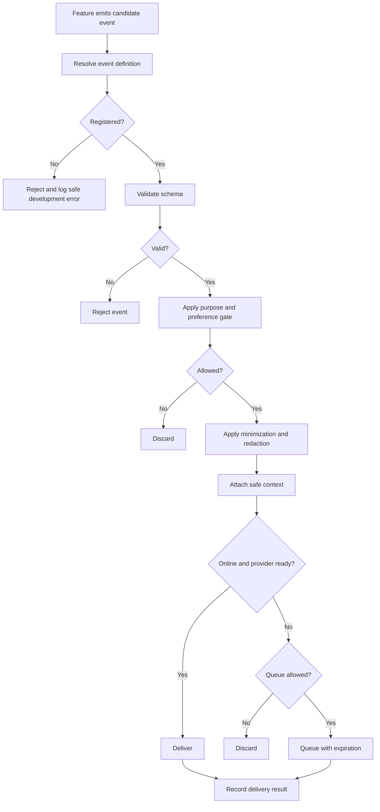
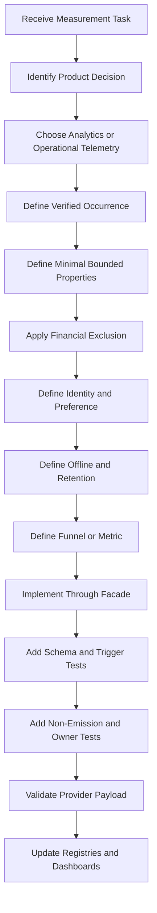

# Nexio Analytics and Experimentation Specification

Version: 1.0  
Status: Official  
Authority Level: Product Measurement, Analytics and Experimentation Standard  
Applies To: Web, Desktop, Tablet, Mobile, Android, Authentication, Financial Features, Synchronization, Assistant, Notifications, Imports, Exports, Support, Feature Flags and Operational Dashboards

---

# Purpose

This document defines the official Analytics and Experimentation architecture of Nexio.

It establishes requirements for:

- Product Analytics
- Operational telemetry boundaries
- Event taxonomy
- Event schemas
- Event validation
- Event identity
- Session and owner boundaries
- Consent and preference enforcement
- Offline event handling
- Event delivery
- Provider abstraction
- Event retention
- Data minimization
- Financial-data exclusion
- Feature flags
- Experiment assignment
- Exposure tracking
- Experiment metrics
- Funnel measurement
- Data-quality monitoring
- Experiment safety
- Statistical governance
- Rollout evaluation
- Privacy protection
- Accessibility measurement
- Incident handling
- Release approval
- AI implementation restrictions

Nexio must measure whether the product is:

- Understandable
- Reliable
- Useful
- Accessible
- Secure
- Performant
- Successfully supporting financial workflows

It must not turn private financial behavior into unrestricted tracking.

---

# Relationship with Other Documents

This document must be interpreted together with:

```text
docs/00-FOUNDATION.md
docs/01-ARCHITECTURE.md
docs/02-DESIGN-SYSTEM.md
docs/03-DESKTOP.md
docs/04-TABLET.md
docs/05-MOBILE.md
docs/06-DATA-MODEL.md
docs/07-SECURITY.md
docs/08-OFFLINE-AND-SYNC.md
docs/09-TESTING.md
docs/10-DEPLOYMENT-AND-OPERATIONS.md
docs/11-INTERNATIONALIZATION-AND-CONTENT.md
docs/12-ASSISTANT-AND-AI.md
docs/13-PRIVACY-AND-DATA-GOVERNANCE.md
docs/14-ACCESSIBILITY.md
docs/15-PERFORMANCE-AND-RELIABILITY.md
```

Responsibilities are divided as follows:

| Document | Responsibility |
|---|---|
| `00-FOUNDATION.md` | Product purpose and user-trust principles |
| `01-ARCHITECTURE.md` | Analytics abstraction and dependency boundaries |
| `02-DESIGN-SYSTEM.md` | Measurable component states |
| `03-DESKTOP.md` | Desktop interaction surfaces |
| `04-TABLET.md` | Tablet interaction surfaces |
| `05-MOBILE.md` | Android lifecycle and Notification measurement |
| `06-DATA-MODEL.md` | Canonical financial meaning |
| `07-SECURITY.md` | Authentication and authorization boundaries |
| `08-OFFLINE-AND-SYNC.md` | Offline event queues and synchronization state |
| `09-TESTING.md` | Analytics and experiment test architecture |
| `10-DEPLOYMENT-AND-OPERATIONS.md` | Production telemetry and release monitoring |
| `11-INTERNATIONALIZATION-AND-CONTENT.md` | Locale and content terminology |
| `12-ASSISTANT-AND-AI.md` | Assistant metrics and evaluation |
| `13-PRIVACY-AND-DATA-GOVERNANCE.md` | Purpose, consent, retention and provider governance |
| `14-ACCESSIBILITY.md` | Accessible journeys and barriers |
| `15-PERFORMANCE-AND-RELIABILITY.md` | Performance telemetry and reliability metrics |
| `16-ANALYTICS-AND-EXPERIMENTATION.md` | Product measurement and controlled experimentation |

This document does not authorize collecting a field merely because it may be useful for analysis.

Every event remains subject to the Privacy and Security specifications.

---

# Current Project Measurement Anchors

The repository contains potential Analytics integration points such as:

```text
app.js
i18n.js
mobile-capacitor.js
supabase-config.js
js/core/
js/ui/
index.html
android/
android-web/
vercel.json
```

Recommended responsibility:

| Location | Measurement Responsibility |
|---|---|
| `app.js` | Application lifecycle and route-level measurement |
| `js/core/analytics.js` | Analytics facade and event contracts |
| `js/core/experiments.js` | Experiment assignment and exposure |
| `js/core/storage.js` | Local event queue when approved |
| `js/ui/` | User-intent event production |
| `mobile-capacitor.js` | Android lifecycle and native event adaptation |
| `supabase-config.js` | Approved backend connection configuration |
| `docs/16-ANALYTICS-AND-EXPERIMENTATION.md` | Authoritative measurement contract |

When the modules do not yet exist, they should be introduced through the Architecture migration process rather than embedded directly into unrelated feature code.

---

# Analytics Constitutional Principles

## Measurement Must Serve a Defined Product Decision

Every event must answer:

```text
Which product, reliability, accessibility, security or operational decision will this event support?
```

An event without a defined decision should not be collected.

---

## Measurement Is Not Surveillance

Nexio must not measure users by collecting unrestricted financial behavior.

Prohibited default Analytics content includes:

```text
Exact Transaction Amount

Account Balance

Transaction Description

Transaction Notes

Account Name

Category Name

Goal Name

Attachment Filename

Imported Row Content

Assistant Message Text

Email Address

Authentication Token
```

---

## Financial Records Are Not Analytics Payloads

Canonical financial entities remain in Domain storage.

Analytics should receive only bounded event metadata.

Preferred:

```text
Transaction creation completed

Transaction type:
Expense

Save result:
Saved locally
```

Prohibited:

```text
Expense amount:
R$ 185,40

Description:
Supermarket

Account:
Main Account
```

---

## Product Analytics and Operational Telemetry Are Different

Product Analytics asks:

```text
Are users able to find and complete a workflow?
```

Operational telemetry asks:

```text
Is the system functioning correctly?
```

These data streams may use different:

- Purposes
- Providers
- Retention
- Consent requirements
- Access roles
- Dashboards

They must not be combined without governance.

---

## Optional Analytics Must Respect User Choice

When Product Analytics is optional:

- It must not initialize before the approved choice.
- It must not send events after denial or withdrawal.
- Pending optional events must be removed after withdrawal.
- The choice must synchronize where applicable.
- Account switching must apply the current owner's choice.

---

## Essential Telemetry Must Remain Minimal

Operational telemetry required for:

- Security
- Availability
- Reliability
- Error detection
- Synchronization integrity

must still exclude unnecessary financial content.

Required processing is not unrestricted processing.

---

## Measure Intent and Outcome, Not Every Interaction

Prefer measuring meaningful stages:

```text
Transaction form opened

Transaction validation failed

Transaction saved locally

Transaction synchronized
```

Avoid measuring every:

- Keystroke
- Scroll
- Hover
- Focus move
- Character entered
- Chart point viewed

unless a narrowly approved accessibility or usability study requires it.

---

## Analytics Must Never Block Core Functionality

Failure of Analytics must not block:

- Startup
- Sign-in
- Transaction creation
- Local Save
- Synchronization
- Export
- Account deletion
- Privacy settings

Analytics delivery is always lower priority than core financial work.

---

## Events Must Represent Verified State

Events should be emitted after the relevant state becomes true.

Example:

```text
transaction_create_completed
```

must occur after the Transaction is durably saved according to its declared completion state.

A button click does not prove completion.

---

## Events Must Distinguish Local and Remote Results

Nexio must distinguish:

```text
transaction_saved_locally

transaction_synchronized
```

or use an explicit result property.

It must not emit:

```text
transaction_saved
```

when the event cannot explain whether the state is only local or remotely synchronized.

---

## Experimentation Must Not Change Financial Meaning Silently

Experiments must not produce different canonical financial calculations.

Experiment variants must not alter:

- Money arithmetic
- Currency rules
- Transfer classification
- Ownership
- Synchronization semantics
- Account deletion rights
- Privacy protections
- Security controls

without a separately approved architectural migration.

---

## High-Risk Workflows Are Not Casual Experiment Surfaces

The following require enhanced review before experimentation:

```text
Authentication

Account deletion

Complete export

Conflict resolution

Transfer confirmation

Privacy controls

Security warnings

Assistant confirmed mutations

Financial calculation wording
```

---

## Feature Flags and Experiments Are Different

A Feature Flag controls capability availability.

An Experiment compares variants to answer a defined hypothesis.

A flag may exist without an experiment.

An experiment must use governed assignment, exposure and evaluation.

---

## Exposure Must Be Recorded Only After Exposure

A user is not considered exposed merely because they were assigned.

Exposure occurs when the variant materially reaches the user.

---

## Experiment Metrics Must Be Defined Before Launch

Every experiment requires:

- Primary metric
- Guardrail metrics
- Eligibility
- Exposure rule
- Duration or stopping policy
- Minimum evidence standard
- Risk review

Metrics must not be selected after observing results to manufacture a favorable conclusion.

---

## Analytics Identity Must Respect Account Boundaries

Events from User A must never remain associated with User B after:

- Sign-out
- Account switching
- Account deletion
- Session replacement

---

## Anonymous and Authenticated Identity Must Not Be Joined Casually

Joining pre-authentication behavior to an authenticated owner requires:

- Defined purpose
- Privacy review
- Approved identity strategy
- Clear retention
- User-choice compatibility

---

## Accessibility Measurement Must Not Profile Disability

Nexio may measure whether accessible workflows function.

It must not infer or store a user's disability or health condition.

---

## Analytics Must Survive Offline Safely

Optional offline events may be queued only when:

- The current choice permits collection.
- The event remains useful after delay.
- The event has expiration.
- The event is owner-scoped where applicable.
- Account deletion and withdrawal remove it.

---

## No Event Is Better Than a Misleading Event

When the system cannot confirm the correct meaning, it should avoid emitting the event.

A missing event is preferable to a false claim about financial completion.

---

# Measurement Goals

Nexio measurement should help answer:

```text
Can users start and complete core workflows?

Where do users encounter validation barriers?

Are local saves durable?

How long does synchronization take?

Are Reports understandable and useful?

Do Imports complete without duplicate or invalid records?

Are Exports generated securely?

Are users able to use privacy controls?

Are accessible journeys operating correctly?

Is Assistant guidance useful and safe?

Are releases improving or degrading the product?
```

---

# Analytics Scope

This specification applies to measurement from:

```text
Application startup

Authentication

Onboarding

Dashboard

Transactions

Accounts

Categories

Goals

Reports

Imports

Exports

Attachments

Synchronization

Conflict resolution

Notifications

Assistant

Privacy settings

Accessibility workflows

Account deletion

Support entry points

Android lifecycle
```

---

# Measurement Terminology

## Event

A structured record that a defined product or operational occurrence happened.

## Event Property

A bounded value describing the event.

## Context

Shared safe metadata such as:

- Application version
- Platform
- Locale
- Feature flag state

## Event Schema

The contract defining allowed and required event fields.

## Exposure

The moment an eligible user materially experiences an experiment variant.

## Experiment

A controlled comparison between one or more variants.

## Variant

One specific version of an experiment experience.

## Control

The reference variant used for comparison.

## Treatment

A variant intentionally different from the control.

## Primary Metric

The main outcome used to evaluate the experiment.

## Guardrail Metric

A metric that must not degrade beyond an approved threshold.

## Funnel

An ordered set of meaningful workflow stages.

## Conversion

Completion of the defined target stage after eligibility or entry.

## Assignment

The deterministic selection of a variant for an eligible subject.

## Eligibility

The conditions defining who or what may participate.

## Holdout

A group intentionally excluded from a feature or set of experiments for comparison.

## Telemetry

Structured technical observations about system behavior.

---

# Responsibility Model

Recommended roles:

```text
Analytics Owner

Product Owner

Data Owner

Privacy Owner

Security Owner

Experiment Owner

Engineering Owner

Quality Owner

Operations Owner

Release Owner
```

---

# Analytics Owner

Responsible for:

- Event taxonomy
- Event schemas
- Metric definitions
- Data-quality monitoring
- Provider configuration
- Event deprecation
- Analytics documentation

---

# Product Owner

Responsible for:

- Product question
- Hypothesis
- User outcome
- Primary metric
- Guardrail metrics
- Interpretation
- Follow-up decision

---

# Privacy Owner

Responsible for:

- Purpose review
- Optional-choice model
- Event minimization
- Retention
- Provider review
- Deletion behavior
- Account-switch handling

---

# Security Owner

Responsible for:

- Event integrity
- Credential protection
- Provider access
- Sensitive-field exclusion
- Administrative access
- Abuse and manipulation review

---

# Experiment Owner

Responsible for:

- Experiment registry
- Eligibility
- Assignment
- Exposure
- Duration
- Metrics
- Monitoring
- Stopping decision
- Cleanup

---

# Engineering Owner

Responsible for:

- Event production
- Schema validation
- Consent gate
- Queue
- Provider adapter
- Experiment assignment
- Feature-flag enforcement
- Tests

---

# Quality Owner

Responsible for verifying:

- Event timing
- Property accuracy
- Consent behavior
- Offline behavior
- Identity reset
- Variant behavior
- Exposure correctness
- Experiment cleanup

---

# Measurement Architecture

Recommended architecture:

```text
Feature UI

↓

Analytics Facade

↓

Event Schema Validator

↓

Purpose and Preference Gate

↓

Redaction and Minimization

↓

Local Delivery Queue

↓

Provider Adapter

↓

Approved Analytics Provider
```

Operational telemetry may use a separate pipeline:

```text
Runtime or Service

↓

Operational Telemetry Facade

↓

Safe Schema Validator

↓

Logging or Metrics Provider
```

---

# Analytics Facade

Feature code should call a stable application API.

Conceptual:

```javascript
analytics.track("transaction_create_completed", {
  transactionType: "expense",
  saveResult: "saved_locally"
});
```

Feature code must not call provider SDKs directly.

---

# Provider Adapter

The Provider Adapter should normalize:

```text
Initialization

Identity

Event delivery

Batching

Retry

Consent state

Flush

Reset

Provider errors

Provider version
```

---

# Analytics Provider Independence

Provider-specific logic must remain inside the adapter.

This supports:

- Provider replacement
- Provider disablement
- Local testing
- Consent enforcement
- Multi-provider prevention
- Privacy review
- Exit plan

---

# Initialization Gate

Optional Analytics initialization should require:

```text
Approved configuration

Valid environment

Active preference or consent

Current owner state where applicable
```

Do not load optional provider scripts before the gate passes.

---

# Event Processing Pipeline

Conceptual:



---

# Event Registry

Every event must be registered before use.

Recommended fields:

```text
Event name

Description

Purpose

Category

Trigger

Required properties

Optional properties

Forbidden properties

Identity scope

Required or optional processing

Retention

Provider

Owner

Schema version

Deprecation state
```

---

# Event Record Example

```yaml
event_name: transaction_create_completed
description: Records completion of the Transaction creation workflow.
purpose: product_workflow_measurement
category: product_analytics
trigger: after durable local commit
required_properties:
  - transaction_type
  - save_result
optional_properties:
  - entry_point
forbidden_properties:
  - amount
  - description
  - account_name
  - category_name
identity_scope: authenticated_owner
optional_processing: true
retention: product_analytics_standard
schema_version: 1
owner: transaction_product_owner
```

---

# Event Categories

Recommended categories:

```text
Product workflow

Operational reliability

Performance

Security

Privacy control

Accessibility quality

Experiment exposure

Support entry

Assistant quality
```

---

# Product Workflow Event

Measures meaningful user workflow stages.

Examples:

```text
transaction_create_started

transaction_create_validation_failed

transaction_create_completed

report_opened

export_requested
```

---

# Operational Reliability Event

Measures technical state.

Examples:

```text
local_database_open_failed

synchronization_batch_failed

service_worker_update_failed

export_job_failed
```

---

# Performance Event

Measures duration or resource category.

Examples:

```text
transaction_local_save_measured

dashboard_local_content_measured

report_summary_measured
```

Exact timing may be stored as bounded numeric properties.

---

# Security Event

Security measurement belongs to the Security telemetry system.

Examples:

```text
authentication_failed_category

session_revoked

protected_action_reauthentication_required
```

It should not be routed through optional Product Analytics by default.

---

# Privacy Control Event

Potential events:

```text
privacy_mode_enabled

optional_analytics_preference_changed

conversation_history_cleared

account_deletion_started
```

These events require careful purpose and retention handling.

---

# Accessibility Quality Event

Potential safe events:

```text
keyboard_navigation_error_detected

accessible_validation_summary_used

accessibility_feedback_opened
```

Do not infer disability from usage.

---

# Experiment Exposure Event

Example:

```text
experiment_exposure_recorded
```

Required properties may include:

```text
experiment_id

variant_id

assignment_version

exposure_surface
```

---

# Event Naming Convention

Recommended:

```text
object_action_state
```

Examples:

```text
transaction_create_started

transaction_create_completed

report_filter_applied

export_generation_failed

assistant_proposal_confirmed
```

---

# Event Name Requirements

Event names should:

- Use lowercase.
- Use underscores.
- Be stable.
- Describe one occurrence.
- Avoid provider-specific terminology.
- Avoid vague names.
- Avoid embedding version in the name unless semantics changed materially.

---

# Prohibited Event Names

Avoid:

```text
clicked

button_click

success

error

event_1

page_event

user_action
```

without feature and outcome context.

---

# Event Trigger Definition

Every event must define exactly when it occurs.

Example:

```text
transaction_create_started:
When the Transaction creation screen becomes ready for user input.

transaction_create_completed:
After the local Transaction and synchronization operation commit atomically.
```

---

# Intent Event versus Outcome Event

Intent:

```text
transaction_save_requested
```

Outcome:

```text
transaction_create_completed
```

Both may be useful, but they represent different facts.

They must not be treated as interchangeable.

---

# Event Properties

Properties should be:

- Bounded
- Enumerated where possible
- Necessary
- Stable
- Non-sensitive
- Documented
- Versioned

---

# Enumerated Properties

Preferred:

```javascript
{
  saveResult: "saved_locally"
}
```

Allowed values:

```text
saved_locally

synchronized

failed_before_save
```

Avoid uncontrolled free text.

---

# Boolean Properties

Use only when the meaning is clear.

Preferred:

```text
was_offline:
true
```

Avoid ambiguous:

```text
status:
true
```

---

# Numeric Properties

Allowed numeric examples:

```text
duration_bucket

result_count_bucket

queue_depth_bucket

step_number

retry_count
```

Exact financial values remain prohibited.

---

# Bucketed Values

Where exact technical values are unnecessary, use ranges.

Example:

```text
result_count_bucket:
1_to_10
```

instead of:

```text
result_count:
7
```

when the exact value offers no additional decision value.

---

# Free-Text Properties

Free-text Analytics properties should be prohibited by default.

Exceptions require:

- Defined necessity
- Redaction
- Size limit
- Privacy review
- Retention
- Provider review

User-generated content must not enter Product Analytics.

---

# Event Context

Safe shared context may include:

```text
Application version

Release ID

Platform

Device class

Locale

Route category

Online state

Feature-flag version

Experiment assignment version

Privacy preference state

Synchronization mode
```

---

# Context Restrictions

Do not include:

- Raw URL with identifiers
- Query string
- Email
- Entity ID unless strongly justified and transformed
- Financial value
- User-generated name
- Full browser user agent when a bounded device class works

---

# Route Context

Use stable route categories.

Preferred:

```text
transactions_list

transaction_detail

report_expenses_by_category
```

Avoid:

```text
/transactions/5dc4f9...
```

---

# Application Version

Every delivered event should identify the application version or release when technically available.

---

# Schema Version

Every event should include or resolve:

```text
event_schema_version
```

This supports:

- Migration
- Validation
- Historical interpretation
- Provider change
- Data-quality monitoring

---

# Event Validation

Validation should occur before queueing or sending.

Validate:

- Event registration
- Required properties
- Allowed properties
- Allowed values
- Types
- Size
- Consent category
- Identity scope
- Forbidden-field patterns

---

# Development Validation

In Development, invalid events should:

- Fail loudly.
- Identify the event and invalid property.
- Avoid sending.
- Provide corrective documentation.

---

# Production Validation

In Production, invalid events should:

- Be rejected.
- Produce safe operational diagnostic.
- Avoid user disruption.
- Avoid sending partial payload.
- Trigger alert if rate exceeds threshold.

---

# Forbidden-Field Detection

The Analytics layer should reject known sensitive keys.

Examples:

```text
amount

amount_minor

balance

description

notes

email

account_name

category_name

goal_name

token

password

attachment_filename
```

Key-name detection supplements but does not replace schema validation.

---

# Event Size Limit

Every event requires a maximum serialized size.

Oversized events must be rejected.

Do not truncate silently when truncation could change meaning.

---

# Event Ordering

Some events require ordering.

Example:

```text
transaction_create_started

before

transaction_create_completed
```

Analytics must tolerate network delivery reordering through event timestamps and stable event IDs where needed.

---

# Event Time

Recommended fields:

```text
occurred_at

queued_at

sent_at
```

`occurred_at` represents the actual event time.

---

# Clock Trust

Client Clock may be incorrect.

For product funnels:

- Record client occurrence time.
- Record provider receipt time where available.
- Avoid high-stakes decisions based only on client Clock.
- Use sequence or session context when ordering matters.

---

# Event Identity

Each event may have a stable unique event ID for deduplication.

The ID must not encode:

- Owner email
- Financial entity
- Amount
- Description

---

# Delivery Deduplication

Retrying delivery should preserve the same event ID.

The provider or ingestion layer should deduplicate when supported.

---

# Event Delivery Result

Potential states:

```text
accepted

queued

discarded_by_preference

discarded_expired

rejected_invalid

provider_failed
```

These states belong to operational monitoring and should not generate recursive Product Analytics loops.

---

# Identity Architecture

Analytics identity may include:

```text
Anonymous installation identity

Anonymous session identity

Authenticated pseudonymous owner identity

Experiment assignment identity
```

Each requires a defined purpose and lifecycle.

---

# Anonymous Installation Identity

Potentially identifies one application installation.

Requirements:

- Randomly generated
- Environment-specific
- Rotatable
- Not derived from hardware identifier
- Removed after Account deletion where applicable
- Subject to optional-choice policy

---

# Anonymous Session Identity

May group events during a temporary session.

It should expire or reset according to policy.

---

# Authenticated Analytics Identity

When used, it should be:

- Pseudonymous
- Provider-specific or transformed
- Stable only as necessary
- Not raw email
- Reset on sign-out
- Changed on Account switch
- Removed or severed after Account deletion according to policy

---

# User ID Transmission

Raw authentication UUID should not be transmitted automatically.

Use an approved pseudonymous identifier strategy when identity is required.

---

# Identity Merge

Merging anonymous and authenticated histories requires explicit review.

Potential safe default:

```text
Do not merge historical anonymous events.
```

or:

```text
Merge only events from the current installation after approved sign-in event.
```

The chosen policy must be documented.

---

# Account Switch

On Account switch:

1. Flush or discard events according to current policy.
2. Reset provider identity.
3. Clear owner-scoped queue state.
4. Apply new owner's preference.
5. Apply new experiment assignments.
6. Prevent cross-owner session continuation.

---

# Sign-Out

Sign-out should:

- Reset authenticated identity.
- Stop owner-scoped optional tracking.
- Clear owner-scoped event context.
- Retain only approved anonymous state.
- Cancel stale delivery.

---

# Account Deletion

Account deletion should:

- Stop new owner-linked events.
- Remove queued owner-linked events.
- Trigger provider identity deletion where supported.
- Remove experiment assignments tied to the owner.
- Preserve only minimal deletion audit according to policy.
- Avoid recreating the same identity automatically.

---

# Analytics Choice Architecture

Potential processing states:

```text
not_requested

enabled

disabled

withdrawn

requires_review
```

---

# Choice Gate

Before optional event processing:

```text
Current state must equal enabled.
```

Any unknown or invalid state should default to not sending.

---

# Choice Change

When enabled:

- Initialize optional provider.
- Begin new optional event collection.
- Do not backfill earlier private behavior unless explicitly approved.

When disabled or withdrawn:

- Stop collection.
- Stop delivery.
- Remove pending optional events.
- Reset optional identity where policy requires.

---

# Choice Event

The preference change itself may need an essential privacy audit record.

Do not rely only on the optional Analytics provider to record withdrawal.

---

# Cross-Device Choice

Authenticated optional preferences should synchronize where supported.

A device must not continue optional sending after receiving a valid withdrawal from another device.

---

# Offline Choice Change

When the user disables optional Analytics offline:

- Stop local collection immediately.
- Delete pending optional events.
- Queue the preference change through the normal settings synchronization path.
- Do not wait for remote confirmation.

---

# Event Queue Architecture

A local queue may support delayed delivery.

The queue must be separate from the financial synchronization queue.

---

# Queue Record

Conceptual:

```javascript
{
  eventId: "uuid",
  eventName: "report_opened",
  schemaVersion: 1,
  occurredAt: "timestamp",
  expiresAt: "timestamp",
  identityScope: "authenticated_owner",
  ownerReference: "safe-local-owner-reference",
  payload: {
    reportType: "expenses_by_category"
  },
  status: "pending"
}
```

---

# Event Queue Principles

- Bounded size
- Expiration
- Owner scope
- Consent revalidation
- Batch delivery
- Backoff
- Low priority
- Account-deletion cleanup
- Sign-out handling

---

# Queue Size Limit

When the queue reaches its limit:

- Drop oldest optional events according to policy.
- Preserve essential operational telemetry through its separate channel.
- Do not affect financial queues.
- Record safe queue-pressure metric.

---

# Event Expiration

Events may expire when delayed delivery no longer supports the product decision.

Examples:

```text
Route-open event:
Short expiration

Experiment exposure:
Longer controlled expiration

Performance event:
Short operational expiration
```

---

# Delivery Batch

Batch size should be bounded by:

- Event count
- Serialized bytes
- Provider limit
- Network condition

---

# Offline Event Ordering

Preserve occurrence timestamps.

Exact delivery order should not be assumed.

Funnel analysis must tolerate delayed events.

---

# Consent Revalidation Before Delivery

Before sending queued optional events:

- Confirm current preference.
- Confirm current owner.
- Confirm event has not expired.
- Confirm schema is still supported.

---

# Provider Failure

Analytics provider failure should:

- Not affect user workflows.
- Retry with bounded backoff where approved.
- Open a circuit breaker after repeated failure.
- Discard expired optional events.
- Remain observable.

---

# Experimentation Architecture

Recommended flow:

```text
Experiment Registry

↓

Eligibility Evaluation

↓

Deterministic Assignment

↓

Feature Flag Resolution

↓

Variant Rendered

↓

Exposure Recorded

↓

Outcome Events

↓

Analysis

↓

Decision

↓

Cleanup
```

---

# Experiment Registry

Every experiment must have a registry entry.

Recommended fields:

```text
Experiment ID

Name

Hypothesis

Owner

Status

Eligibility

Unit of assignment

Variants

Control

Primary metric

Guardrail metrics

Exposure rule

Start date

Expected end date

Stopping policy

Risk level

Platforms

Required preference

Feature flag

Assignment version

Analysis plan

Cleanup plan
```

---

# Experiment Status

Recommended:

```text
draft

review

scheduled

running

paused

stopped

completed

rolled_out

rejected

archived
```

---

# Experiment Hypothesis

A hypothesis should follow:

```text
For eligible users,

changing X to Y

will improve Z

because of reason R,

without degrading guardrails G.
```

Example:

```text
For users creating their first Expense,

showing a short Account explanation before Account selection

will increase successful Transaction completion

because it reduces uncertainty,

without increasing form completion time materially.
```

---

# Experiment Unit

Possible units:

```text
Authenticated owner

Anonymous installation

Session

Device

Workspace

Request
```

The unit must match the product question.

---

# Owner-Level Assignment

Use owner-level assignment when the experience should remain consistent across devices.

Examples:

- Navigation layout
- Assistant availability
- Onboarding structure

---

# Installation-Level Assignment

May be appropriate for:

- Pre-authentication experience
- Device-specific technical experiment

It must not create inconsistent financial meaning after sign-in.

---

# Session-Level Assignment

Appropriate only for short-lived and low-risk behavior.

It should not be used when variant switching would confuse the user.

---

# Request-Level Assignment

Useful for backend technical experimentation.

It must not cause inconsistent user-visible workflows without careful design.

---

# Deterministic Assignment

Assignment should be deterministic.

Conceptual:

```text
hash(
  assignment_unit
  +
  experiment_id
  +
  assignment_version
)
```

The resulting bucket maps to a variant.

---

# Assignment Inputs

Assignment must not use:

- Exact spending
- Account balance
- Sensitive Category
- Transaction description
- Health-related inference
- Religion-related inference
- Political inference

unless a separate high-risk governance process explicitly approves the use.

---

# Variant Allocation

Example:

```text
Control:
50%

Treatment:
50%
```

Allocation must be documented before launch.

---

# Assignment Version

Changing:

- Allocation
- Eligibility
- Variants
- Hash logic
- Unit

requires an assignment-version decision.

Uncontrolled change may contaminate results.

---

# Sticky Assignment

Assignments should remain stable for the required experiment duration.

---

# Cross-Device Consistency

Owner-level assignment should resolve consistently across devices.

A local cache may accelerate resolution but must not override authoritative assignment policy incorrectly.

---

# Experiment Eligibility

Eligibility should use bounded product state.

Potential criteria:

```text
Platform

Application version

Locale

Country or region where approved

Feature availability

Account age bucket

Completed workflow count bucket

Synchronization capability
```

---

# Sensitive Eligibility Prohibition

Do not define eligibility from:

- Exact debt
- Salary
- Merchant
- Health purchase
- Religious donation
- Political contribution
- Relationship inference
- Criminal or legal inference

---

# Eligibility Evaluation

Eligibility must be deterministic and testable.

The experiment should record why a subject was excluded through bounded internal categories where operationally useful.

---

# Feature Flags

A Feature Flag record should define:

```text
Flag ID

Purpose

Owner

Default

Environment

Platforms

Dependencies

Rollout rule

Kill switch

Expiration

Cleanup owner
```

---

# Flag Defaults

Safe defaults should apply when:

- Flag service is unavailable.
- Assignment is invalid.
- User is offline.
- Application version is unsupported.
- Privacy preference is unknown.

---

# Flag Evaluation

The client must not trust arbitrary remote flag payloads to bypass:

- Security
- Authorization
- Confirmation
- Privacy
- Financial validation

Flags may select approved implementations only.

---

# Offline Flag Behavior

The feature must define whether to use:

```text
Last valid assignment

Safe control

Feature disabled
```

Unknown state should not activate high-risk treatment.

---

# Exposure Architecture

Assignment does not equal exposure.

An exposure event occurs only when:

- The user is eligible.
- The variant is resolved.
- The material variant UI or behavior is delivered.
- The exposure has not already been recorded beyond the approved frequency.

---

# Exposure Record

Potential properties:

```text
experiment_id

variant_id

assignment_version

exposure_surface

application_version

platform
```

---

# Exposure Deduplication

Exposure frequency may be:

```text
Once per experiment

Once per session

Once per meaningful view

Once per workflow attempt
```

The experiment registry must define it.

---

# Premature Exposure

Do not record exposure when:

- Code is downloaded but not displayed.
- Flag is evaluated but route is never opened.
- User is ineligible.
- Variant fails before becoming visible.
- Control and treatment remain materially identical due to degradation.

---

# Outcome Measurement

Outcome events should be normal registered product events.

Avoid creating custom outcome logic only inside the experiment provider.

---

# Primary Metric

The primary metric should be:

- Directly related to the hypothesis
- Interpretable
- Measurable
- Defined before launch
- Resistant to event ambiguity
- Meaningful to users

---

# Guardrail Metrics

Potential guardrails:

```text
Validation failure rate

Local Save failure rate

Synchronization conflict rate

Time to complete

Accessibility defect rate

Crash rate

Privacy-choice withdrawal rate

Support request rate

Account deletion failure
```

---

# Financial Guardrails

An experiment affecting financial workflows should monitor:

- Duplicate operation
- Wrong action rate
- Cancellation rate
- Conflict rate
- Unknown outcome
- Support complaints
- Financial-integrity incidents

It must not monitor exact user Amounts.

---

# Negative Metrics

Experiments should explicitly define unacceptable harm.

Example:

```text
Primary:
Increase Transaction creation completion.

Guardrails:
Do not increase validation failures by more than approved threshold.
Do not increase median completion time materially.
Do not increase duplicate Save attempts.
```

---

# Experiment Segmentation

Analysis may segment by approved dimensions such as:

```text
Platform

Application version

Locale

New versus returning product stage

Network class

Data-volume bucket
```

Avoid post-hoc segmentation that searches for favorable results without correction or transparency.

---

# Experiment Sample Integrity

Verify:

- Assignment balance
- Exposure balance
- Missing events
- Duplicate events
- Cross-variant contamination
- Application-version compatibility
- Consent coverage
- Clock anomalies

---

# Sample Ratio Mismatch

A material difference between expected and observed variant allocation may indicate:

- Assignment defect
- Exposure defect
- Eligibility defect
- Delivery issue
- Event loss
- Provider filtering
- Cross-device mismatch

An experiment with unexplained sample-ratio mismatch should be paused or invalidated.

---

# Experiment Duration

Duration should account for:

- Expected traffic
- Product usage cycle
- Day-of-week effects
- Synchronization delay
- Event delivery delay
- Minimum sample
- Risk

Do not stop immediately after a favorable early result without an approved stopping policy.

---

# Early Stopping

Early stopping requires a predefined method.

Ad hoc repeated checking increases false conclusions.

---

# Experiment Overlap

Overlapping experiments may interact.

The registry should define:

```text
Mutual exclusion group

Allowed combinations

Priority

Interaction risk
```

---

# Experiment Collision

Two experiments must not independently change the same critical workflow without review.

---

# Holdout Groups

A holdout may help evaluate the cumulative effect of several features.

Holdouts require:

- Defined purpose
- Duration
- Eligibility
- User-risk review
- Cleanup
- No withholding of required security or privacy protections

---

# Experiment Pausing

Pause when:

- Guardrail degrades.
- Critical defect appears.
- Privacy issue appears.
- Accessibility barrier appears.
- Assignment breaks.
- Exposure breaks.
- Provider data is unreliable.
- Sample ratio mismatch appears.
- Financial-integrity concern appears.

---

# Experiment Stop and Cleanup

At completion:

- Stop new assignment.
- Decide final variant.
- Remove dead code.
- Remove obsolete flag.
- Remove experiment-specific properties.
- Preserve only approved analysis data.
- Update documentation.
- Close experiment record.

---

# Experiment Rollout Decision

Possible outcomes:

```text
Roll out treatment

Keep control

Run follow-up experiment

Revise hypothesis

Reject both variants

Stop feature
```

A statistically favorable result does not override:

- User harm
- Accessibility failure
- Privacy failure
- Financial-integrity failure
- Operational instability

---

# Analytics and Accessibility

Analytics may measure whether accessibility requirements operate.

Safe examples:

```text
validation_error_summary_presented

keyboard_focus_recovery_failed

accessible_export_ready_announced
```

These should usually be operational Quality events rather than user profiling.

---

# Assistive Technology Detection

Nexio should not attempt to identify screen-reader users through invasive detection.

Platform accessibility state may be used only when:

- Required for immediate interface behavior
- Not persisted as a disability profile
- Not transmitted unnecessarily
- Reviewed for Privacy

---

# Analytics and Internationalization

Event names remain stable in one internal language.

User-facing translations must not change event identity.

Safe locale property:

```text
locale:
pt-BR
```

Avoid recording:

- Full translated user content
- Raw text label
- User-entered language samples

---

# Analytics and Privacy Mode

Privacy mode may be recorded as a bounded state only when needed to evaluate whether protected presentation functions.

Example:

```text
privacy_mode_state:
enabled
```

Do not include hidden values.

---

# Analytics and Assistant

Assistant metrics should prefer:

```text
Capability ID

Response type

Grounding class

Proposal status

Tool count bucket

Latency bucket

Fallback used

User-selected feedback
```

Avoid:

```text
Raw prompt

Raw response

Exact financial result

Transaction notes

Account names
```

---

# Assistant Experimentation

Experiments involving the Assistant require:

- Model version control
- Prompt version control
- Tool-registry control
- Financial exact-match evaluation
- Prompt-injection evaluation
- Cost guardrails
- Latency guardrails
- Privacy review
- Human quality review

---

# Assistant Variant Consistency

A user should not receive uncontrolled switching between:

- Different confirmation boundaries
- Different financial calculation logic
- Different privacy behavior
- Different mutation permissions

---

# Analytics and Notifications

Safe Notification Analytics may include:

```text
notification_scheduled

notification_delivered_category

notification_opened

notification_action_selected
```

Do not include private Notification body.

---

# Notification Attribution

Opening a Notification may carry a safe campaign or Notification type reference.

It must not include financial content in the deep link.

---

# Analytics and Support

Safe support-entry measurement may include:

```text
support_opened

support_category_selected

diagnostic_package_created
```

Do not send support message text into Product Analytics.

---

# Analytics Security

Analytics ingestion must protect against:

- Event spoofing
- Payload tampering
- Replay
- Schema abuse
- Injection
- Oversized payload
- Provider credential exposure
- Cross-environment contamination

---

# Client Events Are Untrusted

Client Analytics cannot be treated as authoritative evidence for:

- Financial records
- Payments
- Security decisions
- Legal rights completion
- Account deletion completion

Server or canonical state remains authoritative.

---

# Environment Isolation

Development, Preview, Staging and Production events must remain separate.

Each environment should use:

- Different provider project
- Different API key where applicable
- Environment property
- Data-access separation

---

# Debug Analytics

Development debug events should not enter Production dashboards.

---

# Analytics Access Control

Access should follow least privilege.

Potential roles:

```text
Dashboard viewer

Analytics analyst

Experiment owner

Provider administrator

Privacy reviewer

Data engineer
```

---

# Raw Event Access

Raw event access should be restricted more strongly than aggregate-dashboard access.

---

# Event Retention

Every event category requires a retention rule.

Retention should be:

- Short enough for its purpose
- Different from financial-record retention
- Enforced
- Provider-aware
- Documented

---

# Experiment Data Retention

Experiment assignment and exposure data should remain only as long as required for:

- Analysis
- Audit
- Reproducibility
- Approved follow-up

It should not become indefinite behavioral profiling.

---

# Event Deletion

Account deletion must address:

- Owner-linked event queue
- Provider identity
- Raw owner-linked events where supported and required
- Experiment assignments
- Personalized cohorts
- Optional profiles

Aggregated truly anonymized metrics may remain only according to approved policy.

---

# Analytics Anti-Patterns

The following are prohibited:

## Track Everything

Collecting every interaction without a defined product decision.

## Financial Payload Event

Sending Amount, Description, Account or Goal data.

## Direct Provider SDK in Feature

Calling the Analytics provider directly from UI code.

## Analytics Before Choice

Initializing optional tracking before the approved user preference.

## Backfill After Consent

Sending prior behavior automatically after optional Analytics is enabled.

## Withdrawal Without Queue Deletion

Sending queued optional events after withdrawal.

## Event on Click as Completion

Treating a button activation as proof that the workflow succeeded.

## Generic Success Event

Using `success` without feature and state context.

## Free-Text Property

Sending user-generated content in Analytics.

## Cross-Owner Session

Continuing the same Analytics identity after Account switch.

## Raw Email Identity

Using the user's email as Analytics identity.

## Unbounded Event Queue

Allowing optional Analytics events to consume unlimited local storage.

## Analytics Blocking Save

Waiting for Analytics delivery before completing a financial command.

## Experiment Without Hypothesis

Creating variants without a defined product question.

## Assignment Equals Exposure

Counting every assigned user as exposed.

## Sensitive Segmentation

Creating experiment cohorts from financial or inferred sensitive behavior.

## Experimenting on Financial Arithmetic

Changing canonical calculations between variants.

## Post-Hoc Primary Metric

Selecting the winning metric only after observing results.

## Early Stop on Favorable Result

Stopping immediately after a temporary positive fluctuation.

## Flag Without Expiration

Leaving temporary Feature Flags permanently.

## Variant Without Cleanup

Keeping dead experiment code after decision.

## Session Replay on Financial Screens

Recording financial content for convenience.

## Accessibility Profiling

Inferring disability from interaction patterns.

## Analytics as Financial Audit

Using client Analytics as authoritative proof of financial state.

---

# Part 1 Measurement Review Questions

Before adding an event, answer:

```text
Which decision will this event support?

Is this Product Analytics or operational telemetry?

Is collection required or optional?

What exact occurrence triggers the event?

Does the event describe intent or outcome?

Which properties are necessary?

Are all values bounded?

Could any property reveal financial behavior?

Which identity scope applies?

How long is the event useful?

What happens offline?

What happens after withdrawal?

What happens after Account switch?

What happens after Account deletion?
```

---

# Event Schema Review Questions

```text
Is the event registered?

Is the name specific?

Is the trigger precise?

Are required properties defined?

Are allowed values enumerated?

Are forbidden fields documented?

Is schema validation implemented?

Is the payload size bounded?

Is the schema versioned?

Who owns the event?
```

---

# Identity Review Questions

```text
Is identity necessary?

Can the metric use anonymous aggregation?

Is raw authentication ID avoided?

What happens on Sign-out?

What happens on Account switch?

Are anonymous and authenticated histories merged?

What happens after Account deletion?

Does the provider retain a profile?
```

---

# Queue Review Questions

```text
Is offline queueing necessary?

What is the size limit?

When does the event expire?

Is the current preference revalidated before delivery?

Does queue cleanup run after withdrawal?

Can the queue affect financial storage capacity?

How is duplicate delivery prevented?
```

---

# Experiment Review Questions

```text
What is the hypothesis?

Who is eligible?

What is the assignment unit?

Is assignment deterministic?

Which variants exist?

What is the control?

What constitutes exposure?

What is the primary metric?

Which guardrails apply?

What is the stopping policy?

Which experiments may overlap?

How is the flag removed afterward?
```

---

# Experiment Risk Review Questions

```text
Could a variant change financial meaning?

Could a variant change confirmation?

Could a variant reduce Security?

Could a variant expand data collection?

Could a variant create an Accessibility barrier?

Could a variant increase duplicate operations?

Could a variant create inconsistent cross-device behavior?

Which kill switch exists?
```

---

# Part 1 Acceptance Criteria

The Analytics and Experimentation foundation is accepted only when:

```text
□ Every event supports a documented decision.

□ Measurement is explicitly separated from surveillance.

□ Financial records never become default Analytics payloads.

□ Product Analytics and operational telemetry remain distinct.

□ Optional Product Analytics respects the approved user choice.

□ Essential telemetry remains minimized.

□ Meaningful workflow stages are preferred over low-value interaction noise.

□ Analytics failure cannot block core financial workflows.

□ Events are emitted only after the represented state is verified.

□ Local Save and remote synchronization remain distinct in measurement.

□ Experiments cannot silently change canonical financial meaning.

□ High-risk workflows require enhanced experiment review.

□ Feature Flags and experiments remain distinct concepts.

□ Exposure is recorded only after material exposure.

□ Primary and guardrail metrics are defined before launch.

□ Analytics identity resets after Account switch and Sign-out.

□ Anonymous and authenticated histories are not merged casually.

□ Accessibility measurement does not create disability profiles.

□ Offline optional events follow preference, expiration and owner rules.

□ The Analytics Facade isolates feature code from providers.

□ Event schemas are registered and versioned.

□ Event names use stable specific conventions.

□ Event triggers distinguish intent from outcome.

□ Event properties are bounded and enumerated where possible.

□ Free-text properties are prohibited by default.

□ Shared context excludes financial and user-generated content.

□ Route context uses stable categories without entity IDs.

□ Invalid events are rejected before delivery.

□ Known sensitive fields are blocked.

□ Event payload size is limited.

□ Delivery retries preserve event identity.

□ Analytics identities are pseudonymous and purpose-limited.

□ Raw email and authentication tokens never become Analytics identity.

□ Account deletion addresses queues, identities and assignments.

□ Unknown preference state defaults to no optional sending.

□ Enabling optional Analytics does not backfill prior behavior automatically.

□ Disabling optional Analytics removes pending optional events.

□ Offline withdrawal stops collection immediately.

□ The Analytics queue is separate from the financial synchronization queue.

□ Queue size and expiration are bounded.

□ Analytics provider failure remains isolated.

□ Every experiment has a registry record.

□ Experiment hypotheses define outcome and guardrails.

□ Assignment units match the product question.

□ Assignment is deterministic.

□ Sensitive financial behavior is excluded from assignment.

□ Owner-level experiments remain consistent across devices.

□ Feature Flags use safe defaults when resolution fails.

□ Flags cannot bypass Security, Privacy or financial validation.

□ Exposure frequency is explicitly defined.

□ Outcome measurement reuses registered events.

□ Guardrails cover financial integrity, Reliability, Privacy and Accessibility.

□ Sample-ratio mismatch is monitored.

□ Experiment overlap is governed.

□ Experiments pause after material guardrail failure.

□ Experiment completion includes code and flag cleanup.

□ Positive experiment results cannot override user harm.

□ Assistant experimentation includes model, prompt, safety, latency and cost controls.

□ Raw Assistant messages remain outside ordinary Analytics.

□ Environment data remains isolated.

□ Raw event access uses least privilege.

□ Event retention differs from financial-record retention.

□ Analytics and experimentation anti-patterns are prohibited.
```

---

# Analytics Foundation Constitutional Rule

Every event, identity, metric, Feature Flag, assignment and experiment must answer:

```text
Does this measurement help Nexio make a defined product decision without exposing financial behavior, weakening user control or changing financial meaning in an unreviewed way?
```

When the answer is uncertain, prefer the architecture that:

- Collects no event.
- Uses an aggregate.
- Uses an enumerated property.
- Avoids identity.
- Keeps processing local.
- Honors the optional choice.
- Expires events sooner.
- Records outcome only after verified completion.
- Uses deterministic assignment.
- Keeps the control variant safe.
- Adds stronger guardrails.
- Pauses the experiment.
- Preserves financial, privacy, security and accessibility behavior.

Analytics should explain whether Nexio is helping users.

It must never require users to surrender the privacy of their financial lives in order for the product to improve.

---
---

# Product Measurement Model

Nexio measurement should distinguish:

```text
Product adoption

Workflow discovery

Workflow initiation

Workflow completion

Financial-command durability

Synchronization completion

Feature usefulness

Reliability

Accessibility

Privacy control

User trust
```

A single metric must not be treated as proof of complete product success.

Example:

```text
A high number of Transaction form openings
```

does not prove:

```text
Users can successfully create Transactions.
```

The complete measurement model must consider:

```text
Entry

Progress

Outcome

Failure

Recovery

Long-term use

Guardrails
```

---

# Measurement Hierarchy

Recommended hierarchy:

```text
Product outcomes

↓

Feature outcomes

↓

Workflow funnels

↓

Operational health

↓

Diagnostic events
```

---

# Product Outcomes

Product outcomes describe whether Nexio helps users complete meaningful financial activities.

Potential outcomes:

```text
Record financial activity successfully

Understand current financial position

Review spending by period and Category

Maintain synchronized financial history

Create and track financial Goals

Import existing financial history

Export or delete Account data safely

Use Assistant guidance without unsafe actions
```

---

# Feature Outcomes

Feature outcomes describe whether one capability supports its intended user result.

Examples:

```text
Transaction creation completion

Report generation completion

Import review completion

Conflict resolution completion

Data export readiness

Assistant proposal confirmation
```

---

# Workflow Funnels

Funnels describe an ordered sequence of meaningful stages.

A funnel is valid only when:

- Each stage has a precise event.
- The stage order reflects actual user behavior.
- Events represent verified states.
- Eligibility and denominator are defined.
- Delayed offline events are handled.
- Retry behavior does not create false conversions.

---

# Operational Health

Operational health includes:

- Availability
- Latency
- Durability
- Synchronization
- Error rate
- Crash rate
- Queue health
- Provider health

Operational health should not be inferred only from Product Analytics.

---

# Diagnostic Events

Diagnostic events support defect investigation.

They should remain:

- Minimal
- Low cardinality
- Non-financial
- Purpose-limited
- Short-retained

---

# Core Product Metric Framework

Nexio should avoid one simplistic universal metric.

Recommended top-level metric families:

```text
Core workflow completion

Durable financial activity

Financial review engagement

Synchronization health

User-control completion

Accessibility journey success

Assistant usefulness

Reliability guardrails
```

---

# Potential Product Outcome Metrics

## Durable Financial Activity Rate

Definition:

```text
Eligible active owners who complete at least one durable financial command
divided by
eligible active owners
```

A durable command may include:

- Create Transaction
- Add Goal Contribution
- Complete approved Import
- Confirm a valid recurring occurrence

Exact financial value is not needed.

---

## Core Workflow Completion Rate

Definition:

```text
Completed eligible core workflow attempts
divided by
started eligible core workflow attempts
```

This metric should be calculated per workflow.

Do not combine:

- Transaction creation
- Export
- Account deletion
- Report viewing

into one uninterpretable rate.

---

## Financial Review Use

Potential definition:

```text
Eligible owners who open a Report or Account detail with valid data
divided by
eligible owners with sufficient data
```

---

## Synchronization Health Rate

Potential definition:

```text
Durable local financial operations synchronized within the approved window
divided by
durable local financial operations eligible for synchronization
```

This belongs primarily to operational telemetry.

---

## User-Control Completion Rate

Potential workflows:

- Privacy preference change
- Data Export
- Account deletion
- Conversation clearing
- Session revocation

These must be measured carefully because event counts may reveal sensitive intentions.

---

# Metric Registry

Every metric must have a registry entry.

Recommended fields:

```text
Metric ID

Name

Description

Purpose

Source events or tables

Numerator

Denominator

Eligibility

Exclusions

Time window

Identity unit

Aggregation

Data freshness

Owner

Guardrail status

Version
```

---

# Metric Record Example

```yaml
metric_id: transaction_create_completion_rate
description: Percentage of eligible Transaction creation attempts that result in a durable local Transaction.
numerator:
  event: transaction_create_completed
denominator:
  event: transaction_create_started
eligibility:
  - authenticated_owner
  - active_profile
exclusions:
  - test_environment
  - unsupported_application_version
  - duplicate_start_event
time_window: workflow_attempt
identity_unit: workflow_attempt_id
aggregation: completed_attempts / started_attempts
owner: transaction_product_owner
version: 1
```

---

# Metric Definition Requirements

A metric must define:

- What happened
- To whom or what unit
- During which period
- Under which eligibility conditions
- Which states are excluded
- Which late events are accepted
- Whether retries count
- Whether offline delay changes attribution

---

# Metric Units

Potential units:

```text
Owner

Installation

Session

Workflow attempt

Financial command

Transaction

Report request

Import Batch

Export job

Assistant request
```

The correct unit must match the question.

---

# Workflow Attempt Identity

Meaningful workflows should use a safe, random:

```text
workflow_attempt_id
```

It may connect:

```text
started

validation failed

review reached

completed

cancelled
```

It must not encode:

- Owner
- Entity
- Amount
- Account
- Description

---

# Attempt Lifecycle

A workflow attempt begins when the user reaches a state where meaningful progress can begin.

It should not begin:

- When code preloads
- When a route is prefetched
- When a hidden modal mounts
- When a flag resolves without exposure

---

# Attempt Completion

An attempt completes only after the documented success condition.

Example:

```text
Transaction creation completes after durable local atomic commit.
```

Not after:

```text
Save button activation.
```

---

# Attempt Abandonment

Abandonment may be inferred when:

- A started attempt has no completion event.
- No active session or continuation remains.
- The attribution window closes.
- The attempt was not explicitly cancelled.

Abandonment is an analytical inference and should be labeled as such.

---

# Attempt Cancellation

Explicit user cancellation should be distinguished from unexplained abandonment.

Example:

```text
transaction_create_cancelled
```

Allowed reason categories:

```text
user_closed

navigation_changed

session_expired

feature_unavailable
```

Avoid free-text reasons.

---

# Attribution Architecture

Attribution determines which entry point, campaign, Notification or product surface receives credit for a workflow outcome.

---

# Attribution Principles

Attribution must be:

- Purpose-limited
- Bounded
- Non-financial
- Time-limited
- Deterministic
- Documented
- Resistant to duplication

---

# Entry Point

Potential bounded values:

```text
main_navigation

dashboard_primary_action

transaction_list

account_detail

goal_detail

notification

assistant

onboarding

deep_link

support_guidance
```

---

# Attribution Window

Every funnel should define an attribution window.

Examples:

```text
Same workflow attempt

Same session

24 hours

7 days
```

Long windows require stronger justification.

---

# First-Touch Attribution

Credits the first approved entry point in the defined window.

---

# Last-Touch Attribution

Credits the most recent approved entry point before completion.

---

# Direct Attribution

Credits the surface that created the workflow attempt.

Recommended for most in-product workflows.

---

# Multi-Touch Attribution

Multi-touch attribution is usually unnecessary for Nexio core workflows.

It should not be introduced without a clear product decision.

---

# Notification Attribution

Notification attribution may use:

```text
notification_type

notification_campaign_id

notification_action
```

It must not contain private Notification text or financial identifiers.

---

# Assistant Attribution

When the Assistant opens a manual feature:

```text
entry_point:
assistant
```

When the Assistant creates a proposal:

```text
proposal_source:
assistant
```

The final command remains measured through the ordinary financial-command event.

---

# Deep-Link Attribution

Deep links may include safe bounded references.

Avoid including:

- Entity title
- Amount
- User ID
- Email
- Description

---

# Attribution Expiration

Attribution should expire after:

- Workflow completion
- Workflow cancellation
- Defined time limit
- Account switch
- Sign-out
- Account deletion

---

# Event Property Standards

Shared property groups may include:

```text
application_context

workflow_context

result_context

performance_context

experiment_context
```

---

# Application Context

Potential safe fields:

```text
application_version

release_id

platform

device_class

locale

theme

online_state
```

---

# Workflow Context

Potential:

```text
workflow_attempt_id

entry_point

step_id

step_number

was_offline

data_scope
```

---

# Result Context

Potential:

```text
result

failure_category

recovery_available

completion_mode

save_result
```

---

# Experiment Context

Potential:

```text
experiment_id

variant_id

assignment_version
```

Only include when actual exposure applies.

---

# Failure Categories

Use stable enumerated failure categories.

Recommended examples:

```text
validation

authentication

authorization

network

local_storage

remote_service

conflict

rate_limit

timeout

unsupported_file

provider

unknown_outcome

user_cancelled
```

---

# Validation Error Measurement

Validation events may include:

```text
validation_area

validation_code

step_id
```

They must not include the invalid user-entered value.

---

# Duration Measurement

Product Analytics should generally use duration buckets.

Example:

```text
under_10_seconds

10_to_30_seconds

30_to_60_seconds

1_to_3_minutes

over_3_minutes
```

Operational telemetry may store precise duration values in an approved system.

---

# Count Measurement

Counts may use buckets:

```text
zero

one

two_to_five

six_to_twenty

more_than_twenty
```

Exact count is allowed only where necessary and privacy-safe.

---

# Application Lifecycle Events

Recommended Product or operational events:

```text
application_started

application_ready

application_start_failed

session_restore_started

session_restore_completed

session_restore_failed

offline_shell_presented

application_update_ready
```

---

# `application_started`

Trigger:

```text
When the application process or Web application begins its governed initialization.
```

Category:

```text
Operational
```

Allowed properties:

```text
platform

start_type

application_version

release_id
```

Allowed `start_type`:

```text
cold

warm

resume

unknown
```

---

# `application_ready`

Trigger:

```text
When the initial supported screen becomes safely interactive.
```

Allowed properties:

```text
platform

start_type

initial_route_category

data_mode

duration_bucket
```

Allowed `data_mode`:

```text
unauthenticated

local

synchronized

partial

offline
```

---

# Application Startup Metrics

Potential:

```text
application_ready_rate

cold_start_success_rate

offline_shell_success_rate

session_restore_success_rate
```

Operational telemetry should provide precise latency percentiles.

---

# Authentication Event Catalog

Recommended events:

```text
sign_in_started

sign_in_completed

sign_in_failed

sign_out_completed

password_reset_requested

password_reset_completed

session_expired_presented

recent_authentication_started

recent_authentication_completed

recent_authentication_failed

mfa_challenge_presented

mfa_challenge_completed
```

---

# `sign_in_started`

Trigger:

```text
When the Sign-in form becomes ready and the user initiates submission.
```

Allowed properties:

```text
authentication_method

entry_point

workflow_attempt_id
```

Allowed methods:

```text
email_password

oauth

magic_link

unknown
```

---

# `sign_in_completed`

Trigger:

```text
After an authenticated session and owner context are established.
```

Allowed properties:

```text
authentication_method

entry_point

workflow_attempt_id

was_recovery
```

---

# `sign_in_failed`

Allowed properties:

```text
authentication_method

failure_category

workflow_attempt_id

retry_available
```

Prohibited:

- Email
- Password
- Provider error text
- Token
- Exact account existence result

---

# Sign-In Funnel

```text
sign_in_started

↓

sign_in_completed
```

Guardrails:

```text
sign_in_failed_rate

session_restore_failure_rate

authentication_latency

account_enumeration_defect_count

accessibility_blocking_defect_count
```

---

# Authentication Success Criteria

A successful authentication experience should demonstrate:

- High completion among eligible attempts
- Low unexplained failure
- Safe recovery
- No account enumeration
- No accessibility blocking
- No cross-owner state
- Acceptable latency

---

# Onboarding Event Catalog

Recommended:

```text
onboarding_started

onboarding_step_viewed

onboarding_step_completed

onboarding_skipped

onboarding_completed

first_account_create_started

first_account_create_completed

first_transaction_create_started

first_transaction_create_completed
```

---

# Onboarding Properties

Potential:

```text
onboarding_version

step_id

step_number

entry_point

workflow_attempt_id
```

Avoid:

- Account name
- Opening balance
- Financial objective text

---

# Onboarding Funnel

```text
onboarding_started

↓

first_account_create_completed

↓

first_transaction_create_completed

↓

onboarding_completed
```

Not every user must complete the same optional route.

Eligibility and skipped states must be defined.

---

# Onboarding Success Metrics

Potential:

```text
onboarding_completion_rate

first_account_completion_rate

first_transaction_completion_rate

time_to_first_durable_transaction_bucket

onboarding_skip_rate
```

Guardrails:

```text
validation_failure_rate

early_sign_out_rate

support_open_rate

accessibility_defect_rate
```

---

# Dashboard Event Catalog

Recommended:

```text
dashboard_opened

dashboard_local_content_presented

dashboard_remote_refresh_completed

dashboard_period_changed

dashboard_summary_opened

dashboard_chart_data_viewed

dashboard_insight_opened

dashboard_refresh_requested

dashboard_refresh_failed
```

---

# `dashboard_opened`

Trigger:

```text
When the Dashboard becomes the active route and is ready to load.
```

Allowed properties:

```text
entry_point

data_volume_bucket

was_offline

workflow_attempt_id
```

---

# `dashboard_local_content_presented`

Trigger:

```text
When useful trusted local summary content becomes visible.
```

Allowed:

```text
data_mode

period_type

currency_count_bucket

duration_bucket
```

---

# `dashboard_period_changed`

Allowed properties:

```text
period_type

change_method
```

Allowed `period_type`:

```text
current_month

previous_month

custom_range

year

other_supported_period
```

Do not send exact period dates unless the metric requires them and the use is approved.

---

# `dashboard_summary_opened`

Allowed properties:

```text
summary_type

entry_point
```

Allowed summary types:

```text
income

expenses

net_result

account_balance

net_worth
```

No value is included.

---

# Dashboard Funnel

A simple Dashboard use funnel may be:

```text
dashboard_opened

↓

dashboard_local_content_presented

↓

dashboard_summary_opened
or
dashboard_chart_data_viewed
```

This funnel measures review behavior, not financial success.

---

# Dashboard Success Metrics

Potential:

```text
dashboard_content_success_rate

dashboard_local_content_rate

dashboard_summary_detail_open_rate

dashboard_refresh_success_rate

dashboard_partial_data_rate
```

Guardrails:

```text
dashboard_load_failure_rate

privacy_mode_leak_count

chart_accessibility_failure_count

dashboard_latency
```

---

# Transaction Event Catalog

Recommended:

```text
transaction_list_opened

transaction_search_started

transaction_search_results_presented

transaction_filter_applied

transaction_sort_changed

transaction_detail_opened

transaction_create_started

transaction_type_selected

transaction_create_validation_failed

transaction_create_review_presented

transaction_create_completed

transaction_create_cancelled

transaction_edit_started

transaction_edit_completed

transaction_delete_started

transaction_delete_completed

transaction_status_changed

transfer_create_completed
```

---

# `transaction_list_opened`

Allowed properties:

```text
entry_point

data_mode

result_count_bucket

active_filter_count_bucket
```

---

# `transaction_search_started`

Allowed:

```text
query_length_bucket

search_scope

was_offline
```

Prohibited:

```text
search_query
```

---

# `transaction_search_results_presented`

Allowed:

```text
result_count_bucket

duration_bucket

search_scope

data_mode
```

---

# `transaction_filter_applied`

Allowed:

```text
filter_types

filter_count_bucket

result_count_bucket
```

`filter_types` may contain bounded identifiers such as:

```text
period

account

category

type

status

currency
```

Do not include selected Account or Category names.

---

# `transaction_create_started`

Trigger:

```text
When the Transaction form is ready for input.
```

Allowed:

```text
entry_point

default_transaction_type

was_offline

workflow_attempt_id
```

---

# `transaction_type_selected`

Allowed:

```text
transaction_type

workflow_attempt_id
```

Values:

```text
income

expense

transfer
```

---

# `transaction_create_validation_failed`

Allowed:

```text
validation_code

validation_area

step_id

transaction_type

workflow_attempt_id
```

Potential validation codes:

```text
amount_required

amount_invalid

account_required

category_required

date_invalid

same_transfer_account

currency_mismatch

relationship_unavailable
```

Do not include entered values.

---

# `transaction_create_review_presented`

Allowed:

```text
transaction_type

was_offline

workflow_attempt_id

entry_point
```

This event indicates that all required validation passed before final confirmation.

---

# `transaction_create_completed`

Trigger:

```text
After the Transaction and synchronization operation commit atomically to supported durable local storage.
```

Allowed:

```text
transaction_type

save_result

was_offline

entry_point

workflow_attempt_id

duration_bucket
```

Allowed `save_result`:

```text
saved_locally

saved_and_synchronized
```

Do not include:

- Amount
- Currency when only one default product Currency exists unless necessary
- Account
- Category
- Description
- Date

---

# `transfer_create_completed`

A separate event may be used when Transfer-specific analysis is needed.

Allowed:

```text
save_result

was_offline

workflow_attempt_id

duration_bucket
```

No source or destination Account identifiers.

---

# `transaction_edit_completed`

Allowed:

```text
changed_field_types

transaction_type

save_result

workflow_attempt_id
```

Potential `changed_field_types`:

```text
amount

account

category

date

description

notes

status
```

Only field type is measured, never the value.

---

# `transaction_delete_completed`

Allowed:

```text
transaction_type

deletion_mode

was_offline

workflow_attempt_id
```

Potential deletion modes:

```text
soft_delete

tombstone

cancelled_status

reversal
```

---

# Transaction Creation Funnel

```text
transaction_create_started

↓

transaction_create_review_presented

↓

transaction_create_completed
```

Secondary paths:

```text
transaction_create_validation_failed

transaction_create_cancelled
```

---

# Transaction Funnel Metrics

Potential:

```text
transaction_create_completion_rate

transaction_review_reach_rate

transaction_validation_failure_rate

transaction_cancel_rate

transaction_local_save_rate

transaction_offline_completion_rate

transfer_completion_rate
```

---

# Transaction Guardrails

```text
local_save_failure_rate

duplicate_operation_rate

unknown_outcome_rate

conflict_rate

cross_currency_validation_defect_count

transaction_accessibility_failure_rate

transaction_privacy_leak_count
```

---

# Transaction Success Criteria

A healthy Transaction workflow should show:

- Durable completion
- Understandable validation
- Low duplicate attempt rate
- Safe offline completion
- Accurate synchronization follow-up
- No increase in financial-integrity incidents
- No accessibility regression

---

# Account Event Catalog

Recommended:

```text
account_list_opened

account_detail_opened

account_create_started

account_create_validation_failed

account_create_completed

account_edit_completed

account_archive_started

account_archive_completed

account_unarchive_completed

account_delete_blocked

net_worth_inclusion_changed
```

---

# `account_create_completed`

Allowed:

```text
account_type

currency_code

include_in_net_worth

workflow_attempt_id

save_result
```

Currency code may be allowed because it is a standardized bounded property and may support product compatibility analysis.

No Account name or Opening Balance.

---

# `account_delete_blocked`

Trigger:

```text
When deletion cannot continue because Domain dependencies exist.
```

Allowed:

```text
dependency_types

recovery_action_presented

workflow_attempt_id
```

Potential dependencies:

```text
transactions

goals

recurring_rules

pending_operations
```

---

# Account Creation Funnel

```text
account_create_started

↓

account_create_completed
```

Failure stages:

```text
account_create_validation_failed

account_create_cancelled
```

---

# Account Success Metrics

Potential:

```text
account_create_completion_rate

account_archive_completion_rate

account_dependency_recovery_rate

net_worth_setting_use_rate
```

Guardrails:

```text
account_balance_mismatch_count

currency_change_block_failure

archive_history_loss_count

cross_owner_account_exposure_count
```

---

# Category Event Catalog

Recommended:

```text
category_list_opened

category_create_started

category_create_completed

category_edit_completed

category_archive_completed

category_merge_started

category_merge_review_presented

category_merge_completed

category_merge_failed
```

---

# `category_create_completed`

Allowed:

```text
compatibility_type

has_parent

icon_selected

color_selected

workflow_attempt_id
```

Do not include Category name, icon text or color value unless a bounded design-system token is specifically needed.

---

# `category_merge_completed`

Allowed:

```text
affected_transaction_count_bucket

affected_rule_count_bucket

completion_mode

workflow_attempt_id

duration_bucket
```

No Category names.

---

# Category Merge Funnel

```text
category_merge_started

↓

category_merge_review_presented

↓

category_merge_completed
```

Guardrails:

```text
category_merge_failure_rate

report_recalculation_failure_rate

relationship_integrity_incident_count

accessibility_barrier_count
```

---

# Goal Event Catalog

Recommended:

```text
goal_list_opened

goal_detail_opened

goal_create_started

goal_create_validation_failed

goal_create_completed

goal_contribution_started

goal_contribution_completed

goal_completed

goal_archived

goal_progress_viewed
```

---

# `goal_create_completed`

Allowed:

```text
has_target_date

funding_method

has_linked_account

currency_code

workflow_attempt_id

save_result
```

No Goal name or target amount.

---

# `goal_contribution_completed`

Allowed:

```text
contribution_source

save_result

goal_completion_result

workflow_attempt_id
```

Potential completion result:

```text
not_completed

completed

already_completed
```

---

# Goal Funnel

```text
goal_create_started

↓

goal_create_completed

↓

goal_contribution_completed
```

Long-term contribution behavior should be analyzed through aggregate owner cohorts rather than exposing individual financial values.

---

# Goal Success Metrics

Potential:

```text
goal_create_completion_rate

goal_first_contribution_rate

goal_return_engagement_rate

goal_completion_event_rate
```

Guardrails:

```text
goal_progress_mismatch_count

currency_mismatch_count

negative_content_feedback_rate

accessibility_failure_rate
```

---

# Report Event Catalog

Recommended:

```text
report_list_opened

report_opened

report_local_summary_presented

report_remote_summary_presented

report_filter_applied

report_chart_viewed

report_data_table_viewed

report_drilldown_opened

report_export_requested

report_failed
```

---

# `report_opened`

Allowed:

```text
report_type

entry_point

data_mode

workflow_attempt_id
```

Potential report types:

```text
expenses_by_category

income_by_category

cash_flow

account_activity

goal_progress

net_worth
```

---

# `report_filter_applied`

Allowed:

```text
report_type

filter_types

filter_count_bucket

data_mode

workflow_attempt_id
```

Do not include selected Account, Category or dates unless the period type is bounded.

---

# `report_chart_viewed`

Trigger:

```text
When the Chart or its accessible alternative is materially presented.
```

Allowed:

```text
report_type

presentation_mode

series_count_bucket

point_count_bucket
```

Presentation modes:

```text
chart

data_table

text_summary

combined
```

---

# `report_data_table_viewed`

This event may measure use of the accessible data alternative without inferring disability.

Do not attach user identity beyond the approved metric need.

---

# Report Funnel

```text
report_opened

↓

report_local_summary_presented
or
report_remote_summary_presented

↓

report_filter_applied
or
report_drilldown_opened
or
report_export_requested
```

---

# Report Success Metrics

Potential:

```text
report_summary_success_rate

report_local_availability_rate

report_filter_use_rate

report_drilldown_rate

report_accessible_table_availability_rate

report_export_request_rate
```

Guardrails:

```text
report_failure_rate

calculation_mismatch_count

currency_combination_error_count

chart_accessibility_failure_count

report_latency
```

---

# Synchronization Event Catalog

Synchronization measurement belongs primarily to operational telemetry.

Recommended events or metrics:

```text
sync_cycle_started

sync_cycle_completed

sync_cycle_failed

sync_operation_started

sync_operation_completed

sync_operation_retry_scheduled

sync_operation_conflict_detected

sync_operation_unknown_outcome

sync_authentication_required

sync_queue_backpressure_enabled
```

---

# `sync_operation_completed`

Allowed:

```text
operation_type

entity_type

attempt_count_bucket

duration_bucket

was_background

result
```

Potential operation types:

```text
create

update

delete

upload

download
```

Potential entity types:

```text
account

transaction

category

goal

recurring_rule

attachment

preference
```

No entity ID or content.

---

# Synchronization Metrics

Potential:

```text
sync_completion_rate

sync_within_target_rate

oldest_pending_age

queue_depth

retry_rate

conflict_rate

unknown_outcome_rate

authentication_pause_rate

reconnection_recovery_rate
```

---

# Synchronization Guardrails

```text
duplicate_operation_count

lost_operation_count

cross_owner_sync_count

queue_corruption_count

financial_state_mismatch_count
```

These are zero-tolerance or critical metrics.

---

# Conflict Resolution Event Catalog

Recommended:

```text
conflict_center_opened

conflict_review_started

conflict_resolution_selected

conflict_resolution_completed

conflict_resolution_failed

conflict_changed_during_review
```

---

# `conflict_resolution_selected`

Allowed:

```text
entity_type

resolution_strategy

changed_field_count_bucket

financial_consequence_presented

workflow_attempt_id
```

Resolution strategies:

```text
use_local

use_remote

edit_final

save_as_new

keep_deleted
```

---

# Conflict Resolution Funnel

```text
conflict_review_started

↓

conflict_resolution_selected

↓

conflict_resolution_completed
```

---

# Conflict Success Metrics

Potential:

```text
conflict_resolution_completion_rate

conflict_reopen_rate

conflict_changed_during_review_rate

manual_edit_resolution_rate
```

Guardrails:

```text
resolved_state_mismatch_count

duplicate_entity_count

financial_consequence_error_count

conflict_accessibility_failure_rate
```

---

# Import Event Catalog

Recommended:

```text
import_started

import_file_selected

import_preflight_completed

import_preflight_failed

import_mapping_started

import_mapping_completed

import_validation_completed

import_review_presented

import_issue_filter_applied

import_commit_started

import_completed

import_partially_completed

import_failed

import_cancelled
```

---

# `import_file_selected`

Allowed:

```text
file_type

file_size_bucket

entry_point

workflow_attempt_id
```

No filename.

---

# `import_preflight_completed`

Allowed:

```text
file_type

row_count_bucket

column_count_bucket

encoding_category

workflow_attempt_id
```

---

# `import_mapping_completed`

Allowed:

```text
required_field_mapping_complete

optional_field_count_bucket

mapping_adjustment_count_bucket

workflow_attempt_id
```

No source column names or example values.

---

# `import_validation_completed`

Allowed:

```text
row_count_bucket

valid_row_count_bucket

issue_row_count_bucket

duplicate_candidate_count_bucket

workflow_attempt_id

duration_bucket
```

---

# `import_completed`

Trigger:

```text
After the supported durable Import commit succeeds according to the documented atomicity policy.
```

Allowed:

```text
completion_mode

committed_row_count_bucket

excluded_row_count_bucket

save_result

workflow_attempt_id

duration_bucket
```

Completion modes:

```text
all_or_nothing

batch_atomic

row_independent
```

---

# Import Funnel

```text
import_started

↓

import_file_selected

↓

import_mapping_completed

↓

import_review_presented

↓

import_completed
or
import_partially_completed
```

---

# Import Success Metrics

Potential:

```text
import_preflight_success_rate

import_mapping_completion_rate

import_review_reach_rate

import_commit_completion_rate

import_partial_completion_rate

import_cancel_rate
```

Guardrails:

```text
duplicate_import_rate

invalid_row_commit_count

import_crash_rate

import_storage_failure_rate

import_accessibility_failure_rate

financial_integrity_incident_count
```

---

# Export Event Catalog

Recommended:

```text
export_started

export_scope_selected

export_format_selected

export_requested

export_generation_started

export_ready

export_downloaded

export_expired

export_cancelled

export_failed
```

---

# `export_requested`

Allowed:

```text
export_type

format

includes_attachments

scope_type

workflow_attempt_id
```

Potential export types:

```text
transaction_list

report

account_activity

assistant_history

complete_account

attachments
```

---

# `export_ready`

Allowed:

```text
export_type

format

size_bucket

generation_duration_bucket

includes_attachments

workflow_attempt_id
```

No file path or filename.

---

# `export_downloaded`

Allowed:

```text
export_type

format

download_attempt_number_bucket

workflow_attempt_id
```

This event must not be treated as proof that the user stored the file securely.

---

# Export Funnel

```text
export_started

↓

export_scope_selected

↓

export_requested

↓

export_ready

↓

export_downloaded
```

---

# Export Success Metrics

Potential:

```text
export_request_completion_rate

export_ready_rate

export_download_rate

export_failure_rate

export_expiration_without_download_rate
```

Guardrails:

```text
cross_owner_export_count

public_export_exposure_count

expired_export_access_count

csv_formula_protection_failure_count

export_accessibility_failure_rate
```

---

# Attachment Event Catalog

Recommended:

```text
attachment_add_started

attachment_selected

attachment_upload_started

attachment_upload_completed

attachment_upload_failed

attachment_preview_opened

attachment_downloaded

attachment_removed
```

---

# Attachment Properties

Allowed:

```text
file_type

file_size_bucket

parent_entity_type

upload_mode

retry_count_bucket
```

Prohibited:

- Filename
- File content
- Receipt text
- Parent entity ID

---

# Attachment Metrics

Potential:

```text
attachment_upload_completion_rate

attachment_retry_rate

attachment_preview_success_rate

attachment_removal_completion_rate
```

Guardrails:

```text
public_attachment_exposure_count

cross_owner_attachment_count

upload_memory_failure_rate

attachment_financial_workflow_block_rate
```

---

# Notification Event Catalog

Recommended:

```text
notification_permission_rationale_presented

notification_permission_result

notification_scheduled

notification_delivery_confirmed

notification_opened

notification_action_selected

notification_deep_link_failed

notification_token_invalidated
```

---

# `notification_permission_result`

Allowed:

```text
result

entry_point

platform
```

Values:

```text
granted

denied

not_available

previously_decided
```

---

# `notification_opened`

Allowed:

```text
notification_type

privacy_level

action_source

application_state
```

No Notification body.

---

# Notification Metrics

Potential:

```text
notification_permission_grant_rate

notification_delivery_rate

notification_open_rate

notification_action_completion_rate

notification_deep_link_success_rate
```

Guardrails:

```text
notification_privacy_leak_count

duplicate_notification_rate

deleted_target_open_rate

accessibility_label_failure_rate
```

---

# Assistant Event Catalog

Recommended:

```text
assistant_opened

assistant_request_started

assistant_capability_resolved

assistant_context_completed

assistant_response_started

assistant_response_completed

assistant_response_stopped

assistant_response_failed

assistant_fallback_used

assistant_proposal_created

assistant_proposal_reviewed

assistant_proposal_edited

assistant_proposal_confirmed

assistant_proposal_cancelled

assistant_feedback_submitted
```

---

# `assistant_request_started`

Allowed:

```text
capability_id

entry_point

was_offline

workflow_attempt_id
```

No prompt text.

---

# `assistant_capability_resolved`

Allowed:

```text
capability_id

resolution_source

confidence_bucket

workflow_attempt_id
```

Resolution source:

```text
deterministic

model

explicit_action

fallback
```

---

# `assistant_context_completed`

Allowed:

```text
capability_id

context_mode

record_count_bucket

tool_count_bucket

workflow_attempt_id
```

Context modes:

```text
local_deterministic

remote_aggregate

remote_selected_entity

remote_limited_records

no_financial_context
```

---

# `assistant_response_completed`

Allowed:

```text
capability_id

response_type

grounding_class

fallback_used

latency_bucket

workflow_attempt_id
```

Response types:

```text
explanation

summary

navigation

proposal

clarification

refusal
```

Grounding classes:

```text
product_documentation

deterministic_financial_data

mixed_grounding

no_financial_data
```

---

# `assistant_proposal_created`

Allowed:

```text
proposal_type

capability_id

required_field_completion

workflow_attempt_id
```

Proposal types:

```text
transaction

goal_contribution

filter

navigation

export
```

---

# `assistant_proposal_confirmed`

Trigger:

```text
After the user confirms the structured proposal and the ordinary application command enters its governed execution path.
```

Allowed:

```text
proposal_type

edit_before_confirmation

command_result

workflow_attempt_id
```

The final financial-command completion should also produce the ordinary Transaction or Goal event.

---

# `assistant_feedback_submitted`

Allowed:

```text
feedback_value

feedback_reason

capability_id

response_type
```

Potential feedback values:

```text
helpful

not_helpful
```

Potential bounded reasons:

```text
incorrect

unclear

missing_context

too_slow

unsafe_suggestion

other_without_text
```

Raw feedback text requires separate optional review.

---

# Assistant Funnel

Read-only answer:

```text
assistant_request_started

↓

assistant_response_completed
```

Proposal:

```text
assistant_request_started

↓

assistant_proposal_created

↓

assistant_proposal_reviewed

↓

assistant_proposal_confirmed
or
assistant_proposal_cancelled
```

---

# Assistant Metrics

Potential:

```text
assistant_response_completion_rate

assistant_fallback_rate

assistant_stop_rate

assistant_proposal_review_rate

assistant_proposal_confirmation_rate

assistant_edit_before_confirmation_rate

assistant_helpful_feedback_rate
```

Guardrails:

```text
unsafe_tool_call_count

financial_exact_match_failure_rate

prompt_injection_success_count

privacy_scope_violation_count

assistant_latency

assistant_cost

assistant_accessibility_failure_rate
```

---

# Assistant Success Criteria

Assistant success requires more than confirmation rate.

A healthy Assistant should demonstrate:

- Correct grounding
- Accurate financial values
- Clear uncertainty
- Review before mutation
- Low unsafe suggestion rate
- Useful fallbacks
- Acceptable latency
- No privacy expansion
- No accessibility regression

---

# Privacy Control Event Catalog

Recommended:

```text
privacy_settings_opened

privacy_mode_changed

notification_privacy_level_changed

optional_analytics_preference_changed

assistant_history_preference_changed

assistant_history_cleared

data_export_privacy_warning_presented

account_deletion_privacy_review_presented
```

---

# Privacy Event Principles

Privacy events should usually be:

- Essential audit records in the appropriate governed store
- Minimally mirrored to Product Analytics only when necessary
- Short-retained
- Free of sensitive values

---

# `optional_analytics_preference_changed`

This must not depend on the optional Analytics provider.

Store through the governed preference or audit system.

Allowed:

```text
new_state

change_surface

application_version
```

---

# Privacy Metrics

Potential:

```text
privacy_settings_discovery_rate

privacy_mode_activation_rate

analytics_preference_change_completion_rate

assistant_history_clear_completion_rate

privacy_control_error_rate
```

These metrics should not be used to pressure users into enabling optional tracking.

---

# Privacy Guardrails

```text
optional_event_after_withdrawal_count

privacy_mode_value_leak_count

account_switch_preference_mismatch_count

provider_deletion_failure_count

hidden_value_accessibility_leak_count
```

---

# Accessibility Event Catalog

Accessibility measurement should focus on product capability rather than user identity.

Potential operational events:

```text
accessibility_validation_summary_presented

route_focus_failed

dialog_focus_return_failed

privacy_accessibility_check_failed

accessible_chart_alternative_failed

large_text_layout_failure_detected

keyboard_journey_failure_detected

accessibility_feedback_opened
```

---

# Accessibility Event Restrictions

Do not include:

- Disability
- Medical condition
- Screen-reader-user identity
- Personal accessibility profile
- User financial context

---

# Accessibility Metrics

Potential:

```text
critical_journey_keyboard_pass_rate

critical_journey_screen_reader_pass_rate

focus_failure_rate

accessible_chart_alternative_availability

privacy_accessibility_leak_count

large_text_failure_rate

accessibility_feedback_resolution_time
```

These metrics may derive primarily from automated tests, audits and support data rather than user-event tracking.

---

# Support Event Catalog

Recommended safe events:

```text
support_opened

support_category_selected

support_diagnostic_created

support_screenshot_warning_presented

support_request_submitted
```

---

# Support Properties

Allowed:

```text
entry_point

support_category

platform

diagnostic_included

screenshot_included
```

Prohibited:

- Support message
- Screenshot
- Email
- Financial entity
- Error stack text

---

# Android Event Catalog

Recommended operational events:

```text
android_activity_started

android_webview_ready

android_app_resumed

android_app_backgrounded

android_process_state_restored

android_permission_rationale_presented

android_permission_result

android_notification_opened

android_back_action_resolved

android_low_memory_received

android_bridge_call_failed
```

---

# `android_process_state_restored`

Allowed:

```text
restore_type

route_category

draft_restored

owner_revalidated

result
```

No restored content.

---

# Android Metrics

Potential:

```text
android_cold_start_success_rate

android_webview_ready_rate

android_process_restore_success_rate

android_permission_flow_completion_rate

android_notification_deep_link_success_rate

android_back_safe_resolution_rate

android_anr_rate

android_crash_free_session_rate
```

---

# Android Guardrails

```text
duplicate_command_after_restore_count

prior_owner_state_restore_count

app_switcher_privacy_leak_count

notification_privacy_leak_count

webview_native_focus_failure_rate
```

---

# Account Deletion Event Catalog

Recommended governed events:

```text
account_deletion_started

account_deletion_review_presented

account_deletion_recent_auth_completed

account_deletion_confirmed

account_deletion_processing_started

account_deletion_partially_completed

account_deletion_completed

account_deletion_failed

account_deletion_cancelled
```

---

# Account Deletion Event Restrictions

These events are primarily privacy and operational records.

Do not use them for engagement optimization.

Allowed properties:

```text
workflow_version

pending_change_state

export_option_selected

failure_category

workflow_attempt_id
```

No financial data.

---

# Account Deletion Funnel

```text
account_deletion_started

↓

account_deletion_review_presented

↓

account_deletion_confirmed

↓

account_deletion_completed
```

This funnel must not be optimized to discourage or obstruct deletion.

Its purpose is to ensure the right works correctly.

---

# Account Deletion Metrics

Potential:

```text
account_deletion_completion_rate

account_deletion_step_failure_rate

account_deletion_processing_duration

offline_cleanup_completion_rate

provider_deletion_completion_rate
```

Guardrails:

```text
deleted_account_restoration_count

active_access_after_deletion_count

deletion_accessibility_failure_count

deletion_privacy_misstatement_count
```

---

# Funnel Architecture

Every funnel should define:

```text
Funnel ID

Purpose

Eligibility

Entry event

Intermediate events

Completion event

Cancellation event

Failure events

Attribution window

Identity unit

Late-event policy

Retry policy

Guardrails

Owner

Version
```

---

# Funnel Record Example

```yaml
funnel_id: transaction_create_v1
purpose: Measure whether eligible users can create a durable Transaction.
eligibility:
  - authenticated_owner
  - transaction_feature_available
entry_event: transaction_create_started
intermediate_events:
  - transaction_create_review_presented
completion_event: transaction_create_completed
cancellation_event: transaction_create_cancelled
failure_events:
  - transaction_create_validation_failed
identity_unit: workflow_attempt_id
attribution_window: 24_hours
late_event_policy: include_until_window_close
retry_policy: same_attempt_until_form_reset
owner: transaction_product_owner
version: 1
```

---

# Funnel Eligibility

A denominator should not include users who could not reasonably complete the workflow.

Potential exclusions:

```text
Feature unavailable

Unsupported application version

Authentication lost before form readiness

Experiment variant intentionally disables feature

Synthetic test traffic

Known service-wide outage

Duplicate instrumentation event
```

Do not exclude failures merely because they make the metric worse.

---

# Funnel Step Ordering

Event timestamps alone may be unreliable under offline delivery.

Use:

- Workflow attempt ID
- Step identity
- Occurrence timestamp
- Sequence where available
- Canonical completion state

---

# Funnel Retry Policy

Define whether retry:

- Continues the same attempt
- Starts a new attempt
- Creates a recovery attempt linked to the first

Example:

```text
Correcting form validation:
Same attempt

Closing and reopening form:
New attempt

Retrying failed remote synchronization:
Same financial operation, separate sync attempt
```

---

# Funnel Late Events

Offline events may arrive after the analysis period.

The funnel must define:

```text
Late-event acceptance window

Backfill schedule

Dashboard freshness label

Experiment analysis delay
```

---

# Funnel Cancellation

Explicit cancellation should not always be categorized as failure.

It may represent:

- Changed intent
- Need for more information
- Session interruption
- Feature limitation

Interpretation requires context.

---

# Funnel Drop-Off

Drop-off is a derived metric.

It should be calculated only after the attempt window closes.

---

# Funnel Comparison

When comparing variants or releases, ensure:

- Same eligibility
- Same event versions
- Same attribution window
- Same late-event handling
- Similar outage exclusions
- Same platform scope

---

# Metric Denominator Governance

Many misleading metrics come from incorrect denominators.

---

# Completion Rate Denominator

Preferred:

```text
Eligible workflow attempts
```

Not:

```text
All application users
```

unless that is the actual product question.

---

# Adoption Rate Denominator

Potential:

```text
Eligible active owners

Owners with sufficient financial data

Owners with feature enabled

Owners exposed to the feature
```

---

# Error Rate Denominator

Potential:

```text
Errors
divided by
relevant attempts
```

Not total application sessions when the feature is rarely used.

---

# Synchronization Rate Denominator

Use:

```text
Operations eligible for synchronization
```

Exclude local-only drafts that were never committed.

---

# Report Use Denominator

Use owners with sufficient valid data when measuring Report adoption.

Do not classify users with no Transactions as failing to use a data-dependent Report.

---

# Data Freshness

Dashboards and reports must expose:

```text
Last complete event time

Expected delivery delay

Late-event window

Current processing status
```

---

# Event Processing Freshness States

Recommended:

```text
current

delayed

partial

backfilling

unavailable
```

---

# Metric Recalculation

Metrics affected by late events should be recalculated according to a documented schedule.

---

# Event Schema Evolution

Schema changes may be:

```text
Backward compatible

Additive

Breaking

Deprecated
```

---

# Additive Change

Adding an optional bounded property may preserve the event version when semantics do not change.

---

# Breaking Change

Requires a new schema version when:

- Trigger changes
- Completion meaning changes
- Required property changes materially
- Identity unit changes
- Event purpose changes

---

# Event Deprecation

A deprecated event should define:

```text
Replacement

Stop-production date

Stop-ingestion date

Dashboard migration

Retention behavior

Owner
```

---

# Dual Emission

Temporary dual emission may support migration.

Requirements:

- Short duration
- No double-counting
- Explicit version
- Dashboard safeguards
- Removal deadline

---

# Metric Versioning

When source event or denominator meaning changes, version the metric.

Do not compare incompatible metric versions as a continuous series without annotation.

---

# Attribution Integrity

Attribution should be validated for:

- Missing entry point
- Invalid campaign
- Duplicate completion
- Cross-owner context
- Expired attribution
- Deep-link replay
- Notification retry

---

# Experiment Metric Mapping

Each experiment must map:

```text
Eligibility

Assignment

Exposure

Primary outcome event

Guardrail events

Analysis unit

Attribution window
```

---

# Experiment Exposure Funnel

```text
eligible

↓

assigned

↓

materially_exposed

↓

outcome_observed
```

Assignment and exposure rates should both be monitored.

---

# Experiment Primary Metric Example

For a Transaction form explanation experiment:

```text
Primary:
transaction_create_completion_rate

Secondary:
transaction_review_reach_rate

Guardrails:
transaction_validation_failure_rate
transaction_completion_duration
duplicate_submission_rate
accessibility_failure_rate
```

---

# Experiment Metric Contamination

Potential contamination sources:

- Users switching variants
- Old application version
- Cached flag
- Offline assignment mismatch
- Two overlapping experiments
- Missing exposure event
- Consent differences
- Provider outage

---

# Experiment Analysis Population

Recommended approaches:

```text
Intent to treat:
Analyze by assignment

Per exposure:
Analyze materially exposed subjects
```

The chosen approach must be predefined.

---

# Intent-to-Treat Analysis

Preserves assignment integrity even when exposure fails.

Useful for product rollout effects.

---

# Per-Exposure Analysis

Focuses on users who materially saw the variant.

It may introduce selection bias and must be interpreted carefully.

---

# Experiment Success Decision

A treatment should not roll out based only on a favorable primary metric.

Decision should consider:

```text
Primary metric

Guardrails

Data quality

Sample integrity

User feedback

Accessibility

Privacy

Security

Financial integrity

Operational cost

Implementation complexity
```

---

# Feature Success Scorecard

Each major feature should maintain a scorecard.

Recommended sections:

```text
Adoption

Completion

Failure

Recovery

Reliability

Accessibility

Privacy

Performance

User feedback
```

---

# Transaction Scorecard

Potential:

```text
Creation completion

Validation failure

Local Save success

Synchronization success

Duplicate operation

Conflict

Offline completion

Accessibility pass

Privacy leak

Support contact
```

---

# Report Scorecard

Potential:

```text
Summary success

Filter use

Drilldown

Chart and table availability

Calculation mismatch

Partial-data rate

Latency

Accessibility

Export use
```

---

# Import Scorecard

Potential:

```text
Preflight success

Mapping completion

Review completion

Commit completion

Partial completion

Duplicate candidate handling

Crash

Storage failure

Accessibility
```

---

# Assistant Scorecard

Potential:

```text
Request completion

Grounding quality

Fallback

Proposal review

Proposal confirmation

Edit before confirmation

Helpful feedback

Unsafe output

Latency

Cost

Accessibility

Privacy
```

---

# Analytics Data Quality Architecture

Analytics quality must be monitored continuously.

Recommended quality dimensions:

```text
Completeness

Validity

Uniqueness

Consistency

Timeliness

Referential integrity

Schema conformity

Assignment integrity
```

---

# Completeness

Verify expected events appear when canonical state confirms the workflow happened.

Example:

```text
Durable Transaction created

but

transaction_create_completed missing
```

---

# Validity

Verify properties match allowed values and types.

---

# Uniqueness

Verify event ID and completion events are not duplicated.

---

# Consistency

Verify related systems agree.

Example:

```text
transaction_create_completed count
```

should remain reasonably consistent with:

```text
Canonical durable Transaction creation count
```

after accounting for optional Analytics choice and sampling.

---

# Timeliness

Verify events arrive within expected delay.

---

# Referential Integrity

Workflow steps should reference a valid:

```text
workflow_attempt_id
```

without exposing canonical financial entity IDs.

---

# Assignment Integrity

Verify:

- Eligible assignments
- Variant allocation
- Sticky behavior
- Exposure mapping
- Account-switch reset

---

# Data Quality Metrics

Potential:

```text
invalid_event_rate

missing_required_property_rate

duplicate_event_rate

event_delivery_delay

unknown_event_rate

schema_version_mismatch_rate

funnel_orphan_step_rate

sample_ratio_mismatch
```

---

# Analytics Sampling

Sampling may reduce volume.

Sampling must not apply blindly to:

- Critical Reliability failures
- Security events
- Privacy violations
- Account deletion failures
- Financial-integrity incidents

---

# Product Event Sampling

When sampling Product Analytics:

- Sampling rate must be known.
- Assignment must be stable.
- Metric calculation must account for sampling.
- Small important cohorts must not disappear.
- Experiment exposure must remain reliable.

---

# Session Sampling

Session-level sampling is generally easier to interpret than independent event sampling for funnels.

---

# Event Sampling

Independent event sampling can break funnel integrity.

Use only with analysis designed for it.

---

# Analytics Cost Governance

Track:

```text
Events per active owner

Events per session

Average event size

Queue size

Provider ingestion cost

Storage cost

Dashboard query cost

Experiment overhead
```

---

# Event Volume Budget

Every feature should define an approximate maximum event volume.

Example:

```text
One start event per workflow attempt

One outcome event

Bounded validation events

No per-keystroke events
```

---

# Event Storm Prevention

Potential causes:

- Render loop
- Realtime retry
- Scroll event
- Assistant streaming
- Focus event
- Background resume loop

Controls:

- Deduplication
- Rate limit
- Once-per-state emission
- Schema-level event budget
- Circuit breaker

---

# Measurement Degraded Mode

When optional Analytics is unavailable:

- Do not affect the feature.
- Do not display user-facing error.
- Preserve bounded queue only when allowed.
- Discard expired events.
- Keep operational health visible internally.

---

# Provider Migration

When changing Analytics provider:

- Preserve event semantics.
- Validate schema mapping.
- Avoid double-counting.
- Separate environments.
- Migrate dashboards.
- Validate deletion.
- Validate consent gate.
- Remove old SDK.
- Revoke credentials.

---

# Part 2 Measurement Anti-Patterns

The following are prohibited:

## Amount Bucket Derived from Private Money Without Need

Creating financial-value segments merely because exact value is hidden.

## Search Query Analytics

Sending Transaction Search text.

## Entity Name as Property

Sending Account, Category or Goal names.

## Validation Value Capture

Sending the invalid form input.

## Completion on Button Press

Recording completion before durable state.

## One Event for Local and Remote Save

Making synchronization state impossible to distinguish.

## Report Value Analytics

Sending Report totals or Chart values.

## Filename Analytics

Sending imported or attached filenames.

## Raw Assistant Feedback

Sending free-text feedback without a separate approved process.

## Notification Body Attribution

Using private Notification text as campaign metadata.

## Account Deletion Optimization

Using deletion funnel metrics to obstruct or discourage deletion.

## Accessibility User Profiling

Attaching inferred assistive-technology use to an owner profile.

## Exact Data Volume Profiling

Collecting exact record counts when a bucket is sufficient.

## Funnel Without Attempt ID

Combining unrelated starts and completions.

## Retry as New Conversion

Counting repeated delivery or retry as new workflow completion.

## Late Event Ignored Silently

Treating offline-delayed completion as failure without defined policy.

## Incompatible Metric Comparison

Comparing different event semantics as one time series.

## Sampled Exposure

Sampling experiment exposures so aggressively that assignment analysis becomes unreliable.

## Operational Failure Through Optional Analytics

Relying on optional Product Analytics to detect critical data loss.

---

# Part 2 Feature Measurement Review Questions

Before instrumenting a feature, answer:

```text
What is the intended user outcome?

Which event begins the attempt?

Which event proves durable completion?

Which failures matter?

Which recovery events matter?

What is the attempt identity?

What is the attribution window?

Which properties are truly required?

Can any property reveal financial content?

Which operational metrics exist separately?

Which guardrails protect users?

How is success interpreted?
```

---

# Authentication Review Questions

```text
Does completion mean session establishment?

Are failure categories safe?

Is account enumeration prevented?

Does session restoration have separate metrics?

Are Accessibility failures visible?
```

---

# Transaction Review Questions

```text
Does completion require atomic local commit?

Are Income, Expense and Transfer distinguished?

Are validation values excluded?

Are local and synchronized states separate?

Are retries deduplicated?

Are financial-integrity guardrails included?
```

---

# Report Review Questions

```text
Is Report type bounded?

Are totals excluded?

Is data mode included?

Is Chart alternative availability measured?

Are multiple currencies handled without leaking values?

Is calculation mismatch monitored operationally?
```

---

# Import Review Questions

```text
Is filename excluded?

Are file and row volumes bucketed?

Is duplicate handling measurable?

Does completion match atomicity policy?

Are partial results distinguished?

Are Import crashes and storage failures monitored?
```

---

# Assistant Review Questions

```text
Is raw prompt excluded?

Is capability ID sufficient?

Is context mode documented?

Does proposal confirmation remain separate from financial completion?

Are safety, grounding, cost and latency guardrails present?

Is feedback bounded?
```

---

# Funnel Review Questions

```text
Who is eligible?

What is the unit?

Which event starts the attempt?

Which event completes it?

How are retries handled?

How is cancellation handled?

How are late events handled?

Which outage exclusions are legitimate?

Can event versions be compared?
```

---

# Attribution Review Questions

```text
Which entry point receives credit?

What is the attribution window?

Does attribution expire after completion?

Can deep links be replayed?

Does Account switching clear context?

Does attribution include private content?
```

---

# Metric Review Questions

```text
Is the numerator explicit?

Is the denominator explicit?

Are exclusions justified?

Is the identity unit correct?

Is the metric versioned?

Is data freshness visible?

Can the metric be reproduced?

Could the metric encourage harmful product behavior?
```

---

# Part 2 Acceptance Criteria

Feature measurement is accepted only when:

```text
□ Product outcomes, Feature outcomes, Funnels and operational health remain distinct.

□ Every metric has a registry entry.

□ Numerators and denominators are explicit.

□ Workflow attempts use safe stable identities.

□ Completion represents verified state.

□ Explicit cancellation remains distinct from inferred abandonment.

□ Attribution uses bounded entry points.

□ Attribution expires after the approved window or owner transition.

□ Failure categories are enumerated and non-sensitive.

□ Product Analytics uses duration and count buckets where sufficient.

□ Application startup events distinguish start and readiness.

□ Authentication completion requires established session and owner context.

□ Authentication failure events exclude email and provider error text.

□ Onboarding measurement excludes Account names and balances.

□ Dashboard events exclude summary values.

□ Dashboard local and remote content states remain distinguishable.

□ Transaction Search text is never transmitted.

□ Transaction filters transmit only filter types, not selected names.

□ Transaction completion requires durable local atomic commit.

□ Transaction validation events exclude entered values.

□ Transfer events exclude source and destination Account identity.

□ Transaction edits measure changed field types only.

□ Account events exclude Account name and Opening Balance.

□ Category events exclude Category names.

□ Goal events exclude Goal names, targets and contribution values.

□ Report events exclude totals and Chart values.

□ Report presentation distinguishes Chart, table and text summary.

□ Synchronization measurement uses operational telemetry.

□ Synchronization operation events exclude entity IDs and payloads.

□ Conflict measurement records strategy rather than financial values.

□ Import events exclude filename and imported content.

□ Import row counts and file sizes use approved buckets.

□ Import completion matches the actual commit model.

□ Export events exclude file path and generated filename.

□ Export readiness is distinct from download.

□ Attachment events exclude filename and file contents.

□ Notification events exclude Notification body.

□ Assistant events exclude prompts, responses and financial results.

□ Assistant proposal confirmation remains separate from final command completion.

□ Assistant feedback uses bounded values.

□ Privacy preference changes do not depend on optional Analytics.

□ Account deletion metrics are used to verify rights, not obstruct them.

□ Accessibility measurement avoids disability profiling.

□ Android lifecycle events exclude restored content.

□ Funnels define eligibility, steps, completion, cancellation and late-event policy.

□ Denominators do not exclude legitimate failures.

□ Offline delayed events receive documented handling.

□ Event and metric versions change when semantics change.

□ Experiment metrics map to assignment and material exposure.

□ Experiment decisions consider guardrails and data quality.

□ Analytics quality is monitored for validity, completeness, uniqueness and timeliness.

□ Critical Security, Privacy and Reliability events are not sampled away.

□ Event volume budgets prevent interaction-level overcollection.

□ Provider migration preserves event meaning and consent enforcement.

□ Feature measurement anti-patterns are prohibited.
```

---

# Feature Measurement Constitutional Rule

Every feature event, funnel and metric must answer:

```text
Does this measurement describe a verified, meaningful product state without transmitting the private financial content that produced it?
```

When the answer is uncertain, prefer the implementation that:

- Measures the workflow rather than the value.
- Uses a bounded category.
- Uses a bucket.
- Uses a safe attempt ID.
- Records completion only after durability.
- Separates local and remote state.
- Excludes user-generated content.
- Uses operational telemetry for reliability.
- Defines the denominator before analysis.
- Delays conclusions until late events arrive.
- Protects Account switching.
- Adds guardrails.
- Avoids collection entirely.

Useful Analytics shows whether users can complete a financial workflow safely.

It does not require Nexio to know how much they spent, where they spent it or what they wrote about it.

---
---

# Analytics Verification Architecture

Analytics and Experimentation verification must combine:

```text
Schema tests

Instrumentation tests

Consent tests

Identity tests

Offline queue tests

Provider-contract tests

Funnel tests

Metric-reproduction tests

Experiment-assignment tests

Exposure tests

Statistical validation

Data-quality monitoring

Privacy audits

Security reviews

Accessibility reviews

Production observability
```

A dashboard displaying numbers does not prove that measurement is correct.

Verification must determine whether:

- The correct event was emitted.
- The event was emitted at the correct time.
- The event contained only approved properties.
- The event used the correct identity scope.
- The event respected the current preference.
- Offline events were handled correctly.
- Retries did not create duplicates.
- Funnels used the correct denominator.
- Experiment exposure reflected actual experience.
- Statistical conclusions were justified.
- No financial content entered Analytics.

---

# Measurement Test Principles

## Test Meaning, Not Only Delivery

A successful provider request does not prove the event represented reality.

Example:

```text
transaction_create_completed
```

must be tested against:

```text
Durable local Transaction exists.

Matching synchronization operation exists.

No duplicate exists.

The workflow attempt ID is correct.
```

---

## Test Non-Emission

Analytics tests must verify that events are not emitted when:

- Optional Analytics is disabled.
- Consent is withdrawn.
- Validation fails before completion.
- A route is prefetched but never opened.
- An experiment is assigned but not exposed.
- A request is cancelled.
- The current owner changed.
- The event contains a forbidden field.
- The event schema version is unsupported.

---

## Test Financial Exclusion

Tests must attempt to include:

```text
amount

amount_minor

balance

transaction_description

notes

account_name

category_name

goal_name

email

attachment_filename

assistant_prompt
```

Expected:

- Schema rejection
- No provider transmission
- Safe diagnostic
- CI failure where applicable

---

## Test Every Environment

Instrumentation must be verified separately in:

```text
Development

Preview

Staging

Production-like build

Android release build
```

Development events must never contaminate Production Analytics.

---

## Test Owner Transitions

Every owner-linked event flow must be tested across:

```text
Sign-in

Sign-out

Account switch

Session expiration

Account deletion

Process recreation

Offline return
```

---

## Test Delayed Delivery

Offline events must be verified after:

- Several minutes
- Application restart
- Preference change
- Account switch
- Schema deprecation
- Event expiration
- Provider recovery

---

# Analytics Test Layers

Recommended layers:

```text
Static validation

Unit tests

Integration tests

End-to-end tests

Provider sandbox tests

Data-pipeline tests

Dashboard tests

Manual inspection

Production canary validation
```

---

# Static Analytics Validation

Static analysis may detect:

- Unregistered event names
- Direct provider SDK calls
- Unknown properties
- Forbidden property names
- Free-text event payloads
- Missing schema version
- Missing event owner
- Missing experiment cleanup date
- Missing Feature Flag expiration

---

# Event Name Linting

The build should reject:

```text
analytics.track("clicked")
```

when the event is not registered.

Preferred event references should use a typed or centralized catalog.

Conceptual:

```javascript
analytics.track(AnalyticsEvents.TRANSACTION_CREATE_COMPLETED, {
  transactionType: "expense",
  saveResult: "saved_locally"
});
```

---

# Direct Provider Call Detection

Static review should detect imports such as:

```javascript
import analyticsProvider from "provider-sdk";
```

inside feature modules.

Provider access belongs only in the approved adapter.

---

# Schema Unit Tests

Every event schema should test:

```text
Valid minimum payload

Valid complete payload

Missing required property

Unknown property

Invalid enum

Invalid type

Oversized payload

Forbidden property

Unsupported schema version
```

---

# Event Trigger Unit Tests

Trigger tests should verify exact timing.

Example:

```text
transaction_create_completed
```

must not fire:

- When the form opens
- When Save is pressed
- After validation only
- Before local commit
- After failed local commit

It must fire once after the documented durable result.

---

# Event Count Tests

For one successful workflow attempt:

```text
transaction_create_started:
1

transaction_create_review_presented:
1

transaction_create_completed:
1
```

Repeated render or state reconciliation must not emit duplicates.

---

# Outcome Verification Tests

The test should compare event meaning with canonical state.

Example:

```javascript
expect(event.eventName).toBe("transaction_create_completed");
expect(localRepository.hasTransaction(transactionId)).toBe(true);
expect(syncQueue.hasOperation(operationId)).toBe(true);
```

The Analytics event remains non-authoritative, but its timing is verified against authoritative state.

---

# Validation Event Tests

For invalid Money input:

Expected:

```text
transaction_create_validation_failed
```

Allowed:

```text
validation_code:
amount_invalid
```

Forbidden:

```text
entered_value:
"18,5x"
```

---

# Consent and Preference Tests

Required transitions:

```text
not_requested → enabled

not_requested → disabled

enabled → withdrawn

withdrawn → enabled

enabled → requires_review
```

---

# Optional Analytics Disabled Test

Verify:

- Provider SDK does not initialize.
- Product events are not queued.
- Product events are not sent.
- Essential operational telemetry remains governed separately.
- Core feature completes normally.

---

# Optional Analytics Enabled Test

Verify:

- Provider initializes after the approved state.
- Only future eligible events are collected.
- Prior behavior is not backfilled.
- Identity is applied correctly.
- Queue remains bounded.

---

# Withdrawal Test

After withdrawal:

- New optional events are discarded.
- Pending optional events are deleted.
- Provider identity resets where required.
- Provider script or client stops.
- Core feature behavior remains unchanged.
- Preference synchronization is scheduled.

---

# Offline Withdrawal Test

1. Enable optional Analytics.
2. Queue optional events offline.
3. Disable optional Analytics while offline.
4. Restore connectivity.

Expected:

- Queued events are deleted.
- No queued optional event is sent.
- Preference change synchronizes.
- Provider remains disabled.

---

# Cross-Device Preference Test

1. Device A enables optional Analytics.
2. Device B receives the preference.
3. Device B disables it.
4. Device A synchronizes.

Expected:

- Device A stops future optional collection.
- Device A removes pending optional events.
- No cross-device stale preference remains active.

---

# Identity Test Architecture

Identity tests should verify:

```text
Anonymous identity creation

Authenticated identity application

Sign-out reset

Account-switch reset

Account-deletion removal

Environment separation

Provider deletion
```

---

# Anonymous Identity Test

Verify:

- Random generation
- No hardware identifier
- No email derivation
- No cross-environment reuse
- Rotation according to policy
- Removal according to deletion policy

---

# Authenticated Identity Test

Verify:

- Raw email is absent.
- Raw authentication token is absent.
- Pseudonymous value follows the approved strategy.
- Owner scope is correct.
- Identity changes after Account switch.

---

# Account Switch Identity Test

1. User A signs in.
2. User A generates eligible event.
3. User A signs out.
4. User B signs in.
5. User B generates eligible event.

Verify:

- Different owner-linked identity
- No shared workflow attempt
- No shared attribution
- No shared experiment assignment unless intentionally installation-level
- No queued User A event sent under User B identity

---

# Account Deletion Identity Test

Verify:

- Owner-linked collection stops immediately.
- Pending owner-linked events are removed.
- Provider deletion is requested where applicable.
- Experiment assignments are removed.
- New Account creation does not restore deleted history.

---

# Event Queue Testing

Required cases:

```text
Online immediate delivery

Offline queueing

Queue restart recovery

Queue expiration

Queue limit

Provider timeout

Provider rate limit

Consent withdrawal

Account switch

Account deletion

Schema deprecation
```

---

# Event Queue Atomicity

Queue insertion should not affect financial command success.

Analytics queue failure must not roll back the financial command.

---

# Queue Owner Scope Test

Verify User A events cannot be:

- Read by User B
- Sent under User B identity
- Retained after User A deletion contrary to policy

---

# Queue Size Test

Fill the optional event queue beyond its limit.

Expected:

- Oldest optional events are removed according to policy.
- Financial synchronization queue is unaffected.
- Application remains responsive.
- Safe queue-pressure metric is recorded through the operational channel.

---

# Queue Expiration Test

An expired event must:

- Not be sent
- Be removed
- Produce a safe expiration count
- Not enter funnel calculations

---

# Schema Expiration Test

An event queued under an unsupported schema should:

- Be migrated only through an approved transformation
- Otherwise be discarded
- Never be sent with invalid meaning

---

# Provider-Contract Testing

Provider-contract tests should verify:

```text
Initialization

Identity

Track

Batch

Flush

Reset

Consent state

Deletion

Rate limit

Timeout

Failure mapping
```

---

# Provider Payload Inspection

Use provider sandbox or interceptors to inspect actual outbound payloads.

Verify:

- Only registered fields exist.
- No raw URL exists.
- No financial content exists.
- Environment is correct.
- Identity is correct.
- Schema version is present.
- Event ID is stable on retry.

---

# Provider Failure Test

Simulate:

```text
Timeout

Rate limit

Unauthorized credential

Server error

Malformed response

Network loss
```

Expected:

- Feature remains usable.
- Event follows retry or discard policy.
- Circuit breaker may open.
- No user-facing financial error appears.
- Safe operational alert is generated.

---

# Event Deduplication Test

1. Send event.
2. Lose provider acknowledgment.
3. Retry using the same event ID.

Expected:

- One analytical occurrence after deduplication where supported.
- No new event identity.
- Funnel count remains correct.

---

# Funnel Test Architecture

Every critical funnel should have deterministic synthetic tests.

---

# Funnel Test Cases

Required:

```text
Successful completion

Validation failure then recovery

Explicit cancellation

Abandonment

Offline completion

Delayed event delivery

Duplicate start

Duplicate completion

Missing intermediate event

Late completion

Account switch during workflow

Experiment exposure during workflow
```

---

# Transaction Funnel Test

Scenario:

```text
Start

Validation failure

Review

Durable local completion

Later synchronization
```

Expected:

```text
One started attempt

One validation-failure occurrence

One review reach

One local completion

One separate synchronization outcome
```

---

# Funnel Denominator Test

Verify ineligible attempts are excluded only for approved reasons.

Examples of valid exclusion:

- Feature unavailable before readiness
- Synthetic test traffic
- Unsupported version

Invalid exclusion:

- Validation failure
- Provider timeout
- Accessibility failure
- User cancellation

unless the metric definition explicitly treats them differently.

---

# Funnel Retry Test

Correcting a field within the same form should remain the same workflow attempt.

Closing and reopening should create a new attempt according to policy.

---

# Funnel Late-Event Test

Offline completion delivered after the reporting period should follow the registered late-event policy.

Dashboards should update through backfill rather than permanently counting the attempt as abandoned.

---

# Funnel Orphan Test

Detect:

```text
completed event without started event

review event without started event

experiment outcome without exposure
```

Orphans should trigger data-quality review.

---

# Metric Reproduction Testing

Every critical metric should be independently reproducible.

Use:

- Registered source events
- Registered filters
- Registered denominator
- Registered time window
- Registered event versions
- Registered late-event policy

---

# Metric Golden Dataset

Maintain synthetic golden datasets containing:

```text
Successful attempts

Failed attempts

Cancelled attempts

Late events

Duplicate events

Ineligible users

Variant exposures

Offline delivery

Schema versions
```

Expected metric results should be exact.

---

# Metric Version Test

When event semantics change:

- Old metric version remains reproducible.
- New metric version starts at a defined boundary.
- Dashboards annotate discontinuity.
- Incompatible versions are not silently merged.

---

# Dashboard Validation

Analytics dashboards should be tested for:

- Correct filters
- Correct environment
- Correct time zone
- Correct metric version
- Correct denominator
- Data freshness
- Late-event status
- Experiment exclusions
- Access control

---

# Dashboard Time-Zone Test

Analytics aggregation should use a documented reporting time zone.

Do not mix:

- User-local date
- Provider receipt date
- UTC day

without explicit metric rules.

---

# Experiment Assignment Testing

Every experiment requires tests for:

```text
Eligibility

Deterministic assignment

Allocation

Sticky assignment

Assignment version

Cross-device consistency

Offline fallback

Account switch

Mutual exclusion

Kill switch
```

---

# Assignment Determinism Test

The same assignment unit, experiment ID and assignment version must resolve to the same variant.

---

# Allocation Simulation

Run a large synthetic assignment simulation.

Verify observed allocation remains near the configured proportion.

This validates assignment logic, not live statistical significance.

---

# Sticky Assignment Test

Verify assignment remains stable across:

- Application restart
- Route change
- Remote refresh
- Device reconnect
- Supported application upgrade

unless assignment version changes intentionally.

---

# Cross-Device Assignment Test

For owner-level experiments:

- Device A and Device B resolve the same variant.
- Offline cached assignment does not overwrite newer authoritative assignment incorrectly.
- Sign-out removes owner assignment context.

---

# Eligibility Test

Verify users are excluded or included based only on registered criteria.

Unregistered fields must not affect eligibility.

---

# Sensitive Eligibility Test

Attempt to use:

- Transaction Amount
- Merchant-like Description
- Account Balance
- Category name
- Goal target
- Assistant prompt

Expected:

- Configuration rejection
- No assignment
- Privacy review failure

---

# Mutual Exclusion Test

When experiments belong to the same exclusion group:

- One eligible subject receives only the allowed experiment.
- Priority is deterministic.
- Exposure events reflect the resolved experiment.
- Offline resolution remains consistent.

---

# Feature Flag Testing

Feature Flag tests should cover:

```text
Default value

Remote enabled

Remote disabled

Provider unavailable

Malformed payload

Unsupported version

Offline mode

Kill switch

Expiration

Owner transition
```

---

# Safe Flag Default Test

When the flag service fails:

- High-risk treatments use safe control or disabled state.
- Security and Privacy protections remain enabled.
- Financial validation remains unchanged.
- Core feature remains stable.

---

# Flag Dependency Test

Verify dependencies are respected.

Example:

```text
assistant_proposal_v2
```

may require:

```text
assistant_enabled

structured_proposals_enabled

proposal_validation_v2
```

Invalid dependency state must not activate the treatment.

---

# Flag Expiration Test

Expired temporary flags should:

- Fail release governance
- Trigger owner alert
- Be removed after decision
- Not remain permanent through neglect

---

# Exposure Testing

Exposure tests must confirm the user materially experienced the variant.

---

# Exposure Positive Test

Exposure should fire when:

- Eligibility passes.
- Assignment resolves.
- Variant content is rendered or behavior occurs.
- The exposure surface becomes available.

---

# Exposure Negative Test

Exposure must not fire when:

- Route is never opened.
- Code is prefetched.
- Component remains hidden.
- Variant render fails.
- User is ineligible.
- Flag is evaluated in background only.

---

# Exposure Frequency Test

Verify the registered frequency:

```text
once_per_experiment

once_per_session

once_per_attempt

once_per_view
```

No repeated render should exceed the approved frequency.

---

# Exposure Variant Integrity

The exposure event must identify the actual rendered variant, not only the intended assignment.

When degradation forces control behavior, exposure must reflect the material experience according to policy.

---

# Experiment Outcome Test

Outcome events must connect to the correct analysis unit and exposure.

Do not create a new experiment-specific financial event when the ordinary registered outcome event is sufficient.

---

# Statistical Governance

Experiment analysis must follow a documented statistical plan.

The plan should be appropriate to:

- Metric type
- Assignment unit
- Expected effect
- Traffic
- Duration
- Repeated measurement
- Multiple variants
- Guardrails
- Missing events

---

# Statistical Plan Record

Recommended fields:

```text
Analysis method

Unit of analysis

Primary metric

Secondary metrics

Guardrails

Minimum detectable effect

Expected baseline

Allocation

Minimum sample

Minimum duration

Maximum duration

Stopping rule

Significance or interval standard

Multiple-comparison method

Outlier policy

Missing-data policy

Late-event policy

Segmentation plan
```

---

# Baseline Estimation

Baseline should come from:

- Historical compatible metric version
- Pre-experiment period
- Pilot data
- Comparable workflow

Do not use an incompatible event definition.

---

# Minimum Detectable Effect

The experiment should define the smallest improvement worth detecting.

A statistically detectable but operationally meaningless difference should not justify permanent complexity.

---

# Minimum Sample

Minimum sample should be determined before launch when practical.

It must reflect:

- Baseline rate
- Detectable effect
- Allocation
- Statistical method
- Expected variance
- Guardrail needs

---

# Minimum Duration

Duration should cover relevant product cycles.

Potential considerations:

- Weekday and weekend behavior
- Monthly financial-review patterns
- Offline event delay
- Synchronization recovery
- Notification schedules

---

# Maximum Duration

An experiment should not remain running indefinitely.

Maximum duration should trigger:

- Decision
- Redesign
- Inconclusive closure
- Explicit extension review

---

# Fixed-Horizon Analysis

Under a fixed-horizon plan:

- Sample and duration are defined in advance.
- Repeated early significance checks do not determine stopping.
- Final analysis occurs at the defined point unless safety requires pause.

---

# Sequential Analysis

Sequential methods may support controlled repeated evaluation.

They require:

- Predefined boundaries
- Correct implementation
- Documented stopping policy
- Statistical expertise
- Monitoring for sample integrity

---

# Bayesian Analysis

Bayesian methods may be used when:

- Priors are documented.
- Decision thresholds are predefined.
- Practical effect size is included.
- Guardrails remain independent.
- Results are not presented as certainty.

---

# Confidence Intervals

Results should include uncertainty ranges where appropriate.

Avoid presenting:

```text
Treatment improved completion by 3%
```

without explaining uncertainty.

---

# Practical Significance

Experiment decisions should consider:

```text
Absolute difference

Relative difference

Uncertainty

User impact

Operational cost

Maintenance cost

Accessibility

Privacy

Reliability
```

---

# Multiple Comparisons

Testing many metrics, variants or segments increases false-positive risk.

The analysis plan should define:

- Primary metric priority
- Guardrail priority
- Adjustment method where appropriate
- Exploratory metric labeling

---

# Secondary Metrics

Secondary metrics provide context.

They must not replace the primary metric after results are observed unless the experiment is declared inconclusive and redesigned.

---

# Exploratory Analysis

Exploratory findings should be labeled as hypothesis-generating.

They should not be presented as confirmed causal outcomes.

---

# Segmentation Governance

Predefined segmentation may include:

```text
Platform

Locale

Application version

New or returning stage

Network class

Data-volume bucket
```

Post-hoc segments require caution and explicit labeling.

---

# Small Segment Protection

Do not expose or publish very small segments that may risk re-identification.

Use minimum cohort thresholds and aggregation.

---

# Missing Data

The analysis plan should define how to handle:

- Missing exposure
- Missing completion
- Optional Analytics disabled
- Provider outage
- Delayed offline event
- Application-version mismatch
- Cross-device identity gap

---

# Consent-Coverage Bias

Optional Analytics may represent only users who enabled measurement.

Results must not automatically be generalized to all Nexio users.

This limitation should be documented.

---

# Attrition Bias

Variant-specific crashes, loading failures or exposure failures may remove subjects from outcome measurement.

Monitor:

- Assignment count
- Exposure count
- Ready-state count
- Outcome eligibility

---

# Sample Ratio Mismatch Monitoring

Expected allocation should be compared with:

- Assignment distribution
- Exposure distribution
- Outcome-eligible distribution

Unexplained mismatch may invalidate analysis.

---

# Novelty Effect

Short-term engagement may increase because a feature is new.

Longer observation or follow-up may be required before permanent rollout.

---

# Network Effect and Interference

Most Nexio experiments should assume one subject's variant does not affect another.

Experiments involving:

- Shared workspaces
- Referral flows
- Collaborative features

would require interference review.

---

# Experiment Guardrail Evaluation

Guardrails should be checked continuously for safety.

Examples:

```text
Crash rate

Local Save failure

Duplicate command

Conflict rate

Unknown outcome

Accessibility defect

Privacy leak

Support request increase

Latency degradation
```

---

# Hard Guardrail

A hard guardrail triggers immediate pause.

Examples:

- Cross-user data exposure
- Financial correctness defect
- Privacy-mode value leak
- Account deletion obstruction
- Duplicate confirmed mutation

---

# Soft Guardrail

A soft guardrail triggers investigation.

Examples:

- Completion time increase
- Moderate support increase
- Minor latency regression
- Non-critical confusion signal

---

# Experiment Decision Record

At experiment completion, create a decision record.

Recommended:

```markdown
# Experiment Decision

## Experiment

Identifier and version.

## Hypothesis

Original predefined hypothesis.

## Population

Eligibility and analysis unit.

## Duration

Start, end and late-event cutoff.

## Data Quality

Assignment, exposure and sample-integrity findings.

## Primary Metric

Result, uncertainty and practical effect.

## Guardrails

Results and incidents.

## Accessibility

Audit and user-impact result.

## Privacy and Security

Review result.

## Operational Impact

Latency, reliability, cost and maintenance.

## Decision

Roll out, keep control, redesign, reject or extend.

## Cleanup

Flag, code, event and dashboard removal.

## Owner

Named decision owner.
```

---

# Inconclusive Experiment

An experiment is inconclusive when:

- Sample is insufficient.
- Data quality is invalid.
- Effect remains too uncertain.
- Guardrails conflict.
- Exposure implementation failed.
- Variants were not materially different.
- External incident contaminated results.

Inconclusive does not mean the treatment should roll out.

---

# Experiment Audit Architecture

Periodic experiment audits should verify:

```text
Registry completeness

Active experiments

Expired experiments

Flag cleanup

Exposure quality

Metric validity

Guardrail monitoring

Privacy review

Accessibility review

Decision records
```

---

# Active Experiment Audit

For every running experiment, verify:

- Owner is active.
- Hypothesis exists.
- Primary metric exists.
- Guardrails are monitored.
- Exposure is valid.
- Allocation matches.
- End date remains valid.
- Kill switch works.
- No critical incident exists.

---

# Completed Experiment Audit

Verify:

- Decision record exists.
- Final variant is documented.
- Flag cleanup is scheduled or complete.
- Dead code is removed.
- Experiment events are deprecated.
- Dashboard is archived.
- Retention policy applies.

---

# Orphan Experiment

An orphan experiment has:

- No active owner
- No end date
- No decision
- No monitored guardrails
- No cleanup

Orphan experiments must be paused or terminated.

---

# Feature Flag Governance

Feature Flags require a governed lifecycle.

---

# Flag Categories

Recommended:

```text
Release flag

Operational kill switch

Experiment flag

Permission flag

Migration flag

Provider flag

Emergency flag
```

---

# Release Flag

Controls gradual delivery of a completed feature.

It should have:

- Rollout plan
- Monitoring
- Target completion
- Removal date

---

# Operational Kill Switch

Allows rapid disablement of an optional or risky capability.

It may remain longer than an experiment flag but requires periodic testing.

---

# Experiment Flag

Selects approved experiment variants.

It must be removed after the experiment decision.

---

# Permission Flag

Controls capability availability based on:

- Platform
- Version
- Provider readiness
- Legal or regional approval

It must not replace authorization.

---

# Migration Flag

Coordinates a temporary migration stage.

It requires:

- Version compatibility
- Rollback
- Data-state validation
- Expiration

---

# Provider Flag

Controls use of an external provider.

It should support:

- Immediate disablement
- Fallback
- Provider migration
- Incident containment

---

# Emergency Flag

Created during an incident.

It requires:

- Incident reference
- Owner
- Default
- Scope
- Expiration
- Post-incident cleanup

---

# Flag Registry

Every flag should define:

```text
Flag ID

Category

Purpose

Owner

Default value

Environment

Platforms

Eligibility

Dependencies

Safe fallback

Kill-switch behavior

Created date

Expected removal date

Risk level

Audit frequency
```

---

# Flag Naming

Recommended:

```text
feature_capability_purpose
```

Examples:

```text
assistant_structured_proposals_enabled

reports_chart_v2_rollout

sync_batch_protocol_v2

attachments_provider_enabled
```

Avoid:

```text
new_feature

test_flag

temp

flag_1
```

---

# Flag Evaluation Order

Conceptual:

```text
Environment availability

↓

Application-version compatibility

↓

Platform compatibility

↓

Security and Privacy constraints

↓

Eligibility

↓

Experiment assignment

↓

Operational kill switch

↓

Safe final value
```

Security and Privacy protections cannot be disabled by lower-priority flag evaluation.

---

# Client Flag Trust

Client-visible flags are not secrets.

They must not authorize:

- Cross-user access
- Administrative actions
- RLS bypass
- Provider credentials
- Hidden financial permissions

---

# Flag Caching

Cached flags should define:

```text
Expiration

Owner scope

Application version

Assignment version

Offline fallback

Invalidation
```

---

# Flag Provider Failure

When the provider fails:

- Use the registered safe fallback.
- Preserve core financial behavior.
- Avoid repeated initialization.
- Emit safe operational telemetry.
- Do not show a generic user-facing Analytics error.

---

# Flag Rollout Stages

Potential rollout:

```text
Internal

Test cohort

Small Production cohort

Expanded cohort

Majority

Full rollout

Flag removal
```

Each stage requires monitoring.

---

# Rollout Pause Conditions

Pause when:

- Critical error increases.
- Guardrail exceeds threshold.
- Privacy defect appears.
- Accessibility defect appears.
- Financial-integrity defect appears.
- Assignment or flag state becomes inconsistent.
- Provider capacity degrades.

---

# Rollback

Rollback should:

- Restore the safe previous implementation.
- Preserve user data.
- Preserve operation identity.
- Avoid invalidating local schema unexpectedly.
- Reconcile partial state.
- Remain observable.

---

# Flag Cleanup

After full rollout or rejection:

- Remove conditional branches.
- Remove obsolete tests.
- Remove experiment events.
- Remove provider configuration.
- Update documentation.
- Archive the registry entry.

---

# Flag Debt Metrics

Potential:

```text
active_flag_count

expired_flag_count

flags_without_owner

flags_without_removal_date

experiment_flags_after_completion

untested_kill_switch_count
```

---

# Analytics Observability

Analytics infrastructure must be observable without producing recursive event storms.

---

# Analytics Operational Metrics

Potential:

```text
events_created

events_accepted

events_rejected_invalid

events_discarded_by_preference

events_queued

events_expired

events_sent

events_deduplicated

provider_failures

queue_depth

oldest_event_age
```

---

# Event-Pipeline Dashboard

Recommended panels:

```text
Candidate event rate

Validation rejection rate

Preference-discard rate

Queue depth

Delivery latency

Provider error rate

Schema-version distribution

Unknown event rate

Forbidden-field rejection
```

---

# Experiment Dashboard

Recommended panels:

```text
Eligibility

Assignment

Exposure

Primary metric

Guardrails

Sample ratio

Application versions

Platforms

Data freshness

Incidents

Expected end date
```

---

# Flag Dashboard

Recommended:

```text
Active flags

Rollout percentage

Evaluation failures

Fallback rate

Flags near expiration

Flags without owner

Kill-switch health
```

---

# Data Quality Alerts

Critical alerts:

```text
Financial field accepted by Analytics schema

Optional event sent after withdrawal

Cross-owner identity reuse

Experiment assignment instability

Exposure recorded without variant render

Production events entering Development project

Account deletion event profile retained unexpectedly
```

---

# High Data Quality Alerts

Examples:

```text
Invalid event rate spike

Duplicate completion spike

Funnel orphan increase

Provider delivery delay

Schema-version mismatch

Sample ratio mismatch

Flag fallback spike

Queue growth
```

---

# Event Volume Alert

Alert when event volume per session or feature exceeds the registered budget.

Potential causes:

- Render loop
- Retry loop
- Streaming event
- Repeated exposure
- Focus tracking
- Realtime event storm

---

# Analytics Incident Categories

Recommended:

```text
Privacy Analytics incident

Identity incident

Instrumentation incident

Experiment incident

Feature Flag incident

Provider incident

Data-quality incident

Statistical interpretation incident
```

---

# Privacy Analytics Incident

Examples:

- Financial Amount sent
- Description sent
- Raw prompt sent
- Optional event after withdrawal
- User identity retained after deletion

---

# Identity Incident

Examples:

- User A and User B events merged
- Raw email transmitted
- Anonymous identity unexpectedly joined
- Account deletion fails to remove profile

---

# Instrumentation Incident

Examples:

- Completion emitted before Save
- Duplicate completion
- Event missing after canonical completion
- Wrong failure category
- Wrong environment

---

# Experiment Incident

Examples:

- Treatment changes financial calculation
- Exposure recorded incorrectly
- Guardrail not monitored
- Sample ratio mismatch ignored
- Ineligible users assigned
- Accessibility barrier introduced

---

# Feature Flag Incident

Examples:

- Unsafe treatment enabled after provider failure
- Kill switch fails
- Flag changes authorization
- Expired migration flag remains active
- Cross-device inconsistency causes user confusion

---

# Provider Incident

Examples:

- Provider outage
- Provider retention drift
- Unexpected secondary use
- Provider credential leak
- Region change
- Event duplication

---

# Data-Quality Incident

Examples:

- Dashboard denominator incorrect
- Event timestamps corrupted
- Late events omitted
- Schema versions mixed
- Metrics double-counted

---

# Statistical Interpretation Incident

Examples:

- False claim from underpowered result
- Primary metric changed after observation
- Incompatible versions compared
- Guardrail ignored
- Exploratory result presented as causal certainty

---

# Analytics Incident Response

```text
1. Stop affected event or experiment.

2. Disable provider or flag when needed.

3. Preserve safe evidence.

4. Identify affected events, owners and periods.

5. Remove or request deletion of prohibited data.

6. Correct schema, identity or assignment.

7. Repair dashboards and metrics.

8. Recalculate affected analysis.

9. Communicate invalid conclusions.

10. Add regression tests.

11. Update registry and runbooks.
```

---

# Immediate Containment Options

Potential:

```text
Disable optional Analytics

Block one event schema

Open provider circuit breaker

Disable experiment

Force control variant

Activate kill switch

Reset identity

Stop queue delivery

Invalidate dashboard

Pause rollout
```

---

# Prohibited Data Removal

When prohibited fields reach a provider:

- Stop future transmission.
- Identify affected event range.
- Use provider deletion capability.
- Restrict access.
- Record completion.
- Review related providers and exports.
- Update Privacy incident process.

---

# Invalid Experiment Result

When data quality invalidates an experiment:

- Mark the result invalid.
- Stop rollout based on the result.
- Correct the implementation.
- Restart under a new assignment version if appropriate.
- Preserve the invalid record for audit without presenting it as evidence.

---

# Analytics Audit Architecture

Recommended audits:

```text
Event registry audit

Provider audit

Consent audit

Identity audit

Queue audit

Metric audit

Funnel audit

Experiment audit

Flag audit

Dashboard-access audit

Retention audit
```

---

# Event Registry Audit

Verify:

- Every Production event is registered.
- Every registered event has an owner.
- Every property is necessary.
- No forbidden financial content exists.
- Trigger semantics remain accurate.
- Deprecated events are removed.

---

# Provider Audit

Verify:

- Provider remains necessary.
- Optional-choice gate remains active.
- Retention remains configured.
- Identity strategy remains approved.
- Secondary-use settings remain correct.
- Provider SDK version is supported.
- Exit plan remains valid.

---

# Consent Audit

Verify:

- Provider does not initialize before choice.
- Withdrawal stops sending.
- Queued events are removed.
- Cross-device preference works.
- Unknown state defaults to disabled.
- Account switch applies correct preference.

---

# Identity Audit

Verify:

- No raw email
- No raw token
- Correct pseudonymization
- Sign-out reset
- Account-switch reset
- Account-deletion removal
- Environment isolation

---

# Queue Audit

Verify:

- Size remains bounded.
- Expiration works.
- Owner scope works.
- Retry preserves event ID.
- Financial queue remains independent.
- Stale schemas are removed.

---

# Metric Audit

Verify:

- Numerator
- Denominator
- Eligibility
- Exclusions
- Versions
- Time zone
- Late-event policy
- Reproduction
- Dashboard label

---

# Experiment Audit

Verify:

- Hypothesis
- Assignment
- Exposure
- Primary metric
- Guardrails
- End date
- Sample integrity
- Decision record
- Cleanup

---

# Flag Audit

Verify:

- Active owner
- Safe default
- Dependencies
- Kill switch
- Expiration
- Removal plan
- No authorization bypass
- No Privacy bypass

---

# Dashboard Access Audit

Verify:

- Least privilege
- Raw event restrictions
- Environment separation
- Export restrictions
- User-level data access
- Shared credential absence
- Audit logging

---

# Analytics Retention Audit

Verify:

- Product events expire.
- Experiment profiles expire.
- Provider retention matches registry.
- Deleted owner identities are removed.
- Raw event access is limited.
- Aggregated data follows anonymization policy.

---

# Analytics Governance

Analytics governance ensures instrumentation remains useful, minimal and trustworthy.

---

# Analytics Change Classification

Recommended:

```text
No measurement impact

Low measurement impact

Moderate measurement impact

High measurement impact

Emergency measurement repair
```

---

# No Measurement Impact

Examples:

- Documentation formatting
- Internal refactor with unchanged event behavior
- Visual change without new instrumentation

Regression tests still apply.

---

# Low Measurement Impact

Examples:

- Add optional bounded property
- Clarify dashboard label
- Improve provider retry

Requires schema and quality review.

---

# Moderate Measurement Impact

Examples:

- New funnel step
- New event
- New metric version
- New Feature Flag
- New attribution source

Requires Analytics and Privacy review.

---

# High Measurement Impact

Examples:

- New provider
- New identity strategy
- Anonymous-authenticated merge
- New high-risk experiment
- New financial-workflow denominator
- New raw-event access pattern

Requires full cross-functional approval.

---

# Emergency Measurement Repair

Examples:

- Stop financial field transmission
- Stop duplicate event storm
- Reset cross-owner identity
- Disable invalid experiment
- Correct completion trigger
- Disable unsafe flag

Emergency repair must be minimal and followed by full review.

---

# Analytics Decision Record

High-impact measurement changes should use:

```markdown
# Analytics Decision Record

## Product Question

Which decision requires measurement?

## Event or Metric

What is added or changed?

## Purpose

Why is it necessary?

## Data

Which properties and identity scope apply?

## Financial Exclusion

How are private financial fields prevented?

## Preference

Is processing essential or optional?

## Offline

How are queueing and expiration handled?

## Retention

How long does the data remain?

## Provider

Which service receives it?

## Metric Semantics

What are numerator, denominator and version?

## Risks

Which Privacy, Security, Accessibility or interpretation risks exist?

## Testing

Which instrumentation and data-quality tests apply?

## Approval

Who approved the change?
```

---

# Experiment Review Gate

Before launch:

```text
□ Hypothesis is defined.

□ Eligibility is defined.

□ Assignment unit is correct.

□ Variants are approved.

□ Control is safe.

□ Exposure is defined.

□ Primary metric is defined.

□ Guardrails are defined.

□ Statistical plan is defined.

□ Minimum duration is defined.

□ Maximum duration is defined.

□ Sample integrity monitoring exists.

□ Kill switch is tested.

□ Accessibility review passes.

□ Privacy review passes.

□ Security review passes.

□ Financial meaning remains unchanged.
```

---

# Event Implementation Gate

Before merge:

```text
□ Event is registered.

□ Trigger is precise.

□ Required properties are defined.

□ Forbidden properties are blocked.

□ Schema validation passes.

□ Event count tests pass.

□ Non-emission tests pass.

□ Consent tests pass.

□ Account-switch tests pass.

□ Offline tests pass.

□ Provider payload inspection passes.
```

---

# Metric Release Gate

Before dashboard publication:

```text
□ Numerator is explicit.

□ Denominator is explicit.

□ Eligibility is explicit.

□ Exclusions are justified.

□ Metric version is assigned.

□ Time zone is documented.

□ Late-event policy is documented.

□ Golden dataset passes.

□ Independent reproduction succeeds.

□ Data freshness is visible.
```

---

# Feature Flag Release Gate

Before enabling:

```text
□ Flag is registered.

□ Owner exists.

□ Safe default exists.

□ Dependencies are valid.

□ Offline behavior is defined.

□ Provider-failure behavior is defined.

□ Kill switch works.

□ Monitoring exists.

□ Expiration exists.

□ Cleanup plan exists.
```

---

# Analytics Release Checklist

## Purpose

```text
□ Every event supports a defined decision.

□ Product Analytics and operational telemetry are separated.

□ Event collection is no broader than necessary.

□ No unrestricted interaction tracking exists.
```

## Financial Data

```text
□ Amount is excluded.

□ Balance is excluded.

□ Description is excluded.

□ Notes are excluded.

□ Account and Category names are excluded.

□ Goal names and targets are excluded.

□ Attachment filenames are excluded.

□ Assistant text is excluded.
```

## Schema

```text
□ Event is registered.

□ Schema version exists.

□ Trigger is documented.

□ Properties are bounded.

□ Free text is prohibited.

□ Payload size is limited.

□ Invalid events are rejected.
```

## Identity

```text
□ Raw email is absent.

□ Raw token is absent.

□ Pseudonymous strategy is approved.

□ Sign-out resets identity.

□ Account switch resets identity.

□ Account deletion removes identity.

□ Environment identities are isolated.
```

## Preference

```text
□ Optional provider initializes only after approval.

□ Unknown state defaults to disabled.

□ Withdrawal stops collection.

□ Pending optional events are deleted.

□ Offline withdrawal works.

□ Cross-device withdrawal works.
```

## Queue

```text
□ Analytics queue is separate from financial queue.

□ Queue size is bounded.

□ Events expire.

□ Owner scope is enforced.

□ Preference is revalidated before delivery.

□ Retry preserves event ID.
```

## Funnels and Metrics

```text
□ Workflow attempt identity exists.

□ Completion represents verified state.

□ Cancellation is distinct from abandonment.

□ Retry policy is defined.

□ Late-event policy is defined.

□ Numerator and denominator are explicit.

□ Metric version is defined.

□ Golden dataset passes.
```

## Experiments

```text
□ Registry entry exists.

□ Hypothesis exists.

□ Assignment is deterministic.

□ Eligibility excludes sensitive financial data.

□ Exposure reflects material experience.

□ Primary metric is predefined.

□ Guardrails are predefined.

□ Statistical plan exists.

□ Sample-ratio monitoring exists.

□ Kill switch works.

□ Cleanup is scheduled.
```

## Feature Flags

```text
□ Category is defined.

□ Safe default exists.

□ Dependencies are documented.

□ Client flag cannot authorize protected access.

□ Offline fallback is defined.

□ Expiration is defined.

□ Removal owner exists.
```

## Provider

```text
□ Environment is correct.

□ Retention is configured.

□ Secondary use is reviewed.

□ Access control is least privilege.

□ Deletion capability is tested.

□ Exit plan is current.

□ Provider failure cannot block core features.
```

## Data Quality

```text
□ Invalid-event rate is monitored.

□ Duplicate-event rate is monitored.

□ Funnel orphans are monitored.

□ Delivery delay is monitored.

□ Schema mismatch is monitored.

□ Sample-ratio mismatch is monitored.

□ Event-volume budget is monitored.
```

## Accessibility and Privacy

```text
□ Accessibility metrics do not profile disability.

□ Privacy mode values remain excluded.

□ Account deletion metrics do not obstruct deletion.

□ Optional Analytics is not used for critical incident detection.

□ Small cohorts are protected.

□ Raw event access is restricted.
```

## Operations

```text
□ Dashboards exist.

□ Alerts exist.

□ Runbooks exist.

□ Kill switches are tested.

□ Active experiments have owners.

□ Expired flags are tracked.

□ Incident response is documented.
```

---

# Analytics Definition of Done

A measurement change is complete only when:

```text
□ Product question is documented.

□ Event or metric purpose is documented.

□ Event registry is updated.

□ Metric registry is updated where applicable.

□ Experiment registry is updated where applicable.

□ Flag registry is updated where applicable.

□ Financial fields are excluded.

□ Identity scope is approved.

□ Preference behavior is implemented.

□ Offline behavior is implemented.

□ Retention is defined.

□ Provider mapping is implemented.

□ Schema tests pass.

□ Trigger tests pass.

□ Non-emission tests pass.

□ Account-switch tests pass.

□ Account-deletion tests pass.

□ Funnel tests pass.

□ Metric reproduction passes.

□ Data-quality monitoring exists.

□ Dashboards are labeled accurately.

□ Documentation is updated.

□ Cleanup owner exists.
```

---

# Analytics Pull Request Template

```markdown
## Product Question

Which decision will this measurement support?

## Measurement Type

Product Analytics, operational telemetry, Security, Privacy or Experimentation?

## Event

Which event is added or changed?

## Trigger

What exact verified state causes it?

## Properties

Which required and optional properties are included?

## Financial Exclusion

How are Amount, Balance, Description, names, notes and free text prevented?

## Identity

Which identity scope applies?

## Preference

Is collection required or optional?

How does withdrawal behave?

## Offline

Is the event queued?

When does it expire?

## Funnel

Which attempt, stage or outcome does it represent?

## Metric

Which numerator, denominator and version use it?

## Experiment

Does assignment or exposure apply?

## Provider

Which adapter and environment receive it?

## Retention

How long does it remain?

## Testing

Which schema, trigger, non-emission, identity, offline and provider tests pass?

## Cleanup

Which event, flag or experiment state must later be removed?
```

---

# Analytics Code Review Checklist

## Trigger

```text
□ Event fires after the documented state.

□ Event does not fire on render alone.

□ Completion does not fire on click alone.

□ Event fires once per approved occurrence.

□ Retry does not create duplicate completion.
```

## Payload

```text
□ Only registered properties exist.

□ Values are bounded.

□ Free text is absent.

□ Financial content is absent.

□ Raw URL is absent.

□ Raw entity IDs are absent unless specifically approved.

□ Payload size is bounded.
```

## Preference and Identity

```text
□ Optional choice is checked.

□ Unknown choice blocks sending.

□ Owner context is current.

□ Sign-out reset works.

□ Account-switch reset works.

□ Account-deletion cleanup works.
```

## Queue and Provider

```text
□ Event expiration exists.

□ Queue limit exists.

□ Retry preserves identity.

□ Provider failure is isolated.

□ Environment is correct.

□ Direct provider calls are absent.
```

## Funnel and Experiment

```text
□ Workflow attempt ID is correct.

□ Stage order is valid.

□ Exposure is material.

□ Assignment is deterministic.

□ Guardrails are instrumented.

□ Flag fallback is safe.
```

---

# AI Analytics Implementation Contract

AI coding tools must read:

```text
docs/00-FOUNDATION.md

docs/01-ARCHITECTURE.md

docs/06-DATA-MODEL.md

docs/07-SECURITY.md

docs/08-OFFLINE-AND-SYNC.md

docs/09-TESTING.md

docs/10-DEPLOYMENT-AND-OPERATIONS.md

docs/12-ASSISTANT-AND-AI.md

docs/13-PRIVACY-AND-DATA-GOVERNANCE.md

docs/14-ACCESSIBILITY.md

docs/15-PERFORMANCE-AND-RELIABILITY.md

docs/16-ANALYTICS-AND-EXPERIMENTATION.md

Current event registry

Current metric registry

Current experiment registry

Current Feature Flag registry

Current provider configuration

Current consent catalog

Current Analytics tests
```

AI tools must inspect the actual canonical success condition before emitting an outcome event.

---

# AI Measurement Decision Process



---

# AI Required Analytics Behaviors

AI-generated measurement changes must:

- Start from a defined product decision.
- Distinguish Product Analytics from operational telemetry.
- Use the approved Analytics Facade.
- Register every event.
- Define precise trigger semantics.
- Emit completion only after verified state.
- Use bounded enumerated properties.
- Exclude Money, Balance and user-generated text.
- Exclude raw email and authentication tokens.
- Define identity scope.
- Enforce current preference before collection.
- Remove pending optional events after withdrawal.
- Keep the Analytics queue separate.
- Use stable workflow attempt identity.
- Define numerator and denominator.
- Define late-event handling.
- Define metric version.
- Define experiment exposure separately from assignment.
- Add guardrail metrics.
- Add Feature Flag expiration and cleanup.
- Add schema, trigger, non-emission and Account-switch tests.
- Add provider-payload inspection.
- Add data-quality monitoring.
- Update registries and documentation.

---

# AI Forbidden Analytics Behaviors

AI tools must not:

- add an event without a product decision.
- track every click or keystroke.
- send exact financial values.
- send Transaction Search text.
- send Account, Category or Goal names.
- send notes or descriptions.
- send Attachment filenames.
- send raw Assistant prompts or responses.
- use raw email as identity.
- call provider SDKs from feature code.
- initialize optional Analytics before the approved choice.
- backfill prior behavior after opt-in.
- send queued events after withdrawal.
- count a click as completed financial action.
- merge local Save and synchronization into one ambiguous event.
- use client Analytics as authoritative financial evidence.
- use financial behavior for experiment assignment.
- treat assignment as exposure.
- change primary metrics after seeing results.
- stop experiments early without the predefined method.
- ignore sample ratio mismatch.
- experiment on canonical financial arithmetic.
- use Feature Flags to bypass authorization.
- leave experiment flags without expiration.
- retain dead experiment branches.
- profile disability or assistive-technology use.
- hide metric-definition changes inside existing versions.
- suppress data-quality alerts without an expiring exception.
- perform unrelated measurement rewrites during a focused task.

---

# AI Event Review

Before adding an event, answer:

```text
Which decision uses this event?

What exact state triggers it?

Is it intent or outcome?

Which properties are necessary?

Are all properties bounded?

Could any property reveal financial behavior?

Which preference applies?

Which identity scope applies?

Does it queue offline?

When does it expire?

How is it removed after deletion?
```

---

# AI Funnel Review

```text
Who is eligible?

What starts the attempt?

What completes it?

What is the attempt ID?

How are retries handled?

How are cancellations handled?

How are late events handled?

Which failures remain in the denominator?

Which guardrails apply?
```

---

# AI Experiment Review

```text
What is the hypothesis?

What is the assignment unit?

Is assignment deterministic?

What constitutes exposure?

What is the primary metric?

What are the hard guardrails?

What is the statistical plan?

What is the safe control?

What happens offline?

What is the kill switch?

When is the flag removed?
```

---

# AI Statistical Review

```text
Is the baseline compatible?

What is the minimum useful effect?

What is the minimum sample?

What is the minimum duration?

Which stopping rule applies?

How are multiple metrics handled?

How are late events handled?

How is consent-coverage bias disclosed?

What result would be inconclusive?
```

---

# AI Feature Flag Review

```text
Which flag category applies?

What is the safe default?

Which dependencies exist?

Can the flag affect authorization?

What happens if the provider fails?

What happens offline?

Which monitoring exists?

What is the removal date?
```

---

# Final Analytics and Experimentation Acceptance Criteria

The Nexio Analytics and Experimentation architecture is accepted only when:

1. Every event supports a documented decision.

2. Product Analytics remains separate from operational telemetry.

3. Financial entities never become default Analytics payloads.

4. Exact Amounts and Balances are excluded.

5. Transaction descriptions and notes are excluded.

6. Account, Category and Goal names are excluded.

7. Attachment filenames and contents are excluded.

8. Raw Assistant prompts and responses are excluded.

9. Raw email and authentication tokens are excluded.

10. Events use a registered stable schema.

11. Event triggers represent precise occurrences.

12. Outcome events follow verified state.

13. Completion events do not fire on button activation alone.

14. Local durability and remote synchronization remain distinct.

15. Event properties are bounded and enumerated.

16. Free-text Product Analytics properties are prohibited by default.

17. Event payload size is bounded.

18. Invalid events are rejected before delivery.

19. Optional Analytics initializes only after the approved user choice.

20. Unknown preference state prevents optional sending.

21. Enabling optional Analytics does not backfill prior behavior.

22. Withdrawal stops collection immediately.

23. Withdrawal removes pending optional events.

24. Offline withdrawal remains effective before reconnection.

25. Cross-device preference synchronization is enforced.

26. Analytics failure never blocks core financial functionality.

27. Analytics queues remain separate from financial synchronization queues.

28. Event queues are bounded, expiring and owner-scoped.

29. Queued events are revalidated before delivery.

30. Retry preserves event identity.

31. Provider adapters isolate provider-specific code.

32. Provider payloads are inspected through tests.

33. Provider failure remains isolated.

34. Analytics identity is pseudonymous and purpose-limited.

35. Account switching resets owner-linked identity and attribution.

36. Sign-out removes authenticated Analytics context.

37. Account deletion removes queues, profiles and experiment assignments according to policy.

38. Anonymous and authenticated histories are not merged casually.

39. Development and Production environments remain isolated.

40. Workflow attempts use safe stable identifiers.

41. Funnel completion reflects verified state.

42. Cancellation remains distinct from inferred abandonment.

43. Retry policy is defined per funnel.

44. Offline late events follow a registered policy.

45. Funnel denominators are explicit and reproducible.

46. Legitimate failures are not excluded merely to improve metrics.

47. Metrics define numerator, denominator, eligibility and exclusions.

48. Metrics are versioned when semantics change.

49. Critical metrics have golden datasets.

50. Dashboards expose data freshness and late-event status.

51. Attribution uses bounded non-financial entry points.

52. Attribution expires after the approved window.

53. Notification attribution excludes private body content.

54. Assistant attribution does not replace ordinary financial-command measurement.

55. Every experiment has a registry record.

56. Every experiment has a predefined hypothesis.

57. Assignment units match the product question.

58. Assignment is deterministic and sticky.

59. Sensitive financial behavior is excluded from eligibility and assignment.

60. Owner-level experiments remain consistent across devices.

61. Assignment and exposure remain separate.

62. Exposure fires only after material user experience.

63. Exposure frequency is defined and tested.

64. Primary metrics are defined before launch.

65. Guardrail metrics are defined before launch.

66. Financial-integrity, Privacy, Accessibility and Reliability guardrails are included.

67. Experiment analysis uses a documented statistical plan.

68. Minimum useful effect is considered.

69. Minimum and maximum durations are defined.

70. Early stopping follows a predefined method.

71. Multiple comparisons are governed.

72. Exploratory findings are labeled correctly.

73. Consent-coverage bias is disclosed.

74. Sample ratio mismatch is monitored and investigated.

75. Experiments pause after hard-guardrail failure.

76. A favorable primary metric cannot override user harm.

77. Feature Flags cannot bypass Security, Privacy or authorization.

78. Every flag has an owner, safe default and expiration.

79. Kill switches are tested.

80. Experiment flags are removed after decisions.

81. Active experiments receive recurring audits.

82. Completed experiments have decision and cleanup records.

83. Analytics quality is monitored for validity, completeness, uniqueness, consistency and timeliness.

84. Critical Security, Privacy and durability events are not sampled away.

85. Event-volume budgets prevent event storms.

86. Raw event access follows least privilege.

87. Event retention remains shorter and more limited than financial-record retention.

88. Analytics incidents can disable individual events, providers, experiments and flags.

89. Prohibited provider data is removed through an incident process.

90. Invalid experiment conclusions are withdrawn and recalculated.

91. Analytics dashboards have owners and runbooks.

92. Expired flags and orphan experiments generate alerts.

93. AI-generated measurement follows the same schema, Privacy, statistical and governance requirements as human implementation.

---

# Analytics and Experimentation Constitutional Rule

Every event, property, identity, metric, funnel, experiment and Feature Flag must answer:

```text
Does this measurement describe a real, verified and useful product outcome while collecting no more data than necessary and preserving financial meaning, user choice, privacy, security and accessibility?
```

When the answer is uncertain, prefer the implementation that:

- Emits no event.
- Uses operational telemetry instead.
- Uses a bounded category.
- Uses a bucket.
- Avoids identity.
- Excludes financial content.
- Waits for verified completion.
- Honors withdrawal immediately.
- Expires the event.
- Uses a safe control.
- Adds stronger guardrails.
- Pauses the experiment.
- Declares the result inconclusive.
- Removes the flag.
- Preserves user trust.

Analytics is trustworthy only when the meaning of every number can be explained from the actual product state that produced it.

Experimentation is responsible only when learning never requires weakening the financial, privacy, security or accessibility guarantees of Nexio.

---

# Final Authority

This document is the official Analytics and Experimentation specification for Nexio.

All future:

- Product events
- Operational telemetry boundaries
- Event schemas
- Event properties
- Analytics identities
- Event queues
- Providers
- Funnels
- Metrics
- Dashboards
- Attribution
- Feature Flags
- Experiment assignments
- Exposure events
- Variant implementations
- Statistical analyses
- Rollout decisions
- Data-quality alerts
- Analytics incidents
- Analytics audits
- AI-generated measurement changes

must comply with this specification.

Exceptions require a documented Analytics, Product, Data, Privacy, Security, Accessibility, Performance or Experimentation decision containing:

- Named owner
- Product decision
- Data scope
- Identity scope
- Preference behavior
- Retention
- Provider
- Metric semantics
- Statistical implications
- User risk
- Compensating controls
- Test evidence
- Expiration
- Permanent resolution plan

Undocumented exceptions are considered Analytics, experimentation, privacy, financial-integrity, security, accessibility and product-governance debt.

---