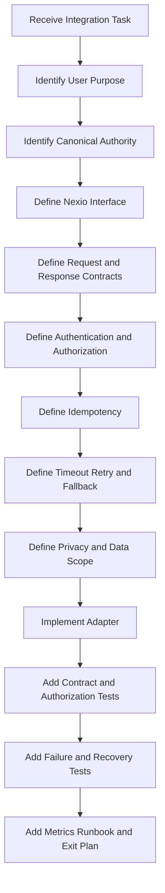

# Nexio API and Integrations Specification

Version: 1.0  
Status: Official  
Authority Level: External Interface, Provider Integration and API Contract Standard  
Applies To: Web, Android, Supabase, Authentication, Synchronization, Attachments, Notifications, Assistant, Imports, Exports, Analytics, Support Tools and Future External Integrations

---

# Purpose

This document defines the official API and Integration architecture of Nexio.

It establishes requirements for:

- Internal application APIs
- Remote service APIs
- Supabase integration
- Authentication integration
- Provider adapters
- Webhooks
- Event callbacks
- Imports
- Exports
- Attachment storage
- Notification providers
- Assistant providers
- Analytics providers
- External identity providers
- API versioning
- Schema evolution
- Idempotency
- Authentication and authorization
- Request validation
- Response validation
- Pagination
- Rate limiting
- Retry
- Timeout
- Circuit breaking
- Webhook verification
- Data minimization
- Error contracts
- Observability
- Testing
- Provider migration
- Integration governance
- AI implementation restrictions

Nexio integrations must preserve:

```text
Financial correctness

Ownership isolation

Authentication

Authorization

Privacy

Accessibility

Local-first durability

Synchronization semantics

User confirmation

Operational recoverability
```

An external provider must never become the unquestioned source of canonical financial meaning.

---

# Relationship with Other Documents

This document must be interpreted together with:

```text
docs/00-FOUNDATION.md
docs/01-ARCHITECTURE.md
docs/02-DESIGN-SYSTEM.md
docs/03-DESKTOP.md
docs/04-TABLET.md
docs/05-MOBILE.md
docs/06-DATA-MODEL.md
docs/07-SECURITY.md
docs/08-OFFLINE-AND-SYNC.md
docs/09-TESTING.md
docs/10-DEPLOYMENT-AND-OPERATIONS.md
docs/11-INTERNATIONALIZATION-AND-CONTENT.md
docs/12-ASSISTANT-AND-AI.md
docs/13-PRIVACY-AND-DATA-GOVERNANCE.md
docs/14-ACCESSIBILITY.md
docs/15-PERFORMANCE-AND-RELIABILITY.md
docs/16-ANALYTICS-AND-EXPERIMENTATION.md
```

Responsibilities are divided as follows:

| Document | Responsibility |
|---|---|
| `00-FOUNDATION.md` | Product trust and financial principles |
| `01-ARCHITECTURE.md` | Dependency direction and module boundaries |
| `05-MOBILE.md` | Capacitor and Android integration |
| `06-DATA-MODEL.md` | Canonical entities and financial meaning |
| `07-SECURITY.md` | Authentication, authorization and secrets |
| `08-OFFLINE-AND-SYNC.md` | Synchronization protocol and local durability |
| `09-TESTING.md` | Contract, integration and end-to-end testing |
| `10-DEPLOYMENT-AND-OPERATIONS.md` | Environment and operational controls |
| `11-INTERNATIONALIZATION-AND-CONTENT.md` | Locale-safe external content |
| `12-ASSISTANT-AND-AI.md` | AI provider and tool contracts |
| `13-PRIVACY-AND-DATA-GOVERNANCE.md` | Provider, purpose and retention governance |
| `14-ACCESSIBILITY.md` | Accessible provider-dependent journeys |
| `15-PERFORMANCE-AND-RELIABILITY.md` | Timeout, retry, capacity and degradation |
| `16-ANALYTICS-AND-EXPERIMENTATION.md` | Analytics provider and event contracts |
| `17-API-AND-INTEGRATIONS.md` | External interfaces and integration governance |

Where requirements conflict, the stronger financial, Security, Privacy, Accessibility and durability requirement prevails.

---

# Current Repository Integration Anchors

The repository contains integration-sensitive files such as:

```text
app.js
mobile-capacitor.js
supabase-config.js
supabase-schema.sql
i18n.js
vercel.json
package.json
android/
android-web/
capacitor-overrides/android/
js/core/
js/ui/
```

Recommended responsibility:

| Location | Integration Responsibility |
|---|---|
| `supabase-config.js` | Supabase client configuration without embedded secrets |
| `supabase-schema.sql` | Database, RLS, functions, triggers and integration tables |
| `app.js` | Application startup and integration orchestration |
| `js/core/` | Provider-neutral services and adapters |
| `mobile-capacitor.js` | Native bridge and Android provider interaction |
| `android/` | Native permissions, deep links and provider configuration |
| `vercel.json` | Web routing, headers and serverless integration behavior |
| `i18n.js` | Localized provider and integration messages |
| `docs/17-API-AND-INTEGRATIONS.md` | Authoritative integration contract |

Provider-specific logic should not spread through feature UI modules.

---

# Integration Constitutional Principles

## Canonical Domain Meaning Remains Internal

External services may provide:

- Transport
- Storage
- Authentication
- Notification
- Analysis
- Delivery
- Parsing
- Hosting

They must not redefine:

- Money representation
- Transfer classification
- Currency rules
- Transaction status
- Account ownership
- Goal progress
- Conflict semantics
- Deletion semantics

Provider output must be translated into Nexio Domain contracts.

---

## Provider APIs Are Untrusted Boundaries

Every provider response must be treated as:

```text
Untrusted external input
```

Responses require:

- Authentication verification
- Schema validation
- Type validation
- Size limits
- Ownership validation
- State-transition validation
- Error handling

Successful HTTP transport does not prove valid Domain content.

---

## Integrations Must Use Adapters

Feature code must depend on application interfaces.

Preferred:

```text
NotificationService

AttachmentStorage

AssistantProvider

AnalyticsProvider

AuthenticationProvider

RemoteRepository
```

Avoid:

```text
Feature UI directly calling provider SDK
```

---

## Provider Failure Must Remain Isolated

Failure of:

```text
Assistant provider

Analytics provider

Notification provider

Attachment preview provider
```

must not normally prevent:

```text
Viewing local Transactions

Creating a durable local Transaction

Reviewing Accounts

Using privacy controls

Exporting locally available data

Signing out
```

---

## Local-First Commands Must Not Depend on Optional Providers

A Transaction Save must not wait for:

- Analytics
- AI
- Push Notification
- Email
- External reporting
- Nonessential Attachment processing

---

## Authentication Does Not Replace Authorization

A valid provider session proves identity only within the approved authentication contract.

Every protected resource must still enforce:

- Current owner
- RLS
- Entity relationship
- Requested operation
- Current authorization state

---

## Client Input Is Untrusted

Requests from:

- Web
- Android
- WebView
- Deep link
- Import
- Assistant
- Support tool

must be validated through the same authoritative service boundaries.

---

## Server Responses Are Also Untrusted

A malformed, stale or compromised provider response must not silently enter canonical state.

Validate:

- Schema
- Version
- Owner
- Entity state
- Currency
- Money representation
- Date
- Expected operation
- Request correlation

---

## Every Mutation Requires Stable Identity

Mutations that may be retried require an idempotency or operation identity.

Examples:

```text
Synchronization operation

Export request

Import commit

Attachment upload completion

Account deletion step

Assistant-confirmed command

Webhook delivery
```

---

## Timeouts Are Mandatory

No provider request may wait indefinitely.

Every integration operation requires:

- Timeout
- Retry classification
- Cancellation behavior
- User-visible fallback
- Operational signal

---

## Retries Must Be Bounded

Retries require:

- Retryable error
- Maximum attempts
- Backoff
- Jitter where appropriate
- Stable operation identity
- Expiration or final state

---

## Provider Configuration Must Be Environment-Specific

Development, Preview, Staging and Production must use separate:

- URLs
- Keys
- Projects
- Webhook secrets
- Buckets
- Analytics destinations
- Notification credentials

---

## Secrets Must Remain Outside Client Bundles

The following must never be embedded in public Web or Android assets:

```text
Service-role keys

Database passwords

Webhook signing secrets

Private API keys

Provider administrative tokens

Encryption master keys
```

Public client identifiers may be embedded only when designed for public use and protected by server-side authorization.

---

## Integrations Must Minimize Data

Each provider request must send only the fields required for the approved purpose.

Example:

```text
Assistant Category summary:
Aggregate totals and period
```

not:

```text
Complete Transaction history with notes
```

---

## Webhooks Must Be Verified Before Processing

Webhook processing must verify:

- Signature
- Secret or key
- Timestamp
- Replay window
- Provider identity
- Event schema
- Event ID

No state mutation should occur before verification.

---

## Webhooks Are At-Least-Once by Default

The same webhook may be delivered more than once.

Webhook handlers must be idempotent.

---

## Provider Delivery Order Must Not Be Assumed

Webhook or callback events may arrive:

- Late
- Duplicated
- Out of order
- After cancellation
- After entity deletion

Handlers must reconcile against current canonical state.

---

## API Success Must Reflect Actual State

A `2xx` response must not be returned before the defined operation acceptance condition.

For asynchronous work, return:

```text
Accepted

Job ID

Current state

Polling or callback contract
```

rather than claiming completion.

---

## Errors Must Be Safe and Actionable

External error details may contain:

- Infrastructure names
- Tokens
- Internal identifiers
- User content
- Provider stack traces

They must not be displayed or logged without redaction.

---

## Integration Removal Must Be Planned

Every provider requires an exit strategy.

The strategy must identify:

- Data export
- Data deletion
- Credential revocation
- Replacement
- Client update
- Webhook removal
- DNS or endpoint changes
- Historical record handling

---

# Integration Goals

The Nexio Integration architecture should provide:

```text
Stable internal interfaces

Provider independence

Secure authentication

Reliable idempotent mutations

Versioned contracts

Minimal data exchange

Bounded failure

Observable provider health

Safe migration

Offline-compatible behavior

Consistent errors

Testable adapters

Controlled external dependencies
```

---

# Integration Terminology

## Integration

A connection between Nexio and another system or platform capability.

## Provider

An external system supplying a service.

## Adapter

A Nexio-owned module translating between application interfaces and provider APIs.

## API Contract

The documented request, response, error and lifecycle behavior of an interface.

## Command

An instruction that may change state.

## Query

A request that reads state without changing canonical data.

## Idempotency Key

A stable value identifying one logical mutation.

## Correlation ID

A safe identifier connecting logs, requests and operations.

## Webhook

A provider-initiated HTTP callback.

## Callback

A provider response delivered later through a registered mechanism.

## Polling

Repeatedly requesting status.

## Circuit Breaker

A control that temporarily stops calls after repeated failure.

## Rate Limit

A provider or Nexio boundary limiting requests during a period.

## Backpressure

A mechanism limiting new work when a downstream system is saturated.

## Provider Drift

An undocumented or unexpected provider behavior or configuration change.

## Contract Test

A test verifying that both sides follow the agreed interface.

---

# Integration Responsibility Model

Recommended roles:

```text
Integration Owner

Provider Owner

Domain Owner

Security Owner

Privacy Owner

Operations Owner

Quality Owner

Release Owner
```

---

# Integration Owner

Responsible for:

- Internal interface
- Adapter
- Request and response schemas
- Error mapping
- Versioning
- Idempotency
- Fallback
- Documentation

---

# Provider Owner

Responsible for:

- Provider account
- Contract
- Configuration
- Service status
- Quotas
- Credentials
- Support relationship
- Provider migration

---

# Domain Owner

Responsible for:

- Canonical interpretation
- Allowed state transitions
- Financial validation
- Provider-to-Domain mapping
- Derived-data boundaries

---

# Security Owner

Responsible for:

- Authentication
- Authorization
- Secrets
- Webhook verification
- Provider access
- Threat review
- Incident response

---

# Privacy Owner

Responsible for:

- Purpose
- Data minimization
- Region
- Retention
- Provider deletion
- User choice
- International processing review

---

# Operations Owner

Responsible for:

- Monitoring
- Alerts
- Capacity
- Runbooks
- Circuit breakers
- Provider incidents
- Credential rotation

---

# Quality Owner

Responsible for:

- Contract tests
- Failure injection
- Retry tests
- Idempotency tests
- Environment tests
- Provider sandbox tests
- Regression coverage

---

# Integration Classification

Recommended categories:

```text
Core infrastructure

Authentication

Financial data

Storage

Notification

Assistant or AI

Analytics

Import source

Export destination

Native platform

Support
```

---

# Criticality Classification

Recommended:

```text
Critical

High

Moderate

Optional
```

---

# Critical Integration

Failure may prevent:

- Authentication
- Local data opening
- Financial synchronization
- Protected deletion
- Ownership enforcement

Requires:

- Strong monitoring
- Tested fallback
- Incident runbook
- Capacity review
- Recovery objective

---

# High Integration

Failure significantly reduces an important feature.

Examples:

- Attachment storage
- Complete export worker
- Notification delivery

---

# Moderate Integration

Failure affects a non-core capability with a clear fallback.

---

# Optional Integration

Failure should have minimal effect on core financial use.

Examples:

- Analytics
- Optional Assistant
- Decorative content service

---

# Integration Registry

Every Production integration requires a registry entry.

Recommended fields:

```text
Integration ID

Provider

Purpose

Category

Criticality

Owner

Data categories

Environments

Regions

Authentication method

Authorization model

Base URLs

Timeouts

Retry policy

Rate limits

Idempotency behavior

Webhook behavior

Retention

Deletion behavior

Fallback

Circuit breaker

Monitoring

Exit plan

Contract version
```

---

# Integration Record Example

```yaml
integration_id: supabase_primary
provider: supabase
purpose: authenticated_remote_persistence_and_sync
category: core_infrastructure
criticality: critical
data_categories:
  - account_data
  - transaction_data
  - profile_preferences
authentication_method: user_session_jwt
authorization_model: row_level_security
timeouts:
  interactive_query: bounded
  sync_batch: bounded
retry_policy:
  read: bounded_backoff
  mutation: stable_operation_id
webhooks: none_or_registered_separately
fallback: local_only_mode
owner: platform_owner
contract_version: 1
```

---

# Integration Architecture

Recommended layers:

```text
Feature UI

↓

Application Service

↓

Integration Interface

↓

Provider Adapter

↓

Transport Client

↓

External Provider
```

---

# Feature UI

The UI should know:

- User action
- Loading state
- Result
- Error category
- Recovery action

It should not know:

- Provider endpoint
- Provider token
- Provider-specific error code
- Webhook implementation
- Retry algorithm

---

# Application Service

The Application Service:

- Validates user intent
- Applies Domain rules
- Calls one or more integration interfaces
- Preserves transaction boundaries
- Maps result to user-facing state
- Coordinates fallback

---

# Integration Interface

Conceptual:

```typescript
interface NotificationService {
  schedule(request: NotificationRequest): Promise<NotificationResult>;
  cancel(notificationId: string): Promise<void>;
}
```

The interface should use Nexio-owned types.

---

# Provider Adapter

The adapter:

- Builds provider request
- Adds authentication
- Applies timeout
- Calls provider
- Validates response
- Maps errors
- Returns Nexio result

---

# Transport Client

The transport layer manages:

- HTTP
- Headers
- Timeout
- Cancellation
- Retry where appropriate
- Correlation
- Safe diagnostics

---

# No Provider Types Above Adapter

Provider SDK types must not become Domain or feature types.

Avoid:

```typescript
function saveTransaction(row: SupabaseTransactionRow)
```

Preferred:

```typescript
function saveTransaction(transaction: TransactionRecord)
```

Mapping belongs in the repository or adapter.

---

# Integration Dependency Direction

Allowed:

```text
Feature

→ Application interface

→ Adapter

→ Provider
```

Prohibited:

```text
Provider SDK

→ Domain rule

Provider response

→ UI without validation

Feature

→ Provider administrative API
```

---

# Internal API Contracts

Nexio should define stable internal service contracts.

Potential services:

```text
AuthenticationService

ProfileService

AccountService

TransactionService

CategoryService

GoalService

ReportService

SynchronizationService

AttachmentService

NotificationService

ExportService

ImportService

AssistantService

AnalyticsService
```

---

# Command Contract

A command should define:

```text
Command name

Input schema

Current owner

Preconditions

Idempotency

Validation

State transition

Durability point

Result

Error categories

Side effects
```

---

# Query Contract

A query should define:

```text
Query name

Input filters

Owner scope

Pagination

Stable ordering

Returned projection

Freshness

Partial-data behavior

Errors
```

---

# Integration Request Envelope

A remote request may use a standard safe envelope.

Conceptual:

```json
{
  "requestId": "uuid",
  "operationId": "uuid",
  "contractVersion": 1,
  "occurredAt": "timestamp",
  "payload": {}
}
```

Not every provider supports this structure directly.

The adapter should preserve equivalent metadata where possible.

---

# Correlation ID

A correlation ID should:

- Be random
- Be non-sensitive
- Be generated per request or workflow
- Be returned in safe error responses where useful
- Connect logs across systems

It must not contain:

- Email
- User ID
- Transaction ID
- Amount
- Account name

---

# Operation ID

An operation ID identifies one logical mutation.

It should remain stable across:

- Retry
- Timeout reconciliation
- Process restart
- Network reconnect
- Provider retry

---

# Request Validation

Validate before external transmission:

```text
Schema

Required fields

Type

Maximum size

Allowed values

Ownership

Current entity version

Purpose

Provider permission

Consent or preference where applicable
```

---

# Response Validation

Validate after provider response:

```text
HTTP status

Content type

Maximum size

Schema

Version

Required fields

Allowed enum

Identifier format

Expected owner relationship

Expected operation identity
```

---

# Unknown Response Fields

Unknown provider fields should be ignored only when:

- The contract permits additive fields.
- Required meaning remains valid.
- No security decision depends on them.

Unexpected structural changes should alert.

---

# Response Size Limits

Every provider response requires a maximum accepted size.

Oversized responses should be rejected before uncontrolled parsing or memory allocation.

---

# Content-Type Validation

Do not parse a response as JSON merely because JSON was expected.

Verify the actual content type and handle provider HTML error pages safely.

---

# API Versioning

Nexio contracts require explicit versioning.

Potential strategies:

```text
URL version

Header version

Schema version

Operation version
```

---

# Internal Contract Version

Internal adapters should expose a Nexio contract version independent of provider API version.

Example:

```text
Nexio AttachmentStorage Contract v2

Provider API 2026-04
```

---

# Versioning Principles

A version change is required when:

- Request meaning changes.
- Required field changes.
- Money representation changes.
- State-transition meaning changes.
- Error meaning changes.
- Authentication method changes materially.
- Idempotency behavior changes.

---

# Backward-Compatible Change

Potentially compatible:

- Add optional response field
- Add new enum value with safe unknown handling
- Add optional request field
- Improve error metadata

Compatibility must be tested, not assumed.

---

# Breaking Change

Examples:

- Rename required field
- Change Money units
- Change Date interpretation
- Change status meaning
- Remove response field
- Change pagination cursor semantics
- Change webhook signature

---

# Version Negotiation

Where required, the client may send:

```text
Supported contract versions
```

The server should select a compatible version or reject explicitly.

Do not silently downgrade to behavior with weaker Security or financial guarantees.

---

# Version Support Window

Each integration should define:

```text
Current version

Previously supported versions

Deprecation date

Removal date

Migration path

Unsupported-client behavior
```

---

# Unsupported Client

When the client is too old:

- Explain that an update is required.
- Preserve local data.
- Preserve export where safe.
- Avoid corrupt writes.
- Avoid repeated failing synchronization.

---

# Deprecation Communication

Deprecation should include:

- Owner
- Affected clients
- Replacement
- Timeline
- Telemetry
- Rollback
- Documentation

---

# Schema Evolution

Schemas should be:

- Explicit
- Machine-validatable
- Versioned
- Tested
- Backward-aware
- Privacy-reviewed

---

# Schema Naming

Use stable canonical names.

Avoid provider-specific abbreviations in application contracts.

---

# Optional Fields

An optional field should define:

- Meaning when absent
- Meaning when `null`
- Default behavior
- Export behavior
- Version support

Absence and `null` must not be treated interchangeably without definition.

---

# Enum Evolution

Clients must define behavior for unknown enum values.

Potential strategies:

```text
Reject

Map to unknown

Disable affected action

Request update
```

For financial statuses, silent fallback is generally unsafe.

---

# Date Contract

Dates must define whether they represent:

```text
Calendar Date

Instant

Local Date-Time

UTC Timestamp

Period boundary
```

Do not transmit ambiguous date strings.

---

# Money Contract

Money must use canonical representation.

Conceptual:

```json
{
  "amountMinor": 18540,
  "currency": "BRL"
}
```

or another approved exact representation.

Do not use binary floating-point for authoritative Money.

---

# Currency Contract

Currency must be explicit whenever more than one Currency is possible.

Do not infer Currency from:

- Locale
- Device
- Provider country
- Symbol alone

---

# Identifier Contract

Identifiers should:

- Use stable format
- Remain opaque
- Avoid business meaning
- Avoid embedding user information
- Avoid sequential enumeration when exposed externally

---

# Boolean Contract

Avoid nullable booleans when a richer state exists.

Instead of:

```text
success:
true or false
```

prefer:

```text
state:
queued
processing
completed
failed
```

---

# Pagination Contract

Large query APIs require pagination.

Recommended response:

```json
{
  "items": [],
  "nextCursor": "opaque-or-null",
  "hasMore": true
}
```

---

# Cursor Principles

A cursor should be:

- Opaque to clients
- Bound to the query shape
- Stable within documented limits
- Free of sensitive plaintext where possible
- Invalidated safely after material query change

---

# Stable Pagination

Pagination requires deterministic ordering.

Example:

```text
transaction_date descending

created_at descending

transaction_id descending
```

---

# Pagination Scope

Cursor validation should include:

- Owner
- Filters
- Sort
- Contract version
- Expiration where applicable

A cursor from User A must not work for User B.

---

# Empty Pagination

An empty result is not automatically an error.

The API should return:

```text
items:
[]

nextCursor:
null
```

---

# Pagination Error

Invalid or expired cursor should return a specific safe error category.

The UI may restart the query rather than displaying a raw provider error.

---

# Filtering Contract

Filter fields must be allowlisted.

Avoid passing arbitrary database expressions from clients.

---

# Sorting Contract

Sorting should use approved fields and directions.

Example:

```text
sort:
transaction_date

direction:
descending
```

No raw SQL fragments.

---

# Search Contract

Search should define:

- Searchable fields
- Normalization
- Maximum query length
- Result limit
- Pagination
- Privacy handling
- Injection prevention

---

# Free-Text Search

User search text must not enter:

- Analytics
- Logs
- Provider systems unrelated to search
- URLs when avoidable

---

# Authentication Architecture

Authentication integration should expose Nexio-owned session behavior.

Recommended internal interface:

```typescript
interface AuthenticationService {
  restoreSession(): Promise<SessionState>;
  signIn(command: SignInCommand): Promise<SignInResult>;
  signOut(): Promise<void>;
  requireRecentAuthentication(purpose: ProtectedPurpose): Promise<RecentAuthResult>;
}
```

---

# Authentication States

Recommended:

```text
unknown

restoring

anonymous

authenticated

expired

revoked

reauthentication_required

unavailable
```

---

# Session Contract

A session should expose only what the application needs.

Potential:

```text
owner reference

expiration

authentication method

recent-authentication state

refresh state
```

Do not expose raw token broadly through application state.

---

# Token Storage

Tokens must use the approved secure storage strategy.

They must not be stored in:

- Logs
- Analytics
- URLs
- Plain exports
- Assistant context
- Support diagnostics

---

# Token Refresh

Refresh must:

- Be bounded
- Deduplicate simultaneous refresh
- Validate owner
- Handle revocation
- Clear stale session
- Cancel or pause protected requests
- Avoid retry loops

---

# Single-Flight Refresh

When many requests discover expiration simultaneously, one refresh operation should coordinate the result.

Avoid many simultaneous refresh requests.

---

# Authentication Failure Mapping

Provider errors should map to safe categories:

```text
invalid_credentials

session_expired

session_revoked

provider_unavailable

rate_limited

network_error

unknown
```

---

# Authorization Architecture

Authorization must remain server-enforced.

Client checks improve user experience but are not security boundaries.

---

# RLS Integration

Supabase queries must rely on approved RLS policies.

Adapters should not use administrative credentials in clients.

---

# Administrative Operations

Administrative or maintenance actions require:

- Server-side trusted environment
- Explicit authorization
- Audit
- Purpose
- Least privilege
- Rate limiting

---

# Recent Authentication

Protected operations may require recent authentication.

Examples:

- Complete export
- Account deletion
- Sensitive credential change
- Session management

---

# Recent Authentication Contract

The integration should define:

```text
Protected purpose

Allowed authentication age

Provider flow

Success state

Cancellation

Return destination
```

---

# Idempotency Architecture

Idempotency ensures one logical command produces one logical result despite retry.

---

# Idempotency Scope

An idempotency key should be scoped to:

```text
Owner

Operation type

Logical command
```

---

# Idempotency Record

Potential fields:

```text
operation_id

owner_id

operation_type

request_hash

state

result_reference

created_at

completed_at

expires_at
```

---

# Request Hash

A request hash may detect accidental reuse of the same operation ID with different payload.

The hash must use canonical serialized input.

---

# Idempotency Conflict

If the same operation ID arrives with a different request hash:

- Reject.
- Record safe diagnostic.
- Do not execute.
- Return a specific conflict category.

---

# Idempotency States

Recommended:

```text
received

processing

completed

failed_retryable

failed_final

unknown
```

---

# Idempotent Completed Response

A retry after completion should return the original logical result.

It should not perform the mutation again.

---

# Processing State

When a duplicate request arrives while the first is still processing:

Potential response:

```text
processing

retry_after

status_endpoint
```

---

# Idempotency Expiration

Expiration must be long enough to cover:

- Network retries
- Offline reconnect
- Provider delay
- Client restart

It must not be so short that a delayed retry duplicates a financial mutation.

---

# Idempotency and Local Queue

The same operation ID should connect:

```text
Local queue record

Remote command

Remote result

Reconciliation

Operational trace
```

---

# Idempotency Anti-Patterns

Prohibited:

```text
Generate new operation ID on every retry.

Use current timestamp as the only identity.

Treat HTTP timeout as confirmed failure.

Delete operation identity before reconciliation.

Use Transaction ID as a substitute without defining creation semantics.
```

---

# Timeout Architecture

Every integration operation requires a timeout budget.

Potential classes:

```text
Interactive read

Interactive command

Background synchronization

Large upload

Large export job submission

Assistant request

Webhook processing
```

---

# Connect Timeout

Limits time establishing a connection.

---

# Response Timeout

Limits waiting for provider response.

---

# Total Operation Timeout

Limits the complete operation, including retries.

---

# Timeout Result

A timeout may mean:

```text
No request reached provider

Provider received but did not complete

Provider completed but response was lost

Unknown outcome
```

Mutation timeouts must not automatically be treated as definite failure.

---

# Unknown Outcome

Unknown outcome requires:

- Stable operation ID
- Status reconciliation
- No duplicate command
- Clear user state
- Bounded retry

---

# Retry Architecture

Retry classification should distinguish:

```text
Retryable

Non-retryable

Requires user action

Unknown outcome

Conflict
```

---

# Retryable Errors

Potential:

- Temporary network failure
- Provider `5xx`
- Rate limit
- Temporary timeout
- Temporary connection failure

---

# Non-Retryable Errors

Potential:

- Invalid schema
- Unauthorized operation
- Unsupported version
- Domain validation failure
- Deleted entity
- Invalid signature

---

# User-Action Errors

Potential:

- Authentication required
- Permission required
- File replacement required
- Conflict review required

---

# Retry Backoff

Use bounded exponential backoff with jitter where appropriate.

---

# Retry-After

Respect provider `Retry-After` when valid and within approved limits.

Do not accept an extreme value without bounds.

---

# Foreground Retry

User-triggered Retry may bypass part of a background delay when safe.

It must not create concurrent duplicate mutations.

---

# Circuit Breaker Architecture

Circuit breaker states:

```text
closed

open

half_open
```

---

# Closed

Requests flow normally.

---

# Open

Requests fail fast or use fallback after repeated provider failure.

---

# Half Open

A bounded number of probe requests test recovery.

---

# Circuit Breaker Scope

A breaker may be scoped by:

```text
Provider

Capability

Region

Endpoint

Owner-independent global state
```

Do not open all Nexio capabilities because one optional provider endpoint failed.

---

# Circuit Breaker User Experience

The UI should expose the feature result, not internal breaker terminology.

Example:

```text
The Assistant is temporarily unavailable.

Manual financial tools remain available.
```

---

# Bulkhead Architecture

Resource isolation should prevent one provider or job type from consuming all capacity.

Potential bulkheads:

```text
Interactive commands

Synchronization

Exports

Imports

Assistant

Attachments

Notifications

Analytics
```

---

# Rate Limiting

Nexio should implement rate limits at appropriate boundaries.

Potential dimensions:

```text
IP

Anonymous installation

Authenticated owner

Operation type

Provider account

Webhook sender
```

---

# Rate-Limit Response

Recommended safe response:

```text
rate_limited

retry_after

correlation_id
```

---

# Rate-Limit User Experience

Explain:

- The action is temporarily limited.
- Whether retry is automatic.
- When manual retry is available.
- Whether the user's draft remains safe.

---

# Rate-Limit Security

Rate limiting must not reveal whether a specific Account exists.

---

# Backpressure

When downstream capacity is limited:

- Reject or delay optional work.
- Reduce batch size.
- Limit concurrency.
- Preserve confirmed financial commands.
- Surface queue state.
- Alert operations.

---

# Error Contract

External and internal errors should map to a stable Nexio error model.

---

# Error Shape

Conceptual:

```json
{
  "error": {
    "code": "authentication_required",
    "category": "authentication",
    "retryable": false,
    "userAction": "sign_in",
    "correlationId": "uuid"
  }
}
```

---

# Error Categories

Recommended:

```text
validation

authentication

authorization

not_found

conflict

rate_limit

network

provider

timeout

unsupported_version

storage

integrity

unknown_outcome

unavailable

cancelled
```

---

# Error Code Stability

Error codes should remain stable enough for:

- UI mapping
- Accessibility announcements
- Retry behavior
- Testing
- Support
- Metrics

---

# Error Message Ownership

Provider error text should not be shown directly.

User-facing content belongs to Nexio localization.

---

# Provider Error Mapping

Example:

```text
Provider:
invalid_grant

Nexio:
session_expired
```

---

# Unknown Error

Unknown provider errors should:

- Use a safe generic user message.
- Preserve correlation reference.
- Record redacted technical details.
- Avoid exposing provider internals.

---

# Validation Error Contract

Validation errors may identify:

```text
field

code

safe parameters
```

Example:

```json
{
  "field": "destinationAccount",
  "code": "same_as_source"
}
```

Do not return the full invalid payload unnecessarily.

---

# Conflict Error Contract

A conflict response should provide enough safe information to open the Conflict Center.

Potential:

```text
entity reference

expected version

current version

conflict ID

resolution options
```

---

# Partial Failure Contract

Batch operations must define whether a partial result is possible.

Potential response:

```json
{
  "state": "partially_completed",
  "completedCount": 90,
  "failedCount": 4,
  "resultReference": "opaque-id"
}
```

Counts must not substitute a detailed user review where individual recovery is required.

---

# Asynchronous Job Contract

Large operations should use durable jobs.

Examples:

- Complete export
- Category Merge
- Large Import
- Provider deletion
- Large attachment package

---

# Job States

Recommended:

```text
queued

processing

waiting_for_provider

needs_review

completed

partially_completed

failed_retryable

failed_final

cancelled

expired
```

---

# Job Creation

A job creation response should include:

```text
job_id

operation_id

state

created_at

status_endpoint or subscription
```

---

# Job Status

The status endpoint should:

- Require authorization
- Validate owner
- Return bounded progress
- Return current phase
- Avoid raw provider payload
- Support caching only where safe

---

# Job Progress

Use actual measurable progress.

Potential:

```text
current_phase

completed_units

total_units
```

When total is unknown, expose only phase.

---

# Job Cancellation

Cancellation should define:

- Cancellable states
- Best-effort behavior
- Partial output cleanup
- Financial effect
- Final state

---

# Job Expiration

Temporary job results require:

- Expiration timestamp
- Cleanup
- Revocation
- User-facing notice
- Provider cleanup

---

# Webhook Architecture

Webhook processing should use:

```text
Public endpoint

↓

Transport validation

↓

Signature verification

↓

Replay protection

↓

Schema validation

↓

Idempotency check

↓

Canonical state reconciliation

↓

Durable processing record

↓

Response
```

---

# Webhook Endpoint Requirements

Webhook endpoints should:

- Use HTTPS
- Accept only required methods
- Limit request size
- Validate content type
- Apply provider-specific rate limits
- Return bounded responses
- Avoid detailed internal errors

---

# Webhook Signature Verification

Verify against the exact raw request body when required by the provider protocol.

Do not parse and reserialize before verification.

---

# Webhook Secret Storage

Signing secrets must remain in server-side secret management.

They must not appear in:

- Client code
- Repository
- Logs
- Support diagnostics
- Analytics

---

# Webhook Timestamp

Where supported, verify that the webhook timestamp is within the approved replay window.

---

# Replay Protection

Use:

```text
Provider event ID

Signature

Timestamp

Processing ledger
```

---

# Webhook Event Ledger

Potential fields:

```text
provider

provider_event_id

event_type

received_at

verified_at

processing_state

attempt_count

result_reference

expires_at
```

---

# Webhook Idempotency

A duplicate provider event ID should not repeat the business mutation.

---

# Webhook Response Timing

A provider may require a fast acknowledgment.

When processing is long:

1. Verify.
2. Persist the event.
3. Acknowledge acceptance.
4. Process asynchronously.

Do not acknowledge unverified content.

---

# Webhook Processing Order

Do not rely on provider order.

Reconcile against current provider and Nexio state.

---

# Webhook Unknown Event

Unknown event types should:

- Be safely recorded in bounded diagnostics.
- Avoid mutation.
- Return the provider-required acknowledgment policy.
- Trigger compatibility review when repeated.

---

# Webhook Schema Version

Provider event version must be validated.

Unsupported versions should not be guessed.

---

# Webhook Deletion Event

Provider deletion or revocation events should:

- Verify owner relationship.
- Reconcile current state.
- Avoid deleting unrelated Nexio records.
- Record durable processing result.

---

# Webhook Retry

Provider retries should return the same logical processing result after idempotent handling.

---

# Webhook Dead-Letter State

Repeated processing failure may move the verified event to:

```text
needs_review

or

dead_letter
```

It must remain observable and access-controlled.

---

# Callback and Deep-Link Architecture

External authentication or provider workflows may return through:

- Browser callback
- Android deep link
- Universal or app link
- Custom scheme
- Redirect URL

---

# Callback State

Callbacks should use an unguessable state parameter where the protocol supports it.

Validate:

- State
- Nonce
- Expected provider
- Expected flow
- Expiration
- Current session

---

# Callback URL

Callback URLs must not contain:

- Long-lived token
- Financial data
- User-generated text
- Account name
- Export file

---

# Deep-Link Authorization

Opening a deep link does not authorize the destination.

The application must revalidate:

- Session
- Owner
- Entity
- Action
- Current state

---

# Deep-Link Failure

If the destination no longer exists:

- Open a safe fallback.
- Explain that the item is unavailable.
- Do not reveal whether another user's entity exists.

---

# Android Deep Links

Android configuration must ensure:

- Only approved hosts and paths
- Appropriate exported-component settings
- Validation inside the application
- Safe browser fallback
- No provider token logging

---

# Redirect Allowlist

Authentication and provider redirects must use an explicit allowlist.

Avoid arbitrary user-supplied redirect destinations.

---

# File Integration Architecture

External files may enter Nexio through:

```text
Browser file picker

Android file picker

Camera

Share sheet

Drag and drop

Provider download
```

All file inputs remain untrusted.

---

# File Preflight

Before processing:

- Validate maximum size.
- Validate extension as a hint.
- Validate MIME type.
- Inspect supported file signature where practical.
- Reject unsupported content.
- Create bounded temporary reference.
- Avoid executing embedded content.

---

# File Name

Filename is untrusted user-generated content.

It must:

- Be escaped
- Be length-limited
- Be excluded from Analytics
- Be excluded from logs where unnecessary
- Be normalized for safe display

---

# MIME Type

Provider or browser MIME type is not authoritative by itself.

---

# File Streaming

Large files should be streamed or chunked when possible.

Avoid loading complete files into memory unnecessarily.

---

# File Hashing

A checksum may support:

- Upload integrity
- Duplicate detection
- Resumable upload

Hashing should not block the main thread for large files.

---

# Attachment Upload Contract

Potential request metadata:

```text
operation_id

parent_entity_type

parent_entity_reference

content_type

size

checksum

upload_session
```

---

# Attachment Upload Completion

Completion should be verified against:

- Provider object identity
- Expected checksum
- Expected owner namespace
- Expected size
- Current parent entity
- Stable operation ID

---

# Signed URL Contract

Signed URLs should be:

- Short-lived
- Purpose-specific
- Owner-authorized
- Non-public
- Regenerable
- Revocable where possible

---

# Signed URL Prohibitions

Do not:

- Store long-lived signed URLs as canonical entity fields.
- Put them in Analytics.
- Put them in support logs.
- Reuse them across owners.
- Embed them in public pages.

---

# Storage Namespace

Objects should use owner-scoped and environment-scoped namespaces.

Object path alone does not replace authorization policy.

---

# Provider Region

Storage region must follow the approved provider and Privacy registry.

---

# File Download

Before download:

- Reauthorize owner.
- Verify entity relationship.
- Generate temporary access.
- Apply safe filename.
- Set appropriate content disposition.
- Avoid caching private response publicly.

---

# Import Integration Contract

Imports may connect to:

- Local files
- Bank-generated files
- External financial exports
- Other application exports

---

# Import Source Adapter

Each import format should use a source adapter.

Conceptual:

```text
CSV Import Adapter

OFX Import Adapter

JSON Nexio Adapter

Provider-specific Adapter
```

---

# Import Source Contract

The adapter should produce a neutral intermediate record.

Conceptual:

```json
{
  "sourceRow": 14,
  "dateCandidate": "2026-07-24",
  "descriptionCandidate": "Supermarket",
  "amountCandidate": "185.40",
  "currencyCandidate": "BRL",
  "typeCandidate": "expense"
}
```

This is a temporary candidate, not a canonical Transaction.

---

# Import Candidate Validation

Candidates require:

- Parsing
- Normalization
- Domain validation
- User review
- Duplicate evaluation
- Final mapping

---

# Provider Import Data

External provider categories or account types must not silently become canonical Nexio Categories or Account types.

They require explicit mapping.

---

# Import Authentication

Remote imports require:

- Approved provider authorization
- Scope minimization
- Token protection
- Revocation
- Provider status
- User review

---

# Import Revocation

When the user disconnects an import provider:

- Stop future access.
- Revoke token where supported.
- Remove local provider credential.
- Preserve already confirmed canonical Transactions according to policy.
- Remove provider-specific cached data.

---

# Export Integration Contract

Exports may produce:

```text
CSV

JSON

PDF

ZIP

Provider-specific transfer
```

---

# Export Destination

External destinations require enhanced review.

Examples:

- Cloud storage
- Email
- Third-party financial provider

Local private download should remain available where supported.

---

# Export Destination Authorization

Before delivery to another provider:

- Authenticate destination
- Verify scope
- Show destination
- Show export contents
- Require explicit confirmation
- Record operation
- Support revocation where applicable

---

# Export Delivery

Export delivery must not be reported complete merely because the provider accepted an upload request.

Distinguish:

```text
upload accepted

processing

delivered

failed
```

---

# Provider Adapter Contract

Every Provider Adapter should define:

```text
Initialization

Configuration

Authentication

Request mapping

Response mapping

Timeout

Retry

Rate limit

Error mapping

Idempotency

Cancellation

Health check

Reset

Deletion

Observability
```

---

# Adapter Initialization

Initialization should be:

- Lazy where possible
- Idempotent
- Environment-aware
- Preference-aware
- Safe after repeated calls
- Resettable after Account switch where required

---

# Adapter Health

A health result may include:

```text
available

degraded

unavailable

misconfigured
```

Do not expose provider secret details.

---

# Adapter Reset

Reset should clear:

- Owner identity
- Session-specific provider state
- Pending requests
- Cached tokens
- Subscriptions

---

# Adapter Error Mapping

Provider-specific errors must be converted to Nexio error codes.

Feature code must not branch on raw provider error strings.

---

# Adapter Observability

Record:

```text
Provider

Capability

Duration

Result category

Retry count

Circuit state

Safe correlation
```

No financial payload.

---

# Integration Configuration

Configuration should be:

- Environment-specific
- Schema-validated
- Fail-closed where required
- Observable
- Versioned
- Free of secret exposure

---

# Configuration Sources

Potential:

```text
Build-time public configuration

Server-side environment secrets

Remote approved Feature Flags

Provider dashboard configuration
```

---

# Public Configuration

May include:

- Public project URL
- Public anonymous client key designed for browser use
- Application environment
- Public redirect URL

Only when server-side authorization remains enforced.

---

# Secret Configuration

Includes:

- Service-role key
- Webhook secret
- Private provider token
- Administrative credential
- Signing key

Server-side only.

---

# Configuration Validation

Startup or deployment should validate:

```text
Required fields

URL format

Environment match

Allowed region

Provider project ID

Feature compatibility

Secret presence server-side
```

---

# Misconfiguration Behavior

For optional provider:

```text
Disable provider

Use fallback

Alert operations
```

For critical provider:

```text
Enter controlled degraded mode

Prevent unsafe writes

Display accurate state

Alert operations
```

---

# Integration Observability

Every integration should expose:

```text
Request count

Success rate

Latency

Timeout rate

Retry rate

Rate-limit rate

Circuit state

Payload-size category

Queue depth

Oldest pending age
```

---

# Provider Status

Provider public status pages may support investigation, but Nexio must rely on actual service measurements for user-facing state.

---

# Integration Health Dashboard

Recommended sections:

```text
Authentication

Supabase

Synchronization

Storage

Notifications

Assistant

Analytics

Imports

Exports

Webhooks

Android bridge
```

---

# Integration Alerts

Critical alerts may include:

```text
Authentication session failure spike

RLS authorization anomaly

Financial mutation duplicate

Webhook signature failure spike

Cross-owner response detection

Unknown outcome growth

Provider credential failure

Webhook queue growth

Attachment public-access anomaly

Export delivery cross-owner failure
```

---

# Integration Logging

Safe integration logs may contain:

```text
Provider ID

Capability

Contract version

Correlation ID

Operation ID

Duration

Result category

Retry count

HTTP status category
```

They must not contain:

- Full request payload
- Full response payload
- Token
- Financial value
- User-generated text
- Signed URL
- Webhook secret
- File content

---

# Integration Anti-Patterns

The following are prohibited:

## Provider SDK in Feature UI

Direct use of external SDKs inside unrelated screens.

## Provider Types as Domain Types

Allowing provider row structures to become canonical entities.

## Authentication as Authorization

Trusting a valid token without owner and resource enforcement.

## Service Key in Client

Embedding administrative credentials in Web or Android assets.

## No Timeout

Waiting indefinitely for an external provider.

## Retry with New Operation ID

Duplicating logical mutations after timeout.

## Parse Before Signature Verification

Parsing or modifying webhook content before required signature validation.

## Webhook Without Idempotency

Executing duplicate provider callbacks more than once.

## Trust Delivery Order

Assuming webhooks arrive in order.

## Raw Provider Error in UI

Showing provider stack traces or codes directly.

## Raw Provider Error in Analytics

Sending full provider error messages.

## Floating-Point Money Contract

Using binary floating-point for authoritative Amount.

## Currency Inference from Locale

Assuming Currency from device language.

## Unbounded API Result

Returning complete financial histories without pagination.

## Raw SQL Filter

Accepting client-provided database expressions.

## Public Private-Data Cache

Caching owner responses in shared infrastructure.

## Long-Lived Signed URL

Persisting access URLs as permanent records.

## Callback Without State

Accepting an authentication callback without flow validation.

## Deep Link as Authorization

Opening protected content solely because a deep link contains an identifier.

## Provider Category as Canonical Category

Silently importing external classifications into Nexio Domain state.

## Optional Provider on Critical Save Path

Blocking financial persistence on Analytics, AI or Notification.

## Secret in Repository

Committing private credentials.

## Unknown Outcome as Definite Failure

Encouraging duplicate action after an uncertain remote result.

## Unversioned Contract

Changing request or response meaning without version governance.

## Flag as Authorization

Using a Feature Flag to permit protected access.

## Provider Lock-In Without Exit

Adding a provider without deletion and migration strategy.

---

# Part 1 Integration Review Questions

Before adding an integration, answer:

```text
What user purpose requires it?

Is the provider necessary?

Which data leaves Nexio?

Which canonical data returns?

Which adapter isolates it?

Which authentication applies?

Which authorization applies?

Which timeout applies?

Which retry applies?

Which operation identity applies?

Which fallback exists?

Which retention applies?

How is the provider disconnected?

How is data deleted?

How is provider failure contained?
```

---

# API Contract Review Questions

```text
Is the operation a command or query?

What is the request schema?

What is the response schema?

Which contract version applies?

How are Money and Currency represented?

How are Dates represented?

Which pagination strategy applies?

Which error categories exist?

What is the maximum payload?

How is ownership validated?
```

---

# Authentication Review Questions

```text
Where are tokens stored?

Which modules can access tokens?

How is refresh deduplicated?

What happens after revocation?

What happens offline?

What happens after Account switch?

Does authentication ever replace authorization?

Which protected actions require recent authentication?
```

---

# Idempotency Review Questions

```text
What identifies one logical command?

Where is the operation ID stored?

How long is it retained?

What happens after timeout?

What happens after process restart?

What happens if the same key has different payload?

How is the original result returned?
```

---

# Webhook Review Questions

```text
How is the signature verified?

Is the raw body preserved?

Which replay window applies?

Which event ID deduplicates delivery?

What is the maximum body size?

What happens for unknown event type?

What happens when processing fails?

Which state is authoritative?
```

---

# File Integration Review Questions

```text
What is the maximum size?

How is type validated?

Can processing stream?

Where is temporary content stored?

How is owner scope enforced?

When is temporary content deleted?

Can the file contain active content?

How are filenames handled safely?
```

---

# Provider Adapter Review Questions

```text
Does feature code use only Nexio interfaces?

Are provider types contained?

Is initialization lazy and idempotent?

Are responses schema-validated?

Are errors mapped?

Is reset implemented?

Does Account switch clear state?

Are metrics privacy-safe?

Does an exit path exist?
```

---

# Part 1 Acceptance Criteria

The API and Integration foundation is accepted only when:

```text
□ Canonical financial meaning remains internal to Nexio.

□ Every provider boundary is treated as untrusted.

□ Feature code depends on Nexio-owned integration interfaces.

□ Provider failure remains isolated.

□ Optional providers cannot block local financial Save.

□ Authentication and authorization remain distinct.

□ Client and provider data are schema-validated.

□ Every retryable mutation has stable operation identity.

□ Every provider request has a timeout.

□ Retries are bounded and classified.

□ Environments use separate provider configuration.

□ Administrative secrets remain outside public clients.

□ Provider requests use minimum necessary data.

□ Webhooks are verified before processing.

□ Webhook handlers are idempotent.

□ Webhook order is not assumed.

□ Asynchronous operations do not claim premature completion.

□ Provider errors are redacted and mapped.

□ Every provider has an exit strategy.

□ Integration owners and criticality are defined.

□ Every Production integration has a registry record.

□ UI modules do not depend directly on provider SDKs.

□ Provider-specific types remain below adapters.

□ Internal commands define validation, durability and errors.

□ Internal queries define owner scope, pagination and projection.

□ Correlation IDs contain no personal or financial data.

□ Operation IDs remain stable across retries and restarts.

□ Requests are validated before transmission.

□ Provider responses are validated before Domain mapping.

□ Response and request sizes are bounded.

□ Content type is verified before parsing.

□ API contracts are versioned.

□ Breaking changes create governed contract versions.

□ Unsupported clients fail safely without corrupt writes.

□ Schema absence and null semantics are explicit.

□ Money uses exact canonical representation.

□ Currency is explicit.

□ Dates identify Calendar Date or Instant semantics.

□ Identifiers are opaque.

□ Large result sets use stable pagination.

□ Cursors are owner- and query-scoped.

□ Search and filter fields are allowlisted.

□ Raw search text is excluded from logs and Analytics.

□ Authentication uses a provider-neutral service interface.

□ Tokens are protected and narrowly accessible.

□ Token refresh is single-flight and bounded.

□ RLS remains the remote authorization boundary.

□ Recent authentication protects high-risk operations.

□ Idempotency records detect key reuse with different payload.

□ Completed idempotent retries return the original logical result.

□ Unknown mutation outcomes reconcile by operation ID.

□ Timeouts distinguish unknown outcome from definite failure.

□ Circuit breakers are capability-scoped.

□ Bulkheads isolate optional workloads.

□ Rate limits do not reveal Account existence.

□ Errors use stable Nexio categories.

□ Raw provider messages are not shown to users.

□ Batch partial-failure semantics are explicit.

□ Long operations use durable job contracts.

□ Job progress reports real state.

□ Webhook endpoints enforce HTTPS, size and method restrictions.

□ Webhook secrets remain server-side.

□ Replay protection is implemented.

□ Verified webhook events use a durable processing ledger.

□ Callbacks validate state, nonce and expiration where applicable.

□ Deep links reauthorize every protected destination.

□ Redirect destinations are allowlisted.

□ External files receive preflight validation.

□ Filenames are treated as untrusted data.

□ Large files use streaming or bounded processing.

□ Attachment completion validates checksum and owner namespace.

□ Signed URLs are short-lived and non-canonical.

□ Import formats use source adapters.

□ Imported candidates remain non-canonical until review and validation.

□ External provider classifications do not silently become Nexio Domain entities.

□ Provider disconnect revokes credentials and stops future access.

□ Export destination integrations require explicit destination review.

□ Provider adapters define initialization, reset, failure and deletion.

□ Integration configuration is schema-validated.

□ Misconfiguration produces controlled degradation.

□ Integration telemetry excludes financial payloads.

□ Integration anti-patterns are prohibited.
```

---

# API and Integration Foundation Constitutional Rule

Every request, response, callback, webhook, provider adapter and external file flow must answer:

```text
Can Nexio verify this data, preserve canonical financial meaning, enforce the current owner, retry without duplication and continue safely when the external system fails?
```

When the answer is uncertain, prefer the architecture that:

- Keeps processing internal.
- Sends less data.
- Uses a provider-neutral interface.
- Validates the schema.
- Requires explicit Currency.
- Uses exact Money.
- Adds stable operation identity.
- Applies a timeout.
- Avoids retrying uncertain mutations blindly.
- Verifies webhook signatures.
- Reconciles current state.
- Uses short-lived access.
- Disables the optional provider.
- Preserves local financial access.
- Keeps a tested provider exit path.

An integration is not safe merely because the provider returned a successful response.

It is safe only when Nexio can verify the meaning, ownership, durability and consequences of that response independently.

---
---

# Provider-Specific Integration Architecture

Provider-specific contracts must remain subordinate to Nexio-owned application and Domain interfaces.

The application should be able to replace or disable a provider without redefining:

```text
Transaction

Account

Category

Goal

Report

Money

Currency

Synchronization state

Privacy preference

Authentication state

Deletion state
```

Provider-specific capabilities may vary, but Nexio guarantees must remain stable.

---

# Supabase Integration Contract

Supabase may provide:

```text
Authentication

PostgreSQL persistence

Row Level Security

Realtime

Storage

Database functions

Edge or server-side functions
```

Each capability must be treated as a separate integration surface.

---

# Supabase Client Architecture

Recommended modules:

```text
SupabaseClientFactory

SupabaseAuthenticationAdapter

SupabaseRemoteRepository

SupabaseRealtimeAdapter

SupabaseStorageAdapter

SupabaseFunctionAdapter
```

Feature code must not use the Supabase client directly.

---

# Supabase Client Factory

The factory should:

- Create one approved client per application runtime.
- Use environment-specific configuration.
- Avoid repeated initialization.
- Expose no service-role capability to clients.
- Configure session persistence according to Security policy.
- Support reset after sign-out or Account switch where required.
- Provide safe health state.

---

# Supabase Public Configuration

Client-visible configuration may contain only values intended for public use.

Potential:

```text
Supabase project URL

Public anonymous client key

Authentication redirect URL
```

Security must rely on:

- RLS
- Database policies
- Trusted functions
- Server-side secrets
- Owner validation

A public anonymous key is not an authorization boundary.

---

# Supabase Service-Role Prohibition

The service-role key must never appear in:

```text
index.html

JavaScript bundle

Android assets

Capacitor configuration

Source map

Client logs

Analytics

Support diagnostics
```

---

# Supabase Session Integration

The Authentication Adapter should normalize Supabase session events into Nexio states.

Potential source events:

```text
INITIAL_SESSION

SIGNED_IN

SIGNED_OUT

TOKEN_REFRESHED

USER_UPDATED

PASSWORD_RECOVERY
```

The application should not spread provider event names through feature code.

---

# Supabase Authentication Event Mapping

Conceptual mapping:

| Supabase Event | Nexio State or Action |
|---|---|
| Initial session available | Validate and restore authenticated owner |
| Signed in | Establish owner context |
| Signed out | Clear owner-scoped state |
| Token refreshed | Resume eligible protected operations |
| User updated | Refresh approved profile metadata |
| Password recovery | Enter governed recovery flow |

---

# Supabase Session Validation

A restored session must be validated against:

- Expiration
- Current authentication user
- Current Profile
- Account deletion state
- Required application version
- Owner namespace
- Local session state

A provider session alone does not authorize access to local data belonging to another owner.

---

# Supabase Auth State Race

Authentication events may arrive during:

- Startup
- Route resolution
- Account switch
- Sign-out
- Token refresh
- Process resume

The application should serialize owner transitions and prevent stale events from restoring a previous owner.

---

# Supabase Sign-Out Contract

Sign-out should:

1. Stop new protected requests.
2. Cancel active owner requests.
3. Stop Realtime subscriptions.
4. Flush or safely pause synchronization.
5. Clear provider session.
6. Clear owner-scoped memory.
7. Close or switch local owner namespace.
8. Reset optional provider identities.
9. Navigate to the anonymous state.

---

# Supabase Remote Repository Contract

Remote repositories should expose Nexio-owned operations.

Potential interfaces:

```text
RemoteAccountRepository

RemoteTransactionRepository

RemoteCategoryRepository

RemoteGoalRepository

RemotePreferenceRepository

RemoteSyncRepository
```

---

# Supabase Query Construction

Every query should define:

```text
Table or approved view

Selected columns

Owner enforcement

Filters

Stable ordering

Pagination

Expected cardinality

Error mapping
```

Avoid generic:

```text
select("*")
```

for ordinary feature queries.

---

# Supabase RLS Contract

Every owner-scoped table should have:

- RLS enabled
- Explicit policies
- Indexed owner field
- Tests for own-row access
- Tests for cross-owner denial
- Tests for anonymous denial where required
- Tests for update and delete restrictions

---

# RLS Policy Principles

Policies should avoid:

- Trusting client-provided owner IDs without session comparison
- Complex unindexed predicates
- Broad authenticated access
- Policies dependent on mutable user-controlled metadata
- Hidden administrative bypass in client paths

---

# Ownership Predicate

Conceptually:

```text
row.owner_id = authenticated_user_id
```

or another approved server-derived ownership relationship.

The client must not gain access merely by supplying an `owner_id`.

---

# Supabase Insert Contract

For owner-scoped inserts:

- Derive or validate owner server-side.
- Validate required fields.
- Validate Money representation.
- Validate Currency.
- Validate relationships.
- Validate version.
- Validate operation ID where applicable.

---

# Supabase Update Contract

Updates should use:

```text
Entity ID

Current owner

Expected version

Allowed changed fields

Operation ID
```

Broad client-provided object replacement should be avoided.

---

# Supabase Optimistic Concurrency

Conceptual update:

```text
Update entity

where

entity_id = requested entity

and

owner_id = authenticated owner

and

version = expected version
```

Result:

```text
one row:
success

zero rows:
not found, unauthorized or conflict requiring safe disambiguation
```

---

# Supabase Delete Contract

Deletion may use:

- Soft deletion
- Tombstone
- Status transition
- Hard deletion

according to Data Model and Privacy policy.

Client code must not choose deletion semantics independently.

---

# Supabase Database Functions

Database functions should be used when they provide:

- Atomic multi-row mutation
- Secure server-side validation
- Efficient aggregate
- Idempotent command
- Protected administrative workflow

---

# Database Function Contract

Every exposed function should define:

```text
Input schema

Authenticated owner

Required role

Operation identity

Transaction behavior

Timeout

Returned schema

Error codes

Version
```

---

# Security-Definer Functions

Security-definer functions require enhanced review.

They must:

- Set a safe search path.
- Validate caller identity.
- Validate ownership.
- Avoid dynamic untrusted SQL.
- Return minimal data.
- Use least privilege.
- Be covered by authorization tests.

---

# Supabase Trigger Contract

Triggers may support:

- Version increment
- Audit metadata
- Updated timestamps
- Derived queue records
- Integrity checks

Triggers must not hide unexpected financial side effects.

---

# Trigger Observability

Critical trigger failures should be visible through:

- Transaction failure
- Safe error mapping
- Operational alert
- Test coverage

---

# Supabase Realtime Contract

Realtime should be used as a delivery hint, not as the sole source of truth.

Subscriptions should be:

- Owner-scoped
- Table- or feature-scoped
- Open only while needed
- Deduplicated
- Closed after Account switch
- Resilient to disconnect

---

# Realtime Event Handling

For every event:

1. Validate active owner.
2. Validate table and event type.
3. Validate schema.
4. Compare entity version.
5. Apply or schedule reconciliation.
6. Update only affected caches and UI.
7. Preserve pending local intent.

---

# Realtime Event Types

Potential:

```text
INSERT

UPDATE

DELETE
```

Provider event type must be translated into Nexio synchronization semantics.

---

# Realtime Missed Event Recovery

After reconnect:

- Do not assume the stream is complete.
- Pull changes from checkpoint.
- Reconcile unknown gaps.
- Deduplicate repeated entities.
- Update last confirmed checkpoint.

---

# Supabase Storage Contract

Supabase Storage may store:

```text
Attachments

Export packages

Temporary import artifacts

Support diagnostic packages
```

Each bucket requires a separate policy.

---

# Storage Bucket Classification

Recommended:

```text
Private owner attachments

Temporary private exports

Temporary private imports

Operational restricted files
```

Avoid one broad bucket for unrelated purposes.

---

# Private Bucket Requirement

Financial and user files should use private buckets.

Public buckets are prohibited for:

- Receipts
- Statements
- Complete exports
- Support diagnostics
- Assistant attachments
- Identity documents

---

# Storage Object Path

Conceptual structure:

```text
environment/
owner-namespace/
entity-type/
entity-reference/
object-reference
```

The path must remain opaque and cannot replace authorization.

---

# Storage RLS

Storage policies should verify:

- Authenticated owner
- Allowed bucket
- Allowed path namespace
- Allowed operation
- Object relationship where required
- Size and type through trusted upload workflow where possible

---

# Storage Upload Flow

Recommended:

```text
1. Validate parent entity locally.

2. Validate file metadata.

3. Create or reserve Attachment record.

4. Create stable operation ID.

5. Upload through owner-authorized path.

6. Validate upload result.

7. Confirm checksum and size.

8. Mark Attachment available.

9. Schedule cleanup if confirmation fails.
```

---

# Orphaned Storage Object

An object may become orphaned when:

- Upload completes but record update fails.
- Parent entity is deleted.
- User cancels.
- Process dies.
- Account deletion begins.

A cleanup job must identify and remove safe orphaned objects.

---

# Attachment Download Contract

A download request should:

1. Reauthorize owner.
2. Verify Attachment relationship.
3. Verify current state.
4. Generate short-lived signed access.
5. Return or stream with safe headers.
6. Avoid public caching.

---

# Temporary Export Storage

Export packages should:

- Use private temporary storage.
- Use short retention.
- Require recent authorization where policy requires.
- Use short-lived access.
- Be removed after expiration.
- Be removed after Account deletion.
- Remain isolated from Attachments.

---

# Supabase Error Mapping

Potential mapping:

| Provider Condition | Nexio Error |
|---|---|
| Session missing | `authentication_required` |
| RLS denial | `authorization_denied` |
| Unique operation conflict | `idempotency_conflict` |
| Version predicate failed | `version_conflict` |
| Query timeout | `timeout` |
| Service unavailable | `remote_service_unavailable` |
| Invalid relationship | `relationship_invalid` |
| Storage object missing | `attachment_unavailable` |

Raw PostgreSQL or provider error text must not reach the UI.

---

# Supabase Environment Isolation

Each environment should use a separate project where practical.

At minimum, isolate:

```text
Database

Authentication users

Storage buckets

Webhook secrets

Functions

Analytics

Redirect URLs
```

---

# Authentication Provider Contract

Nexio may support:

```text
Email and password

Magic link

OAuth

Passkey

MFA

Password recovery
```

Each method must produce the same Nexio session and owner model.

---

# Email and Password Contract

Requirements:

- Secure transport
- Password-manager compatibility
- Paste support
- Rate limiting
- Enumeration-safe errors
- Session establishment only after provider confirmation
- Safe recovery

---

# Magic-Link Contract

A magic link should:

- Be short-lived.
- Be single-use where supported.
- Bind to an expected flow.
- Use an allowlisted callback.
- Avoid tokens in logs.
- Validate current application environment.
- Handle expired or reused links safely.

---

# OAuth Contract

OAuth integration should define:

```text
Provider

Requested scopes

State

Nonce where applicable

PKCE where applicable

Callback URL

Account-linking policy

Email-verification assumptions

Revocation behavior
```

---

# OAuth Scope Minimization

Request only scopes needed for authentication.

Do not request contact, file or financial scopes merely because the provider supports them.

---

# OAuth Account Linking

When a provider identity matches an existing Account, the linking policy must prevent:

- Account takeover
- Ambiguous duplicate Account
- Unverified email trust
- Silent identity merge

---

# MFA Contract

MFA should define:

```text
Enrollment

Challenge

Recovery

Alternative method

Rate limit

Recent-authentication effect

Device trust where supported
```

MFA secrets must remain server-side or in approved secure storage.

---

# Password Recovery Contract

Recovery must:

- Avoid Account enumeration.
- Use short-lived flow state.
- Invalidate or rotate sessions according to Security policy.
- Return the user to a safe state.
- Avoid preserving a protected action without revalidation.

---

# Session Revocation

Revocation may occur due to:

- Password change
- Account deletion
- Security event
- Administrative action
- Provider invalidation

The client must clear protected owner state immediately after confirmed revocation.

---

# Authentication Provider Failure

When the provider is unavailable:

- Existing authorized local access may continue only according to Security policy.
- New remote authentication may be unavailable.
- Protected remote commands should pause.
- The UI should avoid claiming invalid credentials.
- Retry should be bounded.

---

# Synchronization API Contract

Synchronization connects local durable intent with remote canonical persistence.

It must preserve:

```text
Operation identity

Owner

Entity version

Dependency order

Conflict detection

Checkpoint

Idempotency

Unknown-outcome reconciliation
```

---

# Synchronization Push Contract

Conceptual request:

```json
{
  "contractVersion": 1,
  "ownerContext": "derived-from-session",
  "checkpoint": "opaque-checkpoint",
  "operations": [
    {
      "operationId": "uuid",
      "entityType": "transaction",
      "operationType": "create",
      "entityId": "uuid",
      "expectedVersion": null,
      "payload": {}
    }
  ]
}
```

The actual owner must be derived or verified server-side.

---

# Push Batch Response

Conceptual:

```json
{
  "contractVersion": 1,
  "results": [
    {
      "operationId": "uuid",
      "state": "completed",
      "entityId": "uuid",
      "entityVersion": 1
    }
  ],
  "nextCheckpoint": "opaque-checkpoint"
}
```

---

# Synchronization Operation Results

Recommended:

```text
completed

already_completed

conflict

rejected_validation

rejected_authorization

dependency_waiting

retryable_failure

unknown_outcome
```

---

# Partial Batch Behavior

Each operation requires an explicit result.

The client must not assume the entire batch failed because one item failed unless the protocol defines all-or-nothing behavior.

---

# Synchronization Dependency Contract

An operation may reference:

```text
dependsOnOperationIds
```

or use another explicit dependency model.

A dependent Transaction must not synchronize before its Account creation succeeds.

---

# Synchronization Pull Contract

Conceptual request:

```json
{
  "contractVersion": 1,
  "checkpoint": "opaque-checkpoint",
  "limit": 200
}
```

Response:

```json
{
  "changes": [],
  "nextCheckpoint": "opaque-checkpoint",
  "hasMore": false
}
```

---

# Pull Change Record

Potential:

```text
Entity type

Entity ID

Operation type

Canonical version

Changed-at instant

Payload projection or tombstone

Source operation ID where relevant
```

---

# Checkpoint Contract

A checkpoint should be:

- Opaque
- Owner-scoped
- Versioned
- Monotonic according to protocol
- Safe after reconnect
- Invalidated explicitly after incompatible migration

---

# Invalid Checkpoint

When a checkpoint is invalid:

- Return a specific reset-required state.
- Do not silently restart and overwrite pending local intent.
- Perform a controlled resynchronization.
- Preserve local unsynchronized operations.

---

# Synchronization Conflict Contract

Conflict result should include:

```text
Conflict ID

Entity type

Entity reference

Expected version

Remote version

Fields requiring review

Safe base version where available
```

Exact field values may be returned only to the authorized owner through the protected synchronization channel.

---

# Conflict Resolution Contract

The resolution command requires:

```text
Conflict ID

Selected strategy

Final canonical candidate

Current remote version

Stable operation ID
```

---

# Synchronization Unknown Outcome Contract

A status endpoint or reconciliation query should accept:

```text
operation_id
```

and return:

```text
not_seen

processing

completed

failed_final

unknown
```

---

# Synchronization Retry Contract

Retry must preserve:

- Operation ID
- Entity identity
- Expected version
- Dependency identity
- Original command meaning

---

# Synchronization Compression

Large batches may use compression if:

- Size limits remain enforced.
- Decompression is bounded.
- Error behavior is explicit.
- Signature or integrity validation remains correct.

---

# Synchronization Security

The synchronization endpoint should enforce:

- Authenticated owner
- RLS or equivalent authorization
- Operation schema
- Batch limit
- Payload-size limit
- Rate limit
- Idempotency
- Version
- Relationship integrity

---

# Attachment Provider Contract

An Attachment provider may provide:

```text
Object storage

Image transformation

Virus scanning

OCR

Document preview
```

Each sub-capability requires separate approval.

---

# Attachment Provider Adapter

Potential interface:

```typescript
interface AttachmentStorage {
  beginUpload(request: BeginUploadRequest): Promise<UploadSession>;
  completeUpload(request: CompleteUploadRequest): Promise<AttachmentResult>;
  createDownloadAccess(request: DownloadRequest): Promise<DownloadAccess>;
  remove(request: RemoveAttachmentRequest): Promise<void>;
}
```

---

# Upload Session Contract

Potential:

```text
Upload session ID

Object reference

Expiration

Maximum size

Allowed content type

Chunk policy

Checksum requirement
```

---

# Resumable Upload

Resumable upload should preserve:

- Stable object identity
- Stable operation ID
- Confirmed chunk state
- Expiration
- Owner
- Final checksum

---

# Upload Completion Verification

The provider's upload acknowledgment is not sufficient.

Verify:

- Expected object path
- Expected owner namespace
- Expected size
- Expected checksum where required
- Expected content type
- Current parent entity
- Upload session state

---

# Malware or Content Scanning

When a scanning provider is used:

- Treat scanning as a separate state.
- Do not expose the file before approval where policy requires.
- Define timeout and unavailable behavior.
- Minimize provider data.
- Avoid sending unrelated financial metadata.

Potential states:

```text
uploaded

scanning

available

quarantined

scan_failed
```

---

# OCR Integration

OCR output is untrusted candidate data.

It must not automatically:

- Create a Transaction
- Set an Amount
- Select an Account
- Select a Category
- Change a Date

without review and Domain validation.

---

# OCR Contract

Potential output:

```text
Candidate text

Candidate date

Candidate amount

Confidence bucket

Source region
```

It must remain temporary and purpose-limited.

---

# Image Transformation Provider

A transformation provider should receive only the file and minimal parameters.

Do not send:

- Account name
- Transaction description
- Owner email
- Notes

unless strictly required and approved.

---

# Attachment Provider Failure

When upload fails:

- Financial entity remains saved when Attachment is optional.
- Upload retains stable identity.
- Retry remains available.
- No duplicate Attachment record is created.
- Temporary object cleanup is scheduled.

---

# Notification Provider Contract

Notifications may use:

```text
Android local Notifications

Push Notification provider

Email provider

In-app Notification center
```

Each channel requires separate policy.

---

# Notification Service Interface

Conceptual:

```typescript
interface NotificationService {
  schedule(command: NotificationCommand): Promise<NotificationScheduleResult>;
  cancel(command: NotificationCancelCommand): Promise<void>;
  updatePreferences(command: NotificationPreferenceCommand): Promise<void>;
}
```

---

# Notification Command

Potential fields:

```text
notification_id

owner_scope

notification_type

delivery_channel

scheduled_at

privacy_level

deep_link_category

deduplication_key
```

Private body content should be generated at the final trusted channel boundary.

---

# Notification Types

Recommended bounded types:

```text
goal_reminder

recurring_transaction_reminder

sync_needs_review

security_alert

export_ready

account_deletion_update
```

---

# Notification Deduplication

Use a stable:

```text
notification_id

or

deduplication_key
```

Repeated scheduling must not create duplicate deliveries.

---

# Notification Privacy Levels

Potential:

```text
generic

contextual_without_values

detailed
```

The provider adapter must enforce the current preference.

---

# Push Token Contract

Push tokens are:

- Provider-specific
- Device-specific
- Rotatable
- Sensitive operational data

They must be:

- Owner-associated safely
- Removed after sign-out where policy requires
- Updated after rotation
- Removed after invalidation
- Excluded from logs and Analytics

---

# Push Token Registration

The server should validate:

```text
Authenticated owner

Device or installation reference

Platform

Token format

Application environment

Notification preference
```

---

# Push Token Invalidation

Provider invalid-token responses should remove or disable the token.

Do not retry permanently invalid tokens indefinitely.

---

# Notification Delivery State

Potential:

```text
scheduled

submitted

accepted_by_provider

delivered_if_confirmable

opened

failed_retryable

failed_final

cancelled
```

Do not claim device delivery when only provider acceptance is known.

---

# Notification Deep Link

A Notification should contain only a safe route or bounded action reference.

The application must reauthorize the destination.

---

# Local Notification Contract

Android local Notifications should:

- Use stable Notification IDs.
- Use approved channels.
- Respect privacy preferences.
- Survive restart only when appropriate.
- Be cancelled after relevant entity deletion.
- Avoid duplicate scheduling after process recreation.

---

# Email Provider Contract

Email delivery may be used for:

- Authentication
- Security
- Export readiness where approved
- Account deletion confirmation

Email content must be:

- Purpose-specific
- Privacy-reviewed
- Localized
- Free of unnecessary financial data
- Protected from header injection

---

# Notification Provider Failure

Notification failure must not roll back the underlying financial command.

It should enter a separate retry or failed state.

---

# Analytics Provider Contract

Analytics integration should follow the Analytics Facade and preference gate.

---

# Analytics Provider Interface

Conceptual:

```typescript
interface AnalyticsProvider {
  initialize(config: AnalyticsProviderConfig): Promise<void>;
  identify(identity: AnalyticsIdentity): Promise<void>;
  track(event: ValidatedAnalyticsEvent): Promise<void>;
  flush(): Promise<void>;
  reset(): Promise<void>;
  deleteIdentity(identity: AnalyticsIdentity): Promise<void>;
}
```

---

# Analytics Provider Initialization

Initialization should require:

- Correct environment
- Approved optional preference
- Current provider configuration
- Current schema catalog
- Safe identity state

---

# Analytics Provider Payload

The adapter may translate property names, but it must not add:

- Provider auto-capture
- Session replay
- Raw URLs
- User-generated content
- Financial values
- Device fingerprinting

unless explicitly approved.

---

# Auto-Capture Prohibition

Provider auto-capture should be disabled by default.

Nexio should emit only registered events.

---

# Analytics Identity Reset

Reset after:

- Sign-out
- Account switch
- Account deletion
- Optional preference withdrawal

according to policy.

---

# Analytics Provider Deletion

Deletion capability should be tested before Production use.

The provider owner should know:

- Identity deletion API
- Event deletion limits
- Retention delay
- Aggregate behavior
- Confirmation evidence

---

# Analytics Provider Failure

Failure should:

- Avoid user-facing disruption
- Use bounded queue if allowed
- Respect expiration
- Avoid recursive error events
- Open a circuit breaker when needed

---

# Assistant Provider Contract

Assistant providers may support:

```text
Text generation

Structured output

Tool calling

Embedding

Moderation

File analysis
```

Each capability requires separate governance.

---

# Assistant Provider Interface

Conceptual:

```typescript
interface AssistantProvider {
  generate(request: AssistantGenerationRequest): Promise<AssistantGenerationResult>;
  stream(
    request: AssistantGenerationRequest,
    observer: AssistantStreamObserver
  ): Promise<AssistantStreamController>;
}
```

---

# Assistant Request Contract

Potential fields:

```text
capability_id

prompt_version

model_policy

locale

safe_system_instructions

approved_context

approved_tools

output_schema

timeout
```

---

# Assistant Context Boundary

Context must be produced by Nexio-owned services.

The provider must not receive unrestricted direct database access.

---

# Assistant Context Types

Potential:

```text
No financial data

Aggregate summary

Selected Account summary

Selected Transaction

Bounded Transaction list

Product documentation
```

Each capability should define the maximum context type.

---

# Assistant Financial Context

When exact financial data is necessary:

- Use canonical values.
- Include Currency.
- Include period.
- Include data coverage.
- Exclude unrelated records.
- Exclude notes unless explicitly required.
- Exclude Attachments unless explicitly approved.

---

# Assistant Tool Contract

Tools should use strict Nexio schemas.

Conceptual:

```typescript
interface AssistantTool<Input, Output> {
  name: string;
  inputSchema: Schema<Input>;
  execute(input: Input, context: AuthorizedToolContext): Promise<Output>;
}
```

---

# Tool Authorization

Every tool execution must validate:

- Current owner
- Capability
- Tool permission
- Entity scope
- Confirmation requirement
- Current application state
- Rate limit

---

# Read Tool versus Mutation Tool

Read tools may return bounded authorized data.

Mutation tools should generally create a proposal rather than execute immediately.

---

# Assistant Proposal Contract

A proposal should contain:

```text
proposal_id

proposal_type

structured_fields

missing_fields

source_capability

created_at

expires_at

current_owner

validation_version
```

---

# Proposal Confirmation

Confirmation should:

1. Revalidate owner.
2. Revalidate proposal expiration.
3. Revalidate every field.
4. Show or preserve final review.
5. Create a canonical application command.
6. Use stable operation ID.
7. Execute outside the model provider.

---

# Model Output Validation

Validate:

- Output schema
- Allowed capability
- Field types
- Money representation
- Currency
- Date
- Entity references
- Maximum size
- Unsupported instructions

---

# Structured Output Failure

If the model returns invalid structure:

- Do not guess silently.
- Attempt bounded repair only when approved.
- Otherwise use clarification or fallback.
- Never execute a mutation.

---

# Assistant Streaming Contract

Streaming should expose:

```text
started

content_delta

structured_candidate

completed

stopped

failed
```

Partial content is not authoritative.

---

# Assistant Stop

Stop should:

- Cancel provider request where supported.
- Ignore later stale chunks.
- Release context.
- Preserve any user draft separately.
- Avoid generating proposal from incomplete output.

---

# Assistant Provider Timeout

Timeout should produce:

- Safe failure
- Manual alternative
- No financial mutation
- Bounded Retry
- Provider health signal

---

# Assistant Provider Fallback

Potential:

```text
Primary model

Secondary approved model

Deterministic answer

Product help

Assistant unavailable
```

Fallback must not expand data scope.

---

# Assistant Provider Migration

Changing model provider requires:

- Capability comparison
- Prompt migration
- Tool-call validation
- Structured-output validation
- Privacy review
- Region review
- Retention review
- Safety evaluation
- Latency and cost evaluation
- Rollback

---

# Import Provider Contract

Remote Import providers may connect through:

```text
OAuth

API key entered by user

One-time file export

Open-banking-style authorization

Provider webhook
```

---

# Remote Import Connection Record

Potential fields:

```text
connection_id

provider_id

owner_id

scope

created_at

last_success_at

status

token_reference

cursor

revoked_at
```

Raw tokens must remain in approved secure storage.

---

# Import Provider Scopes

Request only the minimum required scope.

Potential:

```text
read_accounts

read_transactions
```

Avoid write scope unless a separate approved product capability requires it.

---

# Imported Account Candidate

A provider Account should become a candidate.

Potential fields:

```text
provider_account_reference

display_label_candidate

type_candidate

currency_candidate

status_candidate
```

The user should confirm mapping to a Nexio Account.

---

# Imported Transaction Candidate

Potential fields:

```text
provider_transaction_reference

date_candidate

amount_candidate

currency_candidate

description_candidate

status_candidate

source_account_reference
```

It is not canonical until validated and confirmed according to Import policy.

---

# Import Cursor

A provider cursor should be:

- Connection-scoped
- Owner-scoped
- Provider-version-aware
- Opaque
- Updated only after durable processing

---

# Import Incremental Pull

Recommended:

```text
Fetch page

Validate

Store temporary candidates

Review or apply approved rules

Commit canonical results

Advance cursor only after durable completion
```

---

# Import Provider Webhook

A provider webhook may signal:

```text
New data available
```

It should not directly create canonical Transactions without the approved synchronization and Import process.

---

# Provider Transaction Identity

Provider IDs may support duplicate prevention, but they must remain:

- Provider-scoped
- Connection-scoped
- Non-canonical
- Protected

---

# Import Provider Disconnection

Disconnection should:

- Revoke provider token.
- Stop webhooks.
- Clear provider cursor.
- Remove temporary candidates.
- Preserve confirmed Nexio records.
- Remove provider-specific cache.
- Record disconnect result.

---

# Export Destination Provider Contract

Export destinations may include:

```text
Cloud drive

Email

External accounting system

User-selected share target
```

---

# Export Delivery Proposal

Before delivery, show:

```text
Destination provider

Destination Account or folder where safe

Export type

Format

Included data

Attachment inclusion

Privacy warning
```

---

# Export Destination Operation

Use stable operation ID.

Potential states:

```text
authorization_required

uploading

provider_processing

delivered

failed_retryable

failed_final

revoked
```

---

# Export Provider Acceptance

Provider acceptance does not necessarily equal final delivery.

The adapter should expose the strongest confirmable state.

---

# Export Destination Conflict

If a file with the same name exists:

- Use approved overwrite policy.
- Ask the user where required.
- Avoid silently replacing private data.
- Preserve stable operation identity.

---

# Export Provider Revocation

If destination authorization is revoked mid-operation:

- Pause or fail safely.
- Preserve local export according to retention policy.
- Avoid repeated unauthorized retries.
- Request renewed authorization.

---

# Android Native Integration Contract

Android integration may include:

```text
Activity lifecycle

WebView

File picker

Camera

Share sheet

Notifications

Deep links

Secure storage

Biometrics

Network status

App updates
```

---

# Capacitor Adapter Architecture

Recommended:

```text
NativeLifecycleAdapter

NativeFilePickerAdapter

NativeCameraAdapter

NativeShareAdapter

NativeNotificationAdapter

NativeSecureStorageAdapter

NativeBiometricAdapter

NativeNetworkAdapter
```

Feature code should use Nexio-owned interfaces.

---

# Native Bridge Contract

Every bridge method should define:

```text
Method name

Input schema

Output schema

Permission

Maximum payload

Timeout

Cancellation

Lifecycle behavior

Error mapping
```

---

# Native Bridge Input

Treat WebView input as untrusted.

Validate:

- Method
- Argument types
- Size
- Current session
- Current owner
- Current Activity state
- Permission state

---

# Native Bridge Output

Treat plugin output as untrusted.

Validate:

- Result schema
- URI scheme
- File ownership
- Size
- Permission result
- Lifecycle state

---

# Bridge Payload Limits

Do not send:

- Large files
- Huge JSON arrays
- Full export packages

through the JavaScript bridge when a file URI or stream is more appropriate.

---

# Android File Picker Contract

Result should expose only:

```text
Temporary URI or approved reference

Display name candidate

MIME type candidate

Size candidate

Persistable-access state
```

The file still requires preflight.

---

# Android Content URI

A `content://` URI:

- Is not a permanent file path.
- May require temporary permission.
- May stop working after process restart.
- Must not be logged.
- Should be copied or persisted only according to policy.

---

# Camera Contract

The Camera adapter should return:

```text
Temporary media reference

Content type

Size

Orientation metadata where needed
```

It must not automatically upload.

---

# Share Contract

Sharing private data requires:

- Explicit user action
- Prepared export or file
- Privacy warning
- Temporary URI permission
- Cleanup
- No silent destination

---

# Secure Storage Contract

Secure storage may hold:

- Session material where approved
- Provider refresh token reference
- Device-specific encryption material

It must not become a generic database for financial records.

---

# Biometric Contract

Biometrics may unlock local protected access or confirm recent user presence.

They do not replace:

- Remote authorization
- Current owner validation
- Server-side recent authentication where required

---

# Biometric Result States

Potential:

```text
success

failed

cancelled

not_available

not_enrolled

locked_out
```

---

# Android Network Adapter

Network state is a hint.

The application should still use real request results.

---

# Android App Update Contract

Updates should preserve:

- Local schema compatibility
- Pending operations
- Owner isolation
- Privacy state
- Deep links
- Notification channels
- Secure storage

---

# Android Permission Contract

Each permission requires:

```text
Capability

User rationale

System request

Result

Fallback

Settings recovery
```

---

# Permission Result

Potential:

```text
granted

denied

denied_permanently

not_supported

restricted
```

---

# Android Activity Result

Results returning after Activity recreation must be correlated with:

- Request ID
- Current owner
- Current route
- Expected capability

A stale result must not apply to a new owner.

---

# Android Deep-Link Contract

Deep-link handling should:

1. Parse only approved scheme or host.
2. Validate route category.
3. Reject oversized or malformed parameters.
4. Restore or request authentication.
5. Reauthorize target.
6. Handle missing target safely.
7. Clear one-time flow state.

---

# Authentication Deep Link

Authentication links require:

- Expected provider
- State
- Environment
- Expiration
- Single-use behavior where supported

---

# Notification Deep Link

Notification links should use bounded route references.

Example:

```text
nexio://sync/review
```

rather than embedding financial details.

---

# Export Deep Link

Direct public links to private exports are prohibited.

Use authenticated application navigation to request fresh short-lived access.

---

# Deep-Link Replay

One-time protected flows should reject replay after completion or expiration.

---

# Browser and Web Integration Contract

Web-specific integrations include:

```text
Service Worker

Web Share

Clipboard

File System Access

Notifications

Install prompt

Browser storage
```

---

# Clipboard Contract

Copying private data requires explicit user action.

The application should:

- Copy only intended content.
- Respect privacy mode.
- Avoid automatic clipboard reads.
- Clear temporary internal buffers.
- Announce completion accessibly.

---

# Web Share Contract

Before sharing:

- Show selected content.
- Respect privacy mode.
- Use explicit action.
- Avoid unsupported silent fallback.
- Preserve local file when provider share fails.

---

# Browser Notification Contract

Browser Notifications should follow the same:

- Privacy level
- Type
- Deep-link
- Preference
- Deduplication

as Android Notifications.

---

# Service Worker Integration Contract

Service Worker interfaces should be versioned.

Potential messages:

```text
update_available

activate_update

sync_requested

cache_status

clear_private_cache
```

---

# Service Worker Message Validation

Validate:

- Origin
- Message type
- Schema
- Application version
- Current owner where applicable

---

# Service Worker Owner Data

Avoid storing owner-specific API responses in a generic shared cache.

Local canonical data should remain in the approved owner-scoped local repository.

---

# Provider Migration Architecture

Provider migration must preserve user and Domain guarantees.

Recommended phases:

```text
Inventory

Compatibility analysis

Dual adapter preparation

Data migration design

Shadow validation

Controlled rollout

Cutover

Verification

Old provider shutdown

Cleanup
```

---

# Provider Inventory

Before migration, identify:

```text
Data stored

Credentials

Endpoints

Webhooks

Callbacks

Users or owners affected

Retention

Exports

Dependent features

Dashboards

Alerts

Contracts
```

---

# Compatibility Analysis

Compare:

```text
Authentication

Authorization

Data model

Region

Retention

Deletion

Latency

Capacity

Error behavior

Idempotency

Webhook behavior

SDK lifecycle

Accessibility impact

Cost
```

---

# Adapter Dual Support

Where practical, implement:

```text
OldProviderAdapter

NewProviderAdapter
```

behind the same Nexio interface.

Feature code should remain unchanged.

---

# Shadow Read

A shadow read may compare new and old provider outputs without affecting users.

Requirements:

- No extra unapproved data collection
- No duplicate mutation
- Privacy review
- Bounded sampling
- Clear mismatch metrics

---

# Dual Write

Dual write is high risk.

It requires:

- One authoritative provider
- Stable operation identity across both
- Partial-failure handling
- Reconciliation
- Data mismatch monitoring
- Rollback
- No double user effect

---

# Migration Authority

During migration, define one authoritative source for every capability.

Avoid ambiguous:

```text
Either provider may be canonical.
```

---

# Data Migration

Data migration should:

- Use verified export
- Validate counts
- Validate checksums where applicable
- Validate ownership
- Validate Money and Currency
- Preserve timestamps and versions where required
- Record failures
- Support resume

---

# Migration Batch

Batches should be:

- Bounded
- Idempotent
- Checkpointed
- Retryable
- Observable
- Owner-isolated

---

# Migration Validation

Verify:

```text
Record count

Owner count

Relationship count

Attachment count

Missing objects

Duplicate objects

Schema version

Checksum

Access policy

Deletion state
```

---

# Authentication Provider Migration

Requires special handling for:

- Password hashes
- OAuth links
- MFA
- Sessions
- Recovery
- Email verification
- Account linking

Password migration may be impossible without user reauthentication.

The product must not claim seamless migration when it cannot preserve credentials.

---

# Storage Provider Migration

Requires:

- Object inventory
- Owner namespace mapping
- Checksum verification
- Metadata preservation
- Access-policy recreation
- Signed-link invalidation
- Orphan cleanup

---

# Analytics Provider Migration

Requires:

- Event schema mapping
- Consent gate validation
- Identity reset
- Dual-count prevention
- Dashboard migration
- Retention and deletion validation
- Old SDK removal

---

# Notification Provider Migration

Requires:

- Token compatibility review
- Device re-registration
- Channel continuity
- Deduplication
- Delivery comparison
- Old token cleanup

---

# Assistant Provider Migration

Requires:

- Model evaluation
- Prompt parity
- Tool compatibility
- Structured-output validation
- Context-size policy
- Safety testing
- Privacy and region review
- Cost comparison
- Fallback

---

# Migration Cutover

Cutover should define:

```text
Date or release

Eligible cohort

Authoritative provider

Fallback

Rollback window

Monitoring

User communication where needed
```

---

# Migration Rollback

Rollback must consider:

- New records created after cutover
- New provider-only identifiers
- Changed authentication state
- New webhook events
- Partial file migration
- Duplicate operation prevention

---

# Old Provider Shutdown

After verification:

- Stop new requests.
- Disable webhooks.
- Revoke credentials.
- Export required evidence.
- Delete data according to contract.
- Remove SDK.
- Remove configuration.
- Close provider account when appropriate.
- Update registry.

---

# Integration Disconnection UX

When a user disconnects an optional provider, the UI should explain:

- Which future access stops
- Which previously confirmed Nexio data remains
- Which temporary provider data is removed
- Whether remote revocation succeeded
- Which retries remain

---

# Provider Capability Matrix

Each provider should maintain a capability matrix.

Example:

| Capability | Supported | Fallback | Criticality |
|---|---:|---|---|
| Authentication | Yes | Limited local access according to policy | Critical |
| Transaction persistence | Yes | Local-only mode | Critical |
| Realtime | Yes | Pull refresh | Moderate |
| Attachments | Yes | Metadata-only or delayed upload | High |
| Notifications | Yes | In-app status | Moderate |
| Assistant | Yes | Deterministic/manual | Optional |
| Analytics | Yes | No Product Analytics | Optional |

---

# Integration State Matrix

Recommended user-facing states:

| Integration | Healthy | Degraded | Unavailable |
|---|---|---|---|
| Authentication | Session valid | Existing session only | Sign-in unavailable |
| Supabase data | Synchronized | Local-only | Read-only if local writes unsafe |
| Realtime | Live updates | Manual or periodic refresh | Local data only |
| Storage | Upload available | Retry later | Financial entity without Attachment |
| Notifications | Push and in-app | In-app only | No external delivery |
| Assistant | Full capability | Deterministic fallback | Manual features |
| Analytics | Optional delivery | Queued if allowed | Discarded optional events |
| Export worker | Normal generation | Delayed | Local limited export where supported |

---

# Integration Observability by Provider

Every provider dashboard should include:

```text
Availability

Latency

Timeout

Retry

Rate limit

Circuit state

Authentication failures

Schema failures

Payload-size rejection

Unknown response

Deletion failures

Credential expiration
```

---

# Supabase Metrics

Potential:

```text
supabase_query_success_rate

supabase_query_latency

supabase_rls_denial_rate

supabase_auth_refresh_failure_rate

supabase_realtime_disconnect_rate

supabase_storage_upload_failure_rate

supabase_function_timeout_rate
```

---

# Notification Metrics

Potential:

```text
notification_token_registration_rate

notification_invalid_token_rate

notification_provider_acceptance_rate

notification_duplicate_prevention_count

notification_delivery_failure_rate
```

---

# Assistant Provider Metrics

Potential:

```text
assistant_provider_latency

assistant_provider_timeout_rate

assistant_schema_failure_rate

assistant_tool_call_failure_rate

assistant_fallback_rate

assistant_provider_rate_limit_rate
```

---

# Import Provider Metrics

Potential:

```text
import_connection_success_rate

import_provider_auth_failure_rate

import_cursor_lag

import_duplicate_candidate_rate

import_provider_schema_drift_count
```

---

# Export Destination Metrics

Potential:

```text
export_destination_auth_failure_rate

export_upload_acceptance_rate

export_delivery_confirmation_rate

export_destination_conflict_rate

export_revocation_rate
```

---

# Integration Failure Categories

Recommended:

```text
configuration

authentication

authorization

schema

version

timeout

network

rate_limit

provider_unavailable

idempotency

conflict

integrity

capacity

deletion

unknown
```

---

# Provider Drift Detection

Potential signals:

- Unknown response field required unexpectedly
- New enum value
- Changed webhook signature
- New error code
- Redirect change
- Retention change
- Region change
- SDK deprecation
- Rate-limit change

Provider drift should trigger review before production behavior changes silently.

---

# Integration Feature Review Questions

Before enabling a specific provider capability, answer:

```text
Which Nexio interface owns the capability?

Which provider adapter implements it?

What data is sent?

What data returns?

What is canonical?

What is temporary?

Which timeout applies?

Which retry applies?

Which idempotency key applies?

Which fallback exists?

Which user state is shown?

Which metrics and alerts exist?

How is the provider removed?
```

---

# Supabase Review Questions

```text
Is the query owner-scoped?

Is RLS enabled?

Are selected fields minimal?

Is pagination stable?

Does update use expected version?

Does the function use least privilege?

Does Realtime reconcile missed events?

Does Storage use private owner scope?
```

---

# Authentication Provider Review Questions

```text
Which scopes are requested?

How are callbacks validated?

How is Account linking handled?

How are tokens stored?

How is refresh deduplicated?

What happens after revocation?

What requires recent authentication?
```

---

# Synchronization Review Questions

```text
What is the operation identity?

How are dependencies represented?

How are partial batch results handled?

How is checkpoint validated?

How is conflict returned?

How is unknown outcome reconciled?

What happens after protocol-version mismatch?
```

---

# Attachment Review Questions

```text
Is the bucket private?

How is owner namespace enforced?

Is upload completion verified?

Is checksum required?

How are orphaned objects removed?

Does OCR remain candidate-only?

What happens when scanning fails?
```

---

# Notification Review Questions

```text
Is Notification identity stable?

Which privacy level applies?

How is token rotation handled?

Is provider acceptance distinguished from delivery?

Does deep link reauthorize?

What happens after entity deletion?
```

---

# Assistant Provider Review Questions

```text
Which capability is allowed?

What is the maximum context?

Which tools are exposed?

Which tools require proposal?

How is output validated?

What happens on schema failure?

What happens on timeout?

Does fallback preserve data scope?
```

---

# Android Integration Review Questions

```text
Is every bridge payload bounded?

Are Activity results correlated?

Can a stale result apply after Account switch?

Are content URIs handled safely?

Does secure storage contain only approved secrets?

Does biometric use preserve server authorization?

Are deep links allowlisted and reauthorized?
```

---

# Provider Migration Review Questions

```text
Which provider is authoritative during each phase?

Can adapters run side by side?

Is shadow validation approved?

Is dual write necessary?

How is data verified?

How is rollback performed?

How are old credentials revoked?

How is old provider data deleted?
```

---

# Part 2 Integration Anti-Patterns

The following are prohibited:

## Direct Supabase Query in UI Component

Running raw provider queries from feature rendering code.

## `select("*")` by Default

Loading unnecessary provider fields.

## Client-Supplied Owner Trust

Allowing the request owner field to determine access without session enforcement.

## RLS-Free Client Table

Exposing owner data without RLS.

## Realtime as Sole Source of Truth

Assuming no missed events.

## Public Attachment Bucket

Publishing private financial files.

## Permanent Signed URL

Persisting temporary access as canonical data.

## Provider Authentication Event as Final Owner State

Applying events without transition serialization and validation.

## OAuth Over-Scope

Requesting unnecessary provider permissions.

## Direct Canonical Import

Creating Nexio entities directly from external provider payload without candidate review.

## Cursor Advance Before Commit

Losing provider data after partial failure.

## Push Token in Analytics

Sending Notification token to a measurement provider.

## Provider Acceptance as Delivery

Claiming Notification or Export delivery too early.

## OCR Auto-Mutation

Creating financial records from OCR without review.

## Assistant Provider with Direct Database Access

Allowing unrestricted model access to canonical storage.

## Model Output as Command

Executing provider-generated text without structured validation and confirmation.

## Android URI as Permanent Path

Persisting temporary content URI without lifecycle handling.

## Biometric as Authorization

Using device biometric success to bypass server permissions.

## Deep Link with Private Payload

Embedding Amounts, names or tokens in links.

## Unverified Activity Result

Applying a native result to an outdated route or owner.

## Dual Write Without Authority

Writing to two providers without defining which result is canonical.

## Provider Migration Without Cleanup

Leaving old credentials, webhooks, SDKs or data active.

## Flag-Only Provider Switch

Changing a critical provider without schema, migration and rollback validation.

---

# Part 2 Acceptance Criteria

Provider-specific integrations are accepted only when:

```text
□ Supabase capabilities are separated into owned adapters.

□ The Supabase client is initialized once through an approved factory.

□ Service-role credentials are absent from every client artifact.

□ Supabase session events are mapped into Nexio-owned states.

□ Authentication transitions are serialized against stale owner events.

□ Sign-out clears Realtime, requests, memory and owner namespace.

□ Remote repositories expose Nexio-owned operations.

□ Ordinary queries avoid unrestricted column selection.

□ RLS is enabled and tested for every owner-scoped table.

□ Client-provided owner identifiers never replace server-derived ownership.

□ Supabase updates use expected-version checks where required.

□ Database functions define authentication, transaction and error contracts.

□ Security-definer functions receive enhanced review.

□ Realtime is treated as a delivery hint.

□ Realtime reconnect performs checkpoint reconciliation.

□ Storage buckets are purpose-specific and private.

□ Storage object paths remain owner- and environment-scoped.

□ Upload completion verifies owner, path, size and checksum where required.

□ Orphaned Storage objects have cleanup.

□ Export files use temporary private storage.

□ Raw Supabase and PostgreSQL errors are mapped before UI use.

□ Authentication methods produce the same Nexio session model.

□ Magic-link and OAuth callbacks validate flow state.

□ OAuth scopes are minimized.

□ Account linking prevents silent identity merge.

□ MFA and recovery follow explicit governed contracts.

□ Provider outage is not misreported as invalid credentials.

□ Synchronization push uses stable operation IDs.

□ Synchronization batches return one explicit result per operation.

□ Dependencies are preserved.

□ Pull uses owner-scoped opaque checkpoints.

□ Invalid checkpoints trigger controlled resynchronization.

□ Conflict responses contain enough safe data for governed review.

□ Unknown outcomes reconcile by operation ID.

□ Attachment providers use Nexio-owned interfaces.

□ Upload sessions are bounded and expiring.

□ Resumable upload preserves stable object and operation identity.

□ Scanning and OCR remain separate candidate states.

□ OCR cannot mutate canonical financial data automatically.

□ Notification commands use stable identity and privacy level.

□ Push tokens are protected and rotated safely.

□ Provider acceptance is distinguished from confirmed delivery.

□ Notification deep links contain no private financial payload.

□ Local Notifications avoid duplicate scheduling after process recreation.

□ Email delivery remains purpose-specific and minimized.

□ Analytics providers are accessed only through the Analytics Facade.

□ Analytics auto-capture and session replay remain disabled by default.

□ Analytics identity resets after owner and preference transitions.

□ Assistant providers receive only approved bounded context.

□ Assistant tools use strict schemas and authorization.

□ Mutation tools create governed proposals rather than direct side effects.

□ Proposal confirmation revalidates every field outside the model provider.

□ Invalid structured model output cannot execute.

□ Assistant Stop cancels or ignores stale provider output.

□ Assistant fallback never expands data scope.

□ Remote Import connections request minimal scopes.

□ Provider Accounts and Transactions remain candidates until validation.

□ Import cursors advance only after durable processing.

□ Provider webhooks do not directly create canonical Transactions.

□ Disconnecting an Import provider revokes future access.

□ Export destinations require explicit user review.

□ Export delivery state reflects the strongest confirmed provider state.

□ Android provider interactions use owned adapters.

□ Native bridge inputs and outputs are schema-validated.

□ Large payloads do not pass through the JavaScript bridge unnecessarily.

□ Android content URIs are handled as temporary capabilities.

□ Biometric success never replaces remote authorization.

□ Activity results are correlated with owner and request state.

□ Android deep links use approved hosts, paths and reauthorization.

□ Browser Clipboard and Share require explicit user action.

□ Service Worker messages are versioned and validated.

□ Owner-specific API responses are not cached in shared Service Worker caches.

□ Provider migrations use inventory, compatibility, rollout and cleanup phases.

□ One authoritative provider is defined throughout migration.

□ Shadow reads do not change canonical state.

□ Dual writes require idempotency, reconciliation and rollback.

□ Migrated records are verified by ownership, count and integrity.

□ Old provider credentials, webhooks, SDKs and data are removed.

□ Provider capability and degradation matrices are documented.

□ Provider drift is monitored.

□ Provider-specific integration anti-patterns are prohibited.
```

---

# Provider Integration Constitutional Rule

Every provider-specific implementation must answer:

```text
Can Nexio replace, disable or recover from this provider while preserving the same owner, financial meaning, confirmation boundary, privacy protection and durable user intent?
```

When the answer is uncertain, prefer the implementation that:

- Adds a Nexio-owned adapter.
- Uses a private bucket.
- Uses RLS.
- Uses stable operation identity.
- Treats provider data as a candidate.
- Revalidates the current owner.
- Uses short-lived access.
- Separates acceptance from completion.
- Keeps Realtime non-authoritative.
- Keeps model output non-executable.
- Preserves manual fallback.
- Uses one authoritative provider.
- Includes rollback and cleanup.

Provider convenience must never become stronger than Nexio's financial, Security, Privacy, Accessibility and durability guarantees.

---
---

# Integration Verification Architecture

API and Integration verification must combine:

```text
Schema tests

Contract tests

Adapter tests

Authentication tests

Authorization tests

RLS tests

Idempotency tests

Retry and timeout tests

Webhook security tests

Callback and deep-link tests

Sandbox tests

Failure-injection tests

Provider-migration tests

Android bridge tests

Performance tests

Privacy tests

Accessibility tests

Production canary validation
```

A provider request returning successfully does not prove the integration is correct.

Verification must determine whether:

- The request was authorized.
- The request used the correct owner.
- The request contained only approved data.
- The provider response matched the expected schema.
- The response represented the expected operation.
- Money and Currency remained exact.
- Retry could not duplicate the mutation.
- Webhook delivery was verified and deduplicated.
- Provider failure remained isolated.
- Account switching removed stale provider state.
- The integration could be disabled or replaced safely.

---

# Integration Test Principles

## Test Nexio Contracts, Not Only Provider SDKs

Provider SDK success does not prove the Nexio Adapter follows the internal contract.

Tests must verify:

```text
Nexio request

Provider mapping

Provider response

Nexio response mapping

Error mapping

Lifecycle cleanup
```

---

## Test Both Positive and Negative Behavior

Every integration should test:

```text
Successful request

Invalid input

Invalid authentication

Unauthorized owner

Unsupported version

Timeout

Rate limit

Provider failure

Malformed response

Oversized response

Cancellation

Retry

Account switch

Sign-out

Provider revocation
```

---

## Test Non-Occurrence

Verify that an external request is not made when:

- Validation fails locally.
- The user lacks authorization.
- Required consent or preference is disabled.
- A stale route result is cancelled.
- The owner changes.
- A Feature Flag disables the provider.
- The circuit breaker is open.
- The operation is already completed idempotently.
- A webhook signature is invalid.

---

## Test Canonical State

For every mutating integration, tests must compare provider interaction with canonical Nexio state.

Example:

```text
Attachment provider accepted upload

does not equal

Attachment available
```

Availability requires the Nexio completion contract to pass.

---

## Test Account Transitions

Every owner-scoped Adapter must be tested across:

```text
Sign-in

Sign-out

Account switch

Session expiration

Session revocation

Account deletion

Application restart

Android process recreation
```

---

## Test Provider Independence

Where a provider-neutral interface exists, the same application-level test suite should run against:

```text
Production Adapter

Sandbox Adapter

Fake Adapter

Failure Adapter

Replacement Adapter where available
```

---

# Integration Test Layers

Recommended layers:

```text
Static configuration validation

Unit tests

Adapter contract tests

Repository integration tests

Database authorization tests

Provider sandbox tests

End-to-end journey tests

Failure-injection tests

Load and capacity tests

Production canary tests
```

---

# Static Integration Validation

Static validation may detect:

- Direct provider SDK imports in feature modules
- Client references to service-role credentials
- Missing timeout configuration
- Missing Adapter registration
- Missing contract version
- Missing integration owner
- Missing provider exit plan
- Missing Feature Flag expiration
- Public Storage bucket configuration
- Unvalidated webhook route
- Deep-link host not on allowlist
- Raw provider error rendering
- Unbounded response parsing

---

# Secret Scanning

The build and repository pipeline should scan for:

```text
Service-role keys

Database passwords

Private API keys

Webhook secrets

OAuth client secrets

Provider administrative tokens

Signing keys

Long-lived signed URLs
```

A detected secret must block release and trigger credential-rotation review.

---

# Public-Bundle Inspection

Production Web and Android artifacts should be inspected for:

- Embedded secrets
- Private provider endpoints
- Debug credentials
- Internal administrative routes
- Source maps containing sensitive configuration
- Raw provider error strings
- Staging identifiers in Production

---

# Contract Test Architecture

Every integration interface should have an executable contract test suite.

Recommended contract areas:

```text
Initialization

Authentication

Request validation

Request mapping

Response validation

Response mapping

Error mapping

Timeout

Cancellation

Retry

Idempotency

Reset

Deletion

Health
```

---

# Provider-Neutral Contract Test

Conceptual:

```typescript
describeAttachmentStorageContract(() => {
  return createAttachmentStorageAdapter(testConfiguration);
});
```

The same suite can test several Adapters.

---

# Contract Test Requirements

A contract suite should verify:

- Required methods exist.
- Input schemas reject invalid data.
- Output schemas remain provider-neutral.
- Provider-specific errors are mapped.
- Timeouts produce Nexio error categories.
- Cancellation prevents stale result application.
- Reset clears owner state.
- Health status uses approved values.

---

# Schema Contract Tests

For every request and response:

```text
Valid minimum structure

Valid complete structure

Missing required field

Unknown required enum

Wrong type

Oversized string

Oversized collection

Unsupported version

Unexpected content type

Malformed JSON
```

---

# Additive Schema Test

When a provider adds unknown optional fields:

- Nexio may ignore them only if contract policy permits.
- Required meaning must remain valid.
- The event should not fail merely because harmless additive fields exist.

---

# Breaking Schema Test

When a required field disappears or changes type:

Expected:

- Response rejection
- No canonical mutation
- Safe provider error
- Operational alert
- Fallback or degraded mode

---

# Money Contract Test

Verify provider mapping preserves:

```text
Exact minor-unit Amount

Currency

Sign

Maximum supported range

Zero

Negative value when allowed
```

Test that binary floating-point does not enter authoritative calculations.

---

# Date Contract Test

Verify distinction between:

```text
Calendar Date

Instant

UTC Timestamp

Local Date-Time

Period boundary
```

Test daylight-saving and time-zone boundaries where relevant.

---

# Identifier Contract Test

Verify:

- Opaque identifiers
- Maximum length
- Allowed format
- Owner scope
- No sequential enumeration assumptions
- No user information encoded

---

# Pagination Contract Tests

Required:

```text
First page

Middle page

Final page

Empty page

Invalid cursor

Expired cursor

Cursor from another owner

Cursor with changed filters

Duplicate sort values

Entity inserted between pages

Entity deleted between pages
```

---

# Stable Pagination Test

Verify no missing or duplicate rows under deterministic ordering.

---

# Search Contract Test

Verify:

- Maximum query length
- Supported normalization
- Injection resistance
- Bounded result count
- Cursor behavior
- Search text excluded from logs and Analytics
- Stale request cancellation

---

# Authentication Integration Testing

Authentication tests should cover:

```text
Session restoration

Sign-in

Sign-out

Token refresh

Refresh failure

Session revocation

Password recovery

Magic link

OAuth callback

MFA

Recent authentication

Account switching
```

---

# Session Restoration Test

Verify:

- Session is validated.
- Current owner Profile is resolved.
- Deleted Account is rejected.
- Local owner namespace matches.
- Stale provider session cannot restore prior-owner memory.
- Timeout produces bounded fallback.

---

# Sign-In Completion Test

Sign-in is complete only when:

- Provider confirms authentication.
- Owner context is established.
- Local owner namespace is selected.
- Old owner state is absent.
- Route is authorized.

---

# Authentication Enumeration Test

Test unknown and known Accounts.

User-facing errors should not reveal Account existence through:

- Message
- Status code behavior
- Timing difference where practical
- Retry behavior

---

# Token Refresh Single-Flight Test

Simulate several concurrent protected requests with an expired token.

Expected:

- One refresh request
- Other requests wait or fail consistently
- No refresh storm
- New token remains narrowly scoped
- Revocation clears all waiting requests safely

---

# Token Leakage Test

Inspect:

```text
Logs

Analytics

URLs

Clipboard

Support diagnostics

Error messages

Android intents

WebView console
```

No token may appear.

---

# OAuth Callback Tests

Required:

```text
Valid state

Invalid state

Missing state

Expired state

Wrong provider

Wrong environment

Replay

Cancelled flow

Provider error

User changed Account during flow
```

---

# Magic-Link Replay Test

A completed or expired link must not create a second session.

---

# MFA Test

Verify:

- Enrollment state
- Challenge success
- Challenge failure
- Rate limit
- Recovery method
- Session behavior
- Recent-authentication effect
- No secret exposure

---

# Recent Authentication Test

Verify protected actions return to the intended workflow after successful reauthentication.

A stale protected-action request must be revalidated.

---

# Authorization and RLS Testing

Authorization tests must run with actual Production-like RLS enabled.

---

# RLS Test Matrix

For each owner-scoped table:

```text
Anonymous read

Anonymous insert

Anonymous update

Anonymous delete

Owner read own row

Owner read another owner's row

Owner insert own row

Owner insert with another owner ID

Owner update own row

Owner update another owner's row

Owner delete own row

Owner delete another owner's row
```

---

# Relationship Authorization Test

Verify that the user cannot reference another owner's:

- Account
- Category
- Goal
- Attachment
- Conflict
- Export
- Import connection

even when the related entity ID is known.

---

# RLS Policy Regression

RLS tests must run after:

- Table creation
- Policy change
- Index change
- Function change
- Provider SDK upgrade
- Authentication claim change

---

# Security-Definer Function Tests

Verify:

- Caller identity
- Owner relationship
- Safe search path
- Restricted permissions
- Input validation
- Transaction behavior
- Error mapping
- Cross-owner denial

---

# Administrative Endpoint Test

Administrative operations should reject:

- Client tokens
- Anonymous access
- Ordinary owner sessions
- Missing audit context
- Unsupported role

---

# Idempotency Testing

Every retryable mutation requires deterministic idempotency tests.

---

# Idempotency Success Test

1. Send mutation using operation ID A.
2. Confirm completion.
3. Repeat the exact request using operation ID A.

Expected:

- Original logical result returned
- No second mutation
- No duplicate side effect
- Stable result reference

---

# Idempotency In-Progress Test

1. Start operation A.
2. Repeat operation A before completion.

Expected:

```text
processing

or

same in-progress result
```

No concurrent duplicate execution.

---

# Idempotency Payload Mismatch Test

Reuse operation ID A with different payload.

Expected:

```text
idempotency_conflict
```

No execution.

---

# Idempotency Restart Test

1. Begin operation.
2. Restart client or server process.
3. Retry using the same operation ID.

Expected:

- Existing processing or completion state recovered
- No duplicate operation

---

# Idempotency Expiration Test

Verify retention is long enough for:

- Offline reconnect
- Provider delay
- Client restart
- Timeout recovery

Expiration must not permit unsafe delayed duplication.

---

# Unknown Outcome Testing

Simulate:

```text
Provider commits mutation.

Response is lost.

Client times out.

Client retries.
```

Expected:

- Same operation ID
- Status reconciliation
- Original result recovered
- No duplicate
- Accurate user state

---

# Retry Testing

Retry tests should verify:

```text
Retryable error

Non-retryable error

Rate limit

Retry-After

Maximum attempts

Backoff

Jitter

User-triggered retry

Circuit breaker interaction

Cancellation during backoff
```

---

# Retry Budget Test

Verify total retry duration remains within the operation budget.

---

# Non-Retryable Test

Validation, authorization and unsupported-version errors must not enter automatic retry loops.

---

# Rate-Limit Test

Verify:

- `Retry-After` is bounded.
- Draft remains safe.
- Mutation identity remains stable.
- Account existence is not revealed.
- Optional work backs off before critical work.

---

# Timeout Testing

Required:

```text
Connection timeout

Response timeout

Total operation timeout

Provider completed after client timeout

Cancellation before timeout

Timeout during retry
```

---

# Circuit Breaker Testing

Verify transitions:

```text
closed

↓

open

↓

half_open

↓

closed
```

Also test failed half-open probe returning to `open`.

---

# Circuit Isolation Test

Failure in one Assistant endpoint must not open the breaker for:

- Authentication
- Transactions
- Exports
- Notifications

unless explicitly governed.

---

# Bulkhead Testing

Under heavy optional-provider load, verify continued capacity for:

- Authentication
- Local financial Save
- Synchronization
- Account deletion
- Security actions

---

# Supabase Adapter Testing

Required suites:

```text
Authentication Adapter

Remote Repository

Database Function Adapter

Realtime Adapter

Storage Adapter

Environment configuration
```

---

# Supabase Repository Test

Verify:

- Minimal selected fields
- Owner scope
- Stable ordering
- Pagination
- Expected-version update
- Error mapping
- RLS enabled
- No raw provider types above Adapter

---

# Supabase Realtime Test

Simulate:

```text
Insert

Update

Delete

Duplicate event

Out-of-order event

Reconnect

Missed events

Account switch

Sign-out
```

Expected:

- Current owner validated
- Entity version checked
- Pending local intent preserved
- Gap recovery performed
- Subscription closed after owner transition

---

# Realtime Flood Test

A burst should:

- Coalesce safe refreshes.
- Avoid complete database reload.
- Preserve UI responsiveness.
- Keep memory bounded.

---

# Supabase Storage Tests

Required:

```text
Authorized upload

Cross-owner upload attempt

Invalid bucket

Invalid path

Oversized file

Wrong MIME type

Checksum mismatch

Upload completion failure

Orphan cleanup

Authorized download

Expired signed URL

Account deletion cleanup
```

---

# Signed URL Test

Verify:

- Short expiration
- Owner authorization before generation
- No public caching
- No Analytics or logging
- Access denied after expiration
- URL not stored canonically

---

# Storage Orphan Test

Simulate upload success followed by record-confirmation failure.

Expected:

- Attachment remains unavailable
- Orphan is detected
- Cleanup is scheduled
- No duplicate record appears on retry

---

# Synchronization Contract Testing

Synchronization tests must include:

```text
Push

Pull

Dependencies

Conflicts

Unknown outcomes

Checkpoints

Protocol versions

Partial batches

Offline recovery

Account switch
```

---

# Push Batch Test

Verify:

- Maximum batch size
- One result per operation
- Stable operation ID
- Owner validation
- Version validation
- Partial failure handling
- Checkpoint behavior

---

# Dependency Test

Example:

```text
Create Account A

then

Create Transaction using Account A
```

Verify Transaction waits for successful Account creation while unrelated operations continue.

---

# Pull Test

Verify:

- Opaque checkpoint
- Owner scope
- Stable change order
- Tombstones
- Pagination
- Duplicate change handling
- Checkpoint advanced only after durable local application

---

# Invalid Checkpoint Test

Expected:

- Controlled reset-required result
- Pending local operations preserved
- No silent full overwrite
- Reconciliation path initiated

---

# Conflict Test

Verify:

- Expected and current versions
- Safe field comparison
- Current owner
- Stable Conflict ID
- No automatic overwrite
- Resolution operation idempotency

---

# Protocol-Version Test

Unsupported protocol versions should:

- Stop incompatible synchronization.
- Preserve local queue.
- Explain update requirement.
- Avoid corrupt remote writes.
- Emit operational alert.

---

# Webhook Security Testing

Webhook endpoints require dedicated security tests.

---

# Signature Verification Test

Required:

```text
Valid signature

Invalid signature

Missing signature

Modified body

Wrong secret

Old secret after rotation

Malformed header
```

No processing may occur before successful verification.

---

# Raw-Body Verification Test

Verify signature validation uses the exact raw body required by the provider protocol.

---

# Replay Test

Repeat the same valid signed webhook.

Expected:

- One logical processing result
- Duplicate delivery recorded safely
- No repeated business mutation

---

# Timestamp Window Test

Test:

```text
Current timestamp

Future timestamp

Expired timestamp

Missing timestamp
```

---

# Webhook Body-Size Test

Oversized webhook bodies should be rejected before uncontrolled parsing.

---

# Webhook Content-Type Test

Unexpected content type should be rejected or handled through the explicit provider contract.

---

# Unknown Webhook Event Test

Expected:

- No mutation
- Safe bounded diagnostic
- Compatibility alert if repeated
- Provider-appropriate acknowledgment

---

# Out-of-Order Webhook Test

Deliver:

```text
Updated

then

Created
```

or:

```text
Deleted

then

Updated
```

The handler must reconcile with current canonical and provider state.

---

# Webhook Processing Failure Test

After successful verification and durable receipt:

- Long processing may fail.
- Event should enter retry or review state.
- Provider acknowledgment behavior follows contract.
- No event loss.
- No duplicate mutation.

---

# Webhook Secret Rotation Test

Verify overlap period where applicable:

```text
Current secret accepted

Previous secret accepted only during approved window

Expired secret rejected
```

---

# Webhook Dead-Letter Test

Repeated processing failure should:

- Enter governed state.
- Generate alert.
- Preserve verified event metadata.
- Avoid unbounded retry.
- Support manual replay with idempotency.

---

# Callback and Deep-Link Testing

Required cases:

```text
Valid callback

Malformed callback

Unexpected provider

Expired state

Replay

Wrong environment

Missing authentication

Deleted target

Cross-owner target

Oversized parameter

Unapproved host or path
```

---

# Deep-Link Reauthorization Test

Knowing an entity reference must not grant access.

The destination must verify current owner and entity relationship.

---

# Notification Deep-Link Test

Verify:

- Safe route category
- No financial payload
- Deleted target fallback
- Authentication restoration
- Current owner validation
- Focus restoration

---

# Android Deep-Link Test

Test from:

```text
Application closed

Application backgrounded

Application foregrounded

No session

Expired session

Different current owner
```

---

# File Integration Testing

External files require:

```text
Type validation

Size validation

Signature validation

Streaming

Malformed-content handling

Filename handling

Memory limits

Temporary cleanup

Owner scope
```

---

# File-Type Spoofing Test

Test file extension and MIME type disagreement.

Expected:

- Content inspection or rejection according to policy
- No execution
- No automatic trust

---

# Filename Injection Test

Use filenames containing:

- HTML
- Script-like text
- Path traversal
- Control characters
- Very long text
- Unicode direction controls

Expected:

- Safe escaped display
- No path control
- No Analytics or unsafe logging

---

# Large File Test

Verify:

- Preflight rejects above limit.
- Supported large files stream or chunk.
- Main thread remains responsive.
- Cancellation works.
- Temporary data is removed.

---

# Malformed Import File Test

Test:

- Invalid encoding
- Broken quoting
- Incomplete rows
- Excessive columns
- Very long cells
- Formula-like CSV cells
- Duplicate rows

---

# Attachment Checksum Test

Simulate content mismatch after upload.

Expected:

- Completion rejected
- Object quarantined or removed
- No available Attachment state
- Retry available

---

# Malware-Scanning Test

Verify:

```text
Clean result

Quarantined result

Provider timeout

Provider unavailable

Malformed result

Duplicate callback
```

A scan failure must not be treated as clean.

---

# OCR Integration Testing

Verify OCR output remains candidate-only.

Test invalid:

- Amount
- Date
- Currency
- Description
- Confidence

No canonical mutation may occur without review.

---

# Notification Integration Testing

Required:

```text
Scheduling

Deduplication

Token registration

Token rotation

Invalid token

Provider acceptance

Provider failure

Privacy level

Deep link

Entity deletion

Account switch
```

---

# Notification Privacy Test

Inspect provider payload under:

```text
generic

contextual_without_values

detailed
```

No value beyond the active approved level may be transmitted.

---

# Notification Duplicate Test

Repeated scheduling with the same deduplication key must not produce duplicate delivery.

---

# Push Token Ownership Test

A token associated with User A must not be used after User B becomes active unless the governed registration model explicitly reassigns it safely.

---

# Deleted-Entity Notification Test

When the target is deleted:

- Scheduled Notification should be cancelled where possible.
- A delivered Notification should open a safe fallback.
- No stale private information should appear.

---

# Email Integration Test

Verify:

- Correct recipient
- Header-injection protection
- Localized template
- Minimal private content
- Safe links
- Expiration
- Provider failure mapping

---

# Analytics Provider Contract Tests

Verify:

- Initialization after preference
- Registered events only
- No auto-capture
- No session replay
- Identity reset
- Queue behavior
- Provider deletion
- Environment isolation
- Failure isolation

---

# Assistant Provider Contract Testing

Required suites:

```text
Context boundary

Tool registry

Structured output

Streaming

Stop

Timeout

Fallback

Proposal

Confirmation

Provider migration
```

---

# Assistant Context Test

Verify the provider receives only the capability's approved context.

Attempt to include unrelated:

- Accounts
- Transactions
- Notes
- Attachments
- Profile data

Expected:

- Context-builder rejection

---

# Assistant Tool Authorization Test

Attempt tool execution with:

- Wrong owner
- Unsupported capability
- Missing confirmation
- Deleted entity
- Expired proposal
- Invalid entity reference
- Rate limit exceeded

---

# Structured Output Test

Test:

```text
Valid output

Missing field

Unknown field

Invalid Currency

Invalid Money

Invalid Date

Oversized output

Unsupported tool

Prompt-injected instruction
```

No invalid output may execute.

---

# Assistant Streaming Test

Verify:

- Partial content is non-authoritative.
- Stop prevents later chunk application.
- Stale chunks after owner switch are ignored.
- Incomplete proposal is discarded.
- Screen readers are not flooded.

---

# Assistant Confirmation Test

After confirmation:

- Owner is revalidated.
- Proposal expiration is checked.
- Domain fields are revalidated.
- Stable operation ID is created.
- Model provider is no longer required for persistence.

---

# Assistant Provider Failure Test

Failure must leave:

- Manual features available
- Financial state unchanged
- Draft or proposal safe according to policy
- Provider health observable
- Retry bounded

---

# Import Provider Testing

Required:

```text
Authorization

Scope

Initial pull

Incremental pull

Cursor

Duplicate provider event

Provider revocation

Webhook signal

Schema drift

Disconnection
```

---

# Import Cursor Test

Verify cursor advances only after:

- Candidate validation
- Required review
- Durable canonical commit or approved temporary storage
- Recorded result

---

# Provider Schema Drift Test

When the provider changes field meaning or enum:

- Candidate processing stops safely.
- Cursor does not advance incorrectly.
- Existing confirmed Nexio data remains.
- Integration alert fires.

---

# Import Disconnection Test

Verify:

- Token revoked
- Webhook disabled
- Cursor removed
- Temporary candidates removed
- Confirmed Nexio data preserved
- Provider cache removed

---

# Export Destination Testing

Required:

```text
Authorization

Destination review

Upload

Provider processing

Final delivery

Name conflict

Revocation

Cancellation

Retry

Cross-owner denial
```

---

# Export Delivery-State Test

Verify provider acceptance is not labeled `delivered` unless delivery can actually be confirmed.

---

# Export Name-Conflict Test

Test:

```text
Overwrite denied

Overwrite confirmed

Rename

Provider-generated version

Unsupported conflict policy
```

No silent replacement.

---

# Android Bridge Testing

Every bridge method needs contract tests.

---

# Bridge Input Test

Test:

- Missing method
- Wrong type
- Oversized data
- Stale request
- Wrong owner
- Permission denied
- Activity unavailable

---

# Bridge Output Test

Test:

- Invalid URI
- Oversized result
- Wrong result schema
- Stale Activity result
- Result after Account switch
- Plugin exception
- Process recreation

---

# Content URI Lifecycle Test

Verify:

- Temporary access
- Copy or persisted permission policy
- Process restart
- URI expiration
- No unsafe logging
- Cleanup

---

# Biometric Test

Verify biometric success does not bypass:

- Current owner
- Remote authorization
- Recent-authentication server requirement
- Protected-action revalidation

---

# Android Activity Result Correlation Test

A result from request A must not apply to request B or a new owner.

---

# Service Worker Integration Testing

Required:

```text
Message schema

Version mismatch

Owner transition

Update available

Activation

Cache cleanup

Offline shell

Private cache prohibition

Corrupt cache
```

---

# Service Worker Message Origin Test

Only approved origin and active registration messages should be accepted.

---

# Private Cache Test

Inspect Service Worker caches.

No owner-specific API response or signed URL may exist in a shared cache.

---

# Provider Sandbox Testing

Providers should be tested through dedicated sandbox or test projects where available.

---

# Sandbox Isolation

Sandbox environments must use:

- Separate credentials
- Separate users
- Separate webhooks
- Separate Storage
- Separate callbacks
- Separate Analytics
- Distinct environment labels

---

# Sandbox Test Data

Use synthetic data only.

Do not copy Production financial records.

---

# Sandbox Limitations

Provider sandboxes may differ from Production.

Document differences such as:

```text
Rate limits

Delivery behavior

Webhook timing

Error codes

Authentication options

Storage limits

Model behavior

Notification delivery
```

Production canary validation remains required.

---

# Provider Certification Checklist

Before Production enablement:

```text
□ Sandbox contract tests pass.

□ Production configuration is separately validated.

□ Credentials are stored correctly.

□ Timeout and Retry are configured.

□ Idempotency is verified.

□ Webhook verification passes.

□ Rate limits are known.

□ Deletion capability is tested.

□ Monitoring is active.

□ Fallback is tested.

□ Exit plan exists.
```

---

# Failure-Injection Architecture

Controlled failure injection should test:

```text
Provider timeout

Provider malformed response

Provider rate limit

Credential expiration

DNS failure

Network loss

Partial batch result

Worker crash

Webhook duplication

Webhook reordering

Database contention

Storage quota

Android process death
```

---

# Failure Injection Principles

- Use synthetic data.
- Preserve stable operation identity.
- Verify canonical state after recovery.
- Verify no duplicate mutation.
- Verify no owner leak.
- Verify fallback.
- Verify observability.
- Verify cleanup.

---

# Provider Outage Test

Simulate complete outage.

Expected:

- Circuit breaker opens where applicable.
- Optional capability degrades.
- Core financial access remains.
- Pending durable intent remains.
- User state is accurate.
- Retry storm is prevented.

---

# Credential Expiration Test

Simulate expired:

- OAuth token
- Provider API key
- Webhook secret
- Push credential
- Storage credential

Expected:

- Safe failure
- Alert
- No secret disclosure
- Rotation or reauthorization flow
- No uncontrolled retry

---

# Malformed Provider Response Test

Test:

- HTML instead of JSON
- Truncated JSON
- Wrong content type
- Unexpected enum
- Oversized body
- Missing operation ID
- Wrong owner reference

No canonical mutation may occur.

---

# Cross-Owner Provider Response Test

Inject a response referring to another owner.

Expected:

- Rejection
- Critical alert
- No UI rendering
- No local persistence
- Security incident review

---

# Provider Rate-Limit Storm Test

Verify:

- Backoff and jitter
- Concurrency reduction
- Optional work pause
- Core command priority
- Bounded queue growth
- Recovery after limit clears

---

# Integration Load Testing

Load tests should cover:

```text
Authentication refresh

Synchronization push and pull

Webhook ingestion

Attachment upload

Notification scheduling

Export delivery

Import provider pull

Assistant requests
```

---

# Webhook Load Test

Measure:

- Signature verification throughput
- Durable receipt latency
- Idempotency lookup
- Queue growth
- Processing throughput
- Dead-letter behavior

---

# Synchronization Load Test

Measure:

- Operations per batch
- Concurrent owners
- Conflict rate
- Retry rate
- Checkpoint lag
- Database contention
- Queue recovery after outage

---

# Attachment Load Test

Measure:

- Concurrent uploads
- Signed URL generation
- Storage policy performance
- Cleanup throughput
- Memory
- Provider rate limits

---

# Integration Performance Budgets

Every integration should define budgets for:

```text
Interactive latency

Background latency

Timeout

Payload size

Response size

Batch size

Concurrency

Retry count

Queue age

Memory
```

---

# Integration Observability Architecture

Every Production integration requires:

```text
Metrics

Logs

Safe correlation

Alerts

Dashboard

Runbook

Owner

Provider-status reference
```

---

# Core Integration Metrics

Recommended:

```text
requests_started

requests_completed

requests_failed

request_latency

timeout_rate

retry_rate

rate_limit_rate

circuit_open_count

schema_failure_rate

authorization_denial_rate

idempotency_conflict_rate

unknown_outcome_count

queue_depth
```

---

# Contract-Version Metrics

Track:

```text
request_contract_version

response_contract_version

unsupported_version_count

deprecated_version_usage

provider_api_version
```

---

# Webhook Metrics

Potential:

```text
webhooks_received

webhooks_verified

webhook_signature_failures

webhook_replays

webhook_processing_latency

webhook_duplicates

webhook_dead_letter_count

webhook_unknown_type_count
```

---

# Authentication Metrics

Potential:

```text
session_restore_success_rate

token_refresh_success_rate

token_refresh_single_flight_waiters

session_revocation_count

oauth_callback_failure_rate

magic_link_replay_count

recent_authentication_failure_rate
```

---

# Authorization Metrics

Potential:

```text
rls_denial_rate

cross_owner_access_attempt_count

relationship_authorization_failure_count

security_definer_failure_rate

administrative_endpoint_denial_rate
```

A sudden drop in denial rate may also be suspicious if it indicates policy removal.

---

# Storage Metrics

Potential:

```text
upload_success_rate

upload_checksum_failure_rate

orphan_object_count

signed_url_generation_rate

expired_url_access_attempt_count

storage_cleanup_delay

cross_owner_storage_denial_count
```

---

# Assistant Integration Metrics

Potential:

```text
provider_latency

provider_timeout

output_schema_failure

tool_authorization_failure

proposal_expired_count

stale_stream_chunk_count

fallback_rate

provider_circuit_state
```

---

# Provider Health State

Recommended:

```text
healthy

degraded

unavailable

misconfigured

disabled
```

---

# Health Evaluation

Health should consider:

- Actual request success
- Tail latency
- Authentication
- Provider limits
- Schema compatibility
- Circuit state
- Queue age

Provider public status alone is insufficient.

---

# Integration Dashboard

Recommended sections:

```text
Critical integrations

Authentication

Supabase queries and RLS

Synchronization

Realtime

Storage

Webhooks

Notifications

Assistant

Analytics

Import providers

Export destinations

Android bridge

Provider migrations
```

---

# Integration Alert Severity

## Critical

Examples:

- Cross-owner response
- RLS bypass
- Duplicate financial mutation
- Service-role key exposure
- Invalid webhook accepted
- Signed private object publicly accessible
- Account deletion provider step lost

## High

Examples:

- Critical provider unavailable
- Unknown outcomes increasing
- Webhook dead-letter growth
- Authentication refresh failure spike
- Synchronization protocol mismatch
- Storage checksum failure spike

## Medium

Examples:

- Optional provider timeout increase
- Notification invalid-token increase
- Deprecated contract usage
- Provider fallback increase

---

# Integration Incident Categories

Recommended:

```text
Authorization incident

Authentication incident

Idempotency incident

Webhook incident

Provider outage

Provider drift

Storage exposure incident

Synchronization incident

Callback or deep-link incident

Credential incident

Migration incident

Android bridge incident
```

---

# Authorization Incident

Examples:

- Cross-owner resource returned
- RLS disabled
- Security-definer function bypass
- Deep link reveals protected data

---

# Authentication Incident

Examples:

- Session restored for wrong owner
- Token leaked
- Revoked session remains active
- OAuth callback state validation bypass

---

# Idempotency Incident

Examples:

- Duplicate Transaction
- Duplicate export
- Duplicate Notification
- Reused operation ID with different payload accepted
- Idempotency record lost prematurely

---

# Webhook Incident

Examples:

- Invalid signature processed
- Replay executed twice
- Secret exposed
- Out-of-order event corrupts state
- Dead-letter queue unmonitored

---

# Provider Drift Incident

Examples:

- Response schema changed
- Webhook signature changed
- Region changed
- Retention changed
- Rate limit changed
- SDK deprecation broke integration

---

# Storage Exposure Incident

Examples:

- Private file publicly accessible
- Signed URL retained in logs
- Cross-owner object access
- Export stored beyond expiration
- Orphan cleanup deletes valid object

---

# Integration Incident Response

```text
1. Identify affected provider and capability.

2. Determine owner, financial, Privacy and Security impact.

3. Disable the affected Adapter, endpoint or flag.

4. Preserve durable local user intent.

5. Stop unsafe retries.

6. Revoke or rotate credentials when required.

7. Reconcile unknown outcomes.

8. Validate canonical state.

9. Remove exposed data or access.

10. Restore through controlled rollout.

11. Notify affected users or authorities where required.

12. Add regression tests and update runbooks.
```

---

# Immediate Containment Options

Potential:

```text
Open circuit breaker

Disable provider flag

Force local-only mode

Disable webhook endpoint

Rotate signing secret

Revoke OAuth connection

Disable Attachment download

Force control Adapter

Pause export delivery

Pause import connection

Disable Assistant tools

Enter read-only mode
```

---

# Unknown Outcome Incident Handling

When many mutations have uncertain remote state:

- Stop retries with new identities.
- Query by original operation ID.
- Prevent user duplication.
- Preserve local pending state.
- Reconcile authoritative remote state.
- Review totals and relationships.
- Record final result.

---

# Credential Incident Response

```text
1. Disable credential.

2. Rotate secret.

3. Inspect usage.

4. Invalidate sessions or webhooks where needed.

5. Update environment configuration.

6. Redeploy affected services.

7. Verify old credential rejection.

8. Review repository and artifacts.

9. Add secret-scanning regression.
```

---

# Webhook Incident Response

```text
1. Disable affected event processing if unsafe.

2. Preserve raw verified evidence securely.

3. Rotate webhook secret when compromised.

4. Deduplicate event ledger.

5. Reconcile provider and Nexio state.

6. Replay only verified events with idempotency.

7. Validate final canonical state.

8. Restore endpoint gradually.
```

---

# Provider Outage Runbook

Should include:

```text
Affected capabilities

Fallback state

Circuit-breaker configuration

Queue behavior

User message

Provider status contact

Escalation

Recovery validation

Reconnection-storm handling
```

---

# Provider Drift Runbook

Should include:

```text
Observed contract change

Affected Adapter version

Safe fallback

Schema comparison

Provider documentation review

Sandbox reproduction

Compatibility fix

Rollout and rollback
```

---

# Provider Migration Testing

Migration tests should verify:

```text
Inventory

Data export

Data transformation

Ownership

Counts

Checksums

Dual Adapter behavior

Cutover

Rollback

Old provider cleanup
```

---

# Migration Dry Run

Before Production:

- Use synthetic Production-scale data.
- Execute the complete migration.
- Measure duration.
- Verify counts.
- Verify failures.
- Verify rollback.
- Verify old-provider shutdown steps.

---

# Shadow Validation Test

Compare old and new provider outputs.

Verify:

- Same Nexio contract result
- Same owner scope
- Same financial meaning
- Same error category where appropriate
- No user-visible side effect
- No unapproved extra data

---

# Dual-Write Test

When dual write is approved:

- One provider remains authoritative.
- Same operation ID connects both writes.
- Partial failure is represented.
- Reconciliation works.
- User receives one logical outcome.
- Rollback handles new records.

---

# Cutover Test

Simulate:

```text
Normal cutover

Provider failure during cutover

Client using old version

Pending operations

Webhook in flight

Account switch

Rollback
```

---

# Migration Data Validation

Verify:

```text
Owner count

Entity count

Relationship count

Attachment count

Operation identity

Money and Currency

Created and updated timestamps

Deletion state

Access policies

Checksums
```

---

# Old Provider Shutdown Verification

Confirm:

- New requests rejected or disabled
- Webhooks removed
- Credentials revoked
- SDK removed
- Configuration removed
- Data deleted or retained according to contract
- Dashboards archived
- Registry updated

---

# Integration Audit Architecture

Recommended audits:

```text
Integration registry audit

Secret audit

Provider-access audit

RLS audit

Webhook audit

Callback audit

Storage audit

Contract-version audit

Feature Flag audit

Provider-retention audit

Migration audit

Runbook audit
```

---

# Integration Registry Audit

Verify every active provider has:

- Owner
- Purpose
- Criticality
- Data categories
- Authentication method
- Timeouts
- Retry
- Idempotency
- Monitoring
- Fallback
- Exit plan
- Contract version

---

# Secret Audit

Verify:

- Secrets remain in approved storage.
- No secret exists in client artifacts.
- Rotation dates are current.
- Old secrets are revoked.
- Access follows least privilege.
- Logs do not contain secrets.

---

# Provider-Access Audit

Verify:

- Administrative access
- Provider dashboard roles
- Shared credentials
- MFA
- Audit logs
- Departed-user removal
- Emergency access

---

# RLS Audit

Verify:

- RLS enabled
- Policy intent
- Indexed predicates
- Cross-owner tests
- Function privilege
- Storage policies
- New table coverage

---

# Webhook Audit

Verify:

- HTTPS
- Signature
- Replay window
- Event ledger
- Idempotency
- Body limit
- Secret rotation
- Dead-letter monitoring

---

# Callback Audit

Verify:

- State and nonce
- Redirect allowlist
- Environment separation
- Replay protection
- Token handling
- Safe failure

---

# Storage Audit

Verify:

- Private buckets
- Owner namespace
- Signed URL expiration
- Public-access absence
- Orphan cleanup
- Export expiration
- Account deletion cleanup

---

# Contract-Version Audit

Verify:

- Current versions
- Deprecated versions
- Unsupported clients
- Removal dates
- Telemetry
- Migration documentation

---

# Provider-Retention Audit

Verify:

- Provider data categories
- Retention setting
- Deletion behavior
- Region
- Backups
- Temporary objects
- Exit-plan validity

---

# Integration Governance

Integration governance ensures provider convenience never replaces Nexio guarantees.

---

# Integration Decision Record

High-impact changes should use:

```markdown
# Integration Decision Record

## Capability

What user or system capability is being integrated?

## Provider

Which provider is selected?

## Purpose

Why is the provider required?

## Criticality

Critical, High, Moderate or Optional?

## Data Scope

Which data leaves Nexio?

Which data returns?

## Canonical Authority

Which system remains authoritative?

## Authentication and Authorization

Which methods and owner checks apply?

## Contract

Which request, response and error versions apply?

## Idempotency

How are retries prevented from duplicating work?

## Timeout and Failure

Which budgets, retries, circuit breakers and fallbacks apply?

## Privacy and Security

Which minimization, retention, region and secret controls apply?

## Accessibility

How does provider failure affect accessible journeys?

## Observability

Which metrics, alerts and runbooks exist?

## Exit Plan

How is the provider disabled, replaced and deleted?

## Approval

Who approved the integration?
```

---

# Integration Exception

An exception requires:

```text
Exception ID

Affected integration

Affected contract

Risk

Owner

Compensating control

User impact

Security impact

Privacy impact

Financial impact

Test evidence

Expiration

Permanent resolution
```

---

# Integration Exception Prohibitions

An exception must not authorize:

- Service-role key in client
- RLS removal
- Cross-owner access
- Floating-point financial contract
- Unverified webhook mutation
- Indefinite mutation timeout
- Blind mutation retry
- Permanent public Attachment access
- Model output executing without confirmation
- Feature Flag replacing authorization

---

# Integration Change Classification

Recommended:

```text
No integration impact

Low integration impact

Moderate integration impact

High integration impact

Emergency integration repair
```

---

# No Integration Impact

Examples:

- Documentation formatting
- Internal comment
- UI wording with unchanged Adapter behavior

---

# Low Integration Impact

Examples:

- Add optional safe response field
- Improve error mapping
- Change bounded timeout slightly
- Update Provider SDK patch version

Requires focused contract tests.

---

# Moderate Integration Impact

Examples:

- New Adapter method
- New webhook event
- New Notification type
- New import source
- New OAuth scope

Requires Integration, Security and Privacy review.

---

# High Integration Impact

Examples:

- New critical provider
- Authentication provider migration
- Synchronization protocol change
- New service function with elevated privilege
- Public callback architecture
- Dual write
- New Storage region
- New Assistant provider

Requires full cross-functional approval.

---

# Emergency Integration Repair

Examples:

- Block invalid webhook
- Disable exposed signed URL
- Rotate provider credential
- Stop duplicate mutation
- Disable unsafe Adapter
- Restore RLS
- Force local-only mode
- Disable provider flag

Emergency repair must be minimal and followed by complete verification.

---

# Integration Design Review Gate

Before implementation:

```text
□ User purpose is defined.

□ Provider necessity is justified.

□ Nexio-owned interface is defined.

□ Data sent and received are minimized.

□ Canonical authority is defined.

□ Authentication is defined.

□ Authorization is defined.

□ Contract version is defined.

□ Idempotency is defined.

□ Timeout and retry are defined.

□ Failure and degradation are defined.

□ Monitoring and exit plan are defined.
```

---

# Integration Implementation Gate

Before merge:

```text
□ Provider code remains inside Adapter boundary.

□ Request schema validation passes.

□ Response schema validation passes.

□ Error mapping passes.

□ Timeouts exist.

□ Retry is bounded.

□ Operation identity is stable.

□ Account-switch reset works.

□ Secrets are absent from client artifacts.

□ Contract and failure tests pass.
```

---

# Webhook Release Gate

Before enabling:

```text
□ HTTPS endpoint is configured.

□ Raw-body signature verification passes.

□ Timestamp validation passes.

□ Replay protection passes.

□ Event ledger exists.

□ Idempotency passes.

□ Body-size limit exists.

□ Unknown-event behavior is defined.

□ Dead-letter monitoring exists.

□ Secret rotation is tested.
```

---

# Provider Production Gate

Before Production:

```text
□ Integration registry entry is complete.

□ Sandbox tests pass.

□ Production configuration is validated separately.

□ Least-privilege credentials are active.

□ Rate limits and quotas are known.

□ Circuit breaker is configured.

□ Fallback is tested.

□ Metrics and alerts are live.

□ Runbook exists.

□ Exit plan is approved.
```

---

# Provider Migration Gate

Before cutover:

```text
□ Provider inventory is complete.

□ Authoritative provider is defined for every phase.

□ Data transformation is tested.

□ Ownership validation passes.

□ Counts and checksums pass.

□ Pending operations are handled.

□ Webhooks and callbacks are coordinated.

□ Rollback is tested.

□ Old-provider cleanup is scheduled.

□ User communication is prepared where needed.
```

---

# API and Integration Release Checklist

## Architecture

```text
□ Feature code uses Nexio-owned interfaces.

□ Provider types remain below Adapter boundaries.

□ Canonical Domain meaning remains internal.

□ Optional provider failure is isolated.

□ Provider exit plan exists.
```

## Configuration and Secrets

```text
□ Environment configuration is separated.

□ Service-role credentials are server-side only.

□ Webhook secrets are server-side only.

□ Client bundle inspection passes.

□ Secret scanning passes.

□ Rotation ownership exists.
```

## Contracts

```text
□ Request schema is versioned.

□ Response schema is versioned.

□ Money representation is exact.

□ Currency is explicit.

□ Date semantics are explicit.

□ Identifier semantics are documented.

□ Payload and response limits exist.
```

## Authentication and Authorization

```text
□ Session restoration is bounded.

□ Refresh is single-flight.

□ Sign-out clears provider state.

□ Account switching clears owner state.

□ RLS is enabled.

□ Cross-owner tests pass.

□ Recent authentication protects high-risk actions.
```

## Queries and Pagination

```text
□ Queries use minimal fields.

□ Results are bounded.

□ Stable ordering exists.

□ Cursors are opaque and owner-scoped.

□ Search fields are allowlisted.

□ Raw Search text is excluded from logs and Analytics.
```

## Mutations

```text
□ Stable operation ID exists.

□ Idempotency state is durable.

□ Duplicate request returns original result.

□ Payload mismatch is rejected.

□ Unknown outcomes reconcile.

□ Partial-batch semantics are explicit.
```

## Failure Handling

```text
□ Timeout exists.

□ Retry classification exists.

□ Backoff is bounded.

□ Rate limits are handled.

□ Circuit breaker is capability-scoped.

□ Bulkhead isolation works.

□ User drafts remain safe.
```

## Webhooks

```text
□ Signature verification precedes processing.

□ Replay protection exists.

□ Body size is limited.

□ Content type is validated.

□ Event ledger is durable.

□ Processing is idempotent.

□ Out-of-order delivery is supported.

□ Dead-letter state is monitored.
```

## Callbacks and Deep Links

```text
□ State and nonce are validated where applicable.

□ Redirects are allowlisted.

□ Deep links reauthorize targets.

□ Tokens are absent from logs.

□ Replay is prevented.

□ Deleted targets fail safely.
```

## Supabase

```text
□ Client initialization is centralized.

□ RLS covers all owner tables.

□ Security-definer functions pass review.

□ Realtime remains non-authoritative.

□ Reconnect performs gap recovery.

□ Storage buckets are private.

□ Storage policies enforce owner scope.
```

## Files and Attachments

```text
□ File preflight exists.

□ Filename rendering is safe.

□ Large files are bounded or streamed.

□ Upload completion is verified.

□ Signed URLs are short-lived.

□ Orphan cleanup works.

□ OCR remains candidate-only.
```

## Notifications

```text
□ Stable Notification identity exists.

□ Privacy level is enforced.

□ Push tokens are protected.

□ Provider acceptance differs from delivery.

□ Deep links are safe.

□ Deleted-target behavior works.
```

## Assistant

```text
□ Context scope is bounded.

□ Tool schemas are strict.

□ Tool authorization is enforced.

□ Mutations require proposals.

□ Structured output is validated.

□ Streaming Stop works.

□ Invalid output cannot execute.

□ Fallback preserves data scope.
```

## Imports and Exports

```text
□ External data remains candidate data until validation.

□ Import cursor advances after durable processing.

□ Provider disconnect revokes access.

□ Export destination is reviewed.

□ Export delivery states are accurate.

□ Cross-owner destination access is denied.
```

## Android

```text
□ Bridge methods have schemas.

□ Bridge payloads are bounded.

□ Activity results are correlated.

□ Content URIs are handled safely.

□ Biometric does not replace authorization.

□ Deep links are allowlisted.

□ Process recreation cannot apply stale results.
```

## Testing and Operations

```text
□ Contract tests pass.

□ Sandbox tests pass.

□ Failure-injection tests pass.

□ Load tests pass.

□ Metrics and alerts exist.

□ Runbooks exist.

□ Provider drift is monitored.

□ Kill switches are tested.
```

---

# API and Integration Definition of Done

An integration change is complete only when:

```text
□ User and system purpose is documented.

□ Integration registry is updated.

□ Provider-neutral interface is implemented.

□ Adapter is implemented.

□ Request and response schemas are versioned.

□ Authentication and authorization are implemented.

□ RLS tests pass where applicable.

□ Idempotency is implemented.

□ Timeout and Retry are implemented.

□ Unknown-outcome reconciliation is implemented.

□ Failure and degraded modes are implemented.

□ Account-switch and Sign-out cleanup are implemented.

□ Privacy and data minimization reviews pass.

□ Accessibility failure behavior is verified.

□ Contract tests pass.

□ Sandbox tests pass.

□ Webhook tests pass where applicable.

□ Deep-link tests pass where applicable.

□ Failure-injection tests pass.

□ Performance budgets pass.

□ Metrics and alerts exist.

□ Runbook exists.

□ Exit plan exists.

□ Documentation is updated.
```

---

# Integration Pull Request Template

```markdown
## Capability

Which user or system capability changes?

## Provider

Which provider or platform service is involved?

## Nexio Interface

Which provider-neutral interface is used?

## Contract

Which request, response and error schemas apply?

## Canonical Authority

Which system owns the final state?

## Data Scope

Which data is sent?

Which data is returned?

## Authentication

Which credential or session is used?

## Authorization

How is current owner and relationship enforced?

## Idempotency

Which operation identity prevents duplication?

## Timeout and Retry

Which budgets and classifications apply?

## Failure and Fallback

What happens when the provider is unavailable?

## Account Transition

What happens after Sign-out, Account switch and deletion?

## Webhooks or Callbacks

How are signature, state, replay and ordering handled?

## Privacy and Security

Which secret, retention, region and minimization controls apply?

## Testing

Which contract, sandbox, failure, authorization and migration tests pass?

## Observability

Which metrics, alerts and runbooks exist?

## Exit Plan

How is the provider disabled, replaced and removed?
```

---

# Integration Code Review Checklist

## Boundaries

```text
□ Feature imports no provider SDK directly.

□ Provider types remain internal.

□ Domain rules remain provider-independent.

□ Optional-provider failure is isolated.
```

## Validation

```text
□ Request input is validated.

□ Response content type is checked.

□ Response schema is validated.

□ Payload size is bounded.

□ Unknown enum behavior is safe.

□ Money and Currency remain canonical.
```

## Security

```text
□ Current owner is validated.

□ RLS remains enabled.

□ Secrets are not client-visible.

□ Logs exclude tokens and payloads.

□ Deep links reauthorize.

□ Signed URLs are temporary.
```

## Reliability

```text
□ Timeout exists.

□ Retry is bounded.

□ Operation identity is stable.

□ Unknown outcome is represented.

□ Circuit breaker is scoped.

□ Stale responses are ignored.
```

## Lifecycle

```text
□ Requests cancel after route change.

□ Adapter resets after Account switch.

□ Subscriptions close after Sign-out.

□ Temporary files are cleaned up.

□ Native Activity results are correlated.
```

## Webhooks

```text
□ Signature uses raw body.

□ Timestamp and replay are checked.

□ Event ID deduplicates.

□ Processing state is durable.

□ Unknown events cause no mutation.
```

---

# AI API and Integration Implementation Contract

AI coding tools must read:

```text
docs/00-FOUNDATION.md

docs/01-ARCHITECTURE.md

docs/05-MOBILE.md

docs/06-DATA-MODEL.md

docs/07-SECURITY.md

docs/08-OFFLINE-AND-SYNC.md

docs/09-TESTING.md

docs/10-DEPLOYMENT-AND-OPERATIONS.md

docs/12-ASSISTANT-AND-AI.md

docs/13-PRIVACY-AND-DATA-GOVERNANCE.md

docs/14-ACCESSIBILITY.md

docs/15-PERFORMANCE-AND-RELIABILITY.md

docs/16-ANALYTICS-AND-EXPERIMENTATION.md

docs/17-API-AND-INTEGRATIONS.md

Current provider registry

Current environment configuration

Current database schema and RLS policies

Current synchronization protocol

Current webhook registry

Current Feature Flag registry

Current provider contract tests
```

AI tools must inspect the existing provider-neutral interface before adding or changing a provider call.

---

# AI Integration Decision Process



---

# AI Required Integration Behaviors

AI-generated integration changes must:

- Preserve canonical Nexio Domain meaning.
- Use provider-neutral interfaces.
- Keep provider SDKs inside Adapters.
- Treat every provider response as untrusted.
- Validate request and response schemas.
- Use exact Money.
- Include explicit Currency.
- Use explicit Date semantics.
- Enforce current owner.
- Preserve RLS.
- Use stable operation identity.
- Distinguish timeout from definite failure.
- Reconcile unknown mutation outcomes.
- Bound retry, response size and payload size.
- Verify webhook signatures before parsing or processing where required.
- Add replay protection.
- Reauthorize deep-link destinations.
- Keep signed URLs short-lived.
- Keep external imported data as candidates until validation.
- Keep model output non-executable until confirmation.
- Reset provider state after Account switch.
- Add contract, authorization, idempotency and failure tests.
- Add provider metrics and alerts.
- Document fallback and exit plan.

---

# AI Forbidden Integration Behaviors

AI tools must not:

- call provider SDKs directly from feature UI.
- use provider types as Domain entities.
- embed service-role or private credentials in clients.
- disable RLS for convenience.
- trust client-provided owner identifiers.
- trust provider responses without schema validation.
- use floating-point Money.
- infer Currency from locale.
- retry mutations with a new operation ID.
- treat timeout as confirmed failure.
- implement infinite retries.
- accept unverified webhooks.
- parse webhook bodies before required signature verification.
- assume webhook delivery order.
- expose raw provider errors to users.
- log tokens, signed URLs or financial payloads.
- persist long-lived signed URLs.
- use deep links as authorization.
- import provider data directly into canonical state without validation.
- let OCR or Assistant output mutate financial data automatically.
- use biometric success to replace server authorization.
- pass huge files through the JavaScript bridge.
- introduce dual writes without one authoritative provider.
- change a critical provider through a flag alone without migration.
- add an integration without a tested fallback and exit plan.
- suppress integration alerts without an expiring exception.
- perform unrelated provider rewrites during a focused task.

---

# AI Contract Review

Before changing an API contract, answer:

```text
What is the operation?

Is it a command or query?

Which version applies?

How are Money and Currency represented?

How are Dates represented?

What is the maximum payload?

How is owner scope enforced?

How are errors mapped?

Is the change backward compatible?
```

---

# AI Idempotency Review

```text
What identifies one logical command?

Where is the operation ID stored?

How is payload mismatch detected?

What happens while processing?

What happens after timeout?

How is the original result returned?

How long is idempotency retained?
```

---

# AI Webhook Review

```text
Which provider sends the webhook?

How is the raw body verified?

Which secret applies?

Which replay window applies?

Which event ID deduplicates?

How are unknown events handled?

How are out-of-order events reconciled?

Which dead-letter behavior applies?
```

---

# AI Provider Failure Review

```text
What happens on timeout?

What happens on rate limit?

What happens on malformed response?

What happens on credential expiration?

Which circuit breaker applies?

Which fallback remains?

Which user intent remains durable?

Which alert fires?
```

---

# AI Migration Review

```text
Which provider is authoritative?

Can Adapters coexist?

Is shadow validation used?

Is dual write necessary?

How are records verified?

How are pending operations handled?

How is rollback performed?

How are old credentials and data removed?
```

---

# Final API and Integration Acceptance Criteria

The Nexio API and Integration architecture is accepted only when:

1. Canonical financial meaning remains provider-independent.

2. Every provider boundary is treated as untrusted.

3. Provider SDKs remain behind Nexio-owned Adapters.

4. Feature UI never depends directly on provider contracts.

5. Provider-specific types do not become Domain entities.

6. Authentication and authorization remain distinct.

7. Current owner is enforced for every protected operation.

8. RLS remains enabled for owner-scoped Supabase data.

9. Cross-owner access tests pass.

10. Administrative credentials remain outside client artifacts.

11. Environment configuration is isolated.

12. Every Production integration has a registry entry.

13. Every critical integration has an owner and runbook.

14. Every request schema is validated.

15. Every response schema is validated.

16. Content type is checked before parsing.

17. Request and response sizes are bounded.

18. Money uses an exact canonical representation.

19. Currency is explicit.

20. Dates identify their exact semantic type.

21. Identifiers remain opaque.

22. Queries request only required fields.

23. Large queries use stable pagination.

24. Cursors are owner- and query-scoped.

25. Search and filter inputs are allowlisted.

26. Raw Search text remains outside Analytics and unnecessary logs.

27. Every external request has a timeout.

28. Retry is bounded and classified.

29. Rate limits are handled without exposing Account existence.

30. Circuit breakers are capability-scoped.

31. Optional workloads are isolated through bulkheads.

32. Every retryable mutation has stable operation identity.

33. Idempotency survives client and server restart.

34. Reusing an operation ID with different payload is rejected.

35. Completed retries return the original logical result.

36. Unknown mutation outcomes reconcile by operation ID.

37. A timeout is not automatically treated as definite failure.

38. Partial batch behavior is explicit.

39. Long operations use durable job contracts.

40. Job progress reflects real state.

41. Webhook endpoints use HTTPS and body-size limits.

42. Webhook signatures are verified before processing.

43. Webhook raw-body requirements are preserved.

44. Webhook timestamps and replay windows are validated.

45. Duplicate webhooks cannot repeat business mutations.

46. Webhook delivery order is not assumed.

47. Verified webhook receipt is durable before asynchronous acknowledgment.

48. Dead-letter webhook state is monitored.

49. Callback state and nonce are validated where applicable.

50. Redirect destinations are allowlisted.

51. Deep links reauthorize every protected destination.

52. One-time protected deep links reject replay.

53. Tokens never appear in URLs, logs or Analytics beyond protocol necessity.

54. Supabase client initialization is centralized.

55. Supabase service-role credentials never enter clients.

56. Supabase session events are normalized into Nexio states.

57. Stale authentication events cannot restore another owner.

58. Supabase updates use expected versions where required.

59. Security-definer functions use least privilege and safe search paths.

60. Realtime remains a delivery hint rather than sole truth.

61. Realtime reconnect performs checkpoint recovery.

62. Supabase Storage buckets containing private data remain private.

63. Storage object access is owner-scoped.

64. Upload completion verifies object identity and integrity.

65. Orphaned objects are cleaned up safely.

66. Signed URLs remain short-lived and non-canonical.

67. Authentication refresh is single-flight.

68. Authentication errors avoid Account enumeration.

69. OAuth scopes are minimized.

70. OAuth and magic-link callbacks resist replay.

71. Account linking prevents silent identity merge.

72. Recent authentication protects high-risk workflows.

73. Synchronization Push and Pull protocols are versioned.

74. Synchronization batches return explicit operation results.

75. Synchronization dependencies are preserved.

76. Checkpoints are opaque and owner-scoped.

77. Invalid checkpoints trigger controlled recovery.

78. Conflicts remain explicit and reviewable.

79. Attachment files receive preflight validation.

80. Filenames are treated as untrusted content.

81. Large files use bounded or streaming processing.

82. Attachment scanning failure is not treated as clean.

83. OCR output remains temporary candidate data.

84. Notification identity prevents duplicate delivery.

85. Push tokens remain protected and rotatable.

86. Provider acceptance remains distinct from delivery.

87. Notification payloads follow privacy settings.

88. Notification deep links contain no private financial payload.

89. Analytics providers use the governed Analytics Facade.

90. Analytics auto-capture and session replay remain disabled by default.

91. Assistant providers receive only approved bounded context.

92. Assistant tools enforce authorization and strict schemas.

93. Model output cannot execute canonical mutations directly.

94. Assistant proposals expire and revalidate before confirmation.

95. Assistant Stop prevents stale output application.

96. Import provider data remains candidate data until validation.

97. Import cursors advance only after durable processing.

98. Provider webhooks cannot create canonical financial records directly without governed processing.

99. Export destinations require explicit user confirmation.

100. Export delivery state reflects the strongest confirmed state.

101. Android bridge methods have bounded schemas.

102. Native Activity results are correlated with request and owner.

103. Android content URIs are treated as temporary capabilities.

104. Biometric success does not replace server authorization.

105. Service Worker messages are versioned and origin-validated.

106. Owner-specific responses never enter shared public caches.

107. Provider contract tests run against sandbox or controlled test systems.

108. Failure-injection tests verify provider outage and malformed responses.

109. Load tests verify webhook, synchronization and Storage capacity.

110. Provider health metrics and alerts are active.

111. Provider drift is detected and reviewed.

112. Critical incidents can disable individual Adapters or capabilities.

113. Credential rotation is tested.

114. Provider migrations define one authoritative source in every phase.

115. Shadow reads cannot change canonical state.

116. Dual writes require stable identity, reconciliation and rollback.

117. Migrated data is verified by owner, count and integrity.

118. Old provider credentials, webhooks, SDKs and data are removed after migration.

119. Integration exceptions are owned and expiring.

120. AI-generated integration changes follow the same contract, Security, Privacy, Reliability and testing requirements as human implementation.

---

# API and Integration Constitutional Rule

Every API, Adapter, webhook, callback, provider SDK, file flow and native bridge must answer:

```text
Can Nexio authenticate the source, authorize the current owner, validate the contract, preserve exact financial meaning, retry without duplication and recover when the external system behaves incorrectly?
```

When the answer is uncertain, prefer the implementation that:

- Keeps the capability behind a Nexio-owned interface.
- Sends less data.
- Uses exact schemas.
- Uses explicit Currency and Date semantics.
- Keeps RLS enabled.
- Uses stable operation identity.
- Rejects uncertain responses.
- Reconciles unknown outcomes.
- Verifies webhook signatures.
- Reauthorizes callbacks and deep links.
- Keeps access short-lived.
- Treats imported and generated data as candidates.
- Disables the optional provider.
- Preserves local financial access.
- Maintains a tested rollback and exit path.

An API is not trustworthy because it is documented.

An integration is trustworthy only when Nexio continuously verifies its identity, authority, meaning, durability and failure behavior.

---

# Final Authority

This document is the official API and Integrations specification for Nexio.

All future:

- Internal service contracts
- Remote APIs
- Supabase queries
- RLS policies
- Database functions
- Realtime subscriptions
- Storage buckets
- Authentication providers
- OAuth flows
- Magic links
- MFA
- Synchronization protocols
- Webhook endpoints
- Callback handlers
- Deep links
- File imports
- Attachment providers
- Notification providers
- Analytics providers
- Assistant providers
- Export destinations
- Android native bridges
- Service Worker messages
- Provider migrations
- Contract tests
- Integration incidents
- AI-generated integration changes

must comply with this specification.

Exceptions require a documented Integration, Architecture, Data, Security, Privacy, Accessibility, Performance, Reliability or Product decision containing:

- Named owner
- Provider and capability
- Canonical authority
- Data scope
- Authentication
- Authorization
- Contract version
- Idempotency
- Failure behavior
- Privacy and Security risk
- Test evidence
- Monitoring
- Fallback
- Exit plan
- Expiration
- Permanent resolution

Undocumented exceptions are considered integration, Security, Privacy, financial-integrity, Reliability, Accessibility and architectural debt.

---