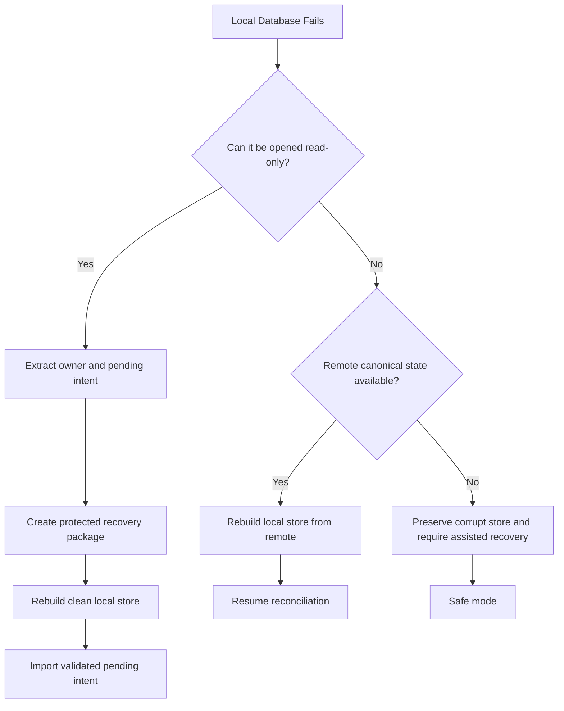
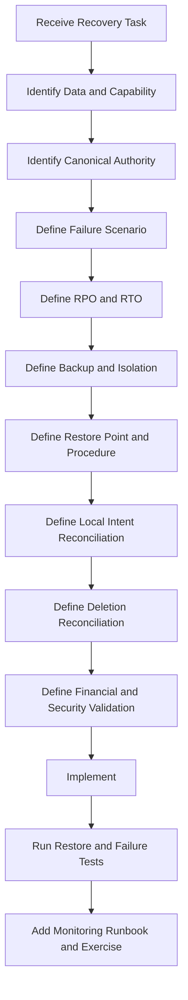

# Nexio Backup, Restore and Disaster Recovery Specification

Version: 1.0  
Status: Official  
Authority Level: Backup, Restoration, Business Continuity and Disaster Recovery Standard  
Applies To: Web, Android, Local Storage, Supabase, PostgreSQL, Attachments, Imports, Exports, Synchronization, Authentication, Configuration, Secrets, Provider Integrations and Operational Systems

---

# Purpose

This document defines the official Backup, Restore and Disaster Recovery architecture of Nexio.

It establishes requirements for:

- Data backup
- Local recovery
- Remote recovery
- Database restoration
- Attachment restoration
- Configuration recovery
- Secret recovery
- Synchronization recovery
- Queue recovery
- Migration recovery
- Account deletion interactions
- Retention
- Backup encryption
- Backup isolation
- Recovery objectives
- Point-in-time recovery
- Disaster scenarios
- Continuity modes
- Financial-state validation
- Restore testing
- Incident command
- Provider dependency recovery
- Operational runbooks
- Governance
- AI implementation restrictions

The objective is not merely to create copies of data.

The objective is to restore:

```text
The correct authorized owner state

The correct financial state

The correct synchronization state

The correct deletion state

The correct attachment relationships

The correct privacy and security controls
```

without introducing:

- Duplicate Transactions
- Missing Transfers
- Cross-owner data
- Revived deleted Accounts
- Lost pending operations
- Stale authentication
- Broken ownership
- Incorrect balances
- Inconsistent Currency
- Invalid conflict resolution

---

# Relationship with Other Documents

This document must be interpreted together with:

```text
docs/00-FOUNDATION.md
docs/01-ARCHITECTURE.md
docs/05-MOBILE.md
docs/06-DATA-MODEL.md
docs/07-SECURITY.md
docs/08-OFFLINE-AND-SYNC.md
docs/09-TESTING.md
docs/10-DEPLOYMENT-AND-OPERATIONS.md
docs/13-PRIVACY-AND-DATA-GOVERNANCE.md
docs/14-ACCESSIBILITY.md
docs/15-PERFORMANCE-AND-RELIABILITY.md
docs/16-ANALYTICS-AND-EXPERIMENTATION.md
docs/17-API-AND-INTEGRATIONS.md
```

Responsibilities are divided as follows:

| Document | Responsibility |
|---|---|
| `00-FOUNDATION.md` | Trust, financial correctness and user control |
| `01-ARCHITECTURE.md` | System boundaries and dependency direction |
| `05-MOBILE.md` | Android process, storage and lifecycle behavior |
| `06-DATA-MODEL.md` | Canonical entities, Money and relationships |
| `07-SECURITY.md` | Encryption, access and incident controls |
| `08-OFFLINE-AND-SYNC.md` | Local durability, queue and reconciliation |
| `09-TESTING.md` | Restore, recovery and failure testing |
| `10-DEPLOYMENT-AND-OPERATIONS.md` | Production operations and incident response |
| `13-PRIVACY-AND-DATA-GOVERNANCE.md` | Retention, deletion and data-purpose boundaries |
| `14-ACCESSIBILITY.md` | Accessible recovery workflows |
| `15-PERFORMANCE-AND-RELIABILITY.md` | Recovery under load and degraded operation |
| `16-ANALYTICS-AND-EXPERIMENTATION.md` | Measurement continuity and data exclusions |
| `17-API-AND-INTEGRATIONS.md` | Provider failure and migration recovery |
| `18-BACKUP-RESTORE-AND-DISASTER-RECOVERY.md` | Copies, restore, continuity and disaster recovery |

A restore that violates Privacy, Security, ownership or financial correctness is not a successful restore.

---

# Current Repository Recovery Anchors

The repository contains recovery-sensitive elements such as:

```text
supabase-schema.sql
supabase-config.js
app.js
mobile-capacitor.js
js/core/storage.js
js/core/transactions.js
js/core/accounts.js
js/core/categories.js
js/core/goals.js
js/core/profiles.js
js/core/notifications.js
android/
android-web/
vercel.json
package.json
package-lock.json
capacitor.config.ts
```

Potential recovery responsibilities:

| Location | Recovery Responsibility |
|---|---|
| `supabase-schema.sql` | Database schema, constraints, RLS and migration history |
| `js/core/storage.js` | Local database opening, backup and recovery hooks |
| `js/core/transactions.js` | Transaction reconciliation after restore |
| `js/core/accounts.js` | Account ownership and balance validation |
| `js/core/goals.js` | Goal progress recomputation |
| `js/core/profiles.js` | Owner preferences and privacy state |
| `mobile-capacitor.js` | Android process and storage lifecycle |
| `android/` | Secure storage, app data and update continuity |
| `vercel.json` | Web delivery recovery and routing |
| `package-lock.json` | Reproducible application dependency state |
| `docs/18-BACKUP-RESTORE-AND-DISASTER-RECOVERY.md` | Authoritative recovery contract |

---

# Recovery Constitutional Principles

## Financial Correctness Comes Before Restore Speed

A fast restore is unacceptable when it produces:

- Wrong balances
- Duplicate Transactions
- Missing Transfer counterpart
- Mixed owners
- Lost Currency information
- Revived deleted entities
- Invalid synchronization status

Recovery must preserve canonical meaning.

---

## Backup Is Not the Same as Restore

A backup is useful only when Nexio can prove that it can:

- Locate it
- Decrypt it
- Validate it
- Restore it
- Reconcile it
- Verify financial correctness
- Resume operation safely

Backups without tested restoration are unverified copies.

---

## Restore Must Be Owner-Safe

A restore must never:

- Merge different owners accidentally
- Place User A data in User B namespace
- Restore a deleted owner's local cache
- Restore provider tokens for the wrong Account
- Restore shared signed URLs
- Reuse stale session state

---

## Deletion Must Survive Restoration

Account deletion, entity deletion and retention cleanup must not be reversed accidentally by restoring an older backup.

Recovery must reconcile:

```text
Backup state

Deletion ledger

Current legal or privacy state

Provider deletion state

Local deletion tombstones
```

---

## Local Unsynchronized Intent Is First-Class Recovery Data

Pending local operations may represent the user's most recent confirmed financial intent.

Recovery must preserve or reconcile:

- Pending queue
- Unknown outcomes
- Local tombstones
- Drafts where persistence was promised
- Conflict records
- Operation IDs

A remote backup alone may be incomplete.

---

## Backup Must Preserve Operation Identity

Stable operation IDs must survive backup and restore where relevant.

Otherwise, restored pending work may duplicate remote mutations.

---

## Restore Must Be Explicit About Data Scope

Every recovery action must identify:

```text
Which owner

Which environment

Which data stores

Which time point

Which entities

Which providers

Which pending operations
```

---

## Backup Access Must Be More Restricted Than Ordinary Application Access

Backups may contain broad historical scope.

Access should require:

- Elevated authorization
- Named purpose
- Audit record
- Time-bounded access
- Least privilege
- Secure environment

---

## Backups Must Be Encrypted

Protected backups require encryption:

- In transit
- At rest
- During temporary processing
- During transfer between providers

Encryption keys must remain separate from backup content.

---

## Backup Copies Must Be Isolated

A single provider failure, credential compromise or destructive command should not destroy all recovery copies.

Use approved isolation across:

- Account
- Project
- Region
- Credential
- Storage class
- Administrative boundary

---

## Recovery Must Be Version-Aware

A backup may have:

- Older schema
- Older calculation version
- Older synchronization protocol
- Older application configuration

Restoration requires version-aware migration.

---

## Provider Recovery Must Not Replace Nexio Validation

A provider claiming that restoration succeeded does not prove Nexio state is correct.

Nexio must validate:

- Ownership
- Counts
- Constraints
- Money
- Currency
- Relationships
- Versions
- Deletion state
- Synchronization state

---

## Recovery Must Avoid Broad Overwrite When Narrow Repair Is Sufficient

Preferred order:

```text
Repair one entity

Restore one owner

Restore one table or collection

Restore one point in time

Restore complete environment only when necessary
```

Broader recovery increases risk.

---

## Recovery Must Be Rehearsed

Critical recovery procedures require scheduled exercises.

A runbook that has never been executed is not proven.

---

## Disaster Recovery Must Include Degraded Operation

Recovery architecture should support:

```text
Full mode

Local-only mode

Read-only mode

Protected safe mode

Provider-disabled mode

Manual reconciliation mode
```

---

## Recovery Must Be Observable

Every recovery operation requires:

- Operation identity
- Owner
- Scope
- State
- Start and completion time
- Validation result
- Errors
- Rollback state
- Evidence

---

## Recovery Must Be Reversible Where Practical

Before destructive restore:

- Preserve current state.
- Create recovery checkpoint.
- Define rollback.
- Validate destination.
- Limit scope.

---

## Recovery Must Protect Accessibility

Recovery screens and procedures must remain accessible.

A user must be able to:

- Understand degraded state
- Export data
- Review pending work
- Retry
- Authenticate
- Complete protected recovery actions

---

## Recovery Must Protect Privacy

Backup and restore procedures must not create:

- Indefinite retention
- Unauthorized historical access
- Unlogged provider copies
- Restored optional Analytics identity
- Recreated deleted Assistant history
- Unnecessary temporary files

---

# Recovery Goals

Nexio recovery architecture should ensure:

```text
Durable financial records can be restored.

Pending local intent can be preserved or reconciled.

Deleted data is not revived improperly.

Ownership remains correct.

Attachments remain linked correctly.

Application configuration can be rebuilt.

Provider failures do not destroy all copies.

Recovery time is predictable.

Recovery points are defined.

Restore procedures are tested.

Financial correctness is validated after recovery.
```

---

# Recovery Terminology

## Backup

A protected copy of data or configuration intended for restoration.

## Restore

The act of placing backup content into a target system.

## Recovery

The complete process of restoring, validating, reconciling and returning to safe operation.

## Disaster

A failure causing major loss of availability, integrity or data across a significant system scope.

## RPO

Recovery Point Objective.

The maximum acceptable amount of recent data not available from a given recovery source.

## RTO

Recovery Time Objective.

The target duration for restoring a capability to an approved operating state.

## Restore Point

A specific recoverable state identified by time, version or backup reference.

## Point-in-Time Recovery

Restoring a database to a selected historical instant.

## Snapshot

A state capture of a system or storage volume.

## Logical Backup

A backup of records and schema in a portable logical format.

## Physical Backup

A storage-level or database-level copy used to reconstruct a system.

## Replication

Continuous or near-continuous copying to another system.

Replication is not automatically a backup because destructive changes may replicate.

## Tombstone

A durable marker indicating that an entity was deleted.

## Recovery Ledger

A durable record of recovery operations and decisions.

## Recovery Validation

Tests proving that restored state is authorized, structurally valid and financially correct.

## Failover

Switching operation to a secondary system.

## Failback

Returning operation to the primary system after recovery.

## Safe Mode

A reduced capability mode intended to prevent further damage while supporting recovery.

---

# Recovery Responsibility Model

Recommended roles:

```text
Recovery Owner

Incident Commander

Data Owner

Database Owner

Local Storage Owner

Security Owner

Privacy Owner

Provider Owner

Quality Owner

Release Owner

Communications Owner
```

---

# Recovery Owner

Responsible for:

- Recovery strategy
- Backup inventory
- RPO and RTO
- Runbooks
- Restore exercises
- Recovery evidence
- Cross-provider coordination

---

# Incident Commander

Responsible for:

- Declaring recovery incident
- Coordinating teams
- Prioritizing capabilities
- Approving destructive actions
- Managing status
- Closing incident

---

# Data Owner

Responsible for:

- Canonical data interpretation
- Financial validation
- Relationship checks
- Reconciliation
- Acceptance of restored state

---

# Database Owner

Responsible for:

- Database backups
- Point-in-time recovery
- Schema restore
- RLS restoration
- Query and constraint validation

---

# Local Storage Owner

Responsible for:

- IndexedDB or local database recovery
- Queue recovery
- Migration recovery
- Owner namespace validation
- Device-level continuity

---

# Security Owner

Responsible for:

- Backup encryption
- Key access
- Credential recovery
- Incident containment
- Secret rotation
- Recovery access audit

---

# Privacy Owner

Responsible for:

- Retention
- Deletion ledger
- Provider copies
- Restored optional data
- Historical-data access
- Account deletion reconciliation

---

# Provider Owner

Responsible for:

- Provider recovery capability
- Provider backups
- Provider status
- Failover
- Data export
- Provider migration

---

# Quality Owner

Responsible for:

- Restore tests
- Financial-state validation
- Failure injection
- Regression tests
- Recovery exercise evidence

---

# Communications Owner

Responsible for:

- Internal updates
- User-facing status
- Recovery guidance
- Regulatory communication where required
- Final incident summary

---

# Recovery Classification

Recommended incident scope:

```text
Entity-level

Owner-level

Device-level

Feature-level

Provider-level

Environment-level

Regional

Complete-system
```

---

# Entity-Level Recovery

Examples:

- One deleted Transaction
- One corrupted Account
- One missing Attachment relationship
- One failed Goal contribution

Preferred when the defect is narrow.

---

# Owner-Level Recovery

Examples:

- One owner's remote data corrupted
- One owner namespace lost
- One deleted owner restored only where legally and technically allowed
- One user's synchronization state inconsistent

Requires strict cross-owner isolation.

---

# Device-Level Recovery

Examples:

- Android local database corruption
- Browser IndexedDB loss
- Failed local migration
- Storage quota failure
- Secure storage loss

---

# Feature-Level Recovery

Examples:

- Attachment service loss
- Export queue corruption
- Notification state corruption
- Assistant history failure

Core financial state may remain operational.

---

# Provider-Level Recovery

Examples:

- Supabase outage
- Storage provider loss
- Authentication provider outage
- Notification provider compromise
- Analytics provider deletion failure

---

# Environment-Level Recovery

Examples:

- Production database corruption
- Incorrect migration
- Credential compromise
- Destructive administrative command
- Complete deployment failure

---

# Regional Recovery

Applies when a provider region becomes unavailable or unusable.

Requires:

- Approved secondary region strategy
- Data-sovereignty review
- Controlled failover
- Validation
- Failback plan

---

# Complete-System Recovery

Used when several critical systems fail simultaneously.

This is the broadest and highest-risk recovery class.

---

# Data Classification for Recovery

Recovery controls must follow the data's sensitivity and authority.

Recommended classes:

```text
Canonical financial data

Synchronization data

Identity and authentication data

User preferences

Attachments

Derived data

Temporary data

Operational configuration

Secrets

Analytics and telemetry

Documentation and source
```

---

# Canonical Financial Data

Includes:

- Accounts
- Transactions
- Transfers
- Categories
- Goals
- Contributions
- Recurring rules
- Status history
- Conflict resolutions where canonical

Recovery priority:

```text
Highest
```

---

# Synchronization Data

Includes:

- Pending operations
- Operation IDs
- Checkpoints
- Unknown outcomes
- Conflict records
- Retry state
- Tombstones

Recovery priority:

```text
Highest
```

because missing synchronization state may duplicate or lose financial intent.

---

# Identity and Authentication Data

Includes:

- Owner identity
- Session state
- MFA state
- Provider links
- Recovery state
- Recent-authentication state

Session tokens should generally not be restored blindly from backup.

Authentication state requires provider-aware recovery.

---

# User Preferences

Includes:

- Locale
- Theme
- Privacy mode
- Notification settings
- Analytics preference
- Assistant-history preference
- Accessibility-related presentation settings where stored

Privacy and consent preferences require careful restoration.

---

# Attachments

Includes:

- Object contents
- Metadata
- Checksums
- Ownership
- Parent relationships
- Scan state
- Retention state

---

# Derived Data

Includes:

- Report caches
- Summary tables
- Search indexes
- Chart caches
- Materialized views
- Local projections

Derived data should usually be regenerated rather than restored as authoritative.

---

# Temporary Data

Includes:

- Temporary imports
- Temporary exports
- Upload sessions
- Preview files
- Staging tables
- Short-lived signed access

Temporary data may be excluded from backup unless needed for a committed job.

---

# Operational Configuration

Includes:

- Environment variables
- Provider configuration
- Feature Flags
- Alert rules
- Deployment manifests
- Database migration files
- Notification channels
- Redirect allowlists

---

# Secrets

Includes:

- Webhook secrets
- Service credentials
- Private API keys
- Signing keys
- Encryption keys

Secrets require a separate secure recovery strategy.

They should not be stored inside ordinary data backups.

---

# Analytics and Telemetry

Product Analytics and operational telemetry generally have lower recovery priority than financial records.

Critical incident and security audit evidence may require stronger retention.

---

# Documentation and Source

Includes:

- Source code
- Lock files
- Schemas
- Migrations
- Runbooks
- Architecture documents
- Infrastructure definitions

Source and configuration reproducibility are essential for environment recovery.

---

# Backup Authority Matrix

Recommended:

| Data Class | Canonical Authority | Backup Priority | Restore Method |
|---|---|---:|---|
| Financial entities | Approved database and local confirmed state | Highest | Database restore plus reconciliation |
| Pending operations | Owner-scoped local queue and remote ledger | Highest | Queue restore and operation reconciliation |
| Attachments | Private object storage plus metadata database | High | Object and metadata coordinated restore |
| Preferences | Profile store and local durable cache | High | Owner-scoped restore |
| Report caches | Derived | Low | Recompute |
| Analytics events | Analytics provider | Moderate or Low | Provider-specific |
| Secrets | Secret manager | Highest | Secret recovery or rotation |
| Source and schema | Version control | Highest | Rebuild and redeploy |
| Temporary exports | Temporary storage | Low | Usually regenerate |

---

# Recovery Source Hierarchy

Potential recovery sources:

```text
Current canonical database

Point-in-time database recovery

Database logical backup

Database physical snapshot

Remote operation ledger

Owner-scoped local database

Device backup where approved

Attachment object backup

Source repository

Infrastructure configuration

Provider export

Operational audit ledger
```

---

# Source Authority Rules

A recovery source must be evaluated by:

- Freshness
- Ownership
- Completeness
- Integrity
- Version
- Deletion awareness
- Operation identity
- Provider trust
- Encryption
- Restore compatibility

---

# Backup Architecture

Recommended architecture:

```text
Production data

↓

Primary protected backup

↓

Isolated secondary copy

↓

Periodic restore validation

↓

Recovery catalog

↓

Documented runbook
```

---

# Backup Types

Nexio may use:

```text
Continuous database recovery

Scheduled logical backup

Scheduled physical backup

Storage-object backup

Configuration backup

Secret recovery configuration

Local owner export

Application source backup
```

---

# Continuous Database Recovery

May support point-in-time restoration.

It should define:

- Retention window
- Recovery granularity
- Region
- Encryption
- Provider dependence
- Restore procedure
- Validation

---

# Scheduled Logical Backup

Useful for:

- Portability
- Table-level inspection
- Provider migration
- Schema and data validation

Must preserve:

- Exact Money
- Currency
- Identifiers
- Timestamps
- Versions
- Tombstones
- Ownership

---

# Scheduled Physical Backup

Useful for rapid database reconstruction.

It may be less portable and more provider-specific.

---

# Attachment Object Backup

Attachment backup must coordinate:

```text
Object contents

Object metadata

Database Attachment record

Checksum

Ownership

Parent relationship

Deletion state
```

Restoring only the object or only metadata is insufficient.

---

# Configuration Backup

Configuration backup should include:

- Infrastructure-as-code
- Environment schema
- Provider registry
- Feature Flag definitions
- Webhook registry
- Redirect allowlists
- Alert rules
- Notification channel definitions
- Migration versions

Secret values remain separate.

---

# Source Repository Recovery

Repository recovery should preserve:

- Main branch
- Release tags
- Migration history
- Lock files
- Documentation
- Build configuration
- Android resources
- Deployment configuration

---

# Local Data Recovery

Local device data may contain newer confirmed intent than remote backups.

Recovery strategy must define:

```text
Which local data is recoverable

Which local data is encrypted

Which local data may be exported

How local queues are reconciled

How owner identity is verified

How stale local data is prevented
```

---

# Android Local Recovery

Potential sources:

- App-private database
- Approved device backup
- User-initiated Nexio export
- Remote synchronization
- Secure storage recovery where supported

Android operating-system backup must not be assumed to preserve every required guarantee.

---

# Browser Local Recovery

Browser storage may be lost due to:

- User clearing data
- Browser cleanup
- Private mode
- Storage eviction
- Origin change
- Service Worker failure
- Browser profile loss

Critical confirmed financial intent should synchronize remotely when possible.

The application must disclose when data is only local.

---

# User-Initiated Export as Recovery Aid

A complete Nexio export may help users retain a personal copy.

It is not automatically a full application backup unless it includes:

- Canonical entities
- Exact Money
- Currency
- Relationships
- Versions
- Attachment references or content
- Export version
- Integrity metadata

---

# Backup Catalog

Every backup should have a catalog record.

Recommended fields:

```text
backup_id

environment

backup_type

scope

source_system

created_at

completed_at

restore_point

schema_version

application_version

encryption_key_reference

storage_location

retention_until

integrity_state

restore_test_state

owner
```

---

# Backup Integrity State

Recommended:

```text
pending

verified

verification_failed

expired

deleted

quarantined
```

---

# Backup Completion

A backup is complete only after:

- Copy operation finishes.
- Required indexes or manifests exist.
- Encryption is confirmed.
- Integrity checks pass.
- Catalog record is durable.
- Retention is assigned.

---

# Backup Integrity Validation

Potential controls:

```text
Checksum

Object count

Row count

Manifest

Cryptographic signature

Provider integrity result

Schema validation

Decryption test
```

---

# Backup Encryption

Backups containing protected data must use strong encryption.

Requirements:

- Approved algorithm
- Managed keys
- Key rotation
- Access logging
- Separate key and data controls
- Recovery-key testing

---

# Backup Key Separation

The same compromised credential should not grant unrestricted access to:

```text
Production data

Backup data

Backup encryption keys
```

---

# Backup Key Recovery

Key-recovery procedures must be tested.

A backup that cannot be decrypted is not recoverable.

---

# Backup Immutability

Critical backups should use protection against:

- Accidental deletion
- Malicious deletion
- Ransomware
- Administrative error
- Provider automation defect

Potential controls:

```text
Retention lock

Object versioning

Immutable snapshot

Separate administrative account

Delayed deletion
```

---

# Backup Isolation

Recommended isolation dimensions:

```text
Different account or project

Different credential

Different region

Different storage system

Different administrative role

Offline or logically isolated copy where justified
```

---

# Replication versus Backup

Replication provides availability but may copy:

- Accidental deletion
- Corruption
- Malicious changes
- Invalid migration

Therefore:

```text
Replication does not replace historical backup.
```

---

# Backup Scheduling

Scheduling should reflect data criticality and change rate.

Potential categories:

```text
Continuous

Hourly

Daily

Weekly

Before migration

Before provider cutover

Before destructive maintenance

Before large repair
```

Exact frequencies belong to the approved Recovery Plan.

---

# Pre-Change Backup

Before high-risk changes:

- Database migration
- RLS rewrite
- Provider migration
- Bulk cleanup
- Account-deletion framework change
- Synchronization protocol change

create or verify a suitable restore point.

---

# Recovery Point Objective Architecture

RPO should be defined per data class and capability.

---

# RPO Interpretation

An RPO does not authorize silent data loss.

It defines what a given recovery source may lack.

Local pending intent and reconciliation may reduce effective loss beyond remote backup limits.

---

# Example RPO Classes

Recommended policy categories:

```text
Near-zero

Short

Moderate

Reconstructable

No backup required
```

---

# Near-Zero RPO

Appropriate for:

- Confirmed financial commands
- Synchronization operation identity
- Deletion ledger
- Critical ownership state

Requires continuous or transactional protection.

---

# Short RPO

Appropriate for:

- User preferences
- Attachment metadata
- Notification preferences
- Conflict records

---

# Moderate RPO

May apply to:

- Derived Reports
- Optional Assistant history
- Product Analytics
- Non-critical operational data

---

# Reconstructable

Appropriate for:

- Search indexes
- Cached summaries
- Chart caches
- Temporary projections

---

# No Backup Required

Potentially applies to:

- Expired temporary files
- Regenerable assets
- Public static cache
- Stale prefetch data

---

# Recovery Time Objective Architecture

RTO should be defined per capability.

Potential classes:

```text
Immediate degraded continuity

Rapid recovery

Same-day recovery

Planned recovery

Rebuild when needed
```

---

# Immediate Degraded Continuity

Core financial access should continue through:

- Local-only mode
- Read-only mode
- Cached authorized data
- Manual fallback

when safe.

---

# Rapid Recovery

Potentially appropriate for:

- Authentication
- Remote Transaction access
- Synchronization
- Account deletion controls

---

# Same-Day Recovery

Potentially appropriate for:

- Attachments
- Complete exports
- Notification delivery
- Optional Assistant functionality

depending on product commitments.

---

# Planned Recovery

Potentially appropriate for:

- Historical Analytics
- Non-critical derived data
- Archived experiment dashboards

---

# RPO and RTO Registry

Every critical capability should define:

```text
Capability

Data scope

RPO class

RTO class

Degraded mode

Backup source

Restore procedure

Validation

Owner
```

---

# Recovery Priority

Recommended priority:

```text
1. Ownership and authentication safety

2. Canonical financial data

3. Pending operations and synchronization identity

4. Privacy and deletion state

5. Local and remote access continuity

6. Attachments

7. Exports and imports

8. Notifications

9. Assistant

10. Analytics and optional systems
```

---

# Restore Architecture

Recommended sequence:

```text
Declare recovery scope

↓

Freeze unsafe writes

↓

Preserve current state

↓

Select restore point

↓

Validate backup

↓

Restore into isolated target

↓

Run schema migration if required

↓

Validate ownership and integrity

↓

Validate financial state

↓

Reconcile pending operations

↓

Restore controlled access

↓

Monitor

↓

Close recovery
```

---

# Restore Isolation

Where practical, restore first into:

```text
Isolated database

Recovery project

Temporary environment

Restricted namespace
```

Do not restore directly over Production without validated need.

---

# Restore Point Selection

Selection should consider:

- Incident start
- Last known good state
- Backup integrity
- Schema version
- Application version
- Deletion ledger
- Provider events
- Pending local operations
- Audit evidence

---

# Current-State Preservation

Before broad restore:

- Snapshot current damaged state.
- Preserve logs and evidence.
- Preserve operation ledgers.
- Preserve pending queues.
- Preserve deletion state.
- Restrict access.

Current damaged state may contain data needed for reconciliation.

---

# Restore Authorization

A restore requires:

- Named requester
- Named approver
- Scope
- Reason
- Backup reference
- Destination
- Rollback plan
- Audit record

Emergency procedures may shorten approval but must not eliminate accountability.

---

# Restore Into Production

Direct Production restore should require:

- Confirmed backup integrity
- Tested procedure
- Maintenance or controlled traffic state
- Current-state snapshot
- Clear rollback
- Named Incident Commander
- Post-restore validation

---

# Schema Restoration

Schema recovery must restore:

- Tables
- Indexes
- Constraints
- Functions
- Triggers
- RLS
- Storage policies
- Migration state
- Required extensions

---

# RLS Restoration

Restoring data without RLS is prohibited.

Access should remain blocked until:

- RLS enabled
- Policies installed
- Cross-owner tests pass
- Administrative paths reviewed

---

# Data Restoration

Restore should preserve:

```text
Owner

Entity ID

Money

Currency

Dates

Versions

Created and updated timestamps

Deletion state

Operation identity

Relationships
```

---

# Derived Data During Restore

Derived data should usually be:

- Cleared
- Marked stale
- Recomputed
- Validated

Avoid trusting old caches after canonical restore.

---

# Attachment Restoration

Attachment recovery must coordinate:

1. Restore metadata.
2. Restore objects.
3. Verify checksums.
4. Verify owner namespace.
5. Verify parent relationships.
6. Apply deletion ledger.
7. Recreate access policies.
8. Regenerate temporary access only on demand.

---

# Temporary Export Restoration

Expired temporary exports should generally not be restored.

A user can regenerate an export from canonical data.

---

# Secret Restoration

Secrets should usually be:

- Recovered from the approved secret manager
- Rotated after compromise
- Reissued after environment rebuild
- Rebound to the restored environment

Do not restore compromised credentials merely for convenience.

---

# Configuration Restoration

Configuration restore should validate:

- Environment
- Provider project
- Region
- URLs
- Redirect allowlists
- Webhook endpoints
- Feature Flags
- Alert routes
- Notification channels
- Contract versions

---

# Authentication State Restoration

Sessions should not be blindly restored after broad disaster recovery.

Potential policy:

```text
Revoke active sessions

Require reauthentication

Restore Account identity and Profile

Reestablish session safely
```

---

# Synchronization Recovery

Synchronization recovery must reconcile:

```text
Remote canonical state

Remote operation ledger

Local owner data

Local pending queue

Unknown outcomes

Conflicts

Checkpoints

Tombstones
```

---

# Synchronization Recovery Sequence

Recommended:

```text
1. Freeze automatic queue processing.

2. Capture current queue state.

3. Restore remote canonical state.

4. Restore operation ledger.

5. Validate checkpoints.

6. Reconcile completed operations.

7. Reclassify unknown outcomes.

8. Preserve valid pending operations.

9. Create conflicts where required.

10. Resume bounded synchronization.
```

---

# Operation Reconciliation

For each restored pending operation:

```text
Was the operation completed remotely?

Is the remote result present?

Is the local entity present?

Is the operation ID preserved?

Is the expected version valid?

Should the operation retry, complete or enter review?
```

---

# Checkpoint Recovery

A restored checkpoint may be invalid if:

- Database returned to an earlier point.
- Synchronization protocol changed.
- Operation ledger differs.
- Provider stream changed.

Use controlled checkpoint reset and reconciliation.

---

# Duplicate Prevention After Restore

Before resuming writes:

- Restore idempotency records.
- Restore operation IDs.
- Reconcile completed operations.
- Block new IDs for old retries.
- Validate queues.

---

# Transfer Validation After Restore

Every Transfer must preserve:

- Source Account
- Destination Account
- Amount
- Currency
- Date
- Status
- Classification
- Both Account effects

A missing side is a critical integrity defect.

---

# Balance Validation After Restore

Balances should be recomputed from canonical Transactions or approved balance ledger.

Do not trust only restored cached totals.

---

# Report Validation After Restore

Reports should be regenerated and compared with canonical records.

---

# Goal Validation After Restore

Goal progress should be recomputed from approved contributions and canonical state.

---

# Deletion Reconciliation

After restore, apply deletion authority from:

```text
Deletion ledger

Current Account deletion state

Current legal retention state

Provider deletion state

Tombstones

Post-backup deletion events
```

---

# Account Deletion and Backup

Backups may retain deleted data only according to approved retention and legal requirements.

Requirements:

- Deleted Accounts remain inaccessible.
- Restore cannot reactivate them automatically.
- Provider profiles are not recreated.
- Pending optional Analytics identity remains deleted.
- Restoration procedures apply deletion records.

---

# Recovery Ledger

Every restore or disaster action should create a durable record.

Recommended fields:

```text
recovery_id

incident_id

scope

backup_id

restore_point

source_environment

target_environment

requested_by

approved_by

started_at

completed_at

state

validation_state

rollback_reference

notes_reference
```

Sensitive details should remain in protected evidence storage.

---

# Recovery States

Recommended:

```text
planned

approved

preparing

restoring

validating

reconciling

ready_for_access

completed

rolled_back

failed

quarantined
```

---

# Recovery Validation Architecture

Validation categories:

```text
Technical

Security

Ownership

Financial

Synchronization

Privacy

Attachment

Operational

Accessibility
```

---

# Technical Validation

Verify:

- Database opens.
- Schema version is correct.
- Migrations complete.
- Indexes exist.
- Constraints pass.
- Functions exist.
- Application connects.
- Storage access works.

---

# Security Validation

Verify:

- RLS active
- Secrets valid or rotated
- Administrative access restricted
- Sessions handled according to policy
- Signed access disabled until reissued
- Webhook secrets correct

---

# Ownership Validation

Verify:

- Owner counts
- Cross-owner isolation
- Entity ownership
- Relationship ownership
- Storage namespace
- Queue ownership
- Export ownership

---

# Financial Validation

Verify:

- Money exactness
- Currency
- Account balances
- Transfer integrity
- Transaction counts
- Deleted statuses
- Goal progress
- Report totals
- Period boundaries

---

# Synchronization Validation

Verify:

- Operation IDs
- Pending queue
- Completed operation ledger
- Checkpoints
- Unknown outcomes
- Conflicts
- Tombstones
- Dependency order

---

# Privacy Validation

Verify:

- Deleted Accounts remain deleted
- Optional Analytics preferences
- Assistant-history preferences
- Privacy mode
- Notification privacy
- Retention exclusions
- Provider identities

---

# Attachment Validation

Verify:

- Object count
- Metadata count
- Checksums
- Ownership
- Parent relationship
- Scan state
- Missing object handling
- Expiration

---

# Operational Validation

Verify:

- Metrics
- Alerts
- Logs
- Backups resumed
- Jobs resumed safely
- Provider status
- Queue age
- Error rate

---

# Accessibility Validation

Recovery and degraded screens must support:

- Keyboard
- Screen reader
- Focus management
- Large text
- Status announcements
- Retry
- Export
- Authentication

---

# Restore Acceptance

A restore is complete only after:

```text
Technical validation passes.

Security validation passes.

Ownership validation passes.

Financial validation passes.

Synchronization reconciliation completes or enters governed review.

Privacy and deletion validation passes.

Required capabilities become safely available.

Monitoring remains stable.
```

---

# Restore Failure

If validation fails:

- Keep restored target isolated.
- Do not reopen Production access.
- Preserve evidence.
- Identify narrower or alternate restore point.
- Roll back where necessary.
- Update recovery ledger.

---

# Restore Rollback

Rollback may return to:

- Pre-restore current-state snapshot
- Previous valid environment
- Local-only mode
- Read-only mode
- Alternate provider

Rollback must preserve new post-restore user intent if any writes were allowed.

---

# Backup Retention Architecture

Retention should balance:

- Recovery need
- Privacy
- Legal obligation
- Cost
- Provider capability
- Deletion rights

---

# Retention Classes

Recommended:

```text
Short operational

Standard recovery

Extended recovery

Legal hold

Immutable security evidence

Temporary
```

---

# Short Operational Retention

Used for:

- Recent point-in-time recovery
- Recent deployment rollback
- Recent migration recovery

---

# Standard Recovery Retention

Used for periodic backups supporting ordinary disaster recovery.

---

# Extended Recovery Retention

Requires stronger justification because it preserves older personal data.

---

# Legal Hold

Legal hold must be:

- Authorized
- Scoped
- Documented
- Access-controlled
- Reviewed
- Removed when no longer required

---

# Temporary Retention

Used for:

- Recovery staging
- Temporary restore environments
- Validation exports
- Migration checkpoints

Temporary recovery copies require automatic cleanup.

---

# Retention Expiration

When retention expires:

- Delete backup copy.
- Delete manifest where appropriate.
- Update catalog.
- Preserve minimal deletion evidence.
- Verify provider deletion behavior.

---

# Backup Deletion

Backup deletion is a protected action.

It requires:

- Authorization
- Scope confirmation
- Retention validation
- Immutability-window awareness
- Audit
- No effect on all recovery copies accidentally

---

# Recovery Copy Cleanup

After a restore exercise or incident:

- Remove temporary databases.
- Remove copied files.
- Remove temporary credentials.
- Remove signed URLs.
- Remove downloaded backup material.
- Close temporary access.

---

# Recovery Environment

A recovery environment should be:

- Isolated
- Access-controlled
- Time-limited
- Non-public
- Free of Production outbound side effects
- Configured to prevent Notifications, Analytics and external mutation by default

---

# External Side-Effect Suppression

During restore testing, disable:

```text
Email delivery

Push Notification delivery

Analytics delivery

Provider mutations

Webhook callbacks

Assistant actions

Export delivery
```

unless specifically required and safely sandboxed.

---

# Disaster Scenario Catalog

The Recovery Plan should cover at least:

```text
Accidental entity deletion

Bulk data deletion

Incorrect database migration

RLS policy failure

Database corruption

Database provider outage

Storage provider outage

Attachment corruption

Authentication provider outage

Credential compromise

Webhook compromise

Synchronization queue corruption

Local database corruption

Android process or storage loss

Service Worker corruption

Provider regional outage

Source repository loss

Deployment configuration loss

Account deletion inconsistency

Ransomware or destructive administrative action
```

---

# Accidental Entity Deletion

Preferred response:

- Identify entity.
- Verify deletion authority.
- Restore narrowly.
- Recompute affected balances.
- Preserve audit.
- Avoid restoring unrelated data.

---

# Bulk Data Deletion

Response may require:

- Freeze writes.
- Preserve evidence.
- Identify incident time.
- Restore into isolated environment.
- Reconcile post-incident valid operations.
- Reapply legitimate deletions.
- Validate owners and totals.

---

# Incorrect Migration

Response:

- Stop rollout.
- Disable incompatible clients.
- Preserve current database.
- Restore or apply corrective migration.
- Reconcile writes after migration.
- Validate schema, RLS and financial state.

---

# RLS Failure

Treat as Security incident.

Actions:

- Restrict access immediately.
- Preserve logs.
- Restore correct policies.
- Test cross-owner isolation.
- Evaluate exposure.
- Rotate credentials where needed.
- Reopen only after authorization validation.

---

# Database Corruption

Response:

- Freeze unsafe writes.
- Identify corruption scope.
- Select valid restore point.
- Restore isolated copy.
- Reconcile recent operations.
- Validate financial state.
- Fail over or replace primary.

---

# Storage Provider Outage

Degraded behavior:

- Financial records remain available.
- Attachment upload pauses.
- Attachment preview may be unavailable.
- Retry queues remain bounded.
- Metadata remains visible.
- Alternative provider may activate only through governed failover.

---

# Authentication Provider Outage

Potential behavior:

- Existing sessions continue only according to policy.
- New Sign-in unavailable.
- Remote protected operations may pause.
- Local authorized access may continue.
- No error should claim invalid credentials without evidence.

---

# Credential Compromise

Response:

- Revoke credential.
- Rotate.
- Restrict affected provider.
- Review access.
- Reconcile mutations.
- Validate backups remain isolated.
- Reissue temporary access.

---

# Synchronization Queue Corruption

Response:

- Stop queue processing.
- Preserve queue copy.
- Validate records.
- Rebuild from canonical local entities and operation ledger where possible.
- Reconcile unknown outcomes.
- Resume bounded processing.

---

# Local Database Corruption

Response:

- Enter safe mode.
- Preserve recoverable file.
- Avoid repeated failing migration.
- Offer remote rebuild when synchronized.
- Export recoverable local intent where possible.
- Reconcile owner and operation IDs.

---

# Service Worker Corruption

Response:

- Disable or replace corrupted worker.
- Clear only regenerable caches.
- Preserve local canonical storage.
- Avoid reload loop.
- Restore compatible shell.

---

# Source Repository Loss

Recovery sources:

- Remote repository mirror
- Release artifact
- Developer clone only as emergency evidence
- CI artifact
- Versioned documentation and migration archive

A controlled repository mirror is preferred over relying on individual machines.

---

# Configuration Loss

Restore from:

- Infrastructure-as-code
- Environment schema
- Secret manager references
- Provider registry
- Deployment history

Do not reconstruct Production configuration from memory.

---

# Recovery Anti-Patterns

The following are prohibited:

## Backup Without Restore Test

Keeping copies without proving restoration.

## Replication as Sole Backup

Assuming replication protects against corruption or deletion.

## Backup and Key in Same Unprotected Location

Allowing one compromise to expose both.

## Restore Directly Over Production First

Skipping isolated validation.

## Restore Without Current-State Snapshot

Removing evidence and rollback capability.

## Restore Without RLS

Opening data before authorization policies are active.

## Restore Cached Totals as Canonical

Trusting derived balances instead of recomputation.

## Restore Sessions Blindly

Reusing stale authentication state after disaster.

## Restore Deleted Accounts

Reactivating users or data removed after the backup point.

## Lose Operation IDs

Restoring pending commands without idempotency identity.

## Clear Pending Queue for Convenience

Discarding confirmed local user intent.

## Restore All Owners for One Owner Problem

Using excessively broad recovery scope.

## Restore Attachment Objects Without Metadata

Creating orphaned or inaccessible files.

## Restore Metadata Without Objects

Presenting unavailable Attachments as healthy.

## Temporary Recovery Environment Without Cleanup

Leaving historical copies accessible indefinitely.

## Recovery Test with Production Side Effects

Sending real Notifications, Analytics or provider mutations.

## Unencrypted Backup Export

Moving protected data without encryption.

## Shared Recovery Credentials

Using uncontrolled shared administrative accounts.

## No Recovery Ledger

Performing restore without durable evidence.

## Restore Completion Before Validation

Reopening access immediately after provider restore.

## Ignore Local Newer State

Overwriting newer device-confirmed intent with older remote state.

## Assume Provider Success

Accepting provider restoration without Nexio validation.

## Backup Every Temporary File Forever

Expanding retention without purpose.

---

# Part 1 Recovery Review Questions

Before designing backup for a data class, answer:

```text
Is the data canonical, derived or temporary?

Who owns it?

Where is the authoritative source?

What is the required RPO?

What is the required RTO?

Which degraded mode exists?

Which backup source applies?

How is it encrypted?

How is it isolated?

How is deletion reconciled?

How is restore validated?

Who approves restoration?
```

---

# Backup Review Questions

```text
Is the backup complete?

Is it encrypted?

Can it be decrypted?

Is integrity verified?

Is it isolated from Production credentials?

Does it preserve ownership?

Does it preserve operation IDs?

Does it contain unnecessary temporary data?

When does it expire?

Has it been restored in a test?
```

---

# Restore Review Questions

```text
What is the incident scope?

Which restore point is selected?

What happened after the restore point?

Which deletions must remain applied?

Which local operations are newer?

Which schema version applies?

Is current state preserved?

Can restoration occur in isolation?

Which validations must pass?

What is the rollback?
```

---

# Financial Validation Questions

```text
Do Account balances recompute?

Are Transfer pairs complete?

Is Money exact?

Is Currency explicit?

Are deleted Transactions still deleted?

Are Goal contributions complete?

Do Reports match canonical data?

Are pending operations preserved?

Are duplicate operations prevented?
```

---

# Privacy Recovery Questions

```text
Could the restore revive deleted data?

Could it restore optional Analytics identity?

Could it restore Assistant history against preference?

Could it restore outdated Notification privacy?

Could temporary recovery copies outlive purpose?

Which provider deletion actions must be repeated?
```

---

# Local Recovery Questions

```text
Does the device contain newer confirmed intent?

Is the local owner verified?

Are pending operation IDs intact?

Can recoverable data be exported?

Can the local database be migrated?

What happens if remote and local state differ?

Does safe mode prevent further damage?
```

---

# Provider Recovery Questions

```text
Which provider backup exists?

Is another provider or region available?

Which system remains authoritative?

What does failover change?

How are provider credentials recovered?

How is failback performed?

How is provider success validated independently?
```

---

# Part 1 Acceptance Criteria

The Backup, Restore and Disaster Recovery foundation is accepted only when:

```text
□ Recovery preserves canonical financial meaning.

□ Backup and Restore are treated as distinct capabilities.

□ Every critical backup has a tested restoration path.

□ Recovery preserves owner isolation.

□ Deleted Accounts and entities are not revived improperly.

□ Local unsynchronized intent is included in recovery design.

□ Stable operation IDs survive relevant recovery paths.

□ Every restore identifies owner, environment, scope and restore point.

□ Backup access is more restricted than ordinary application access.

□ Protected backups are encrypted.

□ Encryption keys remain separate from backup copies.

□ Critical backup copies are isolated from one destructive boundary.

□ Restore procedures are version-aware.

□ Provider restore results receive independent Nexio validation.

□ Narrow recovery is preferred over broad overwrite.

□ Recovery procedures are rehearsed.

□ Degraded operating modes are defined.

□ Every recovery action is observable and auditable.

□ Destructive restore preserves current state and rollback where practical.

□ Accessibility remains available during recovery.

□ Privacy and retention remain enforced.

□ Recovery roles and responsibilities are defined.

□ Recovery scope classifications are documented.

□ Canonical, synchronization, identity, Attachment and derived data are classified separately.

□ Canonical financial data receives the highest backup priority.

□ Pending operations and synchronization ledgers receive the highest backup priority.

□ Derived data is regenerated when practical.

□ Temporary data is excluded unless it represents committed work.

□ Secrets use a separate recovery strategy.

□ Every critical data class has an authority and restore method.

□ Backup architecture includes primary copy, isolated copy and restore validation.

□ Logical and physical backups have explicit purposes.

□ Attachment backup coordinates objects and metadata.

□ Configuration and source are recoverable.

□ Local device recovery is included.

□ Backup catalog records scope, version, encryption and retention.

□ Backup integrity is verified.

□ Critical backups use immutability or equivalent protection.

□ Replication is not treated as historical backup.

□ Pre-change restore points exist for high-risk changes.

□ RPO is defined per data class or capability.

□ RTO is defined per capability.

□ Local and degraded continuity are included in RTO design.

□ Recovery priority begins with ownership, financial data and pending intent.

□ Restore begins with scope declaration and unsafe-write control.

□ Restore uses isolated validation where practical.

□ Restore-point selection considers deletion and post-backup events.

□ Current damaged state is preserved for evidence and reconciliation.

□ Production restore requires explicit authorization.

□ Schema restoration includes RLS, constraints, functions and migration state.

□ Restored data preserves Money, Currency, versions, ownership and deletion state.

□ Derived caches are cleared or recomputed.

□ Attachments are restored with checksum and relationship validation.

□ Expired temporary exports are not restored unnecessarily.

□ Compromised secrets are rotated rather than blindly restored.

□ Authentication sessions are not blindly reactivated.

□ Synchronization recovery reconciles remote, local, queue and operation ledgers.

□ Duplicate prevention runs before synchronization resumes.

□ Transfer integrity is validated.

□ Account balances are recomputed.

□ Reports and Goal progress are regenerated from canonical data.

□ Deletion records are reapplied after restore.

□ Every recovery action has a recovery-ledger record.

□ Restore completion requires technical, Security, ownership, financial, synchronization and Privacy validation.

□ Failed restore remains isolated.

□ Backup retention has documented classes.

□ Temporary recovery environments are cleaned up.

□ Recovery environments suppress real external side effects.

□ Disaster scenarios include deletion, migration, corruption, provider outage, credential compromise and local-storage loss.

□ Recovery anti-patterns are prohibited.
```

---

# Backup and Recovery Constitutional Rule

Every backup, restore point, failover, reconciliation and disaster procedure must answer:

```text
Can Nexio recover the correct authorized financial state without reviving deleted data, losing recent user intent, duplicating operations or weakening Security and Privacy?
```

When the answer is uncertain, prefer the approach that:

- Preserves current evidence.
- Restores into isolation.
- Uses the narrowest possible scope.
- Keeps RLS active.
- Preserves operation identity.
- Recomputes derived values.
- Reconciles local and remote state.
- Reapplies deletion records.
- Rotates compromised credentials.
- Keeps external side effects disabled.
- Requires explicit validation.
- Delays reopening access.
- Maintains a rollback.
- Keeps the user informed accurately.

A backup is not successful because a file exists.

A recovery is successful only when Nexio can prove that the restored owner, financial state, synchronization state and deletion state are correct.

---
---

# Recovery Procedure Architecture

Every recovery procedure must define:

```text
Trigger

Scope

Authority

Recovery source

Restore point

Write-control state

Validation

Reconciliation

Rollback

Monitoring

Communication

Closure criteria
```

Recovery procedures must not rely on undocumented operator knowledge.

---

# Recovery Procedure Levels

Recommended levels:

```text
Automated self-recovery

User-guided recovery

Operator-assisted recovery

Provider-assisted recovery

Disaster recovery
```

---

# Automated Self-Recovery

Appropriate for:

- Temporary network failure
- Stale cache
- Realtime reconnect
- Expired session refresh
- Regenerable derived data
- Interrupted non-destructive background work

Automated recovery must remain:

- Bounded
- Idempotent
- Observable
- Owner-safe
- Cancellable where appropriate

---

# User-Guided Recovery

Appropriate for:

- Reauthentication
- Retrying failed synchronization
- Restoring from a user-owned export
- Resolving a conflict
- Reconnecting a provider
- Clearing regenerable caches
- Recovering a preserved draft

The interface must explain:

- What happened
- Which data is safe
- Which data is pending
- What the proposed action changes
- Whether the action is reversible

---

# Operator-Assisted Recovery

Appropriate for:

- One-owner remote corruption
- Failed database migration
- Missing Attachment object
- Queue inconsistency
- Incorrect configuration
- Provider-account mismatch

Requires:

- Named operator
- Authorization
- Recovery record
- Evidence
- Validation
- Closure approval

---

# Provider-Assisted Recovery

Appropriate when the provider controls:

- Point-in-time recovery
- Physical database restoration
- Storage snapshot
- Authentication recovery
- Regional failover
- Managed backup retrieval

Provider assistance does not replace Nexio validation.

---

# Disaster Recovery

Used when a broad critical capability is unavailable or corrupted.

Requires:

- Incident command
- Controlled write state
- Environment reconstruction
- Provider coordination
- Financial reconciliation
- User communication
- Formal recovery acceptance

---

# Recovery Write-Control States

Recommended:

```text
normal

restricted_writes

local_only

read_only

maintenance

quarantined
```

---

# Normal

Ordinary application operation.

---

# Restricted Writes

Only approved critical commands are accepted.

Optional background work is paused.

---

# Local-Only

Supported commands may be committed locally but remote synchronization is paused.

The interface must identify that remote backup and synchronization are unavailable.

---

# Read-Only

Financial mutations are disabled because they cannot be made durable or reconciled safely.

Existing authorized data remains accessible where possible.

---

# Maintenance

Application access is limited while a controlled restore or migration occurs.

---

# Quarantined

The affected environment, owner or data set remains isolated because integrity has not been proven.

---

# Database Recovery Architecture

Database recovery must account for:

```text
Schema

Canonical data

Ownership

RLS

Functions

Triggers

Indexes

Operation ledger

Deletion ledger

Audit state

Migration version
```

---

# Database Recovery Scenarios

Required procedures should exist for:

```text
Single-row corruption

Table-level corruption

Bulk accidental deletion

Incorrect update

Failed migration

Database outage

Regional outage

Complete database loss

RLS policy loss

Constraint loss

Operation-ledger corruption
```

---

# Single-Entity Database Recovery

Preferred procedure:

1. Identify the entity and owner.
2. Confirm the defect and incident window.
3. Preserve the current row and related records.
4. Locate the last valid source.
5. Compare post-backup legitimate changes.
6. Restore or reconstruct only the affected entity.
7. Revalidate relationships.
8. Recompute affected aggregates.
9. Reconcile synchronization versions.
10. Record recovery evidence.

---

# Related Entity Review

A Transaction recovery may affect:

- Account balance
- Category totals
- Goal linkage
- Recurring occurrence
- Attachment relationship
- Report cache
- Synchronization state

A narrow restore still requires related-state validation.

---

# Single-Transaction Recovery

Before restoring a Transaction, verify:

```text
Owner

Transaction type

Amount

Currency

Date

Account relationship

Category compatibility

Transfer relationship

Financial status

Deletion state

Version

Operation identity
```

---

# Transfer Recovery

A Transfer must be restored as one Domain concept.

Verify:

- Source Account
- Destination Account
- Equal exact Amount
- Compatible Currency policy
- Date
- Status
- Both balance effects
- Linked identity
- No duplicate pair

Restoring only one side is prohibited.

---

# Bulk Deletion Recovery

Recommended sequence:

```text
1. Freeze unsafe remote writes.

2. Identify the destructive operation and time range.

3. Preserve current database state.

4. Identify the last known good restore point.

5. Restore into an isolated environment.

6. Extract only the deleted records and required relationships.

7. Reapply legitimate deletions after the restore point.

8. Reconcile valid post-incident writes.

9. Validate owners and financial totals.

10. Restore Production access gradually.
```

---

# Point-in-Time Database Recovery

Point-in-time recovery should not be applied directly to Production first when isolated restoration is available.

The procedure must record:

```text
Selected timestamp

Time zone

Reason

Incident start estimate

Backup retention boundary

Expected lost or replayed operations

Schema version

Application version
```

---

# Point-in-Time Cutoff

The restore point should precede the destructive event while minimizing lost valid work.

A later restore point is not always safer if corruption already exists.

---

# Post-Restore Change Replay

Valid operations after the restore point may need replay.

Replay sources may include:

- Remote operation ledger
- Local device queue
- Verified audit events
- Provider callback ledger
- Current damaged-state snapshot

Replay must preserve original operation IDs.

---

# Database Logical Restore

Logical restore may support:

- Specific tables
- Specific owners
- Portable migration
- Data inspection
- Narrow extraction

Validate:

- Column types
- Constraints
- Sequence or identifier behavior
- Owner references
- RLS
- Functions
- Trigger state

---

# Database Physical Restore

Physical restore may provide faster complete reconstruction.

It still requires:

- Schema validation
- Application compatibility
- RLS validation
- Financial validation
- Post-restore operation reconciliation

---

# Database Failover

When a secondary database is available, failover must define:

```text
Replication freshness

Authority transition

Write fencing

Connection change

Credential change

Application configuration

Queue behavior

Failback
```

---

# Write Fencing

Before promoting a secondary database:

- Prevent old primary writes.
- Confirm promotion authority.
- Update application endpoints.
- Prevent split-brain operation.
- Verify operation-ledger continuity.

---

# Split-Brain Prevention

Nexio must not allow two database environments to accept authoritative writes independently without a governed reconciliation protocol.

---

# Database Failback

Returning to the original primary requires:

- Confirmed health
- Data comparison
- Replication direction
- Write fencing
- Operation reconciliation
- Controlled cutover
- Monitoring

---

# Supabase Recovery Architecture

Supabase recovery may involve:

```text
Database

Authentication

Storage

Realtime

Functions

Secrets

Redirect configuration

RLS and policies
```

Each surface requires separate validation.

---

# Supabase Project Recovery

A complete project recovery should reconstruct:

1. Project or approved replacement environment.
2. Database schema.
3. Extensions.
4. Tables and data.
5. Indexes.
6. Constraints.
7. RLS policies.
8. Functions and triggers.
9. Storage buckets and policies.
10. Authentication configuration.
11. Redirect allowlists.
12. Functions and environment secrets.
13. Realtime configuration.
14. Monitoring and backups.

---

# Supabase Database Restore

After provider restoration:

- Confirm database restore point.
- Confirm schema version.
- Confirm owner counts.
- Confirm RLS.
- Confirm functions.
- Confirm operation ledger.
- Confirm deletion ledger.
- Run canonical financial validation.

---

# Supabase Authentication Recovery

Authentication recovery should identify whether the provider retained:

- User identities
- Password state
- OAuth links
- MFA enrollment
- Email verification
- Session revocation
- Recovery state

---

# Supabase Session Recovery Policy

After a major authentication or project recovery, prefer:

```text
Revoke or invalidate existing sessions

Require safe reauthentication

Rebuild owner context

Resume protected synchronization
```

Do not assume old access tokens remain valid or safe.

---

# Supabase User Identity Mapping

If authentication identities are restored or migrated, verify:

```text
Authentication user ID

Profile owner ID

Financial row owner ID

Storage namespace

Provider connection owner

Deletion state
```

An identity mismatch is a critical incident.

---

# Supabase Storage Recovery

Storage recovery must restore:

- Bucket definitions
- Bucket privacy
- Object metadata
- Object contents
- Owner path
- Storage policies
- Checksums
- Deletion state

---

# Supabase Storage Reconciliation

For every Attachment metadata record:

```text
Does the object exist?

Does the checksum match?

Does the owner path match?

Does the parent entity exist?

Is the file allowed to remain?

Is the scan state valid?
```

For every object:

```text
Does valid metadata exist?

Does the owner exist?

Is the object expired?

Is it orphaned?
```

---

# Supabase Function Recovery

Restore:

- Function definitions
- Runtime configuration
- Environment secrets
- Authentication assumptions
- Network permissions
- Contract versions

Functions must remain disabled until required secrets and authorization are validated.

---

# Supabase Realtime Recovery

After database recovery:

- Realtime sequence continuity may be invalid.
- Existing subscriptions should reconnect.
- Clients must perform checkpoint pull.
- Missed events must be reconciled.
- Realtime must not be treated as recovery authority.

---

# Supabase Configuration Recovery

Validate:

```text
Project URL

Public client key

Server-side service credentials

Redirect URLs

Allowed origins

Email templates

Storage bucket names

Function endpoints

Webhook destinations

Environment identity
```

Production clients must never connect to a recovery, staging or old project accidentally.

---

# Supabase Provider Outage

During a broad Supabase outage:

```text
Authentication:
Existing sessions follow Security policy.

Financial reads:
Use authorized local data where available.

Financial writes:
Use local-only mode when durable local Save is safe.

Synchronization:
Pause and queue.

Realtime:
Disable and rely on later Pull.

Attachments:
Queue uploads separately.

Account deletion:
Preserve deletion request state and avoid false completion.
```

---

# Supabase Recovery Acceptance

Supabase is considered recovered only after:

```text
Database access works.

Authentication owner mapping is valid.

RLS tests pass.

Storage access policies pass.

Functions return approved contracts.

Synchronization can reconcile.

Realtime reconnects with gap recovery.

Backups resume.

Monitoring remains stable.
```

---

# Local Storage Recovery Architecture

Local storage may include:

```text
Canonical local entities

Synchronization queue

Conflicts

Drafts

Checkpoints

Preferences

Derived caches

Assistant history

Temporary files
```

---

# Local Storage Failure Scenarios

Required procedures:

```text
Database open failure

Schema mismatch

Interrupted migration

Corrupt record

Corrupt index

Quota exhaustion

Owner namespace mismatch

Partial Account-switch cleanup

Application reinstall

Browser data clearing

Android process death
```

---

# Local Database Open Failure

Recommended sequence:

1. Stop automatic writes.
2. Preserve the original local database where technically possible.
3. Classify failure.
4. Attempt non-destructive open or validation.
5. Determine whether remote synchronized state exists.
6. Determine whether local pending intent exists.
7. Enter safe mode.
8. Offer controlled recovery.

---

# Local Recovery Decision Tree



---

# Read-Only Extraction

When possible, extract:

- Owner reference
- Canonical local entities
- Pending operations
- Operation IDs
- Tombstones
- Conflicts
- Drafts promised as persistent
- Checkpoint
- Schema version

---

# Local Recovery Package

A local recovery package should be:

- Encrypted
- Owner-bound
- Versioned
- Integrity-checked
- Time-limited
- Excluded from Analytics
- Deleted after successful recovery

---

# Local Rebuild from Remote

Allowed when:

- Remote canonical state is available.
- Owner is reauthenticated.
- No unresolved local-only confirmed intent exists.
- Deletion state is current.
- Synchronization checkpoint can be reset safely.

---

# Local Pending Intent Recovery

Pending operations should be:

1. Validated structurally.
2. Matched to current owner.
3. Checked against the remote operation ledger.
4. Classified as completed, pending, conflicting or invalid.
5. Reinserted using original operation IDs.
6. Processed in bounded order.

---

# Corrupt Local Record

When one record is corrupt:

- Isolate the record.
- Avoid deleting the full store.
- Restore from remote or backup.
- Reconcile related pending operation.
- Rebuild affected indexes.
- Record the repair.

---

# Corrupt Local Index

An index should normally be regenerated from canonical local records.

Do not restore an index as authoritative.

---

# Local Schema Mismatch

If application code cannot understand the local schema:

- Block incompatible writes.
- Resolve migration path.
- Offer application update where required.
- Preserve original database.
- Avoid automatic destructive reset.

---

# Local Owner Namespace Mismatch

If the local namespace does not match the authenticated owner:

- Stop access immediately.
- Do not display data.
- Preserve evidence.
- Clear in-memory state.
- Require owner revalidation.
- Treat any cross-owner exposure as a Security incident.

---

# Local Storage Quota Recovery

Recovery order:

```text
1. Delete expired public caches.

2. Delete expired temporary files.

3. Delete regenerable derived data.

4. Compact safe tombstones according to policy.

5. Reduce optional history.

6. Warn the user.

7. Preserve canonical entities and pending operations.
```

---

# Local Storage Reset

A complete local reset is permitted only when:

- Owner confirms where required.
- Remote synchronized state is available or recovery package exists.
- Pending intent has been exported or reconciled.
- The scope is explained.
- The action is audited where appropriate.

---

# Browser Recovery

Browser recovery should account for:

- Origin changes
- Browser profile changes
- Storage eviction
- Service Worker cache
- IndexedDB
- Cookies or authentication storage
- Multiple tabs

---

# Origin Change Recovery

Changing domain or protocol may make old browser storage inaccessible.

Before origin migration:

- Export or synchronize pending state.
- Provide compatibility or migration bridge where feasible.
- Warn about local-only data.
- Test Service Worker and storage cleanup.

---

# Multi-Tab Local Recovery

During recovery:

- Elect one recovery leader where appropriate.
- Prevent simultaneous migrations.
- Notify other tabs.
- Block stale writes.
- Coordinate owner state.
- Close or reload incompatible tabs safely.

---

# Service Worker Recovery

Service Worker recovery should:

- Preserve IndexedDB.
- Remove only regenerable caches.
- Register the compatible worker.
- Avoid repeated reload.
- Avoid applying outdated shell to new schema.
- Display safe recovery state.

---

# Android Recovery Architecture

Android recovery must account for:

```text
App-private database

Secure storage

WebView storage

Capacitor configuration

Content URIs

Notification state

Process recreation

Application update

Application reinstall

Operating-system backup
```

---

# Android Process Death Recovery

After process death:

1. Recreate the Activity and WebView.
2. Reopen local storage.
3. Revalidate owner.
4. Restore route from safe state.
5. Restore persistent draft where promised.
6. Check pending operations.
7. Avoid duplicate command execution.
8. Resume bounded synchronization.

---

# Android Activity Recreation

Activity recreation must not:

- Resubmit forms
- Recreate Notifications
- Repeat Attachment upload completion
- Apply stale file-picker result
- Restore prior-owner data

---

# Android Local Database Corruption

Recommended:

- Enter protected safe mode.
- Preserve the corrupt database file where possible.
- Disable automatic migration retries.
- Reauthenticate owner.
- Determine remote synchronization completeness.
- Recover pending intent.
- Rebuild a clean database.
- Reconcile with remote state.

---

# Android Application Reinstall

Application reinstall may remove local storage.

The product must not promise recovery of local-only data unless an approved backup or export exists.

After reinstall:

- Authenticate.
- Restore remote canonical state.
- Recreate local indexes.
- Recreate preferences from remote where available.
- Explain any unavailable local-only data.
- Re-register Notification token.
- Rebuild secure provider state.

---

# Android Operating-System Backup

Use of operating-system backup requires review of:

- Which files are included
- Encryption
- Device-to-device restoration
- Owner identity
- Authentication tokens
- App version
- Schema compatibility
- Deleted Account behavior

Sensitive session material may need exclusion.

---

# Android Secure Storage Recovery

Secure storage may be unavailable after:

- Device migration
- Lock-screen change
- Reinstall
- Keystore invalidation
- Biometric enrollment change

Recovery should prefer:

- Reauthentication
- Token reissuance
- Provider reconnection
- Key rotation

Do not weaken encryption merely to recover old credentials.

---

# Android Content URI Recovery

Temporary `content://` permissions may expire after process death.

A pending Import or Attachment should:

- Use persisted permission where approved
- Or copy into app-private temporary storage
- Or ask the user to select the file again

Do not claim the file remains available without verification.

---

# Android Notification Recovery

After reinstall or restore:

- Recreate approved Notification channels.
- Re-register token.
- Reapply preferences.
- Reconcile scheduled local Notifications.
- Avoid duplicate reminders.
- Remove Notifications for deleted entities.

---

# Android Upgrade Recovery

Before applying a database-changing update:

- Confirm migration compatibility.
- Preserve local data.
- Preserve queue and operation IDs.
- Test interrupted update.
- Support safe-mode recovery.
- Prevent downgrade corruption.

---

# Android Downgrade

Opening a newer schema with an older application should be blocked unless an explicit compatible downgrade path exists.

---

# Android Device Loss

For a lost device:

- Remote session revocation should be available.
- Local encrypted storage should remain protected.
- Push token should be invalidated where possible.
- Remote canonical state remains available on a new device.
- Local-only unsynchronized data may be unrecoverable unless separately backed up.

---

# Attachment Recovery Architecture

Attachment recovery must coordinate:

```text
Metadata

Object

Owner

Parent entity

Checksum

Content type

Scan state

Retention

Deletion state

Provider reference
```

---

# Attachment Recovery Scenarios

Required:

```text
Missing object

Missing metadata

Checksum mismatch

Wrong owner path

Orphaned object

Corrupt preview

Provider outage

Bucket deletion

Regional loss

Partial migration

Account deletion mismatch
```

---

# Missing Attachment Object

When metadata exists but object is missing:

- Mark the Attachment unavailable.
- Do not present a broken signed link as valid.
- Search backup source.
- Restore object to the approved owner namespace.
- Verify checksum.
- Re-enable access only after validation.

---

# Missing Attachment Metadata

When an object exists without metadata:

- Keep the object inaccessible.
- Identify owner and intended parent safely.
- Restore metadata only with valid evidence.
- Otherwise quarantine and schedule cleanup.

---

# Checksum Mismatch

A checksum mismatch indicates:

- Corruption
- Wrong object
- Partial upload
- Incorrect migration
- Unauthorized replacement

The object must remain unavailable until resolved.

---

# Attachment Parent Recovery

If the parent Transaction was deleted legitimately:

- Do not reconnect the Attachment automatically.
- Apply retention and deletion policy.
- Remove or retain only according to approved purpose.

---

# Attachment Backup Restore

Recommended sequence:

```text
1. Restore metadata into isolated target.

2. Restore object inventory.

3. Match by stable object reference.

4. Verify checksum and size.

5. Verify owner namespace.

6. Verify parent relationship.

7. Apply deletion ledger.

8. Restore access policy.

9. Generate temporary access only on demand.
```

---

# Attachment Provider Failover

Failover should define:

- New authoritative provider
- Object-copy verification
- Metadata mapping
- Signed URL invalidation
- Upload destination switch
- Pending upload handling
- Rollback
- Old-provider cleanup

---

# Pending Attachment Upload Recovery

For each pending upload:

```text
Did the provider receive any chunks?

Does an upload session remain valid?

Does the final object exist?

Does the checksum match?

Should the upload resume or restart?

Is the parent entity still valid?
```

---

# Attachment Recovery Degraded Mode

When Attachments are unavailable:

- Financial entities remain visible.
- Metadata may remain visible.
- Download and preview are disabled accurately.
- New uploads may queue when safe.
- The interface must not imply data loss before validation.

---

# Synchronization Recovery Architecture

Synchronization recovery is central to preventing duplicate or lost financial operations.

---

# Synchronization Recovery Data

Required:

```text
Local entities

Pending queue

Operation IDs

Remote operation ledger

Remote canonical versions

Checkpoints

Conflicts

Tombstones

Dependencies

Retry metadata
```

---

# Queue Recovery Classification

Each recovered queue item should become:

```text
completed_remote

pending_safe

retryable

blocked_dependency

conflict

invalid

unknown_outcome

owner_mismatch
```

---

# Completed Remote

The remote operation ledger confirms completion.

Action:

- Mark local operation completed.
- Apply canonical remote version.
- Avoid retry.

---

# Pending Safe

No remote completion exists and the operation remains valid.

Action:

- Preserve operation ID.
- Requeue.
- Respect dependency order.

---

# Retryable

Previous failure was temporary.

Action:

- Apply bounded backoff.
- Preserve identity.
- Retry when allowed.

---

# Blocked Dependency

Required prior operation is incomplete.

Action:

- Keep blocked.
- Process unrelated work.
- Re-evaluate after dependency completion.

---

# Conflict

Remote version differs from expected version.

Action:

- Create or restore Conflict record.
- Require governed review.

---

# Invalid

The operation no longer satisfies Domain or relationship rules.

Action:

- Do not send.
- Preserve evidence.
- Present recovery or review path.

---

# Unknown Outcome

The remote result is uncertain.

Action:

- Query by operation ID.
- Avoid new operation identity.
- Resolve before retry.

---

# Owner Mismatch

The operation belongs to another owner or invalid namespace.

Action:

- Quarantine.
- Block processing.
- Trigger Security review.

---

# Synchronization Queue Reconstruction

If the queue itself is lost but local canonical state survives, reconstruction may be possible only when:

- Local mutation metadata exists.
- Remote versions are known.
- Original operation IDs can be recovered or safely derived from a durable ledger.
- The system can distinguish synchronized and unsynchronized changes.

Do not invent new operations blindly.

---

# Full Resynchronization

A full resynchronization may be required after:

- Invalid checkpoint
- Database restore
- Protocol migration
- Queue repair
- Major provider recovery

---

# Full Resynchronization Sequence

```text
1. Pause normal queue processing.

2. Capture local canonical state and pending intent.

3. Pull remote canonical snapshot or paginated state.

4. Compare entity identities and versions.

5. Preserve valid local pending operations.

6. Create conflicts for divergent confirmed changes.

7. Apply remote tombstones and deletion authority.

8. Rebuild checkpoints.

9. Resume pending operations with original IDs.

10. Validate totals and queue health.
```

---

# Synchronization Restore after Remote Rollback

When the remote database is restored to an earlier point:

- Some clients may contain newer synchronized records.
- Some operation-ledger entries may be missing.
- Some local operations may appear pending again.

Recovery must use operation identities and authenticated client state to recover valid post-restore operations without duplication.

---

# Client Recovery Window

After remote rollback, clients may need to enter:

```text
recovery_sync_required
```

before ordinary synchronization resumes.

---

# Synchronization Conflict Surge

A restore may generate many conflicts.

Controls:

- Prioritize high-impact entities.
- Group related conflicts.
- Preserve manual workflow.
- Avoid automatic overwrite.
- Monitor queue growth.
- Provide clear recovery status.

---

# Migration Recovery Architecture

Migration recovery applies to:

```text
Database schema

Local storage schema

Synchronization protocol

Provider data

Application configuration

Attachment storage

Authentication
```

---

# Migration Recovery Principles

- Every migration is versioned.
- Every migration defines preconditions.
- Every migration defines validation.
- High-risk migrations require a restore point.
- Migrations must be idempotent or resumable.
- Partial completion must be detectable.
- Rollback limitations must be explicit.

---

# Migration States

Recommended:

```text
not_started

preparing

running

paused

completed

failed_recoverable

failed_final

rolled_back

requires_manual_review
```

---

# Migration Ledger

Potential fields:

```text
migration_id

migration_version

environment

scope

started_at

last_checkpoint

completed_at

state

failure_category

rollback_reference

validation_state
```

---

# Database Migration Recovery

When a migration fails:

1. Stop incompatible application versions.
2. Preserve current database.
3. Inspect migration ledger.
4. Determine committed steps.
5. Resume idempotently or apply corrective migration.
6. Restore from pre-migration point only when repair is unsafe.
7. Reconcile writes accepted during the migration window.
8. Validate RLS and financial state.

---

# Transactional Migration

Use a database transaction when:

- Work fits safely in one transaction.
- Lock duration is acceptable.
- Complete rollback is supported.
- Memory and log growth remain bounded.

---

# Batched Migration

Use a checkpointed batched migration when:

- Data volume is large.
- Long locks are unsafe.
- Resume is required.
- Progress must be observable.

---

# Local Migration Recovery

Local migrations should:

- Preserve the old store until validation.
- Write to a new version or bounded transaction.
- Track progress.
- Avoid repeated automatic failure loops.
- Allow safe-mode extraction.

---

# Migration Compatibility Window

During rollout, define which combinations are supported:

```text
Old client with old schema

New client with old schema before migration

New client with new schema

Old client with new schema
```

Unsupported combinations must fail safely.

---

# Synchronization Protocol Migration

Protocol migration requires:

- Version negotiation
- Queue compatibility
- Operation-ID continuity
- Checkpoint migration
- Conflict compatibility
- Rollback behavior

---

# Provider Migration Recovery

If provider cutover fails:

- Identify authoritative provider.
- Freeze dual writes where unsafe.
- Reconcile operation IDs.
- Preserve data created during cutover.
- Roll back routing.
- Restore provider credentials and webhooks.
- Validate final canonical state.

---

# Authentication Recovery Architecture

Authentication recovery should preserve identity while avoiding stale session restoration.

---

# Authentication Failure Scenarios

Required:

```text
Provider outage

Session database loss

Token-signing key rotation

OAuth-provider outage

MFA service failure

Email-delivery failure

Account mapping corruption

Session revocation failure

Authentication provider migration
```

---

# Authentication Provider Outage

Degraded behavior may include:

- Existing session continuation under approved policy
- Local authorized read access
- Local financial Save where owner and encryption remain trusted
- Paused remote protected actions
- No new Sign-in
- No recent-authentication flow

---

# Authentication Recovery Validation

Verify:

- Owner identity
- Profile mapping
- Deleted Account state
- MFA state
- OAuth link state
- Session revocation
- Recent-authentication requirements
- Provider connection identity

---

# Token-Signing Key Rotation

During emergency rotation:

- Stop accepting compromised signatures.
- Deploy new verification keys.
- Revoke or expire old sessions.
- Require reauthentication.
- Monitor failed-session surge.
- Avoid restoring old signing secrets.

---

# OAuth Provider Recovery

When an OAuth provider is unavailable:

- Existing Nexio session may remain according to policy.
- New OAuth Sign-in is disabled accurately.
- Alternative Sign-in may remain.
- Account linking is paused.
- No ambiguous duplicate Account should be created.

---

# MFA Recovery

MFA recovery requires:

- Strong identity verification
- Recovery-code handling
- Session revocation review
- Audit
- No helpdesk bypass without policy

---

# Email Provider Failure

Authentication emails may be delayed or unavailable.

The UI should:

- Avoid repeated uncontrolled sends.
- Explain delay.
- Preserve flow state safely.
- Offer approved alternative.
- Avoid revealing whether an Account exists.

---

# Account Mapping Recovery

If authentication identity and Profile owner mapping diverge:

- Stop protected access.
- Preserve evidence.
- Do not automatically merge.
- Use authoritative identity and ownership records.
- Require Security and Data review.
- Validate all owner-scoped relationships.

---

# Authentication Provider Migration Recovery

Migration may require users to reauthenticate or reset credentials.

The product must accurately disclose:

- Which credentials remain valid
- Which provider links require reconnection
- Whether MFA must be reenrolled
- Whether sessions were revoked

---

# Configuration Recovery Architecture

Configuration recovery includes:

```text
Application environment

Provider endpoints

Feature Flags

Redirect allowlists

CORS

Storage buckets

Notification channels

Analytics destinations

Assistant provider settings

Timeouts

Rate limits

Alert routes
```

---

# Configuration Source of Truth

Configuration should be recoverable from:

- Version-controlled schema
- Infrastructure-as-code
- Secret manager
- Provider registry
- Deployment records
- Approved Feature Flag registry

---

# Configuration Drift Recovery

When Production configuration diverges:

1. Capture current state.
2. Compare against approved definition.
3. Classify intentional versus unauthorized drift.
4. Restore safe configuration.
5. Rotate affected credentials if needed.
6. Validate application behavior.
7. Update monitoring.

---

# Feature Flag Recovery

After flag-service loss:

- Use registered safe defaults.
- Preserve Security and Privacy protections.
- Disable high-risk treatments.
- Avoid changing canonical data meaning.
- Restore assignments carefully.

---

# Redirect Configuration Recovery

Authentication and deep-link redirects must be restored before reopening affected flows.

Validate:

- Environment
- Host
- Scheme
- Path
- HTTPS
- Android app-link association
- Replay protection

---

# Notification Configuration Recovery

Restore:

- Channel definitions
- Provider credentials
- Token registration endpoint
- Privacy templates
- Deep-link routes
- Deduplication rules

Do not resend historical Notifications automatically.

---

# Assistant Configuration Recovery

Restore:

- Provider
- Approved models
- Prompt versions
- Tool registry
- Context limits
- Timeout
- Safety settings
- Fallback
- Privacy configuration

Assistant should remain disabled until the complete governed configuration is verified.

---

# Analytics Configuration Recovery

Restore:

- Preference gate
- Event schemas
- Environment destination
- Retention
- Identity behavior
- Provider credentials
- Auto-capture prohibition

Do not backfill events from the recovery period automatically.

---

# Secret Recovery Architecture

Secrets should be recovered through:

```text
Secret-manager replication

Secure escrow where approved

Credential reissuance

Provider rotation

Environment rebuild
```

---

# Secret Recovery Principles

- Prefer rotation over restoration after compromise.
- Maintain dual-control for high-impact keys.
- Test emergency access.
- Audit every retrieval.
- Never place secret values in ordinary backup manifests.

---

# Lost Encryption Key

If a required encryption key is lost:

- Identify affected data.
- Confirm whether another approved key copy exists.
- Do not weaken encryption to bypass the problem.
- Preserve encrypted evidence.
- Communicate unrecoverable scope honestly.
- Correct key-recovery controls.

---

# Provider Recovery Architecture

Every provider should define:

```text
Provider outage behavior

Provider data backup

Credential recovery

Regional recovery

Fallback

Reconnection

Reconciliation

Failback

Exit
```

---

# Provider Failure Modes

Potential:

```text
Temporary outage

Regional outage

Account suspension

Credential failure

Data corruption

API contract change

Rate-limit collapse

Security compromise

Permanent provider shutdown
```

---

# Optional Provider Outage

For Analytics, Assistant or optional Notification services:

- Open circuit breaker.
- Disable the capability.
- Preserve core financial workflows.
- Queue only approved bounded work.
- Avoid user-facing system-wide outage messages.

---

# Critical Provider Outage

For Authentication or remote persistence:

- Enter defined degraded mode.
- Protect local intent.
- Stop unsafe remote commands.
- Communicate service state.
- Monitor provider recovery.
- Control reconnection surge.

---

# Provider Regional Failover

Before failover:

- Confirm secondary region readiness.
- Confirm replication point.
- Confirm Privacy and residency approval.
- Fence primary writes.
- Switch configuration.
- Validate owner and financial state.
- Resume gradually.

---

# Provider Failback

Failback requires:

- Confirmed primary health
- Data synchronization
- Authority definition
- Write fencing
- Controlled routing
- Validation
- Monitoring

---

# Permanent Provider Exit

When a provider cannot recover:

1. Activate exit plan.
2. Export provider data.
3. Verify integrity and ownership.
4. Migrate to approved replacement.
5. Update Adapters.
6. Reauthorize connections where needed.
7. Revoke old credentials.
8. Disable old callbacks and webhooks.
9. Delete provider data according to policy.
10. Update recovery and integration registries.

---

# Owner-Level Recovery Architecture

Owner-level recovery is preferred when one user's data is affected.

---

# Owner Recovery Preconditions

Verify:

```text
Owner identity

Recovery authority

Incident scope

Current deletion state

Current local devices

Remote backup availability

Pending operations

Provider connections

Attachment scope
```

---

# Owner Recovery Isolation

Create a restricted recovery namespace containing only the affected owner.

Do not expose other owners to the operator or recovery tool unnecessarily.

---

# Owner Data Extraction

Potential scope:

```text
Profile

Accounts

Transactions

Transfers

Categories

Goals

Recurring rules

Preferences

Pending operations

Conflicts

Attachments

Provider connections
```

---

# Owner Restore Modes

Recommended:

```text
Replace corrupted entity set

Merge verified missing records

Restore selected entities

Rebuild from remote and local reconciliation

Provide user export without system restore
```

---

# Owner Merge Recovery

Merge is high risk.

It must define:

- Identity matching
- Version comparison
- Duplicate detection
- Deletion authority
- Conflict creation
- Operation-ID handling
- Attachment matching

---

# Owner Restore Approval

The owner may need to confirm a user-visible restoration where appropriate.

Administrative restoration must still follow internal authorization and Privacy controls.

---

# Deleted Owner Recovery

A deleted Account should not be restored unless:

- A valid legal and product basis exists.
- Recovery remains technically possible within retention.
- Authorized approval exists.
- Provider deletion status is known.
- The user identity can be reverified.
- The restoration does not violate deletion promises.

Default:

```text
Do not reactivate deleted Accounts from backup.
```

---

# Owner Device Reconciliation

After owner-level remote restore, each device should:

- Reauthenticate.
- Enter recovery synchronization.
- Preserve valid local pending operations.
- Remove stale canonical cache.
- Pull restored state.
- Create conflicts for divergent local confirmed changes.
- Resume only after validation.

---

# Degraded Continuity Architecture

Nexio should support controlled continuity when complete recovery is not immediate.

---

# Continuity Modes

Recommended:

```text
full

reduced

local_only

read_only

recovery_review

maintenance

unavailable
```

---

# Reduced Mode

Available:

- Core Accounts and Transactions
- Manual navigation
- Privacy controls
- Synchronization status

Potentially disabled:

- Charts
- Assistant
- Attachments
- Analytics
- Notifications
- Background prefetch

---

# Local-Only Mode

Available:

- Authorized local reads
- Supported durable local commands
- Pending-operation view
- Local Reports where valid
- Export of locally available data where safe

Unavailable:

- Remote refresh
- Remote conflict resolution
- Provider-dependent functions
- Guaranteed cross-device freshness

---

# Read-Only Mode

Available:

- Existing authorized records
- Reports from trusted available state
- Export
- Recovery guidance
- Sign-out
- Support

Unavailable:

- Financial mutation
- Provider connection
- New Attachment
- Command confirmation

---

# Recovery Review Mode

Used when synchronization or restored records require review.

Available:

- Compare states
- Review conflicts
- Export evidence
- Approve or reject recovery proposals
- Resume valid operations

---

# Maintenance Mode

Used during controlled broad restore.

Should provide:

- Accessible status
- Approximate scope
- No false completion time
- Support path
- Safe retry behavior
- No repeated form submission

---

# Unavailable Mode

Used only when no safe local or remote capability remains.

The interface should:

- State that access is temporarily unavailable.
- Avoid implying data deletion.
- Provide support reference.
- Avoid automatic reload loops.
- Preserve retry at a controlled interval.

---

# Continuity Capability Matrix

| Capability | Full | Reduced | Local-Only | Read-Only |
|---|---:|---:|---:|---:|
| View local Accounts | Yes | Yes | Yes | Yes |
| View local Transactions | Yes | Yes | Yes | Yes |
| Create Transaction | Yes | Yes | When local durability is safe | No |
| Remote synchronization | Yes | Limited | No | No |
| Reports | Yes | Core only | Local trusted data | Existing trusted data |
| Attachments | Yes | Limited | Metadata or queued upload | View available only |
| Assistant | Yes | Optional fallback | Deterministic only | Help only |
| Export | Yes | Yes | Local scope | Available trusted scope |
| Account deletion | Yes | Request preserved | Request may be queued carefully | Start disabled unless safe |
| Privacy controls | Yes | Yes | Local application immediate | Yes where applicable |

---

# Degraded-State Communication

User-facing recovery messages should identify:

```text
What remains available

What is temporarily unavailable

Whether local changes are safe

Whether synchronization is pending

Whether data is partial

What action the user can take
```

---

# Prohibited Recovery Messaging

Avoid:

```text
Everything is safe
```

without validation.

Avoid:

```text
Your data is lost
```

before recovery sources are investigated.

Avoid:

```text
Synchronized
```

when only local data is available.

---

# Recovery User Experience

Recovery UI should include:

- Clear heading
- Current state
- Affected capability
- Data scope
- Last known synchronization state
- Pending-operation count or bounded summary
- Retry
- Export where safe
- Sign-out
- Support reference

---

# Recovery Confirmation

High-impact recovery actions should require confirmation.

Examples:

- Clear local database
- Replace local data with remote data
- Restore historical owner data
- Discard invalid pending operation
- Reset synchronization checkpoint
- Disconnect provider

---

# Recovery Proposal Pattern

Before action, present:

```text
Current state

Proposed recovery

Data that will be preserved

Data that may be replaced

Pending operations affected

Rollback availability
```

---

# Recovery Progress

Use real phases:

```text
Preparing recovery

Validating backup

Restoring records

Checking ownership

Recalculating balances

Reconciling pending changes

Final validation
```

Do not fabricate exact percentages.

---

# Recovery Cancellation

Cancellation is allowed only when it does not leave an ambiguous state.

A recovery procedure must define:

- Cancellable phases
- Non-cancellable commit phase
- Safe pause
- Rollback behavior
- Resume behavior

---

# Recovery Accessibility

Recovery interfaces must support:

- Keyboard navigation
- Screen-reader status
- Focus management
- Large text
- High zoom
- Reduced motion
- Error summaries
- Non-color state distinction

---

# Recovery Privacy

Recovery screens should not expose:

- Full financial data before reauthentication
- Other owners
- Backup storage paths
- Provider secrets
- Signed URLs
- Internal database details

---

# Recovery Logging

Safe recovery logs may include:

```text
Recovery ID

Incident ID

Environment

Scope category

Owner pseudonymous reference

Backup reference

Phase

Result

Validation category

Duration

Operator
```

They must not contain raw financial payloads.

---

# Recovery Metrics by Capability

## Database

```text
database_restore_duration

database_restore_success_rate

database_validation_failure_rate

point_in_time_restore_age

post_restore_reconciliation_count
```

## Local Storage

```text
local_database_rebuild_rate

local_pending_operation_recovery_rate

local_corruption_rate

local_recovery_failure_rate

local_owner_mismatch_count
```

## Attachments

```text
attachment_objects_restored

attachment_checksum_failure_rate

attachment_orphan_count

attachment_metadata_object_mismatch
```

## Synchronization

```text
recovered_queue_depth

unknown_outcomes_reconciled

post_restore_conflict_count

duplicate_prevention_count

checkpoint_reset_count
```

## Authentication

```text
post_recovery_reauthentication_rate

owner_mapping_failure_count

session_revocation_completion_rate

provider_reconnection_rate
```

---

# Recovery Alerts

Critical:

```text
Cross-owner restore detected

RLS missing after restore

Duplicate financial mutation after recovery

Deleted Account reactivated

Pending operation lost

Transfer integrity failure

Backup decryption failure across all copies

Restore opened before validation
```

High:

```text
Restore validation failure

Attachment checksum mismatch spike

Synchronization unknown outcomes growing

Migration recovery loop

Authentication owner-mapping mismatch

Backup job repeatedly failing
```

---

# Part 2 Recovery Anti-Patterns

The following are prohibited:

## Full Database Restore for One Record

Using broad recovery when narrow repair is sufficient.

## Restore Remote State Over Newer Local Intent

Discarding newer confirmed local operations.

## Rebuild Queue with New IDs

Creating duplicate mutation risk.

## Resume Sync Before Reconciliation

Processing restored operations before checking remote completion.

## Restore Supabase Data Without Policies

Making restored rows accessible before RLS.

## Restore Storage Bucket as Public

Weakening privacy during recovery.

## Trust Old Sessions

Restoring session tokens after broad identity recovery.

## Auto-Merge Owner Identity

Combining authentication or financial records without review.

## Local Reset Before Pending Export

Deleting recoverable unsynchronized intent.

## Migration Retry Loop

Repeating a failing migration automatically on every startup.

## Advance Import Cursor During Recovery

Skipping data before durable processing.

## Restore Expired Signed URLs

Recreating stale private access.

## Treat Missing Attachment as Deleted

Assuming legitimate deletion without evidence.

## Treat Scan Failure as Clean

Exposing files after unavailable malware scanning.

## Reenable Assistant Before Configuration Validation

Allowing an incomplete tool or privacy setup.

## Resend Old Notifications

Triggering historical reminders after recovery.

## Restore Optional Analytics Identity

Recreating a withdrawn or deleted profile.

## Use Biometric to Recover Remote Authorization

Treating local presence as server permission.

## Claim Full Recovery in Local-Only Mode

Misrepresenting degraded state.

## Allow New Writes During Unvalidated Restore

Creating difficult post-restore reconciliation.

## Cancel Recovery During Atomic Commit

Leaving ambiguous state.

---

# Part 2 Recovery Review Questions

Before executing a recovery procedure, answer:

```text
Which capability failed?

Which owner or environment is affected?

Which write-control mode applies?

Which recovery source is trusted?

Which restore point is selected?

Which newer valid operations exist?

Which deletions must remain?

Which credentials require rotation?

Which validation proves success?

Which rollback remains available?
```

---

# Database Recovery Review Questions

```text
Can the repair be entity-scoped?

Is current state preserved?

Is point-in-time recovery needed?

Which post-restore operations require replay?

Are RLS and constraints restored?

Are balances and Transfers recomputed?

Can split-brain occur?
```

---

# Supabase Recovery Review Questions

```text
Are Database, Auth, Storage and Functions all covered?

Does authentication ID still map to Profile owner?

Are Storage policies private?

Do Realtime clients perform gap recovery?

Are Production clients using the correct project?

Have backups resumed?
```

---

# Local Recovery Review Questions

```text
Can the database open read-only?

Does it contain pending confirmed intent?

Can a protected recovery package be created?

Is remote state complete?

Will a reset lose drafts or operations?

Does the owner namespace match?
```

---

# Android Recovery Review Questions

```text
What survives process death?

What survives reinstall?

Is secure storage still valid?

Are content URI permissions valid?

Can a stale Activity result apply?

Will local Notifications duplicate?
```

---

# Attachment Recovery Review Questions

```text
Does metadata exist?

Does the object exist?

Does the checksum match?

Is owner namespace correct?

Does the parent still exist?

Was the object legitimately deleted?

Which provider copy is authoritative?
```

---

# Synchronization Recovery Review Questions

```text
Which operations completed remotely?

Which operations remain safe to retry?

Are original operation IDs intact?

Is the checkpoint valid?

Which conflicts require review?

Could a queue item belong to another owner?

Has remote state rolled back?
```

---

# Migration Recovery Review Questions

```text
Which migration steps committed?

Is the migration resumable?

Is corrective migration safer than restore?

Were writes accepted during migration?

Which application versions remain compatible?

Does rollback preserve new data?
```

---

# Authentication Recovery Review Questions

```text
Are identities intact?

Should sessions be revoked?

Are OAuth links correct?

Is MFA state valid?

Does Profile ownership match?

Which provider connections require reauthorization?
```

---

# Continuity Review Questions

```text
Which features remain safe?

Can local financial commands remain durable?

Is read-only mode required?

How is partial data disclosed?

Can users export?

Can users access Privacy and Security controls?

Is the degraded state accessible?
```

---

# Part 2 Acceptance Criteria

Specific recovery procedures are accepted only when:

```text
□ Recovery procedures define trigger, scope, authority, validation and rollback.

□ Automated recovery remains bounded and idempotent.

□ User-guided recovery explains its data effect.

□ Operator recovery creates durable evidence.

□ Provider-assisted recovery receives independent validation.

□ Disaster recovery uses formal incident command.

□ Write-control states are defined.

□ Database procedures exist for entity, table, migration, outage and complete-loss scenarios.

□ Narrow entity repair is preferred where safe.

□ Transaction recovery validates Money, Currency, owner, version and status.

□ Transfer recovery restores both Account effects as one Domain concept.

□ Bulk-deletion recovery preserves current state and post-incident writes.

□ Point-in-time recovery records the exact time and version assumptions.

□ Post-restore operations replay with original identities.

□ Database failover prevents split brain.

□ Failback validates data and write authority.

□ Supabase Database, Authentication, Storage, Realtime and Functions have separate recovery procedures.

□ Supabase owner identity mapping is validated.

□ Major Supabase recovery does not trust old sessions blindly.

□ Supabase Storage reconciliation checks metadata and objects in both directions.

□ Supabase Functions remain disabled until configuration and authorization are valid.

□ Realtime reconnect performs gap recovery.

□ Supabase outage supports accurate local-only behavior.

□ Local storage failure enters safe mode before destructive reset.

□ Read-only local extraction preserves pending operations and tombstones.

□ Local recovery packages are encrypted and owner-bound.

□ Local rebuild from remote occurs only after pending-intent review.

□ Corrupt local indexes are regenerated.

□ Owner namespace mismatch blocks access.

□ Quota recovery removes only regenerable or expired data first.

□ Complete local reset requires pending-intent preservation.

□ Browser origin changes include local-data migration planning.

□ Multi-tab recovery prevents competing migrations.

□ Service Worker recovery preserves canonical local storage.

□ Android process death restores from durable state.

□ Android Activity recreation cannot repeat commands.

□ Android database corruption uses protected recovery.

□ Application reinstall does not promise unavailable local-only recovery.

□ Android secure storage loss triggers reauthentication or credential rotation.

□ Temporary content URI availability is revalidated.

□ Android Notification recovery prevents duplicates.

□ Upgrade recovery preserves queue and operation identity.

□ Unsupported application downgrade is blocked safely.

□ Device-loss procedures support session revocation.

□ Attachment recovery coordinates metadata, object, checksum, owner and parent.

□ Missing objects are marked unavailable until validated restoration.

□ Orphan objects remain inaccessible.

□ Checksum mismatch blocks file availability.

□ Attachment provider failover defines authority and rollback.

□ Pending upload recovery verifies existing provider state before restart.

□ Attachment outage does not block core financial records.

□ Synchronization recovery classifies every queue operation.

□ Completed remote operations are not retried.

□ Unknown outcomes reconcile by original operation ID.

□ Owner-mismatched operations are quarantined.

□ Queue reconstruction does not invent unsafe operations.

□ Full resynchronization preserves valid local pending intent.

□ Remote rollback recovery considers newer client state.

□ Conflict surges remain governed and observable.

□ Every migration has version, state, checkpoint and validation.

□ Failed migrations do not enter automatic startup loops.

□ Database migrations use transactional or checkpointed behavior appropriately.

□ Local migrations preserve the previous store until validation.

□ Synchronization protocol migration preserves queue identity.

□ Failed provider cutover defines one authoritative provider.

□ Authentication recovery validates owner mapping and deletion state.

□ Key compromise triggers rotation rather than blind restoration.

□ OAuth and MFA recovery avoid unsafe identity merging.

□ Email-provider failure does not expose Account existence.

□ Configuration has a versioned source of truth.

□ Configuration drift is detected and corrected.

□ Feature Flag recovery uses safe defaults.

□ Assistant remains disabled until complete governed configuration is restored.

□ Analytics recovery does not backfill or recreate withdrawn identity.

□ Secrets use a separate recovery strategy.

□ Provider outages have capability-specific degraded behavior.

□ Regional failover considers Privacy and data residency.

□ Permanent provider exit follows the Integration exit plan.

□ Owner-level recovery uses isolated scope.

□ Deleted owners are not reactivated by default.

□ Owner devices enter recovery synchronization after remote restore.

□ Continuity modes define available and unavailable capabilities.

□ Local-only mode accurately discloses synchronization limits.

□ Read-only mode remains useful and accessible.

□ Recovery-review mode supports conflict and pending-operation review.

□ Maintenance mode avoids reload and resubmission loops.

□ Recovery progress reflects real phases.

□ High-impact recovery actions require clear confirmation.

□ Recovery cancellation is allowed only in safe phases.

□ Recovery UI meets Accessibility requirements.

□ Recovery logs exclude raw financial payloads.

□ Recovery metrics and critical alerts are defined.

□ Part 2 recovery anti-patterns are prohibited.
```

---

# Specific Recovery Constitutional Rule

Every database repair, local rebuild, provider failover, migration recovery and degraded-mode transition must answer:

```text
Does this procedure preserve the newest valid authorized financial intent while preventing duplicate operations, cross-owner access and revival of legitimately deleted data?
```

When the answer is uncertain, prefer the procedure that:

- Restricts writes.
- Preserves current evidence.
- Recovers the narrowest scope.
- Reauthenticates the owner.
- Keeps RLS active.
- Preserves original operation IDs.
- Queries uncertain provider state.
- Rebuilds derived data.
- Quarantines mismatched records.
- Uses local-only or read-only mode.
- Requires manual review.
- Delays reopening access.
- Maintains rollback.

Recovery should not force a choice between availability and correctness without making that tradeoff explicit.

Nexio must remain honest about which data is local, remote, pending, restored, partial or still under review.

---
---

# Recovery Verification Architecture

Backup, Restore and Disaster Recovery verification must combine:

```text
Backup-job tests

Backup-integrity tests

Encryption tests

Key-recovery tests

Restore tests

Point-in-time recovery tests

Owner-level recovery tests

Local-storage recovery tests

Synchronization reconciliation tests

Migration recovery tests

Provider-failover tests

Regional disaster exercises

Financial validation

Security validation

Privacy validation

Accessibility validation

Operational monitoring
```

The existence of a successful backup job does not prove recoverability.

Nexio must demonstrate that protected data can be:

```text
Located

Authorized

Decrypted

Restored

Migrated

Validated

Reconciled

Returned to safe operation
```

---

# Recovery Test Principles

## Test Complete Recovery Outcomes

A recovery test must not stop after the database starts.

It must verify:

- Correct owner access
- Correct financial entities
- Correct Money and Currency
- Complete Transfer relationships
- Correct deletion state
- Correct synchronization state
- Correct Attachment relationships
- Correct RLS
- Correct local continuity
- Correct provider configuration
- Correct user-facing status

---

## Test Negative Recovery Outcomes

Recovery testing must verify that Nexio does not:

- Restore data to the wrong owner
- Reactivate deleted Accounts
- Duplicate Transactions
- Retry completed operations
- Restore expired signed URLs
- Restore compromised sessions
- Open access without RLS
- Send real Notifications from test recovery
- Send Product Analytics from recovery environments
- Expose recovery files publicly

---

## Test Recovery with Newer Valid Data

A backup may be older than:

- Local pending operations
- Completed remote operations
- Deletion requests
- Provider revocations
- Privacy preference changes
- Security events

Recovery tests must include reconciliation with state created after the restore point.

---

## Test Recovery Under Pressure

Required conditions may include:

```text
Large database

Large synchronization queue

Many Attachments

Provider latency

Limited operator access

Partial provider outage

Concurrent client reconnect

Low local storage

Old application version

Interrupted recovery
```

---

## Test Recovery Reversibility

Broad restore exercises should verify:

- Current-state snapshot
- Rollback procedure
- Rollback authorization
- Rollback data preservation
- Recovery-ledger continuity

---

# Recovery Test Environments

Recommended environments:

```text
Local test environment

Continuous integration environment

Dedicated recovery environment

Provider sandbox

Production-like staging

Controlled Production exercise
```

Production financial data should not be copied into ordinary test environments.

---

# Recovery Environment Requirements

A recovery environment should:

- Use isolated credentials.
- Use isolated network access.
- Disable external side effects.
- Restrict operators.
- Record recovery activity.
- Expire automatically where practical.
- Prevent public indexing.
- Prevent accidental Production callbacks.

---

# Synthetic Recovery Data

Recovery tests should use synthetic owners containing:

```text
Several Accounts

Income and Expense Transactions

Transfers

Archived Accounts

Deleted Transactions

Goals and contributions

Recurring rules

Pending synchronization operations

Unknown outcomes

Conflicts

Attachments

Privacy preferences

Notification preferences
```

---

# Recovery Data Profiles

Recommended:

```text
Minimal

Ordinary

Heavy

Corrupted

Post-restore divergent

Deleted-owner
```

---

# Minimal Recovery Profile

Example:

```text
1 owner

1 Account

Several Transactions

No Attachments

No pending operations
```

Used for basic restore verification.

---

# Ordinary Recovery Profile

Example:

```text
1 owner

5 Accounts

5,000 Transactions

Transfers

Goals

Categories

Attachments

Pending operations

Preferences
```

---

# Heavy Recovery Profile

Example:

```text
Many owners

Large Transaction history

Large Attachment inventory

Large synchronization queues

Many tombstones

Several schema versions
```

---

# Corrupted Recovery Profile

Contains controlled defects such as:

- Missing object
- Invalid index
- Broken relationship
- Duplicate operation ledger entry
- Invalid checkpoint
- Incomplete migration
- Incorrect owner reference

---

# Post-Restore Divergent Profile

Contains:

```text
Older database backup

Newer valid local Transaction

Post-backup deletion

Post-backup provider revocation

Completed remote operation missing from backup
```

This profile tests reconciliation rather than simple replacement.

---

# Deleted-Owner Profile

Contains a valid historical backup of an owner deleted after the backup point.

Expected:

- The owner remains deleted.
- Data remains inaccessible.
- Provider identities are not recreated.
- Recovery validation identifies and reapplies deletion authority.

---

# Backup Job Testing

Every automated backup job should test:

```text
Schedule

Authorization

Scope

Encryption

Completion

Manifest

Retention

Failure alert

Retry

Catalog registration
```

---

# Backup Job Success Test

Verify:

- Correct environment
- Correct data scope
- Encrypted destination
- Catalog entry
- Integrity manifest
- Retention assignment
- No Production secret in manifest

---

# Backup Job Failure Test

Simulate:

- Destination unavailable
- Permission denied
- Encryption failure
- Network interruption
- Provider limit
- Manifest failure
- Catalog write failure

Expected:

- Backup not marked verified
- Alert generated
- Existing valid backups preserved
- Bounded retry
- No silent success

---

# Partial Backup Test

A copy without complete manifest or required components should remain:

```text
pending

or

verification_failed
```

It must not become an approved restore source.

---

# Backup Catalog Test

Verify the catalog accurately records:

```text
Backup ID

Environment

Type

Scope

Restore point

Schema version

Encryption key reference

Integrity result

Retention

Restore-test status
```

---

# Backup Retention Test

Verify:

- Backup remains during required retention.
- Expired backup is deleted.
- Immutable retention cannot be bypassed casually.
- Catalog state updates.
- At least the required recovery coverage remains.

---

# Backup Isolation Test

Simulate compromise or loss of:

```text
Primary Production credential

Primary provider account

Primary region

Backup operator credential
```

Verify at least one approved recovery copy remains protected.

---

# Backup Immutability Test

Attempt:

- Accidental deletion
- Overwrite
- Retention reduction
- Bulk destructive action

Expected:

- Protected backups remain.
- Unauthorized change is denied.
- Alert or audit evidence exists.

---

# Backup Encryption Testing

Required tests:

```text
Encryption at rest

Encryption in transit

Authorized decryption

Unauthorized decryption

Wrong key

Rotated key

Expired key access

Temporary decrypted-file cleanup
```

---

# Key-Recovery Test

A controlled exercise should prove that authorized operators can recover required decryption capability.

The test must verify:

- Dual control where required
- Audit record
- Correct key version
- No broad secret exposure
- Temporary access removal

---

# Wrong-Key Test

Expected:

- Backup cannot be interpreted as valid.
- Failure is explicit.
- No partial restore begins.
- Alternate approved key path is evaluated.
- Alert is generated.

---

# Key-Rotation Test

Verify backups created under older approved keys remain recoverable for their authorized retention period or are migrated according to policy.

---

# Restore Test Architecture

Each critical backup class should be restored periodically.

Recommended procedure:

```text
1. Select backup.

2. Verify authorization.

3. Verify integrity.

4. Decrypt.

5. Restore into isolated target.

6. Apply compatible schema.

7. Validate Security.

8. Validate ownership.

9. Validate financial data.

10. Validate synchronization.

11. Validate Privacy and deletion.

12. Record evidence.

13. Destroy temporary environment.
```

---

# Full Database Restore Test

Verify:

- Schema
- Data
- Constraints
- Indexes
- Functions
- Triggers
- RLS
- Operation ledger
- Deletion ledger
- Migration state
- Application compatibility

---

# Table-Level Restore Test

Verify one table can be restored or extracted without corrupting:

- Ownership
- Relationships
- Versions
- Foreign keys
- Derived aggregates

---

# Owner-Level Restore Test

Verify:

- Only selected owner data is accessible.
- Other owners remain absent from recovery view.
- Relationships remain complete.
- Current deletion state is respected.
- Pending operations are reconciled.
- Attachments remain correctly scoped.

---

# Entity-Level Restore Test

Restore one selected entity and verify:

- Correct owner
- Correct canonical values
- Related aggregates
- Synchronization version
- Audit evidence
- No unrelated record changes

---

# Point-in-Time Recovery Test

Required sequence:

1. Create synthetic baseline.
2. Create valid later operations.
3. Perform controlled destructive action.
4. Restore to the instant before destruction.
5. Extract or recover baseline state.
6. Reapply valid later operations.
7. Reapply valid deletions.
8. Validate final state.

---

# Point-in-Time Boundary Test

Test restore timestamps:

```text
Immediately before incident

At incident boundary

Immediately after incident

Outside retention
```

This confirms the recovery system's actual time granularity.

---

# Recovery Point Accuracy

Measure difference between:

```text
Requested restore instant

Actual restored state
```

Document provider granularity and delay.

---

# Restore Duration Measurement

Track:

```text
Backup-location time

Decryption time

Provider restore time

Schema validation time

Financial validation time

Synchronization reconciliation time

Total recovery time
```

---

# Restore Integrity Test

After restoration, compare:

```text
Manifest

Row counts

Owner counts

Checksums

Relationship counts

Operation counts

Attachment counts

Deletion counts
```

Counts alone are insufficient but useful as integrity signals.

---

# Restore Interruption Test

Interrupt recovery during:

- Copy
- Database restore
- Migration
- Attachment restore
- Reconciliation
- Validation

Expected:

- Recovery state remains known.
- Resume or rollback is possible.
- Production is not opened prematurely.
- Temporary resources remain controlled.

---

# Restore Rollback Test

After a controlled restore:

1. Introduce validation failure.
2. Trigger rollback.
3. Return to pre-restore snapshot.
4. Verify operation identity and user intent remain intact.
5. Record rollback completion.

---

# Database Disaster Exercises

Required disaster exercises should include:

```text
Accidental bulk deletion

Incorrect migration

Database corruption

Primary database outage

Regional provider outage

RLS policy removal

Operation-ledger corruption
```

---

# Accidental Bulk-Deletion Exercise

Exercise goals:

- Detect incident quickly.
- Freeze writes.
- Identify destructive time.
- Restore isolated state.
- Recover deleted records.
- Preserve valid post-incident writes.
- Reapply legitimate deletions.
- Validate financial state.

---

# Incorrect Migration Exercise

Simulate a migration that:

- Alters Money incorrectly
- Drops an index
- Breaks a relationship
- Fails midway
- Changes RLS

Verify:

- Rollout stops.
- Safe mode activates.
- Recovery source is selected.
- Corrective migration or restore succeeds.
- Financial state remains exact.
- Old clients are handled safely.

---

# Database Corruption Exercise

Inject controlled corruption into:

- One row
- One relationship
- One table
- One index
- One aggregate cache

Verify the narrowest viable recovery path is selected.

---

# RLS Loss Exercise

Simulate missing or incorrect policy.

Expected:

- Access is restricted.
- Security incident declared.
- Policies restored.
- Cross-owner tests run.
- Exposure scope evaluated.
- Access remains closed until validation.

---

# Regional Failover Exercise

Verify:

```text
Primary-region fencing

Secondary promotion

Configuration switch

Credential access

Data freshness

Owner validation

Application connectivity

Queue behavior

Failback preparation
```

---

# Split-Brain Exercise

Attempt to make both primary and secondary writable.

Expected:

- One side remains fenced.
- Conflicting authority is detected.
- No uncontrolled dual write occurs.

---

# Attachment Disaster Exercises

Required:

```text
Bucket unavailable

Object inventory partially lost

Metadata lost

Checksum mismatch

Provider migration failure

Regional storage outage
```

---

# Attachment Inventory Recovery Exercise

Compare:

```text
Database metadata

Storage object manifest

Backup object manifest

Deletion ledger
```

Classify each record:

```text
healthy

missing_object

missing_metadata

checksum_mismatch

orphaned

legitimately_deleted
```

---

# Attachment Checksum Recovery Test

Replace an object with incorrect content.

Expected:

- Access blocked.
- Integrity failure detected.
- Backup copy selected.
- Correct object restored.
- Temporary signed access regenerated only after validation.

---

# Attachment Regional Failover Test

Verify:

- New provider or region becomes authoritative.
- Object checksums match.
- Pending uploads are reconciled.
- Old signed URLs stop working.
- Metadata does not require canonical rewrite unnecessarily.

---

# Local Storage Recovery Testing

Required:

```text
Database open failure

Corrupt entity

Corrupt index

Interrupted migration

Quota exhaustion

Owner mismatch

Complete local reset

Remote rebuild

Pending-operation recovery
```

---

# Local Corruption Extraction Test

Verify recoverable local data can be extracted without:

- Applying corrupted records automatically
- Losing operation IDs
- Mixing owners
- Exposing raw financial data to logs

---

# Local Rebuild Test

Procedure:

1. Preserve old local store.
2. Authenticate owner.
3. Pull remote canonical state.
4. Rebuild local database.
5. Recover valid pending operations.
6. Rebuild indexes.
7. Validate totals.
8. Remove old store after approved retention.

---

# Local-Only Intent Test

Create a confirmed local Transaction while remote service is unavailable.

Then simulate local database failure.

Verify the documented recovery strategy accurately reflects whether that intent can be recovered.

The product must not promise recoverability that does not exist.

---

# Storage Quota Exercise

Fill local storage near capacity.

Verify:

- Regenerable caches are removed.
- Pending financial operations remain.
- Save cannot report false success.
- Export or recovery guidance is available.
- Application remains accessible.

---

# Multi-Tab Recovery Exercise

Simulate two tabs attempting:

- Migration
- Local reset
- Queue recovery
- Owner switch

Expected:

- One leader controls recovery.
- Other tabs block stale writes.
- Owner state remains consistent.

---

# Android Recovery Testing

Required:

```text
Process death

Activity recreation

Application update

Interrupted database migration

Application reinstall

Keystore invalidation

Content URI expiration

Notification restoration

Device change

Low-storage state
```

---

# Android Process-Death Test

Terminate the process after:

- Local Transaction commit
- Before synchronization
- During Attachment selection
- During Report generation
- During recovery

Verify no duplicate command and correct state restoration.

---

# Android Migration Interruption Test

Terminate during local schema migration.

Expected:

- No infinite startup loop.
- Old store preserved.
- Migration state detectable.
- Resume or safe mode available.
- Pending operations preserved.

---

# Android Reinstall Test

Verify:

- Remote data restores after authentication.
- Local-only data absence is disclosed.
- Notification token is re-registered.
- Old secure-storage references are not assumed.
- Provider connections follow reauthorization policy.

---

# Android Keystore-Loss Test

Expected:

- Protected credentials become unavailable.
- Reauthentication is required.
- Data encryption is not weakened.
- Remote authorization remains enforced.
- Safe local recovery path is used where available.

---

# Android Device-Transfer Test

When supported, verify transferred application data does not:

- Restore another owner's session
- Restore invalid secure-storage keys
- Duplicate Notifications
- Restore deleted Account data
- Open incompatible schema

---

# Synchronization Recovery Testing

Required:

```text
Completed operation missing locally

Pending operation completed remotely

Unknown outcome

Invalid checkpoint

Queue corruption

Remote rollback

Dependency loss

Conflict surge

Multiple-device reconnect
```

---

# Completed-Operation Reconciliation Test

Remote ledger confirms completion while local queue shows pending.

Expected:

- Local state marked completed.
- Canonical version applied.
- No retry.
- Queue cleaned safely.

---

# Unknown-Outcome Test

Remote request outcome is uncertain.

Expected:

- Query by original operation ID.
- No replacement operation ID.
- Completed result recovered or pending state retained.
- Accurate user message.

---

# Queue Corruption Test

Inject:

- Invalid operation schema
- Missing dependency
- Duplicate operation ID
- Wrong owner
- Unsupported version

Expected:

- Invalid items quarantined.
- Safe items continue where appropriate.
- Wrong-owner item triggers Security review.
- No entire queue deletion for convenience.

---

# Remote Rollback Test

Simulate remote database restoration to an older point while one device has newer synchronized state.

Verify:

- Client enters recovery sync.
- Original operation IDs are reused.
- Valid newer operations are restored.
- Duplicate Transactions are avoided.
- Deletions remain governed.

---

# Reconnection-Storm Exercise

Simulate many devices reconnecting after recovery.

Verify:

- Backoff
- Jitter
- Queue prioritization
- Rate-limit handling
- Database capacity
- Conflict handling
- Recovery status

---

# Migration Recovery Testing

Required:

```text
Transactional rollback

Batched resume

Correction migration

Pre-migration restore

Client compatibility

Protocol migration

Provider cutover rollback
```

---

# Migration Ledger Test

Verify:

- Start recorded
- Checkpoints updated
- Failure categorized
- Completion validated
- Rollback reference preserved
- Repeated execution remains safe

---

# Batched Migration Resume Test

Interrupt after several batches.

Expected:

- Completed batches remain known.
- Next batch resumes correctly.
- No duplicated transformation.
- Financial values remain exact.

---

# Corrective Migration Test

Verify a safe corrective migration can repair a known defect without requiring unnecessary broad restore.

---

# Authentication Recovery Testing

Required:

```text
Provider outage

Session revocation

Signing-key rotation

OAuth callback disruption

MFA failure

Profile identity mismatch

Authentication-provider migration
```

---

# Session Revocation Recovery Test

After a recovery or Security event:

- Existing sessions stop.
- Local protected state is locked according to policy.
- Reauthentication restores correct owner.
- Pending operations remain preserved but paused.

---

# Authentication Mapping Test

Inject mismatch between:

```text
Authentication user

Profile owner

Financial owner

Storage owner
```

Expected:

- Protected access blocked.
- No automatic merge.
- Critical alert.
- Manual governed recovery.

---

# Provider Recovery Exercises

Each critical provider should have an exercise for:

```text
Temporary outage

Regional outage

Credential failure

Account suspension

Contract drift

Permanent exit
```

---

# Provider Credential-Loss Test

Verify Nexio can:

- Disable affected Adapter.
- Rotate or replace credentials.
- Validate old credential rejection.
- Restore operation safely.
- Avoid leaking secrets during recovery.

---

# Provider Contract-Drift Test

Inject:

- Missing response field
- New enum
- Changed error
- Webhook-version change

Expected:

- Adapter rejects unsafe data.
- Optional capability degrades.
- Canonical state remains unchanged.
- Alert and runbook activate.

---

# Permanent Provider-Exit Exercise

Verify:

- Data export
- Data validation
- Adapter replacement
- Credential revocation
- Webhook removal
- Provider-data deletion
- Monitoring migration
- Old SDK removal

---

# Financial Recovery Validation

Financial validation is mandatory after recovery affecting canonical data.

---

# Financial Validation Layers

Recommended:

```text
Structural validation

Entity validation

Relationship validation

Aggregate validation

Temporal validation

Currency validation

Synchronization validation
```

---

# Structural Financial Validation

Verify:

- Required fields
- Types
- Identifier formats
- Version fields
- Owner fields
- Status values
- Currency codes
- Date formats

---

# Account Validation

For every recovered Account, verify:

```text
Owner

Account type

Currency

Archive state

Net-worth inclusion

Opening-balance policy

Version

Deletion state
```

---

# Transaction Validation

Verify:

```text
Owner

Type

Exact Amount

Currency

Date

Account

Category compatibility

Financial status

Deletion state

Version

Operation identity
```

---

# Transfer Validation

Verify:

- Exactly one logical Transfer relationship
- Valid source and destination
- Exact matching value
- Currency policy
- No self-transfer
- Correct Account effects
- Complete deletion state
- Complete synchronization state

---

# Category Validation

Verify:

- Owner
- Compatibility
- Parent relationship
- No cycles
- Archive state
- Merge state
- Transaction references

---

# Goal Validation

Verify:

- Owner
- Currency
- Target
- Contribution relationships
- Completion state
- Linked Account relationship
- Recomputed progress

---

# Recurring Rule Validation

Verify:

- Owner
- Schedule
- Next occurrence
- Generated occurrence identity
- Disabled or archived state
- No duplicate generation after restore

---

# Balance Recalculation

Balances should be recalculated from approved canonical records or ledger.

Compare:

```text
Recalculated balance

Stored balance projection

Pre-incident expected balance where available
```

Material mismatch blocks recovery acceptance.

---

# Report Recalculation

Regenerate:

- Income summary
- Expense summary
- Cash flow
- Category totals
- Account activity
- Net worth
- Goal progress

Compare against canonical data rather than restored cache.

---

# Currency Validation

Verify:

- No missing Currency
- No locale-based inference
- No cross-Currency total without approved conversion
- No changed minor-unit interpretation
- No symbol-only ambiguity

---

# Date Validation

Verify:

- Calendar Dates remain unchanged
- Instants remain correctly normalized
- Period boundaries remain correct
- Time-zone conversion did not move Transactions incorrectly

---

# Duplicate Detection After Restore

Search for duplicate logical mutations through:

- Operation ID
- Provider transaction reference
- Transfer relationship
- Import batch
- Notification identity
- Attachment checksum and identity

---

# Deletion Validation

Verify recovered state does not revive:

- Deleted Transactions
- Deleted Accounts
- Deleted Attachments
- Deleted Assistant history
- Withdrawn Analytics identity
- Revoked provider connection

---

# Financial Validation Report

Every major restore should produce a protected validation report.

Recommended sections:

```text
Recovery scope

Restore point

Owners validated

Entities validated

Money and Currency result

Transfer result

Balance result

Report result

Deletion result

Synchronization result

Exceptions

Approval
```

---

# Recovery Acceptance Sampling

For large environments, use:

- Complete automated invariant checks
- Complete owner-count checks
- Complete financial aggregate checks
- Risk-based manual samples
- Full review of detected anomalies

Sampling must not replace complete critical invariant checks.

---

# Recovery Observability Architecture

Recovery operations require dedicated telemetry.

---

# Backup Metrics

Potential:

```text
backup_job_success_rate

backup_job_duration

backup_age

verified_backup_count

backup_integrity_failure_rate

backup_retention_gap

backup_catalog_failure_rate

backup_size
```

---

# Restore Metrics

Potential:

```text
restore_attempt_count

restore_success_rate

restore_duration

restore_validation_failure_rate

restore_rollback_rate

restore_point_age

recovery_scope

time_to_safe_read

time_to_safe_write
```

---

# Recovery Objective Metrics

Track:

```text
actual_recovery_point

actual_recovery_time

rpo_target_met

rto_target_met

degraded_continuity_time

full_recovery_time
```

---

# Synchronization Recovery Metrics

Potential:

```text
recovered_pending_operation_count

unknown_outcome_reconciliation_rate

post_restore_duplicate_count

post_restore_conflict_count

checkpoint_reset_count

queue_recovery_duration
```

---

# Attachment Recovery Metrics

Potential:

```text
attachment_restore_count

attachment_missing_object_count

attachment_checksum_failure_count

attachment_orphan_count

attachment_recovery_duration
```

---

# Recovery Validation Metrics

Potential:

```text
ownership_validation_failure_count

financial_validation_failure_count

transfer_integrity_failure_count

balance_mismatch_count

deletion_reactivation_count

rls_validation_failure_count
```

---

# Recovery Dashboard

Recommended sections:

```text
Backup health

Verified restore points

RPO coverage

Restore exercises

Database recovery

Local recovery

Synchronization recovery

Attachment recovery

Provider recovery

Recovery incidents

Expired recovery environments
```

---

# Backup Health Status

Recommended:

```text
healthy

warning

critical

unknown
```

---

# Healthy Backup State

Requirements may include:

- Recent verified backup
- Required isolated copy
- Successful integrity check
- Recent restore exercise
- Valid encryption-key access
- Retention coverage

---

# Warning Backup State

Examples:

- One scheduled backup delayed
- Restore exercise nearing due date
- One secondary copy unavailable
- Retention coverage reduced

---

# Critical Backup State

Examples:

- No valid backup inside required RPO
- All recent backups fail integrity
- Encryption key unavailable
- Isolated copy lost
- Repeated backup-job failure

---

# Recovery Alerts

## Critical Alerts

```text
No valid financial backup inside RPO

Backup encryption key unavailable

Cross-owner restore

RLS absent after restore

Deleted owner reactivated

Duplicate financial mutation after recovery

Transfer pair missing

All isolated backup copies unavailable

Recovery environment publicly accessible
```

---

## High Alerts

```text
Backup job repeatedly failing

Restore validation failed

RTO likely to be missed

Synchronization reconciliation stalled

Attachment checksum mismatch spike

Recovery environment not cleaned up

Migration recovery loop

Provider failover inconsistent
```

---

## Medium Alerts

```text
Restore exercise overdue

Backup catalog drift

One backup copy delayed

Provider recovery documentation outdated

Temporary recovery credential near expiration
```

---

# Recovery Logging Requirements

Recovery logs should record:

```text
Recovery ID

Incident ID

Operator

Approver

Environment

Scope category

Backup reference

Restore point

Phase

Result

Validation summary

Duration

Rollback reference
```

They must not contain:

- Raw financial payload
- Backup decryption key
- Password
- Token
- Signed URL
- Attachment content

---

# Recovery Evidence

Protected evidence may include:

- Backup manifest
- Integrity result
- Restore command record
- Validation report
- Query results with redaction
- Screenshots with protected handling
- Provider support reference
- Approval record
- Cleanup record

---

# Recovery Incident Classification

Recommended:

```text
Backup failure incident

Data-loss incident

Data-corruption incident

Restore incident

Recovery-security incident

Recovery-privacy incident

Provider disaster

Migration disaster

Synchronization recovery incident

Local-storage recovery incident
```

---

# Backup Failure Incident

Examples:

- Scheduled backups missing
- Integrity failures
- Backup catalog unavailable
- Retention gap
- Encryption failure

---

# Data-Loss Incident

Examples:

- Canonical records unrecoverable
- Local-only confirmed intent lost
- Attachment object permanently missing
- Operation ledger lost

---

# Data-Corruption Incident

Examples:

- Amount changed
- Currency missing
- Transfer relationship broken
- Owner reference corrupted
- Deletion state changed

---

# Restore Incident

Examples:

- Wrong restore point
- Restore to wrong environment
- Validation bypass
- Restore rollback failure
- Production opened too early

---

# Recovery-Security Incident

Examples:

- Backup exposed
- Recovery credential compromised
- RLS missing
- Cross-owner access
- Unauthorized operator action

---

# Recovery-Privacy Incident

Examples:

- Deleted Account restored
- Withdrawn Analytics identity recreated
- Assistant history restored against policy
- Recovery copy retained beyond purpose
- Provider deletion not reapplied

---

# Recovery Incident Response

```text
1. Declare incident and scope.

2. Assign Incident Commander.

3. Restrict unsafe writes and access.

4. Preserve current state and evidence.

5. Identify valid recovery sources.

6. Select restore point.

7. Restore into isolation.

8. Validate Security and ownership.

9. Validate financial state.

10. Reconcile synchronization and deletions.

11. Restore controlled access.

12. Monitor.

13. Clean temporary recovery resources.

14. Complete post-incident review.
```

---

# Recovery Incident Priorities

Recommended:

```text
1. Prevent further unauthorized or corrupt writes.

2. Protect owner isolation.

3. Preserve current evidence.

4. Preserve confirmed user intent.

5. Restore canonical financial state.

6. Reapply deletion and Privacy authority.

7. Restore remote synchronization.

8. Restore optional providers.
```

---

# Data-Loss Communication

Communication should distinguish:

```text
Confirmed loss

Suspected loss

Temporarily unavailable data

Data under reconciliation

Fully restored data
```

Do not claim loss or recovery without evidence.

---

# Recovery Status Communication

Internal and user-facing updates should identify:

- Affected capability
- Current mode
- Whether local data remains available
- Whether new changes are safe
- Whether synchronization is paused
- Which action the user should avoid
- Recovery progress phase

---

# Recovery Incident Closure

An incident closes only when:

- Required capabilities are stable.
- Recovery validation passes.
- Reconciliation completes or remaining cases are governed.
- Backups resume.
- Temporary environments are removed.
- Credentials are rotated where required.
- User communication is complete.
- Follow-up owners and deadlines exist.

---

# Recovery Post-Incident Review

Recommended sections:

```text
Incident summary

Impact

Detection

Timeline

Recovery source

Restore point

RPO result

RTO result

Financial validation

Synchronization reconciliation

Deletion and Privacy validation

Security review

Communication

Root cause

Corrective actions

Runbook changes

Exercise changes
```

---

# Recovery Exercise Program

Recovery must be practiced through a formal exercise program.

---

# Exercise Types

Recommended:

```text
Tabletop exercise

Component restore

Owner-level restore

Database restore

Regional failover

Provider exit

Local-device recovery

Full disaster simulation
```

---

# Tabletop Exercise

Participants discuss a scenario without changing systems.

It validates:

- Roles
- Decisions
- Escalation
- Runbook clarity
- Communication
- Missing dependencies

It does not prove technical restoration.

---

# Component Restore Exercise

Restores one component such as:

- Database table
- Attachment bucket subset
- Configuration
- Local database
- Provider connection

---

# Owner-Level Exercise

Restores one synthetic owner into an isolated environment.

---

# Full Database Exercise

Restores a complete Production-like database and validates application operation.

---

# Regional Failover Exercise

Validates authority, routing, credentials and failback.

---

# Provider-Exit Exercise

Validates complete removal and replacement of an external provider.

---

# Local-Device Exercise

Validates Android or browser recovery after local storage failure.

---

# Full Disaster Simulation

Combines several failures.

Example:

```text
Primary database unavailable

Authentication degraded

Attachment provider unavailable

Clients contain pending local operations
```

---

# Exercise Frequency Governance

Frequency should reflect:

- Criticality
- System changes
- Provider changes
- Incident history
- Regulatory needs
- Recovery objective

Exact schedules belong to the Recovery Program registry.

---

# Exercise Trigger after Change

An additional exercise may be required after:

- Database provider change
- Authentication migration
- Synchronization protocol change
- Local schema rewrite
- Backup-provider change
- Attachment-provider migration
- Major RLS change
- Account-deletion redesign

---

# Exercise Record

Recommended fields:

```text
exercise_id

exercise_type

scenario

scope

participants

start_time

end_time

backup_used

restore_point

rpo_result

rto_result

validation_result

issues

owners

next_due_date
```

---

# Exercise Success Criteria

An exercise succeeds only when:

- Procedure was executable.
- Required access was available.
- Backup could be decrypted.
- Restore completed.
- Financial validation passed.
- Security and ownership passed.
- RPO and RTO results were recorded.
- Temporary resources were removed.
- Defects received owners.

---

# Exercise Failure

A failed exercise is valuable evidence.

It must produce:

- Identified gap
- Severity
- Compensating control
- Owner
- Deadline
- Repeat-exercise plan

Do not mark an exercise successful merely because the provider reported completion.

---

# Recovery Audits

Recommended audits:

```text
Backup inventory audit

Backup-access audit

Encryption-key audit

Retention audit

Restore-test audit

Recovery-ledger audit

RPO and RTO audit

Provider-recovery audit

Local-recovery audit

Deletion-reconciliation audit

Recovery-environment cleanup audit
```

---

# Backup Inventory Audit

Verify:

- Every critical data class has a backup source.
- Every backup has an owner.
- Every backup has retention.
- Every backup has integrity status.
- Every backup has a restore procedure.
- No undocumented copy exists.

---

# Backup Access Audit

Verify:

- Least privilege
- MFA
- Named accounts
- Temporary access
- Audit logs
- Departed-user removal
- Emergency access
- No shared credentials

---

# Encryption-Key Audit

Verify:

- Key owner
- Rotation
- Recovery path
- Separation from backup
- Access evidence
- Expired key cleanup
- Decryption exercise

---

# Retention Audit

Verify:

- Required coverage
- Expired-copy deletion
- Legal holds
- Deleted Account handling
- Temporary recovery-copy cleanup
- Provider retention alignment

---

# Restore-Test Audit

Verify:

- Exercise frequency
- Relevant data profiles
- Financial validation
- RPO result
- RTO result
- Failed-exercise follow-up
- Evidence completeness

---

# Recovery-Ledger Audit

Verify every broad recovery has:

- Requester
- Approver
- Backup
- Restore point
- Scope
- Validation
- Rollback
- Completion
- Cleanup

---

# RPO and RTO Audit

Compare targets with actual:

```text
Backup age

Restore-point accuracy

Time to safe read

Time to safe write

Time to full recovery
```

---

# Provider-Recovery Audit

Verify each provider has:

- Outage runbook
- Credential recovery
- Data export
- Regional behavior
- Failover
- Failback
- Exit plan
- Recent exercise

---

# Local-Recovery Audit

Verify:

- Pending-intent strategy
- Safe mode
- Recovery package
- Remote rebuild
- Owner validation
- Android and browser coverage

---

# Deletion-Reconciliation Audit

Verify recovery processes reapply:

- Account deletion
- Entity deletion
- Provider revocation
- Analytics withdrawal
- Assistant-history deletion
- Attachment deletion

---

# Recovery Environment Cleanup Audit

Verify no expired recovery environment retains:

- Database copy
- Attachment copy
- Credentials
- Signed URLs
- Export files
- Temporary user access
- Active outbound integrations

---

# Recovery Governance

Backup and recovery changes require governed review.

---

# Recovery Decision Record

Recommended template:

```markdown
# Recovery Decision Record

## Capability

Which system or data class is covered?

## Recovery Risk

Which failure is being addressed?

## Authority

Which source remains canonical?

## Backup Design

Which backup types and isolated copies exist?

## RPO

What recovery-point target applies?

## RTO

What recovery-time target applies?

## Restore Procedure

How is restoration performed?

## Deletion Reconciliation

How are post-backup deletions preserved?

## Local Intent

How are newer local operations preserved?

## Validation

Which Security, ownership and financial checks apply?

## Rollback

How can the restore be reversed?

## Exercise

How is the procedure tested?

## Approval

Who approved the decision?
```

---

# Recovery Exception

An exception requires:

```text
Exception ID

Affected data or capability

Missing control

RPO impact

RTO impact

Financial risk

Security risk

Privacy risk

Compensating control

Owner

Expiration

Resolution plan
```

---

# Recovery Exception Prohibitions

An exception must not authorize:

- Unencrypted protected backup
- Restore without RLS
- Cross-owner recovery access
- Blind restoration of deleted Accounts
- Loss of operation IDs
- Silent confirmed financial-data loss
- Unbounded recovery environment retention
- Shared backup credentials
- Production restore without validation
- Backup deletion that removes every recovery source

---

# Recovery Change Classification

Recommended:

```text
No recovery impact

Low recovery impact

Moderate recovery impact

High recovery impact

Emergency recovery repair
```

---

# No Recovery Impact

Examples:

- Documentation formatting
- Nonfunctional visual change
- Static public asset change

---

# Low Recovery Impact

Examples:

- New derived cache
- Minor backup metadata field
- Runbook clarification

---

# Moderate Recovery Impact

Examples:

- New canonical field
- New Attachment metadata
- New provider integration
- New local index
- New Feature Flag affecting continuity

Requires recovery review and targeted tests.

---

# High Recovery Impact

Examples:

- Database schema redesign
- Money representation change
- Synchronization protocol change
- Authentication migration
- Backup-provider migration
- Storage-provider migration
- Account-deletion redesign
- Regional failover architecture

Requires full recovery architecture and exercise.

---

# Emergency Recovery Repair

Examples:

- Restore missing backup job
- Repair RLS after restore
- Stop unsafe queue replay
- Rotate compromised backup key
- Quarantine corrupted Attachment
- Disable failing migration
- Prevent deleted Account reactivation

Emergency repair must be minimal and followed by full validation.

---

# Recovery Design Review Gate

Before implementation:

```text
□ Data class is identified.

□ Canonical authority is identified.

□ Recovery scenario is defined.

□ RPO is defined.

□ RTO is defined.

□ Backup type is defined.

□ Isolation is defined.

□ Encryption is defined.

□ Restore procedure is defined.

□ Local pending intent is addressed.

□ Deletion reconciliation is defined.

□ Validation and rollback are defined.
```

---

# Backup Implementation Gate

Before enabling a backup:

```text
□ Correct scope is selected.

□ Destination is protected.

□ Encryption is configured.

□ Key reference is valid.

□ Retention is configured.

□ Catalog registration works.

□ Integrity verification works.

□ Failure alerts work.

□ Restore test is scheduled.
```

---

# Restore Procedure Gate

Before approving a procedure:

```text
□ Required authorization is documented.

□ Current-state preservation exists.

□ Restore isolation exists.

□ Schema compatibility is defined.

□ RLS restoration is included.

□ Financial validation is included.

□ Synchronization reconciliation is included.

□ Deletion reconciliation is included.

□ Rollback exists.

□ Cleanup exists.
```

---

# Recovery Exercise Gate

Before marking an exercise complete:

```text
□ Backup was located.

□ Decryption succeeded.

□ Restore succeeded.

□ Ownership validation passed.

□ Financial validation passed.

□ Security validation passed.

□ Privacy validation passed.

□ RPO result was recorded.

□ RTO result was recorded.

□ Temporary environment was removed.

□ Defects have owners.
```

---

# Recovery Production Gate

Before reopening Production after broad recovery:

```text
□ Incident Commander approves.

□ RLS tests pass.

□ Owner isolation tests pass.

□ Canonical financial validation passes.

□ Transfer integrity passes.

□ Balance recalculation passes.

□ Deletion reconciliation passes.

□ Synchronization queue is reconciled.

□ Unknown outcomes are governed.

□ Monitoring is active.

□ Rollback remains available.
```

---

# Backup and Recovery Release Checklist

## Backup Inventory

```text
□ Canonical financial data is covered.

□ Synchronization operation data is covered.

□ Deletion ledger is covered.

□ Attachments are covered.

□ Configuration and source are covered.

□ Secrets use separate recovery.

□ Derived data is marked reconstructable.
```

## Backup Security

```text
□ Encryption at rest is enabled.

□ Encryption in transit is enabled.

□ Keys are separated.

□ Backup access uses least privilege.

□ Isolated recovery copy exists.

□ Immutability or equivalent protection exists.

□ Secret scanning passes.
```

## Backup Operations

```text
□ Schedule is active.

□ Failure alert is active.

□ Catalog is current.

□ Integrity checks pass.

□ Retention is enforced.

□ Last verified backup is inside RPO.

□ Restore exercise is current.
```

## Database Recovery

```text
□ Point-in-time procedure exists.

□ Logical restore procedure exists.

□ Current-state snapshot is included.

□ RLS is restored before access.

□ Functions and triggers are restored.

□ Post-restore operation replay is defined.

□ Split-brain prevention is tested.
```

## Local Recovery

```text
□ Safe mode exists.

□ Read-only extraction exists where possible.

□ Pending intent is preserved.

□ Remote rebuild is defined.

□ Owner mismatch blocks access.

□ Quota recovery preserves canonical data.

□ Local reset requires reconciliation.
```

## Android Recovery

```text
□ Process-death recovery passes.

□ Activity recreation does not duplicate commands.

□ Interrupted migration recovery passes.

□ Reinstall behavior is documented.

□ Keystore-loss behavior is safe.

□ Content URI expiration is handled.

□ Notification restoration avoids duplicates.
```

## Attachments

```text
□ Metadata and object backups are coordinated.

□ Checksums are verified.

□ Missing-object state is explicit.

□ Orphan cleanup exists.

□ Provider failover exists.

□ Signed URLs are regenerated only on demand.

□ Deleted parent behavior is correct.
```

## Synchronization

```text
□ Operation IDs are preserved.

□ Completed operations are detected.

□ Unknown outcomes reconcile.

□ Invalid checkpoints recover safely.

□ Dependencies remain ordered.

□ Remote rollback recovery is defined.

□ Reconnection storm is controlled.
```

## Migrations

```text
□ Pre-change restore point exists.

□ Migration ledger exists.

□ Migration is transactional or resumable.

□ Interrupted migration is tested.

□ Compatibility window is defined.

□ Corrective migration path exists.

□ Rollback limitations are documented.
```

## Authentication and Configuration

```text
□ Session recovery policy exists.

□ Deleted Account state is validated.

□ Key rotation procedure exists.

□ OAuth and MFA recovery exist.

□ Configuration source of truth exists.

□ Feature Flag safe defaults exist.

□ Assistant and Analytics remain disabled until validated.
```

## Continuity

```text
□ Reduced mode is defined.

□ Local-only mode is defined.

□ Read-only mode is defined.

□ Maintenance mode is accessible.

□ Current data scope is disclosed.

□ Export remains available where safe.

□ Privacy and Security controls remain available.
```

## Verification

```text
□ Restore tests pass.

□ Financial validation passes.

□ Ownership validation passes.

□ Privacy validation passes.

□ Failure-injection tests pass.

□ RPO and RTO results are measured.

□ Alerts and dashboards exist.

□ Runbooks are current.
```

---

# Backup and Recovery Definition of Done

A recovery-sensitive change is complete only when:

```text
□ Recovery impact is classified.

□ Canonical data authority is documented.

□ Backup scope is updated.

□ Backup schema is updated.

□ RPO is reviewed.

□ RTO is reviewed.

□ Restore procedure is updated.

□ Deletion reconciliation is updated.

□ Local pending-intent handling is updated.

□ Financial validation is updated.

□ Security validation is updated.

□ Privacy validation is updated.

□ Recovery tests pass.

□ Failure-injection tests pass.

□ Restore exercise is completed or scheduled.

□ Metrics and alerts exist.

□ Runbook is updated.

□ Rollback is documented.

□ Recovery owner is assigned.
```

---

# Recovery Pull Request Template

```markdown
## Recovery Impact

Which data, provider or recovery procedure is affected?

## Canonical Authority

Which source remains authoritative?

## Failure Scenario

Which failure is being addressed?

## Backup

Which copy protects this state?

## RPO and RTO

Do the targets change?

## Restore

How is the data restored?

## Local Intent

How are pending local operations preserved?

## Deletion

How are post-backup deletions and Account deletion preserved?

## Financial Validation

Which balances, Transfers, Currency and Reports are checked?

## Security and Privacy

How are RLS, owner access, encryption and retention preserved?

## Rollback

How is an unsuccessful restore reversed?

## Testing

Which backup, restore, failure and reconciliation tests pass?

## Operations

Which metrics, alerts and runbooks change?
```

---

# Recovery Code Review Checklist

## Data and Authority

```text
□ Canonical and derived data are distinguished.

□ Owner scope is explicit.

□ Operation identity is preserved.

□ Deleted state is preserved.

□ Money and Currency remain exact.
```

## Backup

```text
□ Protected data is encrypted.

□ Backup destination is isolated.

□ Integrity metadata exists.

□ Retention exists.

□ Backup failure is observable.
```

## Restore

```text
□ Restore is version-aware.

□ Current state is preserved.

□ RLS is included.

□ Derived data is recomputed.

□ Validation blocks premature access.

□ Rollback exists.
```

## Synchronization

```text
□ Pending queue is preserved.

□ Unknown outcomes reconcile.

□ Checkpoint recovery exists.

□ Dependencies remain valid.

□ Retry does not create new operation identity.
```

## Privacy and Security

```text
□ Deleted Accounts remain deleted.

□ Sessions are not restored blindly.

□ Provider identities follow current preference.

□ Recovery copies are access-controlled.

□ Temporary recovery data is cleaned up.
```

---

# AI Backup and Recovery Implementation Contract

AI coding tools must read:

```text
docs/00-FOUNDATION.md

docs/01-ARCHITECTURE.md

docs/05-MOBILE.md

docs/06-DATA-MODEL.md

docs/07-SECURITY.md

docs/08-OFFLINE-AND-SYNC.md

docs/09-TESTING.md

docs/10-DEPLOYMENT-AND-OPERATIONS.md

docs/13-PRIVACY-AND-DATA-GOVERNANCE.md

docs/14-ACCESSIBILITY.md

docs/15-PERFORMANCE-AND-RELIABILITY.md

docs/17-API-AND-INTEGRATIONS.md

docs/18-BACKUP-RESTORE-AND-DISASTER-RECOVERY.md

Current database schema

Current RLS policies

Current migration ledger

Current local storage schema

Current synchronization protocol

Current backup catalog

Current recovery runbooks

Current provider registry
```

AI tools must inspect how canonical state, pending operations and deletion records interact before changing recovery behavior.

---

# AI Recovery Decision Process



---

# AI Required Recovery Behaviors

AI-generated recovery changes must:

- Preserve canonical financial meaning.
- Distinguish backup, restore and complete recovery.
- Identify canonical authority.
- Preserve owner isolation.
- Preserve Money and Currency.
- Preserve operation IDs.
- Preserve valid pending local intent.
- Preserve tombstones and deletion authority.
- Reconcile post-backup valid changes.
- Restore RLS before access.
- Recompute derived balances and Reports.
- Validate Transfer integrity.
- Treat provider recovery as untrusted until validated.
- Use isolated restoration where practical.
- Preserve current state before broad restore.
- Define rollback.
- Encrypt protected recovery copies.
- Separate encryption keys from backup data.
- Bound temporary recovery retention.
- Suppress external side effects during testing.
- Add backup, restore and reconciliation tests.
- Add RPO and RTO metrics.
- Add alerts, runbooks and exercise requirements.
- Update recovery documentation.

---

# AI Forbidden Recovery Behaviors

AI tools must not:

- treat backup-job success as proof of recoverability.
- restore directly over Production without justified validation.
- remove RLS during restoration.
- reactivate deleted Accounts automatically.
- discard pending operations for convenience.
- generate new operation IDs for restored retries.
- trust restored cached balances as canonical.
- restore only one side of a Transfer.
- restore sessions or compromised secrets blindly.
- restore expired signed URLs.
- make recovery environments publicly accessible.
- send real Notifications or Analytics during restore testing.
- merge owners automatically.
- perform full-environment restore for a narrow defect without review.
- overwrite newer valid local state without reconciliation.
- advance checkpoints before durable application.
- retry failed migrations indefinitely.
- claim full recovery while operating only locally.
- delete the final valid recovery copy.
- suppress recovery alerts without an expiring exception.
- retain temporary recovery copies indefinitely.
- perform unrelated architectural rewrites during a focused recovery task.

---

# AI Backup Review

Before changing backup behavior, answer:

```text
Which data class is protected?

Is the data canonical, derived or temporary?

Which RPO applies?

Where is the backup stored?

How is it encrypted?

How is it isolated?

How is integrity verified?

When does it expire?

How is it restored?
```

---

# AI Restore Review

```text
Which restore point applies?

Which current state must be preserved?

Which newer valid operations exist?

Which deletions must remain?

Which schema version applies?

How is RLS restored?

Which financial validations run?

What is the rollback?
```

---

# AI Synchronization Recovery Review

```text
Which operation IDs are preserved?

Which operations completed remotely?

Which outcomes are unknown?

Is the checkpoint valid?

Which dependencies exist?

Could remote state be older?

Which conflicts require review?
```

---

# AI Privacy Recovery Review

```text
Could deleted data be revived?

Could optional identity be recreated?

Could Assistant history return against preference?

Which temporary copies are created?

When are they deleted?

Which provider deletion actions must be reapplied?
```

---

# AI Disaster Exercise Review

```text
Which scenario is tested?

Which recovery source is used?

What is the expected RPO?

What is the expected RTO?

Which side effects are disabled?

Which financial checks prove success?

Which defects block completion?
```

---

# Final Backup, Restore and Disaster Recovery Acceptance Criteria

The Nexio Backup, Restore and Disaster Recovery architecture is accepted only when:

1. Every critical data class has an identified recovery source.

2. Canonical and derived data remain distinguishable.

3. Confirmed financial commands receive the strongest recovery protection.

4. Synchronization operation identities receive the strongest recovery protection.

5. Deletion authority survives historical restoration.

6. Protected backups are encrypted in transit and at rest.

7. Backup encryption keys remain separately controlled.

8. Critical backups are isolated from a single destructive boundary.

9. Replication is not treated as the only backup.

10. Backup catalog records are complete and durable.

11. Backup integrity is verified before approval.

12. Backup jobs cannot report success after partial completion.

13. Backup failure alerts are active.

14. Backup retention is enforced.

15. Expired recovery copies are deleted.

16. Immutable protection exists where required.

17. Every critical backup class has a tested restore procedure.

18. Backup decryption is exercised.

19. Recovery-key access is tested and audited.

20. RPO is defined per critical data class or capability.

21. RTO is defined per critical capability.

22. Actual recovery results are compared with RPO and RTO.

23. Recovery roles and approval responsibilities are defined.

24. Restore scope identifies owner, environment, data and time point.

25. Current damaged state is preserved before broad restore.

26. Broad restore uses isolation where practical.

27. Production access remains closed until validation passes.

28. RLS is restored before owner data becomes accessible.

29. Restored schema includes constraints, indexes, functions, triggers and policies.

30. Money representation remains exact.

31. Currency remains explicit.

32. Calendar Dates and Instants preserve their semantics.

33. Account ownership is validated.

34. Cross-owner restoration is treated as a critical incident.

35. Transfers are validated as complete Domain relationships.

36. Balances are recomputed from approved canonical state.

37. Reports are regenerated from canonical data.

38. Goal progress is recomputed.

39. Deleted Transactions remain deleted.

40. Deleted Accounts are not reactivated by default.

41. Revoked provider connections remain revoked.

42. Withdrawn optional Analytics identity is not recreated.

43. Deleted Assistant history is not restored against current policy.

44. Attachment objects and metadata are restored together.

45. Attachment checksums are validated.

46. Attachment owner namespace is validated.

47. Missing Attachment content remains unavailable until restored.

48. Expired signed URLs are never restored.

49. Orphaned objects remain inaccessible.

50. Secrets use a recovery strategy separate from ordinary backups.

51. Compromised secrets are rotated rather than blindly restored.

52. Authentication sessions are not blindly restored after major incidents.

53. Authentication identity and Profile ownership are reconciled.

54. Local storage recovery preserves original data before destructive reset.

55. Local pending intent is extracted where possible.

56. Local rebuild from remote occurs only after pending-intent review.

57. Owner namespace mismatch blocks all access.

58. Local storage cleanup preserves canonical entities and pending operations.

59. Android process death cannot duplicate commands.

60. Android interrupted migration has a safe recovery path.

61. Android reinstall behavior accurately describes local-only data limitations.

62. Android secure-storage loss requires safe reauthentication.

63. Temporary content URI availability is revalidated.

64. Notification recovery prevents duplicate historical reminders.

65. Synchronization recovery preserves operation IDs.

66. Completed remote operations are not retried.

67. Unknown outcomes are reconciled before retry.

68. Invalid queue items are quarantined rather than silently executed.

69. Wrong-owner queue entries trigger Security review.

70. Checkpoint recovery preserves local pending intent.

71. Remote database rollback considers newer valid client state.

72. Full resynchronization creates conflicts rather than silently overwriting divergent confirmed changes.

73. Reconnection storms are controlled.

74. Every migration has a durable state and validation record.

75. High-risk migrations have a verified pre-change restore point.

76. Failed migrations do not enter automatic startup loops.

77. Batched migrations are resumable.

78. Migration rollback preserves post-migration valid user intent.

79. Provider failover defines one authoritative system.

80. Split-brain writes are prevented.

81. Provider failback includes data reconciliation.

82. Permanent provider exit includes data validation and deletion.

83. Reduced, local-only, read-only and maintenance modes are defined.

84. Degraded-state communication distinguishes local, remote, pending and partial data.

85. Recovery interfaces remain accessible.

86. High-impact recovery actions receive explicit confirmation.

87. Recovery progress uses real phases.

88. Recovery cancellation is limited to safe phases.

89. Recovery logs exclude financial payloads and secrets.

90. Backup and recovery metrics are monitored.

91. Critical recovery alerts have owners and runbooks.

92. Database disaster exercises are performed.

93. Local-device recovery exercises are performed.

94. Provider-recovery exercises are performed.

95. Financial validation accompanies every major canonical-data restore.

96. Recovery exercises use synthetic data and suppress Production side effects.

97. Failed recovery exercises create owned corrective actions.

98. Backup access is audited.

99. Encryption-key access is audited.

100. RPO and RTO are audited against actual results.

101. Recovery environments are time-limited and cleaned up.

102. No undocumented backup copies remain.

103. Recovery incidents preserve evidence and current state.

104. Data-loss communication distinguishes confirmed loss from temporary unavailability.

105. Recovery incidents close only after validation, reconciliation and cleanup.

106. Recovery-sensitive changes pass design, implementation and exercise gates.

107. Recovery exceptions are documented, owned and expiring.

108. AI-generated recovery changes follow the same financial, ownership, deletion, Security, Privacy and testing requirements as human implementation.

---

# Backup, Restore and Disaster Recovery Constitutional Rule

Every backup schedule, restore operation, failover, migration repair, queue reconstruction and recovery exercise must answer:

```text
Can Nexio restore the newest valid authorized financial state while preserving original operation identity, current deletion authority, exact Money and owner isolation?
```

When the answer is uncertain, prefer the recovery path that:

- Restricts writes.
- Preserves current evidence.
- Uses the narrowest repair.
- Restores into isolation.
- Reauthenticates the owner.
- Restores RLS before access.
- Preserves original operation IDs.
- Reconciles local and remote state.
- Reapplies deletions.
- Recomputes derived data.
- Quarantines uncertain records.
- Uses read-only or local-only continuity.
- Requires explicit validation.
- Keeps rollback available.
- Communicates uncertainty honestly.

A backup is not trustworthy because it was created.

A restore is not trustworthy because the provider completed it.

Recovery is trustworthy only when Nexio proves that ownership, financial state, synchronization state, deletion state and Security controls are correct after the system returns.

---

# Final Authority

This document is the official Backup, Restore and Disaster Recovery specification for Nexio.

All future:

- Database backups
- Point-in-time recovery
- Logical and physical backups
- Local-storage recovery
- Android recovery
- Attachment backups
- Configuration recovery
- Secret recovery
- Synchronization recovery
- Queue reconstruction
- Migration recovery
- Authentication recovery
- Provider failover
- Regional disaster recovery
- Owner-level restoration
- Degraded continuity
- Recovery interfaces
- Recovery tests
- Recovery exercises
- Recovery incidents
- RPO and RTO definitions
- Recovery metrics
- Recovery audits
- AI-generated recovery changes

must comply with this specification.

Exceptions require a documented Recovery, Architecture, Data, Security, Privacy, Accessibility, Reliability, Operations or Product decision containing:

- Named owner
- Affected capability
- Canonical authority
- Backup scope
- Restore scope
- RPO
- RTO
- Encryption and isolation
- Local pending-intent treatment
- Deletion reconciliation
- Financial validation
- Security and Privacy validation
- Rollback
- Exercise evidence
- Monitoring
- Expiration
- Permanent resolution plan

Undocumented exceptions are considered recovery, financial-integrity, Security, Privacy, Reliability, Accessibility and operational debt.

---